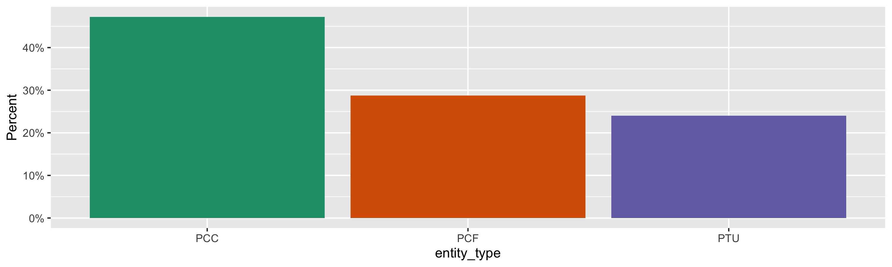
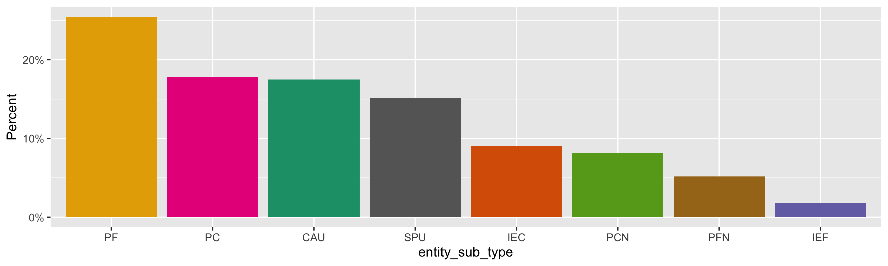
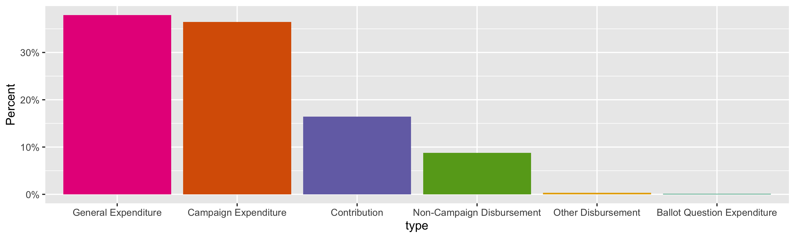
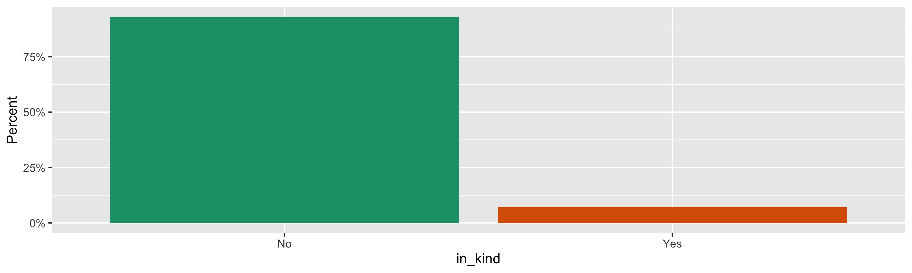
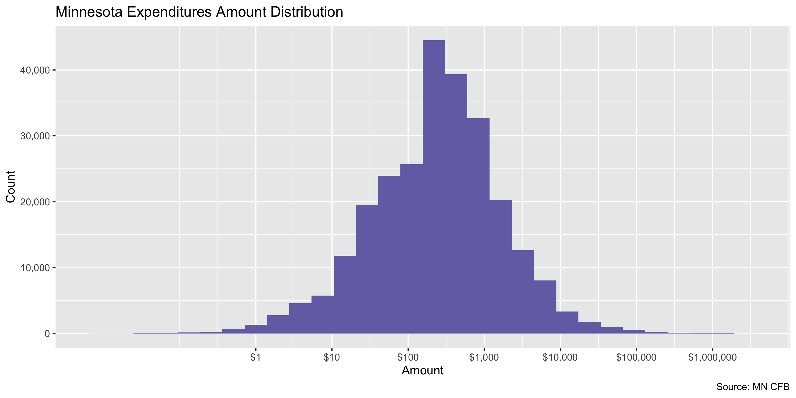
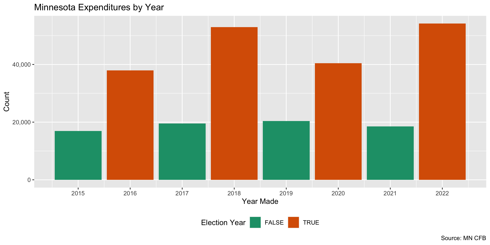
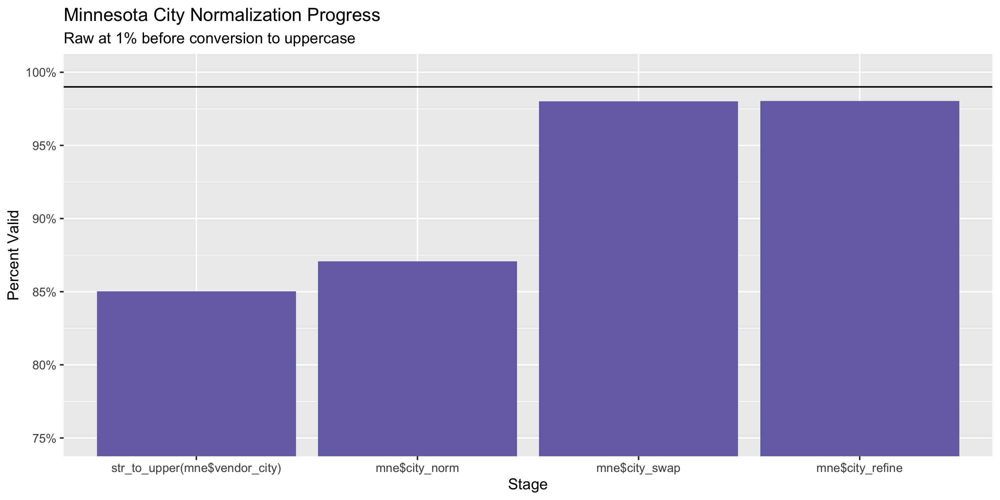
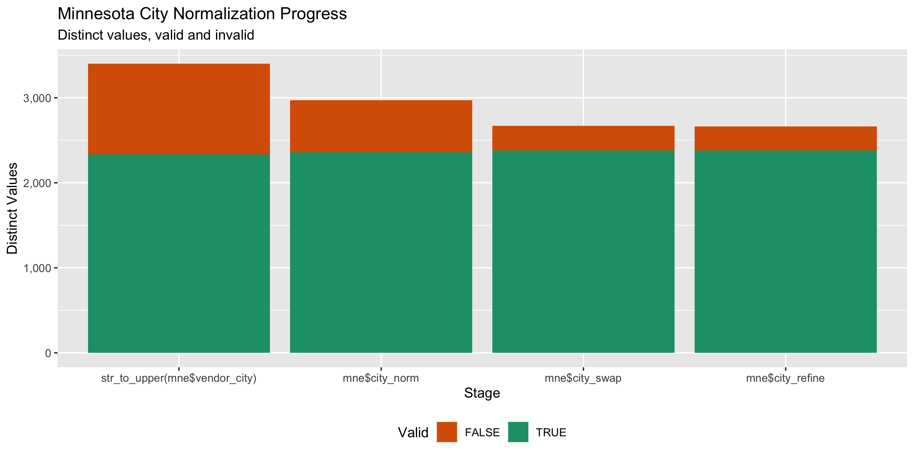

Minnesota Expenditures
================
Kiernan Nicholls & Aarushi Sahejpal
Mon Feb 27 12:16:08 2023

- <a href="#project" id="toc-project">Project</a>
- <a href="#objectives" id="toc-objectives">Objectives</a>
- <a href="#packages" id="toc-packages">Packages</a>
- <a href="#source" id="toc-source">Source</a>
- <a href="#download" id="toc-download">Download</a>
- <a href="#read" id="toc-read">Read</a>
- <a href="#explore" id="toc-explore">Explore</a>
  - <a href="#missing" id="toc-missing">Missing</a>
  - <a href="#duplicates" id="toc-duplicates">Duplicates</a>
  - <a href="#categorical" id="toc-categorical">Categorical</a>
  - <a href="#amounts" id="toc-amounts">Amounts</a>
  - <a href="#dates" id="toc-dates">Dates</a>
- <a href="#wrangle" id="toc-wrangle">Wrangle</a>
  - <a href="#address" id="toc-address">Address</a>
  - <a href="#zip" id="toc-zip">ZIP</a>
  - <a href="#state" id="toc-state">State</a>
  - <a href="#city" id="toc-city">City</a>
- <a href="#conclude" id="toc-conclude">Conclude</a>
- <a href="#export" id="toc-export">Export</a>
- <a href="#upload" id="toc-upload">Upload</a>

<!-- Place comments regarding knitting here -->

## Project

The Accountability Project is an effort to cut across data silos and
give journalists, policy professionals, activists, and the public at
large a simple way to search across huge volumes of public data about
people and organizations.

Our goal is to standardize public data on a few key fields by thinking
of each dataset row as a transaction. For each transaction there should
be (at least) 3 variables:

1.  All **parties** to a transaction.
2.  The **date** of the transaction.
3.  The **amount** of money involved.

## Objectives

This document describes the process used to complete the following
objectives:

1.  How many records are in the database?
2.  Check for entirely duplicated records.
3.  Check ranges of continuous variables.
4.  Is there anything blank or missing?
5.  Check for consistency issues.
6.  Create a five-digit ZIP Code called `zip`.
7.  Create a `year` field from the transaction date.
8.  Make sure there is data on both parties to a transaction.

## Packages

The following packages are needed to collect, manipulate, visualize,
analyze, and communicate these results. The `pacman` package will
facilitate their installation and attachment.

``` r
if (!require("pacman")) {
  install.packages("pacman")
}
pacman::p_load(
  tidyverse, # data manipulation
  lubridate, # datetime strings
  gluedown, # printing markdown
  janitor, # clean data frames
  campfin, # custom irw tools
  aws.s3, # aws cloud storage
  refinr, # cluster & merge
  scales, # format strings
  knitr, # knit documents
  vroom, # fast reading
  rvest, # scrape html
  glue, # code strings
  here, # project paths
  httr, # http requests
  fs # local storage 
)
```

This diary was run using `campfin` version 1.0.8.

``` r
packageVersion("campfin")
#> [1] '1.0.8'
```

This document should be run as part of the `R_tap` project, which lives
as a sub-directory of the more general, language-agnostic
[`irworkshop/accountability_datacleaning`](https://github.com/irworkshop/accountability_datacleaning)
GitHub repository.

The `R_tap` project uses the [RStudio
projects](https://support.rstudio.com/hc/en-us/articles/200526207-Using-Projects)
feature and should be run as such. The project also uses the dynamic
`here::here()` tool for file paths relative to *your* machine.

``` r
# where does this document knit?
here::i_am("mn/expends/docs/mn_expends_diary.Rmd")
```

## Source

Data is obtained from the [Minnestoa Campaign Finance Board
(CFB)](https://cfb.mn.gov/).

The [CFB’s
mission](https://cfb.mn.gov/citizen-resources/the-board/more-about-the-board/mission/)
is to regulating [campaign
finance](https://cfb.mn.gov/citizen-resources/board-programs/overview/campaign-finance/),
among other things.

> The Campaign Finance and Public Disclosure Board was established by
> the state legislature in 1974 and is charged with the administration
> of Minnesota Statutes, Chapter 10A, the Campaign Finance and Public
> Disclosure Act, as well as portions of Chapter 211B, the Fair Campaign
> Practices act.

> The Board’s mission is to promote public confidence in state
> government decision-making through development, administration, and
> enforcement of disclosure and public financing programs which will
> ensure public access to and understanding of information filed with
> the Board.

> The Board is responsible for administration of statutes governing the
> financial operations of associations that seek to influence Minnesota
> state elections. The Board’s jurisdiction is established by Minnesota
> Statutes Chapter 10A. The Board does not have jurisdiction over
> federal elections, which are regulated by the Federal Election
> Commission, nor does the Board have jurisdiction over local elections.

We can go to the Minnesota Statutes, Chapter 10A, to see the exact scope
of the data collection we will be wrangling.

> [Subd. 9. Campaign
> expenditure](https://www.revisor.mn.gov/statutes/cite/10A.01#stat.10A.01.9).
> “Campaign expenditure” or “expenditure” means a purchase or payment of
> money or anything of value, or an advance of credit, made or incurred
> for the purpose of influencing the nomination or election of a
> candidate or for the purpose of promoting or defeating a ballot
> question. An expenditure is considered to be made in the year in which
> the candidate made the purchase of goods or services or incurred an
> obligation to pay for goods or services. An expenditure made for the
> purpose of defeating a candidate is considered made for the purpose of
> influencing the nomination or election of that candidate or any
> opponent of that candidate… “Expenditure” does not include:  
> (1) noncampaign disbursements as defined in subdivision 26;  
> (2) services provided without compensation by an individual
> volunteering personal time on behalf of a candidate, ballot question,
> political committee, political fund, principal campaign committee, or
> party unit; (3) the publishing or broadcasting of news items or
> editorial comments by the news media; or (4) an individual’s
> unreimbursed personal use of an automobile owned by the individual and
> used by the individual while volunteering personal time.

## Download

``` r
raw_head <- HEAD(
  "https://cfb.mn.gov/reports-and-data/self-help/data-downloads/campaign-finance/",
  query = list(download = "-1890073264")
)
raw_name <- headers(raw_head)[["content-disposition"]]
raw_name <- str_extract(raw_name, "(?<=\")(.*)(?=\")")
```

``` r
raw_dir <- dir_create(here("mn", "expends", "data", "raw"))
raw_csv <- path(raw_dir, raw_name)
```

``` r
if (!file_exists(raw_csv)) {
  GET(raw_head$url, write_disk(raw_csv))
}
```

## Read

``` r
mne <- read_delim(
  file = raw_csv,
  delim = ",",
  escape_backslash = FALSE,
  escape_double = FALSE,
  col_types = cols(
    .default = col_character(),
    `Amount` = col_double(),
    `Unpaid amount` = col_double(),
    `Date` = col_date("%m/%d/%Y"),
    `Year` = col_integer()
  )
)
```

``` r
mne <- clean_names(mne, case = "snake")
```

## Explore

There are 260,873 rows of 20 columns. Each record represents a single
expenditures made by a campaign to a vendor or as a contribution to
another campaign.

``` r
glimpse(mne)
#> Rows: 260,873
#> Columns: 20
#> $ committee_reg_num          <chr> "15488", "15488", "15497", "16089", "16276", "16276", "16276", "16276", "16676", "1…
#> $ committee_name             <chr> "Anderson, Patricia State Aud Committee", "Anderson, Patricia State Aud Committee",…
#> $ entity_type                <chr> "PCC", "PCC", "PCC", "PCC", "PCC", "PCC", "PCC", "PCC", "PCC", "PCC", "PCC", "PCC",…
#> $ entity_sub_type            <chr> NA, NA, NA, NA, NA, NA, NA, NA, NA, NA, NA, NA, NA, NA, NA, NA, NA, NA, NA, NA, NA,…
#> $ vendor_name                <chr> NA, NA, "Sartell Music Association", NA, NA, NA, "Parks & Trails Council", "USPSA T…
#> $ vendor_address_1           <chr> "5 Apple Orchard Ct", "5 Apple Orchard Ct", "PO Box 242", NA, "5300 Painter Creek G…
#> $ vendor_address_2           <chr> NA, NA, NA, NA, NA, NA, NA, NA, NA, "P.O. Box 363", "P.O. Box 363", NA, "Apt. #109"…
#> $ vendor_city                <chr> "Dellwood", "Dellwood", "Sartell", NA, "Maple Plain", "Monticello", "St Paul", "Fre…
#> $ vendor_state               <chr> "MN", "MN", "MN", NA, "MN", "MN", "MN", "CA", NA, "MN", "MN", NA, "MN", "MN", NA, "…
#> $ vendor_zip                 <chr> "55110", "55110", "56377", NA, "55359", "55362", "55101", "94539", NA, "56024", "56…
#> $ amount                     <dbl> 500.00, 300.00, 5660.01, 1000.00, 300.00, 300.00, 500.00, 400.00, 850.00, 45.00, 45…
#> $ unpaid_amount              <dbl> 0, 0, 0, 0, 0, 0, 0, 0, 0, 0, 0, 0, 0, 0, 0, 0, 0, 0, 0, 0, 0, 0, 0, 0, 0, 0, 0, 0,…
#> $ date                       <date> 2015-04-09, 2015-06-26, 2015-08-06, 2015-06-26, 2015-07-13, 2015-07-13, 2015-07-22…
#> $ purpose                    <chr> "repayment of loan", "repayment of loan", "contribution upon termination", NA, "ret…
#> $ year                       <int> 2015, 2015, 2015, 2015, 2015, 2015, 2015, 2015, 2015, 2015, 2015, 2015, 2015, 2015,…
#> $ type                       <chr> "Non-Campaign Disbursement", "Non-Campaign Disbursement", "Other Disbursement", "Co…
#> $ in_kind_descr              <chr> NA, NA, NA, NA, NA, NA, NA, NA, NA, NA, NA, NA, NA, NA, NA, NA, NA, NA, NA, NA, NA,…
#> $ in_kind                    <chr> "No", "No", "No", "No", "No", "No", "No", "No", "No", "No", "No", "No", "No", "No",…
#> $ affected_committee_name    <chr> NA, NA, NA, "Lohmer, Kathleen M House Committee", NA, NA, NA, NA, "Watonwan County …
#> $ affected_committee_reg_num <chr> NA, NA, NA, "16745", NA, NA, NA, NA, "20068", NA, NA, "41012", NA, NA, "17277", NA,…
tail(mne)
#> # A tibble: 6 × 20
#>   committee_…¹ commi…² entit…³ entit…⁴ vendo…⁵ vendo…⁶ vendo…⁷ vendo…⁸ vendo…⁹ vendo…˟ amount unpai…˟ date       purpose
#>   <chr>        <chr>   <chr>   <chr>   <chr>   <chr>   <chr>   <chr>   <chr>   <chr>    <dbl>   <dbl> <date>     <chr>  
#> 1 80031        IAFF F… PCF     PFN     Elizab… 2004 E… <NA>    Burnsv… MN      55306      600       0 2020-07-01 Other …
#> 2 80032        MN All… PCF     PFN     <NA>    <NA>    <NA>    <NA>    <NA>    <NA>       500       0 2018-02-10 <NA>   
#> 3 80032        MN All… PCF     PFN     <NA>    <NA>    <NA>    <NA>    <NA>    <NA>       250       0 2020-02-02 <NA>   
#> 4 80032        MN All… PCF     PFN     <NA>    <NA>    <NA>    <NA>    <NA>    <NA>       250       0 2020-02-02 <NA>   
#> 5 80032        MN All… PCF     PFN     <NA>    <NA>    <NA>    <NA>    <NA>    <NA>       500       0 2020-02-02 <NA>   
#> 6 80032        MN All… PCF     PFN     <NA>    <NA>    <NA>    <NA>    <NA>    <NA>       500       0 2021-12-11 <NA>   
#> # … with 6 more variables: year <int>, type <chr>, in_kind_descr <chr>, in_kind <chr>, affected_committee_name <chr>,
#> #   affected_committee_reg_num <chr>, and abbreviated variable names ¹​committee_reg_num, ²​committee_name, ³​entity_type,
#> #   ⁴​entity_sub_type, ⁵​vendor_name, ⁶​vendor_address_1, ⁷​vendor_address_2, ⁸​vendor_city, ⁹​vendor_state, ˟​vendor_zip,
#> #   ˟​unpaid_amount
```

### Missing

Columns vary in their degree of missing values.

``` r
col_stats(mne, count_na)
#> # A tibble: 20 × 4
#>    col                        class       n       p
#>    <chr>                      <chr>   <int>   <dbl>
#>  1 committee_reg_num          <chr>       0 0      
#>  2 committee_name             <chr>     744 0.00285
#>  3 entity_type                <chr>       0 0      
#>  4 entity_sub_type            <chr>  149492 0.573  
#>  5 vendor_name                <chr>   48162 0.185  
#>  6 vendor_address_1           <chr>   45241 0.173  
#>  7 vendor_address_2           <chr>  242337 0.929  
#>  8 vendor_city                <chr>   44500 0.171  
#>  9 vendor_state               <chr>   44510 0.171  
#> 10 vendor_zip                 <chr>   47746 0.183  
#> 11 amount                     <dbl>       0 0      
#> 12 unpaid_amount              <dbl>       0 0      
#> 13 date                       <date>      0 0      
#> 14 purpose                    <chr>   42570 0.163  
#> 15 year                       <int>       0 0      
#> 16 type                       <chr>       0 0      
#> 17 in_kind_descr              <chr>  242915 0.931  
#> 18 in_kind                    <chr>       0 0      
#> 19 affected_committee_name    <chr>  218305 0.837  
#> 20 affected_committee_reg_num <chr>  218069 0.836
```

We can flag any record missing a key variable needed to identify a
transaction.

``` r
key_vars <- c("date", "committee_name", "amount", "vendor_name")
mne <- flag_na(mne, all_of(key_vars))
sum(mne$na_flag)
#> [1] 48822
```

``` r
mne %>% 
  filter(na_flag) %>% 
  select(all_of(key_vars))
#> # A tibble: 48,822 × 4
#>    date       committee_name                         amount vendor_name
#>    <date>     <chr>                                   <dbl> <chr>      
#>  1 2015-04-09 Anderson, Patricia State Aud Committee   500  <NA>       
#>  2 2015-06-26 Anderson, Patricia State Aud Committee   300  <NA>       
#>  3 2015-06-26 Charron, Michael House Committee        1000  <NA>       
#>  4 2015-07-13 Sawatzke, Pat Senate Committee           300  <NA>       
#>  5 2015-07-13 Sawatzke, Pat Senate Committee           300  <NA>       
#>  6 2015-08-04 Branstad, John House Committee           850  <NA>       
#>  7 2015-06-29 Cermak, Grant J House Committee         2259. <NA>       
#>  8 2015-09-03 McKendry, Laurie Senate Committee       1000  <NA>       
#>  9 2015-10-10 Abeler II, Jim J House Committee         497. <NA>       
#> 10 2015-10-10 Hooten, Carol Dist Court Committee       103. <NA>       
#> # … with 48,812 more rows
```

### Duplicates

We can also flag any record completely duplicated across every column.

``` r
mne <- flag_dupes(mne, everything())
sum(mne$dupe_flag)
#> [1] 12053
```

``` r
mne %>% 
  filter(dupe_flag) %>% 
  select(all_of(key_vars)) %>% 
  arrange(date, amount, vendor_name)
#> # A tibble: 12,053 × 4
#>    date       committee_name                amount vendor_name    
#>    <date>     <chr>                          <dbl> <chr>          
#>  1 2015-01-01 Dill, David K House Committee   2.77 Dill, David K  
#>  2 2015-01-01 Dill, David K House Committee   2.77 Dill, David K  
#>  3 2015-01-01 Dill, David K House Committee   2.77 Dill, David K  
#>  4 2015-01-01 Dill, David K House Committee   4.11 Dill, David K  
#>  5 2015-01-01 Dill, David K House Committee   4.11 Dill, David K  
#>  6 2015-01-01 Dill, David K House Committee   5.96 Dill, David K  
#>  7 2015-01-01 Dill, David K House Committee   5.96 Dill, David K  
#>  8 2015-01-01 Dill, David K House Committee   6.39 Dill, David K  
#>  9 2015-01-01 Dill, David K House Committee   6.39 Dill, David K  
#> 10 2015-01-01 IFAPAC Minn                   285.   NAIFA Minnesota
#> # … with 12,043 more rows
```

### Categorical

``` r
col_stats(mne, n_distinct)
#> # A tibble: 22 × 4
#>    col                        class      n          p
#>    <chr>                      <chr>  <int>      <dbl>
#>  1 committee_reg_num          <chr>   2404 0.00922   
#>  2 committee_name             <chr>   2366 0.00907   
#>  3 entity_type                <chr>      3 0.0000115 
#>  4 entity_sub_type            <chr>     12 0.0000460 
#>  5 vendor_name                <chr>  25904 0.0993    
#>  6 vendor_address_1           <chr>  29993 0.115     
#>  7 vendor_address_2           <chr>   1977 0.00758   
#>  8 vendor_city                <chr>   3932 0.0151    
#>  9 vendor_state               <chr>     84 0.000322  
#> 10 vendor_zip                 <chr>   4356 0.0167    
#> 11 amount                     <dbl>  59864 0.229     
#> 12 unpaid_amount              <dbl>    875 0.00335   
#> 13 date                       <date>  2922 0.0112    
#> 14 purpose                    <chr>  69544 0.267     
#> 15 year                       <int>      8 0.0000307 
#> 16 type                       <chr>      6 0.0000230 
#> 17 in_kind_descr              <chr>   5286 0.0203    
#> 18 in_kind                    <chr>      2 0.00000767
#> 19 affected_committee_name    <chr>   1521 0.00583   
#> 20 affected_committee_reg_num <chr>   1555 0.00596   
#> 21 na_flag                    <lgl>      2 0.00000767
#> 22 dupe_flag                  <lgl>      2 0.00000767
```

<!-- --><!-- --><!-- --><!-- -->

### Amounts

``` r
# fix floating point precision
mne$amount <- round(mne$amount, digits = 2)
```

``` r
summary(mne$amount)
#>      Min.   1st Qu.    Median      Mean   3rd Qu.      Max. 
#>    -962.1      68.4     262.5    1912.0     887.5 3000000.0
mean(mne$amount <= 0)
#> [1] 0.0002184971
```

These are the records with the minimum and maximum amounts.

``` r
glimpse(mne[c(which.max(mne$amount), which.min(mne$amount)), ])
#> Rows: 2
#> Columns: 22
#> $ committee_reg_num          <chr> "41174", "20003"
#> $ committee_name             <chr> "DGA Victory Fund", "MN DFL State Central Committee"
#> $ entity_type                <chr> "PCF", "PTU"
#> $ entity_sub_type            <chr> "PC", "SPU"
#> $ vendor_name                <chr> "Democratic Governors Association", "Nathaniel Leonard"
#> $ vendor_address_1           <chr> "1225 I St NW", "958 Marshall Ave #2"
#> $ vendor_address_2           <chr> NA, NA
#> $ vendor_city                <chr> "Washington", "Saint Paul"
#> $ vendor_state               <chr> "DC", "MN"
#> $ vendor_zip                 <chr> "20005", "55104"
#> $ amount                     <dbl> 3000000.00, -962.12
#> $ unpaid_amount              <dbl> 0, 0
#> $ date                       <date> 2018-10-18, 2015-10-20
#> $ purpose                    <chr> "Contribution", "Voided Check"
#> $ year                       <int> 2018, 2015
#> $ type                       <chr> "General Expenditure", "General Expenditure"
#> $ in_kind_descr              <chr> NA, NA
#> $ in_kind                    <chr> "No", "No"
#> $ affected_committee_name    <chr> NA, NA
#> $ affected_committee_reg_num <chr> NA, NA
#> $ na_flag                    <lgl> FALSE, FALSE
#> $ dupe_flag                  <lgl> FALSE, FALSE
```

The distribution of amount values are typically log-normal.

<!-- -->

### Dates

We can add the calendar year from `date` with `lubridate::year()`

``` r
mne <- mutate(mne, year = year(date))
```

``` r
min(mne$date)
#> [1] "2015-01-01"
sum(mne$year < 2000)
#> [1] 0
max(mne$date)
#> [1] "2022-12-31"
sum(mne$date > today())
#> [1] 0
```

It’s common to see an increase in the number of contributions in
elections years.

<!-- -->

## Wrangle

To improve the searchability of the database, we will perform some
consistent, confident string normalization. For geographic variables
like city names and ZIP codes, the corresponding `campfin::normal_*()`
functions are tailor made to facilitate this process.

### Address

For the street `addresss` variable, the `campfin::normal_address()`
function will force consistence case, remove punctuation, and abbreviate
official USPS suffixes.

``` r
addr_norm <- mne %>% 
  distinct(vendor_address_1, vendor_address_2) %>% 
  mutate(
    across(
      .cols = c(vendor_address_1, vendor_address_2),
      .fns = list(xnorm = normal_address),
      abbs = usps_street,
      na_rep = TRUE
    )
  ) %>% 
  unite(
    col = address_norm,
    ends_with("_xnorm"),
    sep = " ",
    remove = TRUE,
    na.rm = TRUE
  ) %>% 
  mutate(across(address_norm, na_if, ""))
```

``` r
addr_norm
#> # A tibble: 30,951 × 3
#>    vendor_address_1         vendor_address_2 address_norm               
#>    <chr>                    <chr>            <chr>                      
#>  1 5 Apple Orchard Ct       <NA>             5 APPLE ORCHARD CT         
#>  2 PO Box 242               <NA>             PO BOX 242                 
#>  3 <NA>                     <NA>             <NA>                       
#>  4 5300 Painter Creek Green <NA>             5300 PAINTER CREEK GRN     
#>  5 5403 85th St NE          <NA>             5403 85TH ST NE            
#>  6 275 4th ST E, #250       <NA>             275 4TH ST E 250           
#>  7 PO Box 15668             <NA>             PO BOX 15668               
#>  8 10 Industrial Dr.        P.O. Box 363     10 INDUSTRIAL DR PO BOX 363
#>  9 8201 46th Avenue North   Apt. #109        8201 46TH AVENUE N APT 109 
#> 10 2325 Fairview Ave N      <NA>             2325 FAIRVIEW AVE N        
#> # … with 30,941 more rows
```

``` r
mne <- left_join(mne, addr_norm)
```

### ZIP

For ZIP codes, the `campfin::normal_zip()` function will attempt to
create valid *five* digit codes by removing the ZIP+4 suffix and
returning leading zeroes dropped by other programs like Microsoft Excel.

``` r
mne <- mne %>% 
  mutate(
    zip_norm = normal_zip(
      zip = vendor_zip,
      na_rep = TRUE
    )
  )
```

``` r
progress_table(
  mne$vendor_zip,
  mne$zip_norm,
  compare = valid_zip
)
#> # A tibble: 2 × 6
#>   stage          prop_in n_distinct prop_na n_out n_diff
#>   <chr>            <dbl>      <dbl>   <dbl> <dbl>  <dbl>
#> 1 mne$vendor_zip   0.997       4356   0.183   626    108
#> 2 mne$zip_norm     0.998       4353   0.183   523    105
```

### State

Valid two digit state abbreviations can be made using the
`campfin::normal_state()` function.

``` r
mne <- mne %>% 
  mutate(
    state_norm = normal_state(
      state = vendor_state,
      abbreviate = TRUE,
      na_rep = TRUE
    )
  )
```

``` r
mne %>% 
  filter(vendor_state != state_norm) %>% 
  count(vendor_state, state_norm, sort = TRUE)
#> # A tibble: 5 × 3
#>   vendor_state state_norm     n
#>   <chr>        <chr>      <int>
#> 1 Au           AU            10
#> 2 mn           MN             5
#> 3 Mi           MI             2
#> 4 Mn           MN             2
#> 5 D.           D              1
```

``` r
progress_table(
  mne$vendor_state,
  mne$state_norm,
  compare = valid_state
)
#> # A tibble: 2 × 6
#>   stage            prop_in n_distinct prop_na n_out n_diff
#>   <chr>              <dbl>      <dbl>   <dbl> <dbl>  <dbl>
#> 1 mne$vendor_state   0.999         84   0.171   315     30
#> 2 mne$state_norm     0.999         78   0.171   264     24
```

### City

Cities are the most difficult geographic variable to normalize, simply
due to the wide variety of valid cities and formats.

#### Normal

The `campfin::normal_city()` function is a good start, again converting
case, removing punctuation, but *expanding* USPS abbreviations. We can
also remove `invalid_city` values.

``` r
norm_city <- mne %>% 
  distinct(vendor_city, state_norm, zip_norm) %>% 
  mutate(
    city_norm = normal_city(
      city = vendor_city, 
      abbs = usps_city,
      states = c("MN", "DC", "MINNESOTA"),
      na = invalid_city,
      na_rep = TRUE
    )
  )
```

#### Swap

We can further improve normalization by comparing our normalized value
against the *expected* value for that record’s state abbreviation and
ZIP code. If the normalized value is either an abbreviation for or very
similar to the expected value, we can confidently swap those two.

``` r
norm_city <- norm_city %>% 
  left_join(
    y = zipcodes,
    by = c(
      "state_norm" = "state",
      "zip_norm" = "zip"
    )
  ) %>% 
  rename(city_match = city) %>% 
  mutate(
    match_abb = is_abbrev(city_norm, city_match),
    match_dist = str_dist(city_norm, city_match),
    city_swap = if_else(
      condition = !is.na(match_dist) & (match_abb | match_dist == 1),
      true = city_match,
      false = city_norm
    )
  ) %>% 
  select(
    -city_match,
    -match_dist,
    -match_abb
  )
```

``` r
mne <- left_join(
  x = mne,
  y = norm_city,
  by = c(
    "vendor_city", 
    "state_norm", 
    "zip_norm"
  )
)
```

#### Refine

The [OpenRefine](https://openrefine.org/) algorithms can be used to
group similar strings and replace the less common versions with their
most common counterpart. This can greatly reduce inconsistency, but with
low confidence; we will only keep any refined strings that have a valid
city/state/zip combination.

``` r
good_refine <- mne %>% 
  mutate(
    city_refine = city_swap %>% 
      key_collision_merge() %>% 
      n_gram_merge(numgram = 1)
  ) %>% 
  filter(city_refine != city_swap) %>% 
  inner_join(
    y = zipcodes,
    by = c(
      "city_refine" = "city",
      "state_norm" = "state",
      "zip_norm" = "zip"
    )
  )
```

    #> # A tibble: 11 × 5
    #>    state_norm zip_norm city_swap      city_refine          n
    #>    <chr>      <chr>    <chr>          <chr>            <int>
    #>  1 CA         94103    SAN FRANSICSO  SAN FRANCISCO       37
    #>  2 OH         45205    CINCINATTI     CINCINNATI          19
    #>  3 CA         94103    SAN FRANSICO   SAN FRANCISCO        9
    #>  4 OH         45999    CINCINATTI     CINCINNATI           9
    #>  5 MN         55108    STAIN PAUL     SAINT PAUL           5
    #>  6 MN         56003    NO MANKATO     MANKATO              4
    #>  7 MN         55375    ST BONIFACIOUS SAINT BONIFACIUS     2
    #>  8 MN         55418    MINNEAPOLIS MN MINNEAPOLIS          2
    #>  9 CA         94158    SAN FRANSICO   SAN FRANCISCO        1
    #> 10 MN         55753    KEE WATTIN     KEEWATIN             1
    #> 11 SD         57105    SOUIX FALLS    SIOUX FALLS          1

Then we can join the refined values back to the database.

``` r
mne <- mne %>% 
  left_join(good_refine, by = names(.)) %>% 
  mutate(city_refine = coalesce(city_refine, city_swap))
```

#### Progress

Our goal for normalization was to increase the proportion of city values
known to be valid and reduce the total distinct values by correcting
misspellings.

| stage                           | prop_in | n_distinct | prop_na | n_out | n_diff |
|:--------------------------------|--------:|-----------:|--------:|------:|-------:|
| `str_to_upper(mne$vendor_city)` |   0.850 |       3400 |   0.171 | 32420 |   1067 |
| `mne$city_norm`                 |   0.871 |       2971 |   0.171 | 27948 |    613 |
| `mne$city_swap`                 |   0.980 |       2669 |   0.171 |  4320 |    291 |
| `mne$city_refine`               |   0.980 |       2662 |   0.171 |  4228 |    284 |

You can see how the percentage of valid values increased with each
stage.

<!-- -->

More importantly, the number of distinct values decreased each stage. We
were able to confidently change many distinct invalid values to their
valid equivalent.

<!-- -->

Before exporting, we can remove the intermediary normalization columns
and rename all added variables with the `_clean` suffix.

``` r
mne <- mne %>% 
  select(
    -city_norm,
    -city_swap,
    city_clean = city_refine
  ) %>% 
  rename_all(~str_replace(., "_norm", "_clean")) %>% 
  rename_all(~str_remove(., "_raw")) %>% 
  relocate(address_clean, city_clean, state_clean, .before = zip_clean)
```

## Conclude

``` r
glimpse(sample_n(mne, 1000))
#> Rows: 1,000
#> Columns: 26
#> $ committee_reg_num          <chr> "18536", "17641", "40858", "17398", "18466", "30623", "30642", "17360", "18135", "3…
#> $ committee_name             <chr> "Drost, Doria Kendra House Committee", "Johnson, Jeff R Gov Committee", "Libertaria…
#> $ entity_type                <chr> "PCC", "PCC", "PTU", "PCC", "PCC", "PCF", "PCF", "PCC", "PCC", "PCF", "PCC", "PCF",…
#> $ entity_sub_type            <chr> NA, NA, "SPU", NA, NA, "IEC", "PF", NA, NA, "PF", NA, "PF", "SPU", "PC", NA, NA, NA…
#> $ vendor_name                <chr> "Facebook", "Google", "Cambria Suites ", "Cambridge Bar & Grill", "Google", "Jackso…
#> $ vendor_address_1           <chr> "1 Hacker Way", "1600 Amphitheatre Parkway", "9655 Grove Circle North", "216 Main S…
#> $ vendor_address_2           <chr> NA, NA, NA, NA, NA, NA, "225 S 6th St Ste 3500", NA, NA, NA, NA, NA, NA, NA, NA, NA…
#> $ vendor_city                <chr> "Menlo Park", "Mountain View", " Maple Grove", "Cambridge", "Mountain View", "Minne…
#> $ vendor_state               <chr> "CA", "CA", "MN", "MN", "CA", "MN", "MN", "MN", "CA", "MN", "MN", NA, "MN", "MI", "…
#> $ vendor_zip                 <chr> "94025", "94043", "55369", "55008", "94043", "55411", "55402", "55110", "95113", "5…
#> $ amount                     <dbl> 25.00, 500.00, 131.52, 88.48, 500.00, 89.17, 600.00, 285.00, 32.22, 250.00, 215.69,…
#> $ unpaid_amount              <dbl> 0, 0, 0, 0, 0, 0, 0, 0, 0, 0, 0, 0, 0, 0, 0, 0, 0, 0, 0, 0, 0, 0, 0, 0, 0, 0, 0, 0,…
#> $ date                       <date> 2020-07-30, 2018-10-15, 2019-04-29, 2022-08-13, 2020-08-10, 2018-09-13, 2017-04-25…
#> $ purpose                    <chr> "Advertising - general: Online Social Media", "Advertising - general: online ads", …
#> $ year                       <dbl> 2020, 2018, 2019, 2022, 2020, 2018, 2017, 2018, 2022, 2021, 2017, 2021, 2022, 2021,…
#> $ type                       <chr> "Campaign Expenditure", "Campaign Expenditure", "General Expenditure", "Non-Campaig…
#> $ in_kind_descr              <chr> NA, NA, NA, NA, NA, "Salary and Benefits", NA, NA, NA, NA, "Food and Beverages: Foo…
#> $ in_kind                    <chr> "No", "No", "No", "No", "No", "Yes", "No", "No", "No", "No", "Yes", "No", "No", "No…
#> $ affected_committee_name    <chr> NA, NA, NA, NA, NA, NA, NA, NA, NA, NA, NA, "Friends of DFL Women", NA, NA, NA, NA,…
#> $ affected_committee_reg_num <chr> NA, NA, NA, NA, NA, NA, NA, NA, NA, NA, NA, "40295", NA, NA, NA, NA, "17441", NA, N…
#> $ na_flag                    <lgl> FALSE, FALSE, FALSE, FALSE, FALSE, FALSE, FALSE, FALSE, FALSE, FALSE, FALSE, TRUE, …
#> $ dupe_flag                  <lgl> FALSE, FALSE, TRUE, FALSE, TRUE, TRUE, FALSE, FALSE, FALSE, FALSE, FALSE, FALSE, FA…
#> $ address_clean              <chr> "1 HACKER WAY", "1600 AMPHITHEATRE PKWY", "9655 GROVE CIRCLE N", "216 MAIN ST S", "…
#> $ city_clean                 <chr> "MENLO PARK", "MOUNTAIN VIEW", "MAPLE GROVE", "CAMBRIDGE", "MOUNTAIN VIEW", "MINNEA…
#> $ state_clean                <chr> "CA", "CA", "MN", "MN", "CA", "MN", "MN", "MN", "CA", "MN", "MN", NA, "MN", "MI", "…
#> $ zip_clean                  <chr> "94025", "94043", "55369", "55008", "94043", "55411", "55402", "55110", "95113", "5…
```

1.  There are 260,875 records in the database.
2.  There are 12,055 duplicate records in the database.
3.  The range and distribution of `amount` and `date` seem reasonable.
4.  There are 48,822 records missing key variables.
5.  Consistency in geographic data has been improved with
    `campfin::normal_*()`.
6.  The 4-digit `year` variable has been created with
    `lubridate::year()`.

## Export

Now the file can be saved on disk for upload to the Accountability
server. We will name the object using a date range of the records
included.

``` r
min_dt <- str_remove_all(min(mne$date), "-")
max_dt <- str_remove_all(max(mne$date), "-")
(csv_ts <- paste(min_dt, max_dt, sep = "-"))
#> [1] "20150101-20221231"
```

``` r
clean_dir <- dir_create(here("mn", "expends", "data", "clean"))
clean_csv <- path(clean_dir, glue("mn_expends_{csv_ts}.csv"))
clean_rds <- path_ext_set(clean_csv, "rds")
```

``` r
write_csv(mne, clean_csv, na = "")
write_rds(mne, clean_rds, compress = "xz")
(clean_size <- file_size(clean_csv))
#> 54.4M
```

## Upload

We can use the `aws.s3::put_object()` to upload the text file to the IRW
server.

``` r
aws_key <- path("csv", basename(clean_csv))
if (!object_exists(aws_path, "publicaccountability")) {
  put_object(
    file = clean_csv,
    object = aws_key, 
    bucket = "publicaccountability",
    acl = "public-read",
    show_progress = TRUE,
    multipart = TRUE
  )
}
aws_head <- head_object(aws_path, "publicaccountability")
(aws_size <- as_fs_bytes(attr(aws_head, "content-length")))
unname(aws_size == clean_size)
```
