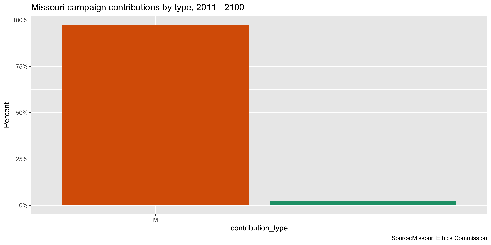
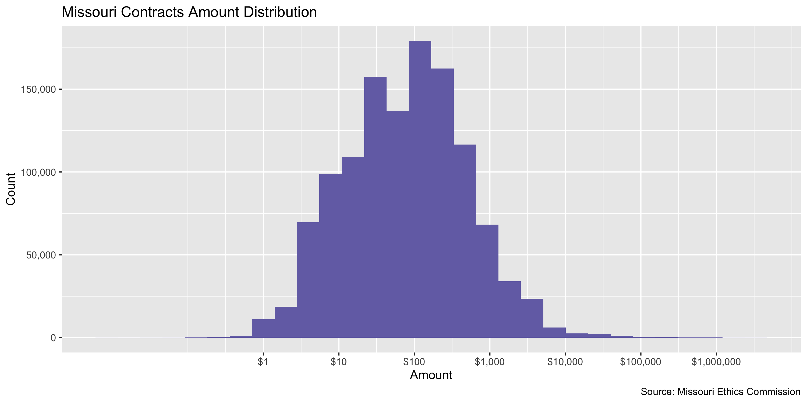
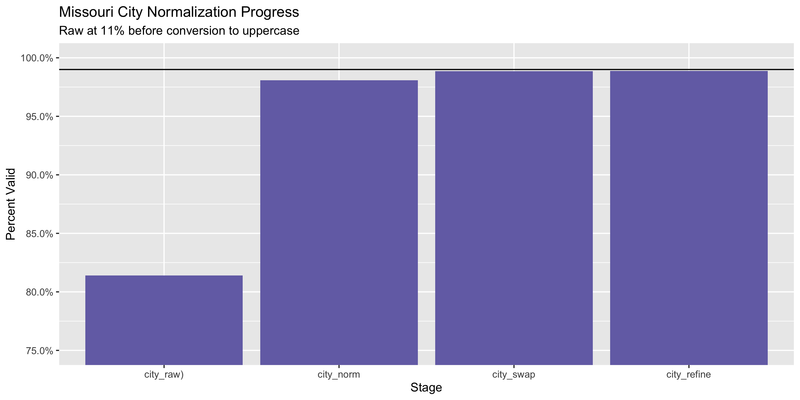

Missouri Contributions Data Diary
================
Yanqi Xu
2022-12-25 12:55:13

-   <a href="#project" id="toc-project">Project</a>
-   <a href="#objectives" id="toc-objectives">Objectives</a>
-   <a href="#packages" id="toc-packages">Packages</a>
-   <a href="#data" id="toc-data">Data</a>
-   <a href="#download" id="toc-download">Download</a>
-   <a href="#read" id="toc-read">Read</a>
-   <a href="#explore" id="toc-explore">Explore</a>
    -   <a href="#missing" id="toc-missing">Missing</a>
    -   <a href="#duplicates" id="toc-duplicates">Duplicates</a>
    -   <a href="#dates" id="toc-dates">Dates</a>
    -   <a href="#categorical" id="toc-categorical">Categorical</a>
    -   <a href="#amounts" id="toc-amounts">Amounts</a>
-   <a href="#wrangle" id="toc-wrangle">Wrangle</a>
    -   <a href="#address" id="toc-address">Address</a>
    -   <a href="#zip" id="toc-zip">ZIP</a>
    -   <a href="#state" id="toc-state">State</a>
    -   <a href="#city" id="toc-city">City</a>
-   <a href="#conclude" id="toc-conclude">Conclude</a>
-   <a href="#export" id="toc-export">Export</a>
-   <a href="#upload" id="toc-upload">Upload</a>

<!-- Place comments regarding knitting here -->

## Project

The Accountability Project is an effort to cut across data silos and
give journalists, policy professionals, activists, and the public at
large a simple way to search across huge volumes of public data about
people and organizations.

Our goal is to standardizing public data on a few key fields by thinking
of each dataset row as a transaction. For each transaction there should
be (at least) 3 variables:

1.  All **parties** to a transaction.
2.  The **date** of the transaction.
3.  The **amount** of money involved.

## Objectives

This document describes the process used to complete the following
objectives:

1.  How many records are in the database?
2.  Check for entirely duplicated records.
3.  Check ranges of continuous variables.
4.  Is there anything blank or missing?
5.  Check for consistency issues.
6.  Create a five-digit ZIP Code called `zip`.
7.  Create a `year` field from the transaction date.
8.  Make sure there is data on both parties to a transaction.

## Packages

The following packages are needed to collect, manipulate, visualize,
analyze, and communicate these results. The `pacman` package will
facilitate their installation and attachment.

The IRW’s `campfin` package will also have to be installed from GitHub.
This package contains functions custom made to help facilitate the
processing of campaign finance data.

``` r
if (!require("pacman")) install.packages("pacman")
pacman::p_load_gh("irworkshop/campfin")
pacman::p_load(
  tidyverse, # data manipulation
  lubridate, # datetime strings
  gluedown, # printing markdown
  magrittr, # pipe operators
  janitor, # clean data frames
  aws.s3, # upload to aws s3
  refinr, # cluster and merge
  scales, # format strings
  knitr, # knit documents
  vroom, # read files fast
  rvest, # html scraping
  glue, # combine strings
  here, # relative paths
  httr, # http requests
  fs # local storage 
)
```

This document should be run as part of the `R_campfin` project, which
lives as a sub-directory of the more general, language-agnostic
[`irworkshop/accountability_datacleaning`](https://github.com/irworkshop/accountability_datacleaning)
GitHub repository.

The `R_campfin` project uses the [RStudio
projects](https://support.rstudio.com/hc/en-us/articles/200526207-Using-Projects)
feature and should be run as such. The project also uses the dynamic
`here::here()` tool for file paths relative to *your* machine.

``` r
# where does this document knit?
here::here()
#> [1] "/Users/yanqixu/code/accountability_datacleaning"
```

## Data

The contribution data can be obtained from the [Missouri Ethics
Commission](https://www.mec.mo.gov/MEC/Campaign_Finance/CF_ContrCSV.aspx).
We are interested in downloading contributions received by committees,
so here we select the Itemized Contributions Received - Form CD1 A. This
data is downloaded on Dec. 23, 2020.

## Download

``` r
raw_dir <- dir_create(here("state","mo", "contribs", "data", "raw"))
source <- "Missouri Ethics Commission"
```

We can download all the data files from 2011 to 2022.

## Read

``` r
moc <- map_df(dir_ls(raw_dir,regexp = ".+new.+"),read_delim, delim = ",")

moc <- moc %>% clean_names()
```

## Explore

There are 503,247 rows of 18 columns.

``` r
glimpse(moc)
#> Rows: 503,247
#> Columns: 18
#> $ cd1_a_id          <dbl> 1327191, 1327192, 1327193, 1327194, 1327195, 1327196, 1327197, 1327198,…
#> $ mecid             <chr> "C000573", "C000573", "C000573", "C000573", "C000573", "C000573", "C000…
#> $ committee_name    <chr> "Safer Families for Missouri", "Safer Families for Missouri", "Safer Fa…
#> $ committee         <chr> NA, NA, NA, NA, NA, NA, NA, NA, NA, NA, NA, NA, NA, NA, NA, NA, NA, NA,…
#> $ company           <chr> NA, NA, NA, NA, NA, NA, NA, NA, NA, NA, NA, NA, NA, NA, NA, NA, NA, NA,…
#> $ first_name        <chr> "Robert", "J.", "Walter", "John", "John", "Bradley", "James", "John", "…
#> $ last_name         <chr> "Beezley", "Bertram", "Bley", "Boyd", "Boyd", "Bradshaw", "Brandenburg"…
#> $ address_1         <chr> "1200 E. Woodhurst R-200", "2345 Grand Blvd. #1925", "1000 W. Nifong Bl…
#> $ address_2         <chr> NA, NA, "Woodrail Centre", NA, NA, NA, NA, NA, NA, NA, "1 Metropolitan …
#> $ city              <chr> "Springfield", "Kansas City", "Columbia", "Independence", "Independence…
#> $ state             <chr> "MO", "MO", "MO", "MO", "MO", "MO", "MO", "MO", "MO", "MO", "MO", "MO",…
#> $ zip               <chr> "65804", "64108", "65203", "64051", "64051", "65804", "63105", "63459",…
#> $ employer          <chr> "Robert T. Beezley P.C.", "Bertram & Graf LLC", "Bley & Evans LC", "Boy…
#> $ occupation        <chr> "Attorney at Law", "Attorney at Law", "Attorney at Law", "Attorney at L…
#> $ date              <chr> "1/24/2020 12:00:00 AM", "1/24/2020 12:00:00 AM", "1/24/2020 12:00:00 A…
#> $ amount            <dbl> 25.00, 7.75, 25.00, 25.00, 25.00, 25.00, 12.50, 12.50, 25.00, 25.00, 25…
#> $ contribution_type <chr> "Monetary", "Monetary", "Monetary", "Monetary", "Monetary", "Monetary",…
#> $ report            <chr> "April Quarterly Report", "April Quarterly Report", "April Quarterly Re…
tail(moc)
#> # A tibble: 6 × 18
#>   cd1_a_id mecid  commi…¹ commi…² company first…³ last_…⁴ addre…⁵ addre…⁶ city  state zip   emplo…⁷
#>      <dbl> <chr>  <chr>   <chr>   <chr>   <chr>   <chr>   <chr>   <chr>   <chr> <chr> <chr> <chr>  
#> 1  1919111 A1615… "Frien… <NA>    <NA>    "Carol" Graves  9619 M… <NA>    Kans… MO    64134 Teacher
#> 2  1919112 A1615… "Frien… <NA>    <NA>    "Carol" Graves  9619 M… <NA>    Kans… MO    64134 Teacher
#> 3  1919113 A1615… "Frien… <NA>    <NA>    "Wesle… Eppers… 3600 P… <NA>    Inde… MO    64052 Not Em…
#> 4  1919114 C1310… "Dawso… <NA>    <NA>    "Danie… Imhoff  4954 S… <NA>    Spri… MO    65804 Retired
#> 5  1919129 A2221… "Shian… <NA>    <NA>    "Shian… McMahon PO Box… <NA>    Broo… MO    64628 Linn C…
#> 6  1919193 C1210… "Fitzp… Centra… <NA>     <NA>   <NA>    P.O. 7… <NA>    Jeff… MO    65102 <NA>   
#> # … with 5 more variables: occupation <chr>, date <chr>, amount <dbl>, contribution_type <chr>,
#> #   report <chr>, and abbreviated variable names ¹​committee_name, ²​committee, ³​first_name,
#> #   ⁴​last_name, ⁵​address_1, ⁶​address_2, ⁷​employer
```

Since the data is tablulated by year, we can filter out the rows that
were already included in the last update using the unique identifier
`cd1_a_id`.

``` r
n_distinct(moc$cd1_a_id) == nrow(moc)
#> [1] TRUE

nrow(moc)
#> [1] 503247
moc_prev <- read_csv(here("state","mo","contribs", "data", "previous") %>% dir_ls())

moc <- moc %>% filter(cd1_a_id %out% moc_prev$cd1_a_id)
#after filtering out old data, the dataset's row number:
nrow(moc)
#> [1] 297490
```

### Missing

Columns vary in their degree of missing values.

``` r
col_stats(moc, count_na)
#> # A tibble: 18 × 4
#>    col               class      n        p
#>    <chr>             <chr>  <int>    <dbl>
#>  1 cd1_a_id          <dbl>      0 0       
#>  2 mecid             <chr>      0 0       
#>  3 committee_name    <chr>      0 0       
#>  4 committee         <chr> 277144 0.932   
#>  5 company           <chr> 276381 0.929   
#>  6 first_name        <chr>  45131 0.152   
#>  7 last_name         <chr>  41036 0.138   
#>  8 address_1         <chr>      0 0       
#>  9 address_2         <chr> 271121 0.911   
#> 10 city              <chr>      0 0       
#> 11 state             <chr>      0 0       
#> 12 zip               <chr>    160 0.000538
#> 13 employer          <chr>  50647 0.170   
#> 14 occupation        <chr>  76220 0.256   
#> 15 date              <chr>      0 0       
#> 16 amount            <dbl>      0 0       
#> 17 contribution_type <chr>      0 0       
#> 18 report            <chr>      0 0
```

We can flag any record missing a key variable needed to identify a
transaction.

``` r
moc <- moc %>% flag_na(date, last_name, amount, committee_name,address_1)
sum(moc$na_flag)
#> [1] 41036
```

``` r
moc %>% 
  filter(na_flag) %>% 
  select(date, last_name, amount, committee,address_1)
#> # A tibble: 41,036 × 5
#>    date                   last_name amount committee                   address_1                   
#>    <chr>                  <chr>      <dbl> <chr>                       <chr>                       
#>  1 10/25/2020 12:00:00 AM <NA>         500 <NA>                        "1600 INDIAN CREEK RD"      
#>  2 10/25/2020 12:00:00 AM <NA>         500 MO OPTOMETRIC PAC           "100 EAST HIGH STREET"      
#>  3 11/28/2020 12:00:00 AM <NA>         500 LATHROP GAGE CONSULTING PAC "314 E HIGH ST"             
#>  4 10/1/2020 12:00:00 AM  <NA>         500 <NA>                        "8600 Hillcrest "           
#>  5 10/8/2020 12:00:00 AM  <NA>         200 <NA>                        "6 SW 2nd st Suite 107 "    
#>  6 10/5/2020 12:00:00 AM  <NA>         500 <NA>                        "4019 Clark Ave"            
#>  7 10/8/2020 12:00:00 AM  <NA>        2000 <NA>                        "1401 Hampton Ave 3rd Floor…
#>  8 10/6/2020 12:00:00 AM  <NA>         500 <NA>                        "6320 Manchester Ave Ste 42…
#>  9 10/14/2020 12:00:00 AM <NA>         500 <NA>                        "4501 Emanuel Cleaver II Bl…
#> 10 10/7/2020 12:00:00 AM  <NA>        2047 <NA>                        "6601 Winchester Ste 280"   
#> # … with 41,026 more rows
```

### Duplicates

We can also flag any record completely duplicated across every column.

``` r
moc <- flag_dupes(moc, -cd1_a_id)
sum(moc$dupe_flag)
#> [1] 2435
```

``` r
moc %>% 
  filter(dupe_flag) %>% 
  select(date, last_name, amount, committee,address_1)
#> # A tibble: 2,435 × 5
#>    date                   last_name amount committee                                        addre…¹
#>    <chr>                  <chr>      <dbl> <chr>                                            <chr>  
#>  1 11/17/2020 12:00:00 AM <NA>         500 "MPGA PROPANE PAC "                              "4110 …
#>  2 11/17/2020 12:00:00 AM <NA>         500 "MPGA PROPANE PAC "                              "4110 …
#>  3 9/18/2020 12:00:00 AM  <NA>        3675 "Catalyst PAC"                                   "PO Bo…
#>  4 9/18/2020 12:00:00 AM  <NA>        3675 "Catalyst PAC"                                   "PO Bo…
#>  5 6/26/2020 12:00:00 AM  <NA>        5000 "NEXUS PAC"                                      "714 L…
#>  6 6/26/2020 12:00:00 AM  <NA>        5000 "NEXUS PAC"                                      "714 L…
#>  7 10/22/2020 12:00:00 AM <NA>        1000 "AT&T MISSOURI EMPLOYEE POLITICAL ACTION COMMIT… "ONE A…
#>  8 10/22/2020 12:00:00 AM <NA>        1000 "AT&T MISSOURI EMPLOYEE POLITICAL ACTION COMMIT… "ONE A…
#>  9 10/23/2020 12:00:00 AM Kambitsch      3  <NA>                                            "2065 …
#> 10 10/23/2020 12:00:00 AM Kambitsch      3  <NA>                                            "2065 …
#> # … with 2,425 more rows, and abbreviated variable name ¹​address_1
```

### Dates

We can add the calendar year from `date` with `lubridate::year()`

``` r
moc <- moc %>% mutate(date = as.Date(date, format = "%m/%d/%Y"),
  year = year(date))
```

``` r
min(moc$date)
#> [1] "2002-07-28"
sum(moc$year < 2020)
#> [1] 70
max(moc$date)
#> [1] "2022-12-06"
sum(moc$date > today())
#> [1] 0
```

<!-- -->

### Categorical

``` r
col_stats(moc, n_distinct)
#> # A tibble: 21 × 4
#>    col               class       n          p
#>    <chr>             <chr>   <int>      <dbl>
#>  1 cd1_a_id          <dbl>  297490 1         
#>  2 mecid             <chr>    2908 0.00978   
#>  3 committee_name    <chr>    2945 0.00990   
#>  4 committee         <chr>    6334 0.0213    
#>  5 company           <chr>   11357 0.0382    
#>  6 first_name        <chr>   14600 0.0491    
#>  7 last_name         <chr>   31533 0.106     
#>  8 address_1         <chr>   98594 0.331     
#>  9 address_2         <chr>    6279 0.0211    
#> 10 city              <chr>    7360 0.0247    
#> 11 state             <chr>      76 0.000255  
#> 12 zip               <chr>   19663 0.0661    
#> 13 employer          <chr>   29094 0.0978    
#> 14 occupation        <chr>   15741 0.0529    
#> 15 date              <date>   1009 0.00339   
#> 16 amount            <dbl>    7916 0.0266    
#> 17 contribution_type <chr>       2 0.00000672
#> 18 report            <chr>     100 0.000336  
#> 19 na_flag           <lgl>       2 0.00000672
#> 20 dupe_flag         <lgl>       2 0.00000672
#> 21 year              <dbl>       6 0.0000202
```

<!-- -->

### Amounts

``` r
summary(moc$amount)
#>      Min.   1st Qu.    Median      Mean   3rd Qu.      Max. 
#>   -1304.1      11.0      47.1     476.0     200.0 1996059.2
mean(moc$amount <= 0)
#> [1] 0.0002285791
```

These are the records with the minimum and maximum amounts.

``` r
glimpse(moc[c(which.max(moc$amount), which.min(moc$amount)), ])
#> Rows: 2
#> Columns: 21
#> $ cd1_a_id          <dbl> 1740820, 1708931
#> $ mecid             <chr> "C221856", "C180609"
#> $ committee_name    <chr> "Mid-America Carpenters Regional Council Missouri-Kansas Area Political…
#> $ committee         <chr> "Carpenters Help in the Political Process (CHIPP)", NA
#> $ company           <chr> NA, NA
#> $ first_name        <chr> NA, "Michael"
#> $ last_name         <chr> NA, "Moehn"
#> $ address_1         <chr> "1401 Hampton Avenue", "31 Logan Rd"
#> $ address_2         <chr> NA, NA
#> $ city              <chr> "St Louis", "Alton"
#> $ state             <chr> "MO", "IL"
#> $ zip               <chr> "63139", "620023206"
#> $ employer          <chr> NA, "AMS Ameren Services"
#> $ occupation        <chr> NA, "ZA0009 - EVP & Chief Financial Officer"
#> $ date              <date> 2022-03-01, 2021-12-28
#> $ amount            <dbl> 1996059.18, -1304.07
#> $ contribution_type <chr> "Monetary", "Monetary"
#> $ report            <chr> "8 Day Before General Municipal Election-4/5/2022", "January Quarterly …
#> $ na_flag           <lgl> TRUE, FALSE
#> $ dupe_flag         <lgl> FALSE, FALSE
#> $ year              <dbl> 2022, 2021
```

<!-- -->

## Wrangle

To improve the searchability of the database, we will perform some
consistent, confident string normalization. For geographic variables
like city names and ZIP codes, the corresponding `campfin::normal_*()`
functions are tailor made to facilitate this process.

### Address

For the street `addresss` variable, the `campfin::normal_address()`
function will force consistence case, remove punctuation, and abbreviate
official USPS suffixes.

``` r
moc <- moc %>% 
  unite(
    col = address_full,
    starts_with("address"),
    sep = " ",
    remove = FALSE,
    na.rm = TRUE
  ) %>% 
  mutate(
    address_norm = normal_address(
      address = address_full,
      abbs = usps_street,
      na_rep = TRUE
    )
  ) %>% 
  select(-address_full)
```

``` r
moc %>% 
  select(contains("address")) %>% 
  distinct() %>% 
  sample_n(10)
#> # A tibble: 10 × 3
#>    address_1                  address_2 address_norm           
#>    <chr>                      <chr>     <chr>                  
#>  1 5730 county loop 182       <NA>      5730 COUNTY LOOP 182   
#>  2 341 Towne Vue Dr           <NA>      341 TOWNE VUE DR       
#>  3 452 gunnison gorge dr      <NA>      452 GUNNISON GORGE DR  
#>  4 1725 N.W. 9th St.          <NA>      1725 NW 9TH ST         
#>  5 9 Wilshire Terr            <NA>      9 WILSHIRE TER         
#>  6 25392 Royal Point Drive    <NA>      25392 ROYAL POINT DR   
#>  7 3605 Osage Beach Pkwy      <NA>      3605 OSAGE BEACH PKWY  
#>  8 7 DOUGLASS LANE            <NA>      7 DOUGLASS LN          
#>  9 966Victoria Ave            <NA>      966VICTORIA AVE        
#> 10 6676 American Setter Drive <NA>      6676 AMERICAN SETTER DR
```

### ZIP

For ZIP codes, the `campfin::normal_zip()` function will attempt to
create valid *five* digit codes by removing the ZIP+4 suffix and
returning leading zeroes dropped by other programs like Microsoft Excel.

``` r
moc <- moc %>% 
  mutate(
    zip_norm = normal_zip(
      zip = zip,
      na_rep = TRUE
    )
  )
```

``` r
progress_table(
  moc$zip,
  moc$zip_norm,
  compare = valid_zip
)
#> # A tibble: 2 × 6
#>   stage        prop_in n_distinct  prop_na n_out n_diff
#>   <chr>          <dbl>      <dbl>    <dbl> <dbl>  <dbl>
#> 1 moc$zip        0.731      19663 0.000538 80064  13580
#> 2 moc$zip_norm   0.995       8021 0.000669  1460    672
```

### State

Valid two digit state abbreviations can be made using the
`campfin::normal_state()` function.

``` r
moc <- moc %>% 
  mutate(
    state_norm = normal_state(
      state = state,
      abbreviate = TRUE,
      na_rep = TRUE,
      valid = valid_state
    )
  )
```

``` r
moc %>% 
  filter(state != state_norm) %>% 
  count(state, state_norm, sort = TRUE)
#> # A tibble: 10 × 3
#>    state state_norm     n
#>    <chr> <chr>      <int>
#>  1 Mo    MO           785
#>  2 mo    MO           100
#>  3 Ne    NE            11
#>  4 mO    MO             3
#>  5 Fl    FL             2
#>  6 Ks    KS             2
#>  7 Ca    CA             1
#>  8 Co    CO             1
#>  9 Il    IL             1
#> 10 Mi    MI             1
```

``` r
progress_table(
  moc$state,
  moc$state_norm,
  compare = valid_state
)
#> # A tibble: 2 × 6
#>   stage          prop_in n_distinct   prop_na n_out n_diff
#>   <chr>            <dbl>      <dbl>     <dbl> <dbl>  <dbl>
#> 1 moc$state        0.997         76 0           920     20
#> 2 moc$state_norm   1             57 0.0000437     0      1
```

### City

Cities are the most difficult geographic variable to normalize, simply
due to the wide variety of valid cities and formats.

#### Normal

The `campfin::normal_city()` function is a good start, again converting
case, removing punctuation, but *expanding* USPS abbreviations. We can
also remove `invalid_city` values.

``` r
moc <- moc %>% 
  mutate(
    city_norm = normal_city(
      city = city, 
      abbs = usps_city,
      states = c("MO", "DC", "MISSOURI"),
      na = invalid_city,
      na_rep = TRUE
    )
  )
```

#### Swap

We can further improve normalization by comparing our normalized value
against the *expected* value for that record’s state abbreviation and
ZIP code. If the normalized value is either an abbreviation for or very
similar to the expected value, we can confidently swap those two.

``` r
moc <- moc %>% 
  rename(city_raw = city) %>% 
  left_join(
    y = zipcodes,
    by = c(
      "state_norm" = "state",
      "zip_norm" = "zip"
    )
  ) %>% 
  rename(city_match = city) %>% 
  mutate(
    match_abb = is_abbrev(city_norm, city_match),
    match_dist = str_dist(city_norm, city_match),
    city_swap = if_else(
      condition = !is.na(match_dist) & (match_abb | match_dist == 1),
      true = city_match,
      false = city_norm
    )
  ) %>% 
  select(
    -city_match,
    -match_dist,
    -match_abb
  )
```

#### Refine

The [OpenRefine](https://openrefine.org/) algorithms can be used to
group similar strings and replace the less common versions with their
most common counterpart. This can greatly reduce inconsistency, but with
low confidence; we will only keep any refined strings that have a valid
city/state/zip combination.

``` r
good_refine <- moc %>% 
  mutate(
    city_refine = city_swap %>% 
      key_collision_merge() %>% 
      n_gram_merge(numgram = 1)
  ) %>% 
  filter(city_refine != city_swap) %>% 
  inner_join(
    y = zipcodes,
    by = c(
      "city_refine" = "city",
      "state_norm" = "state",
      "zip_norm" = "zip"
    )
  )
```

    #> # A tibble: 29 × 5
    #>    state_norm zip_norm city_swap        city_refine      n
    #>    <chr>      <chr>    <chr>            <chr>        <int>
    #>  1 MO         63031    FLORRISANT       FLORISSANT       4
    #>  2 MO         63368    OFFALON          O FALLON         3
    #>  3 MO         65201    COLUMBIA `       COLUMBIA         3
    #>  4 SC         29406    NORTH CHARLESTON CHARLESTON       3
    #>  5 MO         63034    FLORRISANT       FLORISSANT       2
    #>  6 MO         63073    ST ALBINS        SAINT ALBANS     2
    #>  7 MO         65203    COLUMBIA `       COLUMBIA         2
    #>  8 SD         57104    SOUIX FALLS      SIOUX FALLS      2
    #>  9 AZ         85015    PHOENIX PHOENIX  PHOENIX          1
    #> 10 CA         91106    PASENDENA        PASADENA         1
    #> # … with 19 more rows

Then we can join the refined values back to the database.

``` r
moc <- moc %>% 
  left_join(good_refine) %>% 
  mutate(city_refine = coalesce(city_refine, city_swap))
```

#### Progress

Our goal for normalization was to increase the proportion of city values
known to be valid and reduce the total distinct values by correcting
misspellings.

| stage                                                               | prop_in | n_distinct | prop_na | n_out | n_diff |
|:--------------------------------------------------------------------|--------:|-----------:|--------:|------:|-------:|
| toupper(moc$city_raw) | 0.846| 5912| 0| 45826| 2019| |moc$city_norm |   0.864 |       5037 |       0 | 40331 |   1112 |
| moc$city_swap | 0.991| 4395| 0| 2772| 464| |moc$city_refine         |   0.991 |       4373 |       0 |  2733 |    442 |

You can see how the percentage of valid values increased with each
stage.

<!-- -->

More importantly, the number of distinct values decreased each stage. We
were able to confidently change many distinct invalid values to their
valid equivalent.

<!-- -->

## Conclude

Before exporting, we can remove the intermediary normalization columns
and rename all added variables with the `_clean` suffix.

``` r
moc <- moc %>% 
  select(
    -city_norm,
    -city_swap,
    city_clean = city_refine
  ) %>% 
  rename_all(~str_replace(., "_norm", "_clean")) %>% 
  rename_all(~str_remove(., "_raw"))
```

``` r
glimpse(sample_n(moc, 50))
#> Rows: 50
#> Columns: 25
#> $ cd1_a_id          <dbl> 1769267, 1658941, 1561178, 1888638, 1791696, 1548187, 1650628, 1869689,…
#> $ mecid             <chr> "C201509", "C180553", "C000374", "C191081", "C171069", "C180576", "C180…
#> $ committee_name    <chr> "Piper for Missouri", "IST-MO Nominee PAC Number Two", "PUBLIC SAFETY C…
#> $ committee         <chr> NA, NA, NA, NA, NA, NA, NA, NA, NA, NA, NA, NA, NA, NA, NA, "Profession…
#> $ company           <chr> NA, NA, NA, NA, NA, NA, NA, NA, NA, NA, NA, NA, NA, NA, NA, NA, NA, NA,…
#> $ first_name        <chr> "Scott", "Jessica", "Ross", "Sally", "Tyrell", "BRANDON", "ROBERT", "Ch…
#> $ last_name         <chr> "Duff", "LaBozzetta", "Grundyson", "Dehner", "Aagard", "STEINAGEL", "BI…
#> $ address_1         <chr> "23 Meandering Way", "813 Westbrooke Meadows Court", "2800 Cherry St", …
#> $ address_2         <chr> NA, NA, NA, NA, NA, NA, NA, NA, NA, NA, NA, NA, NA, NA, NA, NA, NA, NA,…
#> $ city              <chr> "Round Rock", "St. Louis", "Kansas City", "St. Louis", "Salt Lake City"…
#> $ state             <chr> "TX", "MO", "MO", "MO", "UT", "MT", "MI", "MO", "MO", "MO", "CA", "MO",…
#> $ zip               <chr> "78664", "63021", "64108", "63129", "84111", "59602-7381", "48374-2568"…
#> $ employer          <chr> "Self", "Venture Cafe St. Louis", "KC MO Fire Department", "Not employe…
#> $ occupation        <chr> "Atty", "Director", "Chief Officer", "Not employed", "Grants Specialist…
#> $ date              <date> 2022-02-09, 2021-09-08, 2020-10-02, 2022-09-25, 2022-04-15, 2020-10-30…
#> $ amount            <dbl> 25.00, 10.00, 10.00, 25.00, 20.00, 16.67, 416.67, 5.00, 50.00, 100.00, …
#> $ contribution_type <chr> "Monetary", "Monetary", "Monetary", "Monetary", "Monetary", "Monetary",…
#> $ report            <chr> "April Quarterly Report", "October Quarterly Report", "AMENDED 8 Day Be…
#> $ na_flag           <lgl> FALSE, FALSE, FALSE, FALSE, FALSE, FALSE, FALSE, FALSE, FALSE, FALSE, F…
#> $ dupe_flag         <lgl> FALSE, FALSE, FALSE, FALSE, FALSE, FALSE, FALSE, FALSE, FALSE, FALSE, F…
#> $ year              <dbl> 2022, 2021, 2020, 2022, 2022, 2020, 2021, 2022, 2022, 2022, 2022, 2022,…
#> $ address_clean     <chr> "23 MEANDERING WAY", "813 WESTBROOKE MEADOWS CT", "2800 CHERRY ST", "54…
#> $ zip_clean         <chr> "78664", "63021", "64108", "63129", "84111", "59602", "48374", "64118",…
#> $ state_clean       <chr> "TX", "MO", "MO", "MO", "UT", "MT", "MI", "MO", "MO", "MO", "CA", "MO",…
#> $ city_clean        <chr> "ROUND ROCK", "ST LOUIS", "KANSAS CITY", "SAINT LOUIS", "SALT LAKE CITY…
```

1.  There are 297,490 records in the database.
2.  There are 2,435 duplicate records in the database.
3.  The range and distribution of `amount` and `date` seem reasonable.
4.  There are 41,036 records missing key variables.
5.  Consistency in geographic data has been improved with
    `campfin::normal_*()`.
6.  The 4-digit `year` variable has been created with
    `lubridate::year()`.

## Export

Now the file can be saved on disk for upload to the Accountability
server.

``` r
clean_dir <- dir_create(here("state","mo", "contribs", "data", "clean"))
clean_path <- path(clean_dir, "mo_contribs_clean_2020-2022.csv")
write_csv(moc, clean_path, na = "")
(clean_size <- file_size(clean_path))
#> 68.7M
file_encoding(clean_path) %>% 
  mutate(across(path, path.abbrev))
#> # A tibble: 1 × 3
#>   path                                                                                mime  charset
#>   <fs::path>                                                                          <chr> <chr>  
#> 1 …tability_datacleaning/state/mo/contribs/data/clean/mo_contribs_clean_2020-2022.csv <NA>  <NA>
```

## Upload

We can use the `aws.s3::put_object()` to upload the text file to the IRW
server.

``` r
s3_path <- path("csv", basename(clean_path))
if (!object_exists(s3_path, "publicaccountability")) {
  put_object(
    file = clean_path,
    object = s3_path, 
    bucket = "publicaccountability",
    acl = "public-read",
    show_progress = TRUE,
    multipart = TRUE
  )
}
s3_head <- head_object(s3_path, "publicaccountability")
(s3_size <- as_fs_bytes(attr(s3_head, "content-length")))
unname(s3_size == clean_size)
```
