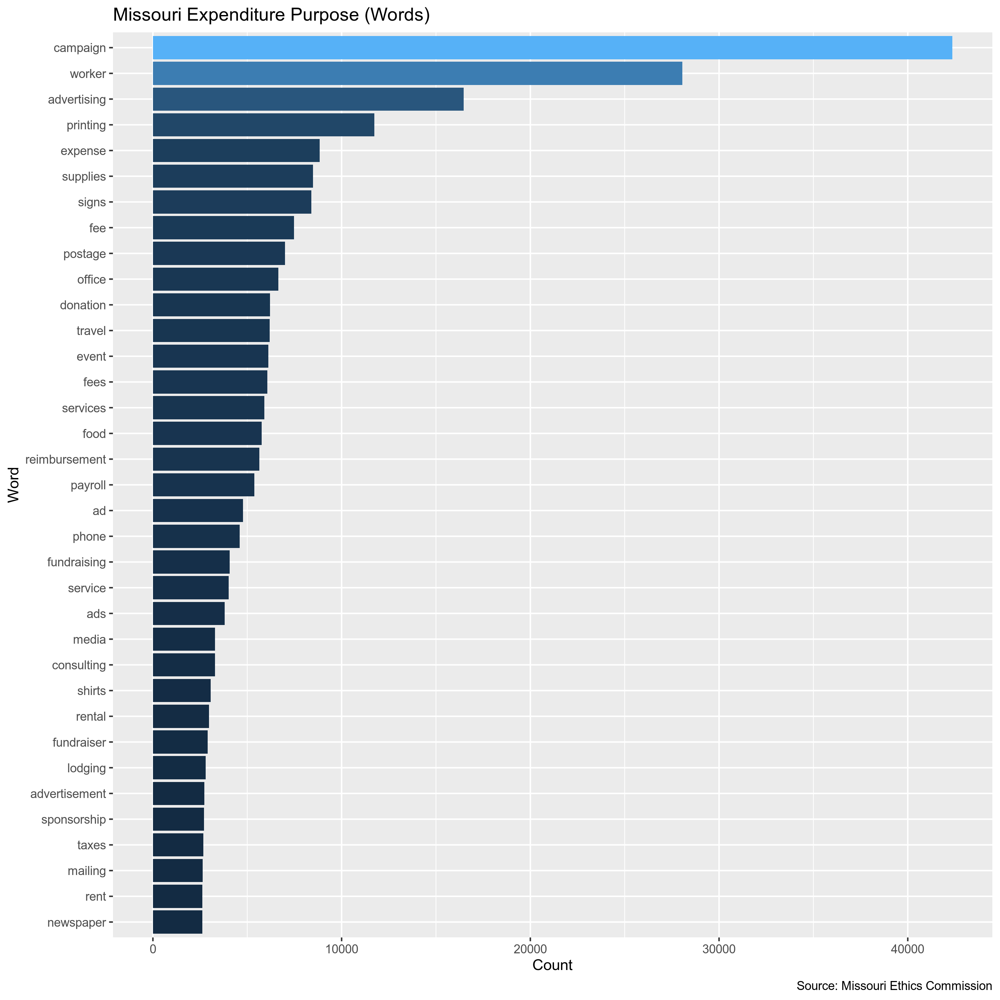
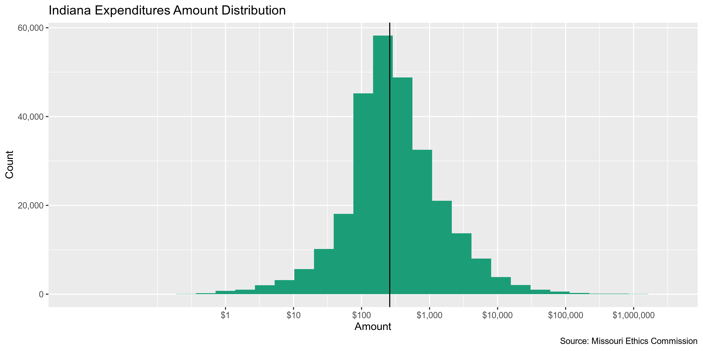
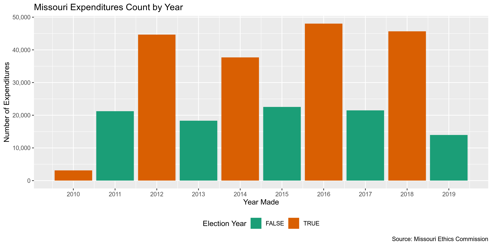
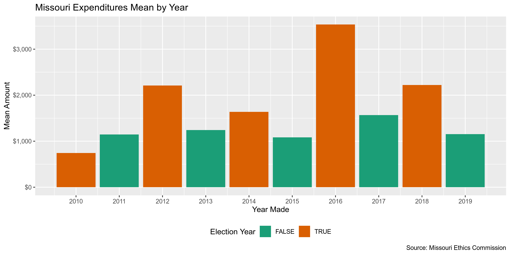
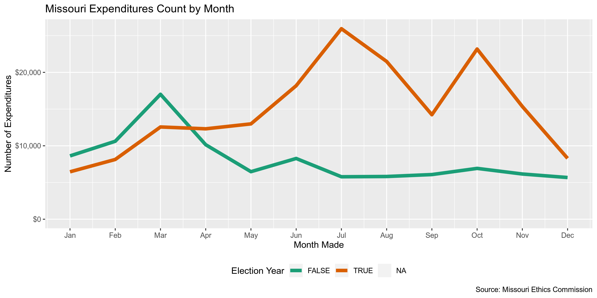
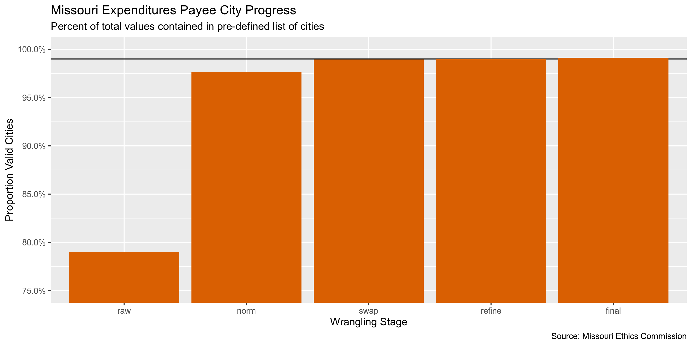
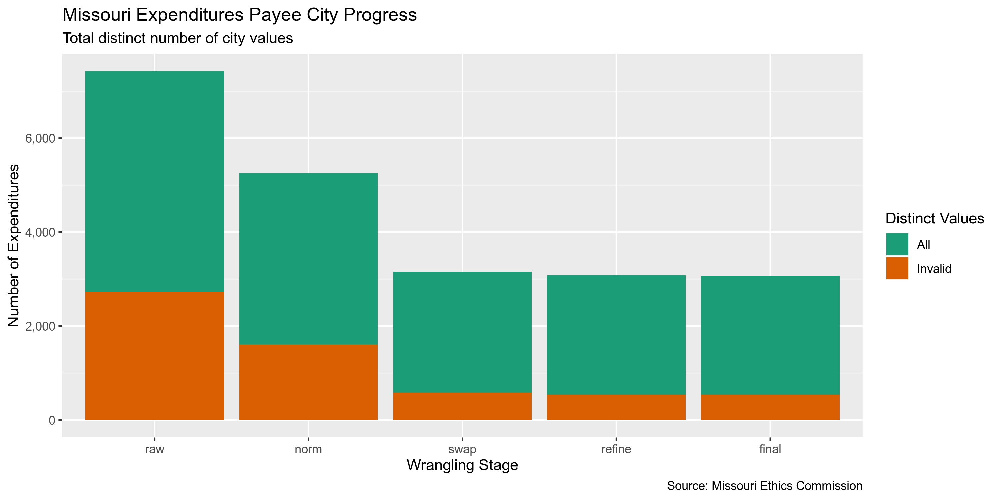

Missouri Expenditures
================
Kiernan Nicholls & Yanqi Xu
2023-03-13 23:40:59

- <a href="#project" id="toc-project">Project</a>
- <a href="#objectives" id="toc-objectives">Objectives</a>
- <a href="#packages" id="toc-packages">Packages</a>
- <a href="#data" id="toc-data">Data</a>
- <a href="#import" id="toc-import">Import</a>
- <a href="#explore" id="toc-explore">Explore</a>
- <a href="#wrangle" id="toc-wrangle">Wrangle</a>
- <a href="#conclude" id="toc-conclude">Conclude</a>
- <a href="#export" id="toc-export">Export</a>
- <a href="#lookup" id="toc-lookup">Lookup</a>

<!-- Place comments regarding knitting here -->

## Project

The Accountability Project is an effort to cut across data silos and
give journalists, policy professionals, activists, and the public at
large a simple way to search across huge volumes of public data about
people and organizations.

Our goal is to standardizing public data on a few key fields by thinking
of each dataset row as a transaction. For each transaction there should
be (at least) 3 variables:

1.  All **parties** to a transaction
2.  The **date** of the transaction
3.  The **amount** of money involved

## Objectives

This document describes the process used to complete the following
objectives:

1.  How many records are in the database?
2.  Check for duplicates
3.  Check ranges
4.  Is there anything blank or missing?
5.  Check for consistency issues
6.  Create a five-digit ZIP Code called `ZIP5`
7.  Create a `YEAR` field from the transaction date
8.  Make sure there is data on both parties to a transaction

## Packages

The following packages are needed to collect, manipulate, visualize,
analyze, and communicate these results. The `pacman` package will
facilitate their installation and attachment.

The IRW’s `campfin` package will also have to be installed from GitHub.
This package contains functions custom made to help facilitate the
processing of campaign finance data.

``` r
if (!require("pacman")) install.packages("pacman")
pacman::p_load_current_gh("irworkshop/campfin")
pacman::p_load(
  stringdist, # levenshtein value
  RSelenium, # remote browser
  tidyverse, # data manipulation
  lubridate, # datetime strings
  tidytext, # text analysis
  magrittr, # pipe opperators
  janitor, # dataframe clean
  refinr, # cluster and merge
  scales, # format strings
  rvest, # scrape html pages
  knitr, # knit documents
  vroom, # read files fast
  glue, # combine strings
  here, # relative storage
  fs # search storage 
)
```

This document should be run as part of the `R_campfin` project, which
lives as a sub-directory of the more general, language-agnostic
[`irworkshop/accountability_datacleaning`](https://github.com/irworkshop/accountability_datacleaning "TAP repo")
GitHub repository.

The `R_campfin` project uses the [RStudio
projects](https://support.rstudio.com/hc/en-us/articles/200526207-Using-Projects "Rproj")
feature and should be run as such. The project also uses the dynamic
`here::here()` tool for file paths relative to *your* machine.

``` r
# where dfs this document knit?
here::here()
#> [1] "/Users/yanqixu/code/accountability_datacleaning"
```

## Data

Data is obtained from the [Missouri Ethics
Commission](https://www.mec.mo.gov/MEC/Default.aspx) (MEC).

> The Commission makes transparency and public information a priority in
> their operations. The Commission’s website provides detailed financial
> information about campaign expenditures and contributions and includes
> many publications, brochures, and web tutorials explaining Missouri’s
> ethics laws, requirements and regulations.

Their data can be downloaded as anual files on their [data download
page](https://www.mec.mo.gov/MEC/Campaign_Finance/CF_ContrCSV.aspx).

> This search returns results from Campaign Finance Committee Reports
> filed for 2011 and later. The first row of the file contains the
> header/column names; the results are downloaded into a comma-separated
> value format only.

Data update: Expenditures below the amount of \$100 are now filed
separately and not itemized. So we only include data compiled from the
report.

## Import

We can import each file into R as a single data frame to be explored,
wrangled, and exported as a single file to be indexed on the TAP
database.

### Download

The files can only be downloaded after submitting a form request for a
type of data for a specific year. We can automate this process with the
RSelenium package.

``` r
raw_dir <- dir_create(here("state","mo", "expends", "data", "raw"))
```

``` r
# open the driver with auto download options
remote_driver <- rsDriver(
  port = 4444L,
  browser = "firefox",
  extraCapabilities = makeFirefoxProfile(
    list(
      browser.download.dir = raw_dir,
      browser.download.folderList = 2L,
      browser.helperApps.neverAsk.saveToDisk = "text/csv"
    )
  )
)

# navigate to the FL DOE download site
remote_browser <- remote_driver$client
remote_browser$navigate("https://www.mec.mo.gov/MEC/Campaign_Finance/CF_ContrCSV.aspx")

# chose "All" from elections list
type_css <- "/html/body/form/div[4]/div/div/div[2]/div[2]/table/tbody/tr[6]/td[2]/select/option[3]"
remote_browser$findElement("xpath", type_css)$clickElement()

for (i in 2:10) {
  dropdown <- "/html/body/form/div[4]/div/div/div[2]/div[2]/table/tbody/tr[8]/td[2]/select"
  remote_browser$findElement("xpath", glue("{dropdown}/option[{i}]"))$clickElement()
  submit_button <- "#ContentPlaceHolder_ContentPlaceHolder1_btnExport"
  remote_browser$findElement("css", submit_button)$clickElement()
}

# close the browser and driver
remote_browser$close()
remote_driver$server$stop()
```

### Read

We can read each file as a data frame into a list of data frames by
`vroom::vroom()`.

``` r
mo <- vroom(
  file = dir_ls(raw_dir, glob = "*.csv$"),
  .name_repair = make_clean_names,
  delim = ",",
  escape_backslash = FALSE,
  escape_double = FALSE,
  col_types = cols(.default = "c",
                   amount = col_double(),
                  date = col_date("%m/%d/%Y %H:%M:%S %p"))
)
```

## Explore

``` r
head(mo)
#> # A tibble: 6 × 16
#>   cd3_b_id mecid   committee…¹ first…² last_…³ company addre…⁴ addre…⁵ city  state zip   date      
#>   <chr>    <chr>   <chr>       <chr>   <chr>   <chr>   <chr>   <chr>   <chr> <chr> <chr> <date>    
#> 1 11694    C000510 WEST COUNT… Jerald  Hall    <NA>    863 We… <NA>    Ball… MO    63021 2011-02-23
#> 2 11830    C000402 MBA OZARK … <NA>    <NA>    Missou… PO Box… <NA>    Jeff… MO    65102 2011-01-21
#> 3 11851    C000400 MBA RIVER … <NA>    <NA>    Missou… PO Box… <NA>    Jeff… MO    65102 2011-01-21
#> 4 11925    C051193 WASHINGTON… <NA>    <NA>    YMCA T… 1328 S… <NA>    Poto… MO    63664 2011-03-11
#> 5 11926    C051193 WASHINGTON… <NA>    <NA>    The In… P.O. B… <NA>    Poto… MO    63664 2011-03-08
#> 6 11954    A111000 BRIGGS FOR… <NA>    <NA>    Mullig… 1808 W… <NA>    St L… MO    63103 2011-03-30
#> # … with 4 more variables: purpose <chr>, amount <dbl>, expenditure_type <chr>, report <chr>, and
#> #   abbreviated variable names ¹​committee_name, ²​first_name, ³​last_name, ⁴​address_1, ⁵​address_2
tail(mo)
#> # A tibble: 6 × 16
#>   cd3_b_id mecid   committee…¹ first…² last_…³ company addre…⁴ addre…⁵ city  state zip   date      
#>   <chr>    <chr>   <chr>       <chr>   <chr>   <chr>   <chr>   <chr>   <chr> <chr> <chr> <date>    
#> 1 477250   C221838 Citizens f… <NA>    <NA>    Google  1600 A… <NA>    Moun… CA    94043 2022-08-02
#> 2 477251   C221838 Citizens f… <NA>    <NA>    USPS    301 Co… <NA>    Fult… MO    65251 2022-08-11
#> 3 477253   C221838 Citizens f… <NA>    <NA>    Walmart 1701 N… <NA>    Fult… MO    65251 2022-08-15
#> 4 477255   C221838 Citizens f… <NA>    <NA>    Walmart 415 Co… <NA>    Colu… MO    65201 2022-08-14
#> 5 477257   C221838 Citizens f… <NA>    <NA>    Sam's … 101 Co… <NA>    Colu… MO    65201 2022-08-17
#> 6 477259   C221838 Citizens f… <NA>    <NA>    Sam's … 101 Co… <NA>    Colu… MO    65201 2022-08-25
#> # … with 4 more variables: purpose <chr>, amount <dbl>, expenditure_type <chr>, report <chr>, and
#> #   abbreviated variable names ¹​committee_name, ²​first_name, ³​last_name, ⁴​address_1, ⁵​address_2
glimpse(sample_frac(mo))
#> Rows: 374,981
#> Columns: 16
#> $ cd3_b_id         <chr> "152414", "30698", "258702", "60070", "439635", "242657", "116546", "429…
#> $ mecid            <chr> "C091143", "C111009", "C151053", "C121200", "C001016", "C151232", "C0710…
#> $ committee_name   <chr> "FRIENDS OF KEVIN ELMER", "SAVE OUR PLAZA", "GREITENS FOR MISSOURI", "VI…
#> $ first_name       <chr> NA, "Carol", NA, NA, NA, NA, NA, NA, NA, NA, NA, NA, NA, NA, NA, NA, NA,…
#> $ last_name        <chr> NA, "Ducak", NA, NA, NA, NA, NA, NA, NA, NA, NA, NA, NA, NA, NA, NA, NA,…
#> $ company          <chr> "24 Hour Signs", NA, "Key Sport Shop", "Maestro Screen Printing", "Postm…
#> $ address_1        <chr> "611 W. Mount Vernon St., Suite B", "14 E 56th St.", "1300 S Bishop Ave"…
#> $ address_2        <chr> NA, NA, NA, NA, NA, NA, NA, NA, NA, NA, "14550 BEECHNUT STREET", "STE 10…
#> $ city             <chr> "Nixa", "Kansas City", "Rolla", "St Louis", "Ozark", "Baton Rouge", "Jef…
#> $ state            <chr> "MO", "MO", "MO", "MO", "MO", "LA", "MO", "IL", "OK", "DC", "TX", "MO", …
#> $ zip              <chr> "65714", "64113", "65401", "63110", "65721", "70808", "65109", "60661", …
#> $ date             <date> 2014-05-23, 2011-09-02, 2016-09-23, 2012-06-18, 2021-05-13, 2016-06-19,…
#> $ purpose          <chr> "Signage", "data entry", "Event Expense", "Signs", "6mo dues post office…
#> $ amount           <dbl> 469.67, 121.95, 4697.91, 2012.00, 136.00, 1.66, 844.55, 10000.00, 250.00…
#> $ expenditure_type <chr> "Paid", "Paid", "Paid", "Paid", "Paid", "Paid", "Paid", "Paid", "Paid", …
#> $ report           <chr> "July Quarterly Report", "October Quarterly Report", "October Quarterly …
```

### Missing

``` r
col_stats(mo, count_na)
#> # A tibble: 16 × 4
#>    col              class       n         p
#>    <chr>            <chr>   <int>     <dbl>
#>  1 cd3_b_id         <chr>       0 0        
#>  2 mecid            <chr>       0 0        
#>  3 committee_name   <chr>       0 0        
#>  4 first_name       <chr>  294795 0.786    
#>  5 last_name        <chr>  290738 0.775    
#>  6 company          <chr>   77106 0.206    
#>  7 address_1        <chr>      16 0.0000427
#>  8 address_2        <chr>  338941 0.904    
#>  9 city             <chr>      11 0.0000293
#> 10 state            <chr>      28 0.0000747
#> 11 zip              <chr>     142 0.000379 
#> 12 date             <date>      0 0        
#> 13 purpose          <chr>       7 0.0000187
#> 14 amount           <dbl>       0 0        
#> 15 expenditure_type <chr>       0 0        
#> 16 report           <chr>       0 0
```

There are very few records missing one of the key values needed to
identify a transaction (who, what, when). The `first_name` and
`last_name` variables are used to identify individual payees, with
`company` used to identify non-individuals. We can flag any record with
`campfin::flag_na()` to create a new `na_flag` variable with value
`TRUE` for any record missing *any* of those key variables.

``` r
mo <- mo %>% 
  mutate(
    individual = coalesce(last_name, first_name),
    payee_name = coalesce(individual, company)
    ) %>% 
  flag_na(
    payee_name,
    committee_name,
    date,
    amount
  )

sum(mo$na_flag)
#> [1] 5
```

### Duplicates

We can use `campfin::flag_dupes()` to create a new `dupe_flag` variable
with with value `TRUE` for any duplicate row, after the first
occurrence. We will ignore the supposedly unique `cd3_b_id` variable.

``` r
mo <- flag_dupes(mo, -cd3_b_id)
sum(mo$dupe_flag)
#> [1] 3973
percent(mean(mo$dupe_flag))
#> [1] "1%"
```

### Categorical

``` r
col_stats(mo, n_distinct)
#> # A tibble: 20 × 4
#>    col              class       n          p
#>    <chr>            <chr>   <int>      <dbl>
#>  1 cd3_b_id         <chr>  374981 1         
#>  2 mecid            <chr>    9530 0.0254    
#>  3 committee_name   <chr>   10104 0.0269    
#>  4 first_name       <chr>    8169 0.0218    
#>  5 last_name        <chr>   14085 0.0376    
#>  6 company          <chr>   67824 0.181     
#>  7 address_1        <chr>  112726 0.301     
#>  8 address_2        <chr>    8980 0.0239    
#>  9 city             <chr>    6276 0.0167    
#> 10 state            <chr>      89 0.000237  
#> 11 zip              <chr>    9162 0.0244    
#> 12 date             <date>   4558 0.0122    
#> 13 purpose          <chr>   75858 0.202     
#> 14 amount           <dbl>   90752 0.242     
#> 15 expenditure_type <chr>       2 0.00000533
#> 16 report           <chr>     507 0.00135   
#> 17 individual       <chr>   14598 0.0389    
#> 18 payee_name       <chr>   79026 0.211     
#> 19 na_flag          <lgl>       2 0.00000533
#> 20 dupe_flag        <lgl>       2 0.00000533
```

<!-- -->

### Continuous

For continuous variables, we should explore both the range and
distribution. This can be done with visually with
`ggplot2::geom_histogram()` and `ggplot2::geom_violin()`.

#### Amounts

``` r
summary(mo$amount)
#>      Min.   1st Qu.    Median      Mean   3rd Qu.      Max. 
#>     -86.8     122.0     270.0    2082.6     780.0 2438725.0
sum(mo$amount <= 0, na.rm = TRUE)
#> [1] 54
sum(mo$amount >= 100000, na.rm = TRUE)
#> [1] 956
```

<!-- -->

#### Dates

``` r
mo <- mutate(mo, year = year(date))
```

``` r
count_na(mo$date)
#> [1] 0
min(mo$date, na.rm = TRUE)
#> [1] "1900-01-20"
sum(mo$year < 2010, na.rm = TRUE)
#> [1] 66
max(mo$date, na.rm = TRUE)
#> [1] "2023-01-09"
sum(mo$date > today(), na.rm = TRUE)
#> [1] 0
```

``` r
count(mo, year)
#> # A tibble: 20 × 2
#>     year     n
#>    <dbl> <int>
#>  1  1900     2
#>  2  2001     1
#>  3  2002     8
#>  4  2007    16
#>  5  2008    22
#>  6  2009    17
#>  7  2010  3113
#>  8  2011 21246
#>  9  2012 44656
#> 10  2013 18305
#> 11  2014 37674
#> 12  2015 22569
#> 13  2016 47981
#> 14  2017 21571
#> 15  2018 45905
#> 16  2019 23001
#> 17  2020 36325
#> 18  2021 17816
#> 19  2022 34752
#> 20  2023     1
```

``` r
mo <- mo %>% 
  mutate(
    date_flag = year < 2010 | date > today(),
    date_clean = case_when(date_flag ~ as.Date(NA), not(date_flag) ~ date),
    year_clean = year(date_clean)
  )

sum(mo$date_flag, na.rm = TRUE)
#> [1] 66
```

<!-- -->

<!-- -->

<!-- -->

<!-- -->

## Wrangle

We should use the `campfin::normal_*()` functions to perform some basic,
high-confidence text normalization to improve the searchability of the
database.

### Address

First, we will normalize the street address by removing punctuation and
expanding abbreviations.

``` r
if (packageVersion("tidyr") > "0.8.3.9") {
  mo <- mo %>% 
    unite(
      col = adress_full,
      starts_with("address"),
      remove = FALSE,
      na.rm = TRUE
    ) %>% 
    mutate(
      address_norm = normal_address(
        address = adress_full,
        abbs = usps_street,
        na_rep = TRUE
      )
    )
} else {
  stop(
    glue("tidyr needs a newer version, found {packageVersion('tidyr')}, need at least 0.8.3.9")
  )
}
```

We can see how this improves consistency across the `address_1` and
`address_2` fields.

    #> # A tibble: 10 × 3
    #>    address_1                          address_2                          address_norm              
    #>    <chr>                              <chr>                              <chr>                     
    #>  1 8002 North Oak Trfwy               Ste 126                            8002 NORTH OAK TRFWYSTE 1…
    #>  2 %St. Andrew Church                 309 Hoffmeister Ave.               ST ANDREW CHURCH309 HOFFM…
    #>  3 540 B Little Hills Industrial Blvd 540 B Little Hills Industrial Blvd 540 B LITTLE HILLS INDUST…
    #>  4 11142 Gateway Drive                9745 Nettle Drive                  11142 GATEWAY DRIVE9745 N…
    #>  5 347 Hazel Avenue                   4001 Botanical Avenue              347 HAZEL AVENUE4001 BOTA…
    #>  6 1340 Poydras Street                Suite 1770                         1340 POYDRAS STREETSUITE …
    #>  7 14368 S. Outer Forty Drive         14368 S. Outer Forty Drive         14368 S OUTER FORTY DRIVE…
    #>  8 6268 LORAN AVE                     APT A                              6268 LORAN AVEAPT A       
    #>  9 335 S Springfield                  P O Box 330                        335 S SPRINGFIELDP O BOX …
    #> 10 141 Forum Blvd                     Suite 105                          141 FORUM BLVDSUITE 105

### ZIP

The `zip` address is already pretty good, with 93% of the values already
in our 95% comprehensive `valid_zip` list.

``` r
n_distinct(mo$zip)
#> [1] 9162
prop_in(mo$zip, valid_zip)
#> [1] 0.933929
length(setdiff(mo$zip, valid_zip))
#> [1] 4324
```

We can improve this further by lopping off the uncommon four-digit
extensions and removing common invalid codes like 00000 and 99999.

``` r
mo <- mo %>% 
  mutate(
    zip_norm = normal_zip(
      zip = zip,
      na_rep = TRUE
    )
  )
```

This brings our valid percentage to 99%.

``` r
n_distinct(mo$zip_norm)
#> [1] 5719
prop_in(mo$zip_norm, valid_zip)
#> [1] 0.9916678
length(setdiff(mo$zip_norm, valid_zip))
#> [1] 788
count_na(mo$zip_norm) - count_na(mo$zip)
#> [1] 386
```

### State

The `state` variable is also very clean, already at 100%.

``` r
n_distinct(mo$state)
#> [1] 89
prop_in(mo$state, valid_state, na.rm = TRUE)
#> [1] 0.9978984
length(setdiff(mo$state, valid_state))
#> [1] 33
setdiff(mo$state, valid_state)
#>  [1] "Mo" NA   "0"  "Ks" "mo" "na" "CN" "BC" "Tx" "UK" "Fl" "Pa" "Ca" "US" "SP" "SA" "AU" "Il" "EN"
#> [20] "Fr" "JS" "Va" "b"  "mO" "QC" "Ne" "Ia" "KC" "NS" "ON" "Oh" "IS" "m0"
```

There are still 33 invalid values which we can remove.

``` r
mo <- mo %>% 
  mutate(
    state_norm = normal_state(
      state = str_replace(str_trim(state), "^I$", "IN"),
      abbreviate = TRUE,
      na_rep = TRUE,
      valid = valid_state
    )
  )
```

``` r
n_distinct(mo$state_norm)
#> [1] 57
prop_in(mo$state_norm, valid_state)
#> [1] 1
```

### City

The `city` value is the hardest to normalize. We can use a four-step
system to functionally improve the searchablity of the database.

1.  **Normalize** the raw values with `campfin::normal_city()`
2.  **Match** the normal values with the *expected* value for that ZIP
    code
3.  **Swap** the normal values with the expected value if they are
    *very* similar
4.  **Refine** the swapped values the [OpenRefine
    algorithms](https://github.com/OpenRefine/OpenRefine/wiki/Clustering-In-Depth)
    and keep good changes

The raw `city` values are not very normal, with only 5% already in
`valid_city`, mostly due to case difference. If we simply convert to
uppcase that numbers increases to 80%. We will aim to get this number
over 99% using the other steps in the process.

``` r
n_distinct(mo$city)
#> [1] 6276
prop_in(str_to_upper(mo$city), valid_city, na.rm = TRUE)
#> [1] 0.7976505
length(setdiff(mo$city, valid_city))
#> [1] 5545
count_na(mo$city)
#> [1] 11
```

#### Normalize

``` r
mo <- mo %>% 
  mutate(
    city_norm = normal_city(
      city = city, 
      abbs = usps_city,
      states = c("MO", "DC", "MISSOURI"),
      na = invalid_city,
      na_rep = TRUE
    )
  )
```

This process brought us to 80% valid.

``` r
n_distinct(mo$city_norm)
#> [1] 4460
prop_in(mo$city_norm, valid_city, na.rm = TRUE)
#> [1] 0.8003635
length(setdiff(mo$city_norm, valid_city))
#> [1] 2193
count_na(mo$city_norm)
#> [1] 315
```

It also increased the proportion of `NA` values by 0%. These new `NA`
values were either a single (possibly repeating) character, or contained
in the `na_city` vector.

    #> # A tibble: 144 × 4
    #>    zip_norm state_norm city      city_norm
    #>    <chr>    <chr>      <chr>     <chr>    
    #>  1 65049    MO         UNKNOWN   <NA>     
    #>  2 64081    MO         Unknown   <NA>     
    #>  3 64801    MO         requested <NA>     
    #>  4 64423    MO         Requested <NA>     
    #>  5 64030    MO         Unknown   <NA>     
    #>  6 63040    MO         None      <NA>     
    #>  7 65804    MO         mmm       <NA>     
    #>  8 63104    MO         requested <NA>     
    #>  9 64151    MO         Somewhere <NA>     
    #> 10 63933    MO         online    <NA>     
    #> # … with 134 more rows

#### Swap

Then, we will compare these normalized `city_norm` values to the
*expected* city value for that vendor’s ZIP code. If the [levenshtein
distance](https://en.wikipedia.org/wiki/Levenshtein_distance) is less
than 3, we can confidently swap these two values.

``` r
mo <- mo %>% 
  rename(city_raw = city) %>% 
  left_join(
    y = zipcodes,
    by = c(
      "state_norm" = "state",
      "zip_norm" = "zip"
    )
  ) %>% 
  rename(city_match = city) %>% 
  mutate(
    match_dist = stringdist(city_norm, city_match),
    city_swap = if_else(
      condition = is_less_than(match_dist, 3),
      true = city_match,
      false = city_norm
    )
  )
```

This is a very fast way to increase the valid proportion to 81% and
reduce the number of distinct *invalid* values from 2193 to only 849

``` r
n_distinct(mo$city_swap)
#> [1] 3071
prop_in(mo$city_swap, valid_city, na.rm = TRUE)
#> [1] 0.8126511
length(setdiff(mo$city_swap, valid_city))
#> [1] 849
```

#### Refine

Finally, we can pass these swapped `city_swap` values to the OpenRefine
cluster and merge algorithms. These two algorithms cluster similar
values and replace infrequent values with their more common
counterparts. This process can be harmful by making *incorrect* changes.
We will only keep changes where the state, ZIP code, *and* new city
value all match a valid combination.

``` r
good_refine <- mo %>% 
  mutate(
    city_refine = city_swap %>% 
      key_collision_merge() %>% 
      n_gram_merge(numgram = 1)
  ) %>% 
  filter(city_refine != city_swap) %>% 
  inner_join(
    y = zipcodes,
    by = c(
      "city_refine" = "city",
      "state_norm" = "state",
      "zip_norm" = "zip"
    )
  )

nrow(good_refine)
#> [1] 57
```

    #> # A tibble: 47 × 5
    #>    state_norm zip_norm city_raw              city_refine         n
    #>    <chr>      <chr>    <chr>                 <chr>           <int>
    #>  1 KS         66101    Kanssas Cityas City   KANSAS CITY         5
    #>  2 MO         64108    Kanssas Cityas City   KANSAS CITY         4
    #>  3 CA         92067    Ranchero Sante Fe     RANCHO SANTA FE     3
    #>  4 MO         64055    Indepence             INDEPENDENCE        2
    #>  5 CA         94133    San Francisco CA      SAN FRANCISCO       1
    #>  6 CA         95131    Jose San              SAN JOSE            1
    #>  7 IA         52802    Daavenportvenport     DAVENPORT           1
    #>  8 IL         60094    Palenentine           PALATINE            1
    #>  9 KS         66101    Kanansas Citysas City KANSAS CITY         1
    #> 10 KS         66101    Kansas City KS        KANSAS CITY         1
    #> # … with 37 more rows

We can join these good refined values back to the original data and use
them over their incorrect `city_swap` counterparts in a new
`city_refine` variable.

``` r
mo <- mo %>% 
  left_join(good_refine) %>% 
  mutate(city_refine = coalesce(city_refine, city_swap))
```

This brings us to 81% valid values.

``` r
n_distinct(mo$city_refine)
#> [1] 3036
prop_in(mo$city_refine, valid_city, na.rm = TRUE)
#> [1] 0.8128052
length(setdiff(mo$city_refine, valid_city))
#> [1] 814
```

#### Progress

We can make very few manual changes to capture the last few big invalid
values. Local city abbreviations (e.g., SPFD) often need to be changed
by hand.

``` r
mo %>%
  filter(city_refine %out% valid_city) %>% 
  count(state_norm, city_refine, sort = TRUE) %>% 
  drop_na(city_refine)
#> # A tibble: 823 × 3
#>    state_norm city_refine           n
#>    <chr>      <chr>             <int>
#>  1 MO         ST LOUIS          49192
#>  2 MO         ST CHARLES         3649
#>  3 MO         ST JOSEPH          2163
#>  4 MO         ST PETERS          1735
#>  5 KS         OVERLAND PARK      1199
#>  6 MO         NORTH KANSAS CITY   837
#>  7 MO         RAYTOWN             794
#>  8 MO         WEBSTER GROVES      689
#>  9 MO         OVERLAND            519
#> 10 MO         UNIVERSITY CITY     464
#> # … with 813 more rows
```

``` r
mo <- mo %>% 
  mutate(
    city_final = city_refine %>% 
      str_replace("^STLOUIS$", "SAINT LOUIS") %>% 
      str_replace("^SPFD$", "SPRINGFIELD") %>% 
      str_replace("^INDEP$", "INDEPENDENCE") %>% 
      str_replace("^NKC$", "NORTH KANSAS CITY")
  )
```

By adding a dozen popular Missouri cities to our `valid_city` list, we
can reach our 99% goal.

``` r
valid_city <- c(
  valid_city,
  "OVERLAND",
  "OVERLAND PARK",
  "RAYTOWN",
  "NORTH KANSAS CITY",
  "PRAIRIE VILLAGE",
  "UNIVERSITY CITY",
  "WEBSTER GROVES",
  "RICHMOND HEIGHTS",
  "LENEXA",
  "STE GENEVIEVE",
  "LEAWOOD",
  "DES PERES",
  "OLIVETTE",
  "TOWN AND COUNTRY",
  "AFFTON"
)
```

Still, our progress is significant without having to make a single
manual or unconfident change. The percent of valid cities increased from
82% to 83%. The number of total distinct city values decreased from
4,665 to 3,032. The number of distinct invalid city names decreased from
2,389 to only 795, a change of -67%.

| Normalization Stage | Total Distinct | Percent Valid | Unique Invalid |
|:--------------------|---------------:|--------------:|---------------:|
| raw                 |         0.8160 |          4665 |           2389 |
| norm                |         0.8191 |          4460 |           2178 |
| swap                |         0.8315 |          3071 |            834 |
| refine              |         0.8316 |          3036 |            799 |
| final               |         0.8331 |          3032 |            795 |

<!-- -->

<!-- -->

## Conclude

1.  There are 374981 records in the database.
2.  There are 3973 duplicate records in the database.
3.  The range and distribution of `amount` seems reasomable, and `date`
    has been cleaned by removing 66 values from the distance past or
    future.
4.  There are 5 records missing either recipient or date.
5.  Consistency in geographic data has been improved with
    `campfin::normal_*()`.
6.  The 5-digit `zip_norm` variable has been created with
    `campfin::normal_zip()`.
7.  The 4-digit `year_clean` variable has been created with
    `lubridate::year()`.

## Export

``` r
proc_dir <- here("state","mo", "expends", "data", "processed")
dir_create(proc_dir)
```

``` r
mo <- mo %>% 
  select(
    -city_norm,
    -city_swap,
    -city_match,
    -city_swap,
    -match_dist,
    -city_refine,
    -year
  )
```

## Lookup

``` r

#lookup <- read_csv("mo/expends/data/mo_city_lookup.csv") %>% select(1:2)
#mo <- left_join(mo, lookup, by = c("city_final" = "CITY_FINAL"))

progress_table(
  mo$city_raw,
  mo$city_final, 
  mo$CITY_FINAL2, 
  compare = valid_city
)
#> # A tibble: 3 × 6
#>   stage           prop_in n_distinct     prop_na  n_out n_diff
#>   <chr>             <dbl>      <dbl>       <dbl>  <dbl>  <dbl>
#> 1 mo$city_raw      0.0516       6276   0.0000293 355623   5530
#> 2 mo$city_final    0.833        3032   0.0139     61704    795
#> 3 mo$CITY_FINAL2 NaN               0 NaN              0      0

write_csv(
  x = mo,
  path = glue("{proc_dir}/mo_expends_clean.csv"),
  na = ""
)
```
