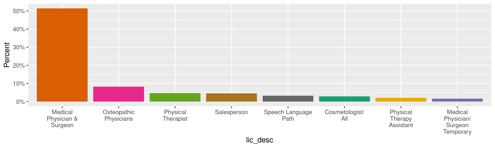
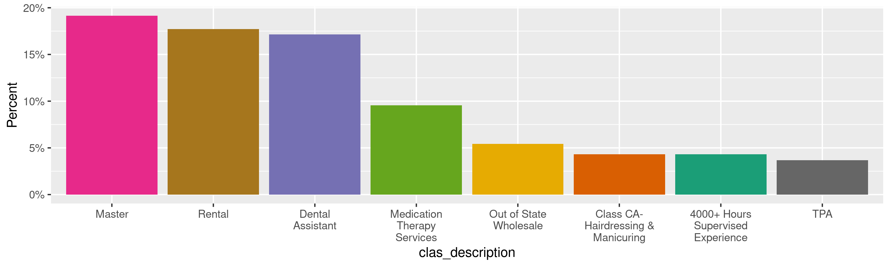
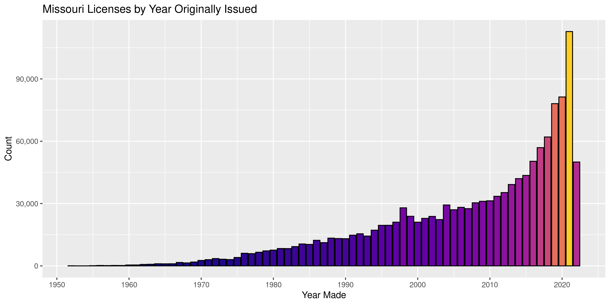
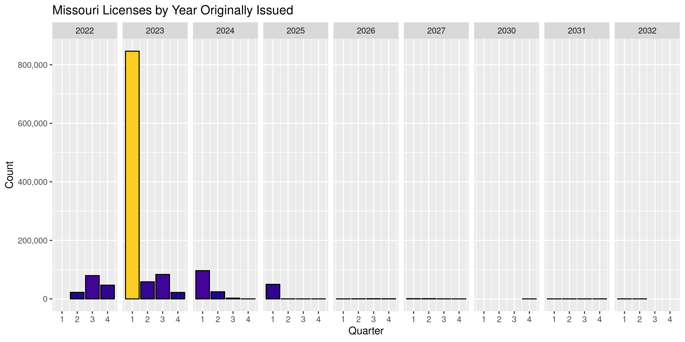
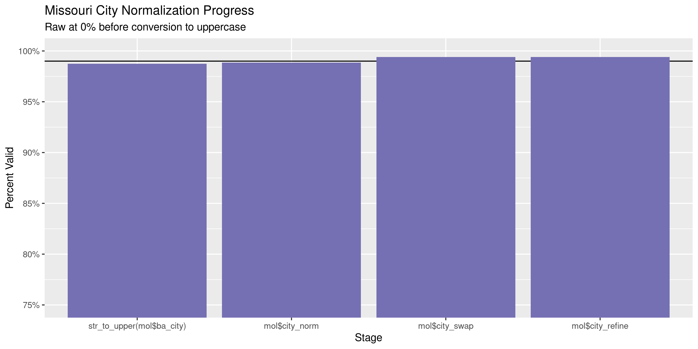
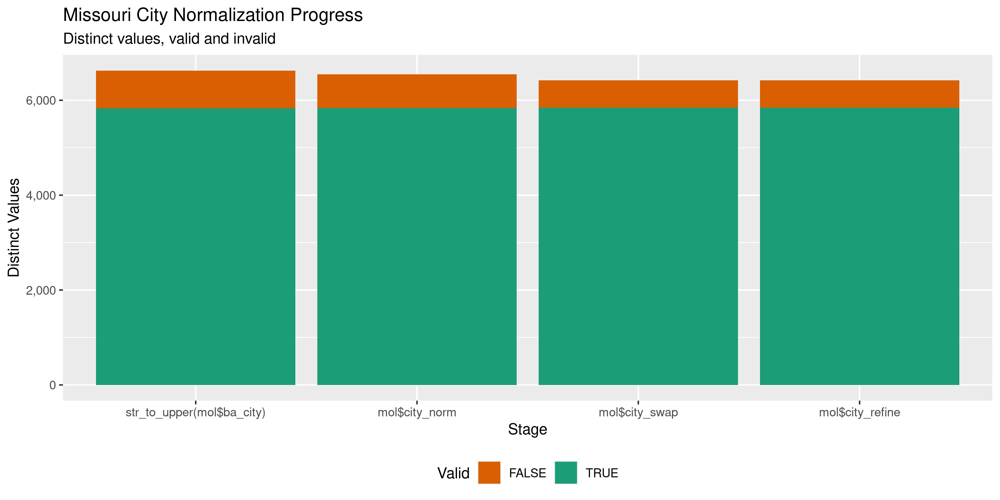

Missouri Licenses
================
Kiernan Nicholls
Wed Jun 22 13:47:08 2022

-   <a href="#project" id="toc-project">Project</a>
-   <a href="#objectives" id="toc-objectives">Objectives</a>
-   <a href="#packages" id="toc-packages">Packages</a>
-   <a href="#source" id="toc-source">Source</a>
-   <a href="#download" id="toc-download">Download</a>
-   <a href="#unzip" id="toc-unzip">Unzip</a>
-   <a href="#read" id="toc-read">Read</a>
-   <a href="#explore" id="toc-explore">Explore</a>
    -   <a href="#missing" id="toc-missing">Missing</a>
    -   <a href="#duplicates" id="toc-duplicates">Duplicates</a>
    -   <a href="#categorical" id="toc-categorical">Categorical</a>
    -   <a href="#dates" id="toc-dates">Dates</a>
-   <a href="#wrangle" id="toc-wrangle">Wrangle</a>
    -   <a href="#address" id="toc-address">Address</a>
    -   <a href="#zip" id="toc-zip">ZIP</a>
    -   <a href="#state" id="toc-state">State</a>
    -   <a href="#city" id="toc-city">City</a>
-   <a href="#conclude" id="toc-conclude">Conclude</a>
-   <a href="#export" id="toc-export">Export</a>
-   <a href="#upload" id="toc-upload">Upload</a>

<!-- Place comments regarding knitting here -->

## Project

The Accountability Project is an effort to cut across data silos and
give journalists, policy professionals, activists, and the public at
large a simple way to search across huge volumes of public data about
people and organizations.

Our goal is to standardize public data on a few key fields by thinking
of each dataset row as a transaction. For each transaction there should
be (at least) 3 variables:

1.  All **parties** to a transaction.
2.  The **date** of the transaction.
3.  The **amount** of money involved.

## Objectives

This document describes the process used to complete the following
objectives:

1.  How many records are in the database?
2.  Check for entirely duplicated records.
3.  Check ranges of continuous variables.
4.  Is there anything blank or missing?
5.  Check for consistency issues.
6.  Create a five-digit ZIP Code called `zip`.
7.  Create a `year` field from the transaction date.
8.  Make sure there is data on both parties to a transaction.

## Packages

The following packages are needed to collect, manipulate, visualize,
analyze, and communicate these results. The `pacman` package will
facilitate their installation and attachment.

``` r
if (!require("pacman")) {
  install.packages("pacman")
}
pacman::p_load(
  tidyverse, # data manipulation
  lubridate, # datetime strings
  gluedown, # printing markdown
  janitor, # clean data frames
  campfin, # custom irw tools
  aws.s3, # aws cloud storage
  refinr, # cluster & merge
  scales, # format strings
  knitr, # knit documents
  vroom, # fast reading
  rvest, # scrape html
  glue, # code strings
  here, # project paths
  httr, # http requests
  fs # local storage 
)
```

This diary was run using `campfin` version 1.0.8.9300.

``` r
packageVersion("campfin")
#> [1] '1.0.8.9300'
```

This document should be run as part of the `R_tap` project, which lives
as a sub-directory of the more general, language-agnostic
[`irworkshop/accountability_datacleaning`](https://github.com/irworkshop/accountability_datacleaning)
GitHub repository.

The `R_tap` project uses the [RStudio
projects](https://support.rstudio.com/hc/en-us/articles/200526207-Using-Projects)
feature and should be run as such. The project also uses the dynamic
`here::here()` tool for file paths relative to *your* machine.

``` r
# where does this document knit?
here::i_am("state/mo/licenses/docs/mo_licenses_diary.Rmd")
```

## Source

The \[Missouri Division of Professional Registration\]\[pr\] provides
listings of licensees by field.

> #### Downloadable Listings - Active License Only
>
> The information contained in “Downloadable Listings” and “Licensee
> Search” is updated nightly. If you are unable to locate licensee
> information or have questions regarding any of the information
> supplied, please contact the individual licensing board directly.

## Download

Raw source files will be saved to separate directories indicating their
type.

``` r
zip_dir <- dir_create(here("state", "mo", "licenses", "data", "zip"))
tsv_dir <- dir_create(here("state", "mo", "licenses", "data", "tsv"))
doc_dir <- dir_create(here("state", "mo", "licenses", "data", "txt"))
```

We will download files using `ssl_verifypeer` set to `0` as means of
bypassing an error with the site’s security.

``` r
GET2 <- function(url) {
  with_config(
    config = config(ssl_verifypeer = 0L),
    expr = GET(url = url)
  )
}
```

On the home page are listed the 42 *sub*-pages, each corresponding to a
type of licensee.

``` r
type_list <- GET2("https://pr.mo.gov/listings.asp")

type_a <- type_list %>%
  content(as = "parsed", encoding = "UTF-8") %>%
  html_element("#main-content > table:nth-child(3)") %>%
  html_elements("a")

type_pg <- tibble(
  a = str_squish(html_text(type_a)),
  href = paste0("https://pr.mo.gov/", html_attr(type_a, "href"))
)
```

| a                                       | href                                        |
|:----------------------------------------|:--------------------------------------------|
| Accountancy                             | <https://pr.mo.gov/listings-acc.asp>        |
| Acupuncturist                           | <https://pr.mo.gov/listings-acu.asp>        |
| Anesthesiologist Assistants             | <https://pr.mo.gov/listings-heal.asp>       |
| Anesthesiologist Assistant Temporary    | <https://pr.mo.gov/listings-heal.asp>       |
| Architects, Engineers & Land Survey     | <https://pr.mo.gov/listings-arc.asp>        |
| Athletic Trainers                       | <https://pr.mo.gov/listings-heal.asp>       |
| Athletics                               | <https://pr.mo.gov/listings-ath.asp>        |
| Athlete Agents                          | <https://pr.mo.gov/listings-ata.asp>        |
| Behavior Analysts                       | <https://pr.mo.gov/listings-ba.asp>         |
| Chiropractic Examiners                  | <https://pr.mo.gov/listings-chi.asp>        |
| Cosmetology & Barber                    | <https://pr.mo.gov/listings-cos.asp>        |
| Counselors, Professional                | <https://pr.mo.gov/listings-cou.asp>        |
| Dental                                  | <https://pr.mo.gov/listings-den.asp>        |
| Dietitians                              | <https://pr.mo.gov/listings-diet.asp>       |
| Electrical Contractors                  | <https://pr.mo.gov/listings-elec.asp>       |
| Embalmers & Funeral Directors           | <https://pr.mo.gov/listings-emb.asp>        |
| Endowed Care Cemeteries                 | <https://pr.mo.gov/listings-end.asp>        |
| Geologists                              | <https://pr.mo.gov/listings-geo.asp>        |
| Healing Arts                            | <https://pr.mo.gov/listings-heal.asp>       |
| Hearing Instrument Specialists          | <https://pr.mo.gov/listings-hear.asp>       |
| Interior Design                         | <https://pr.mo.gov/listings-intdes.asp>     |
| Landscape Architects, Professional      | <https://pr.mo.gov/listings-lan.asp>        |
| Marital & Family Therapists             | <https://pr.mo.gov/listings-mar.asp>        |
| Massage Therapy                         | <https://pr.mo.gov/listings-mas.asp>        |
| Nursing                                 | <https://pr.mo.gov/listings-nur.asp>        |
| Occupational Therapy                    | <https://pr.mo.gov/listings-occ.asp>        |
| Optometrists                            | <https://pr.mo.gov/listings-opt.asp>        |
| Perfusionist                            | <https://pr.mo.gov/listings-heal.asp>       |
| Pharmacy                                | <https://pr.mo.gov/listings-pha.asp>        |
| Physical Therapists                     | <https://pr.mo.gov/listings-heal.asp>       |
| Physician Assistants                    | <https://pr.mo.gov/listings-heal.asp>       |
| Physicians & Surgeons                   | <https://pr.mo.gov/listings-heal.asp>       |
| Podiatrists                             | <https://pr.mo.gov/listings-pod.asp>        |
| Private Investigator Examiners          | <https://pr.mo.gov/listings-pi.asp>         |
| Psychologists                           | <https://pr.mo.gov/listings-psy.asp>        |
| Real Estate Appraisers                  | <https://pr.mo.gov/listings-realestapp.asp> |
| Real Estate Commission                  | <https://pr.mo.gov/listings-realestcom.asp> |
| Respiratory Care Practitioners          | <https://pr.mo.gov/listings-res.asp>        |
| Sign Language Interpreters for the Deaf | <https://pr.mo.gov/listings-interp.asp>     |
| Social Workers, Clinical                | <https://pr.mo.gov/listings-cli.asp>        |
| Speech-Lang Pathologists & Audiologists | <https://pr.mo.gov/listings-heal.asp>       |
| Tattooing, Body Piercing & Branding     | <https://pr.mo.gov/listings-tat.asp>        |
| Veterinary Medicine                     | <https://pr.mo.gov/listings-vet.asp>        |

Each sub-page lists all of the ZIP files available for each type of
license holder in that category.

> ### Accountancy
>
> The files below are Professional Registration Directories and have
> been tab delimited and can be easily imported into various databases,
> spreadsheets, or word processors.
>
> Right Click on the `*.ZIP` file you wish to download and select Save
> As. Place the file where you can access it easily.
>
> The file description contains information on the type of fields
> contained in the data file and how large the fields are. This will
> help you set up a spreadsheet or database. After setting up your
> document, spreadsheet or database you must import the data file
> (`*.txt`) into it.

We will go to each of these sub-pages and download the ZIP files listed
there. Confusingly, the same ZIP file may be listed under multiple
sub-pages. For example, the `AAT.ZIP` file (Anesthesiologist Assistant
Temporary) is listed under **nine** sub-pages: Anesthesiologist
Assistants, Healing Arts, Physical, Therapists, etc. We only need to
save one copy of each ZIP file.

``` r
type_file <- here("state", "mo", "licenses", "data", "mo_lic_urls.csv")
if (!file_exists(type_file)) {
  out <- rep(list(NA), rep(nrow(type_pg)))
  for (i in seq_along(type_pg$href)) {
    message(paste(i, length(out), sep = "/"))
    get_sub <- GET2(type_pg$href[i])
    sub_pg <- content(get_sub, encoding = "UTF-8")
    sub_mc <- html_element(sub_pg, "#main-content")
    has_table <- !is.na(html_element(sub_mc, "table"))
    if (has_table) {
      sub_tb <- html_table(html_element(sub_mc, "table"))
      # get only rows that have something
      sub_tr <- html_elements(sub_pg, "#main-content table tr")
      sub_tr <- sub_tr[!is.na(sub_tb$X2)]
      out[[i]] <- tibble(
        type = type_pg$a[i],
        href = html_attr(html_element(sub_tr, "a"), "href"),
        desc = html_text(html_elements(sub_tr, "td")[c(FALSE, TRUE)])
      )
    } else {
      sub_a <- html_elements(sub_pg, "#main-content a")
      br_txt <- str_match_all(
        string = as.character(sub_mc),
        pattern = "</a>\\s(.*?)<br>"
      )
      out[[i]] <- tibble(
        type = type_pg$a[i],
        href =  str_subset(html_attr(sub_a, "href"), "\\.ZIP$"),
        desc = br_txt[[1]][, 2]
      )
    }
  }
  all_urls <- bind_rows(out)
  write_csv(all_urls, type_file)
} else {
  all_urls <- read_csv(type_file)
}
```

``` r
for (i in seq_along(all_urls$href)) {
  zip_path <- path(zip_dir, basename(all_urls$href[i]))
  if (file_exists(zip_path)) {
    next # file exists
  } else {
    download.file(
      url = all_urls$href[i],
      destfile = zip_path,
      extra = "--insecure"
    )
  }
}
```

## Unzip

We can then take each of those ZIP files and extract the text files
within.

``` r
raw_tsv <- dir_ls(tsv_dir)
```

## Read

``` r
mol <- map(
  .x = raw_tsv,
  .f = read_delim,
  delim = "\t",
  na = c("", "N/A"),
  escape_backslash = FALSE,
  escape_double = FALSE,
  locale = locale(date_format = "%Y-%m-%d %H:%M:%S"),
  col_types = cols(
    .default = col_character(),
    lic_orig_issue_date = col_date(),
    lic_exp_date = col_date(),
  )
)
```

``` r
p <- map(mol, problems)
p[map_lgl(p, ~nrow(.) != 0)]
#> named list()
table(map_dbl(p, nrow))
#> 
#>   0 
#> 196
```

``` r
mol <- mol %>% 
  bind_rows(.id = "source_file") %>% 
  relocate(source_file, .after = last_col()) %>% 
  mutate(
    across(source_file, basename),
    across(where(is.character), ~na_if(str_squish(.), ""))
  )
```

We are also going to create a new column translating the file type name
into the license holder description.

``` r
mol <- mol %>% 
  left_join(
    y = all_urls %>%
      mutate(lic_profession = str_match(href, "downloadables/(.*).ZIP")[, 2]) %>% 
      select(lic_profession, lic_desc = desc),
    by = "lic_profession"
  )
```

## Explore

There are 1,335,037 rows of 41 columns. Each record represents a single
license issued by the state of Missouri.

``` r
glimpse(mol)
#> Rows: 1,335,037
#> Columns: 41
#> $ prc_first_name      <chr> "Katie", "Alisha", "Johnna", "Karen", "Jodie", "Lara", "Lisa", "Janelle", "Carl", "Elizabe…
#> $ prc_middle_name     <chr> "Marie", "Jean", NA, "A.", "Heather", NA, "M", "Lea", "Eugene", "Erin", "Harold", "Eileen"…
#> $ prc_last_name       <chr> "Blue", "Butler", "Burton", "Greiner", "Burditt", "Fundaburg", "Beal", "Martinelli", "Smit…
#> $ prc_suffix          <chr> NA, NA, NA, NA, NA, NA, NA, NA, "II", NA, NA, NA, NA, NA, NA, NA, NA, NA, NA, NA, NA, NA, …
#> $ ba_address          <chr> "102 N Merritt St", "Positive Intervention Plus LLC", "1618 South Joplin Ave", "Connecting…
#> $ ba_2address         <chr> NA, "10408 N Lister Ct", NA, "724 Lemay Ferry", NA, NA, "10408 N Lister Ct", "214 Ferrel S…
#> $ ba_city             <chr> "Odin", "Kansas City", "Joplin", "Saint Louis", "Lexington", "Sedalia", "Kansas City", "Pl…
#> $ ba_state            <chr> "IL", "MO", "MO", "MO", "MO", "MO", "MO", "MO", "MO", "MO", "MO", "MO", "MO", "MO", "MO", …
#> $ ba_zip              <chr> "62870", "64156", "64804", "63125", "64067", "65301", "64156", "64079", "64079", "64772", …
#> $ ba_cnty             <chr> "Unknown/Out of State", "Clay", "Jasper", "St. Louis County", "Lafayette", "Pettis", "Clay…
#> $ ba_cntry            <chr> "USA", "USA", "USA", "USA", "USA", "USA", "USA", "USA", "USA", "USA", "USA", "USA", "USA",…
#> $ lic_profession      <chr> "ABA", "ABA", "ABA", "ABA", "ABA", "ABA", "ABA", "ABA", "ABA", "ABA", "ABA", "ABA", "ABA",…
#> $ lic_number          <chr> "2021006822", "2021023632", "2016043030", "2011001123", "2014002043", "2016024830", "20220…
#> $ lst_description     <chr> "Active", "Active", "Active", "Active", "Active", "Active", "Active", "Active", "Active", …
#> $ lic_orig_issue_date <date> 2021-02-22, 2021-06-11, 2016-12-07, 2011-01-13, 2014-01-23, 2016-07-12, 2022-01-24, 2018-…
#> $ lic_exp_date        <date> 2023-11-30, 2023-11-30, 2023-11-30, 2023-11-30, 2023-11-30, 2023-11-30, 2023-11-30, 2023-…
#> $ discipline          <chr> NA, NA, NA, NA, NA, NA, NA, NA, NA, NA, NA, NA, NA, NA, NA, NA, NA, NA, NA, NA, NA, NA, NA…
#> $ les_description     <chr> "Not Expired", "Not Expired", "Not Expired", "Not Expired", "Not Expired", "Not Expired", …
#> $ prc_dba_name        <chr> NA, NA, NA, "TouchPoint Autism Services", NA, NA, NA, NA, NA, NA, NA, NA, NA, NA, NA, NA, …
#> $ clas_description    <chr> NA, NA, NA, NA, NA, NA, NA, NA, NA, NA, NA, NA, NA, NA, NA, NA, NA, NA, NA, NA, NA, NA, NA…
#> $ ctype_description   <chr> "BCaBA", "BCaBA", "BCaBA", "BCaBA", "BCaBA", "BCaBA", "BCaBA", "BCaBA", "BCaBA", "BCaBA", …
#> $ cl_description      <chr> "Primary", "Primary", "Primary", "Primary", "Primary", "Primary", "Primary", "Primary", "P…
#> $ prc_entity_name     <chr> NA, NA, NA, NA, NA, NA, NA, NA, NA, NA, NA, NA, NA, NA, NA, NA, NA, NA, NA, NA, NA, NA, NA…
#> $ rel_type            <chr> NA, NA, NA, NA, NA, NA, NA, NA, NA, NA, NA, NA, NA, NA, NA, NA, NA, NA, NA, NA, NA, NA, NA…
#> $ rel_first_name      <chr> NA, NA, NA, NA, NA, NA, NA, NA, NA, NA, NA, NA, NA, NA, NA, NA, NA, NA, NA, NA, NA, NA, NA…
#> $ rel_middle_name     <chr> NA, NA, NA, NA, NA, NA, NA, NA, NA, NA, NA, NA, NA, NA, NA, NA, NA, NA, NA, NA, NA, NA, NA…
#> $ rel_last_name       <chr> NA, NA, NA, NA, NA, NA, NA, NA, NA, NA, NA, NA, NA, NA, NA, NA, NA, NA, NA, NA, NA, NA, NA…
#> $ rel_suffix          <chr> NA, NA, NA, NA, NA, NA, NA, NA, NA, NA, NA, NA, NA, NA, NA, NA, NA, NA, NA, NA, NA, NA, NA…
#> $ rel_prc_name        <chr> NA, NA, NA, NA, NA, NA, NA, NA, NA, NA, NA, NA, NA, NA, NA, NA, NA, NA, NA, NA, NA, NA, NA…
#> $ rel_lic_number      <chr> NA, NA, NA, NA, NA, NA, NA, NA, NA, NA, NA, NA, NA, NA, NA, NA, NA, NA, NA, NA, NA, NA, NA…
#> $ rel_addr1           <chr> NA, NA, NA, NA, NA, NA, NA, NA, NA, NA, NA, NA, NA, NA, NA, NA, NA, NA, NA, NA, NA, NA, NA…
#> $ rel_addr2           <chr> NA, NA, NA, NA, NA, NA, NA, NA, NA, NA, NA, NA, NA, NA, NA, NA, NA, NA, NA, NA, NA, NA, NA…
#> $ rel_city            <chr> NA, NA, NA, NA, NA, NA, NA, NA, NA, NA, NA, NA, NA, NA, NA, NA, NA, NA, NA, NA, NA, NA, NA…
#> $ rel_state           <chr> NA, NA, NA, NA, NA, NA, NA, NA, NA, NA, NA, NA, NA, NA, NA, NA, NA, NA, NA, NA, NA, NA, NA…
#> $ rel_zip_code        <chr> NA, NA, NA, NA, NA, NA, NA, NA, NA, NA, NA, NA, NA, NA, NA, NA, NA, NA, NA, NA, NA, NA, NA…
#> $ ld_description      <chr> NA, NA, NA, NA, NA, NA, NA, NA, NA, NA, NA, NA, NA, NA, NA, NA, NA, NA, NA, NA, NA, NA, NA…
#> $ employer_name       <chr> NA, NA, NA, NA, NA, NA, NA, NA, NA, NA, NA, NA, NA, NA, NA, NA, NA, NA, NA, NA, NA, NA, NA…
#> $ school_name         <chr> NA, NA, NA, NA, NA, NA, NA, NA, NA, NA, NA, NA, NA, NA, NA, NA, NA, NA, NA, NA, NA, NA, NA…
#> $ certification_title <chr> NA, NA, NA, NA, NA, NA, NA, NA, NA, NA, NA, NA, NA, NA, NA, NA, NA, NA, NA, NA, NA, NA, NA…
#> $ source_file         <chr> "ABA.TXT", "ABA.TXT", "ABA.TXT", "ABA.TXT", "ABA.TXT", "ABA.TXT", "ABA.TXT", "ABA.TXT", "A…
#> $ lic_desc            <chr> "ABA-Assistant Behavior Analyst", "ABA-Assistant Behavior Analyst", "ABA-Assistant Behavio…
tail(mol)
#> # A tibble: 6 × 41
#>   prc_first_name prc_middle_name prc_last_name prc_suffix ba_address         ba_2address ba_city ba_state ba_zip ba_cnty
#>   <chr>          <chr>           <chr>         <chr>      <chr>              <chr>       <chr>   <chr>    <chr>  <chr>  
#> 1 <NA>           <NA>            <NA>          <NA>       741 E. Gaines Dri… <NA>        Clinton MO       64735  Henry  
#> 2 <NA>           <NA>            <NA>          <NA>       125 W Aldersgate … <NA>        Nixa    MO       65714  Christ…
#> 3 <NA>           <NA>            <NA>          <NA>       3740 Hwy MM        <NA>        Hannib… MO       63401  Marion 
#> 4 <NA>           <NA>            <NA>          <NA>       10253 Hwy DD       <NA>        Wentzv… MO       63385  St. Ch…
#> 5 <NA>           <NA>            <NA>          <NA>       7626 Florissant R… <NA>        Saint … MO       63121  St. Lo…
#> 6 <NA>           <NA>            <NA>          <NA>       PO Box 715         4561 Dulin… House … MO       63051  Jeffer…
#> # … with 31 more variables: ba_cntry <chr>, lic_profession <chr>, lic_number <chr>, lst_description <chr>,
#> #   lic_orig_issue_date <date>, lic_exp_date <date>, discipline <chr>, les_description <chr>, prc_dba_name <chr>,
#> #   clas_description <chr>, ctype_description <chr>, cl_description <chr>, prc_entity_name <chr>, rel_type <chr>,
#> #   rel_first_name <chr>, rel_middle_name <chr>, rel_last_name <chr>, rel_suffix <chr>, rel_prc_name <chr>,
#> #   rel_lic_number <chr>, rel_addr1 <chr>, rel_addr2 <chr>, rel_city <chr>, rel_state <chr>, rel_zip_code <chr>,
#> #   ld_description <chr>, employer_name <chr>, school_name <chr>, certification_title <chr>, source_file <chr>,
#> #   lic_desc <chr>
```

### Missing

Columns vary in their degree of missing values.

``` r
col_stats(mol, count_na)
#> # A tibble: 41 × 4
#>    col                 class        n       p
#>    <chr>               <chr>    <int>   <dbl>
#>  1 prc_first_name      <chr>    35273 0.0264 
#>  2 prc_middle_name     <chr>   243600 0.182  
#>  3 prc_last_name       <chr>    35169 0.0263 
#>  4 prc_suffix          <chr>  1302713 0.976  
#>  5 ba_address          <chr>   262459 0.197  
#>  6 ba_2address         <chr>   884180 0.662  
#>  7 ba_city             <chr>   262306 0.196  
#>  8 ba_state            <chr>   262306 0.196  
#>  9 ba_zip              <chr>   262467 0.197  
#> 10 ba_cnty             <chr>   263430 0.197  
#> 11 ba_cntry            <chr>   262304 0.196  
#> 12 lic_profession      <chr>        0 0      
#> 13 lic_number          <chr>        0 0      
#> 14 lst_description     <chr>        0 0      
#> 15 lic_orig_issue_date <date>    7374 0.00552
#> 16 lic_exp_date        <date>       0 0      
#> 17 discipline          <chr>   334340 0.250  
#> 18 les_description     <chr>  1000697 0.750  
#> 19 prc_dba_name        <chr>  1326034 0.993  
#> 20 clas_description    <chr>  1296072 0.971  
#> 21 ctype_description   <chr>  1325016 0.992  
#> 22 cl_description      <chr>  1324990 0.992  
#> 23 prc_entity_name     <chr>  1299598 0.973  
#> 24 rel_type            <chr>  1250670 0.937  
#> 25 rel_first_name      <chr>  1328045 0.995  
#> 26 rel_middle_name     <chr>  1328788 0.995  
#> 27 rel_last_name       <chr>  1328007 0.995  
#> 28 rel_suffix          <chr>  1334771 1.00   
#> 29 rel_prc_name        <chr>  1250670 0.937  
#> 30 rel_lic_number      <chr>  1250676 0.937  
#> 31 rel_addr1           <chr>  1250670 0.937  
#> 32 rel_addr2           <chr>  1328465 0.995  
#> 33 rel_city            <chr>  1250670 0.937  
#> 34 rel_state           <chr>  1250670 0.937  
#> 35 rel_zip_code        <chr>  1250670 0.937  
#> 36 ld_description      <chr>  1297389 0.972  
#> 37 employer_name       <chr>  1334302 0.999  
#> 38 school_name         <chr>  1068727 0.801  
#> 39 certification_title <chr>  1075639 0.806  
#> 40 source_file         <chr>        0 0      
#> 41 lic_desc            <chr>     4423 0.00331
```

We can flag any record missing a key variable needed to identify a
transaction.

``` r
mol <- mol %>% 
  mutate(prc_any_name = coalesce(prc_last_name, prc_entity_name)) %>% 
  flag_na(prc_any_name, lic_orig_issue_date) %>% 
  select(-prc_any_name)
mean(mol$na_flag)
#> [1] 0.005523442
sum(mol$na_flag)
#> [1] 7374
```

### Duplicates

We can also flag any record completely duplicated across every column.

``` r
mol <- flag_dupes(mol, -lic_number)
sum(mol$dupe_flag)
#> [1] 1000933
```

``` r
mol %>% 
  filter(dupe_flag) %>% 
  count(prc_last_name, prc_entity_name, lic_orig_issue_date, sort = TRUE)
#> # A tibble: 52,606 × 4
#>    prc_last_name     prc_entity_name lic_orig_issue_date     n
#>    <chr>             <chr>           <date>              <int>
#>  1 Vazquez Guillamet <NA>            2019-04-21             90
#>  2 Ali               <NA>            2003-07-01             72
#>  3 Craig             <NA>            2000-06-30             72
#>  4 Kapoor            <NA>            1997-08-22             72
#>  5 O'Connor          <NA>            1967-06-24             72
#>  6 Sharma            <NA>            2002-12-18             72
#>  7 Walden            <NA>            1995-06-15             72
#>  8 Benzinger         <NA>            2001-08-10             63
#>  9 Brown             <NA>            1991-07-02             63
#> 10 Ceaser            <NA>            1981-03-06             63
#> # … with 52,596 more rows
```

### Categorical

``` r
col_stats(mol, n_distinct)
#> # A tibble: 43 × 4
#>    col                 class       n           p
#>    <chr>               <chr>   <int>       <dbl>
#>  1 prc_first_name      <chr>   35531 0.0266     
#>  2 prc_middle_name     <chr>   15150 0.0113     
#>  3 prc_last_name       <chr>   71285 0.0534     
#>  4 prc_suffix          <chr>      51 0.0000382  
#>  5 ba_address          <chr>  279865 0.210      
#>  6 ba_2address         <chr>   40631 0.0304     
#>  7 ba_city             <chr>    6705 0.00502    
#>  8 ba_state            <chr>      76 0.0000569  
#>  9 ba_zip              <chr>   15273 0.0114     
#> 10 ba_cnty             <chr>     119 0.0000891  
#> 11 ba_cntry            <chr>      57 0.0000427  
#> 12 lic_profession      <chr>     185 0.000139   
#> 13 lic_number          <chr>  331818 0.249      
#> 14 lst_description     <chr>       1 0.000000749
#> 15 lic_orig_issue_date <date>  12518 0.00938    
#> 16 lic_exp_date        <date>    912 0.000683   
#> 17 discipline          <chr>       3 0.00000225 
#> 18 les_description     <chr>       3 0.00000225 
#> 19 prc_dba_name        <chr>    5747 0.00430    
#> 20 clas_description    <chr>     160 0.000120   
#> 21 ctype_description   <chr>      46 0.0000345  
#> 22 cl_description      <chr>       2 0.00000150 
#> 23 prc_entity_name     <chr>   27768 0.0208     
#> 24 rel_type            <chr>       3 0.00000225 
#> 25 rel_first_name      <chr>    1250 0.000936   
#> 26 rel_middle_name     <chr>     553 0.000414   
#> 27 rel_last_name       <chr>    3079 0.00231    
#> 28 rel_suffix          <chr>       8 0.00000599 
#> 29 rel_prc_name        <chr>    8897 0.00666    
#> 30 rel_lic_number      <chr>    9519 0.00713    
#> 31 rel_addr1           <chr>    7353 0.00551    
#> 32 rel_addr2           <chr>     411 0.000308   
#> 33 rel_city            <chr>     852 0.000638   
#> 34 rel_state           <chr>      41 0.0000307  
#> 35 rel_zip_code        <chr>    1211 0.000907   
#> 36 ld_description      <chr>       6 0.00000449 
#> 37 employer_name       <chr>     707 0.000530   
#> 38 school_name         <chr>    1972 0.00148    
#> 39 certification_title <chr>     214 0.000160   
#> 40 source_file         <chr>     172 0.000129   
#> 41 lic_desc            <chr>     165 0.000124   
#> 42 na_flag             <lgl>       2 0.00000150 
#> 43 dupe_flag           <lgl>       2 0.00000150
```

<!-- --><!-- -->

### Dates

We can add the calendar year from `date` with `lubridate::year()`

``` r
mol <- mutate(mol, issue_year = year(lic_orig_issue_date))
```

``` r
min(mol$lic_orig_issue_date, na.rm = TRUE)
#> [1] "1901-01-01"
sum(mol$lic_orig_issue_date == "1901-01-01", na.rm = TRUE)
#> [1] 451
```

``` r
sum(mol$year < 2000)
#> [1] 0
max(mol$lic_orig_issue_date, na.rm = TRUE)
#> [1] "2100-04-20"
sum(mol$lic_orig_issue_date > today(), na.rm = TRUE)
#> [1] 8
```

<!-- -->

``` r
mol %>% 
  count(
    y = year(lic_exp_date),
    q = quarter(lic_exp_date)
  ) %>% 
  ggplot(aes(x = q, y = n)) +
  geom_col(aes(fill = n), color = "black") + 
  scale_fill_viridis_c(option = "C", end = 0.9, guide = "none") +
  scale_y_continuous(labels = comma) +
  scale_x_continuous(breaks = 1:4) +
  theme(legend.position = "bottom") +
  labs(
    title = "Missouri Licenses by Year Originally Issued",
    fill = "Election Year",
    x = "Quarter",
    y = "Count"
  ) +
  facet_wrap(~y, nrow = 1)
```

<!-- -->

## Wrangle

To improve the searchability of the database, we will perform some
consistent, confident string normalization. For geographic variables
like city names and ZIP codes, the corresponding `campfin::normal_*()`
functions are tailor made to facilitate this process.

### Address

For the street `addresss` variable, the `campfin::normal_address()`
function will force consistence case, remove punctuation, and abbreviate
official USPS suffixes.

``` r
addr_norm <- mol %>% 
  distinct(ba_address, ba_2address) %>% 
  mutate(
    norm_ba_address = normal_address(
      address = ba_address,
      abbs = usps_street,
      na_rep = TRUE
    ),
    norm_ba2_address = normal_address(
      address = ba_2address,
      abbs = usps_street,
      na_rep = TRUE,
      abb_end = TRUE
    )
  ) %>% 
  unite(
    col = address_norm,
    starts_with("norm_ba"),
    sep = " ",
    remove = TRUE,
    na.rm = TRUE
  )
```

``` r
addr_norm
#> # A tibble: 289,293 × 3
#>    ba_address                     ba_2address       address_norm                                    
#>    <chr>                          <chr>             <chr>                                           
#>  1 102 N Merritt St               <NA>              102 N MERRITT ST                                
#>  2 Positive Intervention Plus LLC 10408 N Lister Ct POSITIVE INTERVENTION PLUS LLC 10408 N LISTER CT
#>  3 1618 South Joplin Ave          <NA>              1618 SOUTH JOPLIN AVE                           
#>  4 Connecting Abilities, LLC      724 Lemay Ferry   CONNECTING ABILITIES LLC 724 LEMAY FRY          
#>  5 502 Glenn Drive                <NA>              502 GLENN DR                                    
#>  6 27998 McGee Rd                 <NA>              27998 MCGEE RD                                  
#>  7 Positive Intervention Plus     10408 N Lister Ct POSITIVE INTERVENTION PLUS 10408 N LISTER CT    
#>  8 Sadowsky Autism Services       214 Ferrel St     SADOWSKY AUTISM SERVICES 214 FERREL ST          
#>  9 214 Ferrel St                  <NA>              214 FERREL ST                                   
#> 10 13900 E Noah Rd                <NA>              13900 E NOAH RD                                 
#> # … with 289,283 more rows
```

``` r
mol <- left_join(mol, addr_norm, by = c("ba_address", "ba_2address"))
```

### ZIP

For ZIP codes, the `campfin::normal_zip()` function will attempt to
create valid *five* digit codes by removing the ZIP+4 suffix and
returning leading zeroes dropped by other programs like Microsoft Excel.

``` r
mol <- mol %>% 
  mutate(
    zip_norm = normal_zip(
      zip = ba_zip,
      na_rep = TRUE
    )
  )
```

``` r
progress_table(
  mol$ba_zip,
  mol$zip_norm,
  compare = valid_zip
)
#> # A tibble: 2 × 6
#>   stage        prop_in n_distinct prop_na n_out n_diff
#>   <chr>          <dbl>      <dbl>   <dbl> <dbl>  <dbl>
#> 1 mol$ba_zip     0.975      15273   0.197 26499   3658
#> 2 mol$zip_norm   0.998      12092   0.197  2501    354
```

### State

Almost all of `ba_state` is valid except those out of the country.

``` r
prop_in(mol$ba_state, valid_state)
#> [1] 0.998598
count(what_out(mol$ba_state, valid_state), sort = TRUE)
#> # A tibble: 18 × 2
#>    x         n
#>    <chr> <int>
#>  1 XX      830
#>  2 ON      196
#>  3 BC      183
#>  4 SK       63
#>  5 BK       57
#>  6 CN       38
#>  7 AB       34
#>  8 UK       32
#>  9 NT       27
#> 10 NS       27
#> 11 QC        9
#> 12 TI        2
#> 13 NZ        1
#> 14 NW        1
#> 15 MB        1
#> 16 JP        1
#> 17 HK        1
#> 18 EN        1
```

``` r
mol %>% 
  filter(ba_state %out% valid_state) %>% 
  count(ba_cntry, sort = TRUE)
#> # A tibble: 50 × 2
#>    ba_cntry      n
#>    <chr>     <int>
#>  1 <NA>     262304
#>  2 CAN         416
#>  3 USA         232
#>  4 SAU         135
#>  5 PAK          99
#>  6 ARE          63
#>  7 CA           52
#>  8 DEU          44
#>  9 AUS          39
#> 10 GRC          36
#> # … with 40 more rows
```

### City

Cities are the most difficult geographic variable to normalize, simply
due to the wide variety of valid cities and formats.

#### Normal

The `campfin::normal_city()` function is a good start, again converting
case, removing punctuation, but *expanding* USPS abbreviations. We can
also remove `invalid_city` values.

``` r
norm_city <- mol %>% 
  distinct(ba_city, ba_state, zip_norm) %>% 
  mutate(
    city_norm = normal_city(
      city = ba_city, 
      abbs = usps_city,
      states = c("MO", "DC", "MISSOURI"),
      na = invalid_city,
      na_rep = TRUE
    )
  )
```

#### Swap

We can further improve normalization by comparing our normalized value
against the *expected* value for that record’s state abbreviation and
ZIP code. If the normalized value is either an abbreviation for or very
similar to the expected value, we can confidently swap those two.

``` r
norm_city <- norm_city %>% 
  rename(city_raw = ba_city) %>% 
  left_join(
    y = zipcodes,
    by = c(
      "ba_state" = "state",
      "zip_norm" = "zip"
    )
  ) %>% 
  rename(city_match = city) %>% 
  mutate(
    match_abb = is_abbrev(city_norm, city_match),
    match_dist = str_dist(city_norm, city_match),
    city_swap = if_else(
      condition = !is.na(match_dist) & (match_abb | match_dist == 1),
      true = city_match,
      false = city_norm
    )
  ) %>% 
  select(
    -city_match,
    -match_dist,
    -match_abb
  )
```

``` r
mol <- left_join(
  x = mol,
  y = norm_city,
  by = c(
    "ba_city" = "city_raw", 
    "ba_state", 
    "zip_norm"
  )
)
```

#### Refine

The [OpenRefine](https://openrefine.org/) algorithms can be used to
group similar strings and replace the less common versions with their
most common counterpart. This can greatly reduce inconsistency, but with
low confidence; we will only keep any refined strings that have a valid
city/state/zip combination.

``` r
good_refine <- mol %>% 
  mutate(
    city_refine = city_swap %>% 
      key_collision_merge() %>% 
      n_gram_merge(numgram = 1)
  ) %>% 
  filter(city_refine != city_swap) %>% 
  inner_join(
    y = zipcodes,
    by = c(
      "city_refine" = "city",
      "ba_state" = "state",
      "zip_norm" = "zip"
    )
  )
```

    #> # A tibble: 2 × 5
    #>   ba_state zip_norm city_swap        city_refine     n
    #>   <chr>    <chr>    <chr>            <chr>       <int>
    #> 1 MO       63366    FALLON           O FALLON        2
    #> 2 SC       29406    NORTH CHARLESTON CHARLESTON      1

Then we can join the refined values back to the database.

``` r
mol <- mol %>% 
  left_join(good_refine, by = names(.)) %>% 
  mutate(city_refine = coalesce(city_refine, city_swap))
```

#### Progress

Our goal for normalization was to increase the proportion of city values
known to be valid and reduce the total distinct values by correcting
misspellings.

| stage                       | prop_in | n_distinct | prop_na | n_out | n_diff |
|:----------------------------|--------:|-----------:|--------:|------:|-------:|
| `str_to_upper(mol$ba_city)` |   0.987 |       6627 |   0.196 | 13541 |    800 |
| `mol$city_norm`             |   0.989 |       6544 |   0.196 | 12191 |    710 |
| `mol$city_swap`             |   0.994 |       6419 |   0.196 |  6255 |    577 |
| `mol$city_refine`           |   0.994 |       6418 |   0.196 |  6255 |    577 |

You can see how the percentage of valid values increased with each
stage.

<!-- -->

More importantly, the number of distinct values decreased each stage. We
were able to confidently change many distinct invalid values to their
valid equivalent.

<!-- -->

Before exporting, we can remove the intermediary normalization columns
and rename all added variables with the `_clean` suffix.

``` r
mol <- mol %>% 
  select(
    -city_norm,
    -city_swap,
    city_clean = city_refine
  ) %>% 
  rename_all(~str_replace(., "_norm", "_clean")) %>% 
  rename_all(~str_remove(., "_raw")) %>% 
  relocate(address_clean, city_clean, .before = zip_clean)
```

## Conclude

``` r
glimpse(sample_n(mol, 1000))
#> Rows: 1,000
#> Columns: 47
#> $ prc_first_name      <chr> "April", "Daniel", "Melissa", "J", "Adam", "Jon", "Richard", "Matthew", "James", "Derrick"…
#> $ prc_middle_name     <chr> "Lee", "Jason", "Lynn", "William", NA, "B", "S", "J", NA, "Oliver", "D", "Laura", "Leigh",…
#> $ prc_last_name       <chr> "Taylor", "Kichura", "Anderson", "Thompson", "Shomstein", "Cromer", "Holman", "Concannon",…
#> $ prc_suffix          <chr> NA, NA, NA, NA, NA, NA, NA, NA, NA, NA, NA, NA, NA, NA, NA, NA, NA, NA, NA, NA, NA, NA, NA…
#> $ ba_address          <chr> "27570 Sequoia Dr.", NA, "Children's Mercy Hospital", "5956 S Roanoke Ave", "520 Center St…
#> $ ba_2address         <chr> NA, NA, "2401 Gillham Rod", NA, NA, NA, NA, NA, NA, "3100 Oak Grove Road", NA, "1 Children…
#> $ ba_city             <chr> "Rocky Mount", NA, "Kansas City", "Springfield", "Fenton", "Kansas City", "Maryville", "Co…
#> $ ba_state            <chr> "MO", NA, "MO", "MO", "MO", "MO", "MO", "MO", NA, "MO", NA, "MO", "MO", "IN", "MO", "MO", …
#> $ ba_zip              <chr> "65072", NA, "64108", "65810", "63026", "64131", "64468", "65201", NA, "63901", NA, "63110…
#> $ ba_cnty             <chr> "Morgan", NA, "Jackson", "Greene", "St. Louis County", "Jackson", "Nodaway", "Boone", NA, …
#> $ ba_cntry            <chr> "USA", NA, "USA", "USA", "USA", "USA", "USA", "US", NA, "USA", NA, "USA", "USA", "USA", "U…
#> $ lic_profession      <chr> "COA", "MED", "MED", "EFO", "OPS", "MED", "OPS", "MED", "MED", "MED", "OPS", "MED", "SPA",…
#> $ lic_number          <chr> "2010003966", "2015021153", "2021024618", "2019034549", "2016035827", "R6G19", "106093", "…
#> $ lst_description     <chr> "Active", "Active", "Active", "Active", "Active", "Active", "Active", "Active", "Active", …
#> $ lic_orig_issue_date <date> 2010-02-04, 2015-06-29, 2021-06-25, 2019-09-04, 2016-10-03, 1987-03-30, 1994-06-17, 1988-…
#> $ lic_exp_date        <date> 2023-09-30, 2023-01-31, 2023-01-31, 2023-02-28, 2023-01-31, 2023-01-31, 2023-01-31, 2023-…
#> $ discipline          <chr> NA, "N", "N", NA, "N", "N", "N", "N", "N", "N", "Y", "N", "N", "N", "N", "N", "N", NA, "N"…
#> $ les_description     <chr> "Not Expired", NA, NA, "Not Expired", NA, NA, NA, NA, NA, NA, NA, NA, NA, NA, NA, NA, NA, …
#> $ prc_dba_name        <chr> NA, NA, NA, NA, NA, NA, NA, NA, NA, NA, NA, NA, NA, NA, NA, NA, NA, NA, NA, NA, NA, NA, NA…
#> $ clas_description    <chr> NA, NA, NA, "Dental Assistant", NA, NA, NA, NA, NA, NA, NA, NA, NA, NA, NA, NA, NA, NA, NA…
#> $ ctype_description   <chr> NA, NA, NA, NA, NA, NA, NA, NA, NA, NA, NA, NA, NA, NA, NA, NA, NA, NA, NA, NA, NA, NA, NA…
#> $ cl_description      <chr> NA, NA, NA, NA, NA, NA, NA, NA, NA, NA, NA, NA, NA, NA, NA, NA, NA, NA, NA, NA, NA, NA, NA…
#> $ prc_entity_name     <chr> NA, NA, NA, NA, NA, NA, NA, NA, NA, NA, NA, NA, NA, NA, NA, NA, NA, NA, NA, NA, NA, NA, NA…
#> $ rel_type            <chr> NA, NA, NA, NA, NA, NA, NA, NA, NA, NA, NA, NA, NA, NA, NA, NA, NA, NA, NA, NA, NA, NA, NA…
#> $ rel_first_name      <chr> NA, NA, NA, NA, NA, NA, NA, NA, NA, NA, NA, NA, NA, NA, NA, NA, NA, NA, NA, NA, NA, NA, NA…
#> $ rel_middle_name     <chr> NA, NA, NA, NA, NA, NA, NA, NA, NA, NA, NA, NA, NA, NA, NA, NA, NA, NA, NA, NA, NA, NA, NA…
#> $ rel_last_name       <chr> NA, NA, NA, NA, NA, NA, NA, NA, NA, NA, NA, NA, NA, NA, NA, NA, NA, NA, NA, NA, NA, NA, NA…
#> $ rel_suffix          <chr> NA, NA, NA, NA, NA, NA, NA, NA, NA, NA, NA, NA, NA, NA, NA, NA, NA, NA, NA, NA, NA, NA, NA…
#> $ rel_prc_name        <chr> NA, NA, NA, NA, NA, NA, NA, NA, NA, NA, NA, NA, NA, NA, NA, NA, NA, NA, NA, NA, NA, NA, NA…
#> $ rel_lic_number      <chr> NA, NA, NA, NA, NA, NA, NA, NA, NA, NA, NA, NA, NA, NA, NA, NA, NA, NA, NA, NA, NA, NA, NA…
#> $ rel_addr1           <chr> NA, NA, NA, NA, NA, NA, NA, NA, NA, NA, NA, NA, NA, NA, NA, NA, NA, NA, NA, NA, NA, NA, NA…
#> $ rel_addr2           <chr> NA, NA, NA, NA, NA, NA, NA, NA, NA, NA, NA, NA, NA, NA, NA, NA, NA, NA, NA, NA, NA, NA, NA…
#> $ rel_city            <chr> NA, NA, NA, NA, NA, NA, NA, NA, NA, NA, NA, NA, NA, NA, NA, NA, NA, NA, NA, NA, NA, NA, NA…
#> $ rel_state           <chr> NA, NA, NA, NA, NA, NA, NA, NA, NA, NA, NA, NA, NA, NA, NA, NA, NA, NA, NA, NA, NA, NA, NA…
#> $ rel_zip_code        <chr> NA, NA, NA, NA, NA, NA, NA, NA, NA, NA, NA, NA, NA, NA, NA, NA, NA, NA, NA, NA, NA, NA, NA…
#> $ ld_description      <chr> NA, NA, NA, NA, NA, NA, NA, NA, NA, NA, NA, NA, NA, NA, NA, NA, NA, NA, NA, NA, NA, "None"…
#> $ employer_name       <chr> NA, NA, NA, NA, NA, NA, NA, NA, NA, NA, NA, NA, NA, NA, NA, NA, NA, NA, NA, NA, NA, NA, NA…
#> $ school_name         <chr> NA, "Technion- Israel Institute of Technology", "University of Arkansas", NA, "Kansas City…
#> $ certification_title <chr> NA, NA, NA, NA, NA, NA, "Obstetrics & Gynecology", "Hand Surgery", NA, "Pediatrics", NA, N…
#> $ source_file         <chr> "COA.TXT", "MEDEd.txt", "MEDEd.txt", "EFO.TXT", "OPSEd.txt", "MED.TXT", "OPSSpec.txt", "ME…
#> $ lic_desc            <chr> "Cosmetologist/All", "Medical Physician & Surgeon", "Medical Physician & Surgeon", "EF-Ort…
#> $ na_flag             <lgl> FALSE, FALSE, FALSE, FALSE, FALSE, FALSE, FALSE, FALSE, FALSE, FALSE, FALSE, FALSE, FALSE,…
#> $ dupe_flag           <lgl> FALSE, TRUE, TRUE, FALSE, TRUE, TRUE, TRUE, TRUE, TRUE, TRUE, TRUE, TRUE, TRUE, TRUE, TRUE…
#> $ issue_year          <dbl> 2010, 2015, 2021, 2019, 2016, 1987, 1994, 1988, 1994, 2021, 1999, 2022, 2015, 2005, 2008, …
#> $ address_clean       <chr> "27570 SEQUOIA DR", "", "CHILDRENS MERCY HOSPITAL 2401 GILLHAM ROD", "5956 S ROANOKE AVE",…
#> $ city_clean          <chr> "ROCKY MOUNT", NA, "KANSAS CITY", "SPRINGFIELD", "FENTON", "KANSAS CITY", "MARYVILLE", "CO…
#> $ zip_clean           <chr> "65072", NA, "64108", "65810", "63026", "64131", "64468", "65201", NA, "63901", NA, "63110…
```

1.  There are 1,335,037 records in the database.
2.  There are 1,000,933 duplicate records in the database.
3.  The range and distribution of `amount` and `date` seem reasonable.
4.  There are 7,374 records missing key variables.
5.  Consistency in geographic data has been improved with
    `campfin::normal_*()`.
6.  The 4-digit `year` variable has been created with
    `lubridate::year()`.

## Export

Now the file can be saved on disk for upload to the Accountability
server. We will name the object using a date range of the records
included.

``` r
clean_dir <- dir_create(here("state", "mo", "licenses", "data", "clean"))
clean_csv <- path(clean_dir, glue("mo_licenses_20220617.csv"))
clean_rds <- path_ext_set(clean_csv, "rds")
basename(clean_csv)
#> [1] "mo_licenses_20220617.csv"
```

``` r
write_csv(mol, clean_csv, na = "")
write_rds(mol, clean_rds, compress = "xz")
(clean_size <- file_size(clean_csv))
#> 316M
```

## Upload

We can use the `aws.s3::put_object()` to upload the text file to the IRW
server.

``` r
aws_key <- path("csv", basename(clean_csv))
if (!object_exists(aws_key, "publicaccountability")) {
  put_object(
    file = clean_csv,
    object = aws_key, 
    bucket = "publicaccountability",
    acl = "public-read",
    show_progress = TRUE,
    multipart = TRUE
  )
}
aws_head <- head_object(aws_key, "publicaccountability")
(aws_size <- as_fs_bytes(attr(aws_head, "content-length")))
unname(aws_size == clean_size)
```
