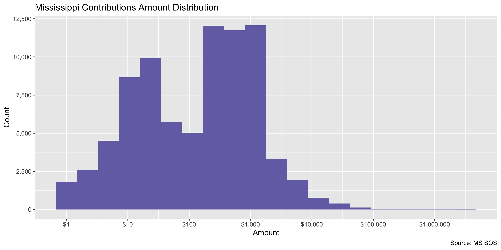
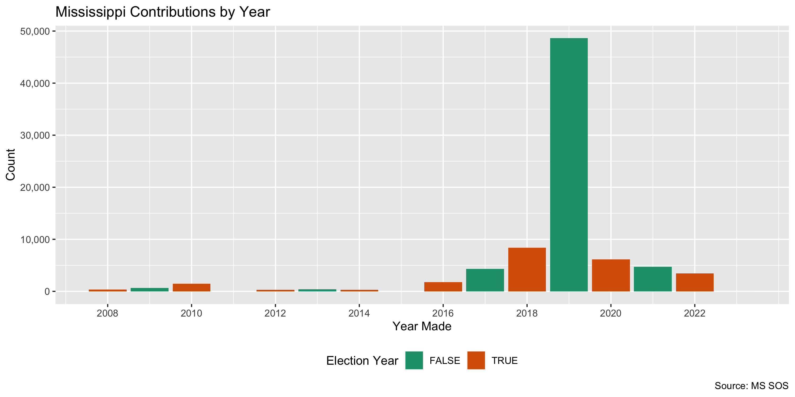
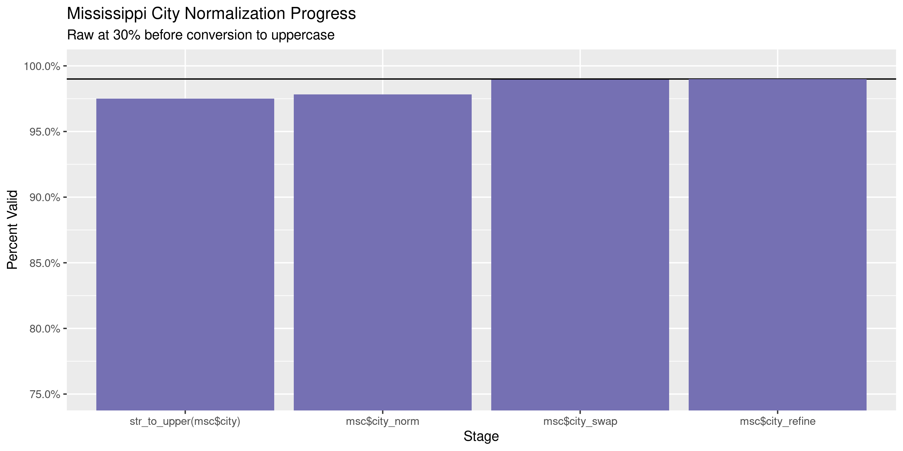
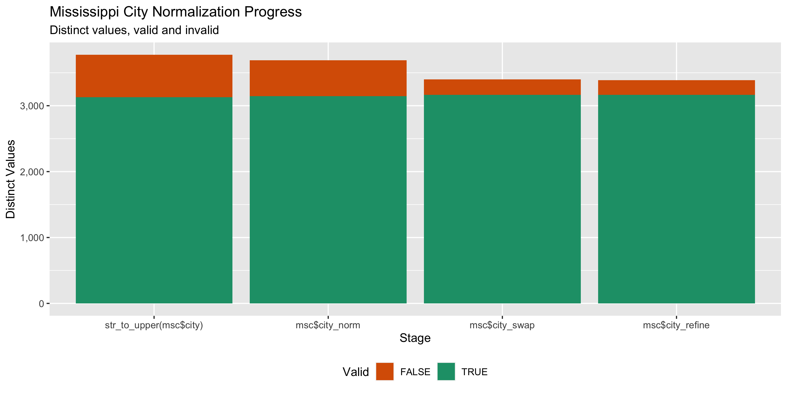

Mississippi Contributions
================
Kiernan Nicholls
Wed Aug 25 15:19:37 2021

-   [Project](#project)
-   [Objectives](#objectives)
-   [Packages](#packages)
-   [Data](#data)
-   [Download](#download)
-   [Read](#read)
-   [Explore](#explore)
    -   [Missing](#missing)
    -   [Duplicates](#duplicates)
    -   [Categorical](#categorical)
    -   [Amounts](#amounts)
    -   [Dates](#dates)
-   [Wrangle](#wrangle)
    -   [Address](#address)
    -   [ZIP](#zip)
    -   [State](#state)
    -   [City](#city)
-   [Conclude](#conclude)
-   [Export](#export)
-   [Upload](#upload)

<!-- Place comments regarding knitting here -->

## Project

The Accountability Project is an effort to cut across data silos and
give journalists, policy professionals, activists, and the public at
large a simple way to search across huge volumes of public data about
people and organizations.

Our goal is to standardize public data on a few key fields by thinking
of each dataset row as a transaction. For each transaction there should
be (at least) 3 variables:

1.  All **parties** to a transaction.
2.  The **date** of the transaction.
3.  The **amount** of money involved.

## Objectives

This document describes the process used to complete the following
objectives:

1.  How many records are in the database?
2.  Check for entirely duplicated records.
3.  Check ranges of continuous variables.
4.  Is there anything blank or missing?
5.  Check for consistency issues.
6.  Create a five-digit ZIP Code called `zip`.
7.  Create a `year` field from the transaction date.
8.  Make sure there is data on both parties to a transaction.

## Packages

The following packages are needed to collect, manipulate, visualize,
analyze, and communicate these results. The `pacman` package will
facilitate their installation and attachment.

``` r
if (!require("pacman")) {
  install.packages("pacman")
}
pacman::p_load(
  tidyverse, # data manipulation
  lubridate, # datetime strings
  gluedown, # printing markdown
  jsonlite, # convert json table
  janitor, # clean data frames
  campfin, # custom irw tools
  aws.s3, # aws cloud storage
  refinr, # cluster & merge
  scales, # format strings
  knitr, # knit documents
  vroom, # fast reading
  rvest, # scrape html
  glue, # code strings
  here, # project paths
  httr, # http requests
  fs # local storage 
)
```

This document should be run as part of the `R_campfin` project, which
lives as a sub-directory of the more general, language-agnostic
[`irworkshop/accountability_datacleaning`](https://github.com/irworkshop/accountability_datacleaning)
GitHub repository.

The `R_campfin` project uses the [RStudio
projects](https://support.rstudio.com/hc/en-us/articles/200526207-Using-Projects)
feature and should be run as such. The project also uses the dynamic
`here::here()` tool for file paths relative to *your* machine.

``` r
# where does this document knit?
here::i_am("ms/contribs/docs/ms_contribs_diary.Rmd")
```

## Data

Mississippi contributions can be found from the Secretary of State’s
online [campaign finance
portal](https://cfportal.sos.ms.gov/online/portal/cf/page/cf-search/Portal.aspx).

The portal makes two notes:

1.  Only contributions in excess of $200.00 are required to be itemized.
2.  (Disclosures submitted prior to 10/1/2016 are located on the
    [Secretary of State’s Campaign Finance Filings
    Search.](http://www.sos.ms.gov/Elections-Voting/Pages/Campaign-Finance-Search.aspx))

These two factors will limit the overall number of contributions we will
be able to download. Prior to FY2017, all contributions were filed in
paper format and can only be found in electronic scans. No bulk data is
available before 2016.

> #### Reliability and Quality of Data
>
> While campaign finance reports filed manually by paper, as opposed to
> electronically through the website, may be accessed and reviewed, the
> data and contents are not searchable by specific criteria. Only the
> data and contents of campaign finance reports filed electronically
> through the website are searchable by specific criteria such as by
> candidate or political committee name, office, expenditure or
> contribution.
>
> The information available on the Campaign Finance filing website is
> provided by the individual candidates, political committees or their
> designated representatives who file campaign finance disclosure
> reports with the Mississippi Secretary of State’s Office. The
> Secretary of State is without the legal authority or obligation to
> verify the data or investigate its accuracy.
>
> Data anticipated to be published or publicly disseminated should be
> confirmed with the candidate or political committee.
>
> \*For questions, contact the Elections Division at
> <CampaignFinance@sos.ms.gov> or 601-576-2550.

While all candidates must file a disclosure, it appears as if campaigns
still have the option of filing their reports in person.

> All candidates for public office, and political committees supporting
> or opposing a candidate or balloted measure, must file campaign
> finance disclosure reports in accordance with the applicable schedule.
> Candidates for statewide, state-district, legislative and judicial
> office, and political committees supporting or opposing those
> candidates or statewide balloted measures, file campaign finance
> disclosure reports with the Secretary of State. These reports either
> may be filed electronically through the Secretary of State’s campaign
> finance online filing system or by paper, filed with the Secretary of
> State by mail, email or fax prior to the applicable reporting
> deadline.

## Download

``` r
raw_dir <- dir_create(here("ms", "contrib", "data", "raw"))
raw_json <- path(raw_dir, "ms_contribs.json")
```

``` r
ms_home <- GET("https://cfportal.sos.ms.gov/online/portal/cf/page/cf-search/Portal.aspx")
ms_cook <- cookies(ms_home)
sesh_id <- setNames(ms_cook$value, nm = ms_cook$name)
```

``` r
if (!file_exists(raw_json)) {
  ms_post <- POST(
    "https://cfportal.sos.ms.gov/online/Services/MS/CampaignFinanceServices.asmx/ContributionSearch",
    write_disk(raw_json, overwrite = TRUE),
    set_cookies(sesh_id),
    encode = "json",
    body = list(
      AmountPaid = "",
      BeginDate = "",
      CandidateName = "",
      CommitteeName = "",
      ContributionType = "Any",
      Description = "",
      EndDate = "",
      EntityName = "",
      InKindAmount = ""
    )
  )
}
```

## Read

``` r
msc <- fromJSON(raw_json, simplifyDataFrame = TRUE)
msc <- fromJSON(msc$d)[[1]]
msc <- type_convert(
  df = as_tibble(msc),
  na = "",
  col_types = cols(
    Date = col_datetime("%m/%d/%Y %I:%M:%S %p"),
    Amount = col_number()
  )
)
```

``` r
msc <- clean_names(msc, case = "snake")
```

## Explore

There are 72,379 rows of 14 columns. Each record represents a single
contribution made from an individual to a committee.

``` r
glimpse(msc)
#> Rows: 72,379
#> Columns: 14
#> $ recipient        <chr> "Theresa Gillespie Isom for State Rep District 7 Desoto County", "Shane Barnett", "Friends of…
#> $ reference_number <chr> "CF201915576", "CF20187220", "CF201915596", "CF201915574", "CF201916179", "CF20183616", "CF20…
#> $ filing_desc      <chr> "Theresa Gillespie Isom for State Rep Dist 7 Desoto County 7/30/2019 Primary Pre-Election For…
#> $ filing_id        <chr> "ad3e429a-bac7-48b0-811d-985000b0f84a", "728df378-2bd1-4676-8c6c-ffcd2b5af491", "fc04cabf-c06…
#> $ contributor      <chr> "Phillip Bowden", "Contene", "Dawn McLeod", "Dawn McLeod", "Paul McCulloch", "Thomas D. Fried…
#> $ contributor_type <chr> "Individual", "Corporation", "Individual", "Individual", "Individual", "Individual", "Individ…
#> $ address_line1    <chr> "6005 Willow Oaks Dr", "7700 Forsyth Boulevard", "12224 Rebekah Drive", "12224 Rebekah Drive"…
#> $ city             <chr> "Memphis", "St Louis", "Gulfport", "Gulfport", "Zephyr Cove", "Houston", "Yazoo City", "Jacks…
#> $ state_code       <chr> "TN", "MO", "MS", "MS", "NV", "TX", "MS", "MS", "MS", "MS", "MS", "MS", "MS", "MS", "MS", "MS…
#> $ postal_code      <chr> "38120", "39367", "39503", "39503", "89448", "77077", "39194", "39225-4355", "39110", "38121"…
#> $ in_kind          <chr> NA, NA, NA, NA, NA, NA, NA, NA, NA, NA, NA, NA, NA, NA, NA, NA, NA, NA, NA, NA, NA, NA, NA, N…
#> $ occupation       <chr> "Doctor", "N/A", "Coast Waterworks, Inc.", "Coast Waterworks, Inc.", "Computador/ Apex Comput…
#> $ date             <dttm> 2019-07-23, 2018-11-14, 2019-07-22, 2019-07-22, 2019-07-28, 2017-12-07, 2019-08-10, 2019-08-…
#> $ amount           <dbl> 2.50e+02, 5.00e+02, 5.00e+02, 5.00e+02, 1.47e+00, 2.50e+03, 1.50e+03, 1.20e+06, 3.00e+02, 1.0…
tail(msc)
#> # A tibble: 6 × 14
#>   recipient           reference_number filing_desc filing_id contributor contributor_type address_line1 city  state_code
#>   <chr>               <chr>            <chr>       <chr>     <chr>       <chr>            <chr>         <chr> <chr>     
#> 1 Tate for Governor   CF201918472      Tate for G… 12a4c851… Zurich Ame… Corporation      1299 Zurich … Scha… IL        
#> 2 Tate for Governor   CF202019635      Tate for G… 54b0b8bf… Zurich Ame… Corporation      1299 Zurich … Scha… IL        
#> 3 ActBlue Mississippi CF201910418      ActBlue Mi… b74199f0… ZVOSEC, DE… Individual       4741 HUMBOLD… MINN… MN        
#> 4 ActBlue Mississippi CF201910418      ActBlue Mi… b74199f0… ZWEGO, JEF… Individual       15032 W. 146… OLAT… KS        
#> 5 ActBlue Mississippi CF201910417      ActBlue Mi… 01d43326… ZWIEBEL, G… Individual       5311 E. HINS… CENT… CO        
#> 6 ActBlue Mississippi CF201910417      ActBlue Mi… 01d43326… ZWIER-SWAN… Individual       322 GILLETT … WAUK… IL        
#> # … with 5 more variables: postal_code <chr>, in_kind <chr>, occupation <chr>, date <dttm>, amount <dbl>
```

### Missing

Columns vary in their degree of missing values.

``` r
col_stats(msc, count_na)
#> # A tibble: 14 × 4
#>    col              class      n        p
#>    <chr>            <chr>  <int>    <dbl>
#>  1 recipient        <chr>      0 0       
#>  2 reference_number <chr>      0 0       
#>  3 filing_desc      <chr>      0 0       
#>  4 filing_id        <chr>      0 0       
#>  5 contributor      <chr>      0 0       
#>  6 contributor_type <chr>      0 0       
#>  7 address_line1    <chr>     51 0.000705
#>  8 city             <chr>     94 0.00130 
#>  9 state_code       <chr>     96 0.00133 
#> 10 postal_code      <chr>    157 0.00217 
#> 11 in_kind          <chr>  72371 1.00    
#> 12 occupation       <chr>   8278 0.114   
#> 13 date             <dttm>     0 0       
#> 14 amount           <dbl>      0 0
```

We can flag any record missing a key variable needed to identify a
transaction.

``` r
key_vars <- c("date", "contributor", "amount", "recipient")
msc <- flag_na(msc, all_of(key_vars))
sum(msc$na_flag)
#> [1] 0
```

### Duplicates

We can also flag any record completely duplicated across every column.

``` r
msc <- flag_dupes(msc, everything())
sum(msc$dupe_flag)
#> [1] 999
```

``` r
msc %>% 
  filter(dupe_flag) %>% 
  select(all_of(key_vars)) %>% 
  arrange(date)
#> # A tibble: 999 × 4
#>    date                contributor                amount recipient             
#>    <dttm>              <chr>                       <dbl> <chr>                 
#>  1 2009-06-22 00:00:00 Gouras & Associates           250 Friends of Phil Bryant
#>  2 2009-06-22 00:00:00 Gouras & Associates           250 Friends of Phil Bryant
#>  3 2009-07-16 00:00:00 MS Assoc of Realtors         1000 Friends of Phil Bryant
#>  4 2009-07-16 00:00:00 MS Assoc of Realtors         1000 Friends of Phil Bryant
#>  5 2009-07-17 00:00:00 Desoto Co Republican Party    525 Friends of Phil Bryant
#>  6 2009-07-17 00:00:00 Desoto Co Republican Party    525 Friends of Phil Bryant
#>  7 2009-07-17 00:00:00 Dr. Jason K. Coleman         1000 Friends of Phil Bryant
#>  8 2009-07-17 00:00:00 Dr. Jason K. Coleman         1000 Friends of Phil Bryant
#>  9 2009-07-31 00:00:00 Denbury Resources PAC        2000 Friends of Phil Bryant
#> 10 2009-07-31 00:00:00 Denbury Resources PAC        2000 Friends of Phil Bryant
#> # … with 989 more rows
```

### Categorical

``` r
col_stats(msc, n_distinct)
#> # A tibble: 16 × 4
#>    col              class      n         p
#>    <chr>            <chr>  <int>     <dbl>
#>  1 recipient        <chr>    358 0.00495  
#>  2 reference_number <chr>   2056 0.0284   
#>  3 filing_desc      <chr>   1748 0.0242   
#>  4 filing_id        <chr>   2056 0.0284   
#>  5 contributor      <chr>  34208 0.473    
#>  6 contributor_type <chr>     72 0.000995 
#>  7 address_line1    <chr>  32754 0.453    
#>  8 city             <chr>   4662 0.0644   
#>  9 state_code       <chr>     77 0.00106  
#> 10 postal_code      <chr>  10380 0.143    
#> 11 in_kind          <chr>      9 0.000124 
#> 12 occupation       <chr>   7275 0.101    
#> 13 date             <dttm>  2331 0.0322   
#> 14 amount           <dbl>   1834 0.0253   
#> 15 na_flag          <lgl>      1 0.0000138
#> 16 dupe_flag        <lgl>      2 0.0000276
```

### Amounts

As noted on the portal page, only contributions above $200 need to be
itemized. Just over half of all contributions in the data are over $200.

``` r
summary(msc$amount)
#>    Min. 1st Qu.  Median    Mean 3rd Qu.    Max. 
#>       0      20     200    1614     500 3200000
mean(msc$amount <= 0)
#> [1] 0.0001381616
mean(msc$amount >= 200)
#> [1] 0.5084071
```

These are the records with the minimum and maximum amounts.

``` r
glimpse(msc[c(which.max(msc$amount), which.min(msc$amount)), ])
#> Rows: 2
#> Columns: 16
#> $ recipient        <chr> "Tate for Governor", "Brent Bailey for MPSC"
#> $ reference_number <chr> "CF201916965", "CF201918760"
#> $ filing_desc      <chr> "Tate for Governor 8/20/2019 Primary Runoff Pre-Election Form Filing- Amended", "Brent Bailey…
#> $ filing_id        <chr> "3852a8ff-1848-491b-8d54-24dc19dfed89", "a67d7fb6-992d-4447-bb2f-b350d3d0ced2"
#> $ contributor      <chr> "Tate Reeves", "Ben James"
#> $ contributor_type <chr> "Other", "Other"
#> $ address_line1    <chr> "PO Box 24355", "1700 N 7th Ave"
#> $ city             <chr> "Jackson", "Laurel"
#> $ state_code       <chr> "MS", "MS"
#> $ postal_code      <chr> "39225-4355", "39440"
#> $ in_kind          <chr> NA, "Luncheon"
#> $ occupation       <chr> "Unknown", NA
#> $ date             <dttm> 2019-08-09, 2019-11-04
#> $ amount           <dbl> 3200000, 0
#> $ na_flag          <lgl> FALSE, FALSE
#> $ dupe_flag        <lgl> FALSE, FALSE
```

<!-- -->

### Dates

We can add the calendar year from `date` with `lubridate::year()`

``` r
msc <- mutate(msc, year = year(date))
```

``` r
min(msc$date)
#> [1] "2001-01-29 UTC"
sum(msc$year < 2000)
#> [1] 0
max(msc$date)
#> [1] "2025-03-26 UTC"
sum(msc$date > today())
#> [1] 3
```

<!-- -->

## Wrangle

To improve the searchability of the database, we will perform some
consistent, confident string normalization. For geographic variables
like city names and ZIP codes, the corresponding `campfin::normal_*()`
functions are tailor made to facilitate this process.

### Address

For the street `addresss` variable, the `campfin::normal_address()`
function will force consistence case, remove punctuation, and abbreviate
official USPS suffixes.

``` r
msc <- msc %>% 
  mutate(
    address_norm = normal_address(
      address = address_line1,
      abbs = usps_street,
      na_rep = TRUE
    )
  )
```

``` r
msc %>% 
  select(contains("address")) %>% 
  distinct() %>% 
  sample_n(10)
#> # A tibble: 10 × 2
#>    address_line1                            address_norm                           
#>    <chr>                                    <chr>                                  
#>  1 40260 Lackey Road                        40260 LACKEY RD                        
#>  2 3166 WINDCREST DR NE                     3166 WINDCREST DR NE                   
#>  3 2302 ORCHARD RD.                         2302 ORCHARD RD                        
#>  4 4201 Cathedral Avenue Northwest, Apt 404 4201 CATHEDRAL AVENUE NORTHWEST APT 404
#>  5 2078 Lake Washington Rd E                2078 LAKE WASHINGTON RD E              
#>  6 1407 Greenway Cove                       1407 GREENWAY CV                       
#>  7 509 Arbor Drive                          509 ARBOR DR                           
#>  8 429 S Katherine Drive                    429 S KATHERINE DR                     
#>  9 1220 Highland Colony Pkwy                1220 HIGHLAND COLONY PKWY              
#> 10 167 S FOUNDERS CT                        167 S FOUNDERS CT
```

### ZIP

For ZIP codes, the `campfin::normal_zip()` function will attempt to
create valid *five* digit codes by removing the ZIP+4 suffix and
returning leading zeroes dropped by other programs like Microsoft Excel.

``` r
msc <- msc %>% 
  mutate(
    zip_norm = normal_zip(
      zip = postal_code,
      na_rep = TRUE
    )
  )
```

``` r
progress_table(
  msc$postal_code,
  msc$zip_norm,
  compare = valid_zip
)
#> # A tibble: 2 × 6
#>   stage           prop_in n_distinct prop_na n_out n_diff
#>   <chr>             <dbl>      <dbl>   <dbl> <dbl>  <dbl>
#> 1 msc$postal_code   0.719      10380 0.00217 20321   5522
#> 2 msc$zip_norm      0.966       6736 0.00307  2474   1183
```

### State

Valid two digit state abbreviations can be made using the
`campfin::normal_state()` function.

``` r
msc <- msc %>% 
  mutate(
    state_norm = normal_state(
      state = state_code,
      abbreviate = TRUE,
      na_rep = TRUE,
      valid = valid_state
    )
  )
```

``` r
msc %>% 
  filter(state_code != state_norm) %>% 
  count(state_code, state_norm, sort = TRUE)
#> # A tibble: 3 × 3
#>   state_code state_norm     n
#>   <chr>      <chr>      <int>
#> 1 Ms         MS             6
#> 2 Arkansas   AR             1
#> 3 Tx         TX             1
```

``` r
progress_table(
  msc$state_code,
  msc$state_norm,
  compare = valid_state
)
#> # A tibble: 2 × 6
#>   stage          prop_in n_distinct prop_na n_out n_diff
#>   <chr>            <dbl>      <dbl>   <dbl> <dbl>  <dbl>
#> 1 msc$state_code    1.00         77 0.00133    32     19
#> 2 msc$state_norm    1            58 0.00170     0      1
```

### City

Cities are the most difficult geographic variable to normalize, simply
due to the wide variety of valid cities and formats.

#### Normal

The `campfin::normal_city()` function is a good start, again converting
case, removing punctuation, but *expanding* USPS abbreviations. We can
also remove `invalid_city` values.

``` r
norm_city <- msc %>% 
  distinct(city, state_norm, zip_norm) %>% 
  mutate(
    city_norm = normal_city(
      city = city, 
      abbs = usps_city,
      states = c("MS", "DC", "MISSISSIPPI"),
      na = invalid_city,
      na_rep = TRUE
    )
  )
```

#### Swap

We can further improve normalization by comparing our normalized value
against the *expected* value for that record’s state abbreviation and
ZIP code. If the normalized value is either an abbreviation for or very
similar to the expected value, we can confidently swap those two.

``` r
norm_city <- norm_city %>% 
  rename(city_raw = city) %>% 
  left_join(
    y = zipcodes,
    by = c(
      "state_norm" = "state",
      "zip_norm" = "zip"
    )
  ) %>% 
  rename(city_match = city) %>% 
  mutate(
    match_abb = is_abbrev(city_norm, city_match),
    match_dist = str_dist(city_norm, city_match),
    city_swap = if_else(
      condition = !is.na(match_dist) & (match_abb | match_dist == 1),
      true = city_match,
      false = city_norm
    )
  ) %>% 
  select(
    -city_match,
    -match_dist,
    -match_abb
  )
```

``` r
msc <- left_join(
  x = msc,
  y = norm_city,
  by = c(
    "city" = "city_raw", 
    "state_norm", 
    "zip_norm"
  )
)
```

#### Refine

The [OpenRefine](https://openrefine.org/) algorithms can be used to
group similar strings and replace the less common versions with their
most common counterpart. This can greatly reduce inconsistency, but with
low confidence; we will only keep any refined strings that have a valid
city/state/zip combination.

``` r
good_refine <- msc %>% 
  mutate(
    city_refine = city_swap %>% 
      key_collision_merge() %>% 
      n_gram_merge(numgram = 1)
  ) %>% 
  filter(city_refine != city_swap) %>% 
  inner_join(
    y = zipcodes,
    by = c(
      "city_refine" = "city",
      "state_norm" = "state",
      "zip_norm" = "zip"
    )
  )
```

    #> # A tibble: 12 × 5
    #>    state_norm zip_norm city_swap                city_refine       n
    #>    <chr>      <chr>    <chr>                    <chr>         <int>
    #>  1 MS         39540    D LBERVILLE              DIBERVILLE       12
    #>  2 MS         39167    STARSTAR                 STAR              3
    #>  3 CA         94117    SAN FRANSICO             SAN FRANCISCO     1
    #>  4 FL         33483    DELRAY BEACHDELRAY BEACH DELRAY BEACH      1
    #>  5 GA         30005    ALPHARARETTA             ALPHARETTA        1
    #>  6 GA         30577    TOCCATA                  TOCCOA            1
    #>  7 LA         70119    NEW ORLEANS LA           NEW ORLEANS       1
    #>  8 MO         65201    COLUMBIA MO              COLUMBIA          1
    #>  9 MS         38664    ROBBINSVILLE             ROBINSONVILLE     1
    #> 10 MS         39465    PATEL                    PETAL             1
    #> 11 PA         19130    PHILADELPHIA PA          PHILADELPHIA      1
    #> 12 VA         22309    ALEXANDRIA NDRIA         ALEXANDRIA        1

Then we can join the refined values back to the database.

``` r
msc <- msc %>% 
  left_join(good_refine, by = names(.)) %>% 
  mutate(city_refine = coalesce(city_refine, city_swap))
```

#### Progress

Our goal for normalization was to increase the proportion of city values
known to be valid and reduce the total distinct values by correcting
misspellings.

| stage                    | prop\_in | n\_distinct | prop\_na | n\_out | n\_diff |
|:-------------------------|---------:|------------:|---------:|-------:|--------:|
| `str_to_upper(msc$city)` |    0.975 |        3676 |    0.001 |   1800 |     599 |
| `msc$city_norm`          |    0.978 |        3594 |    0.002 |   1576 |     501 |
| `msc$city_swap`          |    0.989 |        3330 |    0.002 |    759 |     220 |
| `msc$city_refine`        |    0.990 |        3318 |    0.002 |    735 |     209 |

You can see how the percentage of valid values increased with each
stage.

<!-- -->

More importantly, the number of distinct values decreased each stage. We
were able to confidently change many distinct invalid values to their
valid equivalent.

<!-- -->

## Conclude

Before exporting, we can remove the intermediary normalization columns
and rename all added variables with the `_clean` suffix.

``` r
msc <- msc %>% 
  select(
    -city_norm,
    -city_swap,
    city_clean = city_refine
  ) %>% 
  rename_all(~str_replace(., "_norm", "_clean")) %>% 
  rename_all(~str_remove(., "_raw")) %>% 
  relocate(address_clean, city_clean, state_clean, zip_clean, .after = last_col())
```

``` r
glimpse(sample_n(msc, 50))
#> Rows: 50
#> Columns: 21
#> $ recipient        <chr> "ActBlue Mississippi", "Mississippi Medical PAC", "Liberty Mutual Insurance Company PAC", "Fr…
#> $ reference_number <chr> "CF201910416", "CF202121583", "CF201917330", "CFL0004767", "CFL0004767", "CF202020199", "CF20…
#> $ filing_desc      <chr> "ActBlue Mississippi State/District 10/10/2019 Periodic Report", "Mississippi Medical PAC  1/…
#> $ filing_id        <chr> "066d93ca-c8f6-4427-b49b-21dcafd0ca76", "a8f8039f-eadb-40e6-9461-8ff1ebb01862", "0a7770cf-074…
#> $ contributor      <chr> "JONES, GRACE", "Lee Voulters", "Ross A Powell", "Mr. Larry McAlexander", "Dees Management Gr…
#> $ contributor_type <chr> "Individual", "Individual", "Individual", "Individual", "Corporation", "Individual", "Individ…
#> $ address_line1    <chr> "60 CR 116", "1340 Broad Ave Ste 440", "7900 Windrose Ave", "Post Office Box 1041", "8440 Blu…
#> $ city             <chr> "CORINTH", "Gulfport", "Plano", "Oxford", "Baton Rouge", "Jackson", "Ridgeland", "FRESNO", "I…
#> $ state_code       <chr> "MS", "MS", "TX", "MS", "LA", "MS", "MS", "CA", "IN", "MS", "CA", "MS", "IL", "FL", "TX", "MS…
#> $ postal_code      <chr> "38834", "39501-2460", "75024-0266", "38655", "70810", "39211", "39180", "93711", "46240-3702…
#> $ in_kind          <chr> NA, NA, NA, NA, NA, NA, NA, NA, NA, NA, NA, NA, NA, NA, NA, NA, NA, NA, NA, NA, NA, NA, NA, N…
#> $ occupation       <chr> "NOT EMPLOYED", "Memorial Hospital", "Sr Claims Field Manager", "Owner", NA, "Physician", "Ba…
#> $ date             <dttm> 2019-09-18 00:00:00, 2020-01-26 00:00:00, 2019-12-20 00:00:00, 2010-12-06 00:00:00, 2010-10-…
#> $ amount           <dbl> 2.00, 208.33, 29.70, 5000.00, 1000.00, 250.00, 90.00, 1.43, 27.63, 250.00, 39.03, 400.00, 250…
#> $ na_flag          <lgl> FALSE, FALSE, FALSE, FALSE, FALSE, FALSE, FALSE, FALSE, FALSE, FALSE, FALSE, FALSE, FALSE, FA…
#> $ dupe_flag        <lgl> FALSE, FALSE, FALSE, FALSE, FALSE, FALSE, FALSE, FALSE, FALSE, FALSE, FALSE, TRUE, TRUE, FALS…
#> $ year             <dbl> 2019, 2020, 2019, 2010, 2010, 2020, 2020, 2019, 2019, 2019, 2019, 2017, 2019, 2019, 2019, 201…
#> $ address_clean    <chr> "60 CR 116", "1340 BROAD AVE STE 440", "7900 WINDROSE AVE", "POST OFFICE BOX 1041", "8440 BLU…
#> $ city_clean       <chr> "CORINTH", "GULFPORT", "PLANO", "OXFORD", "BATON ROUGE", "JACKSON", "RIDGELAND", "FRESNO", "I…
#> $ state_clean      <chr> "MS", "MS", "TX", "MS", "LA", "MS", "MS", "CA", "IN", "MS", "CA", "MS", "IL", "FL", "TX", "MS…
#> $ zip_clean        <chr> "38834", "39501", "75024", "38655", "70810", "39211", "39180", "93711", "46240", "38655", "92…
```

1.  There are 72,379 records in the database.
2.  There are 999 duplicate records in the database.
3.  The range and distribution of `amount` and `date` seem reasonable.
4.  There are 0 records missing key variables.
5.  Consistency in geographic data has been improved with
    `campfin::normal_*()`.
6.  The 4-digit `year` variable has been created with
    `lubridate::year()`.

## Export

Now the file can be saved on disk for upload to the Accountability
server.

``` r
clean_dir <- dir_create(here("ms", "contribs", "data", "clean"))
clean_path <- path(clean_dir, "ms_contribs_20161001-20210825.csv")
write_csv(msc, clean_path, na = "")
(clean_size <- file_size(clean_path))
#> 20.5M
```

## Upload

We can use the `aws.s3::put_object()` to upload the text file to the IRW
server.

``` r
aws_path <- path("csv", basename(clean_path))
if (!object_exists(aws_path, "publicaccountability")) {
  put_object(
    file = clean_path,
    object = aws_path, 
    bucket = "publicaccountability",
    acl = "public-read",
    show_progress = TRUE,
    multipart = TRUE
  )
}
aws_head <- head_object(aws_path, "publicaccountability")
(aws_size <- as_fs_bytes(attr(aws_head, "content-length")))
unname(aws_size == clean_size)
```
