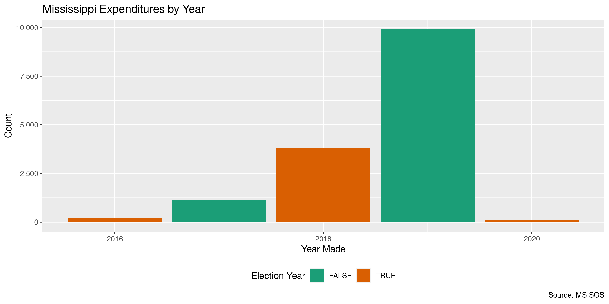

Mississippi Expenditures
================
Kiernan Nicholls & Yanqi Xu
2023-02-21 23:52:05

- <a href="#project" id="toc-project">Project</a>
- <a href="#objectives" id="toc-objectives">Objectives</a>
- <a href="#packages" id="toc-packages">Packages</a>
- <a href="#data" id="toc-data">Data</a>
- <a href="#download" id="toc-download">Download</a>
- <a href="#read" id="toc-read">Read</a>
- <a href="#explore" id="toc-explore">Explore</a>
- <a href="#wrangle" id="toc-wrangle">Wrangle</a>
- <a href="#conclude" id="toc-conclude">Conclude</a>
- <a href="#export" id="toc-export">Export</a>
- <a href="#upload" id="toc-upload">Upload</a>
- <a href="#dictionary" id="toc-dictionary">Dictionary</a>

<!-- Place comments regarding knitting here -->

## Project

The Accountability Project is an effort to cut across data silos and
give journalists, policy professionals, activists, and the public at
large a simple way to search across huge volumes of public data about
people and organizations.

Our goal is to standardizing public data on a few key fields by thinking
of each dataset row as a transaction. For each transaction there should
be (at least) 3 variables:

1.  All **parties** to a transaction.
2.  The **date** of the transaction.
3.  The **amount** of money involved.

## Objectives

This document describes the process used to complete the following
objectives:

1.  How many records are in the database?
2.  Check for entirely duplicated records.
3.  Check ranges of continuous variables.
4.  Is there anything blank or missing?
5.  Check for consistency issues.
6.  Create a five-digit ZIP Code called `zip`.
7.  Create a `year` field from the transaction date.
8.  Make sure there is data on both parties to a transaction.

## Packages

The following packages are needed to collect, manipulate, visualize,
analyze, and communicate these results. The `pacman` package will
facilitate their installation and attachment.

The IRW’s `campfin` package will also have to be installed from GitHub.
This package contains functions custom made to help facilitate the
processing of campaign finance data.

``` r
if (!require("pacman")) install.packages("pacman")
pacman::p_load_gh("irworkshop/campfin")
pacman::p_load(
  tidyverse, # data manipulation
  lubridate, # datetime strings
  gluedown, # printing markdown
  magrittr, # pipe operators
  janitor, # clean data frames
  readxl, # read excel files
  refinr, # cluster and merge
  scales, # format strings
  knitr, # knit documents
  vroom, # read files fast
  rvest, # html scraping
  glue, # combine strings
  here, # relative paths
  httr, # http requests
  fs # local storage 
)
```

This document should be run as part of the `R_campfin` project, which
lives as a sub-directory of the more general, language-agnostic
[`irworkshop/accountability_datacleaning`](https://github.com/irworkshop/accountability_datacleaning)
GitHub repository.

The `R_campfin` project uses the [RStudio
projects](https://support.rstudio.com/hc/en-us/articles/200526207-Using-Projects)
feature and should be run as such. The project also uses the dynamic
`here::here()` tool for file paths relative to *your* machine.

``` r
# where does this document knit?
here::here()
#> [1] "/Users/yanqixu/code/accountability_datacleaning"
```

## Data

Expenditure data is retrieving from the Mississippi Secretary of State’s
campaign finance portal. The portal only contains records from October
2016 and onwards.

> (Disclosures submitted prior to 10/1/2016 are located on the
> [Secretary of State’s Campaign Finance Filings
> Search](http://www.sos.ms.gov/Elections-Voting/Pages/Campaign-Finance-Search.aspx).)

## Download

We can run an empty search using the start date and current dates. The
next update should start on `2023-01-29`.

``` r
raw_dir <- dir_create(here("state","ms", "expends", "data", "raw"))
raw_exp_json <- path(raw_dir, "ms_expends.json")
```

``` r
ms_home <- GET("https://cfportal.sos.ms.gov/online/portal/cf/page/cf-search/Portal.aspx")
ms_cook <- cookies(ms_home)
sesh_id <- setNames(ms_cook$value, nm = ms_cook$name)
```

``` r
ms_exp_post <- POST(
  url = "https://cfportal.sos.ms.gov/online/Services/MS/CampaignFinanceServices.asmx/ExpenditureSearch",
   write_disk(raw_exp_json, overwrite = TRUE),
    set_cookies(sesh_id),
    encode = "json",
  body = list(
    AmountPaid = "",
    BeginDate = "",
    CandidateName = "",
    CommitteeName = "",
    Description = "",
    EndDate = format(today(), "%m/%d/%Y"),
    EntityName = ""
  )
)
```

``` r
mse <- fromJSON(raw_exp_json, simplifyDataFrame = TRUE)
mse <- fromJSON(mse$d)[[1]]
mse <- type_convert(
  df = as_tibble(mse),
  na = "",
  col_types = cols(
    Date = col_datetime("%m/%d/%Y %I:%M:%S %p"),
    Amount = col_number()
  )
)
raw_path <- path(raw_dir, "ms_expends.csv")

mse %>% write_csv(raw_path)
```

## Read

The Excel file can be read with `readr::read_excel()`.

``` r
raw_path <- path(raw_dir, "ms_expends.csv")

mse <- read_csv(raw_path)

mse <- mse %>% clean_names()

mse <- mse %>% mutate(date = as.Date(date, format = "%Y-%m-%d"))
```

## Explore

``` r
glimpse(mse)
#> Rows: 21,580
#> Columns: 12
#> $ filer            <chr> "Friends of Abe Hudson, Jr.", "Committee to Elect Mark Maples", "Committ…
#> $ reference_number <chr> "CF201913083", "CF20184613", "CF20184613", "CF20184613", "CF202223933", …
#> $ filing_desc      <chr> "Friends of Abe Hudson, Jr. State/District 7/10/2019 Periodic Report", "…
#> $ filing_id        <chr> "15f42673-8357-443f-8efb-e48cafa37bc2", "c9264a25-b1d2-40da-ae75-08b5e46…
#> $ recipient        <chr> "Coalesce", "Facebook Ads", "Facebook Ads", "Facebook Ads", "Maggie Clar…
#> $ address_line1    <chr> "109 N State St", "1 Facebook Way", "1 Facebook Way", "1 Facebook Way", …
#> $ city             <chr> "Jackson", "Menlo Park", "Menlo Park", "Menlo Park", "Brandon", "Brandon…
#> $ state_code       <chr> "MS", "CA", "CA", "CA", "MS", "MS", "MS", "MS", "MS", "MS", "NV", "TX", …
#> $ postal_code      <chr> "39201", "94025", "94025", "94025", "39047", "39047", "39407", "38732", …
#> $ description      <chr> "Fundraiser Venue", NA, NA, NA, "Advertising", "Advertising", "CONSULTIN…
#> $ date             <date> 2019-06-06, 2018-11-05, 2018-11-06, 2018-11-29, 2022-10-04, 2022-10-04,…
#> $ amount           <dbl> 100.00, 200.00, 200.00, 148.40, 11072.00, 11072.00, 1200.00, 400.00, 400…
tail(mse)
#> # A tibble: 6 × 12
#>   filer     refer…¹ filin…² filin…³ recip…⁴ addre…⁵ city  state…⁶ posta…⁷ descr…⁸ date       amount
#>   <chr>     <chr>   <chr>   <chr>   <chr>   <chr>   <chr> <chr>   <chr>   <chr>   <date>      <dbl>
#> 1 Committe… CF2022… Commit… f08bd0… Zonta … P.O. B… Pasc… MS      39568-… Festiv… 2022-09-05   125 
#> 2 COMMITTE… CF2020… COMMIT… 184835… Zoom    3625 B… Alph… GA      30022   <NA>    2020-08-14   390.
#> 3 COMMITTE… CF2020… COMMIT… c80f70… Zoom    3625 B… Alph… GA      30022   <NA>    2020-10-13   216.
#> 4 COMMITTE… CF2020… COMMIT… 417424… Zoom    3625 B… Alph… GA      30022   <NA>    2020-11-13   648.
#> 5 ActBlue … CF2021… ActBlu… 29b07c… ZOSS, … 434 29… WEST… FL      33407   <NA>    2021-05-20     5 
#> 6 Committe… CF2019… Commit… ef6b76… Zykimb… 118 Co… Hatt… MS      39406   Chief … 2019-10-01  1000 
#> # … with abbreviated variable names ¹​reference_number, ²​filing_desc, ³​filing_id, ⁴​recipient,
#> #   ⁵​address_line1, ⁶​state_code, ⁷​postal_code, ⁸​description
```

### Missing

There are no missing values.

``` r
col_stats(mse, count_na)
#> # A tibble: 12 × 4
#>    col              class      n         p
#>    <chr>            <chr>  <int>     <dbl>
#>  1 filer            <chr>      0 0        
#>  2 reference_number <chr>      0 0        
#>  3 filing_desc      <chr>      0 0        
#>  4 filing_id        <chr>      0 0        
#>  5 recipient        <chr>      0 0        
#>  6 address_line1    <chr>      5 0.000232 
#>  7 city             <chr>      2 0.0000927
#>  8 state_code       <chr>     58 0.00269  
#>  9 postal_code      <chr>     58 0.00269  
#> 10 description      <chr>   5823 0.270    
#> 11 date             <date>     0 0        
#> 12 amount           <dbl>      0 0
```

### Duplicates

Duplicate values can be flagged.

``` r
mse <- flag_dupes(mse, everything())
sum(mse$dupe_flag)
#> [1] 239
```

There are 239

``` r
mse %>% 
  filter(dupe_flag) %>% 
  select(date, filer, amount, recipient)
#> # A tibble: 239 × 4
#>    date       filer                      amount recipient        
#>    <date>     <chr>                       <dbl> <chr>            
#>  1 2019-09-16 Friends of Abe Hudson, Jr.    50  Abe Hudson       
#>  2 2019-09-16 Friends of Abe Hudson, Jr.    50  Abe Hudson       
#>  3 2019-10-03 Philip Gunn Campaign          70  AMERICAN AIRLINES
#>  4 2019-10-03 Philip Gunn Campaign          70  AMERICAN AIRLINES
#>  5 2019-10-04 Friends of Joel Bomgar       894. Avignon LLC      
#>  6 2019-10-04 Friends of Joel Bomgar       894. Avignon LLC      
#>  7 2018-11-09 John Weddle                 1122. BBQ by Jim       
#>  8 2018-11-09 John Weddle                 1122. BBQ by Jim       
#>  9 2019-11-15 ActBlue Mississippi           25  BREWER, DEBRA    
#> 10 2019-11-15 ActBlue Mississippi           25  BREWER, DEBRA    
#> # … with 229 more rows
```

### Amounts

``` r
summary(mse$amount)
#>      Min.   1st Qu.    Median      Mean   3rd Qu.      Max. 
#>       0.0      95.9     342.8    3137.1    1000.0 2284014.0
percent(mean(mse$amount <= 0), 0.01)
#> [1] "0.04%"
```

<!-- -->

### Dates

We can add the calendar year from `date` with `lubridate::year()`

``` r
mse <- mutate(mse, year = year(date))
```

``` r
min(mse$date)
#> [1] "2000-06-07"
sum(mse$year < 2000)
#> [1] 0
max(mse$date)
#> [1] "2023-01-29"
sum(mse$date > today())
#> [1] 0
```

Since only one record was uploaded on Jan. 29, 2023 (time of this
update), we only include records until Jan. 28, 2023.

``` r
mse <- mse %>% filter(date <= as.Date("2023-01-28") & date >=as.Date("2016-01-01"))
```

<!-- -->

## Wrangle

To improve the searchability of the database, we will perform some
consistent, confident string normalization. For geographic variables
like city names and ZIP codes, the corresponding `campfin::normal_*()`
functions are tailor made to facilitate this process.

### Address

For the street `addresss` variable, the `campfin::normal_address()`
function will force consistence case, remove punctuation, and abbreviate
official USPS suffixes.

``` r
mse <- mse %>% 
  mutate(
    address_norm = normal_address(
      address = address_line1,
      abbs = usps_street,
      na_rep = TRUE
    )
  )
```

``` r
mse %>% 
  select(contains("address")) %>% 
  distinct() %>% 
  sample_n(10)
#> # A tibble: 10 × 2
#>    address_line1                     address_norm                     
#>    <chr>                             <chr>                            
#>  1 330 Locust Street                 330 LOCUST ST                    
#>  2 PO Box 947                        PO BOX 947                       
#>  3 419 Hanley Road                   419 HANLEY RD                    
#>  4 191 Green Street                  191 GREEN ST                     
#>  5 312 A FORREST BLVD                312 A FORREST BLVD               
#>  6 P.O. BOX 424                      PO BOX 424                       
#>  7 7501 UsSHighway 49                7501 USSHIGHWAY 49               
#>  8 501 N West St Building Suite 1101 501 N WEST ST BUILDING SUITE 1101
#>  9 1200 Lasalle St                   1200 LASALLE ST                  
#> 10 401 HWY 12 EAST 39759             401 HWY 12 EAST 39759
```

### ZIP

For ZIP codes, the `campfin::normal_zip()` function will attempt to
create valid *five* digit codes by removing the ZIP+4 suffix and
returning leading zeroes dropped by other programs like Microsoft Excel.

``` r
mse <- mse %>% 
  mutate(
    zip_norm = normal_zip(
      zip = postal_code,
      na_rep = TRUE
    )
  )
```

``` r
progress_table(
  mse$postal_code,
  mse$zip_norm,
  compare = valid_zip
)
#> # A tibble: 2 × 6
#>   stage           prop_in n_distinct prop_na n_out n_diff
#>   <chr>             <dbl>      <dbl>   <dbl> <dbl>  <dbl>
#> 1 mse$postal_code   0.948       1498 0.00269  1121    292
#> 2 mse$zip_norm      0.970       1367 0.00649   650    131
```

### State

Valid two digit state abbreviations can be made using the
`campfin::normal_state()` function.

``` r
mse <- mse %>% 
  mutate(
    state_norm = normal_state(
      state = state_code,
      abbreviate = TRUE,
      na_rep = TRUE,
      valid = valid_state
    )
  )
```

We can see that most of the states not in our `valid_state` database are
actually `NAs`, and it’s safe to leave them as is.

``` r
sum(mse$state_code %out% valid_state)
#> [1] 64

mse %>% 
  filter(state_code %out% valid_state) %>% 
  count(state_code, state_norm, sort = TRUE)
#> # A tibble: 5 × 3
#>   state_code state_norm     n
#>   <chr>      <chr>      <int>
#> 1 <NA>       <NA>          58
#> 2 AB         <NA>           2
#> 3 BV         <NA>           2
#> 4 NL         <NA>           1
#> 5 ON         <NA>           1
```

``` r
progress_table(
  mse$state_code,
  mse$state_norm,
  compare = valid_state
)
#> # A tibble: 2 × 6
#>   stage          prop_in n_distinct prop_na n_out n_diff
#>   <chr>            <dbl>      <dbl>   <dbl> <dbl>  <dbl>
#> 1 mse$state_code    1.00         54 0.00269     6      5
#> 2 mse$state_norm    1            50 0.00297     0      1
```

### City

Cities are the most difficult geographic variable to normalize, simply
due to the wide variety of valid cities and formats.

#### Normal

The `campfin::normal_city()` function is a good start, again converting
case, removing punctuation, but *expanding* USPS abbreviations. We can
also remove `invalid_city` values.

``` r
norm_city <- mse %>% 
  distinct(city, state_norm, zip_norm) %>% 
  mutate(
    city_norm = normal_city(
      city = city, 
      abbs = usps_city,
      states = c("MS", "DC", "MISSISSIPPI"),
      na = invalid_city,
      na_rep = TRUE
    )
  )
```

#### Swap

We can further improve normalization by comparing our normalized value
against the *expected* value for that record’s state abbreviation and
ZIP code. If the normalized value is either an abbreviation for or very
similar to the expected value, we can confidently swap those two.

``` r
norm_city <- norm_city %>% 
  rename(city_raw = city) %>% 
  left_join(
    y = zipcodes,
    by = c(
      "state_norm" = "state",
      "zip_norm" = "zip"
    )
  ) %>% 
  rename(city_match = city) %>% 
  mutate(
    match_abb = is_abbrev(city_norm, city_match),
    match_dist = str_dist(city_norm, city_match),
    city_swap = if_else(
      condition = !is.na(match_dist) & (match_abb | match_dist == 1),
      true = city_match,
      false = city_norm
    )
  ) %>% 
  select(
    -city_match,
    -match_dist,
    -match_abb
  )
```

``` r
mse <- left_join(
  x = mse,
  y = norm_city,
  by = c(
    "city" = "city_raw", 
    "state_norm", 
    "zip_norm"
  )
)
```

#### Refine

The [OpenRefine](https://openrefine.org/) algorithms can be used to
group similar strings and replace the less common versions with their
most common counterpart. This can greatly reduce inconsistency, but with
low confidence; we will only keep any refined strings that have a valid
city/state/zip combination.

``` r
good_refine <- mse %>% 
  mutate(
    city_refine = city_swap %>% 
      key_collision_merge() %>% 
      n_gram_merge(numgram = 1)
  ) %>% 
  filter(city_refine != city_swap) %>% 
  inner_join(
    y = zipcodes,
    by = c(
      "city_refine" = "city",
      "state_norm" = "state",
      "zip_norm" = "zip"
    )
  )
```

    #> # A tibble: 5 × 5
    #>   state_norm zip_norm city_swap         city_refine         n
    #>   <chr>      <chr>    <chr>             <chr>           <int>
    #> 1 MS         38671    SOUTH HAVEN       SOUTHAVEN           2
    #> 2 MS         38671    SOUTHAVEN STE     SOUTHAVEN           2
    #> 3 CA         92091    RANCHERO SANTA FE RANCHO SANTA FE     1
    #> 4 CA         94104    SAN FRANSICO      SAN FRANCISCO       1
    #> 5 NC         28202    CHAROLETTE        CHARLOTTE           1

Then we can join the refined values back to the database.

``` r
mse <- mse %>% 
  left_join(good_refine, by = names(.)) %>% 
  mutate(city_refine = coalesce(city_refine, city_swap))
```

#### Progress

Our goal for normalization was to increase the proportion of city values
known to be valid and reduce the total distinct values by correcting
misspellings.

| stage                    | prop_in | n_distinct | prop_na | n_out | n_diff |
|:-------------------------|--------:|-----------:|--------:|------:|-------:|
| `str_to_upper(mse$city)` |   0.976 |        927 |   0.000 |   518 |    191 |
| `mse$city_norm`          |   0.980 |        902 |   0.001 |   434 |    165 |
| `mse$city_swap`          |   0.996 |        792 |   0.001 |    88 |     47 |
| `mse$city_refine`        |   0.996 |        788 |   0.001 |    83 |     44 |

You can see how the percentage of valid values increased with each
stage.

<!-- -->

More importantly, the number of distinct values decreased each stage. We
were able to confidently change many distinct invalid values to their
valid equivalent.

<!-- -->

## Conclude

Before exporting, we can remove the intermediary normalization columns
and rename all added variables with the `_clean` suffix.

``` r
mse <- mse %>% 
  select(
    -city_norm,
    -city_swap,
    city_clean = city_refine
  ) %>% 
  rename_all(~str_replace(., "_norm", "_clean")) %>% 
  rename_all(~str_remove(., "_raw")) %>% 
  relocate(address_clean, city_clean, state_clean, zip_clean, .after = last_col())
```

``` r
glimpse(sample_n(mse, 50))
#> Rows: 50
#> Columns: 18
#> $ filer            <chr> "Joyce Meek Yates Campaign", "Delbert Hosemann", "Mississippi Dental PAC…
#> $ reference_number <chr> "CF202020599", "CF20172168", "CF202325926", "CF202121391", "CF202121572"…
#> $ filing_desc      <chr> "Joyce Meek Yates Campaign 9/15/2020 Special Pre-Election Form Filing", …
#> $ filing_id        <chr> "2cbd971a-2c8f-48ae-8255-3036715a7adf", "5c4f8943-fb16-40bd-b475-0501f16…
#> $ recipient        <chr> "Webster Progress Times", "Comcast", "Senator Hob Bryan", "Mississippi D…
#> $ address_line1    <chr> "P.O. Drawer D", "5915 I-55 North", "P. O. Box 75", "811 E River Pl", "P…
#> $ city             <chr> "Eupora", "Jackson", "Amory", "Jackson", "Jackson", "Los Angeles", "Clin…
#> $ state_code       <chr> "MS", "MS", "MS", "MS", "MS", "CA", "MS", "MS", "MS", "MS", "MS", "MS", …
#> $ postal_code      <chr> "39744", "39213", "38821", "39202", "39207", "90071", "39060", "38671", …
#> $ description      <chr> "Advertising", "Utilities", "Campaign Contribution", "Contribution", "Co…
#> $ date             <date> 2020-08-04, 2016-10-03, 2022-06-22, 2020-03-23, 2021-10-20, 2021-01-17,…
#> $ amount           <dbl> 125.00, 125.95, 2000.00, 40000.00, 5000.00, 1.75, 2500.00, 786.00, 3659.…
#> $ dupe_flag        <lgl> FALSE, FALSE, FALSE, FALSE, FALSE, FALSE, FALSE, FALSE, FALSE, FALSE, FA…
#> $ year             <dbl> 2020, 2016, 2022, 2020, 2021, 2021, 2018, 2019, 2020, 2018, 2018, 2018, …
#> $ address_clean    <chr> "PO DRAWER D", "5915 I55 N", "P O BOX 75", "811 E RIVER PL", "PO BOX 293…
#> $ city_clean       <chr> "EUPORA", "JACKSON", "AMORY", "JACKSON", "JACKSON", "LOS ANGELES", "CLIN…
#> $ state_clean      <chr> "MS", "MS", "MS", "MS", "MS", "CA", "MS", "MS", "MS", "MS", "MS", "MS", …
#> $ zip_clean        <chr> "39744", "39213", "38821", "39202", "39207", "90071", "39060", "38671", …
```

1.  There are 21,563 records in the database.
2.  There are 239 duplicate records in the database.
3.  The range and distribution of `amount` and `date` seem reasonable.
4.  There are 0 records missing key variables.
5.  Consistency in geographic data has been improved with
    `campfin::normal_*()`.
6.  The 4-digit `year` variable has been created with
    `lubridate::year()`.

## Export

Now the file can be saved on disk for upload to the Accountability
server.

``` r
clean_dir <- dir_create(here("state","ms", "expends", "data", "clean"))
clean_path <- path(clean_dir, "ms_expends_20161001-20230128.csv")
write_csv(mse, clean_path, na = "")
(clean_size <- file_size(clean_path))
#> 5.55M
```

## Upload

We can use the `aws.s3::put_object()` to upload the text file to the IRW
server.

``` r
aws_path <- path("csv", basename(clean_path))
if (!object_exists(aws_path, "publicaccountability")) {
  put_object(
    file = clean_path,
    object = aws_path, 
    bucket = "publicaccountability",
    acl = "public-read",
    show_progress = TRUE,
    multipart = TRUE
  )
}
aws_head <- head_object(aws_path, "publicaccountability")
(aws_size <- as_fs_bytes(attr(aws_head, "content-length")))
unname(aws_size == clean_size)
```

## Dictionary

The following table describes the variables in our final exported file:

| Column             | Type        | Definition                       |
|:-------------------|:------------|:---------------------------------|
| `filer`            | `character` | Filer committee name             |
| `reference_number` | `character` | Reference Number                 |
| `filing_desc`      | `character` | Filing description               |
| `filing_id`        | `character` | Filer ID                         |
| `recipient`        | `character` | Receiving payee name             |
| `address_line1`    | `character` | Receiving payee address          |
| `city`             | `character` | Receiving payee city             |
| `state_code`       | `character` | Receiving payee state            |
| `postal_code`      | `character` | Receiving payee zipcode          |
| `description`      | `character` | Expenditure description          |
| `date`             | `double`    | Expenditure date                 |
| `amount`           | `double`    | Expenditure amount               |
| `dupe_flag`        | `logical`   | Flag indicating duplicate record |
| `year`             | `double`    | Calendar year of date            |
| `address_clean`    | `character` | TAP-generated cleaned address    |
| `city_clean`       | `character` | TAP-generated cleaned city       |
| `state_clean`      | `character` | TAP-generated cleaned state      |
| `zip_clean`        | `character` | TAP-generated cleaned zipcode    |
