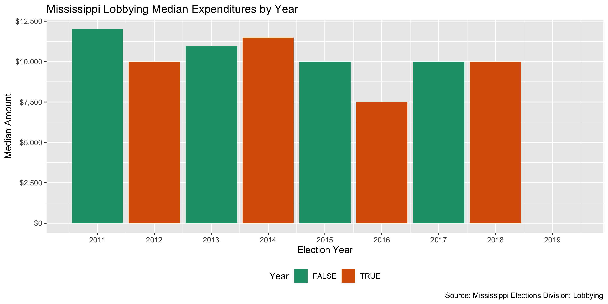

Mississippi Lobbying Expenditure Data Diary
================
Yanqi Xu
2020-02-12 19:18:45

## Project

The Accountability Project is an effort to cut across data silos and
give journalists, policy professionals, activists, and the public at
large a simple way to search across huge volumes of public data about
people and organizations.

Our goal is to standardizing public data on a few key fields by thinking
of each dataset row as a transaction. For each transaction there should
be (at least) 3 variables:

1.  All **parties** to a transaction
2.  The **date** of the transaction
3.  The **amount** of money involved

## Objectives

This document describes the process used to complete the following
objectives:

1.  How many records are in the database?
2.  Check for duplicates
3.  Check ranges
4.  Is there anything blank or missing?
5.  Check for consistency issues
6.  Create a five-digit ZIP Code called `ZIP5`
7.  Create a `YEAR` field from the transaction date
8.  Make sure there is data on both parties to a transaction

## Packages

The following packages are needed to collect, manipulate, visualize,
analyze, and communicate these results. The `pacman` package will
facilitate their installation and attachment.

``` r
if (!require("pacman")) install.packages("pacman")
pacman::p_load_current_gh("irworkshop/campfin")
pacman::p_load(
  rvest, # read html tables
  stringdist, # levenshtein value
  tidyverse, # data manipulation
  lubridate, # datetime strings
  tidytext, # string analysis
  magrittr, # pipe opperators
  janitor, # dataframe clean
  refinr, # cluster and merge
  knitr, # knit documents
  glue, # combine strings
  scales, #format strings
  here, # relative storage
  fs, # search storage 
  vroom, #read deliminated files
  readxl #read excel files
)
```

This document should be run as part of the `R_campfin` project, which
lives as a sub-directory of the more general, language-agnostic
\[`irworkshop/accountability_datacleaning`\]\[01\] GitHub repository.

The `R_campfin` project uses the \[RStudio projects\]\[02\] feature and
should be run as such. The project also uses the dynamic `here::here()`
tool for file paths relative to *your* machine.

## Download

Set the download directory first.

``` r
# create a directory for the raw data
raw_dir <- here("ms", "lobby", "data", "raw","exp")

dir_create(raw_dir)
```

We downloaded the lobbyist compensation data from \[The Secretary of
State’s Office\]
[03](https://www.sos.ms.gov/Elections-Voting/Documents/2019%20Lobbying%20Guide.pdf),
and the data is as current as 2019.

## Reading

We discovered that the xls files are actually structured as html tables.
We’ll use the `rvest` package to read these
files.

``` r
ms_exp_files <- list.files(raw_dir, pattern = "ms_lobby_exp.*", recursive = TRUE, full.names = TRUE)
# Create function to read a html table
read_web_tb <- function(file){
  df <- read_html(file) %>% html_node("table") %>% html_table(header = T)
  return(df)
}

ms_lobby_exp <- ms_exp_files %>% map(read_web_tb) %>% 
                   bind_rows() %>% 
                   clean_names()

ms_lobby_exp <- ms_lobby_exp %>% 
  mutate(filed = as.Date(filed, format = '%m/%d/%Y'),
         compensation = as.numeric(compensation %>% str_remove("\\$") %>% str_remove(","))) %>% 
  mutate_if(is.character, str_to_upper)
```

## Explore

### Duplicates

We’ll use the `flag_dupes()` function to see if there are records
identical to one another and flag the duplicates. A new variable
`dupe_flag` will be created.

``` r
ms_lobby_exp <- flag_dupes(ms_lobby_exp, dplyr::everything())
tabyl(ms_lobby_exp$dupe_flag)
#> # A tibble: 2 x 3
#>   `ms_lobby_exp$dupe_flag`     n percent
#>   <lgl>                    <dbl>   <dbl>
#> 1 FALSE                     8542 0.991  
#> 2 TRUE                        75 0.00870
```

### Year

<!-- -->

<!-- -->

### Missing

There’s no empty fields in the two data frames.

``` r
ms_lobby_exp  %>% col_stats(count_na)
#> # A tibble: 8 x 4
#>   col          class      n     p
#>   <chr>        <chr>  <int> <dbl>
#> 1 file_number  <chr>      0     0
#> 2 report_type  <chr>      0     0
#> 3 cycle_year   <int>      0     0
#> 4 entity_name  <chr>      0     0
#> 5 lobbyist     <chr>      0     0
#> 6 compensation <dbl>      0     0
#> 7 filed        <date>     0     0
#> 8 dupe_flag    <lgl>      0     0
```

## Join

We’ll join the expenditure data with the registration data frame that we
cleaned before.

``` r
reg_dir <- here("ms", "lobby", "data", "processed","reg")
ms_lobby_reg <- read_csv(glue("{reg_dir}/ms_lobby_reg.csv"))
```

However, we will see that the first\_name, and last\_name in the
`ms_lob_reg` dataframe don’t constitue the full name to be matched in
the expenditure record. So we will generate `first_name` and `last_name`
fields in `ms_lob_exp` to be matched with their counterparts in the
`reg`.

``` r
ms_lobby_reg <-  ms_lobby_reg %>% 
  select(client_name,
         client_telephone_norm,
         client_fax,
         client_address_norm,
         client_city_clean,
         client_state,
         client_zip5,
         certification_number,
         client_description,
         first_name,
         last_name,
         address_norm,
         city_clean,
         state,
         zip5,
         year)

ms_lobby_reg <- flag_dupes(ms_lobby_reg, dplyr::everything())
```

Since the registration information will not have an impact on the data
integrity of the expenditure dataframe to which it’s about to be joined,
we can safely deduplicate it.

``` r
ms_lobby_exp <- ms_lobby_exp %>% 
  mutate(lobbyist_trim = lobbyist %>% str_remove("^DR. |^MR. |^MRS. |^MS. |^REV. |\\sESQ.$| \\sII.$|, SR.|, III.$|, III|, II|\\W*JR.$") %>% trimws() %>% str_squish(),
         first_name = str_match(lobbyist_trim, "(^\\S+)\\s")[,2],
         last_name = str_match(lobbyist_trim, "\\s(\\S+)$")[,2])

ms_lobby_exp_clean <- ms_lobby_exp %>% 
  left_join(ms_lobby_reg %>% filter(!dupe_flag) %>% select(-dupe_flag),
            by = c("entity_name" = "client_name",
            "first_name" = "first_name",
            "last_name" = "last_name",
            "cycle_year" = "year"))

ms_lobby_exp_clean %>% col_stats(count_na)
#> # A tibble: 23 x 4
#>    col                   class      n      p
#>    <chr>                 <chr>  <int>  <dbl>
#>  1 file_number           <chr>      0 0     
#>  2 report_type           <chr>      0 0     
#>  3 cycle_year            <dbl>      0 0     
#>  4 entity_name           <chr>      0 0     
#>  5 lobbyist              <chr>      0 0     
#>  6 compensation          <dbl>      0 0     
#>  7 filed                 <date>     0 0     
#>  8 dupe_flag             <lgl>      0 0     
#>  9 lobbyist_trim         <chr>      0 0     
#> 10 first_name            <chr>    112 0.0117
#> 11 last_name             <chr>    112 0.0117
#> 12 client_telephone_norm <chr>   2022 0.211 
#> 13 client_fax            <chr>   4613 0.482 
#> 14 client_address_norm   <chr>   2022 0.211 
#> 15 client_city_clean     <chr>   2059 0.215 
#> 16 client_state          <chr>   2022 0.211 
#> 17 client_zip5           <chr>   2022 0.211 
#> 18 certification_number  <chr>   2018 0.211 
#> 19 client_description    <chr>   2022 0.211 
#> 20 address_norm          <chr>   2018 0.211 
#> 21 city_clean            <chr>   2026 0.212 
#> 22 state                 <chr>   2018 0.211 
#> 23 zip5                  <chr>   2025 0.211
```

There are thousands of records missing address information because they
don’t a match in the `reg` dataframe.

## Export

``` r
clean_dir <- here("ms", "lobby", "data", "processed","exp")
dir_create(clean_dir)

ms_lobby_exp_clean %>% 
  select(-c(dupe_flag, lobbyist_trim)) %>% 
  write_csv(
    path = glue("{clean_dir}/ms_lobby_exp_clean.csv"),
    na = ""
  )
```
