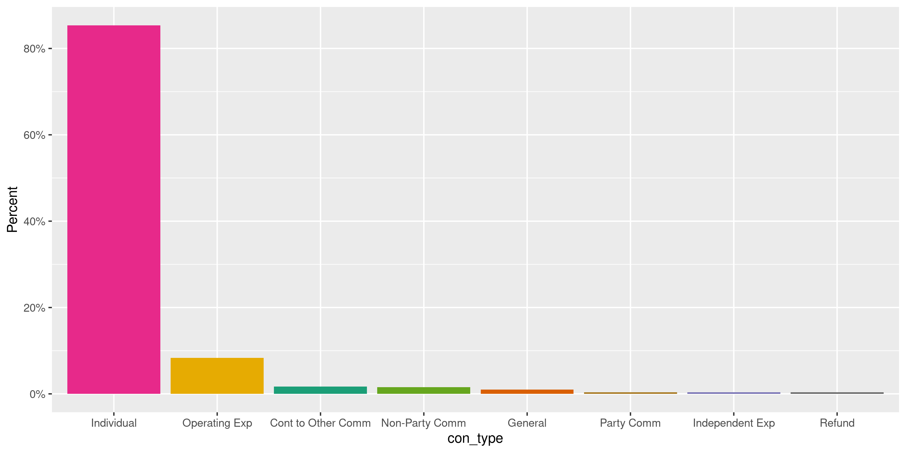
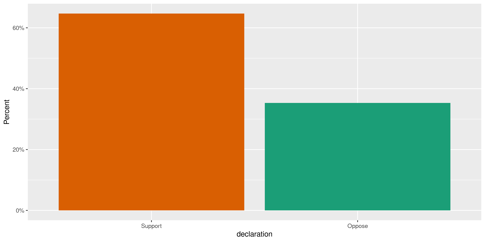
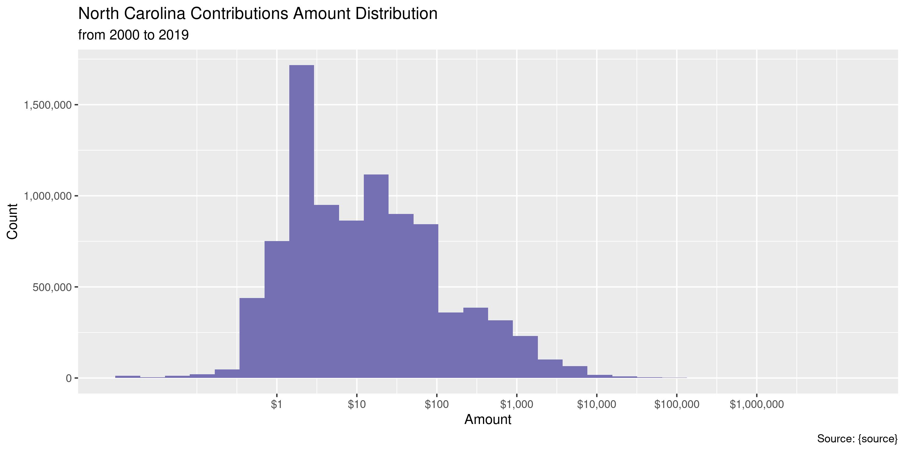
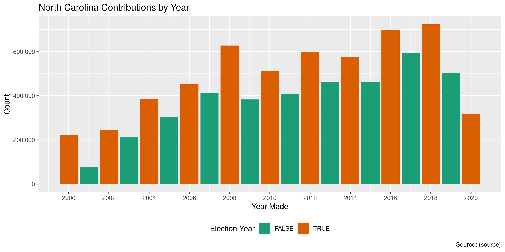
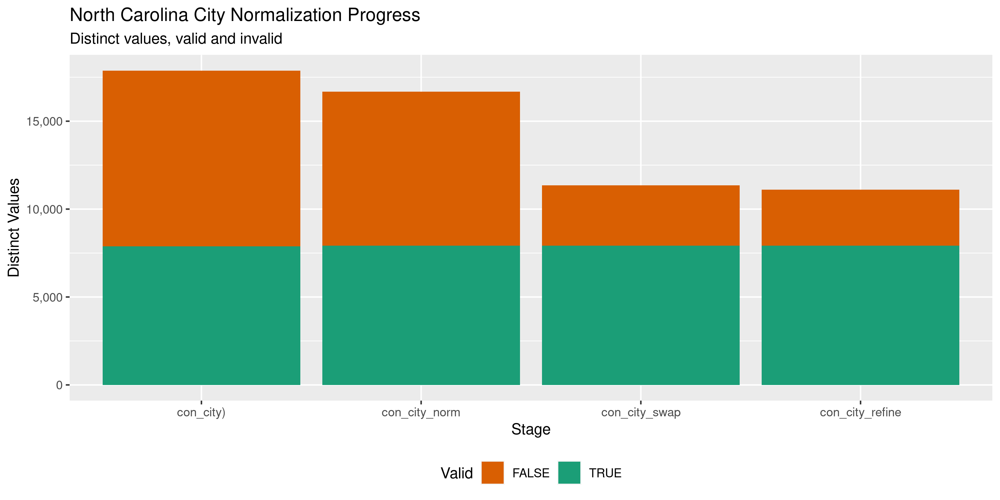

North Carolina Contributions
================
Kiernan Nicholls
2022-10-16 14:05:31

-   <a href="#project" id="toc-project">Project</a>
-   <a href="#objectives" id="toc-objectives">Objectives</a>
-   <a href="#packages" id="toc-packages">Packages</a>
-   <a href="#data" id="toc-data">Data</a>
-   <a href="#download" id="toc-download">Download</a>
-   <a href="#read" id="toc-read">Read</a>
-   <a href="#explore" id="toc-explore">Explore</a>
-   <a href="#wrangle" id="toc-wrangle">Wrangle</a>
-   <a href="#export" id="toc-export">Export</a>
-   <a href="#dictionary" id="toc-dictionary">Dictionary</a>

<!-- Place comments regarding knitting here -->

## Project

The Accountability Project is an effort to cut across data silos and
give journalists, policy professionals, activists, and the public at
large a simple way to search across huge volumes of public data about
people and organizations.

Our goal is to standardizing public data on a few key fields by thinking
of each data set row as a transaction. For each transaction there should
be (at least) 3 variables:

1.  All **parties** to a transaction.
2.  The **date** of the transaction.
3.  The **amount** of money involved.

## Objectives

This document describes the process used to complete the following
objectives:

1.  How many records are in the database?
2.  Check for entirely duplicated records.
3.  Check ranges of continuous variables.
4.  Is there anything blank or missing?
5.  Check for consistency issues.
6.  Create a five-digit ZIP Code called `zip`.
7.  Create a `year` field from the transaction date.
8.  Make sure there is data on both parties to a transaction.

## Packages

The following packages are needed to collect, manipulate, visualize,
analyze, and communicate these results. The `pacman` package will
facilitate their installation and attachment.

The IRW’s `campfin` package will also have to be installed from GitHub.
This package contains functions custom made to help facilitate the
processing of campaign finance data.

``` r
if (!require("pacman")) install.packages("pacman")
pacman::p_load_gh("irworkshop/campfin")
pacman::p_load(
  tidyverse, # data manipulation
  lubridate, # datetime strings
  gluedown, # print markdown
  gluedown, # printing markdown
  magrittr, # pipe operators
  janitor, # dataframe clean
  refinr, # cluster and merge
  scales, # format strings
  knitr, # knit documents
  vroom, # read files fast
  glue, # combine strings
  here, # relative storage
  httr, # http requests
  fs # search storage 
)
```

This document should be run as part of the `R_campfin` project, which
lives as a sub-directory of the more general, language-agnostic
[`irworkshop/accountability_datacleaning`](https://github.com/irworkshop/accountability_datacleaning)
GitHub repository.

The `R_campfin` project uses the [RStudio
projects](https://support.rstudio.com/hc/en-us/articles/200526207-Using-Projects)
feature and should be run as such. The project also uses the dynamic
`here::here()` tool for file paths relative to *your* machine.

``` r
# where does this document knit?
here::here()
#> [1] "/Users/yanqixu/code/accountability_datacleaning"
raw_dir <- dir_create(here("state","nc", "contribs", "data", "raw"))
```

## Data

North Carolina contributions data is obtained from the [North Carolina
State Board of Elections (NCSBE)](https://www.ncsbe.gov/index.html)

> The State Board of Elections (State Board) is the state agency charged
> with the administration of the elections process and campaign finance
> disclosure and compliance.

Each record reflects a single contribution (receipt) made to a candidate
or committee.

## Download

To download the data, we must run searches on the [NCSBE search
portal](https://cf.ncsbe.gov/CFTxnLkup/AdvancedSearch/). Searching for
all records at once returns an error, but we can ask for all
contributions from a given calendar year and export annual files.

Update note in 2022: The last update was on 2020-07-20, so we’ll set the
start date of this update to 07/21/2020 and the end date to 10/15/2022.

``` r
date_from <- "07/21/2020"
date_to <- "10/15/2022"
```

``` r
# does not work
param_file <- here("state","nc", "contribs", "ncsbe_param.txt")
raw_param <- glue::glue(readr::read_lines(param_file))
raw_url <- "https://cf.ncsbe.gov/CFTxnLkup/ExportResults/"
raw_export <- paste(raw_url, raw_param, sep = "?")
#for (y in 2020:2022) {
#for (y in 2000:2020) {
  #date_to <- sprintf("12/31/%s", y)
year <- str_extract(date_to,"\\d{4}$")
  raw_path <- path(raw_dir, glue("transinq_results-{year}.csv"))
  if (file.exists(raw_path)){
    #next()
  POST(raw_export, write_disk(raw_path, overwrite = TRUE))
  #message(y)
  }
#}
```

``` r
raw_files <- as_tibble(dir_info(raw_dir))
raw_files %>% 
  select(path, size, modification_time) %>% 
  mutate_at(vars(path), basename)
#> # A tibble: 1 × 3
#>   path                             size modification_time  
#>   <chr>                     <fs::bytes> <dttm>             
#> 1 transinq_results-2022.csv        381M 2022-10-16 13:02:00
```

## Read

The annual files can be read into a single data frame with
`vroom::vroom().`

``` r
# 9,178,441
ncc <- vroom(
  file = raw_files$path,
  delim = ",",
  escape_double = FALSE,
  escape_backslash = FALSE,
  na = c("", "NA", "Not Available"),
  col_types = cols(
    .default = col_character(),
    `Date Occured` = col_date_mdy(),
    `Amount` = col_double()
  )
)
```

We can check the number of distinct values in a discrete variables to
ensure the file was properly read into memory.

``` r
count(ncc, `Form of Payment`)
#> # A tibble: 9 × 2
#>   `Form of Payment`              n
#>   <chr>                      <int>
#> 1 Cash                       93145
#> 2 Check                     330740
#> 3 Credit Card               708916
#> 4 Debit Card                 80073
#> 5 Draft                     240607
#> 6 Electronic Funds Transfer 231705
#> 7 In Kind                    17791
#> 8 Money Order                 1354
#> 9 <NA>                        1053
```

For conveyance we will rename the variables.

``` r
raw_names <- names(ncc)
ncc <- ncc %>% 
  rename(
    con_name = `Name`,
    con_addr1 = `Street Line 1`,
    con_addr2 = `Street Line 2`,
    con_city = `City`,
    con_state = `State`,
    con_zip = `Zip Code`,
    con_job = `Profession/Job Title`,
    con_emp = `Employer's Name/Specific Field`,
    con_type = `Transction Type`,
    rec_name = `Committee Name`,
    rec_id = `Committee SBoE ID`,
    rec_addr1 = `Committee Street 1`,
    rec_addr2 = `Committee Street 2`,
    rec_city = `Committee City`,
    rec_state = `Committee State`,
    rec_zip = `Committee Zip Code`,
    report = `Report Name`,
    date = `Date Occured`,
    account = `Account Code`,
    method = `Form of Payment`,
    candidate = `Candidate/Referendum Name`
  ) %>% 
  clean_names("snake") %>% 
  remove_empty("cols")
```

## Explore

Since the empty searches returned the yearly contributions in
alphabetical order, the top of each file has empty name records. We will
sort this single data frame chronologically.

``` r
ncc <- arrange(ncc, date)
```

``` r
glimpse(ncc)
#> Rows: 1,705,384
#> Columns: 23
#> $ con_name    <chr> "Aggregated Non-Media Expenditure", "Aggregated Non-Media Expenditure", "Aggr…
#> $ con_addr1   <chr> NA, NA, NA, NA, NA, NA, NA, NA, NA, NA, NA, NA, NA, NA, NA, NA, NA, NA, NA, N…
#> $ con_addr2   <chr> NA, NA, NA, NA, NA, NA, NA, NA, NA, NA, NA, NA, NA, NA, NA, NA, NA, NA, NA, N…
#> $ con_city    <chr> NA, NA, NA, NA, NA, NA, NA, NA, NA, NA, NA, NA, NA, NA, NA, NA, NA, NA, NA, N…
#> $ con_state   <chr> NA, NA, NA, NA, NA, NA, NA, NA, NA, NA, NA, NA, NA, NA, NA, NA, NA, NA, NA, N…
#> $ con_zip     <chr> NA, NA, NA, NA, NA, NA, NA, NA, NA, NA, NA, NA, NA, NA, NA, NA, NA, NA, NA, N…
#> $ con_job     <chr> NA, NA, NA, NA, NA, NA, NA, NA, NA, NA, NA, NA, NA, NA, NA, NA, NA, NA, NA, N…
#> $ con_emp     <chr> NA, NA, NA, NA, NA, NA, NA, NA, NA, NA, NA, NA, NA, NA, NA, NA, NA, NA, NA, N…
#> $ con_type    <chr> "Operating Exp", "Operating Exp", "Operating Exp", "Operating Exp", "Operatin…
#> $ rec_name    <chr> "COMMITTEE TO ELECT DAN FOREST", "MOORE RM", "BRUNSWICK DEC", "STEPHEN ROSS C…
#> $ rec_id      <chr> "STA-M4HR0Y-C-001", "STA-C4328N-C-001", "STA-C3946N-C-001", "STA-7892D7-C-001…
#> $ rec_addr1   <chr> "3103 JULIAN GLEN CIR", "PO BOX 1812", "PO BOX 503", "1314 MCCUISTON DR", "67…
#> $ rec_addr2   <chr> NA, NA, NA, NA, NA, NA, NA, NA, "SUITE 110", NA, NA, NA, NA, NA, NA, NA, NA, …
#> $ rec_city    <chr> "WAXHAW", "SOUTHERN PINES", "SUPPLY", "BURLINGTON", "CHARLOTTE", "WILMINGTON"…
#> $ rec_state   <chr> "NC", "NC", "NC", "NC", "NC", "NC", "NC", "NC", "NC", "NC", "NC", "NC", "NC",…
#> $ rec_zip     <chr> "28173", "28388", "28462", "27215", "28270", "28402", "28563", "28173", "2740…
#> $ report      <chr> "2020 Third Quarter (Amendment)", "2020 Third Quarter", "2020 Third Quarter",…
#> $ date        <date> 2020-07-21, 2020-07-21, 2020-07-21, 2020-07-21, 2020-07-21, 2020-07-21, 2020…
#> $ amount      <dbl> 32.22, 32.94, 33.62, 39.30, 39.75, 40.30, 40.50, 40.56, 40.99, 41.00, 42.33, …
#> $ method      <chr> "Debit Card", "Draft", "Debit Card", "Draft", "Debit Card", "Draft", "Debit C…
#> $ purpose     <chr> "CMPN TRVL", "PRINTED CHECKS", "PRINTER CARTIDGE MOSQUITO 1 FUNDS", "CREDIT C…
#> $ candidate   <chr> NA, NA, NA, NA, NA, NA, NA, NA, NA, NA, NA, NA, NA, NA, NA, NA, NA, NA, NA, N…
#> $ declaration <chr> NA, NA, NA, NA, NA, NA, NA, NA, NA, NA, NA, NA, NA, NA, NA, NA, NA, NA, NA, N…
tail(ncc)
#> # A tibble: 6 × 23
#>   con_name   con_a…¹ con_a…² con_c…³ con_s…⁴ con_zip con_job con_emp con_t…⁵ rec_n…⁶ rec_id rec_a…⁷
#>   <chr>      <chr>   <chr>   <chr>   <chr>   <chr>   <chr>   <chr>   <chr>   <chr>   <chr>  <chr>  
#> 1 REIMBURSE… <NA>    <NA>    <NA>    <NA>    <NA>    <NA>    <NA>    <NA>    <NA>    <NA>   <NA>   
#> 2 <NA>       <NA>    <NA>    <NA>    <NA>    <NA>    <NA>    <NA>    <NA>    <NA>    <NA>   <NA>   
#> 3 <NA>       <NA>    <NA>    <NA>    <NA>    <NA>    <NA>    <NA>    <NA>    <NA>    <NA>   <NA>   
#> 4 <NA>       <NA>    <NA>    <NA>    <NA>    <NA>    <NA>    <NA>    <NA>    <NA>    <NA>   <NA>   
#> 5 <NA>       <NA>    <NA>    <NA>    <NA>    <NA>    <NA>    <NA>    <NA>    <NA>    <NA>   <NA>   
#> 6 <NA>       <NA>    <NA>    <NA>    <NA>    <NA>    <NA>    <NA>    <NA>    <NA>    <NA>   <NA>   
#> # … with 11 more variables: rec_addr2 <chr>, rec_city <chr>, rec_state <chr>, rec_zip <chr>,
#> #   report <chr>, date <date>, amount <dbl>, method <chr>, purpose <chr>, candidate <chr>,
#> #   declaration <chr>, and abbreviated variable names ¹​con_addr1, ²​con_addr2, ³​con_city,
#> #   ⁴​con_state, ⁵​con_type, ⁶​rec_name, ⁷​rec_addr1
```

### Missing

The first thing we notice are the high number of missing records.

``` r
col_stats(ncc, count_na)
#> # A tibble: 23 × 4
#>    col         class        n         p
#>    <chr>       <chr>    <int>     <dbl>
#>  1 con_name    <chr>      108 0.0000633
#>  2 con_addr1   <chr>  1021227 0.599    
#>  3 con_addr2   <chr>  1651426 0.968    
#>  4 con_city    <chr>  1019631 0.598    
#>  5 con_state   <chr>   990253 0.581    
#>  6 con_zip     <chr>  1023603 0.600    
#>  7 con_job     <chr>  1154450 0.677    
#>  8 con_emp     <chr>  1153808 0.677    
#>  9 con_type    <chr>       21 0.0000123
#> 10 rec_name    <chr>       21 0.0000123
#> 11 rec_id      <chr>       21 0.0000123
#> 12 rec_addr1   <chr>       21 0.0000123
#> 13 rec_addr2   <chr>  1363811 0.800    
#> 14 rec_city    <chr>       21 0.0000123
#> 15 rec_state   <chr>       21 0.0000123
#> 16 rec_zip     <chr>       21 0.0000123
#> 17 report      <chr>       21 0.0000123
#> 18 date        <date>      21 0.0000123
#> 19 amount      <dbl>       21 0.0000123
#> 20 method      <chr>     1053 0.000617 
#> 21 purpose     <chr>  1561717 0.916    
#> 22 candidate   <chr>  1703942 0.999    
#> 23 declaration <chr>  1703942 0.999
```

This is likely due to the lack of individual information for those
contributions reported as aggrigates.

``` r
ncc %>% 
  filter(is.na(con_state)) %>% 
  select(con_name, con_state) %>% 
  count(con_name, sort = TRUE) %>% 
  mutate(p = n/sum(n))
#> # A tibble: 2,655 × 3
#>    con_name                                n         p
#>    <chr>                               <int>     <dbl>
#>  1 Aggregated Individual Contribution 943207 0.952    
#>  2 Aggregated Non-Media Expenditure    43207 0.0436   
#>  3 <NA>                                   91 0.0000919
#>  4 Southern Bank                          41 0.0000414
#>  5 USPS                                   35 0.0000353
#>  6 GOOGLE, INC.                           33 0.0000333
#>  7 WIX.COM LTD                            30 0.0000303
#>  8 Google Domains                         29 0.0000293
#>  9 ActBlue                                28 0.0000283
#> 10 CANVA                                  26 0.0000263
#> # … with 2,645 more rows
```

We can flag any kind of non-aggrigate record missing a name or number.

``` r
ncc <- ncc %>% flag_na(date, con_name, amount, rec_name)
percent(mean(ncc$na_flag), 0.001)
#> [1] "0.007%"
```

### Duplicates

We can also flag any entirely duplicate rows. To keep memory usage low
with such a large data frame, we will split our data into a list and
check each element of the list. For each chunk, we will write the
duplicate row positions to a local file.

``` r
# Note: It's better to delete the dupes files already in the folder before knitting. 
dupe_file <- here("state","nc", "contribs", "dupes.txt")
if (!file_exists(dupe_file)) {
  file_create(dupe_file)
  n <- 1e5 # rows per chunk
  nr <- nrow(ncc)
  # split file into chunks
  ncs <- split(ncc, rep(1:ceiling(nr/n), each = n, length.out = nr))
  for (i in seq_along(ncs)) {
    # check dupes from both ends
    d1 <- duplicated(ncs[[i]], fromLast = FALSE)
    d2 <- duplicated(ncs[[i]], fromLast = TRUE)
    # append to disk
    write_lines(d1 | d2, dupe_file, append = TRUE)
    rm(d1, d2)
    ncs[[i]] <- NA
    message(percent(i/length(ncs)))
    Sys.sleep(10)
    gc(reset = TRUE, full = TRUE)
  }
  rm(ncs)
}
```

Then we can read this file as a logical vector and add it as a variable.

``` r
dupe_vec <- as.logical(read_lines(dupe_file))
ncc <- mutate(ncc, dupe_flag = dupe_vec)
rm(dupe_vec)
gc(reset = TRUE, full = TRUE)
#>            used  (Mb) gc trigger  (Mb) limit (Mb) max used  (Mb)
#> Ncells  1984313 106.0    3835915 204.9         NA  1984313 106.0
#> Vcells 45773570 349.3   85856289 655.1      16384 45773570 349.3
```

A *huge* percentage of the overall records in this database are
duplicates. This stems from the use of aggregated records reported
millions of times by a handful of recipients.

``` r
percent(mean(ncc$dupe_flag))
#> [1] "50%"
ncc %>% 
  filter(dupe_flag) %>% 
  count(date, con_name, amount, rec_name, rec_id, report, sort = TRUE)
#> # A tibble: 76,906 × 7
#>    date       con_name                           amount rec_name                rec_id report     n
#>    <date>     <chr>                               <dbl> <chr>                   <chr>  <chr>  <int>
#>  1 2020-08-07 Aggregated Individual Contribution      2 EMPLOYEES POLITICAL AC… STA-C… 2020 …  5148
#>  2 2020-09-14 Aggregated Individual Contribution      2 EMPLOYEES POLITICAL AC… STA-C… 2020 …  5120
#>  3 2020-10-02 Aggregated Individual Contribution      2 EMPLOYEES POLITICAL AC… STA-C… 2020 …  5116
#>  4 2020-11-17 Aggregated Individual Contribution      2 EMPLOYEES POLITICAL AC… STA-C… 2020 …  4994
#>  5 2021-01-20 Aggregated Individual Contribution      2 EMPLOYEES POLITICAL AC… STA-C… 2021 …  4638
#>  6 2021-03-05 Aggregated Individual Contribution      2 EMPLOYEES POLITICAL AC… STA-C… 2021 …  4393
#>  7 2021-04-20 Aggregated Individual Contribution      2 EMPLOYEES POLITICAL AC… STA-C… 2021 …  4324
#>  8 2021-05-21 Aggregated Individual Contribution      2 EMPLOYEES POLITICAL AC… STA-C… 2021 …  4278
#>  9 2021-06-16 Aggregated Individual Contribution      2 EMPLOYEES POLITICAL AC… STA-C… 2021 …  4261
#> 10 2021-02-15 Aggregated Individual Contribution      2 EMPLOYEES POLITICAL AC… STA-C… 2021 …  4212
#> # … with 76,896 more rows
```

### Categorical

``` r
col_stats(ncc, n_distinct)
#> # A tibble: 25 × 4
#>    col         class       n          p
#>    <chr>       <chr>   <int>      <dbl>
#>  1 con_name    <chr>  226924 0.133     
#>  2 con_addr1   <chr>  213424 0.125     
#>  3 con_addr2   <chr>    7367 0.00432   
#>  4 con_city    <chr>    9519 0.00558   
#>  5 con_state   <chr>      88 0.0000516 
#>  6 con_zip     <chr>   69287 0.0406    
#>  7 con_job     <chr>   27643 0.0162    
#>  8 con_emp     <chr>   70262 0.0412    
#>  9 con_type    <chr>      21 0.0000123 
#> 10 rec_name    <chr>    2784 0.00163   
#> 11 rec_id      <chr>    2757 0.00162   
#> 12 rec_addr1   <chr>    2523 0.00148   
#> 13 rec_addr2   <chr>     184 0.000108  
#> 14 rec_city    <chr>     467 0.000274  
#> 15 rec_state   <chr>      34 0.0000199 
#> 16 rec_zip     <chr>     820 0.000481  
#> 17 report      <chr>     120 0.0000704 
#> 18 date        <date>    806 0.000473  
#> 19 amount      <dbl>   35520 0.0208    
#> 20 method      <chr>       9 0.00000528
#> 21 purpose     <chr>   34478 0.0202    
#> 22 candidate   <chr>     228 0.000134  
#> 23 declaration <chr>       3 0.00000176
#> 24 na_flag     <lgl>       2 0.00000117
#> 25 dupe_flag   <lgl>       2 0.00000117
```

<!-- --><!-- --><!-- -->

### Continuous

#### Amounts

``` r
summary(ncc$amount)
#>    Min. 1st Qu.  Median    Mean 3rd Qu.    Max.    NA's 
#>  -10000       2      10     379      50 3800000      21
mean(ncc$amount <= 0, na.rm = TRUE)
#> [1] 0.000949358
mean(ncc$amount <= 5, na.rm = TRUE) # itemized
#> [1] 0.4140133
```

<!-- -->

#### Dates

We can add the 4-digit calendar year from the `date` with
`lubridate::year()`.

``` r
ncc <- mutate(ncc, year = year(date))
```

Aside from a handful of missing values, the range of dates is clean.

``` r
prop_na(ncc$date)
#> [1] 1.231394e-05
min(ncc$date, na.rm = TRUE)
#> [1] "2020-07-21"
sum(ncc$year < 2020, na.rm = TRUE)
#> [1] 0
max(ncc$date, na.rm = TRUE)
#> [1] "2022-10-07"
sum(ncc$date > today(), na.rm = TRUE)
#> [1] 0
```

<!-- -->

## Wrangle

To improve the searchability of the database, we will perform some
consistent, confident string normalization. For geographic variables
like city names and ZIP codes, the corresponding `campfin::normal_*()`
functions are tailor made to facilitate this process.

### Address

For the street `addresss` variable, the `campfin::normal_address()`
function will force consistence case, remove punctuation, and abbreviate
official USPS suffixes.

``` r
ncc <- ncc %>% 
  unite(
    col = con_addr_norm,
    starts_with("con_addr"),
    sep = " ",
    remove = FALSE,
    na.rm = TRUE
  ) %>% 
  unite(
    col = rec_addr_norm,
    starts_with("rec_addr"),
    sep = " ",
    remove = FALSE,
    na.rm = TRUE
  )
```

``` r
ncc <- mutate_at(
  .tbl = ncc,
  .vars = vars(ends_with("addr_norm")),
  .funs = normal_address,
  abbs = usps_street,
  na = invalid_city,
  na_rep = TRUE
)
```

``` r
ncc <- relocate(ncc, ends_with("addr_norm"), .after = last_col())
```

``` r
ncc %>% 
  select(starts_with("con_addr")) %>% 
  distinct() %>% 
  sample_n(10)
#> # A tibble: 10 × 3
#>    con_addr1             con_addr2 con_addr_norm           
#>    <chr>                 <chr>     <chr>                   
#>  1 111 SEABOARD AVENUE   <NA>      111 SEABOARD AVE        
#>  2 308 S Blount St       Apt 1102  308 S BLOUNT ST APT 1102
#>  3 125 E. MAIN STREET    <NA>      125 E MAIN ST           
#>  4 905 E. OAK DR.        <NA>      905 E OAK DR            
#>  5 1215 LUGANO DR.       <NA>      1215 LUGANO DR          
#>  6 241 Paint Fork Rd     <NA>      241 PAINT FORK RD       
#>  7 673 Willowbrook Ln    <NA>      673 WILLOWBROOK LN      
#>  8 802 SUNSET DR         <NA>      802 SUNSET DR           
#>  9 PO Box 2727           <NA>      PO BOX 2727             
#> 10 11441 HOWARDS MILL RD <NA>      11441 HOWARDS MILL RD
```

### ZIP

For ZIP codes, the `campfin::normal_zip()` function will attempt to
create valid *five* digit codes by removing the ZIP+4 suffix and
returning leading zeroes dropped by other programs like Microsoft Excel.

``` r
ncc <- mutate_at(
  .tbl = ncc,
  .vars = vars(ends_with("zip")),
  .funs = list(norm = normal_zip),
  na_rep = TRUE
)
```

``` r
progress_table(
  ncc$con_zip,
  ncc$con_zip_norm,
  ncc$rec_zip,
  ncc$rec_zip_norm,
  compare = valid_zip
)
#> # A tibble: 4 × 6
#>   stage            prop_in n_distinct   prop_na  n_out n_diff
#>   <chr>              <dbl>      <dbl>     <dbl>  <dbl>  <dbl>
#> 1 ncc$con_zip        0.662      69287 0.600     230581  61441
#> 2 ncc$con_zip_norm   0.997       9551 0.600       1872    737
#> 3 ncc$rec_zip        0.840        820 0.0000123 273127    144
#> 4 ncc$rec_zip_norm   0.977        701 0.000202   39501     11
```

### State

Valid two digit state abbreviations can be made using the
`campfin::normal_state()` function.

``` r
ncc <- mutate_at(
  .tbl = ncc,
  .vars = vars(ends_with("state")),
  .funs = list(norm = normal_state),
  valid = valid_state,
  na_rep = TRUE
)
```

``` r
ncc %>% 
  filter(con_state != con_state_norm) %>% 
  count(con_state, con_state_norm, sort = TRUE)
#> # A tibble: 6 × 3
#>   con_state con_state_norm     n
#>   <chr>     <chr>          <int>
#> 1 nc        NC               149
#> 2 Nc        NC                98
#> 3 Gu        GU                 4
#> 4 Fl        FL                 3
#> 5 Al        AL                 1
#> 6 Ca        CA                 1
```

``` r
progress_table(
  ncc$con_state,
  ncc$con_state_norm,
  ncc$rec_state,
  ncc$rec_state_norm,
  compare = valid_state
)
#> # A tibble: 4 × 6
#>   stage              prop_in n_distinct   prop_na n_out n_diff
#>   <chr>                <dbl>      <dbl>     <dbl> <dbl>  <dbl>
#> 1 ncc$con_state        0.999         88 0.581       423     29
#> 2 ncc$con_state_norm   1             60 0.581         0      1
#> 3 ncc$rec_state        1             34 0.0000123     0      1
#> 4 ncc$rec_state_norm   1             34 0.0000123     0      1
```

### City

Cities are the most difficult geographic variable to normalize, simply
due to the wide variety of valid cities and formats.

#### Normal

The `campfin::normal_city()` function is a good start, again converting
case, removing punctuation, but *expanding* USPS abbreviations. We can
also remove `invalid_city` values.

``` r
ncc <- mutate_at(
  .tbl = ncc,
  .vars = vars(ends_with("city")),
  .funs = list(norm = normal_city),
  abbs = usps_city,
  states = c("NC", "DC", "NORTH CAROLINA"),
  na = invalid_city,
  na_rep = TRUE
)
```

#### Swap

We can further improve normalization by comparing our normalized value
against the *expected* value for that record’s state abbreviation and
ZIP code. If the normalized value is either an abbreviation for or very
similar to the expected value, we can confidently swap those two.

``` r
ncc <- ncc %>% 
  left_join(
    y = zipcodes,
    by = c(
      "con_state_norm" = "state",
      "con_zip_norm" = "zip"
    )
  ) %>% 
  rename(city_match = city) %>% 
  mutate(
    match_abb = is_abbrev(con_city_norm, city_match),
    match_dist = str_dist(con_city_norm, city_match),
    con_city_swap = if_else(
      condition = !is.na(match_dist) & (match_abb | match_dist == 1),
      true = city_match,
      false = con_city_norm
    )
  ) %>% 
  select(
    -city_match,
    -match_dist,
    -match_abb
  )
```

#### Refine

The \[OpenRefine\] algorithms can be used to group similar strings and
replace the less common versions with their most common counterpart.
This can greatly reduce inconsistency, but with low confidence; we will
only keep any refined strings that have a valid city/state/zip
combination.

``` r
good_refine <- ncc %>% 
  mutate(
    con_city_refine = con_city_swap %>% 
      key_collision_merge() %>% 
      n_gram_merge(numgram = 1)
  ) %>% 
  filter(con_city_refine != con_city_swap) %>% 
  inner_join(
    y = zipcodes,
    by = c(
      "con_city_refine" = "city",
      "con_state_norm" = "state",
      "con_zip_norm" = "zip"
    )
  )
```

    #> [1] 165
    #> # A tibble: 70 × 5
    #>    con_state_norm con_zip_norm con_city_swap    con_city_refine     n
    #>    <chr>          <chr>        <chr>            <chr>           <int>
    #>  1 NC             27526        FUQAUYVARINA     FUQUAY VARINA      51
    #>  2 OH             45274        CINCINATTI       CINCINNATI         26
    #>  3 NC             27522        CREEDMORE        CREEDMOOR           3
    #>  4 NC             28086        KNGS MOUNTIAN    KINGS MOUNTAIN      3
    #>  5 NC             28778        SWANNONA         SWANNANOA           3
    #>  6 OH             45249        CINCINATTI       CINCINNATI          3
    #>  7 CA             92128        SAN DIEGON DIEGO SAN DIEGO           2
    #>  8 CA             93923        CARMELAR         CARMEL              2
    #>  9 CA             94107        SAN FRANSICO     SAN FRANCISCO       2
    #> 10 CA             94110        SAN FRANSSICO    SAN FRANCISCO       2
    #> # … with 60 more rows

Then we can join the refined values back to the database.

``` r
ncc <- ncc %>% 
  left_join(good_refine) %>% 
  mutate(con_city_refine = coalesce(con_city_refine, con_city_swap))
```

#### Progress

| stage                                                                            | prop_in | n_distinct | prop_na | n_out | n_diff |
|:---------------------------------------------------------------------------------|--------:|-----------:|--------:|------:|-------:|
| str_to_upper(ncc$con_city) | 0.973| 7103| 0.598| 18407| 2606| |ncc$con_city_norm |   0.978 |       6759 |   0.598 | 15393 |   2248 |
| ncc$con_city_swap | 0.994| 5320| 0.598| 4331| 784| |ncc$con_city_refine          |   0.994 |       5257 |   0.598 |  4166 |    722 |

You can see how the percentage of valid values increased with each
stage.

<!-- -->

More importantly, the number of distinct values decreased each stage. We
were able to confidently change many distinct invalid values to their
valid equivalent.

<!-- -->

## Export

``` r
ncc <- ncc %>% 
  select(-con_city_norm, -con_city_swap) %>% 
  rename_all(~str_replace(., "_(norm|refine|swap)", "_clean"))
```

``` r
glimpse(sample_n(ncc, 20))
#> Rows: 20
#> Columns: 34
#> $ con_name        <chr> "Madison Taylor Horner", "Jeffrey M Baker", "Roma Kabes", "Aggregated Ind…
#> $ con_addr1       <chr> "327 W Tremont Ave", "5613 Harvest Grove Lane", "2169 NC Highway 55 E", N…
#> $ con_addr2       <chr> "Apt. 252", NA, NA, NA, NA, NA, NA, NA, NA, NA, NA, NA, NA, NA, NA, NA, N…
#> $ con_city        <chr> "Charlotte", "Wilmington", "Mount Olive", NA, NA, "Asheboro", "NEBO", NA,…
#> $ con_state       <chr> "NC", "NC", "NC", NA, NA, "nc", "NC", NA, NA, "NC", NA, "NC", NA, "NC", N…
#> $ con_zip         <chr> "28203-6676", "28409-2337", "28365-8035", NA, NA, "27205-9999", "28761", …
#> $ con_job         <chr> "Real Estate Broker", "Real Estate Broker", "No Job Title", NA, NA, "Dire…
#> $ con_emp         <chr> "Realty ONE Group Select", "Cadence Realty Corporation", "Not Employed", …
#> $ con_type        <chr> "Individual", "Individual", "Individual", "Individual", "Individual", "In…
#> $ rec_name        <chr> "NC REALTORS PAC", "NC REALTORS PAC", "FRIENDS OF MARK ROBINSON", "02ND C…
#> $ rec_id          <chr> "STA-C3219N-C-001", "STA-C3219N-C-001", "STA-O82R4C-C-001", "STA-C4174N-C…
#> $ rec_addr1       <chr> "4511 WEYBRIDGE LANE", "4511 WEYBRIDGE LANE", "PO BOX 473967", "301 RUSSO…
#> $ rec_addr2       <chr> "SUITE 1109", "SUITE 1109", NA, NA, "SUITE 800", "SUITE 200", "SUITE 207"…
#> $ rec_city        <chr> "GREENSBORO", "GREENSBORO", "CHARLOTTE", "CARY", "RALEIGH", "RALEIGH", "S…
#> $ rec_state       <chr> "NC", "NC", "NC", "NC", "NC", "NC", "NC", "NC", "NC", "NC", "NC", "NC", "…
#> $ rec_zip         <chr> "27407", "27407", "28247", "27519", "27601", "27608", "28777", "27601", "…
#> $ report          <chr> "2022 First Quarter", "2021 Year End Semi-Annual", "2022 Mid Year Semi-An…
#> $ date            <date> 2022-01-05, 2021-12-14, 2022-05-31, 2021-04-25, 2022-01-06, 2021-01-31, …
#> $ amount          <dbl> 24.50, 21.00, 25.00, 23.08, 1.00, 10.00, 50.00, 0.40, 2.00, 25.80, 1.00, …
#> $ method          <chr> "Check", "Check", "Credit Card", "Credit Card", "Draft", "Draft", "Debit …
#> $ purpose         <chr> NA, NA, NA, NA, NA, NA, NA, NA, NA, "Print Media", NA, NA, NA, NA, NA, NA…
#> $ candidate       <chr> NA, NA, NA, NA, NA, NA, NA, NA, NA, NA, NA, NA, NA, NA, NA, NA, NA, NA, N…
#> $ declaration     <chr> NA, NA, NA, NA, NA, NA, NA, NA, NA, NA, NA, NA, NA, NA, NA, NA, NA, NA, N…
#> $ na_flag         <lgl> FALSE, FALSE, FALSE, FALSE, FALSE, FALSE, FALSE, FALSE, FALSE, FALSE, FAL…
#> $ dupe_flag       <lgl> FALSE, FALSE, FALSE, TRUE, TRUE, FALSE, FALSE, TRUE, TRUE, FALSE, TRUE, F…
#> $ year            <dbl> 2022, 2021, 2022, 2021, 2022, 2021, 2020, 2020, 2021, 2022, 2020, 2021, 2…
#> $ con_addr_clean  <chr> "327 W TREMONT AVE APT 252", "5613 HARVEST GROVE LN", "2169 NC HIGHWAY 55…
#> $ rec_addr_clean  <chr> "4511 WEYBRIDGE LANE SUITE 1109", "4511 WEYBRIDGE LANE SUITE 1109", "PO B…
#> $ con_zip_clean   <chr> "28203", "28409", "28365", NA, NA, "27205", "28761", NA, NA, "27516", NA,…
#> $ rec_zip_clean   <chr> "27407", "27407", "28247", "27519", "27601", "27608", "28777", "27601", "…
#> $ con_state_clean <chr> "NC", "NC", "NC", NA, NA, "NC", "NC", NA, NA, "NC", NA, "NC", NA, "NC", N…
#> $ rec_state_clean <chr> "NC", "NC", "NC", "NC", "NC", "NC", "NC", "NC", "NC", "NC", "NC", "NC", "…
#> $ rec_city_clean  <chr> "GREENSBORO", "GREENSBORO", "CHARLOTTE", "CARY", "RALEIGH", "RALEIGH", "S…
#> $ con_city_clean  <chr> "CHARLOTTE", "WILMINGTON", "MOUNT OLIVE", NA, NA, "ASHEBORO", "NEBO", NA,…
```

1.  There are 1,705,386 records in the database.
2.  There are 860,315 duplicate records in the database.
3.  The range and distribution of `amount` and `date` seem reasonable.
4.  There are 112 records missing ….
5.  Consistency in geographic data has been improved with
    `campfin::normal_*()`.
6.  The 4-digit `year` variable has been created with
    `lubridate::year()`.

``` r
clean_dir <- dir_create(here("state","nc", "contribs", "data", "clean"))
clean_path <- path(clean_dir, "nc_contribs_clean.csv")
write_csv(ncc, clean_path, na = "")
file_size(clean_path)
#> 455M
guess_encoding(clean_path)
#> # A tibble: 2 × 2
#>   encoding   confidence
#>   <chr>           <dbl>
#> 1 UTF-8            1   
#> 2 ISO-8859-1       0.37
```

## Dictionary

| Column            | Type     | Definition                                        |
|:------------------|:---------|:--------------------------------------------------|
| `con_name`        | `<chr>`  | Contributor full name                             |
| `con_addr1`       | `<chr>`  | Contributor street address                        |
| `con_addr2`       | `<chr>`  | Contributor secondary address                     |
| `con_city`        | `<chr>`  | Contributor city name                             |
| `con_state`       | `<chr>`  | Contributor 2-digit state abbreviation            |
| `con_zip`         | `<chr>`  | Contributor ZIP+4 code                            |
| `con_job`         | `<chr>`  | Contributor occupation                            |
| `con_emp`         | `<chr>`  | Contributor employer name                         |
| `con_type`        | `<chr>`  | Contributor type                                  |
| `rec_name`        | `<chr>`  | Recipient committee name                          |
| `rec_id`          | `<chr>`  | Recipient unique ID                               |
| `rec_addr1`       | `<chr>`  | Recipient street address                          |
| `rec_addr2`       | `<chr>`  | Recipient secondary address                       |
| `rec_city`        | `<chr>`  | Recipient city name                               |
| `rec_state`       | `<chr>`  | Recipient 2-digit state abbreviation              |
| `rec_zip`         | `<chr>`  | Recipient ZIP+4 code                              |
| `report`          | `<chr>`  | Election contribution reported for                |
| `date`            | `<date>` | Date contribution was made                        |
| `amount`          | `<dbl>`  | Contribution amount or correction                 |
| `method`          | `<chr>`  | Contribution method                               |
| `purpose`         | `<chr>`  | Contribution purpose                              |
| `candidate`       | `<chr>`  | Recipient candidate or referendum                 |
| `declaration`     | `<chr>`  | Support or oppose declaration                     |
| `na_flag`         | `<lgl>`  | Flag for missing date, amount, or name            |
| `dupe_flag`       | `<lgl>`  | Flag for completely duplicated record             |
| `year`            | `<dbl>`  | Calendar year of contribution date                |
| `con_addr_clean`  | `<chr>`  | Normalized contributor street address             |
| `rec_addr_clean`  | `<chr>`  | Normalized recipient street address               |
| `con_zip_clean`   | `<chr>`  | Normalized contributor 5-digit ZIP code           |
| `rec_zip_clean`   | `<chr>`  | Normalized recipient 5-digit ZIP code             |
| `con_state_clean` | `<chr>`  | Normalized contributor 2-digit state abbreviation |
| `rec_state_clean` | `<chr>`  | Normalized recipient 2-digit state abbreviation   |
| `rec_city_clean`  | `<chr>`  | Normalized recipient city name                    |
| `con_city_clean`  | `<chr>`  | Normalized contributor city name                  |
