North Carolina Expenditures
================
Kiernan Nicholls
2022-10-14 21:31:39

-   <a href="#project" id="toc-project">Project</a>
-   <a href="#objectives" id="toc-objectives">Objectives</a>
-   <a href="#packages" id="toc-packages">Packages</a>
-   <a href="#data" id="toc-data">Data</a>
-   <a href="#explore" id="toc-explore">Explore</a>
-   <a href="#wrangle" id="toc-wrangle">Wrangle</a>
-   <a href="#conclude" id="toc-conclude">Conclude</a>
-   <a href="#export" id="toc-export">Export</a>
-   <a href="#upload" id="toc-upload">Upload</a>

## Project

The Accountability Project is an effort to cut across data silos and
give journalists, policy professionals, activists, and the public at
large a simple way to search across huge volumes of public data about
people and organizations.

Our goal is to standardizing public data on a few key fields by thinking
of each dataset row as a transaction. For each transaction there should
be (at least) 3 variables:

1.  All **parties** to a transaction
2.  The **date** of the transaction
3.  The **amount** of money involved

## Objectives

This document describes the process used to complete the following
objectives:

1.  How many records are in the database?
2.  Check for duplicates
3.  Check ranges
4.  Is there anything blank or missing?
5.  Check for consistency issues
6.  Create a five-digit ZIP Code called `ZIP5`
7.  Create a `YEAR` field from the transaction date
8.  Make sure there is data on both parties to a transaction

## Packages

The following packages are needed to collect, manipulate, visualize,
analyze, and communicate these results. The `pacman` package will
facilitate their installation and attachment.

The IRW’s `campfin` package will also have to be installed from GitHub.
This package contains functions custom made to help facilitate the
processing of campaign finance data.

``` r
if (!require("pacman")) install.packages("pacman")
pacman::p_load_gh("irworkshop/campfin")
pacman::p_load(
  tidyverse, # data manipulation
  lubridate, # datetime strings
  magrittr, # pipe opperators
  tidytext, # text analysis
  janitor, # dataframe clean
  batman, # parse logical
  refinr, # cluster and merge
  scales, # format strings
  rvest, # read html files
  knitr, # knit documents
  vroom, # read files fast
  glue, # combine strings
  here, # relative storage
  fs # search storage 
)
```

This document should be run as part of the `R_campfin` project, which
lives as a sub-directory of the more general, language-agnostic
\[`irworkshop/accountability_datacleaning`\]\[01\] GitHub repository.

The `R_campfin` project uses the \[RStudio projects\]\[02\] feature and
should be run as such. The project also uses the dynamic `here::here()`
tool for file paths relative to *your* machine.

``` r
# where does this document knit?
here::here()
#> [1] "/Users/yanqixu/code/accountability_datacleaning"
```

## Data

Data is obtained from the North Carolina State Board of Elections (NC
SBoE).

> The State Board of Elections (State Board) is the state agency charged
> with the administration of the elections process and campaign finance
> disclosure and compliance.

> The state’s Campaign Reporting Act applies to:
>
> -   all candidates for public office;  
> -   all political party groups and political action committees;  
> -   all groups organized to support or oppose a referendum;  
> -   every person or group participating in activities that support or
>     oppose the nomination or election of one or more clearly
>     identified candidates, or a political party or a referendum.

### Download

\*2022 update:The last data update was performed on 2020-04-28, so the
new update starts from 2020-04-29 to 2022-10-10.

To download the data, perform a [Transaction Entity
Search](https://cf.ncsbe.gov/CFTxnLkup/) for type “Expenditure” from
2008-01-01 to 2022-10-14.

> This page allows for searching through the NC SBoE Campaign Finance
> database of transactions that committees have received (Receipts) or
> spent (Expenditures). Report data that is imported does not appear on
> our website in real-time. Our website updates overnight each
> weeknight. All data imported during a business day will appear on our
> website the following day.

``` r
raw_dir <- dir_create(here("state","nc", "expends", "data", "raw")) 
```

### Read

``` r
nc <- read_csv(
  file = path(raw_dir, "transinq_results.csv"),
  na = c("NA", "", "Not Available"),
  skip = 1,
  col_names = c(
    "payee_name",
    "payee_street1",
    "payee_street2",
    "payee_city",
    "payee_state",
    "payee_zip",
    "profession",
    "employer",
    "transction_type",
    "comm_name",
    "comm_id",
    "comm_street1",
    "comm_street2",
    "comm_city",
    "comm_state",
    "comm_zip",
    "report_name",
    "date",
    "account_code",
    "amount",
    "form_of_payment",
    "purpose",
    "referendum_name",
    "declaration",
    "supports"
  ),
  col_types = cols(
    .default = col_character(),
    date = col_date_mdy(),
    amount = col_double()
  )
) %>% 
  mutate_if(is_character, str_to_upper) %>% 
  mutate(supports = equals(declaration, "SUPPORT"))
```

## Explore

``` r
head(nc)
```

    #> # A tibble: 6 × 25
    #>   payee_n…¹ payee…² payee…³ payee…⁴ payee…⁵ payee…⁶ profe…⁷ emplo…⁸ trans…⁹ comm_…˟ comm_id comm_…˟
    #>   <chr>     <chr>   <chr>   <chr>   <chr>   <chr>   <chr>   <chr>   <chr>   <chr>   <chr>   <chr>  
    #> 1 RICHARD … 812 W … <NA>    RALEIGH NC      27605-… ATTORN… SELF    INDIVI… LUCY I… STA-HA… 5530 M…
    #> 2 RICHARD … 812 W … <NA>    RALEIGH NC      27605-… ATTORN… SELF    INDIVI… ELAINE… STA-C0… P.O. B…
    #> 3 RICHARD … 812 W … <NA>    RALEIGH NC      27605-… ATTORN… SELF E… INDIVI… FRIEND… 385-F6… 1101 H…
    #> 4 RICHARD … 812 W … <NA>    RALEIGH NC      27605-… ATTORN… SELF E… INDIVI… FRIEND… 385-F6… 1101 H…
    #> 5 RICHARD … 123 GL… <NA>    RALEIGH NC      27603-… ATTORN… SELF E… INDIVI… LUCY I… STA-HA… 5530 M…
    #> 6 RICHARD … 812 W … <NA>    RALEIGH NC      27605-… ATTORN… SELF E… INDIVI… LUCY I… STA-HA… 5530 M…
    #> # … with 13 more variables: comm_street2 <chr>, comm_city <chr>, comm_state <chr>, comm_zip <chr>,
    #> #   report_name <chr>, date <date>, account_code <chr>, amount <dbl>, form_of_payment <chr>,
    #> #   purpose <chr>, referendum_name <chr>, declaration <chr>, supports <lgl>, and abbreviated
    #> #   variable names ¹​payee_name, ²​payee_street1, ³​payee_street2, ⁴​payee_city, ⁵​payee_state,
    #> #   ⁶​payee_zip, ⁷​profession, ⁸​employer, ⁹​transction_type, ˟​comm_name, ˟​comm_street1

``` r
tail(nc)
```

    #> # A tibble: 6 × 25
    #>   payee_n…¹ payee…² payee…³ payee…⁴ payee…⁵ payee…⁶ profe…⁷ emplo…⁸ trans…⁹ comm_…˟ comm_id comm_…˟
    #>   <chr>     <chr>   <chr>   <chr>   <chr>   <chr>   <chr>   <chr>   <chr>   <chr>   <chr>   <chr>  
    #> 1 AGGREGAT… <NA>    <NA>    <NA>    <NA>    <NA>    <NA>    <NA>    INDIVI… COOPER… STA-C0… 301 HI…
    #> 2 AGGREGAT… <NA>    <NA>    <NA>    <NA>    <NA>    <NA>    <NA>    INDIVI… VOTE O… 195-27… PO BOX…
    #> 3 AGGREGAT… <NA>    <NA>    <NA>    <NA>    <NA>    <NA>    <NA>    INDIVI… JONAH … STA-3V… PO BOX…
    #> 4 AGGREGAT… <NA>    <NA>    <NA>    <NA>    <NA>    <NA>    <NA>    INDIVI… TRAVIS… STA-9X… 2013 L…
    #> 5 AGGREGAT… <NA>    <NA>    <NA>    <NA>    <NA>    <NA>    <NA>    INDIVI… BILL B… STA-1F… 13612 …
    #> 6 AGGREGAT… <NA>    <NA>    <NA>    <NA>    <NA>    <NA>    <NA>    INDIVI… COOPER… STA-C0… 301 HI…
    #> # … with 13 more variables: comm_street2 <chr>, comm_city <chr>, comm_state <chr>, comm_zip <chr>,
    #> #   report_name <chr>, date <date>, account_code <chr>, amount <dbl>, form_of_payment <chr>,
    #> #   purpose <chr>, referendum_name <chr>, declaration <chr>, supports <lgl>, and abbreviated
    #> #   variable names ¹​payee_name, ²​payee_street1, ³​payee_street2, ⁴​payee_city, ⁵​payee_state,
    #> #   ⁶​payee_zip, ⁷​profession, ⁸​employer, ⁹​transction_type, ˟​comm_name, ˟​comm_street1

``` r
glimpse(sample_frac(nc))
```

    #> Rows: 1,899,330
    #> Columns: 25
    #> $ payee_name      <chr> "AGGREGATED INDIVIDUAL CONTRIBUTION", "AGGREGATED INDIVIDUAL CONTRIBUTION…
    #> $ payee_street1   <chr> NA, NA, "999 SEWICKLEY DR.", "325 BAINBRIDGE CIR", NA, NA, NA, NA, NA, "4…
    #> $ payee_street2   <chr> NA, NA, NA, NA, NA, NA, NA, NA, NA, NA, NA, NA, NA, NA, NA, NA, NA, NA, N…
    #> $ payee_city      <chr> NA, NA, "CHARLOTTE", "GARNER", NA, NA, NA, NA, NA, "GREEN COVE SPRINGS", …
    #> $ payee_state     <chr> NA, NA, "NC", "NC", NA, NA, NA, NA, NA, "FL", NA, NA, "MA", NA, NA, NA, "…
    #> $ payee_zip       <chr> NA, NA, "28209", "27529-4635", NA, NA, NA, NA, NA, "32343", NA, NA, "0215…
    #> $ profession      <chr> NA, NA, "ENGINEER", "NONE", NA, NA, NA, NA, NA, "RETIRED", NA, NA, "ACTUA…
    #> $ employer        <chr> NA, NA, "GEORGIA PACIFIC", "NOT EMPLOYED", NA, NA, NA, NA, NA, NA, NA, NA…
    #> $ transction_type <chr> "INDIVIDUAL", "INDIVIDUAL", "INDIVIDUAL", "INDIVIDUAL", "INDIVIDUAL", "IN…
    #> $ comm_name       <chr> "THE COMMITTEE TO ELECT AIMY STEELE", "COMMITTEE TO ELECT TERRI LEGRAND",…
    #> $ comm_id         <chr> "STA-6OTED7-C-001", "STA-Z4L940-C-001", "STA-C4508N-C-001", "WAK-J5P9LC-C…
    #> $ comm_street1    <chr> "6012 BAYFIELD PARKWAY", "1959 N. PEACEHAVEN RD #193", "9529 SECRETARIAT …
    #> $ comm_street2    <chr> "SUITE 140", NA, NA, "STE 105", "STE 2020", NA, NA, NA, NA, NA, NA, NA, N…
    #> $ comm_city       <chr> "CONCORD", "WINSTON SALEM", "CHARLOTTE", "RALEIGH", "RALEIGH", "MOUNT AIR…
    #> $ comm_state      <chr> "NC", "NC", "NC", "NC", "NC", "NC", "NC", "NC", "NC", "NC", "NC", "NC", "…
    #> $ comm_zip        <chr> "28027", "27106", "28216", "27612", "27601", "27030", "27601", "28402", "…
    #> $ report_name     <chr> "2020 THIRD QUARTER (AMENDMENT)", "2020 THIRD QUARTER", "2021 YEAR END SE…
    #> $ date            <date> 2020-09-18, 2020-10-06, 2021-11-11, 2022-06-15, 2020-09-26, 2021-11-16, …
    #> $ account_code    <chr> NA, NA, NA, NA, NA, NA, NA, NA, NA, NA, NA, NA, NA, NA, NA, NA, NA, NA, N…
    #> $ amount          <dbl> 2.78, 1.00, 47.76, 500.00, 2.50, 20.00, 1.00, 50.00, 1.47, 40.00, 2.00, 1…
    #> $ form_of_payment <chr> "DEBIT CARD", "CREDIT CARD", "CREDIT CARD", "CREDIT CARD", "CREDIT CARD",…
    #> $ purpose         <chr> NA, NA, NA, NA, NA, NA, NA, NA, NA, NA, NA, NA, NA, NA, NA, NA, NA, NA, N…
    #> $ referendum_name <chr> NA, NA, NA, NA, NA, NA, NA, NA, NA, NA, NA, NA, NA, NA, NA, NA, NA, NA, N…
    #> $ declaration     <chr> NA, NA, NA, NA, NA, NA, NA, NA, NA, NA, NA, NA, NA, NA, NA, NA, NA, NA, N…
    #> $ supports        <lgl> NA, NA, NA, NA, NA, NA, NA, NA, NA, NA, NA, NA, NA, NA, NA, NA, NA, NA, N…

### Missing

``` r
col_stats(nc, count_na)
```

    #> # A tibble: 25 × 4
    #>    col             class        n         p
    #>    <chr>           <chr>    <int>     <dbl>
    #>  1 payee_name      <chr>      124 0.0000653
    #>  2 payee_street1   <chr>  1129994 0.595    
    #>  3 payee_street2   <chr>  1838511 0.968    
    #>  4 payee_city      <chr>  1128193 0.594    
    #>  5 payee_state     <chr>  1089197 0.573    
    #>  6 payee_zip       <chr>  1132619 0.596    
    #>  7 profession      <chr>  1275873 0.672    
    #>  8 employer        <chr>  1267714 0.667    
    #>  9 transction_type <chr>       41 0.0000216
    #> 10 comm_name       <chr>       41 0.0000216
    #> 11 comm_id         <chr>       41 0.0000216
    #> 12 comm_street1    <chr>       41 0.0000216
    #> 13 comm_street2    <chr>  1503774 0.792    
    #> 14 comm_city       <chr>       41 0.0000216
    #> 15 comm_state      <chr>       41 0.0000216
    #> 16 comm_zip        <chr>       41 0.0000216
    #> 17 report_name     <chr>       41 0.0000216
    #> 18 date            <date>      41 0.0000216
    #> 19 account_code    <chr>  1899330 1        
    #> 20 amount          <dbl>       41 0.0000216
    #> 21 form_of_payment <chr>     1182 0.000622 
    #> 22 purpose         <chr>  1741356 0.917    
    #> 23 referendum_name <chr>  1897706 0.999    
    #> 24 declaration     <chr>  1897706 0.999    
    #> 25 supports        <lgl>  1897706 0.999

There seems to be a regular block of records missing the variables
needed to properly identify a transaction. We can flag those
expenditures with `campfin::flag_na()`.

``` r
nc <- nc %>% flag_na(payee_name, comm_name, date, amount)
sum(nc$na_flag)
```

    #> [1] 142

``` r
percent(mean(nc$na_flag))
```

    #> [1] "0%"

### Duplicates

There are a fairly significant number of duplicate records in the
database. It’s possible for a committee to make multiple legitimate
expenditures to the same vendor, on the same day, for the same amount.
Still, we will flag these records with `campfin::dupe_flag()`.

``` r
nc <- flag_dupes(nc, everything())
sum(nc$dupe_flag)
```

    #> [1] 940646

``` r
percent(mean(nc$dupe_flag))
```

    #> [1] "50%"

### Categorical

We can check the distribution of categorical variables to gain a better
understanding as to what kind of expenditures are being made.

``` r
col_stats(nc, n_distinct)
```

    #> # A tibble: 27 × 4
    #>    col             class       n           p
    #>    <chr>           <chr>   <int>       <dbl>
    #>  1 payee_name      <chr>  222644 0.117      
    #>  2 payee_street1   <chr>  213067 0.112      
    #>  3 payee_street2   <chr>    7109 0.00374    
    #>  4 payee_city      <chr>    7517 0.00396    
    #>  5 payee_state     <chr>      82 0.0000432  
    #>  6 payee_zip       <chr>   73349 0.0386     
    #>  7 profession      <chr>   25376 0.0134     
    #>  8 employer        <chr>   68766 0.0362     
    #>  9 transction_type <chr>      21 0.0000111  
    #> 10 comm_name       <chr>    2894 0.00152    
    #> 11 comm_id         <chr>    2867 0.00151    
    #> 12 comm_street1    <chr>    2623 0.00138    
    #> 13 comm_street2    <chr>     192 0.000101   
    #> 14 comm_city       <chr>     465 0.000245   
    #> 15 comm_state      <chr>      34 0.0000179  
    #> 16 comm_zip        <chr>     830 0.000437   
    #> 17 report_name     <chr>     125 0.0000658  
    #> 18 date            <date>    889 0.000468   
    #> 19 account_code    <chr>       1 0.000000527
    #> 20 amount          <dbl>   37144 0.0196     
    #> 21 form_of_payment <chr>       9 0.00000474 
    #> 22 purpose         <chr>   35433 0.0187     
    #> 23 referendum_name <chr>     224 0.000118   
    #> 24 declaration     <chr>       3 0.00000158 
    #> 25 supports        <lgl>       3 0.00000158 
    #> 26 na_flag         <lgl>       2 0.00000105 
    #> 27 dupe_flag       <lgl>       2 0.00000105

We can use `campfin::explore_plot()` to explore the distribution of the
least distinct categorical variables.

<!-- -->

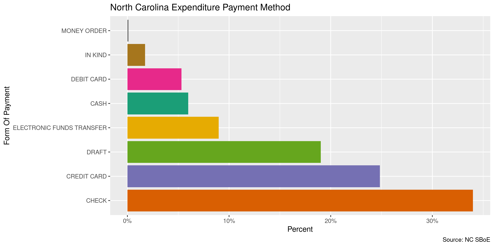<!-- -->

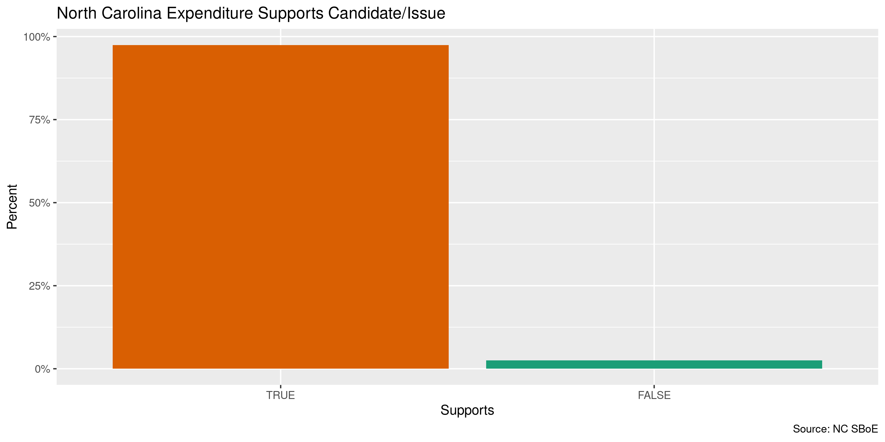<!-- -->

We can use `tidytext::unnest_tokens()` and `ggplot2::geom_col()` to
explore the most frequent word usage of the long-form `purpose`
variable.

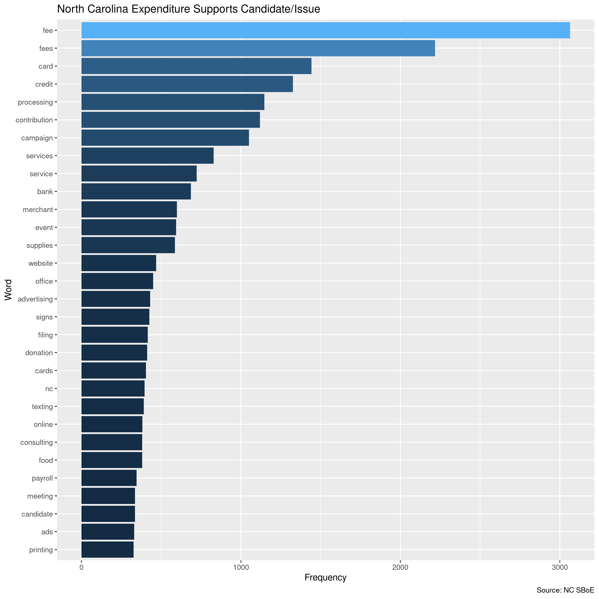<!-- -->

### Continuous

We should also check the range and distribution of continuous variables.

#### Amounts

``` r
summary(nc$amount)
```

    #>    Min. 1st Qu.  Median    Mean 3rd Qu.    Max.    NA's 
    #>  -10000       2      10     376      50 3800000      41

``` r
sum(nc$amount <= 0, na.rm = TRUE)
```

    #> [1] 1719

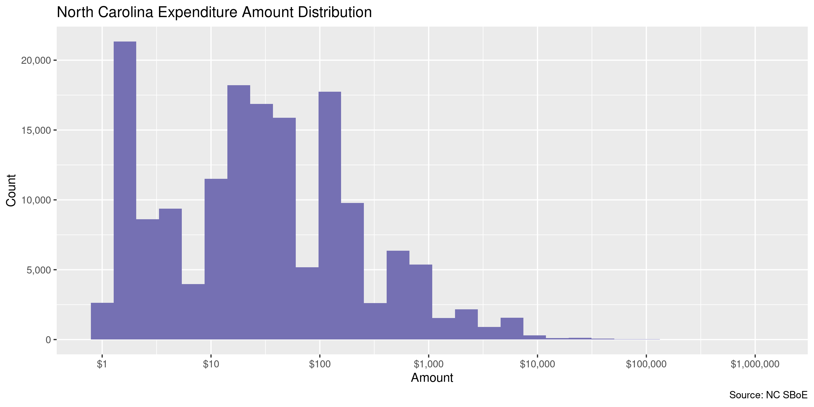<!-- -->

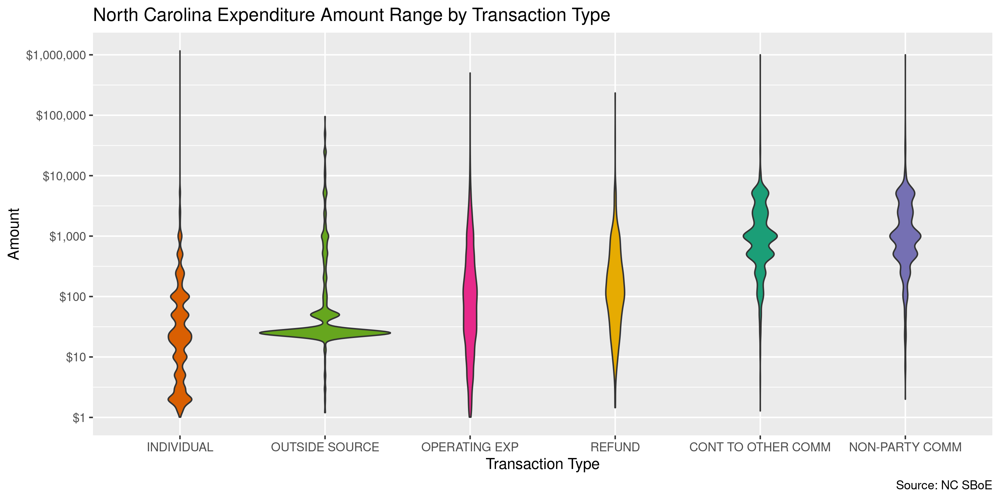<!-- -->

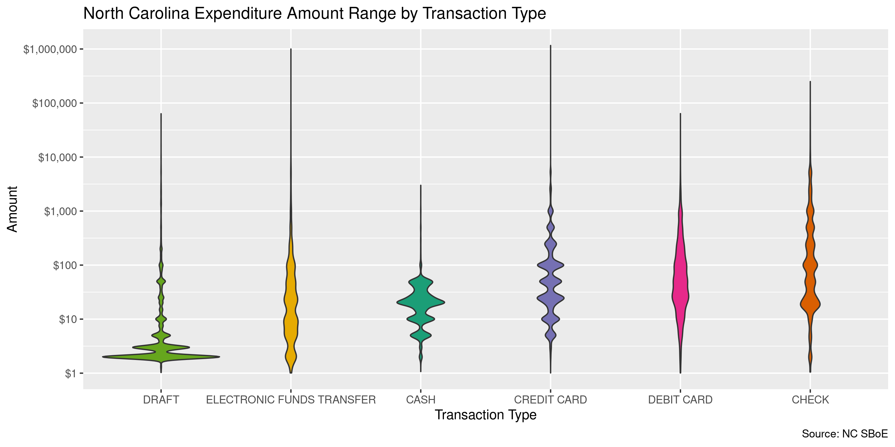<!-- -->

#### Dates

We can add a `year` variable using `lubridate::year()`.

``` r
nc <- mutate(nc, year = year(date))
```

The `date` variable is very clean, with 0 records before 2008 and 0
records after 2022-10-14.

``` r
min(nc$date, na.rm = TRUE)
#> [1] "2020-04-29"
sum(nc$year < 2008, na.rm = TRUE)
#> [1] 0
max(nc$date, na.rm = TRUE)
#> [1] "2022-10-07"
sum(nc$date > today(), na.rm = TRUE)
#> [1] 0
```

<!-- -->

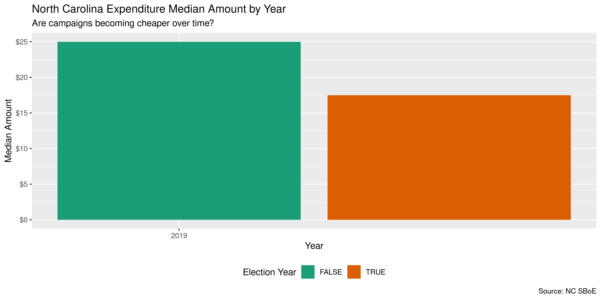<!-- -->

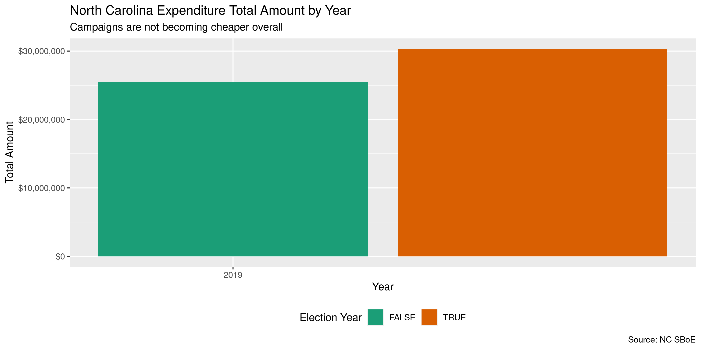<!-- -->

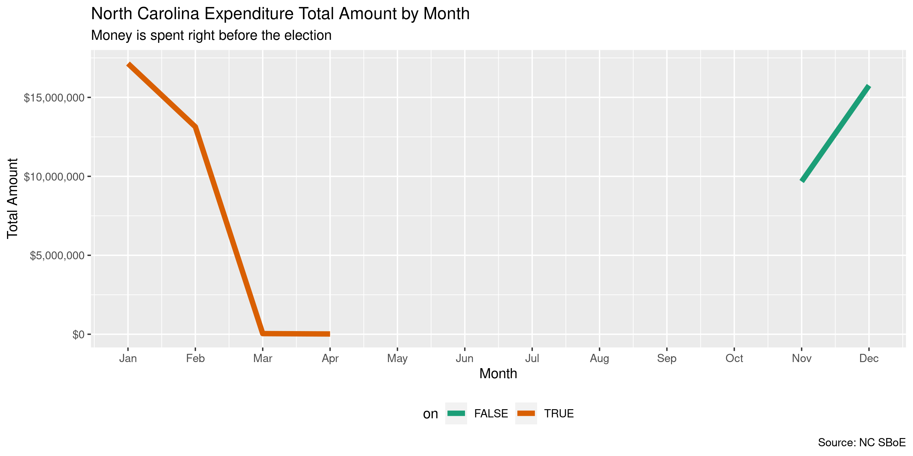<!-- -->

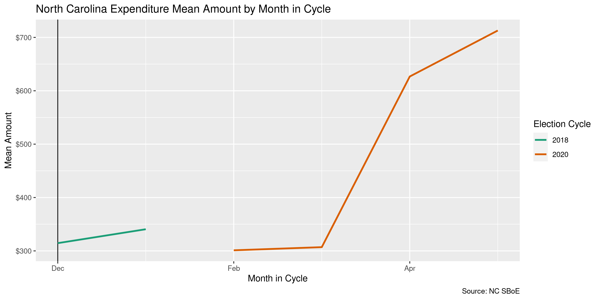<!-- -->

## Wrangle

To improve the searchability of the database, we can perform some
functional text normalization of geographic data. Here, we have
geographic data for both the expender and payee.

### Adress

``` r
nc <- nc %>% 
  unite(
    starts_with("payee_street"),
    col = payee_street,
    sep = " ",
    remove = FALSE,
    na.rm = TRUE
  ) %>% 
  unite(
    starts_with("comm_street"),
    col = comm_street,
    sep = " ",
    remove = FALSE,
    na.rm = TRUE
  ) %>% 
  mutate_at(
   .vars = vars(ends_with("street")),
   .funs = list(norm = normal_address),
   abbs = usps_street,
   na = invalid_city,
   na_rep = TRUE
  ) %>% 
  select(
    -ends_with("street")
  )
```

### States

``` r
nc <- nc %>%
  mutate_at(
    .vars = vars(ends_with("state")),
    .funs = str_replace_all,
    "^N$", "NC"
  ) %>% 
  mutate_at(
   .vars = vars(ends_with("state")),
   .funs = list(norm = normal_state),
   abbreviate = TRUE,
   na = c("", "NA"),
   na_rep = TRUE,
   valid = valid_state
  )
```

``` r
progress_table(
  nc$payee_state,
  nc$payee_state_norm,
  compare = valid_state
)
```

    #> # A tibble: 2 × 6
    #>   stage               prop_in n_distinct prop_na n_out n_diff
    #>   <chr>                 <dbl>      <dbl>   <dbl> <dbl>  <dbl>
    #> 1 nc$payee_state         1.00         82   0.573   194     23
    #> 2 nc$payee_state_norm    1            60   0.574     0      1

### Zip

``` r
nc <- nc %>%
  mutate_at(
   .vars = vars(ends_with("zip")),
   .funs = list(norm = normal_zip),
   na = c("", "NA"),
   na_rep = TRUE
  )
```

``` r
progress_table(
  nc$payee_zip,
  nc$payee_zip_norm,
  nc$comm_zip,
  nc$comm_zip_norm,
  compare = valid_zip
)
```

    #> # A tibble: 4 × 6
    #>   stage             prop_in n_distinct   prop_na  n_out n_diff
    #>   <chr>               <dbl>      <dbl>     <dbl>  <dbl>  <dbl>
    #> 1 nc$payee_zip        0.659      73349 0.596     261356  64948
    #> 2 nc$payee_zip_norm   0.997      10155 0.596       2056    791
    #> 3 nc$comm_zip         0.835        830 0.0000216 312495    147
    #> 4 nc$comm_zip_norm    0.978        707 0.000192   41748     11

### City

``` r
nc <- nc %>% 
  mutate_at(
   .vars = vars(ends_with("city")),
   .funs = list(norm = normal_city),
   abbs = usps_city,
   states = c("NC", "DC"),
   na = invalid_city,
   na_rep = TRUE
  )
```

``` r
nc <- nc %>% 
  left_join(
    y = zipcodes,
    by = c(
      "payee_state_norm" = "state",
      "payee_zip_norm" = "zip"
    )
  ) %>% 
  rename(payee_city_match = city) %>% 
  left_join(
    y = zipcodes,
    by = c(
      "comm_state_norm" = "state",
      "comm_zip_norm" = "zip"
    )
  ) %>% 
  rename(comm_city_match = city)
```

``` r
nc <- nc %>%
  # check and swap payee city
  mutate(
    match_abb = is_abbrev(payee_city_norm, payee_city_match),
    match_dist = str_dist(payee_city_norm, payee_city_match),
    payee_city_swap = if_else(
      condition = !is.na(payee_city_match) & (match_abb | match_dist <= 1),
      true = payee_city_match,
      false = payee_city_norm
    )
  ) %>% 
  # check and swap committee city
  mutate(
    match_abb = is_abbrev(comm_city_norm, comm_city_match),
    match_dist = str_dist(comm_city_norm, comm_city_match),
    comm_city_swap = if_else(
      condition = !is.na(comm_city_match) & (match_abb | match_dist <= 1),
      true = comm_city_match,
      false = comm_city_norm
    )
  )
```

``` r
progress_table(
  nc$payee_city,
  nc$payee_city_norm,
  nc$payee_city_swap,
  compare = valid_city
)
```

    #> # A tibble: 3 × 6
    #>   stage              prop_in n_distinct prop_na n_out n_diff
    #>   <chr>                <dbl>      <dbl>   <dbl> <dbl>  <dbl>
    #> 1 nc$payee_city        0.964       7517   0.594 27424   3033
    #> 2 nc$payee_city_norm   0.967       7152   0.594 25087   2658
    #> 3 nc$payee_city_swap   0.984       5628   0.594 12615   1105

``` r
progress_table(
  nc$comm_city,
  nc$comm_city_norm,
  nc$comm_city_swap,
  compare = valid_city
)
```

    #> # A tibble: 3 × 6
    #>   stage             prop_in n_distinct   prop_na n_out n_diff
    #>   <chr>               <dbl>      <dbl>     <dbl> <dbl>  <dbl>
    #> 1 nc$comm_city        0.984        465 0.0000216 30201     43
    #> 2 nc$comm_city_norm   0.985        462 0.000192  28737     38
    #> 3 nc$comm_city_swap   0.998        444 0.000192   3649     16

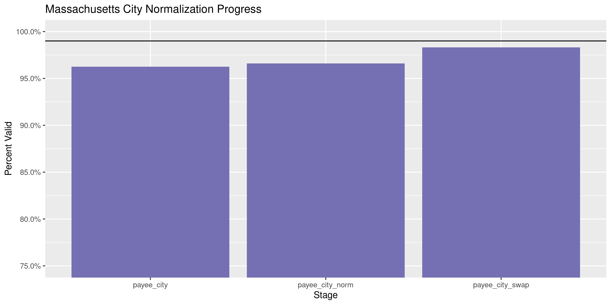<!-- -->

More importantly, the number of distinct values decreased each stage. We
were able to confidently change many distinct invalid values to their
valid equivalent.

``` r
progress %>% 
  select(
    stage, 
    all = n_distinct,
    bad = n_diff
  ) %>% 
  mutate(good = all - bad) %>% 
  pivot_longer(c("good", "bad")) %>% 
  mutate(name = name == "good") %>% 
  ggplot(aes(x = stage, y = value)) +
  geom_col(aes(fill = name)) +
  scale_fill_brewer(palette = "Dark2") +
  scale_y_continuous(labels = comma) +
  theme(legend.position = "bottom") +
  labs(
    title = "Massachusetts City Normalization Progress",
    subtitle = "Distinct values, valid and invalid",
    x = "Stage",
    y = "Percent Valid",
    fill = "Valid"
  )
```

<!-- -->

## Conclude

1.  There are 1899330 records in the database
2.  There are 940646 (50%) duplicate records
3.  The range and distribution of `amount` and `date` are reasonable
4.  There are 142 (0%) records missing names
5.  Consistency in geographic data has been improved with
    `campfin::normal_*()`
6.  The 5-digit `zip_norm` variable has been created with
    `campfin::normal_zip()`
7.  The 4-digit `year` variable has been created with
    `lubridate::year()`

## Export

Now the file can be saved on disk for upload to the Accountability
server.

``` r
nc <- nc %>% 
  select(
  -payee_city_match,
  -comm_city_match,
  -payee_city_norm,
  -comm_city_norm,
  -match_abb,
  -match_dist,
)


nc <- nc %>% 
  rename_all(str_replace, "_(norm|swap)$", "_clean")
```

``` r
clean_dir <- dir_create(here("nc", "expends", "data", "clean"))
clean_path <- path(clean_dir, glue("nc_expends_{today()}.csv"))
write_csv(nc, clean_path, na = "")
file_size(clean_path)
```

    #> 511M

``` r
#html_guess_encoding(clean_path)
```

## Upload

We can use the `aws.s3::put_object()` to upload the text file to the IRW
server.

``` r
aws_path <- path("csv", basename(clean_path))
if (!object_exists(aws_path, "publicaccountability")) {
  put_object(
    file = clean_path,
    object = aws_path, 
    bucket = "publicaccountability",
    acl = "public-read",
    show_progress = TRUE,
    multipart = TRUE
  )
}
aws_head <- head_object(aws_path, "publicaccountability")
(aws_size <- as_fs_bytes(attr(aws_head, "content-length")))
unname(aws_size == clean_size)
```
