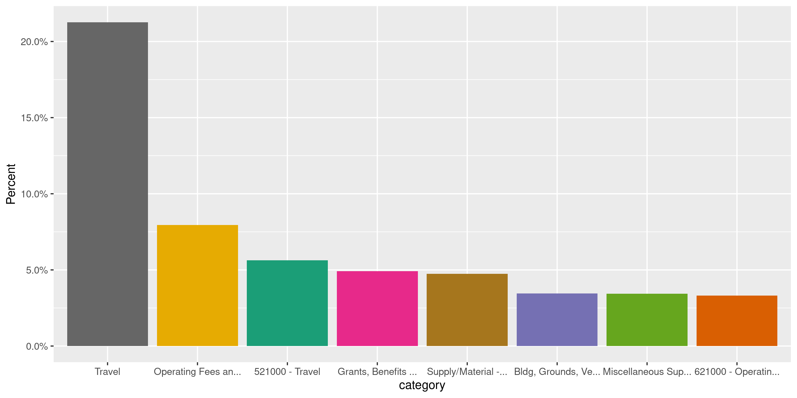
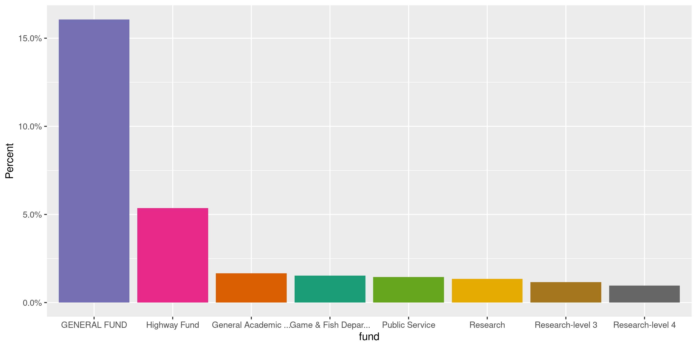
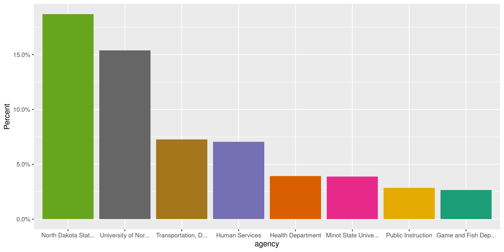
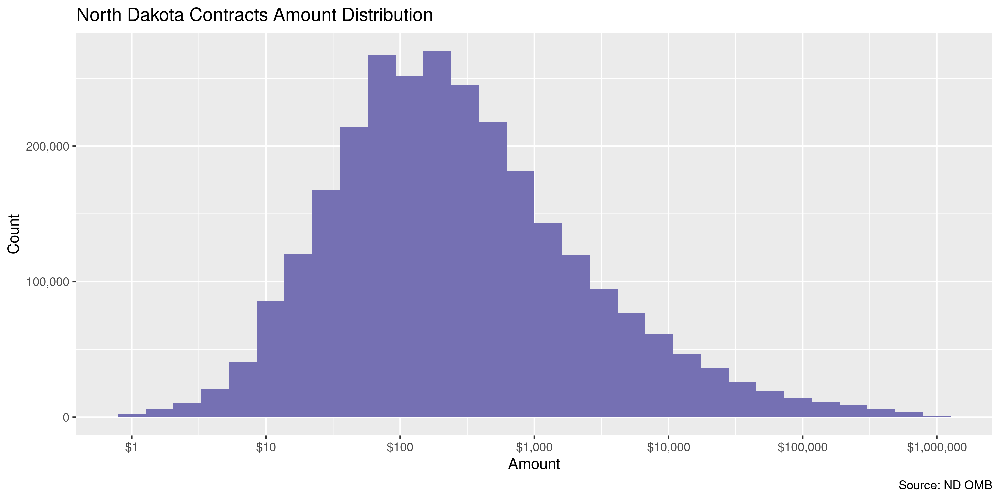
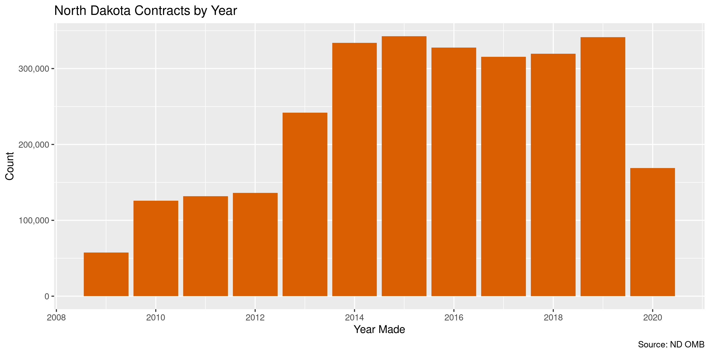
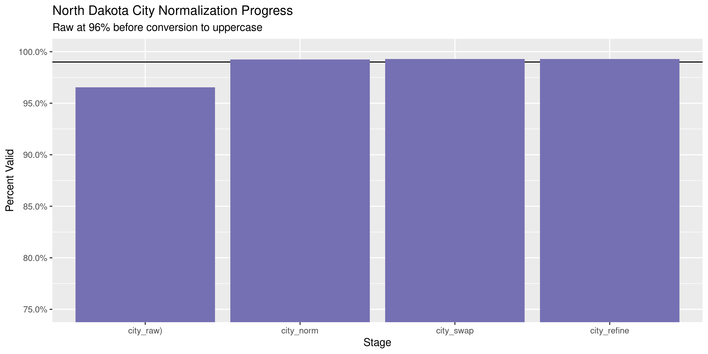

North Dakota Contracts
================
Kiernan Nicholls
2020-09-09 14:21:39

  - [Project](#project)
  - [Objectives](#objectives)
  - [Packages](#packages)
  - [Data](#data)
  - [Download](#download)
  - [Read](#read)
  - [Join](#join)
  - [Explore](#explore)
  - [Wrangle](#wrangle)
  - [Conclude](#conclude)
  - [Export](#export)
  - [Upload](#upload)
  - [Dictionary](#dictionary)

<!-- Place comments regarding knitting here -->

## Project

The Accountability Project is an effort to cut across data silos and
give journalists, policy professionals, activists, and the public at
large a simple way to search across huge volumes of public data about
people and organizations.

Our goal is to standardizing public data on a few key fields by thinking
of each dataset row as a transaction. For each transaction there should
be (at least) 3 variables:

1.  All **parties** to a transaction.
2.  The **date** of the transaction.
3.  The **amount** of money involved.

## Objectives

This document describes the process used to complete the following
objectives:

1.  How many records are in the database?
2.  Check for entirely duplicated records.
3.  Check ranges of continuous variables.
4.  Is there anything blank or missing?
5.  Check for consistency issues.
6.  Create a five-digit ZIP Code called `zip`.
7.  Create a `year` field from the transaction date.
8.  Make sure there is data on both parties to a transaction.

## Packages

The following packages are needed to collect, manipulate, visualize,
analyze, and communicate these results. The `pacman` package will
facilitate their installation and attachment.

The IRW’s `campfin` package will also have to be installed from GitHub.
This package contains functions custom made to help facilitate the
processing of campaign finance data.

``` r
if (!require("pacman")) install.packages("pacman")
pacman::p_load_gh("irworkshop/campfin")
pacman::p_load(
  tidyverse, # data manipulation
  lubridate, # datetime strings
  gluedown, # printing markdown
  magrittr, # pipe operators
  janitor, # clean data frames
  refinr, # cluster and merge
  scales, # format strings
  aws.s3, # upload to AWS
  knitr, # knit documents
  vroom, # read files fast
  rvest, # html scraping
  glue, # combine strings
  here, # relative paths
  httr, # http requests
  fs # local storage 
)
```

This document should be run as part of the `R_campfin` project, which
lives as a sub-directory of the more general, language-agnostic
[`irworkshop/accountability_datacleaning`](https://github.com/irworkshop/accountability_datacleaning)
GitHub repository.

The `R_campfin` project uses the [RStudio
projects](https://support.rstudio.com/hc/en-us/articles/200526207-Using-Projects)
feature and should be run as such. The project also uses the dynamic
`here::here()` tool for file paths relative to *your* machine.

``` r
# where does this document knit?
here::here()
#> [1] "/home/kiernan/Code/tap/R_campfin"
```

## Data

Contracts can be downloaded from the [North Dakota transparency
portal](https://www.nd.gov/omb/public/transparency), a site run by the
\[state Office of Managment and Budget (OMB)\]\[omb\].

The Transparency [FAQ](https://www.nd.gov/omb/public/transparency/faq)
page provides more information on the site and data:

> #### About the Data
> 
> This portal was established by the 2009 Legislative Assembly, North
> Dakota Century Code 54-44.1-18, Searchable Database of Expenditures,
> and provides a single point of reference to view State and University
> System expenditures. Providing direct access to the state’s accounting
> and payroll systems’ checkbook, the North Dakota Transparency portal
> is a tool that opens the books of government. It is a powerful way for
> the public to access information about the State of North Dakota’s
> payment activities as well as providing salary information on state
> employees. The portal, created by the Office of Management and Budget
> (OMB), will make state financial activity more understandable and
> create additional accountability on how tax dollars are utilized. A
> tutorial has been provided to assist users on how to best use the
> portal.

> #### What information is included?
> 
> All payments and payroll transactions made through the State of North
> Dakota’s PeopleSoft accounting system are included in the transparency
> portal. North Dakota’s Transparency portal contains payment
> information for all state agencies, the legislature, courts, and
> University system.

> #### What information is excluded?
> 
> As directed by law, the website does not include aid payments to
> individuals, organizations, and local assistance payments. Also, the
> names of some state employees have been redacted to protect their
> safety and welfare. For example, undercover officers in the Bureau of
> Criminal Investigation are not include to protect the agent’s cover.
> All transactions where the vendor’s name is protected by law will list
> the account description as the vendor instead.

> #### How often is the data updated?
> 
> Payment and salary information is provided from data recorded in the
> state’s PeopleSoft accounting system and is updated on a monthly
> basis, usually around the middle of the month for the fiscal period
> just ended.

> #### How do I download information?
> 
> In the left menu, you will see a “Mass Download” hyperlink. By
> clicking on that link, you will have the option to export detailed
> checkbook data for a biennium to a CSV or Microsoft Excel file.

The site also provides a glossary:

| Term                              | Definition                                                                                                                                                                                                                                                                                                                                                                                                                                                                                                        |
| :-------------------------------- | :---------------------------------------------------------------------------------------------------------------------------------------------------------------------------------------------------------------------------------------------------------------------------------------------------------------------------------------------------------------------------------------------------------------------------------------------------------------------------------------------------------------- |
| Agency                            | Refers to the State Agency or University System Institution that incurred the expenditure. The searches by agency report payments to vendors. The reports do not include salaries.                                                                                                                                                                                                                                                                                                                                |
| Biennium                          | The State Legislature appropriates expenditures for a two year period beginning on July 1st and ending on June 30th of each odd number year. The 17-19 biennium begins on 7/1/2017 and ends 6/30/2019. All searches are segmented by biennium and fiscal year.                                                                                                                                                                                                                                                    |
| Budget Unit                       | An agency receiving appropriated authority from the State Legislature.                                                                                                                                                                                                                                                                                                                                                                                                                                            |
| Expenditure Category              | A standardized set of descriptions used to describe the type of expenditure, i.e., Office Supplies, Travel, Salaries, etc.                                                                                                                                                                                                                                                                                                                                                                                        |
| Class                             | Appropriated expenditures by line item.                                                                                                                                                                                                                                                                                                                                                                                                                                                                           |
| Employee                          | Unique number assigned to an employee. An employee is assigned to a position and a position can have more than one employee, i.e. someone quit and another was hired. For the purposes of this website, the employee number is a randomly generated number used to identify an individual assigned to a position. It has no other meaning than that.                                                                                                                                                              |
| Exempt                            | Exempt or confidential information under state or federal law is not displayed.                                                                                                                                                                                                                                                                                                                                                                                                                                   |
| Federal                           | Appropriated expenditures paid with Federal funds.                                                                                                                                                                                                                                                                                                                                                                                                                                                                |
| Fund                              | Funds are primary structural units for education and governmental accounting. Funds are maintained as a balanced set of accounts and are used to present financial statements. They are created or established to carry out a specific mission or purpose, i.e. Veterans Postwar Trust Fund, Game and Fish Department Fund, etc.                                                                                                                                                                                  |
| General                           | Appropriated expenditures paid from the General fund.                                                                                                                                                                                                                                                                                                                                                                                                                                                             |
| Job Title                         | Position Title                                                                                                                                                                                                                                                                                                                                                                                                                                                                                                    |
| Legislative Appropriations Report | Reports only those expenditures charged against the budget authorized by the State Legislature for the biennium. The legislature appropriates General Fund and some special funded projects to the University System, however, it does not appropriate the University System’s tuition, fees, federal, etc. sources of income. Most commodity groups do not receive an appropriation from the legislature. All expenditures, both appropriated and non-appropriated, are reported in the search by business unit. |
| Position                          | Number assigned to each position within a business unit. If a business unit has two administrative assistants, each would have a unique position number with the same job title.                                                                                                                                                                                                                                                                                                                                  |
| Special                           | Appropriated expenditures paid from funds other than the General fund or Federal funds.                                                                                                                                                                                                                                                                                                                                                                                                                           |
| State Fiscal Year                 | The State’s fiscal year begins July 1st of one year and ends June 30th the following year. SFY-19 begins on 7/1/2018 and ends on 6/30/2019.                                                                                                                                                                                                                                                                                                                                                                       |
| Totals                            | Expenditures are reported as a fiscal year to date amount. A breakdown by month is not available.                                                                                                                                                                                                                                                                                                                                                                                                                 |
| Vendor                            | The payee. For instances where a payee cannot be displayed because of exempt or confidentiality laws, expenditures are reported using the Account description. For example, individual income tax refunds are reported as a total, not by payee.                                                                                                                                                                                                                                                                  |

## Download

Per the instructions found in the
[FAQ](https://www.nd.gov/omb/public/transparency/faq), we can download
files from the portal’s mass download page. The OMB provides data in
Excel files by fiscal year.

``` r
raw_home <- "https://www.nd.gov/omb/public/transparency/mass-download"
raw_urls <- read_html(raw_home) %>% 
  html_nodes(".field-items") %>% 
  html_nodes("li > a") %>% 
  html_attr("href") %>% 
  str_c("https://www.nd.gov", .)
```

``` r
raw_dir <- dir_create(here("nd", "contracts", "data", "raw"))
raw_paths <- path(raw_dir, basename(raw_urls))
```

``` r
for (i in seq_along(raw_urls)) {
  if (file_exists(raw_paths[i])) {
    next()
  } else {
    download.file(raw_urls[i], raw_paths[i])
  }
}
```

``` r
raw_info <- dir_info(raw_dir)
sum(raw_info$size)
#> 238M
raw_info %>% 
  select(path, size, modification_time) %>% 
  mutate(across(path, path.abbrev))
#> # A tibble: 13 x 3
#>    path                                                                    size modification_time  
#>    <chr>                                                             <fs::byte> <dttm>             
#>  1 ~/nd/contracts/data/raw/ND July+21+2020+Open+Records+Request.xlsx     70.03M 2020-09-04 11:52:15
#>  2 ~/nd/contracts/data/raw/mass_download_fy10.xlsx                        6.97M 2020-09-08 15:50:54
#>  3 ~/nd/contracts/data/raw/mass_download_fy11.xlsx                        7.15M 2020-09-08 15:50:53
#>  4 ~/nd/contracts/data/raw/mass_download_fy12.xlsx                        7.71M 2020-09-08 15:50:52
#>  5 ~/nd/contracts/data/raw/mass_download_fy13.xlsx                         8.8M 2020-09-08 15:50:50
#>  6 ~/nd/contracts/data/raw/mass_download_fy14.xlsx                       21.39M 2020-09-08 15:50:48
#>  7 ~/nd/contracts/data/raw/mass_download_fy15.xlsx                       21.99M 2020-09-08 15:50:46
#>  8 ~/nd/contracts/data/raw/mass_download_fy16.xlsx                       21.84M 2020-09-08 15:50:44
#>  9 ~/nd/contracts/data/raw/mass_download_fy17.xlsx                       17.39M 2020-09-08 15:50:42
#> 10 ~/nd/contracts/data/raw/mass_download_fy18.xlsx                       16.42M 2020-09-08 15:50:40
#> 11 ~/nd/contracts/data/raw/mass_download_fy19.xlsx                       20.99M 2020-09-08 15:50:38
#> 12 ~/nd/contracts/data/raw/mass_download_fy20.xlsx                        17.1M 2020-09-08 15:50:37
#> 13 ~/nd/contracts/data/raw/mass_download_fy21.xlsx                      655.73K 2020-09-08 15:50:34
```

## Read

The transactions are spread into multiple sheets in each Excel workbook.
We can write a new function that identifies the sheets and reads them
together.

``` r
read_all_sheets <- function(path) {
  path %>%
    readxl::excel_sheets() %>% # identify sheet names
    purrr::set_names() %>% # create a vector
    purrr::map_df( # read all sheets together
      .f = readxl::read_excel,
      .name_repair = janitor::make_clean_names,
      path = path
    )
}
```

``` r
ndc <- map_df(
  .x = raw_paths,
  .f = read_all_sheets
)
```

Across the different sheets and files, some columns have different names
and need to be coalesced into a single column.

``` r
ndc <- ndc %>% 
  mutate(fund = coalesce(fund, fund_description)) %>% 
  mutate(across(date, as_date)) %>% 
  select(-fund_description) %>% 
  rename(
    category = expenditure_category,
    description = detailed_expenditure_category
  )
```

Note that this database does *not* contain street addresses for
businesses.

``` r
comma(nrow(ndc))
#> [1] "2,842,818"
head(ndc)
#> # A tibble: 6 x 11
#>   biennium fiscal_year date       agency  vendor    city   state category description amount fund  
#>   <chr>    <chr>       <date>     <chr>   <chr>     <chr>  <chr> <chr>    <chr>        <dbl> <chr> 
#> 1 19-21    SFY-21      2020-07-31 Adjuta… ABT DATA… WEST … ND    591000 … Repair Bui… 5979   ARMY …
#> 2 19-21    SFY-21      2020-07-31 Adjuta… ACME ELE… GRAND… ND    591000 … Repair Bui…   88.0 ARMY …
#> 3 19-21    SFY-21      2020-07-31 Adjuta… ACME ELE… GRAND… ND    591000 … Repair Bui…   88.0 GENER…
#> 4 19-21    SFY-21      2020-07-31 Adjuta… BALTZELL… DICKI… ND    521000 … Non State …   52.5 EMPG2…
#> 5 19-21    SFY-21      2020-07-31 Adjuta… BALTZELL… DICKI… ND    521000 … Non State …   52.5 GENER…
#> 6 19-21    SFY-21      2020-07-31 Adjuta… BARNES R… VALLE… ND    561000 … Water & Ga…  148.  ARMY …
```

## Join

The Investigative Reporting Workshop initially requested this data using
the North Dakota Open Records Statute, N.D.C.C. §44-04-18 et seq. The
Director of the Central Services Division provided a single Excel file
to satisfy our request, but pointed us to the more comprehensive public
data.

``` r
req_path <- path(raw_dir, "ND July+21+2020+Open+Records+Request.xlsx")
ndrr <- read_all_sheets(req_path)
ndrr <- mutate(ndrr, across(date, as_date))
```

This requested data has half as many rows and slightly different
columns.

``` r
comma(nrow(ndrr))
#> [1] "1,139,964"
head(ndrr)
#> # A tibble: 6 x 10
#>   agency    date       reference amount name            address_1   address_2 city     st    postal
#>   <chr>     <date>         <dbl>  <dbl> <chr>           <chr>       <chr>     <chr>    <chr> <chr> 
#> 1 Human Se… 2015-01-02   2044897    438 ABC CHILD DEVE… 1105 16TH … <NA>      MINOT    ND    58703 
#> 2 Human Se… 2015-01-02   2044898    813 ABC SANDCASTLE… 2502 18 ST… <NA>      FARGO    ND    58103 
#> 3 Human Se… 2015-01-02   2044900    694 BROWN SUSAN     202 4TH AV… <NA>      WEST FA… ND    58078 
#> 4 Human Se… 2015-01-02   2044902    293 COOK KELLIE     19 OAK ST   <NA>      LISBON   ND    58054 
#> 5 Human Se… 2015-01-02   2044908    447 FRASER CHILD C… 2902 S UNI… <NA>      FARGO    ND    58103 
#> 6 Human Se… 2015-01-02   2044910    423 HANSON BRENDA K 420 3RD AV… <NA>      EAST GR… MN    56721
```

Importantly, for our interests, the requested data contains street
addresses for the business receiving the payment. The Public
Accountability project uses addresses as a way to identify the parties
to a transaction. Unfortunately, there are no unique vendor IDs that can
be used to join the two databases. The business names are not quite
identical.

First, we will count all of the vendors in the public database.

``` r
a <- ndc %>% 
  count(vendor, city, state, sort = TRUE) %>% 
  select(-n)
```

Next, we will count the vendors in the requested data after normalizing
the addresses.

``` r
b <- ndrr %>% 
  rename(vendor = name, state = st, zip = postal) %>% 
  # address and zip are new
  count(vendor, city, state, address_1, address_2, zip, sort = TRUE) %>% 
  select(-n)
```

Then, we will find all vendors, cities, and state values common between
both databases. This will allow us to add the addresses and postal codes
that are missing in the raw data. Some vendors have multiple addresses
with the same city and state. We can only give each business name a
single address, so we will use the most common.

``` r
c <- a %>% 
  inner_join(b, by = c("vendor", "city", "state")) %>% 
  group_by(vendor, city, state) %>% 
  slice(1)
```

After joining this address database with our transactions, we have the
same number of rows but have added the `address_*` and `zip` columns.

``` r
dim(ndc)
#> [1] 2842818      11
ndc <- left_join(ndc, c)
dim(ndc)
#> [1] 2842818      14
```

Slightly more than half of rows have addresses, but it’s better than
nothing.

``` r
percent(prop_na(ndc$address_1), 0.01)
#> [1] "52.69%"
```

## Explore

``` r
glimpse(ndc)
#> Rows: 2,842,818
#> Columns: 14
#> $ biennium    <chr> "19-21", "19-21", "19-21", "19-21", "19-21", "19-21", "19-21", "19-21", "19-…
#> $ fiscal_year <chr> "SFY-21", "SFY-21", "SFY-21", "SFY-21", "SFY-21", "SFY-21", "SFY-21", "SFY-2…
#> $ date        <date> 2020-07-31, 2020-07-31, 2020-07-31, 2020-07-31, 2020-07-31, 2020-07-31, 202…
#> $ agency      <chr> "Adjutant General", "Adjutant General", "Adjutant General", "Adjutant Genera…
#> $ vendor      <chr> "ABT DATA TECHNOLOGIES INC", "ACME ELECTRIC TOOL CRIB OF THE NORTH", "ACME E…
#> $ city        <chr> "WEST FARGO", "GRAND FORKS", "GRAND FORKS", "DICKINSON", "DICKINSON", "VALLE…
#> $ state       <chr> "ND", "ND", "ND", "ND", "ND", "ND", NA, NA, "ND", "ND", "ND", NA, NA, NA, "N…
#> $ category    <chr> "591000 - Repairs", "591000 - Repairs", "591000 - Repairs", "521000 - Travel…
#> $ description <chr> "Repair Building & Grounds", "Repair Building & Grounds", "Repair Building &…
#> $ amount      <dbl> 5979.00, 87.96, 87.96, 52.50, 52.50, 148.26, 10.50, 100.00, 4118.00, 18.00, …
#> $ fund        <chr> "ARMY GUARD CONTRACTS", "ARMY GUARD CONTRACTS", "GENERAL FUND", "EMPG2019", …
#> $ address_1   <chr> "705 E MAIN AVE STE D", "CORPORATE OFFICES", "CORPORATE OFFICES", "550 7TH S…
#> $ address_2   <chr> NA, "1705 13TH AVE N", "1705 13TH AVE N", NA, NA, NA, NA, NA, NA, NA, NA, NA…
#> $ zip         <chr> "58078", "58208-3720", "58208-3720", "58601-4526", "58601-4526", "58072", NA…
tail(ndc)
#> # A tibble: 6 x 14
#>   biennium fiscal_year date       agency vendor city  state category description amount fund 
#>   <chr>    <chr>       <date>     <chr>  <chr>  <chr> <chr> <chr>    <chr>        <dbl> <chr>
#> 1 09-11    SFY-10      2010-06-30 Willi… WILLI… WILL… ND    Utiliti… Water and … 1.72e4 Phys…
#> 2 09-11    SFY-10      2010-06-30 Willi… WILLI… WILL… ND    Utiliti… Water and … 1.02e2 Teto…
#> 3 09-11    SFY-10      2010-06-30 Willi… WILLI… WILL… ND    Utiliti… Water and … 7.14e1 Teto…
#> 4 09-11    SFY-10      2010-06-30 Willi… WORKF… <NA>  <NA>  Supply/… Instructio… 1.25e2 Trai…
#> 5 09-11    SFY-10      2010-06-30 Workf… BICKE… WEST… PA    Profess… Actuaries   0.     Work…
#> 6 09-11    SFY-10      2010-06-30 Workf… Gross… Exem… <NA>  Travel   Meals Taxa… 1.50e1 Work…
#> # … with 3 more variables: address_1 <chr>, address_2 <chr>, zip <chr>
```

### Missing

Columns vary in their degree of missing values.

``` r
col_stats(ndc, count_na)
#> # A tibble: 14 x 4
#>    col         class        n          p
#>    <chr>       <chr>    <int>      <dbl>
#>  1 biennium    <chr>        0 0         
#>  2 fiscal_year <chr>        0 0         
#>  3 date        <date>       0 0         
#>  4 agency      <chr>        0 0         
#>  5 vendor      <chr>        0 0         
#>  6 city        <chr>    97658 0.0344    
#>  7 state       <chr>   830260 0.292     
#>  8 category    <chr>       11 0.00000387
#>  9 description <chr>       11 0.00000387
#> 10 amount      <dbl>        0 0         
#> 11 fund        <chr>        0 0         
#> 12 address_1   <chr>  1497882 0.527     
#> 13 address_2   <chr>  2391958 0.841     
#> 14 zip         <chr>  1498371 0.527
```

No rows are missing the names, date, or amount needed to identify a
transaction.

A lot of records have an “exempt” city value.

``` r
ndc %>% 
  count(city, state, sort = TRUE) %>% 
  add_prop()
#> # A tibble: 11,442 x 4
#>    city        state      n      p
#>    <chr>       <chr>  <int>  <dbl>
#>  1 Exempt      <NA>  730101 0.257 
#>  2 NEW YORK    NY    341043 0.120 
#>  3 BISMARCK    ND    278282 0.0979
#>  4 FARGO       ND    207895 0.0731
#>  5 GRAND FORKS ND    102649 0.0361
#>  6 <NA>        <NA>   97608 0.0343
#>  7 MINOT       ND     69812 0.0246
#>  8 CHICAGO     IL     60886 0.0214
#>  9 MINNEAPOLIS MN     40961 0.0144
#> 10 DICKINSON   ND     33803 0.0119
#> # … with 11,432 more rows
```

``` r
ndc <- mutate(ndc, geo_exempt = (city == "Exempt") & is.na(state))
ndc$city[ndc$geo_exempt] <- NA_character_
prop_na(ndc$address_1[!ndc$geo_exempt])
#> [1] 0.3634093
```

### Duplicates

``` r
d1 <- duplicated(ndc, fromLast = FALSE)
d2 <- duplicated(ndc, fromLast = TRUE)
if (sum(d1 | d2) > 0) {
  ndc <- mutate(ndc, dupe_flag = d1 | d2)
  sum(ndc$dupe_flag)
}
rm(d1, d2); flush_memory()
```

### Categorical

``` r
col_stats(ndc, n_distinct)
#> # A tibble: 15 x 4
#>    col         class       n          p
#>    <chr>       <chr>   <int>      <dbl>
#>  1 biennium    <chr>       6 0.00000211
#>  2 fiscal_year <chr>      12 0.00000422
#>  3 date        <date>    133 0.0000468 
#>  4 agency      <chr>      79 0.0000278 
#>  5 vendor      <chr>   95642 0.0336    
#>  6 city        <chr>    9988 0.00351   
#>  7 state       <chr>     147 0.0000517 
#>  8 category    <chr>     219 0.0000770 
#>  9 description <chr>    1140 0.000401  
#> 10 amount      <dbl>  499431 0.176     
#> 11 fund        <chr>    8062 0.00284   
#> 12 address_1   <chr>   24757 0.00871   
#> 13 address_2   <chr>    2851 0.00100   
#> 14 zip         <chr>   19177 0.00675   
#> 15 geo_exempt  <lgl>       3 0.00000106
```

``` r
explore_plot(ndc, category) + scale_x_truncate()
```

<!-- -->

``` r
explore_plot(ndc, fund) + scale_x_truncate()
```

<!-- -->

``` r
explore_plot(ndc, agency) + scale_x_truncate()
```

<!-- -->

### Amounts

``` r
summary(ndc$amount)
#>      Min.   1st Qu.    Median      Mean   3rd Qu.      Max. 
#> -14500000        54       199     13468       906 282000000
mean(ndc$amount <= 0)
#> [1] 0.02212488
```

Here are the smallest and largest transactions.

``` r
glimpse(ndc[c(which.min(ndc$amount), which.max(ndc$amount)), ])
#> Rows: 2
#> Columns: 15
#> $ biennium    <chr> "13-15", "13-15"
#> $ fiscal_year <chr> "SFY-15", "SFY-15"
#> $ date        <date> 2015-02-28, 2015-03-31
#> $ agency      <chr> "Transportation, Department of", "Treasurer's Office"
#> $ vendor      <chr> "KNIFE RIVER CORP NORTH CENTRAL", "BANK OF ND"
#> $ city        <chr> "SAUK RAPIDS", "BISMARCK"
#> $ state       <chr> "MN", "ND"
#> $ category    <chr> "Other Capital Payments", "Grants, Benefits & Claims"
#> $ description <chr> "Contractor Payments - Highways", "Grants To Cities"
#> $ amount      <dbl> -14500000, 282000000
#> $ fund        <chr> "Highway Fund", "Strategic Investment Fund"
#> $ address_1   <chr> "4787 SHADOW WOOD DR NE", "TREASURERS OFFICE DIRECT DEPOSIT"
#> $ address_2   <chr> NA, "PO BOX 5509"
#> $ zip         <chr> "56379-9431", "58502-5509"
#> $ geo_exempt  <lgl> FALSE, FALSE
```

<!-- -->

### Dates

We can add the calendar year from `date` with `lubridate::year()`

``` r
ndc <- mutate(ndc, year = year(date))
```

``` r
min(ndc$date)
#> [1] "2009-07-31"
sum(ndc$year < 2000)
#> [1] 0
max(ndc$date)
#> [1] "2020-07-31"
sum(ndc$date > today())
#> [1] 0
```

<!-- -->

## Wrangle

To improve the searchability of the database, we will perform some
consistent, confident string normalization. For geographic variables
like city names and ZIP codes, the corresponding `campfin::normal_*()`
functions are tailor made to facilitate this process.

### Address

Street addresses are already abbreviated and normalized how we would.

``` r
ndc %>% 
  count(address_1, address_2, sort = TRUE)
#> # A tibble: 25,536 x 3
#>    address_1             address_2                    n
#>    <chr>                 <chr>                    <int>
#>  1 <NA>                  <NA>                   1497881
#>  2 270 PARK AVE          <NA>                    102337
#>  3 4201 NORMANDY ST      <NA>                     37703
#>  4 608 E BOULEVARD AVE   <NA>                     21755
#>  5 CAPITOL TOWER 4TH FLR 600 E BOULEVARD AVENUE   17537
#>  6 3100 Railroad Ave     <NA>                     16004
#>  7 PO BOX 25505          <NA>                     12911
#>  8 PO BOX 5010           <NA>                     11179
#>  9 PO BOX 9477           <NA>                     10179
#> 10 PO BOX 709            <NA>                      8833
#> # … with 25,526 more rows
```

### ZIP

For ZIP codes, the `campfin::normal_zip()` function will attempt to
create valid *five* digit codes by removing the ZIP+4 suffix and
returning leading zeroes dropped by other programs like Microsoft Excel.

``` r
ndc <- ndc %>% 
  mutate(
    zip_norm = normal_zip(
      zip = zip,
      na_rep = TRUE
    )
  )
```

``` r
progress_table(
  ndc$zip,
  ndc$zip_norm,
  compare = valid_zip
)
#> # A tibble: 2 x 6
#>   stage    prop_in n_distinct prop_na  n_out n_diff
#>   <chr>      <dbl>      <dbl>   <dbl>  <dbl>  <dbl>
#> 1 zip        0.396      19177   0.527 811846  17483
#> 2 zip_norm   0.999       4176   0.527   1317    108
```

### State

Almost all `state` values are valid 2-digit abbreviations and most of
the remaining are Canadian provinces or some foreign country we want to
keep.

``` r
percent(prop_in(ndc$state, valid_state), 0.01)
#> [1] "99.86%"
```

``` r
ndc %>% 
  count(state, sort = T) %>% 
  filter(state %out% valid_state)
#> # A tibble: 94 x 2
#>    state      n
#>    <chr>  <int>
#>  1 <NA>  830260
#>  2 ON       905
#>  3 AB       345
#>  4 MB       332
#>  5 BC       270
#>  6 SK       196
#>  7 QC       123
#>  8 UN        99
#>  9 GBR       38
#> 10 VIC       30
#> # … with 84 more rows
```

### City

Cities are the most difficult geographic variable to normalize, simply
due to the wide variety of valid cities and formats.

#### Normal

The `campfin::normal_city()` function is a good start, again converting
case, removing punctuation, but *expanding* USPS abbreviations. We can
also remove `invalid_city` values.

``` r
ndc <- ndc %>% 
  mutate(
    city_norm = normal_city(
      city = city, 
      abbs = usps_city,
      states = c("ND", "DC", "NORTH DAKOTA"),
      na = invalid_city,
      na_rep = TRUE
    )
  )
```

#### Swap

We can further improve normalization by comparing our normalized value
against the *expected* value for that record’s state abbreviation and
ZIP code. If the normalized value is either an abbreviation for or very
similar to the expected value, we can confidently swap those two.

``` r
ndc <- ndc %>% 
  rename(city_raw = city) %>% 
  left_join(
    y = zipcodes,
    by = c("state", "zip_norm" = "zip")
  ) %>% 
  rename(city_match = city) %>% 
  mutate(
    match_abb = is_abbrev(city_norm, city_match),
    match_dist = str_dist(city_norm, city_match),
    city_swap = if_else(
      condition = !is.na(match_dist) & (match_abb | match_dist == 1),
      true = city_match,
      false = city_norm
    )
  ) %>% 
  select(
    -city_match,
    -match_dist,
    -match_abb
  )
```

#### Refine

The [OpenRefine](https://openrefine.org/) algorithms can be used to
group similar strings and replace the less common versions with their
most common counterpart. This can greatly reduce inconsistency, but with
low confidence; we will only keep any refined strings that have a valid
city/state/zip combination.

``` r
good_refine <- ndc %>% 
  mutate(
    city_refine = city_swap %>% 
      key_collision_merge() %>% 
      n_gram_merge(numgram = 1)
  ) %>% 
  filter(city_refine != city_swap) %>% 
  inner_join(
    y = zipcodes,
    by = c("city_refine" = "city", "state", "zip_norm" = "zip")
  )
```

    #> # A tibble: 2 x 5
    #>   state zip_norm city_swap     city_refine       n
    #>   <chr> <chr>    <chr>         <chr>         <int>
    #> 1 CA    94104    SAN FRANSICO  SAN FRANCISCO     1
    #> 2 IL    60585    PLAINFIELD IL PLAINFIELD        1

Then we can join the refined values back to the database.

``` r
ndc <- ndc %>% 
  left_join(good_refine, by = names(.)) %>% 
  mutate(city_refine = coalesce(city_refine, city_swap))
```

#### Progress

| stage        | prop\_in | n\_distinct | prop\_na | n\_out | n\_diff |
| :----------- | -------: | ----------: | -------: | -----: | ------: |
| city\_raw)   |    0.965 |        9962 |    0.291 |  69686 |    5770 |
| city\_norm   |    0.992 |        4996 |    0.306 |  14797 |     783 |
| city\_swap   |    0.993 |        4965 |    0.306 |  13887 |     750 |
| city\_refine |    0.993 |        4963 |    0.306 |  13885 |     748 |

You can see how the percentage of valid values increased with each
stage.

<!-- -->

More importantly, the number of distinct values decreased each stage. We
were able to confidently change many distinct invalid values to their
valid equivalent.

<!-- -->

## Conclude

Before exporting, we can remove the intermediary normalization columns
and rename all added variables with the `_clean` suffix.

``` r
ndc <- ndc %>% 
  select(
    -city_norm,
    -city_swap,
    city_clean = city_refine
  ) %>% 
  rename_all(~str_replace(., "_norm", "_clean")) %>% 
  rename_all(~str_remove(., "_raw"))
```

``` r
glimpse(sample_n(ndc, 50))
#> Rows: 50
#> Columns: 18
#> $ biennium    <chr> "19-21", "17-19", "09-11", "13-15", "19-21", "15-17", "11-13", "13-15", "15-…
#> $ fiscal_year <chr> "SFY-20", "SFY-18", "SFY-11", "SFY-15", "SFY-20", "SFY-17", "SFY-13", "SFY-1…
#> $ date        <date> 2019-10-31, 2017-09-30, 2011-04-30, 2014-12-31, 2019-12-31, 2016-10-31, 201…
#> $ agency      <chr> "University of North Dakota", "Judiciary System", "Minot State University", …
#> $ vendor      <chr> "TIEDEMAN,THERESE M", "JPMORGAN CHASE AND COMPANY", "GAFFANEYS OF MINOT", "I…
#> $ city        <chr> "EAST GRAND FORKS", "NEW YORK", "MINOT", "BISMARCK", "GRAND FORKS", "NEW YOR…
#> $ state       <chr> "MN", "NY", "ND", "ND", "ND", "NY", "MN", NA, "ND", "ND", "NY", NA, "ND", "N…
#> $ category    <chr> "621000 - Operating Fees and Services", "IT Equipment under $5,000", "Miscel…
#> $ description <chr> "Participant Fees", "Computer Equipment under $5000", "Expendable Equip Not …
#> $ amount      <dbl> 240.00, 732.04, 149.00, 3508.69, 1037.76, 25.47, 4919.00, 206793.29, 2750.00…
#> $ fund        <chr> "General Academic Instruction", "GENERAL FUND", "Facilities Mgmt Administrat…
#> $ address_1   <chr> NA, "270 PARK AVE", "416 20TH AVE SE", "4201 NORMANDY ST", "UTILITY BILLING"…
#> $ address_2   <chr> NA, NA, "PO BOX 579", NA, "PO BOX 5518", NA, NA, NA, NA, NA, NA, NA, NA, NA,…
#> $ zip         <chr> NA, "10017", "58701", "58503-1324", "58206-5518", NA, NA, NA, "58503-6174", …
#> $ geo_exempt  <lgl> FALSE, FALSE, FALSE, FALSE, FALSE, FALSE, FALSE, NA, FALSE, FALSE, FALSE, NA…
#> $ year        <dbl> 2019, 2017, 2011, 2014, 2019, 2016, 2013, 2014, 2015, 2015, 2014, 2015, 2018…
#> $ zip_clean   <chr> NA, "10017", "58701", "58503", "58206", NA, NA, NA, "58503", "58702", NA, NA…
#> $ city_clean  <chr> "EAST GRAND FORKS", "NEW YORK", "MINOT", "BISMARCK", "GRAND FORKS", "NEW YOR…
```

1.  There are 2,842,818 records in the database.
2.  There are 0 duplicate records in the database.
3.  The range and distribution of `amount` and `date` seem reasonable.
4.  There are 0 records missing key variables.
5.  Consistency in geographic data has been improved with
    `campfin::normal_*()`.
6.  The 4-digit `year` variable has been created with
    `lubridate::year()`.

## Export

Now the file can be saved on disk for upload to the Accountability
server.

``` r
clean_dir <- dir_create(here("nd", "contracts", "data", "clean"))
clean_path <- path(clean_dir, "nd_contracts_clean.csv")
write_csv(ndc, clean_path, na = "")
file_size(clean_path)
#> 504M
file_encoding(clean_path) %>% 
  mutate(across(path, path.abbrev))
#> # A tibble: 1 x 3
#>   path                                             mime            charset
#>   <chr>                                            <chr>           <chr>  
#> 1 ~/nd/contracts/data/clean/nd_contracts_clean.csv application/csv utf-8
```

## Upload

We can use the `aws.s3::put_object()` to upload the text file to the IRW
server.

``` r
s3_path <- path("csv", basename(clean_path))
if (!object_exists(s3_path, "publicaccountability")) {
  put_object(
    file = clean_path,
    object = s3_path, 
    bucket = "publicaccountability",
    acl = "public-read",
    multipart = TRUE,
    show_progress = TRUE
  )
}
```

``` r
as_fs_bytes(object_size(s3_path, "publicaccountability"))
#> 504M
```

## Dictionary

The following table describes the variables in our final exported file:

| Column        | Type        | Definition                         |
| :------------ | :---------- | :--------------------------------- |
| `biennium`    | `character` | The two-year period spending made  |
| `fiscal_year` | `character` | Fiscal year code spending made     |
| `date`        | `double`    | Date contract of payment made      |
| `agency`      | `character` | Spending agency name               |
| `vendor`      | `character` | Receiving vendor name              |
| `city`        | `character` | Vendor city name                   |
| `state`       | `character` | Vendor state abbreviation          |
| `category`    | `character` | Spending category                  |
| `description` | `character` | Description of payment made        |
| `amount`      | `double`    | Dollar amount paid                 |
| `fund`        | `character` | Amount fund source                 |
| `address_1`   | `character` | Vendor street address              |
| `address_2`   | `character` | Vendor secondary address           |
| `zip`         | `character` | Vendor ZIP+4 code                  |
| `geo_exempt`  | `logical`   | Exempt from geographic information |
| `year`        | `double`    | Calendar year payment made         |
| `zip_clean`   | `character` | Normalized 5-digit ZIP code        |
| `city_clean`  | `character` | Normalized city name               |
