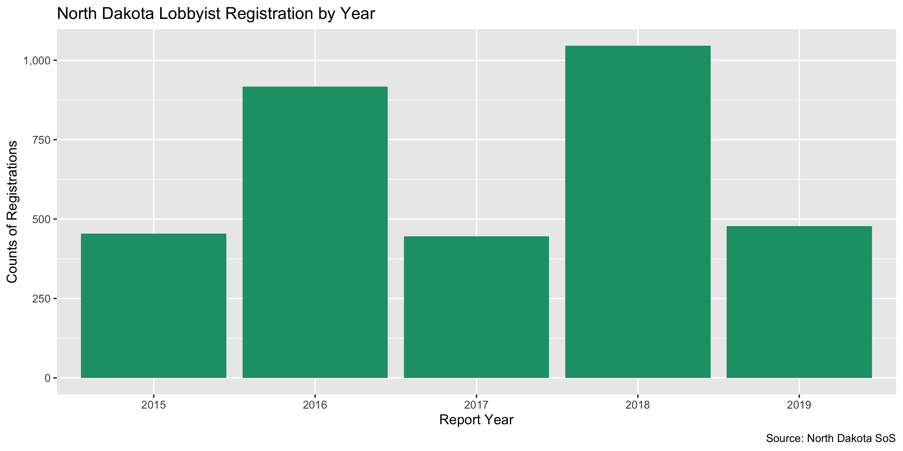

North Dakota Lobbying Registration Data Diary
================
Yanqi Xu
2020-01-06 10:17:18

-   [Project](#project)
-   [Objectives](#objectives)
-   [Packages](#packages)
-   [Download](#download)
-   [Reading](#reading)
    -   [Duplicates](#duplicates)
    -   [Missing](#missing)
    -   [Explore](#explore)
-   [Wrangling](#wrangling)
    -   [ZIP](#zip)
    -   [State](#state)
    -   [City](#city)
    -   [Address](#address)
    -   [Export](#export)

Project
-------

The Accountability Project is an effort to cut across data silos and give journalists, policy professionals, activists, and the public at large a simple way to search across huge volumes of public data about people and organizations.

Our goal is to standardizing public data on a few key fields by thinking of each dataset row as a transaction. For each transaction there should be (at least) 3 variables:

1.  All **parties** to a transaction
2.  The **date** of the transaction
3.  The **amount** of money involved

Objectives
----------

This document describes the process used to complete the following objectives:

1.  How many records are in the database?
2.  Check for duplicates
3.  Check ranges
4.  Is there anything blank or missing?
5.  Check for consistency issues
6.  Create a five-digit ZIP Code called `ZIP5`
7.  Create a `YEAR` field from the transaction date
8.  Make sure there is data on both parties to a transaction

Packages
--------

The following packages are needed to collect, manipulate, visualize, analyze, and communicate these results. The `pacman` package will facilitate their installation and attachment.

``` r
if (!require("pacman")) install.packages("pacman")
pacman::p_load_gh("irworkshop/campfin")
pacman::p_load(
  stringdist, # levenshtein value
  tidyverse, # data manipulation
  readxl, # import excel files
  lubridate, # datetime strings
  tidytext, # string analysis
  magrittr, # pipe opperators
  janitor, # dataframe clean
  refinr, # cluster and merge
  knitr, # knit documents
  glue, # combine strings
  scales, #format strings
  here, # relative storage
  fs, # search storage 
  vroom, #read deliminated files
  readxl #read excel files
)
```

This document should be run as part of the `R_campfin` project, which lives as a sub-directory of the more general, language-agnostic \[`irworkshop/accountability_datacleaning`\]\[01\] GitHub repository.

The `R_campfin` project uses the \[RStudio projects\]\[02\] feature and should be run as such. The project also uses the dynamic `here::here()` tool for file paths relative to *your* machine.

``` r
# where dfs this document knit?
here::here()
#> [1] "/Users/soc/accountability/accountability_datacleaning/R_campfin"
```

Download
--------

Set the data directory first.

``` r
# create a directory for the raw data
reg_dir <- here("nd", "lobby", "data", "raw", "reg")
dir_create(reg_dir)
```

The [North Dakota Secretary of State](http://sos.nd.gov/lobbyists/registered-lobbyists) makes available a listing of all lobbyists from July 1, 2015 through June 30, 2020.

Reading
=======

``` r
nd_lobby_reg_url <- glue("https://firststop.sos.nd.gov/api/list/csv/{2015:2019}")

if (!all_files_new(reg_dir)) {
  for (url in nd_lobby_reg_url) {
    download.file(
      url = url,
      destfile = glue("{reg_dir}/nd_lobbyists_{basename(url)}.csv")
    )
  }
}
```

``` r
nd_lobby_reg <- dir_ls(reg_dir, glob = "*.csv") %>% 
  map_dfr(.id = "source_file", read_csv) %>% clean_names()

# remove the extraneous last column
nd_lobby_reg <- nd_lobby_reg[-22] %>% 
  mutate(year = str_extract(source_file, "\\d{4}"))
```

Duplicates
----------

We'll use the `flag_dupes()` function to see if there are records identical to one another and flag the duplicates. A new variable `dupe_flag` will be created.

``` r
nd_lobby_reg <- flag_dupes(nd_lobby_reg, dplyr::everything())
```

Missing
-------

``` r
col_stats(nd_lobby_reg, count_na)
#> # A tibble: 23 x 4
#>    col             class     n        p
#>    <chr>           <chr> <int>    <dbl>
#>  1 source_file     <chr>     0 0       
#>  2 last_name       <chr>     0 0       
#>  3 first_name      <chr>     0 0       
#>  4 middle_name     <chr>  3121 0.934   
#>  5 reg_num         <dbl>     0 0       
#>  6 addr1           <chr>     0 0       
#>  7 addr2           <chr>  2657 0.795   
#>  8 addr3           <chr>  3087 0.924   
#>  9 city            <chr>     1 0.000299
#> 10 state           <chr>     1 0.000299
#> 11 postal_code     <chr>     1 0.000299
#> 12 phone           <chr>     0 0       
#> 13 email           <chr>   568 0.170   
#> 14 org             <chr>     0 0       
#> 15 org_addr1       <chr>     0 0       
#> 16 org_addr2       <chr>  2292 0.686   
#> 17 org_addr3       <chr>  3262 0.976   
#> 18 org_city        <chr>     1 0.000299
#> 19 org_state       <chr>     1 0.000299
#> 20 org_postal_code <chr>     6 0.00180 
#> 21 org_phone       <chr>   523 0.157   
#> 22 year            <chr>     0 0       
#> 23 dupe_flag       <lgl>     0 0
```

Explore
-------

### Year

Year 2018 has the largest number of lobbying registrations (representation of each organization by an individual lobbyist).

``` r
nd_lobby_reg %>% 
  count(year) %>% 
  ggplot(aes(x = year, y = n)) +
  geom_col(fill = RColorBrewer::brewer.pal(3, "Dark2")[1]) +
  scale_y_continuous(labels = comma) +
  scale_x_discrete(labels = 2015:2019, breaks = 2015:2019) +
  labs(
    title = "North Dakota Lobbyist Registration by Year",
    x = "Report Year",
    y = "Counts of Registrations",
    caption = "Source: North Dakota SoS"
  )
```



Wrangling
=========

### ZIP

Running the following commands tells us the zipcode fields are mostly clean.

``` r
prop_in(nd_lobby_reg$postal_code, valid_zip, na.rm = TRUE) %>% percent()
#> [1] "4%"
prop_in(nd_lobby_reg$org_postal_code, valid_zip, na.rm = TRUE) %>% percent()
#> [1] "6%"
nd_lobby_reg <- nd_lobby_reg %>% 
  mutate_at(
    .vars = vars(ends_with("postal_code")),
    .fun = list(norm = normal_zip),
    na_rep = TRUE
  )

progress_table(nd_lobby_reg$postal_code,
               nd_lobby_reg$postal_code_norm,
               nd_lobby_reg$org_postal_code,
               nd_lobby_reg$org_postal_code_norm,
               compare = valid_zip)
#> # A tibble: 4 x 6
#>   stage                prop_in n_distinct  prop_na n_out n_diff
#>   <chr>                  <dbl>      <dbl>    <dbl> <dbl>  <dbl>
#> 1 postal_code           0.0425        571 0.000299  3198    514
#> 2 postal_code_norm      1             214 0.000299     0      1
#> 3 org_postal_code       0.0567        693 0.00180   3146    629
#> 4 org_postal_code_norm  0.987         291 0.00180     42     16
```

### State

The state fields is perfectly clean and don't need to be normalized.

``` r
prop_in(nd_lobby_reg$state, valid_state, na.rm = TRUE) %>% percent()
#> [1] "100%"
prop_in(nd_lobby_reg$org_state, valid_state, na.rm = TRUE) %>% percent()
#> [1] "100%"
```

### City

#### Prep

``` r
valid_place <- c(valid_city, extra_city) %>% unique()

prop_in(nd_lobby_reg$city, valid_place, na.rm = TRUE) %>% percent()
#> [1] "100%"
prop_in(nd_lobby_reg$org_city, valid_place, na.rm = TRUE) %>% percent()
#> [1] "100%"
```

Address
-------

We will combine all address fields into one for lobbyists and organizations.

``` r
nd_lobby_reg <- nd_lobby_reg %>% 
    unite(starts_with("addr"),
          col = "full_address",
                         sep = " ",
                         remove = FALSE,
                         na.rm = TRUE) %>% 
        unite(starts_with("org_addr"),
          col = "full_org_address",
                         sep = " ",
                         remove = FALSE,
                         na.rm = TRUE)  %>% 
  mutate_at(.vars = vars(starts_with("full")),
    .fun = list(norm = normal_address),
    abbs = usps_street,
    na_rep = TRUE
  )
```

### Phone

We can use `campfin::normal_phone()` to convert the numeric phone numbers into an unambiguous character format. This prevents the column from being read as a numeric variable.

``` r
nd_lobby_reg <- nd_lobby_reg %>% 
  mutate(phone_norm = normal_phone(phone),
         org_phone_norm = normal_phone(org_phone)
  )
```

    #> # A tibble: 1,389 x 4
    #>    phone          org_phone      phone_norm     org_phone_norm
    #>    <chr>          <chr>          <chr>          <chr>         
    #>  1 (701) 258-5537 (701) 223-3518 (701) 258-5537 (701) 223-3518
    #>  2 (701) 426-9393 (701) 258-4922 (701) 426-9393 (701) 258-4922
    #>  3 (701) 367-9257 (313) 436-7026 (701) 367-9257 (313) 436-7026
    #>  4 (405) 879-4887 (281) 293-6600 (405) 879-4887 (281) 293-6600
    #>  5 (   )    -     (888) 580-7747 ( ) -          (888) 580-7747
    #>  6 (701) 258-7117 <NA>           (701) 258-7117 <NA>          
    #>  7 (701) 222-1616 (701) 222-1616 (701) 222-1616 (701) 222-1616
    #>  8 (701) 240-3372 (314) 512-5000 (701) 240-3372 (314) 512-5000
    #>  9 (701) 693-5596 (   )    -     (701) 693-5596 ( ) -         
    #> 10 (701) 224-1541 (701) 224-1541 (701) 224-1541 (701) 224-1541
    #> # … with 1,379 more rows

Export
------

``` r
clean_reg_dir <- here("nd", "lobby", "data", "processed", "reg")

dir_create(clean_reg_dir)

nd_lobby_reg %>%
  select(-c(source_file,
            full_address,
            full_org_address)) %>%
  write_csv(path = glue("{clean_reg_dir}/nd_lobby_reg_clean.csv"),
            na = "")
```
