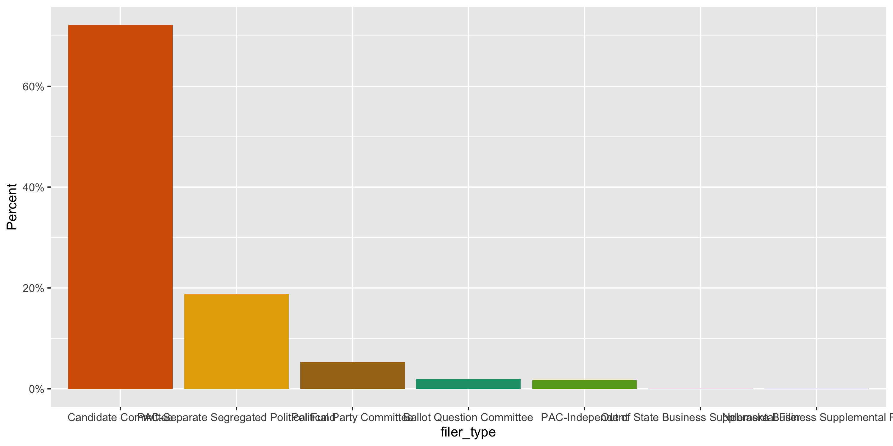
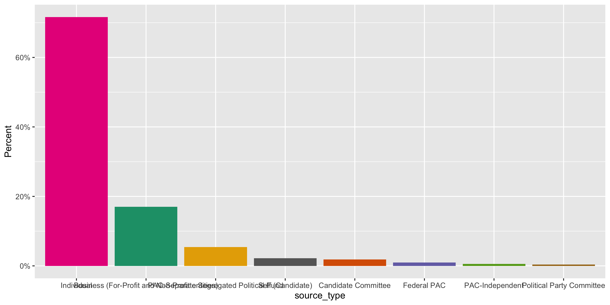
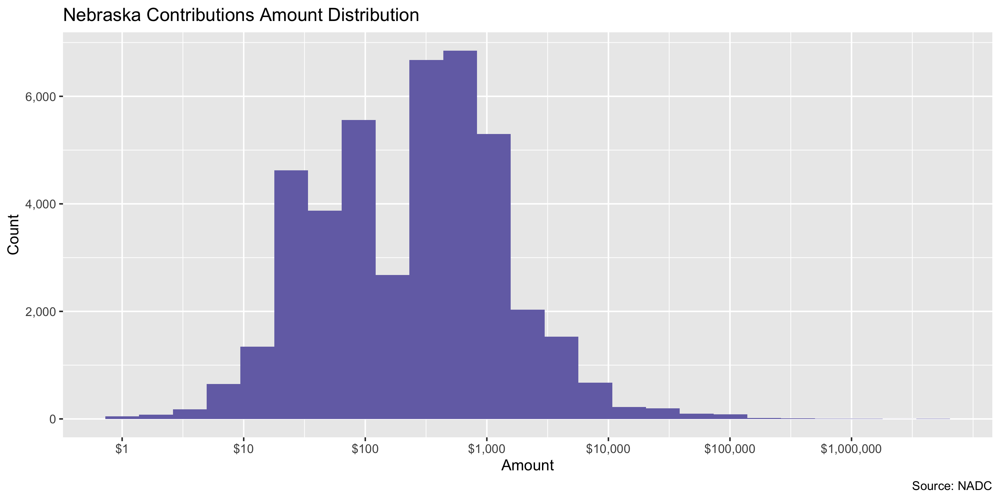
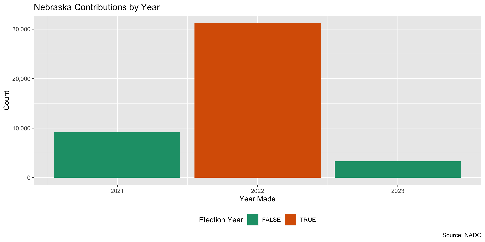
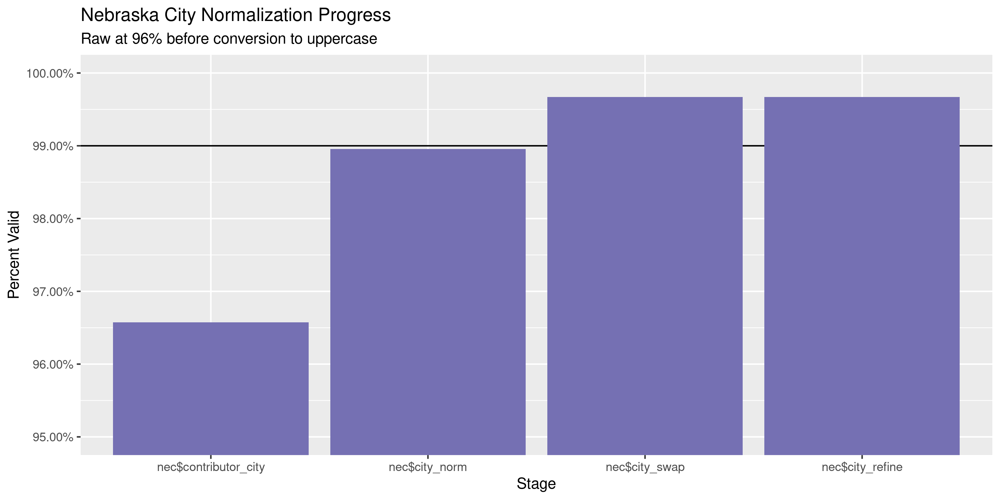
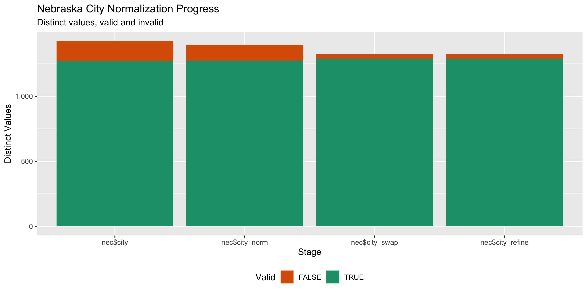

Nebraska Contributions
================
Kiernan Nicholls & Yanqi Xu
Sat Jul 22 13:47:58 2023

- [Project](#project)
- [Objectives](#objectives)
- [Packages](#packages)
- [Data](#data)
- [Download](#download)
  - [Extract](#extract)
- [Read](#read)
  - [Format](#format)
- [Explore](#explore)
  - [Missing](#missing)
  - [Duplicates](#duplicates)
  - [Categorical](#categorical)
  - [Amounts](#amounts)
  - [Dates](#dates)
- [Wrangle](#wrangle)
  - [Address](#address)
  - [ZIP](#zip)
  - [State](#state)
  - [City](#city)
- [Conclude](#conclude)
- [Export](#export)
- [Upload](#upload)

<!-- Place comments regarding knitting here -->

## Project

The Accountability Project is an effort to cut across data silos and
give journalists, policy professionals, activists, and the public at
large a simple way to search across huge volumes of public data about
people and organizations.

Our goal is to standardizing public data on a few key fields by thinking
of each dataset row as a transaction. For each transaction there should
be (at least) 3 variables:

1.  All **parties** to a transaction.
2.  The **date** of the transaction.
3.  The **amount** of money involved.

## Objectives

This document describes the process used to complete the following
objectives:

1.  How many records are in the database?
2.  Check for entirely duplicated records.
3.  Check ranges of continuous variables.
4.  Is there anything blank or missing?
5.  Check for consistency issues.
6.  Create a five-digit ZIP Code called `zip`.
7.  Create a `year` field from the transaction date.
8.  Make sure there is data on both parties to a transaction.

## Packages

The following packages are needed to collect, manipulate, visualize,
analyze, and communicate these results. The `pacman` package will
facilitate their installation and attachment.

``` r
if (!require("pacman")) {
  install.packages("pacman")
}
pacman::p_load(
  tidyverse, # data manipulation
  lubridate, # datetime strings
  textreadr, # read rtf files
  gluedown, # printing markdown
  janitor, # clean data frames
  campfin, # custom irw tools
  aws.s3, # aws cloud storage
  refinr, # cluster & merge
  scales, # format strings
  knitr, # knit documents
  vroom, # fast reading
  rvest, # scrape html
  glue, # code strings
  here, # project paths
  httr, # http requests
  fs # local storage 
)
```

This document should be run as part of the `R_campfin` project, which
lives as a sub-directory of the more general, language-agnostic
[`irworkshop/accountability_datacleaning`](https://github.com/irworkshop/accountability_datacleaning)
GitHub repository.

The `R_campfin` project uses the [RStudio
projects](https://support.rstudio.com/hc/en-us/articles/200526207-Using-Projects)
feature and should be run as such. The project also uses the dynamic
`here::here()` tool for file paths relative to *your* machine.

``` r
# where does this document knit?
here::i_am("state/ne/contribs/docs/ne_contribs_diary.Rmd")
```

## Data

Data is obtained by from the Nebraska Accountability and Disclosure
Commission’s (NADC) [website](https://nadc.nebraska.gov/view-campaign-filings-personal-financial-disclosures-potential-conflicts-lobbying-reports-and-more).
Data prior to 2022 was available in bulk and was processed in a
different workflow. (See `ne_contribs_diary.Rmd`). This update deals
with new data since 2021.

> The page provides comma separated value (CSV) downloads of
> contribution, loan, and expenditure data for each reporting year in a
> zipped file format. These files can be downloaded and imported into
> other applications (Microsoft Excel, Microsoft Access, etc.)

> This data is extracted from the state of Nebraska database as it
> existed as of 7/21/2023 2:26 AM

The [NADC home](http://www.nadc.nebraska.gov/index.html) page explains
the role and resources provided by the Commission.

> This site includes the campaign statements filed with the Commission
> by candidates for state and local offices, political action committees
> or PACs, political parties, and ballot question committees. Campaign
> statements disclose the amount and sources of contributions to the
> committee and the amount purposes of expenditures by the committee.
> The site also includes Reports of Contributions filed with the
> Commission by corporations, unions, limited liability companies,
> limited partnerships, and by industry, trade or professional
> associations. Reports of Contributions disclose contributions and
> expenditures made to support or oppose candidates or ballot questions.
> Forms, instructional materials and a list of committees may be
> accessed through this site. To access the information described in
> this paragraph, click on the tab above marked CAMPAIGN FINANCE.

Navigating to the [campaign finance section of the
website](http://www.nadc.nebraska.gov/cf/index.html), the exact filing
requirements are laid out.

> Candidates for state and local office are subject to the campaign
> finance provisions of the Nebraska Political Accountability and
> Disclosure Act (NPADA). Those seeking election to federal office are
> not subject to the NPADA. Once a candidate raises, receives or expends
> \$5,000 or more in a calendar year, he or she is required to register
> the committee with the Commission by filing a Statement of
> Organization and paying a filing fee of \$100. Once the candidate
> committee is formed, the committee must file periodic campaign
> statements.

specifically, there are **three** kinds of filings that must be made by
general candidates:

1.  Statement of Organization - This document registers the Committee
    > with the Commission. It discloses the name of the committee, the
    > name of the candidate, the office sought and the name of the
    > treasurer.

2.  Campaign Statement - this document provides a summary of the
    > financial activity of the committee. It discloses the name of
    > contributors of more than \$250 and the amounts of the
    > contributions. It discloses expenditures of more than \$250.

3.  Report of Late Contributions - this document discloses contributions
    > of \$1,000 or more received by the committee during 14 days
    > immediately preceding the election. Information reported as late
    > contributions are also reported on subsequent campaign statements.

Aside from general candidates, the NADC also explains that political
committees must also file.

> There are **two** types of committees that are commonly referred to as
> political action committees or PACs. One type of PAC is a political
> committee sponsored by a corporation, union or other type of
> organization. Another type of PAC is a political committee which is
> not sponsored by another group. PACs are required to register with the
> Commission and file periodic campaign statements disclosing receipts
> and expenditures.

1.  State and county political party committees with certain levels of
    > financial activity, register with the Commission and file periodic
    > campaign statements.

2.  A ballot question committee is a political committee formed for the
    > purpose of supporting or opposing the qualification, passage or
    > defeat of a ballot question. The committee must register with the
    > Commission within 10 days after raising, receiving or expending
    > \$5,000 or more in a calendar year. Once registered, ballot
    > questions committees file periodic campaign statements disclosing
    > receipts and expenditures.

Finally, the NADC identifies the source of the data:

> The campaign filings displayed on this website are based upon the
> paper records filed with the Nebraska Accountability and Disclosure
> Commission. While every effort has been made to ensure accurate data
> input, errors may occur. Anyone noting an error is encouraged to
> contact this office.

In any discrepancy between the information displayed on this website and
the official records on file with the Commission, the official records
of the Commission take precedence.

## Download

The NADC provides a bulk download of records on their data each year.

The bulk data is provided as an annual ZIP archive we can download.

``` r
raw_urls <- glue("https://nadc-e.nebraska.gov/PublicSite/Docs/BulkDataDownloads/{2021:2023}_ContributionLoanExtract.csv.zip")
raw_dir <- dir_create(here("state","ne", "contribs", "data", "raw"))
raw_zips <- path(raw_dir, basename(raw_urls))
```

``` r
for (i in seq_along(raw_zips)) {
raw_zip <- raw_zips[i]
  if (!file_exists(raw_zip)) {
    download.file(
      url = raw_urls[i], 
      destfile = raw_zip, 
      method = "curl", 
      extra = "--cipher 'DEFAULT:!DH'"
    )
  }
  
}
```

### Extract

We can extract each of these text files into our data directory.

``` r
raw_all <- map(raw_zips, unzip,
  zipfile = ,
  junkpaths = TRUE,
  exdir = raw_dir
) %>% unlist()
```

``` r
file_info(raw_all) %>% 
  select(path, size, modification_time) %>% 
  mutate(across(path, path.abbrev))
#> # A tibble: 3 × 3
#>   path                                                                                          size modification_time  
#>   <fs::path>                                                                                  <fs::> <dttm>             
#> 1 …de/accountability_datacleaning/state/ne/contribs/data/raw/2021_ContributionLoanExtract.csv 25.09K 2023-07-22 13:48:03
#> 2 …de/accountability_datacleaning/state/ne/contribs/data/raw/2022_ContributionLoanExtract.csv  8.47M 2023-07-22 13:48:03
#> 3 …de/accountability_datacleaning/state/ne/contribs/data/raw/2023_ContributionLoanExtract.csv  1.95M 2023-07-22 13:48:03
```

## Read

``` r
fix_csv <- path_temp(basename(raw_all))
for (i in seq_along(raw_all)) {
  read_lines(raw_all[i]) %>% 
    str_replace_all("\\s\"([A-z\\. ]+)\"[^,|\"]*", " '\\1'") %>% 
    str_replace_all("(?<!^|,)\"(?!,|$)", r"("""")") %>% 
    write_lines(fix_csv[i])
}
```

The fixed text files can be read into a single data frame.

``` r
nec <- read_delim(
  file = fix_csv,
  delim = ",",
  escape_backslash = FALSE, 
  escape_double = TRUE,
  na = c("", " "),
  col_types = cols(
    .default = col_character(),
  )
) %>% clean_names()
```

``` r
problems(nec)
#> # A tibble: 0 × 5
#> # … with 5 variables: row <int>, col <int>, expected <chr>, actual <chr>, file <chr>
```

### Format

Now that each of the files is read as an element of a list, we can
format them for combination and matching against the tables containing
full information on the filing committees.

#### Date

``` r
nec  <- nec %>% mutate(across(.cols = ends_with("date"),
                             .fns = lubridate::mdy))
```

## Explore

There are 43,702 rows of 24 columns. Each record represents a single
contribution from an entity to a committee.

``` r
glimpse(nec)
#> Rows: 43,702
#> Columns: 24
#> $ receipt_id                                      <chr> "712", "713", "718", "714", "715", "716", "717", "720", "721",…
#> $ org_id                                          <chr> "7387", "7387", "7392", "7392", "7392", "7392", "7392", "7392"…
#> $ filer_type                                      <chr> "Ballot Question Committee", "Ballot Question Committee", "Bal…
#> $ filer_name                                      <chr> "CITIZENS FOR VOTER ID", "CITIZENS FOR VOTER ID", "RAISE THE W…
#> $ candidate_name                                  <chr> NA, NA, NA, NA, NA, NA, NA, NA, NA, NA, NA, NA, NA, NA, NA, NA…
#> $ receipt_transaction_contribution_type           <chr> "Monetary", "Monetary", "In-Kind Contribution", "Monetary", "I…
#> $ other_funds_type                                <chr> NA, NA, NA, NA, NA, NA, NA, NA, NA, NA, NA, NA, NA, NA, NA, NA…
#> $ receipt_date                                    <date> 2021-07-13, 2021-07-26, 2021-08-08, 2021-08-17, 2021-08-26, 2…
#> $ receipt_amount                                  <chr> "376000", "1000", "59.16", "5000", "202.95", "665.34", "3585.8…
#> $ description                                     <chr> NA, NA, "STAFF TIME WORKING ON THE CAMPAIGN", NA, "STAFF TIME …
#> $ contributor_or_transaction_source_type          <chr> "Individual", "Individual", "Business (For-Profit and Non-Prof…
#> $ contributor_or_source_name_individual_last_name <chr> "RICKETTS", "DAUB", "Nebraska APPLESEED CENTER FOR LAW IN THE …
#> $ first_name                                      <chr> "MARLENE", "HAROLD", NA, NA, NA, NA, NA, NA, "INDIVIDUALS WHO …
#> $ middle_name                                     <chr> NA, NA, NA, NA, NA, NA, NA, NA, NA, NA, NA, NA, NA, NA, NA, NA…
#> $ suffix                                          <chr> NA, "JR", NA, NA, NA, NA, NA, NA, NA, NA, NA, NA, NA, NA, NA, …
#> $ address_1                                       <chr> "412 NORTH ELMWOOD ROAD", "314 NORTH 97TH CRT", "941 O STREET,…
#> $ address_2                                       <chr> NA, NA, NA, NA, NA, NA, NA, NA, NA, NA, NA, NA, NA, NA, NA, NA…
#> $ city                                            <chr> "OMAHA", "OMAHA", "LINCOLN", "LINCOLN", "LINCOLN", "LINCOLN", …
#> $ state                                           <chr> "NE", "NE", "NE", "NE", "NE", "NE", "NE", "NE", "NE", "NE", "N…
#> $ zip                                             <chr> "68132", "68114", "68508", "68508", "68508", "68508", "68508",…
#> $ filed_date                                      <date> 2021-08-02, 2021-08-02, 2021-09-17, 2021-09-17, 2021-09-17, 2…
#> $ amended                                         <chr> "N", "N", "N", "N", "N", "N", "N", "N", "N", "N", "N", "N", "N…
#> $ employer                                        <chr> NA, NA, NA, NA, NA, NA, NA, NA, NA, NA, NA, NA, NA, NA, NA, NA…
#> $ occupation                                      <chr> NA, NA, NA, NA, NA, NA, NA, NA, NA, NA, NA, NA, NA, NA, NA, NA…
tail(nec)
#> # A tibble: 6 × 24
#>   receipt_id org_id filer_t…¹ filer…² candi…³ recei…⁴ other…⁵ receipt_…⁶ recei…⁷ descr…⁸ contr…⁹ contr…˟ first…˟ middl…˟
#>   <chr>      <chr>  <chr>     <chr>   <chr>   <chr>   <chr>   <date>     <chr>   <chr>   <chr>   <chr>   <chr>   <chr>  
#> 1 49494      8866   Ballot Q… SUPPOR… <NA>    Moneta… <NA>    2023-06-25 7360.95 <NA>    Indivi… FOR TH… INDIVI… <NA>   
#> 2 49496      8866   Ballot Q… SUPPOR… <NA>    In-Kin… <NA>    2023-06-25 9857.27 STAFF … Busine… OPENSK… <NA>    <NA>   
#> 3 49567      8866   Ballot Q… SUPPOR… <NA>    In-Kin… <NA>    2023-06-25 2141.67 PERSON… Busine… STAND … <NA>    <NA>   
#> 4 49570      8866   Ballot Q… SUPPOR… <NA>    In-Kin… <NA>    2023-06-25 43230.… STAFF … Busine… NEBRAS… <NA>    <NA>   
#> 5 49571      8866   Ballot Q… SUPPOR… <NA>    In-Kin… <NA>    2023-06-25 500     OFFICE… Busine… NEBRAS… <NA>    <NA>   
#> 6 49572      8866   Ballot Q… SUPPOR… <NA>    In-Kin… <NA>    2023-06-25 44.41   POSTAGE Busine… NEBRAS… <NA>    <NA>   
#> # … with 10 more variables: suffix <chr>, address_1 <chr>, address_2 <chr>, city <chr>, state <chr>, zip <chr>,
#> #   filed_date <date>, amended <chr>, employer <chr>, occupation <chr>, and abbreviated variable names ¹​filer_type,
#> #   ²​filer_name, ³​candidate_name, ⁴​receipt_transaction_contribution_type, ⁵​other_funds_type, ⁶​receipt_date,
#> #   ⁷​receipt_amount, ⁸​description, ⁹​contributor_or_transaction_source_type,
#> #   ˟​contributor_or_source_name_individual_last_name, ˟​first_name, ˟​middle_name
```

``` r
nec <- nec %>% rename(contributor_name = contributor_or_source_name_individual_last_name,
                      source_type = contributor_or_transaction_source_type)
```

### Missing

Columns vary in their degree of missing values.

``` r
col_stats(nec, count_na)
#> # A tibble: 24 × 4
#>    col                                   class      n      p
#>    <chr>                                 <chr>  <int>  <dbl>
#>  1 receipt_id                            <chr>      0 0     
#>  2 org_id                                <chr>      0 0     
#>  3 filer_type                            <chr>      0 0     
#>  4 filer_name                            <chr>      0 0     
#>  5 candidate_name                        <chr>  12170 0.278 
#>  6 receipt_transaction_contribution_type <chr>      0 0     
#>  7 other_funds_type                      <chr>  42932 0.982 
#>  8 receipt_date                          <date>     0 0     
#>  9 receipt_amount                        <chr>      0 0     
#> 10 description                           <chr>  39997 0.915 
#> 11 source_type                           <chr>    773 0.0177
#> 12 contributor_name                      <chr>    775 0.0177
#> 13 first_name                            <chr>  12017 0.275 
#> 14 middle_name                           <chr>  41414 0.948 
#> 15 suffix                                <chr>  43550 0.997 
#> 16 address_1                             <chr>    775 0.0177
#> 17 address_2                             <chr>  40956 0.937 
#> 18 city                                  <chr>    775 0.0177
#> 19 state                                 <chr>    775 0.0177
#> 20 zip                                   <chr>    775 0.0177
#> 21 filed_date                            <date>     0 0     
#> 22 amended                               <chr>      0 0     
#> 23 employer                              <chr>  42122 0.964 
#> 24 occupation                            <chr>  41146 0.942
```

We can flag any record missing a key variable needed to identify a
transaction.

``` r
key_vars <- c("receipt_date", "filer_name", 
              "receipt_amount", "contributor_name")
nec <- flag_na(nec, all_of(key_vars))
mean(nec$na_flag)
#> [1] 0.01773374
sum(nec$na_flag)
#> [1] 775
```

``` r
nec %>% 
  filter(na_flag) %>% 
  select(all_of(key_vars))
#> # A tibble: 775 × 4
#>    receipt_date filer_name                                                receipt_amount contributor_name
#>    <date>       <chr>                                                     <chr>          <chr>           
#>  1 2021-01-01   NEBRASKA COOPERATIVE COUNCIL - POLITICAL ACTION COMMITTEE 3.92           <NA>            
#>  2 2021-01-01   STINNER FOR LEGISLATURE                                   0.84           <NA>            
#>  3 2021-01-01   FRIENDS OF CHRIS JERRAM                                   1000           <NA>            
#>  4 2021-01-01   CAVANAUGH FOR NEBRASKA                                    80             <NA>            
#>  5 2021-01-07   KINDIG FOR MAYOR                                          0.13           <NA>            
#>  6 2021-01-22   LA GRONE FOR LEGISLATURE                                  2571.25        <NA>            
#>  7 2021-01-31   NEBRASKA COOPERATIVE COUNCIL - POLITICAL ACTION COMMITTEE 4.05           <NA>            
#>  8 2021-01-31   IOWA-NEBRASKA EQUIPMENT DEALERS PAC                       0.33           <NA>            
#>  9 2021-01-31   FRIENDS OF ERIC WILLIAMS                                  2.71           <NA>            
#> 10 2021-02-26   IOWA-NEBRASKA EQUIPMENT DEALERS PAC                       0.28           <NA>            
#> # … with 765 more rows
```

``` r
nec %>% 
  summarise(
    n = n(),
    no_key_comm = mean(is.na(filer_name)),
    no_key_name = mean(is.na(contributor_name)),
    no_key_amt = mean(is.na(receipt_amount))
  ) %>% 
  arrange(desc(n))
#> # A tibble: 1 × 4
#>       n no_key_comm no_key_name no_key_amt
#>   <int>       <dbl>       <dbl>      <dbl>
#> 1 43702           0      0.0177          0
```

### Duplicates

We can also flag any record completely duplicated across every column.

``` r
nec <- flag_dupes(nec, everything())
sum(nec$dupe_flag)
#> [1] 0
mean(nec$dupe_flag)
#> [1] NA
```

``` r
nec %>% 
  group_by(source_type) %>% 
  arrange(receipt_date)
#> # A tibble: 43,702 × 25
#>    receipt_id org_id filer_…¹ filer…² candi…³ recei…⁴ other…⁵ receipt_…⁶ recei…⁷ descr…⁸ sourc…⁹ contr…˟ first…˟ middl…˟
#>    <chr>      <chr>  <chr>    <chr>   <chr>   <chr>   <chr>   <date>     <chr>   <chr>   <chr>   <chr>   <chr>   <chr>  
#>  1 8734       7559   Candida… COMMIT… JOHN E… Loan    <NA>    2006-02-08 5170    <NA>    Self (… EWING   JOHN    <NA>   
#>  2 19248      7478   Candida… NEBRAS… DAVID … Loan    <NA>    2007-03-30 74800   <NA>    Indivi… HAHN    DAVID   <NA>   
#>  3 42652      7403   Candida… DAVID … DAVID … Loan    <NA>    2007-03-30 74800   <NA>    Self (… HAHN    DAVID   <NA>   
#>  4 3041       7696   Candida… JIM RI… JIM RI… Loan    <NA>    2008-11-07 13657.… <NA>    Self (… RIHA    JIM     <NA>   
#>  5 19270      7657   Candida… PEOPLE… PAUL S… Loan    <NA>    2010-03-08 2500    <NA>    Self (… SCHUMA… PAUL    <NA>   
#>  6 9191       7694   Candida… PETE R… PETE R… Loan    <NA>    2014-04-04 930000  <NA>    Self (… RICKET… PETE    <NA>   
#>  7 4407       7689   Candida… NEBRAS… PETE P… Loan    <NA>    2014-05-12 20000   <NA>    Self (… PIRSCH  PETE    <NA>   
#>  8 19331      7657   Candida… PEOPLE… PAUL S… Loan    <NA>    2014-09-29 2500    <NA>    Self (… SCHUMA… PAUL    <NA>   
#>  9 9313       7425   Candida… FRIEND… MICHAE… Loan    <NA>    2015-01-01 7500    <NA>    Self (… HILGERS MICHAEL <NA>   
#> 10 6209       7380   Candida… STEVE … STEVE … Loan    <NA>    2016-01-01 4600    <NA>    Self (… ERDMAN  STEVE   <NA>   
#> # … with 43,692 more rows, 11 more variables: suffix <chr>, address_1 <chr>, address_2 <chr>, city <chr>, state <chr>,
#> #   zip <chr>, filed_date <date>, amended <chr>, employer <chr>, occupation <chr>, na_flag <lgl>, and abbreviated
#> #   variable names ¹​filer_type, ²​filer_name, ³​candidate_name, ⁴​receipt_transaction_contribution_type,
#> #   ⁵​other_funds_type, ⁶​receipt_date, ⁷​receipt_amount, ⁸​description, ⁹​source_type, ˟​contributor_name, ˟​first_name,
#> #   ˟​middle_name
```

### Categorical

``` r
col_stats(nec, n_distinct)
#> # A tibble: 25 × 4
#>    col                                   class      n         p
#>    <chr>                                 <chr>  <int>     <dbl>
#>  1 receipt_id                            <chr>  43594 0.998    
#>  2 org_id                                <chr>    543 0.0124   
#>  3 filer_type                            <chr>      7 0.000160 
#>  4 filer_name                            <chr>    555 0.0127   
#>  5 candidate_name                        <chr>    384 0.00879  
#>  6 receipt_transaction_contribution_type <chr>      9 0.000206 
#>  7 other_funds_type                      <chr>      8 0.000183 
#>  8 receipt_date                          <date>   964 0.0221   
#>  9 receipt_amount                        <chr>   4262 0.0975   
#> 10 description                           <chr>   1284 0.0294   
#> 11 source_type                           <chr>     10 0.000229 
#> 12 contributor_name                      <chr>   8899 0.204    
#> 13 first_name                            <chr>   2375 0.0543   
#> 14 middle_name                           <chr>    111 0.00254  
#> 15 suffix                                <chr>      6 0.000137 
#> 16 address_1                             <chr>  13217 0.302    
#> 17 address_2                             <chr>    527 0.0121   
#> 18 city                                  <chr>   1426 0.0326   
#> 19 state                                 <chr>     53 0.00121  
#> 20 zip                                   <chr>   2042 0.0467   
#> 21 filed_date                            <date>   362 0.00828  
#> 22 amended                               <chr>      2 0.0000458
#> 23 employer                              <chr>    301 0.00689  
#> 24 occupation                            <chr>    228 0.00522  
#> 25 na_flag                               <lgl>      2 0.0000458
```

<!-- --><!-- -->

### Amounts

``` r
nec$receipt_amount <- round(as.numeric(nec$receipt_amount), 2)
```

``` r
summary(nec$receipt_amount)
#>    Min. 1st Qu.  Median    Mean 3rd Qu.    Max. 
#>  -95508      50     250    1864     600 4700000
mean(nec$receipt_amount <= 0, na.rm = TRUE)
#> [1] 0.01803121
```

These are the records with the minimum and maximum amounts.

``` r
glimpse(nec[c(which.max(nec$receipt_amount), which.min(nec$receipt_amount)), ])
#> Rows: 2
#> Columns: 25
#> $ receipt_id                            <chr> "9037", "36113"
#> $ org_id                                <chr> "7417", "7680"
#> $ filer_type                            <chr> "Candidate Committee", "Candidate Committee"
#> $ filer_name                            <chr> "HERBSTER FOR NEBRASKA", "ADAM MORFELD FOR COUNTY ATTORNEY"
#> $ candidate_name                        <chr> "CHARLES HERBSTER", "ADAM MORFELD"
#> $ receipt_transaction_contribution_type <chr> "Monetary", "Monetary"
#> $ other_funds_type                      <chr> NA, NA
#> $ receipt_date                          <date> 2021-12-27, 2022-10-04
#> $ receipt_amount                        <dbl> 4700000.00, -95507.61
#> $ description                           <chr> NA, "Offset due to update of filed item"
#> $ source_type                           <chr> "Self (Candidate)", "Individual"
#> $ contributor_name                      <chr> "HERBSTER", "FOR THE CALENDAR YEAR < 250.01"
#> $ first_name                            <chr> "CHARLES", "INDIVIDUALS WHO HAVE CONTRIBUTED DURING THE REPORTING PERIOD…
#> $ middle_name                           <chr> NA, NA
#> $ suffix                                <chr> NA, NA
#> $ address_1                             <chr> "65088 707TH TRAIL ROAD", "."
#> $ address_2                             <chr> NA, NA
#> $ city                                  <chr> "FALLS CITY", "."
#> $ state                                 <chr> "NE", "NE"
#> $ zip                                   <chr> "68355", "00000"
#> $ filed_date                            <date> 2022-01-31, 2022-10-30
#> $ amended                               <chr> "N", "N"
#> $ employer                              <chr> NA, NA
#> $ occupation                            <chr> NA, NA
#> $ na_flag                               <lgl> FALSE, FALSE
```

<!-- -->

### Dates

We can add the calendar year from `date` with `lubridate::year()`

``` r
nec <- mutate(nec, year = year(receipt_date))
```

``` r
min(nec$receipt_date)
#> [1] "2006-02-08"
sum(nec$year < 1984)
#> [1] 0
max(nec$receipt_date)
#> [1] "2023-06-25"
sum(nec$receipt_date > today())
#> [1] 0
```

<!-- -->

## Wrangle

To improve the searchability of the database, we will perform some
consistent, confident string normalization. For geographic variables
like city names and ZIP codes, the corresponding `campfin::normal_*()`
functions are tailor made to facilitate this process.

### Address

For the street `addresss` variable, the `campfin::normal_address()`
function will force consistence case, remove punctuation, and abbreviate
official USPS suffixes.

``` r
   nec <- nec %>% 
   unite(
    col = addr_full,
    starts_with("address"),
    sep = " ",
    remove = FALSE,
    na.rm = TRUE
  ) %>% 
  mutate(
    address_norm = normal_address(
      address = addr_full,
      abbs = usps_street,
      na_rep = TRUE
    )
  ) %>% 
  select(-addr_full)
```

``` r
sample_n(nec, 10) %>% glimpse()
#> Rows: 10
#> Columns: 27
#> $ receipt_id                            <chr> "18107", "9669", "31001", "40046", "10344", "29285", "28215", "986", "50…
#> $ org_id                                <chr> "7688", "7486", "7480", "7579", "7432", "7680", "7507", "7662", "7680", …
#> $ filer_type                            <chr> "Candidate Committee", "Candidate Committee", "Candidate Committee", "Ca…
#> $ filer_name                            <chr> "JIM PILLEN FOR GOVERNOR", "FRIENDS OF RICH PAHLS", "NEARY FOR STATE BOA…
#> $ candidate_name                        <chr> "JIM PILLEN", "RICHARD PAHLS", "DEBORAH NEARY", "CAROL BLOOD", "SHERRY J…
#> $ receipt_transaction_contribution_type <chr> "Monetary", "Monetary", "Monetary", "Monetary", "Monetary", "Monetary", …
#> $ other_funds_type                      <chr> NA, NA, NA, NA, NA, NA, NA, NA, NA, NA
#> $ receipt_date                          <date> 2022-04-25, 2021-11-29, 2022-10-04, 2022-08-02, 2022-03-10, 2022-03-26, …
#> $ receipt_amount                        <dbl> 500, 1000, 100, 50, 20, 25, 25, 300, 250, 100
#> $ description                           <chr> NA, NA, NA, NA, NA, NA, NA, NA, NA, NA
#> $ source_type                           <chr> "Individual", "Business (For-Profit and Non-Profit entities)", "Individ…
#> $ contributor_name                      <chr> "CHRISTENSEN", "ALTRIA CLIENT SERVICES LLC & ITS AFFILIATES", "SLUPE", "…
#> $ first_name                            <chr> "DEAN", NA, "JILL", "MARY", "DOREEN", "RICHARD", "TRACY", "CDR", "TIM", …
#> $ middle_name                           <chr> NA, NA, NA, NA, NA, NA, NA, NA, NA, NA
#> $ suffix                                <chr> NA, NA, NA, NA, NA, NA, NA, NA, NA, NA
#> $ address_1                             <chr> "2950 HWY 14", "33 EAST MAIN STREET, SUITE 420", "9 CARTER LAKE CLUB", "…
#> $ address_2                             <chr> NA, NA, NA, NA, NA, NA, NA, NA, NA, NA
#> $ city                                  <chr> "FULLERTON", "MADISON", "CARTER LAKE", "BELLEVUE", "GRAND ISLAND", "LINC…
#> $ state                                 <chr> "NE", "WI", "IA", "NE", "NE", "NE", "NE", "NE", "NE", "NE"
#> $ zip                                   <chr> "68638", "53703", "51510", "68147", "68803", "68516", "68105", "68134", …
#> $ filed_date                            <date> 2022-05-02, 2022-01-31, 2022-10-11, 2023-01-16, 2022-04-07, 2022-10-11, …
#> $ amended                               <chr> "N", "N", "N", "N", "N", "N", "N", "N", "N", "N"
#> $ employer                              <chr> NA, NA, NA, NA, NA, NA, NA, NA, NA, NA
#> $ occupation                            <chr> NA, NA, NA, NA, NA, NA, NA, NA, NA, NA
#> $ na_flag                               <lgl> FALSE, FALSE, FALSE, FALSE, FALSE, FALSE, FALSE, FALSE, FALSE, FALSE
#> $ year                                  <dbl> 2022, 2021, 2022, 2022, 2022, 2022, 2022, 2021, 2021, 2022
#> $ address_norm                          <chr> "2950 HWY 14", "33 EAST MAIN STREET SUITE 420", "9 CARTER LAKE CLB", "28…
```

### ZIP

For ZIP codes, the `campfin::normal_zip()` function will attempt to
create valid *five* digit codes by removing the ZIP+4 suffix and
returning leading zeroes dropped by other programs like Microsoft Excel.

``` r
nec <- nec %>% 
  mutate(
    zip_norm = normal_zip(
      zip = zip,
      na_rep = TRUE
    )
  )
```

``` r
progress_table(
  nec$zip,
  nec$zip_norm,
  compare = valid_zip
)
#> # A tibble: 2 × 6
#>   stage        prop_in n_distinct prop_na n_out n_diff
#>   <chr>          <dbl>      <dbl>   <dbl> <dbl>  <dbl>
#> 1 nec$zip        0.923       2042  0.0177  3301     60
#> 2 nec$zip_norm   0.996       2023  0.0850   161     40
```

### State

The existing `state` column needs not be cleaned.

``` r
prop_in(nec$state, valid_state)
#> [1] 1
what_out(nec$state, valid_state)
#> character(0)
```

### City

Cities are the most difficult geographic variable to normalize, simply
due to the wide variety of valid cities and formats.

#### Normal

The `campfin::normal_city()` function is a good start, again converting
case, removing punctuation, but *expanding* USPS abbreviations. We can
also remove `invalid_city` values.

``` r
norm_city <- nec %>% 
  distinct(city, state, zip_norm) %>% 
  mutate(
    city_norm = normal_city(
      city = city, 
      abbs = usps_city,
      states = c("NE", "DC", "NEBRASKA"),
      na = invalid_city,
      na_rep = TRUE
    )
  )
```

#### Swap

We can further improve normalization by comparing our normalized value
against the *expected* value for that record’s state abbreviation and
ZIP code. If the normalized value is either an abbreviation for or very
similar to the expected value, we can confidently swap those two.

``` r
norm_city <- norm_city %>% 
  rename(city_raw = city) %>% 
  left_join(
    y = zipcodes,
    by = c(
      "state" = "state",
      "zip_norm" = "zip"
    )
  ) %>% 
  rename(city_match = city) %>% 
  mutate(
    match_abb = is_abbrev(city_norm, city_match),
    match_dist = str_dist(city_norm, city_match),
    city_swap = if_else(
      condition = !is.na(match_dist) & (match_abb | match_dist == 1),
      true = city_match,
      false = city_norm
    )
  ) %>% 
  select(
    -city_match,
    -match_dist,
    -match_abb
  )
```

``` r
nec <- left_join(
  x = nec,
  y = norm_city,
  by = c(
    "city" = "city_raw", 
    "state", 
    "zip_norm"
  )
)
```

#### Refine

The [OpenRefine](https://openrefine.org/) algorithms can be used to
group similar strings and replace the less common versions with their
most common counterpart. This can greatly reduce inconsistency, but with
low confidence; we will only keep any refined strings that have a valid
city/state/zip combination.

``` r
good_refine <- nec %>% 
  mutate(
    city_refine = city_swap %>% 
      key_collision_merge() %>% 
      n_gram_merge(numgram = 1)
  ) %>% 
  filter(city_refine != city_swap) %>% 
  inner_join(
    y = zipcodes,
    by = c(
      "city_refine" = "city",
      "state" = "state",
      "zip_norm" = "zip"
    )
  )
```

    #> # A tibble: 0 × 5
    #> # … with 5 variables: state <chr>, zip_norm <chr>, city_swap <chr>, city_refine <chr>, n <int>

Then we can join the refined values back to the database.

``` r
nec <- nec %>% 
  left_join(good_refine, by = names(.)) %>% 
  mutate(city_refine = coalesce(city_refine, city_swap))
```

#### Progress

Our goal for normalization was to increase the proportion of city values
known to be valid and reduce the total distinct values by correcting
misspellings.

| stage             | prop_in | n_distinct | prop_na | n_out | n_diff |
|:------------------|--------:|-----------:|--------:|------:|-------:|
| `nec$city`        |   0.916 |       1426 |   0.018 |  3600 |    155 |
| `nec$city_norm`   |   0.987 |       1396 |   0.087 |   526 |    121 |
| `nec$city_swap`   |   0.998 |       1324 |   0.087 |    96 |     35 |
| `nec$city_refine` |   0.998 |       1324 |   0.087 |    96 |     35 |

You can see how the percentage of valid values increased with each
stage.

<!-- -->

More importantly, the number of distinct values decreased each stage. We
were able to confidently change many distinct invalid values to their
valid equivalent.

<!-- -->

Before exporting, we can remove the intermediary normalization columns
and rename all added variables with the `_clean` suffix.

``` r
nec <- nec %>% 
  select(
    -city_norm,
    -city_swap,
    city_clean = city_refine
  ) %>% 
  rename_all(~str_replace(., "_norm", "_clean")) %>% 
  rename_all(~str_remove(., "_raw")) %>% 
  relocate(address_clean, city_clean, .before = zip_clean)
```

## Conclude

``` r
glimpse(sample_n(nec, 1000))
#> Rows: 1,000
#> Columns: 29
#> $ receipt_id                            <chr> "42288", "25121", "34153", "35168", "40041", "2880", "45964", "42716", "…
#> $ org_id                                <chr> "7369", "7507", "7503", "8325", "7851", "7610", "8811", "7699", "7742", …
#> $ filer_type                            <chr> "Candidate Committee", "Candidate Committee", "Candidate Committee", "Ca…
#> $ filer_name                            <chr> "FRIENDS OF CHRISTY ARMENDARIZ", "PANTOS FOR COUNTY ATTORNEY", "DON KLEI…
#> $ candidate_name                        <chr> "CHRISTY ARMENDARIZ", "DAVID PANTOS", "DONALD KLEINE", "KATHLEEN KAUTH",…
#> $ receipt_transaction_contribution_type <chr> "In-Kind Contribution", "Monetary", "Monetary", "Monetary", "Monetary", …
#> $ other_funds_type                      <chr> NA, NA, NA, NA, NA, NA, NA, NA, NA, NA, NA, NA, NA, NA, NA, NA, "Interes…
#> $ receipt_date                          <date> 2022-12-01, 2022-08-09, 2022-03-31, 2022-10-24, 2022-03-31, 2021-09-22,…
#> $ receipt_amount                        <dbl> 1252.81, 25.00, 300.00, 100.00, 112.51, 250.00, 1000.00, 250.00, 300.00,…
#> $ description                           <chr> "DESIGN FOR FLYERS", NA, NA, NA, NA, NA, NA, NA, NA, NA, NA, NA, NA, NA,…
#> $ source_type                           <chr> "Political Party Committee", "Individual", "Individual", "Individual", "…
#> $ contributor_name                      <chr> "NEBRASKA REPUBLICAN PARTY", "ADAMS", "SLADEK", "FOR THE CALENDAR YEAR <…
#> $ first_name                            <chr> NA, "BRITTAINY", "MARCUS", "INDIVIDUALS WHO HAVE CONTRIBUTED DURING THE …
#> $ middle_name                           <chr> NA, NA, NA, NA, NA, NA, NA, NA, "L.", NA, NA, NA, NA, NA, NA, NA, NA, NA…
#> $ suffix                                <chr> NA, NA, NA, NA, NA, NA, NA, NA, NA, NA, NA, NA, NA, NA, NA, NA, NA, NA, …
#> $ address_1                             <chr> "1610 N STREET", "7507 N 124TH ST", "9202 WEST DODGE ROAD STE 3", ".", "…
#> $ address_2                             <chr> NA, NA, NA, NA, NA, NA, NA, "SUITE B", NA, NA, NA, NA, NA, NA, NA, "APT.…
#> $ city                                  <chr> "LINCOLN", "OMAHA", "OMAHA", ".", "ELKHORN", "WAHOO", "LINCOLN", "LINCOL…
#> $ state                                 <chr> "NE", "NE", "NE", "NE", "NE", "NE", "NE", "NE", "NE", "NE", "NE", "NE", …
#> $ zip                                   <chr> "68508", "68142", "68114", "00000", "68022", "68066", "68510", "68508", …
#> $ filed_date                            <date> 2023-01-16, 2022-10-11, 2022-10-11, 2022-10-30, 2023-01-16, 2022-01-21,…
#> $ amended                               <chr> "N", "N", "N", "N", "N", "N", "N", "N", "N", "N", "N", "N", "N", "N", "N…
#> $ employer                              <chr> NA, NA, NA, NA, "BCBS OF NE", NA, NA, NA, NA, NA, NA, NA, NA, NA, NA, NA…
#> $ occupation                            <chr> NA, NA, NA, NA, "GENERAL COUNSEL", NA, NA, NA, "ATTORNEY", NA, NA, NA, N…
#> $ na_flag                               <lgl> FALSE, FALSE, FALSE, FALSE, FALSE, FALSE, FALSE, FALSE, FALSE, FALSE, FA…
#> $ year                                  <dbl> 2022, 2022, 2022, 2022, 2022, 2021, 2023, 2022, 2022, 2022, 2021, 2022, …
#> $ address_clean                         <chr> "1610 N ST", "7507 N 124TH ST", "9202 WEST DODGE ROAD STE 3", NA, "18676…
#> $ city_clean                            <chr> "LINCOLN", "OMAHA", "OMAHA", NA, "ELKHORN", "WAHOO", "LINCOLN", "LINCOLN…
#> $ zip_clean                             <chr> "68508", "68142", "68114", NA, "68022", "68066", "68510", "68508", "6810…
```

1.  There are 43,702 records in the database.
2.  There are 0 duplicate records in the database.
3.  The range and distribution of `amount` and `date` seem reasonable.
4.  There are 775 records missing key variables.
5.  Consistency in geographic data has been improved with
    `campfin::normal_*()`.
6.  The 4-digit `year` variable has been created with
    `lubridate::year()`.

## Export

Now the file can be saved on disk for upload to the Accountability
server. We will name the object using a date range of the records
included.

``` r
clean_dir <- dir_create(here("state","ne", "contribs", "data", "clean"))
clean_csv <- path(clean_dir, glue("ne_contribs_2021-20230721.csv"))
basename(clean_csv)
#> [1] "ne_contribs_2021-20230721.csv"
```

``` r
write_csv(nec, clean_csv, na = "")
(clean_size <- file_size(clean_csv))
#> 10.1M
```

## Upload

We can use the `aws.s3::put_object()` to upload the text file to the IRW
server.

``` r
aws_key <- path("csv", basename(clean_csv))
if (!object_exists(aws_key, "publicaccountability")) {
  put_object(
    file = clean_csv,
    object = aws_key, 
    bucket = "publicaccountability",
    acl = "public-read",
    show_progress = TRUE,
    multipart = TRUE
  )
}
#>   |                                                                                                                      |                                                                                                              |   0%  |                                                                                                                      |=                                                                                                             |   1%  |                                                                                                                      |==                                                                                                            |   2%  |                                                                                                                      |===                                                                                                           |   3%  |                                                                                                                      |====                                                                                                          |   3%  |                                                                                                                      |====                                                                                                          |   4%  |                                                                                                                      |=====                                                                                                         |   5%  |                                                                                                                      |======                                                                                                        |   5%  |                                                                                                                      |======                                                                                                        |   6%  |                                                                                                                      |=======                                                                                                       |   7%  |                                                                                                                      |========                                                                                                      |   7%  |                                                                                                                      |=========                                                                                                     |   8%  |                                                                                                                      |=========                                                                                                     |   9%  |                                                                                                                      |==========                                                                                                    |   9%  |                                                                                                                      |===========                                                                                                   |  10%  |                                                                                                                      |============                                                                                                  |  10%  |                                                                                                                      |============                                                                                                  |  11%  |                                                                                                                      |=============                                                                                                 |  12%  |                                                                                                                      |==============                                                                                                |  12%  |                                                                                                                      |==============                                                                                                |  13%  |                                                                                                                      |===============                                                                                               |  14%  |                                                                                                                      |================                                                                                              |  14%  |                                                                                                                      |=================                                                                                             |  15%  |                                                                                                                      |=================                                                                                             |  16%  |                                                                                                                      |==================                                                                                            |  16%  |                                                                                                                      |===================                                                                                           |  17%  |                                                                                                                      |===================                                                                                           |  18%  |                                                                                                                      |====================                                                                                          |  18%  |                                                                                                                      |=====================                                                                                         |  19%  |                                                                                                                      |======================                                                                                        |  20%  |                                                                                                                      |=======================                                                                                       |  21%  |                                                                                                                      |========================                                                                                      |  22%  |                                                                                                                      |=========================                                                                                     |  22%  |                                                                                                                      |=========================                                                                                     |  23%  |                                                                                                                      |==========================                                                                                    |  24%  |                                                                                                                      |===========================                                                                                   |  24%  |                                                                                                                      |===========================                                                                                   |  25%  |                                                                                                                      |============================                                                                                  |  26%  |                                                                                                                      |=============================                                                                                 |  26%  |                                                                                                                      |==============================                                                                                |  27%  |                                                                                                                      |==============================                                                                                |  28%  |                                                                                                                      |===============================                                                                               |  28%  |                                                                                                                      |================================                                                                              |  29%  |                                                                                                                      |=================================                                                                             |  30%  |                                                                                                                      |==================================                                                                            |  31%  |                                                                                                                      |===================================                                                                           |  31%  |                                                                                                                      |===================================                                                                           |  32%  |                                                                                                                      |====================================                                                                          |  33%  |                                                                                                                      |=====================================                                                                         |  33%  |                                                                                                                      |=====================================                                                                         |  34%  |                                                                                                                      |======================================                                                                        |  35%  |                                                                                                                      |=======================================                                                                       |  35%  |                                                                                                                      |========================================                                                                      |  36%  |                                                                                                                      |========================================                                                                      |  37%  |                                                                                                                      |=========================================                                                                     |  37%  |                                                                                                                      |==========================================                                                                    |  38%  |                                                                                                                      |===========================================                                                                   |  39%  |                                                                                                                      |============================================                                                                  |  40%  |                                                                                                                      |=============================================                                                                 |  41%  |                                                                                                                      |==============================================                                                                |  42%  |                                                                                                                      |===============================================                                                               |  43%  |                                                                                                                      |================================================                                                              |  43%  |                                                                                                                      |================================================                                                              |  44%  |                                                                                                                      |=================================================                                                             |  45%  |                                                                                                                      |==================================================                                                            |  45%  |                                                                                                                      |==================================================                                                            |  46%  |                                                                                                                      |===================================================                                                           |  47%  |                                                                                                                      |====================================================                                                          |  47%  |                                                                                                                      |=====================================================                                                         |  48%  |                                                                                                                      |======================================================                                                        |  49%  |                                                                                                                      |=======================================================                                                       |  50%  |                                                                                                                      |========================================================                                                      |  50%  |                                                                                                                      |========================================================                                                      |  51%  |                                                                                                                      |=========================================================                                                     |  52%  |                                                                                                                      |==========================================================                                                    |  52%  |                                                                                                                      |==========================================================                                                    |  53%  |                                                                                                                      |===========================================================                                                   |  54%  |                                                                                                                      |============================================================                                                  |  54%  |                                                                                                                      |=============================================================                                                 |  55%  |                                                                                                                      |=============================================================                                                 |  56%  |                                                                                                                      |==============================================================                                                |  56%  |                                                                                                                      |===============================================================                                               |  57%  |                                                                                                                      |===============================================================                                               |  58%  |                                                                                                                      |================================================================                                              |  58%  |                                                                                                                      |=================================================================                                             |  59%  |                                                                                                                      |==================================================================                                            |  60%  |                                                                                                                      |===================================================================                                           |  61%  |                                                                                                                      |====================================================================                                          |  62%  |                                                                                                                      |=====================================================================                                         |  63%  |                                                                                                                      |======================================================================                                        |  64%  |                                                                                                                      |=======================================================================                                       |  64%  |                                                                                                                      |=======================================================================                                       |  65%  |                                                                                                                      |========================================================================                                      |  66%  |                                                                                                                      |=========================================================================                                     |  66%  |                                                                                                                      |==========================================================================                                    |  67%  |                                                                                                                      |==========================================================================                                    |  68%  |                                                                                                                      |===========================================================================                                   |  68%  |                                                                                                                      |============================================================================                                  |  69%  |                                                                                                                      |=============================================================================                                 |  70%  |                                                                                                                      |==============================================================================                                |  71%  |                                                                                                                      |===============================================================================                               |  71%  |                                                                                                                      |===============================================================================                               |  72%  |                                                                                                                      |================================================================================                              |  73%  |                                                                                                                      |=================================================================================                             |  73%  |                                                                                                                      |=================================================================================                             |  74%  |                                                                                                                      |==================================================================================                            |  75%  |                                                                                                                      |===================================================================================                           |  75%  |                                                                                                                      |====================================================================================                          |  76%  |                                                                                                                      |====================================================================================                          |  77%  |                                                                                                                      |=====================================================================================                         |  77%  |                                                                                                                      |======================================================================================                        |  78%  |                                                                                                                      |=======================================================================================                       |  79%  |                                                                                                                      |========================================================================================                      |  80%  |                                                                                                                      |=========================================================================================                     |  81%  |                                                                                                                      |==========================================================================================                    |  82%  |                                                                                                                      |===========================================================================================                   |  83%  |                                                                                                                      |============================================================================================                  |  83%  |                                                                                                                      |============================================================================================                  |  84%  |                                                                                                                      |=============================================================================================                 |  85%  |                                                                                                                      |==============================================================================================                |  85%  |                                                                                                                      |==============================================================================================                |  86%  |                                                                                                                      |===============================================================================================               |  87%  |                                                                                                                      |================================================================================================              |  87%  |                                                                                                                      |=================================================================================================             |  88%  |                                                                                                                      |==================================================================================================            |  89%  |                                                                                                                      |===================================================================================================           |  90%  |                                                                                                                      |====================================================================================================          |  91%  |                                                                                                                      |=====================================================================================================         |  92%  |                                                                                                                      |======================================================================================================        |  92%  |                                                                                                                      |======================================================================================================        |  93%  |                                                                                                                      |=======================================================================================================       |  94%  |                                                                                                                      |========================================================================================================      |  94%  |                                                                                                                      |=========================================================================================================     |  95%  |                                                                                                                      |=========================================================================================================     |  96%  |                                                                                                                      |==========================================================================================================    |  96%  |                                                                                                                      |===========================================================================================================   |  97%  |                                                                                                                      |===========================================================================================================   |  98%  |                                                                                                                      |============================================================================================================  |  98%  |                                                                                                                      |============================================================================================================= |  99%  |                                                                                                                      |==============================================================================================================| 100%
#>   |                                                                                                                      |                                                                                                              |   0%  |                                                                                                                      |============                                                                                                  |  11%  |                                                                                                                      |========================                                                                                      |  21%  |                                                                                                                      |===================================                                                                           |  32%  |                                                                                                                      |===============================================                                                               |  43%  |                                                                                                                      |===========================================================                                                   |  54%  |                                                                                                                      |=======================================================================                                       |  64%  |                                                                                                                      |==================================================================================                            |  75%  |                                                                                                                      |==============================================================================================                |  86%  |                                                                                                                      |==========================================================================================================    |  96%  |                                                                                                                      |==============================================================================================================| 100%
#> [1] TRUE
aws_head <- head_object(aws_key, "publicaccountability")
(aws_size <- as_fs_bytes(attr(aws_head, "content-length")))
#> 10.1M
unname(aws_size == clean_size)
#> [1] TRUE
```
