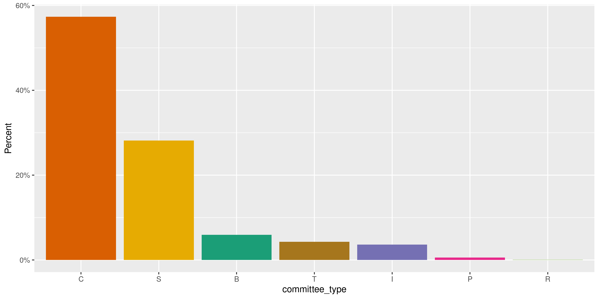
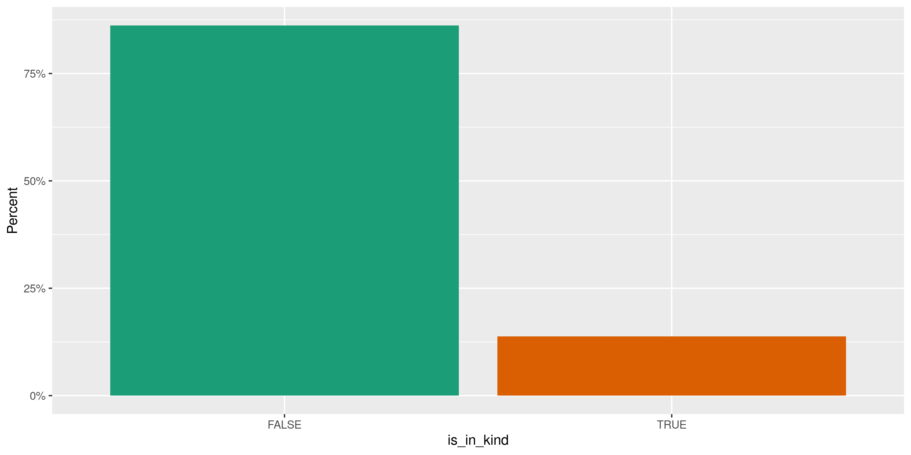
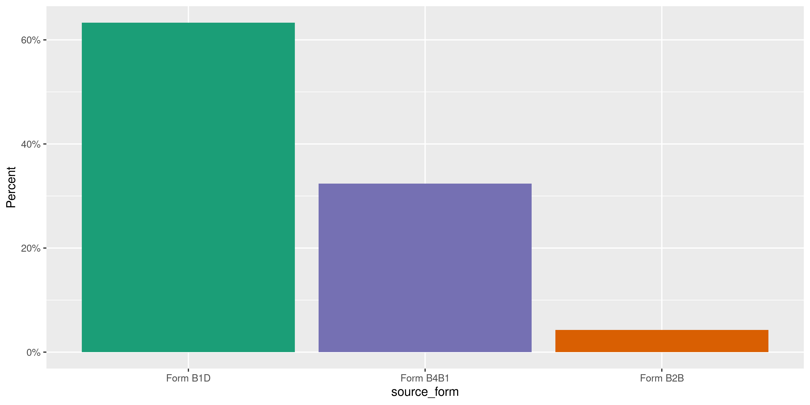
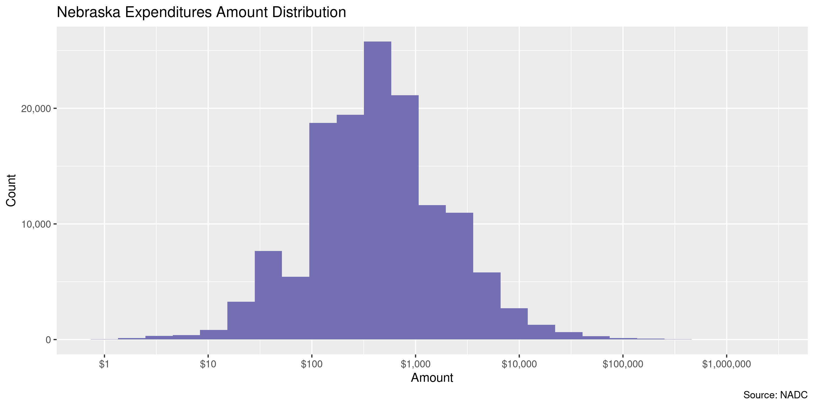
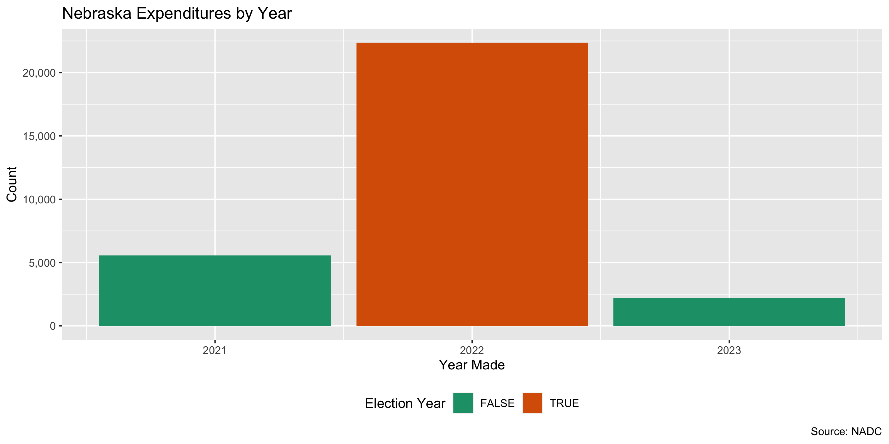

Nebraska Expenditures
================
Kiernan Nicholls
Fri Apr 1 13:37:18 2022

-   [Project](#project)
-   [Objectives](#objectives)
-   [Packages](#packages)
-   [Data](#data)
-   [Download](#download)
    -   [Extract](#extract)
    -   [About](#about)
-   [Read](#read)
    -   [Format](#format)
    -   [Join](#join)
-   [Explore](#explore)
    -   [Missing](#missing)
    -   [Duplicates](#duplicates)
    -   [Categorical](#categorical)
    -   [Amounts](#amounts)
    -   [Dates](#dates)
    -   [Wrangle](#wrangle)
-   [Conclude](#conclude)
-   [Export](#export)
-   [Upload](#upload)

<!-- Place comments regarding knitting here -->

## Project

The Accountability Project is an effort to cut across data silos and
give journalists, policy professionals, activists, and the public at
large a simple way to search across huge volumes of public data about
people and organizations.

Our goal is to standardizing public data on a few key fields by thinking
of each dataset row as a transaction. For each transaction there should
be (at least) 3 variables:

1.  All **parties** to a transaction.
2.  The **date** of the transaction.
3.  The **amount** of money involved.

## Objectives

This document describes the process used to complete the following
objectives:

1.  How many records are in the database?
2.  Check for entirely duplicated records.
3.  Check ranges of continuous variables.
4.  Is there anything blank or missing?
5.  Check for consistency issues.
6.  Create a five-digit ZIP Code called `zip`.
7.  Create a `year` field from the transaction date.
8.  Make sure there is data on both parties to a transaction.

## Packages

The following packages are needed to collect, manipulate, visualize,
analyze, and communicate these results. The `pacman` package will
facilitate their installation and attachment.

``` r
if (!require("pacman")) {
  install.packages("pacman")
}
pacman::p_load(
  tidyverse, # data manipulation
  lubridate, # datetime strings
  textreadr, # read rtf files
  gluedown, # printing markdown
  janitor, # clean data frames
  campfin, # custom irw tools
  aws.s3, # aws cloud storage
  refinr, # cluster & merge
  scales, # format strings
  knitr, # knit documents
  vroom, # fast reading
  rvest, # scrape html
  glue, # code strings
  here, # project paths
  httr, # http requests
  fs # local storage 
)
```

This document should be run as part of the `R_campfin` project, which
lives as a sub-directory of the more general, language-agnostic
[`irworkshop/accountability_datacleaning`](https://github.com/irworkshop/accountability_datacleaning)
GitHub repository.

The `R_campfin` project uses the [RStudio
projects](https://support.rstudio.com/hc/en-us/articles/200526207-Using-Projects)
feature and should be run as such. The project also uses the dynamic
`here::here()` tool for file paths relative to *your* machine.

``` r
# where does this document knit?
here::i_am("ne/expends/docs/ne_expends_diary.Rmd")
```

## Data

Data is obtained by from the Nebraska Accountability and Disclosure
Commission’s (NADC) [Open Data
portal](http://www.nebraska.gov/government/open-data/). From this
portal, we will download the [Campaign Statements
Data](http://www.nadc.nebraska.gov/index.html).

> A weekly export of the campaign filings based upon the paper records
> filed with the Nebraska Accountability and Disclosure Commission.

The [NADC home](http://www.nadc.nebraska.gov/index.html) page explains
the role and resources provided by the Commission.

> This site includes the campaign statements filed with the Commission
> by candidates for state and local offices, political action committees
> or PACs, political parties, and ballot question committees. Campaign
> statements disclose the amount and sources of contributions to the
> committee and the amount purposes of expenditures by the committee.
> The site also includes Reports of Expenditures filed with the
> Commission by corporations, unions, limited liability companies,
> limited partnerships, and by industry, trade or professional
> associations. Reports of Expenditures disclose contributions and
> expenditures made to support or oppose candidates or ballot questions.
> Forms, instructional materials and a list of committees may be
> accessed through this site. To access the information described in
> this paragraph, click on the tab above marked CAMPAIGN FINANCE.

Navigating to the [campaign finance section of the
website](http://www.nadc.nebraska.gov/cf/index.html), the exact filing
requirements are laid out.

> Candidates for state and local office are subject to the campaign
> finance provisions of the Nebraska Political Accountability and
> Disclosure Act (NPADA). Those seeking election to federal office are
> not subject to the NPADA. Once a candidate raises, receives or expends
> $5,000 or more in a calendar year, he or she is required to register
> the committee with the Commission by filing a Statement of
> Organization and paying a filing fee of $100. Once the candidate
> committee is formed, the committee must file periodic campaign
> statements.

specifically, there are **three** kinds of filings that must be made by
general candidates:

1.  Statement of Organization - This document registers the Committee
    > with the Commission. It discloses the name of the committee, the
    > name of the candidate, the office sought and the name of the
    > treasurer.

2.  Campaign Statement - this document provides a summary of the
    > financial activity of the committee. It discloses the name of
    > contributors of more than $250 and the amounts of the
    > contributions. It discloses expenditures of more than $250.

3.  Report of Late Expenditures - this document discloses contributions
    > of $1,000 or more received by the committee during 14 days
    > immediately preceding the election. Information reported as late
    > contributions are also reported on subsequent campaign statements.

Aside from general candidates, the NADC also explains that political
committees must also file.

> There are **two** types of committees that are commonly referred to as
> political action committees or PACs. One type of PAC is a political
> committee sponsored by a corporation, union or other type of
> organization. Another type of PAC is a political committee which is
> not sponsored by another group. PACs are required to register with the
> Commission and file periodic campaign statements disclosing receipts
> and expenditures.

1.  State and county political party committees with certain levels of
    > financial activity, register with the Commission and file periodic
    > campaign statements.

2.  A ballot question committee is a political committee formed for the
    > purpose of supporting or opposing the qualification, passage or
    > defeat of a ballot question. The committee must register with the
    > Commission within 10 days after raising, receiving or expending
    > $5,000 or more in a calendar year. Once registered, ballot
    > questions committees file periodic campaign statements disclosing
    > receipts and expenditures.

Finally, the NADC identifies the source of the data:

> The campaign filings displayed on this website are based upon the
> paper records filed with the Nebraska Accountability and Disclosure
> Commission. While every effort has been made to ensure accurate data
> input, errors may occur. Anyone noting an error is encouraged to
> contact this office.

In any discrepancy between the information displayed on this website and
the official records on file with the Commission, the official records
of the Commission take precedence.

## Download

The NADC provides a bulk download of records on their [search
page](https://nadc.nebraska.gov/ccdb/search.cgi).

> The campaign filings displayed on this website are based upon the
> paper records filed with the Nebraska Accountability and Disclosure
> Commission. While every effort has been made to ensure accurate data
> input, errors may occur. Anyone noting an error is encouraged to
> contact this office.
>
> In any discrepancy between information displayed on this website and
> the official records on file with the Commission, the official records
> of the Commission take precedence.

> Download the entire dataset of campaign filings based upon the paper
> records filed with the Nebraska Accountability and Disclosure
> Commission. Dataset is updated weekly.
> [**Download**](https://www.nebraska.gov/nadc_data/nadc_data.zip)

The bulk data is provided as a single ZIP archive we can download.

``` r
con_dir <- here("ne", "contribs", "data", "raw")
if (length(dir_ls(con_dir)) > 1) {
  raw_dir <- con_dir
} else {
  raw_dir <- dir_create(here("ne", "expends", "data", "raw"))
}
```

``` r
raw_url <- "https://www.nebraska.gov/nadc_data/nadc_data.zip"
raw_zip <- path(raw_dir, basename(raw_url))
```

``` r
if (!file_exists(raw_zip)) {
  download.file(
    url = raw_url, 
    destfile = raw_zip, 
    method = "curl", 
    extra = "--cipher 'DEFAULT:!DH'"
  )
}
```

### Extract

This ZIP file contains 63 text files for each of the various forms
submitted. We can extract each of these text files into our data
directory.

``` r
raw_all <- unzip(
  zipfile = raw_zip,
  junkpaths = TRUE,
  exdir = raw_dir
)
```

``` r
file_info(raw_all) %>% 
  select(path, size, modification_time) %>% 
  mutate(across(path, path.abbrev))
#> # A tibble: 63 × 3
#>    path                                                                          size modification_time  
#>    <fs::path>                                                             <fs::bytes> <dttm>             
#>  1 /home/kiernan/Documents/tap/R_tap/ne/contribs/data/raw/forma1cand.txt      176.79K 2022-04-01 13:37:18
#>  2 /home/kiernan/Documents/tap/R_tap/ne/contribs/data/raw/nadc_tables.rtf     308.23K 2022-04-01 13:37:18
#>  3 /home/kiernan/Documents/tap/R_tap/ne/contribs/data/raw/forma1.txt          513.79K 2022-04-01 13:37:18
#>  4 /home/kiernan/Documents/tap/R_tap/ne/contribs/data/raw/formcfla4.txt         18.3K 2022-04-01 13:37:18
#>  5 /home/kiernan/Documents/tap/R_tap/ne/contribs/data/raw/formb73.txt           1.13M 2022-04-01 13:37:18
#>  6 /home/kiernan/Documents/tap/R_tap/ne/contribs/data/raw/formb1c.txt         263.48K 2022-04-01 13:37:18
#>  7 /home/kiernan/Documents/tap/R_tap/ne/contribs/data/raw/formb4a.txt           3.54M 2022-04-01 13:37:18
#>  8 /home/kiernan/Documents/tap/R_tap/ne/contribs/data/raw/loblatefile.txt     328.73K 2022-04-01 13:37:18
#>  9 /home/kiernan/Documents/tap/R_tap/ne/contribs/data/raw/formb7.txt             2.8M 2022-04-01 13:37:18
#> 10 /home/kiernan/Documents/tap/R_tap/ne/contribs/data/raw/formcfla8.txt         3.06K 2022-04-01 13:37:18
#> # … with 53 more rows
```

### About

One file contains the date the database was last updated.

``` r
date_updated <- read_file(file = path(raw_dir, "DATE_UPDATED.TXT"))
print(date_updated)
#> [1] "Data last loaded: 2022-03-28 03:00:19"
ymd_hms(str_remove_all(date_updated, "\\D")) - now()
#> Time difference of -4.609032 days
```

Before we can prepare the file for indexing, we need to locate the exact
data we’re interested in. The content, structure, and relationship of
each file is described in the `nadc_tables.rtf` rich text file. The
files correspond to the *forms* through which candidates and committees
report their contributions, expenditures, etc. Each type of filter uses
a different form, so all expenditures are split among a few files
(corresponding to a few forms). Each form typically also has a section
(schedule) where *expenditures* are reported.

Using this file, we can grasp what information is contained on what
forms and which tables we will need to combine to identify the parties,
date, and amount of every campaign expenditure.

Form A1 contains all of the names and addresses of political, candidate,
and ballot question committees. This form has no transactions.

-   Date Received
-   Committee ID Number
-   Committee Name
-   Committee Address
-   Committee City
-   Committee State
-   Committee Zip
-   Committee Type
    -   C = Candidate Committee
    -   B = Ballot Question
    -   P = Political Action Committee
    -   T = Political Party Committee
    -   I or R = Independent Reporting Committee
    -   S = Separate Segregated Political Fund Committee

Then the various types of transactions for those committee types are
reported on subsequent forms. The files of interested were confirmed by
the NADC to the Investigative Reporting Workshop in June of 2018.

-   FORM**B1AB** – All Data from form B-1 schedule A and B, Expenditures
-   FORM**B2A** – Form B-2 Expenditures
-   FORM**B3** – Report of Earmarked Contribution
-   FORM**B4A** – Form B-4 Schedule A:
    -   Committee ID - Use to link with FORMB4, along with Date Received
-   FORM**B4B1** – Form B-4 Schedule B Section 1
-   FORM**B5** – Report of Late contributions
-   FORM**B7** – Report of Political Expenditures of Corporation, Union,
    etc.
-   FORM**B72** – Form B-7 Direct contributions
-   FORM**B73** – Form B-7 Indirect contributions

When we read all these sub-forms together and join them against the
committee statements then we can identify all transactions.

## Read

``` r
ne_all <- map(
  .x = raw_all,
  .f = read_delim,
  delim = "|",
  escape_backslash = FALSE,
  escape_double = FALSE,
  col_types = cols(.default = col_character()),
  trim_ws = TRUE
)
```

### Format

Now that each of the files is read as an element of a list, we can
format them for combination and matching against the tables containing
full information on the filing committees.

#### A Forms

``` r
a1 <- ne_all$forma1 %>% 
  select(starts_with("committee")) %>% 
  rename(committee_id = committee_id_number) %>% 
  distinct()
```

#### B Forms

``` r
b1d <- ne_all$formb1d %>% 
  select(
    everything()
  ) %>% 
  mutate(
    is_in_kind = in_kind != 0,
    amount = coalesce(
      na_if(amount, 0),
      na_if(in_kind, 0)
    )
  ) %>% 
  select(-in_kind) %>% 
  rename(expenditure_amount = amount)
```

``` r
b2b <- ne_all$formb2b %>% 
  mutate(is_in_kind = nature_of_expenditure == "K") %>% 
  select(
    committee_id,
    date_received,
    expenditure_date,
    expenditure_amount = amount,
    payee_id = committee_id_expenditure_is_for,
    payee_name = report_id,
    expenditure_purpose = description,
    is_in_kind
  )
```

``` r
b4b1 <- ne_all$formb4b1 %>% 
  mutate(is_in_kind = nature_of_expenditure == "K") %>% 
  select(
    committee_id,
    date_received,
    expenditure_date,
    expenditure_amount = amount,
    payee_id = committee_expenditure_id,
    payee_name = report_id,
    expenditure_purpose = expense_category,
    is_in_kind
  )
```

### Join

``` r
names(b1d) %in% names(b2b)
#> [1] FALSE  TRUE  TRUE  TRUE FALSE  TRUE  TRUE  TRUE  TRUE
names(b1d) %in% names(b4b1)
#> [1] FALSE  TRUE  TRUE  TRUE FALSE  TRUE  TRUE  TRUE  TRUE
```

``` r
bx <- bind_rows(
  "Form B1D" = b1d, 
  "Form B2B" = b2b, 
  "Form B4B1" = b4b1, 
  .id = "source_form"
)
```

``` r
bex <- bx %>% 
  relocate(payee_id, .before = payee_name)
```

``` r
nee <- right_join(a1, bx, by = "committee_id")
nee <- nee %>% 
  mutate(
    committee_name = coalesce(committee_name.x, committee_name.y),
    .keep = "unused",
    .after = committee_id
  )
```

``` r
nee <- nee %>% 
  # parse column types
  type_convert(
    col_types = cols(
      date_received = col_date_mdy(),
      expenditure_date = col_date_mdy(),
      expenditure_amount = col_double()
    )
  )
```

## Explore

There are 141,082 rows of 16 columns. Each record represents a single
contribution from an entity to a committee.

``` r
glimpse(nee)
#> Rows: 141,082
#> Columns: 16
#> $ committee_id        <chr> "08BQC00200", "08BQC00200", "08BQC00200", "08BQC00200", "08BQC00200", "08BQC00200", "08BQC…
#> $ committee_name      <chr> "25 COUNTIES FOR OUR FUTURE", "25 COUNTIES FOR OUR FUTURE", "25 COUNTIES FOR OUR FUTURE", …
#> $ committee_address   <chr> "PO BOX 2024; 1413 CRANE AVENUE", "PO BOX 2024; 1413 CRANE AVENUE", "PO BOX 2024; 1413 CRA…
#> $ committee_city      <chr> "HASTINGS", "HASTINGS", "HASTINGS", "HASTINGS", "HASTINGS", "HASTINGS", "HASTINGS", "HASTI…
#> $ committee_state     <chr> "NE", "NE", "NE", "NE", "NE", "NE", "NE", "NE", "NE", "NE", "NE", "NE", "NE", "NE", "NE", …
#> $ committee_zip       <chr> "68902", "68902", "68902", "68902", "68902", "68902", "68902", "68902", "68902", "68902", …
#> $ committee_type      <chr> "B", "B", "B", "B", "B", "B", "B", "B", "B", "B", "B", "B", "C", "C", "C", "C", "C", "C", …
#> $ source_form         <chr> "Form B1D", "Form B1D", "Form B1D", "Form B1D", "Form B1D", "Form B1D", "Form B1D", "Form …
#> $ date_received       <date> 2008-10-07, 2008-10-24, 2008-10-24, 2008-10-24, 2008-10-24, 2008-10-24, 2008-10-24, 2009-…
#> $ payee_name          <chr> "DAVID & ASSOCIATES", "KLIR RADIO", "KRNY FM RADIO", "KKPR/KLIQ RADIO", "KRGI FM RADIO", "…
#> $ payee_address       <chr> "PO BOX 130, HASTINGS, NE", "418 25TH ST COLUMBUS, NE 68601", "PO BOX 669 KEARNEY, NE 6884…
#> $ expenditure_purpose <chr> "MEDIA PRODUCTION, MANAGEMENT, RESEARCH", "RADIO ADVERTISING SPOTS", "RADIO ADVERTISING SP…
#> $ expenditure_date    <date> 2008-09-12, 2008-10-13, 2008-10-13, 2008-10-13, 2008-10-13, 2008-10-13, 2008-10-13, 2008-…
#> $ expenditure_amount  <dbl> 16484.43, 4500.75, 3000.50, 2244.85, 3031.95, 3032.80, 4099.98, 520.00, 8765.89, 20000.00,…
#> $ is_in_kind          <lgl> NA, NA, NA, NA, NA, NA, NA, NA, NA, NA, NA, NA, NA, FALSE, NA, NA, NA, NA, NA, NA, NA, NA,…
#> $ payee_id            <chr> NA, NA, NA, NA, NA, NA, NA, NA, NA, NA, NA, NA, NA, NA, NA, NA, NA, NA, NA, NA, NA, NA, NA…
tail(nee)
#> # A tibble: 6 × 16
#>   committee_id committee_name   committee_addre… committee_city committee_state committee_zip committee_type source_form
#>   <chr>        <chr>            <chr>            <chr>          <chr>           <chr>         <chr>          <chr>      
#> 1 11CAC01578   ANNA WISHART FO… <NA>             <NA>           <NA>            <NA>          <NA>           Form B1D   
#> 2 11CAC01578   ANNA WISHART FO… <NA>             <NA>           <NA>            <NA>          <NA>           Form B1D   
#> 3 11CAC01578   ANNA WISHART FO… <NA>             <NA>           <NA>            <NA>          <NA>           Form B1D   
#> 4 11CAC01578   ANNA WISHART FO… <NA>             <NA>           <NA>            <NA>          <NA>           Form B1D   
#> 5 11CAC01578   ANNA WISHART FO… <NA>             <NA>           <NA>            <NA>          <NA>           Form B1D   
#> 6 11CAC01578   ANNA WISHART FO… <NA>             <NA>           <NA>            <NA>          <NA>           Form B1D   
#> # … with 8 more variables: date_received <date>, payee_name <chr>, payee_address <chr>, expenditure_purpose <chr>,
#> #   expenditure_date <date>, expenditure_amount <dbl>, is_in_kind <lgl>, payee_id <chr>
```

### Missing

Columns vary in their degree of missing values.

``` r
col_stats(nee, count_na)
#> # A tibble: 16 × 4
#>    col                 class      n         p
#>    <chr>               <chr>  <int>     <dbl>
#>  1 committee_id        <chr>      0 0        
#>  2 committee_name      <chr>      8 0.0000567
#>  3 committee_address   <chr>     25 0.000177 
#>  4 committee_city      <chr>    975 0.00691  
#>  5 committee_state     <chr>    975 0.00691  
#>  6 committee_zip       <chr>     24 0.000170 
#>  7 committee_type      <chr>     13 0.0000921
#>  8 source_form         <chr>      0 0        
#>  9 date_received       <date>     0 0        
#> 10 payee_name          <chr>     67 0.000475 
#> 11 payee_address       <chr>  63994 0.454    
#> 12 expenditure_purpose <chr>   4922 0.0349   
#> 13 expenditure_date    <date>     0 0        
#> 14 expenditure_amount  <dbl>   3640 0.0258   
#> 15 is_in_kind          <lgl>  45842 0.325    
#> 16 payee_id            <chr>  89323 0.633
```

We can flag any record missing a key variable needed to identify a
transaction.

``` r
key_vars <- c("expenditure_date", "committee_name", 
              "expenditure_amount", "payee_name")
nee <- flag_na(nee, all_of(key_vars))
mean(nee$na_flag)
#> [1] 0.02621879
sum(nee$na_flag)
#> [1] 3699
```

``` r
nee %>% 
  filter(na_flag) %>% 
  select(all_of(key_vars), source_form)
#> # A tibble: 3,699 × 5
#>    expenditure_date committee_name                            expenditure_amount payee_name                  source_form
#>    <date>           <chr>                                                  <dbl> <chr>                       <chr>      
#>  1 2007-04-12       ABBOTT FOR COUNCIL (DISSOLVED)                          NA   STEAMFITTERS AND PLUMBERS … Form B1D   
#>  2 2012-10-01       AL DAVIS FOR LEGISLATURE                                25.8 <NA>                        Form B1D   
#>  3 2017-01-17       AL DAVIS FOR LEGISLATURE                                NA   AL DAVIS                    Form B1D   
#>  4 2006-05-10       AMY LINDSAY FOR MUD BOARD (DISSOLVED)                   NA   SUAREZ, ALFRED M            Form B1D   
#>  5 2015-03-25       ANDY STEBBING FOR MAYOR                                 NA   LANCASTER CO TREASURER      Form B1D   
#>  6 2018-12-31       ANGIE MORONES-HARRIS                                    NA   ANGIE MORONES HARRIS        Form B1D   
#>  7 2012-04-25       ANN FERLIC ASHFORD FOR REGENT (DISSOLVED)               NA   KFAB,KGOR                   Form B1D   
#>  8 2012-04-12       ANN FERLIC ASHFORD FOR REGENT (DISSOLVED)               NA   UNIONIST                    Form B1D   
#>  9 2012-03-31       ANN FERLIC ASHFORD FOR REGENT (DISSOLVED)               NA   UNIONIST                    Form B1D   
#> 10 2012-04-25       ANN FERLIC ASHFORD FOR REGENT (DISSOLVED)               NA   KSRZ                        Form B1D   
#> # … with 3,689 more rows
```

``` r
nee %>% 
  group_by(source_form) %>% 
  summarise(
    n = n(),
    no_key_comm = mean(is.na(committee_name)),
    no_key_name = mean(is.na(payee_name)),
    no_key_amt = mean(is.na(expenditure_amount))
  ) %>% 
  arrange(desc(n))
#> # A tibble: 3 × 5
#>   source_form     n no_key_comm no_key_name no_key_amt
#>   <chr>       <int>       <dbl>       <dbl>      <dbl>
#> 1 Form B1D    89323   0.0000896   0.000728    0.0406  
#> 2 Form B4B1   45722   0           0.0000219   0.000328
#> 3 Form B2B     6037   0           0.000166    0
```

### Duplicates

We can also flag any record completely duplicated across every column.

``` r
nee <- flag_dupes(nee, everything())
sum(nee$dupe_flag)
#> [1] 1017
mean(nee$dupe_flag)
#> [1] 0.007208574
```

``` r
nee %>% 
  filter(dupe_flag) %>% 
  select(all_of(key_vars)) %>% 
  arrange(expenditure_date)
#> # A tibble: 1,017 × 4
#>    expenditure_date committee_name                      expenditure_amount payee_name                 
#>    <date>           <chr>                                            <dbl> <chr>                      
#>  1 1999-01-14       CITIZENS FOR WESELY                               2300 PAT EGAN INSURANCE, INC.   
#>  2 1999-01-14       CITIZENS FOR WESELY                               2300 PAT EGAN INSURANCE, INC.   
#>  3 1999-01-14       CITIZENS FOR WESELY                               2300 PAT EGAN INSURANCE, INC.   
#>  4 1999-01-20       CITIZENS FOR WESELY                               2500 BATT, BOB                  
#>  5 1999-01-20       CITIZENS FOR WESELY                               2500 BATT, BOB                  
#>  6 1999-02-15       JOHNSON FOR MAYOR (DISSOLVED)                     1176 STRICTLY BUSINESS MAGAZINE 
#>  7 1999-02-15       JOHNSON FOR MAYOR (DISSOLVED)                     1176 STRICTLY BUSINESS MAGAZINE 
#>  8 1999-02-15       JOHNSON FOR MAYOR (DISSOLVED)                     1176 STRICTLY BUSINESS MAGAZINE 
#>  9 1999-03-04       JON CAMP FOR CITY COUNCIL COMMITTEE                 15 BORCHERT, MARSHALL & JENNIE
#> 10 1999-03-04       JON CAMP FOR CITY COUNCIL COMMITTEE                 15 BORCHERT, MARSHALL & JENNIE
#> # … with 1,007 more rows
```

### Categorical

``` r
col_stats(nee, n_distinct)
#> # A tibble: 18 × 4
#>    col                 class      n         p
#>    <chr>               <chr>  <int>     <dbl>
#>  1 committee_id        <chr>   1878 0.0133   
#>  2 committee_name      <chr>   1873 0.0133   
#>  3 committee_address   <chr>   1742 0.0123   
#>  4 committee_city      <chr>    192 0.00136  
#>  5 committee_state     <chr>     12 0.0000851
#>  6 committee_zip       <chr>    287 0.00203  
#>  7 committee_type      <chr>      8 0.0000567
#>  8 source_form         <chr>      3 0.0000213
#>  9 date_received       <date>  2597 0.0184   
#> 10 payee_name          <chr>  23476 0.166    
#> 11 payee_address       <chr>  31373 0.222    
#> 12 expenditure_purpose <chr>  29808 0.211    
#> 13 expenditure_date    <date>  8121 0.0576   
#> 14 expenditure_amount  <dbl>  41774 0.296    
#> 15 is_in_kind          <lgl>      3 0.0000213
#> 16 payee_id            <chr>   2108 0.0149   
#> 17 na_flag             <lgl>      2 0.0000142
#> 18 dupe_flag           <lgl>      2 0.0000142
```

<!-- --><!-- --><!-- -->

### Amounts

``` r
nee$expenditure_amount <- round(nee$expenditure_amount, 2)
```

``` r
summary(nee$expenditure_amount)
#>    Min. 1st Qu.  Median    Mean 3rd Qu.    Max.    NA's 
#>  -42328     133     500    1749    1020 2096511    3640
mean(nee$expenditure_amount <= 0, na.rm = TRUE)
#> [1] 0.00384162
```

These are the records with the minimum and maximum amounts.

``` r
glimpse(nee[c(which.max(nee$expenditure_amount), which.min(nee$expenditure_amount)), ])
#> Rows: 2
#> Columns: 18
#> $ committee_id        <chr> "15BQC00421", "99BQC00090"
#> $ committee_name      <chr> "KEEP THE MONEY IN NEBRASKA", "KEEP THE MONEY IN NEBRASKA COMM., INC.(DISSOLVED)"
#> $ committee_address   <chr> "301 S 12TH STREET SUITE 140", "1299 FARNAM ST.  SUITE 1501"
#> $ committee_city      <chr> "LINCOLN", "OMAHA"
#> $ committee_state     <chr> "NE", "NE"
#> $ committee_zip       <chr> "68508", "68102"
#> $ committee_type      <chr> "B", "B"
#> $ source_form         <chr> "Form B1D", "Form B1D"
#> $ date_received       <date> 2020-12-31, 2005-01-12
#> $ payee_name          <chr> "BLUE EARTH MARKETING", "ROBINSON & MUENSTER"
#> $ payee_address       <chr> "600 4TH STREET STE 201 SIOUX CITY IA 511", NA
#> $ expenditure_purpose <chr> "ADVERTISING", "PARTIAL REFUND OF PHONE BANK"
#> $ expenditure_date    <date> 2020-11-25, 2004-10-27
#> $ expenditure_amount  <dbl> 2096510.9, -42328.4
#> $ is_in_kind          <lgl> NA, FALSE
#> $ payee_id            <chr> NA, NA
#> $ na_flag             <lgl> FALSE, FALSE
#> $ dupe_flag           <lgl> FALSE, FALSE
```

<!-- -->

### Dates

We can add the calendar year from `date` with `lubridate::year()`

``` r
nee <- mutate(nee, expenditure_year = year(expenditure_date))
```

``` r
min(nee$expenditure_date)
#> [1] "15-04-07"
sum(nee$expenditure_year < 1984)
#> [1] 23
max(nee$expenditure_date)
#> [1] "9915-12-31"
sum(nee$expenditure_date > today())
#> [1] 22
```

<!-- -->

### Wrangle

#### Address

There is very little consistency in the format of payee_address.

``` r
sample(
  x = na.omit(nee$payee_address),
  size = 20
)
#>  [1] "PO BOX 337"                               "PO BOX 45913 OMAHA NE 68145"             
#>  [3] "PO BOX 413 WAYNE NE 68787"                "226 BORDEAUX ST CHADRON NE 69337"        
#>  [5] "2145 NORTH COTNER BLVD."                  "18331 DUPONT CIRCLE  OMAHA NE 68130"     
#>  [7] "6720 NW 6TH STREET, LINCOLN, NE  68521"   "4113 S. 84TH ST. OMAHA, NE"              
#>  [9] "11922 S. 53RD STREET PAPILLION NE 68133"  "8510 KST OMAHA NE 68127"                 
#> [11] "POB 409101, OGDEN, UT"                    "128 N 13 ST #508 LINCOLN NE 68508"       
#> [13] "802 SO. 80TH ST.  OMAHA NE 68114"         "2801 CORNHUSKER HIGHWAY LINCOLN NE 68564"
#> [15] "2630 N 27TH ST LINCOLN, NE 68521"         "700 LINCOLN SQ. 121 S. 13TH ST"          
#> [17] "1715 W 41ST ST KEARNEY, NE 68845"         "NORFOLK"                                 
#> [19] "3606 N 156 ST STE 101-308, OMAHA, NE"     "9907 ONTARIO ST, OMAHA, NE"
```

We can use some character patterns to pull out ZIP codes and state
abbreviations but cities would be too difficult.

``` r
nee <- nee %>% 
  mutate(
    zip_clean = payee_address %>% 
      str_extract(rx_zip) %>% 
      normal_zip(na_rep = TRUE)
  )
```

``` r
pull_state <- function(x) {
  out <- NA_character_
  found <- FALSE
  i <- 1
  while (!found & i < length(state.abb)) {
    out <- str_extract(x, sprintf("(?<=\\s|,)(%s)(?=\\s|$)", state.abb[i]))
    found <- !is.na(out)
    i <- i + 1
  }
  return(out)
}
```

``` r
nee <- nee %>% 
  mutate(
    state_clean = map_chr(payee_address, pull_state)
  )
```

``` r
nee %>% 
  filter(!is.na(payee_address)) %>% 
  select(payee_address, state_clean) %>% 
  group_by(state_clean) %>% slice(1)
#> # A tibble: 50 × 2
#>    payee_address                            state_clean
#>    <chr>                                    <chr>      
#>  1 BENTONVILLE, AK                          AK         
#>  2 111 INDUSTRIAL PARK RD PRATTVILLE, AL 36 AL         
#>  3 PO BOX 7836 PINE BLUFF, AR 71611         AR         
#>  4 4714 E VIRGINIA AVE PHOENIX AZ 85008     AZ         
#>  5 1020 ENTERPRISE WAY, SUNNYDALE CA        CA         
#>  6 13085 W.CEDARDR,#313 LAKEWOOD, CO 80203  CO         
#>  7 9270 PIONEER CT                          CT         
#>  8 PO BOX 15298, WILMINGTON DE              DE         
#>  9 2145 SUNNYDALE BLVD CLEATWATER,FL 33765  FL         
#> 10 PO BOX4002 ACWORTH GA 30101              GA         
#> # … with 40 more rows
```

## Conclude

``` r
glimpse(sample_n(nee, 1000))
#> Rows: 1,000
#> Columns: 21
#> $ committee_id        <chr> "07CAC01062", "12CAC01641", "05BQC00110", "06CAC00849", "20CAC02742", "99PAC00069", "05CAC…
#> $ committee_name      <chr> "KATHY CAMPBELL FOR LEGISLATURE", "SCHEER FOR STATE LEGISLATURE (2016)", "NEBRASKANS FOR L…
#> $ committee_address   <chr> "6111 CHARTWELL LANE", "2705 DOVER DRIVE", "RT 1, BOX 34", "4608 N 193 AVE CIR", "9151 NW …
#> $ committee_city      <chr> "LINCOLN", "NORFOLK", "ELYRIA", "ELKHORN", "MALCOLM", "LINCOLN", "BOYS TOWN", "GRETNA", "O…
#> $ committee_state     <chr> "NE", "NE", "NE", "NE", "NE", "NE", "NE", "NE", "NE", "NE", "NE", "NE", "NE", "NE", "NE", …
#> $ committee_zip       <chr> "68516", "68701", "68837", "68022", "68402", "68508", "68010", "68028", "68102", "68104", …
#> $ committee_type      <chr> "C", "C", "B", "C", "C", "S", "C", "C", "S", "C", "S", "C", "C", "S", "B", "C", "C", "C", …
#> $ source_form         <chr> "Form B1D", "Form B1D", "Form B1D", "Form B1D", "Form B1D", "Form B4B1", "Form B1D", "Form…
#> $ date_received       <date> 2016-01-25, 2018-01-22, 2005-08-02, 2006-05-01, 2020-10-26, 2001-06-11, 2006-04-11, 2012-…
#> $ payee_name          <chr> "BRAD ASHFORD", "TONI MAXEY", "CRAICHY, SHARON", "COREY MCKINSEY COMPANY", "USPS", "MAYHEW…
#> $ payee_address       <chr> "PO BOX 24023 OMAHA NE 68124", "308 SOUTH 8TH STREET NORFOLK NE 68701", "HC 81, BOX 19", "…
#> $ expenditure_purpose <chr> "EVENT TICKET", "ADDRESSING CHRISTMAS CARDS", "EXPENSES INCURRED PETITION SIGNATURES", "DO…
#> $ expenditure_date    <date> 2015-07-18, 2017-12-18, 2005-07-25, 2006-04-14, 2020-09-30, 2001-04-23, 2006-03-14, 2012-…
#> $ expenditure_amount  <dbl> 500.00, 110.00, 358.83, 313.94, 170.75, 212.50, NA, 1000.00, 1000.00, 856.00, 2500.00, 148…
#> $ is_in_kind          <lgl> FALSE, FALSE, TRUE, NA, NA, FALSE, FALSE, NA, FALSE, TRUE, FALSE, FALSE, NA, FALSE, NA, NA…
#> $ payee_id            <chr> NA, NA, NA, NA, NA, "99CAC00560", NA, NA, "05CAC00744", NA, "10CAC01468", NA, NA, "07CAC01…
#> $ na_flag             <lgl> FALSE, FALSE, FALSE, FALSE, FALSE, FALSE, TRUE, FALSE, FALSE, FALSE, FALSE, FALSE, FALSE, …
#> $ dupe_flag           <lgl> FALSE, FALSE, FALSE, FALSE, FALSE, FALSE, FALSE, FALSE, FALSE, FALSE, FALSE, FALSE, FALSE,…
#> $ expenditure_year    <dbl> 2015, 2017, 2005, 2006, 2020, 2001, 2006, 2012, 2010, 2000, 2010, 2018, 2008, 2010, 2016, …
#> $ zip_clean           <chr> "68124", "68701", NA, NA, "68501", NA, NA, NA, NA, NA, NA, "32258", NA, NA, NA, "68504", N…
#> $ state_clean         <chr> "NE", "NE", NA, "NE", "NE", NA, NA, "NE", NA, NA, NA, "FL", NA, NA, "UT", "NE", NA, "NE", …
```

1.  There are 141,082 records in the database.
2.  There are 1,017 duplicate records in the database.
3.  The range and distribution of `amount` and `date` seem reasonable.
4.  There are 3,699 records missing key variables.
5.  Consistency in geographic data has been improved with
    `campfin::normal_*()`.
6.  The 4-digit `year` variable has been created with
    `lubridate::year()`.

## Export

Now the file can be saved on disk for upload to the Accountability
server. We will name the object using a date range of the records
included.

``` r
clean_dir <- dir_create(here("ne", "expends", "data", "clean"))
clean_csv <- path(clean_dir, glue("ne_expends_19970101-20220401.csv"))
clean_rds <- path_ext_set(clean_csv, "rds")
basename(clean_csv)
#> [1] "ne_expends_19970101-20220401.csv"
```

``` r
write_csv(nee, clean_csv, na = "")
write_rds(nee, clean_rds, compress = "xz")
(clean_size <- file_size(clean_csv))
#> 27.8M
```

## Upload

We can use the `aws.s3::put_object()` to upload the text file to the IRW
server.

``` r
aws_key <- path("csv", basename(clean_csv))
if (!object_exists(aws_key, "publicaccountability")) {
  put_object(
    file = clean_csv,
    object = aws_key, 
    bucket = "publicaccountability",
    acl = "public-read",
    show_progress = TRUE,
    multipart = TRUE
  )
}
aws_head <- head_object(aws_key, "publicaccountability")
(aws_size <- as_fs_bytes(attr(aws_head, "content-length")))
unname(aws_size == clean_size)
```
