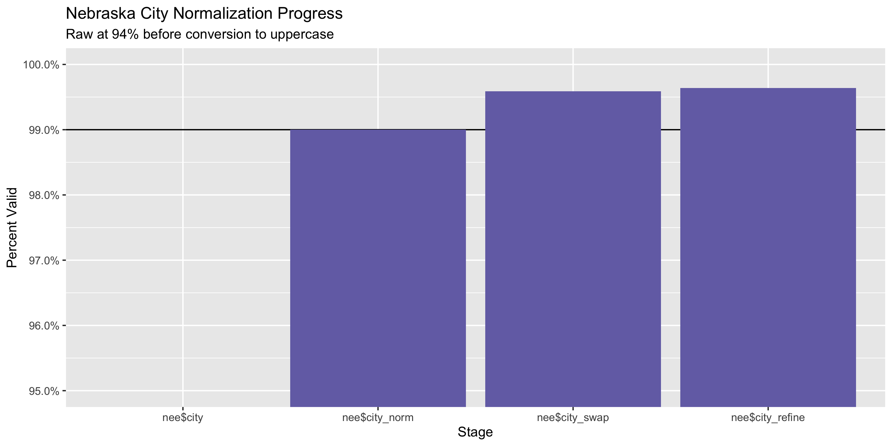
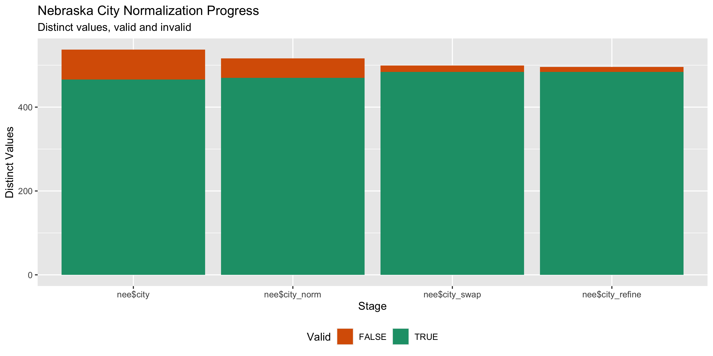

Nebraska Expenditures since 2021
================
Kiernan Nicholls & Yanqi Xu
Sun Jul 23 20:34:03 2023

- [Project](#project)
- [Objectives](#objectives)
- [Packages](#packages)
- [Data](#data)
  - [Extract](#extract)
- [Read](#read)
  - [Format](#format)
- [Explore](#explore)
  - [Missing](#missing)
  - [Duplicates](#duplicates)
  - [Categorical](#categorical)
  - [Amounts](#amounts)
  - [Dates](#dates)
- [Wrangle](#wrangle)
  - [Address](#address)
  - [ZIP](#zip)
  - [State](#state)
  - [City](#city)
- [Conclude](#conclude)
- [Export](#export)
- [Upload](#upload)

<!-- Place comments regarding knitting here -->

## Project

The Accountability Project is an effort to cut across data silos and
give journalists, policy professionals, activists, and the public at
large a simple way to search across huge volumes of public data about
people and organizations.

Our goal is to standardizing public data on a few key fields by thinking
of each dataset row as a transaction. For each transaction there should
be (at least) 3 variables:

1.  All **parties** to a transaction.
2.  The **date** of the transaction.
3.  The **amount** of money involved.

## Objectives

This document describes the process used to complete the following
objectives:

1.  How many records are in the database?
2.  Check for entirely duplicated records.
3.  Check ranges of continuous variables.
4.  Is there anything blank or missing?
5.  Check for consistency issues.
6.  Create a five-digit ZIP Code called `zip`.
7.  Create a `year` field from the transaction date.
8.  Make sure there is data on both parties to a transaction.

## Packages

The following packages are needed to collect, manipulate, visualize,
analyze, and communicate these results. The `pacman` package will
facilitate their installation and attachment.

``` r
if (!require("pacman")) {
  install.packages("pacman")
}
pacman::p_load(
  tidyverse, # data manipulation
  lubridate, # datetime strings
  textreadr, # read rtf files
  gluedown, # printing markdown
  janitor, # clean data frames
  campfin, # custom irw tools
  aws.s3, # aws cloud storage
  refinr, # cluster & merge
  scales, # format strings
  knitr, # knit documents
  vroom, # fast reading
  rvest, # scrape html
  glue, # code strings
  here, # project paths
  httr, # http requests
  fs # local storage 
)
```

This document should be run as part of the `R_campfin` project, which
lives as a sub-directory of the more general, language-agnostic
[`irworkshop/accountability_datacleaning`](https://github.com/irworkshop/accountability_datacleaning)
GitHub repository.

The `R_campfin` project uses the [RStudio
projects](https://support.rstudio.com/hc/en-us/articles/200526207-Using-Projects)
feature and should be run as such. The project also uses the dynamic
`here::here()` tool for file paths relative to *your* machine.

``` r
# where does this document knit?
here::i_am("state/ne/contribs/docs/ne_contribs_diary.Rmd")
```

## Data

Data is obtained by from the Nebraska Accountability and Disclosure
Commission’s (NADC) [data download
page](https://nadc.nebraska.gov/view-campaign-filings-personal-financial-disclosures-potential-conflicts-lobbying-reports-and-more).
Data prior to 2022 was available in bulk and was processed in a
different workflow. (See `ne_expends_diary.Rmd`). This update deals with
new data since 2021 and can be accessed on the website by clicking on
`Expenditures`.

> The page provides comma separated value (CSV) downloads of
> contribution, loan, and expenditure data for each reporting year in a
> zipped file format. These files can be downloaded and imported into
> other applications (Microsoft Excel, Microsoft Access, etc.)

> This data is extracted from the state of Nebraska database as it
> existed as of 7/23/2023 2:26 AM

The [NADC home](http://www.nadc.nebraska.gov/index.html) page explains
the role and resources provided by the Commission.

> This site includes the campaign statements filed with the Commission
> by candidates for state and local offices, political action committees
> or PACs, political parties, and ballot question committees. Campaign
> statements disclose the amount and sources of contributions to the
> committee and the amount purposes of expenditures by the committee.
> The site also includes Reports of Contributions filed with the
> Commission by corporations, unions, limited liability companies,
> limited partnerships, and by industry, trade or professional
> associations. Reports of Contributions disclose contributions and
> expenditures made to support or oppose candidates or ballot questions.
> Forms, instructional materials and a list of committees may be
> accessed through this site. To access the information described in
> this paragraph, click on the tab above marked CAMPAIGN FINANCE.

Navigating to the [campaign finance section of the
website](http://www.nadc.nebraska.gov/cf/index.html), the exact filing
requirements are laid out.

> Candidates for state and local office are subject to the campaign
> finance provisions of the Nebraska Political Accountability and
> Disclosure Act (NPADA). Those seeking election to federal office are
> not subject to the NPADA. Once a candidate raises, receives or expends
> \$5,000 or more in a calendar year, he or she is required to register
> the committee with the Commission by filing a Statement of
> Organization and paying a filing fee of \$100. Once the candidate
> committee is formed, the committee must file periodic campaign
> statements.

specifically, there are **three** kinds of filings that must be made by
general candidates:

1.  Statement of Organization - This document registers the Committee
    > with the Commission. It discloses the name of the committee, the
    > name of the candidate, the office sought and the name of the
    > treasurer.

2.  Campaign Statement - this document provides a summary of the
    > financial activity of the committee. It discloses the name of
    > contributors of more than \$250 and the amounts of the
    > contributions. It discloses expenditures of more than \$250.

3.  Report of Late Expenditures - this document discloses contributions
    > of \$1,000 or more received by the committee during 14 days
    > immediately preceding the election. Information reported as late
    > contributions are also reported on subsequent campaign statements.

Aside from general candidates, the NADC also explains that political
committees must also file.

> There are **two** types of committees that are commonly referred to as
> political action committees or PACs. One type of PAC is a political
> committee sponsored by a corporation, union or other type of
> organization. Another type of PAC is a political committee which is
> not sponsored by another group. PACs are required to register with the
> Commission and file periodic campaign statements disclosing receipts
> and expenditures.

1.  State and county political party committees with certain levels of
    > financial activity, register with the Commission and file periodic
    > campaign statements.

2.  A ballot question committee is a political committee formed for the
    > purpose of supporting or opposing the qualification, passage or
    > defeat of a ballot question. The committee must register with the
    > Commission within 10 days after raising, receiving or expending
    > \$5,000 or more in a calendar year. Once registered, ballot
    > questions committees file periodic campaign statements disclosing
    > receipts and expenditures.

Finally, the NADC identifies the source of the data:

> The campaign filings displayed on this website are based upon the
> paper records filed with the Nebraska Accountability and Disclosure
> Commission. While every effort has been made to ensure accurate data
> input, errors may occur. Anyone noting an error is encouraged to
> contact this office.

In any discrepancy between the information displayed on this website and
the official records on file with the Commission, the official records
of the Commission take precedence.

``` r
raw_urls <- glue("https://nadc-e.nebraska.gov/PublicSite/Docs/BulkDataDownloads/{2021:2023}_ExpenditureExtract.csv.zip")
raw_dir <- dir_create(here("state","ne", "expends", "data", "raw"))
raw_zips <- path(raw_dir, basename(raw_urls))
```

``` r
for (i in seq_along(raw_zips)) {
raw_zip <- raw_zips[i]
  if (!file_exists(raw_zip)) {
    download.file(
      url = raw_urls[i], 
      destfile = raw_zip, 
      method = "curl", 
      extra = "--cipher 'DEFAULT:!DH'"
    )
  }
  
}
```

### Extract

We can extract each of these text files into our data directory.

``` r
raw_all <- map(raw_zips, unzip,
  zipfile = ,
  junkpaths = TRUE,
  exdir = raw_dir
) %>% unlist()
```

``` r
file_info(raw_all) %>% 
  select(path, size, modification_time) %>% 
  mutate(across(path, path.abbrev))
#> # A tibble: 3 × 3
#>   path                                                                                          size modification_time  
#>   <fs::path>                                                                                  <fs::> <dttm>             
#> 1 …ixu/code/accountability_datacleaning/state/ne/expends/data/raw/2021_ExpenditureExtract.csv 43.55K 2023-07-23 20:34:08
#> 2 …ixu/code/accountability_datacleaning/state/ne/expends/data/raw/2022_ExpenditureExtract.csv  6.84M 2023-07-23 20:34:08
#> 3 …ixu/code/accountability_datacleaning/state/ne/expends/data/raw/2023_ExpenditureExtract.csv  2.24M 2023-07-23 20:34:08
```

## Read

``` r
fix_csv <- path_temp(basename(raw_all))
for (i in seq_along(raw_all)) {
  read_lines(raw_all[i]) %>% 
    str_replace_all("\\s\"([A-z\\. ]+)\"[^,|\"]*", " '\\1'") %>% 
    str_replace_all("(?<!^|,)\"(?!,|$)", r"("""")") %>% 
    write_lines(fix_csv[i])
}
```

The fixed text files can be read into a single data frame.

``` r
nee <- read_delim(
  file = fix_csv,
  delim = ",",
  escape_backslash = FALSE, 
  escape_double = TRUE,
  na = c("", " "),
  col_types = cols(
    .default = col_character(),
  )
) %>% clean_names()
```

``` r
problems(nee)
#> # A tibble: 0 × 5
#> # … with 5 variables: row <int>, col <int>, expected <chr>, actual <chr>, file <chr>
```

### Format

Now that each of the files is read as an element of a list, we can
format them for combination and matching against the tables containing
full information on the filing committees.

#### Date

``` r
nee  <- nee %>% mutate(across(.cols = ends_with("date"),
                             .fns = lubridate::mdy))
```

## Explore

There are 30,182 rows of 28 columns. Each record represents a single
contribution from an entity to a committee.

``` r
glimpse(nee)
#> Rows: 30,182
#> Columns: 28
#> $ expenditure_id                                     <chr> "810", "811", "812", "821", "819", "1060", "852", "813", "8…
#> $ org_id                                             <chr> "7387", "7387", "7387", "7387", "7387", "7691", "7392", "73…
#> $ filer_type                                         <chr> "Ballot Question Committee", "Ballot Question Committee", "…
#> $ filer_name                                         <chr> "CITIZENS FOR VOTER ID", "CITIZENS FOR VOTER ID", "CITIZENS…
#> $ candidate_name                                     <chr> NA, NA, NA, NA, NA, "DAN QUICK", NA, NA, NA, NA, NA, NA, NA…
#> $ expenditure_transaction_type                       <chr> "Campaign Expense", "Campaign Expense", "Campaign Expense",…
#> $ expenditure_sub_type                               <chr> "Unknown", "Unknown", "Unknown", "Unknown", "Unknown", "Unk…
#> $ expenditure_date                                   <date> 2021-07-26, 2021-07-26, 2021-07-26, 2021-07-27, 2021-07-28…
#> $ expenditure_amount                                 <chr> "45000", "5000", "281.73", "1665", "75", "500", "59.16", "5…
#> $ description                                        <chr> "SIGNATURE GATHERING", "CONSULTING", "UNDER \n$250.00", "TS…
#> $ payee_or_recipient_or_in_kind_contributor_type     <chr> "Business (For-Profit and Non-Profit entities)", "Business …
#> $ payee_or_recipient_or_in_kind_contributor_name     <chr> "VANGUARD FIELD STRATEGIES", "AXIOM STRATEGIES", "PAYEES WH…
#> $ first_name                                         <chr> NA, NA, NA, NA, NA, NA, NA, NA, NA, NA, NA, NA, NA, NA, NA,…
#> $ middle_name                                        <chr> NA, NA, NA, NA, NA, NA, NA, NA, NA, NA, NA, NA, NA, NA, NA,…
#> $ suffix                                             <chr> NA, NA, NA, NA, NA, NA, NA, NA, NA, NA, NA, NA, NA, NA, NA,…
#> $ address_1                                          <chr> "800 W 47TH ST SUITE 200", "800 W 47TH ST SUITE 200", "N/A"…
#> $ address_2                                          <chr> NA, NA, NA, NA, NA, NA, NA, NA, NA, NA, NA, NA, NA, NA, NA,…
#> $ city                                               <chr> "KANSAS CITY", "KANSAS CITY", "N/A", "KANSAS CITY", "KEARNE…
#> $ state                                              <chr> "MO", "MO", "NE", "MO", "NE", "NE", "NE", "MO", "NE", "NE",…
#> $ zip                                                <chr> "64112", "64112", "00000", "64112", "68845", "68010", "6850…
#> $ filed_date                                         <date> 2021-08-02, 2021-08-02, 2021-08-02, 2021-08-31, 2021-08-31…
#> $ support_or_oppose                                  <chr> NA, NA, NA, NA, NA, NA, NA, NA, NA, NA, NA, NA, NA, NA, NA,…
#> $ candidate_name_or_ballot_issue                     <chr> NA, NA, NA, NA, NA, NA, NA, NA, NA, NA, NA, NA, NA, NA, NA,…
#> $ jurisdiction_office_district_or_ballot_description <chr> NA, NA, NA, NA, NA, NA, NA, NA, NA, NA, NA, NA, NA, NA, NA,…
#> $ amended                                            <chr> "N", "N", "N", "N", "N", "N", "N", "N", "N", "N", "N", "N",…
#> $ employer                                           <chr> NA, NA, NA, NA, NA, NA, NA, NA, NA, NA, NA, NA, NA, NA, NA,…
#> $ occupation                                         <chr> NA, NA, NA, NA, NA, NA, NA, NA, NA, NA, NA, NA, NA, NA, NA,…
#> $ principal_place_of_business                        <chr> NA, NA, NA, NA, NA, NA, NA, NA, NA, NA, NA, NA, NA, NA, NA,…
tail(nee)
#> # A tibble: 6 × 28
#>   expenditur…¹ org_id filer…² filer…³ candi…⁴ expen…⁵ expen…⁶ expendit…⁷ expen…⁸ descr…⁹ payee…˟ payee…˟ first…˟ middl…˟
#>   <chr>        <chr>  <chr>   <chr>   <chr>   <chr>   <chr>   <date>     <chr>   <chr>   <chr>   <chr>   <chr>   <chr>  
#> 1 31643        7411   Candid… NEIGHB… JAMES … Campai… Unknown 2022-12-31 -1029.… Offset… Busine… PAYEES… <NA>    <NA>   
#> 2 31644        7411   Candid… NEIGHB… JAMES … Campai… Unknown 2022-12-31 437.93  PAYEES… Busine… PAYEES… <NA>    <NA>   
#> 3 31677        8249   Candid… BILL H… BILL H… Miscel… Adjust… 2022-12-31 23.37   MISC    <NA>    <NA>    <NA>    <NA>   
#> 4 31804        7479   Candid… NEARY … RAYMON… Campai… Unknown 2022-12-31 7.66    PAYEE … Busine… PAYEES… <NA>    <NA>   
#> 5 31968        7331   Candid… DANNY … DANNY … Campai… Unknown 2022-12-31 391     EXPENS… Busine… PAYEES… <NA>    <NA>   
#> 6 32516        7555   Candid… HANSON… AARON … Campai… Unknown 2022-12-31 300.5   NOT LI… Busine… ANEDOT… <NA>    <NA>   
#> # … with 14 more variables: suffix <chr>, address_1 <chr>, address_2 <chr>, city <chr>, state <chr>, zip <chr>,
#> #   filed_date <date>, support_or_oppose <chr>, candidate_name_or_ballot_issue <chr>,
#> #   jurisdiction_office_district_or_ballot_description <chr>, amended <chr>, employer <chr>, occupation <chr>,
#> #   principal_place_of_business <chr>, and abbreviated variable names ¹​expenditure_id, ²​filer_type, ³​filer_name,
#> #   ⁴​candidate_name, ⁵​expenditure_transaction_type, ⁶​expenditure_sub_type, ⁷​expenditure_date, ⁸​expenditure_amount,
#> #   ⁹​description, ˟​payee_or_recipient_or_in_kind_contributor_type, ˟​payee_or_recipient_or_in_kind_contributor_name,
#> #   ˟​first_name, ˟​middle_name
```

``` r
nee <- nee %>% rename(transaction_type = expenditure_transaction_type,
                      sub_type = expenditure_sub_type,
                      payee_type = payee_or_recipient_or_in_kind_contributor_type,
                      payee_name = payee_or_recipient_or_in_kind_contributor_name)

nee <- nee %>% 
   rename_with(~str_replace(., "expenditure_", "exp_")) 
  
```

### Missing

Columns vary in their degree of missing values.

``` r
col_stats(nee, count_na)
#> # A tibble: 28 × 4
#>    col                                                class      n       p
#>    <chr>                                              <chr>  <int>   <dbl>
#>  1 exp_id                                             <chr>      0 0      
#>  2 org_id                                             <chr>      0 0      
#>  3 filer_type                                         <chr>      0 0      
#>  4 filer_name                                         <chr>      0 0      
#>  5 candidate_name                                     <chr>  11853 0.393  
#>  6 transaction_type                                   <chr>      0 0      
#>  7 sub_type                                           <chr>      0 0      
#>  8 exp_date                                           <date>     0 0      
#>  9 exp_amount                                         <chr>      0 0      
#> 10 description                                        <chr>   5263 0.174  
#> 11 payee_type                                         <chr>    299 0.00991
#> 12 payee_name                                         <chr>    300 0.00994
#> 13 first_name                                         <chr>  26352 0.873  
#> 14 middle_name                                        <chr>  29961 0.993  
#> 15 suffix                                             <chr>  30155 0.999  
#> 16 address_1                                          <chr>    392 0.0130 
#> 17 address_2                                          <chr>  27699 0.918  
#> 18 city                                               <chr>    392 0.0130 
#> 19 state                                              <chr>    377 0.0125 
#> 20 zip                                                <chr>    392 0.0130 
#> 21 filed_date                                         <date>     0 0      
#> 22 support_or_oppose                                  <chr>  27851 0.923  
#> 23 candidate_name_or_ballot_issue                     <chr>  27852 0.923  
#> 24 jurisdiction_office_district_or_ballot_description <chr>  27852 0.923  
#> 25 amended                                            <chr>      0 0      
#> 26 employer                                           <chr>  30066 0.996  
#> 27 occupation                                         <chr>  30048 0.996  
#> 28 principal_place_of_business                        <chr>  29979 0.993
```

We can flag any record missing a key variable needed to identify a
transaction.

``` r
key_vars <- c("exp_date", "filer_name", 
              "exp_amount", "payee_name")
nee <- flag_na(nee, all_of(key_vars))
mean(nee$na_flag)
#> [1] 0.009939699
sum(nee$na_flag)
#> [1] 300
```

``` r
nee %>% 
  filter(na_flag) %>% 
  select(all_of(key_vars))
#> # A tibble: 300 × 4
#>    exp_date   filer_name                                  exp_amount payee_name
#>    <date>     <chr>                                       <chr>      <chr>     
#>  1 2021-01-01 ROB SCHAFER FOR BOARD OF REGENTS            10500      <NA>      
#>  2 2021-01-01 RAY AGUILAR FOR LEGISLATURE                 25000      <NA>      
#>  3 2021-01-01 PEOPLE FOR PAUL SCHUMACHER                  5000       <NA>      
#>  4 2021-01-01 WALT PEFFER FOR DOUGLAS COUNTY ASSESSOR     2000       <NA>      
#>  5 2021-01-01 TANYA STORER FOR CHERRY COUNTY COMMISSIONER 11500      <NA>      
#>  6 2021-01-01 COMMITTEE TO ELECT KRIS PIERCE              2500       <NA>      
#>  7 2022-01-03 STEAMFITTERS AND PLUMBERS LU 464 PAC FUND   8319.43    <NA>      
#>  8 2021-01-04 NEBRASKA FARM BUREAU FEDERATION PAC         669.69     <NA>      
#>  9 2021-01-09 MIKE JAMES FOR CITY COUNCIL                 110        <NA>      
#> 10 2022-01-18 NEBRASKA OPTOMETRIC ASSOCIATION PAC         1741.35    <NA>      
#> # … with 290 more rows
```

``` r
nee %>% 
  summarise(
    n = n(),
    no_key_comm = mean(is.na(filer_name)),
    no_key_name = mean(is.na(payee_name)),
    no_key_amt = mean(is.na(exp_amount))
  ) %>% 
  arrange(desc(n))
#> # A tibble: 1 × 4
#>       n no_key_comm no_key_name no_key_amt
#>   <int>       <dbl>       <dbl>      <dbl>
#> 1 30182           0     0.00994          0
```

### Duplicates

We can also flag any record completely duplicated across every column.

``` r
nee <- flag_dupes(nee, everything())
sum(nee$dupe_flag)
#> [1] 0
mean(nee$dupe_flag)
#> [1] NA
```

### Categorical

``` r
col_stats(nee, n_distinct)
#> # A tibble: 29 × 4
#>    col                                                class      n         p
#>    <chr>                                              <chr>  <int>     <dbl>
#>  1 exp_id                                             <chr>  28915 0.958    
#>  2 org_id                                             <chr>   1296 0.0429   
#>  3 filer_type                                         <chr>      9 0.000298 
#>  4 filer_name                                         <chr>   1327 0.0440   
#>  5 candidate_name                                     <chr>    435 0.0144   
#>  6 transaction_type                                   <chr>     19 0.000630 
#>  7 sub_type                                           <chr>      7 0.000232 
#>  8 exp_date                                           <date>   944 0.0313   
#>  9 exp_amount                                         <chr>  11620 0.385    
#> 10 description                                        <chr>   8296 0.275    
#> 11 payee_type                                         <chr>     11 0.000364 
#> 12 payee_name                                         <chr>   3891 0.129    
#> 13 first_name                                         <chr>    598 0.0198   
#> 14 middle_name                                        <chr>     29 0.000961 
#> 15 suffix                                             <chr>      4 0.000133 
#> 16 address_1                                          <chr>   3927 0.130    
#> 17 address_2                                          <chr>    221 0.00732  
#> 18 city                                               <chr>    537 0.0178   
#> 19 state                                              <chr>     52 0.00172  
#> 20 zip                                                <chr>    765 0.0253   
#> 21 filed_date                                         <date>   459 0.0152   
#> 22 support_or_oppose                                  <chr>      3 0.0000994
#> 23 candidate_name_or_ballot_issue                     <chr>    233 0.00772  
#> 24 jurisdiction_office_district_or_ballot_description <chr>    103 0.00341  
#> 25 amended                                            <chr>      2 0.0000663
#> 26 employer                                           <chr>     26 0.000861 
#> 27 occupation                                         <chr>     30 0.000994 
#> 28 principal_place_of_business                        <chr>     15 0.000497 
#> 29 na_flag                                            <lgl>      2 0.0000663
```

<!-- --><!-- -->

### Amounts

``` r
nee$exp_amount <- round(as.numeric(nee$exp_amount), 2)
```

``` r
summary(nee$exp_amount)
#>     Min.  1st Qu.   Median     Mean  3rd Qu.     Max. 
#> -1875708      100      465     3149     1300  3362780
```

These are the records with the minimum and maximum amounts.

``` r
glimpse(nee[c(which.max(nee$exp_amount), which.min(nee$exp_amount)), ])
#> Rows: 2
#> Columns: 29
#> $ exp_id                                             <chr> "9961", "14658"
#> $ org_id                                             <chr> "7417", "7417"
#> $ filer_type                                         <chr> "Candidate Committee", "Candidate Committee"
#> $ filer_name                                         <chr> "HERBSTER FOR NEBRASKA", "HERBSTER FOR NEBRASKA"
#> $ candidate_name                                     <chr> "CHARLES HERBSTER", "CHARLES HERBSTER"
#> $ transaction_type                                   <chr> "Campaign Expense", "Campaign Expense"
#> $ sub_type                                           <chr> "Unknown", "Unknown"
#> $ exp_date                                           <date> 2022-04-05, 2022-04-21
#> $ exp_amount                                         <dbl> 3362780, -1875708
#> $ description                                        <chr> "CONSULTING", "Offset due to delete of filed item -  MARKET…
#> $ payee_type                                         <chr> "Business (For-Profit and Non-Profit entities)", "Business …
#> $ payee_name                                         <chr> "PEOPLE WHO THINK", "PEOPLE WHO THINK"
#> $ first_name                                         <chr> NA, NA
#> $ middle_name                                        <chr> NA, NA
#> $ suffix                                             <chr> NA, NA
#> $ address_1                                          <chr> "4250 HIGHWAY 22 #7", "4250 HIGHWAY 22 #7"
#> $ address_2                                          <chr> NA, NA
#> $ city                                               <chr> "MANDEVILLE", "MANDEVILLE"
#> $ state                                              <chr> "LA", "LA"
#> $ zip                                                <chr> "70471", "70471"
#> $ filed_date                                         <date> 2022-04-11, 2022-12-20
#> $ support_or_oppose                                  <chr> NA, NA
#> $ candidate_name_or_ballot_issue                     <chr> NA, NA
#> $ jurisdiction_office_district_or_ballot_description <chr> NA, NA
#> $ amended                                            <chr> "N", "N"
#> $ employer                                           <chr> NA, NA
#> $ occupation                                         <chr> NA, NA
#> $ principal_place_of_business                        <chr> NA, NA
#> $ na_flag                                            <lgl> FALSE, FALSE
```

<!-- -->

### Dates

We can add the calendar year from `date` with `lubridate::year()`

``` r
nee <- mutate(nee, year = year(exp_date))
```

``` r
min(nee$exp_date)
#> [1] "2007-03-30"
sum(nee$year < 1984)
#> [1] 0
max(nee$exp_date)
#> [1] "2023-11-28"
sum(nee$exp_date > today())
#> [1] 1
```

<!-- -->

## Wrangle

To improve the searchability of the database, we will perform some
consistent, confident string normalization. For geographic variables
like city names and ZIP codes, the corresponding `campfin::normal_*()`
functions are tailor made to facilitate this process.

### Address

For the street `addresss` variable, the `campfin::normal_address()`
function will force consistence case, remove punctuation, and abbreviate
official USPS suffixes.

``` r
   nee <- nee %>% 
   unite(
    col = addr_full,
    starts_with("address"),
    sep = " ",
    remove = FALSE,
    na.rm = TRUE
  ) %>% 
  mutate(
    address_norm = normal_address(
      address = addr_full,
      abbs = usps_street,
      na_rep = TRUE
    )
  ) %>% 
  select(-addr_full)
```

``` r
sample_n(nee, 10) %>% glimpse()
#> Rows: 10
#> Columns: 31
#> $ exp_id                                             <chr> "16496", "19788", "25351", "23628", "12236", "17296", "8598…
#> $ org_id                                             <chr> "8522", "7357", "7561", "7392", "7535", "7625", "7582", "74…
#> $ filer_type                                         <chr> "Nebraska Business Supplemental Filer", "Candidate Committe…
#> $ filer_name                                         <chr> "INDUSTRIAL TOWER WEST LLC", "MACHAELA CAVANAUGH FOR LEGISL…
#> $ candidate_name                                     <chr> NA, "MACHAELA CAVANAUGH", "MATTHEW HANSEN", NA, "MICHAEL YO…
#> $ transaction_type                                   <chr> "Direct contribution", "In-Kind Contribution (Exp)", "Loan …
#> $ sub_type                                           <chr> "Unknown", "Other", "Unknown", "Unknown", "Unknown", "Unkno…
#> $ exp_date                                           <date> 2022-08-11, 2022-07-22, 2022-10-26, 2022-10-12, 2022-04-25…
#> $ exp_amount                                         <dbl> 500.00, 102.43, 2500.00, 141666.00, 175.71, 220.00, 550.76,…
#> $ description                                        <chr> "CONTRIBUTION", "STAFF TIME", NA, "DIGITAL ADS", "MISC EXPE…
#> $ payee_type                                         <chr> "Candidate Committee", "Business (For-Profit and Non-Profit…
#> $ payee_name                                         <chr> "BEN HANSEN FOR LEGISLATURE", "PLANNED PARENTHOOD ADVOCATES…
#> $ first_name                                         <chr> NA, NA, "MATTHEW", NA, NA, NA, NA, NA, NA, NA
#> $ middle_name                                        <chr> NA, NA, NA, NA, NA, NA, NA, NA, NA, NA
#> $ suffix                                             <chr> NA, NA, NA, NA, NA, NA, NA, NA, NA, NA
#> $ address_1                                          <chr> "540 S. 17TH STREET", "5631 SOUTH 48TH STREET", "6230 GLEND…
#> $ address_2                                          <chr> NA, NA, NA, NA, NA, NA, NA, NA, NA, NA
#> $ city                                               <chr> "BLAIR", "LINCOLN", "LINCOLN", "DES MOINES", ".", "OMAHA", …
#> $ state                                              <chr> "NE", "NE", "NE", "IA", "NE", "NE", "NE", "NE", NA, "NE"
#> $ zip                                                <chr> "68008", "68516", "68505", "50309", "00000", "68131", "6884…
#> $ filed_date                                         <date> 2022-09-12, 2022-10-11, 2023-01-06, 2022-10-31, 2022-05-02,…
#> $ support_or_oppose                                  <chr> NA, NA, NA, NA, NA, NA, NA, NA, NA, NA
#> $ candidate_name_or_ballot_issue                     <chr> NA, NA, NA, NA, NA, NA, NA, NA, NA, NA
#> $ jurisdiction_office_district_or_ballot_description <chr> NA, NA, NA, NA, NA, NA, NA, NA, NA, NA
#> $ amended                                            <chr> "N", "N", "N", "N", "N", "N", "N", "N", "N", "N"
#> $ employer                                           <chr> NA, NA, NA, NA, NA, NA, NA, NA, NA, NA
#> $ occupation                                         <chr> NA, NA, NA, NA, NA, NA, NA, NA, NA, NA
#> $ principal_place_of_business                        <chr> NA, NA, NA, NA, NA, NA, NA, NA, NA, NA
#> $ na_flag                                            <lgl> FALSE, FALSE, FALSE, FALSE, FALSE, FALSE, FALSE, FALSE, TRU…
#> $ year                                               <dbl> 2022, 2022, 2022, 2022, 2022, 2022, 2022, 2022, 2022, 2022
#> $ address_norm                                       <chr> "540 S 17TH ST", "5631 SOUTH 48TH ST", "6230 GLENDALE RD", …
```

### ZIP

For ZIP codes, the `campfin::normal_zip()` function will attempt to
create valid *five* digit codes by removing the ZIP+4 suffix and
returning leading zeroes dropped by other programs like Microsoft Excel.

``` r
nee <- nee %>% 
  mutate(
    zip_norm = normal_zip(
      zip = zip,
      na_rep = TRUE
    )
  )
```

``` r
progress_table(
  nee$zip,
  nee$zip_norm,
  compare = valid_zip
)
#> # A tibble: 2 × 6
#>   stage        prop_in n_distinct prop_na n_out n_diff
#>   <chr>          <dbl>      <dbl>   <dbl> <dbl>  <dbl>
#> 1 nee$zip        0.947        765  0.0130  1574     28
#> 2 nee$zip_norm   0.993        756  0.0556   213     19
```

### State

The existing `state` column needs not be cleaned.

``` r
prop_in(nee$state, valid_state)
#> [1] 0.9995974
what_out(nee$state, valid_state)
#>  [1] "ON" "ON" "ON" "BC" "ON" "BC" "ON" "ON" "ON" "ON" "ON" "ON"
```

### City

Cities are the most difficult geographic variable to normalize, simply
due to the wide variety of valid cities and formats.

#### Normal

The `campfin::normal_city()` function is a good start, again converting
case, removing punctuation, but *expanding* USPS abbreviations. We can
also remove `invalid_city` values.

``` r
norm_city <- nee %>% 
  distinct(city, state, zip_norm) %>% 
  mutate(
    city_norm = normal_city(
      city = city, 
      abbs = usps_city,
      states = c("NE", "DC", "NEBRASKA"),
      na = invalid_city,
      na_rep = TRUE
    )
  )
```

#### Swap

We can further improve normalization by comparing our normalized value
against the *expected* value for that record’s state abbreviation and
ZIP code. If the normalized value is either an abbreviation for or very
similar to the expected value, we can confidently swap those two.

``` r
norm_city <- norm_city %>% 
  rename(city_raw = city) %>% 
  left_join(
    y = zipcodes,
    by = c(
      "state" = "state",
      "zip_norm" = "zip"
    )
  ) %>% 
  rename(city_match = city) %>% 
  mutate(
    match_abb = is_abbrev(city_norm, city_match),
    match_dist = str_dist(city_norm, city_match),
    city_swap = if_else(
      condition = !is.na(match_dist) & (match_abb | match_dist == 1),
      true = city_match,
      false = city_norm
    )
  ) %>% 
  select(
    -city_match,
    -match_dist,
    -match_abb
  )
```

``` r
nee <- left_join(
  x = nee,
  y = norm_city,
  by = c(
    "city" = "city_raw", 
    "state", 
    "zip_norm"
  )
)
```

#### Refine

The [OpenRefine](https://openrefine.org/) algorithms can be used to
group similar strings and replace the less common versions with their
most common counterpart. This can greatly reduce inconsistency, but with
low confidence; we will only keep any refined strings that have a valid
city/state/zip combination.

``` r
good_refine <- nee %>% 
  mutate(
    city_refine = city_swap %>% 
      key_collision_merge() %>% 
      n_gram_merge(numgram = 1)
  ) %>% 
  filter(city_refine != city_swap) %>% 
  inner_join(
    y = zipcodes,
    by = c(
      "city_refine" = "city",
      "state" = "state",
      "zip_norm" = "zip"
    )
  )
```

    #> # A tibble: 3 × 5
    #>   state zip_norm city_swap       city_refine      n
    #>   <chr> <chr>    <chr>           <chr>        <int>
    #> 1 TX    75240    DALASS          DALLAS           9
    #> 2 CA    90245    EL SUGEUNDO     EL SEGUNDO       3
    #> 3 FL    32256    JACKSONSONVILLE JACKSONVILLE     2

Then we can join the refined values back to the database.

``` r
nee <- nee %>% 
  left_join(good_refine, by = names(.)) %>% 
  mutate(city_refine = coalesce(city_refine, city_swap))
```

#### Progress

Our goal for normalization was to increase the proportion of city values
known to be valid and reduce the total distinct values by correcting
misspellings.

| stage             | prop_in | n_distinct | prop_na | n_out | n_diff |
|:------------------|--------:|-----------:|--------:|------:|-------:|
| `nee$city`        |   0.942 |        537 |   0.013 |  1742 |     71 |
| `nee$city_norm`   |   0.990 |        516 |   0.059 |   284 |     46 |
| `nee$city_swap`   |   0.996 |        499 |   0.059 |   117 |     15 |
| `nee$city_refine` |   0.996 |        496 |   0.059 |   103 |     12 |

You can see how the percentage of valid values increased with each
stage.

<!-- -->

More importantly, the number of distinct values decreased each stage. We
were able to confidently change many distinct invalid values to their
valid equivalent.

<!-- -->

Before exporting, we can remove the intermediary normalization columns
and rename all added variables with the `_clean` suffix.

``` r
nee <- nee %>% 
  select(
    -city_norm,
    -city_swap,
    city_clean = city_refine
  ) %>% 
  rename_all(~str_replace(., "_norm", "_clean")) %>% 
  rename_all(~str_remove(., "_raw")) %>% 
  relocate(address_clean, city_clean, .before = zip_clean)
```

## Conclude

``` r
glimpse(sample_n(nee, 1000))
#> Rows: 1,000
#> Columns: 33
#> $ exp_id                                             <chr> "20555", "23767", "10499", "19882", "5113", "32051", "29307…
#> $ org_id                                             <chr> "8109", "8410", "7551", "7579", "7410", "7905", "7466", "80…
#> $ filer_type                                         <chr> "Candidate Committee", "PAC-Independent", "Candidate Commit…
#> $ filer_name                                         <chr> "COMMITTEE TO ELECT FLYNN CLERK", "CAMPAIGN FOR A HEALTHY N…
#> $ candidate_name                                     <chr> "TOM FLYNN", NA, "MATTHEW WILLIAMS", "CAROL BLOOD", "JASMIN…
#> $ transaction_type                                   <chr> "Campaign Expense", "Independent Expenditure", "Third Party…
#> $ sub_type                                           <chr> "Unknown", "Unknown", "Third Party Expenditure", "Unknown",…
#> $ exp_date                                           <date> 2022-10-06, 2022-11-01, 2022-03-26, 2022-10-03, 2021-08-15…
#> $ exp_amount                                         <dbl> 50.00, 3351.12, 33631.95, 1404.75, 4.75, 500.00, 500.00, 10…
#> $ description                                        <chr> "FUNDRAISER CHECK # 1038", "PRINTING AND $1897.20 IN POSTAG…
#> $ payee_type                                         <chr> "Candidate Committee", "Business (For-Profit and Non-Profit…
#> $ payee_name                                         <chr> "DON KLEINE FOR DOUGLAS COUNTY ATTORNEY", "UNIONIST PRINTIN…
#> $ first_name                                         <chr> NA, NA, NA, "MARY", NA, NA, "TYLER", NA, NA, NA, NA, NA, NA…
#> $ middle_name                                        <chr> NA, NA, NA, NA, NA, NA, NA, NA, NA, NA, NA, NA, NA, NA, NA,…
#> $ suffix                                             <chr> NA, NA, NA, NA, NA, NA, NA, NA, NA, NA, NA, NA, NA, NA, NA,…
#> $ address_1                                          <chr> "15471 STEVENS PLAZA", "2728 N 108 ST", "900 LAKE AVENUE", …
#> $ address_2                                          <chr> NA, "SUITE 105", "POB 81", NA, NA, NA, NA, "SUITE 363", NA,…
#> $ city                                               <chr> "OMAHA", "OMAHA", "GOTHENBURG", "OMAHA", "CAMBRIDGE", "OMAH…
#> $ state                                              <chr> "NE", "NE", "NE", "NE", "MA", "NE", "NE", "NE", "MA", "NE",…
#> $ zip                                                <chr> "68137", "68164", "69138", "68104", "02238", "68132", "6810…
#> $ filed_date                                         <date> 2022-10-29, 2022-11-03, 2022-04-25, 2022-10-11, 2022-01-31…
#> $ support_or_oppose                                  <chr> NA, "SUPPORT", NA, NA, NA, NA, NA, NA, NA, NA, "SUPPORT", N…
#> $ candidate_name_or_ballot_issue                     <chr> NA, "JOHN FREDRICKSON", NA, NA, NA, NA, NA, NA, NA, NA, "MI…
#> $ jurisdiction_office_district_or_ballot_description <chr> NA, "NEBRASKA - STATE LEGISLATURE - 20", NA, NA, NA, NA, NA…
#> $ amended                                            <chr> "N", "N", "N", "N", "N", "N", "N", "N", "N", "N", "N", "N",…
#> $ employer                                           <chr> NA, NA, NA, NA, NA, NA, NA, NA, NA, NA, NA, NA, NA, NA, NA,…
#> $ occupation                                         <chr> NA, NA, NA, NA, NA, NA, NA, NA, NA, NA, NA, NA, NA, NA, NA,…
#> $ principal_place_of_business                        <chr> NA, NA, NA, NA, NA, NA, NA, NA, NA, NA, NA, NA, NA, NA, NA,…
#> $ na_flag                                            <lgl> FALSE, FALSE, FALSE, FALSE, FALSE, FALSE, FALSE, FALSE, FAL…
#> $ year                                               <dbl> 2022, 2022, 2022, 2022, 2021, 2023, 2022, 2022, 2021, 2023,…
#> $ address_clean                                      <chr> "15471 STEVENS PLZ", "2728 N 108 ST SUITE 105", "900 LAKE A…
#> $ city_clean                                         <chr> "OMAHA", "OMAHA", "GOTHENBURG", "OMAHA", "CAMBRIDGE", "OMAH…
#> $ zip_clean                                          <chr> "68137", "68164", "69138", "68104", "02238", "68132", "6810…
```

1.  There are 30,182 records in the database.
2.  There are 0 duplicate records in the database.
3.  The range and distribution of `amount` and `date` seem reasonable.
4.  There are 300 records missing key variables.
5.  Consistency in geographic data has been improved with
    `campfin::normal_*()`.
6.  The 4-digit `year` variable has been created with
    `lubridate::year()`.

## Export

Now the file can be saved on disk for upload to the Accountability
server. We will name the object using a date range of the records
included.

``` r
clean_dir <- dir_create(here("state","ne", "expends", "data", "clean"))
clean_csv <- path(clean_dir, glue("ne_expends_2021-20230723.csv"))
basename(clean_csv)
#> [1] "ne_expends_2021-20230723.csv"
```

``` r
write_csv(nee, clean_csv, na = "")
(clean_size <- file_size(clean_csv))
#> 8.71M
```

## Upload

We can use the `aws.s3::put_object()` to upload the text file to the IRW
server.

``` r
aws_key <- path("csv", basename(clean_csv))
if (!object_exists(aws_key, "publicaccountability")) {
  put_object(
    file = clean_csv,
    object = aws_key, 
    bucket = "publicaccountability",
    acl = "public-read",
    show_progress = TRUE,
    multipart = TRUE
  )
}
aws_head <- head_object(aws_key, "publicaccountability")
(aws_size <- as_fs_bytes(attr(aws_head, "content-length")))
unname(aws_size == clean_size)
```
