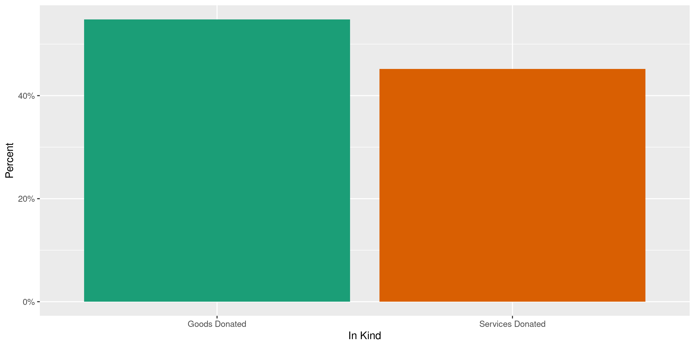
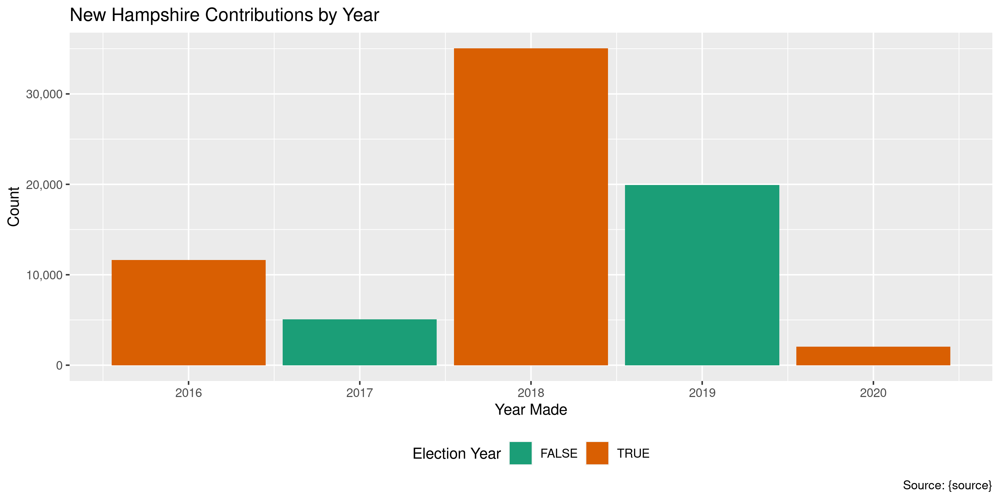

New Hampshire Contributions
================
Kiernan Nicholls
2021-09-22 12:30:40

-   [Project](#project)
-   [Objectives](#objectives)
-   [Packages](#packages)
-   [Data](#data)
-   [Download](#download)
-   [Read](#read)
-   [Explore](#explore)
    -   [Missing](#missing)
    -   [Duplicates](#duplicates)
    -   [Categorical](#categorical)
    -   [Amounts](#amounts)
    -   [Dates](#dates)
-   [Wrangle](#wrangle)
    -   [Address](#address)
    -   [ZIP](#zip)
    -   [State](#state)
    -   [City](#city)
-   [Conclude](#conclude)
-   [Export](#export)
-   [Dictionary](#dictionary)

<!-- Place comments regarding knitting here -->

## Project

The Accountability Project is an effort to cut across data silos and
give journalists, policy professionals, activists, and the public at
large a simple way to search across huge volumes of public data about
people and organizations.

Our goal is to standardizing public data on a few key fields by thinking
of each dataset row as a transaction. For each transaction there should
be (at least) 3 variables:

1.  All **parties** to a transaction.
2.  The **date** of the transaction.
3.  The **amount** of money involved.

## Objectives

This document describes the process used to complete the following
objectives:

1.  How many records are in the database?
2.  Check for entirely duplicated records.
3.  Check ranges of continuous variables.
4.  Is there anything blank or missing?
5.  Check for consistency issues.
6.  Create a five-digit ZIP Code called `zip`.
7.  Create a `year` field from the transaction date.
8.  Make sure there is data on both parties to a transaction.

## Packages

The following packages are needed to collect, manipulate, visualize,
analyze, and communicate these results. The `pacman` package will
facilitate their installation and attachment.

The IRW’s `campfin` package will also have to be installed from GitHub.
This package contains functions custom made to help facilitate the
processing of campaign finance data.

``` r
if (!require("pacman")) install.packages("pacman")
pacman::p_load_gh("irworkshop/campfin")
pacman::p_load(
  tidyverse, # data manipulation
  lubridate, # datetime strings
  gluedown, # printing markdown
  magrittr, # pipe operators
  janitor, # clean data frames
  refinr, # cluster and merge
  scales, # format strings
  knitr, # knit documents
  vroom, # read files fast
  rvest, # html scraping
  glue, # combine strings
  here, # relative paths
  httr, # http requests
  fs # local storage 
)
```

This document should be run as part of the `R_campfin` project, which
lives as a sub-directory of the more general, language-agnostic
[`irworkshop/accountability_datacleaning`](https://github.com/irworkshop/accountability_datacleaning)
GitHub repository.

The `R_campfin` project uses the [RStudio
projects](https://support.rstudio.com/hc/en-us/articles/200526207-Using-Projects)
feature and should be run as such. The project also uses the dynamic
`here::here()` tool for file paths relative to *your* machine.

``` r
# where does this document knit?
here::here()
#> [1] "/home/kiernan/Documents/accountability_datacleaning/R_tap"
```

## Data

Contribution data can be obtained from the New Hampshire Secreyary of
State’s [Campaign Finance System](https://cfs.sos.nh.gov/). Each record
represents a single monetary contribution or correction reported by the
recieving committee or candidate.

Importantly, it seems as though not all contributions can be obtained
from this online portal:

> NOTE: Use of the CFS is not mandatory; therefor, reports filed by
> candidates and committees who have not registered and filed on the CFS
> are not searchable. You may; however, search the “reports” and view
> them in pdf format.

## Download

To download the file, we will have to run an empty search on the CFS
search portal for all contributions from 2000 to 2021-09-22. This can be
done manually or with the an `httr::POST()` (provided you have the right
cookies).

> Search for receipts reported on all campaign finance reports filed
> with the Secretary of State, who have registered and filed their
> reports using the Campaign Finance System (CFS).

> Search results are returned in a grid view and can be sorted within
> each column by using the arrow at the top of the column or exported to
> your local computer in Excel or CSV format, by clicking on the
> appropriate button in the lower right hand corner of the grid.

``` r
raw_dir <- dir_create(here("nh", "contribs", "data", "raw"))
raw_csv <- path(raw_dir, "ViewContributionsList.csv")
raw_yes <- !file_exists(raw_csv)
```

``` r
nh_home <- GET("https://cfs.sos.nh.gov/Public/ReceiptsList")
nh_cookie <- cookies(nh_home)
nh_cookie <- setNames(nh_cookie$value, nh_cookie$name)
```

``` r
if (!file_exists(raw_csv)) {
  nh_post <- POST(
    url = "https://cfs.sos.nh.gov/Public/ViewReceipts",
    set_cookies(nh_cookie),
    query = list(
      ContributorType = "",
      ContributionType = "",
      ContributorName = "",
      FirstName = "",
      Employer = "",
      FilingPeriodName = "",
      OccupationTitle = "",
      GabId = "",
      OfficeTypeCode = "",
      DistrictID = "",
      OfficeID = "",
      StartDate = "1/1/2000",
      EndDate = format(Sys.Date(), "%m/%d/%Y"),
      AmountRangeFrom = "",
      AmountRangeTo = "",
      OutOfState = "on",
      MemberId = "",
      PageIndex = "1",
      Election = "",
      AggAmountRangeFrom = "",
      CFID = "",
      AggAmountRangeTo = ""
    )
  )
  nh_get <- GET(
    url = "https://cfs.sos.nh.gov/Public/ViewContributionsList",
    query = list(hgridex = 5),
    write_disk(raw_csv, overwrite = TRUE),
    progress(type = "down"),
    set_cookies(nh_cookie)
  )
}
```

## Read

There are a handful of issues with the raw text file which can be fixed
using regular expressions.

``` r
# read lines as vector
nhl <- read_lines(raw_csv)
# remove trailing comma from every line
nhl <- str_remove(nhl, ",$")
# add empty field for some ID at start
no_id <- str_starts(nhl, "\\d{1,2}/\\d{1,2}/\\d{4}")
nhl[no_id] <- str_replace(nhl[no_id], "^(.*)?$", ",\\1")
# save to temp file
fix_csv <- file_temp(ext = "csv")
nhl[length(nhl)] <- paste0(nhl[length(nhl)], ",,,,,")
write_lines(na.omit(nhl), fix_csv)
```

Then this fixed temp file can be read and parsed into R.

``` r
# 169,767 rows from search
nhc <- read_delim(
  file = fix_csv,
  delim = ",",
  escape_backslash = FALSE,
  escape_double = FALSE,
  na = c("", "na", "NA", "N/A"),
  col_types = cols(
    .default = col_character(),
    `Transaction Date` = col_date("%m/%d/%Y %H:%M:%S %p"),
    `Amount` = col_double(),
    `Reporting Period` = col_date("%m/%d/%Y %H:%M:%S %p"),
    `Total Contribution Amount` = col_double()
  )
)
```

For convenience, the column names will be shorted and converted to snake
case.

``` r
raw_names <- names(nhc)
nhc <- clean_names(nhc, case = "snake")
```

We can also remove all excess white space from character variables.

``` r
nhc <- mutate(nhc, across(where(is.character), str_squish))
```

## Explore

``` r
glimpse(nhc)
#> Rows: 169,767
#> Columns: 20
#> $ cf_id                     <chr> "05005791", "03004342", "03004342", "03004342", "05000248", "05…
#> $ transaction_date          <date> 2020-09-30, 2020-11-05, 2020-11-05, 2020-11-05, 2020-11-06, 20…
#> $ contributor_type          <chr> "Individual", "Total of Contributions $25.00 or less", "Total o…
#> $ contributor_name          <chr> "Decoster, Tom", "UnItemized", "UnItemized", "CRAIG, WILLIAM", …
#> $ contributor_address       <chr> "Water's Edge, Greenland, NH 03840", "UnItemized", "UnItemized"…
#> $ receiving_registrant      <chr> "Greenland Republican Town Committee", "EversourcePAC-NH", "Eve…
#> $ receiving_registrant_type <chr> "Political Advocacy Organization", "Political Committee", "Poli…
#> $ office                    <chr> NA, NA, NA, NA, NA, NA, NA, NA, NA, NA, NA, NA, NA, NA, "State …
#> $ county                    <chr> NA, NA, NA, NA, NA, NA, NA, NA, NA, NA, NA, NA, NA, NA, NA, NA,…
#> $ election_cycle            <chr> "2022 Election Cycle", "2022 Election Cycle", "2022 Election Cy…
#> $ reporting_period          <date> 2021-06-02, 2021-06-02, 2021-06-02, 2021-06-02, 2021-06-02, 20…
#> $ contribution_type         <chr> "Monetary", "Contribution Count # :1", "Contribution Count # :1…
#> $ amount                    <dbl> 150.00, 16.78, 2.00, 12.02, 1.00, 25.00, 8.00, 26.00, 50.00, 8.…
#> $ total_contribution_amount <dbl> 150.00, 16.78, 2.00, 181.74, 29.00, 25.00, 60.00, 188.50, 135.0…
#> $ comments                  <chr> NA, NA, NA, NA, NA, "anedot", NA, NA, "anedot", NA, NA, "anedot…
#> $ in_kind_sub_category      <chr> NA, NA, NA, NA, NA, NA, NA, NA, NA, NA, NA, NA, NA, NA, NA, NA,…
#> $ town_city                 <chr> NA, NA, NA, NA, NA, NA, NA, NA, NA, NA, NA, NA, NA, NA, NA, NA,…
#> $ town_state                <chr> NA, NA, NA, NA, NA, NA, NA, NA, NA, NA, NA, NA, NA, NA, NA, NA,…
#> $ occupation                <chr> "Retired", "DIRECTOR-GOVERNMENTAL AFFAIRS", NA, "SPECIALIST, CO…
#> $ employer_name             <chr> NA, "EVERSOURCE ENERGY SERVICE CO", NA, "Eversource Energy Serv…
tail(nhc)
#> # A tibble: 6 × 20
#>   cf_id    transaction_date contributor_type  contributor_name   contributor_addr… receiving_regis…
#>   <chr>    <date>           <chr>             <chr>              <chr>             <chr>           
#> 1 05000043 2016-11-04       Individual        Haas, Thomas       PO Box 21948, Po… New Hampshire J…
#> 2 01000639 2016-11-05       Business/Group/O… Planned Parenthoo… 18 Low Ave, Conc… Tilton, Roger   
#> 3 09000006 2016-11-06       Total of Contrib… UnItemized         UnItemized        Volinsky for Ex…
#> 4 <NA>     2016-11-07       Individual        Griffin, Mary      4 Wynridge Rd., … Friends of Regi…
#> 5 09000006 2016-11-07       Total of Contrib… UnItemized         UnItemized        Volinsky for Ex…
#> 6 09000006 2016-11-08       Total of Contrib… UnItemized         UnItemized        Volinsky for Ex…
#> # … with 14 more variables: receiving_registrant_type <chr>, office <chr>, county <chr>,
#> #   election_cycle <chr>, reporting_period <date>, contribution_type <chr>, amount <dbl>,
#> #   total_contribution_amount <dbl>, comments <chr>, in_kind_sub_category <chr>, town_city <chr>,
#> #   town_state <chr>, occupation <chr>, employer_name <chr>
```

### Missing

``` r
col_stats(nhc, count_na)
#> # A tibble: 20 × 4
#>    col                       class       n         p
#>    <chr>                     <chr>   <int>     <dbl>
#>  1 cf_id                     <chr>    3664 0.0216   
#>  2 transaction_date          <date>      0 0        
#>  3 contributor_type          <chr>       0 0        
#>  4 contributor_name          <chr>       3 0.0000177
#>  5 contributor_address       <chr>    5165 0.0304   
#>  6 receiving_registrant      <chr>       0 0        
#>  7 receiving_registrant_type <chr>       0 0        
#>  8 office                    <chr>  120221 0.708    
#>  9 county                    <chr>  154811 0.912    
#> 10 election_cycle            <chr>       0 0        
#> 11 reporting_period          <date>      0 0        
#> 12 contribution_type         <chr>       0 0        
#> 13 amount                    <dbl>       0 0        
#> 14 total_contribution_amount <dbl>       0 0        
#> 15 comments                  <chr>  157428 0.927    
#> 16 in_kind_sub_category      <chr>  169088 0.996    
#> 17 town_city                 <chr>  169323 0.997    
#> 18 town_state                <chr>  169323 0.997    
#> 19 occupation                <chr>   65296 0.385    
#> 20 employer_name             <chr>   68342 0.403
```

*Very* few records are missing a name, date, or amount.

``` r
key_vars <- c(
  "transaction_date", "contributor_name",
  "amount", "receiving_registrant"
)
nhc <- flag_na(nhc, all_of(key_vars))
sum(nhc$na_flag)
#> [1] 3
```

``` r
nhc %>% 
  filter(na_flag) %>% 
  select(all_of(key_vars))
#> # A tibble: 3 × 4
#>   transaction_date contributor_name amount receiving_registrant               
#>   <date>           <chr>             <dbl> <chr>                              
#> 1 2019-05-29       <NA>                150 New Hampshire Young Republicans PAC
#> 2 2020-08-12       <NA>               1000 William Bolton for Senate          
#> 3 2018-09-24       <NA>                 60 Abbott, Betty Ann
```

### Duplicates

There are however a large number of duplicate records. We can flag every
record that has duplicate values across every column.

``` r
nhc <- flag_dupes(nhc, everything())
percent(mean(nhc$dupe_flag), 0.01)
#> [1] "26.96%"
```

``` r
nhc %>% 
  filter(dupe_flag) %>% 
  select(all_of(key_vars)) %>% 
  arrange(transaction_date, contributor_name)
#> # A tibble: 45,768 × 4
#>    transaction_date contributor_name amount receiving_registrant              
#>    <date>           <chr>             <dbl> <chr>                             
#>  1 2015-01-12       Dion                 20 REALTOR Political Action Committee
#>  2 2015-01-12       Dion                 20 REALTOR Political Action Committee
#>  3 2015-01-15       Bean                 20 REALTOR Political Action Committee
#>  4 2015-01-15       Bean                 20 REALTOR Political Action Committee
#>  5 2015-01-15       Cox                  25 REALTOR Political Action Committee
#>  6 2015-01-15       Cox                  25 REALTOR Political Action Committee
#>  7 2015-01-15       Elliott              25 REALTOR Political Action Committee
#>  8 2015-01-15       Elliott              25 REALTOR Political Action Committee
#>  9 2015-01-15       Loynd                25 REALTOR Political Action Committee
#> 10 2015-01-15       Loynd                25 REALTOR Political Action Committee
#> # … with 45,758 more rows
```

If we count the contributor and recipient names, we see most of these
duplicates are unitemized contributions handled through a PAC or service
like ActBlue.

``` r
nhc %>% 
  filter(dupe_flag) %>% 
  count(contributor_name, receiving_registrant, sort = TRUE) %>% 
  mutate(p = n/sum(n))
#> # A tibble: 1,430 × 4
#>    contributor_name receiving_registrant                              n      p
#>    <chr>            <chr>                                         <int>  <dbl>
#>  1 Unitemized       DLCC New Hampshire                            11676 0.255 
#>  2 Unitemized       End Citizens United Non-Federal New Hampshire  4692 0.103 
#>  3 UnItemized       EversourcePAC-NH                               4413 0.0964
#>  4 Unitemized       Volinsky for NH                                4133 0.0903
#>  5 UnItemized       DLCC New Hampshire                             3615 0.0790
#>  6 UnItemized       REALTOR Political Action Committee             3391 0.0741
#>  7 UnItemized       Volinsky for NH                                1328 0.0290
#>  8 UnItemized       ActBlue New Hampshire                          1226 0.0268
#>  9 UnItemized       Opportunity & Renewal PAC Blue Wave            1151 0.0251
#> 10 UnItemized       Volinsky for Executive Council                 1135 0.0248
#> # … with 1,420 more rows
```

### Categorical

``` r
col_stats(nhc, n_distinct)
#> # A tibble: 22 × 4
#>    col                       class      n         p
#>    <chr>                     <chr>  <int>     <dbl>
#>  1 cf_id                     <chr>    721 0.00425  
#>  2 transaction_date          <date>  2047 0.0121   
#>  3 contributor_type          <chr>      7 0.0000412
#>  4 contributor_name          <chr>  46352 0.273    
#>  5 contributor_address       <chr>  49459 0.291    
#>  6 receiving_registrant      <chr>    733 0.00432  
#>  7 receiving_registrant_type <chr>      4 0.0000236
#>  8 office                    <chr>     80 0.000471 
#>  9 county                    <chr>     11 0.0000648
#> 10 election_cycle            <chr>     14 0.0000825
#> 11 reporting_period          <date>    68 0.000401 
#> 12 contribution_type         <chr>      4 0.0000236
#> 13 amount                    <dbl>   2285 0.0135   
#> 14 total_contribution_amount <dbl>   2545 0.0150   
#> 15 comments                  <chr>   3868 0.0228   
#> 16 in_kind_sub_category      <chr>      3 0.0000177
#> 17 town_city                 <chr>     89 0.000524 
#> 18 town_state                <chr>      2 0.0000118
#> 19 occupation                <chr>   7950 0.0468   
#> 20 employer_name             <chr>  17493 0.103    
#> 21 na_flag                   <lgl>      2 0.0000118
#> 22 dupe_flag                 <lgl>      2 0.0000118
```

``` r
explore_plot(nhc, contributor_type) + scale_x_wrap()
```

<!-- -->

``` r
explore_plot(nhc, receiving_registrant_type) + scale_x_wrap()
```

<!-- -->

``` r
explore_plot(nhc, election_cycle, nbar = 5) + scale_x_wrap()
```

<!-- -->

``` r
explore_plot(nhc, contribution_type) + scale_x_wrap()
```

<!-- -->

``` r
explore_plot(nhc, in_kind_sub_category) + scale_x_wrap()
```

<!-- -->

### Amounts

``` r
summary(nhc$amount)
#>      Min.   1st Qu.    Median      Mean   3rd Qu.      Max. 
#>       0.0       8.0      25.0     228.5     100.0 2500000.0
sum(nhc$amount <= 0.01)
#> [1] 8
```

<!-- -->

### Dates

We can add the calendar year from `transaction_date` with
`lubridate::year()`

``` r
nhc <- mutate(nhc, transaction_year = year(transaction_date))
```

``` r
min(nhc$transaction_date)
#> [1] "2008-02-07"
sum(nhc$transaction_year < 2000)
#> [1] 0
max(nhc$transaction_date)
#> [1] "2021-09-07"
sum(nhc$transaction_date > today())
#> [1] 0
```

<!-- -->

## Wrangle

To improve the searchability of the database, we will perform some
consistent, confident string normalization. For geographic variables
like city names and ZIP codes, the corresponding `campfin::normal_*()`
functions are tailor made to facilitate this process.

First, we notice that the vast majority of the existing `town_city` and
`town_state` variables are missing.

``` r
prop_na(nhc$town_city)
#> [1] 0.9973847
prop_na(nhc$town_state)
#> [1] 0.9973847
nhc %>% 
  select(contributor_address, town_city, town_state) %>% 
  filter(!is.na(town_city) & !is.na(town_state))
#> # A tibble: 444 × 3
#>    contributor_address                               town_city  town_state
#>    <chr>                                             <chr>      <chr>     
#>  1 UnItemized                                        Windham    NH        
#>  2 14 JO ELLEN DR, Merrimack, NH 03054               Merrimack  NH        
#>  3 14 JO ELLEN DR, Merrimack, NH 03054               Merrimack  NH        
#>  4 263 Rockland Street, Apt 24, Portsmouth, TN 38041 Portsmouth NH        
#>  5 25 Garmon Street, Manchester, NH 03104            Manchester NH        
#>  6 59 Abbott Ave., Bath, NH 03740                    Bath       NH        
#>  7 UnItemized                                        Conway     NH        
#>  8 156 Park Place, Milton, NH 03851                  Milton     NH        
#>  9 91 Goboro Rd, Epsom, NH 03234-4102                Epsom      NH        
#> 10 243 Mountain Dr, Gilford, NH 03249                Gilford    NH        
#> # … with 434 more rows
```

However, the city and state values are present in the full contributor
address line, which can be split into it’s components with
`tidyr::separate()`.

``` r
nhc <- nhc %>% 
  mutate(across(contributor_address, na_in, c("UnItemized", "Unitemized"))) %>% 
  separate(
    col = contributor_address,
    into = c(glue("addr{1:10}"), "city_sep", "state_zip"),
    sep = "\\s?,\\s",
    remove = FALSE,
    fill = "left",
    extra = "merge"
  ) %>% 
  unite(
    starts_with("addr"),
    col = addr_sep,
    sep = " ",
    remove = TRUE,
    na.rm = TRUE
  ) %>% 
  mutate(across(addr_sep, na_if, "")) %>% 
  separate(
    col = state_zip,
    into = c("state_sep", "zip_sep"),
    sep = "\\s(?=\\d)",
    remove = TRUE
  ) %>% 
  mutate(
    city_sep = coalesce(city_sep, town_city),
    state_sep = coalesce(state_sep, town_state)
  ) %>% 
  relocate(ends_with("_sep"), .after = last_col())
```

``` r
nhc %>% 
  select(contributor_address, ends_with("_sep")) %>% 
  filter(!is.na(contributor_address)) %>% 
  sample_n(10)
#> # A tibble: 10 × 5
#>    contributor_address                       addr_sep               city_sep   state_sep zip_sep   
#>    <chr>                                     <chr>                  <chr>      <chr>     <chr>     
#>  1 4033 S G St, Tacoma, WA 98418-6638        4033 S G St            Tacoma     WA        98418-6638
#>  2 130 Argilla Rd, Ipswich, MA 01938         130 Argilla Rd         Ipswich    MA        01938     
#>  3 147 West Haven Road, Manchester, NH 03104 147 West Haven Road    Manchester NH        03104     
#>  4 90 River Rd., Manchester, NH 03104        90 River Rd.           Manchester NH        03104     
#>  5 9 Denise St., Portsmouth, NH 03801        9 Denise St.           Portsmouth NH        03801     
#>  6 18 Quincy Dr, Bedford, NH 03110           18 Quincy Dr           Bedford    NH        03110     
#>  7 PO Box 299, Plymouth, NH 03264            PO Box 299             Plymouth   NH        03264     
#>  8 10 Old Ox Rd, Rochester, NH 03868         10 Old Ox Rd           Rochester  NH        03868     
#>  9 50 Brookside Dr Apt L1, Exeter, NH 03833  50 Brookside Dr Apt L1 Exeter     NH        03833     
#> 10 191 Maclean Rd, Alstead, NH 03227         191 Maclean Rd         Alstead    NH        03227
```

### Address

For the street `addresss` variable, the `campfin::normal_address()`
function will force consistence case, remove punctuation, and abbreviate
official USPS suffixes.

``` r
nhc <- nhc %>% 
  mutate(
    addr_norm = normal_address(
      address = addr_sep,
      abbs = usps_street,
      na_rep = TRUE
    )
  )
```

``` r
nhc %>% 
  select(starts_with("addr_")) %>% 
  distinct() %>% 
  sample_n(10)
#> # A tibble: 10 × 2
#>    addr_sep               addr_norm            
#>    <chr>                  <chr>                
#>  1 927 Terrace 49         927 TERRACE 49       
#>  2 30 Sycamore Ave        30 SYCAMORE AVE      
#>  3 415 Broad St           415 BROAD ST         
#>  4 16609 HIGHWAY 13       16609 HIGHWAY 13     
#>  5 1656 Monroe St NW      1656 MONROE ST NW    
#>  6 4459 Rayfield Dr.      4459 RAYFIELD DR     
#>  7 1599 Rancho View Drive 1599 RANCHO VIEW DR  
#>  8 6 Gordon Farm Road     6 GORDON FARM RD     
#>  9 1776 900th St.         1776 900TH ST        
#> 10 25 Eastern Parkway 5C  25 EASTERN PARKWAY 5C
```

### ZIP

For ZIP codes, the `campfin::normal_zip()` function will attempt to
create valid *five* digit codes by removing the ZIP+4 suffix and
returning leading zeroes dropped by other programs like Microsoft Excel.

``` r
nhc <- nhc %>% 
  mutate(
    zip_norm = normal_zip(
      zip = zip_sep,
      na_rep = TRUE
    )
  )
```

``` r
progress_table(
  nhc$zip_sep,
  nhc$zip_norm,
  compare = valid_zip
)
#> # A tibble: 2 × 6
#>   stage        prop_in n_distinct prop_na n_out n_diff
#>   <chr>          <dbl>      <dbl>   <dbl> <dbl>  <dbl>
#> 1 nhc$zip_sep    0.805      13022   0.266 24267   6230
#> 2 nhc$zip_norm   0.993       7641   0.266   875    158
```

### State

Valid two digit state abbreviations can be made using the
`campfin::normal_state()` function.

``` r
nhc <- nhc %>% 
  mutate(
    state_norm = normal_state(
      state = state_sep,
      abbreviate = TRUE,
      na_rep = TRUE,
      valid = valid_state
    )
  )
```

``` r
nhc %>% 
  filter(state_sep != state_norm) %>% 
  count(state_sep, state_norm, sort = TRUE)
#> # A tibble: 3 × 3
#>   state_sep state_norm     n
#>   <chr>     <chr>      <int>
#> 1 ma        MA             1
#> 2 md        MD             1
#> 3 nh        NH             1
```

``` r
progress_table(
  nhc$state_sep,
  nhc$state_norm,
  compare = valid_state
)
#> # A tibble: 2 × 6
#>   stage          prop_in n_distinct prop_na n_out n_diff
#>   <chr>            <dbl>      <dbl>   <dbl> <dbl>  <dbl>
#> 1 nhc$state_sep     1.00         57   0.266     3      4
#> 2 nhc$state_norm    1            54   0.266     0      1
```

### City

Cities are the most difficult geographic variable to normalize, simply
due to the wide variety of valid cities and formats.

#### Normal

The `campfin::normal_city()` function is a good start, again converting
case, removing punctuation, but *expanding* USPS abbreviations. We can
also remove `invalid_city` values.

``` r
norm_city <- nhc %>% 
  distinct(city_sep, state_norm, zip_norm) %>% 
  mutate(
    city_norm = normal_city(
      city = city_sep, 
      abbs = usps_city,
      states = c("NH", "DC", "NEW HAMPSHIRE"),
      na = invalid_city,
      na_rep = TRUE
    )
  )
```

#### Swap

We can further improve normalization by comparing our normalized value
against the *expected* value for that record’s state abbreviation and
ZIP code. If the normalized value is either an abbreviation for or very
similar to the expected value, we can confidently swap those two.

``` r
norm_city <- norm_city %>% 
  left_join(
    y = zipcodes,
    by = c(
      "state_norm" = "state",
      "zip_norm" = "zip"
    )
  ) %>% 
  rename(city_match = city) %>% 
  mutate(
    match_abb = is_abbrev(city_norm, city_match),
    match_dist = str_dist(city_norm, city_match),
    city_swap = if_else(
      condition = !is.na(match_dist) & (match_abb | match_dist == 1),
      true = city_match,
      false = city_norm
    )
  ) %>% 
  select(
    -city_match,
    -match_dist,
    -match_abb
  )
```

``` r
nhc <- left_join(nhc, norm_city, by = c("city_sep", "zip_norm", "state_norm"))
```

#### Refine

The [OpenRefine](https://openrefine.org/) algorithms can be used to
group similar strings and replace the less common versions with their
most common counterpart. This can greatly reduce inconsistency, but with
low confidence; we will only keep any refined strings that have a valid
city/state/zip combination.

``` r
good_refine <- nhc %>% 
  mutate(
    city_refine = city_swap %>% 
      key_collision_merge() %>% 
      n_gram_merge(numgram = 1)
  ) %>% 
  filter(city_refine != city_swap) %>% 
  inner_join(
    y = zipcodes,
    by = c(
      "city_refine" = "city",
      "state_norm" = "state",
      "zip_norm" = "zip"
    )
  )
```

    #> # A tibble: 18 × 5
    #>    state_norm zip_norm city_swap         city_refine       n
    #>    <chr>      <chr>    <chr>             <chr>         <int>
    #>  1 NH         03810    AALTON BAYLTON    ALTON BAY        12
    #>  2 NH         03104    ST MANCHESTER     MANCHESTER       10
    #>  3 NH         03031    AMEREHRST         AMHERST           3
    #>  4 NY         11733    SETAUKET          EAST SETAUKET     2
    #>  5 OH         45209    CINCINATTI        CINCINNATI        2
    #>  6 VA         22042    CHURCH FALLS      FALLS CHURCH      2
    #>  7 CA         90803    LONG BEACH CA     LONG BEACH        1
    #>  8 CA         91766    PONOMA            POMONA            1
    #>  9 CA         92126    SAN DIEGOAN DIEGO SAN DIEGO         1
    #> 10 ME         04074    SCARBOUROGH       SCARBOROUGH       1
    #> 11 NH         03102    MANHCESTERE       MANCHESTER        1
    #> 12 NH         03278    WARREN            WARNER            1
    #> 13 NH         03458    PETERBOROROUGH    PETERBOROUGH      1
    #> 14 NH         03848    KINGSINGTON       KINGSTON          1
    #> 15 NY         10970    PONOMA            POMONA            1
    #> 16 OH         43231    COLOMUBUS         COLUMBUS          1
    #> 17 TX         78704    AUSTINAUSTIN      AUSTIN            1
    #> 18 WI         53562    MIDELTON          MIDDLETON         1

Then we can join the refined values back to the database.

``` r
nhc <- nhc %>% 
  left_join(good_refine, by = names(.)) %>% 
  mutate(city_refine = coalesce(city_refine, city_swap))
```

#### Progress

| stage                        | prop\_in | n\_distinct | prop\_na | n\_out | n\_diff |
|:-----------------------------|---------:|------------:|---------:|-------:|--------:|
| `str_to_upper(nhc$city_sep)` |    0.984 |        4718 |    0.266 |   2009 |     712 |
| `nhc$city_norm`              |    0.986 |        4589 |    0.266 |   1698 |     565 |
| `nhc$city_swap`              |    0.992 |        4282 |    0.266 |    968 |     234 |
| `nhc$city_refine`            |    0.993 |        4266 |    0.266 |    926 |     218 |

You can see how the percentage of valid values increased with each
stage.

<!-- -->

More importantly, the number of distinct values decreased each stage. We
were able to confidently change many distinct invalid values to their
valid equivalent.

<!-- -->

Before exporting, we can remove the intermediary normalization columns
and rename all added variables with the `_clean` suffix.

``` r
nhc <- nhc %>% 
  select(
    -ends_with("_sep"),
    -city_norm,
    -city_swap,
    city_clean = city_refine
  ) %>% 
  rename_all(~str_replace(., "_norm", "_clean")) %>% 
  rename_all(~str_remove(., "_raw")) %>% 
  relocate(city_clean, state_clean, zip_clean, .after = addr_clean)
```

``` r
glimpse(sample_frac(nhc))
#> Rows: 169,767
#> Columns: 27
#> $ cf_id                     <chr> "05000258", "05000248", "03004468", "03004273", "03004273", "05…
#> $ transaction_date          <date> 2021-02-02, 2019-03-06, 2020-04-22, 2021-05-21, 2018-12-17, 20…
#> $ contributor_type          <chr> "Individual", "Individual", "Individual", "Total of Contributio…
#> $ contributor_name          <chr> "Hauf, Allen", "Allard, Michael", "Kane, Shirley", "UnItemized"…
#> $ contributor_address       <chr> "27 Stacey Circle, Windham, NH 03087", "171 Gould Rd., Weare, N…
#> $ receiving_registrant      <chr> "NH Senate Republicans Political Action Committee", "Profession…
#> $ receiving_registrant_type <chr> "Political Advocacy Organization", "Political Advocacy Organiza…
#> $ office                    <chr> NA, NA, NA, NA, NA, NA, NA, NA, "Executive Council - 2", "State…
#> $ county                    <chr> NA, NA, NA, NA, NA, NA, NA, NA, NA, NA, NA, NA, NA, NA, NA, NA,…
#> $ election_cycle            <chr> "2022 Election Cycle", "2020 Election Cycle", "2020 Election Cy…
#> $ reporting_period          <date> 2021-06-02, 2019-06-05, 2020-06-17, 2021-06-02, 2019-06-05, 20…
#> $ contribution_type         <chr> "Monetary", "Monetary", "Monetary", "Contribution Count # :1", …
#> $ amount                    <dbl> 25, 4, 200, 5, 5, 30, 100, 200, 100, 250, 100, 5, 100, 25, 50, …
#> $ total_contribution_amount <dbl> 125.00, 105.00, 200.00, 5.00, 70.00, 30.00, 100.00, 200.00, 100…
#> $ comments                  <chr> "anedot", NA, NA, NA, NA, NA, NA, NA, NA, "Ck #0984", NA, NA, N…
#> $ in_kind_sub_category      <chr> NA, NA, NA, NA, NA, NA, NA, NA, NA, NA, NA, NA, NA, NA, NA, NA,…
#> $ town_city                 <chr> NA, NA, NA, NA, NA, NA, NA, NA, NA, NA, NA, NA, NA, NA, NA, NA,…
#> $ town_state                <chr> NA, NA, NA, NA, NA, NA, NA, NA, NA, NA, NA, NA, NA, NA, NA, NA,…
#> $ occupation                <chr> "Sales and Marketing Exec.", "Firefighter", "Unemployed", "ATTO…
#> $ employer_name             <chr> "Unified Office", "Manchester", "Unemployed", "BRAGDON, BARON &…
#> $ na_flag                   <lgl> FALSE, FALSE, FALSE, FALSE, FALSE, FALSE, FALSE, FALSE, FALSE, …
#> $ dupe_flag                 <lgl> FALSE, FALSE, FALSE, FALSE, FALSE, FALSE, FALSE, FALSE, FALSE, …
#> $ transaction_year          <dbl> 2021, 2019, 2020, 2021, 2018, 2018, 2018, 2020, 2020, 2017, 202…
#> $ addr_clean                <chr> "27 STACEY CIR", "171 GOULD RD", "603 MOUNTAIN AVE APT BP 126",…
#> $ city_clean                <chr> "WINDHAM", "WEARE", "NEW PROVIDENCE", NA, "NASHUA", "MACON", "C…
#> $ state_clean               <chr> "NH", "NH", "NJ", NA, "NH", "GA", "NC", "NH", "NH", "NH", "CA",…
#> $ zip_clean                 <chr> "03087", "03281", "07974", NA, "03062", "31210", "27517", "0346…
```

## Conclude

1.  There are 169,767 records in the database.
2.  There are 45,768 duplicate records in the database.
3.  The range and distribution of `amount` and `date` seem reasonable.
4.  There are 3 records missing key variables.
5.  Consistency in geographic data has been improved with
    `campfin::normal_*()`.
6.  The 4-digit `year` variable has been created with
    `lubridate::year()`.

## Export

Now the file can be saved on disk for upload to the Accountability
server.

``` r
clean_dir <- dir_create(here("nh", "contribs", "data", "clean"))
clean_path <- path(clean_dir, "nh_contribs_clean.csv")
write_csv(nhc, clean_path, na = "")
file_size(clean_path)
#> 41.1M
```

## Dictionary

The following table describes the variables in our final exported file:

| Column                      | Type        | Definition                                     |
|:----------------------------|:------------|:-----------------------------------------------|
| `cf_id`                     | `character` | Recipient unique ID                            |
| `transaction_date`          | `double`    | Date contribution was made                     |
| `contributor_type`          | `character` | Contributor type                               |
| `contributor_name`          | `character` | Contributor name                               |
| `contributor_address`       | `character` | Contributor full address                       |
| `receiving_registrant`      | `character` | Recipient committee name                       |
| `receiving_registrant_type` | `character` | Recipient type                                 |
| `office`                    | `character` | Recipient office sought                        |
| `county`                    | `character` | Election county                                |
| `election_cycle`            | `character` | Election cycle                                 |
| `reporting_period`          | `double`    | Contribution period reported                   |
| `contribution_type`         | `character` | Contribution method                            |
| `amount`                    | `double`    | Contribution amount or correction              |
| `total_contribution_amount` | `double`    | Total ammount contributor given                |
| `comments`                  | `character` | Contribution comments                          |
| `in_kind_sub_category`      | `character` | Contribution In-Kind category                  |
| `town_city`                 | `character` | Original contributor city                      |
| `town_state`                | `character` | Original contributor state                     |
| `occupation`                | `character` | Contributor occupation                         |
| `employer_name`             | `character` | Contributor employer name                      |
| `na_flag`                   | `logical`   | Flag for missing date, amount, or name         |
| `dupe_flag`                 | `logical`   | Flag for completely duplicated record          |
| `transaction_year`          | `double`    | Calendar year of contribution date             |
| `addr_clean`                | `character` | Separated & normalized combined street address |
| `city_clean`                | `character` | Separated & normalized city name               |
| `state_clean`               | `character` | Separated & normalized state abbreviation      |
| `zip_clean`                 | `character` | Separated & normalized 5-digit ZIP code        |

``` r
write_lines(
  x = c("# New Hampshire Contributions Data Dictionary\n", dict_md),
  path = here("nh", "contribs", "nh_contribs_dict.md"),
)
```
