New Hampshire Expenditures
================
Kiernan Nicholls & Yanqi Xu
2023-04-29 13:25:23

- <a href="#project" id="toc-project">Project</a>
- <a href="#objectives" id="toc-objectives">Objectives</a>
- <a href="#packages" id="toc-packages">Packages</a>
- <a href="#data" id="toc-data">Data</a>
- <a href="#import" id="toc-import">Import</a>
- <a href="#explore" id="toc-explore">Explore</a>
- <a href="#wrangle" id="toc-wrangle">Wrangle</a>
- <a href="#conclude" id="toc-conclude">Conclude</a>
- <a href="#export" id="toc-export">Export</a>

## Project

The Accountability Project is an effort to cut across data silos and
give journalists, policy professionals, activists, and the public at
large a simple way to search across huge volumes of public data about
people and organizations.

Our goal is to standardizing public data on a few key fields by thinking
of each dataset row as a transaction. For each transaction there should
be (at least) 3 variables:

1.  All **parties** to a transaction
2.  The **date** of the transaction
3.  The **amount** of money involved

## Objectives

This document describes the process used to complete the following
objectives:

1.  How many records are in the database?
2.  Check for duplicates
3.  Check ranges
4.  Is there anything blank or missing?
5.  Check for consistency issues
6.  Create a five-digit ZIP Code called `ZIP5`
7.  Create a `YEAR` field from the transaction date
8.  Make sure there is data on both parties to a transaction

## Packages

The following packages are needed to collect, manipulate, visualize,
analyze, and communicate these results. The `pacman` package will
facilitate their installation and attachment.

``` r
if (!require("pacman")) install.packages("pacman")
pacman::p_load_gh("irworkshop/campfin")
pacman::p_load(
  snakecase, # change string case
  RSelenium, # remote browser
  tidyverse, # data manipulation
  lubridate, # datetime strings
  magrittr, # pipe opperators
  janitor, # dataframe clean
  batman, # rep(NA, 8) Batman!
  refinr, # cluster and merge
  scales, # format strings
  knitr, # knit documents
  vroom, # read files fast
  glue, # combine strings
  here, # relative storage
  httr, # http query
  fs # search storage 
)
```

This document should be run as part of the `R_campfin` project, which
lives as a sub-directory of the more general, language-agnostic
[`irworkshop/accountability_datacleaning`](https://github.com/irworkshop/accountability_datacleaning "TAP repo")
GitHub repository.

The `R_campfin` project uses the [RStudio
projects](https://support.rstudio.com/hc/en-us/articles/200526207-Using-Projects "Rproj")
feature and should be run as such. The project also uses the dynamic
`here::here()` tool for file paths relative to *your* machine.

``` r
# where dfs this document knit?
here::here()
#> [1] "/Users/yanqixu/code/accountability_datacleaning"
```

## Data

New Hampshire campaign finance data from before 2016 can only be
ontained in hand-written PDF format. Data from after 2016 can be
obtained from the [NH Campaign Finance System
(CFS)](https://cfs.sos.nh.gov/ "source").

### About

The [CFS FAQ page](https://cfs.sos.nh.gov/Public/FAQ#Expenditures "FAQ")
defines the data we will be downloading:

> RSA 664:2, IX defines “expenditure” as follows: the disbursement of
> money or thing of value or the making of a legally binding commitment
> to make such a disbursement in the future or the transfer of funds by
> a political committee to another political committee or to a candidate
> for the purpose of promoting the success or defeat of a candidate or
> candidates or measure or measures. “Expenditures” includes
> disbursement constituting independent expenditures, as defined in
> paragraph XI. It dos not include: (a) the candidate’s filing fee or
> his/her expenses for personal travel and subsistence; (b) activity
> designed to encourage individuals to register to vote or to vote, if
> that activity or communication does not mention a clearly identified
> candidate; (c) any communication by any membership organization or
> corporation to its members or stockholders, if the primary purpose of
> that membership organization or corporation is not for the purpose of
> promoting the success or defeat of a candidate or candidate and
> measure or measures; or (d) any communication by a political committee
> member that is not made for the purpose of promoting the success or
> defeat of a candidate or candidates or measure or measures.

> **What is an independent expenditure?**  
> RSA 664:2, XI defines “Independent Expenditures” as follows:
> Expenditure that pay for the development and distribution of a
> communication that expressly advocates the election or defeat of a
> clearly identified candidate or candidates or the success or defeat of
> a measure or measures, which are made without cooperation or
> consultation with any candidate, or any authorized committee or agent
> of such candidate, and which are not made in concert with, or at the
> request or suggestion of, any candidates, or any authorized committee
> or agent of such candidate…
>
> **Is there a separate independent expenditure report?**
>
> There is no specific form. The information submitted must be in
> accordance with RSA 664:6, IV-a. Any political committee whose
> independent expenditure, in aggregate, exceeds \$500, shall file an
> itemized statement which shall be received by the Secretary of State
> not later than 48 hours after such expenditure is made. NOTE: In
> addition to this 48 hour notification, the independent expenditure
> will be reported on the next report of receipts and expenditures that
> is due.

## Import

To download the bulk data format, one needs to navigate to the
[Expenditures search page](https://cfs.sos.nh.gov/Public/ExpensesList).
From there, remove “2022 General Election” from the “Election Cycle”
drop down menu. Enter “01/01/2010” in the “Transaction Date Range” input
box. After searching with these parameters, download the file by
clicking the “CSV” button at the bottom of the page. The data was
downloaded on 2023-04-23. The next update should start on 2023-04-24.

We can automate this using the `RSelenium` package.

``` r
raw_dir <- here("state","nh", "expends", "data", "raw")
dir_create(raw_dir)
```

``` r
remote_driver <- rsDriver(
  port = 4444L,
  browser = "firefox",
  extraCapabilities = makeFirefoxProfile(
    list(
      browser.download.dir = raw_dir,
      browser.download.folderList = 2L,
      browser.helperApps.neverAsk.saveToDisk = "text/csv"
    )
  )
)

# navigate to the NH download site
remote_browser <- remote_driver$client
remote_browser$navigate("https://cfs.sos.nh.gov/Public/ExpensesList")

# chose "All" from elections list
cycle_menu <- "/html/body/div[1]/div[3]/table/tbody/tr/td[4]/div[2]/table[1]/tbody/tr[3]/td/table/tbody/tr[6]/td[2]/select/option[1]"
remote_browser$findElement("xpath", cycle_menu)$clickElement()

# enter Jan 1 2008 as start date
remote_browser$findElement("css", "#dtStartDate")$sendKeysToElement(list("01/01/2008"))
remote_browser$findElement("css", "#dtEndDate")$sendKeysToElement(list(format(today(), "%m/%d/%Y")))

# click search button
remote_browser$findElement("css", "#btnSearch")$clickElement()

csv_button <- "td.bgfooter:nth-child(2) > a:nth-child(2)"
remote_browser$findElement("css", csv_button)$clickElement()

# close the browser and driver
remote_browser$close()
remote_driver$server$stop()
```

``` r
x <- read_lines(raw_dir %>% dir_ls())  
x <- str_remove(x,",$")
for (i in rev(seq_along(x))) {
    j <- i - 1
    if (j == 0) {
      next() # skip first
    } else if (str_starts(x[i], "\\d+/\\d+/\\d{4}")) {
      next() # skip if good - starts with a number
    } else { # merge if bad
      x[j] <- str_c(x[j], x[i])
      x <- x[-i] # remove bad
    }
}
```

``` r
fix_dir <- dir_create(path(dirname(raw_dir), "fix"))
fix_path <- glue("{fix_dir}/nh_fix_2023.txt")
```

``` r
x %>% write_lines(fix_path)
message(basename(fix_path))
```

``` r
nh <- 
  read_delim(
    file = fix_path,
    delim = ",",
    #col_names = nh_col_names,
    col_types = cols(
      .default = col_character(),
      `Transaction Date` = col_date("%m/%d/%Y %H:%M:%S %p"),
      `Expenditure Amount` = col_double()
    )
  )
```

``` r
problems(nh) %>% 
  filter(expected != "15 columns") %>% 
  distinct()
```

    #> # A tibble: 7 × 5
    #>     row   col expected                       actual             file                               
    #>   <int> <int> <chr>                          <chr>              <chr>                              
    #> 1 22974     1 date like %m/%d/%Y %H:%M:%S %p "10/13/2020\t1.98" /Users/yanqixu/code/accountability…
    #> 2 22975     1 date like %m/%d/%Y %H:%M:%S %p "10/21/2020\t1.43" /Users/yanqixu/code/accountability…
    #> 3 22976     1 date like %m/%d/%Y %H:%M:%S %p "10/23/2020\t0.8"  /Users/yanqixu/code/accountability…
    #> 4 22977     1 date like %m/%d/%Y %H:%M:%S %p "10/23/2020\t0.6"  /Users/yanqixu/code/accountability…
    #> 5 22978     1 date like %m/%d/%Y %H:%M:%S %p "10/23/2020\t0.8"  /Users/yanqixu/code/accountability…
    #> 6 22979     1 date like %m/%d/%Y %H:%M:%S %p "10/24/2020\t0.4"  /Users/yanqixu/code/accountability…
    #> 7 22980     1 date like %m/%d/%Y %H:%M:%S %p "10/26/2020\t0.4"  /Users/yanqixu/code/accountability…

We will remove completely empty rows, clean names, uppcercase characters
variables, and separate some columns into their true underlying
variables.

``` r
nh <- nh %>%
  remove_empty("rows") %>% 
  clean_names() %>% 
  mutate_if(is_character, str_to_upper) %>% 
  separate(
    col = reporting_period, 
    remove = FALSE,
    into = c("reporting_date", "reporting_type"), 
    sep = "\\s-\\s"
  ) %>% 
  mutate(reporting_date = parse_date(reporting_date, "%m/%d/%Y")) %>% 
  separate(
    col = office,
    remove = FALSE,
    into = c("office_clean", "district_clean"),
    sep = "\\s-\\s",
    convert = TRUE
  )
```

## Explore

There are 47156 records of 19 variables in the full database.

``` r
head(nh)
```

    #> # A tibble: 6 × 19
    #>   transaction…¹ cf_id payee…² payee…³ payee…⁴ regis…⁵ regis…⁶ office offic…⁷ distr…⁸ county elect…⁹
    #>   <date>        <chr> <chr>   <chr>   <chr>   <chr>   <chr>   <chr>  <chr>     <int> <chr>  <chr>  
    #> 1 2023-01-20    0300… INDIVI… "STRAC… PO BOX… NEW LO… POLITI… <NA>   <NA>         NA <NA>   2024 E…
    #> 2 2023-03-01    0300… BUSINE… "ECHO … 59 PLE… NEW LO… POLITI… <NA>   <NA>         NA <NA>   2024 E…
    #> 3 2023-03-04    0300… BUSINE… "ECHO … 59 PLE… NEW LO… POLITI… <NA>   <NA>         NA <NA>   2024 E…
    #> 4 2023-03-04    0300… BUSINE… "INTER… 1719 R… NEW LO… POLITI… <NA>   <NA>         NA <NA>   2024 E…
    #> 5 2023-03-21    0300… INDIVI… "PATTO… 332 BU… NEW LO… POLITI… <NA>   <NA>         NA <NA>   2024 E…
    #> 6 2023-03-21    0300… INDIVI… "SCHMI… 379 BR… NEW LO… POLITI… <NA>   <NA>         NA <NA>   2024 E…
    #> # … with 7 more variables: reporting_period <chr>, reporting_date <date>, reporting_type <chr>,
    #> #   expenditure_type <chr>, expenditure_purpose <chr>, expenditure_amount <dbl>, comments <chr>,
    #> #   and abbreviated variable names ¹​transaction_date, ²​payee_type, ³​payee_name, ⁴​payee_address,
    #> #   ⁵​registrant_name, ⁶​registrant_type, ⁷​office_clean, ⁸​district_clean, ⁹​election_cycle

``` r
tail(nh)
```

    #> # A tibble: 6 × 19
    #>   transaction…¹ cf_id payee…² payee…³ payee…⁴ regis…⁵ regis…⁶ office offic…⁷ distr…⁸ county elect…⁹
    #>   <date>        <chr> <chr>   <chr>   <chr>   <chr>   <chr>   <chr>  <chr>     <int> <chr>  <chr>  
    #> 1 2016-09-12    0300… INDIVI… AMICK,… 260 LE… FRIEND… POLITI… <NA>   <NA>         NA <NA>   2016 E…
    #> 2 2016-09-12    0300… INDIVI… AMICK,… 260 LE… FRIEND… POLITI… <NA>   <NA>         NA <NA>   2016 E…
    #> 3 2016-09-12    0300… BUSINE… JOE DU… 10 CRI… FRIEND… POLITI… <NA>   <NA>         NA <NA>   2016 E…
    #> 4 2016-09-12    <NA>  BUSINE… MARKET… ., BED… SIMMON… CANDID… STATE… STATE …      17 HILLS… 2016 E…
    #> 5 2016-09-12    0100… BUSINE… TALIEN… 105 FA… STEVEN… CANDID… STATE… STATE …      43 HILLS… 2016 E…
    #> 6 2016-09-12    0100… BUSINE… GOOGLE  1600 A… JOSEPH… CANDID… STATE… STATE …      11 GRAFT… 2016 E…
    #> # … with 7 more variables: reporting_period <chr>, reporting_date <date>, reporting_type <chr>,
    #> #   expenditure_type <chr>, expenditure_purpose <chr>, expenditure_amount <dbl>, comments <chr>,
    #> #   and abbreviated variable names ¹​transaction_date, ²​payee_type, ³​payee_name, ⁴​payee_address,
    #> #   ⁵​registrant_name, ⁶​registrant_type, ⁷​office_clean, ⁸​district_clean, ⁹​election_cycle

``` r
glimpse(sample_frac(nh))
```

    #> Rows: 47,156
    #> Columns: 19
    #> $ transaction_date    <date> 2022-08-29, 2018-09-19, 2021-06-13, 2022-07-03, 2020-06-29, 2018-08-…
    #> $ cf_id               <chr> "03005326", "01001150", "03004273", "03004273", NA, NA, "05005908", "…
    #> $ payee_type          <chr> "BUSINESS/GROUP/ORGANIZATION", "BUSINESS/GROUP/ORGANIZATION", "POLITI…
    #> $ payee_name          <chr> "POINT1", "NASHUA DEMOCRATIC CITY CMTE", "HILLSBOROUGH COUNTY DEMOCRA…
    #> $ payee_address       <chr> "1015 ATLANTIC BOULEVARD, #157, ATLANTIC BEACH, FL 32233", "PO BOX 63…
    #> $ registrant_name     <chr> "AMERICANS FOR PROSPERITY - NEW HAMPSHIRE", "PEDERSEN, MICHAEL P", "A…
    #> $ registrant_type     <chr> "POLITICAL COMMITTEE", "CANDIDATE", "POLITICAL COMMITTEE", "POLITICAL…
    #> $ office              <chr> NA, "STATE REPRESENTATIVE - 32", NA, NA, "STATE REPRESENTATIVE - 19",…
    #> $ office_clean        <chr> NA, "STATE REPRESENTATIVE", NA, NA, "STATE REPRESENTATIVE", "STATE RE…
    #> $ district_clean      <int> NA, 32, NA, NA, 19, 1, NA, NA, NA, 23, NA, NA, 40, 8, NA, NA, NA, NA,…
    #> $ county              <chr> NA, "HILLSBOROUGH", NA, NA, "ROCKINGHAM", "SULLIVAN", NA, NA, NA, "HI…
    #> $ election_cycle      <chr> "2022 ELECTION CYCLE", "2018 ELECTION CYCLE", "CHESHIRE DIST. 9 SPECI…
    #> $ reporting_period    <chr> "09/07/2022 - PRIMARY", "10/17/2018 - GENERAL", "08/18/2021 - PRIMARY…
    #> $ reporting_date      <date> 2022-09-07, 2018-10-17, 2021-08-18, 2022-08-24, 2020-09-02, 2018-08-…
    #> $ reporting_type      <chr> "PRIMARY", "GENERAL", "PRIMARY", "PRIMARY", "PRIMARY", "PRIMARY", "PR…
    #> $ expenditure_type    <chr> "INDEPENDENT EXPENDITURE", "MONETARY", "MONETARY", "MONETARY", "MONET…
    #> $ expenditure_purpose <chr> "MEDIA - POSTCARDS", "MEDIA - POSTCARDS", "OTHER", "ACTBLUE FEES", "A…
    #> $ expenditure_amount  <dbl> 297.20, 200.00, 19.21, 201.22, 3.25, 30.00, 500.00, 393.66, 19.50, 50…
    #> $ comments            <chr> "MAILER PRINTING AND PRODUCTION", NA, "POLITICAL CONTRIBUTION", NA, N…

### Distinct

The variables range in their degree of distinctness.

``` r
glimpse_fun(nh, n_distinct)
```

    #> # A tibble: 19 × 4
    #>    col                 type       n         p
    #>    <chr>               <chr>  <dbl>     <dbl>
    #>  1 transaction_date    <date>  2398 0.0509   
    #>  2 cf_id               <chr>    993 0.0211   
    #>  3 payee_type          <chr>      6 0.000127 
    #>  4 payee_name          <chr>   7420 0.157    
    #>  5 payee_address       <chr>   9366 0.199    
    #>  6 registrant_name     <chr>   1026 0.0218   
    #>  7 registrant_type     <chr>      4 0.0000848
    #>  8 office              <chr>     83 0.00176  
    #>  9 office_clean        <chr>     12 0.000254 
    #> 10 district_clean      <int>     46 0.000975 
    #> 11 county              <chr>     11 0.000233 
    #> 12 election_cycle      <chr>     17 0.000361 
    #> 13 reporting_period    <chr>     95 0.00201  
    #> 14 reporting_date      <date>    92 0.00195  
    #> 15 reporting_type      <chr>      3 0.0000636
    #> 16 expenditure_type    <chr>      7 0.000148 
    #> 17 expenditure_purpose <chr>     86 0.00182  
    #> 18 expenditure_amount  <dbl>  12891 0.273    
    #> 19 comments            <chr>   6474 0.137

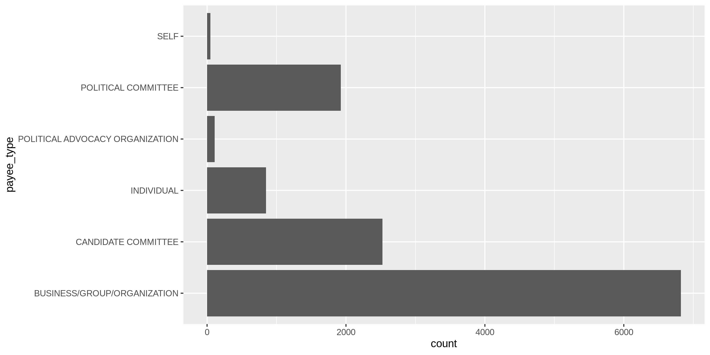<!-- -->

<!-- -->

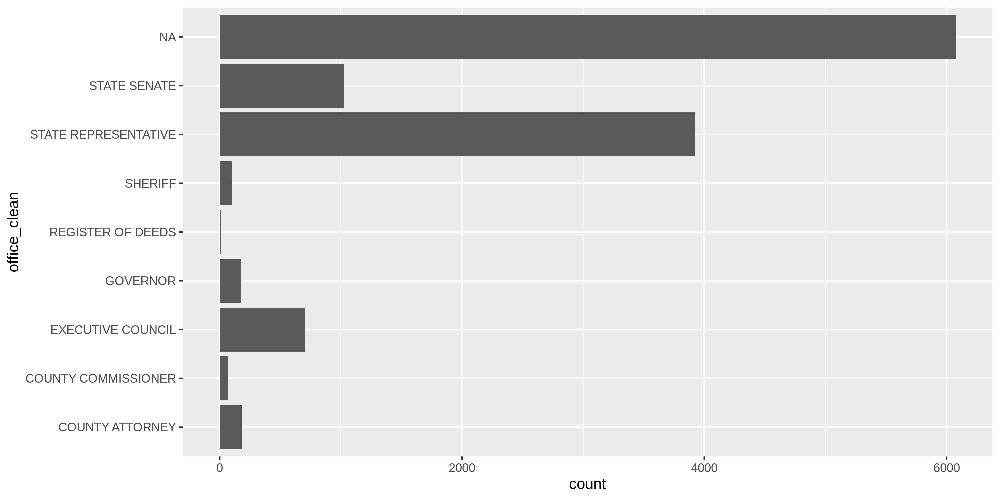<!-- -->

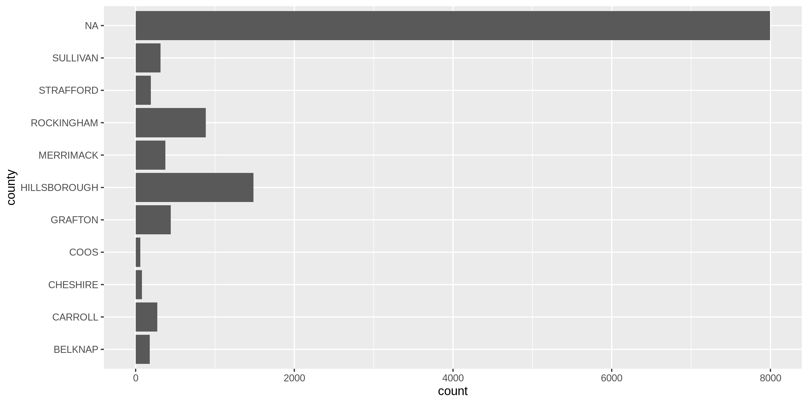<!-- -->

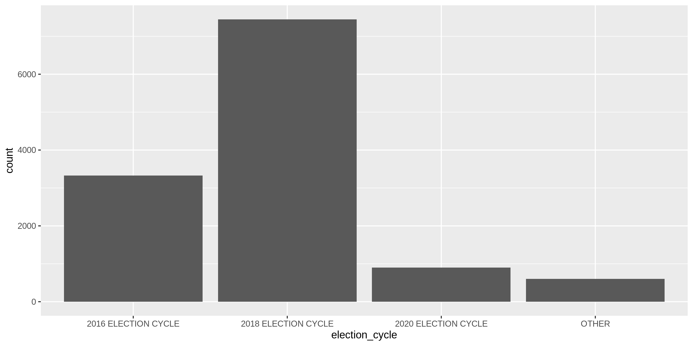<!-- -->

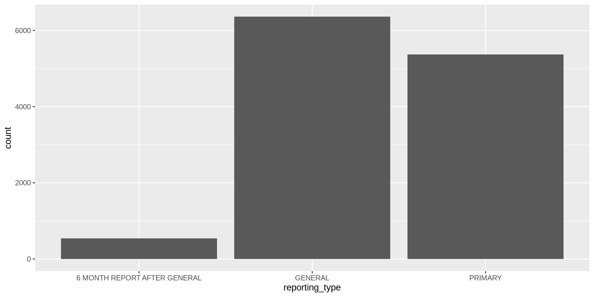<!-- -->

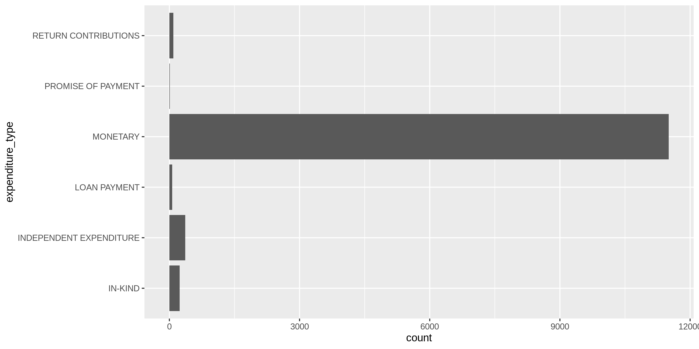<!-- -->

### Missing

The variables also vary in their degree of values that are `NA`
(missing).

``` r
glimpse_fun(nh, count_na)
```

    #> # A tibble: 19 × 4
    #>    col                 type       n       p
    #>    <chr>               <chr>  <dbl>   <dbl>
    #>  1 transaction_date    <date>     0 0      
    #>  2 cf_id               <chr>   3554 0.0754 
    #>  3 payee_type          <chr>      0 0      
    #>  4 payee_name          <chr>    523 0.0111 
    #>  5 payee_address       <chr>      0 0      
    #>  6 registrant_name     <chr>      0 0      
    #>  7 registrant_type     <chr>      0 0      
    #>  8 office              <chr>  25542 0.542  
    #>  9 office_clean        <chr>  25542 0.542  
    #> 10 district_clean      <int>  28232 0.599  
    #> 11 county              <chr>  31771 0.674  
    #> 12 election_cycle      <chr>      0 0      
    #> 13 reporting_period    <chr>      0 0      
    #> 14 reporting_date      <date>     0 0      
    #> 15 reporting_type      <chr>      0 0      
    #> 16 expenditure_type    <chr>     51 0.00108
    #> 17 expenditure_purpose <chr>      0 0      
    #> 18 expenditure_amount  <dbl>      0 0      
    #> 19 comments            <chr>  24856 0.527

We will flag any records with missing values in the key variables used
to identify an expenditure.

``` r
nh <- flag_na(nh, payee_name)
sum(nh$na_flag)
```

    #> [1] 523

### Duplicates

``` r
nh <- flag_dupes(nh, everything())
sum(nh$dupe_flag)
#> [1] 3281
```

### Ranges

#### Amounts

``` r
summary(nh$expenditure_amount)
```

    #>      Min.   1st Qu.    Median      Mean   3rd Qu.      Max. 
    #>       0.0      20.8      96.0    1231.1     377.7 1656456.7

``` r
sum(nh$expenditure_amount <= 0)
```

    #> [1] 0

``` r
nh %>% 
  ggplot(aes(expenditure_amount)) +
  geom_histogram() +
  scale_y_log10() +
  scale_x_continuous(labels = scales::dollar)
```

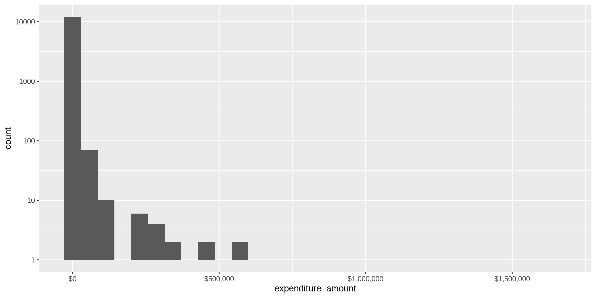<!-- -->

``` r
nh %>% 
  ggplot(aes(payee_type, expenditure_amount)) +
  geom_boxplot(varwidth = TRUE) +
  scale_y_continuous(labels = scales::dollar, trans = "log10") +
  coord_flip()
```

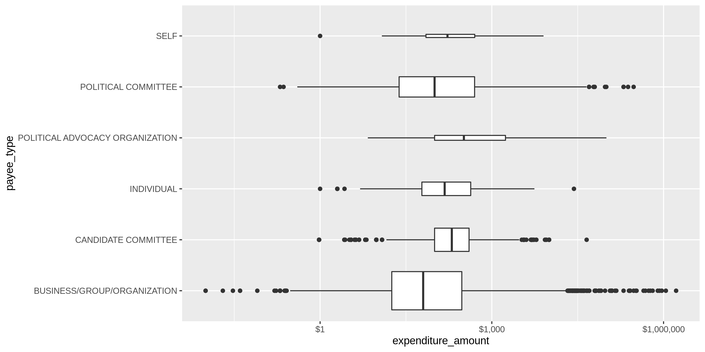<!-- -->

``` r
nh %>% 
  ggplot(aes(registrant_type, expenditure_amount)) +
  geom_boxplot(varwidth = TRUE) +
  scale_y_continuous(labels = scales::dollar, trans = "log10") +
  coord_flip()
```

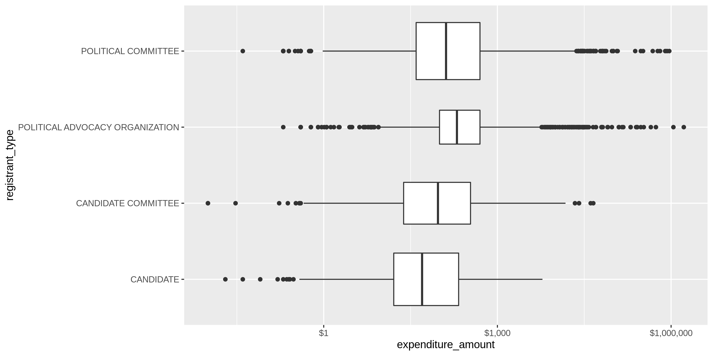<!-- -->

``` r
nh %>% 
  ggplot(aes(expenditure_type, expenditure_amount)) +
  geom_boxplot(varwidth = TRUE) +
  scale_y_continuous(labels = scales::dollar, trans = "log10") +
  coord_flip()
```

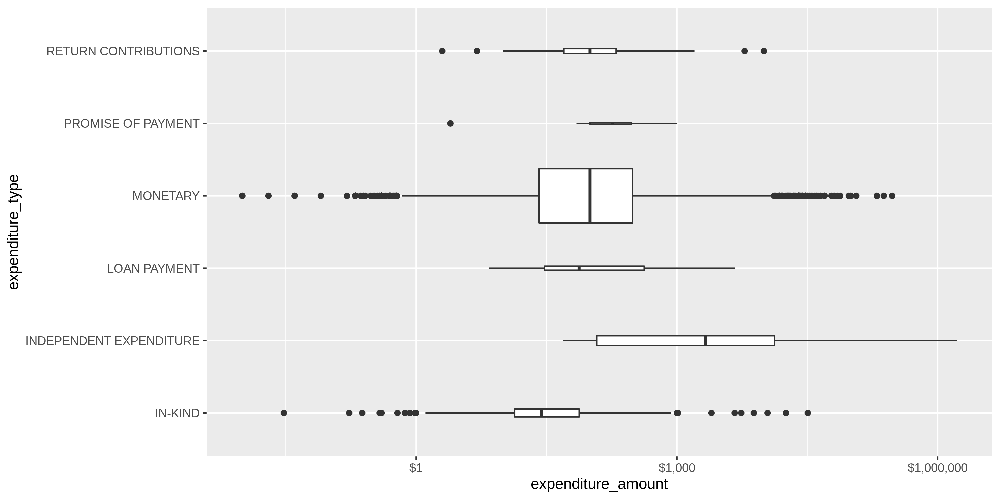<!-- -->

### Dates

``` r
summary(nh$transaction_date)
#>         Min.      1st Qu.       Median         Mean      3rd Qu.         Max. 
#> "2014-06-16" "2019-05-15" "2020-10-16" "2020-09-18" "2022-07-18" "2023-03-21"
sum(nh$transaction_date > today())
#> [1] 0
```

``` r
nh %>% 
  ggplot(aes(year(transaction_date))) +
  geom_bar()
```

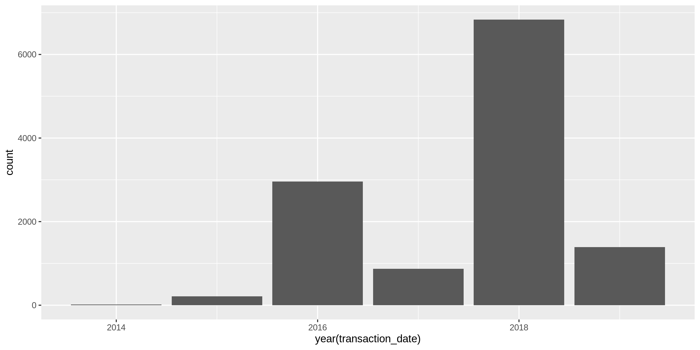<!-- -->

``` r
nh %>% 
  group_by(month = month(transaction_date)) %>% 
  summarise(median_amount = median(expenditure_amount)) %>% 
  ggplot(aes(x = month, y = median_amount)) +
  geom_line(size = 2)
```

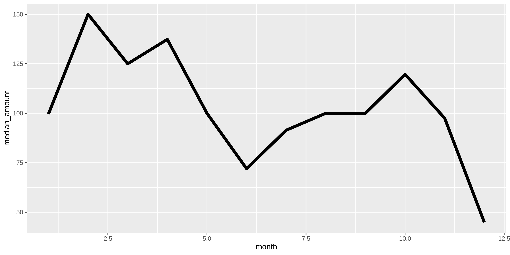<!-- -->

## Wrangle

### Year

Add a `transaction_year` variable from `transaction_date` using
`lubridate::year()`.

``` r
nh <- nh %>% mutate(transaction_year = year(transaction_date))
```

<!-- -->

### Separate

The `payee_address` string contains the street address, city name, state
abbreviation, and ZIP code.

``` r
sample(nh$payee_address, 10) %>% cat(sep = "\n")
```

    #> 13 COLUMBIA DR, AMHERST, NH 03031
    #> P. O. BOX 441146, SOMERVILLE, MA 02144
    #> 76 DOGWOOD CIRCLE, WEST LEBANON, NH 03784
    #> 41 BROAD ST, HOLLIS, NH 03049
    #>  488 TOWN HOUSE RD, CORNISH, NH 03745
    #> 41 NASHUA RD, LONDONDERRY, NH 03053
    #> 127 WHITTEN ROAD, MILFORD, NH 03055
    #> 611 PENNSYLVANIA AVE SE #192, WASHINGTON, DC 20003
    #> 89 HOVEY RD, LONDONDERRY, NH 03053
    #> PORTSMOUTH AVE, STRATHAM, NH 03885

We can use a combination of `tidyr::separate()` and `tidyr::unite()` to
split this address into four distinct columns:

1.  `payee_address_sep`
2.  `payee_city_sep`
3.  `payee_state_sep`
4.  `payee_zip_sep`

``` r
nh <- nh %>% 
  separate(
    col = payee_address,
    into = c(glue("payee_split_address{1:10}"), "payee_city_sep", "payee_state_zip_sep"),
    sep = ",\\s",
    remove = FALSE,
    extra = "merge",
    fill = "left"
  ) %>% 
  unite(
    starts_with("payee_split_address"),
    col = payee_address_sep,
    sep = " ",
    remove = TRUE,
    na.rm = TRUE
  ) %>% 
  separate(
    col = payee_state_zip_sep,
    into = c("payee_state_sep", "payee_zip_sep"),
    sep = "\\s(?=\\d)",
    remove = TRUE,
    convert = FALSE
  )
```

### Address

``` r
nh <- nh %>% 
  mutate(
    payee_address_norm = normal_address(
      address = payee_address_sep,
      abbs = usps_street,
      na_rep = TRUE
    )
  )
```

``` r
nh %>% 
  select(payee_address_sep, payee_address_norm)
```

    #> # A tibble: 47,156 × 2
    #>    payee_address_sep                 payee_address_norm               
    #>    <chr>                             <chr>                            
    #>  1 PO BOX 1125                       PO BOX 1125                      
    #>  2 59 PLEASANT ST,                   59 PLEASANT ST                   
    #>  3 59 PLEASANT ST,                   59 PLEASANT ST                   
    #>  4 1719 RTE 114                      1719 RTE 114                     
    #>  5 332 BURPEE HILL ROAD              332 BURPEE HILL RD               
    #>  6 379 BROOKSIDE DRIVE               379 BROOKSIDE DR                 
    #>  7 366 SUMMER ST SOMERVILLE MA 02144 366 SUMMER ST SOMERVILLE MA 02144
    #>  8 107 NORTH MAIN STREET ROOM 204    107 NORTH MAIN STREET ROOM 204   
    #>  9 29 ANCELL STREET                  29 ANCELL ST                     
    #> 10 1225 I ST NW STE 1250             1225 I ST NW STE 1250            
    #> # … with 47,146 more rows

### ZIP Code

``` r
nh <- nh %>% 
  mutate(
    payee_zip_norm = normal_zip(
      zip = payee_zip_sep,
      na_rep = TRUE
    )
  )
```

``` r
progress_table(
  nh$payee_zip_sep,
  nh$payee_zip_norm,
  compare = valid_zip
)
```

    #> # A tibble: 2 × 6
    #>   stage             prop_in n_distinct prop_na n_out n_diff
    #>   <chr>               <dbl>      <dbl>   <dbl> <dbl>  <dbl>
    #> 1 nh$payee_zip_sep    0.932       1720 0.00414  3204    540
    #> 2 nh$payee_zip_norm   0.991       1304 0.00640   439     86

### State

``` r
nh <- nh %>% 
  mutate(
    payee_state_norm = normal_state(
      state = payee_state_sep,
      abbreviate = TRUE,
      na_rep = TRUE,
      valid = NULL
    )
  )
```

No changes were made.

``` r
progress_table(
  nh$payee_state_sep,
  nh$payee_state_norm,
  compare = valid_state
)
```

    #> # A tibble: 2 × 6
    #>   stage               prop_in n_distinct prop_na n_out n_diff
    #>   <chr>                 <dbl>      <dbl>   <dbl> <dbl>  <dbl>
    #> 1 nh$payee_state_sep    0.997         61       0   144     10
    #> 2 nh$payee_state_norm   0.997         60       0   141      9

### City

``` r
nh <- nh %>% 
  mutate(
    payee_city_norm = normal_city(
      city = payee_city_sep,
      abbs = usps_city,
      states = c("NH", "DC"),
      na_rep = TRUE
    )
  ) %>% 
  left_join(
    y = zipcodes,
    by = c(
      "payee_state_norm" = "state",
      "payee_zip_norm" = "zip"
    )
  ) %>% 
  rename(
    payee_city_match = city
  ) %>% 
  mutate(
    match_abb = is_abbrev(payee_city_norm, payee_city_match),
    match_dist = str_dist(payee_city_norm, payee_city_match),
    payee_city_swap = if_else(
      condition = match_abb | match_dist == 1,
      true = payee_city_match,
      false = payee_city_norm
    )
  )
```

``` r
progress_table(
  nh$payee_city_sep,
  nh$payee_city_norm,
  nh$payee_city_swap,
  compare = valid_city
)
```

    #> # A tibble: 3 × 6
    #>   stage              prop_in n_distinct  prop_na n_out n_diff
    #>   <chr>                <dbl>      <dbl>    <dbl> <dbl>  <dbl>
    #> 1 nh$payee_city_sep    0.956       1171 0         2073    458
    #> 2 nh$payee_city_norm   0.974        985 0.000933  1248    259
    #> 3 nh$payee_city_swap   0.989        787 0.0236     522     71

## Conclude

``` r
min_amount <- scales::dollar(min(nh$expenditure_amount, na.rm = TRUE))
max_amount <- scales::dollar(max(nh$expenditure_amount, na.rm = TRUE))

min_date <- as.character(min(nh$transaction_date, na.rm = TRUE))
max_date <- as.character(max(nh$transaction_date, na.rm = TRUE))
```

1.  There are 47156 records in the database
2.  There are 3281 records with duplicate rows(flagged with `dupe_flag`)
3.  The `expenditure_amount` values range from \$0.01 to \$1,656,457;
    the `transaction_date` values range from 2014-06-16 to 2023-03-21
4.  Consistency has been improved with `stringr` package and custom
    `normalize_*()` functions
5.  The ZIP code and state abbreviation have been extracted fromt the
    `address` variable
6.  The `transaction_year` variable has been created with
    `lubridate::year()`
7.  There are 523 records with missing `payee_name` values

## Export

``` r
dir_proc <- here("state","nh", "expends", "data", "processed")
dir_create(dir_proc)


nh <- nh %>% rename(payee_city_clean = payee_city_swap)

write_csv(
  x = nh,
  path = glue("{dir_proc}/nh_expends_clean.csv"),
  na = ""
)
```
