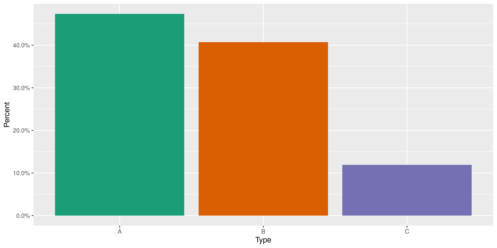
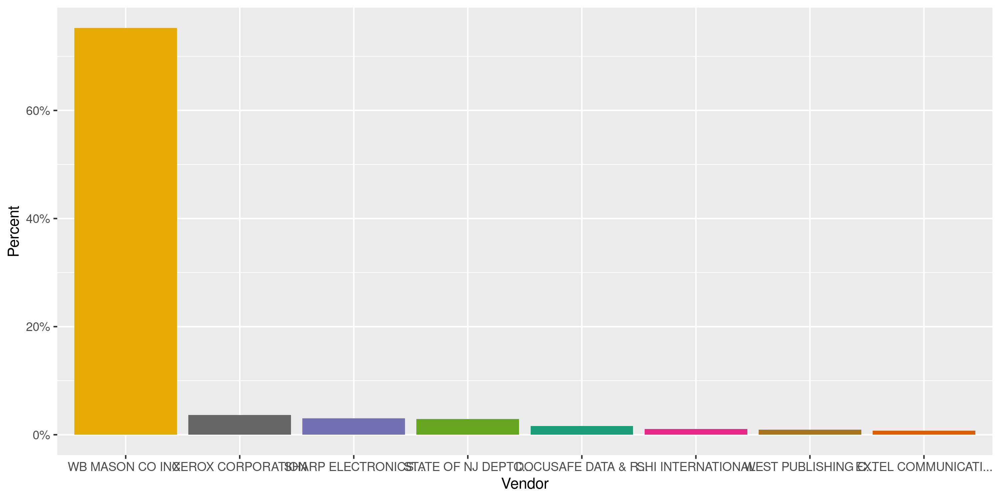
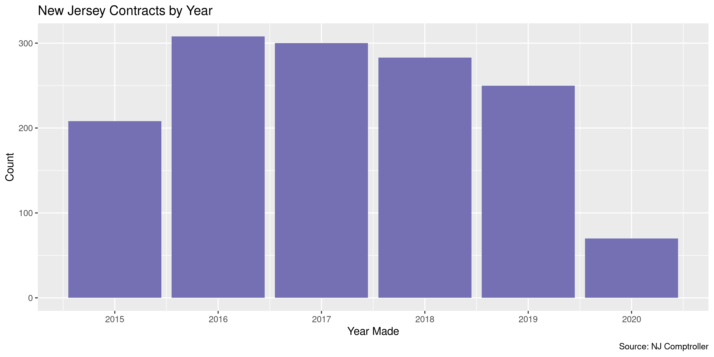

New Jersey Contracts
================
Kiernan Nicholls
2020-06-11 16:24:31

  - [Project](#project)
  - [Objectives](#objectives)
  - [Packages](#packages)
  - [Data](#data)
  - [Download](#download)
  - [Read](#read)
  - [Explore](#explore)
  - [Wrangle](#wrangle)
  - [Conclude](#conclude)
  - [Export](#export)
  - [Upload](#upload)
  - [Dictionary](#dictionary)

<!-- Place comments regarding knitting here -->

## Project

The Accountability Project is an effort to cut across data silos and
give journalists, policy professionals, activists, and the public at
large a simple way to search across huge volumes of public data about
people and organizations.

Our goal is to standardizing public data on a few key fields by thinking
of each dataset row as a transaction. For each transaction there should
be (at least) 3 variables:

1.  All **parties** to a transaction.
2.  The **date** of the transaction.
3.  The **amount** of money involved.

## Objectives

This document describes the process used to complete the following
objectives:

1.  How many records are in the database?
2.  Check for entirely duplicated records.
3.  Check ranges of continuous variables.
4.  Is there anything blank or missing?
5.  Check for consistency issues.
6.  Create a five-digit ZIP Code called `zip`.
7.  Create a `year` field from the transaction date.
8.  Make sure there is data on both parties to a transaction.

## Packages

The following packages are needed to collect, manipulate, visualize,
analyze, and communicate these results. The `pacman` package will
facilitate their installation and attachment.

The IRW’s `campfin` package will also have to be installed from GitHub.
This package contains functions custom made to help facilitate the
processing of campaign finance data.

``` r
if (!require("pacman")) install.packages("pacman")
pacman::p_load_gh("irworkshop/campfin")
pacman::p_load(
  tidyverse, # data manipulation
  lubridate, # datetime strings
  tabulizer, # read pdf tables
  gluedown, # printing markdown
  magrittr, # pipe operators
  janitor, # clean data frames
  refinr, # cluster and merge
  scales, # format strings
  knitr, # knit documents
  vroom, # read files fast
  rvest, # html scraping
  glue, # combine strings
  here, # relative paths
  httr, # http requests
  fs # local storage 
)
```

This document should be run as part of the `R_campfin` project, which
lives as a sub-directory of the more general, language-agnostic
[`irworkshop/accountability_datacleaning`](https://github.com/irworkshop/accountability_datacleaning)
GitHub repository.

The `R_campfin` project uses the [RStudio
projects](https://support.rstudio.com/hc/en-us/articles/200526207-Using-Projects)
feature and should be run as such. The project also uses the dynamic
`here::here()` tool for file paths relative to *your* machine.

``` r
# where does this document knit?
here::here()
#> [1] "/home/kiernan/Code/accountability_datacleaning/R_campfin"
```

## Data

Data was provided by the [New Jersey Office of the State
Comptroller](https://www.nj.gov/comptroller/) via [an open records
request](https://www.muckrock.com/foi/new-jersey-229/state-contracts-office-of-the-state-comptroller-91636/)
filed by MuckRock News, under to the New Jersey Open Public Records Act,
on behalf of the Investigative Reporting Workshop.

The data was provided to MuckRock in the form of a single PDF file that
was then hosted on their website for download.

## Download

We can download the PDF data from MuckRock for processing.

``` r
raw_dir <- dir_create(here("nj", "contracts", "data", "raw"))
pdf_url <- "https://cdn.muckrock.com/foia_files/2020/05/08/Morisy_Response.pdf"
pdf_path <- path(raw_dir, basename(pdf_url))
download.file(pdf_url, pdf_path)
```

## Read

Reading this data is not a very simple process. There are three
different table formats in the single PDF file:

1.  14-column, whitespace separated table on pages 1 through 9
2.  13-column, cell border separated table on pages 10 through 27
3.  15-column, cell border separated table on pages 28 through 65

The three table types take up different dimensions on the page. We can
use [Tabula](https://tabula.technology/) to identify the tables on the
PDF pages and convert them to CSV files that can be easily read as data
frames and combined into a single file.

### Table 1

For the first table, we will use the `tabulizer` package to extract the
whitespace separated tables as a CSV file.

``` r
t1_dir <- dir_create(path_temp("t1"))
extract_tables(
  file = pdf_path,
  pages = 1:9,
  guess = TRUE,
  output = "tsv",
  method = "stream",
  outdir = t1_dir
)
#> [1] "/tmp/Rtmpl7ei3f/t1"
```

The table extraction results in 9 CSV files.

``` r
t1_paths <- dir_ls(t1_dir)
md_list(md_code(t1_paths))
#> * `/tmp/Rtmpl7ei3f/t1/Morisy_Response-1.tsv`
#> * `/tmp/Rtmpl7ei3f/t1/Morisy_Response-2.tsv`
#> * `/tmp/Rtmpl7ei3f/t1/Morisy_Response-3.tsv`
#> * `/tmp/Rtmpl7ei3f/t1/Morisy_Response-4.tsv`
#> * `/tmp/Rtmpl7ei3f/t1/Morisy_Response-5.tsv`
#> * `/tmp/Rtmpl7ei3f/t1/Morisy_Response-6.tsv`
#> * `/tmp/Rtmpl7ei3f/t1/Morisy_Response-7.tsv`
#> * `/tmp/Rtmpl7ei3f/t1/Morisy_Response-8.tsv`
#> * `/tmp/Rtmpl7ei3f/t1/Morisy_Response-9.tsv`
```

These CSV files can be read as data frames in a list. By reading each
data frame without column headers, we can then convert the initial row
to a single header and combined the subsequent data frame list elements.

``` r
t1 <- t1_paths %>% 
  map_df(
    read_tsv,
    col_names = FALSE,
    col_types = cols(.default = "c")
  ) %>% 
  row_to_names(row_number = 1) %>% 
  clean_names(case = "snake") %>% 
  type_convert(
    col_types = cols(
      .default = col_character(),
      creation_date = col_date("%m/%d/%y"),
      budget_fiscal_year = col_integer(),
      quantity = col_number(),
      unit_price_amount = col_number()
    )
  )
```

``` r
head(t1)
#> # A tibble: 6 x 14
#>      fy date       po     vendor  contact addr  city  state zip   quantity  price line  desc1 desc2
#>   <int> <date>     <chr>  <chr>   <chr>   <chr> <chr> <chr> <chr>    <dbl>  <dbl> <chr> <chr> <chr>
#> 1  2015 2015-05-14 81321… ENPOIN… RONEA … P O … LOS … CA    90074     1    8.00e3 00004 SOFT… BUSI…
#> 2  2015 2015-05-14 81321… ENPOIN… RONEA … P O … LOS … CA    90074     1    8.05e3 00002 SOFT… OTHE…
#> 3  2015 2015-05-14 81321… ENPOIN… RONEA … P O … LOS … CA    90074     1    2.24e4 00003 SOFT… INTE…
#> 4  2015 2015-05-19 81343… STATE … CHARLE… PO B… TREN… NJ    08625     2.18 1.10e1 00001 2 NA… MAIY…
#> 5  2016 2015-06-17 81477… DOCUSA… MARVIN… 3 AP… ROBB… NJ    08691     1.05 2.25e0 00014 RECO… PURC…
#> 6  2016 2015-06-17 81477… DOCUSA… MARVIN… 3 AP… ROBB… NJ    08691     1.21 4.00e0 00004 BOX … ALL-…
```

### Table 2

Table two is in a different structure, with columns not in a fixed
position separated by whitespace but rather contained within a cell
border line. We can extract these tables using Tabula’s “lattice”
method.

``` r
t2_dir <- dir_create(path_temp("t2"))
extract_tables(
  file = pdf_path,
  pages = 10:27,
  guess = TRUE,
  output = "tsv",
  method = "lattice",
  outdir = t2_dir
)
#> [1] "/tmp/Rtmpl7ei3f/t2"
```

``` r
t2_paths <- dir_ls(t2_dir)
```

``` r
t2 <- t2_paths %>% 
  map(
    read_tsv, 
    col_names = FALSE, 
    col_types = cols(.default = "c")
  ) %>% 
  map(remove_empty, "cols") %>% 
  map_df(set_names, LETTERS[1:13]) %>% 
  row_to_names(row_number = 1) %>% 
  clean_names("snake") %>% 
  type_convert(
    col_types = cols(
      .default = col_character(),
      sent_date = col_date("%b %d, %Y"),
      quantity = col_number(),
      unit_cost = col_number()
    )
  )
```

``` r
head(t2)
#> # A tibble: 6 x 11
#>   po       date       desc1            quantity price vendor    id     addr      city   state zip  
#>   <chr>    <date>     <chr>               <dbl> <dbl> <chr>     <chr>  <chr>     <chr>  <chr> <chr>
#> 1 0000003… 2017-02-22 Dry Erase Board…        1 6.86  WB Mason… V0000… 535 Seca… Secau… NJ    07094
#> 2 0000003… 2017-02-22 Val ue Line  St…       10 0.780 WB Mason… V0000… 535 Seca… Secau… NJ    07094
#> 3 0000003… 2017-02-22 File T abs, 2 x…        2 0.65  WB Mason… V0000… 535 Seca… Secau… NJ    07094
#> 4 0000003… 2017-02-22 Standard  Self-…        3 6.36  WB Mason… V0000… 535 Seca… Secau… NJ    07094
#> 5 0000003… 2017-02-22 P ag e  Flag Va…        6 1.85  WB Mason… V0000… 535 Seca… Secau… NJ    07094
#> 6 0000003… 2017-02-22 Re cycle d Pop-…        3 3.92  WB Mason… V0000… 535 Seca… Secau… NJ    07094
```

### Table 3

``` r
t3_dir <- dir_create(path_temp("t3"))
extract_tables(
  file = pdf_path,
  pages = 28:65,
  guess = TRUE,
  output = "tsv",
  method = "lattice",
  outdir = t3_dir
)
#> [1] "/tmp/Rtmpl7ei3f/t3"
```

``` r
t3_paths <- dir_ls(t3_dir)
```

``` r
t3 <- t3_paths %>% 
  map_df(
    read_tsv,
    col_names = FALSE,
    col_types = cols(.default = "c")
  ) %>% 
  row_to_names(row_number = 1) %>% 
  clean_names(case = "snake") %>% 
  mutate(across(
    .cols = where(is.character), 
    .fns = ~str_replace(., "\r", " ")
  )) %>% 
  type_convert(
    col_types = cols(
      .default = col_character(),
      sent_date = col_date("%b %d, %Y"),
      quantity = col_number(),
      unit_cost = col_number()
    )
  )
```

``` r
head(t3)
#> # A tibble: 6 x 13
#>   po     date       desc1      quantity price vendor  id    addr   city  state zip   contact email 
#>   <chr>  <date>     <chr>         <dbl> <dbl> <chr>   <chr> <chr>  <chr> <chr> <chr> <chr>   <chr> 
#> 1 00000… 2019-08-20 "DataWipe…        2  3.32 WB Mas… V000… 300 P… Cran… NJ    08512 Kate B… State…
#> 2 00000… 2019-08-20 "100% Rec…        5  7.99 WB Mas… V000… 300 P… Cran… NJ    08512 Kate B… State…
#> 3 00000… 2019-08-20 "Two Inch…        1 46.7  WB Mas… V000… 300 P… Cran… NJ    08512 Kate B… State…
#> 4 00000… 2019-08-20 "Economy …       25  0.86 WB Mas… V000… 300 P… Cran… NJ    08512 Kate B… State…
#> 5 00000… 2019-08-20 "3 1/2' E…       30  1.15 WB Mas… V000… 300 P… Cran… NJ    08512 Kate B… State…
#> 6 00000… 2019-10-28 "Arrow Pa…        6  0.49 WB Mas… V000… 300 P… Cran… NJ    08512 Kate B… State…
```

### Bind

Once each of the table types is read into separate data frames, we can
bind them all into a single data frame once column names are aligned.

``` r
njc <- bind_rows(
  a = t1,
  b = t2,
  c = t3,
  .id = "type"
)
```

``` r
njc <- mutate(
  .data = njc,
  across(
  .cols = where(is.character),
  .fns = str_to_upper
  )
)
```

The three tables stem from format changes between years.

``` r
count(njc, type, year = year(date))
#> # A tibble: 10 x 3
#>    type   year     n
#>    <chr> <dbl> <int>
#>  1 A      2015   208
#>  2 A      2016   308
#>  3 A      2017    69
#>  4 A      2018    74
#>  5 A      2019    13
#>  6 B      2017   231
#>  7 B      2018   209
#>  8 B      2019   138
#>  9 C      2019    99
#> 10 C      2020    70
```

Once bound together, the differences between existing columns creates
some columns filled with `NA` values for those records belonging to a
table type without said column.

## Explore

``` r
glimpse(njc)
#> Rows: 1,419
#> Columns: 17
#> $ type     <chr> "A", "A", "A", "A", "A", "A", "A", "A", "A", "A", "A", "A", "A", "A", "A", "A",…
#> $ fy       <int> 2015, 2015, 2015, 2015, 2016, 2016, 2016, 2016, 2016, 2015, 2015, 2016, 2016, 2…
#> $ date     <date> 2015-05-14, 2015-05-14, 2015-05-14, 2015-05-19, 2015-06-17, 2015-06-17, 2015-0…
#> $ po       <chr> "8132108", "8132108", "8132108", "8134335", "8147740", "8147740", "8147740", "8…
#> $ vendor   <chr> "ENPOINTE TECHNOLOGIES", "ENPOINTE TECHNOLOGIES", "ENPOINTE TECHNOLOGIES", "STA…
#> $ contact  <chr> "RONEA ROUSE", "RONEA ROUSE", "RONEA ROUSE", "CHARLES KELLEY", "MARVIN PARBER",…
#> $ addr     <chr> "P O BOX 740545", "P O BOX 740545", "P O BOX 740545", "PO BOX 863", "3 APPLEGAT…
#> $ city     <chr> "LOS ANGELES", "LOS ANGELES", "LOS ANGELES", "TRENTON", "ROBBINSVILLE", "ROBBIN…
#> $ state    <chr> "CA", "CA", "CA", "NJ", "NJ", "NJ", "NJ", "NJ", "NJ", "MA", "GA", "IL", "IL", "…
#> $ zip      <chr> "90074", "90074", "90074", "08625", "08691", "08691", "08691", "08691", "08691"…
#> $ quantity <dbl> 1.00, 1.00, 1.00, 2.18, 1.05, 1.21, 371.25, 430.50, 15881.91, 30.00, 1.00, 10.1…
#> $ price    <dbl> 8000.00, 8048.25, 22391.24, 11.00, 2.25, 4.00, 2.25, 0.41, 0.11, 25.10, 2644.00…
#> $ line     <chr> "00004", "00002", "00003", "00001", "00014", "00004", "00003", "00021", "00001"…
#> $ desc1    <chr> "SOFTWARE - OPERATIONS AND PROFESSIONAL", "SOFTWARE - PLATFORM AND MANAGEMENT",…
#> $ desc2    <chr> "BUSINESS EQUIPMENT", "OTHER: PLATFORM AND MANAGEMENT", "INTERNET SERVICES", "M…
#> $ id       <chr> NA, NA, NA, NA, NA, NA, NA, NA, NA, NA, NA, NA, NA, NA, NA, NA, NA, NA, NA, NA,…
#> $ email    <chr> NA, NA, NA, NA, NA, NA, NA, NA, NA, NA, NA, NA, NA, NA, NA, NA, NA, NA, NA, NA,…
tail(njc)
#> # A tibble: 6 x 17
#>   type     fy date       po    vendor contact addr  city  state zip   quantity price line  desc1
#>   <chr> <int> <date>     <chr> <chr>  <chr>   <chr> <chr> <chr> <chr>    <dbl> <dbl> <chr> <chr>
#> 1 C        NA 2019-09-17 0000… WB MA… KATE B… 300 … CRAN… NJ    08512       10 1.75  <NA>  "WIR…
#> 2 C        NA 2019-09-17 0000… WB MA… KATE B… 300 … CRAN… NJ    08512       10 1.79  <NA>  "WIR…
#> 3 C        NA 2019-10-28 0000… WB MA… KATE B… 300 … CRAN… NJ    08512        6 0.65  <NA>  "FIL…
#> 4 C        NA 2019-10-28 0000… WB MA… KATE B… 300 … CRAN… NJ    08512       20 0.34  <NA>  "DEL…
#> 5 C        NA 2019-10-28 0000… WB MA… KATE B… 300 … CRAN… NJ    08512       20 0.24  <NA>  "BIN…
#> 6 C        NA 2019-10-28 0000… WB MO… KATE B… 300 … CRAN… NJ    08512       20 0.780 <NA>  "VAL…
#> # … with 3 more variables: desc2 <chr>, id <chr>, email <chr>
```

### Missing

The only missing values stem from the column differences so no
individual records need to be flagged.

``` r
col_stats(njc, count_na)
#> # A tibble: 17 x 4
#>    col      class      n     p
#>    <chr>    <chr>  <int> <dbl>
#>  1 type     <chr>      0 0    
#>  2 fy       <int>    747 0.526
#>  3 date     <date>     0 0    
#>  4 po       <chr>      0 0    
#>  5 vendor   <chr>      0 0    
#>  6 contact  <chr>    578 0.407
#>  7 addr     <chr>      0 0    
#>  8 city     <chr>      0 0    
#>  9 state    <chr>      0 0    
#> 10 zip      <chr>      0 0    
#> 11 quantity <dbl>      0 0    
#> 12 price    <dbl>      0 0    
#> 13 line     <chr>    747 0.526
#> 14 desc1    <chr>      0 0    
#> 15 desc2    <chr>    799 0.563
#> 16 id       <chr>    672 0.474
#> 17 email    <chr>   1250 0.881
```

### Duplicates

There are no duplicate records.

``` r
njc <- flag_dupes(njc, everything())
#> Warning in flag_dupes(njc, everything()): no duplicate rows, column not created
```

### Categorical

``` r
col_stats(njc, n_distinct)
#> # A tibble: 17 x 4
#>    col      class      n       p
#>    <chr>    <chr>  <int>   <dbl>
#>  1 type     <chr>      3 0.00211
#>  2 fy       <int>      6 0.00423
#>  3 date     <date>   223 0.157  
#>  4 po       <chr>    286 0.202  
#>  5 vendor   <chr>     70 0.0493 
#>  6 contact  <chr>     68 0.0479 
#>  7 addr     <chr>     68 0.0479 
#>  8 city     <chr>     50 0.0352 
#>  9 state    <chr>     16 0.0113 
#> 10 zip      <chr>     57 0.0402 
#> 11 quantity <dbl>    138 0.0973 
#> 12 price    <dbl>    502 0.354  
#> 13 line     <chr>     64 0.0451 
#> 14 desc1    <chr>    697 0.491  
#> 15 desc2    <chr>    112 0.0789 
#> 16 id       <chr>     13 0.00916
#> 17 email    <chr>     11 0.00775
```

``` r
explore_plot(njc, type)
```

<!-- -->

``` r
explore_plot(njc, vendor) + scale_x_truncate()
```

<!-- -->

### Amounts

``` r
summary(njc$price)
#>      Min.   1st Qu.    Median      Mean   3rd Qu.      Max. 
#>     0.000     0.945     3.770   388.413    17.450 30784.660
mean(njc$price <= 0)
#> [1] 0.005637773
```

Most contracts are for items with a relatively low unit price.

<!-- -->

``` r
glimpse(njc[which.max(njc$price),])
#> Rows: 1
#> Columns: 17
#> $ type     <chr> "A"
#> $ fy       <int> 2018
#> $ date     <date> 2017-09-29
#> $ po       <chr> "8529752"
#> $ vendor   <chr> "INSIGHT PUBLIC SECTOR INC"
#> $ contact  <chr> "PAM POTTER"
#> $ addr     <chr> "PO BOX 731072"
#> $ city     <chr> "DALLAS"
#> $ state    <chr> "TX"
#> $ zip      <chr> "75373"
#> $ quantity <dbl> 1
#> $ price    <dbl> 30784.66
#> $ line     <chr> "00001"
#> $ desc1    <chr> "MAINTENANCE AND SUPPORT"
#> $ desc2    <chr> NA
#> $ id       <chr> NA
#> $ email    <chr> NA
```

### Dates

We can add the calendar year from `date` with `lubridate::year()`

``` r
njc <- mutate(njc, year = year(date))
```

``` r
min(njc$date)
#> [1] "2015-05-14"
sum(njc$year < 2000)
#> [1] 0
max(njc$date)
#> [1] "2020-03-19"
sum(njc$date > today())
#> [1] 0
```

<!-- -->

## Wrangle

To improve the searchability of the database, we will perform some
consistent, confident string normalization. For geographic variables
like city names and ZIP codes, the corresponding `campfin::normal_*()`
functions are tailor made to facilitate this process.

### Address

For the street `addresss` variable, the `campfin::normal_address()`
function will force consistence case, remove punctuation, and abbreviate
official USPS suffixes.

``` r
njc <- mutate(
  .data = njc,
  addr_norm = normal_address(
    address = addr,
    abbs = usps_street,
    na_rep = TRUE
  )
)
```

``` r
njc %>% 
  select(starts_with("addr")) %>% 
  distinct() %>% 
  sample_n(10)
#> # A tibble: 10 x 2
#>    addr                                    addr_norm                   
#>    <chr>                                   <chr>                       
#>  1 "3 APPLEGATE DRIVE"                     3 APPLEGATE DR              
#>  2 "13577 SUNRISE VALLEY\rDRIVE, STE. 750" 13577 SUNRISE VLY DR STE 750
#>  3 "1200 TORO GRANDE"                      1200 TORO GRANDE            
#>  4 "PO BOX 981101"                         PO BOX 981101               
#>  5 "3 APPLEGATE DR S"                      3 APPLEGATE DR S            
#>  6 "PO BOX 731072"                         PO BOX 731072               
#>  7 "220 DAVIDSON AVE\rSUITE# 118"          220 DAVIDSON AVE STE 118    
#>  8 "P O BOX 404422"                        PO BOX 404422               
#>  9 "ATTN: SARAH EDWARDS"                   ATTN SARAH EDWARDS          
#> 10 "28330 NETWORK PLACE"                   28330 NETWORK PLACE
```

### ZIP

The ZIP code does not need to be normalized.

``` r
percent(prop_in(njc$zip, valid_zip))
#> [1] "100%"
```

### State

Only one small change needs to be made to the `state` variable.

``` r
percent(prop_in(njc$state, valid_state), 0.001)
#> [1] "99.930%"
```

``` r
njc %>% 
  filter(state %out% valid_state) %>% 
  count(state, zip) %>% 
  left_join(zipcodes, by = "zip")
#> # A tibble: 1 x 5
#>   state.x zip       n city    state.y
#>   <chr>   <chr> <int> <chr>   <chr>  
#> 1 P   A   18940     1 NEWTOWN PA
```

``` r
njc <- mutate(njc, across(state, str_remove_all, "\\s"))
percent(prop_in(njc$state, valid_state), 0.001)
#> [1] "100.000%"
```

### City

The `campfin::normal_city()` function is a good start, again converting
case, removing punctuation, but *expanding* USPS abbreviations. We can
also remove `invalid_city` values.

``` r
many_city <- c(valid_city, extra_city)
percent(prop_in(njc$city, many_city), 0.01)
#> [1] "98.10%"
```

``` r
njc <- mutate(
  .data = njc,
  city_norm = normal_city(
    city = city, 
    abbs = usps_city,
    states = c("NJ", "DC", "NEW JERSEY"),
    na = invalid_city,
    na_rep = TRUE
  )
)
```

``` r
njc %>% 
  filter(city_norm %out% many_city) %>% 
  count(city_norm, state, zip, sort = TRUE)
#> # A tibble: 5 x 4
#>   city_norm     state zip       n
#>   <chr>         <chr> <chr> <int>
#> 1 NY            NY    10017    16
#> 2 HUNTINGDON VL PA    19006     3
#> 3 EDGEWATER PA  NJ    08010     2
#> 4 WOODCLIFF LAK NJ    07677     2
#> 5 SOMSERSET     NJ    08873     1
```

``` r
njc <- mutate(
  .data = njc,
  city_norm = city_norm %>% 
    str_replace("^NY$", "NEW YORK") %>% 
    str_replace("(?<=\\s)PA$", "PARK") %>% 
    str_replace("(?<=\\s)VL$", "VALLEY") %>% 
    str_replace("(?<=\\s)LAK$", "LAKE") %>% 
    str_replace("^SOMSERSET$", "SOMERSET")
)
```

``` r
percent(prop_in(njc$city_norm, many_city), 0.01)
#> [1] "100.00%"
```

## Conclude

Before exporting, we can remove the intermediary normalization columns
and rename all added variables with the `_clean` suffix.

``` r
njc <- rename_all(njc, ~str_replace(., "_norm", "_clean"))
```

``` r
glimpse(sample_n(njc, 20))
#> Rows: 20
#> Columns: 20
#> $ type       <chr> "B", "A", "A", "B", "B", "B", "B", "A", "B", "B", "A", "A", "A", "B", "B", "A…
#> $ fy         <int> NA, 2016, 2017, NA, NA, NA, NA, 2017, NA, NA, 2016, 2016, 2016, NA, NA, 2016,…
#> $ date       <date> 2017-05-17, 2015-09-11, 2016-10-06, 2017-05-15, 2017-03-22, 2017-11-17, 2018…
#> $ po         <chr> "0000003:2463", "8191087", "8371440", "0000003:2389", "0000003:1796", "000000…
#> $ vendor     <chr> "WB MASON CO INC.", "WB MASON CO INC.", "WB MASON CO INC.", "WB MASON CO INC.…
#> $ contact    <chr> NA, "GAIL MEIRELES", "GAIL MEIRELES", NA, NA, NA, NA, "THOMAS M RICHE X203", …
#> $ addr       <chr> "535 SECAUCUS ROAD", "P O BOX 981101", "P O BOX 981101", "535 SECAUCUS ROAD",…
#> $ city       <chr> "SECAUCUS", "BOSTON", "BOSTON", "SECAUCUS", "SECAUCUS", "SECAUCUS", "SECAUCUS…
#> $ state      <chr> "NJ", "MA", "MA", "NJ", "NJ", "NJ", "NJ", "NJ", "NJ", "NJ", "NY", "MA", "MA",…
#> $ zip        <chr> "07094", "02298", "02298", "07094", "07094", "07094", "07094", "07508", "0709…
#> $ quantity   <dbl> 2.00, 10.00, 10.00, 2.00, 2.00, 6.00, 10.00, 8.00, 6.00, 10.00, 12.83, 3.00, …
#> $ price      <dbl> 3.33, 0.49, 0.24, 1.91, 4.93, 0.91, 0.24, 34.20, 3.91, 0.42, 839.00, 3.74, 10…
#> $ line       <chr> NA, "00035", "00028", NA, NA, NA, NA, "00002", NA, NA, "00003", "00005", "000…
#> $ desc1      <chr> "NONS KID PAPER C LIPS, W IRE,", "OFFICE SUPPLIES & RECYCLED COPY PAPER", "OF…
#> $ desc2      <chr> NA, "CORE CONTRACT ITEM LISTING ONLY.", "CORE CONTRACT ITEM LISTING ONLY.", N…
#> $ id         <chr> "V00001705", NA, NA, "V00001705", "V00001705", "V00001705", "V00001705", NA, …
#> $ email      <chr> NA, NA, NA, NA, NA, NA, NA, NA, NA, NA, NA, NA, NA, NA, NA, NA, NA, NA, NA, NA
#> $ year       <dbl> 2017, 2015, 2016, 2017, 2017, 2017, 2018, 2016, 2019, 2018, 2015, 2016, 2016,…
#> $ addr_clean <chr> "535 SECAUCUS RD", "PO BOX 981101", "PO BOX 981101", "535 SECAUCUS RD", "535 …
#> $ city_clean <chr> "SECAUCUS", "BOSTON", "BOSTON", "SECAUCUS", "SECAUCUS", "SECAUCUS", "SECAUCUS…
```

1.  There are 1,419 records in the database.
2.  There are 0 duplicate records in the database.
3.  The range and distribution of `price` and `date` seem reasonable.
4.  There are 0 records missing key variables.
5.  Consistency in geographic data has been improved with
    `campfin::normal_*()`.
6.  The 4-digit `year` variable has been created with
    `lubridate::year()`.

## Export

Now the file can be saved on disk for upload to the Accountability
server.

``` r
clean_dir <- dir_create(here("nj", "contracts", "data", "clean"))
clean_path <- path(clean_dir, "nj_contracts_clean.csv")
write_csv(njc, clean_path, na = "")
file_size(clean_path)
#> 286K
file_encoding(clean_path)
#> # A tibble: 1 x 3
#>   path                                                                        mime          charset
#>   <fs::path>                                                                  <chr>         <chr>  
#> 1 /home/kiernan/Code/accountability_datacleaning/R_campfin/nj/contracts/data… application/… us-asc…
```

## Upload

Using the [duckr](https://github.com/kiernann/duckr) R package, we can
wrap around the [duck](https://duck.sh/) command line tool to upload the
file to the IRW server.

``` r
# remotes::install_github("kiernann/duckr")
s3_dir <- "s3:/publicaccountability/csv/"
s3_path <- path(s3_dir, basename(clean_path))
if (require(duckr)) {
  duckr::duck_upload(clean_path, s3_path)
}
```

## Dictionary

The following table describes the variables in our final exported file:

| Column       | Type        | Definition                    |
| :----------- | :---------- | :---------------------------- |
| `type`       | `character` | PDF Table type (year format)  |
| `fy`         | `integer`   | Fiscal year                   |
| `date`       | `double`    | Date sent or created          |
| `po`         | `character` | Purchase order number         |
| `vendor`     | `character` | Vendor name                   |
| `contact`    | `character` | Vendor contact name           |
| `addr`       | `character` | Vendor street address         |
| `city`       | `character` | Vendor city name              |
| `state`      | `character` | Vendor state abbreviation     |
| `zip`        | `character` | Vendor state 5-digit ZIP code |
| `quantity`   | `double`    | Quantity of item purchased    |
| `price`      | `double`    | Unit price of item            |
| `line`       | `character` | Order item line number        |
| `desc1`      | `character` | Item description              |
| `desc2`      | `character` | Secondary description         |
| `id`         | `character` | Unique vendor ID              |
| `email`      | `character` | Vendor contact email          |
| `year`       | `double`    | Calendar year of purchase     |
| `addr_clean` | `character` | Normalized street address     |
| `city_clean` | `character` | Normalized city name          |
