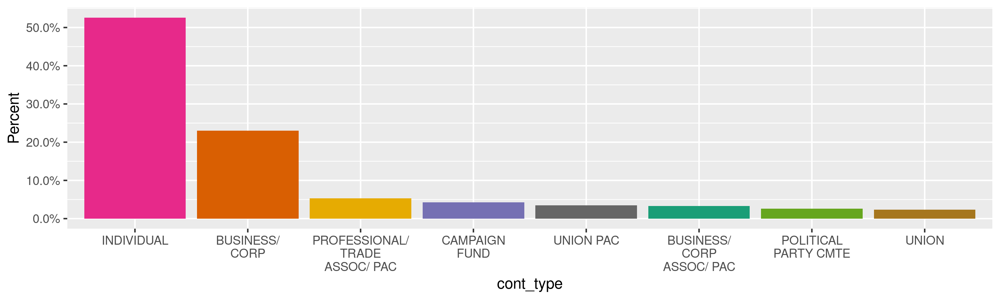
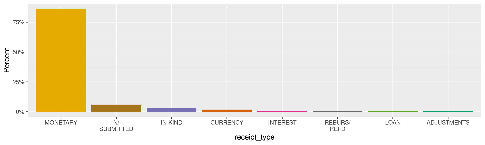
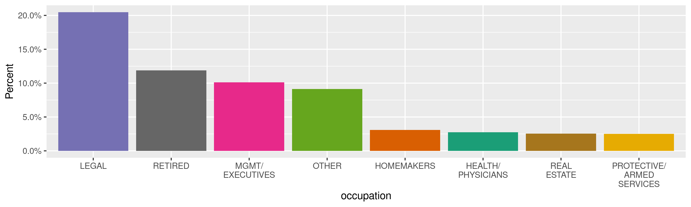
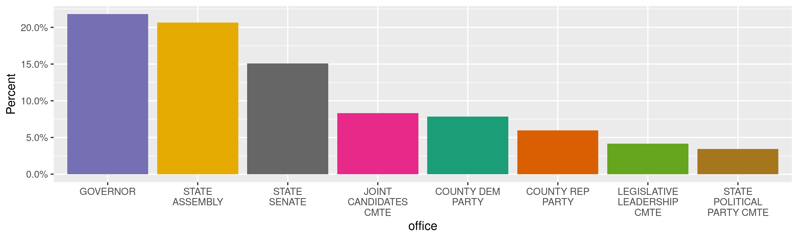
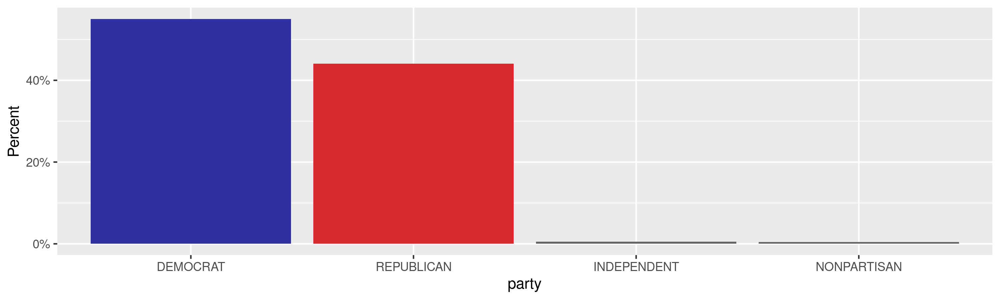
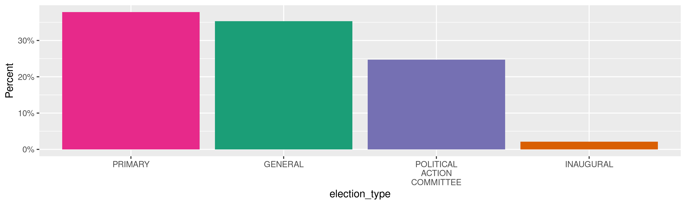
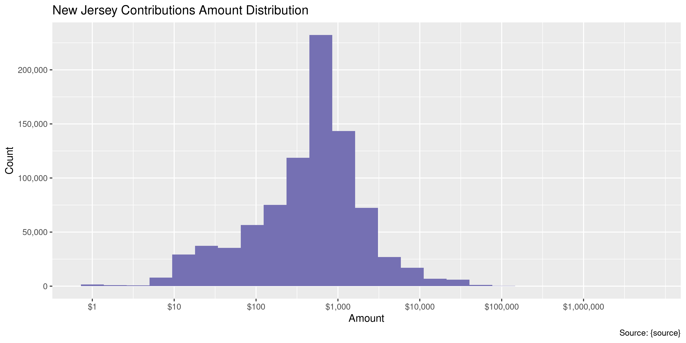
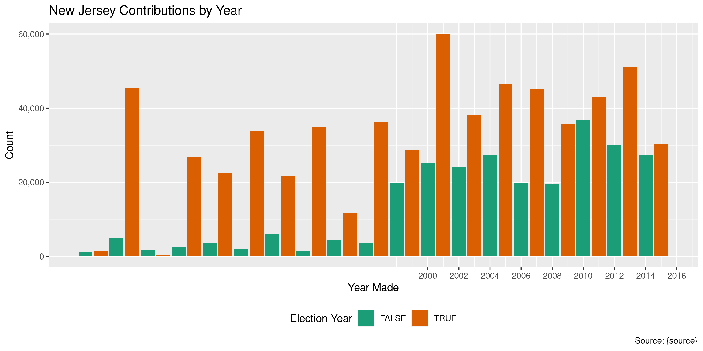
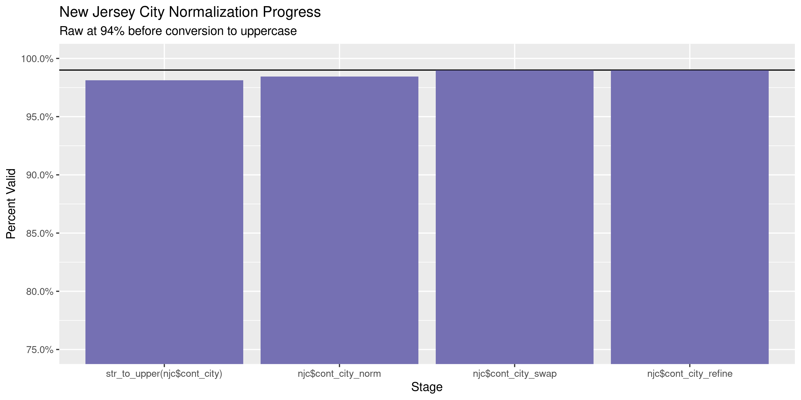
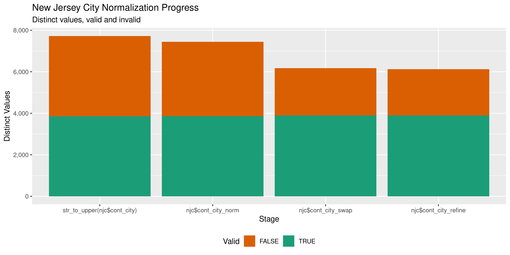

New Jersey Contributions
================
Kiernan Nicholls
Thu Sep 23 15:35:48 2021

-   [Project](#project)
-   [Objectives](#objectives)
-   [Packages](#packages)
-   [Data](#data)
-   [Import](#import)
    -   [Download](#download)
    -   [Extract](#extract)
    -   [Read](#read)
-   [Explore](#explore)
    -   [Missing](#missing)
    -   [Duplicates](#duplicates)
    -   [Categorical](#categorical)
    -   [Amounts](#amounts)
    -   [Dates](#dates)
-   [Wrangle](#wrangle)
    -   [Address](#address)
    -   [ZIP](#zip)
    -   [State](#state)
    -   [City](#city)
-   [Conclude](#conclude)
-   [Export](#export)
-   [Upload](#upload)

<!-- Place comments regarding knitting here -->

## Project

The Accountability Project is an effort to cut across data silos and
give journalists, policy professionals, activists, and the public at
large a simple way to search across huge volumes of public data about
people and organizations.

Our goal is to standardizing public data on a few key fields by thinking
of each dataset row as a transaction. For each transaction there should
be (at least) 3 variables:

1.  All **parties** to a transaction.
2.  The **date** of the transaction.
3.  The **amount** of money involved.

## Objectives

This document describes the process used to complete the following
objectives:

1.  How many records are in the database?
2.  Check for entirely duplicated records.
3.  Check ranges of continuous variables.
4.  Is there anything blank or missing?
5.  Check for consistency issues.
6.  Create a five-digit ZIP Code called `zip`.
7.  Create a `year` field from the transaction date.
8.  Make sure there is data on both parties to a transaction.

## Packages

The following packages are needed to collect, manipulate, visualize,
analyze, and communicate these results. The `pacman` package will
facilitate their installation and attachment.

``` r
if (!require("pacman")) {
  install.packages("pacman")
}
pacman::p_load(
  tidyverse, # data manipulation
  lubridate, # datetime strings
  gluedown, # printing markdown
  janitor, # clean data frames
  campfin, # custom irw tools
  aws.s3, # aws cloud storage
  refinr, # cluster & merge
  scales, # format strings
  knitr, # knit documents
  vroom, # fast reading
  rvest, # scrape html
  glue, # code strings
  here, # project paths
  httr, # http requests
  fs # local storage 
)
```

This document should be run as part of the `R_campfin` project, which
lives as a sub-directory of the more general, language-agnostic
[`irworkshop/accountability_datacleaning`](https://github.com/irworkshop/accountability_datacleaning)
GitHub repository.

The `R_campfin` project uses the [RStudio
projects](https://support.rstudio.com/hc/en-us/articles/200526207-Using-Projects)
feature and should be run as such. The project also uses the dynamic
`here::here()` tool for file paths relative to *your* machine.

``` r
# where does this document knit?
here::i_am("nj/contribs/docs/nj_contribs_diary.Rmd")
```

## Data

Data comes courtesy of the New Jersey Election Law Enforcement
Commission (ELEC) \[website\]\[elect\]. The data can be downloaded from
their [“Quick Data
Downloads”](https://www.elec.state.nj.us/publicinformation/quickdownload.htm)
page in four separate files:

-   [`All_GUB_Text.zip`](https://www.elec.nj.gov/download/Data/Gubernatorial/All_GUB_Text.zip)
-   [`All_LEG_Text.zip`](https://www.elec.nj.gov/download/Data/Legislative/All_LEG_Text.zip)
-   [`All_CW_Text.zip`](https://www.elec.nj.gov/download/Data/Countywide/All_CW_Text.zip)
-   [`All_PAC_Text.zip`](https://www.elec.nj.gov/download/Data/PAC/All_PAC_Text.zip)

Each `All_*.zip` file contains individual `.txt` files separated by year
and filing type. There are nine filing types, according to the headers
on the quick download page:

-   Gubernatorial Primary
-   Gubernatorial General
-   Gubernatorial Inaugural
-   Legislative Primary
-   Legislative General
-   County and Local Primary
-   County and Local General
-   State and County Political Party Committees and Legislative
    Leadership Committees

Each ZIP file contains a number of individual TXT files separated by
year.

ELEC makes the following disclaimer at the bottom of the download page:

> The data contained in the ELEC database includes information as
> reported by candidates and committees. Although ELEC has taken all
> reasonable precautions to prevent data entry errors, the possibility
> that some exist cannot be entirely eliminated. Contributor and
> Expenditure types are coded by ELEC staff members and are subjective
> according to the information provided by the filer. Additionally, this
> information is subject to change as amendments are filed by candidates
> and committees. For the most up-to-date information, please go to the
> “Search for Contributions” pages to search for the most recent
> contributor information.

## Import

### Download

``` r
raw_url <- c(
  "https://www.elec.nj.gov/download/Data/Gubernatorial/All_GUB_Text.zip",
  "https://www.elec.nj.gov/download/Data/Legislative/All_LEG_Text.zip",
  "https://www.elec.nj.gov/download/Data/Countywide/All_CW_Text.zip",
  "https://www.elec.nj.gov/download/Data/PAC/All_PAC_Text.zip"
)
```

``` r
raw_dir <- dir_create(here("nj", "contribs", "data", "raw"))
raw_zip <- path(raw_dir, basename(raw_url))
```

``` r
raw_get <- map(
  .x = raw_url,
  .f = function(url, dir = raw_dir) {
    out <- path(dir, basename(url))
    if (!file_exists(out)) {
      GET(
        url = url,
        progress(type = "down"),
        write_disk(path = out)
      )
    } else {
      HEAD(url)
    }
  }
)
```

``` r
raw_head <- map(transpose(map(raw_get, headers)), unlist)
```

``` r
md_bullet(raw_head[["last-modified"]])
```

-   Thu, 30 Mar 2017 13:30:47 GMT
-   Tue, 30 Aug 2016 16:22:32 GMT
-   Tue, 28 Mar 2017 14:55:51 GMT
-   Tue, 28 Mar 2017 14:57:31 GMT

``` r
raw_date <- as_date(dmy_hms(raw_head[["last-modified"]]))
today() - raw_date
#> Time differences in days
#> [1] 1638 1850 1640 1640
```

``` r
file_info_short(raw_zip)
#> # A tibble: 4 × 3
#>   path                    size modification_time  
#>   <chr>            <fs::bytes> <dttm>             
#> 1 All_GUB_Text.zip       5.67M 2021-09-23 14:54:43
#> 2 All_LEG_Text.zip       9.72M 2021-09-23 14:54:44
#> 3 All_CW_Text.zip        3.47M 2021-09-23 14:54:44
#> 4 All_PAC_Text.zip       6.17M 2021-09-23 14:54:45
```

### Extract

``` r
raw_txt <- unlist(map(raw_zip, unzip, exdir = raw_dir))
length(raw_txt)
#> [1] 97
file_info_short(raw_txt)
#> # A tibble: 97 × 3
#>    path                 size modification_time  
#>    <chr>         <fs::bytes> <dttm>             
#>  1 Gub_P2005.txt       3.41M 2021-09-23 15:35:51
#>  2 Gub_G1981.txt       1.82M 2021-09-23 15:35:51
#>  3 Gub_G1985.txt     980.67K 2021-09-23 15:35:51
#>  4 Gub_G1989.txt       1.04M 2021-09-23 15:35:51
#>  5 Gub_G1993.txt       2.46M 2021-09-23 15:35:51
#>  6 Gub_G1997.txt       2.37M 2021-09-23 15:35:51
#>  7 Gub_G2001.txt       2.52M 2021-09-23 15:35:51
#>  8 Gub_G2005.txt     394.82K 2021-09-23 15:35:51
#>  9 Gub_I1982.txt     211.88K 2021-09-23 15:35:51
#> 10 Gub_I1986.txt     337.67K 2021-09-23 15:35:51
#> # … with 87 more rows
sum(file_size(raw_txt))
#> 179M
```

### Read

While every file contains the same data, there are **two** different
formats. Some files are *tab*-delimited (`\t`) and have the column name
`OCCUPATION`. Others are *comma*-delimited (`,`) and have the same
column but with the name `OCCUPATION_NAME`.

We can circumvent the name problem by reading the names from a single
file with `read_names()` and use those names for *every* file. To read
each file with the correct delimiter, we will use `guess_delim()` which
reads the first line from each file and counts possible delimiters.
Those guessed delimiters can then be passed to `read_delim()`.

``` r
raw_cols <- raw_txt[1] %>% 
  read_names(delim = "\t") %>% 
  str_to_lower()
length(raw_cols)
#> [1] 33
```

``` r
raw_delims <- map_chr(raw_txt, guess_delim)
fct_count(raw_delims, prop = TRUE)
#> # A tibble: 2 × 3
#>   f         n     p
#>   <fct> <int> <dbl>
#> 1 "\t"     75 0.773
#> 2 ","      22 0.227
```

``` r
names(raw_txt) <- basename(raw_txt)
```

``` r
njc <- map2_dfr(
  .x = raw_txt,
  .y = raw_delims,
  .f = read_delim,
  .id = "src_file",
  skip = 1,
  escape_backslash = FALSE,
  escape_double = FALSE,
  col_names = raw_cols,
  guess_max = 0,
  col_types = cols(
    .default = col_character(),
    cont_date = col_date_mdy(),
    cont_amt = col_number(),
    election_year = col_integer()
  )
)
```

Each source file name contains information on the type, election, and
year. We can create new variables with this information.

``` r
njc <- njc %>% relocate(src_file, .after = last_col())
```

## Explore

There are 879,485 rows of 34 columns. Each record represents a single
contribution made to a political campaign or committee.

``` r
glimpse(njc)
#> Rows: 879,485
#> Columns: 34
#> $ cont_lname         <chr> "MACKENZIE", "REEHILL", "TOMANELLI", "TOMANELLI", "TOMANELLI", "TOMANELLI", "TOMANELLI", "T…
#> $ cont_fname         <chr> "SCOTT", "WILLIAM", "JOSEPH", "JOSEPH", "JOSEPH", "JOSEPH", "JOSEPH", "JOSEPH", "PATRICIA",…
#> $ cont_mname         <chr> "B", "F", NA, NA, NA, NA, NA, NA, "J", "J", NA, NA, NA, NA, NA, "J", "J", "J", "J", "J", NA…
#> $ cont_suffix        <chr> NA, NA, NA, NA, NA, NA, NA, NA, NA, NA, NA, NA, NA, NA, NA, NA, NA, NA, NA, NA, NA, NA, NA,…
#> $ cont_non_ind_name  <chr> NA, NA, NA, NA, NA, NA, NA, NA, NA, NA, NA, NA, NA, NA, NA, NA, NA, NA, NA, NA, NA, NA, NA,…
#> $ cont_non_ind_name2 <chr> NA, NA, NA, NA, NA, NA, NA, NA, NA, NA, NA, NA, NA, NA, NA, NA, NA, NA, NA, NA, NA, NA, NA,…
#> $ cont_street1       <chr> "830 ELDEN ST", "1206 KING GEORGE LANE", "614 BLUE RIDGE LN", "614 BLUE RIDGE LN", "614 BLU…
#> $ cont_street2       <chr> NA, NA, NA, NA, NA, NA, NA, NA, NA, NA, NA, NA, NA, NA, NA, NA, NA, NA, NA, NA, NA, NA, NA,…
#> $ cont_city          <chr> "HERNDON", "TOMS RIVER", "MAHWAH", "MAHWAH", "MAHWAH", "MAHWAH", "MAHWAH", "MAHWAH", "TOMS …
#> $ cont_state         <chr> "VA", "NJ", "NJ", "NJ", "NJ", "NJ", "NJ", "NJ", "NJ", "NJ", "NJ", "NJ", "NJ", "NJ", "NJ", "…
#> $ cont_zip           <chr> "20170", "08753", "07430", "07430", "07430", "07430", "07430", "07430", "08753", "08753", "…
#> $ cont_type          <chr> "INDIVIDUAL", "INDIVIDUAL", "INDIVIDUAL", "INDIVIDUAL", "INDIVIDUAL", "INDIVIDUAL", "INDIVI…
#> $ cont_amt           <dbl> 2350, 3000, 1500, 1000, 500, 65, 50, -115, 1500, 1500, 300, 25, 20, 10, 10, 3000, 3000, 260…
#> $ receipt_type       <chr> "MONETARY", "MONETARY", "MONETARY", "MONETARY", "MONETARY", "MONETARY", "MONETARY", "REFUND…
#> $ cont_date          <date> 2005-10-14, 2005-10-31, 2004-09-20, 2005-01-15, 2005-09-18, 2005-04-14, 2005-04-11, 2005-1…
#> $ occupation         <chr> "ACCOUNTANTS/AUDITORS", "ACCOUNTANTS/AUDITORS", "ACCOUNTANTS/AUDITORS", "ACCOUNTANTS/AUDITO…
#> $ emp_name           <chr> "MACKENZIE & COMPANY", "GILMORE & MONAHAN PA", "JOSEPH TOMANELLI CPA", "JOSEPH TOMANELLI CP…
#> $ emp_street1        <chr> "830 ELDEN ST", "10 ALLEN STREET", "614 BLUE RIBBON LN", "614 BLUE RIBBON LN", "614 BLUE RI…
#> $ emp_street2        <chr> NA, NA, NA, NA, NA, NA, NA, NA, " ", " ", " ", NA, NA, NA, NA, " ", " ", " ", " ", " ", " "…
#> $ emp_city           <chr> "HERNDON", "TOMS RIVER", "MAHWAH", "MAHWAH", "MAHWAH", "MAHWAH", "MAHWAH", "MAHWAH", "TOMS …
#> $ emp_state          <chr> "VA", "NJ", "NJ", "NJ", "NJ", "NJ", "NJ", "NJ", "NJ", "NJ", "NY", "NJ", "NJ", "NJ", "NJ", N…
#> $ emp_zip            <chr> "20170", "08753", "07430", "07430", "07430", "07430", "07430", "07430", "08753", "08753", "…
#> $ rec_lname          <chr> "LONEGAN", "SCHROEDER", "LONEGAN", "LONEGAN", "LONEGAN", "LONEGAN", "LONEGAN", "LONEGAN", "…
#> $ rec_fname          <chr> "STEVEN", "ROBERT", "STEVEN", "STEVEN", "STEVEN", "STEVEN", "STEVEN", "STEVEN", "BRET", "BR…
#> $ rec_mname          <chr> "M", NA, "M", "M", "M", "M", "M", "M", "D", "D", "D", "M", "M", "M", "M", "D", "D", "D", "D…
#> $ rec_suffix         <chr> NA, NA, NA, NA, NA, NA, NA, NA, NA, NA, NA, NA, NA, NA, NA, NA, NA, NA, NA, NA, NA, NA, NA,…
#> $ rec_non_ind_name   <chr> NA, NA, NA, NA, NA, NA, NA, NA, NA, NA, NA, NA, NA, NA, NA, NA, NA, NA, NA, NA, NA, NA, NA,…
#> $ rec_non_ind_name2  <chr> NA, NA, NA, NA, NA, NA, NA, NA, NA, NA, NA, NA, NA, NA, NA, NA, NA, NA, NA, NA, NA, NA, NA,…
#> $ office             <chr> "GOVERNOR", "GOVERNOR", "GOVERNOR", "GOVERNOR", "GOVERNOR", "GOVERNOR", "GOVERNOR", "GOVERN…
#> $ party              <chr> "REPUBLICAN", "REPUBLICAN", "REPUBLICAN", "REPUBLICAN", "REPUBLICAN", "REPUBLICAN", "REPUBL…
#> $ location           <chr> "STATEWIDE", "STATEWIDE", "STATEWIDE", "STATEWIDE", "STATEWIDE", "STATEWIDE", "STATEWIDE", …
#> $ election_year      <int> 2005, 2005, 2005, 2005, 2005, 2005, 2005, 2005, 2005, 2005, 2005, 2005, 2005, 2005, 2005, 2…
#> $ election_type      <chr> "PRIMARY", "PRIMARY", "PRIMARY", "PRIMARY", "PRIMARY", "PRIMARY", "PRIMARY", "PRIMARY", "PR…
#> $ src_file           <chr> "Gub_P2005.txt", "Gub_P2005.txt", "Gub_P2005.txt", "Gub_P2005.txt", "Gub_P2005.txt", "Gub_P…
tail(njc)
#> # A tibble: 6 × 34
#>   cont_lname cont_fname cont_mname cont_suffix cont_non_ind_name   cont_non_ind_nam… cont_street1 cont_street2 cont_city
#>   <chr>      <chr>      <chr>      <chr>       <chr>               <chr>             <chr>        <chr>        <chr>    
#> 1 ZULUETA    SHEILA PAZ <NA>       <NA>        <NA>                <NA>              223 79TH ST  <NA>         NORTH BE…
#> 2 ZUMPINO    MICHAEL    L          <NA>        <NA>                <NA>              834 PATTERS… <NA>         LANSDALE 
#> 3 <NA>       <NA>       <NA>       <NA>        ZWICKER VELLA FOR … <NA>              P O BOX 191  <NA>         KINGSTON 
#> 4 <NA>       <NA>       <NA>       <NA>        ZWICKER VELLA FOR … <NA>              P O BOX 191  <NA>         KINGSTON 
#> 5 <NA>       <NA>       <NA>       <NA>        ZWICKER VELLA FOR … <NA>              P O BOX 191  <NA>         KINGSTON 
#> 6 <NA>       <NA>       <NA>       <NA>        ZWICKER VELLA FOR … <NA>              P O BOX 191  <NA>         KINGSTON 
#> # … with 25 more variables: cont_state <chr>, cont_zip <chr>, cont_type <chr>, cont_amt <dbl>, receipt_type <chr>,
#> #   cont_date <date>, occupation <chr>, emp_name <chr>, emp_street1 <chr>, emp_street2 <chr>, emp_city <chr>,
#> #   emp_state <chr>, emp_zip <chr>, rec_lname <chr>, rec_fname <chr>, rec_mname <chr>, rec_suffix <chr>,
#> #   rec_non_ind_name <chr>, rec_non_ind_name2 <chr>, office <chr>, party <chr>, location <chr>, election_year <int>,
#> #   election_type <chr>, src_file <chr>
```

### Missing

Columns vary in their degree of missing values.

``` r
col_stats(njc, count_na)
#> # A tibble: 34 × 4
#>    col                class       n          p
#>    <chr>              <chr>   <int>      <dbl>
#>  1 cont_lname         <chr>  417307 0.474     
#>  2 cont_fname         <chr>  417414 0.475     
#>  3 cont_mname         <chr>  690920 0.786     
#>  4 cont_suffix        <chr>  855451 0.973     
#>  5 cont_non_ind_name  <chr>  462433 0.526     
#>  6 cont_non_ind_name2 <chr>  859246 0.977     
#>  7 cont_street1       <chr>   22271 0.0253    
#>  8 cont_street2       <chr>  861915 0.980     
#>  9 cont_city          <chr>   17114 0.0195    
#> 10 cont_state         <chr>   17063 0.0194    
#> 11 cont_zip           <chr>   40050 0.0455    
#> 12 cont_type          <chr>       0 0         
#> 13 cont_amt           <dbl>       1 0.00000114
#> 14 receipt_type       <chr>       0 0         
#> 15 cont_date          <date>   4485 0.00510   
#> 16 occupation         <chr>  627771 0.714     
#> 17 emp_name           <chr>  674393 0.767     
#> 18 emp_street1        <chr>  694543 0.790     
#> 19 emp_street2        <chr>  867948 0.987     
#> 20 emp_city           <chr>  688563 0.783     
#> 21 emp_state          <chr>  688184 0.782     
#> 22 emp_zip            <chr>  691260 0.786     
#> 23 rec_lname          <chr>  310023 0.353     
#> 24 rec_fname          <chr>  310023 0.353     
#> 25 rec_mname          <chr>  546682 0.622     
#> 26 rec_suffix         <chr>  850720 0.967     
#> 27 rec_non_ind_name   <chr>  569462 0.647     
#> 28 rec_non_ind_name2  <chr>  834329 0.949     
#> 29 office             <chr>       0 0         
#> 30 party              <chr>       0 0         
#> 31 location           <chr>       0 0         
#> 32 election_year      <int>       0 0         
#> 33 election_type      <chr>       0 0         
#> 34 src_file           <chr>       0 0
```

We can flag any record missing a key variable needed to identify a
transaction.

First, we need to create new variables with combined contributor and
recipient names. These variables will end with `*_xname`.

``` r
njc <- njc %>%
  # create single contributor name
  unite(
    col = cont_xname,
    cont_fname, cont_mname, cont_lname, cont_suffix,
    sep = " ",
    remove = FALSE,
    na.rm = TRUE
  ) %>% 
  mutate(
    cont_xname = coalesce(cont_xname, cont_non_ind_name),
    across(cont_xname, na_if, "")
  ) %>% 
  # repeat for recipients
  unite(
    col = rec_xname,
    rec_fname, rec_mname, rec_lname, rec_suffix, 
    sep = " ",
    remove = FALSE,
    na.rm = TRUE
  ) %>% 
    mutate(
    rec_xname = coalesce(rec_xname, rec_non_ind_name),
    across(rec_xname, na_if, "")
  ) %>% 
  mutate(across(rec_xname, na_if, "")) %>% 
  relocate(ends_with("xname"), .after = last_col())
```

``` r
key_vars <- c("cont_date", "cont_xname", "cont_amt", "rec_xname")
njc <- flag_na(njc, all_of(key_vars))
mean(njc$na_flag)
#> [1] 0.6407659
```

64.1% of records are missing a key variable.

``` r
njc %>% 
  filter(na_flag) %>% 
  select(all_of(key_vars))
#> # A tibble: 563,544 × 4
#>    cont_date cont_xname        cont_amt rec_xname       
#>    <date>    <chr>                <dbl> <chr>           
#>  1 NA        FRANCIS J WALSH      -2600 BRET D SCHUNDLER
#>  2 NA        FRANCIS J WALSH      -3000 BRET D SCHUNDLER
#>  3 NA        PIERRE YANNEY        -1000 BRET D SCHUNDLER
#>  4 NA        EDWARD BREEN         -1000 BRET D SCHUNDLER
#>  5 NA        DAVID C KLIPSTEIN    -1000 BRET D SCHUNDLER
#>  6 NA        LEWIS ARNO           -2600 BRET D SCHUNDLER
#>  7 NA        BONNIE ARNO          -2600 BRET D SCHUNDLER
#>  8 NA        BONNIE ARNO          -2600 BRET D SCHUNDLER
#>  9 NA        JOHN T SULLIVAN       -100 BRET D SCHUNDLER
#> 10 NA        RONALD CAMI          -2000 BRET D SCHUNDLER
#> # … with 563,534 more rows
```

Most of these records are missing the `cont_date` value.

``` r
njc %>% 
  filter(na_flag) %>% 
  select(all_of(key_vars)) %>% 
  col_stats(count_na)
#> # A tibble: 4 × 4
#>   col        class       n          p
#>   <chr>      <chr>   <int>      <dbl>
#> 1 cont_date  <date>   4485 0.00796   
#> 2 cont_xname <chr>  417193 0.740     
#> 3 cont_amt   <dbl>       1 0.00000177
#> 4 rec_xname  <chr>  310023 0.550
```

### Duplicates

We can also flag any record completely duplicated across every column.

``` r
njc <- flag_dupes(njc, everything())
sum(njc$dupe_flag)
#> [1] 10631
```

``` r
njc %>% 
  filter(dupe_flag) %>% 
  select(all_of(key_vars)) %>% 
  arrange(cont_date)
#> # A tibble: 10,631 × 4
#>    cont_date  cont_xname    cont_amt rec_xname     
#>    <date>     <chr>            <dbl> <chr>         
#>  1 1978-09-15 <NA>               100 THOMAS F SMITH
#>  2 1978-09-15 <NA>               100 THOMAS F SMITH
#>  3 1978-09-18 <NA>               100 THOMAS F SMITH
#>  4 1978-09-18 <NA>               100 THOMAS F SMITH
#>  5 1978-09-18 <NA>               100 THOMAS F SMITH
#>  6 1978-09-18 <NA>               100 THOMAS F SMITH
#>  7 1978-09-18 VICTOR SMARRO      100 THOMAS F SMITH
#>  8 1978-09-18 VICTOR SMARRO      100 THOMAS F SMITH
#>  9 1978-09-18 LOUIS PUZIO        100 THOMAS F SMITH
#> 10 1978-09-18 LOUIS PUZIO        100 THOMAS F SMITH
#> # … with 10,621 more rows
```

### Categorical

``` r
col_stats(njc, n_distinct)
#> # A tibble: 38 × 4
#>    col                class       n          p
#>    <chr>              <chr>   <int>      <dbl>
#>  1 cont_lname         <chr>   67292 0.0765    
#>  2 cont_fname         <chr>   25291 0.0288    
#>  3 cont_mname         <chr>     136 0.000155  
#>  4 cont_suffix        <chr>     170 0.000193  
#>  5 cont_non_ind_name  <chr>  105714 0.120     
#>  6 cont_non_ind_name2 <chr>    8299 0.00944   
#>  7 cont_street1       <chr>  237297 0.270     
#>  8 cont_street2       <chr>    3840 0.00437   
#>  9 cont_city          <chr>    7753 0.00882   
#> 10 cont_state         <chr>      74 0.0000841 
#> 11 cont_zip           <chr>    9815 0.0112    
#> 12 cont_type          <chr>      19 0.0000216 
#> 13 cont_amt           <dbl>   24205 0.0275    
#> 14 receipt_type       <chr>      36 0.0000409 
#> 15 cont_date          <date>  11413 0.0130    
#> 16 occupation         <chr>      89 0.000101  
#> 17 emp_name           <chr>   68387 0.0778    
#> 18 emp_street1        <chr>   53530 0.0609    
#> 19 emp_street2        <chr>    1993 0.00227   
#> 20 emp_city           <chr>    2936 0.00334   
#> 21 emp_state          <chr>      65 0.0000739 
#> 22 emp_zip            <chr>    4260 0.00484   
#> 23 rec_lname          <chr>    2678 0.00304   
#> 24 rec_fname          <chr>    1054 0.00120   
#> 25 rec_mname          <chr>      32 0.0000364 
#> 26 rec_suffix         <chr>       8 0.00000910
#> 27 rec_non_ind_name   <chr>    2977 0.00338   
#> 28 rec_non_ind_name2  <chr>    1098 0.00125   
#> 29 office             <chr>      21 0.0000239 
#> 30 party              <chr>       6 0.00000682
#> 31 location           <chr>     468 0.000532  
#> 32 election_year      <int>      31 0.0000352 
#> 33 election_type      <chr>       4 0.00000455
#> 34 src_file           <chr>      97 0.000110  
#> 35 cont_xname         <chr>  213972 0.243     
#> 36 rec_xname          <chr>    3766 0.00428   
#> 37 na_flag            <lgl>       2 0.00000227
#> 38 dupe_flag          <lgl>       2 0.00000227
```

<!-- --><!-- --><!-- --><!-- --><!-- --><!-- -->

### Amounts

``` r
summary(njc$cont_amt)
#>    Min. 1st Qu.  Median    Mean 3rd Qu.    Max.    NA's 
#> -400000     175     500    1467    1000 5000000       1
count_na(njc$cont_amt)
#> [1] 1
mean(njc$cont_amt <= 0, na.rm = TRUE)
#> [1] 0.008772189
```

These are the records with the minimum and maximum amounts.

``` r
glimpse(njc[c(which.max(njc$cont_amt), which.min(njc$cont_amt)), ])
#> Rows: 2
#> Columns: 38
#> $ cont_lname         <chr> "CORZINE", NA
#> $ cont_fname         <chr> "JON", NA
#> $ cont_mname         <chr> "S", NA
#> $ cont_suffix        <chr> NA, NA
#> $ cont_non_ind_name  <chr> NA, "STERLING BANK"
#> $ cont_non_ind_name2 <chr> NA, NA
#> $ cont_street1       <chr> "1500 HUDSON ST", "RT 38"
#> $ cont_street2       <chr> NA, NA
#> $ cont_city          <chr> "HOBOKEN", "MOUNT LAUREL"
#> $ cont_state         <chr> "NJ", "NJ"
#> $ cont_zip           <chr> "07030", "08054"
#> $ cont_type          <chr> "INDIVIDUAL", "INTEREST"
#> $ cont_amt           <dbl> 5e+06, -4e+05
#> $ receipt_type       <chr> "MONETARY", "LOAN PAY"
#> $ cont_date          <date> 2005-10-28, 2001-03-31
#> $ occupation         <chr> "PUBLIC OFFICE-HOLDERS", NA
#> $ emp_name           <chr> "US SENATE", NA
#> $ emp_street1        <chr> "U S SENATE HART SENATE OFFICE BUILDING", NA
#> $ emp_street2        <chr> NA, NA
#> $ emp_city           <chr> "WASHINGTON", NA
#> $ emp_state          <chr> "DC", NA
#> $ emp_zip            <chr> "20510", NA
#> $ rec_lname          <chr> "CORZINE", NA
#> $ rec_fname          <chr> "JON", NA
#> $ rec_mname          <chr> "S", NA
#> $ rec_suffix         <chr> NA, NA
#> $ rec_non_ind_name   <chr> NA, "BURLINGTON COUNTY REPUBLICAN CMTE"
#> $ rec_non_ind_name2  <chr> NA, NA
#> $ office             <chr> "GOVERNOR", "COUNTY REP PARTY"
#> $ party              <chr> "DEMOCRAT", "REPUBLICAN"
#> $ location           <chr> "STATEWIDE", "BURLINGTON COUNTY"
#> $ election_year      <int> 2005, 2001
#> $ election_type      <chr> "GENERAL", "POLITICAL ACTION COMMITTEE"
#> $ src_file           <chr> "Gub_G2005.txt", "PAC2001.txt"
#> $ cont_xname         <chr> "JON S CORZINE", NA
#> $ rec_xname          <chr> "JON S CORZINE", NA
#> $ na_flag            <lgl> FALSE, TRUE
#> $ dupe_flag          <lgl> FALSE, FALSE
```

<!-- -->

### Dates

We can add the calendar year from `cont_date` with `lubridate::year()`

``` r
njc <- mutate(njc, cont_year = year(cont_date))
```

``` r
min(njc$cont_date, na.rm = TRUE)
#> [1] "1-08-28"
sum(njc$cont_year < 1978, na.rm = TRUE)
#> [1] 187
max(njc$cont_date, na.rm = TRUE)
#> [1] "5013-10-05"
sum(njc$cont_date > today(), na.rm = TRUE)
#> [1] 7
```

<!-- -->

## Wrangle

To improve the searchability of the database, we will perform some
consistent, confident string normalization. For geographic variables
like city names and ZIP codes, the corresponding `campfin::normal_*()`
functions are tailor made to facilitate this process.

### Address

Contributor street addresses are already USPS formatted.

``` r
sample(njc$cont_street1, 10)
#>  [1] "28 PARKVIEW AVE"      "1 WESLEY AVE"         "P O BOX 1000"         "71 ROXITICUS RD"      "P O BOX L"           
#>  [6] "P O BOX 9644"         "16A LENAPE DR"        "1064 MICHIGAN AVE"    "600 S LIVINGSTON AVE" "P O BOX 573"
```

### ZIP

For ZIP codes, the `campfin::normal_zip()` function will attempt to
create valid *five* digit codes by removing the ZIP+4 suffix and
returning leading zeroes dropped by other programs like Microsoft Excel.

``` r
njc <- njc %>% 
  mutate(
    cont_zip_norm = normal_zip(
      zip = cont_zip,
      na_rep = TRUE
    )
  )
```

``` r
progress_table(
  njc$cont_zip,
  njc$cont_zip_norm,
  compare = valid_zip
)
#> # A tibble: 2 × 6
#>   stage             prop_in n_distinct prop_na n_out n_diff
#>   <chr>               <dbl>      <dbl>   <dbl> <dbl>  <dbl>
#> 1 njc$cont_zip        0.970       9815  0.0455 24892   2551
#> 2 njc$cont_zip_norm   0.977       8952  0.0503 18837   1678
```

### State

The contributor state is already very normalized.

``` r
prop_in(njc$cont_state, valid_state)
#> [1] 0.9994736
```

### City

Cities are the most difficult geographic variable to normalize, simply
due to the wide variety of valid cities and formats.

#### Normal

The `campfin::normal_city()` function is a good start, again converting
case, removing punctuation, but *expanding* USPS abbreviations. We can
also remove `invalid_city` values.

``` r
norm_city <- njc %>% 
  distinct(cont_city, cont_state, cont_zip_norm) %>% 
  mutate(
    cont_city_norm = normal_city(
      city = cont_city, 
      abbs = usps_city,
      states = c("NJ", "DC", "NEW JERSEY"),
      na = invalid_city,
      na_rep = TRUE
    )
  )
```

#### Swap

We can further improve normalization by comparing our normalized value
against the *expected* value for that record’s state abbreviation and
ZIP code. If the normalized value is either an abbreviation for or very
similar to the expected value, we can confidently swap those two.

``` r
norm_city <- norm_city %>% 
  left_join(
    y = zipcodes,
    by = c(
      "cont_state" = "state",
      "cont_zip_norm" = "zip"
    )
  ) %>% 
  rename(city_match = city) %>% 
  mutate(
    match_abb = is_abbrev(cont_city_norm, city_match),
    match_dist = str_dist(cont_city_norm, city_match),
    cont_city_swap = if_else(
      condition = !is.na(match_dist) & (match_abb | match_dist == 1),
      true = city_match,
      false = cont_city_norm
    )
  ) %>% 
  select(
    -city_match,
    -match_dist,
    -match_abb
  )
```

``` r
njc <- left_join(
  x = njc,
  y = norm_city,
  by = c(
    "cont_city", 
    "cont_state", 
    "cont_zip_norm"
  )
)
```

#### Refine

The [OpenRefine](https://openrefine.org/) algorithms can be used to
group similar strings and replace the less common versions with their
most common counterpart. This can greatly reduce inconsistency, but with
low confidence; we will only keep any refined strings that have a valid
city/state/zip combination.

``` r
good_refine <- njc %>% 
  mutate(
    cont_city_refine = cont_city_swap %>% 
      key_collision_merge() %>% 
      n_gram_merge(numgram = 1)
  ) %>% 
  filter(cont_city_refine != cont_city_swap) %>% 
  inner_join(
    y = zipcodes,
    by = c(
      "cont_city_refine" = "city",
      "cont_state" = "state",
      "cont_zip_norm" = "zip"
    )
  )
```

    #> # A tibble: 67 × 5
    #>    cont_state cont_zip_norm cont_city_swap    cont_city_refine     n
    #>    <chr>      <chr>         <chr>             <chr>            <int>
    #>  1 NJ         07203         ROSSELL           ROSELLE              4
    #>  2 NJ         08902         SOUTH BRUNSWICK   NORTH BRUNSWICK      4
    #>  3 NJ         07054         PARSIPANNY        PARSIPPANY           3
    #>  4 NJ         08540         PRICENTON         PRINCETON            3
    #>  5 NJ         07058         PINEBRROK         PINE BROOK           2
    #>  6 NJ         07090         WESTIFLED         WESTFIELD            2
    #>  7 NJ         07424         EAST LITTLE FALLS LITTLE FALLS         2
    #>  8 NJ         08008         HAVEN BEACH       BEACH HAVEN          2
    #>  9 NJ         08542         PRICENTON         PRINCETON            2
    #> 10 NJ         08826         GLEN GARDEN       GLEN GARDNER         2
    #> # … with 57 more rows

Then we can join the refined values back to the database.

``` r
njc <- njc %>% 
  left_join(good_refine) %>% 
  mutate(cont_city_refine = coalesce(cont_city_refine, cont_city_swap))
```

#### Progress

``` r
many_city <- c(valid_city, extra_city)
njc %>% 
  filter(cont_city_refine %out% many_city) %>% 
  count(cont_state, cont_city_refine, sort = TRUE)
#> # A tibble: 2,301 × 3
#>    cont_state cont_city_refine     n
#>    <chr>      <chr>            <int>
#>  1 <NA>       <NA>             16579
#>  2 NJ         MANALAPAN         2046
#>  3 NJ         OCEAN              963
#>  4 NJ         WEST WINDSOR       462
#>  5 NJ         <NA>               446
#>  6 NJ         GREEN BROOK        436
#>  7 NJ         CARNEYS POINT      364
#>  8 NN         NO NAME            353
#>  9 NJ         PITTSGROVE         269
#> 10 NJ         BRICK TOWN         234
#> # … with 2,291 more rows
```

``` r
many_city <- c(many_city, "MANALAPAN", "OCEAN", "WEST WINDSOR")
```

Our goal for normalization was to increase the proportion of city values
known to be valid and reduce the total distinct values by correcting
misspellings.

| stage                         | prop\_in | n\_distinct | prop\_na | n\_out | n\_diff |
|:------------------------------|---------:|------------:|---------:|-------:|--------:|
| `str_to_upper(njc$cont_city)` |    0.981 |        7723 |    0.019 |  16123 |    3871 |
| `njc$cont_city_norm`          |    0.984 |        7440 |    0.019 |  13484 |    3579 |
| `njc$cont_city_swap`          |    0.990 |        6174 |    0.019 |   8947 |    2278 |
| `njc$cont_city_refine`        |    0.990 |        6122 |    0.019 |   8867 |    2226 |

You can see how the percentage of valid values increased with each
stage.

<!-- -->

More importantly, the number of distinct values decreased each stage. We
were able to confidently change many distinct invalid values to their
valid equivalent.

<!-- -->

Before exporting, we can remove the intermediary normalization columns
and rename all added variables with the `_clean` suffix.

``` r
njc <- njc %>% 
  select(
    -ends_with("_xname"),
    -cont_city_norm,
    -cont_city_swap,
    cont_city_clean = cont_city_refine
  ) %>% 
  rename_all(~str_replace(., "_norm", "_clean")) %>% 
  rename_all(~str_remove(., "_raw")) %>% 
  relocate(cont_zip_clean, .after = cont_city_clean)
```

## Conclude

1.  There are 879,485 records in the database.
2.  There are 10,631 duplicate records in the database.
3.  The range and distribution of `amount` and `date` seem reasonable.
4.  There are 563,544 records missing key variables.
5.  Consistency in geographic data has been improved with
    `campfin::normal_*()`.
6.  The 4-digit `cont_year` variable has been created with
    `lubridate::year()`.

``` r
glimpse(sample_n(njc, 50))
#> Rows: 50
#> Columns: 39
#> $ cont_lname         <chr> NA, "FELDMAN", NA, NA, NA, "RYAN", NA, NA, NA, NA, "CHEATLE", NA, NA, NA, "COLON", NA, NA, …
#> $ cont_fname         <chr> NA, "WARREN", NA, NA, NA, "MARYANN", NA, NA, NA, NA, "DONALD", NA, NA, NA, "WILLIAM DOUGLAS…
#> $ cont_mname         <chr> NA, NA, NA, NA, NA, "T", NA, NA, NA, NA, NA, NA, NA, NA, NA, NA, NA, NA, "A", "K", NA, NA, …
#> $ cont_suffix        <chr> NA, NA, NA, NA, NA, NA, NA, NA, NA, NA, NA, NA, NA, NA, NA, NA, NA, NA, NA, NA, NA, NA, NA,…
#> $ cont_non_ind_name  <chr> "JOHN L KRAFT ESQ LLC", NA, "BAC ADMINISTRATIVE DISTRICT COUNCIL OF NJ PAC", "BERKELEY COLL…
#> $ cont_non_ind_name2 <chr> NA, NA, NA, NA, NA, NA, NA, NA, NA, NA, NA, NA, NA, NA, NA, NA, NA, NA, NA, NA, NA, NA, NA,…
#> $ cont_street1       <chr> "325 COLUMBIA TPKE", "102 W HILL RD", "3281 RT 206 STE 3", "64 E MIDLAND AVE", "66 E MAIN S…
#> $ cont_street2       <chr> NA, NA, NA, NA, NA, NA, NA, NA, NA, NA, NA, NA, NA, NA, NA, NA, NA, NA, NA, NA, NA, NA, NA,…
#> $ cont_city          <chr> "FLORHAM PARK", "WOODCLIFF LAKE", "BORDENTOWN", "PARAMUS", "SOMERVILLE", "HARRINGTON PARK",…
#> $ cont_state         <chr> "NJ", "NJ", "NJ", "NJ", "NJ", "NJ", "CA", "NJ", "NJ", "NJ", "NJ", "NJ", "NJ", "NJ", "NJ", "…
#> $ cont_zip           <chr> "07932", "07677", "08505", "07652", "08876", "07640", "94080", "08832", "08608", "08817", "…
#> $ cont_type          <chr> "BUSINESS/CORP", "INDIVIDUAL", "UNION PAC", "BUSINESS/CORP", "POLITICAL PARTY CMTE", "INDIV…
#> $ cont_amt           <dbl> 2000.00, 2000.00, 1000.00, 500.00, 3000.00, 150.00, 900.00, 2000.00, 500.00, 2600.00, 600.0…
#> $ receipt_type       <chr> "MONETARY", "MONETARY", "MONETARY", "MONETARY", "MONETARY", "MONETARY", "MONETARY", "MONETA…
#> $ cont_date          <date> 2004-09-28, 2015-03-27, 2010-11-08, 2010-03-30, 2010-10-29, 2005-09-28, 2015-02-24, 2013-1…
#> $ occupation         <chr> NA, "MGMT/EXECUTIVES", NA, NA, NA, "HOMEMAKERS", NA, NA, NA, NA, NA, NA, NA, NA, NA, NA, NA…
#> $ emp_name           <chr> NA, "WARREN FELDMAN ENTRAINMENT", NA, NA, NA, NA, NA, NA, NA, NA, NA, NA, NA, NA, NA, NA, N…
#> $ emp_street1        <chr> NA, "140 LITTLE ST", NA, NA, NA, NA, NA, NA, NA, NA, NA, NA, NA, NA, NA, NA, NA, NA, NA, "1…
#> $ emp_street2        <chr> NA, NA, NA, NA, NA, NA, NA, NA, NA, NA, NA, NA, NA, NA, NA, NA, NA, NA, NA, NA, NA, NA, NA,…
#> $ emp_city           <chr> NA, "BELLEVILLE", NA, NA, NA, NA, NA, NA, NA, NA, NA, NA, NA, NA, NA, NA, NA, NA, NA, "CART…
#> $ emp_state          <chr> NA, "NJ", NA, NA, NA, NA, NA, NA, NA, NA, NA, NA, NA, NA, NA, NA, NA, NA, NA, "NJ", NA, NA,…
#> $ emp_zip            <chr> NA, "07109", NA, NA, NA, NA, NA, NA, NA, NA, NA, NA, NA, NA, NA, NA, NA, NA, NA, "07008", N…
#> $ rec_lname          <chr> NA, NA, NA, "RUMANA", NA, "LONEGAN", "LAMPITT", NA, NA, "BROWN", NA, "DECROCE", "BUCCO", NA…
#> $ rec_fname          <chr> NA, NA, NA, "SCOTT", NA, "STEVEN", "PAMELA", NA, NA, "CHRISTOPHER", NA, "ALEX", "ANTHONY", …
#> $ rec_mname          <chr> NA, NA, NA, "T", NA, "M", "R", NA, NA, "A", NA, NA, NA, NA, NA, "R", NA, NA, "J", "E", "S",…
#> $ rec_suffix         <chr> NA, NA, NA, NA, NA, NA, NA, NA, NA, NA, NA, NA, NA, NA, NA, NA, NA, "JR", NA, NA, NA, NA, N…
#> $ rec_non_ind_name   <chr> "PASSAIC COUNTY DEMOCRATIC CMTE", "GOLDSMITH & DERIENZO", "NJ DEMOCRATIC STATE COMMITTEE", …
#> $ rec_non_ind_name2  <chr> NA, "FO", NA, NA, "CTE", NA, NA, NA, NA, NA, "FOR FREEHOLDER", NA, NA, NA, NA, NA, NA, NA, …
#> $ office             <chr> "COUNTY DEM PARTY", "JOINT CANDIDATES CMTE", "STATE POLITICAL PARTY CMTE", "STATE ASSEMBLY"…
#> $ party              <chr> "DEMOCRAT", "DEMOCRAT", "DEMOCRAT", "REPUBLICAN", "REPUBLICAN", "REPUBLICAN", "DEMOCRAT", "…
#> $ location           <chr> "PASSAIC COUNTY", "39TH LEGISLATIVE DISTRICT", "STATEWIDE", "40TH LEGISLATIVE DISTRICT", "S…
#> $ election_year      <int> 2004, 2015, 2010, 2011, 2010, 2005, 2015, 2013, 2004, 2011, 2011, 2001, 2009, 2012, 2000, 2…
#> $ election_type      <chr> "POLITICAL ACTION COMMITTEE", "PRIMARY", "POLITICAL ACTION COMMITTEE", "PRIMARY", "GENERAL"…
#> $ src_file           <chr> "PAC2004.txt", "LEG_P2015.txt", "PAC2010.txt", "Leg_P2011.txt", "CWG2010.txt", "Gub_P2005.t…
#> $ na_flag            <lgl> TRUE, TRUE, TRUE, TRUE, TRUE, FALSE, TRUE, TRUE, TRUE, TRUE, TRUE, TRUE, TRUE, TRUE, TRUE, …
#> $ dupe_flag          <lgl> FALSE, FALSE, FALSE, FALSE, FALSE, FALSE, FALSE, FALSE, FALSE, FALSE, FALSE, FALSE, FALSE, …
#> $ cont_year          <dbl> 2004, 2015, 2010, 2010, 2010, 2005, 2015, 2013, 2004, 2011, 2011, 2000, 2009, 2012, 2000, 2…
#> $ cont_city_clean    <chr> "FLORHAM PARK", "WOODCLIFF LAKE", "BORDENTOWN", "PARAMUS", "SOMERVILLE", "HARRINGTON PARK",…
#> $ cont_zip_clean     <chr> "07932", "07677", "08505", "07652", "08876", "07640", "94080", "08832", "08608", "08817", "…
```

## Export

Now the file can be saved on disk for upload to the Accountability
server.

``` r
clean_dir <- dir_create(here("nj", "contribs", "data", "clean"))
clean_path <- path(clean_dir, "nj_contribs_1978-20151231.csv")
write_csv(njc, clean_path, na = "")
(clean_size <- file_size(clean_path))
#> 212M
file_encoding(clean_path) %>% 
  mutate(across(path, path.abbrev))
#> # A tibble: 1 × 3
#>   path                                                   mime            charset 
#>   <fs::path>                                             <chr>           <chr>   
#> 1 ~/nj/contribs/data/clean/nj_contribs_1978-20151231.csv application/csv us-ascii
```

## Upload

We can use the `aws.s3::put_object()` to upload the text file to the IRW
server.

``` r
aws_path <- path("csv", basename(clean_path))
if (!object_exists(aws_path, "publicaccountability")) {
  put_object(
    file = clean_path,
    object = aws_path, 
    bucket = "publicaccountability",
    acl = "public-read",
    show_progress = TRUE,
    multipart = TRUE
  )
}
aws_head <- head_object(aws_path, "publicaccountability")
(aws_size <- as_fs_bytes(attr(aws_head, "content-length")))
unname(aws_size == clean_size)
```
