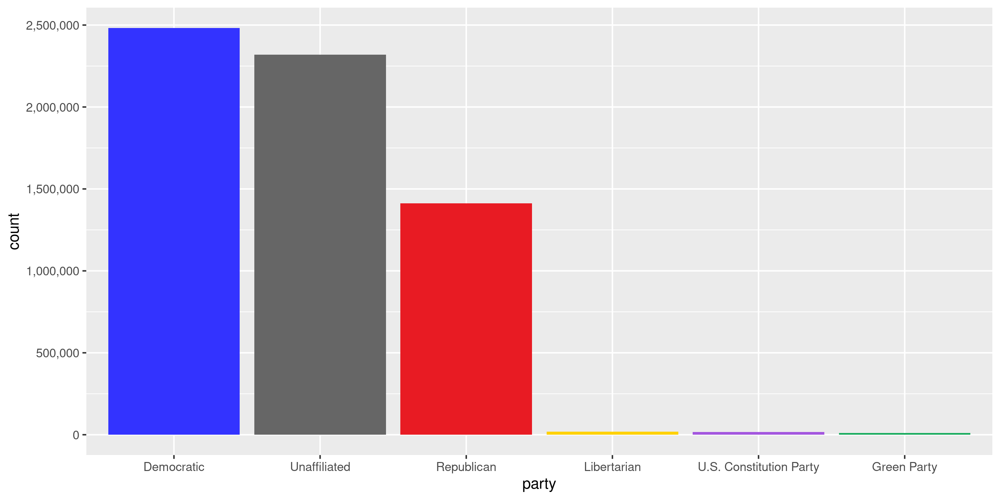
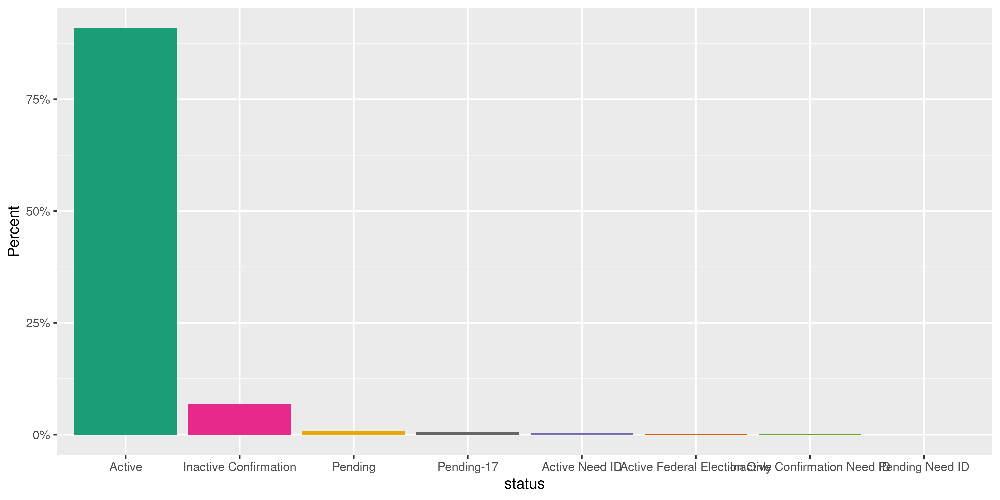
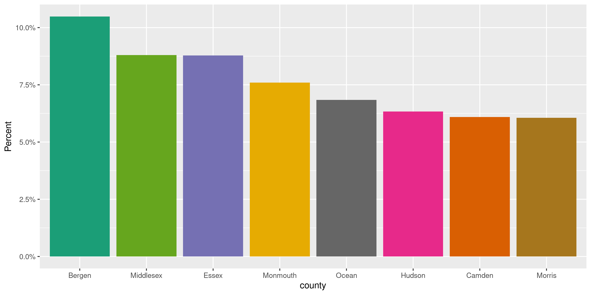
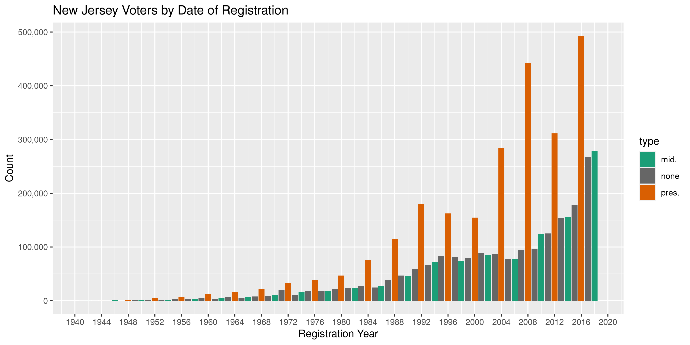
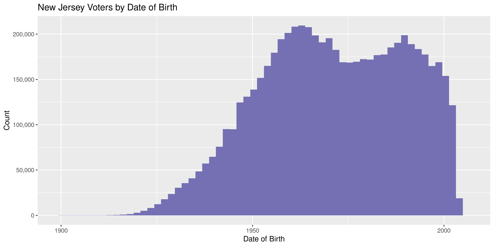

New Jersey Voters
================
Kiernan Nicholls
Tue Jan 5 11:18:26 2021

  - [Project](#project)
  - [Objectives](#objectives)
  - [Packages](#packages)
  - [Data](#data)
      - [Extract](#extract)
      - [About](#about)
      - [Read](#read)
      - [Old](#old)
  - [Explore](#explore)
      - [Missing](#missing)
      - [Duplicates](#duplicates)
      - [Categorical](#categorical)
      - [Dates](#dates)
  - [Wrangle](#wrangle)
      - [Address](#address)
      - [City](#city)
  - [Conclude](#conclude)
  - [Export](#export)
  - [Upload](#upload)

<!-- Place comments regarding knitting here -->

## Project

The Accountability Project is an effort to cut across data silos and
give journalists, policy professionals, activists, and the public at
large a simple way to search across huge volumes of public data about
people and organizations.

Our goal is to standardizing public data on a few key fields by thinking
of each dataset row as a transaction. For each transaction there should
be (at least) 3 variables:

1.  All **parties** to a transaction.
2.  The **date** of the transaction.
3.  The **amount** of money involved.

## Objectives

This document describes the process used to complete the following
objectives:

1.  How many records are in the database?
2.  Check for entirely duplicated records.
3.  Check ranges of continuous variables.
4.  Is there anything blank or missing?
5.  Check for consistency issues.
6.  Create a five-digit ZIP Code called `zip`.
7.  Create a `year` field from the transaction date.
8.  Make sure there is data on both parties to a transaction.

## Packages

The following packages are needed to collect, manipulate, visualize,
analyze, and communicate these results. The `pacman` package will
facilitate their installation and attachment.

``` r
if (!require("pacman")) {
  install.packages("pacman")
}
pacman::p_load(
  tidyverse, # data manipulation
  lubridate, # datetime strings
  gluedown, # printing markdown
  janitor, # clean data frames
  campfin, # custom irw tools
  aws.s3, # aws cloud storage
  refinr, # cluster & merge
  scales, # format strings
  knitr, # knit documents
  vroom, # fast reading
  rvest, # scrape html
  glue, # code strings
  here, # project paths
  httr, # http requests
  fs # local storage 
)
```

This document should be run as part of the `R_campfin` project, which
lives as a sub-directory of the more general, language-agnostic
[`irworkshop/accountability_datacleaning`](https://github.com/irworkshop/accountability_datacleaning)
GitHub repository.

The `R_campfin` project uses the [RStudio
projects](https://support.rstudio.com/hc/en-us/articles/200526207-Using-Projects)
feature and should be run as such. The project also uses the dynamic
`here::here()` tool for file paths relative to *your* machine.

``` r
# where does this document knit?
here::i_am("nj/voters/docs/nj_voters_diary.Rmd")
```

## Data

The list of voters in New Jersey is from the Department of State’s
[Division of Elections](https://nj.gov/state/elections/index.shtml) on
their [Voter Information
Portal](https://nj.gov/state/elections/vote.shtml).

This data was requested by the Investigative Reporting Workshop on
September 18, 2020 and uploaded raw format to our AWS server.

``` r
raw_obj <- "svl-2020-0918-370128.zip"
raw_aws <- path("csv", "svl-2020-0918-370128.zip")
raw_dir <- dir_create(here("nj", "voters", "data", "raw"))
raw_zip <- path(raw_dir, raw_obj)
```

``` r
if (!file_exists(raw_zip)) {
  save_object(
    object = raw_aws,
    bucket = "publicaccountability",
    file = raw_zip,
    show_progress = TRUE,
    overwrite = FALSE
  )
}
```

### Extract

The single archive file contains separate archives by county, each of
those containing a single comma-delimited text file. We can extract the
text file from each of these archives.

``` r
zip_files <- mutate(
  .data = unzip(raw_zip, list = TRUE),
  across(Length, as_fs_bytes)
)
```

| Name                                            | Length | Date                |
| :---------------------------------------------- | -----: | :------------------ |
| vlist\_Warren.csv.zip                           |  2.69M | 2020-09-20 10:40:00 |
| ALPHA VOTER STATEWIDE 9.18.20.pdf               | 69.46K | 2020-09-18 08:35:00 |
| \_\_MACOSX/.\_ALPHA VOTER STATEWIDE 9.18.20.pdf |    276 | 2020-09-18 08:35:00 |
| vlist\_Atlantic.csv.zip                         |  6.86M | 2020-09-20 09:32:00 |
| vlist\_Bergen.csv.zip                           | 22.91M | 2020-09-20 09:32:00 |
| vlist\_Burlington.csv.zip                       | 11.32M | 2020-09-20 09:32:00 |
| vlist\_Camden.csv.zip                           | 13.16M | 2020-09-20 09:32:00 |
| vlist\_CapeMay.csv.zip                          |  2.43M | 2020-09-20 09:32:00 |
| vlist\_Cumberland.csv.zip                       |  3.04M | 2020-09-20 09:32:00 |
| vlist\_Essex.csv.zip                            | 19.53M | 2020-09-20 09:33:00 |
| vlist\_Gloucester.csv.zip                       |  7.43M | 2020-09-20 09:33:00 |
| vlist\_Hudson.csv.zip                           | 14.27M | 2020-09-20 09:56:00 |
| vlist\_Hunterdon.csv.zip                        |  3.36M | 2020-09-20 09:56:00 |
| vlist\_Mercer.csv.zip                           |  8.65M | 2020-09-20 09:56:00 |
| vlist\_Middlesex.csv.zip                        | 19.42M | 2020-09-20 09:56:00 |
| vlist\_Monmouth.csv.zip                         | 16.55M | 2020-09-20 09:57:00 |
| vlist\_Morris.csv.zip                           | 12.43M | 2020-09-20 09:57:00 |
| vlist\_Ocean.csv.zip                            | 14.78M | 2020-09-20 10:40:00 |
| vlist\_Passaic.csv.zip                          | 10.88M | 2020-09-20 10:40:00 |
| vlist\_Salem.csv.zip                            |  1.53M | 2020-09-20 10:40:00 |
| vlist\_Somerset.csv.zip                         |  8.56M | 2020-09-20 10:40:00 |
| vlist\_Sussex.csv.zip                           |  3.59M | 2020-09-20 10:40:00 |
| vlist\_Union.csv.zip                            | 12.02M | 2020-09-20 10:40:00 |

``` r
raw_paths <- unzip(
  zipfile = raw_zip,
  exdir = raw_dir,
  junkpaths = TRUE,
  files = str_subset(
    string = zip_files$Name, 
    pattern = "^_", 
    negate = TRUE
  )
)
```

``` r
county_zip <- str_subset(raw_paths, "zip$")
raw_paths <- character(length(county_zip))
csv_dir <- dir_create(here("nj", "voters", "data", "csv"))
```

``` r
for (i in seq_along(county_zip)) {
  aa <- unzip(county_zip[i], list = TRUE)
  raw_paths[i] <- unzip(
    zipfile = county_zip[i],
    exdir = csv_dir,
    junkpaths = TRUE,
    files = str_subset(
      string = aa$Name, 
      pattern = "^_", 
      negate = TRUE
    )
  )
}
```

### About

The archive file also contains a PDF file describing the layout of these
text files and some of the codes used.

##### Voter Status

| code | status                        |
| :--- | :---------------------------- |
| A    | Active                        |
| AD   | Active Need ID                |
| AF   | Active Federal Election Only  |
| IF   | Inactive Confirmation         |
| ID   | Inactive Confirmation Need ID |
| P    | Pending                       |
| PD   | Pending Need ID               |
| P7   | Pending-17                    |
| 7D   | Pending-17 Need ID            |

##### Party Code

| code | party                   |
| :--- | :---------------------- |
| CNV  | Conservative Party      |
| DEM  | Democratic              |
| GRE  | Green Party             |
| LIB  | Libertarian Party       |
| NAT  | Natural Law Party       |
| RFP  | Reform Party            |
| REP  | Republican              |
| SSP  | Socialist Party         |
| CON  | U.S. Constitution Party |
| UNA  | Unaffiliated            |

##### File Layout

| FIELD NAME      | FIELD DATA                 | FIELD TYPE       |
| :-------------- | :------------------------- | :--------------- |
| `displayId`     | Voter ID                   | TEXT             |
| `leg_id`        | Legacy Voter ID            | TEXT             |
| `party`         | Party                      | TEXT             |
| `status`        | Status                     | TEXT             |
| `last`          | Last Name                  | TEXT             |
| `first`         | First Name                 | TEXT             |
| `middle`        | Middle Name                | TEXT             |
| `suffix`        | Suffix                     | TEXT             |
| `dob`           | Date of Birth              | DATE(MM/DD/YYYY) |
| `street_num`    | Residence Street Number    | TEXT             |
| `street_pre`    | Residence Street Prefix    | TEXT             |
| `street_post`   | Residence Street Post      | TEXT             |
| `street_base`   | Residence Base Street Name | TEXT             |
| `street_suff`   | Residence Street Suffix    | TEXT             |
| `street_name`   | Residence Street Name      | TEXT             |
| `apt_unit`      | Residence Apt/Unit         | TEXT             |
| `city`          | Residence City             | TEXT             |
| `zip`           | Residence Zip              | TEXT             |
| `county`        | County                     | TEXT             |
| `municipality`  | Municipality               | TEXT             |
| `ward`          | Ward                       | TEXT             |
| `district`      | District                   | TEXT             |
| `congressional` | Congressional District     | TEXT             |
| `legislative`   | Legislative District       | TEXT             |
| `freeholder`    | Freeholder District        | TEXT             |
| `school`        | School District            | TEXT             |
| `fire`          | Fire District              | TEXT             |

### Read

Using the record layout given in the PDF file, we can read each of the
21 text files into a single data frame.

``` r
njv <- map_df(
  .x = raw_paths,
  .f = read_delim,
  .id = "source_file",
  delim = ",",
  guess_max = 0,
  escape_backslash = FALSE,
  escape_double = FALSE,
  col_types = cols(
    .default = col_character(),
    dob = col_date()
  )
)
```

``` r
njv <- njv %>%
  relocate(source_file, .after = last_col()) %>% 
  mutate(source_file = basename(raw_paths)[as.integer(source_file)])
```

### Old

The Investigative Reporting Workshop previously requested this data in
November of 2019. The data received had a slightly different structure
from the data from 2020. This includes the lack of a statewide voter ID
and the presence of the voter registration date. The 2020 data contained
the same legacy county ID used in 2019, meaning we can use this ID to
identify the registration date for any voter found in the 2019 database.

``` r
old_aws <- path("csv", "nj_voters.csv")
old_csv <- path(dirname(raw_dir), "nj_voters_old.csv")
```

``` r
if (!file_exists(old_csv)) {
  save_object(
    object = old_aws,
    bucket = "publicaccountability",
    file = old_csv,
    show_progress = TRUE,
    overwrite = FALSE
  )
}
```

``` r
njo <- read_csv(
  file = old_csv,
  col_types = cols(
    .default = col_character(),
    DATE_REGISTERED = col_date("%m/%d/%Y"),
    BIRTH_DATE = col_date("%m/%d/%Y")
  )
)
```

``` r
prop_distinct(njo$VOTER_ID)
#> [1] 0.9999967
prop_in(njv$leg_id, njo$VOTER_ID)
#> [1] 0.9095981
old_info <- njo %>% 
  select(
    county = county_name,
    leg_id = VOTER_ID,
    reg_date = DATE_REGISTERED,
    sex = SEX
  )
```

``` r
rm(njo)
flush_memory(2)
```

``` r
njv <- left_join(
  x = njv,
  y = old_info,
  by = c(
    "county",
    "leg_id"
  )
)
```

## Explore

There are 6,293,323 rows of 30 columns. Each column represents a single
voter registered in the state of New Jersey.

``` r
glimpse(njv)
#> Rows: 6,293,323
#> Columns: 30
#> $ displayId     <chr> "B0143252462", "A6501952462", "B0687552464", "K5377653059", "I5888051551", "A3178352451", "I513…
#> $ leg_id        <chr> "118056648", "118053466", "118064946", "150827735", "104630130", "118002131", "533924393", "151…
#> $ party         <chr> "Republican", "Republican", "Republican", "Democratic", "Democratic", "Unaffiliated", "Unaffili…
#> $ status        <chr> "Active", "Active", "Active", "Active", "Inactive Confirmation", "Inactive Confirmation", "Acti…
#> $ last          <chr> "AAROE", "AAROE", "AAROE", "AARON", "AARON BERRON", "AARONSON", "ABAD", "ABAD", "ABAD-ROJAS", "…
#> $ first         <chr> "BARBARA", "FLORA", "LYN", "STACEY", "MERLYN", "PAMELA", "CRUCITA", "FRANCISCO", "MARCIA", "ALL…
#> $ middle        <chr> "A", "L", "P", "B", NA, "S", "Y", "J", "A", "J", "M", "M", NA, "W", NA, "C", "C", "J", NA, "R",…
#> $ suffix        <chr> NA, NA, NA, NA, NA, NA, NA, NA, NA, NA, NA, NA, NA, NA, NA, NA, NA, NA, NA, NA, NA, NA, NA, NA,…
#> $ dob           <date> 1947-03-16, 1932-05-09, 1946-01-22, 1968-10-04, 1970-08-14, 1964-09-30, 1954-10-21, 1973-09-20…
#> $ street_num    <chr> "100", "78", "100", "10", "16", "9", "1014", "324", "324", "36", "36", "9", "1404", "16", "16",…
#> $ street_pre    <chr> NA, NA, NA, NA, NA, NA, NA, NA, NA, NA, NA, NA, NA, NA, NA, NA, NA, NA, NA, NA, NA, NA, NA, NA,…
#> $ street_post   <chr> NA, NA, NA, NA, NA, NA, NA, NA, NA, NA, NA, NA, NA, NA, NA, NA, NA, NA, NA, NA, NA, NA, NA, NA,…
#> $ street_base   <chr> NA, NA, NA, NA, NA, NA, "HOPE BRIDGEVILLE", NA, NA, NA, NA, NA, NA, NA, NA, NA, "MANSFIELD", "M…
#> $ street_suff   <chr> NA, NA, NA, NA, NA, NA, "RD", NA, NA, NA, NA, NA, NA, NA, NA, NA, "VLG", "VLG", NA, NA, NA, NA,…
#> $ street_name   <chr> "Hartmans Corner Rd", "Kensington Cir", "Hartmans Corner Rd", "Dogwood Ct", "Washington Square …
#> $ apt_unit      <chr> NA, NA, NA, NA, NA, NA, NA, NA, NA, NA, NA, NA, NA, NA, NA, NA, NA, NA, NA, NA, NA, NA, NA, NA,…
#> $ city          <chr> "Washington", "Belvidere", "Washington", "Hackettstown", "Washington", "Columbia", "BELVIDERE",…
#> $ zip           <chr> "07882", "07823", "07882", "07840", "07882", "07832", "07823", "07840", "07840", "07840", "0784…
#> $ county        <chr> "Warren", "Warren", "Warren", "Warren", "Warren", "Warren", "Warren", "Warren", "Warren", "Warr…
#> $ municipality  <chr> "Washington Township", "White Township", "Washington Township", "Independence Township", "Washi…
#> $ ward          <chr> "0", "0", "0", "0", "0", "0", "0", "0", "0", "0", "0", "0", "0", "0", "0", "0", "0", "0", "0", …
#> $ district      <chr> "1", "2", "1", "3", "2", "1", "2", "5", "5", "1", "1", "1", "3", "2", "2", "1", "6", "6", "2", …
#> $ congressional <chr> "5", "5", "5", "5", "5", "5", "5", "5", "5", "5", "5", "5", "5", "5", "5", "5", "5", "5", "5", …
#> $ legislative   <chr> "23", "24", "23", "24", "23", "24", "24", "23", "23", "24", "24", "23", "23", "24", "24", "24",…
#> $ freeholder    <chr> "0", "0", "0", "0", "0", "0", "0", "0", "0", "0", "0", "0", "0", "0", "0", "0", "0", "0", "0", …
#> $ school        <chr> "0", "0", "0", "0", "0", "0", "0", "0", "0", "0", "0", "0", "0", "0", "0", "0", "0", "0", "0", …
#> $ fire          <chr> "0", "0", "0", "0", "0", "0", "0", "0", "0", "0", "0", "0", "0", "0", "0", "0", "0", "0", "0", …
#> $ source_file   <chr> "vlist_Warren.csv", "vlist_Warren.csv", "vlist_Warren.csv", "vlist_Warren.csv", "vlist_Warren.c…
#> $ reg_date      <date> 1983-04-08, 1983-12-29, 1978-09-30, 2016-10-15, 2017-03-21, 1998-08-21, 2017-03-06, 2010-06-10…
#> $ sex           <chr> "F", "F", "M", "F", "N", "F", "F", "M", "F", "N", "F", "F", "N", "N", "N", "N", "F", "M", "N", …
tail(njv)
#> # A tibble: 6 x 30
#>   displayId leg_id party status last  first middle suffix dob        street_num street_pre street_post street_base
#>   <chr>     <chr>  <chr> <chr>  <chr> <chr> <chr>  <chr>  <date>     <chr>      <chr>      <chr>       <chr>      
#> 1 O3870311… <NA>   Demo… Active ZYSKA LAUR… E      <NA>   2002-01-31 95         <NA>       <NA>        SPRING RID…
#> 2 A6509423… <NA>   Demo… Pendi… ZYSKA LUCAS ANTHO… <NA>   2000-12-14 95         <NA>       <NA>        SPRING RID…
#> 3 B1027551… 10618… Repu… Active ZYSKA MICH… <NA>   <NA>   1965-08-26 95         <NA>       <NA>        <NA>       
#> 4 D0099851… 10636… Demo… Active ZYSKA PABLO <NA>   <NA>   1965-04-07 95         <NA>       <NA>        <NA>       
#> 5 A1320551… 10609… Demo… Active ZYSKA VERO… E      <NA>   1968-02-24 115        <NA>       <NA>        <NA>       
#> 6 D0100151… 10636… Demo… Active ZYTL… MICH… <NA>   <NA>   1954-08-16 C17        <NA>       <NA>        WOODSIDE   
#> # … with 17 more variables: street_suff <chr>, street_name <chr>, apt_unit <chr>, city <chr>, zip <chr>, county <chr>,
#> #   municipality <chr>, ward <chr>, district <chr>, congressional <chr>, legislative <chr>, freeholder <chr>,
#> #   school <chr>, fire <chr>, source_file <chr>, reg_date <date>, sex <chr>
```

### Missing

Columns vary in their degree of missing values.

``` r
col_stats(njv, count_na)
#> # A tibble: 30 x 4
#>    col           class        n           p
#>    <chr>         <chr>    <int>       <dbl>
#>  1 displayId     <chr>        1 0.000000159
#>  2 leg_id        <chr>   213961 0.0340     
#>  3 party         <chr>        1 0.000000159
#>  4 status        <chr>        0 0          
#>  5 last          <chr>      115 0.0000183  
#>  6 first         <chr>       30 0.00000477 
#>  7 middle        <chr>  1568786 0.249      
#>  8 suffix        <chr>  6033771 0.959      
#>  9 dob           <date>       2 0.000000318
#> 10 street_num    <chr>      605 0.0000961  
#> 11 street_pre    <chr>  6210229 0.987      
#> 12 street_post   <chr>  6276394 0.997      
#> 13 street_base   <chr>  5326305 0.846      
#> 14 street_suff   <chr>  5364154 0.852      
#> 15 street_name   <chr>      501 0.0000796  
#> 16 apt_unit      <chr>  5228795 0.831      
#> 17 city          <chr>       71 0.0000113  
#> 18 zip           <chr>       71 0.0000113  
#> 19 county        <chr>        0 0          
#> 20 municipality  <chr>        0 0          
#> 21 ward          <chr>        6 0.000000953
#> 22 district      <chr>        7 0.00000111 
#> 23 congressional <chr>        8 0.00000127 
#> 24 legislative   <chr>        8 0.00000127 
#> 25 freeholder    <chr>      182 0.0000289  
#> 26 school        <chr>      165 0.0000262  
#> 27 fire          <chr>       38 0.00000604 
#> 28 source_file   <chr>        0 0          
#> 29 reg_date      <date> 1022078 0.162      
#> 30 sex           <chr>  1022077 0.162
```

We can flag any record missing a key variable needed to identify a
transaction.

``` r
nm_vars <- c("first", "middle", "last", "suffix")
njv <- flag_na(njv, c(first, last))
sum(njv$na_flag)
#> [1] 145
```

There are 145 records missing either the first or last name. It would
appear a lot of these voters come from countries with conventions for
naming different than the typical given name/surname combination.

``` r
njv %>% 
  filter(na_flag) %>% 
  select(all_of(nm_vars)) %>% 
  sample_n(20)
#> # A tibble: 20 x 4
#>    first     middle last  suffix
#>    <chr>     <chr>  <chr> <chr> 
#>  1 TIMOTHY   H      <NA>  <NA>  
#>  2 <NA>      <NA>   BEI   <NA>  
#>  3 <NA>      <NA>   ZHAO  <NA>  
#>  4 JEONG HEE <NA>   <NA>  <NA>  
#>  5 YUNG      S      <NA>  <NA>  
#>  6 ERIC      <NA>   <NA>  <NA>  
#>  7 JASON     <NA>   <NA>  <NA>  
#>  8 SEUNGHO   <NA>   <NA>  <NA>  
#>  9 KYUNGSIK  <NA>   <NA>  <NA>  
#> 10 JOHN      <NA>   <NA>  <NA>  
#> 11 CHRISTIE  Y      <NA>  <NA>  
#> 12 CHRISTINE <NA>   <NA>  <NA>  
#> 13 GRACE     H      <NA>  <NA>  
#> 14 JEEN      <NA>   <NA>  <NA>  
#> 15 KYUNG     S      <NA>  <NA>  
#> 16 SUNG      J      <NA>  <NA>  
#> 17 KYUNGHEE  <NA>   <NA>  <NA>  
#> 18 MARGARET  <NA>   <NA>  <NA>  
#> 19 ERIC      <NA>   <NA>  <NA>  
#> 20 MICHELLE  Y      <NA>  <NA>
```

### Duplicates

We can also flag any record completely duplicated across every column.

``` r
dupe_file <- here("nj", "voters", "dupes.tsv.xz")
```

``` r
if (!file_exists(dupe_file)) {
  file_create(dupe_file)
  njs <- njv %>% 
    select(-displayId, -leg_id) %>% 
    group_split(district)
  split_id <- split(njv$displayId, njv$district)
  pb <- txtProgressBar(max = length(njs), style = 3)
  for (i in seq_along(njs)) {
    d1 <- duplicated(njs[[i]], fromLast = FALSE)
    if (any(d1)) {
      d2 <- duplicated(njs[[i]], fromLast = TRUE)
      dupes <- tibble(displayId = split_id[[i]], dupe_flag = d1 | d2)
      dupes <- filter(dupes, dupe_flag == TRUE)
      vroom_write(dupes, xzfile(dupe_file), append = TRUE)
      rm(d2, dupes)
    }
    rm(d1)
    flush_memory(1)
    setTxtProgressBar(pb, i)
  }
  rm(njs)
}
```

``` r
file_size(dupe_file)
#> 64.6K
dupes <- read_tsv(
  file = xzfile(dupe_file),
  col_names = c("displayId", "dupe_flag"),
  col_types = cols(
    displayId = col_character(),
    dupe_flag = col_logical()
  )
)
dupes <- distinct(dupes)
```

``` r
nrow(njv)
#> [1] 6293323
njv <- left_join(njv, dupes, by = "displayId")
njv <- mutate(njv, dupe_flag = !is.na(dupe_flag))
sum(njv$dupe_flag)
#> [1] 10525
```

We can see that, despite supposedly unique IDs, there are duplicate
voters.

``` r
njv %>% 
  filter(dupe_flag) %>% 
  select(displayId, all_of(nm_vars), street_name, city) %>% 
  arrange(last)
#> # A tibble: 10,525 x 7
#>    displayId   first   middle last      suffix street_name     city            
#>    <chr>       <chr>   <chr>  <chr>     <chr>  <chr>           <chr>           
#>  1 L6144652726 VERA    L      ABABIO    <NA>   Belmont Ln      Willingboro     
#>  2 F3266653678 VERA    L      ABABIO    <NA>   Belmont Ln      Willingboro     
#>  3 D2962652517 JOSEPH  P      ABBADESSA <NA>   Kinderkamack Rd Oradell         
#>  4 P3149053171 JOSEPH  P      ABBADESSA <NA>   Kinderkamack Rd Oradell         
#>  5 O2893452781 JOHN    C      ABBOTT    <NA>   Farmingdale Rd  Wayne           
#>  6 K4789753418 JOHN    C      ABBOTT    <NA>   Farmingdale Rd  Wayne           
#>  7 I4007251179 ROBERT  H      ABBOTT    <NA>   S 24th St       Kenilworth      
#>  8 K2320251220 ROBERT  H      ABBOTT    <NA>   S 24th St       Kenilworth      
#>  9 J5300651571 MELISSA C      ABDELHADY <NA>   PINE ST         NORTH MIDDLETOWN
#> 10 A1087453936 MELISSA C      ABDELHADY <NA>   PINE ST         NORTH MIDDLETOWN
#> # … with 10,515 more rows
```

### Categorical

``` r
col_stats(njv, n_distinct)
#> # A tibble: 32 x 4
#>    col           class        n           p
#>    <chr>         <chr>    <int>       <dbl>
#>  1 displayId     <chr>  6293323 1          
#>  2 leg_id        <chr>  6079363 0.966      
#>  3 party         <chr>       11 0.00000175 
#>  4 status        <chr>       10 0.00000159 
#>  5 last          <chr>   537659 0.0854     
#>  6 first         <chr>   287251 0.0456     
#>  7 middle        <chr>    31415 0.00499    
#>  8 suffix        <chr>        8 0.00000127 
#>  9 dob           <date>   33285 0.00529    
#> 10 street_num    <chr>    23560 0.00374    
#> 11 street_pre    <chr>        9 0.00000143 
#> 12 street_post   <chr>       10 0.00000159 
#> 13 street_base   <chr>    25478 0.00405    
#> 14 street_suff   <chr>      117 0.0000186  
#> 15 street_name   <chr>    99876 0.0159     
#> 16 apt_unit      <chr>    48391 0.00769    
#> 17 city          <chr>     1504 0.000239   
#> 18 zip           <chr>      668 0.000106   
#> 19 county        <chr>       22 0.00000350 
#> 20 municipality  <chr>      557 0.0000885  
#> 21 ward          <chr>       24 0.00000381 
#> 22 district      <chr>       79 0.0000126  
#> 23 congressional <chr>       13 0.00000207 
#> 24 legislative   <chr>       41 0.00000651 
#> 25 freeholder    <chr>       11 0.00000175 
#> 26 school        <chr>        2 0.000000318
#> 27 fire          <chr>        2 0.000000318
#> 28 source_file   <chr>       21 0.00000334 
#> 29 reg_date      <date>   24384 0.00387    
#> 30 sex           <chr>        4 0.000000636
#> 31 na_flag       <lgl>        2 0.000000318
#> 32 dupe_flag     <lgl>        2 0.000000318
```

<!-- --><!-- --><!-- -->

### Dates

A significant amount of voters have a registration date of January 1,
1901. This seems to be the default date for any voter missing a real
date. This is common practice in voter data. We can remove these dates.

``` r
sum(njv$reg_date == "1901-01-01", na.rm = TRUE)
#> [1] 7950
njv$reg_date[which(njv$reg_date == "1901-01-01")] <- NA
```

We can then create variables identifying the year of birth and
registration.

``` r
njv <- mutate(
  .data = njv, 
  birth_year = year(dob),
  reg_year = year(reg_date)
)
```

<!-- -->

<!-- -->

## Wrangle

To improve the searchability of the database, we will perform some
consistent, confident string normalization. For geographic variables
like city names and ZIP codes, the corresponding `campfin::normal_*()`
functions are tailor made to facilitate this process.

The `zip` variable is already as clean as we can expect.

``` r
prop_in(njv$zip, valid_zip)
#> [1] 0.9999889
```

We will manually add a variable indicating these voters live in New
Jersey.

``` r
njv <- mutate(njv, state = "NJ")
```

### Address

For the street `addresss` variable, the `campfin::normal_address()`
function will force consistence case, remove punctuation, and abbreviate
official USPS suffixes.

``` r
njv <- njv %>% 
  unite(
    col = address_norm,
    street_num, street_pre, street_post, street_name, apt_unit,
    sep = " ",
    remove = FALSE,
    na.rm = TRUE
  ) %>% 
  relocate(address_norm, .after = last_col()) %>% 
  mutate(across(address_norm, normal_address))
```

### City

Cities are the most difficult geographic variable to normalize, simply
due to the wide variety of valid cities and formats.

#### Normal

The `campfin::normal_city()` function is a good start, again converting
case, removing punctuation, but *expanding* USPS abbreviations. We can
also remove `invalid_city` values.

``` r
norm_city <- njv %>% 
  distinct(city, state, zip) %>% 
  mutate(
    city_norm = normal_city(
      city = city, 
      abbs = usps_city,
      states = c("NJ", "DC", "NEW JERSEY"),
      na = invalid_city,
      na_rep = TRUE
    )
  )
```

#### Swap

We can further improve normalization by comparing our normalized value
against the *expected* value for that record’s state abbreviation and
ZIP code. If the normalized value is either an abbreviation for or very
similar to the expected value, we can confidently swap those two.

``` r
norm_city <- norm_city %>% 
  rename(city_raw = city) %>% 
  left_join(
    y = zipcodes,
    by = c("state", "zip")
  ) %>% 
  rename(city_match = city) %>% 
  mutate(
    match_abb = is_abbrev(city_norm, city_match),
    match_dist = str_dist(city_norm, city_match),
    city_swap = if_else(
      condition = !is.na(match_dist) & (match_abb | match_dist == 1),
      true = city_match,
      false = city_norm
    )
  ) %>% 
  select(
    -city_match,
    -match_dist,
    -match_abb
  ) %>% 
  rename(city = city_raw)
```

``` r
njv <- left_join(
  x = njv,
  y = norm_city,
  by = c("city", "state", "zip")
)
```

## Conclude

Before exporting, we can remove the intermediary normalization columns
and rename all added variables with the `_clean` suffix.

``` r
njv <- njv %>% 
  select(
    -city_norm,
    city_clean  = city_swap
  ) %>% 
  rename_all(~str_replace(., "_norm", "_clean")) %>% 
  rename_all(~str_remove(., "_raw")) %>% 
  relocate(state, .after = city_clean)
```

``` r
glimpse(sample_n(njv, 50))
#> Rows: 50
#> Columns: 37
#> $ displayId     <chr> "F5529851483", "E5353452562", "A3994652081", "F4455453308", "D0204754005", "H4855352992", "D567…
#> $ leg_id        <chr> "104417611", "119443701", "112387385", "152166240", "549371676", "150619473", "119317562", "121…
#> $ party         <chr> "Republican", "Democratic", "Republican", "Unaffiliated", "Unaffiliated", "Democratic", "Unaffi…
#> $ status        <chr> "Active", "Active", "Active", "Active", "Active", "Active", "Active", "Inactive Confirmation", …
#> $ last          <chr> "MAGERA", "SANTANA", "MC DERMOTT", "GETZ", "PELOUZE", "PROPERT", "MAFFEI", "VELASQUEZ", "WHALEN…
#> $ first         <chr> "MELODY", "CHRISTOPHER", "MARGARET", "MICHAEL", "TAYLOR", "EILEEN", "FRANK", "PABLO", "STEPHANI…
#> $ middle        <chr> "A", "L.", NA, "R", "V", "A", "R", NA, NA, "A", "R", "C", "J", "H", "A", NA, "A", NA, "J", "H",…
#> $ suffix        <chr> NA, NA, NA, NA, NA, NA, NA, NA, NA, NA, NA, NA, NA, NA, NA, NA, NA, NA, NA, NA, NA, NA, NA, NA,…
#> $ dob           <date> 1969-04-18, 1959-10-22, 1940-09-28, 1954-03-26, 2002-04-12, 1990-08-07, 1972-06-06, 1985-12-26…
#> $ street_num    <chr> "512", "740", "931", "400", "4", "404", "543", "47", "33", "279", "2293", "175", "1", "17", "12…
#> $ street_pre    <chr> NA, NA, "W", NA, NA, NA, NA, NA, NA, NA, NA, NA, NA, NA, NA, NA, NA, NA, NA, NA, NA, NA, NA, NA…
#> $ street_post   <chr> NA, NA, NA, NA, NA, NA, NA, NA, NA, NA, NA, NA, NA, NA, NA, NA, NA, NA, NA, NA, NA, NA, NA, NA,…
#> $ street_base   <chr> "FOX HILL RUN", NA, "MT VERNON", NA, NA, NA, NA, NA, NA, NA, "SAINT GEORGES", NA, NA, NA, NA, N…
#> $ street_suff   <chr> "DR", NA, "AVE", NA, NA, NA, NA, NA, NA, NA, "AVE", NA, NA, NA, NA, NA, NA, NA, NA, NA, NA, "WA…
#> $ street_name   <chr> "FOX HILL RUN DR", "Plympton St", "W MT VERNON AVE", "Smith St", "Clements Ct", "7th Ave", "Kin…
#> $ apt_unit      <chr> NA, NA, NA, NA, NA, "Apt 3A", NA, "# 1", NA, NA, NA, NA, NA, "# 1", NA, NA, NA, NA, NA, NA, NA,…
#> $ city          <chr> "WOODBRIDGE", "New Milford", "HADDON TOWNSHIP", "Keasbey", "Mount Laurel", "Asbury Park", "Lynd…
#> $ zip           <chr> "07095", "07646", "08033", "08832", "08054", "07712", "07071", "07522", "08055", "07054", "0706…
#> $ county        <chr> "Middlesex", "Bergen", "Camden", "Middlesex", "Burlington", "Monmouth", "Bergen", "Passaic", "B…
#> $ municipality  <chr> "Woodbridge Township", "New Milford Borough", "Haddon Township", "Woodbridge Township", "Mount …
#> $ ward          <chr> "1", "0", "0", "2", "0", "0", "0", "1", "0", "0", "2", "0", "0", "1", "3", "0", "3", "0", "0", …
#> $ district      <chr> "14", "5", "12", "1", "16", "6", "6", "3", "5", "25", "3", "5", "10", "4", "5", "22", "9", "2",…
#> $ congressional <chr> "6", "5", "1", "6", "3", "6", "9", "9", "3", "11", "10", "7", "12", "8", "7", "4", "12", "5", "…
#> $ legislative   <chr> "19", "38", "6", "19", "7", "11", "36", "35", "8", "26", "22", "25", "16", "29", "21", "12", "1…
#> $ freeholder    <chr> "0", "0", "0", "0", "0", "0", "0", "0", "0", "0", "0", "0", "0", "5", "0", "0", "0", "0", "0", …
#> $ school        <chr> "0", "0", "0", "0", "0", "0", "0", "0", "0", "0", "0", "0", "0", "0", "0", "0", "0", "0", "0", …
#> $ fire          <chr> "0", "0", "0", "0", "0", "0", "0", "0", "0", "0", "0", "0", "0", "0", "0", "0", "0", "0", "0", …
#> $ source_file   <chr> "vlist_Middlesex.csv", "vlist_Bergen.csv", "vlist_Camden.csv", "vlist_Middlesex.csv", "vlist_Bu…
#> $ reg_date      <date> 1992-02-28, 1992-10-05, 1963-08-26, 2012-01-12, NA, 2008-08-27, 1990-06-06, 2004-06-01, 2014-0…
#> $ sex           <chr> "N", "M", "F", "M", NA, "F", "M", "M", "N", "F", NA, NA, "M", "N", "N", "N", "N", "M", "M", "N"…
#> $ na_flag       <lgl> FALSE, FALSE, FALSE, FALSE, FALSE, FALSE, FALSE, FALSE, FALSE, FALSE, FALSE, FALSE, FALSE, FALS…
#> $ dupe_flag     <lgl> FALSE, FALSE, FALSE, FALSE, FALSE, FALSE, FALSE, FALSE, FALSE, FALSE, FALSE, FALSE, FALSE, FALS…
#> $ birth_year    <dbl> 1969, 1959, 1940, 1954, 2002, 1990, 1972, 1985, 1978, 1986, 2002, 2002, 1990, 1958, 1958, 1938,…
#> $ reg_year      <dbl> 1992, 1992, 1963, 2012, NA, 2008, 1990, 2004, 2014, 2012, NA, NA, 2008, 1996, 1984, 2004, 1991,…
#> $ address_clean <chr> "512 FOX HILL RUN DR", "740 PLYMPTON ST", "931 W W MT VERNON AVE", "400 SMITH ST", "4 CLEMENTS …
#> $ city_clean    <chr> "WOODBRIDGE", "NEW MILFORD", "HADDON TOWNSHIP", "KEASBEY", "MOUNT LAUREL", "ASBURY PARK", "LYND…
#> $ state         <chr> "NJ", "NJ", "NJ", "NJ", "NJ", "NJ", "NJ", "NJ", "NJ", "NJ", "NJ", "NJ", "NJ", "NJ", "NJ", "NJ",…
```

1.  There are 6,293,323 records in the database.
2.  There are 10,525 duplicate records in the database.
3.  The range and distribution of `amount` and `date` seem reasonable.
4.  There are 145 records missing key variables.
5.  Consistency in geographic data has been improved with
    `campfin::normal_*()`.
6.  The 4-digit `year` variable has been created with
    `lubridate::year()`.

## Export

Now the file can be saved on disk for upload to the Accountability
server.

``` r
clean_dir <- dir_create(here("nj", "voters", "data", "clean"))
clean_path <- path(clean_dir, "nj_voters_clean.csv")
write_csv(njv, clean_path, na = "")
(clean_size <- file_size(clean_path))
#> 1.36G
file_encoding(clean_path) %>% 
  mutate(across(path, path.abbrev))
#> # A tibble: 1 x 3
#>   path                                                                      mime            charset 
#>   <fs::path>                                                                <chr>           <chr>   
#> 1 /home/kiernan/Code/tap/R_campfin/nj/voters/data/clean/nj_voters_clean.csv application/csv us-ascii
```

## Upload

We can use the `aws.s3::put_object()` to upload the text file to the IRW
server.

``` r
aws_path <- path("csv", basename(clean_path))
if (!object_exists(aws_path, "publicaccountability")) {
  put_object(
    file = clean_path,
    object = aws_path, 
    bucket = "publicaccountability",
    acl = "public-read",
    show_progress = TRUE,
    multipart = TRUE
  )
}
aws_head <- head_object(aws_path, "publicaccountability")
(aws_size <- as_fs_bytes(attr(aws_head, "content-length")))
unname(aws_size == clean_size)
```
