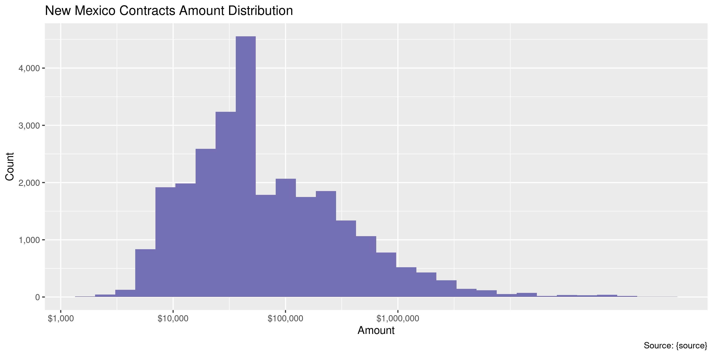
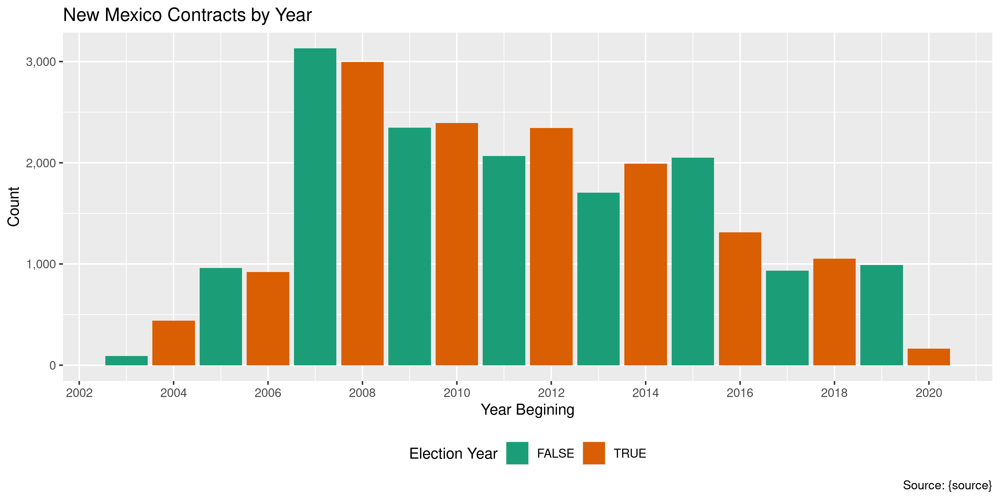

New Mexico Contracts
================
Kiernan Nicholls
2020-07-20 13:31:55

  - [Project](#project)
  - [Objectives](#objectives)
  - [Packages](#packages)
  - [Data](#data)
  - [Read](#read)
  - [Explore](#explore)
  - [Conclude](#conclude)
  - [Export](#export)
  - [Upload](#upload)
  - [Dictionary](#dictionary)

<!-- Place comments regarding knitting here -->

## Project

The Accountability Project is an effort to cut across data silos and
give journalists, policy professionals, activists, and the public at
large a simple way to search across huge volumes of public data about
people and organizations.

Our goal is to standardizing public data on a few key fields by thinking
of each dataset row as a transaction. For each transaction there should
be (at least) 3 variables:

1.  All **parties** to a transaction.
2.  The **date** of the transaction.
3.  The **amount** of money involved.

## Objectives

This document describes the process used to complete the following
objectives:

1.  How many records are in the database?
2.  Check for entirely duplicated records.
3.  Check ranges of continuous variables.
4.  Is there anything blank or missing?
5.  Check for consistency issues.
6.  Create a five-digit ZIP Code called `zip`.
7.  Create a `year` field from the transaction date.
8.  Make sure there is data on both parties to a transaction.

## Packages

The following packages are needed to collect, manipulate, visualize,
analyze, and communicate these results. The `pacman` package will
facilitate their installation and attachment.

The IRW’s `campfin` package will also have to be installed from GitHub.
This package contains functions custom made to help facilitate the
processing of campaign finance data.

``` r
if (!require("pacman")) install.packages("pacman")
pacman::p_load_gh("irworkshop/campfin")
pacman::p_load(
  tidyverse, # data manipulation
  lubridate, # datetime strings
  gluedown, # printing markdown
  magrittr, # pipe operators
  janitor, # clean data frames
  refinr, # cluster and merge
  scales, # format strings
  readxl, # read excel files
  knitr, # knit documents
  vroom, # read files fast
  rvest, # html scraping
  glue, # combine strings
  here, # relative paths
  httr, # http requests
  fs # local storage 
)
```

This document should be run as part of the `R_campfin` project, which
lives as a sub-directory of the more general, language-agnostic
[`irworkshop/accountability_datacleaning`](https://github.com/irworkshop/accountability_datacleaning)
GitHub repository.

The `R_campfin` project uses the [RStudio
projects](https://support.rstudio.com/hc/en-us/articles/200526207-Using-Projects)
feature and should be run as such. The project also uses the dynamic
`here::here()` tool for file paths relative to *your* machine.

``` r
# where does this document knit?
here::here()
#> [1] "/home/kiernan/Code/tap/R_campfin"
```

## Data

Contracts data from New Mexico was given to the Investigative Reporting
Workshop by the state Office of the General Counsel’s General Services
Department in response to an open records request. Data was provided as
both a PDF and an Excel spreadsheet, the later of which can easily be
read into R.

``` r
raw_dir <- dir_create(here("nm", "contracts", "data", "raw"))
raw_path <- path(raw_dir, "qryIPRASusanBergman.xlsx")
file_size(raw_path)
#> 1.48M
file.mtime(raw_path)
#> [1] "2020-07-20 10:46:22 EDT"
```

## Read

We will first read the entire spreadsheet as a text based data frame.

``` r
nmc <- read_excel(
  path = raw_path,
  col_types = "text",
  .name_repair = make_clean_names
)
```

Then, we can parse the various columns into their respective types.

``` r
nmc <- type_convert(
  df = nmc,
  col_types = cols(
    agency_code = col_integer(),
    amendno = col_number(),
    from_date = col_integer(),
    to_date = col_integer(),
    orig_amout = col_double(),
    amd_amount = col_double()
  )
)
```

``` r
nmc <- mutate(nmc, across(ends_with("date"), excel_numeric_to_date))
nmc <- rename(nmc, amount = orig_amout)
```

## Explore

``` r
glimpse(nmc)
#> Rows: 27,884
#> Columns: 9
#> $ agency_code <int> NA, NA, NA, NA, NA, NA, NA, NA, NA, NA, NA, NA, NA, NA, NA, NA, NA, NA, NA, …
#> $ agency      <chr> "Attorney General", "Attorney General", "Children, Youth and Families Dept",…
#> $ contract_no <chr> "06 305 P625 00001", "06 305 P625 00013", "07 690 0000 01836", "08 690 0000 …
#> $ amendno     <dbl> 5, 1, 1, 1, 1, 2, 1, 2, 1, 1, 1, 1, 1, 2, 2, 2, 2, 1, 1, 1, 1, 1, 1, 2, 1, N…
#> $ from_date   <date> 2005-08-10, 2005-10-06, 2006-08-18, 2007-07-01, 2011-01-24, 2009-09-25, 201…
#> $ to_date     <date> 2009-06-30, 2007-12-31, 2007-12-31, 2008-06-30, 2011-06-30, 2010-11-01, 201…
#> $ contractor  <chr> "COLUMBIA GROUP INC", "GRIFFIN & ASSOCIATES INC", "PAULA SCHAEFER & ASSOCIAT…
#> $ amount      <dbl> 50000.00, 40000.00, 30000.00, 12000.00, 5000.00, 9485.00, 200000.00, 80000.0…
#> $ amd_amount  <dbl> 20000.00, -20000.00, 0.00, 0.00, 5500.00, 0.00, 42859.98, 0.00, 2000.00, 120…
tail(nmc)
#> # A tibble: 6 x 9
#>   agency_code agency     contract_no  amendno from_date  to_date    contractor    amount amd_amount
#>         <int> <chr>      <chr>          <dbl> <date>     <date>     <chr>          <dbl>      <dbl>
#> 1         950 Higher Ed… 19 950 1000…      NA 2019-01-08 2019-06-30 XYNERGY INC   20702.         NA
#> 2         950 Higher Ed… 20 950 6819…      NA 2019-07-26 2020-06-30 FANTINE, JEF… 51516.         NA
#> 3         950 Higher Ed… 20 950 6819…      NA 2020-01-14 2020-06-30 FANTINE ACAD… 21728.         NA
#> 4         950 Higher Ed… 20 950 6828…      NA 2019-10-16 2020-06-30 XCALIBUR SOF… 50000          NA
#> 5         950 Higher Ed… 20 950 8920…      NA 2019-07-30 2020-06-30 HAUBOLD, GLE… 36327.         NA
#> 6         950 Higher Ed… 20 950 9100…      NA 2019-08-13 2020-06-30 REDW, LLC     37001.         NA
```

### Missing

Variables differ in their degree of missing values, but none need to be
flagged.

``` r
col_stats(nmc, count_na)
#> # A tibble: 9 x 4
#>   col         class      n        p
#>   <chr>       <chr>  <int>    <dbl>
#> 1 agency_code <int>     25 0.000897
#> 2 agency      <chr>      0 0       
#> 3 contract_no <chr>      0 0       
#> 4 amendno     <dbl>  18992 0.681   
#> 5 from_date   <date>     0 0       
#> 6 to_date     <date>     0 0       
#> 7 contractor  <chr>      0 0       
#> 8 amount      <dbl>      0 0       
#> 9 amd_amount  <dbl>  18998 0.681
```

### Duplicates

Ignoring the supposedly unique `contract_no`, there are some records
with entirely duplicated values across every variable.

``` r
nmc <- flag_dupes(nmc, -contract_no)
sum(nmc$dupe_flag)
#> [1] 137
```

``` r
nmc %>% 
  filter(dupe_flag) %>% 
  select(contract_no, from_date, agency, amount, contractor)
#> # A tibble: 137 x 5
#>    contract_no       from_date  agency                           amount contractor               
#>    <chr>             <date>     <chr>                             <dbl> <chr>                    
#>  1 12 333 Z207 TR239 2012-05-24 Taxation and Revenue Department  75114  ACRO SERVICE CORPORATION 
#>  2 12 333 Z207 TR240 2012-05-24 Taxation and Revenue Department  75114  ACRO SERVICE CORPORATION 
#>  3 15 333 Z007 17155 2014-07-01 Taxation and Revenue Department 131310. DOC TECHNOLOGY GROUP     
#>  4 15 333 Z007 17399 2014-07-01 Taxation and Revenue Department 131310. DOC TECHNOLOGY GROUP     
#>  5 15 333 Z007 17738 2014-07-01 Taxation and Revenue Department 120405. VENTECH SOLUTIONS INC    
#>  6 15 333 Z907 17783 2014-07-01 Taxation and Revenue Department 120405. VENTECH SOLUTIONS INC    
#>  7 17 333 0000 20893 2017-06-02 Taxation and Revenue Department  50000  TEKSYSTEMS               
#>  8 17 333 0000 20894 2017-06-02 Taxation and Revenue Department  50000  TEKSYSTEMS               
#>  9 13 350 4905 00009 2012-07-01 General Services Department     400000  RICK FOLEY INVESTIGATIONS
#> 10 13 350 5905 00006 2012-07-01 General Services Department     400000  RICK FOLEY INVESTIGATIONS
#> # … with 127 more rows
```

### Amounts

``` r
summary(nmc$amount)
#>      Min.   1st Qu.    Median      Mean   3rd Qu.      Max. 
#>         0     20466     50000    624823    178690 225000000
percent(mean(nmc$amount <= 0), 0.01)
#> [1] "0.63%"
```

<!-- -->

### Dates

We can add the calendar year from `date` with `lubridate::year()`

``` r
nmc <- mutate(nmc, from_year = year(from_date))
```

``` r
min(nmc$from_date)
#> [1] "2003-07-01"
sum(nmc$from_year < 2000)
#> [1] 0
max(nmc$from_date)
#> [1] "2020-06-19"
sum(nmc$from_date > today())
#> [1] 0
```

<!-- -->

## Conclude

``` r
glimpse(sample_n(nmc, 50))
#> Rows: 50
#> Columns: 11
#> $ agency_code <int> 630, 624, 924, 665, 419, 630, 341, 665, 419, 665, 665, 352, 665, 630, 690, 6…
#> $ agency      <chr> "Human Services Department", "Aging and Long-Term Services Dept", "Public Ed…
#> $ contract_no <chr> "07 630 8000 00008", "09 624 1000 00002", "15 924 P527 00255", "12 665 6600 …
#> $ amendno     <dbl> 3, 1, NA, NA, 1, NA, NA, 2, NA, NA, 1, NA, NA, 1, NA, 2, NA, NA, NA, 1, 2, N…
#> $ from_date   <date> 2006-07-01, 2008-08-13, 2014-10-31, 2011-07-01, 2008-07-01, 2007-07-01, 201…
#> $ to_date     <date> 2010-06-30, 2009-06-30, 2015-08-31, 2012-06-30, 2009-06-15, 2008-06-30, 201…
#> $ contractor  <chr> "MERCER HEALTH & BENEFITS CONSU", "MOSS ADAMS, LLP", "REDHOUSE TRAINING & CO…
#> $ amount      <dbl> 2069500.00, 39925.00, 40000.00, 8610.00, 42000.00, 143769.00, 600000.00, 293…
#> $ amd_amount  <dbl> 200000.00, 12810.00, NA, NA, -5000.00, NA, NA, -30000.00, NA, NA, 125000.00,…
#> $ dupe_flag   <lgl> FALSE, FALSE, FALSE, FALSE, FALSE, FALSE, FALSE, FALSE, FALSE, FALSE, FALSE,…
#> $ from_year   <dbl> 2006, 2008, 2014, 2011, 2008, 2007, 2016, 2015, 2019, 2010, 2018, 2015, 2008…
```

1.  There are 27,884 records in the database.
2.  There are 137 duplicate records in the database.
3.  The range and distribution of `amount` and `date` seem reasonable.
4.  There are 0 records missing key variables.
5.  Consistency in geographic data has been improved with
    `campfin::normal_*()`.
6.  The 4-digit `year` variable has been created with
    `lubridate::year()`.

## Export

Now the file can be saved on disk for upload to the Accountability
server.

``` r
clean_dir <- dir_create(here("nm", "contracts", "data", "clean"))
clean_path <- path(clean_dir, "nm_contracts_clean.csv")
write_csv(nmc, clean_path, na = "")
file_size(clean_path)
#> 3.11M
file_encoding(clean_path) %>% 
  mutate(across(path, path.abbrev))
#> # A tibble: 1 x 3
#>   path                                             mime            charset
#>   <chr>                                            <chr>           <chr>  
#> 1 ~/nm/contracts/data/clean/nm_contracts_clean.csv application/csv utf-8
```

## Upload

Using the [duckr](https://github.com/kiernann/duckr) R package, we can
wrap around the [duck](https://duck.sh/) command line tool to upload the
file to the IRW server.

``` r
# remotes::install_github("kiernann/duckr")
s3_dir <- "s3:/publicaccountability/csv/"
s3_path <- path(s3_dir, basename(clean_path))
if (require(duckr)) {
  duckr::duck_upload(clean_path, s3_path)
}
```

## Dictionary

The following table describes the variables in our final exported file:

| Column        | Type        | Definition                     |
| :------------ | :---------- | :----------------------------- |
| `agency_code` | `integer`   | Numeric agency code            |
| `agency`      | `character` | Spending agency name           |
| `contract_no` | `character` | Unique contract number         |
| `amendno`     | `double`    | Contract amendment number      |
| `from_date`   | `double`    | Contract start date            |
| `to_date`     | `double`    | Contract end date              |
| `contractor`  | `character` | Recieving contractor name      |
| `amount`      | `double`    | Original contract value        |
| `amd_amount`  | `double`    | Amended contract value         |
| `dupe_flag`   | `logical`   | Flag indicating missing values |
| `from_year`   | `double`    | Calendar year contract began   |
