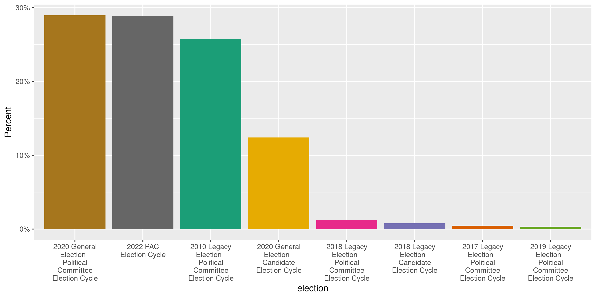
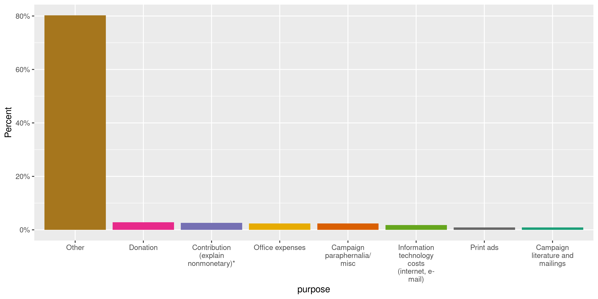
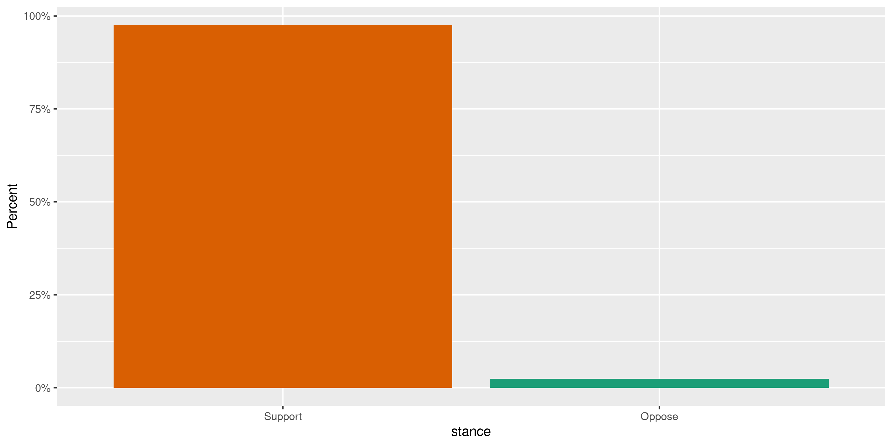
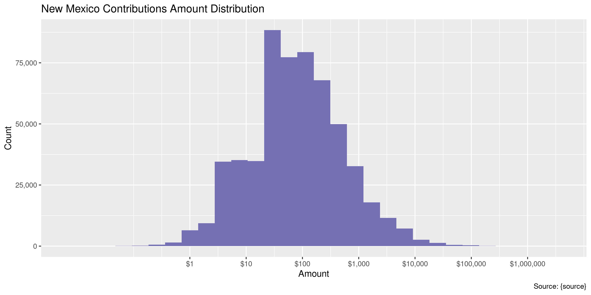

New Mexico Expenditures
================
Kiernan Nicholls
Mon Aug 23 11:44:41 2021

-   [Project](#project)
-   [Objectives](#objectives)
-   [Packages](#packages)
-   [Data](#data)
-   [Download](#download)
    -   [Old](#old)
    -   [New](#new)
-   [Read](#read)
    -   [Old](#old-1)
    -   [New](#new-1)
    -   [Combine](#combine)
-   [Explore](#explore)
    -   [Missing](#missing)
    -   [Duplicates](#duplicates)
    -   [Categorical](#categorical)
    -   [Amounts](#amounts)
    -   [Dates](#dates)
-   [Wrangle](#wrangle)
    -   [Address](#address)
    -   [ZIP](#zip)
    -   [State](#state)
    -   [City](#city)
-   [Conclude](#conclude)
-   [Export](#export)
-   [Upload](#upload)

<!-- Place comments regarding knitting here -->

## Project

The Accountability Project is an effort to cut across data silos and
give journalists, policy professionals, activists, and the public at
large a simple way to search across huge volumes of public data about
people and organizations.

Our goal is to standardize public data on a few key fields by thinking
of each dataset row as a transaction. For each transaction there should
be (at least) 3 variables:

1.  All **parties** to a transaction.
2.  The **date** of the transaction.
3.  The **amount** of money involved.

## Objectives

This document describes the process used to complete the following
objectives:

1.  How many records are in the database?
2.  Check for entirely duplicated records.
3.  Check ranges of continuous variables.
4.  Is there anything blank or missing?
5.  Check for consistency issues.
6.  Create a five-digit ZIP Code called `zip`.
7.  Create a `year` field from the transaction date.
8.  Make sure there is data on both parties to a transaction.

## Packages

The following packages are needed to collect, manipulate, visualize,
analyze, and communicate these results. The `pacman` package will
facilitate their installation and attachment.

``` r
if (!require("pacman")) {
  install.packages("pacman")
}
pacman::p_load(
  tidyverse, # data manipulation
  lubridate, # datetime strings
  gluedown, # printing markdown
  janitor, # clean data frames
  campfin, # custom irw tools
  aws.s3, # aws cloud storage
  refinr, # cluster & merge
  scales, # format strings
  knitr, # knit documents
  vroom, # fast reading
  rvest, # scrape html
  glue, # code strings
  here, # project paths
  httr, # http requests
  fs # local storage 
)
```

This document should be run as part of the `R_campfin` project, which
lives as a sub-directory of the more general, language-agnostic
[`irworkshop/accountability_datacleaning`](https://github.com/irworkshop/accountability_datacleaning)
GitHub repository.

The `R_campfin` project uses the [RStudio
projects](https://support.rstudio.com/hc/en-us/articles/200526207-Using-Projects)
feature and should be run as such. The project also uses the dynamic
`here::here()` tool for file paths relative to *your* machine.

``` r
# where does this document knit?
here::i_am("nm/contribs/docs/nm_contribs_diary.Rmd")
```

## Data

The data available at [the old CFIS
website](https://www.cfis.state.nm.us/media/CFIS_Data_Download.aspx) is
decommissioned and no longer updated. The most recent expenditures in
the data were made in October of 2020.

> #### !!Attention Candidates, Political Committees and Lobbyists!!
>
> This system has been decommissioned and is no longer available for use
> by candidates and political committees. To file a disclosure report or
> to register a new political committee, please use the new CFIS at
> <https://login.cfis.sos.state.nm.us>
>
> Lobbyists, please continue to use this system through calendar year
> 2020. You will use the new CFIS for 2021. More information will
> follow. If you have any support questions, please contact
> <sos.elections@state.nm.us>.

Data from 2020 onward can be found from the New Mexico Secretary of
state at a [new CRIS portal](https://login.cfis.sos.state.nm.us/).

> This page provides comma separated value (CSV) downloads of
> contribution, expenditure, and loan data for each reporting year in a
> zipped file format. These files can be downloaded and imported into
> other applications (Microsoft Excel, Microsoft Access, etc.)
>
> This data is extracted as it existed as of 08/17/2021 12:09 PM.

The new CRIS page also provides a [record
layout](https://login.cfis.sos.state.nm.us/Template/Expenditures%20File%20Layout%20Key.pdf)
for expenditures. From this layout, we know the new data has a different
structure than the old data. We will first download the old data and
format it to take an overlapping structure to the newer data.

## Download

We can download data from both CRIS websites using a combination of GET
and POST requests made to the server. These requests define what data we
are interested in and save the file locally.

``` r
raw_dir <- dir_create(here("nm", "expends", "data", "raw"))
con_dir <- dir_create(here("nm", "contribs", "data", "raw"))
if (!dir_exists(con_dir)) {
  con_dir <- raw_dir
}
```

### Old

The old CRIS website uses an ASP.NET server. We can visit the home page
and then use the cookies from that visit to make two subsequent requests
for campaign finance transactions made by (1) Candidates and (2) PACs.

> #### CFIS Data Download
>
> The files available will be downloaded in a CSV file format. To
> download a file, select the type of CFIS data and corresponding
> filters and click Download Data. The file will be downloaded and
> should appear in the lower left corner of your browser window. If you
> do not see the file, please check your browser’s pop-up blocker
> settings.

> ##### Transactions
>
> Download a listing of all contributions and expenditures for one or
> all filing periods for candidates, PACs, and Lobbyists.
>
> The CFIS data available for download is updated daily at 12:00AM and
> 12:00PM MST.

``` r
nm_url <- "https://www.cfis.state.nm.us/media/CFIS_Data_Download.aspx"
set_config(config(ssl_verifypeer = 0L))
nm_home <- GET(nm_url)
nm_html <- content(nm_home, as = "parsed")
nm_cookie <- cookies(nm_home)
nm_cookie <- setNames(nm_cookie$value, nm_cookie$name)
```

``` r
view_state <- list(
  `__VIEWSTATE` = nm_html %>% 
    html_element("#__VIEWSTATE") %>% 
    html_attr("value"),
  `__VIEWSTATEGENERATOR` = nm_html %>% 
    html_element("#__VIEWSTATEGENERATOR") %>% 
    html_attr("value"),
  `__EVENTVALIDATION` = nm_html %>% 
    html_element("#__EVENTVALIDATION") %>% 
    html_attr("value")
)
```

``` r
nm_types <- tribble(
  ~look_for,    ~file_name,
  "Candidates", "CandidateTransactions.csv", 
# "Lobbyist",   "LobbyistTransactions.csv", 
  "PACs",       "PACTransactions.csv",
)
```

| “Look For” | File Path                                         |
|:-----------|:--------------------------------------------------|
| Candidates | \~/nm/contribs/data/raw/CandidateTransactions.csv |
| PACs       | \~/nm/contribs/data/raw/PACTransactions.csv       |

``` r
for (look_for in nm_types$look_for) {
  message(look_for)
  csv_path <- nm_types$file_name[match(look_for, nm_types$look_for)]
  if (!file_exists(csv_path)) {
    Sys.sleep(runif(1, 1, 3))
    POST(
      url = "https://www.cfis.state.nm.us/media/CFIS_Data_Download.aspx",
      write_disk(path = csv_path, overwrite = TRUE),
      set_cookies(nm_cookie),
      progress("down"),
      body = c( # combine extracted VIEWSTATE with form options 
        view_state, # __VIEWSTATE, __VIEWSTATEGENERATOR, __EVENTVALIDATION
        list( # dropdown body arguments: ALL rows for each file type
          `ctl00$ContentPlaceHolder1$header1$ddlCSVSelect` = "Transactions",
          `ctl00$ContentPlaceHolder1$header1$ddlRegisrationYear` = "0",
          `ctl00$ContentPlaceHolder1$header1$ddlViewBy` = "Lobbyist", # keep
          `ctl00$ContentPlaceHolder1$header1$hfFilePeriodFilter` = "ALL",
          `ctl00$ContentPlaceHolder1$header1$ddlLookFor` = look_for, # change
          `ctl00$ContentPlaceHolder1$header1$ddlFilePeriodYear` = "0",
          `ctl00$ContentPlaceHolder1$header1$ddlFPCan` = "ALL",
          `ctl00$ContentPlaceHolder1$header1$Button1` = "Download+Data",
          `ctl00$ContentPlaceHolder1$header1$hfLobbyistFilingPeriod` = "ALL",
          `ctl00$ContentPlaceHolder1$header1$ddlTransRegYear` = "0",
          `ctl00$ContentPlaceHolder1$header1$ddlFPLob` = "ALL"
        )
      )
    )
  }
}
```

### New

The new CRIS website hosts separate annual files for political
contributions and expenditures. These files can be checked with a
request to the page.

``` r
nm_check <- GET(
  "https://login.cfis.sos.state.nm.us/api///DataDownload/GetCheckDatadownload",
  query = list(
    pageNumber = 1,
    pageSize = 10,
    sortDir = "Desc",
    sortedBy = "ElectionYear"
  )
)
```

``` r
nm_check <- content(
  x = nm_check, 
  as = "parsed", 
  type = "application/json"
)
```

The data on this page reports last being updates at
`format(as_datetime(nm_check[[length(nm_check)]]$PSTTime), "%H:%M %b %d, %Y")`.
There are `length(nm_check) - 1` files currently hosted on the new CRIS
download page. We will download the files with `TransactionType` of
`EXP`, indicating they contain expenditures.

| TransactionKey          | ElectionYear | NameOfFile    | TransactionType | PSTTime             |
|:------------------------|-------------:|:--------------|:----------------|:--------------------|
| Contributions and Loans |         2021 | CON\_2021.csv | CON             | 2021-08-23 08:44:44 |
| Expenditures            |         2021 | EXP\_2021.csv | EXP             | 2021-08-23 08:44:44 |
| Contributions and Loans |         2020 | CON\_2020.csv | CON             | 2021-08-23 08:44:44 |
| Expenditures            |         2020 | EXP\_2020.csv | EXP             | 2021-08-23 08:44:44 |

``` r
for (i in seq(nrow(nm_check))) {
  message(nm_check$NameOfFile[i])
  exp_path <- path(raw_dir, nm_check$NameOfFile[i])
  if (!file_exists(exp_path)) {
    exp_get <- RETRY(
      verb = "GET",
     "https://login.cfis.sos.state.nm.us/api/DataDownload/GetCSVDownloadReport",
     write_disk(exp_path),
     progress("down"),
      query = list(
        year = nm_check$ElectionYear[i],
        transactionType = nm_check$TransactionType[i],
        reportFormat = "csv",
        fileName = nm_check$NameOfFile[i]
      )
    )
  }
}
```

## Read

We will read the old and new file formats separately. The search format
of the Accountability Project database requires that files in the same
dataset have the same structure. The older files have fewer columns
containing less overall data. We can rename the shared columns to match
and remove any columns in the older format containing data not found in
the newer format.

For example, if the older data contained columns \[a, b, c, d\] and the
newer format contained columns \[A, B, C, E, F\] then the older columns
would be renamed and removed to contain only \[A, B, C\] to overlap with
the newer data.

### Old

``` r
nm_old <- map(
  .x = nm_types$file_name,
  .f = read_delim,
  delim = ",",
  na = c("", "NA", "NULL", "N/A"),
  escape_backslash = FALSE, 
  escape_double = FALSE,
  locale = locale(tz = "MST"),
  col_types = cols(
    .default = col_character(),
    `IsContribution` = col_logical(),
    `IsAnonymous` = col_logical(),
    `Amount` = col_double(),
    `Date Contribution` = col_date(),
    `Date Added` = col_datetime()
  )
)
```

The older data has two very similar formats for Candidate and PAC
expenditures. Once the `PAC Name` column is renamed to `Last Name`, then
the two can be bound into a single table.

``` r
names(nm_old) <- nm_types$look_for
nm_old$PACs <- rename(nm_old$PACs, `Last Name` = `PAC Name`)
nm_old <- bind_rows(nm_old)
```

Here is a random row from the old format.

    #> Rows: 1
    #> Columns: 21
    #> $ `First Name`                     <chr> "Billie"
    #> $ `Last Name`                      <chr> "Helean"
    #> $ Description                      <chr> "Monetary Expenditure"
    #> $ IsContribution                   <lgl> FALSE
    #> $ IsAnonymous                      <lgl> FALSE
    #> $ Amount                           <dbl> 105
    #> $ `Date Contribution`              <date> 2018-07-24
    #> $ Memo                             <chr> NA
    #> $ `ContribExpenditure Description` <chr> "PO Box"
    #> $ `ContribExpenditure First Name`  <chr> NA
    #> $ `ContribExpenditure Middle Name` <chr> NA
    #> $ `ContribExpenditure Last Name`   <chr> NA
    #> $ Suffix                           <chr> NA
    #> $ `Company Name`                   <chr> "United States Postal Service"
    #> $ Address                          <chr> "2003 Southern Blvd SE # 102"
    #> $ City                             <chr> "Rio Rancho"
    #> $ State                            <chr> "NM"
    #> $ Zip                              <chr> "87124"
    #> $ Occupation                       <chr> NA
    #> $ `Filing Period`                  <chr> "2018 First General"
    #> $ `Date Added`                     <dttm> 2018-09-05 07:04:19

In the old data, the `Last Name` column contains the *recipient* while
the `ContribExpenditure Last Name` or `Company Name` contains the name
of the party making the contribution.

    #> # A tibble: 10 × 3
    #>    `Last Name`                                    `ContribExpenditure Last Name` `Company Name`                   
    #>    <chr>                                          <chr>                          <chr>                            
    #>  1 Ortiz Y Pino                                   <NA>                           Centro Savila                    
    #>  2 Wirth                                          <NA>                           Albertsons                       
    #>  3 Lopez                                          <NA>                           BBVA Compass                     
    #>  4 San Juan County Republican Party               <NA>                           Hobby Lobby                      
    #>  5 Carrasco                                       <NA>                           Shell Gas Station                
    #>  6 Sapien                                         <NA>                           Starbucks                        
    #>  7 ActBlue New Mexico                             <NA>                           FRIENDS OF MAGGIE TOULOUSE OLIVER
    #>  8 ActBlue New Mexico                             <NA>                           COMMITTEE TO ELECT RICK MIERA    
    #>  9 Martinez                                       <NA>                           United Airlines                  
    #> 10 New Mexico Home Builders Political Action Fund <NA>                           HBA of Eastern HBA

We are only interested in the records with an `IsContribution` value of
`FALSE`.

``` r
nm_old <- filter(nm_old, !IsContribution)
```

### New

We can similarly read the files from the new CRIS website.

``` r
new_csv <- path(raw_dir, nm_check$NameOfFile)
```

``` r
nm_new <- read_delim(
  file = new_csv,
  escape_backslash = TRUE,
  escape_double = FALSE,
  locale = locale(tz = "MST"),
  col_types = cols(
    .default = col_character(),
    `Expenditure Amount` = col_double(),
    `Expenditure ID` = col_integer()
    # BUG: https://github.com/tidyverse/readr/issues/1276
    # `Transaction Date` = col_datetime("%m/%d/%Y %H:%M:%S %p"),
    # `Filed Date` = col_datetime("%m/%d/%Y %H:%M:%S %p"),
    # `Start of Period` = col_datetime("%b  %d %Y %H:%M%p"),
    # `End of Period` = col_datetime("%b  %d %Y %H:%M%p"),
  )
)
```

    #> Rows: 1
    #> Columns: 32
    #> $ OrgID                   <chr> "1714"
    #> $ `Expenditure Amount`    <dbl> 100
    #> $ `Expenditure Date`      <dttm> 2020-08-30
    #> $ `Payee Last Name`       <chr> "HALL"
    #> $ `Payee First Name`      <chr> "CYNTHIA"
    #> $ `Payee Middle Name`     <chr> "B"
    #> $ `Payee Prefix`          <chr> NA
    #> $ `Payee Suffix`          <chr> NA
    #> $ `Payee Address 1`       <chr> "511 SOLAR RD NW"
    #> $ `Payee Address 2`       <chr> NA
    #> $ `Payee City`            <chr> "ALBUQUERQUE"
    #> $ `Payee State`           <chr> "NM"
    #> $ `Payee Zip Code`        <chr> "87107"
    #> $ Description             <chr> "EARMARK: CLAIRE DUDLEY CHAVEZ"
    #> $ `Expenditure ID`        <int> 123613
    #> $ `Filed Date`            <dttm> 2021-02-09 12:18:18
    #> $ Election                <chr> "2020 General Election - Political Committee Election Cycle"
    #> $ `Report Name`           <chr> "First General Report"
    #> $ `Start of Period`       <dttm> 2020-06-30
    #> $ `End of Period`         <dttm> 2020-09-07
    #> $ Purpose                 <chr> "Other"
    #> $ `Expenditure Type`      <chr> "Other"
    #> $ Reason                  <chr> NA
    #> $ Stance                  <chr> NA
    #> $ `Report Entity Type`    <chr> "PAC - Other"
    #> $ `Committee Name`        <chr> "ActBlue New Mexico"
    #> $ `Candidate Last Name`   <chr> NA
    #> $ `Candidate First Name`  <chr> NA
    #> $ `Candidate Middle Name` <chr> NA
    #> $ `Candidate Prefix`      <chr> NA
    #> $ `Candidate Suffix`      <chr> NA
    #> $ Amended                 <lgl> TRUE

In the new data, every row has a `Committee Name` that received and
reported the contribution. The contributions made to a *candidate*
campaign committee have both the `Committee Name` and the
`Candidate * Name`. For contributions made by an individual there is a
first and last name, while those made by companies entirely in the
`Last Name` column.

``` r
nm_new %>% 
  select(
    `Payee First Name`,
    `Payee Last Name`,
    `Committee Name`,
    `Report Entity Type`,
    `Candidate Last Name`,
  ) %>% 
  sample_n(10) %>% 
  arrange(
    `Report Entity Type`
  )
#> # A tibble: 10 × 5
#>    `Payee First Name` `Payee Last Name`         `Committee Name`                   `Report Entity Ty… `Candidate Last N…
#>    <chr>              <chr>                     <chr>                              <chr>              <chr>             
#>  1 <NA>               Century Bank              Leo Jaramillo for NM Senate Distr… Candidate          JARAMILLO         
#>  2 <NA>               Facebook                  Committee to Elect Brian Egolf     Candidate          EGOLF             
#>  3 <NA>               Verizon Wireless          Candidate Campaign Committee –  J… Candidate          Sapien            
#>  4 CLAUDIA            RISNER                    ActBlue New Mexico                 PAC - Other        <NA>              
#>  5 LINDA              LOPEZ                     National Education Association Ne… PAC - Other        <NA>              
#>  6 Harold             Pope                      Albuquerque Teachers Federation    PAC - Other        <NA>              
#>  7 Maggie             Toulouse Oliver           ActBlue New Mexico                 PAC - Other        <NA>              
#>  8 HAROLD             POPE                      ActBlue New Mexico                 PAC - Other        <NA>              
#>  9 <NA>               Leighton Cornish for New… Santa Fe County Republican Party   PAC - Other        <NA>              
#> 10 KAREN              BASH                      ActBlue New Mexico                 PAC - Other        <NA>
```

    #> # A tibble: 7 × 2
    #>   `Report Entity Type`                                  no_first_name
    #>   <chr>                                                         <dbl>
    #> 1 Individual Independent Expenditure Filer                          1
    #> 2 PAC - Contribution or Coordination                                1
    #> 3 PAC - Independent Expenditure                                     1
    #> 4 PAC - Legislative Caucus Committee                                1
    #> 5 PAC - Mixed (Independent & Contribution/Coordination)             1
    #> 6 PAC - Other                                                       1
    #> 7 Candidate                                                         0

### Combine

while the two files have different column names, they overlap
significantly in the actual data contained in those columns. We can
rename the *older* columns to match their newer counterparts and then
combine the two files.

``` r
nm_old_nm <- names(nm_old)
```

``` r
nm_old <- nm_old %>% 
  rename(
    `Candidate First Name` = `First Name`,
    `Candidate Last Name` = `Last Name`,
    `Expenditure Type` = `Description`,
    `Expenditure Amount` = `Amount`,
    `Expenditure Date` = `Date Contribution`,
    `Description` = `ContribExpenditure Description`,
    `Payee First Name` = `ContribExpenditure First Name`,
    `Payee Middle Name` = `ContribExpenditure Middle Name`,
    `Payee Last Name` = `ContribExpenditure Last Name`,
    `Payee Address Line 1` = `Address`,
    `Payee City` = `City`,
    `Payee State` = `State`,
    `Payee Zip Code` = `Zip`,
    `Report Name` = `Filing Period`,
    `Filed Date` = `Date Added`
  )
```

``` r
mean(is.na(nm_old$`Payee Last Name`)[!is.na(nm_old$`Company Name`)])
#> [1] 0.991644
mean(!is.na(nm_old$`Payee Last Name`)[is.na(nm_old$`Company Name`)])
#> [1] 0.9999649
nm_old <- nm_old %>% 
  mutate(`Payee Last Name` = coalesce(`Payee Last Name`, `Company Name`))
```

``` r
old_new_overlap <- intersect(x = names(nm_new), y = names(nm_old))
length(old_new_overlap)
#> [1] 14
setdiff(names(nm_new), names(nm_old)) # in new, not old
#>  [1] "OrgID"                 "Payee Prefix"          "Payee Suffix"          "Payee Address 1"      
#>  [5] "Payee Address 2"       "Expenditure ID"        "Election"              "Start of Period"      
#>  [9] "End of Period"         "Purpose"               "Reason"                "Stance"               
#> [13] "Report Entity Type"    "Committee Name"        "Candidate Middle Name" "Candidate Prefix"     
#> [17] "Candidate Suffix"      "Amended"
nm_old <- select(nm_old, all_of(old_new_overlap))
```

Both files contain records from the year 2020, although we can plot the
total contributions made in each month to see that the shift to the new
CRIS website occurred in June and there doesn’t seem to be a gap in the
time covered or significant overlap in data.

<!-- -->

``` r
# sort and fill with empty rows
# bind_rows(nm_new[0, ], nm_old)
```

We have removed any columns in the *old* data that did not have
analogues in the *new* data. When the two tables are essentially stacked
together, empty rows will be created for any column not found in the new
data.

``` r
nme <- bind_rows(new = nm_new, old = nm_old, .id = "age")
nme <- relocate(nme, age, .after = last_col())
```

``` r
nme <- clean_names(nme, case = "snake")
```

## Explore

There are 560,228 rows of 33 columns. Each record represents a single
contribution made from an individual or corporation to a political
candidate campaign or committee.

``` r
glimpse(nme)
#> Rows: 560,228
#> Columns: 33
#> $ org_id                <chr> "1351", "1351", "1351", "1351", "1351", "1354", "1354", "1354", "1354", "1354", "1354", …
#> $ expenditure_amount    <dbl> 250.00, 250.00, 1500.00, 1500.00, 2181.27, 200.00, 200.00, 300.00, 334.76, 500.00, 500.0…
#> $ expenditure_date      <dttm> 2020-08-05, 2020-08-05, 2020-08-05, 2020-08-05, 2020-08-05, 2020-09-24, 2020-09-24, 202…
#> $ payee_last_name       <chr> "Committee to Elect Michael Milam", "SICHLER", "Baca for Senate", "SANCHEZ", "BIZZELL", …
#> $ payee_first_name      <chr> NA, "DESERI", NA, "JOSHUA", "JOSEPH", "SHIRLEY", "DOREEN", "SHANNON", "IRMA", "AMANDA", …
#> $ payee_middle_name     <chr> NA, "ANN", NA, "A", "AARON", NA, "YVONNE", "DAWN", "SUSANA", "LOPEZ", "A", "LARA", NA, "…
#> $ payee_prefix          <chr> NA, NA, NA, NA, NA, NA, NA, NA, NA, NA, NA, NA, NA, NA, NA, NA, NA, NA, NA, NA, NA, NA, …
#> $ payee_suffix          <chr> NA, NA, NA, NA, NA, NA, NA, NA, NA, NA, NA, NA, NA, NA, "Jr.", NA, NA, NA, NA, NA, NA, N…
#> $ payee_address_1       <chr> "Po box 2946", "01 HAMMOND CT", "2214 Sun Ranch Village Loop", "1 MIRANDA RD", "1719 JEA…
#> $ payee_address_2       <chr> NA, NA, NA, NA, NA, NA, NA, NA, NA, NA, NA, NA, NA, NA, "Floor 2", NA, NA, NA, NA, NA, N…
#> $ payee_city            <chr> "Los Lunas", "LOS LUNAS", "Los Lunas", "VEGUITA", "LOS LUNAS", "LAS CRUCES", "LAS CRUCES…
#> $ payee_state           <chr> "NM", "NM", "NM", "NM", "NM", "NM", "NM", "NM", "NM", "NM", "NM", "NM", "NM", "NM", "NM"…
#> $ payee_zip_code        <chr> "87031", "87031", "87031", "87062", "87031-6624", "88001", "88011", "87325", "88011-4337…
#> $ description           <chr> "Campaign donation", "Campaign contribution", "Campaign contribution", "Candidate donati…
#> $ expenditure_id        <int> 38794, 38796, 38799, 38791, 38801, 201764, 201751, 201748, 201758, 201772, 201738, 20175…
#> $ filed_date            <dttm> 2020-09-08 20:48:41, 2020-09-08 20:48:41, 2020-09-08 20:48:41, 2020-09-08 20:48:41, 202…
#> $ election              <chr> "2012 Legacy Election - Candidate Election Cycle", "2012 Legacy Election - Candidate Ele…
#> $ report_name           <chr> "Second Bi-Annual report", "Second Bi-Annual report", "Second Bi-Annual report", "Second…
#> $ start_of_period       <dttm> 2020-04-07, 2020-04-07, 2020-04-07, 2020-04-07, 2020-04-07, 2020-04-07, 2020-04-07, 202…
#> $ end_of_period         <dttm> 2020-10-05, 2020-10-05, 2020-10-05, 2020-10-05, 2020-10-05, 2020-10-05, 2020-10-05, 202…
#> $ purpose               <chr> "Donation", "Donation", "Donation", "Donation", "Donation", "Donation", "Donation", "Don…
#> $ expenditure_type      <chr> "Monetary Expenditures", "Monetary Expenditures", "Monetary Expenditures", "Monetary Exp…
#> $ reason                <chr> NA, NA, NA, NA, NA, NA, NA, NA, NA, NA, NA, NA, NA, NA, NA, NA, NA, NA, NA, NA, NA, NA, …
#> $ stance                <chr> NA, NA, NA, NA, NA, NA, NA, NA, NA, NA, NA, NA, NA, NA, NA, NA, NA, NA, NA, NA, NA, NA, …
#> $ report_entity_type    <chr> "Candidate", "Candidate", "Candidate", "Candidate", "Candidate", "Candidate", "Candidate…
#> $ committee_name        <chr> "Committee toElectDavid C Chavez State Senate #29", "Committee toElectDavid C Chavez Sta…
#> $ candidate_last_name   <chr> "Chavez", "Chavez", "Chavez", "Chavez", "Chavez", "Garcia", "Garcia", "Garcia", "Garcia"…
#> $ candidate_first_name  <chr> "David", "David", "David", "David", "David", "Mary Jane", "Mary Jane", "Mary Jane", "Mar…
#> $ candidate_middle_name <chr> "C.", "C.", "C.", "C.", "C.", NA, NA, NA, NA, NA, NA, NA, NA, NA, NA, NA, NA, NA, NA, NA…
#> $ candidate_prefix      <chr> NA, NA, NA, NA, NA, NA, NA, NA, NA, NA, NA, NA, NA, NA, NA, NA, NA, NA, NA, NA, NA, NA, …
#> $ candidate_suffix      <chr> NA, NA, NA, NA, NA, NA, NA, NA, NA, NA, NA, NA, NA, NA, NA, NA, NA, NA, NA, NA, NA, NA, …
#> $ amended               <lgl> FALSE, FALSE, FALSE, FALSE, FALSE, FALSE, FALSE, FALSE, FALSE, FALSE, FALSE, FALSE, FALS…
#> $ age                   <chr> "new", "new", "new", "new", "new", "new", "new", "new", "new", "new", "new", "new", "new…
tail(nme)
#> # A tibble: 6 × 33
#>   org_id expenditure_amount expenditure_date    payee_last_name           payee_first_name payee_middle_na… payee_prefix
#>   <chr>               <dbl> <dttm>              <chr>                     <chr>            <chr>            <chr>       
#> 1 <NA>                2743  2009-06-08 00:00:00 Crook                     Keigm            <NA>             <NA>        
#> 2 <NA>                 702. 2009-06-15 00:00:00 Los Pinos Fly Shop        <NA>             <NA>             <NA>        
#> 3 <NA>                 200  2009-06-24 00:00:00 Denish                    Diane            <NA>             <NA>        
#> 4 <NA>                 267. 2009-08-01 00:00:00 Madrid Business Consulti… <NA>             <NA>             <NA>        
#> 5 <NA>                2000  2009-08-17 00:00:00 Cravens                   Kent             <NA>             <NA>        
#> 6 <NA>                2000  2009-09-23 00:00:00 Crook                     Keigm            <NA>             <NA>        
#> # … with 26 more variables: payee_suffix <chr>, payee_address_1 <chr>, payee_address_2 <chr>, payee_city <chr>,
#> #   payee_state <chr>, payee_zip_code <chr>, description <chr>, expenditure_id <int>, filed_date <dttm>,
#> #   election <chr>, report_name <chr>, start_of_period <dttm>, end_of_period <dttm>, purpose <chr>,
#> #   expenditure_type <chr>, reason <chr>, stance <chr>, report_entity_type <chr>, committee_name <chr>,
#> #   candidate_last_name <chr>, candidate_first_name <chr>, candidate_middle_name <chr>, candidate_prefix <chr>,
#> #   candidate_suffix <chr>, amended <lgl>, age <chr>
```

### Missing

Columns vary in their degree of missing values. Of course, rows not
found in the *older* data will be 100% in this combined table.

``` r
col_stats(nme, count_na)
#> # A tibble: 33 × 4
#>    col                   class       n          p
#>    <chr>                 <chr>   <int>      <dbl>
#>  1 org_id                <chr>  411677 0.735     
#>  2 expenditure_amount    <dbl>       0 0         
#>  3 expenditure_date      <dttm>      0 0         
#>  4 payee_last_name       <chr>      58 0.000104  
#>  5 payee_first_name      <chr>  388705 0.694     
#>  6 payee_middle_name     <chr>  488988 0.873     
#>  7 payee_prefix          <chr>  560226 1.00      
#>  8 payee_suffix          <chr>  554399 0.990     
#>  9 payee_address_1       <chr>  412015 0.735     
#> 10 payee_address_2       <chr>  558056 0.996     
#> 11 payee_city            <chr>     537 0.000959  
#> 12 payee_state           <chr>     493 0.000880  
#> 13 payee_zip_code        <chr>     192 0.000343  
#> 14 description           <chr>   80789 0.144     
#> 15 expenditure_id        <int>  411677 0.735     
#> 16 filed_date            <dttm>    113 0.000202  
#> 17 election              <chr>  411677 0.735     
#> 18 report_name           <chr>   89469 0.160     
#> 19 start_of_period       <dttm> 497297 0.888     
#> 20 end_of_period         <dttm> 497297 0.888     
#> 21 purpose               <chr>  415740 0.742     
#> 22 expenditure_type      <chr>       3 0.00000535
#> 23 reason                <chr>  552404 0.986     
#> 24 stance                <chr>  552143 0.986     
#> 25 report_entity_type    <chr>  411677 0.735     
#> 26 committee_name        <chr>  411677 0.735     
#> 27 candidate_last_name   <chr>  128665 0.230     
#> 28 candidate_first_name  <chr>  313831 0.560     
#> 29 candidate_middle_name <chr>  545582 0.974     
#> 30 candidate_prefix      <chr>  560228 1         
#> 31 candidate_suffix      <chr>  560228 1         
#> 32 amended               <lgl>  411677 0.735     
#> 33 age                   <chr>       0 0
```

We can flag any record missing a key variable needed to identify a
transaction.

``` r
nme <- nme %>% 
  mutate(committee_name = coalesce(committee_name, candidate_last_name))
```

``` r
key_vars <- c("expenditure_date", "payee_last_name", 
              "expenditure_amount", "committee_name")
nme <- flag_na(nme, all_of(key_vars))
percent(mean(nme$na_flag), 0.01)
#> [1] "0.01%"
```

``` r
nme %>% 
  filter(na_flag) %>% 
  select(age, all_of(key_vars))
#> # A tibble: 76 × 5
#>    age   expenditure_date    payee_last_name expenditure_amount committee_name                              
#>    <chr> <dttm>              <chr>                        <dbl> <chr>                                       
#>  1 new   2020-11-12 00:00:00 <NA>                          70.1 Bernalillo County Democratic Party          
#>  2 new   2020-11-12 00:00:00 <NA>                          70.1 Bernalillo County Democratic Party          
#>  3 new   2020-11-12 00:00:00 <NA>                          70.1 Bernalillo County Democratic Party          
#>  4 new   2020-10-08 00:00:00 <NA>                         300   Bernalillo County Democratic Party          
#>  5 new   2020-10-08 00:00:00 <NA>                         300   Bernalillo County Democratic Party          
#>  6 new   2020-10-08 00:00:00 <NA>                         300   Bernalillo County Democratic Party          
#>  7 new   2020-07-30 00:00:00 <NA>                          83   Candidate Campaign Committee – REBECCA L DOW
#>  8 new   2020-10-01 00:00:00 <NA>                          83   Candidate Campaign Committee – REBECCA L DOW
#>  9 new   2020-11-02 00:00:00 <NA>                          83   Candidate Campaign Committee – REBECCA L DOW
#> 10 new   2020-12-01 00:00:00 <NA>                          83   Candidate Campaign Committee – REBECCA L DOW
#> # … with 66 more rows
```

### Duplicates

We can also flag any record completely duplicated across every column.

``` r
nme <- flag_dupes(nme, -expenditure_id)
```

A surprisingly large percentage of the expenditures are duplicates.

``` r
percent(mean(nme$dupe_flag), 0.01)
#> [1] "18.56%"
```

``` r
nme %>% 
  filter(dupe_flag) %>% 
  select(age, all_of(key_vars)) %>% 
  arrange(committee_name)
#> # A tibble: 103,958 × 5
#>    age   expenditure_date    payee_last_name                            expenditure_amount committee_name               
#>    <chr> <dttm>              <chr>                                                   <dbl> <chr>                        
#>  1 new   2020-10-06 00:00:00 "Luciano \"Lucky\" Varela for New Mexico …              873.  (no longer a campaign commit…
#>  2 new   2020-10-06 00:00:00 "Luciano \"Lucky\" Varela for New Mexico …              873.  (no longer a campaign commit…
#>  3 new   2020-11-03 00:00:00 "ActBlue"                                                 0.6 A New Day For NM             
#>  4 new   2020-11-15 00:00:00 "ActBlue"                                                 0.6 A New Day For NM             
#>  5 new   2020-12-13 00:00:00 "ActBlue"                                                 0.6 A New Day For NM             
#>  6 new   2020-12-31 00:00:00 "ActBlue"                                                18.8 A New Day For NM             
#>  7 new   2020-11-10 00:00:00 "Tokser Inc"                                             26.0 A New Day For NM             
#>  8 new   2020-11-17 00:00:00 "Hammer"                                                255   A New Day For NM             
#>  9 new   2020-11-17 00:00:00 "Altivus CRM Solutions"                                 263.  A New Day For NM             
#> 10 new   2020-11-17 00:00:00 "Bridges"                                               297   A New Day For NM             
#> # … with 103,948 more rows
```

Most of these duplicate expenditures were made from
`ActBlue New Mexico`.

``` r
nme %>% 
  filter(dupe_flag) %>% 
  count(committee_name, expenditure_type, sort = TRUE) %>% 
  add_prop()
#> # A tibble: 735 × 4
#>    committee_name                                             expenditure_type            n       p
#>    <chr>                                                      <chr>                   <int>   <dbl>
#>  1 ActBlue New Mexico                                         Other                   70065 0.674  
#>  2 ActBlue New Mexico                                         Monetary Expenditure    12903 0.124  
#>  3 Planned Parenthood Votes New Mexico  IE Committee          Independent Expenditure  1224 0.0118 
#>  4 NMHRCC-New Mexico House Republican Campaign Committee      Monetary Expenditures     560 0.00539
#>  5 Rio Grande Chapter of Sierra Club PAC                      Monetary Expenditures     450 0.00433
#>  6 Martinez                                                   Monetary Expenditure      438 0.00421
#>  7 Denish                                                     Monetary Expenditure      343 0.00330
#>  8 Keep Judge Erin O'onnell                                   Other                     306 0.00294
#>  9 Planned Parenthood Votes  New Mexico Coordinated Committee Monetary Expenditures     300 0.00289
#> 10 NM ASSOC OF REALTORS PAC                                   Other                     288 0.00277
#> # … with 725 more rows
```

### Categorical

``` r
col_stats(nme, n_distinct)
#> # A tibble: 35 × 4
#>    col                   class       n          p
#>    <chr>                 <chr>   <int>      <dbl>
#>  1 org_id                <chr>     770 0.00137   
#>  2 expenditure_amount    <dbl>   65118 0.116     
#>  3 expenditure_date      <dttm>   6469 0.0115    
#>  4 payee_last_name       <chr>   64116 0.114     
#>  5 payee_first_name      <chr>    6203 0.0111    
#>  6 payee_middle_name     <chr>     576 0.00103   
#>  7 payee_prefix          <chr>       3 0.00000535
#>  8 payee_suffix          <chr>       5 0.00000892
#>  9 payee_address_1       <chr>    6076 0.0108    
#> 10 payee_address_2       <chr>     249 0.000444  
#> 11 payee_city            <chr>    5238 0.00935   
#> 12 payee_state           <chr>     295 0.000527  
#> 13 payee_zip_code        <chr>    7115 0.0127    
#> 14 description           <chr>  102390 0.183     
#> 15 expenditure_id        <int>   46079 0.0823    
#> 16 filed_date            <dttm> 185995 0.332     
#> 17 election              <chr>      20 0.0000357 
#> 18 report_name           <chr>     107 0.000191  
#> 19 start_of_period       <dttm>     28 0.0000500 
#> 20 end_of_period         <dttm>     12 0.0000214 
#> 21 purpose               <chr>      32 0.0000571 
#> 22 expenditure_type      <chr>      10 0.0000178 
#> 23 reason                <chr>     262 0.000468  
#> 24 stance                <chr>       3 0.00000535
#> 25 report_entity_type    <chr>       8 0.0000143 
#> 26 committee_name        <chr>    2946 0.00526   
#> 27 candidate_last_name   <chr>    2750 0.00491   
#> 28 candidate_first_name  <chr>    1646 0.00294   
#> 29 candidate_middle_name <chr>     150 0.000268  
#> 30 candidate_prefix      <chr>       1 0.00000178
#> 31 candidate_suffix      <chr>       1 0.00000178
#> 32 amended               <lgl>       3 0.00000535
#> 33 age                   <chr>       2 0.00000357
#> 34 na_flag               <lgl>       2 0.00000357
#> 35 dupe_flag             <lgl>       2 0.00000357
```

<!-- --><!-- --><!-- --><!-- --><!-- -->

### Amounts

``` r
summary(nme$expenditure_amount)
#>    Min. 1st Qu.  Median    Mean 3rd Qu.    Max. 
#>   -1166      25      74     635     250 3269132
percent(mean(nme$expenditure_amount <= 0), 0.001)
#> [1] "0.002%"
```

These are the records with the minimum and maximum amounts.

``` r
glimpse(nme[c(
  which.max(nme$expenditure_amount), 
  which.min(nme$expenditure_amount)), 
])
#> Rows: 2
#> Columns: 35
#> $ org_id                <chr> NA, NA
#> $ expenditure_amount    <dbl> 3269132, -1166
#> $ expenditure_date      <dttm> 2014-02-20, 2004-06-30
#> $ payee_last_name       <chr> "Martinez", "Laughing Lamb Design"
#> $ payee_first_name      <chr> "Susana", NA
#> $ payee_middle_name     <chr> NA, NA
#> $ payee_prefix          <chr> NA, NA
#> $ payee_suffix          <chr> NA, NA
#> $ payee_address_1       <chr> NA, NA
#> $ payee_address_2       <chr> NA, NA
#> $ payee_city            <chr> "Las Cruces", "Jackson"
#> $ payee_state           <chr> "NM", "WY"
#> $ payee_zip_code        <chr> "88004-5117", "83002"
#> $ description           <chr> "Transfer of funds to 2014 campaign", NA
#> $ expenditure_id        <int> NA, NA
#> $ filed_date            <dttm> 2014-04-04 10:53:21, 2010-01-01 00:00:00
#> $ election              <chr> NA, NA
#> $ report_name           <chr> "2014 First Biannual ", "Third Primary Report"
#> $ start_of_period       <dttm> NA, NA
#> $ end_of_period         <dttm> NA, NA
#> $ purpose               <chr> NA, NA
#> $ expenditure_type      <chr> "Monetary Expenditure", "Monetary Expenditure"
#> $ reason                <chr> NA, NA
#> $ stance                <chr> NA, NA
#> $ report_entity_type    <chr> NA, NA
#> $ committee_name        <chr> "Martinez", "Wirth"
#> $ candidate_last_name   <chr> "Martinez", "Wirth"
#> $ candidate_first_name  <chr> "Susana", "Peter"
#> $ candidate_middle_name <chr> NA, NA
#> $ candidate_prefix      <chr> NA, NA
#> $ candidate_suffix      <chr> NA, NA
#> $ amended               <lgl> NA, NA
#> $ age                   <chr> "old", "old"
#> $ na_flag               <lgl> FALSE, FALSE
#> $ dupe_flag             <lgl> FALSE, FALSE
```

<!-- -->

### Dates

We can add the calendar year from `expenditure_date` with
`lubridate::year()`.

``` r
nme <- mutate(nme, expenditure_year = year(expenditure_date))
```

``` r
min(nme$expenditure_date, na.rm = TRUE)
#> [1] "1913-11-19 MST"
sum(nme$expenditure_year < 2000, na.rm = TRUE)
#> [1] 9
max(nme$expenditure_date, na.rm = TRUE)
#> [1] "2106-06-21 MST"
sum(nme$expenditure_date > today(), na.rm = TRUE)
#> [1] 1
```

<!-- -->

## Wrangle

To improve the searchability of the database, we will perform some
consistent, confident string normalization. For geographic variables
like city names and ZIP codes, the corresponding `campfin::normal_*()`
functions are tailor made to facilitate this process.

### Address

For the street `addresss` variable, the `campfin::normal_address()`
function will force consistence case, remove punctuation, and abbreviate
official USPS suffixes.

``` r
nm_addr <- nme %>% 
  distinct(payee_address_1, payee_address_1) %>% 
  unite(
    col = address_full,
    starts_with("payee_address"),
    sep = " ",
    remove = FALSE,
    na.rm = TRUE
  ) %>% 
  mutate(
    address_norm = normal_address(
      address = address_full,
      abbs = usps_street,
      na_rep = TRUE
    )
  ) %>% 
  select(-address_full)
```

``` r
nm_addr
#> # A tibble: 6,076 × 2
#>    payee_address_1             address_norm          
#>    <chr>                       <chr>                 
#>  1 Po box 2946                 PO BOX 2946           
#>  2 01 HAMMOND CT               01 HAMMOND CT         
#>  3 2214 Sun Ranch Village Loop 2214 SUN RNCH VLG LOOP
#>  4 1 MIRANDA RD                1 MIRANDA RD          
#>  5 1719 JEANNIE DR             1719 JEANNIE DR       
#>  6 1501 BOUTZ                  1501 BOUTZ            
#>  7 5305 SUPERSTITION DR        5305 SUPERSTITION DR  
#>  8 2 RED WILLOW CIR            2 RED WILLOW CIR      
#>  9 4449 LEVANTE DR             4449 LEVANTE DR       
#> 10 5248 SINGER RD              5248 SINGER RD        
#> # … with 6,066 more rows
```

``` r
nme <- left_join(nme, nm_addr)
```

### ZIP

For ZIP codes, the `campfin::normal_zip()` function will attempt to
create valid *five* digit codes by removing the ZIP+4 suffix and
returning leading zeroes dropped by other programs like Microsoft Excel.

``` r
nme <- nme %>% 
  mutate(
    zip_norm = normal_zip(
      zip = payee_zip_code,
      na_rep = TRUE
    )
  )
```

``` r
progress_table(
  nme$payee_zip_code,
  nme$zip_norm,
  compare = valid_zip
)
#> # A tibble: 2 × 6
#>   stage              prop_in n_distinct  prop_na n_out n_diff
#>   <chr>                <dbl>      <dbl>    <dbl> <dbl>  <dbl>
#> 1 nme$payee_zip_code   0.890       7115 0.000343 61708   3523
#> 2 nme$zip_norm         0.991       4442 0.00386   5154    710
```

### State

Valid two digit state abbreviations can be made using the
`campfin::normal_state()` function.

``` r
nme <- nme %>% 
  mutate(
    state_norm = normal_state(
      state = payee_state,
      abbreviate = TRUE,
      na_rep = TRUE,
      valid = valid_state
    )
  )
```

``` r
nme %>% 
  filter(payee_state != state_norm) %>% 
  count(payee_state, state_norm, sort = TRUE)
#> # A tibble: 132 × 3
#>    payee_state          state_norm     n
#>    <chr>                <chr>      <int>
#>  1 New Mexico           NM          3742
#>  2 Tennessee            TN           113
#>  3 Utah                 UT           108
#>  4 nm                   NM           102
#>  5 Arizona              AZ           100
#>  6 District of Columbia DC            97
#>  7 California           CA            92
#>  8 Virginia             VA            81
#>  9 Washington           WA            72
#> 10 Illinois             IL            51
#> # … with 122 more rows
```

``` r
progress_table(
  nme$payee_state,
  nme$state_norm,
  compare = valid_state
)
#> # A tibble: 2 × 6
#>   stage           prop_in n_distinct  prop_na n_out n_diff
#>   <chr>             <dbl>      <dbl>    <dbl> <dbl>  <dbl>
#> 1 nme$payee_state   0.989        295 0.000880  6283    242
#> 2 nme$state_norm    1             54 0.00229      0      1
```

### City

Cities are the most difficult geographic variable to normalize, simply
due to the wide variety of valid cities and formats.

#### Normal

The `campfin::normal_city()` function is a good start, again converting
case, removing punctuation, but *expanding* USPS abbreviations. We can
also remove `invalid_city` values.

``` r
norm_city <- nme %>% 
  distinct(payee_city, state_norm, zip_norm) %>% 
  mutate(
    city_norm = normal_city(
      city = payee_city, 
      abbs = usps_city,
      states = c("NM", "DC", "NEW MEXICO"),
      na = invalid_city,
      na_rep = TRUE
    )
  )
```

#### Swap

We can further improve normalization by comparing our normalized value
against the *expected* value for that record’s state abbreviation and
ZIP code. If the normalized value is either an abbreviation for or very
similar to the expected value, we can confidently swap those two.

``` r
norm_city <- norm_city %>% 
  left_join(
    y = zipcodes,
    by = c(
      "state_norm" = "state",
      "zip_norm" = "zip"
    )
  ) %>% 
  rename(city_match = city) %>% 
  mutate(
    match_abb = is_abbrev(city_norm, city_match),
    match_dist = str_dist(city_norm, city_match),
    city_swap = if_else(
      condition = !is.na(match_dist) & (match_abb | match_dist == 1),
      true = city_match,
      false = city_norm
    )
  ) %>% 
  select(
    -city_match,
    -match_dist,
    -match_abb
  )
```

``` r
nme <- left_join(
  x = nme,
  y = norm_city,
  by = c(
    "payee_city", 
    "state_norm", 
    "zip_norm"
  )
)
```

#### Refine

The [OpenRefine](https://openrefine.org/) algorithms can be used to
group similar strings and replace the less common versions with their
most common counterpart. This can greatly reduce inconsistency, but with
low confidence; we will only keep any refined strings that have a valid
city/state/zip combination.

``` r
good_refine <- nme %>% 
  mutate(
    city_refine = city_swap %>% 
      key_collision_merge() %>% 
      n_gram_merge(numgram = 1)
  ) %>% 
  filter(city_refine != city_swap) %>% 
  inner_join(
    y = zipcodes,
    by = c(
      "city_refine" = "city",
      "state_norm" = "state",
      "zip_norm" = "zip"
    )
  )
```

    #> # A tibble: 100 × 5
    #>    state_norm zip_norm city_swap      city_refine       n
    #>    <chr>      <chr>    <chr>          <chr>         <int>
    #>  1 NC         28270    CHAROLETTE     CHARLOTTE       113
    #>  2 MA         02144    SOMMERVIELL    SOMERVILLE       82
    #>  3 CA         94105    SAN FRANSICO   SAN FRANCISCO    35
    #>  4 IL         60094    PALLANTINE     PALATINE         21
    #>  5 NM         88081    CHAPPARAL      CHAPARRAL        20
    #>  6 NM         87375    YA TA HEY      YATAHEY          19
    #>  7 NM         88310    ALMGORODO      ALAMOGORDO       16
    #>  8 NM         87106    ALBUQUERQERQUE ALBUQUERQUE      15
    #>  9 NM         87375    YAH TA HEY     YATAHEY          14
    #> 10 CA         94107    SAN FRANSICO   SAN FRANCISCO    12
    #> # … with 90 more rows

Then we can join the refined values back to the database.

``` r
nme <- nme %>% 
  left_join(good_refine, by = names(.)) %>% 
  mutate(city_refine = coalesce(city_refine, city_swap))
```

#### Progress

Our goal for normalization was to increase the proportion of city values
known to be valid and reduce the total distinct values by correcting
misspellings.

| stage                          | prop\_in | n\_distinct | prop\_na | n\_out | n\_diff |
|:-------------------------------|---------:|------------:|---------:|-------:|--------:|
| `str_to_upper(nme$payee_city)` |    0.949 |        4292 |    0.001 |  28814 |    2676 |
| `nme$city_norm`                |    0.969 |        3314 |    0.003 |  17357 |    1658 |
| `nme$city_swap`                |    0.988 |        2440 |    0.003 |   6839 |     779 |
| `nme$city_refine`              |    0.989 |        2373 |    0.003 |   6263 |     712 |

You can see how the percentage of valid values increased with each
stage.

<!-- -->

More importantly, the number of distinct values decreased each stage. We
were able to confidently change many distinct invalid values to their
valid equivalent.

<!-- -->

## Conclude

Before exporting, we can remove the intermediary normalization columns
and rename all added variables with the `_clean` suffix.

``` r
nme <- nme %>% 
  select(
    -age,
    -city_norm,
    -city_swap,
    city_clean = city_refine
  ) %>% 
  rename_all(~str_replace(., "_norm", "_clean")) %>% 
  rename_all(~str_remove(., "_raw")) %>% 
  relocate(city_clean, .after = address_clean) %>% 
  relocate(zip_clean, .after = state_clean)
```

``` r
glimpse(sample_n(nme, 50))
#> Rows: 50
#> Columns: 39
#> $ org_id                <chr> "1793", NA, NA, "1714", NA, NA, "1714", NA, NA, NA, NA, NA, "1714", "1714", NA, NA, "161…
#> $ expenditure_amount    <dbl> 124.43, 1077.82, 561.75, 50.00, 600.00, 226.04, 1.92, 89.78, 38.98, 1190.49, 25.00, 244.…
#> $ expenditure_date      <dttm> 2020-12-14, 2018-05-29, 2012-10-17, 2020-07-05, 2017-09-22, 2014-06-26, 2020-11-01, 200…
#> $ payee_last_name       <chr> "Continental Divide Electric Coop", "USPS", "Monahan Marketing", "CORDOVA", "Committee t…
#> $ payee_first_name      <chr> NA, NA, NA, "PAMELA", NA, NA, "LEAH", NA, NA, NA, NA, NA, "JESSICA", "BILLIE", NA, NA, "…
#> $ payee_middle_name     <chr> NA, NA, NA, "M", NA, NA, "MICHELLE", NA, NA, NA, NA, NA, "P", "ANN", NA, NA, "K", NA, "J…
#> $ payee_prefix          <chr> NA, NA, NA, NA, NA, NA, NA, NA, NA, NA, NA, NA, NA, NA, NA, NA, NA, NA, NA, NA, NA, NA, …
#> $ payee_suffix          <chr> NA, NA, NA, NA, NA, NA, NA, NA, NA, NA, NA, NA, NA, NA, NA, NA, NA, NA, NA, NA, NA, NA, …
#> $ payee_address_1       <chr> "200 E. High Street", NA, NA, "608 WESTERN DR", NA, NA, "2100 PALENQUE DR SE", NA, NA, N…
#> $ payee_address_2       <chr> NA, NA, NA, NA, NA, NA, NA, NA, NA, NA, NA, NA, NA, NA, NA, NA, NA, NA, NA, NA, NA, NA, …
#> $ payee_city            <chr> "Grants", "Deming", "Albuquerque", "RIO COMMUNITIES", "Espanola", "Albuquerque", "RIO RA…
#> $ payee_state           <chr> "NM", "NM", "NM", "NM", "NM", "NM", "NM", "NM", "FL", "NM", "NM", "NM", "NM", "NM", "NM"…
#> $ payee_zip_code        <chr> "87020", "88030", "87102", "87002-7228", "87532", "87106", "87124", "87801", "33629", "8…
#> $ description           <chr> "HQ Electric Bill - Final", "Postage for campaign mailers", "Web advertising", "EARMARK:…
#> $ expenditure_id        <int> 307006, NA, NA, 116930, NA, NA, 287850, NA, NA, NA, NA, NA, 242428, 116641, NA, NA, 1674…
#> $ filed_date            <dttm> 2021-01-12 18:36:06, 2018-05-30 23:13:02, 2012-10-31 15:14:13, 2021-02-09 12:18:18, 201…
#> $ election              <chr> "2015 Legacy Election - Political Committee Election Cycle", NA, NA, "2010 Legacy Electi…
#> $ report_name           <chr> NA, "2018 Third Primary", "Third General Report 2012", NA, "2017 Second Biannual", "2014…
#> $ start_of_period       <dttm> NA, NA, NA, NA, NA, NA, NA, NA, NA, NA, NA, NA, 2020-10-06, NA, NA, NA, NA, NA, NA, NA,…
#> $ end_of_period         <dttm> NA, NA, NA, NA, NA, NA, NA, NA, NA, NA, NA, NA, 2020-10-27, NA, NA, NA, NA, NA, NA, NA,…
#> $ purpose               <chr> "Office expenses", NA, NA, "Other", NA, NA, "Other", NA, NA, NA, NA, NA, "Other", "Other…
#> $ expenditure_type      <chr> "Monetary Expenditures", "Monetary Expenditure", "Monetary Expenditure", "Other", "Monet…
#> $ reason                <chr> NA, NA, NA, NA, NA, NA, NA, NA, NA, NA, NA, NA, NA, NA, NA, NA, NA, NA, NA, NA, NA, NA, …
#> $ stance                <chr> NA, NA, NA, NA, NA, NA, NA, NA, NA, NA, NA, NA, NA, NA, NA, NA, NA, NA, NA, NA, NA, NA, …
#> $ report_entity_type    <chr> "PAC - Other", NA, NA, "PAC - Other", NA, NA, "PAC - Other", NA, NA, NA, NA, NA, "PAC - …
#> $ committee_name        <chr> "Cibola County Republican Party", "Martinez-Holguin", "New Mexicans for Equal Justice", …
#> $ candidate_last_name   <chr> NA, "Martinez-Holguin", "New Mexicans for Equal Justice", NA, "Trujillo", "Lundstrom", N…
#> $ candidate_first_name  <chr> NA, "Michelle", NA, NA, "Carl", "Patricia \"\"Patty\"\"", NA, NA, "Michelle", "D'Ann", "…
#> $ candidate_middle_name <chr> NA, NA, NA, NA, NA, NA, NA, NA, NA, NA, NA, NA, NA, NA, NA, NA, NA, NA, NA, NA, NA, NA, …
#> $ candidate_prefix      <chr> NA, NA, NA, NA, NA, NA, NA, NA, NA, NA, NA, NA, NA, NA, NA, NA, NA, NA, NA, NA, NA, NA, …
#> $ candidate_suffix      <chr> NA, NA, NA, NA, NA, NA, NA, NA, NA, NA, NA, NA, NA, NA, NA, NA, NA, NA, NA, NA, NA, NA, …
#> $ amended               <lgl> FALSE, NA, NA, TRUE, NA, NA, FALSE, NA, NA, NA, NA, NA, FALSE, TRUE, NA, NA, FALSE, NA, …
#> $ na_flag               <lgl> FALSE, FALSE, FALSE, FALSE, FALSE, FALSE, FALSE, FALSE, FALSE, FALSE, FALSE, FALSE, FALS…
#> $ dupe_flag             <lgl> TRUE, FALSE, FALSE, TRUE, FALSE, FALSE, TRUE, FALSE, FALSE, FALSE, FALSE, FALSE, FALSE, …
#> $ expenditure_year      <dbl> 2020, 2018, 2012, 2020, 2017, 2014, 2020, 2007, 2019, 2014, 2009, 2009, 2020, 2020, 2018…
#> $ address_clean         <chr> "200 E HIGH ST", NA, NA, "608 WESTERN DR", NA, NA, "2100 PALENQUE DR SE", NA, NA, NA, NA…
#> $ city_clean            <chr> "GRANTS", "DEMING", "ALBUQUERQUE", "RIO COMMUNITIES", "ESPANOLA", "ALBUQUERQUE", "RIO RA…
#> $ state_clean           <chr> "NM", "NM", "NM", "NM", "NM", "NM", "NM", "NM", "FL", "NM", "NM", "NM", "NM", "NM", "NM"…
#> $ zip_clean             <chr> "87020", "88030", "87102", "87002", "87532", "87106", "87124", "87801", "33629", "88220"…
```

1.  There are 560,270 records in the database.
2.  There are 104,000 duplicate records in the database.
3.  The range and distribution of `amount` and `date` seem reasonable.
4.  There are 76 records missing key variables.
5.  Consistency in geographic data has been improved with
    `campfin::normal_*()`.
6.  The 4-digit `year` variable has been created with
    `lubridate::year()`.

## Export

Now the file can be saved on disk for upload to the Accountability
server.

``` r
clean_dir <- dir_create(here("nm", "expends", "data", "clean"))
clean_path <- path(clean_dir, "nm_expends_2000-20210817.csv")
write_csv(nme, clean_path, na = "")
(clean_size <- file_size(clean_path))
#> 142M
file_encoding(clean_path) %>% 
  mutate(across(path, path.abbrev))
#> # A tibble: 1 × 3
#>   path                                                 mime            charset
#>   <fs::path>                                           <chr>           <chr>  
#> 1 ~/nm/expends/data/clean/nm_expends_2000-20210817.csv application/csv utf-8
```

## Upload

We can use the `aws.s3::put_object()` to upload the text file to the IRW
server.

``` r
aws_path <- path("csv", basename(clean_path))
if (!object_exists(aws_path, "publicaccountability")) {
  put_object(
    file = clean_path,
    object = aws_path, 
    bucket = "publicaccountability",
    acl = "public-read",
    show_progress = TRUE,
    multipart = TRUE
  )
}
aws_head <- head_object(aws_path, "publicaccountability")
(aws_size <- as_fs_bytes(attr(aws_head, "content-length")))
unname(aws_size == clean_size)
```
