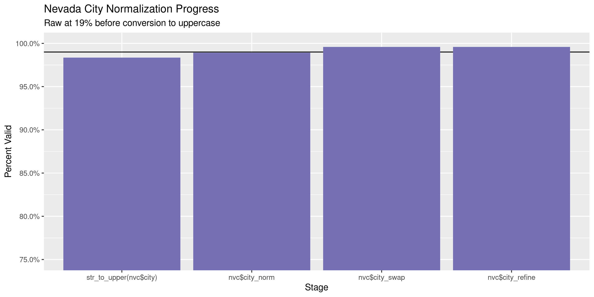

Nevada Contributions
================
Kiernan Nicholls
Wed Oct 27 13:53:48 2021

-   [Project](#project)
-   [Objectives](#objectives)
-   [Packages](#packages)
-   [Data](#data)
    -   [Report](#report)
    -   [Age](#age)
    -   [Format](#format)
    -   [Variables](#variables)
    -   [Records](#records)
-   [Download](#download)
-   [Unzip](#unzip)
-   [Columns](#columns)
-   [Read](#read)
-   [Join](#join)
    -   [Recipient](#recipient)
    -   [Contributors](#contributors)
-   [Wrangle](#wrangle)
    -   [Address](#address)
    -   [ZIP](#zip)
    -   [State](#state)
    -   [City](#city)
-   [Join](#join-1)
-   [Explore](#explore)
    -   [Missing](#missing)
    -   [Duplicates](#duplicates)
    -   [Categorical](#categorical)
    -   [Amounts](#amounts)
    -   [Dates](#dates)
-   [Conclude](#conclude)
-   [Export](#export)
-   [Upload](#upload)

<!-- Place comments regarding knitting here -->

## Project

The Accountability Project is an effort to cut across data silos and
give journalists, policy professionals, activists, and the public at
large a simple way to search across huge volumes of public data about
people and organizations.

Our goal is to standardizing public data on a few key fields by thinking
of each dataset row as a transaction. For each transaction there should
be (at least) 3 variables:

1.  All **parties** to a transaction.
2.  The **date** of the transaction.
3.  The **amount** of money involved.

## Objectives

This document describes the process used to complete the following
objectives:

1.  How many records are in the database?
2.  Check for entirely duplicated records.
3.  Check ranges of continuous variables.
4.  Is there anything blank or missing?
5.  Check for consistency issues.
6.  Create a five-digit ZIP Code called `zip`.
7.  Create a `year` field from the transaction date.
8.  Make sure there is data on both parties to a transaction.

## Packages

The following packages are needed to collect, manipulate, visualize,
analyze, and communicate these results. The `pacman` package will
facilitate their installation and attachment.

``` r
if (!require("pacman")) {
  install.packages("pacman")
}
pacman::p_load(
  tidyverse, # data manipulation
  lubridate, # datetime strings
  gluedown, # printing markdown
  janitor, # clean data frames
  campfin, # custom irw tools
  aws.s3, # aws cloud storage
  refinr, # cluster & merge
  scales, # format strings
  knitr, # knit documents
  vroom, # fast reading
  rvest, # scrape html
  glue, # code strings
  here, # project paths
  httr, # http requests
  fs # local storage 
)
```

This document should be run as part of the `R_campfin` project, which
lives as a sub-directory of the more general, language-agnostic
[`irworkshop/accountability_datacleaning`](https://github.com/irworkshop/accountability_datacleaning)
GitHub repository.

The `R_campfin` project uses the [RStudio
projects](https://support.rstudio.com/hc/en-us/articles/200526207-Using-Projects)
feature and should be run as such. The project also uses the dynamic
`here::here()` tool for file paths relative to *your* machine.

``` r
# where does this document knit?
here::i_am("nv/contribs/docs/nv_contribs_diary.Rmd")
```

## Data

The Nevada Secretary of State (NVSOS) office requires that one register
for an account to access “[bulk data
download](https://www.nvsos.gov/sos/online-services/data-download)”
service page.

> Welcome to the Nevada Secretary of State online unified login system.
> Here you may access the following systems all with one login account:
> \* Bulk Data Download \* …

The process for downloaded a report is [outlined
here](https://www.nvsos.gov/SoSServices/AnonymousAccess/HelpGuides/DataDownloadUserGuide.aspx):

Create a report for “Full Unabridged Database Dump” of “Campaign
Finance” data.

> This report will expose Contributions and Expenses report data filed
> within our “Aurora” Campaign Financial Disclosure system. This would
> not include data filed in a Financial Disclosure report. This bulk
> data report tool here should be used to pull the entire database or
> slightly smaller subsets of data such as all contributions filed after
> 1/1/2016 by groups of type “PAC”…

### Report

The site allows users to define the format for their data download. The
site generated the following summary of our specified data format:

> If “Text File - Fixed Width” is selected your report results will be
> inserted into a standard ASCII text file where each field starts at a
> specific “fixed” position for each line. For more specific information
> about the report format for custom built reports, including the
> position and data type of each field, click the “View Selected File
> Structure” button on the General tab when you viewyour report.

This file structure report is an HTML page with a description and six
tables.

> Your report will generate 6 fixed width ASCII text file(s) compressed
> into one Zip file named in the format “CampaignFinance.43993.\<Today’s
> Date>.zip”\*. Below you will find the format of each file:

### Age

> The data being reported off of is no more than 24 hours old. This data
> is copied very late each night from live data to minimize the large
> burden of bulk reporting on the production system.

### Format

The report data is split into multiple files, per the [NVSOS FAQ
page](https://www.nvsos.gov/SOSServices/AnonymousAccess/HelpGuides/FAQ.aspx#5):

> This is what is referred to as a normalized relational structure in
> the database world. Data items such as business entities and officers
> have a direct relation to one another. There can be any number of
> officers to one business entity. Because of this many to one
> relationship, the officers data is stored in a different data table
> (or file) than the business entities. Then we relate officer records
> to a business entity record by a common key data column, in this case
> the CorporationID… By separating officers and entities into separate
> records we can eliminate the redundancy and added size associated with
> putting the business entity data on each officer record or eliminate
> the complexity of allocating an undeterminable amount of officers on
> the one business entity record. This same many-to-one relationship is
> true of voter history records to voter records, UCC actions to UCC
> liens or Corporation Stocks to Corporations, to name a few.

#### Tables

The summary continues to provide individual structure summaries on each
of the six files included in the report along with an key to the file
name. These six tables contain columns describing both the data type and
the width of each column. This information is needed to properly read
the flat text files.

``` r
st_dir <- here("nv", "contribs")
about_path <- path(st_dir, "File Format - Secretary of State, Nevada.html")
about <- read_html(x = about_path)
```

``` r
about_tables <- about %>% 
  html_nodes(".entryform") %>% 
  html_table(fill = TRUE) %>% 
  map(as_tibble)
```

``` r
about_tables <- about_tables[map_lgl(about_tables, ~ncol(.) == 4)]
about_tables <- map(about_tables, row_to_names, row_number = 1)
about_names <- str_subset(html_text(html_nodes(about, "b")), "\\d")
```

| Field Name                | Data Type   | Start Position | Length |
|:--------------------------|:------------|---------------:|-------:|
| CandidateID (Primary Key) | int         |              1 |     10 |
| First Name                | varchar(25) |             11 |     25 |
| Last Name                 | varchar(25) |             36 |     25 |
| Party                     | varchar(60) |             61 |     60 |
| Office                    | varchar(60) |            121 |     60 |
| Jurisdiction              | varchar(50) |            181 |     50 |
| Mailing Address           | varchar(50) |            231 |     50 |
| Mailing City              | varchar(25) |            281 |     25 |
| Mailing State             | varchar(2)  |            306 |      2 |
| Mailing Zip               | varchar(9)  |            308 |      9 |

| Field Name            | Data Type    | Start Position | Length |
|:----------------------|:-------------|---------------:|-------:|
| GroupID (Primary Key) | int          |              1 |     10 |
| Group Name            | varchar(120) |             11 |    120 |
| Group Type            | varchar(100) |            131 |    100 |
| Contact Name          | varchar(35)  |            231 |     35 |
| Active                | bit          |            266 |      1 |
| City                  | varchar(30)  |            267 |     30 |

| Field Name                                           | Data Type    | Start Position | Length |
|:-----------------------------------------------------|:-------------|---------------:|-------:|
| ReportID (Primary Key)                               | int          |              1 |     10 |
| CandidateID (Foreign Key Ref Candidates.CandidateID) | int          |             11 |     10 |
| GroupID (Foreign Key Ref Groups.GroupID)             | int          |             21 |     10 |
| Report Name                                          | varchar(120) |             31 |    120 |
| Election Cycle                                       | varchar(4)   |            151 |      4 |
| Filing Due Date                                      | datetime     |            155 |     10 |
| Filed Date                                           | datetime     |            165 |     10 |
| Amended                                              | bit          |            175 |      1 |
| Superseded                                           | bit          |            176 |      1 |

| Field Name              | Data Type    | Start Position | Length |
|:------------------------|:-------------|---------------:|-------:|
| ContactID (Primary Key) | int          |              1 |     10 |
| First Name              | varchar(30)  |             11 |     30 |
| Middle Name             | varchar(30)  |             41 |     30 |
| Last Name               | varchar(100) |             71 |    100 |
| Address 1               | varchar(60)  |            171 |     60 |
| Address 2               | varchar(30)  |            231 |     30 |
| City                    | varchar(45)  |            261 |     45 |
| State                   | varchar(2)   |            306 |      2 |
| Zip                     | varchar(10)  |            308 |     10 |

| Field Name                                                    | Data Type   | Start Position | Length |
|:--------------------------------------------------------------|:------------|---------------:|-------:|
| ContributionID (Primary Key)                                  | int         |              1 |     10 |
| ReportID (Foreign Key Ref Reports.ReportID)                   | int         |             11 |     10 |
| CandidateID (Foreign Key Ref Candidates.CandidateID)          | int         |             21 |     10 |
| GroupID (Foreign Key Ref Groups.GroupID)                      | int         |             31 |     10 |
| Contribution Date                                             | datetime    |             41 |     10 |
| Contribution Amount                                           | money       |             51 |     21 |
| Contribution Type                                             | varchar(30) |             72 |     30 |
| ContributorID (Foreign Key Ref Contributors-Payees.ContactID) | int         |            102 |     10 |

| Field Name                                               | Data Type   | Start Position | Length |
|:---------------------------------------------------------|:------------|---------------:|-------:|
| ExpenseID (Primary Key)                                  | int         |              1 |     10 |
| ReportID (Foreign Key Ref Reports.ReportID)              | int         |             11 |     10 |
| CandidateID (Foreign Key Ref Candidates.CandidateID)     | int         |             21 |     10 |
| GroupID (Foreign Key Ref Groups.GroupID)                 | int         |             31 |     10 |
| Expense Date                                             | datetime    |             41 |     10 |
| Expense Amount                                           | money       |             51 |     21 |
| Expense Type                                             | varchar(30) |             72 |     30 |
| Payee ID (Foreign Key Ref Contributors-Payees.ContactID) | int         |            102 |     10 |

#### Data Types

> The Data Types within this column correspond to the SQL Server 2012
> data types in which the source data is stored. The purpose of exposing
> these data types is simply to provide a suggested guideline for any
> software programmers writing an interface to process these report
> files. Below is a partial list of SQL Server data types:

> -   `bigint` - Numeric, 8 bytes
> -   `int` - Numeric, 4 bytes
> -   `smallint` - Numeric, 2 bytes
> -   `tinyint` - Numeric, 1 byte
> -   `bit` - Results are Truewhich will be represented as “T”"F”
> -   `money` - Monetary data, 8 bytes, accuracy to a ten-thousandth of
>     a unit
> -   `float` - Floating precision number from -1.79E + 308 through
>     1.79E + 308.
> -   `real` - Floating precision number from -3.40E + 38 through
>     3.40E + 38.
> -   `datetime` - Date
> -   `char` - Fixed-length character data
> -   `varchar` - Variable-length data with a maximum of 8,000
>     characters

### Variables

Definitions for few variables can be found in the “Result Field” tab:

1.  `Jurisdiction`: > This will be name of the city or county for
    city/county offices currently held by the candidate (e.g. “CITY OF
    YERINGTON”, “DOUGLAS COUNTY”). This will be set to “NV SOS” for
    statewide offices such as Governor, State Controller or State
    assemblymen. An office assigned to a candidate could be updated by
    the NV SOS Elections staff as necessary when that candidate files
    for a new office.

2.  `Contribution Type`: > Use this column to differentiate which one of
    four contribution types this contribution record is: Monetary
    Contribution, In Kind Contribution, In Kind Written Commitment, or
    Written Commitment.

3.  `Last Name`: > When the contributor or payee is an organization as
    opposed to an individual, the entire organization name will be in
    the Last Name field only.

4.  `Expense Type`: > Use this column to differentiate which type of
    expense record this is: Monetary Expense or In Kind Expense.

5.  `Active`: > A value of F (False) indicates the group has been marked
    as inactive by the NV Secretary of State’s office Elections division
    due to submission of a “notice of inactivity” or for failure to
    renew annual registration.

6.  `Amended`: > A value of T (True) indicates this contributions and
    expense report has been marked as an amended report by the original
    filer implying this report supersedes a report for this same period,
    filed earlier. An amended report is to be full comprehensive for
    that report period and in essence replaces all contributions and
    expenses filed in the earlier report.

7.  `Election Cycle`: > The Election Cycle is the 4 digit filing or
    reporting year defining a filing period grouping together a
    collection of contribution and expenses reports…

8.  `Superseded`: > A report is Superseded when an amended report was
    filed later by the same filer for the same reporting period. In this
    case the Superseded field for the older report record will be set to
    T (True)…

### Records

> Total number of records returned: 1,116,003

``` r
total_rows <- 1116003
```

> A record is one single entity or row from a database table. The “Total
> number of records returned” displayed on the report preview page will
> be a summation of all rows returned from each table you are reporting
> from. For example, if your report queries for both Resident Agent and
> Corporation data from the Corporations database, the number of records
> returned might be 1000, 700 of which might be Corporation records and
> 300 being Resident Agent records.

## Download

Within seven days of running the report, the data can be downloaded from
the link provided to the account email address. The link will not work
for anybody not logged into that NVSOS account.

``` r
raw_url <- "https://www.nvsos.gov/yourreports/CampaignFinance.43993.102721094009.zip"
raw_dir <- dir_create(here("nv", "contribs", "data", "raw"))
raw_zip <- path(raw_dir, basename(raw_url))
```

This URL contains the date the report was generated.

``` r
report_time <- mdy_hms(str_extract(raw_url, "\\d+(?=\\.zip$)"))
with_tz(report_time, tzone = "PST")
#> [1] "2021-10-27 09:40:09 PST"
```

``` r
aws_key <- path("IRW/raw_backup/nv", basename(raw_zip))
aws_bkt <- "publicaccountability"
if (!file_exists(raw_zip)) {
  download.file(raw_url, raw_zip)
  put_object(
    file = raw_zip,
    object = aws_key,
    bucket = aws_bkt,
    acl = "public-read",
    show_progress = TRUE,
    multipart = TRUE
  )
} else if (object_exists(aws_key, aws_bkt)) {
  save_object(
    object = aws_key,
    bucket = aws_bkt,
    file = raw_zip
  )
}
#> /home/kiernan/Documents/tap/R_tap/nv/contribs/data/raw/CampaignFinance.43993.102721094009.zip
```

This raw ZIP archive has been backed up to the IRW server.

``` r
as_fs_bytes(object_size(object = aws_key, bucket = aws_bkt))
#> 17.1M
```

## Unzip

The provided ZIP archive contains all six tables as fixed width text
files.

``` r
raw_txt <- unzip(raw_zip, exdir = raw_dir)
```

| Name                                               |  Length | Date                |
|:---------------------------------------------------|--------:|:--------------------|
| `CampaignFinance.Cnddt.43993.102721094009.txt`     |    2.2M | 2021-10-27 09:40:00 |
| `CampaignFinance.Cntrbt.43993.102721094009.txt`    |  56.92M | 2021-10-27 09:40:00 |
| `CampaignFinance.Cntrbtrs-.43993.102721094009.txt` |  67.96M | 2021-10-27 09:40:00 |
| `CampaignFinance.Expn.43993.102721094009.txt`      |  33.44M | 2021-10-27 09:40:00 |
| `CampaignFinance.Grp.43993.102721094009.txt`       | 380.07K | 2021-10-27 09:40:00 |
| `CampaignFinance.Rpr.43993.102721094009.txt`       |   7.73M | 2021-10-27 09:40:00 |

We need to match the order of this vector to the order of the tables.

``` r
names(raw_txt) <- c(
  "Candidates",
  "Contributions",
  "Contributors",
  "Expenses",
  "Groups",
  "Reports"
)
```

``` r
raw_txt <- raw_txt[match(names(about_tables), names(raw_txt))]
names(raw_txt) == names(about_tables)
#> [1] TRUE TRUE TRUE TRUE TRUE TRUE
```

## Columns

We can use the tables read from the HTML file, and described in the
**About** section above, to create (1) the column width tables expected
by `read_fwf()`, and (2) the readr column type specification objects.
Two functions will take the `Field Name`, `Data Type` and `Length`

``` r
as_fwf_width <- function(.data) {
  fwf_widths(
    widths = as.integer(x = .data[[4]]),
    col_names = str_remove(
      string = .data[[1]], 
      pattern = "\\s\\(.*\\)"
    )
  )
}
```

``` r
as_col_spec <- function(.data) {
  x <- .data[["Data Type"]]
  x <- case_when(
    str_detect(x, "varchar")  ~ "c",
    str_detect(x, "datetime") ~ "D",
    str_detect(x, "money")    ~ "d",
    str_detect(x, "bit")      ~ "l",
    str_detect(x, "int")      ~ "i",
    TRUE ~ "c"
  )
  as.col_spec(
    x = setNames(
      object = x,
      nm = str_remove(
        string = .data[["Field Name"]], 
        pattern = "\\s\\(.*\\)"
      )
    )
  )
}
```

``` r
about_tables$Groups
#> # A tibble: 6 × 4
#>   `Field Name`          `Data Type`  `Start Position` Length
#>   <chr>                 <chr>        <chr>            <chr> 
#> 1 GroupID (Primary Key) int          1                10    
#> 2 Group Name            varchar(120) 11               120   
#> 3 Group Type            varchar(100) 131              100   
#> 4 Contact Name          varchar(35)  231              35    
#> 5 Active                bit          266              1     
#> 6 City                  varchar(30)  267              30
as_fwf_width(about_tables$Groups)
#> # A tibble: 6 × 3
#>   begin   end col_names   
#>   <int> <int> <chr>       
#> 1     0    10 GroupID     
#> 2    10   130 Group Name  
#> 3   130   230 Group Type  
#> 4   230   265 Contact Name
#> 5   265   266 Active      
#> 6   266   296 City
as_col_spec(about_tables$Groups)
#> cols(
#>   GroupID = col_integer(),
#>   `Group Name` = col_character(),
#>   `Group Type` = col_character(),
#>   `Contact Name` = col_character(),
#>   Active = col_logical(),
#>   City = col_character()
#> )
```

``` r
raw_widths <- map(about_tables, as_fwf_width)
raw_types  <- map(about_tables, as_col_spec)
```

## Read

One file seems to have been exported with some empty rows and other rows
without sufficient padding. This can be fixed with string manipulation.

``` r
tmp <- file_temp(ext = "txt")
raw_txt[["Contributors"]] %>% 
  read_lines(skip_empty_rows = TRUE) %>% 
  str_subset(pattern = "^\\d") %>% 
  str_pad(width = 170, side = "right", pad = " ") %>% 
  write_lines(file = tmp)
raw_txt[["Contributors"]] <- tmp
```

All six tables can then be read into a list using `readr::read_fwf()`
and the (1) width tables and (2) column type specifications.

``` r
nv <- pmap( # 1,116,010
  .f = read_fwf,
  locale = locale(
    date_format = "%m/%d/%Y",
    tz = "US/Pacific"
  ),
  .l = list(
    file = raw_txt,
    col_positions = raw_widths,
    col_types = raw_types
  )
)
```

The total number of rows read matches what we were told when exporting.

``` r
comma(sum(map_dbl(nv, nrow)))
#> [1] "1,116,040"
enframe(map_dbl(nv, nrow))
#> # A tibble: 6 × 2
#>   name           value
#>   <chr>          <dbl>
#> 1 Candidates      7263
#> 2 Groups          1306
#> 3 Reports        45561
#> 4 Contributors  223408
#> 5 Contributions 528200
#> 6 Expenses      310302
```

## Join

The primary table of interest here is `Contributions`, which lists the
528,200 contributions made to committees and reported to the state. This
table does not identify the receiving committee or contributing entity.
This information is found in the `Groups` and `Contributors` tables,
respectively. We need to add variables identifying all parties to each
contribution.

``` r
nv$Contributions
#> # A tibble: 528,200 × 8
#>    contribution_id report_id candidate_id group_id contribution_date contribution_amo… contribution_type  contributor_id
#>              <int>     <int>        <int>    <int> <date>                        <dbl> <chr>                       <int>
#>  1               2      6980           NA     1220 2006-06-28                    35000 Monetary Contribu…              3
#>  2               3      6983           NA     1332 2006-03-29                        2 Monetary Contribu…              8
#>  3               4      6983           NA     1332 2006-03-31                        1 Monetary Contribu…              8
#>  4               5      6983           NA     1332 2006-04-10                      200 Monetary Contribu…              8
#>  5               6      6983           NA     1332 2006-01-01                        0 Written Commitment              9
#>  6               7      6983           NA     1332 2006-01-01                        0 In Kind Contribut…              9
#>  7               8      6983           NA     1332 2006-01-01                        0 In Kind Written C…              9
#>  8               9      6987           NA     1364 2006-01-13                     1000 Monetary Contribu…             15
#>  9              10      6991         2360       NA 2006-02-07                      100 Monetary Contribu…             17
#> 10              11      6991         2360       NA 2006-02-08                      500 Monetary Contribu…             18
#> # … with 528,190 more rows
```

### Recipient

We will first join the committees. Contributions can be made to either a
candidate or committee, each listed in their own table with their own
key column in Contributions. We can combine these keys and tables.

``` r
rec_cands <- nv$Candidates %>% 
  select(candidate_id, first_name, last_name) %>% 
  filter(candidate_id %in% nv$Contributions$candidate_id) %>% 
  mutate(recipient_type = "Candidate", .after = last_name) %>% 
  unite(
    col = recipient_name,
    first_name, last_name,
    sep = " ",
    remove = TRUE,
    na.rm = TRUE
  )
```

``` r
rec_comms <- nv$Groups %>% 
  filter(group_id %in% nv$Contributions$group_id) %>% 
  select(group_id, recipient_name = group_name, recipient_type = group_type)
```

``` r
all_recipients <- rec_cands %>% 
  bind_rows(rec_comms) %>% 
  relocate(group_id, .after = candidate_id)
```

    #> # A tibble: 14 × 4
    #>    candidate_id group_id recipient_name                                                  recipient_type            
    #>           <int>    <int> <chr>                                                           <chr>                     
    #>  1         5468       NA Marsha Berkbigler                                               Candidate                 
    #>  2         5595       NA Mark Newburn                                                    Candidate                 
    #>  3           NA     6941 Committee to Elect David Bagley                                 Independent Expenditure   
    #>  4           NA     2293 Working Families for Assembly 13                                Independent Expenditure   
    #>  5           NA     2420 Everytown for Gun Safety Action Fund, Inc. (Nonprofit)          Non-Profit Corporation    
    #>  6           NA     4820 PLAN Action Fund                                                Non-Profit Corporation    
    #>  7           NA     2269 Washoe County Citizens for Change                               PAC Ballot Advocacy Group 
    #>  8           NA     1626 School, Road and Safety Funding Solutions Ballot Advocacy Group PAC Ballot Advocacy Group 
    #>  9           NA     4807 DLGA PAC - Nevada                                               Political Action Committee
    #> 10           NA     1307 Republican State Leadership Committee                           Political Action Committee
    #> 11           NA     1225 Clark County Republican Party                                   Political Party Committee 
    #> 12           NA     1373 Pahrump Valley Republican Women                                 Political Party Committee 
    #> 13           NA     3680 Committee to Recall Senator Nicole Cannizzaro                   Recall Committee          
    #> 14           NA     5896 Humboldt County 2nd Amendment Grassroots                        Recall Committee

``` r
all_recipients <- mutate(
  .data = all_recipients,
  .before = 1,
  .keep = "unused",
  recipient_id = coalesce(
    candidate_id, 
    group_id
  )
)
```

``` r
nvc <- nv$Contributions %>% 
  mutate(
    .after = group_id,
    .keep = "unused",
    recipient_id = coalesce(
      candidate_id, 
      group_id
    )
  ) %>% 
  left_join(
    y = all_recipients,
    by = "recipient_id"
  ) %>% 
  relocate(
    .after = recipient_id,
    recipient_name, recipient_type
  )
```

### Contributors

``` r
all_contributors <- nv$Contributors %>% 
  filter(contact_id %in% nv$Contributions$contributor_id)
```

## Wrangle

To improve the searchability of the database, we will perform some
consistent, confident string normalization. For geographic variables
like city names and ZIP codes, the corresponding `campfin::normal_*()`
functions are tailor made to facilitate this process.

### Address

For the street `addresss` variable, the `campfin::normal_address()`
function will force consistence case, remove punctuation, and abbreviate
official USPS suffixes.

``` r
addr_norm <- all_contributors %>% 
  distinct(address_1, address_2) %>% 
  mutate(
    across(
      starts_with("address_"),
      list(xnorm = normal_address),
      abbs = usps_street
    )
  ) %>% 
  unite(
    col = address_norm,
    ends_with("_xnorm"),
    sep = " ",
    remove = TRUE,
    na.rm = TRUE
  ) %>% 
  mutate(across(address_norm, na_if, ""))
```

``` r
addr_norm
#> # A tibble: 131,323 × 3
#>    address_1            address_2 address_norm     
#>    <chr>                <chr>     <chr>            
#>  1 275 7th Ave.         <NA>      275 7TH AVE      
#>  2 1224 Western Ave     <NA>      1224 WESTERN AVE 
#>  3 7511 W Diablo Dr     <NA>      7511 W DIABLO DR 
#>  4 <NA>                 <NA>      <NA>             
#>  5 3215 Cinder Lane     <NA>      3215 CINDER LN   
#>  6 308 Laura Court      <NA>      308 LAURA CT     
#>  7 453 Second Tee Drive <NA>      453 SECOND TEE DR
#>  8 PO Box 3108          <NA>      PO BOX 3108      
#>  9 none                 <NA>      NONE             
#> 10 PO Box 8760          <NA>      PO BOX 8760      
#> # … with 131,313 more rows
```

``` r
all_contributors <- left_join(
  x = all_contributors, 
  y = addr_norm, 
  by = c("address_1", "address_2")
)
```

### ZIP

For ZIP codes, the `campfin::normal_zip()` function will attempt to
create valid *five* digit codes by removing the ZIP+4 suffix and
returning leading zeroes dropped by other programs like Microsoft Excel.

``` r
all_contributors <- all_contributors %>% 
  mutate(
    zip_norm = normal_zip(
      zip = zip,
      na_rep = TRUE
    )
  )
```

``` r
progress_table(
  all_contributors$zip,
  all_contributors$zip_norm,
  compare = valid_zip
)
#> # A tibble: 2 × 6
#>   stage                     prop_in n_distinct  prop_na n_out n_diff
#>   <chr>                       <dbl>      <dbl>    <dbl> <dbl>  <dbl>
#> 1 all_contributors$zip        0.779      36229 0.000227 37892  27931
#> 2 all_contributors$zip_norm   0.986      12582 0.00189   2367   1268
```

### State

Valid two digit state abbreviations can be made using the
`campfin::normal_state()` function.

``` r
all_contributors <- all_contributors %>% 
  mutate(
    state_norm = normal_state(
      state = state,
      abbreviate = TRUE,
      na_rep = TRUE
    )
  )
```

``` r
all_contributors %>% 
  filter(state != state_norm) %>% 
  count(state, state_norm, sort = TRUE)
#> # A tibble: 65 × 3
#>    state state_norm     n
#>    <chr> <chr>      <int>
#>  1 Nv    NV          1034
#>  2 nv    NV          1032
#>  3 Ca    CA            59
#>  4 ca    CA            36
#>  5 Ne    NE            34
#>  6 Ut    UT            27
#>  7 Tx    TX            15
#>  8 Fl    FL            13
#>  9 nV    NV            12
#> 10 Co    CO            11
#> # … with 55 more rows
```

``` r
progress_table(
  all_contributors$state,
  all_contributors$state_norm,
  compare = valid_state
)
#> # A tibble: 2 × 6
#>   stage                       prop_in n_distinct  prop_na n_out n_diff
#>   <chr>                         <dbl>      <dbl>    <dbl> <dbl>  <dbl>
#> 1 all_contributors$state        0.983        183 0.000880  2866    126
#> 2 all_contributors$state_norm   0.999         91 0.00299    121     34
```

### City

Cities are the most difficult geographic variable to normalize, simply
due to the wide variety of valid cities and formats.

#### Normal

The `campfin::normal_city()` function is a good start, again converting
case, removing punctuation, but *expanding* USPS abbreviations. We can
also remove `invalid_city` values.

``` r
norm_city <- all_contributors %>% 
  distinct(city, state_norm, zip_norm) %>% 
  mutate(
    city_norm = normal_city(
      city = city, 
      abbs = usps_city,
      states = c("NV", "DC", "NEVADA"),
      na = invalid_city,
      na_rep = TRUE
    )
  )
```

#### Swap

We can further improve normalization by comparing our normalized value
against the *expected* value for that record’s state abbreviation and
ZIP code. If the normalized value is either an abbreviation for or very
similar to the expected value, we can confidently swap those two.

``` r
norm_city <- norm_city %>% 
  rename(city_raw = city) %>% 
  left_join(
    y = zipcodes,
    by = c(
      "state_norm" = "state",
      "zip_norm" = "zip"
    )
  ) %>% 
  rename(city_match = city) %>% 
  mutate(
    match_abb = is_abbrev(city_norm, city_match),
    match_dist = str_dist(city_norm, city_match),
    city_swap = if_else(
      condition = !is.na(match_dist) & (match_abb | match_dist == 1),
      true = city_match,
      false = city_norm
    )
  ) %>% 
  select(
    -city_match,
    -match_dist,
    -match_abb
  )
```

``` r
all_contributors <- left_join(
  x = all_contributors,
  y = norm_city,
  by = c(
    "city" = "city_raw", 
    "state_norm", 
    "zip_norm"
  )
)
```

#### Refine

The [OpenRefine](https://openrefine.org/) algorithms can be used to
group similar strings and replace the less common versions with their
most common counterpart. This can greatly reduce inconsistency, but with
low confidence; we will only keep any refined strings that have a valid
city/state/zip combination.

``` r
good_refine <- all_contributors %>% 
  mutate(
    city_refine = city_swap %>% 
      key_collision_merge() %>% 
      n_gram_merge(numgram = 1)
  ) %>% 
  filter(city_refine != city_swap) %>% 
  inner_join(
    y = zipcodes,
    by = c(
      "city_refine" = "city",
      "state_norm" = "state",
      "zip_norm" = "zip"
    )
  )
```

    #> # A tibble: 23 × 5
    #>    state_norm zip_norm city_swap         city_refine          n
    #>    <chr>      <chr>    <chr>             <chr>            <int>
    #>  1 NY         11733    SETAUKET          EAST SETAUKET        4
    #>  2 DE         19720    NEWCASTEL         NEW CASTLE           2
    #>  3 SC         29406    NORTH CHARLESTON  CHARLESTON           2
    #>  4 CA         91730    RANCHO CUCUMANGA  RANCHO CUCAMONGA     1
    #>  5 CA         92036    JULIANJULIAN      JULIAN               1
    #>  6 CA         94114    SAN FRANCISON     SAN FRANCISCO        1
    #>  7 FL         33304    FORT LAUREDALE    FORT LAUDERDALE      1
    #>  8 IL         60070    PROSPECTOR HIGHTS PROSPECT HEIGHTS     1
    #>  9 IN         47591    VINCENNES IN      VINCENNES            1
    #> 10 NV         89020    ARMAGOSA VALLEY   AMARGOSA VALLEY      1
    #> # … with 13 more rows

Then we can join the refined values back to the database.

``` r
all_contributors <- all_contributors %>% 
  left_join(good_refine, by = names(.)) %>% 
  mutate(city_refine = coalesce(city_refine, city_swap))
```

## Join

``` r
nvc <- left_join(
  x = nvc,
  y = all_contributors,
  by = c("contributor_id" = "contact_id")
)
```

#### City Progress

Our goal for normalization was to increase the proportion of city values
known to be valid and reduce the total distinct values by correcting
misspellings.

| stage                    | prop_in | n_distinct | prop_na | n_out | n_diff |
|:-------------------------|--------:|-----------:|--------:|------:|-------:|
| `str_to_upper(nvc$city)` |   0.984 |       6736 |   0.000 |  9095 |   1076 |
| `nvc$city_norm`          |   0.989 |       6524 |   0.001 |  6010 |    846 |
| `nvc$city_swap`          |   0.996 |       6087 |   0.001 |  2289 |    392 |
| `nvc$city_refine`        |   0.996 |       6064 |   0.001 |  2217 |    372 |

You can see how the percentage of valid values increased with each
stage.

<!-- -->

More importantly, the number of distinct values decreased each stage. We
were able to confidently change many distinct invalid values to their
valid equivalent.

<!-- -->

Before exporting, we can remove the intermediary normalization columns
and rename all added variables with the `_clean` suffix.

``` r
nvc <- nvc %>% 
  select(
    -city_norm,
    -city_swap,
    city_clean = city_refine
  ) %>% 
  rename_all(~str_replace(., "_norm", "_clean")) %>% 
  rename_all(~str_remove(., "_raw")) %>% 
  relocate(address_clean, city_clean, state_clean, .before = zip_clean)
```

## Explore

There are 555,284 rows of 21 columns. Each record represents a single
contribution to a political committee or candidate.

``` r
glimpse(nvc)
#> Rows: 555,284
#> Columns: 21
#> $ contribution_id     <int> 2, 2, 3, 4, 5, 6, 7, 8, 9, 10, 11, 12, 13, 13, 14, 15, 16, 17, 17, 18, 19, 20, 21, 21, 22,…
#> $ report_id           <int> 6980, 6980, 6983, 6983, 6983, 6983, 6983, 6983, 6987, 6991, 6991, 6991, 6990, 6990, 6991, …
#> $ recipient_id        <int> 1220, 1220, 1332, 1332, 1332, 1332, 1332, 1332, 1364, 2360, 2360, 2360, 2368, 2368, 2360, …
#> $ recipient_name      <chr> "Gary Perea", "Culinary Workers Union Local 226", "Nevada Next PAC", "Nevada Next PAC", "N…
#> $ recipient_type      <chr> "Candidate", "Independent Expenditure", "Political Action Committee", "Political Action Co…
#> $ contribution_date   <date> 2006-06-28, 2006-06-28, 2006-03-29, 2006-03-31, 2006-04-10, 2006-01-01, 2006-01-01, 2006-…
#> $ contribution_amount <dbl> 35000, 35000, 2, 1, 200, 0, 0, 0, 1000, 100, 500, 1000, 0, 0, 500, 5000, 200, 0, 0, 200, 2…
#> $ contribution_type   <chr> "Monetary Contribution", "Monetary Contribution", "Monetary Contribution", "Monetary Contr…
#> $ contributor_id      <int> 3, 3, 8, 8, 8, 9, 9, 9, 15, 17, 18, 19, 20, 20, 21, 22, 23, 24, 24, 25, 25, 26, 27, 27, 24…
#> $ first_name          <chr> NA, NA, "Bonnie", "Bonnie", "Bonnie", NA, NA, NA, "Michelle Langile", "John", "John", "E. …
#> $ middle_name         <chr> NA, NA, "B", "B", "B", NA, NA, NA, NA, NA, NA, NA, NA, NA, NA, NA, "E.", NA, NA, NA, NA, N…
#> $ last_name           <chr> "UNITE HERE TIP", "UNITE HERE TIP", "Jacobs", "Jacobs", "Jacobs", "NONE", "NONE", "NONE", …
#> $ address_1           <chr> "275 7th Ave.", "275 7th Ave.", "7511 W Diablo Dr", "7511 W Diablo Dr", "7511 W Diablo Dr"…
#> $ address_2           <chr> NA, NA, NA, NA, NA, NA, NA, NA, NA, NA, NA, NA, NA, NA, NA, NA, NA, NA, NA, NA, NA, NA, NA…
#> $ city                <chr> "New York", "New York", "Las Vegas", "Las Vegas", "Las Vegas", NA, NA, NA, "Las Vegas", "I…
#> $ state               <chr> "NY", "NY", "NV", "NV", "NV", NA, NA, NA, "NV", "NV", "NV", "NV", "nv", "nv", "NV", "NV", …
#> $ zip                 <chr> "10001", "10001", "89113", "89113", "89113", NA, NA, NA, "89103-3004", "89451", "89451", "…
#> $ address_clean       <chr> "275 7TH AVE", "275 7TH AVE", "7511 W DIABLO DR", "7511 W DIABLO DR", "7511 W DIABLO DR", …
#> $ city_clean          <chr> "NEW YORK", "NEW YORK", "LAS VEGAS", "LAS VEGAS", "LAS VEGAS", NA, NA, NA, "LAS VEGAS", "I…
#> $ state_clean         <chr> "NY", "NY", "NV", "NV", "NV", NA, NA, NA, "NV", "NV", "NV", "NV", "NV", "NV", "NV", "NV", …
#> $ zip_clean           <chr> "10001", "10001", "89113", "89113", "89113", NA, NA, NA, "89103", "89451", "89451", "89450…
tail(nvc)
#> # A tibble: 6 × 21
#>   contribution_id report_id recipient_id recipient_name recipient_type             contribution_date contribution_amount
#>             <int>     <int>        <int> <chr>          <chr>                      <date>                          <dbl>
#> 1          751402    119820          672 SNR PAC        Political Action Committee 2021-08-04                       1000
#> 2          751403    119820          672 SNR PAC        Political Action Committee 2021-08-04                       1000
#> 3          751404    119820          672 SNR PAC        Political Action Committee 2021-08-03                       1000
#> 4          751405    119820          672 SNR PAC        Political Action Committee 2021-08-16                       1000
#> 5          751406    119820          672 SNR PAC        Political Action Committee 2021-07-01                       1000
#> 6          751407    119820          672 SNR PAC        Political Action Committee 2021-09-11                       1000
#> # … with 14 more variables: contribution_type <chr>, contributor_id <int>, first_name <chr>, middle_name <chr>,
#> #   last_name <chr>, address_1 <chr>, address_2 <chr>, city <chr>, state <chr>, zip <chr>, address_clean <chr>,
#> #   city_clean <chr>, state_clean <chr>, zip_clean <chr>
```

### Missing

There are no columns missing values.

``` r
col_stats(nvc, count_na)
#> # A tibble: 21 × 4
#>    col                 class       n         p
#>    <chr>               <chr>   <int>     <dbl>
#>  1 contribution_id     <int>       0 0        
#>  2 report_id           <int>       0 0        
#>  3 recipient_id        <int>       0 0        
#>  4 recipient_name      <chr>       0 0        
#>  5 recipient_type      <chr>       0 0        
#>  6 contribution_date   <date>      0 0        
#>  7 contribution_amount <dbl>       0 0        
#>  8 contribution_type   <chr>       0 0        
#>  9 contributor_id      <int>       0 0        
#> 10 first_name          <chr>  189406 0.341    
#> 11 middle_name         <chr>  464953 0.837    
#> 12 last_name           <chr>       6 0.0000108
#> 13 address_1           <chr>     163 0.000294 
#> 14 address_2           <chr>  465960 0.839    
#> 15 city                <chr>     134 0.000241 
#> 16 state               <chr>     321 0.000578 
#> 17 zip                 <chr>     126 0.000227 
#> 18 address_clean       <chr>     244 0.000439 
#> 19 city_clean          <chr>     462 0.000832 
#> 20 state_clean         <chr>    1138 0.00205  
#> 21 zip_clean           <chr>     809 0.00146
```

### Duplicates

We can also flag any record completely duplicated across every column.

``` r
nvc <- flag_dupes(nvc, -contribution_id)
sum(nvc$dupe_flag)
#> [1] 14527
```

``` r
key_vars <- c("last_name", "contribution_date", 
              "contribution_amount", "recipient_name")
```

``` r
nvc %>% 
  filter(dupe_flag) %>% 
  select(contribution_id, report_id, all_of(key_vars))
#> # A tibble: 14,527 × 6
#>    contribution_id report_id last_name                  contribution_date contribution_amount recipient_name            
#>              <int>     <int> <chr>                      <date>                          <dbl> <chr>                     
#>  1              18      6991 Hengst                     2006-02-15                        200 E Tiras                   
#>  2              19      6991 Hengst                     2006-02-15                        200 E Tiras                   
#>  3             103      7034 member dues                2006-07-15                         11 Mineral County Classroom …
#>  4             105      7034 member dues                2006-07-15                         11 Mineral County Classroom …
#>  5             106      7062 NONE                       2006-01-01                          0 Patricia Herzog           
#>  6             107      7062 NONE                       2006-01-01                          0 Patricia Herzog           
#>  7             504     13743 Harrah's Operating Company 2006-10-05                       5000 Susan Brager              
#>  8             505     13743 Harrah's Operating Company 2006-10-05                       5000 Susan Brager              
#>  9             536     13756 NONE                       2006-10-26                          0 Patricia Herzog           
#> 10             537     13756 NONE                       2006-10-26                          0 Patricia Herzog           
#> # … with 14,517 more rows
```

### Categorical

``` r
col_stats(nvc, n_distinct)
#> # A tibble: 22 × 4
#>    col                 class       n          p
#>    <chr>               <chr>   <int>      <dbl>
#>  1 contribution_id     <int>  528200 0.951     
#>  2 report_id           <int>   15888 0.0286    
#>  3 recipient_id        <int>    2716 0.00489   
#>  4 recipient_name      <chr>    2795 0.00503   
#>  5 recipient_type      <chr>       7 0.0000126 
#>  6 contribution_date   <date>   5332 0.00960   
#>  7 contribution_amount <dbl>   15630 0.0281    
#>  8 contribution_type   <chr>       4 0.00000720
#>  9 contributor_id      <int>  171561 0.309     
#> 10 first_name          <chr>   19151 0.0345    
#> 11 middle_name         <chr>    1191 0.00214   
#> 12 last_name           <chr>   73860 0.133     
#> 13 address_1           <chr>  121986 0.220     
#> 14 address_2           <chr>    8731 0.0157    
#> 15 city                <chr>    8922 0.0161    
#> 16 state               <chr>     183 0.000330  
#> 17 zip                 <chr>   36229 0.0652    
#> 18 address_clean       <chr>  109556 0.197     
#> 19 city_clean          <chr>    6064 0.0109    
#> 20 state_clean         <chr>      91 0.000164  
#> 21 zip_clean           <chr>   12582 0.0227    
#> 22 dupe_flag           <lgl>       2 0.00000360
```

<!-- --><!-- -->

### Amounts

``` r
summary(nvc$contribution_amount)
#>     Min.  1st Qu.   Median     Mean  3rd Qu.     Max. 
#>   -25000       25      200     2089     1000 20700000
mean(nvc$contribution_amount <= 0)
#> [1] 0.000767175
```

These are the records with the minimum and maximum amounts.

``` r
glimpse(nvc[c(
  which.max(nvc$contribution_amount), which.min(nvc$contribution_amount)
), ])
#> Rows: 2
#> Columns: 22
#> $ contribution_id     <int> 544130, 154183
#> $ report_id           <int> 80598, 40633
#> $ recipient_id        <int> 3708, 4995
#> $ recipient_name      <chr> "Jeffrey Bobeck", "Paul Anderson"
#> $ recipient_type      <chr> "Candidate", "Candidate"
#> $ contribution_date   <date> 2018-09-21, 2013-01-23
#> $ contribution_amount <dbl> 20700000, -25000
#> $ contribution_type   <chr> "Monetary Contribution", "Monetary Contribution"
#> $ contributor_id      <int> 268234, 72128
#> $ first_name          <chr> NA, "Paul"
#> $ middle_name         <chr> NA, NA
#> $ last_name           <chr> "NV Energy", "Anderson (Loan Reimb - orig loan was in  2011)"
#> $ address_1           <chr> "6226 W Sahara Avenue", "6180 Loyal Royal"
#> $ address_2           <chr> NA, NA
#> $ city                <chr> "Las Vegas", "Las Vegas"
#> $ state               <chr> "NV", "NV"
#> $ zip                 <chr> "89146", "89131"
#> $ address_clean       <chr> "6226 W SAHARA AVE", "6180 LOYAL ROYAL"
#> $ city_clean          <chr> "LAS VEGAS", "LAS VEGAS"
#> $ state_clean         <chr> "NV", "NV"
#> $ zip_clean           <chr> "89146", "89131"
#> $ dupe_flag           <lgl> FALSE, FALSE
```

<!-- -->

### Dates

We can add the calendar year from `contribution_date` with
`lubridate::year()`

``` r
nvc <- mutate(nvc, contribution_year = year(contribution_date))
```

``` r
min(nvc$contribution_date)
#> [1] "2006-01-01"
max(nvc$contribution_date)
#> [1] "2021-09-30"
sum(nvc$contribution_date > today())
#> [1] 0
```

<!-- -->

## Conclude

``` r
glimpse(sample_n(nvc, 50))
#> Rows: 50
#> Columns: 23
#> $ contribution_id     <int> 2244, 448754, 699014, 286634, 690067, 602853, 388434, 174273, 221412, 674976, 158639, 2392…
#> $ report_id           <int> 17104, 68590, 107580, 49175, 107171, 85038, 61771, 41571, 41333, 103703, 41573, 44577, 494…
#> $ recipient_id        <int> 3306, 5756, 13471, 5767, 13519, 9557, 8106, 1177, 1643, 6526, 1934, 6188, 1643, 987, 13787…
#> $ recipient_name      <chr> "John Breternitz", "Isaac Barron", "Heidi Kasama", "Lesley Cohen", "Shanon Clowers-Sanborn…
#> $ recipient_type      <chr> "Candidate", "Candidate", "Candidate", "Candidate", "Candidate", "Candidate", "Candidate",…
#> $ contribution_date   <date> 2007-10-19, 2017-03-08, 2020-09-16, 2014-07-22, 2020-09-10, 2018-01-20, 2016-03-14, 2013-…
#> $ contribution_amount <dbl> 465.28, 1000.00, 500.00, 100.00, 350.00, 500.00, 500.00, 30.00, 500.00, 500.00, 76.30, 100…
#> $ contribution_type   <chr> "In Kind Contribution", "Monetary Contribution", "Monetary Contribution", "Monetary Contri…
#> $ contributor_id      <int> 2182, 244629, 147386, 167717, 373366, 265634, 10616, 90027, 113183, 179517, 74851, 143466,…
#> $ first_name          <chr> NA, NA, NA, "Steven", NA, "Young", NA, "CARI", NA, NA, "MARY", NA, "Blanche R", "Kathy", "…
#> $ middle_name         <chr> NA, NA, NA, NA, NA, NA, NA, "E", NA, NA, "K", NA, NA, "J", NA, NA, NA, NA, NA, NA, NA, NA,…
#> $ last_name           <chr> "DRAKE", "Apex Granite Company LLC", "GlaxoSmithKline LLC PAC", "Eisen", "Tanasi Las Offic…
#> $ address_1           <chr> "1519 FOSTER DR", "9910 W. Cheyenne Ave.", "Five Moore Drive", "1044 Dodger Blue Ave", "87…
#> $ address_2           <chr> NA, "#110", "P.O. Box 13358", NA, "#105", NA, NA, NA, NA, NA, "APT 3", "Suite 700", NA, NA…
#> $ city                <chr> "RENO", "Las Vegas", "Res. Triangle Park", "Las Vegas", "Las Vegas", "Las Vegas", "Las Veg…
#> $ state               <chr> "NV", "NV", "NC", "NV", "NV", "NV", "NV", "OK", "NC", "NV", "CA", "DC", "PA", "WA", "NV", …
#> $ zip                 <chr> "89509-1211", "89129", "27709", "89123", "89148", "89148", "89103", "730714332", "27605-03…
#> $ address_clean       <chr> "1519 FOSTER DR", "9910 W CHEYENNE AVE #110", "FIVE MOORE DR PO BOX 13358", "1044 DODGER B…
#> $ city_clean          <chr> "RENO", "LAS VEGAS", "RES TRIANGLE PARK", "LAS VEGAS", "LAS VEGAS", "LAS VEGAS", "LAS VEGA…
#> $ state_clean         <chr> "NV", "NV", "NC", "NV", "NV", "NV", "NV", "OK", "NC", "NV", "CA", "DC", "PA", "WA", "NV", …
#> $ zip_clean           <chr> "89509", "89129", "27709", "89123", "89148", "89148", "89103", "73071", "27605", "89106", …
#> $ dupe_flag           <lgl> FALSE, FALSE, FALSE, FALSE, FALSE, FALSE, FALSE, FALSE, FALSE, FALSE, FALSE, FALSE, FALSE,…
#> $ contribution_year   <dbl> 2007, 2017, 2020, 2014, 2020, 2018, 2016, 2013, 2013, 2020, 2013, 2014, 2014, 2013, 2020, …
```

1.  There are 555,284 records in the database.
2.  There are 14,527 duplicate records in the database.
3.  The range and distribution of `amount` and `date` seem reasonable.
4.  There are 0 records missing key variables.
5.  Consistency in geographic data has been improved with
    `campfin::normal_*()`.
6.  The 4-digit `year` variable has been created with
    `lubridate::year()`.

## Export

Now the file can be saved on disk for upload to the Accountability
server. We will name the object using a date range of the records
included.

``` r
min_dt <- str_remove_all(min(nvc$contribution_date), "-")
max_dt <- str_remove_all(max(nvc$contribution_date), "-")
csv_ts <- paste(min_dt, max_dt, sep = "-")
```

``` r
clean_dir <- dir_create(here("nv", "contribs", "data", "clean"))
clean_csv <- path(clean_dir, glue("nv_contribs_{csv_ts}.csv"))
clean_rds <- path_ext_set(clean_csv, "rds")
```

``` r
write_csv(nvc, clean_csv, na = "")
write_rds(nvc, clean_rds, compress = "xz")
(clean_size <- file_size(clean_csv))
#> 114M
```

## Upload

We can use the `aws.s3::put_object()` to upload the text file to the IRW
server.

``` r
aws_key <- path("csv", basename(clean_csv))
if (!object_exists(aws_csv, "publicaccountability")) {
  put_object(
    file = clean_csv,
    object = aws_key, 
    bucket = "publicaccountability",
    acl = "public-read",
    show_progress = TRUE,
    multipart = TRUE
  )
}
aws_head <- head_object(aws_csv, "publicaccountability")
(aws_size <- as_fs_bytes(attr(aws_head, "content-length")))
unname(aws_size == clean_size)
```
