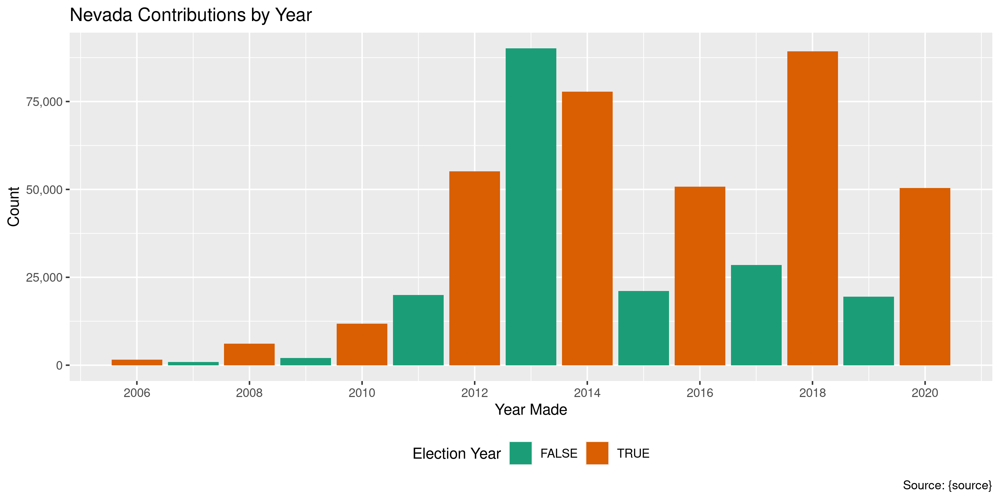

Nevada Contributions
================
Kiernan Nicholls
Thu Feb 4 11:00:29 2021

-   [Project](#project)
-   [Objectives](#objectives)
-   [Packages](#packages)
-   [Data](#data)
    -   [Report](#report)
    -   [Age](#age)
    -   [Format](#format)
    -   [Variables](#variables)
    -   [Records](#records)
-   [Download](#download)
-   [Unzip](#unzip)
-   [Columns](#columns)
-   [Read](#read)
-   [Join](#join)
    -   [Recipient](#recipient)
    -   [Contributors](#contributors)
    -   [Finish](#finish)
-   [Explore](#explore)
    -   [Missing](#missing)
    -   [Duplicates](#duplicates)
    -   [Categorical](#categorical)
    -   [Amounts](#amounts)
    -   [Dates](#dates)
-   [Wrangle](#wrangle)
-   [Conclude](#conclude)
-   [Export](#export)
-   [Upload](#upload)

<!-- Place comments regarding knitting here -->

## Project

The Accountability Project is an effort to cut across data silos and
give journalists, policy professionals, activists, and the public at
large a simple way to search across huge volumes of public data about
people and organizations.

Our goal is to standardizing public data on a few key fields by thinking
of each dataset row as a transaction. For each transaction there should
be (at least) 3 variables:

1.  All **parties** to a transaction.
2.  The **date** of the transaction.
3.  The **amount** of money involved.

## Objectives

This document describes the process used to complete the following
objectives:

1.  How many records are in the database?
2.  Check for entirely duplicated records.
3.  Check ranges of continuous variables.
4.  Is there anything blank or missing?
5.  Check for consistency issues.
6.  Create a five-digit ZIP Code called `zip`.
7.  Create a `year` field from the transaction date.
8.  Make sure there is data on both parties to a transaction.

## Packages

The following packages are needed to collect, manipulate, visualize,
analyze, and communicate these results. The `pacman` package will
facilitate their installation and attachment.

``` r
if (!require("pacman")) {
  install.packages("pacman")
}
pacman::p_load(
  tidyverse, # data manipulation
  lubridate, # datetime strings
  gluedown, # printing markdown
  janitor, # clean data frames
  campfin, # custom irw tools
  aws.s3, # aws cloud storage
  refinr, # cluster & merge
  scales, # format strings
  knitr, # knit documents
  vroom, # fast reading
  rvest, # scrape html
  glue, # code strings
  here, # project paths
  httr, # http requests
  fs # local storage 
)
```

This document should be run as part of the `R_campfin` project, which
lives as a sub-directory of the more general, language-agnostic
[`irworkshop/accountability_datacleaning`](https://github.com/irworkshop/accountability_datacleaning)
GitHub repository.

The `R_campfin` project uses the [RStudio
projects](https://support.rstudio.com/hc/en-us/articles/200526207-Using-Projects)
feature and should be run as such. The project also uses the dynamic
`here::here()` tool for file paths relative to *your* machine.

``` r
# where does this document knit?
here::i_am("nv/contribs/docs/nv_contribs_diary.Rmd")
```

## Data

The Nevada Secretary of State (NVSOS) office requires that one register
for an account to access “[bulk data
download](https://www.nvsos.gov/sos/online-services/data-download)”
service page.

> Welcome to the Nevada Secretary of State online unified login system.
> Here you may access the following systems all with one login account:
> \* Bulk Data Download \* …

The process for downloaded a report is [outlined
here](https://www.nvsos.gov/SoSServices/AnonymousAccess/HelpGuides/DataDownloadUserGuide.aspx):

Create a report for “Full Unabridged Database Dump” of “Campaign
Finance” data.

> This report will expose Contributions and Expenses report data filed
> within our “Aurora” Campaign Financial Disclosure system. This would
> not include data filed in a Financial Disclosure report. This bulk
> data report tool here should be used to pull the entire database or
> slightly smaller subsets of data such as all contributions filed after
> 1/1/2016 by groups of type “PAC”…

### Report

The site allows users to define the format for their data download. The
site generated the following summary of our specified data format:

> If “Text File - Fixed Width” is selected your report results will be
> inserted into a standard ASCII text file where each field starts at a
> specific “fixed” position for each line. For more specific information
> about the report format for custom built reports, including the
> position and data type of each field, click the “View Selected File
> Structure” button on the General tab when you viewyour report.

This file structure report is an HTML page with a description and six
tables.

> Your report will generate 6 fixed width ASCII text file(s) compressed
> into one Zip file named in the format
> “CampaignFinance.43993.&lt;Today’s Date&gt;.zip”\*. Below you will
> find the format of each file:

### Age

> The data being reported off of is no more than 24 hours old. This data
> is copied very late each night from live data to minimize the large
> burden of bulk reporting on the production system.

### Format

The report data is split into multiple files, per the [NVSOS FAQ
page](https://www.nvsos.gov/SOSServices/AnonymousAccess/HelpGuides/FAQ.aspx#5):

> This is what is referred to as a normalized relational structure in
> the database world. Data items such as business entities and officers
> have a direct relation to one another. There can be any number of
> officers to one business entity. Because of this many to one
> relationship, the officers data is stored in a different data table
> (or file) than the business entities. Then we relate officer records
> to a business entity record by a common key data column, in this case
> the CorporationID… By separating officers and entities into separate
> records we can eliminate the redundancy and added size associated with
> putting the business entity data on each officer record or eliminate
> the complexity of allocating an undeterminable amount of officers on
> the one business entity record. This same many-to-one relationship is
> true of voter history records to voter records, UCC actions to UCC
> liens or Corporation Stocks to Corporations, to name a few.

#### Tables

The summary continues to provide individual structure summaries on each
of the six files included in the report along with an key to the file
name. These six tables contain columns describing both the data type and
the width of each column. This information is needed to properly read
the flat text files.

``` r
st_dir <- here("nv", "contribs")
about_path <- path(st_dir, "File Format - Secretary of State, Nevada.html")
about <- read_html(x = about_path)
```

``` r
about_tables <- about %>% 
  html_nodes(".entryform") %>% 
  html_table(fill = TRUE) %>% 
  map(as_tibble)
```

``` r
about_tables <- about_tables[map_lgl(about_tables, ~ncol(.) == 4)]
about_tables <- map(about_tables, row_to_names, row_number = 1)
about_names <- str_subset(html_text(html_nodes(about, "b")), "\\d")
```

<table class="kable_wrapper">
<tbody>
<tr>
<td>

| Field Name                | Data Type   | Start Position | Length |
|:--------------------------|:------------|---------------:|-------:|
| CandidateID (Primary Key) | int         |              1 |     10 |
| First Name                | varchar(25) |             11 |     25 |
| Last Name                 | varchar(25) |             36 |     25 |
| Party                     | varchar(60) |             61 |     60 |
| Office                    | varchar(60) |            121 |     60 |
| Jurisdiction              | varchar(50) |            181 |     50 |

</td>
<td>

| Field Name            | Data Type    | Start Position | Length |
|:----------------------|:-------------|---------------:|-------:|
| GroupID (Primary Key) | int          |              1 |     10 |
| Group Name            | varchar(120) |             11 |    120 |
| Group Type            | varchar(100) |            131 |    100 |
| Contact Name          | varchar(35)  |            231 |     35 |
| Active                | bit          |            266 |      1 |
| City                  | varchar(30)  |            267 |     30 |

</td>
<td>

| Field Name                                           | Data Type    | Start Position | Length |
|:-----------------------------------------------------|:-------------|---------------:|-------:|
| ReportID (Primary Key)                               | int          |              1 |     10 |
| CandidateID (Foreign Key Ref Candidates.CandidateID) | int          |             11 |     10 |
| GroupID (Foreign Key Ref Groups.GroupID)             | int          |             21 |     10 |
| Report Name                                          | varchar(120) |             31 |    120 |
| Election Cycle                                       | varchar(4)   |            151 |      4 |
| Filing Due Date                                      | datetime     |            155 |     10 |
| Filed Date                                           | datetime     |            165 |     10 |
| Amended                                              | bit          |            175 |      1 |
| Superseded                                           | bit          |            176 |      1 |

</td>
<td>

| Field Name              | Data Type    | Start Position | Length |
|:------------------------|:-------------|---------------:|-------:|
| ContactID (Primary Key) | int          |              1 |     10 |
| First Name              | varchar(30)  |             11 |     30 |
| Middle Name             | varchar(30)  |             41 |     30 |
| Last Name               | varchar(100) |             71 |    100 |

</td>
<td>

| Field Name                                                    | Data Type   | Start Position | Length |
|:--------------------------------------------------------------|:------------|---------------:|-------:|
| ContributionID (Primary Key)                                  | int         |              1 |     10 |
| ReportID (Foreign Key Ref Reports.ReportID)                   | int         |             11 |     10 |
| CandidateID (Foreign Key Ref Candidates.CandidateID)          | int         |             21 |     10 |
| GroupID (Foreign Key Ref Groups.GroupID)                      | int         |             31 |     10 |
| Contribution Date                                             | datetime    |             41 |     10 |
| Contribution Amount                                           | money       |             51 |     21 |
| Contribution Type                                             | varchar(30) |             72 |     30 |
| ContributorID (Foreign Key Ref Contributors-Payees.ContactID) | int         |            102 |     10 |

</td>
<td>

| Field Name                                               | Data Type   | Start Position | Length |
|:---------------------------------------------------------|:------------|---------------:|-------:|
| ExpenseID (Primary Key)                                  | int         |              1 |     10 |
| ReportID (Foreign Key Ref Reports.ReportID)              | int         |             11 |     10 |
| CandidateID (Foreign Key Ref Candidates.CandidateID)     | int         |             21 |     10 |
| GroupID (Foreign Key Ref Groups.GroupID)                 | int         |             31 |     10 |
| Expense Date                                             | datetime    |             41 |     10 |
| Expense Amount                                           | money       |             51 |     21 |
| Expense Type                                             | varchar(30) |             72 |     30 |
| Payee ID (Foreign Key Ref Contributors-Payees.ContactID) | int         |            102 |     10 |

</td>
</tr>
</tbody>
</table>

#### Data Types

> The Data Types within this column correspond to the SQL Server 2012
> data types in which the source data is stored. The purpose of exposing
> these data types is simply to provide a suggested guideline for any
> software programmers writing an interface to process these report
> files. Below is a partial list of SQL Server data types:

> -   `bigint` - Numeric, 8 bytes
> -   `int` - Numeric, 4 bytes
> -   `smallint` - Numeric, 2 bytes
> -   `tinyint` - Numeric, 1 byte
> -   `bit` - Results are Truewhich will be represented as “T”"F"
> -   `money` - Monetary data, 8 bytes, accuracy to a ten-thousandth of
>     a unit
> -   `float` - Floating precision number from -1.79E + 308 through
>     1.79E + 308.
> -   `real` - Floating precision number from -3.40E + 38 through
>     3.40E + 38.
> -   `datetime` - Date
> -   `char` - Fixed-length character data
> -   `varchar` - Variable-length data with a maximum of 8,000
>     characters

### Variables

Definitions for few variables can be found in the “Result Field” tab:

1.  `Jurisdiction`: &gt; This will be name of the city or county for
    city/county offices currently held by the candidate (e.g. “CITY OF
    YERINGTON”, “DOUGLAS COUNTY”). This will be set to “NV SOS” for
    statewide offices such as Governor, State Controller or State
    assemblymen. An office assigned to a candidate could be updated by
    the NV SOS Elections staff as necessary when that candidate files
    for a new office.

2.  `Contribution Type`: &gt; Use this column to differentiate which one
    of four contribution types this contribution record is: Monetary
    Contribution, In Kind Contribution, In Kind Written Commitment, or
    Written Commitment.

3.  `Last Name`: &gt; When the contributor or payee is an organization
    as opposed to an individual, the entire organization name will be in
    the Last Name field only.

4.  `Expense Type`: &gt; Use this column to differentiate which type of
    expense record this is: Monetary Expense or In Kind Expense.

5.  `Active`: &gt; A value of F (False) indicates the group has been
    marked as inactive by the NV Secretary of State’s office Elections
    division due to submission of a “notice of inactivity” or for
    failure to renew annual registration.

6.  `Amended`: &gt; A value of T (True) indicates this contributions and
    expense report has been marked as an amended report by the original
    filer implying this report supersedes a report for this same period,
    filed earlier. An amended report is to be full comprehensive for
    that report period and in essence replaces all contributions and
    expenses filed in the earlier report.

7.  `Election Cycle`: &gt; The Election Cycle is the 4 digit filing or
    reporting year defining a filing period grouping together a
    collection of contribution and expenses reports…

8.  `Superseded`: &gt; A report is Superseded when an amended report was
    filed later by the same filer for the same reporting period. In this
    case the Superseded field for the older report record will be set to
    T (True)…

### Records

> Total number of records returned: 1,104,096

``` r
total_rows <- 1104096
```

> A record is one single entity or row from a database table. The “Total
> number of records returned” displayed on the report preview page will
> be a summation of all rows returned from each table you are reporting
> from. For example, if your report queries for both Resident Agent and
> Corporation data from the Corporations database, the number of records
> returned might be 1000, 700 of which might be Corporation records and
> 300 being Resident Agent records.

## Download

Within seven days of running the report, the data can be downloaded from
the link provided to the account email address. The link will not work
for anybody not logged into that NVSOS account.

``` r
raw_url <- "https://www.nvsos.gov/yourreports/CampaignFinance.43993.012621101815.zip"
raw_dir <- dir_create(here("nv", "contribs", "data", "raw"))
raw_zip <- path(raw_dir, basename(raw_url))
file_size(raw_zip)
#> 12.6M
```

This URL contains the date the report was generated.

``` r
report_time <- mdy_hms(str_extract(raw_url, "\\d+(?=\\.zip$)"))
with_tz(report_time, tzone = "PST")
#> [1] "2021-01-26 10:18:15 PST"
```

``` r
if (!file_exists(raw_zip)) {
  download.file(raw_url, raw_zip)
}
```

This raw ZIP archive has been backed up to the IRW server.

``` r
as_fs_bytes(object_size(
  object = path("IRW/raw_backup/nv", basename(raw_zip)), 
  bucket = "publicaccountability"
))
#> 12.6M
```

## Unzip

The provided ZIP archive contains all six tables as fixed width text
files.

``` r
raw_txt <- unzip(raw_zip, exdir = raw_dir)
```

| Name                                               |  Length | Date                |
|:---------------------------------------------------|--------:|:--------------------|
| `CampaignFinance.Cnddt.43993.012621101815.txt`     |   1.59M | 2021-01-26 10:18:00 |
| `CampaignFinance.Cntrbt.43993.012621101815.txt`    |  56.58M | 2021-01-26 10:18:00 |
| `CampaignFinance.Cntrbtrs-.43993.012621101815.txt` |  36.46M | 2021-01-26 10:18:00 |
| `CampaignFinance.Expn.43993.012621101815.txt`      |  32.72M | 2021-01-26 10:18:00 |
| `CampaignFinance.Grp.43993.012621101815.txt`       | 373.38K | 2021-01-26 10:18:00 |
| `CampaignFinance.Rpr.43993.012621101815.txt`       |   7.58M | 2021-01-26 10:18:00 |

We need to match the order of this vector to the order of the tables.

``` r
names(raw_txt) <- c(
  "Candidates",
  "Contributions",
  "Contributors",
  "Expenses",
  "Groups",
  "Reports"
)
```

``` r
raw_txt <- raw_txt[match(names(about_tables), names(raw_txt))]
names(raw_txt) == names(about_tables)
#> [1] TRUE TRUE TRUE TRUE TRUE TRUE
```

## Columns

We can use the tables read from the HTML file, and described in the
**About** section above, to create (1) the column width tables expected
by `read_fwf()`, and (2) the readr column type specification objects.
Two functions will take the `Field Name`, `Data Type` and `Length`

``` r
as_fwf_width <- function(.data) {
  fwf_widths(
    widths = as.integer(x = .data[[4]]),
    col_names = str_remove(
      string = .data[[1]], 
      pattern = "\\s\\(.*\\)"
    )
  )
}
```

``` r
as_col_spec <- function(.data) {
  x <- .data[["Data Type"]]
  x <- case_when(
    str_detect(x, "varchar")  ~ "c",
    str_detect(x, "datetime") ~ "D",
    str_detect(x, "money")    ~ "d",
    str_detect(x, "bit")      ~ "l",
    str_detect(x, "int")      ~ "i",
    TRUE ~ "c"
  )
  as.col_spec(
    x = setNames(
      object = x,
      nm = str_remove(
        string = .data[["Field Name"]], 
        pattern = "\\s\\(.*\\)"
      )
    )
  )
}
```

``` r
about_tables$Groups
#> # A tibble: 6 x 4
#>   `Field Name`          `Data Type`  `Start Position` Length
#>   <chr>                 <chr>        <chr>            <chr> 
#> 1 GroupID (Primary Key) int          1                10    
#> 2 Group Name            varchar(120) 11               120   
#> 3 Group Type            varchar(100) 131              100   
#> 4 Contact Name          varchar(35)  231              35    
#> 5 Active                bit          266              1     
#> 6 City                  varchar(30)  267              30
as_fwf_width(about_tables$Groups)
#> # A tibble: 6 x 3
#>   begin   end col_names   
#>   <int> <int> <chr>       
#> 1     0    10 GroupID     
#> 2    10   130 Group Name  
#> 3   130   230 Group Type  
#> 4   230   265 Contact Name
#> 5   265   266 Active      
#> 6   266   296 City
as_col_spec(about_tables$Groups)
#> cols(
#>   GroupID = col_integer(),
#>   `Group Name` = col_character(),
#>   `Group Type` = col_character(),
#>   `Contact Name` = col_character(),
#>   Active = col_logical(),
#>   City = col_character()
#> )
```

``` r
raw_widths <- map(about_tables, as_fwf_width)
raw_types  <- map(about_tables, as_col_spec)
```

## Read

One file seems to have been exported with some empty rows and other rows
without sufficient padding. This can be fixed with string manipulation.

``` r
tmp <- file_temp(ext = "txt")
raw_txt[["Contributors"]] %>% 
  read_lines(skip_empty_rows = TRUE) %>% 
  str_subset(pattern = "^\\d") %>% 
  str_pad(width = 170, side = "right", pad = " ") %>% 
  write_lines(file = tmp)
raw_txt[["Contributors"]] <- tmp
```

All six tables can then be read into a list using `readr::read_fwf()`
and the (1) width tables and (2) column type specifications.

``` r
nv <- pmap(
  .f = read_fwf,
  locale = locale(
    date_format = "%m/%d/%Y",
    tz = "US/Pacific"
  ),
  .l = list(
    file = raw_txt,
    col_positions = raw_widths,
    col_types = raw_types
  )
)
```

The total number of rows read matches what we were told when exporting.

``` r
sum(map_dbl(nv, nrow)) == total_rows
#> [1] TRUE
```

## Join

The primary table of interest here is `Contributions`, which lists the
525,038 contributions made to committees and reported to the state. This
table does not identify the receiving committee or contributing entity.
This information is found in the `Groups` and `Contributors` tables,
respectively. We need to add variables identifying all parties to each
contribution.

``` r
nv$Contributions
#> # A tibble: 525,038 x 8
#>    con_id rpt_id cand_id grp_id con_dt     con_amt con_type                   ctbr_id
#>     <int>  <int>   <int>  <int> <date>       <dbl> <chr>                        <int>
#>  1      2   6980      NA   1220 2006-06-28   35000 Monetary Contribution            3
#>  2      3   6983      NA   1332 2006-03-29       2 Monetary Contribution            8
#>  3      4   6983      NA   1332 2006-03-31       1 Monetary Contribution            8
#>  4      5   6983      NA   1332 2006-04-10     200 Monetary Contribution            8
#>  5      6   6983      NA   1332 2006-01-01       0 Written Commitment               9
#>  6      7   6983      NA   1332 2006-01-01       0 In Kind Contribution             9
#>  7      8   6983      NA   1332 2006-01-01       0 In Kind Written Commitment       9
#>  8      9   6987      NA   1364 2006-01-13    1000 Monetary Contribution           15
#>  9     10   6991    2360     NA 2006-02-07     100 Monetary Contribution           17
#> 10     11   6991    2360     NA 2006-02-08     500 Monetary Contribution           18
#> # … with 525,028 more rows
```

### Recipient

We will first join the committees. Contributions can be made to either a
candidate or committee, each listed in their own table with their own
key column in Contributions. We can combine these keys and tables.

``` r
rec_cands <- nv$Candidates %>% 
  select(cand_id, first_nm, last_nm) %>% 
  filter(cand_id %in% nv$Contributions$cand_id) %>% 
  mutate(rec_type = "Candidate", .after = last_nm) %>% 
  unite(
    col = rec_nm,
    first_nm, last_nm,,
    sep = " ",
    remove = TRUE,
    na.rm = TRUE
  )
```

``` r
rec_comms <- nv$Groups %>% 
  filter(grp_id %in% nv$Contributions$grp_id) %>% 
  select(grp_id, rec_nm = grp_nm, rec_type = grp_type)
```

``` r
nv$Contributions <- left_join(
  x = nv$Contributions,
  y = bind_rows(rec_cands, rec_comms),
  by = c("cand_id", "grp_id")
)
```

### Contributors

``` r
ctbr_nms <- nv$Contributors %>% 
  filter(contact_id %in% nv$Contributions$ctbr_id) %>% 
  unite(
    col = ctbr_nm,
    first_nm, middle_nm, last_nm,
    sep = " ",
    remove = TRUE,
    na.rm = TRUE
  )
```

``` r
nv$Contributions <- left_join(
  x = nv$Contributions,
  y = ctbr_nms,
  by = c("ctbr_id" = "contact_id")
)
```

### Finish

``` r
nvc <- nv$Contributions %>% 
  relocate(ctbr_id, .before = ctbr_nm) %>% 
  mutate(
    cand_id = str_c("C", cand_id),
    grp_id = str_c("G", grp_id),
    rec_id = coalesce(cand_id, grp_id),
    .before = rec_nm
  ) %>% 
  select(-cand_id, -grp_id)
```

## Explore

There are 525,038 rows of 10 columns. Each record represents a single
contribution to a political committee or candidate.

``` r
glimpse(nvc)
#> Rows: 525,038
#> Columns: 10
#> $ con_id   <int> 2, 3, 4, 5, 6, 7, 8, 9, 10, 11, 12, 13, 14, 15, 16, 17, 18, 19, 20, 21, 22, 23, 24, 25, 26, 27, 28, …
#> $ rpt_id   <int> 6980, 6983, 6983, 6983, 6983, 6983, 6983, 6987, 6991, 6991, 6991, 6990, 6991, 6991, 6991, 6990, 6991…
#> $ con_dt   <date> 2006-06-28, 2006-03-29, 2006-03-31, 2006-04-10, 2006-01-01, 2006-01-01, 2006-01-01, 2006-01-13, 200…
#> $ con_amt  <dbl> 35000, 2, 1, 200, 0, 0, 0, 1000, 100, 500, 1000, 0, 500, 5000, 200, 0, 200, 200, 300, 0, 0, 100, 500…
#> $ con_type <chr> "Monetary Contribution", "Monetary Contribution", "Monetary Contribution", "Monetary Contribution", …
#> $ rec_id   <chr> "G1220", "G1332", "G1332", "G1332", "G1332", "G1332", "G1332", "G1364", "C2360", "C2360", "C2360", "…
#> $ rec_nm   <chr> "Culinary Workers Union Local 226", "Nevada Next PAC", "Nevada Next PAC", "Nevada Next PAC", "Nevada…
#> $ rec_type <chr> "Independent Expenditure", "Political Action Committee", "Political Action Committee", "Political Ac…
#> $ ctbr_id  <int> 3, 8, 8, 8, 9, 9, 9, 15, 17, 18, 19, 20, 21, 22, 23, 24, 25, 25, 26, 27, 24, 28, 29, 30, 31, 32, 33,…
#> $ ctbr_nm  <chr> "UNITE HERE TIP", "Bonnie B Jacobs", "Bonnie B Jacobs", "Bonnie B Jacobs", "NONE", "NONE", "NONE", "…
tail(nvc)
#> # A tibble: 6 x 10
#>   con_id rpt_id con_dt     con_amt con_type         rec_id rec_nm              rec_type            ctbr_id ctbr_nm      
#>    <int>  <int> <date>       <dbl> <chr>            <chr>  <chr>               <chr>                 <int> <chr>        
#> 1 736787 111458 2020-12-17    1500 Monetary Contri… G756   Nevada Beer Wholes… Political Action C…  179407 Jason Friers…
#> 2 736788 111458 2020-12-17     500 Monetary Contri… G756   Nevada Beer Wholes… Political Action C…  393515 Venicia Cons…
#> 3 736789 111458 2020-12-17     500 Monetary Contri… G756   Nevada Beer Wholes… Political Action C…  329640 Beatrice Dur…
#> 4 736790 111458 2020-12-17     500 Monetary Contri… G756   Nevada Beer Wholes… Political Action C…  201562 Jill Tolles  
#> 5 736791 111458 2020-12-17     500 Monetary Contri… G756   Nevada Beer Wholes… Political Action C…  284168 Elaine Marzo…
#> 6 736838 111479 2020-10-16    1000 Monetary Contri… C13605 Deborah Chang       Candidate             43600 AFSCME
```

### Missing

There are no columns missing values.

``` r
col_stats(nvc, count_na)
#> # A tibble: 10 x 4
#>    col      class      n     p
#>    <chr>    <chr>  <int> <dbl>
#>  1 con_id   <int>      0     0
#>  2 rpt_id   <int>      0     0
#>  3 con_dt   <date>     0     0
#>  4 con_amt  <dbl>      0     0
#>  5 con_type <chr>      0     0
#>  6 rec_id   <chr>      0     0
#>  7 rec_nm   <chr>      0     0
#>  8 rec_type <chr>      0     0
#>  9 ctbr_id  <int>      0     0
#> 10 ctbr_nm  <chr>      0     0
```

### Duplicates

We can also flag any record completely duplicated across every column.

``` r
nvc <- flag_dupes(nvc, -con_id)
sum(nvc$dupe_flag)
#> [1] 14173
```

``` r
key_vars <- c("ctbr_nm", "con_dt", "con_amt", "rec_nm")
```

``` r
nvc %>% 
  filter(dupe_flag) %>% 
  select(con_id, rpt_id, all_of(key_vars))
#> # A tibble: 14,173 x 6
#>    con_id rpt_id ctbr_nm                   con_dt     con_amt rec_nm                                                    
#>     <int>  <int> <chr>                     <date>       <dbl> <chr>                                                     
#>  1     18   6991 Howard H & Phyllis S Hen… 2006-02-15     200 E Tiras                                                   
#>  2     19   6991 Howard H & Phyllis S Hen… 2006-02-15     200 E Tiras                                                   
#>  3    103   7034 member dues               2006-07-15      11 Mineral County Classroom Teachers Association - Together …
#>  4    105   7034 member dues               2006-07-15      11 Mineral County Classroom Teachers Association - Together …
#>  5    106   7062 NONE                      2006-01-01       0 Patricia Herzog                                           
#>  6    107   7062 NONE                      2006-01-01       0 Patricia Herzog                                           
#>  7    504  13743 Harrah's Operating Compa… 2006-10-05    5000 Susan Brager                                              
#>  8    505  13743 Harrah's Operating Compa… 2006-10-05    5000 Susan Brager                                              
#>  9    536  13756 NONE                      2006-10-26       0 Patricia Herzog                                           
#> 10    537  13756 NONE                      2006-10-26       0 Patricia Herzog                                           
#> # … with 14,163 more rows
```

### Categorical

``` r
col_stats(nvc, n_distinct)
#> # A tibble: 11 x 4
#>    col       class       n          p
#>    <chr>     <chr>   <int>      <dbl>
#>  1 con_id    <int>  525038 1         
#>  2 rpt_id    <int>   15636 0.0298    
#>  3 con_dt    <date>   5077 0.00967   
#>  4 con_amt   <dbl>   15169 0.0289    
#>  5 con_type  <chr>       4 0.00000762
#>  6 rec_id    <chr>    2773 0.00528   
#>  7 rec_nm    <chr>    2770 0.00528   
#>  8 rec_type  <chr>       7 0.0000133 
#>  9 ctbr_id   <int>  170881 0.325     
#> 10 ctbr_nm   <chr>  128028 0.244     
#> 11 dupe_flag <lgl>       2 0.00000381
```

<!-- --><!-- -->

### Amounts

``` r
summary(nvc$con_amt)
#>     Min.  1st Qu.   Median     Mean  3rd Qu.     Max. 
#>   -25000       25      200     1876     1000 20700000
mean(nvc$con_amt <= 0)
#> [1] 0.0007618496
```

These are the records with the minimum and maximum amounts.

``` r
glimpse(nvc[c(which.max(nvc$con_amt), which.min(nvc$con_amt)), ])
#> Rows: 2
#> Columns: 11
#> $ con_id    <int> 544130, 154183
#> $ rpt_id    <int> 80598, 40633
#> $ con_dt    <date> 2018-09-21, 2013-01-23
#> $ con_amt   <dbl> 20700000, -25000
#> $ con_type  <chr> "Monetary Contribution", "Monetary Contribution"
#> $ rec_id    <chr> "G3708", "C4995"
#> $ rec_nm    <chr> "Coalition to Defeat Question 3", "Paul Anderson"
#> $ rec_type  <chr> "Political Action Committee", "Candidate"
#> $ ctbr_id   <int> 268234, 72128
#> $ ctbr_nm   <chr> "NV Energy", "Paul Anderson (Loan Reimb - orig loan was in  2011)"
#> $ dupe_flag <lgl> FALSE, FALSE
```

<!-- -->

### Dates

We can add the calendar year from `con_dt` with `lubridate::year()`

``` r
nvc <- mutate(nvc, con_yr = year(con_dt))
```

``` r
min(nvc$con_dt)
#> [1] "2006-01-01"
max(nvc$con_dt)
#> [1] "2020-12-31"
sum(nvc$con_dt > today())
#> [1] 0
```

<!-- -->

## Wrangle

There are no geographic variables in the database.

## Conclude

``` r
glimpse(sample_n(nvc, 50))
#> Rows: 50
#> Columns: 12
#> $ con_id    <int> 142885, 574758, 208165, 421189, 401072, 483697, 430123, 2595, 484227, 300381, 733549, 645238, 42149…
#> $ rpt_id    <int> 40106, 82950, 42399, 64317, 62696, 73510, 65108, 17506, 73702, 49425, 111260, 96247, 64335, 41571, …
#> $ con_dt    <date> 2013-03-29, 2018-03-09, 2013-07-26, 2016-09-16, 2016-08-10, 2017-11-02, 2016-09-13, 2007-01-01, 20…
#> $ con_amt   <dbl> 36.00, 200.00, 10.00, 1000.00, 250.00, 1000.00, 1500.00, 107.00, 5000.00, 6.00, 150.00, 1000.00, 25…
#> $ con_type  <chr> "Monetary Contribution", "Monetary Contribution", "Monetary Contribution", "Monetary Contribution",…
#> $ rec_id    <chr> "G987", "C6876", "G1616", "C6887", "C6526", "C1265", "C8009", "G799", "C8394", "C1643", "C13451", "…
#> $ rec_nm    <chr> "Bank of America Corporation State and Federal Political Action Committee", "Ozzie Fumo", "The Trav…
#> $ rec_type  <chr> "Political Action Committee", "Candidate", "Political Action Committee", "Candidate", "Candidate", …
#> $ ctbr_id   <int> 58067, 273104, 118971, 236327, 148834, 235509, 236837, 2597, 262607, 175909, 357615, 143207, 236543…
#> $ ctbr_nm   <chr> "Rim O Williams", "Wayne & Nancy Hardy", "Steven K Raymond", "Nicolas Spirtos", "Weil & Drage", "Le…
#> $ dupe_flag <lgl> FALSE, FALSE, FALSE, FALSE, FALSE, FALSE, FALSE, FALSE, FALSE, FALSE, FALSE, TRUE, FALSE, FALSE, FA…
#> $ con_yr    <dbl> 2013, 2018, 2013, 2016, 2016, 2017, 2016, 2007, 2017, 2014, 2020, 2019, 2016, 2013, 2013, 2020, 201…
```

1.  There are 525,038 records in the database.
2.  There are 14,173 duplicate records in the database.
3.  The range and distribution of `amount` and `date` seem reasonable.
4.  There are 0 records missing key variables.
5.  Consistency in geographic data has been improved with
    `campfin::normal_*()`.
6.  The 4-digit `year` variable has been created with
    `lubridate::year()`.

## Export

Now the file can be saved on disk for upload to the Accountability
server.

``` r
clean_dir <- dir_create(here("nv", "contribs", "data", "clean"))
clean_path <- path(clean_dir, "nv_contribs_clean.csv")
write_csv(nvc, clean_path, na = "")
(clean_size <- file_size(clean_path))
#> 68.2M
file_encoding(clean_path) %>% 
  mutate(across(path, path.abbrev))
#> # A tibble: 1 x 3
#>   path                                           mime            charset 
#>   <fs::path>                                     <chr>           <chr>   
#> 1 ~/nv/contribs/data/clean/nv_contribs_clean.csv application/csv us-ascii
```

## Upload

We can use the `aws.s3::put_object()` to upload the text file to the IRW
server.

``` r
aws_path <- path("csv", basename(clean_path))
if (!object_exists(aws_path, "publicaccountability")) {
  put_object(
    file = clean_path,
    object = aws_path, 
    bucket = "publicaccountability",
    acl = "public-read",
    show_progress = TRUE,
    multipart = TRUE
  )
}
aws_head <- head_object(aws_path, "publicaccountability")
(aws_size <- as_fs_bytes(attr(aws_head, "content-length")))
unname(aws_size == clean_size)
```
