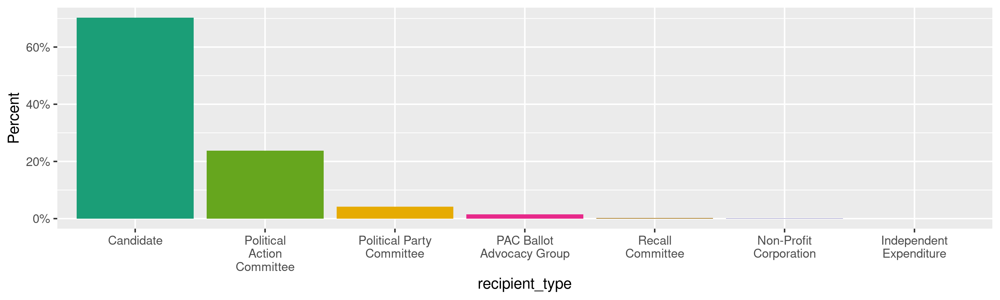
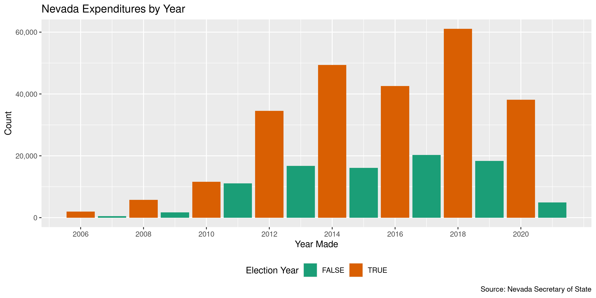

Nevada Expenditures
================
Kiernan Nicholls
Mon Nov 8 11:58:11 2021

-   [Project](#project)
-   [Objectives](#objectives)
-   [Packages](#packages)
-   [Data](#data)
    -   [Report](#report)
    -   [Age](#age)
    -   [Format](#format)
    -   [Variables](#variables)
    -   [Records](#records)
-   [Download](#download)
-   [Unzip](#unzip)
-   [Columns](#columns)
-   [Read](#read)
-   [Join](#join)
    -   [Recipient](#recipient)
    -   [Payees](#payees)
-   [Wrangle](#wrangle)
    -   [Address](#address)
    -   [ZIP](#zip)
    -   [State](#state)
    -   [City](#city)
-   [Join](#join-1)
-   [Explore](#explore)
    -   [Missing](#missing)
    -   [Duplicates](#duplicates)
    -   [Categorical](#categorical)
    -   [Amounts](#amounts)
    -   [Dates](#dates)
-   [Conclude](#conclude)
-   [Export](#export)
-   [Upload](#upload)

<!-- Place comments regarding knitting here -->

## Project

The Accountability Project is an effort to cut across data silos and
give journalists, policy professionals, activists, and the public at
large a simple way to search across huge volumes of public data about
people and organizations.

Our goal is to standardizing public data on a few key fields by thinking
of each dataset row as a transaction. For each transaction there should
be (at least) 3 variables:

1.  All **parties** to a transaction.
2.  The **date** of the transaction.
3.  The **amount** of money involved.

## Objectives

This document describes the process used to complete the following
objectives:

1.  How many records are in the database?
2.  Check for entirely duplicated records.
3.  Check ranges of continuous variables.
4.  Is there anything blank or missing?
5.  Check for consistency issues.
6.  Create a five-digit ZIP Code called `zip`.
7.  Create a `year` field from the transaction date.
8.  Make sure there is data on both parties to a transaction.

## Packages

The following packages are needed to collect, manipulate, visualize,
analyze, and communicate these results. The `pacman` package will
facilitate their installation and attachment.

``` r
if (!require("pacman")) {
  install.packages("pacman")
}
pacman::p_load(
  tidyverse, # data manipulation
  lubridate, # datetime strings
  gluedown, # printing markdown
  janitor, # clean data frames
  campfin, # custom irw tools
  aws.s3, # aws cloud storage
  refinr, # cluster & merge
  scales, # format strings
  knitr, # knit documents
  vroom, # fast reading
  rvest, # scrape html
  glue, # code strings
  here, # project paths
  httr, # http requests
  fs # local storage 
)
```

This document should be run as part of the `R_campfin` project, which
lives as a sub-directory of the more general, language-agnostic
[`irworkshop/accountability_datacleaning`](https://github.com/irworkshop/accountability_datacleaning)
GitHub repository.

The `R_campfin` project uses the [RStudio
projects](https://support.rstudio.com/hc/en-us/articles/200526207-Using-Projects)
feature and should be run as such. The project also uses the dynamic
`here::here()` tool for file paths relative to *your* machine.

``` r
# where does this document knit?
here::i_am("nv/expends/docs/nv_expends_diary.Rmd")
```

## Data

The Nevada Secretary of State (NVSOS) office requires that one register
for an account to access “[bulk data
download](https://www.nvsos.gov/sos/online-services/data-download)”
service page.

> Welcome to the Nevada Secretary of State online unified login system.
> Here you may access the following systems all with one login account:
> \* Bulk Data Download \* …

The process for downloaded a report is [outlined
here](https://www.nvsos.gov/SoSServices/AnonymousAccess/HelpGuides/DataDownloadUserGuide.aspx):

Create a report for “Full Unabridged Database Dump” of “Campaign
Finance” data.

> This report will expose Contributions and Expenses report data filed
> within our “Aurora” Campaign Financial Disclosure system. This would
> not include data filed in a Financial Disclosure report. This bulk
> data report tool here should be used to pull the entire database or
> slightly smaller subsets of data such as all contributions filed after
> 1/1/2016 by groups of type “PAC”…

### Report

The site allows users to define the format for their data download. The
site generated the following summary of our specified data format:

> If “Text File - Fixed Width” is selected your report results will be
> inserted into a standard ASCII text file where each field starts at a
> specific “fixed” position for each line. For more specific information
> about the report format for custom built reports, including the
> position and data type of each field, click the “View Selected File
> Structure” button on the General tab when you viewyour report.

This file structure report is an HTML page with a description and six
tables.

> Your report will generate 6 fixed width ASCII text file(s) compressed
> into one Zip file named in the format “CampaignFinance.43993.\<Today’s
> Date>.zip”\*. Below you will find the format of each file:

### Age

> The data being reported off of is no more than 24 hours old. This data
> is copied very late each night from live data to minimize the large
> burden of bulk reporting on the production system.

### Format

The report data is split into multiple files, per the [NVSOS FAQ
page](https://www.nvsos.gov/SOSServices/AnonymousAccess/HelpGuides/FAQ.aspx#5):

> This is what is referred to as a normalized relational structure in
> the database world. Data items such as business entities and officers
> have a direct relation to one another. There can be any number of
> officers to one business entity. Because of this many to one
> relationship, the officers data is stored in a different data table
> (or file) than the business entities. Then we relate officer records
> to a business entity record by a common key data column, in this case
> the CorporationID… By separating officers and entities into separate
> records we can eliminate the redundancy and added size associated with
> putting the business entity data on each officer record or eliminate
> the complexity of allocating an undeterminable amount of officers on
> the one business entity record. This same many-to-one relationship is
> true of voter history records to voter records, UCC actions to UCC
> liens or Corporation Stocks to Corporations, to name a few.

#### Tables

The summary continues to provide individual structure summaries on each
of the six files included in the report along with an key to the file
name. These six tables contain columns describing both the data type and
the width of each column. This information is needed to properly read
the flat text files.

``` r
st_dir <- here("nv", "expends")
about_path <- path(st_dir, "File Format - Secretary of State, Nevada.html")
about <- read_html(x = about_path)
```

``` r
about_tables <- about %>% 
  html_nodes(".entryform") %>% 
  html_table(fill = TRUE) %>% 
  map(as_tibble)
```

``` r
about_tables <- about_tables[map_lgl(about_tables, ~ncol(.) == 4)]
about_tables <- map(about_tables, row_to_names, row_number = 1)
about_names <- str_subset(html_text(html_nodes(about, "b")), "\\d")
```

| Field Name                | Data Type   | Start Position | Length |
|:--------------------------|:------------|---------------:|-------:|
| CandidateID (Primary Key) | int         |              1 |     10 |
| First Name                | varchar(25) |             11 |     25 |
| Last Name                 | varchar(25) |             36 |     25 |
| Party                     | varchar(60) |             61 |     60 |
| Office                    | varchar(60) |            121 |     60 |
| Jurisdiction              | varchar(50) |            181 |     50 |
| Mailing Address           | varchar(50) |            231 |     50 |
| Mailing City              | varchar(25) |            281 |     25 |
| Mailing State             | varchar(2)  |            306 |      2 |
| Mailing Zip               | varchar(9)  |            308 |      9 |

| Field Name            | Data Type    | Start Position | Length |
|:----------------------|:-------------|---------------:|-------:|
| GroupID (Primary Key) | int          |              1 |     10 |
| Group Name            | varchar(120) |             11 |    120 |
| Group Type            | varchar(100) |            131 |    100 |
| Contact Name          | varchar(35)  |            231 |     35 |
| Active                | bit          |            266 |      1 |
| City                  | varchar(30)  |            267 |     30 |

| Field Name                                           | Data Type    | Start Position | Length |
|:-----------------------------------------------------|:-------------|---------------:|-------:|
| ReportID (Primary Key)                               | int          |              1 |     10 |
| CandidateID (Foreign Key Ref Candidates.CandidateID) | int          |             11 |     10 |
| GroupID (Foreign Key Ref Groups.GroupID)             | int          |             21 |     10 |
| Report Name                                          | varchar(120) |             31 |    120 |
| Election Cycle                                       | varchar(4)   |            151 |      4 |
| Filing Due Date                                      | datetime     |            155 |     10 |
| Filed Date                                           | datetime     |            165 |     10 |
| Amended                                              | bit          |            175 |      1 |
| Superseded                                           | bit          |            176 |      1 |

| Field Name              | Data Type    | Start Position | Length |
|:------------------------|:-------------|---------------:|-------:|
| ContactID (Primary Key) | int          |              1 |     10 |
| First Name              | varchar(30)  |             11 |     30 |
| Middle Name             | varchar(30)  |             41 |     30 |
| Last Name               | varchar(100) |             71 |    100 |
| Address 1               | varchar(60)  |            171 |     60 |
| Address 2               | varchar(30)  |            231 |     30 |
| City                    | varchar(45)  |            261 |     45 |
| State                   | varchar(2)   |            306 |      2 |
| Zip                     | varchar(10)  |            308 |     10 |

| Field Name                                                    | Data Type   | Start Position | Length |
|:--------------------------------------------------------------|:------------|---------------:|-------:|
| ContributionID (Primary Key)                                  | int         |              1 |     10 |
| ReportID (Foreign Key Ref Reports.ReportID)                   | int         |             11 |     10 |
| CandidateID (Foreign Key Ref Candidates.CandidateID)          | int         |             21 |     10 |
| GroupID (Foreign Key Ref Groups.GroupID)                      | int         |             31 |     10 |
| Contribution Date                                             | datetime    |             41 |     10 |
| Contribution Amount                                           | money       |             51 |     21 |
| Contribution Type                                             | varchar(30) |             72 |     30 |
| ContributorID (Foreign Key Ref Contributors-Payees.ContactID) | int         |            102 |     10 |

| Field Name                                               | Data Type   | Start Position | Length |
|:---------------------------------------------------------|:------------|---------------:|-------:|
| ExpenseID (Primary Key)                                  | int         |              1 |     10 |
| ReportID (Foreign Key Ref Reports.ReportID)              | int         |             11 |     10 |
| CandidateID (Foreign Key Ref Candidates.CandidateID)     | int         |             21 |     10 |
| GroupID (Foreign Key Ref Groups.GroupID)                 | int         |             31 |     10 |
| Expense Date                                             | datetime    |             41 |     10 |
| Expense Amount                                           | money       |             51 |     21 |
| Expense Type                                             | varchar(30) |             72 |     30 |
| Payee ID (Foreign Key Ref Contributors-Payees.ContactID) | int         |            102 |     10 |

#### Data Types

> The Data Types within this column correspond to the SQL Server 2012
> data types in which the source data is stored. The purpose of exposing
> these data types is simply to provide a suggested guideline for any
> software programmers writing an interface to process these report
> files. Below is a partial list of SQL Server data types:

> -   `bigint` - Numeric, 8 bytes
> -   `int` - Numeric, 4 bytes
> -   `smallint` - Numeric, 2 bytes
> -   `tinyint` - Numeric, 1 byte
> -   `bit` - Results are Truewhich will be represented as “T”"F”
> -   `money` - Monetary data, 8 bytes, accuracy to a ten-thousandth of
>     a unit
> -   `float` - Floating precision number from -1.79E + 308 through
>     1.79E + 308.
> -   `real` - Floating precision number from -3.40E + 38 through
>     3.40E + 38.
> -   `datetime` - Date
> -   `char` - Fixed-length character data
> -   `varchar` - Variable-length data with a maximum of 8,000
>     characters

### Variables

Definitions for few variables can be found in the “Result Field” tab:

1.  `Jurisdiction`: > This will be name of the city or county for
    city/county offices currently held by the candidate (e.g. “CITY OF
    YERINGTON”, “DOUGLAS COUNTY”). This will be set to “NV SOS” for
    statewide offices such as Governor, State Controller or State
    assemblymen. An office assigned to a candidate could be updated by
    the NV SOS Elections staff as necessary when that candidate files
    for a new office.

2.  `Contribution Type`: > Use this column to differentiate which one of
    four contribution types this contribution record is: Monetary
    Contribution, In Kind Contribution, In Kind Written Commitment, or
    Written Commitment.

3.  `Last Name`: > When the contributor or payee is an organization as
    opposed to an individual, the entire organization name will be in
    the Last Name field only.

4.  `Expense Type`: > Use this column to differentiate which type of
    expense record this is: Monetary Expense or In Kind Expense.

5.  `Active`: > A value of F (False) indicates the group has been marked
    as inactive by the NV Secretary of State’s office Elections division
    due to submission of a “notice of inactivity” or for failure to
    renew annual registration.

6.  `Amended`: > A value of T (True) indicates this contributions and
    expense report has been marked as an amended report by the original
    filer implying this report supersedes a report for this same period,
    filed earlier. An amended report is to be full comprehensive for
    that report period and in essence replaces all contributions and
    expenses filed in the earlier report.

7.  `Election Cycle`: > The Election Cycle is the 4 digit filing or
    reporting year defining a filing period grouping together a
    collection of contribution and expenses reports…

8.  `Superseded`: > A report is Superseded when an amended report was
    filed later by the same filer for the same reporting period. In this
    case the Superseded field for the older report record will be set to
    T (True)…

### Records

> Total number of records returned: 1,116,003

``` r
total_rows <- 1116003
```

> A record is one single entity or row from a database table. The “Total
> number of records returned” displayed on the report preview page will
> be a summation of all rows returned from each table you are reporting
> from. For example, if your report queries for both Resident Agent and
> Corporation data from the Corporations database, the number of records
> returned might be 1000, 700 of which might be Corporation records and
> 300 being Resident Agent records.

## Download

Within seven days of running the report, the data can be downloaded from
the link provided to the account email address. The link will not work
for anybody not logged into that NVSOS account.

``` r
con_dir <- here("nv", "contribs", "data", "raw")
exp_dir <- here("nv", "expends", "data", "raw")
raw_dir <- dir_create(ifelse(dir_exists(con_dir), con_dir, exp_dir))
```

``` r
raw_url <- "https://www.nvsos.gov/yourreports/CampaignFinance.43993.102721094009.zip"
raw_zip <- path(raw_dir, basename(raw_url))
```

This URL contains the date the report was generated.

``` r
report_time <- mdy_hms(str_extract(raw_url, "\\d+(?=\\.zip$)"))
with_tz(report_time, tzone = "PST")
#> [1] "2021-10-27 09:40:09 PST"
```

``` r
aws_key <- path("IRW/raw_backup/nv", basename(raw_zip))
aws_bkt <- "publicaccountability"
if (!file_exists(raw_zip)) {
  download.file(raw_url, raw_zip)
  put_object(
    file = raw_zip,
    object = aws_key,
    bucket = aws_bkt,
    acl = "public-read",
    show_progress = TRUE,
    multipart = TRUE
  )
} else if (object_exists(aws_key, aws_bkt)) {
  save_object(
    object = aws_key,
    bucket = aws_bkt,
    file = raw_zip
  )
}
#> /home/kiernan/Documents/tap/R_tap/nv/contribs/data/raw/CampaignFinance.43993.102721094009.zip
```

This raw ZIP archive has been backed up to the IRW server.

``` r
as_fs_bytes(object_size(object = aws_key, bucket = aws_bkt))
#> 17.1M
```

## Unzip

The provided ZIP archive contains all six tables as fixed width text
files.

``` r
raw_txt <- unzip(raw_zip, exdir = raw_dir)
```

| Name                                               |  Length | Date                |
|:---------------------------------------------------|--------:|:--------------------|
| `CampaignFinance.Cnddt.43993.102721094009.txt`     |    2.2M | 2021-10-27 09:40:00 |
| `CampaignFinance.Cntrbt.43993.102721094009.txt`    |  56.92M | 2021-10-27 09:40:00 |
| `CampaignFinance.Cntrbtrs-.43993.102721094009.txt` |  67.96M | 2021-10-27 09:40:00 |
| `CampaignFinance.Expn.43993.102721094009.txt`      |  33.44M | 2021-10-27 09:40:00 |
| `CampaignFinance.Grp.43993.102721094009.txt`       | 380.07K | 2021-10-27 09:40:00 |
| `CampaignFinance.Rpr.43993.102721094009.txt`       |   7.73M | 2021-10-27 09:40:00 |

We need to match the order of this vector to the order of the tables.

``` r
names(raw_txt) <- c(
  "Candidates",
  "Contributions",
  "Contributors",
  "Expenses",
  "Groups",
  "Reports"
)
```

``` r
raw_txt <- raw_txt[match(names(about_tables), names(raw_txt))]
names(raw_txt) == names(about_tables)
#> [1] TRUE TRUE TRUE TRUE TRUE TRUE
```

## Columns

We can use the tables read from the HTML file, and described in the
**About** section above, to create (1) the column width tables expected
by `read_fwf()`, and (2) the readr column type specification objects.
Two functions will take the `Field Name`, `Data Type` and `Length`

``` r
as_fwf_width <- function(.data) {
  fwf_widths(
    widths = as.integer(x = .data[[4]]),
    col_names = str_remove(
      string = .data[[1]], 
      pattern = "\\s\\(.*\\)"
    )
  )
}
```

``` r
as_col_spec <- function(.data) {
  x <- .data[["Data Type"]]
  x <- case_when(
    str_detect(x, "varchar")  ~ "c",
    str_detect(x, "datetime") ~ "D",
    str_detect(x, "money")    ~ "d",
    str_detect(x, "bit")      ~ "l",
    str_detect(x, "int")      ~ "i",
    TRUE ~ "c"
  )
  as.col_spec(
    x = setNames(
      object = x,
      nm = str_remove(
        string = .data[["Field Name"]], 
        pattern = "\\s\\(.*\\)"
      )
    )
  )
}
```

``` r
about_tables$Groups
#> # A tibble: 6 × 4
#>   `Field Name`          `Data Type`  `Start Position` Length
#>   <chr>                 <chr>        <chr>            <chr> 
#> 1 GroupID (Primary Key) int          1                10    
#> 2 Group Name            varchar(120) 11               120   
#> 3 Group Type            varchar(100) 131              100   
#> 4 Contact Name          varchar(35)  231              35    
#> 5 Active                bit          266              1     
#> 6 City                  varchar(30)  267              30
as_fwf_width(about_tables$Groups)
#> # A tibble: 6 × 3
#>   begin   end col_names   
#>   <int> <int> <chr>       
#> 1     0    10 GroupID     
#> 2    10   130 Group Name  
#> 3   130   230 Group Type  
#> 4   230   265 Contact Name
#> 5   265   266 Active      
#> 6   266   296 City
as_col_spec(about_tables$Groups)
#> cols(
#>   GroupID = col_integer(),
#>   `Group Name` = col_character(),
#>   `Group Type` = col_character(),
#>   `Contact Name` = col_character(),
#>   Active = col_logical(),
#>   City = col_character()
#> )
```

``` r
raw_widths <- map(about_tables, as_fwf_width)
raw_types  <- map(about_tables, as_col_spec)
```

## Read

One file seems to have been exported with some empty rows and other rows
without sufficient padding. This can be fixed with string manipulation.

``` r
tmp <- file_temp(ext = "txt")
raw_txt[["Contributors"]] %>% 
  read_lines(skip_empty_rows = TRUE) %>% 
  str_subset(pattern = "^\\d") %>% 
  str_pad(width = 170, side = "right", pad = " ") %>% 
  write_lines(file = tmp)
raw_txt[["Contributors"]] <- tmp
```

All six tables can then be read into a list using `readr::read_fwf()`
and the (1) width tables and (2) column type specifications.

``` r
nv <- pmap( # 1,116,010
  .f = read_fwf,
  locale = locale(
    date_format = "%m/%d/%Y",
    tz = "US/Pacific"
  ),
  .l = list(
    file = raw_txt,
    col_positions = raw_widths,
    col_types = raw_types
  )
)
```

The total number of rows read matches what we were told when exporting.

``` r
comma(sum(map_dbl(nv, nrow)))
#> [1] "1,116,040"
enframe(map_dbl(nv, nrow))
#> # A tibble: 6 × 2
#>   name           value
#>   <chr>          <dbl>
#> 1 Candidates      7263
#> 2 Groups          1306
#> 3 Reports        45561
#> 4 Contributors  223408
#> 5 Contributions 528200
#> 6 Expenses      310302
```

## Join

The primary table of interest here is `Expenses`, which lists the
310,302 expenditures made to committees and reported to the state. This
table does not identify the spending committee or receiving entity. This
information is found in the `Groups` and `Contributors` tables,
respectively. We need to add variables identifying all parties to each
contribution.

``` r
nv$Expenses
#> # A tibble: 310,302 × 8
#>    expense_id report_id candidate_id group_id expense_date expense_amount expense_type     payee_id
#>         <int>     <int>        <int>    <int> <date>                <dbl> <chr>               <int>
#>  1          2      6980           NA     1220 2006-07-05           1688.  Monetary Expense        4
#>  2          3      6980           NA     1220 2006-07-31          52971.  Monetary Expense        5
#>  3          4      6980           NA     1220 2006-07-25            911.  Monetary Expense        6
#>  4          5      6980           NA     1220 2006-07-05           1764.  Monetary Expense        7
#>  5          6      6980           NA     1220 2006-06-23            108.  Monetary Expense        7
#>  6          7      6983           NA     1332 2006-01-01              0   Monetary Expense        9
#>  7          8      6983           NA     1332 2006-01-01              0   In Kind Expense         9
#>  8          9      6985         1165       NA 2006-06-20             50.6 Monetary Expense       10
#>  9         10      6985         1165       NA 2006-07-03             57.0 Monetary Expense       11
#> 10         11      6985         1165       NA 2006-07-12             68.1 Monetary Expense       12
#> # … with 310,292 more rows
```

### Recipient

We will first join the committees. Expenditures can be made to either a
candidate or committee, each listed in their own table with their own
key column in Expenses. We can combine these keys and tables.

``` r
rec_cands <- nv$Candidates %>% 
  select(candidate_id, first_name, last_name) %>% 
  filter(candidate_id %in% nv$Expenses$candidate_id) %>% 
  mutate(recipient_type = "Candidate", .after = last_name) %>% 
  unite(
    col = recipient_name,
    first_name, last_name,
    sep = " ",
    remove = TRUE,
    na.rm = TRUE
  )
```

``` r
rec_comms <- nv$Groups %>% 
  filter(group_id %in% nv$Expenses$group_id) %>% 
  select(group_id, recipient_name = group_name, recipient_type = group_type)
```

``` r
all_recipients <- rec_cands %>% 
  bind_rows(rec_comms) %>% 
  relocate(group_id, .after = candidate_id)
```

    #> # A tibble: 14 × 4
    #>    candidate_id group_id recipient_name                                                  recipient_type            
    #>           <int>    <int> <chr>                                                           <chr>                     
    #>  1         5005       NA Wesley Duncan                                                   Candidate                 
    #>  2        13454       NA Jacob Deaville                                                  Candidate                 
    #>  3           NA     6918 Committee to Elect Karl Armstrong                               Independent Expenditure   
    #>  4           NA     2293 Working Families for Assembly 13                                Independent Expenditure   
    #>  5           NA     2420 Everytown for Gun Safety Action Fund, Inc. (Nonprofit)          Non-Profit Corporation    
    #>  6           NA     1967 Nevada State Education Association                              Non-Profit Corporation    
    #>  7           NA     2339 Nevadans for a Court of Appeals                                 PAC Ballot Advocacy Group 
    #>  8           NA     1626 School, Road and Safety Funding Solutions Ballot Advocacy Group PAC Ballot Advocacy Group 
    #>  9           NA     3661 CITIZENS TO PRESERVE NEIGHBORHOODS                              Political Action Committee
    #> 10           NA     1267 ACEC Nevada PAC                                                 Political Action Committee
    #> 11           NA     1225 Clark County Republican Party                                   Political Party Committee 
    #> 12           NA     1373 Pahrump Valley Republican Women                                 Political Party Committee 
    #> 13           NA     3680 Committee to Recall Senator Nicole Cannizzaro                   Recall Committee          
    #> 14           NA     6957 Expel Michele                                                   Recall Committee

``` r
all_recipients <- mutate(
  .data = all_recipients,
  .before = 1,
  .keep = "unused",
  recipient_id = coalesce(
    candidate_id, 
    group_id
  )
)
```

``` r
nve <- nv$Expenses %>% 
  mutate(
    .after = group_id,
    .keep = "unused",
    recipient_id = coalesce(
      candidate_id, 
      group_id
    )
  ) %>% 
  left_join(
    y = all_recipients,
    by = "recipient_id"
  ) %>% 
  relocate(
    .after = recipient_id,
    recipient_name, recipient_type
  )
```

### Payees

``` r
all_payees <- nv$Contributors %>% 
  filter(contact_id %in% nv$Expenses$payee_id)
```

## Wrangle

To improve the searchability of the database, we will perform some
consistent, confident string normalization. For geographic variables
like city names and ZIP codes, the corresponding `campfin::normal_*()`
functions are tailor made to facilitate this process.

### Address

For the street `addresss` variable, the `campfin::normal_address()`
function will force consistence case, remove punctuation, and abbreviate
official USPS suffixes.

``` r
addr_norm <- all_payees %>% 
  distinct(address_1, address_2) %>% 
  mutate(
    across(
      starts_with("address_"),
      list(xnorm = normal_address),
      abbs = usps_street
    )
  ) %>% 
  unite(
    col = address_norm,
    ends_with("_xnorm"),
    sep = " ",
    remove = TRUE,
    na.rm = TRUE
  ) %>% 
  mutate(across(address_norm, na_if, ""))
```

``` r
addr_norm
#> # A tibble: 44,203 × 3
#>    address_1                 address_2   address_norm                
#>    <chr>                     <chr>       <chr>                       
#>  1 275 7th Ave.              <NA>        275 7TH AVE                 
#>  2 155 Yorba St              <NA>        155 YORBA ST                
#>  3 1630 S Commerce St        <NA>        1630 S COMMERCE ST          
#>  4 4395 Polaris Ave          <NA>        4395 POLARIS AVE            
#>  5 1224 Western Ave          <NA>        1224 WESTERN AVE            
#>  6 <NA>                      <NA>        <NA>                        
#>  7 4206 S. 108th St.         <NA>        4206 S 108TH ST             
#>  8 701 Great Basin Blvd.     <NA>        701 GREAT BASIN BLVD        
#>  9 7801 N. Lamar Blvd.       Suite D-106 7801 N LAMAR BLVD SUITE D106
#> 10 1689 E. Great Basin Hiway <NA>        1689 E GREAT BASIN HWY      
#> # … with 44,193 more rows
```

``` r
all_payees <- left_join(
  x = all_payees, 
  y = addr_norm, 
  by = c("address_1", "address_2")
)
```

### ZIP

For ZIP codes, the `campfin::normal_zip()` function will attempt to
create valid *five* digit codes by removing the ZIP+4 suffix and
returning leading zeroes dropped by other programs like Microsoft Excel.

``` r
all_payees <- all_payees %>% 
  mutate(
    zip_norm = normal_zip(
      zip = zip,
      na_rep = TRUE
    )
  )
```

``` r
progress_table(
  all_payees$zip,
  all_payees$zip_norm,
  compare = valid_zip
)
#> # A tibble: 2 × 6
#>   stage               prop_in n_distinct prop_na n_out n_diff
#>   <chr>                 <dbl>      <dbl>   <dbl> <dbl>  <dbl>
#> 1 all_payees$zip        0.939       5914 0.00264  3751   2393
#> 2 all_payees$zip_norm   0.988       4056 0.00776   714    418
```

### State

Valid two digit state abbreviations can be made using the
`campfin::normal_state()` function.

``` r
all_payees <- all_payees %>% 
  mutate(
    state_norm = normal_state(
      state = state,
      abbreviate = TRUE,
      na_rep = TRUE
    )
  )
```

``` r
all_payees %>% 
  filter(state != state_norm) %>% 
  count(state, state_norm, sort = TRUE)
#> # A tibble: 71 × 3
#>    state state_norm     n
#>    <chr> <chr>      <int>
#>  1 Nv    NV           792
#>  2 nv    NV           695
#>  3 Ca    CA            45
#>  4 Ne    NE            43
#>  5 Ut    UT            23
#>  6 ca    CA            20
#>  7 Tx    TX            17
#>  8 Il    IL            15
#>  9 ut    UT            14
#> 10 Fl    FL            13
#> # … with 61 more rows
```

``` r
progress_table(
  all_payees$state,
  all_payees$state_norm,
  compare = valid_state
)
#> # A tibble: 2 × 6
#>   stage                 prop_in n_distinct prop_na n_out n_diff
#>   <chr>                   <dbl>      <dbl>   <dbl> <dbl>  <dbl>
#> 1 all_payees$state        0.964        200 0.00261  2215    144
#> 2 all_payees$state_norm   0.998        100 0.00756   120     44
```

### City

Cities are the most difficult geographic variable to normalize, simply
due to the wide variety of valid cities and formats.

#### Normal

The `campfin::normal_city()` function is a good start, again converting
case, removing punctuation, but *expanding* USPS abbreviations. We can
also remove `invalid_city` values.

``` r
norm_city <- all_payees %>% 
  distinct(city, state_norm, zip_norm) %>% 
  mutate(
    city_norm = normal_city(
      city = city, 
      abbs = usps_city,
      states = c("NV", "DC", "NEVADA"),
      na = invalid_city,
      na_rep = TRUE
    )
  )
```

#### Swap

We can further improve normalization by comparing our normalized value
against the *expected* value for that record’s state abbreviation and
ZIP code. If the normalized value is either an abbreviation for or very
similar to the expected value, we can confidently swap those two.

``` r
norm_city <- norm_city %>% 
  rename(city_raw = city) %>% 
  left_join(
    y = zipcodes,
    by = c(
      "state_norm" = "state",
      "zip_norm" = "zip"
    )
  ) %>% 
  rename(city_match = city) %>% 
  mutate(
    match_abb = is_abbrev(city_norm, city_match),
    match_dist = str_dist(city_norm, city_match),
    city_swap = if_else(
      condition = !is.na(match_dist) & (match_abb | match_dist == 1),
      true = city_match,
      false = city_norm
    )
  ) %>% 
  select(
    -city_match,
    -match_dist,
    -match_abb
  )
```

``` r
all_payees <- left_join(
  x = all_payees,
  y = norm_city,
  by = c(
    "city" = "city_raw", 
    "state_norm", 
    "zip_norm"
  )
)
```

#### Refine

The [OpenRefine](https://openrefine.org/) algorithms can be used to
group similar strings and replace the less common versions with their
most common counterpart. This can greatly reduce inconsistency, but with
low confidence; we will only keep any refined strings that have a valid
city/state/zip combination.

``` r
good_refine <- all_payees %>% 
  mutate(
    city_refine = city_swap %>% 
      key_collision_merge() %>% 
      n_gram_merge(numgram = 1)
  ) %>% 
  filter(city_refine != city_swap) %>% 
  inner_join(
    y = zipcodes,
    by = c(
      "city_refine" = "city",
      "state_norm" = "state",
      "zip_norm" = "zip"
    )
  )
```

    #> # A tibble: 17 × 5
    #>    state_norm zip_norm city_swap        city_refine         n
    #>    <chr>      <chr>    <chr>            <chr>           <int>
    #>  1 NV         89103    LAS VEGASAS      LAS VEGAS           3
    #>  2 NV         89410    GARDENVILLE      GARDNERVILLE        3
    #>  3 NV         89020    ARMAGOSA VALLEY  AMARGOSA VALLEY     2
    #>  4 NV         89448    ZYPHER COVE      ZEPHYR COVE         2
    #>  5 CA         94103    SAN FRANSICO     SAN FRANCISCO       1
    #>  6 CA         94103    SANFRANSCICO     SAN FRANCISCO       1
    #>  7 IA         52240    IOWA CITY IA     IOWA CITY           1
    #>  8 ID         83814    COUER DALENE     COEUR D ALENE       1
    #>  9 KY         40205    LOUSIEVILLE      LOUISVILLE          1
    #> 10 NV         89021    LONGDALE         LOGANDALE           1
    #> 11 NV         89043    PICHOE           PIOCHE              1
    #> 12 NV         89316    EEUREKAUREKA     EUREKA              1
    #> 13 NV         89410    GARDENERVILL     GARDNERVILLE        1
    #> 14 NV         89410    GARDNERVVILL     GARDNERVILLE        1
    #> 15 NY         12010    AMERSTERDAM      AMSTERDAM           1
    #> 16 OH         45241    CINCINATTI       CINCINNATI          1
    #> 17 SC         29406    NORTH CHARLESTON CHARLESTON          1

Then we can join the refined values back to the database.

``` r
all_payees <- all_payees %>% 
  left_join(good_refine, by = names(.)) %>% 
  mutate(city_refine = coalesce(city_refine, city_swap))
```

## Join

``` r
nve <- left_join(
  x = nve,
  y = all_payees,
  by = c("payee_id" = "contact_id")
)
```

#### City Progress

Our goal for normalization was to increase the proportion of city values
known to be valid and reduce the total distinct values by correcting
misspellings.

| stage                    | prop_in | n_distinct | prop_na | n_out | n_diff |
|:-------------------------|--------:|-----------:|--------:|------:|-------:|
| `str_to_upper(nve$city)` |   0.975 |       2219 |   0.001 |  8451 |    617 |
| `nve$city_norm`          |   0.983 |       2103 |   0.003 |  5695 |    492 |
| `nve$city_swap`          |   0.996 |       1870 |   0.003 |  1494 |    250 |
| `nve$city_refine`        |   0.996 |       1856 |   0.003 |  1430 |    238 |

You can see how the percentage of valid values increased with each
stage.

<!-- -->

More importantly, the number of distinct values decreased each stage. We
were able to confidently change many distinct invalid values to their
valid equivalent.

<!-- -->

Before exporting, we can remove the intermediary normalization columns
and rename all added variables with the `_clean` suffix.

``` r
nve <- nve %>% 
  select(
    -city_norm,
    -city_swap,
    city_clean = city_refine
  ) %>% 
  rename_all(~str_replace(., "_norm", "_clean")) %>% 
  rename_all(~str_remove(., "_raw")) %>% 
  relocate(address_clean, city_clean, state_clean, .before = zip_clean)
```

## Explore

There are 334,607 rows of 21 columns. Each record represents a single
expenditure between a committee and an outside vendor.

``` r
glimpse(nve)
#> Rows: 334,607
#> Columns: 21
#> $ expense_id     <int> 2, 2, 3, 3, 4, 4, 5, 5, 6, 6, 7, 7, 8, 8, 9, 10, 11, 12, 13, 15, 16, 16, 17, 17, 18, 19, 20, 21…
#> $ report_id      <int> 6980, 6980, 6980, 6980, 6980, 6980, 6980, 6980, 6980, 6980, 6983, 6983, 6983, 6983, 6985, 6985,…
#> $ recipient_id   <int> 1220, 1220, 1220, 1220, 1220, 1220, 1220, 1220, 1220, 1220, 1332, 1332, 1332, 1332, 1165, 1165,…
#> $ recipient_name <chr> "Gary Perea", "Culinary Workers Union Local 226", "Gary Perea", "Culinary Workers Union Local 2…
#> $ recipient_type <chr> "Candidate", "Independent Expenditure", "Candidate", "Independent Expenditure", "Candidate", "I…
#> $ expense_date   <date> 2006-07-05, 2006-07-05, 2006-07-31, 2006-07-31, 2006-07-25, 2006-07-25, 2006-07-05, 2006-07-05…
#> $ expense_amount <dbl> 1688.12, 1688.12, 52970.78, 52970.78, 911.40, 911.40, 1764.33, 1764.33, 107.75, 107.75, 0.00, 0…
#> $ expense_type   <chr> "Monetary Expense", "Monetary Expense", "Monetary Expense", "Monetary Expense", "Monetary Expen…
#> $ payee_id       <int> 4, 4, 5, 5, 6, 6, 7, 7, 7, 7, 9, 9, 9, 9, 10, 11, 12, 13, 14, 16, 20, 20, 24, 24, 66, 67, 68, 6…
#> $ first_name     <chr> NA, NA, NA, NA, NA, NA, NA, NA, NA, NA, NA, NA, NA, NA, NA, NA, NA, NA, NA, NA, NA, NA, "none",…
#> $ middle_name    <chr> NA, NA, NA, NA, NA, NA, NA, NA, NA, NA, NA, NA, NA, NA, NA, NA, NA, NA, NA, NA, NA, NA, NA, NA,…
#> $ last_name      <chr> "The Calvert Company", "The Calvert Company", "Paid Staff", "Paid Staff", "Passkey Systems", "P…
#> $ address_1      <chr> "155 Yorba St", "155 Yorba St", "1630 S Commerce St", "1630 S Commerce St", "4395 Polaris Ave",…
#> $ address_2      <chr> NA, NA, NA, NA, NA, NA, NA, NA, NA, NA, NA, NA, NA, NA, NA, NA, "Suite D-106", NA, "Suite 4", N…
#> $ city           <chr> "Tustin", "Tustin", "Las Vegas", "Las Vegas", "Las Vegas", "Las Vegas", "Las Vegas", "Las Vegas…
#> $ state          <chr> "CA", "CA", "NV", "NV", "NV", "NV", "NV", "NV", "NV", "NV", NA, NA, NA, NA, "NE", "NV", "TX", "…
#> $ zip            <chr> "92780", "92780", "89102", "89102", "89103", "89103", "89102", "89102", "89102", "89102", NA, N…
#> $ address_clean  <chr> "155 YORBA ST", "155 YORBA ST", "1630 S COMMERCE ST", "1630 S COMMERCE ST", "4395 POLARIS AVE",…
#> $ city_clean     <chr> "TUSTIN", "TUSTIN", "LAS VEGAS", "LAS VEGAS", "LAS VEGAS", "LAS VEGAS", "LAS VEGAS", "LAS VEGAS…
#> $ state_clean    <chr> "CA", "CA", "NV", "NV", "NV", "NV", "NV", "NV", "NV", "NV", NA, NA, NA, NA, "NE", "NV", "TX", "…
#> $ zip_clean      <chr> "92780", "92780", "89102", "89102", "89103", "89103", "89102", "89102", "89102", "89102", NA, N…
tail(nve)
#> # A tibble: 6 × 21
#>   expense_id report_id recipient_id recipient_name     recipient_type  expense_date expense_amount expense_type payee_id
#>        <int>     <int>        <int> <chr>              <chr>           <date>                <dbl> <chr>           <int>
#> 1     419250    119816         1210 Washoe County Rep… Political Part… 2021-07-26             432. Monetary Ex…   404571
#> 2     419251    119816         1210 Washoe County Rep… Political Part… 2021-07-26             410  Monetary Ex…   404572
#> 3     419252    119816         1210 Washoe County Rep… Political Part… 2021-09-28             400  Monetary Ex…   404572
#> 4     419253    119816         1210 Washoe County Rep… Political Part… 2021-08-19            2255. Monetary Ex…   163103
#> 5     419260    120826         3730 Battle Born Women… Political Acti… 2021-07-08           20000  Monetary Ex…   203558
#> 6     419261    120834         2289 Las Vegas PMSA Po… Political Acti… 2021-07-13            1638. Monetary Ex…   404580
#> # … with 12 more variables: first_name <chr>, middle_name <chr>, last_name <chr>, address_1 <chr>, address_2 <chr>,
#> #   city <chr>, state <chr>, zip <chr>, address_clean <chr>, city_clean <chr>, state_clean <chr>, zip_clean <chr>
```

### Missing

There are no columns missing values.

``` r
col_stats(nve, count_na)
#> # A tibble: 21 × 4
#>    col            class       n         p
#>    <chr>          <chr>   <int>     <dbl>
#>  1 expense_id     <int>       0 0        
#>  2 report_id      <int>       0 0        
#>  3 recipient_id   <int>       0 0        
#>  4 recipient_name <chr>       0 0        
#>  5 recipient_type <chr>       0 0        
#>  6 expense_date   <date>      0 0        
#>  7 expense_amount <dbl>       0 0        
#>  8 expense_type   <chr>       0 0        
#>  9 payee_id       <int>       0 0        
#> 10 first_name     <chr>  278335 0.832    
#> 11 middle_name    <chr>  328770 0.983    
#> 12 last_name      <chr>      16 0.0000478
#> 13 address_1      <chr>     766 0.00229  
#> 14 address_2      <chr>  261618 0.782    
#> 15 city           <chr>     244 0.000729 
#> 16 state          <chr>     417 0.00125  
#> 17 zip            <chr>     801 0.00239  
#> 18 address_clean  <chr>     839 0.00251  
#> 19 city_clean     <chr>     912 0.00273  
#> 20 state_clean    <chr>    1767 0.00528  
#> 21 zip_clean      <chr>    1925 0.00575
```

### Duplicates

We can also flag any record completely duplicated across every column.

``` r
nve <- flag_dupes(nve, -expense_id)
sum(nve$dupe_flag)
#> [1] 12269
```

``` r
key_vars <- c("last_name", "expense_date", "expense_amount", "recipient_name")
```

``` r
nve %>% 
  filter(dupe_flag) %>% 
  select(expense_id, report_id, all_of(key_vars))
#> # A tibble: 12,269 × 6
#>    expense_id report_id last_name expense_date expense_amount recipient_name        
#>         <int>     <int> <chr>     <date>                <dbl> <chr>                 
#>  1         36      6991 Bonanza   2006-08-01             731. E Tiras               
#>  2         37      6991 Bonanza   2006-08-01             731. E Tiras               
#>  3         56      7062 NONE      2006-01-01               0  Patricia Herzog       
#>  4         56      7062 NONE      2006-01-01               0  ACME Enterprises PAC  
#>  5         57      7062 NONE      2006-01-01               0  Patricia Herzog       
#>  6         57      7062 NONE      2006-01-01               0  ACME Enterprises PAC  
#>  7        319      7577 McLeod    2006-09-21            -315. Lynette Boggs McDonald
#>  8        320      7577 McLeod    2006-09-21            -315. Lynette Boggs McDonald
#>  9        321      7577 McLeod    2006-09-21            -341  Lynette Boggs McDonald
#> 10        322      7577 McLeod    2006-09-21            -326. Lynette Boggs McDonald
#> # … with 12,259 more rows
```

### Categorical

``` r
col_stats(nve, n_distinct)
#> # A tibble: 22 × 4
#>    col            class       n          p
#>    <chr>          <chr>   <int>      <dbl>
#>  1 expense_id     <int>  310302 0.927     
#>  2 report_id      <int>   18516 0.0553    
#>  3 recipient_id   <int>    3173 0.00948   
#>  4 recipient_name <chr>    3283 0.00981   
#>  5 recipient_type <chr>       7 0.0000209 
#>  6 expense_date   <date>   5359 0.0160    
#>  7 expense_amount <dbl>   57992 0.173     
#>  8 expense_type   <chr>       2 0.00000598
#>  9 payee_id       <int>   61376 0.183     
#> 10 first_name     <chr>    3265 0.00976   
#> 11 middle_name    <chr>     429 0.00128   
#> 12 last_name      <chr>   36860 0.110     
#> 13 address_1      <chr>   40668 0.122     
#> 14 address_2      <chr>    4384 0.0131    
#> 15 city           <chr>    2787 0.00833   
#> 16 state          <chr>     200 0.000598  
#> 17 zip            <chr>    5914 0.0177    
#> 18 address_clean  <chr>   35563 0.106     
#> 19 city_clean     <chr>    1856 0.00555   
#> 20 state_clean    <chr>     100 0.000299  
#> 21 zip_clean      <chr>    4056 0.0121    
#> 22 dupe_flag      <lgl>       2 0.00000598
```

<!-- --><!-- -->

### Amounts

``` r
summary(nve$expense_amount)
#>     Min.  1st Qu.   Median     Mean  3rd Qu.     Max. 
#>   -60000       82      307     3276     1194 19071790
mean(nve$expense_amount <= 0)
#> [1] 0.002014303
```

These are the records with the minimum and maximum amounts.

``` r
glimpse(nve[c(
  which.max(nve$expense_amount), which.min(nve$expense_amount)
), ])
#> Rows: 2
#> Columns: 22
#> $ expense_id     <int> 283456, 306225
#> $ report_id      <int> 80598, 83811
#> $ recipient_id   <int> 3708, 3759
#> $ recipient_name <chr> "Jeffrey Bobeck", "AFSCME Nevada"
#> $ recipient_type <chr> "Candidate", "Political Action Committee"
#> $ expense_date   <date> 2018-09-21, 2018-10-16
#> $ expense_amount <dbl> 19071790, -60000
#> $ expense_type   <chr> "Monetary Expense", "Monetary Expense"
#> $ payee_id       <int> 268320, 297581
#> $ first_name     <chr> NA, NA
#> $ middle_name    <chr> NA, NA
#> $ last_name      <chr> "Winner & Mandabach Campaigns", "Havas Media Group LLC"
#> $ address_1      <chr> "100 Wilshire Boulevard, Suite 2040", "1875 Connecticut Ave, NW"
#> $ address_2      <chr> NA, "10th Floor"
#> $ city           <chr> "Santa Monica", "Washington"
#> $ state          <chr> "CA", "DC"
#> $ zip            <chr> "90401", "20009"
#> $ address_clean  <chr> "100 WILSHIRE BOULEVARD SUITE 2040", "1875 CONNECTICUT AVE NW 10TH FL"
#> $ city_clean     <chr> "SANTA MONICA", "WASHINGTON"
#> $ state_clean    <chr> "CA", "DC"
#> $ zip_clean      <chr> "90401", "20009"
#> $ dupe_flag      <lgl> FALSE, FALSE
```

<!-- -->

### Dates

We can add the calendar year from `expense_date` with
`lubridate::year()`

``` r
nve <- mutate(nve, expense_year = year(expense_date))
```

``` r
min(nve$expense_date)
#> [1] "2006-01-01"
max(nve$expense_date)
#> [1] "2021-09-30"
sum(nve$expense_date > today())
#> [1] 0
```

<!-- -->

## Conclude

``` r
glimpse(sample_n(nve, 50))
#> Rows: 50
#> Columns: 23
#> $ expense_id     <int> 75948, 1984, 285407, 172284, 4365, 122949, 283219, 266530, 339737, 330076, 395172, 166399, 2196…
#> $ report_id      <int> 40474, 17104, 82251, 58270, 19246, 48868, 81996, 76316, 95021, 89310, 110970, 57729, 67243, 510…
#> $ recipient_id   <int> 419, 3306, 6796, 5441, 1654, 3957, 529, 1137, 11180, 5828, 6967, 1900, 3618, 3546, 6796, 1166, …
#> $ recipient_name <chr> "Chris Giunchigliani", "John Breternitz", "Zachary Conine", "Stephen Silberkraus", "STAR PAC", …
#> $ recipient_type <chr> "Candidate", "Candidate", "Candidate", "Candidate", "Political Action Committee", "Candidate", …
#> $ expense_date   <date> 2013-09-17, 2007-07-23, 2018-09-10, 2014-08-21, 2008-10-03, 2014-09-15, 2018-06-08, 2018-05-15…
#> $ expense_amount <dbl> 100.00, 2645.00, 38.96, 25.00, 8372.00, 2500.00, 750.00, 124.50, 500.00, 200.00, 2.30, 250.00, …
#> $ expense_type   <chr> "Monetary Expense", "Monetary Expense", "Monetary Expense", "Monetary Expense", "Monetary Expen…
#> $ payee_id       <int> 19377, 2306, 158492, 143814, 206, 112973, 242967, 53930, 299149, 336102, 374793, 28076, 171578,…
#> $ first_name     <chr> NA, NA, NA, NA, NA, "Carissa", NA, NA, NA, "Edward", NA, NA, NA, NA, NA, NA, NA, NA, NA, NA, NA…
#> $ middle_name    <chr> NA, NA, NA, NA, NA, "A", NA, NA, NA, "T.", NA, NA, NA, NA, NA, NA, NA, NA, NA, NA, NA, NA, NA, …
#> $ last_name      <chr> "Nevada Advocated for Planned Parenthood", "JEFF DOW PHOTOGRAPHY", "A&B", "Chevron", "KOLO", "B…
#> $ address_1      <chr> "550 W Plumb Lane", "8543 WHITE FIR ST", "2900 South Highland Bldg. 18, Ste B", "1420 Paseo Ver…
#> $ address_2      <chr> "Suite #B104", "SUITE D-3", NA, NA, NA, NA, NA, NA, "#51", NA, "Suite 1770", NA, NA, NA, NA, NA…
#> $ city           <chr> "Reno", "RENO", "Las Vegas", "Henderson", "RENO", "BOULDER CITY", "West Wendover", "RENO", "Las…
#> $ state          <chr> "NV", "NV", "NV", "NV", "NV", "NV", "NV", "NV", "NV", "NV", "LA", "NV", "VA", "WA", "DC", "NV",…
#> $ zip            <chr> "89509", "89523", "89109", "89012", "89510", "89005", "89883", "89512", "89139", "89015", "7011…
#> $ address_clean  <chr> "550 W PLUMB LN SUITE #B104", "8543 WHITE FIR ST SUITE D3", "2900 SOUTH HIGHLAND BLDG 18 STE B"…
#> $ city_clean     <chr> "RENO", "RENO", "LAS VEGAS", "HENDERSON", "RENO", "BOULDER CITY", "WEST WENDOVER", "RENO", "LAS…
#> $ state_clean    <chr> "NV", "NV", "NV", "NV", "NV", "NV", "NV", "NV", "NV", "NV", "LA", "NV", "VA", "WA", "DC", "NV",…
#> $ zip_clean      <chr> "89509", "89523", "89109", "89012", "89510", "89005", "89883", "89512", "89139", "89015", "7011…
#> $ dupe_flag      <lgl> FALSE, FALSE, FALSE, FALSE, FALSE, FALSE, TRUE, FALSE, FALSE, FALSE, TRUE, FALSE, FALSE, FALSE,…
#> $ expense_year   <dbl> 2013, 2007, 2018, 2014, 2008, 2014, 2018, 2018, 2019, 2019, 2020, 2015, 2016, 2014, 2019, 2017,…
```

1.  There are 334,607 records in the database.
2.  There are 12,269 duplicate records in the database.
3.  The range and distribution of `amount` and `date` seem reasonable.
4.  There are 0 records missing key variables.
5.  Consistency in geographic data has been improved with
    `campfin::normal_*()`.
6.  The 4-digit `year` variable has been created with
    `lubridate::year()`.

## Export

Now the file can be saved on disk for upload to the Accountability
server. We will name the object using a date range of the records
included.

``` r
min_dt <- str_remove_all(min(nve$expense_date), "-")
max_dt <- str_remove_all(max(nve$expense_date), "-")
csv_ts <- paste(min_dt, max_dt, sep = "-")
```

``` r
clean_dir <- dir_create(here("nv", "expends", "data", "clean"))
clean_csv <- path(clean_dir, glue("nv_expends_{csv_ts}.csv"))
clean_rds <- path_ext_set(clean_csv, "rds")
```

``` r
write_csv(nve, clean_csv, na = "")
write_rds(nve, clean_rds, compress = "xz")
(clean_size <- file_size(clean_csv))
#> 64.8M
```

## Upload

We can use the `aws.s3::put_object()` to upload the text file to the IRW
server.

``` r
aws_key <- path("csv", basename(clean_csv))
if (!object_exists(aws_csv, "publicaccountability")) {
  put_object(
    file = clean_csv,
    object = aws_key, 
    bucket = "publicaccountability",
    acl = "public-read",
    show_progress = TRUE,
    multipart = TRUE
  )
}
aws_head <- head_object(aws_csv, "publicaccountability")
(aws_size <- as_fs_bytes(attr(aws_head, "content-length")))
unname(aws_size == clean_size)
```
