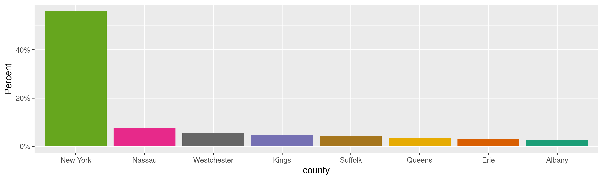
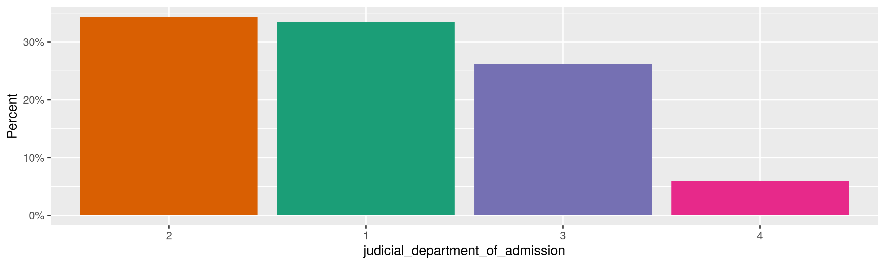
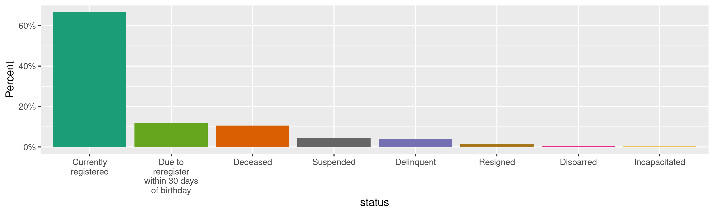
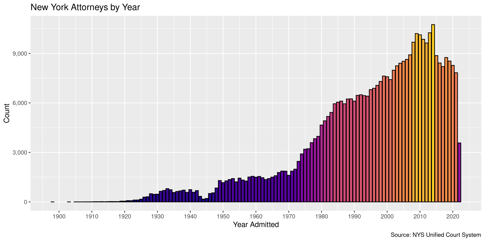
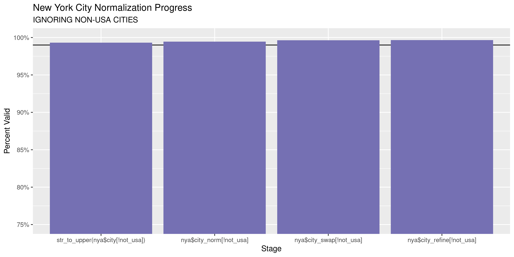
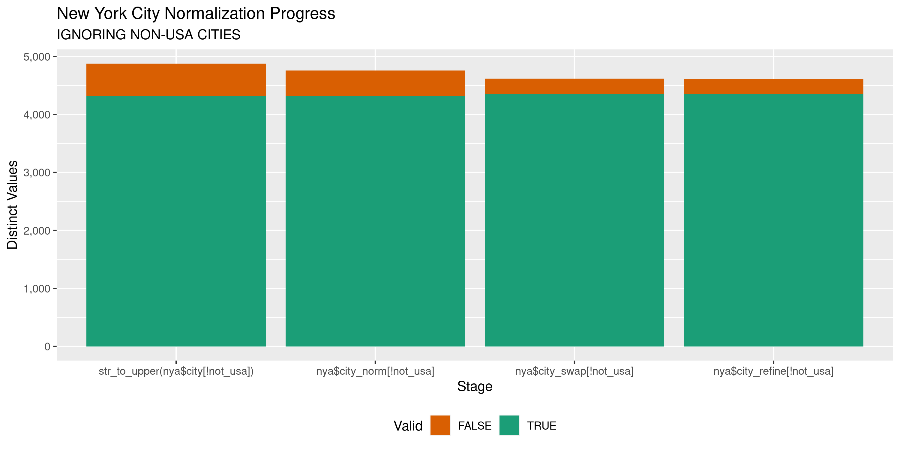

New York Attorneys
================
Kiernan Nicholls
Tue May 24 11:32:44 2022

-   <a href="#project" id="toc-project">Project</a>
-   <a href="#objectives" id="toc-objectives">Objectives</a>
-   <a href="#packages" id="toc-packages">Packages</a>
-   <a href="#source" id="toc-source">Source</a>
-   <a href="#download" id="toc-download">Download</a>
-   <a href="#read" id="toc-read">Read</a>
-   <a href="#explore" id="toc-explore">Explore</a>
    -   <a href="#missing" id="toc-missing">Missing</a>
    -   <a href="#duplicates" id="toc-duplicates">Duplicates</a>
    -   <a href="#categorical" id="toc-categorical">Categorical</a>
    -   <a href="#dates" id="toc-dates">Dates</a>
-   <a href="#wrangle" id="toc-wrangle">Wrangle</a>
    -   <a href="#address" id="toc-address">Address</a>
    -   <a href="#zip" id="toc-zip">ZIP</a>
    -   <a href="#state" id="toc-state">State</a>
    -   <a href="#city" id="toc-city">City</a>
-   <a href="#conclude" id="toc-conclude">Conclude</a>
-   <a href="#export" id="toc-export">Export</a>
-   <a href="#upload" id="toc-upload">Upload</a>

<!-- Place comments regarding knitting here -->

## Project

The Accountability Project is an effort to cut across data silos and
give journalists, policy professionals, activists, and the public at
large a simple way to search across huge volumes of public data about
people and organizations.

Our goal is to standardize public data on a few key fields by thinking
of each dataset row as a transaction. For each transaction there should
be (at least) 3 variables:

1.  All **parties** to a transaction.
2.  The **date** of the transaction.
3.  The **amount** of money involved.

## Objectives

This document describes the process used to complete the following
objectives:

1.  How many records are in the database?
2.  Check for entirely duplicated records.
3.  Check ranges of continuous variables.
4.  Is there anything blank or missing?
5.  Check for consistency issues.
6.  Create a five-digit ZIP Code called `zip`.
7.  Create a `year` field from the transaction date.
8.  Make sure there is data on both parties to a transaction.

## Packages

The following packages are needed to collect, manipulate, visualize,
analyze, and communicate these results. The `pacman` package will
facilitate their installation and attachment.

``` r
if (!require("pacman")) {
  install.packages("pacman")
}
pacman::p_load(
  tidyverse, # data manipulation
  lubridate, # datetime strings
  gluedown, # printing markdown
  jsonlite, # read json files
  janitor, # clean data frames
  campfin, # custom irw tools
  aws.s3, # aws cloud storage
  refinr, # cluster & merge
  scales, # format strings
  knitr, # knit documents
  vroom, # fast reading
  rvest, # scrape html
  glue, # code strings
  here, # project paths
  httr, # http requests
  fs # local storage 
)
```

This diary was run using `campfin` version 1.0.8.9300.

``` r
packageVersion("campfin")
#> [1] '1.0.8.9300'
```

This document should be run as part of the `R_tap` project, which lives
as a sub-directory of the more general, language-agnostic
[`irworkshop/accountability_datacleaning`](https://github.com/irworkshop/accountability_datacleaning)
GitHub repository.

The `R_tap` project uses the [RStudio
projects](https://support.rstudio.com/hc/en-us/articles/200526207-Using-Projects)
feature and should be run as such. The project also uses the dynamic
`here::here()` tool for file paths relative to *your* machine.

``` r
# where does this document knit?
here::i_am("state/ny/attorneys/docs/ny_attorneys_diary.Rmd")
```

## Source

We can obtain the New York attorneys data from the [state open data
portal](https://data.ny.gov/Transparency/NYS-Attorney-Registrations/eqw2-r5nb),
which gets it’s data from the NYS Unified Court System and managed by
the NYS Office of Court Administration.

> The data included here is the information in the NYS Attorney
> Registration Database that is deemed public information pursuant to 22
> NYCRR 118.

> Data derived from most recent biennial registrations filed by NYS
> Attorneys

> All registered attorneys admitted in NYS, whether they are resident or
> non-resident, active or retired, or practicing law in NY or anywhere
> else.

The dataset was created on April 12, 2013 and is updated daily.

| position | name                             | fieldName                          | dataTypeName |
|---------:|:---------------------------------|:-----------------------------------|:-------------|
|        1 | Registration Number              | `registration_number`              | number       |
|        2 | First Name                       | `first_name`                       | text         |
|        3 | Middle Name                      | `middle_name`                      | text         |
|        4 | Last Name                        | `last_name`                        | text         |
|        5 | Suffix                           | `suffix`                           | text         |
|        6 | Company Name                     | `company_name`                     | text         |
|        7 | Street 1                         | `street_1`                         | text         |
|        8 | Street 2                         | `street_2`                         | text         |
|        9 | City                             | `city`                             | text         |
|       10 | State                            | `state`                            | text         |
|       11 | Zip                              | `zip`                              | text         |
|       12 | Zip Plus Four                    | `zip_plus_four`                    | text         |
|       13 | Country                          | `country`                          | text         |
|       14 | County                           | `county`                           | text         |
|       15 | Phone Number                     | `phone_number`                     | text         |
|       16 | Year Admitted                    | `year_admitted`                    | number       |
|       17 | Judicial Department of Admission | `judicial_department_of_admission` | number       |
|       18 | Law School                       | `law_school`                       | text         |
|       19 | Status                           | `status`                           | text         |
|       20 | Next Registration                | `next_registration`                | text         |

## Download

``` r
raw_url <- "https://data.ny.gov/api/views/eqw2-r5nb/rows.tsv"
raw_dir <- dir_create(here("state", "ny", "licenses", "data", "raw"))
raw_csv <- path(raw_dir, basename(raw_url))
```

``` r
if (!file_exists(raw_csv)) {
  GET(
    url = raw_url,
    body = list(accessType = "DOWNLOAD"),
    write_disk(raw_csv),
    progress("down")
  )
}
```

## Read

``` r
nya <- read_delim(
  file = raw_csv,
  delim = "\t",
  skip = 1, # use fieldName header
  escape_backslash = FALSE,
  escape_double = FALSE,
  col_names = about$columns$fieldName,
  col_types = cols(
    .default = col_character(),
    year_admitted = col_integer(),
    next_registration = col_date("%b %Y")
  )
)
```

## Explore

There are 395,845 rows of 20 columns. Each record represents a single
attorney registered in the state of New York.

``` r
glimpse(nya)
#> Rows: 395,845
#> Columns: 20
#> $ registration_number              <chr> "1000074", "1000231", "1000223", "1000272", "1000306", "1000322", "1000371", …
#> $ first_name                       <chr> "KATHRYN", "ANNE", "JAMES", "MARTIN", "JAMES", "RONALD", "MARY", "ROBERT", "R…
#> $ middle_name                      <chr> "NOLAN", NA, "GORDON", "HOWD", "HENRY", "GABRIEL", "ELLEN", "HAROLD", "THOMPS…
#> $ last_name                        <chr> "FANTAUZZI", "PETRALITO", "CUSHMAN", "TILLAPAUGH", "SICKELCO", "RUSSO", "CRON…
#> $ suffix                           <chr> NA, NA, NA, NA, NA, NA, NA, NA, NA, NA, "III", NA, NA, NA, NA, NA, "III", NA,…
#> $ company_name                     <chr> "KATHRYN FANTAUZZI", "CREDIT SUISSE", "JAMES G. CUSHMAN", "MARTIN H. TILLAPAU…
#> $ street_1                         <chr> "1397 ROWE RD", "11 MADISON AVE", "15 EATON AVE", "30 PIONEER ST STE 1/2", "1…
#> $ street_2                         <chr> NA, NA, NA, NA, NA, NA, NA, NA, NA, NA, NA, NA, NA, NA, NA, NA, NA, NA, NA, N…
#> $ city                             <chr> "SCHENECTADY", "NEW YORK", "NORWICH", "COOPERSTOWN", "SPENCERPORT", "NEW YORK…
#> $ state                            <chr> "NY", "NY", "NY", "NY", "NY", "NY", "NY", "NY", "NY", "NY", "NY", "AZ", "NY",…
#> $ zip                              <chr> "12309", "10010", "13815", "13326", "14559", "10004", "10023", "11753", "1002…
#> $ zip_plus_four                    <chr> "2431", "3643", "1768", "1049", "1429", "1703", "5736", "2347", "6777", "4356…
#> $ country                          <chr> "United States of America", "United States of America", "United States of Ame…
#> $ county                           <chr> "Schenectady", "New York", "Chenango", "Otsego", "Monroe", "New York", "New Y…
#> $ phone_number                     <chr> "(516) 372-7643", "(212) 538-0407", "(607) 334-2562", "(607) 547-7004", "(585…
#> $ year_admitted                    <int> 1977, 1978, 1975, 1977, 1979, 1974, 1979, 1974, 1971, 1979, 1973, 1978, 1975,…
#> $ judicial_department_of_admission <chr> "3", "2", "4", "3", "4", "2", "1", "2", "1", "2", "3", "2", "2", "4", "1", "4…
#> $ law_school                       <chr> "ALBANY", "ST JOHNS", "OHIO NORTHERN UNIVERSITY", "DICKINSON", "WESTERN NEW E…
#> $ status                           <chr> "Due to reregister within 30 days of birthday", "Currently registered", "Curr…
#> $ next_registration                <date> 2022-07-01, 2022-09-01, 2024-03-01, 2022-11-01, 2022-08-01, 2024-03-01, 2024…
tail(nya)
#> # A tibble: 6 × 20
#>   registration_number first_name middle_name last_name suffix company_name street_1 street_2 city  state zip  
#>   <chr>               <chr>      <chr>       <chr>     <chr>  <chr>        <chr>    <chr>    <chr> <chr> <chr>
#> 1 1962752             JOHN       ALLEN       CRABLE    <NA>   <NA>         <NA>     <NA>     <NA>  <NA>  <NA> 
#> 2 1241520             GENNARO    GEORGE      COLUMBUS  <NA>   <NA>         <NA>     <NA>     <NA>  <NA>  <NA> 
#> 3 1509991             MICHAEL    G.          GARTLAND  <NA>   <NA>         <NA>     <NA>     <NA>  <NA>  <NA> 
#> 4 1465616             WILLIAM    FREDERICK   LAURO     <NA>   <NA>         <NA>     <NA>     <NA>  <NA>  <NA> 
#> 5 1164938             JOHN       FRANCIS     LYDON     <NA>   <NA>         <NA>     <NA>     <NA>  <NA>  <NA> 
#> 6 1530302             JEFFREY    MICHAEL     LEBEN     <NA>   <NA>         <NA>     <NA>     <NA>  <NA>  <NA> 
#> # … with 9 more variables: zip_plus_four <chr>, country <chr>, county <chr>, phone_number <chr>, year_admitted <int>,
#> #   judicial_department_of_admission <chr>, law_school <chr>, status <chr>, next_registration <date>
```

### Missing

Columns vary in their degree of missing values.

``` r
col_stats(nya, count_na)
#> # A tibble: 20 × 4
#>    col                              class       n         p
#>    <chr>                            <chr>   <int>     <dbl>
#>  1 registration_number              <chr>       0 0        
#>  2 first_name                       <chr>      18 0.0000455
#>  3 middle_name                      <chr>   77985 0.197    
#>  4 last_name                        <chr>      12 0.0000303
#>  5 suffix                           <chr>  388386 0.981    
#>  6 company_name                     <chr>  145222 0.367    
#>  7 street_1                         <chr>  123472 0.312    
#>  8 street_2                         <chr>  373678 0.944    
#>  9 city                             <chr>  123502 0.312    
#> 10 state                            <chr>  149698 0.378    
#> 11 zip                              <chr>  149697 0.378    
#> 12 zip_plus_four                    <chr>  168927 0.427    
#> 13 country                          <chr>  123457 0.312    
#> 14 county                           <chr>  240081 0.607    
#> 15 phone_number                     <chr>  128948 0.326    
#> 16 year_admitted                    <int>       0 0        
#> 17 judicial_department_of_admission <chr>       0 0        
#> 18 law_school                       <chr>   12539 0.0317   
#> 19 status                           <chr>       0 0        
#> 20 next_registration                <date>  51392 0.130
```

We can flag any record missing a key variable needed to identify a
transaction.

``` r
key_vars <- c("year_admitted", "last_name", "judicial_department_of_admission")
nya <- flag_na(nya, all_of(key_vars))
sum(nya$na_flag)
#> [1] 12
```

``` r
nya %>% 
  filter(na_flag) %>% 
  select(year_admitted, ends_with("name"))
#> # A tibble: 12 × 5
#>    year_admitted first_name  middle_name last_name company_name                                     
#>            <int> <chr>       <chr>       <chr>     <chr>                                            
#>  1          2001 SEON        JOO         <NA>      Torrey Partners Inc                              
#>  2          2004 SALLY       CHRISTIE    <NA>      Inova Health System                              
#>  3          2005 HONG        YEOL        <NA>      CITIGROUP GLOBAL MARKETS KOREA SECURITIES LIMITED
#>  4          2006 KYUNG-SOO   <NA>        <NA>      Dunsan Law Firm                                  
#>  5          2012 JAEJOON     JUSTIN      <NA>      KPMG LLP                                         
#>  6          2013 CHRISTOPHER SCOTT       <NA>      Philips International                            
#>  7          2017 SOOJIN      <NA>        <NA>      KANGHO Attorneys at Law                          
#>  8          2009 UNJOO       <NA>        <NA>      <NA>                                             
#>  9          2009 NARI        HAE-SEUNG   <NA>      APOLLO MANAGEMENT HOLDINGS, L.P.                 
#> 10          2006 YOUNGSOOG   <NA>        <NA>      LEE & KO                                         
#> 11          2007 KYUNG-SUN   <NA>        <NA>      <NA>                                             
#> 12          2015 HEE SEOK    <NA>        <NA>      <NA>
```

### Duplicates

We can also flag any record completely duplicated across every column.

``` r
nya <- flag_dupes(nya, -registration_number)
sum(nya$dupe_flag)
#> [1] 0
```

There are no duplicates in the data, even when ignoring
`registration_number`.

### Categorical

``` r
col_stats(nya, n_distinct)
#> # A tibble: 21 × 4
#>    col                              class       n          p
#>    <chr>                            <chr>   <int>      <dbl>
#>  1 registration_number              <chr>  395845 1         
#>  2 first_name                       <chr>   33613 0.0849    
#>  3 middle_name                      <chr>   36236 0.0915    
#>  4 last_name                        <chr>  114509 0.289     
#>  5 suffix                           <chr>      16 0.0000404 
#>  6 company_name                     <chr>  141669 0.358     
#>  7 street_1                         <chr>  148056 0.374     
#>  8 street_2                         <chr>   15668 0.0396    
#>  9 city                             <chr>   18785 0.0475    
#> 10 state                            <chr>      62 0.000157  
#> 11 zip                              <chr>    9318 0.0235    
#> 12 zip_plus_four                    <chr>    9307 0.0235    
#> 13 country                          <chr>     307 0.000776  
#> 14 county                           <chr>      63 0.000159  
#> 15 phone_number                     <chr>  227020 0.574     
#> 16 year_admitted                    <int>     120 0.000303  
#> 17 judicial_department_of_admission <chr>       4 0.0000101 
#> 18 law_school                       <chr>   21033 0.0531    
#> 19 status                           <chr>       9 0.0000227 
#> 20 next_registration                <date>     68 0.000172  
#> 21 na_flag                          <lgl>       2 0.00000505
```

<!-- --><!-- --><!-- -->

### Dates

There is already a `year_admitted` value, but no date exists for when
they Attorney was admitted. There is a month of when they must next
register.

<!-- -->

## Wrangle

To improve the searchability of the database, we will perform some
consistent, confident string normalization. For geographic variables
like city names and ZIP codes, the corresponding `campfin::normal_*()`
functions are tailor made to facilitate this process.

It should be noted that a not insignificant number of Attorneys are not
from the United States.

``` r
nya$country <- str_to_upper(nya$country)
not_usa <- nya$country != "UNITED STATES OF AMERICA" & !is.na(nya$country)
mean(not_usa)
#> [1] 0.06623047
```

### Address

For the street `addresss` variable, the `campfin::normal_address()`
function will force consistence case, remove punctuation, and abbreviate
official USPS suffixes.

``` r
addr_norm <- nya %>% 
  distinct(street_1, street_2) %>% 
  mutate(
    street_norm_1 = normal_address(
      address = street_1,
      abbs = usps_street,
      na_rep = TRUE
    ),
    street_norm_2 = normal_address(
      address = street_2,
      abbs = usps_street,
      na_rep = TRUE,
      abb_end = FALSE
    )
  ) %>% 
  unite(
    col = street_norm,
    starts_with("street_norm"),
    sep = " ",
    remove = TRUE,
    na.rm = TRUE
  ) %>% 
  na_if("")
```

``` r
sample_n(addr_norm, 10)
#> # A tibble: 10 × 3
#>    street_1                       street_2                   street_norm                             
#>    <chr>                          <chr>                      <chr>                                   
#>  1 901 E ST NW                    <NA>                       901 E ST NW                             
#>  2 61 Broadway Ste 1200           <NA>                       61 BROADWAY STE 1200                    
#>  3 VIA SAN PAOLO 7                <NA>                       VIA SAN PAOLO 7                         
#>  4 40 N Pearl St FL 5             <NA>                       40 N PEARL ST FL 5                      
#>  5 10880 WILSHIRE BLVD. STE. 1150 <NA>                       10880 WILSHIRE BLVD STE 1150            
#>  6 49 Cedar Rd                    <NA>                       49 CEDAR RD                             
#>  7 12 CIRCLE WAY                  <NA>                       12 CIRCLE WAY                           
#>  8 41 S HIGH ST                   <NA>                       41 S HIGH ST                            
#>  9 1205A The Centrium             60 Wyndham Street, Central 1205A THE CENTRIUM 60 WYNDHAM ST CENTRAL
#> 10 555 Mission St Ste 1400        <NA>                       555 MISSION ST STE 1400
```

``` r
nya <- left_join(nya, addr_norm, by = c("street_1", "street_2"))
```

### ZIP

The `zip` column already contains the trimmed 5-digit ZIP code and an
additional but separate `zip_plus_four` column.

### State

The `state` column already contains only clean abbreviations.

``` r
head(na.omit(nya$zip))
#> [1] "12309" "10010" "13815" "13326" "14559" "10004"
```

### City

Cities are the most difficult geographic variable to normalize, simply
due to the wide variety of valid cities and formats.

``` r
prop_in(nya$state, valid_state)
#> [1] 1
```

#### Normal

The `campfin::normal_city()` function is a good start, again converting
case, removing punctuation, but *expanding* USPS abbreviations. We can
also remove `invalid_city` values.

``` r
norm_city <- nya %>% 
  distinct(city, state, zip) %>% 
  mutate(
    city_norm = normal_city(
      city = city, 
      abbs = usps_city,
      states = c("NY", "DC", "NEW YORK"),
      na = invalid_city,
      na_rep = TRUE
    )
  )
```

#### Swap

We can further improve normalization by comparing our normalized value
against the *expected* value for that record’s state abbreviation and
ZIP code. If the normalized value is either an abbreviation for or very
similar to the expected value, we can confidently swap those two.

``` r
norm_city <- norm_city %>% 
  rename(city_raw = city) %>% 
  left_join(
    y = zipcodes,
    by = c("state", "zip")
  ) %>% 
  rename(city_match = city) %>% 
  mutate(
    match_abb = is_abbrev(city_norm, city_match),
    match_dist = str_dist(city_norm, city_match),
    city_swap = if_else(
      condition = !is.na(match_dist) & (match_abb | match_dist == 1),
      true = city_match,
      false = city_norm
    )
  ) %>% 
  select(
    -city_match,
    -match_dist,
    -match_abb
  )
```

``` r
nya <- left_join(
  x = nya,
  y = norm_city,
  by = c(
    "city" = "city_raw", 
    "state", 
    "zip"
  )
)
```

#### Refine

The [OpenRefine](https://openrefine.org/) algorithms can be used to
group similar strings and replace the less common versions with their
most common counterpart. This can greatly reduce inconsistency, but with
low confidence; we will only keep any refined strings that have a valid
city/state/zip combination.

``` r
good_refine <- nya %>% 
  mutate(
    city_refine = city_swap %>% 
      key_collision_merge() %>% 
      n_gram_merge(numgram = 1)
  ) %>% 
  filter(city_refine != city_swap) %>% 
  inner_join(
    y = zipcodes,
    by = c(
      "city_refine" = "city",
      "state",
      "zip"
    )
  )
```

    #> # A tibble: 9 × 5
    #>   state zip   city_swap        city_refine           n
    #>   <chr> <chr> <chr>            <chr>             <int>
    #> 1 NY    11733 SETAUKET         EAST SETAUKET        47
    #> 2 DC    20374 WASHINGTON NA    WASHINGTON            3
    #> 3 CA    90272 PACIFIL PALISDES PACIFIC PALISADES     1
    #> 4 CA    90292 MARINA DALE REY  MARINA DEL REY        1
    #> 5 FL    33431 BACO RATON       BOCA RATON            1
    #> 6 PA    19103 PHILADELPHIA PA  PHILADELPHIA          1
    #> 7 SC    29406 NORTH CHARLESTON CHARLESTON            1
    #> 8 SC    29410 NORTH CHARLESTON CHARLESTON            1
    #> 9 SC    29415 NORTH CHARLESTON CHARLESTON            1

Then we can join the refined values back to the database.

``` r
nya <- nya %>% 
  left_join(good_refine) %>% 
  mutate(city_refine = coalesce(city_refine, city_swap))
```

#### Progress

``` r
many_city <- c(valid_city, extra_city)
```

Most of the remaining “invalid” cities are overseas.

``` r
out_city <- nya %>% 
  count(city_refine, country, sort = TRUE) %>% 
  filter(city_refine %out% many_city, !is.na(city_refine)) %>% 
  add_prop(sum = TRUE)
out_city
#> # A tibble: 5,568 × 4
#>    city_refine country                  n     p
#>    <chr>       <chr>                <int> <dbl>
#>  1 TOKYO       JAPAN                 2562 0.115
#>  2 SEOUL       KOREA                 1422 0.179
#>  3 BEIJING     CHINA                 1351 0.240
#>  4 SHANGHAI    CHINA                 1252 0.296
#>  5 HONG KONG   HONG KONG              984 0.340
#>  6 SINGAPORE   SINGAPORE              574 0.366
#>  7 TEL AVIV    ISRAEL                 230 0.376
#>  8 DUBAI       UNITED ARAB EMIRATES   215 0.386
#>  9 SYDNEY NSW  AUSTRALIA              206 0.395
#> 10 SEOUL       SOUTH KOREA            166 0.403
#> # … with 5,558 more rows
```

``` r
head(out_city$city_refine, 10)
#>  [1] "TOKYO"      "SEOUL"      "BEIJING"    "SHANGHAI"   "HONG KONG"  "SINGAPORE"  "TEL AVIV"   "DUBAI"     
#>  [9] "SYDNEY NSW" "SEOUL"
```

Our goal for normalization was to increase the proportion of city values
known to be valid and reduce the total distinct values by correcting
misspellings.

| stage                              | prop_in | n_distinct | prop_na | n_out | n_diff |
|:-----------------------------------|--------:|-----------:|--------:|------:|-------:|
| `str_to_upper(nya$city[!not_usa])` |   0.993 |       4879 |   0.334 |  1700 |    567 |
| `nya$city_norm[!not_usa]`          |   0.995 |       4759 |   0.334 |  1322 |    434 |
| `nya$city_swap[!not_usa]`          |   0.996 |       4618 |   0.334 |   871 |    271 |
| `nya$city_refine[!not_usa]`        |   0.997 |       4612 |   0.334 |   817 |    265 |

You can see how the percentage of valid values increased with each
stage.

<!-- -->

More importantly, the number of distinct values decreased each stage. We
were able to confidently change many distinct invalid values to their
valid equivalent.

<!-- -->

Before exporting, we can remove the intermediary normalization columns
and rename all added variables with the `_clean` suffix.

``` r
nya <- nya %>% 
  select(
    -city_norm,
    -city_swap,
    city_clean = city_refine
  ) %>% 
  rename_all(~str_replace(., "_norm", "_clean")) %>% 
  rename_all(~str_remove(., "_raw")) 
```

## Conclude

``` r
glimpse(sample_n(nya, 1000))
#> Rows: 1,000
#> Columns: 23
#> $ registration_number              <chr> "2708337", "1083336", "1902287", "5571104", "4976379", "1380096", "1191725", …
#> $ first_name                       <chr> "REMUS", "NEIL", "STANLEY", "ESTHER", "DENISE", "ROBERT", "ROBERT", "ROSALIND…
#> $ middle_name                      <chr> "C.", "ALLEN", "JOSEPH", "DANIELLE", "MARIE", "FREDERICK", "JAMES", "ANTOINET…
#> $ last_name                        <chr> "PREDA", "FREDMAN", "SZARO", "CLOVIS", "ANDERSON", "MULLEN", "CALLAHAN", "LAZ…
#> $ suffix                           <chr> NA, NA, NA, NA, NA, NA, NA, NA, NA, NA, NA, NA, NA, NA, NA, NA, NA, NA, NA, N…
#> $ company_name                     <chr> "People's United Bank", "FREDMAN BAKEN & Novenstern LLP", NA, "U.S. COURT OF …
#> $ street_1                         <chr> "401 Main St", "333 WESTCHESTER AVE STE S302", NA, "601 MARKET ST", "85 N Mai…
#> $ street_2                         <chr> NA, NA, NA, NA, NA, NA, NA, "#08-01 CAPITAL SQUARE", NA, NA, NA, NA, NA, NA, …
#> $ city                             <chr> "Bennington", "WHITE PLAINS", NA, "PHILADELPHIA", "White River Junction", NA,…
#> $ state                            <chr> "VT", "NY", NA, "PA", "VT", NA, "NY", NA, "NY", "NY", NA, NA, NA, "NY", "NY",…
#> $ zip                              <chr> "05201", "10604", NA, "19106", "05001", NA, "12237", NA, "10451", "10004", NA…
#> $ zip_plus_four                    <chr> "2141", "2910", NA, "1729", "7174", NA, "0016", NA, "4142", NA, NA, NA, NA, "…
#> $ country                          <chr> "UNITED STATES OF AMERICA", "UNITED STATES OF AMERICA", NA, "UNITED STATES OF…
#> $ county                           <chr> NA, "Westchester", NA, NA, NA, NA, "Albany", NA, "Bronx", "New York", NA, NA,…
#> $ phone_number                     <chr> "(802) 442-7610", "(914) 997-9070", NA, NA, "(802) 698-0420", NA, "(518) 474-…
#> $ year_admitted                    <int> 1995, 1978, 1984, 2018, 2011, 1968, 1978, 2004, 2017, 2021, 1980, 1975, 2021,…
#> $ judicial_department_of_admission <chr> "3", "2", "1", "3", "1", "1", "4", "3", "2", "1", "1", "2", "2", "2", "2", "4…
#> $ law_school                       <chr> "NEW ENGLAND", "FORDHAM", "NEW YORK LAW SCHOOL", "University of Pennsylvania …
#> $ status                           <chr> "Currently registered", "Currently registered", "Disbarred", "Due to reregist…
#> $ next_registration                <date> 2023-07-01, 2022-08-01, NA, 2022-07-01, 2023-07-01, NA, 2022-09-01, 2024-06-…
#> $ na_flag                          <lgl> FALSE, FALSE, FALSE, FALSE, FALSE, FALSE, FALSE, FALSE, FALSE, FALSE, FALSE, …
#> $ street_clean                     <chr> "401 MAIN ST", "333 WESTCHESTER AVE STE S302", NA, "601 MARKET ST", "85 N MAI…
#> $ city_clean                       <chr> "BENNINGTON", "WHITE PLAINS", NA, "PHILADELPHIA", "WHITE RIVER JUNCTION", NA,…
```

1.  There are 395,845 records in the database.
2.  There are 0 duplicate records in the database.
3.  The range and distribution of `amount` and `date` seem reasonable.
4.  There are 12 records missing key variables.
5.  Consistency in geographic data has been improved with
    `campfin::normal_*()`.
6.  The 4-digit `year` variable has been created with
    `lubridate::year()`.

## Export

Now the file can be saved on disk for upload to the Accountability
server. We will name the object using a date range of the records
included.

``` r
clean_dir <- dir_create(here("state", "ny", "attorneys", "data", "clean"))
clean_csv <- path(clean_dir, glue("ny_attorneys_20220524.csv"))
clean_rds <- path_ext_set(clean_csv, "rds")
basename(clean_csv)
#> [1] "ny_attorneys_20220524.csv"
```

``` r
write_csv(nya, clean_csv, na = "")
write_rds(nya, clean_rds, compress = "xz")
(clean_size <- file_size(clean_csv))
#> 74.6M
```

## Upload

We can use the `aws.s3::put_object()` to upload the text file to the IRW
server.

``` r
aws_key <- path("csv", basename(clean_csv))
if (!object_exists(aws_key, "publicaccountability")) {
  put_object(
    file = clean_csv,
    object = aws_key, 
    bucket = "publicaccountability",
    acl = "public-read",
    show_progress = TRUE,
    multipart = TRUE
  )
}
aws_head <- head_object(aws_key, "publicaccountability")
(aws_size <- as_fs_bytes(attr(aws_head, "content-length")))
unname(aws_size == clean_size)
```
