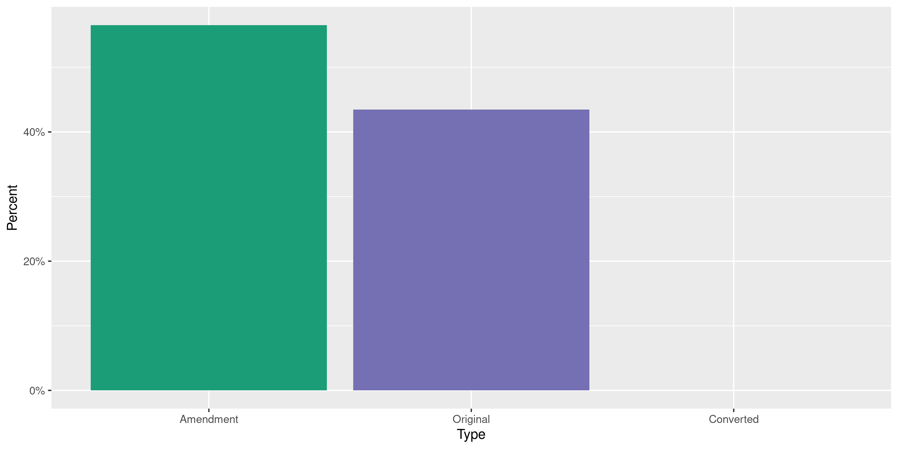
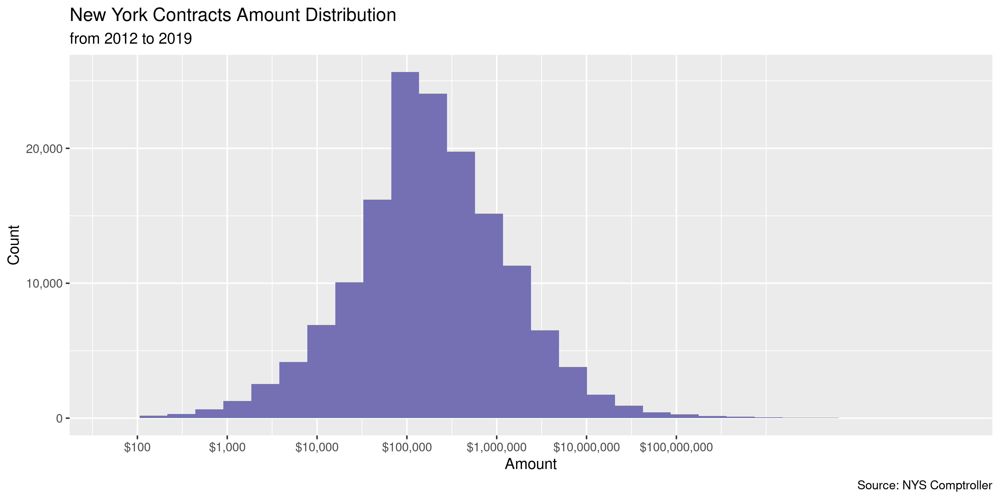
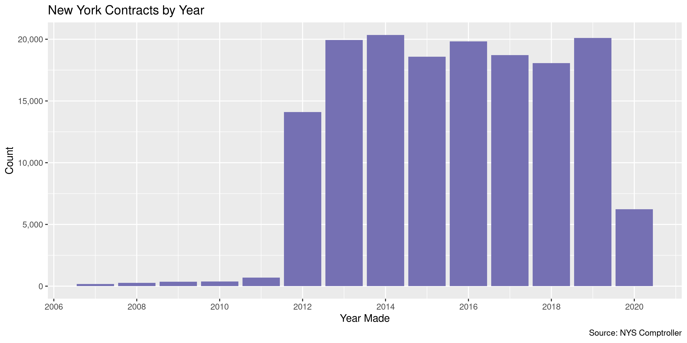

New York Contracts
================
Kiernan Nicholls
2020-05-28 13:27:56

  - [Project](#project)
  - [Objectives](#objectives)
  - [Software](#software)
  - [Data](#data)
  - [Import](#import)
  - [Explore](#explore)
  - [Wrangle](#wrangle)
  - [Export](#export)
  - [Upload](#upload)

<!-- Place comments regarding knitting here -->

## Project

The Accountability Project is an effort to cut across data silos and
give journalists, policy professionals, activists, and the public at
large a simple way to search across huge volumes of public data about
people and organizations.

Our goal is to standardizing public data on a few key fields by thinking
of each dataset row as a transaction. For each transaction there should
be (at least) 3 variables:

1.  All **parties** to a transaction.
2.  The **date** of the transaction.
3.  The **amount** of money involved.

## Objectives

This document describes the process used to complete the following
objectives:

1.  How many records are in the database?
2.  Check for entirely duplicated records.
3.  Check ranges of continuous variables.
4.  Is there anything blank or missing?
5.  Check for consistency issues.
6.  Create a five-digit ZIP Code called `zip`.
7.  Create a `year` field from the transaction date.
8.  Make sure there is data on both parties to a transaction.

## Software

This data is processed using the free, open-source statistical computing
language R, which can be [installed from
CRAN](https://cran.r-project.org/) for various opperating systems. For
example, R can be installed from the apt package repository on Ubuntu.

``` bash
sudo apt update
sudo apt -y upgrade
sudo apt -y install r-base
```

The following additional R packages are needed to collect, manipulate,
visualize, analyze, and communicate these results. The `pacman` package
will facilitate their installation and attachment.

The IRW’s `campfin` package will also have to be installed from GitHub.
This package contains functions custom made to help facilitate the
processing of campaign finance data.

``` r
if (!require("pacman")) install.packages("pacman")
pacman::p_load_gh("irworkshop/campfin")
pacman::p_load(
  tidyverse, # data manipulation
  lubridate, # datetime strings
  magrittr, # pipe operators
  gluedown, # print markdown
  janitor, # dataframe clean
  refinr, # cluster and merge
  scales, # format strings
  readxl, # read excel
  knitr, # knit documents
  vroom, # read files fast
  furrr, # parallel map
  glue, # combine strings
  here, # relative storage
  httr, # http requests
  pryr, # memory usage
  fs # search storage 
)
```

This document should be run as part of the `us_spending` project, which
lives as a sub-directory of the more general, language-agnostic
[`irworkshop/tap`](https://github.com/irworkshop/accountability_datacleaning)
GitHub repository.

The `us_spending` project uses the [RStudio
projects](https://support.rstudio.com/hc/en-us/articles/200526207-Using-Projects)
feature and should be run as such. The project also uses the dynamic
`here::here()` tool for file paths relative to *your* machine.

``` r
# where does this document knit?
here::here()
#> [1] "/home/kiernan/Code/accountability_datacleaning/R_campfin"
```

## Data

Contracts data is obtained from the New York Office of the State
Comptroller via their Open Book portal, which includes:

> All State agency contracts, in effect 4/1/12 or later, which includes
> contracts approved by the Office of the State Comptroller (OSC) and
> those that don’t require OSC approval.

> State authority contracts historically subject to approval by OSC
> (primarily for the Thruway Authority and the Long Island Power
> Authority only).

## Import

We can import the file by first downloading with a `httr::GET()` request
and then reading into memory with `vroom::vroom()`.

``` r
url <- "https://wwe2.osc.state.ny.us/transparency/contracts/contractresults.cfm"
raw_dir <- dir_create(here("ny", "contracts", "data", "raw"))
raw_path <- path(raw_dir, "contracts-and-amendments.csv")
```

``` r
if (!file_exists(raw_path)) {
  GET(
    url = url,
    write_disk(raw_path, overwrite = TRUE),
    query = list(
      DocType = "csv",
      ac = "",
      v = "",
      vo = "B",
      cn = "",
      selOrigDateChoiceOperator = "Before",
      txtOrigFromDate = format(Sys.Date(), "%m/%d/%Y"),
      txtOrigToDate = "",
      selCTDateChoice = "0",
      selCTDateChoiceOperator = "0",
      txtCTFromDate = "",
      txtCTToDate = "",
      selContractAmountChoice = "0",
      txtContractAmount1 = "",
      txtContractAmount2 = "",
      b = "Search",
      order = "VENDOR_NAME",
      sort = "ASC"
    )
  )
}
```

``` r
nyc <- vroom(
  file = raw_path,
  delim = ",",
  skip = 1,
  .name_repair = make_clean_names,
  escape_double = FALSE,
  escape_backslash = FALSE,
  col_types = cols(
    .default = col_character(),
    `TRANSACTION AMOUNT` = col_double(),
    `START DATE` = col_date_usa(),
    `END DATE` = col_date_usa(),
    `TRANSACTION APPROVED/FILED DATE` = col_date_usa()
  )
)
```

``` r
nyc <- nyc %>% 
  rename_all(str_remove, "transaction_") %>% 
  rename_all(str_remove, "_\\w+") %>% 
  mutate_at(vars(type), str_remove, "\\sContract$")
```

## Explore

``` r
head(nyc)
#> # A tibble: 6 x 9
#>   type  vendor department contract amount start      end        description
#>   <chr> <chr>  <chr>      <chr>     <dbl> <date>     <date>     <chr>      
#> 1 Orig… 1 A L… Division … C002132  1.01e7 2013-10-04 2016-10-03 IGNITION I…
#> 2 Amen… 1 A L… Division … C002132  0.     NA         2016-08-14 Contract t…
#> 3 Amen… 1 A L… Division … C002132  0.     NA         2016-07-22 early expi…
#> 4 Orig… 1 A L… Division … C002136  8.16e5 2010-12-21 2013-10-14 IGNITION I…
#> 5 Orig… 1 PER… Office of… L01038B  1.40e6 2014-03-24 2018-03-31 ASSIGNMENT…
#> 6 Amen… 1 PER… Office of… L01038B  4.13e5 NA         2019-03-31 Holdover 1…
#> # … with 1 more variable: approved <date>
tail(nyc)
#> # A tibble: 6 x 9
#>   type  vendor department contract amount start      end        description
#>   <chr> <chr>  <chr>      <chr>     <dbl> <date>     <date>     <chr>      
#> 1 Orig… ZUECH… Western N… C230422  7.34e4 2012-12-01 2017-11-30 CLEANING A…
#> 2 Orig… ZUGAI… Hutchings… C000228  2.03e5 2015-06-01 2020-05-31 Transporta…
#> 3 Orig… ZYDUS… Departmen… X009682  0.     2005-10-01 2025-09-30 ELDERLY PH…
#> 4 Orig… ZYDUS… Departmen… X025187  0.     2009-07-01 2029-06-30 NEW YORK P…
#> 5 Orig… ZYDUS… Departmen… X027122  0.     2011-08-23 2031-08-22 EPIC/ELDER…
#> 6 Orig… ZYDUS… Departmen… X035251  0.     2019-07-24 2039-07-23 ELDERLY PH…
#> # … with 1 more variable: approved <date>
glimpse(sample_n(nyc, 20))
#> Rows: 20
#> Columns: 9
#> $ type        <chr> "Amendment", "Original", "Original", "Amendment", "Origin…
#> $ vendor      <chr> "PHILIPS NORTH AMERICA LLC", "BUFFALO CITY OF", "FUND FOR…
#> $ department  <chr> "Office of General Services - Purchasing (P) Contracts", …
#> $ contract    <chr> "PC64282", "D033949", "C490041", "C009056", "CM100205AB",…
#> $ amount      <dbl> 0.00, 44000.00, 200000.00, 0.00, 2845266.67, 300000.00, 0…
#> $ start       <date> NA, 2012-12-11, 2012-07-01, NA, 2018-02-01, 2014-03-25, …
#> $ end         <date> 2013-11-30, 2013-12-31, 2013-06-30, 2014-11-21, 2023-09-…
#> $ description <chr> "Renewal", "City of Buffalo Bridge Bearing Replacement an…
#> $ approved    <date> 2012-10-24, 2013-02-06, 2013-01-04, 2014-07-08, 2018-03-…
```

The only variables missing from any records are the `start` and `end`
dates.

``` r
col_stats(nyc, count_na)
#> # A tibble: 9 x 4
#>   col         class      n     p
#>   <chr>       <chr>  <int> <dbl>
#> 1 type        <chr>      0 0    
#> 2 vendor      <chr>      0 0    
#> 3 department  <chr>      0 0    
#> 4 contract    <chr>      0 0    
#> 5 amount      <dbl>      0 0    
#> 6 start       <date> 89725 0.565
#> 7 end         <date> 25946 0.164
#> 8 description <chr>      0 0    
#> 9 approved    <date>     0 0
```

There are also a handful of duplicate records, which we can flag.

``` r
nyc <- flag_dupes(nyc, everything(), .check = TRUE)
sum(nyc$dupe_flag)
#> [1] 12
```

``` r
nyc %>% 
  filter(dupe_flag) %>% 
  select(start, department, amount, vendor)
#> # A tibble: 12 x 4
#>    start      department                         amount vendor                  
#>    <date>     <chr>                               <dbl> <chr>                   
#>  1 2019-05-03 Department of Agriculture & Marke…   4975 AMERICAN CANCER SOCIETY…
#>  2 2019-05-03 Department of Agriculture & Marke…   4975 AMERICAN CANCER SOCIETY…
#>  3 NA         New York City Transit Authority         0 BOMBARDIER TRANSIT CORP…
#>  4 NA         New York City Transit Authority         0 BOMBARDIER TRANSIT CORP…
#>  5 NA         Clinton Correctional Facility       10000 DONALDSON PRODUCE       
#>  6 NA         Clinton Correctional Facility       10000 DONALDSON PRODUCE       
#>  7 NA         Department of Health                56507 HUDSON VALLEY COMMUNITY…
#>  8 NA         Department of Health                56507 HUDSON VALLEY COMMUNITY…
#>  9 2018-07-20 Department of Agriculture & Marke…   2480 THOMAS CENTORE DBA TOMM…
#> 10 2018-07-20 Department of Agriculture & Marke…   2480 THOMAS CENTORE DBA TOMM…
#> 11 NA         State Education Department              0 TIMS TRIM INC           
#> 12 NA         State Education Department              0 TIMS TRIM INC
```

Most columns are unique strings, but the `type` is pretty evenly split
between original data and amendments. We will include all types.

``` r
col_stats(nyc, n_distinct)
#> # A tibble: 10 x 4
#>    col         class      n         p
#>    <chr>       <chr>  <int>     <dbl>
#>  1 type        <chr>      3 0.0000189
#>  2 vendor      <chr>  19877 0.125    
#>  3 department  <chr>    298 0.00188  
#>  4 contract    <chr>  73274 0.462    
#>  5 amount      <dbl>  82511 0.520    
#>  6 start       <date>  3938 0.0248   
#>  7 end         <date>  5614 0.0354   
#>  8 description <chr>  81453 0.513    
#>  9 approved    <date>  3425 0.0216   
#> 10 dupe_flag   <lgl>      2 0.0000126
```

``` r
explore_plot(nyc, type)
```

<!-- -->

### Amounts

``` r
enframe(map_chr(summary(nyc$amount), dollar))
#> # A tibble: 6 x 2
#>   name    value          
#>   <chr>   <chr>          
#> 1 Min.    -$3,275,535,265
#> 2 1st Qu. $287.10        
#> 3 Median  $81,461.61     
#> 4 Mean    $4,019,577     
#> 5 3rd Qu. $350,000       
#> 6 Max.    $24,448,378,431
mean(nyc$amount <= 0)
#> [1] 0.2453301
median(nyc$amount)
#> [1] 81461.61
```

Here is the largest contract.

``` r
glimpse(nyc[which.min(nyc$amount), ])
#> Rows: 1
#> Columns: 10
#> $ type        <chr> "Amendment"
#> $ vendor      <chr> "NYS CATHOLIC HEALTH PLAN INC"
#> $ department  <chr> "Department of Health"
#> $ contract    <chr> "c029339"
#> $ amount      <dbl> -3275535265
#> $ start       <date> NA
#> $ end         <date> 2018-06-30
#> $ description <chr> "Assignment to Centene Acquisition Corporation (New York …
#> $ approved    <date> 2018-05-30
#> $ dupe_flag   <lgl> FALSE
```

<!-- -->

### Dates

We can add a 4 digit `year` variable taken from the approval date.

``` r
nyc <- mutate(nyc, year = year(approved))
```

There are a handful of dates before 2012, which is where the majority of
the records begin.

``` r
min(nyc$approved)
#> [1] "1986-05-10"
mean(nyc$year < 2012)
#> [1] 0.01764602
max(nyc$approved)
#> [1] "2020-05-26"
sum(nyc$approved > today())
#> [1] 0
```

<!-- -->

## Wrangle

There are no geographic variables, but we can add a 2-digit state
abbreviation for the spending agency.

``` r
nyc <- mutate(nyc, state = "NY", .after = department)
```

## Export

``` r
glimpse(sample_n(nyc, 20))
#> Rows: 20
#> Columns: 12
#> $ type        <chr> "Amendment", "Amendment", "Original", "Original", "Amendm…
#> $ vendor      <chr> "H&L CONTRACTING LLC", "THOMAS NOVELLI CONTRACTING CORP",…
#> $ department  <chr> "Department of Transportation", "Office of Parks Recreati…
#> $ state       <chr> "NY", "NY", "NY", "NY", "NY", "NY", "NY", "NY", "NY", "NY…
#> $ contract    <chr> "D263752", "D005228", "C40603GG", "D027456", "D034650", "…
#> $ amount      <dbl> 16485.66, 99400.00, 300500.00, 100000.00, -2.72, 300000.0…
#> $ start       <date> NA, NA, 2014-12-16, 2006-06-01, NA, 2016-04-01, 2008-05-…
#> $ end         <date> NA, NA, 2019-12-15, 2011-12-31, 2016-11-15, 2018-03-31, …
#> $ description <chr> "CO#4 Cut and Weld Existing Cover Plates", "CO#1 Sanitary…
#> $ approved    <date> 2019-06-10, 2018-03-16, 2015-06-12, 2013-07-18, 2016-11-…
#> $ dupe_flag   <lgl> FALSE, FALSE, FALSE, FALSE, FALSE, FALSE, FALSE, FALSE, F…
#> $ year        <dbl> 2019, 2018, 2015, 2013, 2016, 2016, 2012, 2013, 2014, 201…
```

1.  There are 158,676 records in the database.
2.  There are 12 duplicate records in the database.
3.  The range and distribution of `amount` and `date` seem mostly
    reasonable.
4.  The 4-digit `year` variable has been created with
    `lubridate::year()`.

<!-- end list -->

``` r
clean_dir <- dir_create(here("ny", "contracts", "data", "clean"))
clean_path <- path(clean_dir, "ny_contracts_clean.csv")
write_csv(nyc, clean_path, na = "")
file_size(clean_path)
#> 25.6M
mutate(file_encoding(clean_path), across(path, path.abbrev))
#> # A tibble: 1 x 3
#>   path                                             mime            charset 
#>   <chr>                                            <chr>           <chr>   
#> 1 ~/ny/contracts/data/clean/ny_contracts_clean.csv application/csv us-ascii
```

## Upload

``` r
s3_dir <- "s3:/publicaccountability/csv/"
if (require(duckr)) {
  duckr::duck_upload(
    url = path(s3_dir, basename(clean_path)),
    path = clean_path
  )
}
```
