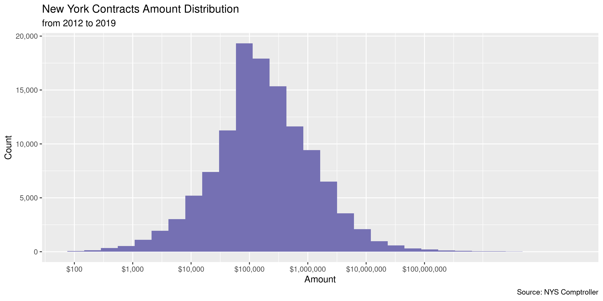

New York Contracts
================
Kiernan Nicholls
2023-01-19 14:14:44

- <a href="#project" id="toc-project">Project</a>
- <a href="#objectives" id="toc-objectives">Objectives</a>
- <a href="#software" id="toc-software">Software</a>
- <a href="#data" id="toc-data">Data</a>
- <a href="#import" id="toc-import">Import</a>
- <a href="#explore" id="toc-explore">Explore</a>
- <a href="#wrangle" id="toc-wrangle">Wrangle</a>
- <a href="#update" id="toc-update">Update</a>
- <a href="#export" id="toc-export">Export</a>
- <a href="#upload" id="toc-upload">Upload</a>

<!-- Place comments regarding knitting here -->

## Project

The Accountability Project is an effort to cut across data silos and
give journalists, policy professionals, activists, and the public at
large a simple way to search across huge volumes of public data about
people and organizations.

Our goal is to standardizing public data on a few key fields by thinking
of each dataset row as a transaction. For each transaction there should
be (at least) 3 variables:

1.  All **parties** to a transaction.
2.  The **date** of the transaction.
3.  The **amount** of money involved.

## Objectives

This document describes the process used to complete the following
objectives:

1.  How many records are in the database?
2.  Check for entirely duplicated records.
3.  Check ranges of continuous variables.
4.  Is there anything blank or missing?
5.  Check for consistency issues.
6.  Create a five-digit ZIP Code called `zip`.
7.  Create a `year` field from the transaction date.
8.  Make sure there is data on both parties to a transaction.

## Software

This data is processed using the free, open-source statistical computing
language R, which can be [installed from
CRAN](https://cran.r-project.org/) for various opperating systems. For
example, R can be installed from the apt package repository on Ubuntu.

``` bash
sudo apt update
sudo apt -y upgrade
sudo apt -y install r-base
```

The following additional R packages are needed to collect, manipulate,
visualize, analyze, and communicate these results. The `pacman` package
will facilitate their installation and attachment.

The IRW’s `campfin` package will also have to be installed from GitHub.
This package contains functions custom made to help facilitate the
processing of campaign finance data.

``` r
if (!require("pacman")) install.packages("pacman")
pacman::p_load_gh("irworkshop/campfin")
pacman::p_load(
  tidyverse, # data manipulation
  lubridate, # datetime strings
  magrittr, # pipe operators
  gluedown, # print markdown
  janitor, # dataframe clean
  refinr, # cluster and merge
  scales, # format strings
  readxl, # read excel
  knitr, # knit documents
  vroom, # read files fast
  furrr, # parallel map
  glue, # combine strings
  here, # relative storage
  httr, # http requests
  pryr, # memory usage
  fs # search storage 
)
```

This document should be run as part of the `us_spending` project, which
lives as a sub-directory of the more general, language-agnostic
[`irworkshop/tap`](https://github.com/irworkshop/accountability_datacleaning)
GitHub repository.

The `us_spending` project uses the [RStudio
projects](https://support.rstudio.com/hc/en-us/articles/200526207-Using-Projects)
feature and should be run as such. The project also uses the dynamic
`here::here()` tool for file paths relative to *your* machine.

``` r
# where does this document knit?
here::here()
#> [1] "/home/kiernan/Documents/accountability_datacleaning"
```

## Data

Contracts data is obtained from the New York Office of the State
Comptroller via their Open Book portal, which includes:

> All State agency contracts, in effect 4/1/12 or later, which includes
> contracts approved by the Office of the State Comptroller (OSC) and
> those that don’t require OSC approval.

> State authority contracts historically subject to approval by OSC
> (primarily for the Thruway Authority and the Long Island Power
> Authority only).

## Import

We can import the file by first downloading with a `httr::GET()` request
and then reading into memory with `vroom::vroom()`.

``` r
url <- "https://wwe2.osc.state.ny.us/transparency/contracts/contractresults.cfm"
raw_dir <- dir_create(here("state", "ny", "contracts", "data", "raw"))
raw_path <- path(raw_dir, "contracts-and-amendments.csv")
```

``` r
if (!file_exists(raw_path)) {
  GET(
    url = url,
    write_disk(raw_path, overwrite = TRUE),
    query = list(
      DocType = "csv",
      ac = "",
      v = "",
      vo = "B",
      cn = "",
      selOrigDateChoiceOperator = "Before",
      txtOrigFromDate = format(Sys.Date(), "%m/%d/%Y"),
      txtOrigToDate = "",
      selCTDateChoice = "0",
      selCTDateChoiceOperator = "0",
      txtCTFromDate = "",
      txtCTToDate = "",
      selContractAmountChoice = "0",
      txtContractAmount1 = "",
      txtContractAmount2 = "",
      b = "Search",
      order = "VENDOR_NAME",
      sort = "ASC"
    )
  )
}
```

``` r
nyc <- read_delim(
  file = raw_path,
  delim = ",",
  skip = 1,
  escape_double = FALSE,
  escape_backslash = FALSE,
  locale = locale(date_format = "%m/%d/%Y"),
  col_types = cols(
    .default = col_character(),
    `TRANSACTION AMOUNT` = col_double(),
    `START DATE` = col_date(),
    `END DATE` = col_date(),
    `TRANSACTION APPROVED/FILED DATE` = col_date()
  )
)
```

``` r
nyc <- nyc %>% 
  clean_names("snake") %>% 
  rename_all(str_remove, "transaction_") %>% 
  rename_all(str_remove, "_\\w+") %>% 
  mutate_at(vars(type), str_remove, "\\sContract$")
```

## Explore

``` r
head(nyc)
#> # A tibble: 6 × 9
#>   type    vendor depar…¹ contr…² amount start      end        descr…³ approved  
#>   <chr>   <chr>  <chr>   <chr>    <dbl> <date>     <date>     <chr>   <date>    
#> 1 Origin… 1 A L… Divisi… C002132 1.01e7 2013-10-04 2016-10-03 IGNITI… 2013-10-04
#> 2 Amendm… 1 A L… Divisi… C002132 0      NA         2016-08-14 Contra… 2013-10-23
#> 3 Amendm… 1 A L… Divisi… C002132 0      NA         2016-07-22 early … 2016-08-05
#> 4 Origin… 1 A L… Divisi… C002136 8.16e5 2010-12-21 2013-10-14 IGNITI… 2013-08-28
#> 5 Origin… 1 A L… Divisi… C002181 2.91e6 2021-08-15 2024-08-14 Igniti… 2021-08-06
#> 6 Origin… 1 JAV… Office… X004640 1.02e6 2021-11-10 2100-12-31 Pier e… 2022-10-31
#> # … with abbreviated variable names ¹​department, ²​contract, ³​description
tail(nyc)
#> # A tibble: 6 × 9
#>   type    vendor depar…¹ contr…² amount start      end        descr…³ approved  
#>   <chr>   <chr>  <chr>   <chr>    <dbl> <date>     <date>     <chr>   <date>    
#> 1 Origin… ZYDOC… SUNY a… X002443 2.86e4 2020-02-01 2021-01-31 Revoca… 2021-07-19
#> 2 Origin… ZYDUS… Depart… X009682 0      2005-10-01 2025-09-30 ELDERL… 2007-04-10
#> 3 Origin… ZYDUS… Depart… X025187 0      2009-07-01 2029-06-30 NEW YO… 2009-09-10
#> 4 Origin… ZYDUS… Depart… X027122 0      2011-08-23 2031-08-22 EPIC/E… 2011-11-02
#> 5 Origin… ZYDUS… Depart… X035251 0      2019-07-24 2039-07-23 ELDERL… 2019-09-05
#> 6 Origin… ZYGMU… Hudson… C0SHV0… 6.60e5 2022-06-01 2027-05-31 Christ… 2022-05-23
#> # … with abbreviated variable names ¹​department, ²​contract, ³​description
glimpse(sample_n(nyc, 20))
#> Rows: 20
#> Columns: 9
#> $ type        <chr> "Original", "Amendment", "Amendment", "Amendment", "Amendm…
#> $ vendor      <chr> "MOHAWK VALLEY COMMUNITY COLLEGE", "BINGHAMTON ROAD ELECTR…
#> $ department  <chr> "State Education Department - Federal - State Grants", "De…
#> $ contract    <chr> "C402578", "D262435", "C026138", "D024572", "L05680A", "D0…
#> $ amount      <dbl> 800000.0, -13571.1, 47791.0, 1225600.0, 127500.0, 0.0, 290…
#> $ start       <date> 2015-07-01, NA, NA, NA, NA, NA, NA, 2017-04-03, NA, NA, 2…
#> $ end         <date> 2020-06-30, NA, 2017-01-31, 2019-09-30, 2022-09-30, 2013-…
#> $ description <chr> "COLLEGE SCIENCE & TECHNOLOGY ENTRY PRG (CSTEP)", "CO# 011…
#> $ approved    <date> 2015-11-19, 2015-05-22, 2016-11-10, 2015-05-26, 2021-09-2…
```

The only variables missing from any records are the `start` and `end`
dates.

``` r
col_stats(nyc, count_na)
#> # A tibble: 9 × 4
#>   col         class       n     p
#>   <chr>       <chr>   <int> <dbl>
#> 1 type        <chr>       0 0    
#> 2 vendor      <chr>       0 0    
#> 3 department  <chr>       0 0    
#> 4 contract    <chr>       0 0    
#> 5 amount      <dbl>       0 0    
#> 6 start       <date> 114122 0.562
#> 7 end         <date>  36450 0.179
#> 8 description <chr>       0 0    
#> 9 approved    <date>      0 0
```

There are also a handful of duplicate records, which we can flag.

``` r
nyc <- flag_dupes(nyc, everything(), .check = TRUE)
sum(nyc$dupe_flag)
#> [1] 18
```

``` r
nyc %>% 
  filter(dupe_flag) %>% 
  select(start, department, amount, vendor)
#> # A tibble: 18 × 4
#>    start      department                                       amount vendor    
#>    <date>     <chr>                                             <dbl> <chr>     
#>  1 2019-05-03 Department of Agriculture & Markets - State Fair   4975 AMERICAN …
#>  2 2019-05-03 Department of Agriculture & Markets - State Fair   4975 AMERICAN …
#>  3 NA         New York City Transit Authority                       0 BOMBARDIE…
#>  4 NA         New York City Transit Authority                       0 BOMBARDIE…
#>  5 NA         Clinton Correctional Facility                     10000 DONALDSON…
#>  6 NA         Clinton Correctional Facility                     10000 DONALDSON…
#>  7 2021-08-20 Department of Agriculture & Markets - State Fair   4144 EDGAR PIC…
#>  8 2021-08-20 Department of Agriculture & Markets - State Fair   4144 EDGAR PIC…
#>  9 NA         Department of Health                              56507 HUDSON VA…
#> 10 NA         Department of Health                              56507 HUDSON VA…
#> 11 NA         Department of Transportation                       2000 MARKS TOW…
#> 12 NA         Department of Transportation                       2000 MARKS TOW…
#> 13 2018-07-20 Department of Agriculture & Markets - State Fair   2480 THOMAS CE…
#> 14 2018-07-20 Department of Agriculture & Markets - State Fair   2480 THOMAS CE…
#> 15 NA         State Education Department                            0 TIMS TRIM…
#> 16 NA         State Education Department                            0 TIMS TRIM…
#> 17 2022-07-01 Office of Children & Family Services              14000 TRI-LAKES…
#> 18 2022-07-01 Office of Children & Family Services              14000 TRI-LAKES…
```

Most columns are unique strings, but the `type` is pretty evenly split
between original data and amendments. We will include all types.

``` r
col_stats(nyc, n_distinct)
#> # A tibble: 10 × 4
#>    col         class       n          p
#>    <chr>       <chr>   <int>      <dbl>
#>  1 type        <chr>       3 0.0000148 
#>  2 vendor      <chr>   22477 0.111     
#>  3 department  <chr>     306 0.00151   
#>  4 contract    <chr>   89216 0.439     
#>  5 amount      <dbl>  104314 0.513     
#>  6 start       <date>   4789 0.0236    
#>  7 end         <date>   6537 0.0322    
#>  8 description <chr>  101500 0.500     
#>  9 approved    <date>   4135 0.0204    
#> 10 dupe_flag   <lgl>       2 0.00000984
```

``` r
explore_plot(nyc, type)
```

<!-- -->

### Amounts

``` r
enframe(map_chr(summary(nyc$amount), dollar))
#> # A tibble: 6 × 2
#>   name    value           
#>   <chr>   <chr>           
#> 1 Min.    -$3,275,535,265 
#> 2 1st Qu. $112.20         
#> 3 Median  $85,000         
#> 4 Mean    $5,167,111      
#> 5 3rd Qu. $377,856        
#> 6 Max.    $106,686,107,700
mean(nyc$amount <= 0)
#> [1] 0.2460516
median(nyc$amount)
#> [1] 85000
```

Here is the largest contract.

``` r
glimpse(nyc[which.min(nyc$amount), ])
#> Rows: 1
#> Columns: 10
#> $ type        <chr> "Amendment"
#> $ vendor      <chr> "NYS CATHOLIC HEALTH PLAN INC"
#> $ department  <chr> "Department of Health"
#> $ contract    <chr> "c029339"
#> $ amount      <dbl> -3275535265
#> $ start       <date> NA
#> $ end         <date> 2018-06-30
#> $ description <chr> "Assignment to Centene Acquisition Corporation (New York Q…
#> $ approved    <date> 2018-05-30
#> $ dupe_flag   <lgl> FALSE
```

<!-- -->

### Dates

We can add a 4 digit `year` variable taken from the approval date.

``` r
nyc <- mutate(nyc, year = year(approved))
```

There are a handful of dates before 2012, which is where the majority of
the records begin.

``` r
min(nyc$approved)
#> [1] "1986-05-10"
mean(nyc$year < 2012)
#> [1] 0.01378054
max(nyc$approved)
#> [1] "2023-01-18"
sum(nyc$approved > today())
#> [1] 0
```

<!-- -->

## Wrangle

There are no geographic variables, but we can add a 2-digit state
abbreviation for the spending agency.

``` r
nyc <- mutate(nyc, state = "NY", .after = department)
```

## Update

``` r
old_date <- as.Date("2020-05-29")
nyc <- nyc %>% 
  filter(approved > old_date)
```

## Export

``` r
glimpse(sample_n(nyc, 20))
#> Rows: 20
#> Columns: 12
#> $ type        <chr> "Amendment", "Amendment", "Amendment", "Amendment", "Origi…
#> $ vendor      <chr> "SLATE HILL CONSTRUCTORS INC", "BRANT BROS INC", "URS CORP…
#> $ department  <chr> "Department of Transportation", "Office For People with De…
#> $ state       <chr> "NY", "NY", "NY", "NY", "NY", "NY", "NY", "NY", "NY", "NY"…
#> $ contract    <chr> "D264088", "L901114", "D031095", "D45727C", "C172021", "CM…
#> $ amount      <dbl> 715000.00, 59713.26, 330000.00, 0.00, 150000.00, -90663.00…
#> $ start       <date> NA, NA, NA, NA, 2022-09-01, NA, NA, NA, NA, 2022-07-01, N…
#> $ end         <date> NA, 2022-11-30, 2024-05-31, 2021-11-01, 2025-08-31, NA, N…
#> $ description <chr> "CO#3 Emergency work", "Holdover", "Supplement 6", "CO#4 7…
#> $ approved    <date> 2021-10-15, 2021-09-28, 2020-08-12, 2021-10-26, 2023-01-1…
#> $ dupe_flag   <lgl> FALSE, FALSE, FALSE, FALSE, FALSE, FALSE, FALSE, FALSE, FA…
#> $ year        <dbl> 2021, 2021, 2020, 2021, 2023, 2022, 2022, 2020, 2021, 2022…
```

1.  There are 44,408 records in the database.
2.  There are 6 duplicate records in the database.
3.  The range and distribution of `amount` and `date` seem mostly
    reasonable.
4.  The 4-digit `year` variable has been created with
    `lubridate::year()`.

``` r
clean_dir <- dir_create(here("state", "ny", "contracts", "data", "clean"))
csv_dates <- paste(str_remove_all(c(old_date, Sys.Date()), "-"), collapse = "-")
clean_csv <- path(clean_dir, "ny_contracts_clean.csv")
write_csv(nyc, clean_csv, na = "")
(clean_size <- file_size(clean_csv))
#> 7.05M
mutate(file_encoding(clean_csv), across(path, path.abbrev))
#> # A tibble: 1 × 3
#>   path                                                             mime  charset
#>   <fs::path>                                                       <chr> <chr>  
#> 1 …tacleaning/state/ny/contracts/data/clean/ny_contracts_clean.csv text… us-asc…
```

## Upload

We can use the `aws.s3::put_object()` to upload the text file to the IRW
server.

``` r
aws_key <- path("csv", basename(clean_csv))
if (!object_exists(aws_key, "publicaccountability")) {
  put_object(
    file = clean_csv,
    object = aws_key, 
    bucket = "publicaccountability",
    acl = "public-read",
    show_progress = TRUE,
    multipart = TRUE
  )
}
aws_head <- head_object(aws_key, "publicaccountability")
(aws_size <- as_fs_bytes(attr(aws_head, "content-length")))
unname(aws_size == clean_size)
```
