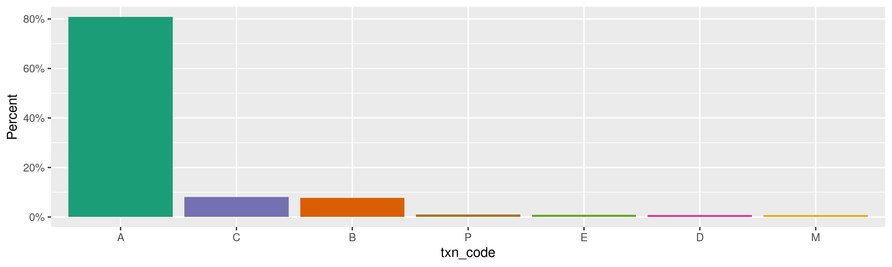
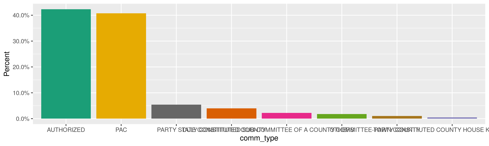

New York Contributions
================
Kiernan Nicholls
Thu Feb 25 16:06:28 2021

-   [Project](#project)
-   [Objectives](#objectives)
-   [Packages](#packages)
-   [Data](#data)
-   [Import](#import)
    -   [Download](#download)
    -   [Extract](#extract)
    -   [About](#about)
    -   [Fix](#fix)
    -   [Read](#read)
    -   [Filter](#filter)
    -   [Filers](#filers)
-   [Explore](#explore)
    -   [Missing](#missing)
    -   [Categorical](#categorical)
    -   [Amounts](#amounts)
    -   [Dates](#dates)
-   [Wrangle](#wrangle-1)
    -   [Filers](#filers-1)
    -   [Address](#address)
    -   [ZIP](#zip)
    -   [State](#state)
    -   [City](#city)
-   [Conclude](#conclude)
-   [Export](#export)
-   [Upload](#upload)

<!-- Place comments regarding knitting here -->

## Project

The Accountability Project is an effort to cut across data silos and
give journalists, policy professionals, activists, and the public at
large a simple way to search across huge volumes of public data about
people and organizations.

Our goal is to standardizing public data on a few key fields by thinking
of each dataset row as a transaction. For each transaction there should
be (at least) 3 variables:

1.  All **parties** to a transaction.
2.  The **date** of the transaction.
3.  The **amount** of money involved.

## Objectives

This document describes the process used to complete the following
objectives:

1.  How many records are in the database?
2.  Check for entirely duplicated records.
3.  Check ranges of continuous variables.
4.  Is there anything blank or missing?
5.  Check for consistency issues.
6.  Create a five-digit ZIP Code called `zip`.
7.  Create a `year` field from the transaction date.
8.  Make sure there is data on both parties to a transaction.

## Packages

The following packages are needed to collect, manipulate, visualize,
analyze, and communicate these results. The `pacman` package will
facilitate their installation and attachment.

``` r
if (!require("pacman")) {
  install.packages("pacman")
}
pacman::p_load(
  tidyverse, # data manipulation
  lubridate, # datetime strings
  gluedown, # printing markdown
  janitor, # clean data frames
  campfin, # custom irw tools
  aws.s3, # aws cloud storage
  refinr, # cluster & merge
  scales, # format strings
  knitr, # knit documents
  rvest, # scrape html
  glue, # code strings
  here, # project paths
  httr, # http requests
  fs # local storage 
)
```

This document should be run as part of the `R_campfin` project, which
lives as a sub-directory of the more general, language-agnostic
[`irworkshop/accountability_datacleaning`](https://github.com/irworkshop/accountability_datacleaning)
GitHub repository.

The `R_campfin` project uses the [RStudio
projects](https://support.rstudio.com/hc/en-us/articles/200526207-Using-Projects)
feature and should be run as such. The project also uses the dynamic
`here::here()` tool for file paths relative to *your* machine.

``` r
# where does this document knit?
here::i_am("ny/contribs/docs/ny_contribs_diary.Rmd")
```

## Data

The New York state campaign finance contributions data can be obtained
from the [New York State Board of Elections
(NYSBOE)](https://www.elections.ny.gov/INDEX.html).

From the NYSBOE’s [view reports
page](https://www.elections.ny.gov/CFViewReports.html) we can obtain the
raw database in ASCII files. The NYSBOE also provides disclaimers on the
data availability and accuracy.

> ##### Data Availability
>
> This database contains all financial disclosure reports filed with
> NYSBOE from July of 1999 to the present. Financial disclosure reports
> filed prior to the 1999 July Periodic report are either on file with
> the New York State Archives or in storage with the New York State
> Board of Elections. For further information or to obtain copies of
> these archived or stored filings, please call 1-800-458-3453. Each
> page costs 25¢ plus postage and copy orders must be prepaid.
>
> Electronically filed disclosure reports are generally available in the
> database on the day they are received. A small number of candidates
> and committees are either statutorily exempt or have applied for and
> obtained exemptions from electronic filing. These filers will continue
> filing on paper and their disclosure reports will become available as
> they are manually entered into the database by NYSBOE staff.

> ##### Data Accuracy
>
> The majority of financial disclosure reports filed at NYSBOE are
> entered into the database directly from e-mail, diskette, CD or DVD
> filings submitted by committee treasurers or candidates. The
> information contained in paper filings will be entered into the
> database exactly as it appears on the forms. Because database searches
> retrieve information exactly the way it is reported and then entered
> into the database, search results may be inaccurate and/or incomplete.
> This will occur, for example, if filers do not adhere to the required
> format, do not use the proper codes, misspell words or leave items
> blank. Although NYSBOE carefully reviews disclosure reports and
> requires treasurers to submit amended reports as needed, there will
> necessarily be delays before the review process is completed and the
> information in the database is corrected.

## Import

To import the contributions data into R, we first have to download two
files: (1) the filer data and (2) the filings data. Together, these two
files can identify all parties to contributions.

> ##### Database Files in ASCII Delimited Format
>
> **Updated data files are uploaded during active filing periods after
> 4:00 P.M. daily until the filing is complete.**
>
> **Note:** To match the filing data files to Filer Names by filer ID
> you will need to [Download the Filer data
> file](https://cfapp.elections.ny.gov/NYSBOE/download/ZipDataFiles/commcand.zip).
> Commcand.zip is a zipped file containing the data file (commcand.asc)
> in ASCII delimited and two text files. (filerec.txt contains the data
> file layout - codes.txt explains the codes used in the data file).
>
> **All downloadable files are zipped files containing a data file in
> ASCII delimited format and two text files. (`efsrecb.txt` contains the
> data file layout - `efssched.txt` explains the different schedules as
> they apply to the database).**
>
> [Download Data file containing ALL
> filings](https://cfapp.elections.ny.gov/NYSBOE/download/ZipDataFiles/ALL_REPORTS.zip).
> **Note:** This file is a large file (238, 994 KB) that contains over 6
> million records. Do not attempt to download this file unless you have
> a database to download the file to.

### Download

We can download the ZIP archives and extract their contents.

``` r
sboe <- "https://cfapp.elections.ny.gov/NYSBOE/download/ZipDataFiles/"
con_url <- str_c(sboe, "ALL_REPORTS.zip")
fil_url <- str_c(sboe, "commcand.zip")
```

``` r
raw_dir <- dir_create(here("ny", "contribs", "data", "raw"))
con_zip <- path(raw_dir, basename(con_url))
fil_zip <- path(raw_dir, basename(fil_url))
if (!file_exists(con_zip)) {
  download.file(fil_url, fil_zip)
  download.file(con_url, con_zip)
}
```

### Extract

There are three files in each of the two ZIP archives.

``` r
zip_ls <- list(
  "ALL_REPORTS.zip" = unzip(con_zip, list = TRUE),
  "commcand.zip"    = unzip(fil_zip, list = TRUE)
)
```

    #> # A tibble: 6 x 4
    #>   source_zip      file_name              size date               
    #>   <fs::path>      <fs::path>      <fs::bytes> <dttm>             
    #> 1 ALL_REPORTS.zip EFSRECB.TXT           2.56K 2020-04-16 22:13:00
    #> 2 ALL_REPORTS.zip EFSSCHED.TXT         13.85K 2020-04-16 22:13:00
    #> 3 ALL_REPORTS.zip ALL_REPORTS.out       2.47G 2020-04-16 22:13:00
    #> 4 commcand.zip    CODES.TXT             3.14K 2020-04-16 22:26:00
    #> 5 commcand.zip    FILEREC.TXT           1.22K 2020-04-16 22:26:00
    #> 6 commcand.zip    COMMCAND.txt          5.83M 2020-04-16 22:26:00

If these files don’t exist in our raw data directory, they can be
extracted.

``` r
raw_txt <- path(raw_dir, zip_ls$file_name)
raw_txt <- setNames(raw_txt, basename(raw_txt))
```

``` r
if (!all(file_exists(raw_txt))) {
  con_txt <- unzip(con_zip, exdir = raw_dir)
  fil_txt <- unzip(fil_zip, exdir = raw_dir)
}
```

### About

We will have to read the `EFSRECB.TXT` file to determine the column
names and formats for the `ALL_REPORTS.out` file, which has no header.
The file also describes the specifications needed to parse the file,
which can be passed as arguments to `readr::read_delim()`.

|                     | Value |
|:--------------------|:------|
| RecordSeparator     | CR-LF |
| FieldSeparator      | ,     |
| FieldStartDelimiter | "     |
| FieldEndDelimiter   | "     |
| FieldDelimitStyle   | ALL   |
| StripLeadingBlanks  | TRUE  |
| StripTrailingBlanks | TRUE  |

| field               | location | type     | format                | efs\_import |
|:--------------------|---------:|:---------|:----------------------|:------------|
| `filer_id`          |        1 | `<chr>`  |                       | TRUE        |
| `freport_id`        |        2 | `<chr>`  |                       | TRUE        |
| `transaction_code`  |        3 | `<chr>`  |                       | TRUE        |
| `e_year`            |        4 | `<chr>`  |                       | TRUE        |
| `t3_trid`           |        5 | `<int>`  |                       |             |
| `date1`             |        6 | `<date>` | MM/DD/YYYY            |             |
| `date2`             |        7 | `<date>` | MM/DD/YYYY            |             |
| `contrib_code`      |        8 | `<chr>`  |                       |             |
| `contrib_type_code` |        9 | `<chr>`  |                       |             |
| `corp`              |       10 | `<chr>`  |                       |             |
| `first_name`        |       11 | `<chr>`  |                       |             |
| `mid_init`          |       12 | `<chr>`  |                       |             |
| `last_name`         |       13 | `<chr>`  |                       |             |
| `addr_1`            |       14 | `<chr>`  |                       |             |
| `city`              |       15 | `<chr>`  |                       |             |
| `state`             |       16 | `<chr>`  |                       |             |
| `zip`               |       17 | `<chr>`  |                       |             |
| `check_no`          |       18 | `<chr>`  |                       |             |
| `check_date`        |       19 | `<date>` | MM/DD/YYYY            |             |
| `amount`            |       20 | `<dbl>`  |                       |             |
| `amount2`           |       21 | `<dbl>`  |                       |             |
| `description`       |       22 | `<chr>`  |                       |             |
| `other_recpt_code`  |       23 | `<chr>`  |                       |             |
| `purpose_code1`     |       24 | `<chr>`  |                       |             |
| `purpose_code2`     |       25 | `<chr>`  |                       |             |
| `explanation`       |       26 | `<chr>`  |                       |             |
| `xfer_type`         |       27 | `<chr>`  |                       |             |
| `chkbox`            |       28 | `<chr>`  |                       |             |
| `crerec_uid`        |       29 | `<chr>`  |                       |             |
| `crerec_date`       |       30 | `<date>` | MM/DD/YYYY HH24:MI:SS |             |

### Fix

``` r
fix_file <- path(raw_dir, "FIX_REPORTS.csv")
if (!file_exists(fix_file)) {
  read_lines(raw_txt["ALL_REPORTS.out"]) %>% 
    iconv(to = "UTF-8", sub = "byte") %>% 
    str_replace_all("(?<!\r)\n", " ") %>%
    str_remove_all(",(?!\")") %>% 
    str_replace_all("(?<!^|,|\r\n)\"(?!,|\r\n|$)", "\'") %>% 
    write_lines(fix_file)
}
```

### Read

``` r
nyc <- read_delim(
  file = fix_file,
  delim = ",",
  escape_double = FALSE,
  escape_backslash = FALSE,
  col_names = out_cols$field,
  na = c("", "NA", "N/A"),
  col_types = cols(
    .default = col_character(),
    date1 = col_date("%m/%d/%Y"),
    date2 = col_date("%m/%d/%Y"),
    check_date = col_date("%m/%d/%Y"),
    amount = col_double(),
    amount2 = col_double(),
    crerec_date = col_datetime("%m/%d/%Y %H:%M:%S")
  )
)
```

To ensure the file was properly read, we can count the distinct values
of a discrete variable like `contrib_type_code`.

``` r
comma(nrow(nyc))
#> [1] "13,263,128"
all(unique(nyc$freport_id) %in% LETTERS[1:12])
#> [1] TRUE
count(nyc, freport_id)
#> # A tibble: 12 x 2
#>    freport_id       n
#>    <chr>        <int>
#>  1 A           638752
#>  2 B           481642
#>  3 C           565281
#>  4 D          1181554
#>  5 E           945982
#>  6 F          1220957
#>  7 G            51884
#>  8 H            63431
#>  9 I           103423
#> 10 J          2693621
#> 11 K          5163568
#> 12 L           153033
```

### Filter

This file contains *all* campaign finance transactions. If we consult
`EFSSHCED.TXT`, we determine which record types correspond to
contributions.

``` r
efssched <- read_lines(raw_txt["EFSSCHED.TXT"])
```

    #> # A tibble: 19 x 3
    #>    type_code report_type                                      contrib
    #>    <chr>     <chr>                                            <lgl>  
    #>  1 A         Monetary Contributions/Individual & Partnerships TRUE   
    #>  2 B         Monetary Contributions/Corporate                 TRUE   
    #>  3 C         Monetary Contributions/All Other                 TRUE   
    #>  4 D         In-Kind Contributions                            TRUE   
    #>  5 E         Other Receipts                                   TRUE   
    #>  6 F         Expenditure/Payments                             FALSE  
    #>  7 G         Transfers In                                     FALSE  
    #>  8 H         Transfers Out                                    FALSE  
    #>  9 I         Loans Received                                   FALSE  
    #> 10 J         Loan Repayments                                  FALSE  
    #> 11 K         Liabilities/Loans Forgiven                       FALSE  
    #> 12 L         Expenditure Refunds                              FALSE  
    #> 13 M         Contributions Refunded                           TRUE   
    #> 14 N         Outstanding Liabilities                          FALSE  
    #> 15 O         Partners / Subcontracts                          FALSE  
    #> 16 P         Non Campaign Housekeeping Receipts               TRUE   
    #> 17 Q         Non Campaign Housekeeping Expenses               FALSE  
    #> 18 X         A No Activity Statement Was Submitted            FALSE  
    #> 19 Y         A In-Lieu-Of Statement Was Submitted             FALSE

Then we can filter our data frame to include only those records using
the `transaction_code` variable.

``` r
nyc <- nyc %>% 
  filter(transaction_code %in% type_codes$type_code[type_codes$contrib]) %>% 
  remove_empty("cols")
```

We can consult the `EFSSCHED.txt` to see what columns apply to
contribution type records, removing any which shouldn’t belong.

``` r
# ensure proper rows kept
rows_post <- nrow(nyc)
comma(rows_post)
#> [1] "9,301,015"
```

### Filers

We will use the files in `commcand.zip` to build a useful data frame of
filer information, which can then be joined to our contributions.

| field              | location | type    |
|:-------------------|:---------|:--------|
| `filer_id`         | 01       | `<chr>` |
| `filer_name`       | 02       | `<chr>` |
| `filer_type`       | 03       | `<chr>` |
| `status`           | 04       | `<chr>` |
| `committee_type`   | 05       | `<chr>` |
| `office`           | 06       | `<int>` |
| `district`         | 07       | `<int>` |
| `treas_first_name` | 08       | `<chr>` |
| `treas_last_name`  | 09       | `<chr>` |
| `address`          | 10       | `<chr>` |
| `city`             | 11       | `<chr>` |
| `state`            | 12       | `<chr>` |
| `zip`              | 13       | `<chr>` |

We will also read codes from the `CODES.TXT` file and join them to the
data.

``` r
codes_all <- str_trim(read_lines(file = raw_txt["CODES.TXT"]))
```

| office | office\_name                  |
|-------:|:------------------------------|
|      4 | Governor                      |
|      5 | Lt. Governor                  |
|      6 | Comptroller                   |
|      7 | Attorney General              |
|      8 | U.S. Senator                  |
|      9 | Sup. Court Justice            |
|     11 | State Senator                 |
|     12 | Member of Assembly            |
|     13 | State Committee               |
|     16 | Judicial Delegate             |
|     17 | Alt Judicial Del.             |
|     18 | Chairperson                   |
|     19 | City Manager                  |
|     20 | Council President             |
|     21 | County Executive              |
|     22 | Mayor                         |
|     23 | President                     |
|     24 | Supervisor                    |
|     25 | Sheriff                       |
|     26 | District Attorney             |
|     27 | County Legislator             |
|     28 | County Court Judge            |
|     29 | Surrogate Court Judge         |
|     30 | Family Court Judge            |
|     31 | Party Committee Member        |
|     32 | City Council                  |
|     33 | Village Trustee               |
|     34 | Village Justice               |
|     35 | Clerk                         |
|     36 | Town Justice                  |
|     37 | Town Council                  |
|     38 | Receiver of Taxes             |
|     39 | Highway Superintendent        |
|     40 | Alderperson                   |
|     41 | Treasurer                     |
|     42 | Assessor                      |
|     43 | Borough President             |
|     44 | District Leader               |
|     45 | Comptroller                   |
|     46 | Coroner                       |
|     47 | County Representative         |
|     49 | Public Advocate               |
|     50 | Councilman                    |
|     51 | Trustee                       |
|     52 | Town Board                    |
|     53 | Legislator                    |
|     54 | Legislative District          |
|     55 | City Chamberlain              |
|     56 | City Council President        |
|     57 | City Court Judge              |
|     58 | Pres. Common Council          |
|     59 | Clerk/Collector               |
|     60 | Civil Court Judge             |
|     61 | Trustee of School Funds       |
|     62 | County Committee              |
|     63 | Commissioner of Education     |
|     64 | Commissioner of Public Works  |
|     65 | Common Council                |
|     66 | District Court Judge          |
|     67 | Commissioner of Finance       |
|     68 | Citizen’s Review Board Member |
|     69 | Town Clerk/Tax Collector      |
|     70 | Town Tax Collector            |
|     71 | Controller                    |
|     72 | City School Board             |
|     73 | Collector                     |
|     74 | Commissioner of Schools       |
|     75 | County Clerk                  |
|     76 | Town Clerk                    |
|     77 | Village Clerk                 |
|     78 | County Treasurer              |
|     79 | Town Treasurer                |
|     80 | Village Treasurer             |
|     81 | City Treasurer                |
|     82 | Town Supervisor               |

| district           | district\_name |
|:-------------------|:---------------|
| Judicial Districts | 1-12           |
| Senate Districts   | 1-61           |
| Assembly Districts | 1-150          |

| committee\_type | committee\_name                                                    |
|:----------------|:-------------------------------------------------------------------|
| 1               | AUTHORIZED                                                         |
| 2               | PAC                                                                |
| 3               | CONSTITUTED COUNTY                                                 |
| 3H              | CONSTITUTED COUNTY HOUSE KEEPING                                   |
| 4               | PARTY COUNTY                                                       |
| 4H              | PARTY COUNTY HOUSE KEEPING                                         |
| 5               | CONSTITUTED STATE                                                  |
| 5H              | CONSTITUTED STATE HOUSE KEEPING                                    |
| 6               | PARTY STATE                                                        |
| 6H              | PARTY STATE HOUSE KEEPING                                          |
| 7               | DULY CONSTITUTED SUB-COMMITTEE OF A COUNTY COMMITTEE               |
| 7C              | DULY CONSTITUTED SUB-COMMITTEE OF A COUNTY COMMITTEE-CITY          |
| 7H              | DULY CONSTITUED SUB-COMMITTEE OF A COUNTY COMMITTEE - HOUSKEEPING  |
| 7HC             | DULY CONSTITUED SUB-COMMITTEE OF A CO. COMM. - HOUSKEEPING-CITY    |
| 7HT             | DULY CONSTITUED SUB-COMMITTEE OF A CO. COMM. - HOUSKEEPING-TOWN    |
| 7HV             | DULY CONSTITUED SUB-COMMITTEE OF A CO. COMM. - HOUSKEEPING-VILLAGE |
| 7T              | DULY CONSTITUTED SUB-COMMITTEE OF A COUNTY COMMITTEE-TOWN          |
| 7V              | DULY CONSTITUTED SUB-COMMITTEE OF A COUNTY COMMITTEE-VILLAGE       |
| 9               | OTHERS                                                             |
| 9B              | BALLOT ISSUE                                                       |
| 9U              | UNDECLARED                                                         |

| report | report\_name        |
|:-------|:--------------------|
| A      | 32 Day Pre-Primary  |
| B      | 11 Day Pre-Primary  |
| C      | 10 Day Post-Primary |
| D      | 32 Day Pre-General  |
| E      | 11 Day Pre-General  |
| F      | 27 Day Post-General |
| G      | 32 Day Pre-Special  |
| H      | 11 Day Pre-Special  |
| I      | 27 Day Post-Special |
| J      | January Periodic    |
| K      | July Periodic       |
| L      | Off-Cycle           |

``` r
commcand <- read_delim(
  file = raw_txt["COMMCAND.txt"],
  delim = ",",
  escape_backslash = FALSE,
  escape_double = FALSE,
  col_names = filerec$field,
  col_types = cols(
    .default = col_character(),
    office = col_integer(),
    district = col_integer()
  )
)
```

#### Wrangle

Before joining the filer data to the contributions, we can clean up the
address data of each filer. See the section on wrangling before for a
more detailed explanation of wrangling steps made on contributor data.

``` r
fil_addr <- commcand %>% 
  select(fil_id = filer_id, addr = address, city, state, zip)
```

``` r
fil_addr <- fil_addr %>% 
  mutate(
    addr_norm = normal_address(
      address = addr,
      abbs = usps_street,
      na = invalid_city
    )
  )
```

``` r
fil_addr <- fil_addr %>% 
  mutate(
    zip_norm = normal_zip(
      zip = zip,
      na_rep = TRUE
    )
  )
```

``` r
fil_addr <- fil_addr %>% 
  mutate(
    state_norm = normal_state(
      state = state,
      abbreviate = TRUE,
      na_rep = TRUE,
      valid = valid_state
    )
  )
```

``` r
fil_addr <- fil_addr %>% 
  mutate(
    city_norm = normal_city(
      city = city %>% 
        str_replace("STA$", "STATION") %>% 
        str_replace("STATI$", "STATION"), 
      abbs = usps_city,
      states = c("NY", "DC", "NEW YORK"),
      na = invalid_city,
      na_rep = TRUE
    )
  )
```

``` r
prop_in(fil_addr$zip_norm, valid_zip)
#> [1] 0.9988225
prop_in(fil_addr$state_norm, valid_state)
#> [1] 1
prop_in(fil_addr$city, valid_city)
#> [1] 0.8039107
```

``` r
fil_addr <- fil_addr %>% 
  select(fil_id, ends_with("norm")) %>% 
  rename_with(~str_c("fil", ., sep = "_"), .cols = -1)
```

#### Join

We can now add the filer data to our contribution data.

``` r
# all filers in data
prop_in(nyc$filer_id, commcand$filer_id)
#> [1] 1
```

``` r
nyc <- left_join(
  x = nyc,
  y = commcand,
  by = "filer_id",
  suffix = c("_con", "_fil")
)

nyc <- rename_prefix(
  df = nyc,
  suffix = c("_con", "_fil"),
  punct = TRUE
)
```

## Explore

There are 9,301,015 rows of 31 columns. Each record represents a single
contribution made from an individual or entity to a political committee
or candidate.

``` r
glimpse(nyc)
#> Rows: 9,301,015
#> Columns: 31
#> $ fil_id       <chr> "A00052", "A00052", "A00052", "A00052", "A00052", "A00052", "A00052", "A00052", "A00052", "A00052…
#> $ freport_id   <chr> "D", "D", "E", "F", "F", "K", "K", "K", "K", "K", "K", "D", "D", "D", "F", "F", "J", "K", "K", "K…
#> $ txn_code     <chr> "E", "E", "E", "E", "E", "E", "E", "E", "E", "E", "E", "E", "E", "E", "E", "E", "E", "E", "E", "E…
#> $ e_year       <chr> "1999", "1999", "1999", "1999", "1999", "1999", "1999", "1999", "1999", "1999", "1999", "2000", "…
#> $ t3_trid      <chr> "1546", "1547", "1548", "1549", "1550", "1543", "1544", "1545", "1546", "1547", "1548", "1563", "…
#> $ date         <date> 1999-07-29, 1999-08-30, 1999-09-29, 1999-10-28, 1999-11-29, 1999-01-28, 1999-02-25, 1999-03-30, …
#> $ contrib_code <chr> NA, NA, NA, NA, NA, NA, NA, NA, NA, NA, NA, NA, NA, NA, NA, NA, NA, NA, NA, NA, NA, NA, NA, NA, N…
#> $ corp         <chr> "EMIGRANT SAVINGS BANK", "EMIGRANT SAVINGS BANK", "EMIGRANT SAVINGS BANK", "EMIGRANT SAVINGS BANK…
#> $ first_name   <chr> NA, NA, NA, NA, NA, NA, NA, NA, NA, NA, NA, NA, NA, NA, NA, NA, NA, NA, NA, NA, NA, NA, NA, NA, N…
#> $ mid_init     <chr> NA, NA, NA, NA, NA, NA, NA, NA, NA, NA, NA, NA, NA, NA, NA, NA, NA, NA, NA, NA, NA, NA, NA, NA, N…
#> $ last_name    <chr> NA, NA, NA, NA, NA, NA, NA, NA, NA, NA, NA, NA, NA, NA, NA, NA, NA, NA, NA, NA, NA, NA, NA, NA, N…
#> $ con_addr     <chr> "5 EAST 42ND STREET", "5 EAST 42ND STREET", "5 EAST 42ND STREET", "5 EAST 42ND STREET", "5 EAST 4…
#> $ con_city     <chr> "NEW YORK", "NEW YORK", "NEW YORK", "NEW YORK", "NEW YORK", "NEW YORK", "NEW YORK", "NEW YORK", "…
#> $ con_state    <chr> "NY", "NY", "NY", "NY", "NY", "NY", "NY", "NY", "NY", "NY", "NY", "NY", "NY", "NY", "NY", "NY", "…
#> $ con_zip      <chr> "10017", "10017", "10017", "10017", "10017", "10017", "10017", "10017", "10017", "10017", "10017"…
#> $ check_no     <chr> NA, NA, NA, NA, NA, NA, NA, NA, NA, NA, NA, NA, NA, NA, NA, NA, NA, NA, NA, NA, NA, NA, NA, NA, N…
#> $ amount       <dbl> 0.86, 0.92, 0.86, 0.84, 0.93, 0.82, 0.80, 0.94, 0.86, 0.80, 0.95, 0.91, 0.91, 0.85, 0.94, 0.89, 0…
#> $ crerec_uid   <chr> "FAHRBACH", "FAHRBACH", "FAHRBACH", "CF", "CF", "CF", "CF", "CF", "CF", "CF", "CF", "CF", "CF", "…
#> $ crerec_date  <dttm> 1999-10-13 10:55:15, 1999-10-13 10:56:23, 1999-10-13 10:59:21, 1999-11-30 09:52:17, 1999-11-30 0…
#> $ fil_name     <chr> "EMIGRANT BANK POLITICAL ACTION COMMITTEE (EMPAC)", "EMIGRANT BANK POLITICAL ACTION COMMITTEE (EM…
#> $ fil_type     <chr> "COMMITTEE", "COMMITTEE", "COMMITTEE", "COMMITTEE", "COMMITTEE", "COMMITTEE", "COMMITTEE", "COMMI…
#> $ fil_status   <chr> "ACTIVE", "ACTIVE", "ACTIVE", "ACTIVE", "ACTIVE", "ACTIVE", "ACTIVE", "ACTIVE", "ACTIVE", "ACTIVE…
#> $ comm_type    <chr> "PAC", "PAC", "PAC", "PAC", "PAC", "PAC", "PAC", "PAC", "PAC", "PAC", "PAC", "PAC", "PAC", "PAC",…
#> $ office       <chr> NA, NA, NA, NA, NA, NA, NA, NA, NA, NA, NA, NA, NA, NA, NA, NA, NA, NA, NA, NA, NA, NA, NA, NA, N…
#> $ district     <int> NA, NA, NA, NA, NA, NA, NA, NA, NA, NA, NA, NA, NA, NA, NA, NA, NA, NA, NA, NA, NA, NA, NA, NA, N…
#> $ treas_first  <chr> "DOUGLAS", "DOUGLAS", "DOUGLAS", "DOUGLAS", "DOUGLAS", "DOUGLAS", "DOUGLAS", "DOUGLAS", "DOUGLAS"…
#> $ treas_last   <chr> "MCCLINTOCK", "MCCLINTOCK", "MCCLINTOCK", "MCCLINTOCK", "MCCLINTOCK", "MCCLINTOCK", "MCCLINTOCK",…
#> $ fil_addr     <chr> "5 HAMILTON ROAD", "5 HAMILTON ROAD", "5 HAMILTON ROAD", "5 HAMILTON ROAD", "5 HAMILTON ROAD", "5…
#> $ fil_city     <chr> "SCARSDALE", "SCARSDALE", "SCARSDALE", "SCARSDALE", "SCARSDALE", "SCARSDALE", "SCARSDALE", "SCARS…
#> $ fil_state    <chr> "NY", "NY", "NY", "NY", "NY", "NY", "NY", "NY", "NY", "NY", "NY", "NY", "NY", "NY", "NY", "NY", "…
#> $ fil_zip      <chr> "10583", "10583", "10583", "10583", "10583", "10583", "10583", "10583", "10583", "10583", "10583"…
tail(nyc)
#> # A tibble: 6 x 31
#>   fil_id freport_id txn_code e_year t3_trid date       contrib_code corp       first_name  mid_init last_name con_addr  
#>   <chr>  <chr>      <chr>    <chr>  <chr>   <date>     <chr>        <chr>      <chr>       <chr>    <chr>     <chr>     
#> 1 C99295 K          A        2017   49      2017-04-06 IND          <NA>       JAMES AND … <NA>     SPELLMAN  29 BOHLIN…
#> 2 C99295 K          A        2017   50      2017-05-04 IND          <NA>       DR STEPHEN  <NA>     PARAVATI  34 PEARL …
#> 3 C99295 K          B        2017   51      2017-03-01 <NA>         SCALZO ZO… <NA>        <NA>     <NA>      CAMPION C…
#> 4 C99295 K          B        2017   52      2017-03-09 <NA>         CHARLES A… <NA>        <NA>     <NA>      258 GENES…
#> 5 C99295 K          C        2017   53      2017-03-07 LLC          BENDERSON… <NA>        <NA>     <NA>      1 MARINE …
#> 6 C99295 K          D        2017   54      2017-03-09 PART         CAVALLO'S… <NA>        <NA>     <NA>      40 GENESE…
#> # … with 19 more variables: con_city <chr>, con_state <chr>, con_zip <chr>, check_no <chr>, amount <dbl>,
#> #   crerec_uid <chr>, crerec_date <dttm>, fil_name <chr>, fil_type <chr>, fil_status <chr>, comm_type <chr>,
#> #   office <chr>, district <int>, treas_first <chr>, treas_last <chr>, fil_addr <chr>, fil_city <chr>, fil_state <chr>,
#> #   fil_zip <chr>
```

### Missing

Columns vary in their degree of missing values.

``` r
col_stats(nyc, count_na)
#> # A tibble: 31 x 4
#>    col          class        n          p
#>    <chr>        <chr>    <int>      <dbl>
#>  1 fil_id       <chr>        0 0         
#>  2 freport_id   <chr>        0 0         
#>  3 txn_code     <chr>        0 0         
#>  4 e_year       <chr>        0 0         
#>  5 t3_trid      <chr>      672 0.0000723 
#>  6 date         <date>     175 0.0000188 
#>  7 contrib_code <chr>  1340267 0.144     
#>  8 corp         <chr>  7247419 0.779     
#>  9 first_name   <chr>  2113451 0.227     
#> 10 mid_init     <chr>  7284300 0.783     
#> 11 last_name    <chr>  2117987 0.228     
#> 12 con_addr     <chr>   423564 0.0455    
#> 13 con_city     <chr>   404506 0.0435    
#> 14 con_state    <chr>   398982 0.0429    
#> 15 con_zip      <chr>   427422 0.0460    
#> 16 check_no     <chr>  2410886 0.259     
#> 17 amount       <dbl>     4874 0.000524  
#> 18 crerec_uid   <chr>  3028346 0.326     
#> 19 crerec_date  <dttm>   68809 0.00740   
#> 20 fil_name     <chr>        0 0         
#> 21 fil_type     <chr>        0 0         
#> 22 fil_status   <chr>        0 0         
#> 23 comm_type    <chr>    37216 0.00400   
#> 24 office       <chr>  5502140 0.592     
#> 25 district     <int>  7170395 0.771     
#> 26 treas_first  <chr>       90 0.00000968
#> 27 treas_last   <chr>       90 0.00000968
#> 28 fil_addr     <chr>     7368 0.000792  
#> 29 fil_city     <chr>      937 0.000101  
#> 30 fil_state    <chr>     1561 0.000168  
#> 31 fil_zip      <chr>      954 0.000103
```

We can flag any record missing a key variable needed to identify a
transaction.

We must first create a single variable with the combined contributor
names.

``` r
nyc <- nyc %>% 
  unite(
    col = con_name,
    first_name, mid_init, last_name, corp,
    sep = " ",
    remove = FALSE,
    na.rm = TRUE
  ) %>% 
  relocate(con_name, .after = last_col()) %>% 
  mutate(across(con_name, na_if, ""))
```

``` r
key_vars <- c("date", "con_name", "amount", "fil_name")
nyc <- flag_na(nyc, all_of(key_vars))
mean(nyc$na_flag)
#> [1] 0.01081559
```

A little over 1% of records are missing a key variable, mostly a name
identifying the contributor.

``` r
nyc %>% 
  filter(na_flag) %>% 
  select(all_of(key_vars))
#> # A tibble: 100,596 x 4
#>    date       con_name    amount fil_name                                                        
#>    <date>     <chr>        <dbl> <chr>                                                           
#>  1 2000-01-11 <NA>          690  COMMITTEE TO ELECT MARGARET M. MARKEY                           
#>  2 2012-03-16 AMY M KRUSE    NA  COMMITTEE TO ELECT MARGARET M. MARKEY                           
#>  3 2018-10-01 <NA>         1449. BAC LOCAL 2 POLITICAL ACTION COMMITTEE                          
#>  4 2018-01-12 <NA>         7247. BAC LOCAL 2 POLITICAL ACTION COMMITTEE                          
#>  5 2008-12-12 <NA>        25792. UNITED TRANSPORTATION UNION POLITICAL ACTION COMMITTEE (UTU PAC)
#>  6 2009-12-11 <NA>        19753. UNITED TRANSPORTATION UNION POLITICAL ACTION COMMITTEE (UTU PAC)
#>  7 2011-11-22 <NA>         3020. UNITED TRANSPORTATION UNION POLITICAL ACTION COMMITTEE (UTU PAC)
#>  8 2011-02-07 <NA>         4654. UNITED TRANSPORTATION UNION POLITICAL ACTION COMMITTEE (UTU PAC)
#>  9 2012-11-13 <NA>         4218. UNITED TRANSPORTATION UNION POLITICAL ACTION COMMITTEE (UTU PAC)
#> 10 2013-11-13 <NA>         4391. UNITED TRANSPORTATION UNION POLITICAL ACTION COMMITTEE (UTU PAC)
#> # … with 100,586 more rows
```

### Categorical

``` r
col_stats(nyc, n_distinct)
#> # A tibble: 33 x 4
#>    col          class        n           p
#>    <chr>        <chr>    <int>       <dbl>
#>  1 fil_id       <chr>    18616 0.00200    
#>  2 freport_id   <chr>       12 0.00000129 
#>  3 txn_code     <chr>        7 0.000000753
#>  4 e_year       <chr>       23 0.00000247 
#>  5 t3_trid      <chr>   648327 0.0697     
#>  6 date         <date>   11032 0.00119    
#>  7 contrib_code <chr>      114 0.0000123  
#>  8 corp         <chr>   535840 0.0576     
#>  9 first_name   <chr>   153307 0.0165     
#> 10 mid_init     <chr>       54 0.00000581 
#> 11 last_name    <chr>   335249 0.0360     
#> 12 con_addr     <chr>  2080598 0.224      
#> 13 con_city     <chr>    42302 0.00455    
#> 14 con_state    <chr>      327 0.0000352  
#> 15 con_zip      <chr>    42001 0.00452    
#> 16 check_no     <chr>   389007 0.0418     
#> 17 amount       <dbl>    87957 0.00946    
#> 18 crerec_uid   <chr>    16974 0.00182    
#> 19 crerec_date  <dttm> 2823221 0.304      
#> 20 fil_name     <chr>    17963 0.00193    
#> 21 fil_type     <chr>        2 0.000000215
#> 22 fil_status   <chr>        2 0.000000215
#> 23 comm_type    <chr>       21 0.00000226 
#> 24 office       <chr>       62 0.00000667 
#> 25 district     <int>      151 0.0000162  
#> 26 treas_first  <chr>     2446 0.000263   
#> 27 treas_last   <chr>     9559 0.00103    
#> 28 fil_addr     <chr>    15683 0.00169    
#> 29 fil_city     <chr>     1728 0.000186   
#> 30 fil_state    <chr>       36 0.00000387 
#> 31 fil_zip      <chr>     2155 0.000232   
#> 32 con_name     <chr>  2117322 0.228      
#> 33 na_flag      <lgl>        2 0.000000215
```

<!-- --><!-- --><!-- --><!-- --><!-- --><!-- --><!-- -->

### Amounts

``` r
summary(nyc$amount)
#>     Min.  1st Qu.   Median     Mean  3rd Qu.     Max.     NA's 
#>  -178434       20       75      457      200 10000000     4874
mean(nyc$amount <= 0, na.rm = TRUE)
#> [1] 0.005344045
```

These are the records with the minimum and maximum amounts.

``` r
glimpse(nyc[c(which.max(nyc$amount), which.min(nyc$amount)), ])
#> Rows: 2
#> Columns: 33
#> $ fil_id       <chr> "A21577", "A01111"
#> $ freport_id   <chr> "E", "J"
#> $ txn_code     <chr> "B", "A"
#> $ e_year       <chr> "2016", "2019"
#> $ t3_trid      <chr> "1", "150142"
#> $ date         <date> 2016-10-11, 2019-01-11
#> $ contrib_code <chr> NA, "UNIT"
#> $ corp         <chr> "AIRBNB INC.", "UNITEMIZED"
#> $ first_name   <chr> NA, NA
#> $ mid_init     <chr> NA, NA
#> $ last_name    <chr> NA, NA
#> $ con_addr     <chr> "888 BRANNAN STREET 4TH FLOOR", NA
#> $ con_city     <chr> "SAN FRANCISCO", NA
#> $ con_state    <chr> "CA", NA
#> $ con_zip      <chr> "94103", NA
#> $ check_no     <chr> "WXF", NA
#> $ amount       <dbl> 10000000.0, -178434.1
#> $ crerec_uid   <chr> "PPM", "AJN"
#> $ crerec_date  <dttm> 2016-10-28 14:12:24, 2019-01-15 16:03:41
#> $ fil_name     <chr> "STRONGER NEIGHBORHOODS PAC", "VOICE OF TEACHERS FOR EDUCATION / COMMITTEE ON POLITICAL EDUCATION…
#> $ fil_type     <chr> "COMMITTEE", "COMMITTEE"
#> $ fil_status   <chr> "ACTIVE", "ACTIVE"
#> $ comm_type    <chr> NA, "PAC"
#> $ office       <chr> NA, NA
#> $ district     <int> NA, NA
#> $ treas_first  <chr> "KEVIN", "ANDREW"
#> $ treas_last   <chr> "HENEGHAN", "PALLOTTA"
#> $ fil_addr     <chr> "888 BRANNAN STREET, 4TH FLOOR", "800 TROY SCHENECTADY ROAD"
#> $ fil_city     <chr> "SAN FRANCISCO", "LATHAM"
#> $ fil_state    <chr> "CA", "NY"
#> $ fil_zip      <chr> "94103", "12110"
#> $ con_name     <chr> "AIRBNB INC.", "UNITEMIZED"
#> $ na_flag      <lgl> FALSE, FALSE
```

<!-- -->

### Dates

We can add the calendar year from `date` with `lubridate::year()`

``` r
nyc <- mutate(nyc, year = year(date))
```

``` r
nyc$year %>% 
  str_replace_all("^([0-9])$", "200\\1") %>% 
  str_replace_all("^(1[0-9])$", "20\\1") %>% 
  str_replace_all("^99$", "1999") %>% 
  str_replace_all("^999$", "1999") %>% 
  str_replace("^2(\\d{2})$", "20\\1") %>% 
  str_replace("^10(\\d{2})$", "20\\1") %>%
  str_replace("^190(\\d{1})$", "200\\1") %>%
  str_replace("^1899$", "1999") %>% 
  as.integer() -> nyc$year
```

``` r
count_na(nyc$date)
#> [1] 175
nyc$year[!between(nyc$year, 1990, 2020)] <- NA
```

``` r
count_na(nyc$date)
#> [1] 175
min(nyc$date, na.rm = TRUE)
#> [1] "1-01-06"
sum(nyc$year < 1999, na.rm = TRUE)
#> [1] 233
max(nyc$date, na.rm = TRUE)
#> [1] "9999-10-31"
sum(nyc$date > today(), na.rm = TRUE)
#> [1] 121
```

<!-- -->

## Wrangle

To improve the searchability of the database, we will perform some
consistent, confident string normalization. For geographic variables
like city names and ZIP codes, the corresponding `campfin::normal_*()`
functions are tailor made to facilitate this process.

### Filers

We can now re-join the normalized address variables for filers.

``` r
nyc <- left_join(nyc, fil_addr, by = "fil_id")
nrow(nyc) == rows_post
#> [1] TRUE
```

### Address

For the street `addresss` variable, the `campfin::normal_address()`
function will force consistence case, remove punctuation, and abbreviate
official USPS suffixes.

``` r
con_addr_norm <- nyc %>% 
  distinct(con_addr) %>% 
  mutate(
    con_addr_norm = normal_address(
      address = con_addr,
      abbs = usps_street,
      na_rep = TRUE
    )
  )
```

``` r
nyc <- left_join(nyc, con_addr_norm, by = "con_addr")
nrow(nyc) == rows_post
#> [1] TRUE
rm(con_addr_norm); flush_memory()
```

### ZIP

For ZIP codes, the `campfin::normal_zip()` function will attempt to
create valid *five* digit codes by removing the ZIP+4 suffix and
returning leading zeroes dropped by other programs like Microsoft Excel.

``` r
nyc <- nyc %>% 
  mutate(
    con_zip_norm = normal_zip(
      zip = con_zip,
      na_rep = TRUE
    )
  )
```

``` r
progress_table(
  nyc$con_zip,
  nyc$con_zip_norm,
  compare = valid_zip
)
#> # A tibble: 2 x 6
#>   stage        prop_in n_distinct prop_na n_out n_diff
#>   <chr>          <dbl>      <dbl>   <dbl> <dbl>  <dbl>
#> 1 con_zip        0.992      42001  0.0460 72741  21025
#> 2 con_zip_norm   0.997      26010  0.0466 29574   4811
```

### State

Valid two digit state abbreviations can be made using the
`campfin::normal_state()` function.

``` r
st_norm <- nyc %>% 
  distinct(con_state, con_zip_norm) %>% 
  mutate(
    con_state_norm = normal_state(
      # should be "N/A" like with city, etc
      state = na_if(con_state, "N/"),
      abbreviate = TRUE,
      na_rep = TRUE
    )
  )
```

``` r
bad_state <- st_norm$con_state_norm %out% valid_state
ny_zip <- st_norm$con_zip_norm %in% zipcodes$zip[zipcodes$state == "NY"]
ny_rx <- str_detect(st_norm$con_state_norm, "^N|Y$")
sort(table(st_norm$con_state_norm[bad_state & ny_zip & ny_rx]))
#> 
#>  JY N\\  N^  NF  NG  NK  NL  NR  NS  NW  OY  RY  NI  SY  VY  NO  NB  HY   Y  BY  NU  NT  MY   N 
#>   1   1   1   1   1   1   1   1   1   1   1   1   2   2   3   5   7  14  62  65 107 199 213 393
# replace if bad, ny zip, starts with N or ends Y
st_norm$con_state_norm[bad_state & ny_zip & ny_rx] <- "NY"
```

``` r
nyc <- left_join(nyc, st_norm, by = c("con_state", "con_zip_norm"))
```

``` r
nyc %>% 
  filter(con_state != con_state_norm) %>% 
  count(con_state, con_state_norm, sort = TRUE)
#> # A tibble: 46 x 3
#>    con_state con_state_norm     n
#>    <chr>     <chr>          <int>
#>  1 N         NY               467
#>  2 N.        NY               457
#>  3 MY        NY               333
#>  4 NT        NY               303
#>  5 NU        NY               129
#>  6 BY        NY                93
#>  7 Y         NY                72
#>  8 N.        N                 61
#>  9 D.        D                 22
#> 10 #N        N                 17
#> # … with 36 more rows
```

``` r
progress_table(
  nyc$con_state,
  nyc$con_state_norm,
  compare = valid_state
)
#> # A tibble: 2 x 6
#>   stage          prop_in n_distinct prop_na n_out n_diff
#>   <chr>            <dbl>      <dbl>   <dbl> <dbl>  <dbl>
#> 1 con_state        0.999        327  0.0429  7041    266
#> 2 con_state_norm   1.00         251  0.0432  2234    191
```

### City

Cities are the most difficult geographic variable to normalize, simply
due to the wide variety of valid cities and formats.

#### Normal

The `campfin::normal_city()` function is a good start, again converting
case, removing punctuation, but *expanding* USPS abbreviations. We can
also remove `invalid_city` values.

``` r
norm_city <- nyc %>% 
  distinct(con_city, con_state_norm, con_zip_norm) %>% 
  mutate(
    con_city_norm = normal_city(
      city = con_city %>% 
        str_replace("^S\\.I\\.$", "STATEN ISLAND"), 
      abbs = usps_city,
      states = c("NY", "DC", "NEW YORK"),
      na = invalid_city,
      na_rep = TRUE
    )
  )
```

#### Swap

We can further improve normalization by comparing our normalized value
against the *expected* value for that record’s state abbreviation and
ZIP code. If the normalized value is either an abbreviation for or very
similar to the expected value, we can confidently swap those two.

``` r
norm_city <- norm_city %>% 
  left_join(
    y = zipcodes,
    by = c(
      "con_state_norm" = "state",
      "con_zip_norm" = "zip"
    )
  ) %>% 
  rename(city_match = city) %>% 
  mutate(
    match_abb = is_abbrev(con_city_norm, city_match),
    match_dist = str_dist(con_city_norm, city_match),
    con_city_swap = if_else(
      condition = !is.na(match_dist) & (match_abb | match_dist == 1),
      true = city_match,
      false = con_city_norm
    )
  ) %>% 
  select(
    -city_match,
    -match_dist,
    -match_abb
  )
```

``` r
nyc <- left_join(
  x = nyc,
  y = norm_city,
  by = c(
    "con_city", 
    "con_state_norm", 
    "con_zip_norm"
  )
)
nrow(nyc) == rows_post
#> [1] TRUE
```

#### Refine

The [OpenRefine](https://openrefine.org/) algorithms can be used to
group similar strings and replace the less common versions with their
most common counterpart. This can greatly reduce inconsistency, but with
low confidence; we will only keep any refined strings that have a valid
city/state/zip combination.

``` r
good_refine <- nyc %>% 
  mutate(
    con_city_refine = con_city_swap %>% 
      key_collision_merge() %>% 
      n_gram_merge(numgram = 1)
  ) %>% 
  filter(con_city_refine != con_city_swap) %>% 
  inner_join(
    y = zipcodes,
    by = c(
      "con_city_refine" = "city",
      "con_state_norm" = "state",
      "con_zip_norm" = "zip"
    )
  )
```

    #> # A tibble: 1,126 x 5
    #>    con_state_norm con_zip_norm con_city_swap          con_city_refine      n
    #>    <chr>          <chr>        <chr>                  <chr>            <int>
    #>  1 NY             11733        SETAUKET               EAST SETAUKET     5454
    #>  2 MI             48230        GROSSE POINTE P        GROSSE POINTE      117
    #>  3 IL             60010        NO BARRINGTON          BARRINGTON          75
    #>  4 NY             11968        SOUTH HAMPTON          SOUTHAMPTON         71
    #>  5 NY             11791        SYOSETT                SYOSSET             42
    #>  6 NY             14845        HORSESHEAD             HORSEHEADS          39
    #>  7 NY             11733        SETUAKET               EAST SETAUKET       24
    #>  8 ME             04038        GORHAHAM               GORHAM              23
    #>  9 NY             11733        SETAUKET EAST SETAUKET EAST SETAUKET       17
    #> 10 NY             11570        ROCVKVILLE CENT        ROCKVILLE CENTRE    16
    #> # … with 1,116 more rows

Then we can join the refined values back to the database.

``` r
nyc <- nyc %>% 
  left_join(good_refine, by = names(.)) %>% 
  mutate(con_city_refine = coalesce(con_city_refine, con_city_swap))
```

#### Progress

Our goal for normalization was to increase the proportion of city values
known to be valid and reduce the total distinct values by correcting
misspellings.

| stage             | prop\_in | n\_distinct | prop\_na | n\_out | n\_diff |
|:------------------|---------:|------------:|---------:|-------:|--------:|
| con\_city)        |    0.941 |       42302 |    0.043 | 528204 |   32246 |
| con\_city\_norm   |    0.951 |       37837 |    0.044 | 439276 |   27708 |
| con\_city\_swap   |    0.983 |       22157 |    0.044 | 153812 |   12020 |
| con\_city\_refine |    0.984 |       21176 |    0.044 | 146088 |   11044 |

You can see how the percentage of valid values increased with each
stage.

<!-- -->

More importantly, the number of distinct values decreased each stage. We
were able to confidently change many distinct invalid values to their
valid equivalent.

<!-- -->

## Conclude

Before exporting, we can remove the intermediary normalization columns
and rename all added variables with the `_clean` suffix.

``` r
nyc <- nyc %>% 
  select(
    -con_city_norm,
    -con_city_swap,
    con_city_clean = con_city_refine
  ) %>% 
  rename_all(~str_replace(., "_norm", "_clean")) %>% 
  rename_all(~str_remove(., "_raw"))
```

``` r
glimpse(sample_n(nyc, 50))
#> Rows: 50
#> Columns: 42
#> $ fil_id          <chr> "A18860", "A06968", "C34762", "A12511", "A11506", "A01160", "A01580", "A24122", "C20300", "A76…
#> $ freport_id      <chr> "F", "K", "K", "K", "J", "J", "K", "D", "J", "C", "A", "E", "I", "J", "K", "K", "A", "K", "K",…
#> $ txn_code        <chr> "A", "A", "A", "A", "A", "B", "A", "A", "P", "A", "A", "A", "A", "B", "A", "A", "A", "A", "A",…
#> $ e_year          <chr> "2004", "2007", "2008", "2006", "2002", "2007", "2006", "2006", "2012", "2010", "2019", "2015"…
#> $ t3_trid         <chr> "509", "53", "5737", "1338", "1653", "24", "5708", "5794", "32", "9100", "1052", "2", "53320",…
#> $ date            <date> 2004-11-15, 2007-04-13, 2008-05-29, 2006-05-05, 2001-11-30, 2007-01-11, 2006-06-16, 2006-08-0…
#> $ contrib_code    <chr> "IND", "IND", "UNIT", "IND", "IND", NA, "IND", "IND", NA, "IND", "IND", "IND", "UNIT", NA, "FA…
#> $ corp            <chr> NA, NA, "UNITEMIZED", NA, NA, "SLUITER AGENCY INC", NA, NA, "NCDC OPERATING SBLI", NA, NA, NA,…
#> $ first_name      <chr> "PAUL", "MALVASO", NA, "KENNETH", "JEFFRY", NA, "NEIL", "LYNNE", NA, "MICHAEL", "JASON", "JOYC…
#> $ mid_init        <chr> "R", NA, NA, NA, "R", NA, "P", "A", NA, NA, NA, NA, NA, NA, NA, NA, "K", NA, NA, NA, NA, NA, N…
#> $ last_name       <chr> "JUSTIN", "MARK", NA, "THEOBALDS", "JORDAN", NA, "MCGOWAN", "ECKARDT", NA, "GIANCARLO", "MARTU…
#> $ con_addr        <chr> "18828 BRAVATA COURT", "5800 SANDBANK ROAD", NA, "909 WEBSTER AVE", "1575 APPLEFIELD STREET", …
#> $ con_city        <chr> "SAN DIEGO", "JORDAN", NA, "NEW ROCHELLE", "THOUSAND OAKS", "MARGARETVILLE", "MONROE", "BREWST…
#> $ con_state       <chr> "CA", "NY", NA, "NY", "CA", "NY", "NY", "NY", "NY", "NY", "NY", "NY", NA, "NY", "NY", "NY", "M…
#> $ con_zip         <chr> "92128", "13080", NA, "10804", "91320", "12455", "10950", "10509", "11514", "14221", "11768", …
#> $ check_no        <chr> NA, NA, NA, NA, NA, "0000019002", "129", "1105", NA, "4743", "chk 1050", "CHK5325", NA, "00602…
#> $ amount          <dbl> 10.41, 50.00, 100.00, 67.50, 7.00, 100.00, 110.00, 50.00, 8000.00, 100.00, 2.40, 200.00, 20.00…
#> $ crerec_uid      <chr> "0", NA, "BCH", NA, "VRZN", "ANNIE1", "WJM", "KV", NA, "DJD", NA, "BB", "LLITTLE", "3", "armau…
#> $ crerec_date     <dttm> 2004-11-22 18:35:33, 2007-07-13 02:20:18, 2009-02-17 13:01:25, 2006-05-05 15:43:44, 2004-09-0…
#> $ fil_name        <chr> "METLIFE INC. EMPLOYEES' POLITICAL PARTICIPATION FUND A", "NATIONWIDE NEW YORK POLITICAL PARTI…
#> $ fil_type        <chr> "COMMITTEE", "COMMITTEE", "COMMITTEE", "COMMITTEE", "COMMITTEE", "COMMITTEE", "COMMITTEE", "CO…
#> $ fil_status      <chr> "INACTIVE", "ACTIVE", "ACTIVE", "ACTIVE", "INACTIVE", "ACTIVE", "INACTIVE", "INACTIVE", "ACTIV…
#> $ comm_type       <chr> "PAC", "PAC", "PARTY COUNTY", "PAC", "PAC", "PAC", "AUTHORIZED", "AUTHORIZED", "CONSTITUTED CO…
#> $ office          <chr> NA, NA, NA, NA, NA, NA, "Member of Assembly", "State Senator", NA, "Governor", NA, NA, NA, NA,…
#> $ district        <int> NA, NA, NA, NA, NA, NA, 96, 40, NA, NA, NA, NA, NA, NA, NA, NA, NA, 30, NA, NA, NA, NA, 8, NA,…
#> $ treas_first     <chr> "TIMOTHY", "STEVEN", "DANIELLA", "ANDREA", "SANDRA", "N.", "WILLIAM", "GARY", "KATE", "DAVID",…
#> $ treas_last      <chr> "RING", "ENGLISH", "LIEBLING", "WEINSTEIN", "BORDERS", "RUCHMAN", "MULHERIN", "FRIEDMAN", "O'H…
#> $ fil_addr        <chr> "1095 AVENUE OF THE AMERICAS", "PLAZA ONE NATIONWIDE, 1-34-102", "269 12TH STREET", "101 CONST…
#> $ fil_city        <chr> "NEW YORK", "COLUMBUS", "BROOKLYN", "WASHINGTON", "PHILADELPHIA", "HEWLETT", "WASHINGTONVILLE"…
#> $ fil_state       <chr> "NY", "OH", "NY", "DC", "PA", "NY", "NY", "NY", "NY", "NY", "NY", "NY", "NY", "CT", "NJ", "NY"…
#> $ fil_zip         <chr> "10036-6796", "43215", "11215", "20001", "19103", "11557", "10992", "10536", "11758", "14222",…
#> $ con_name        <chr> "PAUL R JUSTIN", "MALVASO MARK", "UNITEMIZED", "KENNETH THEOBALDS", "JEFFRY R JORDAN", "SLUITE…
#> $ na_flag         <lgl> FALSE, FALSE, FALSE, FALSE, FALSE, FALSE, FALSE, FALSE, FALSE, FALSE, FALSE, FALSE, TRUE, FALS…
#> $ year            <int> 2004, 2007, 2008, 2006, 2001, 2007, 2006, 2006, 2011, 2010, 2019, 2015, 2002, 2009, 2017, 2017…
#> $ fil_addr_clean  <chr> "1095 AVE OF THE AMERICAS", "PLZ ONE NATIONWIDE 1 34 102", "269 12TH ST", "101 CONSTITUTUON AV…
#> $ fil_zip_clean   <chr> "10036", "43215", "11215", "20001", "19103", "11557", "10992", "10536", "11758", "14222", "100…
#> $ fil_state_clean <chr> "NY", "OH", "NY", "DC", "PA", "NY", "NY", "NY", "NY", "NY", "NY", "NY", "NY", "CT", "NJ", "NY"…
#> $ fil_city_clean  <chr> "NEW YORK", "COLUMBUS", "BROOKLYN", "WASHINGTON", "PHILADELPHIA", "HEWLETT", "WASHINGTONVILLE"…
#> $ con_addr_clean  <chr> "18828 BRAVATA CT", "5800 SANDBANK RD", NA, "909 WEBSTER AVE", "1575 APPLEFIELD ST", "PO BOX 1…
#> $ con_zip_clean   <chr> "92128", "13080", NA, "10804", "91320", "12455", "10950", "10509", "11514", "14221", "11768", …
#> $ con_state_clean <chr> "CA", "NY", NA, "NY", "CA", "NY", "NY", "NY", "NY", "NY", "NY", "NY", NA, "NY", "NY", "NY", "M…
#> $ con_city_clean  <chr> "SAN DIEGO", "JORDAN", NA, "NEW ROCHELLE", "THOUSAND OAKS", "MARGARETVILLE", "MONROE", "BREWST…
```

1.  There are 9,301,015 records in the database.
2.  There are 0 duplicate records in the database.
3.  The range and distribution of `amount` and `date` seem reasonable.
4.  There are 100,596 records missing key variables.
5.  Consistency in geographic data has been improved with
    `campfin::normal_*()`.
6.  The 4-digit `year` variable has been created with
    `lubridate::year()`.

## Export

Now the file can be saved on disk for upload to the Accountability
server.

``` r
clean_dir <- dir_create(here("ny", "contribs", "data", "clean"))
clean_path <- path(clean_dir, "ny_contribs_clean.csv")
write_csv(nyc, clean_path, na = "")
(clean_size <- file_size(clean_path))
#> 3.01G
non_ascii(clean_path)
#> # A tibble: 195 x 2
#>       row line                                                                                                          
#>     <int> <chr>                                                                                                         
#>  1 577458 A00917,A,B,2012,36863417,2012-08-06,,LONG ISLAND BOARD OF REALTORS<c2><ae>,,,,300 SUNRISE HWY,WEST BABYLON,NY…
#>  2 578990 A00917,K,B,2012,35253481,2012-03-08,,WARREN COUNTY ASSOCIATION OF REALTORS<c2><ae> INC.,,,,296 BAY RD,QUEENSB…
#>  3 579269 A00917,C,B,2013,39983112,2013-08-28,,LONG ISLAND BOARD OF REALTORS<c2><ae>,,,,300 SUNRISE HWY,WEST BABYLON,NY…
#>  4 579729 A00917,E,C,2013,40085096,2013-10-02,,SULLIVAN COUNTY BOARD OF REALTORS<c2><ae>,,,,548 BROADWAY,MONTICELLO,NY,…
#>  5 579759 A00917,E,D,2013,40124818,2013-10-11,CORP,ST LAWRENCE COUNTY BOARD OF REALTORS<c2><ae>,,,,15 MAIN ST,CANTON,NY…
#>  6 579765 A00917,E,D,2013,40124887,2013-10-11,CORP,ITHACA BOARD OF REALTORS<c2><ae> INC,,,,CORNERS COMMUNITY CTR 903 14…
#>  7 579767 A00917,E,D,2013,40124889,2013-10-11,CORP,WARREN COUNTY ASSOCIATION OF REALTORS<c2><ae> INC,,,,296 BAY RD,QUEE…
#>  8 580957 A00917,K,B,2013,37670124,2013-02-13,,WARREN COUNTY ASSOCIATION OF REALTORS<c2><ae> INC,,,,296 BAY RD,QUEENSBU…
#>  9 580969 A00917,K,B,2013,37953235,2013-03-29,,WARREN COUNTY ASSOCIATION OF REALTORS<c2><ae> INC,,,,296 BAY RD,QUEENSBU…
#> 10 580971 A00917,K,B,2013,37953237,2013-03-29,,WARREN COUNTY ASSOCIATION OF REALTORS<c2><ae> INC,,,,296 BAY RD,QUEENSBU…
#> # … with 185 more rows
```

## Upload

We can use the `aws.s3::put_object()` to upload the text file to the IRW
server.

``` r
aws_path <- path("csv", basename(clean_path))
if (!object_exists(aws_path, "publicaccountability")) {
  put_object(
    file = clean_path,
    object = aws_path, 
    bucket = "publicaccountability",
    acl = "public-read",
    show_progress = TRUE,
    multipart = TRUE
  )
}
aws_head <- head_object(aws_path, "publicaccountability")
(aws_size <- as_fs_bytes(attr(aws_head, "content-length")))
unname(aws_size == clean_size)
```
