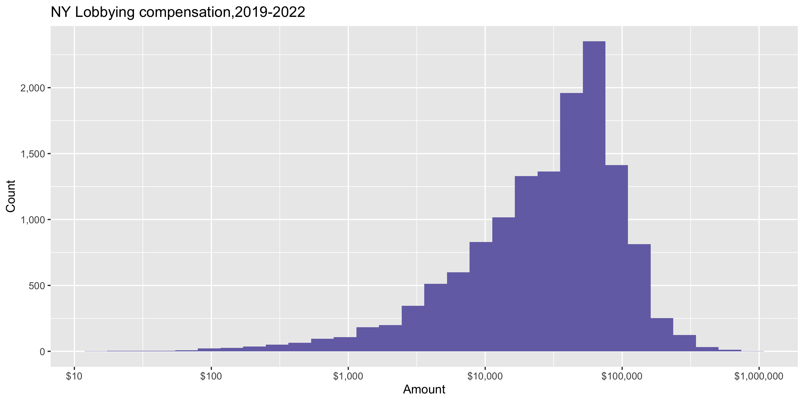
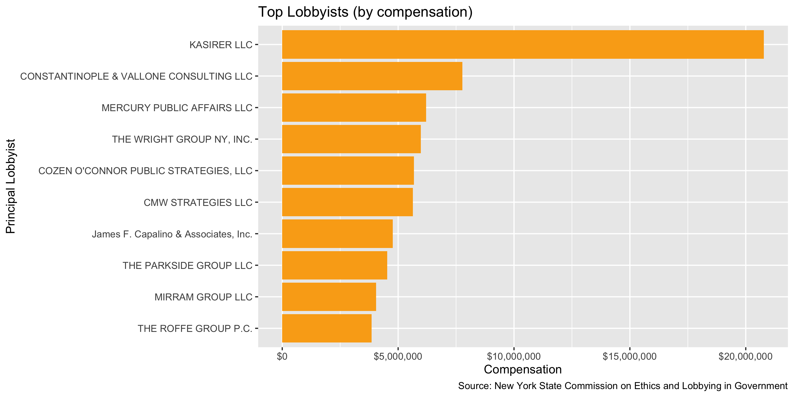
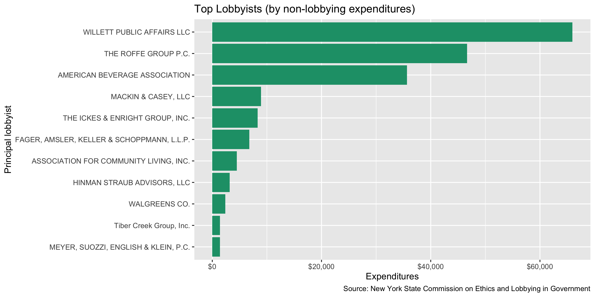

New York Lobbying Expenditure Diary
================
Yanqi Xu
2023-09-04 14:18:36

- [Project](#project)
- [Objectives](#objectives)
- [Packages](#packages)
- [Data](#data)
- [Explore](#explore)
- [Conclude](#conclude)
- [Export](#export)

<!-- Place comments regarding knitting here -->

## Project

The Accountability Project is an effort to cut across data silos and
give journalists, policy professionals, activists, and the public at
large a simple way to search across huge volumes of public data about
people and organizations.

Our goal is to standardizing public data on a few key fields by thinking
of each dataset row as a transaction. For each transaction there should
be (at least) 3 variables:

1.  All **parties** to a transaction.
2.  The **date** of the transaction.
3.  The **amount** of money involved.

## Objectives

This document describes the process used to complete the following
objectives:

1.  How many records are in the database?
2.  Check for entirely duplicated records.
3.  Check ranges of continuous variables.
4.  Is there anything blank or missing?
5.  Check for consistency issues.
6.  Create a five-digit ZIP Code called `zip`.
7.  Create a `year` field from the transaction date.
8.  Make sure there is data on both parties to a transaction.

## Packages

The following packages are needed to collect, manipulate, visualize,
analyze, and communicate these results. The `pacman` package will
facilitate their installation and attachment.

The IRW’s `campfin` package will also have to be installed from GitHub.
This package contains functions custom made to help facilitate the
processing of campaign finance data.

``` r
if (!require("pacman")) install.packages("pacman")
pacman::p_load_gh("irworkshop/campfin")
pacman::p_load(
  pdftools, #wrangle pdf files
  readxl, #read excel files
  rvest, # used to scrape website and get html elements
  tidyverse, # data manipulation
  stringdist, # calculate distances between strings
  lubridate, # datetime strings
  magrittr, # pipe opperators
  janitor, # dataframe clean
  refinr, # cluster and merge
  scales, # format strings
  knitr, # knit documents
  vroom, # read files fast
  httr, # http queries
  glue, # combine strings
  here, # relative storage
  fs # search storage 
)
```

This document should be run as part of the `R_campfin` project, which
lives as a sub-directory of the more general, language-agnostic
[`irworkshop/accountability_datacleaning`](https://github.com/irworkshop/accountability_datacleaning)
GitHub repository.

The `R_campfin` project uses the [Rstudio
projects](https://support.rstudio.com/hc/en-us/articles/200526207-Using-Projects "Rproj")
feature and should be run as such. The project also uses the dynamic
`here::here()` tool for file paths relative to *your* machine.

``` r
# where does this document knit?
here::here()
#> [1] "/Users/yanqixu/code/accountability_datacleaning"
```

## Data

The [New York State Joint Commission on Public
Ethics](https://reports.ethics.ny.gov/publicreports/Default.aspx)
started a new system for lobbyist registration from 2019 on.

For lobbying expenditure records, we will download the \[lobbyist
dataset\]\[<https://reports.ethics.ny.gov/publicreports/Default.aspx?r=01-LobbyistDataset>\]
generated from the \[public search
query\]\[<https://reports.ethics.ny.gov/PublicQuery>\] page. Data is
available from 2019 to 2023, with 2020 data being the same as 2019, and
2022 the same as 2021. In this update, we’ll run the script to process
2019-2022. \## Import

### Setting up Raw Data Directory

``` r
raw_dir <- dir_create(here("state","ny", "lobby", "exp", "data", "raw"))
```

### Read

Note that since there’s not an easy way of determining date of
expenditures, we create a `year` field that’s the first year of the
two-year report period. For example, if the record comes from the
2019-2020 report, the year field would be 2019.

``` r
nyle <- read_csv(dir_ls(raw_dir, regexp =".+LobbyistDataset.+.csv"),id="path") %>% clean_names()

nyle <- nyle %>% rename(contractual_client = client1,
                        beneficial_client = bene1)
```

``` r
nyle <- nyle %>% 
  mutate(year = str_extract(path, "\\d{4}")) %>% 
  select(-path)
```

We will convert the string columns to numeric.

``` r
nyle <- nyle %>% 
  mutate(across(5:8, ~ str_remove(.,"^\\$") %>% str_remove(",") %>% as.numeric()))
```

## Explore

``` r
head(nyle)
#> # A tibble: 6 × 9
#>   principal_lobbyist                  contr…¹ benef…² type_…³ compe…⁴ reimb…⁵ non_l…⁶ coali…⁷ year 
#>   <chr>                               <chr>   <chr>   <chr>     <dbl>   <dbl>   <dbl>   <dbl> <chr>
#> 1 1199 SEIU UNITED HEALTHCARE WORKER… 1199 S… 1199 S… Employ…   10000       0   39109       0 2019 
#> 2 17 Forward 86, Inc.                 17 For… 17 For… Employ…       0       0       0       0 2019 
#> 3 350.org                             350.org 350.org Employ…   24783       0    8753       0 2019 
#> 4 5 STAR STRATEGIC PARTNERS LLC       WILLIA… WILLIA… Retain…   50000       0       0       0 2019 
#> 5 99 SOLUTIONS, LLC                   Acreag… Acreag… Retain…   60000       0       0       0 2019 
#> 6 99 SOLUTIONS, LLC                   AMERIC… AMERIC… Retain…   52500       0       0       0 2019 
#> # … with abbreviated variable names ¹​contractual_client, ²​beneficial_client, ³​type_lob_rel,
#> #   ⁴​compensation, ⁵​reimbursed_expenses, ⁶​non_lobbying_exp, ⁷​coalition_contribution
tail(nyle)
#> # A tibble: 6 × 9
#>   principal_lobbyist contractual_client       benef…¹ type_…² compe…³ reimb…⁴ non_l…⁵ coali…⁶ year 
#>   <chr>              <chr>                    <chr>   <chr>     <dbl>   <dbl>   <dbl>   <dbl> <chr>
#> 1 ZGA, LLC           FARM CREDIT EAST, ACA    FARM C… Retain…   12798       0       0       0 2021 
#> 2 ZGA, LLC           New York Green Industry… New Yo… Retain…   19500       0       0       0 2021 
#> 3 ZGA, LLC           NORTHEAST AGRIBUSINESS … NORTHE… Retain…    3996       0     319       0 2021 
#> 4 ZGA, LLC           NORTHEAST DAIRY PRODUCE… NORTHE… Retain…   24000       0     396       0 2021 
#> 5 ZGA, LLC           SYNGENTA CROP PROTECTIO… SYNGEN… Retain…   25002       0       0       0 2021 
#> 6 ZGA, LLC           Vegetable Growers Assoc… Vegeta… Retain…   24000       0     319       0 2021 
#> # … with abbreviated variable names ¹​beneficial_client, ²​type_lob_rel, ³​compensation,
#> #   ⁴​reimbursed_expenses, ⁵​non_lobbying_exp, ⁶​coalition_contribution
glimpse(sample_n(nyle, 20))
#> Rows: 20
#> Columns: 9
#> $ principal_lobbyist     <chr> "DAVIDOFF HUTCHER & CITRON LLP", "BOLTON-ST. JOHNS, LLC", "CARL AN…
#> $ contractual_client     <chr> "NEW FULTON FISH MARKET COOPERATIVE AT HUNTS POINT, INC. (THE)", "…
#> $ beneficial_client      <chr> "NEW FULTON FISH MARKET COOPERATIVE AT HUNTS POINT, INC. (THE)", "…
#> $ type_lob_rel           <chr> "Retained", "Retained", "Retained", "Retained", "Retained", "Retai…
#> $ compensation           <dbl> 60000, 18500, 72000, 60000, 10000, 108000, 34040, 93, 20000, 6000,…
#> $ reimbursed_expenses    <dbl> 0, 0, 0, 18, 0, 0, 0, 0, 0, 0, 0, 0, 0, 1715, 50, 0, 0, 0, 0, 0
#> $ non_lobbying_exp       <dbl> 1450, 396, 0, 18, 0, 0, 384, 117, 1538, 202, 0, 312, 293, 1744, 50…
#> $ coalition_contribution <dbl> 0, 0, 0, 0, 0, 0, 0, 0, 0, 0, 0, 0, 0, 0, 0, 0, 0, 0, 0, 0
#> $ year                   <chr> "2021", "2021", "2020", "2021", "2019", "2020", "2019", "2021", "2…
```

### Missing

``` r
col_stats(nyle, count_na)
#> # A tibble: 9 × 4
#>   col                    class     n        p
#>   <chr>                  <chr> <int>    <dbl>
#> 1 principal_lobbyist     <chr>     0 0       
#> 2 contractual_client     <chr>     0 0       
#> 3 beneficial_client      <chr>     0 0       
#> 4 type_lob_rel           <chr>     0 0       
#> 5 compensation           <dbl>     5 0.000289
#> 6 reimbursed_expenses    <dbl>     8 0.000463
#> 7 non_lobbying_exp       <dbl>    16 0.000926
#> 8 coalition_contribution <dbl>     0 0       
#> 9 year                   <chr>     0 0
```

There are many fields missing,m especially for fields in columns after
`total_reimbursed`.

### Duplicates

Running the following commands shows that there are over a thousand
entries with totally identical information when we exclude the time
period we created. We will note that in the `dupe_flag` column.

We will exclude all the

``` r
nyle <- flag_dupes(nyle, 1:(ncol(nyle)-1))
sum(nyle$dupe_flag)
#> [1] 2734
```

### Categorical

``` r
col_stats(nyle, n_distinct)
#> # A tibble: 10 × 4
#>    col                    class     n        p
#>    <chr>                  <chr> <int>    <dbl>
#>  1 principal_lobbyist     <chr>  1534 0.0888  
#>  2 contractual_client     <chr>  5801 0.336   
#>  3 beneficial_client      <chr>  5900 0.341   
#>  4 type_lob_rel           <chr>     2 0.000116
#>  5 compensation           <dbl>  3880 0.225   
#>  6 reimbursed_expenses    <dbl>   694 0.0402  
#>  7 non_lobbying_exp       <dbl>  2455 0.142   
#>  8 coalition_contribution <dbl>    59 0.00341 
#>  9 year                   <chr>     3 0.000174
#> 10 dupe_flag              <lgl>     2 0.000116
```

### Amounts

<!-- --> We can take a look at the
top compensated principal lobbyists.

``` r
nyle %>% 
  filter(compensation>1 & dupe_flag) %>% 
  group_by(principal_lobbyist) %>% 
  summarize(total_comp = sum(compensation)) %>% 
  arrange(desc(total_comp)) %>% 
  top_n(10) %>% 
  ggplot(aes(x = total_comp, y = reorder(principal_lobbyist, total_comp))) + 
  geom_col() + 
  scale_x_continuous(
    labels = dollar
  ) +
  geom_col(fill = "#FAAB18") + 
    labs(
    title = "Top Lobbyists (by compensation)",
    caption = "Source: New York State Commission on Ethics and Lobbying in Government",
    x = "Compensation",
    y = "Principal Lobbyist"
  )
```

<!-- -->

Similarly, we can look at which principal lobbyists spent the most on
non-lobbying expenditures

``` r

nyle %>% 
  filter(compensation>1 & dupe_flag) %>% 
  group_by(principal_lobbyist) %>% 
  summarize(total_exp = sum(non_lobbying_exp)) %>% 
  arrange(desc(total_exp)) %>% 
  top_n(10) %>% 
  ggplot(aes(x = total_exp, y = reorder(principal_lobbyist, total_exp))) + 
  geom_col() + 
  scale_x_continuous(
    labels = dollar
  ) +
  geom_col(fill = RColorBrewer::brewer.pal(3, "Dark2")[1]) + 
    labs(
    title = "Top Lobbyists (by non-lobbying expenditures)",
    caption = "Source: New York State Commission on Ethics and Lobbying in Government",
    x = "Expenditures",
    y = "Principal lobbyist"
  )
```

<!-- -->

## Conclude

``` r
glimpse(sample_n(nyle, 20))
#> Rows: 20
#> Columns: 10
#> $ principal_lobbyist     <chr> "NICHOLAS & LENCE COMMUNICATIONS LLC", "GOOD SHEPHERD SERVICES", "…
#> $ contractual_client     <chr> "The Lincoln Square District Management Association, Inc.", "GOOD …
#> $ beneficial_client      <chr> "The Lincoln Square District Management Association, Inc.", "GOOD …
#> $ type_lob_rel           <chr> "Retained", "Employed", "Retained", "Employed", "Retained", "Retai…
#> $ compensation           <dbl> 12000, 47652, 90000, 104287, 57000, 85000, 9000, 90000, 0, 4200, 1…
#> $ reimbursed_expenses    <dbl> 0, 0, 0, 0, 0, 0, 0, 0, 0, 0, 0, 0, 0, 0, 0, 0, 0, 36, 0, 0
#> $ non_lobbying_exp       <dbl> 0, 0, 0, 2751, 1997, 0, 375, 0, 0, 0, 0, 0, 0, 0, 0, 2022, 1548, 3…
#> $ coalition_contribution <dbl> 0, 0, 0, 0, 0, 0, 0, 0, 0, 0, 0, 0, 0, 0, 0, 0, 0, 0, 0, 0
#> $ year                   <chr> "2021", "2019", "2019", "2021", "2019", "2020", "2019", "2021", "2…
#> $ dupe_flag              <lgl> TRUE, FALSE, FALSE, FALSE, FALSE, FALSE, FALSE, TRUE, TRUE, FALSE,…
```

1.  There are 17282 records in the database.
2.  There are 2734 duplicate records in the database.
3.  The range and distribution of `amount` and `date` seem reasonable.
4.  There are 0 records missing either recipient or date.
5.  Consistency in goegraphic data has been improved with
    `campfin::normal_*()`.
6.  The 4-digit `YEAR` variable has been created with
    `lubridate::year()`.

## Export

``` r
clean_dir <- dir_create(here("state","ny", "lobby", "data", "processed","exp"))
```

``` r
write_csv(
  x = nyle,
  path = path(clean_dir, "ny_lob_exp_2019-2022.csv"),
  na = ""
)
```

### Dictionary
