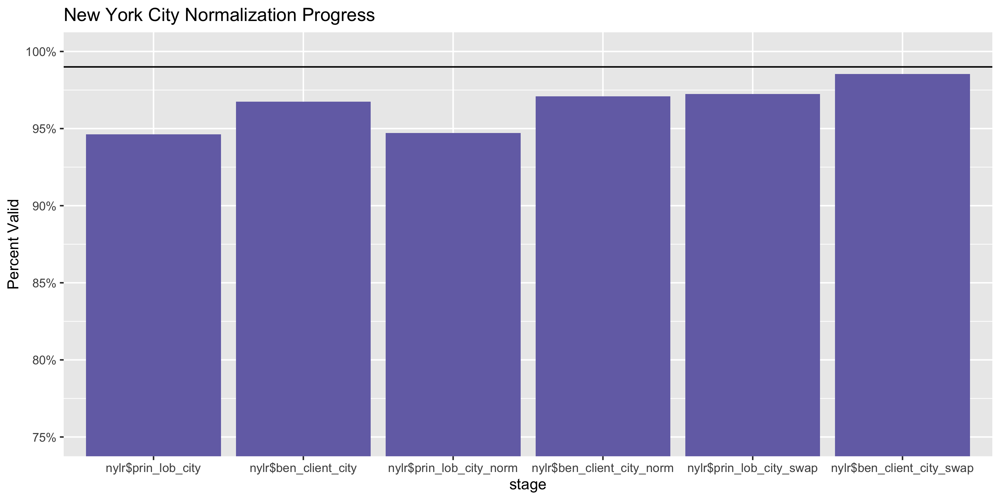
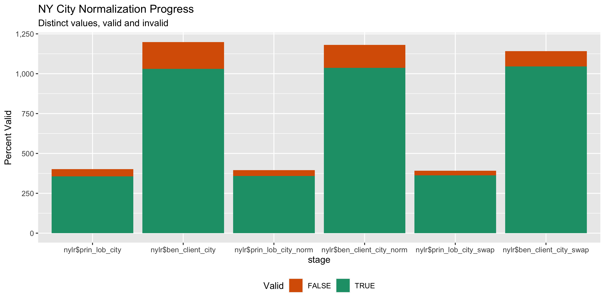

New York Lobbying Registration Diary
================
Yanqi Xu
2023-09-04 22:51:33

- [Project](#project)
- [Objectives](#objectives)
- [Packages](#packages)
- [Data](#data)
- [Explore](#explore)
- [Wrangle](#wrangle)
- [Conclude](#conclude)
- [Rename](#rename)
- [Export](#export)

<!-- Place comments regarding knitting here -->

## Project

The Accountability Project is an effort to cut across data silos and
give journalists, policy professionals, activists, and the public at
large a simple way to search across huge volumes of public data about
people and organizations.

Our goal is to standardizing public data on a few key fields by thinking
of each dataset row as a transaction. For each transaction there should
be (at least) 3 variables:

1.  All **parties** to a transaction.
2.  The **date** of the transaction.
3.  The **amount** of money involved.

## Objectives

This document describes the process used to complete the following
objectives:

1.  How many records are in the database?
2.  Check for entirely duplicated records.
3.  Check ranges of continuous variables.
4.  Is there anything blank or missing?
5.  Check for consistency issues.
6.  Create a five-digit ZIP Code called `zip`.
7.  Create a `year` field from the transaction date.
8.  Make sure there is data on both parties to a transaction.

## Packages

The following packages are needed to collect, manipulate, visualize,
analyze, and communicate these results. The `pacman` package will
facilitate their installation and attachment.

The IRW’s `campfin` package will also have to be installed from GitHub.
This package contains functions custom made to help facilitate the
processing of campaign finance data.

``` r
if (!require("pacman")) install.packages("pacman")
pacman::p_load_gh("irworkshop/campfin")
pacman::p_load(
  pdftools, #wrangle pdf files
  readxl, #read excel files
  rvest, # used to scrape website and get html elements
  tidyverse, # data manipulation
  stringdist, # calculate distances between strings
  lubridate, # datetime strings
  magrittr, # pipe opperators
  janitor, # dataframe clean
  refinr, # cluster and merge
  scales, # format strings
  knitr, # knit documents
  vroom, # read files fast
  httr, # http queries
  glue, # combine strings
  here, # relative storage
  fs # search storage 
)
```

This document should be run as part of the `R_campfin` project, which
lives as a sub-directory of the more general, language-agnostic
[`irworkshop/accountability_datacleaning`](https://github.com/irworkshop/accountability_datacleaning)
GitHub repository.

The `R_campfin` project uses the [Rstudio
projects](https://support.rstudio.com/hc/en-us/articles/200526207-Using-Projects "Rproj")
feature and should be run as such. The project also uses the dynamic
`here::here()` tool for file paths relative to *your* machine.

``` r
# where does this document knit?
here::here()
#> [1] "/Users/yanqixu/code/accountability_datacleaning"
```

## Data

The [New York State Joint Commission on Public
Ethics](https://reports.ethics.ny.gov/publicreports/Default.aspx)
started a new system for lobbyist registration from 2019 on. For data
between 2011 and 2018, see `nylr_reg_diary.Rmd` for data processing
notes.

For lobbying registration records, we will download the data generated
from the \[public search
query\]\[<https://reports.ethics.ny.gov/PublicQuery>\] page. Go to
\[public search query\]\[<https://reports.ethics.ny.gov/PublicQuery>\]
and select by year. Data is available from 2019 to 2023, with 2020 data
being the same as 2019, and 2022 the same as 2021. In this update, we’ll
run the script to process the 2019-2022 data.

There are two different types of clients. \> A Contractual Client means
an individual or Organization that retains the services of a Lobbyist
for the benefit of itself or another.

> A Beneficial Client is the specific individual or Organization on
> whose behalf and at whose request Lobbying Activity is conducted.

> An individual or Organization that lobbies on its own behalf is both
> the Beneficial Client and the Contractual Client. While a Contractual
> and Beneficial Client must be identified for every lobbying
> arrangement, the Contractual Client may also be the Beneficial Client.

> Lobbyist includes the lobbying firm or organization (the Principal
> Lobbyist for filing purposes) and every person identified on a
> Statement of Registration, as well as any equity partners, officers,
> or directors of the organization who operate out of the same
> geographic office as any person identified on a Statement of
> Registration. \## Import

### Setting up Raw Data Directory

``` r
raw_dir <- dir_create(here("state","ny", "lobby", "reg", "data", "raw"))
```

### Read

``` r
nylr <- dir_ls(raw_dir, regexp =".+Search.+.xlsx")  %>% map_dfr(read_xlsx) %>% clean_names()

nylr <- nylr %>% select(-associated_filings)

nylr <- nylr %>% rename(ind_lob = individual_lobbyist_s,
                        co_sub_lob = co_lobbyist_s_sub_lobbyist_s,
                        prin_lob = principal_lobbyist) %>% 
  mutate_all(str_remove, "^\r\n")
```

### Separate address

The name and address of principal lobbyists, clients and beneficial
clients are all in the same field. We will first separate these fields.

``` r
nylr <- nylr %>% 
  separate(
    col = prin_lob,
    into = c("prin_lob_name", "state_zip"),
    sep = "\r\n\r\n",
    remove = FALSE,
    extra = "merge",
    fill = "left"
  ) 
  
 nylr <- nylr %>%  
  mutate(st_zip = str_extract(state_zip, "(?<=,\\s)[A-Z]{2}\\s\\d{5}"),
    prin_lob_state = str_extract(st_zip,"[A-Z]{2}"),     
    prin_lob_zip = str_remove(st_zip, "[A-Z]{2}") %>% str_trim(),
    addr_city = str_remove(state_zip, ",\\s[A-Z]{2}\\s\\d{5}.*\r\n") %>% str_trim(),
    prin_lob_city = str_extract(addr_city, "(?<=\r\n).+$"),
    prin_lob_addr = str_remove(addr_city,"\r\n.+$") %>% str_trim()
      # separate(col, into = c("a", "b"), sep="\r\n(?=[^\r\n]+$)")
         ) %>% 
   select(-c(state_zip, addr_city, st_zip))
```

We will repeat the process for `contractual_client` and
`beneficial_client`.

``` r
nylr <- nylr %>% 
  separate(
    col = contractual_client,
    into = c("cont_client_name", "state_zip"),
    sep = "\r\n\r\n",
    remove = FALSE,
    extra = "merge",
    fill = "left"
  ) 
  
 nylr <- nylr %>%  
  mutate(st_zip = str_extract(state_zip, "(?<=,\\s).+\\s\\d{5}"),
    cont_client_state = str_extract(st_zip,".+(?=\\s\\d{5})"),     
    cont_client_zip = str_remove(st_zip, cont_client_state) %>% str_trim(),
    addr_city = str_remove(state_zip, ",\\s.+\\s\\d{5}.*"),
    cont_client_city = str_extract(addr_city, "(?<=\r\n)[^\r]+\r\n\r\n") %>% str_trim(),
    cont_client_addr = str_remove(addr_city, cont_client_city) %>% str_trim()
      # separate(col, into = c("a", "b"), sep="\r\n(?=[^\r\n]+$)")
         ) %>% 
   select(-c(state_zip, addr_city, st_zip))
```

``` r
nylr <- nylr %>% 
  separate(
    col = beneficial_client,
    into = c("ben_client_name", "state_zip"),
    sep = "\r\n\r\n",
    remove = FALSE,
    extra = "merge",
    fill = "left"
  ) 
  
 nylr <- nylr %>%  
  mutate(st_zip = str_extract(state_zip, "(?<=,\\s).+\\s\\d{5}"),
    #ben_client_state = str_extract(st_zip,".+(?=\\s\\d{5})"),     
    ben_client_state = str_extract(st_zip,campfin::rx_state),     
    ben_client_zip = str_remove(st_zip, ben_client_state) %>% str_extract(campfin::rx_zip) %>% str_trim(),
    addr_city = str_remove(state_zip, ",\\s.+\\s\\d{5}.*"),
    ben_client_city = str_extract(addr_city, "(?<=\r\n)[^\r]+(?=\r\n\r\n)") %>% str_trim() %>% replace(., .%in% c("TH FLOOR", "SUITE\\s*\\d*"), NA_character_),
    ben_client_addr = str_remove(addr_city, ben_client_city) %>% str_trim()
      # separate(col, into = c("a", "b"), sep="\r\n(?=[^\r\n]+$)")
         ) %>% 
   select(-c(state_zip, addr_city, st_zip))
   
nlyr <- nylr %>% 
     mutate(across(starts_with("ben_"), str_trim))
  
```

## Explore

``` r
head(nylr)
#> # A tibble: 6 × 21
#>   year      prin_…¹ prin_…² ind_lob co_su…³ contr…⁴ cont_…⁵ benef…⁶ ben_c…⁷ prin_…⁸ prin_…⁹ prin_…˟
#>   <chr>     <chr>   <chr>   <chr>   <chr>   <chr>   <chr>   <chr>   <chr>   <chr>   <chr>   <chr>  
#> 1 2019 - 2… "1199 … "1199 … "GABRI… <NA>    "1199 … "1199 … "1199 … "1199 … NY      12210   ALBANY 
#> 2 2019 - 2… "17 FO… "17 FO… "MICHA… <NA>    "17 FO… "17 FO… "17 FO… "17 FO… NJ      08527   JACKSON
#> 3 2019 - 2… "350.O… "350.O… "RICHA… <NA>    "350.O… "350.O… "350.O… "350.O… NY      11201   BROOKL…
#> 4 2019 - 2… "5 STA… "5 STA… "TYQUA… <NA>    "WILLI… "WILLI… "WILLI… "WILLI… NY      10007   NEW YO…
#> 5 2019 - 2… "6163 … "6163 …  <NA>   <NA>    "ROSEN… "ROSEN… "ROSEN… "ROSEN… IL      60661   CHICAGO
#> 6 2019 - 2… "99 SO… "99 SO… "JACQU… <NA>    "FLEET… "FLEET… "FLEET… "FLEET… NY      11201   BROOKL…
#> # … with 9 more variables: prin_lob_addr <chr>, cont_client_state <chr>, cont_client_zip <chr>,
#> #   cont_client_city <chr>, cont_client_addr <chr>, ben_client_state <chr>, ben_client_zip <chr>,
#> #   ben_client_city <chr>, ben_client_addr <chr>, and abbreviated variable names ¹​prin_lob,
#> #   ²​prin_lob_name, ³​co_sub_lob, ⁴​contractual_client, ⁵​cont_client_name, ⁶​beneficial_client,
#> #   ⁷​ben_client_name, ⁸​prin_lob_state, ⁹​prin_lob_zip, ˟​prin_lob_city
tail(nylr)
#> # A tibble: 6 × 21
#>   year      prin_…¹ prin_…² ind_lob co_su…³ contr…⁴ cont_…⁵ benef…⁶ ben_c…⁷ prin_…⁸ prin_…⁹ prin_…˟
#>   <chr>     <chr>   <chr>   <chr>   <chr>   <chr>   <chr>   <chr>   <chr>   <chr>   <chr>   <chr>  
#> 1 2021 - 2… "ZGA, … ZGA, L… "PAUL … "THE V… "NEW Y… NEW YO… "NEW Y… NEW YO… NY      12210   ALBANY 
#> 2 2021 - 2… "ZGA, … ZGA, L… "PAUL …  <NA>   "NORTH… NORTHE… "NORTH… NORTHE… NY      12210   ALBANY 
#> 3 2021 - 2… "ZGA, … ZGA, L… "PAUL …  <NA>   "VEGET… VEGETA… "VEGET… VEGETA… NY      12210   ALBANY 
#> 4 2021 - 2… "ZGA, … ZGA, L… "PAUL …  <NA>   "NORTH… NORTHE… "NORTH… NORTHE… NY      12210   ALBANY 
#> 5 2021 - 2… "ZGA, … ZGA, L… "PAUL …  <NA>   "BIOTE… BIOTEC… "BIOTE… BIOTEC… NY      12210   ALBANY 
#> 6 2021 - 2… "ZURIC… ZURICH… "KATHL…  <NA>   "ZURIC… ZURICH… "ZURIC… ZURICH… NH      03260   NORTH …
#> # … with 9 more variables: prin_lob_addr <chr>, cont_client_state <chr>, cont_client_zip <chr>,
#> #   cont_client_city <chr>, cont_client_addr <chr>, ben_client_state <chr>, ben_client_zip <chr>,
#> #   ben_client_city <chr>, ben_client_addr <chr>, and abbreviated variable names ¹​prin_lob,
#> #   ²​prin_lob_name, ³​co_sub_lob, ⁴​contractual_client, ⁵​cont_client_name, ⁶​beneficial_client,
#> #   ⁷​ben_client_name, ⁸​prin_lob_state, ⁹​prin_lob_zip, ˟​prin_lob_city
glimpse(sample_n(nylr, 20))
#> Rows: 20
#> Columns: 21
#> $ year               <chr> "2021 - 2022", "2021 - 2022", "2021 - 2022", "2019 - 2020", "2019 - 20…
#> $ prin_lob           <chr> "RG GROUP \r\n\r\n29-12 161ST\r\nFLUSHING , NY 11358\r\n\r\n\r\n", "NE…
#> $ prin_lob_name      <chr> "RG GROUP ", "NEW YORK STATE SOCIETY OF DERMATOLOGY AND DERMATOLOGICAL…
#> $ ind_lob            <chr> "CATHERINE GIULIANI \r\nALAN ROSENBERG \r\nGREGORY MITCHELL \r\n", "LI…
#> $ co_sub_lob         <chr> NA, NA, NA, NA, NA, NA, NA, NA, NA, NA, NA, NA, NA, NA, NA, NA, NA, NA…
#> $ contractual_client <chr> "COMMVAULT SYSTEMS, INC.\r\n\r\n1 COMMVAULT WAY\r\nTINTON FALLS, NJ 07…
#> $ cont_client_name   <chr> "COMMVAULT SYSTEMS, INC.", "NEW YORK STATE SOCIETY OF DERMATOLOGY AND …
#> $ beneficial_client  <chr> "COMMVAULT SYSTEMS, INC.\r\n\r\n1 COMMVAULT WAY\r\nTINTON FALLS, NJ 07…
#> $ ben_client_name    <chr> "COMMVAULT SYSTEMS, INC.", "NEW YORK STATE SOCIETY OF DERMATOLOGY AND …
#> $ prin_lob_state     <chr> "NY", "NY", "NY", "NY", "NY", "NY", "NY", "NY", "NY", "NY", "NY", "NY"…
#> $ prin_lob_zip       <chr> "11358", "12207", "10962", "12207", "10005", "12207", "11241", "11436"…
#> $ prin_lob_city      <chr> "FLUSHING", "ALBANY", "ORANGEBURGH", "ALBANY", "NEW YORK", "ALBANY", "…
#> $ prin_lob_addr      <chr> "29-12 161ST", "136 STATE STREET", "2 BRIARWOOD LANE", "21 ELK STREET"…
#> $ cont_client_state  <chr> "NJ", "NY", "NY", "CA", "NY", "NY", "NY", "NY", "NJ", "NY", "VA", "NY"…
#> $ cont_client_zip    <chr> "07724", "12207", "10111", "92108", "10005", "11563", "10016", "14624"…
#> $ cont_client_city   <chr> "TINTON FALLS", "ALBANY", "NEW YORK", "SAN DIEGO", "NEW YORK", "LYNBRO…
#> $ cont_client_addr   <chr> "1 COMMVAULT WAY", "136 STATE STREET", "45 ROCKEFELLER PLAZA", "350 CA…
#> $ ben_client_state   <chr> "NJ", "NY", "NY", "CA", "NY", "NY", "NY", "NY", "NJ", "NY", "VA", "NY"…
#> $ ben_client_zip     <chr> "07724", "12207", "10111", "92108", "10005", "11563", "10016", "14624"…
#> $ ben_client_city    <chr> "TINTON FALLS", "ALBANY", "NEW YORK", "SAN DIEGO", "NEW YORK", "LYNBRO…
#> $ ben_client_addr    <chr> "1 COMMVAULT WAY", "136 STATE STREET", "45 ROCKEFELLER PLAZA", "350 CA…
```

### Missing

``` r
col_stats(nylr, count_na)
#> # A tibble: 21 × 4
#>    col                class     n        p
#>    <chr>              <chr> <int>    <dbl>
#>  1 year               <chr>     0 0       
#>  2 prin_lob           <chr>     3 0.000207
#>  3 prin_lob_name      <chr>     3 0.000207
#>  4 ind_lob            <chr>   344 0.0237  
#>  5 co_sub_lob         <chr> 14248 0.983   
#>  6 contractual_client <chr>     3 0.000207
#>  7 cont_client_name   <chr>     3 0.000207
#>  8 beneficial_client  <chr>     3 0.000207
#>  9 ben_client_name    <chr>     3 0.000207
#> 10 prin_lob_state     <chr>    11 0.000759
#> 11 prin_lob_zip       <chr>    11 0.000759
#> 12 prin_lob_city      <chr>     3 0.000207
#> 13 prin_lob_addr      <chr>     3 0.000207
#> 14 cont_client_state  <chr>    38 0.00262 
#> 15 cont_client_zip    <chr>    38 0.00262 
#> 16 cont_client_city   <chr>     3 0.000207
#> 17 cont_client_addr   <chr>     3 0.000207
#> 18 ben_client_state   <chr>    42 0.00290 
#> 19 ben_client_zip     <chr>    42 0.00290 
#> 20 ben_client_city    <chr>     3 0.000207
#> 21 ben_client_addr    <chr>     3 0.000207
```

There are many fields missing,m especially for fields in columns after
`total_reimbursed`.

### Duplicates

Running the following commands shows that there are over a thousand
entries with totally identical information. Since each of them contain
`total_compensation` and `total_reimbursed` for a certain period, there
should be only one such entry for each corresponding time period. We
will note that in the `dupe_flag` column.

``` r
nylr <- flag_dupes(nylr, dplyr::everything())
sum(nylr$dupe_flag)
#> [1] 2
```

### Categorical

``` r
col_stats(nylr, n_distinct)
#> # A tibble: 22 × 4
#>    col                class     n        p
#>    <chr>              <chr> <int>    <dbl>
#>  1 year               <chr>     2 0.000138
#>  2 prin_lob           <chr>  1992 0.137   
#>  3 prin_lob_name      <chr>  1822 0.126   
#>  4 ind_lob            <chr>  5491 0.379   
#>  5 co_sub_lob         <chr>    92 0.00635 
#>  6 contractual_client <chr>  7822 0.540   
#>  7 cont_client_name   <chr>  7227 0.499   
#>  8 beneficial_client  <chr>  7876 0.544   
#>  9 ben_client_name    <chr>  7177 0.495   
#> 10 prin_lob_state     <chr>    38 0.00262 
#> 11 prin_lob_zip       <chr>   622 0.0429  
#> 12 prin_lob_city      <chr>   401 0.0277  
#> 13 prin_lob_addr      <chr>  1768 0.122   
#> 14 cont_client_state  <chr>    96 0.00663 
#> 15 cont_client_zip    <chr>  1817 0.125   
#> 16 cont_client_city   <chr>  1191 0.0822  
#> 17 cont_client_addr   <chr>  6967 0.481   
#> 18 ben_client_state   <chr>    60 0.00414 
#> 19 ben_client_zip     <chr>  1818 0.125   
#> 20 ben_client_city    <chr>  1198 0.0827  
#> 21 ben_client_addr    <chr>  7073 0.488   
#> 22 dupe_flag          <lgl>     2 0.000138
```

## Wrangle

To improve the searchability of the database, we will perform some
consistent, confident string normalization. For geographic variables
like city names and ZIP codes, the corresponding `campfin::normal_*()`
functions are taylor made to facilitate this process.

### Address

For the street `addresss` variable, the `campfin::normal_address()`
function will force consistence case, remove punctuation, and
abbreviation official USPS suffixes.

``` r
nylr <- nylr %>% 
    mutate_at(.vars = vars(ends_with('addr')), .funs = list(norm = ~ normal_address(.,abbs = usps_street,
      na_rep = TRUE)))
```

``` r
nylr %>% 
  select(contains("addr")) %>% 
  distinct() %>% 
  sample_n(10) %>% 
  glimpse()
#> Rows: 10
#> Columns: 6
#> $ prin_lob_addr         <chr> "120 BROADWAY\r\nSUITE 1010", "5500 HAVEN STREET", "321 BROADWAY\r\…
#> $ cont_client_addr      <chr> "6 SAINT JOHNS LN\r\n7TH FLOOR", "5500 HAVEN STREET", "76 TRINITY P…
#> $ ben_client_addr       <chr> "6 SAINT JOHNS LN\r\n7TH FLOOR", "5500 HAVEN STREET", "76 TRINITY P…
#> $ prin_lob_addr_norm    <chr> "120 BROADWAY SUITE 1010", "5500 HAVEN ST", "321 BROADWAY 2ND FL", …
#> $ cont_client_addr_norm <chr> "6 SAINT JOHNS LN 7TH FL", "5500 HAVEN ST", "76 TRINITY PL", "1110 …
#> $ ben_client_addr_norm  <chr> "6 SAINT JOHNS LN 7TH FL", "5500 HAVEN ST", "76 TRINITY PL", "1110 …
```

### ZIP

The zipcode fields are largely valid and canwoe can’t really improve the
accuracy with `zip_norm`, so we will leave them as is.

``` r
progress_table(
  nylr$prin_lob_zip,
  nylr$ben_client_zip,
  compare = valid_zip
)
#> # A tibble: 2 × 6
#>   stage               prop_in n_distinct  prop_na n_out n_diff
#>   <chr>                 <dbl>      <dbl>    <dbl> <dbl>  <dbl>
#> 1 nylr$prin_lob_zip     0.997        622 0.000759    38      4
#> 2 nylr$ben_client_zip   0.997       1818 0.00290     40     23
```

### State

Valid two digit state abbreviations can be made using the
`campfin::normal_state()` function.

``` r
nylr <- nylr %>% 
   mutate_at(.vars = vars(ends_with('state')), .funs = list(norm = ~ normal_state(.,abbreviate = TRUE,
      na_rep = TRUE,
      valid = valid_state)))
```

``` r
nylr %>% 
  filter(prin_lob_state != prin_lob_state_norm) %>% 
  count(prin_lob_state, sort = TRUE)
#> # A tibble: 0 × 2
#> # … with 2 variables: prin_lob_state <chr>, n <int>
```

``` r
nylr %>% 
  filter(ben_client_state != ben_client_state_norm) %>% 
  count(ben_client_state, sort = TRUE)
#> # A tibble: 0 × 2
#> # … with 2 variables: ben_client_state <chr>, n <int>
```

``` r
progress_table(
  nylr$prin_lob_state,
  nylr$prin_lob_state_norm,
  nylr$ben_client_state,
  nylr$ben_client_state_norm,
  compare = valid_state
)
#> # A tibble: 4 × 6
#>   stage                      prop_in n_distinct  prop_na n_out n_diff
#>   <chr>                        <dbl>      <dbl>    <dbl> <dbl>  <dbl>
#> 1 nylr$prin_lob_state          1             38 0.000759     0      1
#> 2 nylr$prin_lob_state_norm     1             38 0.000759     0      1
#> 3 nylr$ben_client_state        0.999         60 0.00290     20     13
#> 4 nylr$ben_client_state_norm   1             48 0.00428      0      1
```

``` r
nylr <- nylr %>% select(-prin_lob_state_norm)
```

### City

Cities are the most difficult geographic variable to normalize, simply
due to the wide variety of valid cities and formats. \#### Normal

The `campfin::normal_city()` function is a good nylrart, again
converting case, removing punctuation, but *expanding* USPS
abbreviations. We can also remove `invalid_city` values.

``` r
nylr <- nylr %>% 
      mutate_at(.vars = vars(ends_with('city')), .funs = list(norm = ~ normal_city(.,abbs = usps_city,
      states = usps_state,
      na = invalid_city,
      na_rep = TRUE)))

prop_in(nylr$prin_lob_city_norm, valid_city, na.rm = T)
#> [1] 0.9434588
prop_in(nylr$ben_client_city_norm, valid_city, na.rm = T)
#> [1] 0.9585031
```

#### Swap

We can further improve normalization by comparing our normalized value
against the *expected* value for that record’s state abbreviation and
ZIP code. If the normalized value is either an abbreviation for or very
similar to the expected value, we can confidently swap those two.

``` r
nylr <- nylr %>% 
  left_join(
    y = zipcodes,
    by = c(
      "prin_lob_state" = "state",
      "prin_lob_zip" = "zip"
    )
  ) %>% 
  rename(prin_lob_city_match = city) %>% 
  mutate(
    match_abb = is_abbrev(prin_lob_city_norm, prin_lob_city_match),
    match_dist = str_dist(prin_lob_city_norm, prin_lob_city_match),
    prin_lob_city_swap = if_else(
      condition = !is.na(match_dist) & (match_abb | match_dist == 1),
      true = prin_lob_city_match,
      false = prin_lob_city_norm
    )
  ) %>% 
  select(
    -prin_lob_city_match,
    -match_dist,
    -match_abb
  )
```

``` r
nylr <- nylr %>% 
  left_join(
    y = zipcodes,
    by = c(
      "ben_client_state_norm" = "state",
      "ben_client_zip" = "zip"
    )
  ) %>% 
  rename(ben_client_city_match = city) %>% 
  mutate(
    match_abb = is_abbrev(ben_client_city_norm, ben_client_city_match),
    match_dist = str_dist(ben_client_city_norm, ben_client_city_match),
    ben_client_city_swap = if_else(
      condition = !is.na(match_dist) & (match_abb | match_dist == 1),
      true = ben_client_city_match,
      false = ben_client_city_norm
    )
  ) %>% 
  select(
    -ben_client_city_match,
    -match_dist,
    -match_abb
  )
```

After the two normalization steps, the percentage of valid cities is at
100%. \#### Progress

| stage                                                                        | prop_in | n_distinct | prop_na | n_out | n_diff |
|:-----------------------------------------------------------------------------|--------:|-----------:|--------:|------:|-------:|
| nylr$prin_lob_city | 0.946| 401| 0| 778| 45| |nylr$ben_client_city           |   0.967 |       1198 |       0 |   471 |    168 |
| nylr$prin_lob_city_norm | 0.947| 395| 0| 767| 36| |nylr$ben_client_city_norm |   0.971 |       1181 |       0 |   420 |    144 |
| nylr$prin_lob_city_swap | 0.972| 392| 0| 400| 29| |nylr$ben_client_city_swap |   0.985 |       1142 |       0 |   211 |     97 |

You can see how the percentage of valid values increased with each
stage.

<!-- -->

More importantly, the number of distinct values decreased each stage. We
were able to confidently change many distinct invalid values to their
valid equivalent.

``` r
progress %>% 
  select(
    stage, 
    all = n_distinct,
    bad = n_diff
  ) %>% 
  mutate(good = all - bad) %>% 
  pivot_longer(c("good", "bad")) %>% 
  mutate(name = name == "good") %>% 
  ggplot(aes(x = stage, y = value)) +
  geom_col(aes(fill = name)) +
  scale_fill_brewer(palette = "Dark2", direction = -1) +
  scale_y_continuous(labels = comma) +
  theme(legend.position = "bottom") +
  labs(
    title = "NY City Normalization Progress",
    subtitle = "Distinct values, valid and invalid",
    x = "stage",
    y = "Percent Valid",
    fill = "Valid"
  )
```

<!-- -->

### Separate individual lobbyists

We then need to separate individual lobbyists all retained by a single
principal lobbyist.

``` r
nylr <- nylr %>% 
  mutate(ind_lob = str_remove(ind_lob, "\r\n$")) %>% 
  separate_rows(ind_lob, sep = "\r\n")
```

## Conclude

``` r
glimpse(sample_n(nylr, 20))
#> Rows: 20
#> Columns: 32
#> $ year                   <chr> "2019 - 2020", "2021 - 2022", "2021 - 2022", "2019 - 2020", "2021 …
#> $ prin_lob               <chr> "COZEN O'CONNOR PUBLIC STRATEGIES, LLC\r\n\r\n277 PARK AVENUE\r\nN…
#> $ prin_lob_name          <chr> "COZEN O'CONNOR PUBLIC STRATEGIES, LLC", "OSTROFF ASSOCIATES, INC.…
#> $ ind_lob                <chr> "KANA IO ", "REBECCA MARINO ", "RICHARD OSTROFF ", "JULIAN KLINE "…
#> $ co_sub_lob             <chr> NA, NA, NA, NA, NA, NA, NA, NA, NA, NA, NA, NA, NA, NA, NA, NA, "G…
#> $ contractual_client     <chr> "PRATT INSTITUTE\r\n\r\n200 WILLOUGHBY AVENUE\r\nBROOKLYN\r\nNEW Y…
#> $ cont_client_name       <chr> "PRATT INSTITUTE", "ARKER DIVERSIFIED COMPANIES", "NEW YORK INDEPE…
#> $ beneficial_client      <chr> "PRATT INSTITUTE\r\n\r\n200 WILLOUGHBY AVENUE\r\nBROOKLYN\r\nNEW Y…
#> $ ben_client_name        <chr> "PRATT INSTITUTE", "ARKER DIVERSIFIED COMPANIES", "NEW YORK INDEPE…
#> $ prin_lob_state         <chr> "NY", "NY", "NY", "NY", "NY", "NY", "NY", "NY", "NY", "NY", "NY", …
#> $ prin_lob_zip           <chr> "10172", "12207", "12207", "12207", "12207", "12207", "10271", "12…
#> $ prin_lob_city          <chr> "NEW YORK", "ALBANY", "ALBANY", "ALBANY", "ALBANY", "ALBANY", "NEW…
#> $ prin_lob_addr          <chr> "277 PARK AVENUE", "150 STATE STREET\r\nSUITE 301", "150 STATE STR…
#> $ cont_client_state      <chr> "NY", "NY", "NY", "NY", "NY", "NY", "NY", "CT", "NY", "NY", "NY", …
#> $ cont_client_zip        <chr> "11205", "11576", "11231", "12504", "13203", "14454", "10022", "06…
#> $ cont_client_city       <chr> "NEW YORK", "ROSLYN", "BROOKLYN", "ANNANDALE ON HUDSON", "SYRACUSE…
#> $ cont_client_addr       <chr> "200 WILLOUGHBY AVENUE\r\nBROOKLYN", "1044 NORTHERN BLVD.", "CORP …
#> $ ben_client_state       <chr> "NY", "NY", "NY", "NY", "NY", "NY", "NY", "CT", "NY", "NY", "NY", …
#> $ ben_client_zip         <chr> "11205", "11576", "11231", "12504", "13203", "14454", "10022", "06…
#> $ ben_client_city        <chr> "NEW YORK", "ROSLYN", "BROOKLYN", "ANNANDALE ON HUDSON", "SYRACUSE…
#> $ ben_client_addr        <chr> "200 WILLOUGHBY AVENUE\r\nBROOKLYN", "1044 NORTHERN BLVD.", "CORP …
#> $ dupe_flag              <lgl> FALSE, FALSE, FALSE, FALSE, FALSE, FALSE, FALSE, FALSE, FALSE, FAL…
#> $ prin_lob_addr_norm     <chr> "277 PARK AVE", "150 STATE STREET SUITE 301", "150 STATE STREET SU…
#> $ cont_client_addr_norm  <chr> "200 WILLOUGHBY AVENUE BROOKLYN", "1044 NORTHERN BLVD", "CORP 249 …
#> $ ben_client_addr_norm   <chr> "200 WILLOUGHBY AVENUE BROOKLYN", "1044 NORTHERN BLVD", "CORP 249 …
#> $ cont_client_state_norm <chr> "NY", "NY", "NY", "NY", "NY", "NY", "NY", "CT", "NY", "NY", "NY", …
#> $ ben_client_state_norm  <chr> "NY", "NY", "NY", "NY", "NY", "NY", "NY", "CT", "NY", "NY", "NY", …
#> $ prin_lob_city_norm     <chr> "NEW YORK", "ALBANY", "ALBANY", "ALBANY", "ALBANY", "ALBANY", "NEW…
#> $ cont_client_city_norm  <chr> "NEW YORK", "ROSLYN", "BROOKLYN", "ANNANDALE ON HUDSON", "SYRACUSE…
#> $ ben_client_city_norm   <chr> "NEW YORK", "ROSLYN", "BROOKLYN", "ANNANDALE ON HUDSON", "SYRACUSE…
#> $ prin_lob_city_swap     <chr> "NEW YORK", "ALBANY", "ALBANY", "ALBANY", "ALBANY", "ALBANY", "NEW…
#> $ ben_client_city_swap   <chr> "NEW YORK", "ROSLYN", "BROOKLYN", "ANNANDALE ON HUDSON", "SYRACUSE…
```

## Rename

``` r
nylr <- nylr  %>% 
  rename(prin_lob_city_clean = prin_lob_city_swap) %>% 
  rename( ben_client_city_clean = ben_client_city_swap) %>% 
  select(-c(prin_lob_city_norm, ben_client_city_norm)) %>% 
  rename_with(~str_replace(., "_norm", "_clean"))
```

1.  There are 114272 records in the database.
2.  There are 2 duplicate records in the database.
3.  The range and distribution of `amount` and `date` seem reasonable.
4.  There are 0 records missing either recipient or date.
5.  Consistency in geographic data has been improved with
    `campfin::normal_*()`.
6.  The 4-digit `YEAR` variable has been created with
    `lubridate::year()`.

## Export

``` r
clean_dir <- dir_create(here("state","ny", "lobby", "data", "processed","reg"))
```

``` r
write_csv(
  x = nylr,
  path = path(clean_dir, "ny_lob_reg_2019-2022.csv"),
  na = ""
)
```
