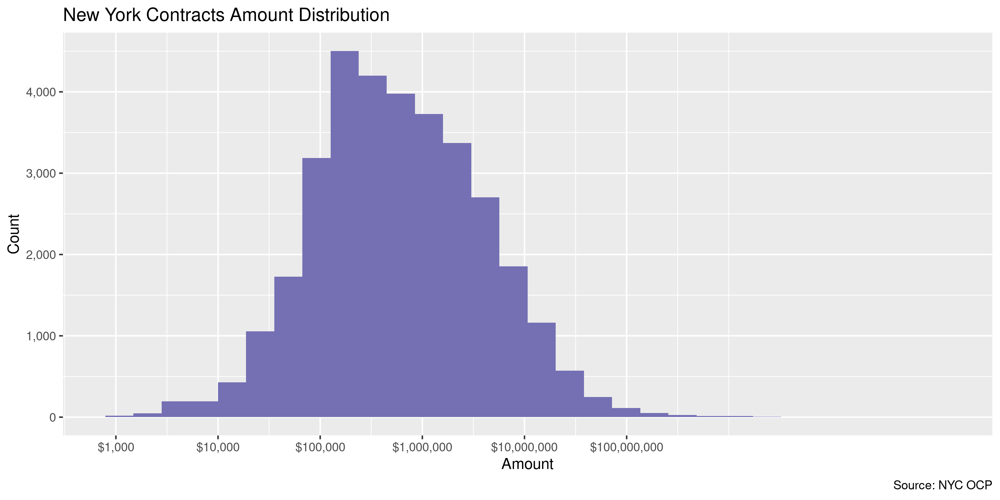
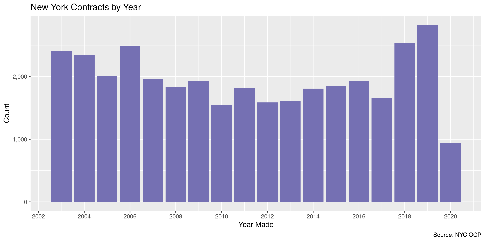

New York Contracts
================
Kiernan Nicholls
2020-05-28 14:13:07

  - [Project](#project)
  - [Objectives](#objectives)
  - [Software](#software)
  - [Data](#data)
  - [Import](#import)
  - [Wrangle](#wrangle)
  - [Explore](#explore)
  - [Export](#export)
  - [Upload](#upload)

<!-- Place comments regarding knitting here -->

## Project

The Accountability Project is an effort to cut across data silos and
give journalists, policy professionals, activists, and the public at
large a simple way to search across huge volumes of public data about
people and organizations.

Our goal is to standardizing public data on a few key fields by thinking
of each dataset row as a transaction. For each transaction there should
be (at least) 3 variables:

1.  All **parties** to a transaction.
2.  The **date** of the transaction.
3.  The **amount** of money involved.

## Objectives

This document describes the process used to complete the following
objectives:

1.  How many records are in the database?
2.  Check for entirely duplicated records.
3.  Check ranges of continuous variables.
4.  Is there anything blank or missing?
5.  Check for consistency issues.
6.  Create a five-digit ZIP Code called `zip`.
7.  Create a `year` field from the transaction date.
8.  Make sure there is data on both parties to a transaction.

## Software

This data is processed using the free, open-source statistical computing
language R, which can be [installed from
CRAN](https://cran.r-project.org/) for various opperating systems. For
example, R can be installed from the apt package repository on Ubuntu.

``` bash
sudo apt update
sudo apt -y upgrade
sudo apt -y install r-base
```

The following additional R packages are needed to collect, manipulate,
visualize, analyze, and communicate these results. The `pacman` package
will facilitate their installation and attachment.

The IRW’s `campfin` package will also have to be installed from GitHub.
This package contains functions custom made to help facilitate the
processing of campaign finance data.

``` r
if (!require("pacman")) install.packages("pacman")
pacman::p_load_gh("irworkshop/campfin")
pacman::p_load(
  tidyverse, # data manipulation
  lubridate, # datetime strings
  magrittr, # pipe operators
  gluedown, # print markdown
  janitor, # dataframe clean
  refinr, # cluster and merge
  scales, # format strings
  readxl, # read excel
  knitr, # knit documents
  vroom, # read files fast
  furrr, # parallel map
  glue, # combine strings
  here, # relative storage
  httr, # http requests
  pryr, # memory usage
  fs # search storage 
)
```

This document should be run as part of the `us_spending` project, which
lives as a sub-directory of the more general, language-agnostic
[`irworkshop/tap`](https://github.com/irworkshop/accountability_datacleaning)
GitHub repository.

The `us_spending` project uses the [RStudio
projects](https://support.rstudio.com/hc/en-us/articles/200526207-Using-Projects)
feature and should be run as such. The project also uses the dynamic
`here::here()` tool for file paths relative to *your* machine.

``` r
# where does this document knit?
here::here()
#> [1] "/home/kiernan/Code/accountability_datacleaning/R_campfin"
```

## Data

Contracts data is obtained from the New York City [Office of Citywide
Purchasing
(OCP)](https://www1.nyc.gov/site/dcas/business/working-with-citywide-procurement.page)
via the city’s [OpenData portal](https://opendata.cityofnewyork.us/). In
light of the ongoing COVID-19 outbreak in New York City, our typical
efforts to ensure a portal contains all relevant data were not made.
While the number of records is fairly small, the amount of data seems
consitent year to year and up to date.

## Import

We can import [the
data](https://data.cityofnewyork.us/City-Government/Recent-Contract-Awards/qyyg-4tf5)
directly from the OpenData portal.

First, we simply download using an `httr::GET()` request to the portal
site.

``` r
raw_url <- "https://data.cityofnewyork.us/api/views/qyyg-4tf5/rows.csv"
raw_dir <- dir_create(here("nyc", "contracts", "data", "raw"))
raw_path <- path(raw_dir, "Recent_Contract_Awards.csv")
```

``` r
if (!file_exists(raw_path)) {
  GET(
    url = raw_url,
    write_disk(raw_path, overwrite = TRUE),
    query = list(accessType = "DOWNLOAD")
  )
}
```

Then the local raw text file can be read into memory with
`vroom::vroom()`.

``` r
nyc <- vroom(
  file = raw_path,
  .name_repair = make_clean_names,
  escape_double = FALSE,
  escape_backslash = FALSE,
  na = c("", "NA", "......"),
  col_types = cols(
    .default = col_character(),
    StartDate = col_date_usa(),
    EndDate = col_date_usa(),
    ContractAmount = col_double()
  )
)
```

A number of columns contain no informatio and can be removed.

``` r
nyc <- remove_empty(nyc, "cols")
```

## Wrangle

The `vendor_address` string contains both the street address, the city,
state, and ZIP code. We will have to extract the last two for their own
variables.

``` r
# copy address in new column
nyc <- mutate(nyc, addr = str_to_upper(vendor_address))
# remove periods in abbrevs
nyc$addr <- str_remove_all(nyc$addr, "\\.(?=\\S)")
# extract and remove zip from end
nyc <- mutate(nyc, zip = normal_zip(str_extract(addr, "\\d+(?:-\\d{4})?$")))
nyc$addr <- str_trim(str_remove(nyc$addr, "[:punct:]?\\s?\\d+(?:-\\d{4})?$"))
# abbrev full states at end of addr
rx_abbs <- valid_state
names(rx_abbs) <- glue("{valid_name}$")
nyc$addr <- str_replace_all(nyc$addr, rx_abbs)
# extract upper abbs from end
nyc <- mutate(nyc, state = str_extract(addr, "(?<=\\W)[:upper:]{2}$"))
# remove abbs and extra from end
nyc$addr <- str_remove(nyc$addr, "[:punct:]?\\s[:upper:]{2}$")
nyc <- relocate(nyc, state, zip, .after = addr)
nyc$addr <- nyc$addr %>% 
  # normalize remaining addr
  str_normal(punct = FALSE) %>% 
  # abbreviate street abbs
  abbrev_full(usps_street)
```

``` r
nyc %>% 
  select(vendor_address, addr, state, zip) %>% 
  distinct() %>% 
  sample_n(20)
#> # A tibble: 20 x 4
#>    vendor_address                                      addr                             state zip  
#>    <chr>                                               <chr>                            <chr> <chr>
#>  1 140 58th St, Suite 8F, Brooklyn, NY 11220           140 58TH ST, STE 8F, BROOKLYN    NY    11220
#>  2 419 E  86TH STREET, NEW YORK, NY 10028              419 E 86TH ST, NEW YORK          NY    10028
#>  3 2 Penn Plaza, 18th Floor, New York, NY 10121        2 PENN PLZ, 18TH FL, NEW YORK    NY    10121
#>  4 377 Broadway, 2nd. fl,NYC,10013                     377 BROADWAY, 2ND. FL,NYC        <NA>  10013
#>  5 200 SCHULZ DRIVE  RED BANK NJ 07701                 200 SCHULZ DR RED BANK           NJ    07701
#>  6 339 Hicks Street, Brooklyn, NY 11201                339 HICKS ST, BROOKLYN           NY    11201
#>  7 94 Woodworth Avenue, Yonkers, NY  10701             94 WOODWORTH AVE, YONKERS        NY    10701
#>  8 2 Broadway, Room A109, New York, NY  10004          2 BROADWAY, RM A109, NEW YORK    NY    10004
#>  9 89-11 MERRICK BOULEVARD, JAMAICA, NEW YORK 11432    89-11 MERRICK BLVD, JAMAICA      NY    11432
#> 10 3004 Avenue  J, Brooklyn, NY  11210                 3004 AVE J, BROOKLYN             NY    11210
#> 11 138-02 Queens Boulevard, Queens, New York, 11435    138-02 QUEENS BLVD, QUEENS       NY    11435
#> 12 162-48A 14th Avenue, Whitestone, NY 11357           162-48A 14TH AVE, WHITESTONE     NY    11357
#> 13 One Solutions Way, Waynesboro, VA 22980             ONE SOLUTIONS WAY, WAYNESBORO    VA    22980
#> 14 465 Sterling Place, Brooklyn, New York 11238        465 STERLING PLACE, BROOKLYN     NY    11238
#> 15 134 Middle Street, Suite 210 Lowell MA 01852        134 MIDDLE ST, STE 210 LOWELL    MA    01852
#> 16 600 FEDERAL BLVD  CARTERET NJ 07008                 600 FEDERAL BLVD CARTERET        NJ    07008
#> 17 148 BROADWAY    HICKSVILLE, NY 11801                148 BROADWAY HICKSVILLE          NY    11801
#> 18 94  Woodworth Ave.,      Yonkers,     NY   10701    94 WOODWORTH AVE, YONKERS,       NY    10701
#> 19 30 North Macquesten Parkway, Mount Vernon, N.Y.  1… 30 N MACQUESTEN PKWY, MT VERNON… <NA>  10550
#> 20 966 Prospect Avenue, Bronx NY 10459                 966 PROSPECT AVE, BRONX          NY    10459
```

We can also add “NY” as the state for spending agencies.

``` r
nyc <- mutate(nyc, agency_state = "NY", .after = agency_name)
```

## Explore

``` r
head(nyc)
#> # A tibble: 6 x 26
#>   request_id start_date end_date   agency_name agency_state type_of_notice_… category_descri…
#>   <chr>      <date>     <date>     <chr>       <chr>        <chr>            <chr>           
#> 1 201406050… 2014-06-12 2014-06-12 Transporta… NY           Award            Human Services/…
#> 2 200910070… 2009-10-14 2009-10-14 Transporta… NY           Award            Services (other…
#> 3 201302140… 2013-02-22 2013-02-22 Parks and … NY           Award            Services (other…
#> 4 201302140… 2013-02-22 2013-02-22 Parks and … NY           Award            Services (other…
#> 5 201406050… 2014-06-12 2014-06-12 Transporta… NY           Award            Human Services/…
#> 6 202005200… 2020-05-28 2020-05-28 Sanitation  NY           Award            Goods and Servi…
#> # … with 19 more variables: short_title <chr>, selection_method_description <chr>,
#> #   section_name <chr>, special_case_reason_description <chr>, pin <chr>,
#> #   address_to_request <chr>, contact_name <chr>, contact_phone <chr>, contract_amount <dbl>,
#> #   additional_description1 <chr>, other_info1 <chr>, vendor_name <chr>, vendor_address <chr>,
#> #   printout1 <chr>, printout2 <chr>, document_links <chr>, addr <chr>, state <chr>, zip <chr>
tail(nyc)
#> # A tibble: 6 x 26
#>   request_id start_date end_date   agency_name agency_state type_of_notice_… category_descri…
#>   <chr>      <date>     <date>     <chr>       <chr>        <chr>            <chr>           
#> 1 201811010… 2018-11-09 2018-11-09 Citywide A… NY           Award            Goods           
#> 2 201012020… 2010-12-09 2010-12-09 Citywide A… NY           Award            Goods           
#> 3 201312180… 2013-12-27 2013-12-27 Citywide A… NY           Award            Goods           
#> 4 201908270… 2019-09-04 2019-09-04 Design and… NY           Award            Construction/Co…
#> 5 201512160… 2015-12-23 2015-12-23 Citywide A… NY           Award            Goods           
#> 6 201401080… 2014-01-15 2014-01-15 Informatio… NY           Award            Services (other…
#> # … with 19 more variables: short_title <chr>, selection_method_description <chr>,
#> #   section_name <chr>, special_case_reason_description <chr>, pin <chr>,
#> #   address_to_request <chr>, contact_name <chr>, contact_phone <chr>, contract_amount <dbl>,
#> #   additional_description1 <chr>, other_info1 <chr>, vendor_name <chr>, vendor_address <chr>,
#> #   printout1 <chr>, printout2 <chr>, document_links <chr>, addr <chr>, state <chr>, zip <chr>
glimpse(sample_n(nyc, 20))
#> Rows: 20
#> Columns: 26
#> $ request_id                      <chr> "20140107015", "20200115002", "20141203005", "2008091601…
#> $ start_date                      <date> 2014-01-14, 2020-01-23, 2014-12-10, 2008-09-24, 2016-06…
#> $ end_date                        <date> 2014-01-14, 2020-01-23, 2014-12-10, 2008-09-24, 2016-06…
#> $ agency_name                     <chr> "Design and Construction", "Health and Mental Hygiene", …
#> $ agency_state                    <chr> "NY", "NY", "NY", "NY", "NY", "NY", "NY", "NY", "NY", "N…
#> $ type_of_notice_description      <chr> "Award", "Award", "Award", "Award", "Award", "Award", "A…
#> $ category_description            <chr> "Construction/Construction Services", "Human Services/Cl…
#> $ short_title                     <chr> "LNMA12WAS, NEW YORK PUBLIC LIBRARY WASHINGTON HEIGHTS B…
#> $ selection_method_description    <chr> "Sole Source", "BP/City Council Discretionary", "Negotia…
#> $ section_name                    <chr> "Procurement", "Procurement", "Procurement", "Procuremen…
#> $ special_case_reason_description <chr> "Available only from a single source", NA, "Judgment req…
#> $ pin                             <chr> "8502013LN0001P", "20MR021901R0X00", "14AZ011802R0X00", …
#> $ address_to_request              <chr> NA, NA, NA, NA, NA, NA, NA, NA, NA, NA, NA, NA, NA, NA, …
#> $ contact_name                    <chr> NA, NA, NA, NA, NA, NA, NA, NA, NA, NA, NA, NA, NA, NA, …
#> $ contact_phone                   <chr> NA, NA, NA, NA, NA, NA, NA, NA, NA, NA, NA, NA, NA, NA, …
#> $ contract_amount                 <dbl> 6042507.0, 145540.0, 253362.0, 118408.4, 1575818.2, 5703…
#> $ additional_description1         <chr> NA, NA, NA, NA, NA, NA, NA, NA, NA, NA, NA, NA, NA, NA, …
#> $ other_info1                     <chr> NA, NA, NA, "Health and Hospital Corporation Contract # …
#> $ vendor_name                     <chr> "The New York Public Library, Astor, Lenox and Tilden Fo…
#> $ vendor_address                  <chr> "42nd Street and Fifth Avenue, New York, NY 10018-2788",…
#> $ printout1                       <chr> "LNMA12WAS, NEW YORK PUBLIC LIBRARY WASHINGTON HEIGHTS B…
#> $ printout2                       <chr> NA, NA, NA, NA, NA, NA, NA, NA, NA, NA, NA, NA, NA, NA, …
#> $ document_links                  <chr> NA, NA, NA, NA, NA, NA, NA, NA, NA, NA, NA, NA, NA, NA, …
#> $ addr                            <chr> "42ND ST AND FIFTH AVE, NEW YORK", "12 METRO TECH CTR 29…
#> $ state                           <chr> "NY", "NY", "NY", "NY", "FL", "NJ", "NY", "NY", "NY", "N…
#> $ zip                             <chr> "10018", "11201", "11550", "10167", "32792", "08830", "1…
```

A number of records are missing one or more key variables.

``` r
col_stats(nyc, count_na)
#> # A tibble: 26 x 4
#>    col                             class      n        p
#>    <chr>                           <chr>  <int>    <dbl>
#>  1 request_id                      <chr>      0 0       
#>  2 start_date                      <date>     0 0       
#>  3 end_date                        <date>     0 0       
#>  4 agency_name                     <chr>      0 0       
#>  5 agency_state                    <chr>      0 0       
#>  6 type_of_notice_description      <chr>      0 0       
#>  7 category_description            <chr>      0 0       
#>  8 short_title                     <chr>      0 0       
#>  9 selection_method_description    <chr>      0 0       
#> 10 section_name                    <chr>      0 0       
#> 11 special_case_reason_description <chr>  22792 0.650   
#> 12 pin                             <chr>      8 0.000228
#> 13 address_to_request              <chr>  34783 0.991   
#> 14 contact_name                    <chr>  34807 0.992   
#> 15 contact_phone                   <chr>  34782 0.991   
#> 16 contract_amount                 <dbl>     30 0.000855
#> 17 additional_description1         <chr>  34197 0.975   
#> 18 other_info1                     <chr>  28329 0.807   
#> 19 vendor_name                     <chr>   1424 0.0406  
#> 20 vendor_address                  <chr>   1427 0.0407  
#> 21 printout1                       <chr>    309 0.00881 
#> 22 printout2                       <chr>  35086 1.00    
#> 23 document_links                  <chr>  35042 0.999   
#> 24 addr                            <chr>   1427 0.0407  
#> 25 state                           <chr>   3195 0.0911  
#> 26 zip                             <chr>   1929 0.0550
```

We can flag these records with `campfin::flag_na()`.

``` r
nyc <- flag_na(nyc, agency_name, vendor_name, start_date, contract_amount)
percent(mean(nyc$na_flag), 0.01)
#> [1] "4.06%"
```

We can also use `campfin::dupe_flag()` to flag duplicate records. In
this case, there are none\!

``` r
nyc <- flag_dupes(nyc, everything(), .check = TRUE)
#> Warning in flag_dupes(nyc, everything(), .check = TRUE): no duplicate rows, column not created
sum(nyc$dupe_flag)
#> Warning: Unknown or uninitialised column: `dupe_flag`.
#> [1] 0
```

We can also count and plot some of the categorical values.

``` r
col_stats(nyc, n_distinct)
#> # A tibble: 27 x 4
#>    col                             class      n         p
#>    <chr>                           <chr>  <int>     <dbl>
#>  1 request_id                      <chr>  35089 1        
#>  2 start_date                      <date>  4254 0.121    
#>  3 end_date                        <date>  4254 0.121    
#>  4 agency_name                     <chr>     72 0.00205  
#>  5 agency_state                    <chr>      1 0.0000285
#>  6 type_of_notice_description      <chr>      1 0.0000285
#>  7 category_description            <chr>      6 0.000171 
#>  8 short_title                     <chr>  22001 0.627    
#>  9 selection_method_description    <chr>     31 0.000883 
#> 10 section_name                    <chr>      1 0.0000285
#> 11 special_case_reason_description <chr>      6 0.000171 
#> 12 pin                             <chr>  30956 0.882    
#> 13 address_to_request              <chr>     48 0.00137  
#> 14 contact_name                    <chr>     48 0.00137  
#> 15 contact_phone                   <chr>     47 0.00134  
#> 16 contract_amount                 <dbl>  24842 0.708    
#> 17 additional_description1         <chr>    752 0.0214   
#> 18 other_info1                     <chr>   3876 0.110    
#> 19 vendor_name                     <chr>  18883 0.538    
#> 20 vendor_address                  <chr>  23605 0.673    
#> 21 printout1                       <chr>  34744 0.990    
#> 22 printout2                       <chr>      4 0.000114 
#> 23 document_links                  <chr>     48 0.00137  
#> 24 addr                            <chr>  16962 0.483    
#> 25 state                           <chr>     67 0.00191  
#> 26 zip                             <chr>   2741 0.0781   
#> 27 na_flag                         <lgl>      2 0.0000570
```

### Continuous

We should also check to ensure the amount and dates are the reasonable.

Only a few records of a `contract_amount` value less than or equal to
zero.

``` r
summary(nyc$contract_amount)
#>       Min.    1st Qu.     Median       Mean    3rd Qu.       Max.       NA's 
#> -4.000e+05  1.315e+05  4.752e+05  7.490e+06  2.036e+06  1.011e+11         30
mean(nyc$contract_amount <= 0, na.rm = TRUE) # less than zero
#> [1] 0.04472461
```

The amounts are logarithmically normal, as we’d expect with something
like this.

<!-- -->

Most of the `start_date` and `end_date` values are the same. We will use
the year of the `start_date` to create a new 4 digit `year` variable.

``` r
mean(nyc$start_date == nyc$end_date) # mostly same
#> [1] 0.9951552
nyc <- mutate(nyc, year = year(start_date))
```

No records have bad dates in the distant past or future.

``` r
min(nyc$start_date)
#> [1] "2003-01-02"
sum(nyc$year < 2002)
#> [1] 0
max(nyc$end_date)
#> [1] "2020-05-28"
sum(nyc$end_date > today())
#> [1] 0
```

There are a fairly constant number of contracts per year.

<!-- -->

## Export

``` r
glimpse(sample_n(nyc, 20))
#> Rows: 20
#> Columns: 28
#> $ request_id                      <chr> "20080117002", "20070913026", "20081024018", "2014040400…
#> $ start_date                      <date> 2008-01-25, 2007-09-19, 2008-10-31, 2014-04-11, 2020-02…
#> $ end_date                        <date> 2008-01-25, 2007-09-19, 2008-10-31, 2014-04-11, 2020-02…
#> $ agency_name                     <chr> "Administration for Children's Services", "Design and Co…
#> $ agency_state                    <chr> "NY", "NY", "NY", "NY", "NY", "NY", "NY", "NY", "NY", "N…
#> $ type_of_notice_description      <chr> "Award", "Award", "Award", "Award", "Award", "Award", "A…
#> $ category_description            <chr> "Goods and Services", "Construction/Construction Service…
#> $ short_title                     <chr> "COMMUNITY PARTNERSHIP INNOVATIVE PROGRAM", "HH115EAU, C…
#> $ selection_method_description    <chr> "Competitive Sealed Proposals", "Competitive Sealed Prop…
#> $ section_name                    <chr> "Procurement", "Procurement", "Procurement", "Procuremen…
#> $ special_case_reason_description <chr> "Other (Describe below in Other Legally Mandated Informa…
#> $ pin                             <chr> "06807INV0008", "8502006HL0005P", "857701348", "05612P00…
#> $ address_to_request              <chr> NA, NA, NA, NA, NA, NA, NA, NA, NA, NA, NA, NA, NA, NA, …
#> $ contact_name                    <chr> NA, NA, NA, NA, NA, NA, NA, NA, NA, NA, NA, NA, NA, NA, …
#> $ contact_phone                   <chr> NA, NA, NA, NA, NA, NA, NA, NA, NA, NA, NA, NA, NA, NA, …
#> $ contract_amount                 <dbl> 150000.0, 41278382.0, 193400.0, 2955000.0, 128968.0, 400…
#> $ additional_description1         <chr> NA, NA, NA, NA, NA, NA, NA, NA, NA, NA, NA, NA, NA, NA, …
#> $ other_info1                     <chr> "INNOVATIVE METHOD DEMONSTRATION PROJECT", NA, NA, NA, N…
#> $ vendor_name                     <chr> "SCAN (SUPPORTIVE CHILDREN`S ADVOCACY NETWORK) - NY - VO…
#> $ vendor_address                  <chr> "207 E 27TH ST., LOWER LEVEL, NEW YORK, NY 10016", "6 Ae…
#> $ printout1                       <chr> "COMMUNITY PARTNERSHIP INNOVATIVE PROGRAM - Competitive …
#> $ printout2                       <chr> NA, NA, NA, NA, NA, NA, NA, NA, NA, NA, NA, NA, NA, NA, …
#> $ document_links                  <chr> NA, NA, NA, NA, NA, NA, NA, NA, NA, NA, NA, NA, NA, NA, …
#> $ addr                            <chr> "207 E 27TH ST, LOWR LEVEL, NEW YORK", "6 AERIAL WAY, SY…
#> $ state                           <chr> "NY", "NY", "NY", "MA", "OH", "NY", "OR", "NY", "LA", "N…
#> $ zip                             <chr> "10016", "11791", "11356", "01720", "43016", "10019", "9…
#> $ na_flag                         <lgl> FALSE, FALSE, FALSE, FALSE, FALSE, FALSE, FALSE, FALSE, …
#> $ year                            <dbl> 2008, 2007, 2008, 2014, 2020, 2016, 2007, 2014, 2017, 20…
```

1.  There are 35,089 records in the database.
2.  There are 0 duplicate records in the database.
3.  The range and distribution of amount and dates seem mostly
    reasonable.
4.  Geographic variables were extracted from a single string or added
    manually.
5.  The 4-digit `year` variable has been created with
    `lubridate::year()`.

<!-- end list -->

``` r
clean_dir <- dir_create(here("nyc", "contracts", "data", "clean"))
clean_path <- path(clean_dir, "nyc_contracts_clean.csv")
write_csv(nyc, path = clean_path, na = "")
file_size(clean_path)
#> 23.1M
file_encoding(clean_path)
#> # A tibble: 1 x 3
#>   path                                                                   mime               charset
#>   <fs::path>                                                             <chr>              <chr>  
#> 1 /home/kiernan/Code/accountability_datacleaning/R_campfin/nyc/contract… application/octet… binary
```

## Upload

``` r
s3_dir <- "s3:/publicaccountability/csv/"
s3_url <- path(s3_dir, basename(clean_path))
if (require(duckr)) {
  duckr::duck_upload(clean_path, s3_url)
}
```
