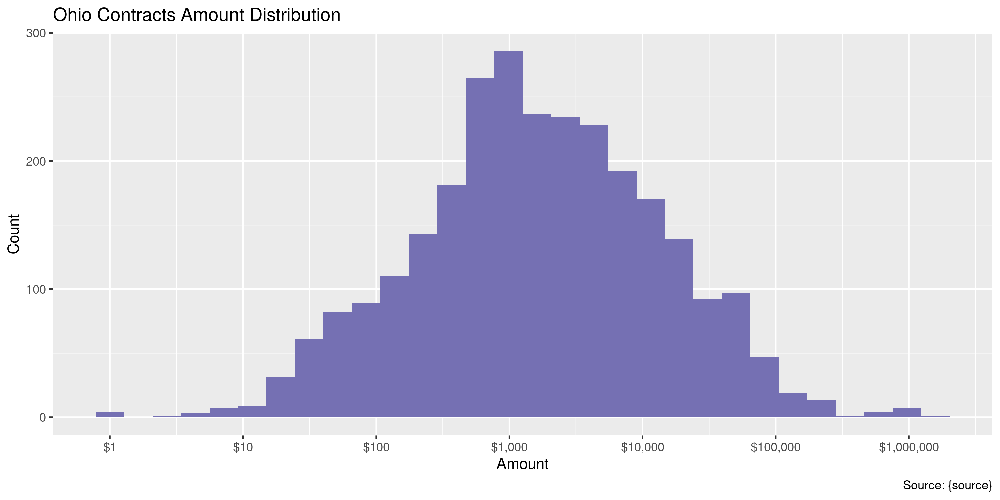
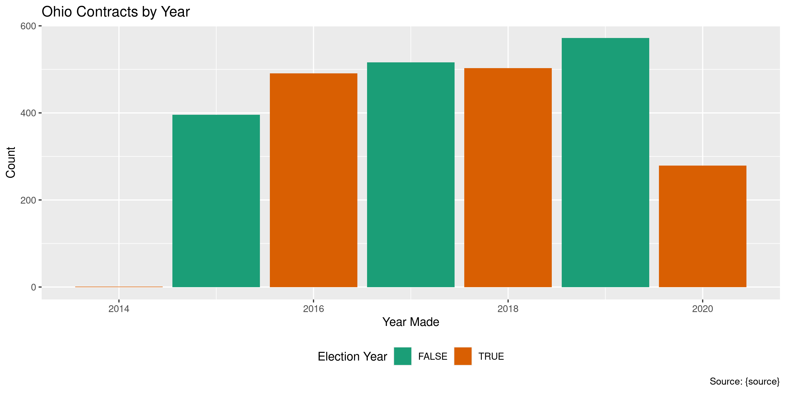

Ohio Contracts
================
Kiernan Nicholls
Fri Feb 5 11:52:38 2021

-   [Project](#project)
-   [Objectives](#objectives)
-   [Packages](#packages)
-   [Data](#data)
-   [Read](#read)
-   [Explore](#explore)
    -   [Missing](#missing)
    -   [Duplicates](#duplicates)
    -   [Amounts](#amounts)
    -   [Dates](#dates)
-   [Wrangle](#wrangle)
-   [Conclude](#conclude)
-   [Export](#export)
-   [Upload](#upload)

<!-- Place comments regarding knitting here -->

## Project

The Accountability Project is an effort to cut across data silos and
give journalists, policy professionals, activists, and the public at
large a simple way to search across huge volumes of public data about
people and organizations.

Our goal is to standardizing public data on a few key fields by thinking
of each dataset row as a transaction. For each transaction there should
be (at least) 3 variables:

1.  All **parties** to a transaction.
2.  The **date** of the transaction.
3.  The **amount** of money involved.

## Objectives

This document describes the process used to complete the following
objectives:

1.  How many records are in the database?
2.  Check for entirely duplicated records.
3.  Check ranges of continuous variables.
4.  Is there anything blank or missing?
5.  Check for consistency issues.
6.  Create a five-digit ZIP Code called `zip`.
7.  Create a `year` field from the transaction date.
8.  Make sure there is data on both parties to a transaction.

## Packages

The following packages are needed to collect, manipulate, visualize,
analyze, and communicate these results. The `pacman` package will
facilitate their installation and attachment.

``` r
if (!require("pacman")) {
  install.packages("pacman")
}
pacman::p_load(
  tidyverse, # data manipulation
  lubridate, # datetime strings
  gluedown, # printing markdown
  janitor, # clean data frames
  campfin, # custom irw tools
  aws.s3, # aws cloud storage
  refinr, # cluster & merge
  readxl, # read excel file
  scales, # format strings
  knitr, # knit documents
  vroom, # fast reading
  rvest, # scrape html
  glue, # code strings
  here, # project paths
  httr, # http requests
  fs # local storage 
)
```

This document should be run as part of the `R_campfin` project, which
lives as a sub-directory of the more general, language-agnostic
[`irworkshop/accountability_datacleaning`](https://github.com/irworkshop/accountability_datacleaning)
GitHub repository.

The `R_campfin` project uses the [RStudio
projects](https://support.rstudio.com/hc/en-us/articles/200526207-Using-Projects)
feature and should be run as such. The project also uses the dynamic
`here::here()` tool for file paths relative to *your* machine.

``` r
# where does this document knit?
here::i_am("oh/contracts/docs/oh_contracts_diary.Rmd")
```

## Data

``` r
raw_dir <- dir_create(here("oh", "contracts", "data", "raw"))
raw_xls <- path(raw_dir, "Contracts_1.1.2015_-_Present.xlsx")
```

## Read

``` r
raw_sheets <- set_names(excel_sheets(raw_xls))[1:6]
```

``` r
ohc <- map(
  .x = raw_sheets,
  .f = read_excel,
  path = raw_xls,
  range = "A5:E10000"
)
```

``` r
ohc <- ohc %>% 
  bind_rows(.id = "src_sheet") %>% 
  filter(!is.na(`Vendor Name`)) %>% 
  clean_names(case = "snake")
```

``` r
num_dates <- str_which(ohc$po_date, "^\\d+$")
ohc$po_date[num_dates] <- format(
  x = excel_numeric_to_date(as.double(ohc$po_date[num_dates])),
  format = "%b %d, %Y"
)
```

``` r
ohc$po_date <- parse_date(
  x = ohc$po_date,
  format = "%b %d, %Y"
)
```

## Explore

There are 2,758 rows of 6 columns. Each record represents a single
contract between a state agency and an outside vendor.

``` r
glimpse(ohc)
#> Rows: 2,758
#> Columns: 6
#> $ src_sheet      <chr> "3Q & 4Q 2015", "3Q & 4Q 2015", "3Q & 4Q 2015", "3Q & 4Q 2015", "3Q & 4Q 2015", "3Q & 4Q 2015"…
#> $ vendor_name    <chr> "A JOSEPH BUSINESS ENTERPRISES", "A JOSEPH BUSINESS ENTERPRISES", "A JOSEPH BUSINESS ENTERPRIS…
#> $ po_date        <date> 2015-01-21, 2015-02-13, 2015-02-13, 2015-02-13, 2015-02-13, 2015-02-13, 2015-02-13, 2015-02-1…
#> $ line           <dbl> 1, 1, 2, 3, 4, 5, 6, 7, 8, 9, 10, 11, 12, 13, 14, 15, 16, 1, 1, 1, 1, 1, 1, 1, 1, 1, 1, 1, 1, …
#> $ po_description <chr> "LABOR TO REVERSE OFFICE DESK AND ADD NEW CUBICLE WORKSTATION - SUITE 965", "S/C Panels 53\" x…
#> $ created_amt    <dbl> 600.00, 2388.00, 720.00, 1512.00, 720.00, 1512.00, 360.00, 1130.00, 3360.00, 1160.00, 700.00, …
tail(ohc)
#> # A tibble: 6 x 6
#>   src_sheet vendor_name    po_date     line po_description                                                   created_amt
#>   <chr>     <chr>          <date>     <dbl> <chr>                                                                  <dbl>
#> 1 FY2020    XTEK PARTNERS… 2019-07-18     1 ADVANCED GATEWAY SECURITY SUITE BUNDLE FOR SUPERMASSIVE 9200 1 …       12553
#> 2 FY2020    XTEK PARTNERS… 2019-07-18     2 ADVANCED GATEWAY SECURITY SUITE BUNDLE FOR NSA 4600 1 YR                7806
#> 3 FY2020    XTEK PARTNERS… 2019-07-18     3 COMPREHENSIVE GATEWAY SECURITY SUITE BUNDLE FOR NSA 4200 SERIES…         752
#> 4 FY2020    XTEK PARTNERS… 2019-07-18     4 COMPREHENSIVE GATEWAY SECURITY SUITE BUNDLE FOR THE TZ 2015 SER…         416
#> 5 FY2020    ZOHO CORPORAT… 2020-06-18     1 PATCH MANAGER PLUS ANNUAL MAINTENANCE AND SUPPORT FEE FOR MANAG…          40
#> 6 FY2020    ZOHO CORPORAT… 2020-06-18     2 PATCH MANAGER PLUS ANNUAL MAINTENANCE AND SUPPORT FEE FOR MANAG…         573
```

### Missing

Columns vary in their degree of missing values.

``` r
col_stats(ohc, count_na)
#> # A tibble: 6 x 4
#>   col            class      n     p
#>   <chr>          <chr>  <int> <dbl>
#> 1 src_sheet      <chr>      0     0
#> 2 vendor_name    <chr>      0     0
#> 3 po_date        <date>     0     0
#> 4 line           <dbl>      0     0
#> 5 po_description <chr>      0     0
#> 6 created_amt    <dbl>      0     0
```

### Duplicates

We can also flag any record completely duplicated across every column.

``` r
ohc <- flag_dupes(ohc, everything())
sum(ohc$dupe_flag)
#> [1] 4
```

``` r
ohc %>% 
  filter(dupe_flag) %>% 
  select(vendor_name, po_date, created_amt, po_description)
#> # A tibble: 4 x 4
#>   vendor_name                 po_date    created_amt po_description                                          
#>   <chr>                       <date>           <dbl> <chr>                                                   
#> 1 MNJ TECHNOLOGIES DIRECT INC 2016-09-02        190  PROJECTOR SCREEN                                        
#> 2 MNJ TECHNOLOGIES DIRECT INC 2016-09-02        190  PROJECTOR SCREEN                                        
#> 3 AMAZON COM LLC              2020-03-13        354. SMEAD PRESSBOARD CLASSIFICATION FILE FOLDERS, 10 PER BOX
#> 4 AMAZON COM LLC              2020-03-13        354. SMEAD PRESSBOARD CLASSIFICATION FILE FOLDERS, 10 PER BOX
```

### Amounts

``` r
summary(ohc$created_amt)
#>    Min. 1st Qu.  Median    Mean 3rd Qu.    Max. 
#>       0     420    1544   12850    6600 1583543
mean(ohc$created_amt <= 0)
#> [1] 0
```

These are the records with the minimum and maximum amounts.

``` r
glimpse(ohc[c(which.max(ohc$created_amt), which.min(ohc$created_amt)), ])
#> Rows: 2
#> Columns: 7
#> $ src_sheet      <chr> "FY2017", "FY2017"
#> $ vendor_name    <chr> "HARRIS MACKESSY & BRENNAN INC", "OPENGOV INC"
#> $ po_date        <date> 2016-12-13, 2017-03-10
#> $ line           <dbl> 2, 1
#> $ po_description <chr> "OPCS Phase 2", "SIGNIFICANT ENTITIES ON-BOARDING FEE - CLEVELAND"
#> $ created_amt    <dbl> 1583543.00, 0.01
#> $ dupe_flag      <lgl> FALSE, FALSE
```

<!-- -->

### Dates

We can add the calendar year from `po_date` with `lubridate::year()`

``` r
ohc <- mutate(ohc, po_year = year(po_date))
```

``` r
min(ohc$po_date)
#> [1] "2014-09-18"
max(ohc$po_date)
#> [1] "2020-06-19"
```

<!-- -->

## Wrangle

We can manually add the state and agency spending the money.

``` r
ohc <- mutate(ohc, state = "OH", agency = "OHIO TREASURER OF STATE")
```

## Conclude

``` r
glimpse(sample_n(ohc, 50))
#> Rows: 50
#> Columns: 10
#> $ src_sheet      <chr> "FY2017", "FY2020", "FY2020", "FY2017", "FY2019", "FY2018", "FY2018", "FY2016", "FY2017", "FY2…
#> $ vendor_name    <chr> "MNJ TECHNOLOGIES DIRECT INC", "XLN SYSTEMS INC", "CBTS TECHNOLOGY SOLUTIONS LLC", "PRESTIGE A…
#> $ po_date        <date> 2017-03-24, 2020-03-26, 2019-10-09, 2016-10-13, 2018-07-26, 2017-09-21, 2018-06-15, 2016-06-2…
#> $ line           <dbl> 1, 1, 20, 1, 1, 1, 3, 2, 3, 1, 1, 3, 1, 1, 6, 1, 1, 3, 1, 4, 15, 1, 2, 2, 1, 1, 2, 2, 1, 1, 1,…
#> $ po_description <chr> "APPPLE 5W USB POWER ADAPTER", "PSS-EM7 SENIOR CONSULTANT:  PRIOR TO START OF THE MONITOR PROC…
#> $ created_amt    <dbl> 16.70, 1087.50, 600.00, 855.00, 3750.00, 13261.40, 3000.00, 1000.00, 1026.00, 73718.75, 948.00…
#> $ dupe_flag      <lgl> FALSE, FALSE, FALSE, FALSE, FALSE, FALSE, FALSE, FALSE, FALSE, FALSE, FALSE, FALSE, FALSE, FAL…
#> $ po_year        <dbl> 2017, 2020, 2019, 2016, 2018, 2017, 2018, 2016, 2016, 2016, 2016, 2017, 2018, 2016, 2020, 2017…
#> $ state          <chr> "OH", "OH", "OH", "OH", "OH", "OH", "OH", "OH", "OH", "OH", "OH", "OH", "OH", "OH", "OH", "OH"…
#> $ agency         <chr> "OHIO TREASURER OF STATE", "OHIO TREASURER OF STATE", "OHIO TREASURER OF STATE", "OHIO TREASUR…
```

1.  There are 2,758 records in the database.
2.  There are 4 duplicate records in the database.
3.  The range and distribution of `amount` and `date` seem reasonable.
4.  There are 0 records missing key variables.
5.  Consistency in geographic data has been improved with
    `campfin::normal_*()`.
6.  The 4-digit `year` variable has been created with
    `lubridate::year()`.

## Export

Now the file can be saved on disk for upload to the Accountability
server.

``` r
clean_dir <- dir_create(here("oh", "contracts", "data", "clean"))
clean_path <- path(clean_dir, "oh_contracts_clean.csv")
write_csv(ohc, clean_path, na = "")
(clean_size <- file_size(clean_path))
#> 357K
non_ascii(clean_path)
#> [1] FALSE
```

## Upload

We can use the `aws.s3::put_object()` to upload the text file to the IRW
server.

``` r
aws_path <- path("csv", basename(clean_path))
if (!object_exists(aws_path, "publicaccountability")) {
  put_object(
    file = clean_path,
    object = aws_path, 
    bucket = "publicaccountability",
    acl = "public-read",
    show_progress = TRUE,
    multipart = TRUE
  )
}
aws_head <- head_object(aws_path, "publicaccountability")
(aws_size <- as_fs_bytes(attr(aws_head, "content-length")))
unname(aws_size == clean_size)
```
