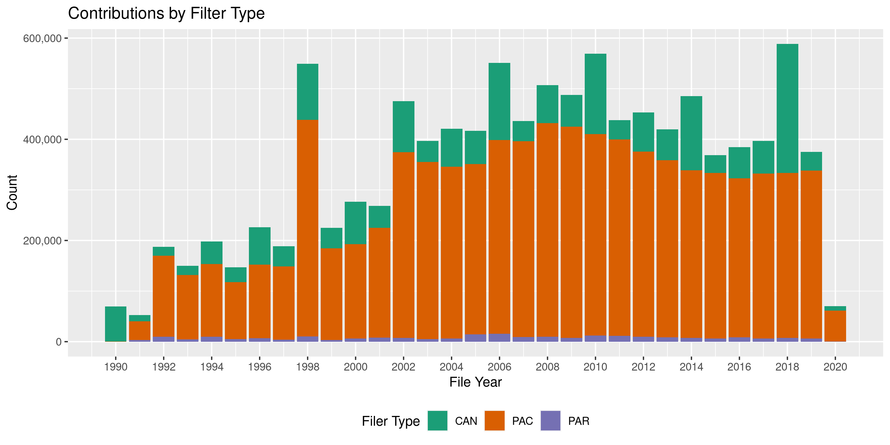
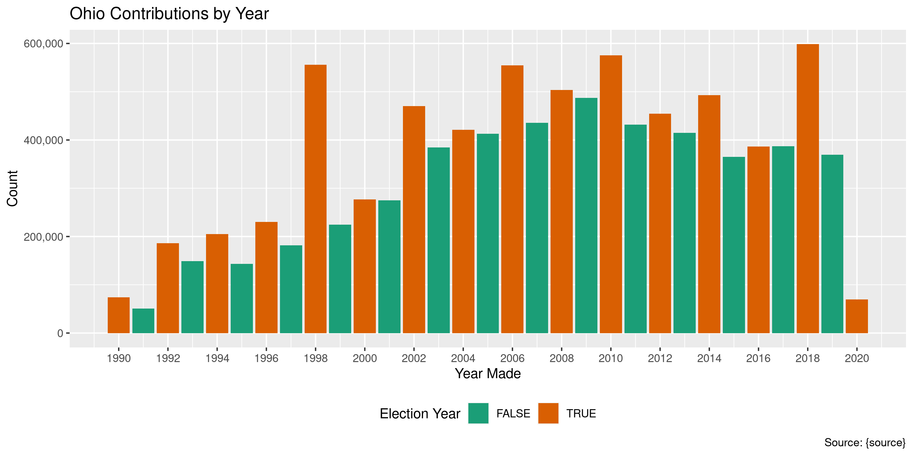
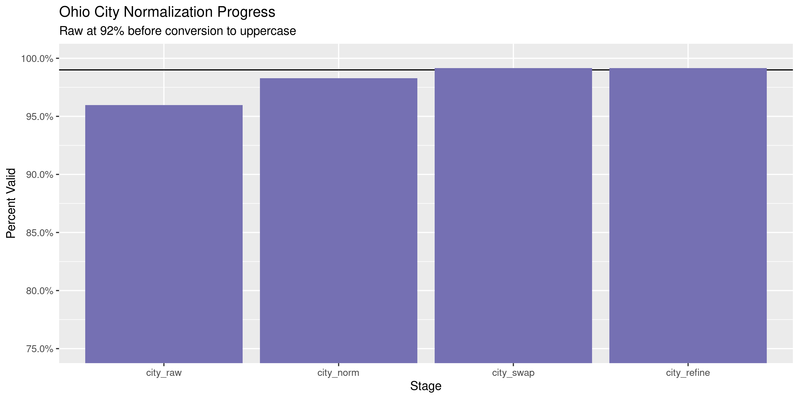

Ohio Contributions
================
Kiernan Nicholls & Yanqi Xu
2023-03-20 20:47:59

- <a href="#project" id="toc-project">Project</a>
- <a href="#objectives" id="toc-objectives">Objectives</a>
- <a href="#packages" id="toc-packages">Packages</a>
- <a href="#data" id="toc-data">Data</a>
- <a href="#import" id="toc-import">Import</a>
- <a href="#previous" id="toc-previous">Previous</a>
- <a href="#explore" id="toc-explore">Explore</a>
- <a href="#wrangle" id="toc-wrangle">Wrangle</a>
- <a href="#conclude" id="toc-conclude">Conclude</a>
- <a href="#export" id="toc-export">Export</a>
- <a href="#upload" id="toc-upload">Upload</a>
- <a href="#dictionary" id="toc-dictionary">Dictionary</a>

<!-- Place comments regarding knitting here -->

## Project

The Accountability Project is an effort to cut across data silos and
give journalists, policy professionals, activists, and the public at
large a simple way to search across huge volumes of public data about
people and organizations.

Our goal is to standardizing public data on a few key fields by thinking
of each dataset row as a transaction. For each transaction there should
be (at least) 3 variables:

1.  All **parties** to a transaction.
2.  The **date** of the transaction.
3.  The **amount** of money involved.

## Objectives

This document describes the process used to complete the following
objectives:

1.  How many records are in the database?
2.  Check for entirely duplicated records.
3.  Check ranges of continuous variables.
4.  Is there anything blank or missing?
5.  Check for consistency issues.
6.  Create a five-digit ZIP Code called `zip`.
7.  Create a `year` field from the transaction date.
8.  Make sure there is data on both parties to a transaction.

## Packages

The following packages are needed to collect, manipulate, visualize,
analyze, and communicate these results. The `pacman` package will
facilitate their installation and attachment.

The IRW’s `campfin` package will also have to be installed from GitHub.
This package contains functions custom made to help facilitate the
processing of campaign finance data.

``` r
if (!require("pacman")) install.packages("pacman")
pacman::p_load_gh("irworkshop/campfin")
pacman::p_load(
  tidyverse, # data manipulation
  lubridate, # datetime strings
  gluedown, # printing markdown
  janitor, # clean data frames
  refinr, # cluster and merge
  scales, # format strings
  aws.s3, # upload to AWS
  knitr, # knit documents
  vroom, # read files fast
  rvest, # html scraping
  glue, # combine strings
  here, # relative paths
  httr, # http requests
  fs # local storage 
)
```

This document should be run as part of the `R_campfin` project, which
lives as a sub-directory of the more general, language-agnostic
[`irworkshop/accountability_datacleaning`](https://github.com/irworkshop/accountability_datacleaning)
GitHub repository.

The `R_campfin` project uses the [RStudio
projects](https://support.rstudio.com/hc/en-us/articles/200526207-Using-Projects)
feature and should be run as such. The project also uses the dynamic
`here::here()` tool for file paths relative to *your* machine.

``` r
# where does this document knit?
here::here()
#> [1] "/Users/yanqixu/code/accountability_datacleaning"
raw_dir <- dir_create(here("state","oh", "contribs", "data", "raw"))
```

## Data

The data is obtained from the [Ohio Secretary of
State](https://www.ohiosos.gov/). The OH SOS offers a file transfer page
(FTP) for candidates, PACs, and parties respectively to download data in
bulk rather than via searches.

> Welcome to the Ohio Secretary of State’s Campaign Finance File
> Transfer Page. This page was developed to allow users to obtain large
> sets of data faster than the normal query process. At this page you
> can download files of pre-queried data, such as all candidate
> Contributions for a particular year or a list of all active political
> action committees registered with the Secretary of State. In addition,
> campaign finance data filed prior to 2000 is available only on this
> site. These files contain all relevant and frequently requested
> information. If you are looking for smaller or very specific sets of
> data please use the regular Campaign Finance queries listed on the
> tabs above.

## Import

### Download

> On the FTP page, please decide which information you would like to
> download. Click “Download File” on the right hand side. The system
> will then proceed to download the file into Microsoft Excel or provide
> you will an opportunity to download the file to the location on your
> computer (the settings on your computer will dictate this). You may
> see a series of dialog boxes on your screen asking you if you want to
> run or save the zipped `.exe` file. Follow the dialog boxes for
> whichever you chose telling the computer where you want the files
> saved. The end result will be a `.csv` file that you can open in
> Microsoft Excel or some other database application.

We can download all the Contribution files by reading the FTP website
itself and scraping each of the “Download” links in the table. This
process needs to be repeated for candidates, PACs, and parties.

``` r
ftp_base <- "https://www6.ohiosos.gov/ords/"
#t <- c("CAN", "PAC", "PARTY")
t <- c("PAC")
ftp_url <- glue("f?p=CFDISCLOSURE:73:7027737052457:{t}:NO:RP:P73_TYPE:{t}:")
ftp_url <- str_c(ftp_base, ftp_url)
ftp_params <- character()
ftp_table <- rep(list(NA), length(t))
for (i in seq_along(t)) {
  ftp_page <- read_html(ftp_url[i])
  #table_id <- paste0("#", str_extract(ftp_page, '(?<=id\\=")report_.*(?="\\s)'))
  table_id <- ".info-report > table"
  ftp_table[[i]] <- ftp_page %>%
    html_node(table_id) %>%
    html_table() %>%
    as_tibble() %>%
    select(-last_col()) %>%
    set_names(c("file", "date", "size")) %>%
    mutate_at(vars(2), parse_date_time, "%m/%d/%Y %H:%M:%S %p")
  con_index <- str_which(ftp_table[[i]]$file, "Contributions\\s-\\s\\d+")
  ftp_params <- ftp_page %>%
    html_node(table_id) %>%
    html_nodes("tr") %>%
    html_nodes("a") %>%
    html_attr("href") %>%
    str_subset("f\\?p") %>%
    `[`(con_index) %>%
    append(ftp_params)
}
```

Then each link can be downloaded to the `/data/raw` directory. Since the
there were relatively few entries in the 2023 data, we decided to limit
the data to everything before 2023 ending in 2022, so the next update
should start with 2023.

``` r
wget <- function(url, dir) {
  system2(
    command = "wget",
    args = c(
      "--no-verbose", 
      "--content-disposition", 
      url, 
      paste("-P", raw_dir),
      wait = 1
    )
  )
}
```

``` r
raw_urls <- paste0(ftp_base, ftp_params)
if (length(dir_ls(raw_dir)) < length(ftp_params)) {
  map(raw_urls, wget, raw_dir)
}
```

Note that data from 1990-1993 exists, just with a different naming
convention.

``` r
raw_info <- dir_info(raw_dir)
sum(raw_info$size)
#> 2.3G
(raw_files <- raw_info %>%
  select(file_path = path, size, modification_time) %>% 
  mutate(file_id = as.character(row_number()), .before = 1) %>% 
  mutate(across(file_path, basename))) %>% print_all()
#> # A tibble: 98 × 4
#>    file_id file_path                   size modification_time  
#>    <chr>   <chr>                <fs::bytes> <dttm>             
#>  1 1       ALL_CAN_CON_1994.CSV       8.62M 2023-03-18 16:54:46
#>  2 2       ALL_CAN_CON_1995.CSV       5.89M 2023-03-18 16:54:01
#>  3 3       ALL_CAN_CON_1996.CSV       14.4M 2023-03-18 16:53:59
#>  4 4       ALL_CAN_CON_1997.CSV       8.25M 2023-03-18 16:53:57
#>  5 5       ALL_CAN_CON_1998.CSV      21.56M 2023-03-18 16:53:55
#>  6 6       ALL_CAN_CON_1999.CSV       8.31M 2023-03-18 16:53:53
#>  7 7       ALL_CAN_CON_2000.CSV      16.47M 2023-03-18 16:53:51
#>  8 8       ALL_CAN_CON_2001.CSV       9.02M 2023-03-18 16:53:44
#>  9 9       ALL_CAN_CON_2002.CSV      20.57M 2023-03-18 16:53:43
#> 10 10      ALL_CAN_CON_2003.CSV       8.71M 2023-03-18 16:53:40
#> 11 11      ALL_CAN_CON_2004.CSV      15.57M 2023-03-18 16:53:39
#> 12 12      ALL_CAN_CON_2005.CSV      13.95M 2023-03-18 16:53:34
#> 13 13      ALL_CAN_CON_2006.CSV      31.53M 2023-03-18 16:53:32
#> 14 14      ALL_CAN_CON_2007.CSV       8.46M 2023-03-18 16:53:29
#> 15 15      ALL_CAN_CON_2008.CSV      15.57M 2023-03-18 16:53:28
#> 16 16      ALL_CAN_CON_2009.CSV      13.15M 2023-03-18 16:53:25
#> 17 17      ALL_PAC_CON_1994.CSV      25.58M 2023-03-18 20:07:47
#> 18 18      ALL_PAC_CON_1995.CSV      19.75M 2023-03-18 20:07:44
#> 19 19      ALL_PAC_CON_1996.CSV      25.88M 2023-03-18 20:07:42
#> 20 20      ALL_PAC_CON_1997.CSV      25.35M 2023-03-18 20:07:39
#> 21 21      ALL_PAC_CON_1998.CSV      73.27M 2023-03-18 20:07:35
#> 22 22      ALL_PAC_CON_1999.CSV      31.95M 2023-03-18 20:07:23
#> 23 23      ALL_PAC_CON_2000.CSV      33.11M 2023-03-18 20:07:10
#> 24 24      ALL_PAC_CON_2001.CSV      39.87M 2023-03-18 20:06:59
#> 25 25      ALL_PAC_CON_2002.CSV      67.12M 2023-03-18 20:06:45
#> 26 26      ALL_PAC_CON_2003.CSV      65.36M 2023-03-18 20:05:39
#> 27 27      ALL_PAC_CON_2004.CSV      62.59M 2023-03-18 20:04:57
#> 28 28      ALL_PAC_CON_2005.CSV      62.47M 2023-03-18 20:04:50
#> 29 29      ALL_PAC_CON_2006.CSV      72.76M 2023-03-18 20:04:43
#> 30 30      ALL_PAC_CON_2007.CSV       75.7M 2023-03-18 20:04:19
#> 31 31      ALL_PAC_CON_2008.CSV      82.12M 2023-03-18 20:03:55
#> 32 32      ALL_PAC_CON_2009.CSV      82.08M 2023-03-18 20:03:34
#> 33 33      ALL_PAR_CON_1994.CSV       1.67M 2023-03-18 19:35:28
#> 34 34      ALL_PAR_CON_1995.CSV     962.98K 2023-03-18 16:50:21
#> 35 35      ALL_PAR_CON_1996.CSV       1.27M 2023-03-18 16:50:21
#> 36 36      ALL_PAR_CON_1997.CSV     725.64K 2023-03-18 16:50:20
#> 37 37      ALL_PAR_CON_1998.CSV       1.96M 2023-03-18 16:50:20
#> 38 38      ALL_PAR_CON_1999.CSV     689.63K 2023-03-18 16:50:19
#> 39 39      ALL_PAR_CON_2000.CSV       1.14M 2023-03-18 16:50:18
#> 40 40      ALL_PAR_CON_2001.CSV       1.58M 2023-03-18 16:50:18
#> 41 41      ALL_PAR_CON_2002.CSV       1.38M 2023-03-18 16:50:17
#> 42 42      ALL_PAR_CON_2003.CSV     963.55K 2023-03-18 16:50:16
#> 43 43      ALL_PAR_CON_2004.CSV        1.1M 2023-03-18 16:50:16
#> 44 44      ALL_PAR_CON_2005.CSV       2.64M 2023-03-18 16:50:15
#> 45 45      ALL_PAR_CON_2006.CSV       2.83M 2023-03-18 16:50:13
#> 46 46      ALL_PAR_CON_2007.CSV       1.66M 2023-03-18 16:50:12
#> 47 47      ALL_PAR_CON_2008.CSV       1.84M 2023-03-18 16:50:12
#> 48 48      ALL_PAR_CON_2009.CSV       1.42M 2023-03-18 16:50:11
#> 49 49      CAC_CON_1990.CSV          13.04M 2023-03-18 16:55:16
#> 50 50      CAC_CON_1991.CSV            2.4M 2023-03-18 16:55:12
#> 51 51      CAC_CON_1992.CSV           3.72M 2023-03-18 16:55:09
#> 52 52      CAC_CON_1993.CSV           3.56M 2023-03-19 14:44:36
#> 53 53      CAC_CON_2010.CSV          32.53M 2023-03-18 16:53:24
#> 54 54      CAC_CON_2011.CSV              8M 2023-03-18 16:53:20
#> 55 55      CAC_CON_2012.CSV           16.2M 2023-03-18 16:53:19
#> 56 56      CAC_CON_2013.CSV          13.05M 2023-03-18 16:53:17
#> 57 57      CAC_CON_2014.CSV          30.06M 2023-03-18 16:53:15
#> 58 58      CAC_CON_2015.CSV           7.32M 2023-03-18 16:53:12
#> 59 59      CAC_CON_2016.CSV          12.95M 2023-03-18 16:53:10
#> 60 60      CAC_CON_2017.CSV          13.69M 2023-03-18 16:53:09
#> 61 61      CAC_CON_2018.CSV          49.79M 2023-03-18 16:53:07
#> 62 62      CAC_CON_2019.CSV           7.95M 2023-03-18 16:53:02
#> 63 63      CAC_CON_2020.CSV          18.07M 2023-03-18 16:53:00
#> 64 64      CAC_CON_2021.CSV          13.14M 2023-03-18 16:52:58
#> 65 65      CAC_CON_2022.CSV          42.13M 2023-03-18 16:52:57
#> 66 66      PAC_CON_1990.CSV           68.5K 2023-03-18 20:25:55
#> 67 67      PAC_CON_1991.CSV           6.62M 2023-03-18 20:25:54
#> 68 68      PAC_CON_1992.CSV           27.7M 2023-03-18 20:25:53
#> 69 69      PAC_CON_1993.CSV          22.96M 2023-03-18 19:33:41
#> 70 70      PAC_CON_2010.CSV           79.3M 2023-03-18 20:03:04
#> 71 71      PAC_CON_2011.CSV           78.2M 2023-03-18 20:02:40
#> 72 72      PAC_CON_2012.CSV          73.95M 2023-03-18 20:02:10
#> 73 73      PAC_CON_2013.CSV          69.46M 2023-03-18 21:27:36
#> 74 74      PAC_CON_2014.CSV          65.97M 2023-03-18 21:27:26
#> 75 75      PAC_CON_2015.CSV          65.49M 2023-03-18 21:27:17
#> 76 76      PAC_CON_2016.CSV          62.94M 2023-03-18 21:27:26
#> 77 77      PAC_CON_2017.CSV           65.3M 2023-03-18 20:01:55
#> 78 78      PAC_CON_2018.CSV          66.02M 2023-03-18 20:01:34
#> 79 79      PAC_CON_2019.CSV          67.35M 2023-03-18 20:00:51
#> 80 80      PAC_CON_2020.CSV           65.5M 2023-03-18 20:00:01
#> 81 81      PAC_CON_2021.CSV          63.83M 2023-03-18 19:59:48
#> 82 82      PAC_CON_2022.CSV           68.9M 2023-03-18 19:59:29
#> 83 83      PPC_CON_1991.CSV         620.75K 2023-03-18 20:27:40
#> 84 84      PPC_CON_1992.CSV           1.61M 2023-03-18 20:27:39
#> 85 85      PPC_CON_1993.CSV         785.52K 2023-03-18 19:34:08
#> 86 86      PPC_CON_2010.CSV           2.28M 2023-03-18 16:50:10
#> 87 87      PPC_CON_2011.CSV           2.15M 2023-03-18 16:50:09
#> 88 88      PPC_CON_2012.CSV           1.92M 2023-03-18 16:50:08
#> 89 89      PPC_CON_2013.CSV            1.7M 2023-03-19 15:02:45
#> 90 90      PPC_CON_2014.CSV           1.41M 2023-03-19 15:02:48
#> 91 91      PPC_CON_2015.CSV           1.18M 2023-03-19 15:02:50
#> 92 92      PPC_CON_2016.CSV           1.62M 2023-03-18 16:50:07
#> 93 93      PPC_CON_2017.CSV            1.2M 2023-03-18 16:50:06
#> 94 94      PPC_CON_2018.CSV           1.48M 2023-03-18 16:50:05
#> 95 95      PPC_CON_2019.CSV           1.18M 2023-03-18 16:50:05
#> 96 96      PPC_CON_2020.CSV           2.08M 2023-03-18 16:50:04
#> 97 97      PPC_CON_2021.CSV           1.32M 2023-03-18 16:50:03
#> 98 98      PPC_CON_2022.CSV           2.15M 2023-03-18 16:50:02
```

### Read

> The data is in a “comma delimited” format that loads easily into
> Microsoft Excel or Access as well as many other spreadsheet or
> database programs. Many of the available files contain a significant
> quantity of data records. A spreadsheet program, such as Microsoft
> Excel, may not allow all of the data in a file to be loaded because of
> a limit on the number of available rows. For this reason, it is
> advised that a database application be utilized to load and work with
> the data available at this site…

We can read all 98 raw CSV files into a single data frame using
`purrr::map_df()` and `readr::read_csv()`. There are some columns that
only exist in the files containing contributions from a PAC, party, etc.
Most columns are shared across all files, so when we join them together
into a single data frame, empty rows will be created for those unique
columns.

``` r
ohc <- map_df(
  .x = raw_info$path,
  #.x = raw_info$path[str_detect(raw_info$path,"202[012]")],
  .f = read_csv,
  .id = "file_id",
  na = c("", "NA", "N/A"),
  col_types = cols(
    .default = col_character(),
    MASTER_KEY = col_integer(),
    RPT_YEAR = col_integer(),
    REPORT_KEY = col_integer(),
    FILE_DATE = col_date_usa(),
    AMOUNT = col_double(),
    EVENT_DATE = col_date_usa(),
    INKIND = col_logical(),
    DISTRICT = col_integer()
  )
)
```

We can identify the transaction year and filer type from the source file
name.

<!-- -->

``` r
ohc <- left_join(ohc, fil_types %>% select(-n), by = "file_path")
```

## Previous

Another way is to read in the previous update and filter out the rows
already in the old file.

``` r
prev_file <- here("state","oh","contribs","data","previous")

oh_prev <- read_csv(prev_file %>% dir_ls())

oh_prev <- oh_prev %>% select(intersect(oh_prev %>% names(), oh %>% clean_names() %>% names())) %>% filter(rpt_year == 2020)

oh_new <- oh %>% anti_join(oh_prev, by = names(oh))
```

## Explore

There are 12,063,373 rows of 31 columns.

``` r
glimpse(ohc)
#> Rows: 12,063,373
#> Columns: 31
#> $ com_name           <chr> "FRIENDS OF GOVERNOR TAFT", "FRIENDS OF GOVERNOR TAFT", "FRIENDS OF GO…
#> $ master_key         <int> 2, 2, 2, 2, 2, 2, 2, 2, 2, 2, 2, 2, 2, 2, 2, 2, 2, 2, 2, 2, 2, 2, 2, 2…
#> $ rpt_desc           <chr> "PRE-GENERAL", "PRE-GENERAL", "PRE-PRIMARY", "PRE-GENERAL", "PRE-GENER…
#> $ rpt_year           <int> 1994, 1994, 1994, 1994, 1994, 1994, 1994, 1994, 1994, 1994, 1994, 1994…
#> $ rpt_key            <int> 133090, 133090, 133054, 133090, 133090, 133090, 133090, 133090, 133135…
#> $ desc               <chr> "31-E FR Contributions", "31-E FR Contributions", "31-A  Stmt of Contr…
#> $ first              <chr> "LAWRENCE", "GLENN", "PETE", "BARBARA", "BARBARA", "MARLIN", "ROGER", …
#> $ middle             <chr> NA, NA, NA, NA, NA, NA, NA, NA, NA, NA, NA, NA, NA, NA, NA, NA, NA, NA…
#> $ last               <chr> "ABBOTT", "ABEL", "ABELE", "ABER", "ABER", "ACH", "ACH", "ACHTERMAN", …
#> $ suffix             <chr> NA, NA, NA, NA, NA, NA, NA, NA, NA, NA, NA, NA, NA, NA, NA, NA, NA, NA…
#> $ non_ind            <chr> NA, NA, NA, NA, NA, NA, NA, NA, NA, NA, NA, NA, NA, NA, NA, NA, NA, NA…
#> $ pac_reg_no         <chr> NA, NA, NA, NA, NA, NA, NA, NA, NA, NA, NA, NA, NA, NA, NA, NA, NA, NA…
#> $ address            <chr> "2400 HARRISON RD.", "1482 KREBS DR.", "502 N. MARKET ST.", "1720 HARR…
#> $ city               <chr> "COLUMBUS", "NEWARK", "MCARTHUR", "COLUMBUS", "COLUMBUS", "CINCINNATI"…
#> $ state              <chr> "OH", "OH", "OH", "OH", "OH", "OH", "OH", "OH", "OH", "OH", "OH", "OH"…
#> $ zip                <chr> "43204", "43055", "45651", "43229", "43229", "45246", "45206", "43015"…
#> $ date               <date> 1994-06-14, 1994-09-15, 1994-03-25, 1994-06-21, 1994-10-03, 1994-06-2…
#> $ amount             <dbl> 500.00, 25.00, 100.00, 100.00, 50.00, 496.63, 500.00, 150.00, 350.00, …
#> $ event              <date> 1994-06-30, 1994-09-14, NA, 1994-06-30, 1994-10-02, NA, NA, 1994-10-0…
#> $ emp_occupation     <chr> NA, NA, NA, NA, NA, NA, NA, NA, NA, NA, NA, NA, NA, NA, NA, NA, NA, NA…
#> $ inkind_description <chr> NA, NA, NA, NA, NA, "FOOD & BEVERAGE", NA, NA, NA, NA, NA, NA, NA, NA,…
#> $ other_income_type  <chr> NA, NA, NA, NA, NA, NA, NA, NA, NA, NA, NA, NA, NA, NA, NA, NA, NA, NA…
#> $ rcv_event          <lgl> FALSE, FALSE, FALSE, FALSE, FALSE, FALSE, FALSE, FALSE, FALSE, FALSE, …
#> $ cand_first         <chr> "BOB", "BOB", "BOB", "BOB", "BOB", "BOB", "BOB", "BOB", "BOB", "BOB", …
#> $ cand_last          <chr> "TAFT", "TAFT", "TAFT", "TAFT", "TAFT", "TAFT", "TAFT", "TAFT", "TAFT"…
#> $ office             <chr> "SECRETARY OF STATE", "SECRETARY OF STATE", "SECRETARY OF STATE", "SEC…
#> $ district           <int> 0, 0, 0, 0, 0, 0, 0, 0, 0, 0, 0, 0, 0, 0, 0, 0, 0, 0, 0, 0, 0, 0, 0, 0…
#> $ party              <chr> "REPUBLICAN", "REPUBLICAN", "REPUBLICAN", "REPUBLICAN", "REPUBLICAN", …
#> $ file_path          <chr> "ALL_CAN_CON_1994.CSV", "ALL_CAN_CON_1994.CSV", "ALL_CAN_CON_1994.CSV"…
#> $ file_type          <chr> "CANDIDATE", "CANDIDATE", "CANDIDATE", "CANDIDATE", "CANDIDATE", "CAND…
#> $ file_year          <dbl> 1994, 1994, 1994, 1994, 1994, 1994, 1994, 1994, 1994, 1994, 1994, 1994…
tail(ohc)
#> # A tibble: 6 × 31
#>   com_name  maste…¹ rpt_d…² rpt_y…³ rpt_key desc  first middle last  suffix non_ind pac_r…⁴ address
#>   <chr>       <int> <chr>     <int>   <int> <chr> <chr> <chr>  <chr> <chr>  <chr>   <chr>   <chr>  
#> 1 OHIO HOU…   15461 ANNUAL…    2022  4.22e8 31-A… <NA>  <NA>   <NA>  <NA>   EAP HO… <NA>    5847 S…
#> 2 OHIO HOU…   15461 ANNUAL…    2022  4.22e8 31-A… <NA>  <NA>   <NA>  <NA>   ELEVAN… <NA>    3075 V…
#> 3 OHIO HOU…   15461 ANNUAL…    2022  4.22e8 31-A… <NA>  <NA>   <NA>  <NA>   HORIZO… <NA>    ONE HO…
#> 4 OHIO HOU…   15461 ANNUAL…    2022  4.22e8 31-A… <NA>  <NA>   <NA>  <NA>   MOLSON… <NA>    PO BOX…
#> 5 OHIO HOU…   15461 ANNUAL…    2022  4.22e8 31-A… <NA>  <NA>   <NA>  <NA>   NOVART… <NA>    ONE HE…
#> 6 OHIO HOU…   15461 ANNUAL…    2022  4.22e8 31-A… <NA>  <NA>   <NA>  <NA>   OHIO S… <NA>    4249 E…
#> # … with 18 more variables: city <chr>, state <chr>, zip <chr>, date <date>, amount <dbl>,
#> #   event <date>, emp_occupation <chr>, inkind_description <chr>, other_income_type <chr>,
#> #   rcv_event <lgl>, cand_first <chr>, cand_last <chr>, office <chr>, district <int>, party <chr>,
#> #   file_path <chr>, file_type <chr>, file_year <dbl>, and abbreviated variable names ¹​master_key,
#> #   ²​rpt_desc, ³​rpt_year, ⁴​pac_reg_no
```

### Missing

Columns vary in their degree of missing values.

``` r
col_stats(ohc, count_na)
#> # A tibble: 31 × 4
#>    col                class         n           p
#>    <chr>              <chr>     <int>       <dbl>
#>  1 com_name           <chr>         4 0.000000332
#>  2 master_key         <int>         0 0          
#>  3 rpt_desc           <chr>         0 0          
#>  4 rpt_year           <int>         0 0          
#>  5 rpt_key            <int>         0 0          
#>  6 desc               <chr>         0 0          
#>  7 first              <chr>    616672 0.0511     
#>  8 middle             <chr>   6355300 0.527      
#>  9 last               <chr>    602912 0.0500     
#> 10 suffix             <chr>  11884154 0.985      
#> 11 non_ind            <chr>  11458595 0.950      
#> 12 pac_reg_no         <chr>   2464452 0.204      
#> 13 address            <chr>     86877 0.00720    
#> 14 city               <chr>     83235 0.00690    
#> 15 state              <chr>     76223 0.00632    
#> 16 zip                <chr>     72487 0.00601    
#> 17 date               <date>     8078 0.000670   
#> 18 amount             <dbl>      3119 0.000259   
#> 19 event              <date> 11070383 0.918      
#> 20 emp_occupation     <chr>   4180825 0.347      
#> 21 inkind_description <chr>  11979342 0.993      
#> 22 other_income_type  <chr>  11998084 0.995      
#> 23 rcv_event          <lgl>   9313940 0.772      
#> 24 cand_first         <chr>   9588768 0.795      
#> 25 cand_last          <chr>   9588768 0.795      
#> 26 office             <chr>   9588675 0.795      
#> 27 district           <int>   9641252 0.799      
#> 28 party              <chr>   9589082 0.795      
#> 29 file_path          <chr>         0 0          
#> 30 file_type          <chr>         0 0          
#> 31 file_year          <dbl>         0 0
```

We can flag records missing a name, date, or amount after uniting the
multiple contributor name columns into a single variable.

``` r
ohc <- ohc %>% 
  unite(
    first, middle, last, suffix, non_ind,
    col = pay_name,
    sep = " ",
    remove = FALSE,
    na.rm = TRUE
  ) %>% 
  mutate(across(pay_name, na_if, "")) %>% 
  relocate(pay_name, .after = last_col()) %>% 
  flag_na(date, pay_name, amount, com_name)
```

0.10% of rows are missing a key variable.

``` r
mean(ohc$na_flag)
#> [1] 0.0009610911
ohc %>% 
  filter(na_flag) %>% 
  select(date, pay_name, amount, com_name)
#> # A tibble: 11,594 × 4
#>    date       pay_name                      amount com_name                                 
#>    <date>     <chr>                          <dbl> <chr>                                    
#>  1 1995-01-27 BERNARD JENKINS                 62.4 <NA>                                     
#>  2 1995-01-27 BERNARD JENKINS                235   <NA>                                     
#>  3 1995-04-27 BERNARD JENKINS                500   <NA>                                     
#>  4 NA         JOHN GRIFFIN                    80   JOHN W. GRIFFIN COMMITTEE                
#>  5 NA         STARK COUNTY REPUBLICAN PARTY  434.  HARPER FOR JUSTICE COMMITTEE             
#>  6 NA         STARK COUNTY REPUBLICAN PARTY  630.  HARPER FOR JUSTICE COMMITTEE             
#>  7 1995-12-31 <NA>                            18.5 FRIENDS OF MARTHA W. WISE                
#>  8 1995-08-16 <NA>                           450   LATELL FOR STATE REPRESENTATIVE          
#>  9 1995-03-10 <NA>                            10   INDEPENDENT-CHRISTIAN COMMITTEE-TIRBOVICH
#> 10 NA         TRANSFER FROM 31-C            2290.  BARRY LEVEY OHIO SENATE COMMITTEE        
#> # … with 11,584 more rows
```

### Duplicate

There are actually quite a few duplicate values in the data. While it’s
possible for the same person to contribute the same amount to the same
committee on the same day, we can flag these values anyway.

``` r
ohc <- mutate(ohc, row = row_number(), .before = 1)
```

``` r
dupe_file <- here("state","oh", "contribs","data", "dupes.csv")
```

``` r
dupes <- read_csv(dupe_file)
ohc <- ohc %>% 
  left_join(dupes) %>% 
  select(-row) %>% 
  mutate(dupe_flag = !is.na(dupe_flag))
```

After all that work, there are 668,494 duplicate records

5.5% of rows are duplicated at least once.

``` r
ohc %>% 
  arrange(pay_name) %>% 
  select(date, pay_name, amount, com_name)
#> # A tibble: 12,063,373 × 4
#>    date       pay_name amount com_name            
#>    <date>     <chr>     <dbl> <chr>               
#>  1 2003-02-28 "\v"        600 CITIZENS FOR AUSTRIA
#>  2 2003-05-23 "\v"        100 CITIZENS FOR AUSTRIA
#>  3 2003-05-23 "\v"        500 CITIZENS FOR AUSTRIA
#>  4 2003-12-30 "\v"       1000 CITIZENS FOR AUSTRIA
#>  5 2004-05-20 "\v"        350 CITIZENS FOR AUSTRIA
#>  6 2004-05-20 "\v"       1000 CITIZENS FOR AUSTRIA
#>  7 2004-05-20 "\v"        350 CITIZENS FOR AUSTRIA
#>  8 2004-08-29 "\v"       1000 CITIZENS FOR AUSTRIA
#>  9 2004-09-22 "\v"       1150 CITIZENS FOR AUSTRIA
#> 10 2004-09-22 "\v"       2500 CITIZENS FOR AUSTRIA
#> # … with 12,063,363 more rows
```

### Amounts

``` r
summary(ohc$amount)
#>     Min.  1st Qu.   Median     Mean  3rd Qu.     Max.     NA's 
#>   -50000        2        6      250       30 17295083     3119
prop_na(ohc$amount)
#> [1] 0.0002585512
mean(ohc$amount <= 0, na.rm = TRUE)
#> [1] 0.0007073649
```

There are the smallest and largest transactions.

``` r
glimpse(ohc[c(which.min(ohc$amount), which.max(ohc$amount)), ])
#> Rows: 2
#> Columns: 34
#> $ com_name           <chr> "REPUBLICAN NATIONAL STATE ELECTIONS COMMITTEE - OPERATING", "OHIOANS …
#> $ master_key         <int> 5009, 14664
#> $ rpt_desc           <chr> "TERMINATION", "PRE-GENERAL"
#> $ rpt_year           <int> 2003, 2017
#> $ rpt_key            <int> 440032, 308467282
#> $ desc               <chr> "31-A  Stmt of Contribution", "31-A  Stmt of Contribution"
#> $ first              <chr> "A.J.", NA
#> $ middle             <chr> NA, NA
#> $ last               <chr> "DE COSTER", NA
#> $ suffix             <chr> NA, NA
#> $ non_ind            <chr> NA, "OHIOANS AGAINST THE DECEPTIVE RX BALLOT ISSUE LLC (A WHOLLY-OWNED…
#> $ pac_reg_no         <chr> NA, "BI1760"
#> $ address            <chr> "PO BOX 342", "100 S. THIRD ST."
#> $ city               <chr> "CLARION", "COLUMBUS"
#> $ state              <chr> "IA", "OH"
#> $ zip                <chr> "50525", "43215"
#> $ date               <date> 2002-12-31, 2017-07-28
#> $ amount             <dbl> -50000, 17295083
#> $ event              <date> NA, NA
#> $ emp_occupation     <chr> "DE COSTER FARMS/ PRESIDENT", NA
#> $ inkind_description <chr> NA, NA
#> $ other_income_type  <chr> NA, NA
#> $ rcv_event          <lgl> FALSE, NA
#> $ cand_first         <chr> NA, NA
#> $ cand_last          <chr> NA, NA
#> $ office             <chr> NA, NA
#> $ district           <int> NA, NA
#> $ party              <chr> NA, NA
#> $ file_path          <chr> "ALL_PAR_CON_2003.CSV", "PAC_CON_2017.CSV"
#> $ file_type          <chr> "PARTY", "PAC"
#> $ file_year          <dbl> 2003, 2017
#> $ pay_name           <chr> "A.J. DE COSTER", "OHIOANS AGAINST THE DECEPTIVE RX BALLOT ISSUE LLC (…
#> $ na_flag            <lgl> FALSE, FALSE
#> $ dupe_flag          <lgl> FALSE, FALSE
```

The `amount` values are logarithmically normally distributed.

<!-- -->

### Dates

We can create a new column with a 4-digit year from the `date`.

``` r
ohc <- mutate(ohc, year = year(date))
```

There are few `date` values with typos making them really small or
large.

``` r
min(ohc$date, na.rm = TRUE)
#> [1] "0010-05-07"
sum(ohc$year < 1990, na.rm = TRUE)
#> [1] 1329
max(ohc$date, na.rm = TRUE)
#> [1] "9999-03-31"
sum(ohc$date > today(), na.rm = TRUE)
#> [1] 1691
```

For dates outside the expected range, we will rely instead on the file
year.

``` r
ohc <- mutate(
  .data = ohc, 
  date_flag = is.na(date) | date > today() | year < 1990,
  year = if_else(date_flag, file_year, as.integer(year))
)
mean(ohc$date_flag)
#> [1] 0.0009199749
```

<!-- -->

## Wrangle

To improve the searchability of the database, we will perform some
consistent, confident string normalization. For geographic variables
like city names and ZIP codes, the corresponding `campfin::normal_*()`
functions are tailor made to facilitate this process.

### Address

For the street `addresss` variable, the `campfin::normal_address()`
function will force consistence case, remove punctuation, and abbreviate
official USPS suffixes.

``` r
oh_addr_norm <- tibble(
  address = unique(ohc$address),
  address_norm = normal_address(
    address = address,
    abbs = usps_street,
    na_rep = TRUE
  )
)
```

``` r
ohc <- left_join(ohc, oh_addr_norm, by = "address")
```

    #> # A tibble: 1,967,184 × 2
    #>    address            address_norm     
    #>    <chr>              <chr>            
    #>  1 2400 HARRISON RD.  2400 HARRISON RD 
    #>  2 1482 KREBS DR.     1482 KREBS DR    
    #>  3 502 N. MARKET ST.  502 N MARKET ST  
    #>  4 1720 HARRINGTON    1720 HARRINGTON  
    #>  5 45 E. FOUNTAIN     45 E FOUNTAIN    
    #>  6 5 BEECHREST LN.    5 BEECHREST LN   
    #>  7 5245 DUBLIN RD.    5245 DUBLIN RD   
    #>  8 227 PRESTON RD.    227 PRESTON RD   
    #>  9 695 KENWICK RD.    695 KENWICK RD   
    #> 10 1201 EDGECLIFF PL. 1201 EDGECLIFF PL
    #> # … with 1,967,174 more rows

### ZIP

For ZIP codes, the `campfin::normal_zip()` function will attempt to
create valid *five* digit codes by removing the ZIP+4 suffix and
returning leading zeroes dropped by other programs like Microsoft Excel.

``` r
ohc <- mutate(
  .data = ohc,
  zip_norm = normal_zip(
    zip = zip,
    na_rep = TRUE
  )
)
```

``` r
progress_table(
  ohc$zip,
  ohc$zip_norm,
  compare = valid_zip
)
#> # A tibble: 2 × 6
#>   stage        prop_in n_distinct prop_na   n_out n_diff
#>   <chr>          <dbl>      <dbl>   <dbl>   <dbl>  <dbl>
#> 1 ohc$zip        0.825     381723 0.00601 2103574 359816
#> 2 ohc$zip_norm   0.997      30271 0.0182    33613   5250
```

### State

``` r
prop_in(ohc$state, valid_state)
#> [1] 0.9997013
ohc <- mutate(ohc, state_norm = normal_state(state))
ohc$state_norm[which(ohc$state == "0H")] <- "OH"
ohc$state_norm[which(ohc$state == "IH")] <- "OH"
ohc$state_norm[which(ohc$state == "PH")] <- "OH"
ohc$state_norm[which(ohc$state == "O")]  <- "OH"
ohc$state_norm[str_which(ohc$state, "^O\\W$")]  <- "OH"
ohc$state_norm[str_which(ohc$state, "^\\WH$")]  <- "OH"
prop_in(ohc$state_norm, valid_state)
#> [1] 0.9998118
```

### City

Cities are the most difficult geographic variable to normalize, simply
due to the wide variety of valid cities and formats.

#### Normal

The `campfin::normal_city()` function is a good start, again converting
case, removing punctuation, but *expanding* USPS abbreviations. We can
also remove `invalid_city` values.

``` r
ohc <- mutate(
  .data = ohc,
  city_norm = normal_city(
    city = city, 
    abbs = usps_city,
    states = c("OH", "DC", "OHIO"),
    na = c(invalid_city, "UNAVAILABLE"),
    na_rep = TRUE
  )
)
```

#### Swap

We can further improve normalization by comparing our normalized value
against the *expected* value for that record’s state abbreviation and
ZIP code. If the normalized value is either an abbreviation for or very
similar to the expected value, we can confidently swap those two.

``` r
ohc <- ohc %>% 
  rename(city_raw = city) %>% 
  left_join(
    y = zipcodes,
    by = c(
      "state_norm" = "state",
      "zip_norm" = "zip"
    )
  ) %>% 
  rename(city_match = city) %>% 
  mutate(
    match_abb = is_abbrev(city_norm, city_match),
    match_dist = str_dist(city_norm, city_match),
    city_swap = if_else(
      condition = !is.na(match_dist) & (match_abb | match_dist == 1),
      true = city_match,
      false = city_norm
    )
  ) %>% 
  select(
    -city_match,
    -match_dist,
    -match_abb
  )
```

#### Refine

The \[OpenRefine\] algorithms can be used to group similar strings and
replace the less common versions with their most common counterpart.
This can greatly reduce inconsistency, but with low confidence; we will
only keep any refined strings that have a valid city/state/zip
combination.

``` r
good_refine <- ohc %>% 
  mutate(
    city_refine = city_swap %>% 
      key_collision_merge() %>% 
      n_gram_merge(numgram = 1)
  ) %>% 
  filter(city_refine != city_swap) %>% 
  inner_join(
    y = zipcodes,
    by = c(
      "city_refine" = "city",
      "state_norm" = "state",
      "zip_norm" = "zip"
    )
  ) %>% 
  distinct()
```

    #> # A tibble: 572 × 5
    #>    state_norm zip_norm city_swap       city_refine        n
    #>    <chr>      <chr>    <chr>           <chr>          <int>
    #>  1 OH         45245    CINCINATTI      CINCINNATI       126
    #>  2 OH         45239    CINCINATTI      CINCINNATI       102
    #>  3 OH         44094    WILLOUGHBY HI   WILLOUGHBY        96
    #>  4 OH         44657    MINVERA         MINERVA           56
    #>  5 NY         11733    SETAUKET        EAST SETAUKET     51
    #>  6 OH         44094    WILLOUGHBY HILL WILLOUGHBY        46
    #>  7 OH         44721    NO CANTON       CANTON            31
    #>  8 OH         43334    MERANGO         MARENGO           23
    #>  9 OH         45247    CINCINATTI      CINCINNATI        21
    #> 10 OH         44413    PALESTINE       EAST PALESTINE    20
    #> # … with 562 more rows

Then we can join the refined values back to the database.

``` r
row_pre <- nrow(ohc)
ohc <- ohc %>% 
  left_join(good_refine, by = names(ohc)) %>% 
  mutate(city_refine = coalesce(city_refine, city_swap))
```

``` r
if (row_pre != nrow(ohc)) {
  stop("extra rows were added")
}
```

#### Progress

``` r
many_city <- c(valid_city, extra_city)
ohc %>% 
  filter(city_refine %out% many_city) %>% 
  count(city_refine, state_norm, zip_norm, sort = TRUE) %>% 
  drop_na() %>% 
  left_join(
    y = zipcodes, 
    by = c(
      "zip_norm" = "zip", 
      "state_norm" = "state"
    )
  )
#> # A tibble: 11,005 × 5
#>    city_refine       state_norm zip_norm     n city          
#>    <chr>             <chr>      <chr>    <int> <chr>         
#>  1 SAGAMORE HILLS    OH         44067     7203 NORTHFIELD    
#>  2 OLMSTED TOWNSHIP  OH         44138     7028 OLMSTED FALLS 
#>  3 EAST CLEVELAND    OH         44112     5194 CLEVELAND     
#>  4 WILLOUGHBY HILLS  OH         44094     4174 WILLOUGHBY    
#>  5 SHEFFIELD VILLAGE OH         44054     4032 SHEFFIELD LAKE
#>  6 BEDFORD HEIGHTS   OH         44146     3218 BEDFORD       
#>  7 MAYFIELD VILLAGE  OH         44143     2330 CLEVELAND     
#>  8 WILLOUGHBY HILLS  OH         44092     1883 WICKLIFFE     
#>  9 WEST WORTHINGTON  OH         43235     1444 COLUMBUS      
#> 10 SOUTH AMHERST     OH         44001     1376 AMHERST       
#> # … with 10,995 more rows
```

| stage                                                                | prop_in | n_distinct | prop_na |  n_out | n_diff |
|:---------------------------------------------------------------------|--------:|-----------:|--------:|-------:|-------:|
| ohc$city_raw | 0.961| 35696| 0.007| 468324| 23466| |ohc$city_norm    |   0.981 |      33124 |   0.010 | 229542 |  20837 |
| ohc$city_swap | 0.991| 23768| 0.010| 106332| 11476| |ohc$city_refine |   0.991 |      23311 |   0.010 | 104607 |  11021 |

You can see how the percentage of valid values increased with each
stage.

<!-- -->

More importantly, the number of distinct values decreased each stage. We
were able to confidently change many distinct invalid values to their
valid equivalent.

<!-- -->

## Conclude

``` r
ohc <- ohc %>% 
  select(
    -city_norm,
    -city_swap,
    city_clean = city_refine
  ) %>% 
  rename_all(~str_remove(., "_raw")) %>% 
  rename_all(~str_replace(., "_norm", "_clean"))
```

``` r
glimpse(sample_n(ohc, 50))
#> Rows: 50
#> Columns: 40
#> $ com_name           <chr> "OHIO EDUCATION ASSOC FUND FOR CHILDREN AND PUBLIC EDUCATION", "REALTO…
#> $ master_key         <int> 1814, 1515, 1822, 1577, 1785, 10285, 1683, 2047, 1829, 11764, 12856, 1…
#> $ rpt_desc           <chr> "PRE-PRIMARY", "PRE-PRIMARY", "PRE-PRIMARY", "ANNUAL   (JANUARY)", "PO…
#> $ rpt_year           <int> 2006, 2002, 2012, 2005, 2004, 2009, 1998, 2009, 1992, 2022, 2010, 2021…
#> $ rpt_key            <int> 866809, 696520, 121549345, 1003453, 952531, 255616, 412249, 1043794, 4…
#> $ desc               <chr> "31-A  Stmt of Contribution", "31-A  Stmt of Contribution", "31-A  Stm…
#> $ first              <chr> "CAROL ANN", "STEVEN A", "ALYSON", "KEVIN", "GARY", "WILLIAM", "RANDY"…
#> $ middle             <chr> NA, NA, "CAROL", "T", NA, "M.", NA, "W.", NA, NA, NA, "W", NA, "B", "T…
#> $ last               <chr> "SCHNEIDER", "MOORES", "TANENBAUM", "KENNY", "KATHRENS", "KENDELL", "R…
#> $ suffix             <chr> NA, NA, NA, NA, NA, NA, NA, NA, NA, NA, NA, NA, NA, "JR", NA, NA, NA, …
#> $ non_ind            <chr> NA, NA, NA, NA, NA, NA, NA, NA, NA, NA, NA, NA, NA, NA, NA, "OHIO MEDI…
#> $ pac_reg_no         <chr> "OH299", "CP401", "OH313", "CP718", "CP237", NA, "LA766", "OH723", "OH…
#> $ address            <chr> "252 WILCOX RD", "34601 RIDGE ROAD", "150 E MOUND ST STE 308", "1620 I…
#> $ city               <chr> "AUSTINTOWN", "WILLOUGHBY HILLS", "COLUMBUS", "JACKSONVILLE", "BOWLING…
#> $ state              <chr> "OH", "OH", "OH", "FL", "OH", "OH", "OH", "MI", "OH", "OH", "OH", "OH"…
#> $ zip                <chr> "44515", "44094", "43215-5429", "32259", "43402", "45419", "44905", "4…
#> $ date               <date> 2006-01-23, 2002-01-17, 2012-01-11, 2005-12-21, 2004-02-23, 2010-01-2…
#> $ amount             <dbl> 2.00, 21.00, 15.00, 10.00, 50.00, 250.00, 1.00, 25.00, 50.00, 5.00, 25…
#> $ event              <date> NA, NA, NA, NA, NA, 2010-01-19, NA, NA, NA, NA, 2010-04-19, NA, 2016-…
#> $ emp_occupation     <chr> "OEA", "REAL ESTATE SALESPERSON", "ATTORNEY", "COCA-COLA ENTERPRISES I…
#> $ inkind_description <chr> NA, NA, NA, NA, NA, NA, NA, NA, NA, NA, NA, NA, NA, NA, NA, NA, NA, NA…
#> $ other_income_type  <chr> NA, NA, NA, NA, NA, NA, NA, NA, NA, NA, NA, NA, NA, NA, NA, NA, NA, NA…
#> $ rcv_event          <lgl> NA, NA, NA, NA, NA, NA, FALSE, FALSE, FALSE, NA, NA, NA, NA, NA, NA, F…
#> $ cand_first         <chr> NA, NA, NA, NA, NA, "TED", NA, NA, NA, NA, "JOHN", NA, NA, NA, NA, "JO…
#> $ cand_last          <chr> NA, NA, NA, NA, NA, "STRICKLAND", NA, NA, NA, NA, "KASICH", NA, NA, NA…
#> $ office             <chr> NA, NA, NA, NA, NA, "GOVERNOR", NA, NA, NA, NA, "GOVERNOR", NA, NA, NA…
#> $ district           <int> NA, NA, NA, NA, NA, 0, NA, NA, NA, NA, 0, NA, NA, NA, NA, 38, 100, 1, …
#> $ party              <chr> NA, NA, NA, NA, NA, "DEMOCRAT", NA, NA, NA, NA, "REPUBLICAN", NA, NA, …
#> $ file_path          <chr> "ALL_PAC_CON_2006.CSV", "ALL_PAC_CON_2002.CSV", "PAC_CON_2012.CSV", "A…
#> $ file_type          <chr> "PAC", "PAC", "PAC", "PAC", "PAC", "CANDIDATE", "PAC", "PAC", "PAC", "…
#> $ file_year          <dbl> 2006, 2002, 2012, 2005, 2004, 2009, 1998, 2009, 1992, 2022, 2010, 2021…
#> $ pay_name           <chr> "CAROL ANN SCHNEIDER", "STEVEN A MOORES", "ALYSON CAROL TANENBAUM", "K…
#> $ na_flag            <lgl> FALSE, FALSE, FALSE, FALSE, FALSE, FALSE, FALSE, FALSE, FALSE, FALSE, …
#> $ dupe_flag          <lgl> FALSE, FALSE, FALSE, FALSE, FALSE, FALSE, FALSE, FALSE, FALSE, FALSE, …
#> $ year               <dbl> 2006, 2002, 2012, 2005, 2004, 2010, 1998, 2009, 1992, 2022, 2010, 2021…
#> $ date_flag          <lgl> FALSE, FALSE, FALSE, FALSE, FALSE, FALSE, FALSE, FALSE, FALSE, FALSE, …
#> $ address_clean      <chr> "252 WILCOX RD", "34601 RIDGE RD", "150 E MOUND ST STE 308", "1620 INK…
#> $ zip_clean          <chr> "44515", "44094", "43215", "32259", "43402", "45419", "44905", "48076"…
#> $ state_clean        <chr> "OH", "OH", "OH", "FL", "OH", "OH", "OH", "MI", "OH", "OH", "OH", "OH"…
#> $ city_clean         <chr> "AUSTINTOWN", "WILLOUGHBY HILLS", "COLUMBUS", "JACKSONVILLE", "BOWLING…
```

1.  There are 12,063,373 records in the database.
2.  The range and distribution of `amount` and `date` seem reasonable.
3.  There are 11,594 records missing a key variable.
4.  Consistency in geographic data has been improved with
    `campfin::normal_*()`.
5.  The 4-digit `year` variable has been created with
    `lubridate::year()`.

## Export

``` r
clean_dir <- dir_create(here("state","oh", "contribs", "data", "clean"))
clean_path <- path(clean_dir, "oh_contribs_clean.csv")
write_csv(ohc, clean_path, na = "")
file_size(clean_path)
#> 3.51G
file_encoding(clean_path) %>% 
  mutate(across(path, path.abbrev))
#> # A tibble: 1 × 3
#>   path                                                                                mime  charset
#>   <fs::path>                                                                          <chr> <chr>  
#> 1 …ode/accountability_datacleaning/state/oh/contribs/data/clean/oh_contribs_clean.csv <NA>  <NA>
```

## Upload

We can use the `aws.s3::put_object()` to upload the text file to the IRW
server.

``` r
s3_path <- path("csv", basename(clean_path))
if (!object_exists(s3_path, "publicaccountability")) {
  put_object(
    file = clean_path,
    object = s3_path, 
    bucket = "publicaccountability",
    acl = "public-read",
    multipart = TRUE,
    show_progress = TRUE
  )
}
```

``` r
r <- head_object(s3_path, "publicaccountability")
as_fs_bytes(attr(r, "content-length"))
```

## Dictionary

The following table describes the variables in our final exported file:

| Column               | Original               | Type        | Definition                                    |
|:---------------------|:-----------------------|:------------|:----------------------------------------------|
| `com_name`           | `COM_NAME`             | `character` | Spending committee name                       |
| `master_key`         | `MASTER_KEY`           | `integer`   | Master key                                    |
| `rpt_desc`           | `REPORT_DESCRIPTION`   | `character` | Year report filed                             |
| `rpt_year`           | `RPT_YEAR`             | `integer`   | Unique report key                             |
| `rpt_key`            | `REPORT_KEY`           | `integer`   | Type of report filed                          |
| `desc`               | `SHORT_DESCRIPTION`    | `character` | Description of report                         |
| `first`              | `FIRST_NAME`           | `character` | Full contributor name                         |
| `middle`             | `MIDDLE_NAME`          | `character` | Contributor first name                        |
| `last`               | `LAST_NAME`            | `character` | Contributor middle name                       |
| `suffix`             | `SUFFIX_NAME`          | `character` | Contributor last name                         |
| `non_ind`            | `NON_INDIVIDUAL`       | `character` | Contributor name suffix                       |
| `pac_reg_no`         | `PAC_REG_NO`           | `character` | Contributor non-individual name               |
| `address`            | `ADDRESS`              | `character` | PAC registration number                       |
| `city`               | `CITY`                 | `character` | Contributor street address                    |
| `state`              | `STATE`                | `character` | Contributor city name                         |
| `zip`                | `ZIP`                  | `character` | Contributor state abbreviation                |
| `date`               | `FILE_DATE`            | `double`    | Contributor ZIP+4 code                        |
| `amount`             | `AMOUNT`               | `double`    | Date contribution made                        |
| `event`              | `EVENT_DATE`           | `double`    | Contribution amount                           |
| `emp_occupation`     | `EMP_OCCUPATION`       | `character` | Date fundraising event hosted                 |
| `inkind_description` | `INKIND_DESCRIPTION`   | `character` | Employeer occupation                          |
| `other_income_type`  | `OTHER_INCOME_TYPE`    | `character` | Non-contribution income type                  |
| `rcv_event`          | `RCV_EVENT`            | `logical`   | Flag indicating RCV(?) event                  |
| `cand_first`         | `CANDIDATE_FIRST_NAME` | `character` | Receiving candidate first name                |
| `cand_last`          | `CANDIDATE_LAST_NAME`  | `character` | Receiving candidate last name                 |
| `office`             | `OFFICE`               | `character` | Office sought by candidate                    |
| `district`           | `DISTRICT`             | `integer`   | District sought by candidate                  |
| `party`              | `PARTY`                | `character` | Candidate political party                     |
| `file_path`          |                        | `character` | Data source file name                         |
| `file_type`          |                        | `character` | Data source file type (Candidate, PAC, Party) |
| `file_year`          |                        | `double`    | Data source file year                         |
| `pay_name`           |                        | `character` | Combined paying contributior name             |
| `na_flag`            |                        | `logical`   | Flag for missing date, amount, or name        |
| `dupe_flag`          |                        | `logical`   | Flag for completely duplicated record         |
| `year`               |                        | `double`    | Calendar year of contribution date            |
| `date_flag`          |                        | `logical`   | Flag indicating past or future date           |
| `address_clean`      |                        | `character` | Normalized combined street address            |
| `zip_clean`          |                        | `character` | Normalized 5-digit ZIP code                   |
| `state_clean`        |                        | `character` | Normalized state abbreviation                 |
| `city_clean`         |                        | `character` | Normalized city name                          |
