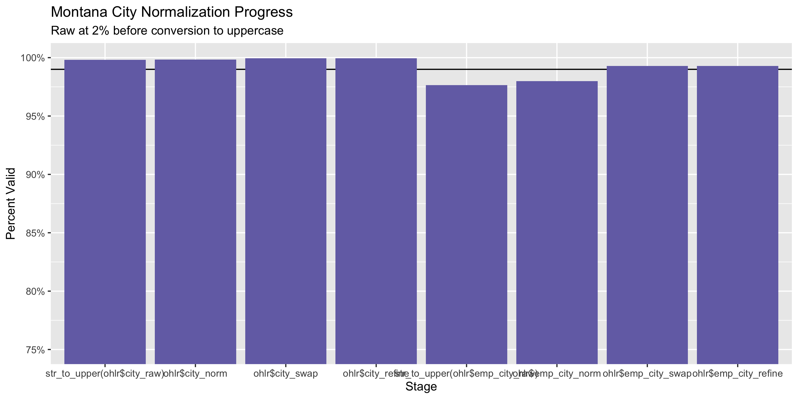
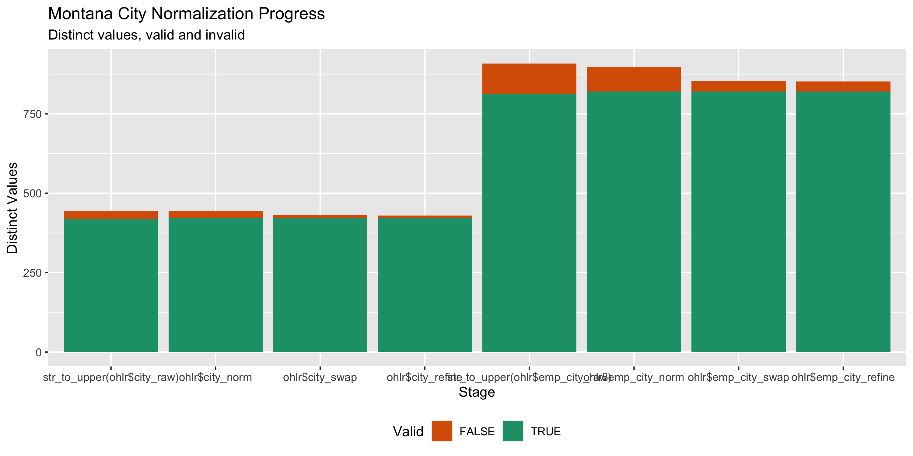

Ohio Lobbyists
================
Kiernan Nicholls & Yanqi Xu
2023-07-01 23:24:21

- [Project](#project)
- [Objectives](#objectives)
- [Packages](#packages)
- [Data](#data)
- [Import](#import)
- [Explore](#explore)
- [Wrangle](#wrangle)
- [Conclude](#conclude)
- [Export](#export)

<!-- Place comments regarding knitting here -->

## Project

The Accountability Project is an effort to cut across data silos and
give journalists, policy professionals, activists, and the public at
large a simple way to search across huge volumes of public data about
people and organizations.

Our goal is to standardizing public data on a few key fields by thinking
of each dataset row as a transaction. For each transaction there should
be (at least) 3 variables:

1.  All **parties** to a transaction
2.  The **date** of the transaction
3.  The **amount** of money involved

## Objectives

This document describes the process used to complete the following
objectives:

1.  How many records are in the database?
2.  Check for duplicates
3.  Check ranges
4.  Is there anything blank or missing?
5.  Check for consistency issues
6.  Create a five-digit ZIP Code called `zip_clean`
7.  Create a `YEAR` field from the transaction date
8.  Make sure there is data on both parties to a transaction

## Packages

The following packages are needed to collect, manipulate, visualize,
analyze, and communicate these results. The `pacman` package will
facilitate their installation and attachment.

The IRW’s `campfin` package will also have to be installed from GitHub.
This package contains functions custom made to help facilitate the
processing of campaign finance data.

``` r
if (!require("pacman")) install.packages("pacman")
pacman::p_load_gh("irworkshop/campfin")
pacman::p_load(
  stringdist, # levenshtein value
  RSelenium, # remote browser
  tidyverse, # data manipulation
  lubridate, # datetime strings
  magrittr, # pipe opperators
  janitor, # dataframe clean
  refinr, # cluster and merge
  scales, # format strings
  knitr, # knit documents
  vroom, # read files fast
  glue, # combine strings
  httr, # query the web
  here, # relative storage
  fs # search storage 
)
```

This document should be run as part of the `R_campfin` project, which
lives as a sub-directory of the more general, language-agnostic
[`irworkshop/accountability_datacleaning`](https://github.com/irworkshop/accountability_datacleaning "TAP repo")
GitHub repository.

The `R_campfin` project uses the [RStudio
projects](https://support.rstudio.com/hc/en-us/articles/200526207-Using-Projects "Rproj")
feature and should be run as such. The project also uses the dynamic
`here::here()` tool for file paths relative to *your* machine.

``` r
# where does this document knit?
here::here()
#> [1] "/Users/yanqixu/code/accountability_datacleaning"
```

## Data

Data is obtained from the [Ohio Legislative Inspector
General](http://www.jlec-olig.state.oh.us/) (OLIG) Joint Legislative
Ethics Committee (JLEC)

> JLEC provides access to the database of all currently registered
> legislative agents, executive agency and retirement system lobbyists,
> and their employers. If you want to search the database for a specific
> agent or employer, this can be done in the website’s Search For
> Lobbying Agents and Employers feature. Alternatively, a complete list
> of all currently registered Agents and a separate list of all
> Employers have been created and are updated daily. Please note, the
> lobbying lists include both private and public sector employees.

## Import

### Download

The list of active lobbyists by year can be downloaded directly from the
[OLIG-JLEC
website](https://www2.jlec-olig.state.oh.us/olac/Reports/AgentActivityByYear.aspx).
In this update, we included everything from 2009 to 2023.Next update can
start with 2024.

``` r
raw_dir <- here("state","oh", "lobbying", "data", "raw")
dir_create(raw_dir)
```

Employer address is also available but can only be queried on a certain
date. Here we set the date to June 30 of each year.

``` r
raw_urls <- glue("https://www2.jlec-olig.state.oh.us/olac/Reports/Excel_ActiveAgentDetails.aspx?y={2009:2023}")
raw_paths <- glue(raw_dir,"/ActiveAgentDetails{2020:2023}.csv")
for (f in raw_paths) {
if (!this_file_new(f)) {
  download.file(raw_urls, raw_paths)
}
}

emp_urls <- glue("https://www2.jlec-olig.state.oh.us/olac/Reports/Excel_ActiveEmployerSummary.aspx?d=6/30/{2009:2023}")
emp_paths <- glue(raw_dir,"/ActiveEmployerSummary{2009:2023}.csv")
for (f in emp_paths) {
if (!this_file_new(f)) {
  download.file(emp_urls, emp_paths)
}
}
```

``` r
ohlr <- map_dfr(dir_ls(raw_dir,regexp = ".+Agent.+"),read_csv, .id = "source") %>% clean_names()

ohlr <- ohlr %>% select(-x11) %>% mutate(year = str_extract(source, "\\d{4}"))

ohlr <-  ohlr %>% select(-source)
```

``` r
emp <- map_dfr(dir_ls(raw_dir,regexp = ".+Employer.+"),read_csv) %>% clean_names()

emp <- emp %>% unite(
  address_1,
  address_2,
  col = address_combined,
  sep = " ",
  remove = FALSE,
  na.rm = TRUE
  ) %>%
  mutate(address_clean = normal_address(
  address = address_combined,
  abbs = usps_city,
  na_rep = TRUE
  )) %>% 
  select(-address_combined)

emp_clean <- emp %>% 
  select(employer_name, address_clean, city,state,zipcode,phone) %>% unique() 

names(emp_clean)[2:6] <- str_c("emp_",names(emp_clean)[2:6])
```

``` r
ohlr <- ohlr %>% left_join(emp_clean)
```

## Explore

``` r
head(ohlr)
#> # A tibble: 6 × 16
#>   agent_l…¹ agent…² addre…³ addre…⁴ city  state zipcode phone emplo…⁵ engag…⁶ year  emp_a…⁷ emp_c…⁸
#>   <chr>     <chr>   <chr>   <chr>   <chr> <chr> <chr>   <chr> <chr>   <chr>   <chr> <chr>   <chr>  
#> 1 Ronald    Abrams  175 So… <NA>    Colu… OH    43215   614-… Ohio A… Legisl… 2009  175 SO… Columb…
#> 2 Ronald    Abrams  175 So… <NA>    Colu… OH    43215   614-… Ohio A… Execut… 2009  175 SO… Columb…
#> 3 Laura     Abu-Ab… 37 W. … <NA>    Colu… OH    43215   614-… Bureau… Legisl… 2009  30 W S… Columb…
#> 4 Theodore… Adams   Three … <NA>    Colu… OH    43230   614-… L Bran… Legisl… 2009  THREE … Columb…
#> 5 Theodore… Adams   Three … <NA>    Colu… OH    43230   614-… L Bran… Execut… 2009  THREE … Columb…
#> 6 Elizabet… Adamson 4700 R… <NA>    Colu… OH    43220   614-… Ohio A… Legisl… 2009  4700 R… Columb…
#> # … with 3 more variables: emp_state <chr>, emp_zipcode <chr>, emp_phone <chr>, and abbreviated
#> #   variable names ¹​agent_l_name, ²​agent_f_name, ³​address_1, ⁴​address_2, ⁵​employer_name,
#> #   ⁶​engagement_type, ⁷​emp_address_clean, ⁸​emp_city
tail(ohlr)
#> # A tibble: 6 × 16
#>   agent_l…¹ agent…² addre…³ addre…⁴ city  state zipcode phone emplo…⁵ engag…⁶ year  emp_a…⁷ emp_c…⁸
#>   <chr>     <chr>   <chr>   <chr>   <chr> <chr> <chr>   <chr> <chr>   <chr>   <chr> <chr>   <chr>  
#> 1 William   Zimpher 30 Eas… INTERO… Colu… OH    43215   614-… Office… Legisl… 2023  30 E B… Columb…
#> 2 William   Zimpher 30 Eas… INTERO… Colu… OH    43215   614-… Ohio D… Legisl… 2023  1980 W… Columb…
#> 3 Jennifer  Zinn    390 Wo… <NA>    West… OH    43082   614-… OCSEA … Legisl… 2023  390 WO… Wester…
#> 4 Jennifer  Zinn    390 Wo… <NA>    West… OH    43082   614-… OCSEA … Execut… 2023  390 WO… Wester…
#> 5 Catherin… Zwissl… P.O. B… <NA>    Buck… OH    43008   614-… Specia… Legisl… 2023  8226 S… Chagri…
#> 6 Catherin… Zwissl… P.O. B… <NA>    Buck… OH    43008   614-… Specia… Execut… 2023  8226 S… Chagri…
#> # … with 3 more variables: emp_state <chr>, emp_zipcode <chr>, emp_phone <chr>, and abbreviated
#> #   variable names ¹​agent_l_name, ²​agent_f_name, ³​address_1, ⁴​address_2, ⁵​employer_name,
#> #   ⁶​engagement_type, ⁷​emp_address_clean, ⁸​emp_city
glimpse(sample_frac(ohlr))
#> Rows: 125,422
#> Columns: 16
#> $ agent_l_name      <chr> "Erik", "Douglas J", "Jennifer", "Jana", "Andrew", "Mark B", "Julie", "…
#> $ agent_f_name      <chr> "Mikkelson", "Preisse", "Hogue", "Fornario", "Minton", "Levy", "Davis",…
#> $ address_1         <chr> "10 W. Broad Street, Suite 200", "144 E State Street", "8050 N. High St…
#> $ address_2         <chr> NA, NA, NA, NA, NA, "INTEROFFICE - Orthotics Board", NA, NA, NA, NA, NA…
#> $ city              <chr> "Columbus", "Columbus", "Columbus", "Dayton", "Columbus", "Columbus", "…
#> $ state             <chr> "OH", "OH", "OH", "OH", "OH", "OH", "OH", "OH", "OH", "OH", "OH", "OH",…
#> $ zipcode           <chr> "43215", "43215", "43235", "45402", "43215", "43215-6108", "43235", "43…
#> $ phone             <chr> "614-221-2800", "614-224-7000", "614-540-4000", "614-644-8307", "614-82…
#> $ employer_name     <chr> "Ohio Association of Juvenile Court Judges", "Salon Schools Group", "Oh…
#> $ engagement_type   <chr> "Legislative", "Executive", "Legislative", "Legislative", "Executive", …
#> $ year              <chr> "2022", "2011", "2015", "2016", "2018", "2013", "2014", "2019", "2016",…
#> $ emp_address_clean <chr> "9300 QUINCY AVENUE", "1720 EAST BROAD STREET", "8050 N HIGH ST SUITE 1…
#> $ emp_city          <chr> "Cleveland", "Columbus", "Columbus", "Columbus", "Blacklick", "Columbus…
#> $ emp_state         <chr> "OH", "OH", "OH", "OH", "Ohio", "OH", "OH", "DC", "OH", "OH", "CA", "Oh…
#> $ emp_zipcode       <chr> "44106-3545", "43203", "43035", "43040", "43004", "43215-6108", "43235"…
#> $ emp_phone         <chr> "216-443-8404", "614-252-5252", "6145404000", "614-995-4411", "(614) 82…
```

### Missing

There are more than 1,000 entries missing an employer address, but that's likely because when we downloaded the employer list mid-year, and those employers were not active then. Given the number of records, it's still a relatively small number of employers we are missing. 

``` r
col_stats(ohlr, count_na)
#> # A tibble: 16 × 4
#>    col               class      n         p
#>    <chr>             <chr>  <int>     <dbl>
#>  1 agent_l_name      <chr>      0 0        
#>  2 agent_f_name      <chr>      0 0        
#>  3 address_1         <chr>     63 0.000502 
#>  4 address_2         <chr> 118207 0.942    
#>  5 city              <chr>      3 0.0000239
#>  6 state             <chr>      4 0.0000319
#>  7 zipcode           <chr>     44 0.000351 
#>  8 phone             <chr>     10 0.0000797
#>  9 employer_name     <chr>      0 0        
#> 10 engagement_type   <chr>      0 0        
#> 11 year              <chr>      0 0        
#> 12 emp_address_clean <chr>   1572 0.0125   
#> 13 emp_city          <chr>   1563 0.0125   
#> 14 emp_state         <chr>   1583 0.0126   
#> 15 emp_zipcode       <chr>   1583 0.0126   
#> 16 emp_phone         <chr>   1694 0.0135
```

``` r
ohlr <- flag_na(ohlr, agent_l_name, employer_name, zipcode)
if (sum(ohlr$na_flag) == 0) {
  ohlr <- select(ohlr, -na_flag)
}
```

### Duplicates

``` r
ohlr <- flag_dupes(ohlr, everything())
if (sum(ohlr$dupe_flag) == 0) {
  ohlr <- select(ohlr, -dupe_flag)
}
```

## Wrangle

### Address

``` r
packageVersion("tidyr")
#> [1] '1.3.0'
ohlr <- ohlr %>% 
  # combine street addr
  unite(
    col = address_full,
    starts_with("address"),
    sep = " ",
    remove = FALSE,
    na.rm = TRUE
  ) %>% 
  # normalize combined addr
  mutate(
    address_clean = normal_address(
      address = address_full,
      abbs = usps_street,
      na_rep = TRUE
    )
  ) %>% 
  select(-address_full)
```

``` r
ohlr %>% 
  select(starts_with("address")) %>% 
  distinct() %>% 
  sample_frac()
#> # A tibble: 3,587 × 3
#>    address_1                   address_2 address_clean            
#>    <chr>                       <chr>     <chr>                    
#>  1 995 East Broad St.          <NA>      995 EAST BROAD ST        
#>  2 7350 Skyline Drive East     <NA>      7350 SKYLINE DRIVE E     
#>  3 20852 Endsley Avenue        <NA>      20852 ENDSLEY AVE        
#>  4 2350 Kerner Blvd., Ste. 250 <NA>      2350 KERNER BLVD STE 250 
#>  5 PO Box 333                  <NA>      PO BOX 333               
#>  6 1712 Pioneer Ave Ste 568    <NA>      1712 PIONEER AVE STE 568 
#>  7 3393 Waterpoint Dr.         <NA>      3393 WATERPOINT DR       
#>  8 7850 Brookshire Court       <NA>      7850 BROOKSHIRE CT       
#>  9 175 S 3rd St, Suite 710     <NA>      175 S 3RD ST SUITE 710   
#> 10 1226 Huron Road             Suite 300 1226 HURON ROAD SUITE 300
#> # … with 3,577 more rows
```

### ZIP

``` r
ohlr <- ohlr %>% 
mutate_at(.vars = vars(ends_with('zipcode')), .funs = list(norm = ~ normal_zip(.,
      na_rep = TRUE)))
```

``` r
progress_table(
  ohlr$zipcode,
  ohlr$zipnorm,
  ohlr$emp_zipcode,
  ohlr$emp_zipcode_norm,
  compare = valid_zip
)
#> # A tibble: 4 × 6
#>   stage                 prop_in n_distinct    prop_na n_out n_diff
#>   <chr>                   <dbl>      <dbl>      <dbl> <dbl>  <dbl>
#> 1 ohlr$zipcode            0.876        979   0.000351 15581    349
#> 2 ohlr$zipnorm          NaN              0 NaN            0      0
#> 3 ohlr$emp_zipcode        0.948       1611   0.0126    6390    265
#> 4 ohlr$emp_zipcode_norm   0.996       1445   0.0126     474     28
```

### State

``` r
ohlr <- ohlr %>% 
  mutate_at(
  .vars = vars(ends_with("state")),
  .funs = list(norm = normal_state),
  abbreviate = TRUE,
  na_rep = TRUE,
  valid = valid_state
)
```

``` r
progress_table(
  ohlr$state,
  ohlr$state_norm,
  ohlr$emp_state,
  ohlr$emp_state_norm,
  compare = valid_state
)
#> # A tibble: 4 × 6
#>   stage               prop_in n_distinct   prop_na n_out n_diff
#>   <chr>                 <dbl>      <dbl>     <dbl> <dbl>  <dbl>
#> 1 ohlr$state            0.996         46 0.0000319   474      8
#> 2 ohlr$state_norm       1             39 0.000470      0      1
#> 3 ohlr$emp_state        0.785        118 0.0126    26598     74
#> 4 ohlr$emp_state_norm   1             47 0.0186        0      1
```

### City

``` r
ohlr <- ohlr %>% 
  mutate_at(
    .vars = vars(ends_with("city")),
    .funs = list(norm = normal_city),
      abbs = usps_city,
      states = c("OH", "DC", "OHIO"),
      na = invalid_city,
      na_rep = TRUE
    )
```

``` r
ohlr <- ohlr %>%
  rename(city_raw = city) %>% 
  left_join(
    y = zipcodes,
    by = c(
      "state_norm" = "state",
      "zipcode_norm" = "zip"
    )
  ) %>% 
  rename(city_match = city) %>% 
  mutate(
    match_dist = stringdist(city_norm, city_match),
    match_abb = is_abbrev(city_norm, city_match),
    city_swap = if_else(
      condition = match_abb | match_dist == 1,
      true = city_match,
      false = city_norm
    )
  ) %>% 
    select(
    -city_match,
    -match_dist,
    -match_abb
  )

ohlr <- ohlr %>%
  rename(emp_city_raw = emp_city) %>% 
  left_join(
    y = zipcodes,
    by = c(
      "emp_state_norm" = "state",
      "emp_zipcode_norm" = "zip"
    )
  ) %>% 
  rename(emp_city_match = city) %>% 
  mutate(
    match_dist = stringdist(emp_city_norm, emp_city_match),
    match_abb = is_abbrev(emp_city_norm, emp_city_match),
    emp_city_swap = if_else(
      condition = match_abb | match_dist == 1,
      true = emp_city_match,
      false = emp_city_norm
    )
  ) %>% 
  select(
    -emp_city_match,
    -match_dist,
    -match_abb
  )
```

``` r
ohlr %>% 
  filter(city_swap %out% valid_city) %>% 
  count(state_norm, city_norm, city_swap, sort = TRUE)
#> # A tibble: 45 × 4
#>    state_norm city_norm            city_swap                n
#>    <chr>      <chr>                <chr>                <int>
#>  1 OH         UPPER ARLINGTON      UPPER ARLINGTON        789
#>  2 OH         MORELAND HILLS       MORELAND HILLS         398
#>  3 OH         GAHANNA              GAHANNA                254
#>  4 OH         BEXLEY               BEXLEY                 221
#>  5 OH         FAIRLAWN             FAIRLAWN                83
#>  6 <NA>       EDINBURGH            <NA>                    51
#>  7 OH         COLUMBUS             <NA>                    43
#>  8 OH         CINCINNATI           <NA>                    40
#>  9 OH         WARRENSVILLE HEIGHTS WARRENSVILLE HEIGHTS    37
#> 10 VA         NORTH CHESTERFIELD   NORTH CHESTERFIELD      37
#> # … with 35 more rows
```

#### Refine

The \[OpenRefine\] algorithms can be used to group similar strings and
replace the less common versions with their most common counterpart.
This can greatly reduce inconsistency, but with low confidence; we will
only keep any refined strings that have a valid city/state/zip
combination.

``` r
good_refine <- ohlr %>% 
  mutate(
    city_refine = city_swap %>% 
      key_collision_merge() %>% 
      n_gram_merge(numgram = 1)
  ) %>% 
  filter(city_refine != city_swap) %>% 
  inner_join(
    y = zipcodes,
    by = c(
      "city_refine" = "city",
      "state_norm" = "state",
      "zipcode_norm" = "zip"
    )
  )
```

    #> # A tibble: 1 × 5
    #>   state_norm zipcode_norm city_swap  city_refine     n
    #>   <chr>      <chr>        <chr>      <chr>       <int>
    #> 1 OH         45202        CINNCINATI CINCINNATI     20

Then we can join the refined values back to the database.

``` r
ohlr <- ohlr %>% 
  left_join(good_refine) %>% 
  mutate(city_refine = coalesce(city_refine, city_swap))
```

We can repeat the process for employer cities.

``` r
good_refine <- ohlr %>% 
  mutate(
    emp_city_refine = emp_city_swap %>% 
      key_collision_merge() %>% 
      n_gram_merge(numgram = 1)
  ) %>% 
  filter(emp_city_refine != emp_city_swap) %>% 
  inner_join(
    y = zipcodes,
    by = c(
      "emp_city_refine" = "city",
      "emp_state_norm" = "state",
      "emp_zipcode_norm" = "zip"
    )
  )
```

``` r
ohlr <- ohlr %>% 
  left_join(good_refine) %>% 
  mutate(emp_city_refine = coalesce(emp_city_refine, emp_city_swap))
```

#### Progress

| stage                                                                              | prop_in | n_distinct | prop_na | n_out | n_diff |
|:-----------------------------------------------------------------------------------|--------:|-----------:|--------:|------:|-------:|
| str_to_upper(ohlr$city_raw) | 0.998| 444| 0.000| 243| 25| |ohlr$city_norm          |   0.998 |        443 |   0.000 |   195 |     20 |
| ohlr$city_swap | 0.999| 431| 0.001| 76| 9| |ohlr$city_refine                       |   1.000 |        430 |   0.001 |    56 |      8 |
| str_to_upper(ohlr$emp_city_raw) | 0.977| 908| 0.012| 2907| 95| |ohlr$emp_city_norm |   0.980 |        897 |   0.012 |  2496 |     77 |
| ohlr$emp_city_swap | 0.993| 854| 0.023| 884| 34| |ohlr$emp_city_refine             |   0.993 |        852 |   0.023 |   875 |     32 |

You can see how the percentage of valid values increased with each
stage.

<!-- -->

More importantly, the number of distinct values decreased each stage. We
were able to confidently change many distinct invalid values to their
valid equivalent.

<!-- -->

### Phone

We can use `campfin::normal_phone()` to convert the numeric phone
numbers into an unambiguous character format. This prevents the column
from being read as a numeric variable.

``` r
ohlr <- ohlr %>% 
  mutate(
    phone_clean = normal_phone(phone),
    emp_phone_clean = normal_phone(emp_phone)
  )
```

    #> # A tibble: 15,289 × 4
    #>    phone         emp_phone      phone_clean    emp_phone_clean
    #>    <chr>         <chr>          <chr>          <chr>          
    #>  1 6142334162    6142334127     (614) 233-4162 (614) 233-4127 
    #>  2 740-252-1543  513-921-1613   (740) 252-1543 (513) 921-1613 
    #>  3 617-563-3103  617-563-5662   (617) 563-3103 (617) 563-5662 
    #>  4 614-222-1532  614-222-1510   (614) 222-1532 (614) 222-1510 
    #>  5 614-607-4606  216.241.6689   (614) 607-4606 (216) 241-6689 
    #>  6 +441314732200 00441314732588 +441314732200  00441314732588 
    #>  7 330-802-2097  614-359-6072   (330) 802-2097 (614) 359-6072 
    #>  8 614-228-9800  419-262-3629   (614) 228-9800 (419) 262-3629 
    #>  9 614-227-8824  614-728-4642   (614) 227-8824 (614) 728-4642 
    #> 10 740-981-7684  4409303162     (740) 981-7684 (440) 930-3162 
    #> # … with 15,279 more rows

## Conclude

1.  There are 125,422 records in the database.
2.  There are no duplicate records in the database.
3.  There are no records missing any pertinent information.
4.  Consistency in goegraphic data has been improved with
    `campfin::normal_*()`.
5.  The 5-digit `zip_norm` variable has been created with
    `campfin::normal_zip()`.

## Export

``` r
ohlr <- ohlr %>% 
  select(
    -city_norm,
    -emp_city_norm,
    -city_swap,
    -emp_city_swap
  ) %>% 
  rename(
    city_clean = city_refine,
    emp_city_clean = emp_city_refine
  ) %>% 
  rename_all(~str_replace(., "_norm", "_clean"))
```

``` r
proc_dir <- here("state","oh", "lobbying", "data", "processed")
dir_create(proc_dir)
```

``` r
ohlr %>% 
  write_csv(
    path = glue("{proc_dir}/oh_lobby_reg.csv"),
    na = ""
  )
```
