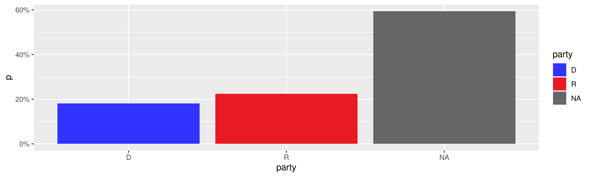
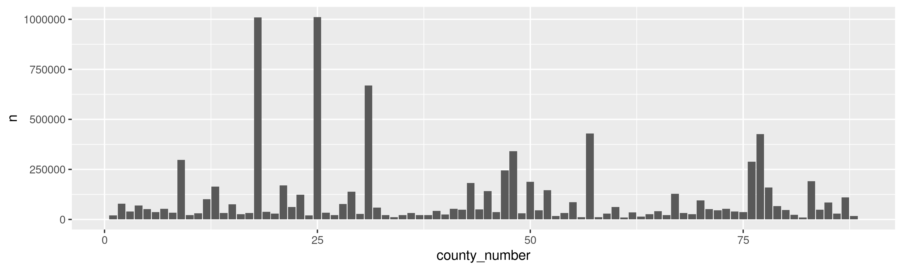
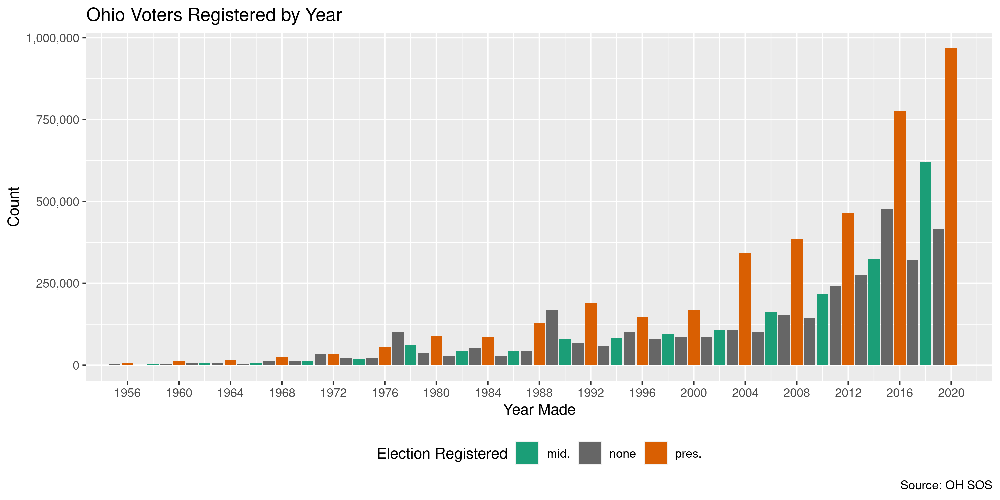
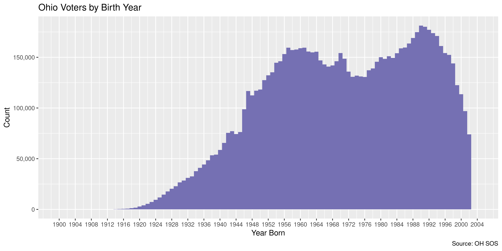

Ohio Voters
================
Kiernan Nicholls
2020-12-10 11:41:13

  - [Project](#project)
  - [Objectives](#objectives)
  - [Packages](#packages)
  - [Data](#data)
      - [About](#about)
  - [Download](#download)
  - [Read](#read)
      - [New](#new)
      - [Old](#old)
      - [Bind](#bind)
  - [Explore](#explore)
      - [Missing](#missing)
      - [Duplicates](#duplicates)
      - [Categorical](#categorical)
      - [Dates](#dates)
  - [Wrangle](#wrangle)
  - [Conclude](#conclude)
  - [Export](#export)
  - [Upload](#upload)

<!-- Place comments regarding knitting here -->

## Project

The Accountability Project is an effort to cut across data silos and
give journalists, policy professionals, activists, and the public at
large a simple way to search across huge volumes of public data about
people and organizations.

Our goal is to standardizing public data on a few key fields by thinking
of each dataset row as a transaction. For each transaction there should
be (at least) 3 variables:

1.  All **parties** to a transaction.
2.  The **date** of the transaction.
3.  The **amount** of money involved.

## Objectives

This document describes the process used to complete the following
objectives:

1.  How many records are in the database?
2.  Check for entirely duplicated records.
3.  Check ranges of continuous variables.
4.  Is there anything blank or missing?
5.  Check for consistency issues.
6.  Create a five-digit ZIP Code called `zip`.
7.  Create a `year` field from the transaction date.
8.  Make sure there is data on both parties to a transaction.

## Packages

The following packages are needed to collect, manipulate, visualize,
analyze, and communicate these results. The `pacman` package will
facilitate their installation and attachment.

The IRW’s `campfin` package will also have to be installed from GitHub.
This package contains functions custom made to help facilitate the
processing of campaign finance data.

``` r
if (!require("pacman")) install.packages("pacman")
pacman::p_load(
  tidyverse, # data manipulation
  lubridate, # datetime strings
  textreadr, # read docx files
  docxtractr, # read docx tables
  gluedown, # printing markdown
  janitor, # clean data frames
  campfin, # custom irw tools
  aws.s3, # aws cloud storage
  refinr, # cluster & merge
  scales, # format strings
  knitr, # knit documents
  vroom, # fast reading
  rvest, # scrape html
  glue, # code strings
  here, # project paths
  httr, # http requests
  fs # local storage 
)
```

This document should be run as part of the `R_campfin` project, which
lives as a sub-directory of the more general, language-agnostic
[`irworkshop/accountability_datacleaning`](https://github.com/irworkshop/accountability_datacleaning)
GitHub repository.

The `R_campfin` project uses the [RStudio
projects](https://support.rstudio.com/hc/en-us/articles/200526207-Using-Projects)
feature and should be run as such. The project also uses the dynamic
`here::here()` tool for file paths relative to *your* machine.

``` r
# where does this document knit?
here::i_am("oh/voters/docs/oh_voters_diary.Rmd")
```

## Data

A database of voters registered in the state of Ohio can be retrieved
from the Secretary of State’s [File Transfer
Page](https://www6.ohiosos.gov/ords/f?p=VOTERFTP:STWD:::#stwdVtrFiles).

> Welcome to the Ohio Secretary of State’s Voter Files Download Page. At
> this page you can download files of all registered voters by county,
> state senate district, state representative district, congressional
> district, or the entire state of Ohio. The statewide file is divided
> into four .zip files SWVF\_1\_22 (Adams-Erie), SWVF\_23\_44
> (Fairfield-Lawrence), SWVF\_45\_66 (Licking-Pike) and SWVF\_67\_88
> (Portage-Wyandot). The voter files available on this page are updated
> every week.

> The data is in a “comma delimited” format that can be imported into
> Microsoft Excel or opened in Access as well as many other spreadsheet
> or database programs. Many of the available files contain a
> significant quantity of data records. A spreadsheet program, such as
> MS Excel, may not allow all of the data in a file to be loaded because
> of a limit on the number of available rows. For this reason, it is
> advised that a database application be utilized to load and work with
> the data available at this site. For technical issues, please contact
> us at (614) 466-8467 or <voterdownload@OhioSoS.gov>.

We can also download a Microsoft Word document [record layout
file](https://www6.ohiosos.gov/ords/f?p=111:2::FILE_LAYOUT:NO:RP,2::).

``` r
download.file(
  url = "https://www6.ohiosos.gov/ords/f?p=111:2::FILE_LAYOUT:NO:RP,2::",
  destfile = layout_file <- file_temp(ext = "docx")
)
```

### About

``` r
readme <- read_docx(layout_file)
```

> This document contains a description of the Voter Registration Data
> Files that are available on the Ohio Secretary of State’s Election
> Division’s FTP site. These files are downloaded from the current
> Centralized Ohio Voter Registration Database. The database is a record
> collection of registered voters in the state of Ohio, as submitted by
> each county Board of Elections. These records are submitted and
> maintained in accordance with the Ohio Revised Code.

> Current files include voting histories for elections from year 2000 as
> provided by the counties. November 20 17 General Election history is
> complete as all the counties have finished the loading process.

``` r
layout_file %>% 
  read_docx() %>% 
  docx_extract_tbl() %>% 
  kable()
```

| Field.Name                                                                                                                             | Width | Description                                                                                                                                                                                                                                                                                        |
| :------------------------------------------------------------------------------------------------------------------------------------- | :---- | :------------------------------------------------------------------------------------------------------------------------------------------------------------------------------------------------------------------------------------------------------------------------------------------------- |
| SOS Voter Id                                                                                                                           | 13    | The Secretary of State centralized system’s generated unique number, assigned to each voter registration record.                                                                                                                                                                                   |
| County Number                                                                                                                          | 2     | Number that identifies each of Ohio’s 88 Counties (01-88).                                                                                                                                                                                                                                         |
| County Id                                                                                                                              | 50    | County’s system generated, unique number assigned to each voter registration record.                                                                                                                                                                                                               |
| Last Name                                                                                                                              | 50    | Voter’s last name.                                                                                                                                                                                                                                                                                 |
| First Name                                                                                                                             | 50    | Voter’s first name.                                                                                                                                                                                                                                                                                |
| Middle Name                                                                                                                            | 50    | Voter’s middle name.                                                                                                                                                                                                                                                                               |
| Suffix                                                                                                                                 | 10    | Voter’s name suffix.                                                                                                                                                                                                                                                                               |
| Date Of Birth                                                                                                                          | 10    | Voter’s Date of Birth in YYYY-MM-DD format.                                                                                                                                                                                                                                                        |
| Registration Date                                                                                                                      | 10    | Date voter registered in YYYY-MM-DD format.                                                                                                                                                                                                                                                        |
| Voter Status                                                                                                                           | 10    | Shows current Voter Status                                                                                                                                                                                                                                                                         |
| Party Affiliation                                                                                                                      | 1     | The voter’s party affiliation as recorded from their last Primary Election history. Values are:C - Constitution PartyD - Democrat PartyE - Reform PartyG - Green PartyL - Libertarian PartyN - Natural Law PartyR - Republican PartyS - Socialist Party                                            |
| Residential Address1                                                                                                                   | 100   | Voter’s street address.                                                                                                                                                                                                                                                                            |
| Residential Address 2                                                                                                                  | 100   | “                                                                                                                                                                                                                                                                                                  |
| Residential City                                                                                                                       | 50    | “                                                                                                                                                                                                                                                                                                  |
| Residential State                                                                                                                      | 20    | “                                                                                                                                                                                                                                                                                                  |
| Residential Zip                                                                                                                        | 5     | “                                                                                                                                                                                                                                                                                                  |
| Residential Zip Plus 4                                                                                                                 | 4     | “                                                                                                                                                                                                                                                                                                  |
| Residential Country                                                                                                                    | 50    | “                                                                                                                                                                                                                                                                                                  |
| Residential Postal Code                                                                                                                | 10    | “                                                                                                                                                                                                                                                                                                  |
| Mailing Address1                                                                                                                       | 100   | Voter’s mailing address.                                                                                                                                                                                                                                                                           |
| Mailing Address 2                                                                                                                      | 10    | “                                                                                                                                                                                                                                                                                                  |
| Mailing City                                                                                                                           | 50    | “                                                                                                                                                                                                                                                                                                  |
| Mailing State                                                                                                                          | 20    | “                                                                                                                                                                                                                                                                                                  |
| Mailing Zip                                                                                                                            | 5     | “                                                                                                                                                                                                                                                                                                  |
| Mailing Zip Plus 4                                                                                                                     | 4     | “                                                                                                                                                                                                                                                                                                  |
| Mailing Country                                                                                                                        | 50    | “                                                                                                                                                                                                                                                                                                  |
| Mailing Postal Code                                                                                                                    | 10    | “                                                                                                                                                                                                                                                                                                  |
| Career Center                                                                                                                          | 80    | Name of Career Center                                                                                                                                                                                                                                                                              |
| City                                                                                                                                   | 80    | Name of City                                                                                                                                                                                                                                                                                       |
| City School District                                                                                                                   | 80    | Name of City School District                                                                                                                                                                                                                                                                       |
| County Court District                                                                                                                  | 80    | Name of County Court                                                                                                                                                                                                                                                                               |
| Congressional District                                                                                                                 | 2     | Congressional District identifier                                                                                                                                                                                                                                                                  |
| Court of Appeals                                                                                                                       | 2     | Court of Appeals identifier                                                                                                                                                                                                                                                                        |
| Education Service Center                                                                                                               | 80    | Name of Education Service Center                                                                                                                                                                                                                                                                   |
| Exempted Village School District                                                                                                       | 80    | Name of Exempt School District                                                                                                                                                                                                                                                                     |
| Library District                                                                                                                       | 80    | Name of Library District                                                                                                                                                                                                                                                                           |
| Local School District                                                                                                                  | 80    | Name of Local School District                                                                                                                                                                                                                                                                      |
| Municipal Court District                                                                                                               | 80    | Name of Municipal Court District                                                                                                                                                                                                                                                                   |
| Precinct                                                                                                                               | 80    | Name of Precinct                                                                                                                                                                                                                                                                                   |
| Precinct Code                                                                                                                          | 20    | Code assigned to the Precinct                                                                                                                                                                                                                                                                      |
| State Board of Education                                                                                                               | 2     | State Board of Education identifier                                                                                                                                                                                                                                                                |
| State Representative District                                                                                                          | 2     | House District identifier                                                                                                                                                                                                                                                                          |
| State Senate District                                                                                                                  | 2     | State Senate District identifier                                                                                                                                                                                                                                                                   |
| Township                                                                                                                               | 20    | Name of Township                                                                                                                                                                                                                                                                                   |
| Village                                                                                                                                | 20    | Name of Village                                                                                                                                                                                                                                                                                    |
| Ward                                                                                                                                   | 20    | Name of Ward                                                                                                                                                                                                                                                                                       |
| Variable filed name with election type and date of each election. Value for this field indicates how the voter voted in that election. | 50    | Values are:C - Constitution PartyD - Democrat PartyE - Reform PartyG - Green PartyL - Libertarian PartyN - Natural Law PartyR - Republican PartyS - Socialist Party X - Voted without declaring party affiliationBlank - Indicates that there is no voting record for this voter for this election |

## Download

We are going to download a record of voters statewide. This can be done
by scraping the download page itself for the links of the listed files
and then download each individually.

``` r
nc_dl <- GET(
  url = "https://www6.ohiosos.gov/ords/f",
  query = list(
    p = "VOTERFTP:STWD:::#stwdVtrFiles"
  )
)
```

The files are listed in an HTML table at the bottom of the page.

``` r
nc_table <- html_node(content(nc_dl), "table")
```

``` r
raw_urls <- nc_table %>% 
  html_nodes("a") %>% 
  html_attr("href") %>% 
  str_c(dirname(nc_dl$url), ., sep = "/")
```

``` r
nc_files <- html_table(nc_table) %>% 
  mutate(across(2, dmy)) %>% 
  mutate(across(3, ~as_fs_bytes(str_remove_all(., "[^\\w]"))))
```

``` r
nc_files %>%
  mutate(across(1, md_code)) %>% 
  mutate(across(1, md_link, raw_urls)) %>% 
  kable()
```

| Statewide File Name                                                                                                       | Last Updated | File Size |
| :------------------------------------------------------------------------------------------------------------------------ | :----------- | --------: |
| [`SWVF_1_22 (Adams-Erie)`](https://www6.ohiosos.gov/ords/f?p=VOTERFTP:DOWNLOAD::FILE:NO:2:P2_PRODUCT_NUMBER:363)          | 2020-12-05   |      184M |
| [`SWVF_23_44 (Fairfield-Lawrence)`](https://www6.ohiosos.gov/ords/f?p=VOTERFTP:DOWNLOAD::FILE:NO:2:P2_PRODUCT_NUMBER:364) | 2020-12-05   |      190M |
| [`SWVF_45_66 (Licking-Pike)`](https://www6.ohiosos.gov/ords/f?p=VOTERFTP:DOWNLOAD::FILE:NO:2:P2_PRODUCT_NUMBER:365)       | 2020-12-05   |      151M |
| [`SWVF_67_88 (Portage-Wyandot)`](https://www6.ohiosos.gov/ords/f?p=VOTERFTP:DOWNLOAD::FILE:NO:2:P2_PRODUCT_NUMBER:366)    | 2020-12-05   |      160M |

As the page notes, these files are individually compressed text files.

> Note: These statewide voter files are available as compressed (gzip)
> files. Please use a compression tool to uncompress these files after
> downloading.

``` r
raw_dir <- dir_create(here("oh", "voters", "data", "raw"))
raw_paths <- dir_ls(raw_dir, glob = "*.gz")
```

``` r
if (length(raw_paths) < nrow(nc_files)) {
  raw_paths <- character(nrow(nc_files))
  for (i in seq_along(raw_urls)) {
    raw_head <- HEAD(raw_urls[i])
    raw_disp <- headers(raw_head)[["content-disposition"]]
    raw_name <- str_extract(raw_disp, "(?<=filename\\=\").*(?=\";)")
    raw_paths[i] <- path(raw_dir, raw_name)
    download.file(raw_urls[i], raw_paths[i])
  }
}
```

## Read

The Workshop has an older version of this data on the TAP already. We
will download all the new files, then our current older version, keep
only those voters *not* found in the new version (using their unique
ID), and then combining the two versions. This will give us the most
comprehensive historical record of registered voters.

### New

``` r
ohv <- vroom(
  file = raw_paths,
  delim = ",",
  escape_double = FALSE,
  col_types = cols(
    .default = col_character(),
    DATE_OF_BIRTH = col_date(),
    REGISTRATION_DATE = col_date()
  )
)
```

``` r
comma(nrow(ohv))
#> [1] "8,118,052"
```

``` r
vote_hist <- select(ohv, SOS_VOTERID, matches("\\d{2}/\\d{2}/\\d{4}"))
ohv <- select(ohv, -matches("\\d{2}/\\d{2}/\\d{4}"))
flush_memory(1)
```

``` r
hist_file <- here("oh", "voters", "data", "vote_hist.tsv")
if (!file_exists(hist_file)) {
  file_create(dupe_file)
  n <- 100000 # rows per chunk
  nr <- nrow(vote_hist)
  # split file into chunks
  split_hist <- split(
    x = vote_hist, 
    f = rep(x = seq(ceiling(nr/n)), each = n, length.out = nr)
  )
  row_done <- 0
  pb <- txtProgressBar(max = nrow(ohv), style = 3)
  for (i in seq_along(split_hist)) {
    row_new <- nrow(split_hist[[i]])
    split_long <- pivot_longer(
      data = split_hist[[i]],
      cols = -SOS_VOTERID,
      names_sep = "-",
      names_to = c("type", "date"),
      names_transform = list(date = mdy),
      values_to = "vote",
      values_drop_na = TRUE
    )
    write_tsv(
      x = split_long, 
      file = hist_file, 
      append = TRUE
    )
    rm(split_long)
    split_hist[[i]] <- NA
    Sys.sleep(2)
    flush_memory(1)
    row_done <- row_done + row_new
    setTxtProgressBar(pb, value = row_done)
  }
}
```

### Old

``` r
old_path <- here("oh", "voters", "data", "oh_voters_old.csv")
if (!file_exists(old_path)) {
  save_object(
    object = "csv/oh_voters.csv", 
    bucket = "publicaccountability", 
    file = old_path,
    show_progress = TRUE
  )
}
```

``` r
oho <- vroom(
  file = old_path,
  quote = "",
  delim = ",",
  escape_double = FALSE,
  escape_backslash = FALSE,
  col_types = cols(
    .default = col_character(),
    DATE_OF_BIRTH = col_date(),
    REGISTRATION_DATE = col_date()
  )
)
```

``` r
comma(nrow(oho))
#> [1] "8,068,935"
oho <- filter(oho, SOS_VOTERID %out% ohv$SOS_VOTERID)
comma(nrow(oho))
#> [1] "1,077,956"
```

``` r
setdiff(names(oho), names(ohv))
#> [1] "ZIP5"                   "RESIDENTIAL_CITY_CLEAN" "YEAR"                  
#> [4] "BIRTHYEAR"
oho <- select(oho, -all_of(setdiff(names(oho), names(ohv))))
all(names(oho) %in% names(ohv))
#> [1] TRUE
```

### Bind

``` r
ohv <- bind_rows(new = ohv, old = oho, .id = "source_file")
comma(nrow(ohv))
#> [1] "9,196,008"
rm(oho)
```

## Explore

There are 9,196,008 rows of 47 columns.

``` r
glimpse(ohv)
#> Rows: 9,196,008
#> Columns: 47
#> $ sos_voterid                   <chr> "OH0020934379", "OH0016352197", "OH0018026595", "OH002…
#> $ county_number                 <chr> "18", "02", "13", "09", "18", "15", "01", "18", "17", …
#> $ county_id                     <chr> "2443137", "83559", "742057", "560219", "1607591", "99…
#> $ last_name                     <chr> "SCALES", "HATTON", "IVEY", "LONSWAY", "TATE", "STEVEN…
#> $ first_name                    <chr> "CURTIS", "RIKKI", "LEAH", "ADRIENNE", "TERRELL", "JOA…
#> $ middle_name                   <chr> "LAMELLA", "R", "N", NA, "J", "MARIE", "KAY", "STAUFFE…
#> $ suffix                        <chr> "JR", NA, NA, NA, NA, NA, NA, NA, NA, NA, NA, NA, NA, …
#> $ birth_date                    <date> 1990-09-16, 1968-08-29, 1986-02-16, 1991-09-20, 1969-…
#> $ reg_date                      <date> 2012-08-07, 2004-01-26, 2012-09-19, 2020-07-14, 2012-…
#> $ voter_status                  <chr> "ACTIVE", "ACTIVE", "ACTIVE", "ACTIVE", "ACTIVE", "ACT…
#> $ party                         <chr> NA, NA, "R", NA, "D", NA, NA, NA, NA, NA, NA, "R", NA,…
#> $ addr1                         <chr> "8504 TIOGA AVE", "15125 HOCH RD", "2517 WOODVILLE PIK…
#> $ addr2                         <chr> NA, NA, NA, NA, NA, NA, "APT 307", NA, NA, NA, NA, NA,…
#> $ city                          <chr> "CLEVELAND", "SPENCERVILLE", "GOSHEN", "HAMILTON", "GA…
#> $ state                         <chr> "OH", "OH", "OH", "OH", "OH", "OH", "OH", "OH", "OH", …
#> $ zip                           <chr> "44105", "45887", "45122", "45011", "44125", "43920", …
#> $ zip4                          <chr> NA, "9535", NA, NA, NA, NA, "9000", NA, NA, NA, NA, NA…
#> $ country                       <chr> NA, NA, NA, NA, NA, NA, NA, NA, NA, NA, NA, NA, NA, NA…
#> $ postal                        <chr> NA, NA, NA, NA, NA, NA, NA, NA, NA, NA, NA, NA, NA, NA…
#> $ mail_addr1                    <chr> NA, NA, NA, NA, NA, NA, NA, NA, NA, NA, NA, NA, NA, "P…
#> $ mail_addr2                    <chr> NA, NA, NA, NA, NA, NA, NA, NA, NA, NA, NA, NA, NA, NA…
#> $ mail_city                     <chr> NA, NA, NA, NA, NA, NA, NA, NA, NA, NA, NA, NA, NA, "A…
#> $ mail_state                    <chr> NA, NA, NA, NA, NA, NA, NA, NA, NA, NA, NA, NA, NA, "O…
#> $ mail_zip                      <chr> NA, NA, NA, NA, NA, NA, NA, NA, NA, NA, NA, NA, NA, "4…
#> $ mail_zip4                     <chr> NA, NA, NA, NA, NA, NA, NA, NA, NA, NA, NA, NA, NA, "0…
#> $ mail_country                  <chr> NA, NA, NA, NA, NA, NA, NA, NA, NA, NA, NA, NA, NA, NA…
#> $ mail_postal                   <chr> NA, NA, NA, NA, NA, NA, NA, NA, NA, NA, NA, NA, NA, NA…
#> $ career_center                 <chr> NA, "APOLLO CAREER CENTER", "GREAT OAKS CAREER CAMPUSE…
#> $ vote_city                     <chr> NA, NA, NA, NA, NA, "EAST LIVERPOOL CITY", NA, NA, "GA…
#> $ city_school_district          <chr> "CLEVELAND MUNICIPAL CITY SD", NA, NA, NA, "GARFIELD H…
#> $ county_court_district         <chr> NA, NA, NA, NA, NA, NA, NA, NA, NA, NA, NA, NA, NA, NA…
#> $ congressional_district        <chr> "11", "04", "02", "08", "11", "06", "02", "09", "04", …
#> $ court_of_appeals              <chr> "08", "03", "12", "12", "08", "07", "04", "08", "03", …
#> $ edu_service_center_district   <chr> NA, "ALLEN COUNTY ESC", NA, "BUTLER COUNTY ESC", NA, N…
#> $ exempted_vill_school_district <chr> NA, NA, NA, NA, NA, NA, NA, NA, NA, NA, NA, NA, NA, NA…
#> $ library                       <chr> NA, NA, NA, NA, NA, NA, NA, NA, NA, NA, NA, NA, NA, NA…
#> $ local_school_district         <chr> NA, "SPENCERVILLE LOCAL SD (ALLEN)", NA, "LAKOTA LOCAL…
#> $ municipal_court_district      <chr> "CLEVELAND", "LIMA", NA, NA, "GARFIELD-HEIGHTS", "EAST…
#> $ precinct_name                 <chr> "CLEVELAND-02-B", "SPENCER A", "GOSHEN TOWNSHIP D", "L…
#> $ precinct_code                 <chr> "18-P-AJJ", "02AGI", "13-P-ABC", "09-P-AGN", "18-P-BTN…
#> $ state_board_of_education      <chr> "11", "01", "10", "03", "11", "08", "10", "05", "01", …
#> $ state_representative_district <chr> "11", "04", "65", "52", "11", "05", "90", "16", "87", …
#> $ state_senate_district         <chr> "21", "12", "14", "04", "21", "33", "14", "24", "26", …
#> $ township                      <chr> NA, "Township Spencer", "GOSHEN TWP", "LIBERTY TOWNSHI…
#> $ village                       <chr> NA, NA, NA, NA, NA, NA, "SEAMAN VILLAGE", NA, NA, NA, …
#> $ ward                          <chr> "CLEVELAND WARD 2", NA, NA, NA, "GARFIELD HEIGHTS WARD…
#> $ source_file                   <chr> "new", "new", "new", "new", "new", "new", "new", "new"…
tail(ohv)
#> # A tibble: 6 x 47
#>   sos_voterid county_number county_id last_name first_name middle_name suffix birth_date
#>   <chr>       <chr>         <chr>     <chr>     <chr>      <chr>       <chr>  <date>    
#> 1 OH00127032… 70            69631     GRAY      LUCILLE    <NA>        <NA>   1948-07-06
#> 2 OH00128141… 87            321276    CAMERON   BRIAN      WAITE       <NA>   1983-12-25
#> 3 OH00212317… 73            111727    DAVIS     JAMES      O           <NA>   1947-12-05
#> 4 OH00211672… 73            111320    GREGORY   SARAH      R           <NA>   1986-09-19
#> 5 OH00109430… 68            8809812   SCHUL     JOY        MARIE       <NA>   1938-09-03
#> 6 OH00243826… 70            100057352 BOYCE     JANNA      LEIGH       <NA>   1996-09-19
#> # … with 39 more variables: reg_date <date>, voter_status <chr>, party <chr>, addr1 <chr>,
#> #   addr2 <chr>, city <chr>, state <chr>, zip <chr>, zip4 <chr>, country <chr>, postal <chr>,
#> #   mail_addr1 <chr>, mail_addr2 <chr>, mail_city <chr>, mail_state <chr>, mail_zip <chr>,
#> #   mail_zip4 <chr>, mail_country <chr>, mail_postal <chr>, career_center <chr>,
#> #   vote_city <chr>, city_school_district <chr>, county_court_district <chr>,
#> #   congressional_district <chr>, court_of_appeals <chr>, edu_service_center_district <chr>,
#> #   exempted_vill_school_district <chr>, library <chr>, local_school_district <chr>,
#> #   municipal_court_district <chr>, precinct_name <chr>, precinct_code <chr>,
#> #   state_board_of_education <chr>, state_representative_district <chr>,
#> #   state_senate_district <chr>, township <chr>, village <chr>, ward <chr>, source_file <chr>
```

### Missing

Columns vary in their degree of missing values.

``` r
col_stats(ohv, count_na)
#> # A tibble: 47 x 4
#>    col                           class        n           p
#>    <chr>                         <chr>    <int>       <dbl>
#>  1 sos_voterid                   <chr>        0 0          
#>  2 county_number                 <chr>        0 0          
#>  3 county_id                     <chr>        0 0          
#>  4 last_name                     <chr>       21 0.00000228 
#>  5 first_name                    <chr>       10 0.00000109 
#>  6 middle_name                   <chr>   647962 0.0705     
#>  7 suffix                        <chr>  8797211 0.957      
#>  8 birth_date                    <date>       0 0          
#>  9 reg_date                      <date>       0 0          
#> 10 voter_status                  <chr>        0 0          
#> 11 party                         <chr>  5465102 0.594      
#> 12 addr1                         <chr>        0 0          
#> 13 addr2                         <chr>  8119595 0.883      
#> 14 city                          <chr>        0 0          
#> 15 state                         <chr>        2 0.000000217
#> 16 zip                           <chr>  1077957 0.117      
#> 17 zip4                          <chr>  8667616 0.943      
#> 18 country                       <chr>  9196008 1          
#> 19 postal                        <chr>  9196008 1          
#> 20 mail_addr1                    <chr>  8968157 0.975      
#> 21 mail_addr2                    <chr>  9194734 1.00       
#> 22 mail_city                     <chr>  8968620 0.975      
#> 23 mail_state                    <chr>  8969595 0.975      
#> 24 mail_zip                      <chr>  8969690 0.975      
#> 25 mail_zip4                     <chr>  9181878 0.998      
#> 26 mail_country                  <chr>  9194139 1.00       
#> 27 mail_postal                   <chr>  9194903 1.00       
#> 28 career_center                 <chr>  5515576 0.600      
#> 29 vote_city                     <chr>  6253078 0.680      
#> 30 city_school_district          <chr>  5164653 0.562      
#> 31 county_court_district         <chr>  8842074 0.962      
#> 32 congressional_district        <chr>  1077956 0.117      
#> 33 court_of_appeals              <chr>  1077956 0.117      
#> 34 edu_service_center_district   <chr>  6631764 0.721      
#> 35 exempted_vill_school_district <chr>  8851432 0.963      
#> 36 library                       <chr>  9196008 1          
#> 37 local_school_district         <chr>  6509264 0.708      
#> 38 municipal_court_district      <chr>  5294495 0.576      
#> 39 precinct_name                 <chr>      463 0.0000503  
#> 40 precinct_code                 <chr>      100 0.0000109  
#> 41 state_board_of_education      <chr>  1077956 0.117      
#> 42 state_representative_district <chr>  1077956 0.117      
#> 43 state_senate_district         <chr>  1077956 0.117      
#> 44 township                      <chr>  5472401 0.595      
#> 45 village                       <chr>  8660295 0.942      
#> 46 ward                          <chr>  5887584 0.640      
#> 47 source_file                   <chr>        0 0
```

We can flag any record missing a key variable needed to identify a
voter.

``` r
key_vars <- c("sos_voterid", "last_name", "birth_date", "reg_date")
ohv <- flag_na(ohv, all_of(key_vars))
sum(ohv$na_flag)
#> [1] 21
```

``` r
ohv %>% 
  filter(na_flag) %>% 
  select(sos_voterid, first_name, middle_name, last_name, birth_date)
#> # A tibble: 21 x 5
#>    sos_voterid  first_name middle_name last_name birth_date
#>    <chr>        <chr>      <chr>       <chr>     <date>    
#>  1 OH0023161330 BRIAN      <NA>        <NA>      1987-08-16
#>  2 OH0024598005 MATALAY    <NA>        <NA>      1969-11-18
#>  3 OH0023512707 JUNGHYE    KIM         <NA>      1980-07-10
#>  4 OH0024429442 PAN        MA          <NA>      1981-10-10
#>  5 OH0013823070 ELIZABETH  I           <NA>      1955-01-13
#>  6 OH0022208256 INA        <NA>        <NA>      1985-04-24
#>  7 OH0023550478 SU         SA          <NA>      1987-08-18
#>  8 OH0025794817 JOHN       CHRISTOPHER <NA>      1993-09-07
#>  9 OH0022468713 JIYOUNG    <NA>        <NA>      1963-03-20
#> 10 OH0024406108 CHENG      LUN         <NA>      1965-10-02
#> # … with 11 more rows
```

### Duplicates

We can also flag any record completely duplicated across every column.

``` r
dupe_file <- here("oh", "voters", "dupes.tsv.xz")
```

``` r
if (!file_exists(dupe_file)) {
  file_create(dupe_file)
  ohs <- ohv %>% 
    select(-sos_voterid, -county_id) %>% 
    group_split(county_number)
  split_id <- split(ohv$sos_voterid, ohv$county_number)
  pb <- txtProgressBar(max = length(ohs), style = 3)
  for (i in seq_along(ohs)) {
    d1 <- duplicated(ohs[[i]], fromLast = FALSE)
    if (any(d1)) {
      d2 <- duplicated(ohs[[i]], fromLast = TRUE)
      dupes <- tibble(sos_voterid = split_id[[i]], dupe_flag = d1 | d2)
      dupes <- filter(dupes, dupe_flag == TRUE)
      vroom_write(dupes, xzfile(dupe_file), append = TRUE)
      rm(d2, dupes)
    }
    rm(d1)
    flush_memory(1)
    setTxtProgressBar(pb, i)
  }
  rm(ohs)
}
```

``` r
file_size(dupe_file)
#> 1.65K
dupes <- read_tsv(
  file = xzfile(dupe_file),
  col_names = c("sos_voterid", "dupe_flag"),
  col_types = cols(
    sos_voterid = col_character(),
    dupe_flag = col_logical()
  )
)
dupes <- distinct(dupes)
```

``` r
nrow(ohv)
#> [1] 9196008
ohv <- left_join(ohv, dupes, by = "sos_voterid")
ohv <- mutate(ohv, dupe_flag = !is.na(dupe_flag))
sum(ohv$dupe_flag)
#> [1] 283
```

We can see that, despite unique IDs, there are duplicate voters.

``` r
ohv %>% 
  filter(dupe_flag) %>% 
  select(sos_voterid, all_of(key_vars)) %>% 
  arrange(last_name)
#> # A tibble: 283 x 4
#>    sos_voterid  last_name  birth_date reg_date  
#>    <chr>        <chr>      <date>     <date>    
#>  1 OH0026065942 ABRAMOVICH 1959-03-24 2020-11-02
#>  2 OH0026039865 ABRAMOVICH 1959-03-24 2020-11-02
#>  3 OH0026045522 BADER      1970-11-14 2020-11-03
#>  4 OH0026043463 BADER      1970-11-14 2020-11-03
#>  5 OH0026045494 BAL        1992-07-31 2020-11-03
#>  6 OH0026044683 BAL        1992-07-31 2020-11-03
#>  7 OH0025407215 BEERS      2000-03-08 2020-02-12
#>  8 OH0024464140 BEERS      2000-03-08 2020-02-12
#>  9 OH0023859505 BLACKWELL  1993-04-23 2019-10-09
#> 10 OH0025303136 BLACKWELL  1993-04-23 2019-10-09
#> # … with 273 more rows
```

### Categorical

``` r
col_stats(ohv, n_distinct)
#> # A tibble: 49 x 4
#>    col                           class        n           p
#>    <chr>                         <chr>    <int>       <dbl>
#>  1 sos_voterid                   <chr>  9196008 1          
#>  2 county_number                 <chr>       97 0.0000105  
#>  3 county_id                     <chr>  5235367 0.569      
#>  4 last_name                     <chr>   403442 0.0439     
#>  5 first_name                    <chr>   232975 0.0253     
#>  6 middle_name                   <chr>   178741 0.0194     
#>  7 suffix                        <chr>       90 0.00000979 
#>  8 birth_date                    <date>   32435 0.00353    
#>  9 reg_date                      <date>   23720 0.00258    
#> 10 voter_status                  <chr>        2 0.000000217
#> 11 party                         <chr>        6 0.000000652
#> 12 addr1                         <chr>  3778292 0.411      
#> 13 addr2                         <chr>    44002 0.00478    
#> 14 city                          <chr>     1205 0.000131   
#> 15 state                         <chr>        2 0.000000217
#> 16 zip                           <chr>     1260 0.000137   
#> 17 zip4                          <chr>     9771 0.00106    
#> 18 country                       <chr>        1 0.000000109
#> 19 postal                        <chr>        1 0.000000109
#> 20 mail_addr1                    <chr>    85634 0.00931    
#> 21 mail_addr2                    <chr>      907 0.0000986  
#> 22 mail_city                     <chr>     5206 0.000566   
#> 23 mail_state                    <chr>      257 0.0000279  
#> 24 mail_zip                      <chr>     6458 0.000702   
#> 25 mail_zip4                     <chr>     3665 0.000399   
#> 26 mail_country                  <chr>      325 0.0000353  
#> 27 mail_postal                   <chr>      729 0.0000793  
#> 28 career_center                 <chr>       52 0.00000565 
#> 29 vote_city                     <chr>      202 0.0000220  
#> 30 city_school_district          <chr>      184 0.0000200  
#> 31 county_court_district         <chr>       10 0.00000109 
#> 32 congressional_district        <chr>       17 0.00000185 
#> 33 court_of_appeals              <chr>       13 0.00000141 
#> 34 edu_service_center_district   <chr>       57 0.00000620 
#> 35 exempted_vill_school_district <chr>       48 0.00000522 
#> 36 library                       <chr>        1 0.000000109
#> 37 local_school_district         <chr>      364 0.0000396  
#> 38 municipal_court_district      <chr>       68 0.00000739 
#> 39 precinct_name                 <chr>     9504 0.00103    
#> 40 precinct_code                 <chr>     9766 0.00106    
#> 41 state_board_of_education      <chr>       12 0.00000130 
#> 42 state_representative_district <chr>      100 0.0000109  
#> 43 state_senate_district         <chr>       34 0.00000370 
#> 44 township                      <chr>      814 0.0000885  
#> 45 village                       <chr>      652 0.0000709  
#> 46 ward                          <chr>      872 0.0000948  
#> 47 source_file                   <chr>        2 0.000000217
#> 48 na_flag                       <lgl>        2 0.000000217
#> 49 dupe_flag                     <lgl>        2 0.000000217
```

<!-- --><!-- --><!-- -->

### Dates

1.1% of voters are registered on January 1st, 1900. This must be the
default when missing a date. We will remove these values.

``` r
min(ohv$reg_date)
#> [1] "1900-01-01"
mean(ohv$reg_date == "1900-01-01")
#> [1] 0.01096639
ohv$reg_date[ohv$reg_date == "1900-01-01"] <- NA
max(ohv$reg_date, na.rm = TRUE)
#> [1] "2020-12-04"
```

The birth dates are similar.

``` r
min(ohv$birth_date)
#> [1] "1800-01-01"
sum(ohv$birth_date == "1800-01-01")
#> [1] 2331
sum(ohv$birth_date == "1900-01-01")
#> [1] 295
ohv$birth_date[ohv$birth_date == "1800-01-01"] <- NA
ohv$birth_date[ohv$birth_date == "1900-01-01"] <- NA
max(ohv$birth_date, na.rm = TRUE)
#> [1] "2003-11-01"
```

We can add the calendar year from `reg_date` with `lubridate::year()`.

``` r
ohv <- mutate(ohv, reg_year = year(reg_date), birth_year = year(birth_date))
```

<!-- -->

<!-- -->

## Wrangle

To improve the searchability of the database, we will perform some
consistent, confident string normalization. For geographic variables
like city names and ZIP codes, the corresponding `campfin::normal_*()`
functions are tailor made to facilitate this process.

The residential `addr1` variable is already normalized how we want.

``` r
ohv %>% 
  select(addr1) %>% 
  sample_n(20)
#> # A tibble: 20 x 1
#>    addr1                 
#>    <chr>                 
#>  1 20 SECOND ST          
#>  2 5297 PRATER DR        
#>  3 4688 BRITTONHURST DR  
#>  4 1000 URLIN AVE        
#>  5 8910 E KEMPER RD      
#>  6 4395 ROCKY RIVER DR   
#>  7 44 ROBIN WAY          
#>  8 5940 CHATSWORTH DR    
#>  9 2217 BERRYWOOD DR     
#> 10 132 CHRISMAN AVE      
#> 11 2949 TOPICHILLS DR    
#> 12 450 SUMMIT ST NW      
#> 13 1331 W 70TH ST        
#> 14 15714 STATE HWY 103 W 
#> 15 1942 WOODS DR         
#> 16 7019 SPRING WALK DR NE
#> 17 2421 PASSAGE KEY TRL  
#> 18 6384 ROSEBURY DR      
#> 19 5781 ZARING DR        
#> 20 1080 N LINCOLN AV
```

As we would expect, the `state` and `zip` variables are also clean.

``` r
prop_in(ohv$zip, valid_zip)
#> [1] 0.9999851
prop_in(ohv$state, valid_state)
#> [1] 1
```

The cities are mostly valid, but the database uses abbreviations like
“HTS” rather than “HEIGHTS”, as we would in our database. We can
expand these abbreviations with `campfin::normal_city()`.

``` r
many_city <- c(valid_city, extra_city)
prop_in(ohv$city, many_city)
#> [1] 0.955614
norm_city <- ohv %>% 
  count(city, sort = TRUE) %>% 
  select(-n) %>% 
  filter(city %out% many_city) %>% 
  mutate(across(city, list(clean = normal_city), abbs = usps_city))
norm_city
#> # A tibble: 120 x 2
#>    city          city_clean       
#>    <chr>         <chr>            
#>  1 CLEVELAND HTS CLEVELAND HEIGHTS
#>  2 N RIDGEVILLE  NORTH RIDGEVILLE 
#>  3 SHAKER HTS    SHAKER HEIGHTS   
#>  4 GARFIELD HTS  GARFIELD HEIGHTS 
#>  5 MAPLE HTS     MAPLE HEIGHTS    
#>  6 BROADVIEW HTS BROADVIEW HEIGHTS
#>  7 E LIVERPOOL   EAST LIVERPOOL   
#>  8 PARMA HTS     PARMA HEIGHTS    
#>  9 WASHINGTON CH WASHINGTON CH    
#> 10 MAYFIELD HTS  MAYFIELD HEIGHTS 
#> # … with 110 more rows
prop_in(norm_city$city_clean, many_city)
#> [1] 0.4583333
```

This brings our known value above 99%.

``` r
ohv <- left_join(ohv, norm_city)
ohv <- mutate(ohv, city_clean = coalesce(city_clean, city))
prop_in(ohv$city_clean, many_city)
#> [1] 0.9907438
```

## Conclude

``` r
glimpse(sample_n(ohv, 50))
#> Rows: 50
#> Columns: 52
#> $ sos_voterid                   <chr> "OH0011580686", "OH0025664702", "OH0021266079", "OH001…
#> $ county_number                 <chr> "10", "02", "74", "51", "15", "18", "09", "78", "25", …
#> $ county_id                     <chr> "7900239", "1056534", "9001578", "148699", "9926721", …
#> $ last_name                     <chr> "OCEL", "HATTON", "HINCKLEY", "CROCK", "LAUGHNER", "CA…
#> $ first_name                    <chr> "VERNITA", "ERIC", "DUSTIN", "KIMBERLEE", "JENNIFER", …
#> $ middle_name                   <chr> "M", "DENVER", "R", "W", "L", "LOUISE", "A", "P", "NIC…
#> $ suffix                        <chr> NA, NA, NA, NA, NA, NA, "II", NA, NA, NA, NA, NA, NA, …
#> $ birth_date                    <date> 1932-10-04, 1975-08-04, 1972-09-08, 1958-09-10, 1977-…
#> $ reg_date                      <date> 1979-05-04, 2020-07-30, 2010-10-08, 2001-10-09, 2004-…
#> $ voter_status                  <chr> "CONFIRMATION", "ACTIVE", "ACTIVE", "CONFIRMATION", "A…
#> $ party                         <chr> NA, NA, NA, NA, "R", NA, "R", "D", NA, NA, NA, NA, NA,…
#> $ addr1                         <chr> "5193 MONARCH RD NE", "2885 MORNING SUN DR", "25 FROST…
#> $ addr2                         <chr> NA, NA, "APT C", NA, NA, NA, NA, NA, NA, NA, "APT P9",…
#> $ city                          <chr> "MECHANICSTOWN", "LIMA", "TIFFIN", "GALION", "SALEM", …
#> $ state                         <chr> "OH", "OH", "OH", "OH", "OH", "OH", "OH", "OH", "OH", …
#> $ zip                           <chr> NA, "45805", "44883", NA, "44460", "44135", "45011", "…
#> $ zip4                          <chr> NA, NA, NA, NA, NA, NA, NA, NA, NA, NA, NA, NA, NA, NA…
#> $ country                       <chr> NA, NA, NA, NA, NA, NA, NA, NA, NA, NA, NA, NA, NA, NA…
#> $ postal                        <chr> NA, NA, NA, NA, NA, NA, NA, NA, NA, NA, NA, NA, NA, NA…
#> $ mail_addr1                    <chr> NA, NA, NA, NA, NA, NA, NA, NA, NA, NA, NA, NA, NA, NA…
#> $ mail_addr2                    <chr> NA, NA, NA, NA, NA, NA, NA, NA, NA, NA, NA, NA, NA, NA…
#> $ mail_city                     <chr> NA, NA, NA, NA, NA, NA, NA, NA, NA, NA, NA, NA, NA, NA…
#> $ mail_state                    <chr> NA, NA, NA, NA, NA, NA, NA, NA, NA, NA, NA, NA, NA, NA…
#> $ mail_zip                      <chr> NA, NA, NA, NA, NA, NA, NA, NA, NA, NA, NA, NA, NA, NA…
#> $ mail_zip4                     <chr> NA, NA, NA, NA, NA, NA, NA, NA, NA, NA, NA, NA, NA, NA…
#> $ mail_country                  <chr> NA, NA, NA, NA, NA, NA, NA, NA, NA, NA, NA, NA, NA, NA…
#> $ mail_postal                   <chr> NA, NA, NA, NA, NA, NA, NA, NA, NA, NA, NA, NA, NA, NA…
#> $ career_center                 <chr> NA, "APOLLO CAREER CENTER", NA, NA, NA, NA, NA, "TRUMB…
#> $ vote_city                     <chr> NA, NA, "TIFFIN CITY", NA, NA, NA, NA, "GIRARD CITY", …
#> $ city_school_district          <chr> NA, NA, "TIFFIN CITY SD", NA, "SALEM CITY SD", "CLEVEL…
#> $ county_court_district         <chr> NA, NA, NA, NA, NA, NA, NA, NA, NA, NA, NA, NA, NA, NA…
#> $ congressional_district        <chr> NA, "04", "04", NA, "06", "09", "08", "13", "03", NA, …
#> $ court_of_appeals              <chr> NA, "03", "03", NA, "07", "08", "12", "11", "10", NA, …
#> $ edu_service_center_district   <chr> NA, "ALLEN COUNTY ESC", NA, NA, NA, NA, NA, NA, NA, NA…
#> $ exempted_vill_school_district <chr> NA, NA, NA, NA, NA, NA, NA, NA, NA, NA, NA, NA, NA, NA…
#> $ library                       <chr> NA, NA, NA, NA, NA, NA, NA, NA, NA, NA, NA, NA, NA, NA…
#> $ local_school_district         <chr> NA, "SHAWNEE LOCAL SD (ALLEN)", NA, NA, NA, NA, NA, NA…
#> $ municipal_court_district      <chr> NA, "LIMA", NA, NA, "COLUMBIANA-CO", "CLEVELAND", NA, …
#> $ precinct_name                 <chr> "EAST", "SHAWNEE D", "PRECINCT TIFFIN 1-A", "PRECINCT …
#> $ precinct_code                 <chr> "10AAV", "02AFQ", "74AAM", "51ADI", "15ADW", "18-P-BHM…
#> $ state_board_of_education      <chr> NA, "01", "01", NA, "08", "11", "03", "07", "09", NA, …
#> $ state_representative_district <chr> NA, "04", "88", NA, "05", "14", "53", "63", "17", NA, …
#> $ state_senate_district         <chr> NA, "12", "26", NA, "33", "23", "04", "32", "03", NA, …
#> $ township                      <chr> NA, "Township Shawnee", NA, NA, "PERRY TWP", NA, "WAYN…
#> $ village                       <chr> NA, NA, NA, NA, NA, NA, NA, NA, NA, NA, NA, NA, NA, NA…
#> $ ward                          <chr> NA, NA, "TIFFIN WARD 1", NA, NA, "CLEVELAND WARD 16", …
#> $ source_file                   <chr> "old", "new", "new", "old", "new", "new", "new", "new"…
#> $ na_flag                       <lgl> FALSE, FALSE, FALSE, FALSE, FALSE, FALSE, FALSE, FALSE…
#> $ dupe_flag                     <lgl> FALSE, FALSE, FALSE, FALSE, FALSE, FALSE, FALSE, FALSE…
#> $ reg_year                      <dbl> 1979, 2020, 2010, 2001, 2004, 2020, 2019, 2015, 2017, …
#> $ birth_year                    <dbl> 1932, 1975, 1972, 1958, 1977, 1973, 1972, 1958, 1996, …
#> $ city_clean                    <chr> "MECHANICSTOWN", "LIMA", "TIFFIN", "GALION", "SALEM", …
```

1.  There are 9,196,008 records in the database.
2.  There are 283 duplicate records in the database.
3.  The range and distribution of `amount` and `date` seem reasonable.
4.  There are 21 records missing key variables.
5.  Consistency in geographic data has been improved with
    `campfin::normal_*()`.
6.  The 4-digit `year` variable has been created with
    `lubridate::year()`.

## Export

Now the file can be saved on disk for upload to the Accountability
server.

``` r
clean_dir <- dir_create(here("oh", "voters", "data", "clean"))
clean_path <- path(clean_dir, "oh_voters_clean.csv")
write_csv(ohv, clean_path, na = "")
(clean_size <- file_size(clean_path))
#> 2.23G
file_encoding(clean_path) %>% 
  mutate(across(path, path.abbrev))
#> # A tibble: 1 x 3
#>   path                                                                  mime            charset
#>   <fs::path>                                                            <chr>           <chr>  
#> 1 /home/kiernan/Code/tap/R_campfin/oh/voters/data/clean/oh_voters_clea… application/csv us-asc…
```

## Upload

We can use the `aws.s3::put_object()` to upload the text file to the IRW
server.

``` r
aws_path <- path("csv", basename(clean_path))
if (!object_exists(aws_path, "publicaccountability")) {
  put_object(
    file = clean_path,
    object = aws_path, 
    bucket = "publicaccountability",
    acl = "public-read",
    show_progress = TRUE,
    multipart = TRUE
  )
}
aws_head <- head_object(aws_path, "publicaccountability")
(aws_size <- as_fs_bytes(attr(aws_head, "content-length")))
unname(aws_size == clean_size)
```
