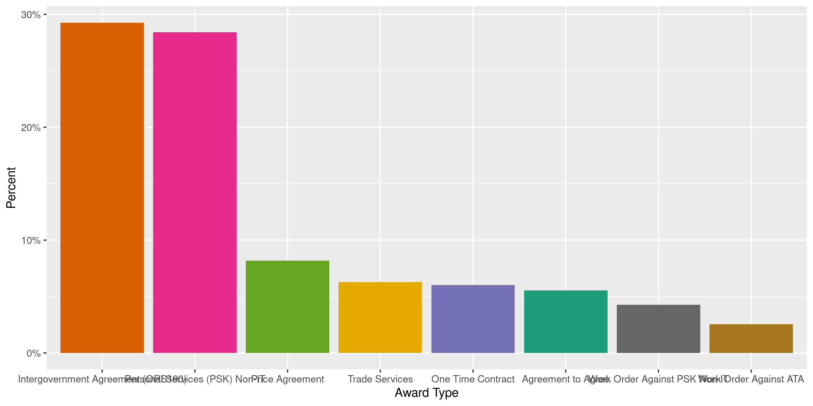
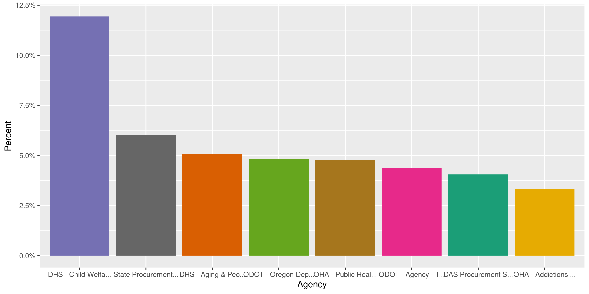
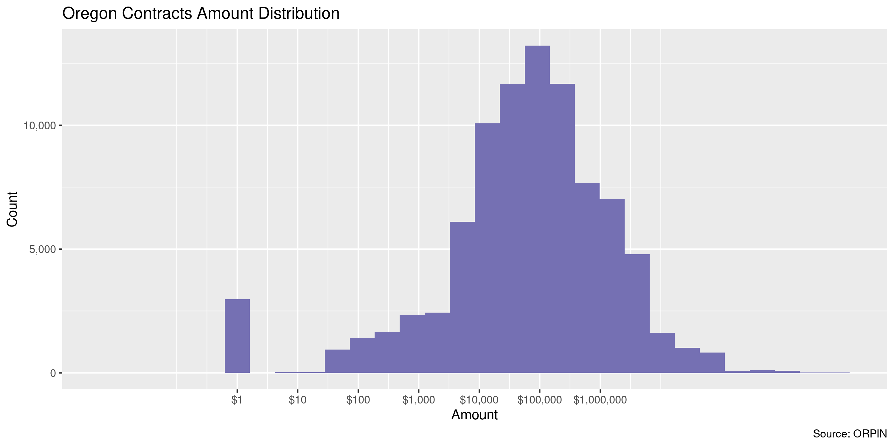
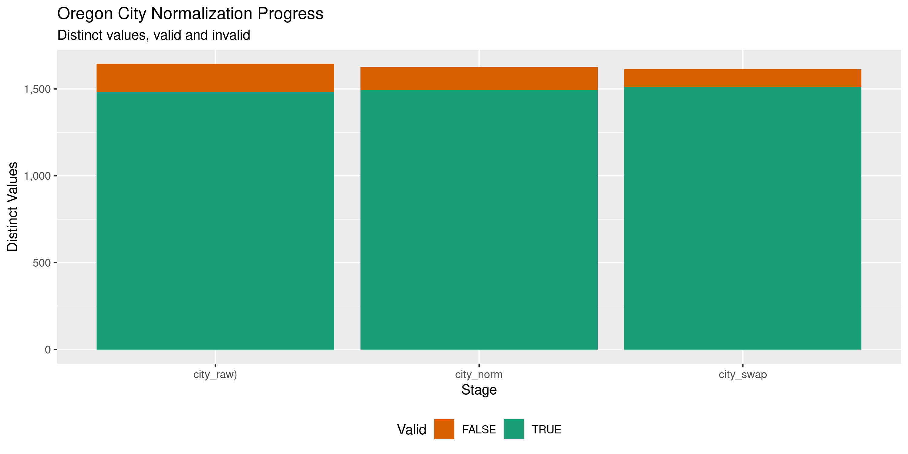

Oregon Contracts
================
Kiernan Nicholls
2020-05-29 14:25:35

  - [Project](#project)
  - [Objectives](#objectives)
  - [Packages](#packages)
  - [Data](#data)
  - [Read](#read)
  - [Explore](#explore)
  - [Wrangle](#wrangle)
  - [Conclude](#conclude)
  - [Export](#export)
  - [Upload](#upload)

<!-- Place comments regarding knitting here -->

## Project

The Accountability Project is an effort to cut across data silos and
give journalists, policy professionals, activists, and the public at
large a simple way to search across huge volumes of public data about
people and organizations.

Our goal is to standardizing public data on a few key fields by thinking
of each dataset row as a transaction. For each transaction there should
be (at least) 3 variables:

1.  All **parties** to a transaction.
2.  The **date** of the transaction.
3.  The **amount** of money involved.

## Objectives

This document describes the process used to complete the following
objectives:

1.  How many records are in the database?
2.  Check for entirely duplicated records.
3.  Check ranges of continuous variables.
4.  Is there anything blank or missing?
5.  Check for consistency issues.
6.  Create a five-digit ZIP Code called `zip`.
7.  Create a `year` field from the transaction date.
8.  Make sure there is data on both parties to a transaction.

## Packages

The following packages are needed to collect, manipulate, visualize,
analyze, and communicate these results. The `pacman` package will
facilitate their installation and attachment.

The IRW’s `campfin` package will also have to be installed from GitHub.
This package contains functions custom made to help facilitate the
processing of campaign finance data.

``` r
if (!require("pacman")) install.packages("pacman")
pacman::p_load_gh("irworkshop/campfin")
pacman::p_load(
  tidyverse, # data manipulation
  lubridate, # datetime strings
  gluedown, # printing markdown
  magrittr, # pipe operators
  janitor, # clean data frames
  refinr, # cluster and merge
  scales, # format strings
  knitr, # knit documents
  vroom, # read files fast
  rvest, # html scraping
  glue, # combine strings
  here, # relative paths
  httr, # http requests
  fs # local storage 
)
```

This document should be run as part of the `R_campfin` project, which
lives as a sub-directory of the more general, language-agnostic
[`irworkshop/accountability_datacleaning`](https://github.com/irworkshop/accountability_datacleaning)
GitHub repository.

The `R_campfin` project uses the [RStudio
projects](https://support.rstudio.com/hc/en-us/articles/200526207-Using-Projects)
feature and should be run as such. The project also uses the dynamic
`here::here()` tool for file paths relative to *your* machine.

``` r
# where does this document knit?
here::here()
#> [1] "/home/kiernan/Code/accountability_datacleaning/R_campfin"
```

## Data

Contracts data for the state of Oregon can be obtained from the state’s
[Open Data](https://data.oregon.gov) portal. Each record represents a
single contract between the state and an outside vendor providing goods
or services.

> This composite dataset is sorted by agency, and contains all versions
> of contracts and amendments issued in ORPIN from July 1, 2012 to June
> 30, 2019. The contract start date may be different than the contract
> issued date, or date the data entry was completed, and the contract
> was entered into ORPIN system. For more information:
> <https://www.oregon.gov/transparency/Pages/index.aspx>

The [Oregon Procurement Information Network
(ORPIN)](https://orpin.oregon.gov/open.dll/welcome) also provides a
[data
dictionary](https://www.oregon.gov/transparency/Documents/2019_ORPIN_Contracts_Data_Dictionary.pdf)
as a PDF.

| Variable            | Description                                            |
| :------------------ | :----------------------------------------------------- |
| Agency Number       | Unique identifier assigned to the agency               |
| Agency Name         | Name of the agency for whom the contract was issued    |
| Award Number        | Contract number, revisions displays as decimal points. |
| Award Title         | Title of the contract                                  |
| Award Type          | Indicates which contract type was used                 |
| Contractor          | Company name of the contractor                         |
| Street Address      | Street address of the contractor                       |
| City                | City of the contractor                                 |
| State               | State of the contractor                                |
| Zip                 | Zip code of the contractor                             |
| Original Start Date | Date the contract first became active                  |
| Amendment Date      | Date when an amendment or revision was issued          |
| Expiration Date     | Date when the contract expired or will expire          |
| Award Value         | Estimated contract value when first awarded            |
| Amendment Value     | Dollar amount change for amendment version             |
| Total Award Value   | Total Estimated Contract Value at the time of issuing  |

## Read

The raw data can be read directly from the portal using
`vroom::vroom()`.

``` r
orc <- vroom(
  file = "https://data.oregon.gov/api/views/6e9e-sfc4/rows.csv",
  .name_repair = make_clean_names,
  col_types = cols(
    .default = col_character(),
    `Original Start Date` = col_date_usa(),
    `Amendment Date` = col_date_usa(),
    `Expiration Date` = col_date_usa(),
    `Original Award Value` = col_double(),
    `Amendment Value` = col_double(),
    `Total Award Value` = col_double()
  )
)
```

## Explore

``` r
glimpse(orc)
#> Rows: 96,813
#> Columns: 18
#> $ agency_id    <chr> "100001", "100020", "102000", "102000", "102000", "102000", "102000", "1020…
#> $ agency       <chr> "DHS - Director's Office", "DHS - Shared Services", "State Procurement Offi…
#> $ doc_num      <chr> "DHS-4805-13", "DHS-4814-13", "9717", "2557", "1444", "1445", "1446", "1450…
#> $ amend_num    <chr> "0", "0", "15001", "2000", "6001", "5002", "4001", "5003", "6001", "5003", …
#> $ award_title  <chr> "TO 545-13 - Russian", "MSC 9960", "Ergonomic Task Seating", "Wireless Acce…
#> $ award_type   <chr> "Work Order Against PSK Non-IT", "Work Order Against PSK Non-IT", "Price Ag…
#> $ vendor       <chr> "IRCO", "IRCO", "Office Master, Inc.", "DiscountCell, Inc", "Keizer Saw & M…
#> $ address1     <chr> "10301 NE Glisan St.", "10301 NE Glisan St.", "2009 Wright Avenue", "350 W …
#> $ address2     <chr> NA, NA, NA, NA, NA, NA, NA, NA, NA, NA, NA, NA, NA, NA, NA, NA, NA, NA, NA,…
#> $ city         <chr> "Portland", "Portland", "La Verne", "Provo", "Keizer", "Torrance", "Gresham…
#> $ state        <chr> "OR", "OR", "CA", "UT", "OR", "CA", "OR", "OR", "OR", "TN", "OR", "CA", "OR…
#> $ zip          <chr> "97220", "97220", "91750", "84601-4320", "97303", "90503", "97030", "97701"…
#> $ start_date   <date> 2013-05-07, 2013-05-14, 2009-03-26, 2012-03-02, 2011-05-16, 2011-05-04, 20…
#> $ amend_date   <date> 2013-05-07, 2013-05-15, 2017-03-27, 2017-05-12, 2017-09-13, 2017-09-13, 20…
#> $ end_date     <date> 2013-05-14, 2013-05-20, 2017-12-31, 2019-06-30, 2019-12-31, 2019-12-31, 20…
#> $ amount       <dbl> 65, 375, 1000000, 1, 1000000, 1000000, 1000000, 1000000, 1000000, 2000000, …
#> $ amend_amount <dbl> 65, 375, 0, 0, 0, 0, 0, 0, 0, 0, 0, 0, 0, 0, 0, 0, 0, 0, 0, 0, 0, 0, 0, 0, …
#> $ total_amount <dbl> 65, 375, 1000000, 1, 1000000, 1000000, 1000000, 1000000, 1000000, 2000000, …
tail(orc)
#> # A tibble: 6 x 18
#>   agency_id agency doc_num amend_num award_title award_type vendor address1 address2 city  state
#>   <chr>     <chr>  <chr>   <chr>     <chr>       <chr>      <chr>  <chr>    <chr>    <chr> <chr>
#> 1 X24072    Orego… 107-35… 0         Without wa… One Time … Lynx … 2746 Fr… <NA>     Salem OR   
#> 2 X24072    Orego… OMD-19… 1000      Environmen… Personal … Blue … P.O. Bo… <NA>     Nort… OR   
#> 3 X24072    Orego… OMD-16… 0         FY16 Orego… Intergove… Geolo… 313 SW … <NA>     Newp… OR   
#> 4 X24072    Orego… OMD-16… 1000      FY16 Orego… Intergove… Geolo… 313 SW … <NA>     Newp… OR   
#> 5 X24072    Orego… OMD-19… 0         Grants Man… Personal … Power… PO Box … <NA>     Salem OR   
#> 6 X24072    Orego… OMD-16… 2000      FY16 Orego… Intergove… Geolo… 313 SW … <NA>     Newp… OR   
#> # … with 7 more variables: zip <chr>, start_date <date>, amend_date <date>, end_date <date>,
#> #   amount <dbl>, amend_amount <dbl>, total_amount <dbl>
```

### Missing

There are very few contracts missing values. None need to be flagged.

``` r
col_stats(orc, count_na)
#> # A tibble: 18 x 4
#>    col          class      n         p
#>    <chr>        <chr>  <int>     <dbl>
#>  1 agency_id    <chr>      0 0        
#>  2 agency       <chr>      0 0        
#>  3 doc_num      <chr>      0 0        
#>  4 amend_num    <chr>      0 0        
#>  5 award_title  <chr>      1 0.0000103
#>  6 award_type   <chr>      0 0        
#>  7 vendor       <chr>      0 0        
#>  8 address1     <chr>    432 0.00446  
#>  9 address2     <chr>  78067 0.806    
#> 10 city         <chr>    432 0.00446  
#> 11 state        <chr>    475 0.00491  
#> 12 zip          <chr>    432 0.00446  
#> 13 start_date   <date>     0 0        
#> 14 amend_date   <date>     0 0        
#> 15 end_date     <date>     0 0        
#> 16 amount       <dbl>      0 0        
#> 17 amend_amount <dbl>      0 0        
#> 18 total_amount <dbl>      0 0
```

### Duplicates

Ignoreing the semi-unique `doc_num` variable, there are a number of
duplicated records that need to be flagged.

``` r
orc <- flag_dupes(orc, -doc_num)
sum(orc$dupe_flag)
#> [1] 398
```

``` r
orc %>% 
  filter(dupe_flag) %>% 
  select(start_date, agency, amount, vendor)
#> # A tibble: 398 x 4
#>    start_date agency                             amount vendor                                     
#>    <date>     <chr>                               <dbl> <chr>                                      
#>  1 2015-11-19 DHS - Department of Human Services    450 Lane Independent Living Alliance           
#>  2 2015-11-19 DHS - Department of Human Services    450 Lane Independent Living Alliance           
#>  3 2015-11-19 DHS - Department of Human Services    450 Lane Independent Living Alliance           
#>  4 2016-01-06 DHS - Department of Human Services    580 Lane Independent Living Alliance           
#>  5 2016-01-06 DHS - Department of Human Services    580 Lane Independent Living Alliance           
#>  6 2016-01-06 DHS - Department of Human Services    580 Lane Independent Living Alliance           
#>  7 2016-01-06 DHS - Department of Human Services    580 Lane Independent Living Alliance           
#>  8 2015-12-07 DHS - Department of Human Services   3205 Community Rehabilitation Services of Oregon
#>  9 2015-12-07 DHS - Department of Human Services   3205 Community Rehabilitation Services of Oregon
#> 10 2016-02-10 DHS - Department of Human Services   1400 Albertina Kerr Centers                     
#> # … with 388 more rows
```

### Categorical

``` r
col_stats(orc, n_distinct)
#> # A tibble: 19 x 4
#>    col          class      n         p
#>    <chr>        <chr>  <int>     <dbl>
#>  1 agency_id    <chr>    437 0.00451  
#>  2 agency       <chr>    436 0.00450  
#>  3 doc_num      <chr>  48847 0.505    
#>  4 amend_num    <chr>    560 0.00578  
#>  5 award_title  <chr>  36602 0.378    
#>  6 award_type   <chr>     19 0.000196 
#>  7 vendor       <chr>  13965 0.144    
#>  8 address1     <chr>  18990 0.196    
#>  9 address2     <chr>   3097 0.0320   
#> 10 city         <chr>   1653 0.0171   
#> 11 state        <chr>     92 0.000950 
#> 12 zip          <chr>   3975 0.0411   
#> 13 start_date   <date>  3749 0.0387   
#> 14 amend_date   <date>  1880 0.0194   
#> 15 end_date     <date>  5095 0.0526   
#> 16 amount       <dbl>  18288 0.189    
#> 17 amend_amount <dbl>  25931 0.268    
#> 18 total_amount <dbl>  30141 0.311    
#> 19 dupe_flag    <lgl>      2 0.0000207
```

``` r
explore_plot(orc, award_type)
```

<!-- -->

``` r
explore_plot(orc, agency) + scale_x_truncate()
```

<!-- -->

### Amounts

``` r
noquote(map_chr(summary(orc$amount), dollar))
#>           Min.        1st Qu.         Median           Mean        3rd Qu.           Max. 
#>             $0         $5,360        $55,000     $4,976,618       $340,230 $9,581,923,503
percent(mean(orc$amount <= 0), 0.01)
#> [1] "9.29%"
```

<!-- -->

### Dates

We can add the calendar year from `date` with `lubridate::year()`

``` r
orc <- mutate(orc, start_year = year(start_date))
```

There are a handful of very old or future contracts.

``` r
min(orc$start_date)
#> [1] "1902-09-04"
sum(orc$start_year < 2004)
#> [1] 226
max(orc$start_date)
#> [1] "2022-06-30"
sum(orc$start_date > today())
#> [1] 1
```

<!-- -->

## Wrangle

To improve the searchability of the database, we will perform some
consistent, confident string normalization. For geographic variables
like city names and ZIP codes, the corresponding `campfin::normal_*()`
functions are tailor made to facilitate this process.

### Address

For the street `addresss` variable, the `campfin::normal_address()`
function will force consistence case, remove punctuation, and abbreviate
official USPS suffixes.

``` r
orc <- orc %>% 
  unite(
    col = address_full,
    starts_with("address"),
    sep = " ",
    remove = FALSE,
    na.rm = TRUE
  ) %>% 
  mutate(
    address_norm = normal_address(
      address = address_full,
      abbs = usps_street,
      na_rep = TRUE
    )
  ) %>% 
  select(-address_full)
```

``` r
orc %>% 
  select(contains("address")) %>% 
  distinct() %>% 
  sample_n(10)
#> # A tibble: 10 x 3
#>    address1                    address2   address_norm                   
#>    <chr>                       <chr>      <chr>                          
#>  1 1950 Franklin Blvd          <NA>       1950 FRANKLIN BLVD             
#>  2 409 Summit Ridge Drive E.   <NA>       409 SMT RDG DR E               
#>  3 4758 Research Dr            <NA>       4758 RESEARCH DR               
#>  4 195 West Street             <NA>       195 W ST                       
#>  5 665 NW Hoyt Street          <NA>       665 NW HOYT ST                 
#>  6 375 W 2nd Avenue            <NA>       375 W 2 ND AVE                 
#>  7 PO Box 23700                <NA>       PO BOX 23700                   
#>  8 701 Adams Street, Suite 203 PO Box 447 701 ADAMS ST STE 203 PO BOX 447
#>  9 401 NE 138th Avenue         <NA>       401 NE 138 TH AVE              
#> 10 111 50th Ave. NW            <NA>       111 50 TH AVE NW
```

### ZIP

For ZIP codes, the `campfin::normal_zip()` function will attempt to
create valid *five* digit codes by removing the ZIP+4 suffix and
returning leading zeroes dropped by other programs like Microsoft Excel.

``` r
orc <- orc %>% 
  mutate(
    zip_norm = normal_zip(
      zip = zip,
      na_rep = TRUE
    )
  )
```

``` r
progress_table(
  orc$zip,
  orc$zip_norm,
  compare = valid_zip
)
#> # A tibble: 2 x 6
#>   stage    prop_in n_distinct prop_na n_out n_diff
#>   <chr>      <dbl>      <dbl>   <dbl> <dbl>  <dbl>
#> 1 zip        0.909       3975 0.00446  8792   1386
#> 2 zip_norm   0.994       2850 0.00465   547    127
```

### State

Valid two digit state abbreviations can be made using the
`campfin::normal_state()` function.

``` r
orc <- orc %>% 
  mutate(
    state_norm = normal_state(
      state = state,
      abbreviate = TRUE,
      na_rep = TRUE,
      valid = valid_state
    )
  )
```

``` r
orc %>% 
  filter(state != state_norm) %>% 
  count(state, state_norm, sort = TRUE)
#> # A tibble: 2 x 3
#>   state    state_norm     n
#>   <chr>    <chr>      <int>
#> 1 Oregon   OR             6
#> 2 WA 98661 WA             4
```

``` r
progress_table(
  orc$state,
  orc$state_norm,
  compare = valid_state
)
#> # A tibble: 2 x 6
#>   stage      prop_in n_distinct prop_na n_out n_diff
#>   <chr>        <dbl>      <dbl>   <dbl> <dbl>  <dbl>
#> 1 state        0.996         92 0.00491   357     40
#> 2 state_norm   1             53 0.00849     0      1
```

### City

Cities are the most difficult geographic variable to normalize, simply
due to the wide variety of valid cities and formats.

#### Normal

The `campfin::normal_city()` function is a good start, again converting
case, removing punctuation, but *expanding* USPS abbreviations. We can
also remove `invalid_city` values.

``` r
orc <- orc %>% 
  mutate(
    city_norm = normal_city(
      city = city, 
      abbs = usps_city,
      states = c("OR", "DC", "OREGON"),
      na = invalid_city,
      na_rep = TRUE
    )
  )
```

#### Swap

We can further improve normalization by comparing our normalized value
against the *expected* value for that record’s state abbreviation and
ZIP code. If the normalized value is either an abbreviation for or very
similar to the expected value, we can confidently swap those two.

``` r
orc <- orc %>% 
  rename(city_raw = city) %>% 
  left_join(
    y = zipcodes,
    by = c(
      "state_norm" = "state",
      "zip_norm" = "zip"
    )
  ) %>% 
  rename(city_match = city) %>% 
  mutate(
    match_abb = is_abbrev(city_norm, city_match),
    match_dist = str_dist(city_norm, city_match),
    city_swap = if_else(
      condition = !is.na(match_dist) & (match_abb | match_dist == 1),
      true = city_match,
      false = city_norm
    )
  ) %>% 
  select(
    -city_match,
    -match_dist,
    -match_abb
  )
```

#### Progress

``` r
many_city <- c(valid_city, extra_city)
orc %>% 
  filter(city_swap %out% many_city) %>% 
  count(city_swap, state_norm, sort = TRUE)
#> # A tibble: 103 x 3
#>    city_swap               state_norm     n
#>    <chr>                   <chr>      <int>
#>  1 MILWAUKIE               OR           583
#>  2 <NA>                    <NA>         434
#>  3 FEDERAL WAY WA          OR           106
#>  4 NEW YORK CITY           NY            46
#>  5 RESEARCH TRIANGLE PARK  NC            31
#>  6 SUNRIVER                OR            31
#>  7 SEATAC                  WA            30
#>  8 COBURG                  OR            26
#>  9 WALNUT CREEK CALIFORNIA OR            26
#> 10 LAKE SUCCESS            NY            24
#> # … with 93 more rows
```

| stage      | prop\_in | n\_distinct | prop\_na | n\_out | n\_diff |
| :--------- | -------: | ----------: | -------: | -----: | ------: |
| city\_raw) |    0.982 |        1643 |    0.004 |   1782 |     163 |
| city\_norm |    0.990 |        1625 |    0.005 |    978 |     132 |
| city\_swap |    0.993 |        1612 |    0.005 |    649 |     101 |

You can see how the percentage of valid values increased with each
stage.

<!-- -->

More importantly, the number of distinct values decreased each stage. We
were able to confidently change many distinct invalid values to their
valid equivalent.

<!-- -->

## Conclude

Before exporting, we can remove the intermediary normalization columns
and rename all added variables with the `_clean` suffix.

``` r
orc <- orc %>% 
  select(
    -city_norm,
    city_clean = city_swap
  ) %>% 
  rename_all(~str_replace(., "_norm", "_clean")) %>% 
  rename_all(~str_remove(., "_raw"))
```

``` r
glimpse(sample_n(orc, 20))
#> Rows: 20
#> Columns: 24
#> $ agency_id     <chr> "107000", "24800 - RSMS", "100100", "730000-MCT", "730531", "730000-PT", "…
#> $ agency        <chr> "Administrative Services, Department of", "OMD - RSMS", "DHS - Child Welfa…
#> $ doc_num       <chr> "3381", "OMD-2030-12", "DHS-152037-16", "730-MCA029883-14", "730-25633-14"…
#> $ amend_num     <chr> "7000", "0", "0", "0", "4001", "0", "0", "0", "1", "0", "2005", "2000", "1…
#> $ award_title   <chr> "Managed Print Services", "RSMS Engine Overhaul and Repair", "child care r…
#> $ award_type    <chr> "Agreement to Agree", "One Time Contract", "Intergovernment Agreement (ORS…
#> $ vendor        <chr> "Xerox", "pacific power products", "Western Oregon University (ORCPP)", "C…
#> $ address1      <chr> "26600 SW Parkway", "600 S 56th Place", "Administration Bldg", "PO Box 930…
#> $ address2      <chr> NA, NA, NA, NA, NA, NA, NA, NA, NA, NA, NA, NA, NA, "Room 103", NA, NA, NA…
#> $ city          <chr> "Wilsonville", "Ridgefield", "Monmouth", "Canby", "Costa Mesa", "Molalla",…
#> $ state         <chr> "OR", "WA", "OR", "OR", "CA", "OR", "OR", "NY", "WA", "OR", "BC", "OR", "O…
#> $ zip           <chr> "97070", "98642", "97361", "97013", "92626", "97038", "97601", "10003-6011…
#> $ start_date    <date> 2013-03-13, 2012-08-23, 2016-07-01, 2014-05-27, 2006-09-26, 2013-07-01, 2…
#> $ amend_date    <date> 2016-01-19, 2012-09-20, 2016-12-07, 2014-05-29, 2017-05-08, 2015-01-30, 2…
#> $ end_date      <date> 2016-08-31, 2012-09-20, 2017-06-30, 2024-05-27, 2017-09-29, 2014-06-30, 2…
#> $ amount        <dbl> 1000000, 7884, 5759983, 1000, 5000000, 509948, 247000, 9982, 772072, 90, 6…
#> $ amend_amount  <dbl> 0, 7884, 5759983, 1000, 0, 509948, 247000, 9982, 0, 90, 0, 1000, 669438, 1…
#> $ total_amount  <dbl> 1000000, 7884, 5759983, 1000, 5000000, 509948, 247000, 9982, 772072, 90, 5…
#> $ dupe_flag     <lgl> FALSE, TRUE, FALSE, FALSE, FALSE, FALSE, FALSE, FALSE, FALSE, FALSE, FALSE…
#> $ start_year    <dbl> 2013, 2012, 2016, 2014, 2006, 2013, 2017, 2015, 2010, 2014, 2009, 2015, 20…
#> $ address_clean <chr> "26600 SW PKWY", "600 S 56 TH PLACE", "ADMINISTRATION BLDG", "PO BOX 930",…
#> $ zip_clean     <chr> "97070", "98642", "97361", "97013", "92626", "97038", "97601", "10003", "9…
#> $ state_clean   <chr> "OR", "WA", "OR", "OR", "CA", "OR", "OR", "NY", "WA", "OR", NA, "OR", "OR"…
#> $ city_clean    <chr> "WILSONVILLE", "RIDGEFIELD", "MONMOUTH", "CANBY", "COSTA MESA", "MOLALLA",…
```

1.  There are 96,813 records in the database.
2.  There are 398 duplicate records in the database.
3.  The range and distribution of `amount` and `date` seem reasonable.
4.  There are 0 records missing key variables.
5.  Consistency in geographic data has been improved with
    `campfin::normal_*()`.
6.  The 4-digit `year` variable has been created with
    `lubridate::year()`.

## Export

Now the file can be saved on disk for upload to the Accountability
server.

``` r
clean_dir <- dir_create(here("or", "contracts", "data", "clean"))
clean_path <- path(clean_dir, "or_contracts_clean.csv")
write_csv(orc, clean_path, na = "")
file_size(clean_path)
#> 27.9M
mutate(file_encoding(clean_path), across(path, path.abbrev))
#> # A tibble: 1 x 3
#>   path                                             mime            charset
#>   <chr>                                            <chr>           <chr>  
#> 1 ~/or/contracts/data/clean/or_contracts_clean.csv application/csv utf-8
```

## Upload

Using the duckr R package, we can wrap around the
[duck](https://duck.sh) commnand line tool to upload the file to the IRW
S3 server.

``` r
# remotes::install_github("kiernann/duckr")
s3_dir <- "s3:/publicaccountability/csv/"
s3_path <- path(s3_dir, basename(clean_path))
if (require(duckr)) {
  duckr::duck_upload(clean_path, s3_path)
}
```
