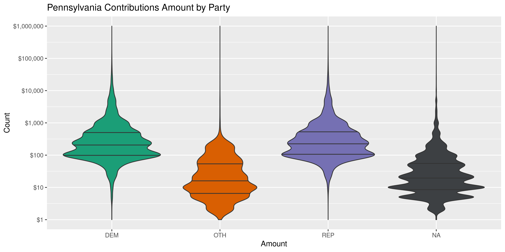

Pennsylvania Contributions
================
Kiernan Nicholls
2020-11-06 14:40:51

  - [Project](#project)
  - [Objectives](#objectives)
  - [Packages](#packages)
  - [Data](#data)
  - [Import](#import)
  - [Explore](#explore)
  - [Wrangle](#wrangle)
  - [Conclude](#conclude)
  - [Export](#export)
  - [Upload](#upload)
  - [Dictionary](#dictionary)

<!-- Place comments regarding knitting here -->

## Project

The Accountability Project is an effort to cut across data silos and
give journalists, policy professionals, activists, and the public at
large a simple way to search across huge volumes of public data about
people and organizations.

Our goal is to standardizing public data on a few key fields by thinking
of each dataset row as a transaction. For each transaction there should
be (at least) 3 variables:

1.  All **parties** to a transaction.
2.  The **date** of the transaction.
3.  The **amount** of money involved.

## Objectives

This document describes the process used to complete the following
objectives:

1.  How many records are in the database?
2.  Check for entirely duplicated records.
3.  Check ranges of continuous variables.
4.  Is there anything blank or missing?
5.  Check for consistency issues.
6.  Create a five-digit ZIP Code called `zip`.
7.  Create a `year` field from the transaction date.
8.  Make sure there is data on both parties to a transaction.

## Packages

The following packages are needed to collect, manipulate, visualize,
analyze, and communicate these results. The `pacman` package will
facilitate their installation and attachment.

The IRW’s `campfin` package will also have to be installed from GitHub.
This package contains functions custom made to help facilitate the
processing of campaign finance data.

``` r
if (!require("pacman")) install.packages("pacman")
pacman::p_load_gh("irworkshop/campfin")
pacman::p_load(
  tidyverse, # data manipulation
  lubridate, # datetime strings
  gluedown, # format markdown
  magrittr, # pipe operators
  janitor, # dataframe clean
  refinr, # cluster and merge
  scales, # format strings
  knitr, # knit documents
  vroom, # read files fast
  glue, # combine strings
  httr, # make http requests
  here, # relative storage
  fs # search storage 
)
```

This document should be run as part of the `R_campfin` project, which
lives as a sub-directory of the more general, language-agnostic
[`irworkshop/accountability_datacleaning`](https://github.com/irworkshop/accountability_datacleaning)
GitHub repository.

The `R_campfin` project uses the [RStudio
projects](https://support.rstudio.com/hc/en-us/articles/200526207-Using-Projects)
feature and should be run as such. The project also uses the dynamic
`here::here()` tool for file paths relative to *your* machine.

``` r
# where does this document knit?
here::here()
#> /home/kiernan/Code/tap/R_campfin
```

## Data

Data is from the [Pennsylvania Election and Campaign Finance System
(ECF)](https://www.dos.pa.gov/VotingElections/CandidatesCommittees/CampaignFinance/Pages/default.aspx).

The ECF provides a [Full Campaign Finance
Export](https://www.dos.pa.gov/VotingElections/CandidatesCommittees/CampaignFinance/Resources/Pages/FullCampaignFinanceExport.aspx).
From this page, files are organized as annual directories containing
files for contributions, debt, expenditures, filer information, and
receipts.

The ECF also provides a `readme.txt` file, which we can read to better
understand the data we will be downloading.

``` r
pa_host <- "https://www.dos.pa.gov/VotingElections"
pa_dir <- "CandidatesCommittees/CampaignFinance/Resources/Documents"
readme_file <- "readme.txt"
readme_url <- paste(pa_host, pa_dir, readme_file, sep = "/")
```

This text file provides the column names and types for the each of the
data files included in the raw download.

Here are the columns included in the contributions data set:

``` r
readme$contribs %>% 
  mutate(col = as.character(md_code(col))) %>% 
  kable(col.names = c("Columns", "Type"))
```

| Columns       | Type         |
| :------------ | :----------- |
| `filerid`     | VARCHAR(20)  |
| `eyear`       | INT          |
| `cycle`       | INT          |
| `section`     | VARCHAR(10)  |
| `contributor` | VARCHAR(255) |
| `address1`    | VARCHAR(50)  |
| `address2`    | VARCHAR(50)  |
| `city`        | VARCHAR(50)  |
| `state`       | VARCHAR(10)  |
| `zipcode`     | VARCHAR(15)  |
| `occupation`  | VARCHAR(255) |
| `ename`       | VARCHAR(255) |
| `eaddress1`   | VARCHAR(50)  |
| `eaddress2`   | VARCHAR(50)  |
| `ecity`       | VARCHAR(50)  |
| `estate`      | VARCHAR(10)  |
| `ezipcode`    | VARCHAR(15)  |
| `contdate1`   | VARCHAR(20)  |
| `contamt1`    | MONEY        |
| `contdate2`   | VARCHAR(20)  |
| `contamt2`    | MONEY        |
| `contdate3`   | VARCHAR(20)  |
| `contamt3`    | MONEY        |
| `contdesc`    | VARCHAR(500) |

There are no variables providing information on the recipients, those
committees which *filed* the reports containing each contribution. That
data is provided in a separate file.

``` r
readme$filer %>% 
  mutate(col = as.character(md_code(col))) %>% 
  kable(col.names = c("Columns", "Type"))
```

| Columns     | Type         |
| :---------- | :----------- |
| `filerid`   | VARCHAR(20)  |
| `eyear`     | INT          |
| `cycle`     | INT          |
| `ammend`    | VARCHAR(1)   |
| `terminate` | VARCHAR(1)   |
| `filertype` | VARCHAR(10)  |
| `filername` | VARCHAR(255) |
| `office`    | VARCHAR(15)  |
| `district`  | VARCHAR(15)  |
| `party`     | VARCHAR(15)  |
| `address1`  | VARCHAR(50)  |
| `address2`  | VARCHAR(50)  |
| `city`      | VARCHAR(50)  |
| `state`     | VARCHAR(10)  |
| `zipcode`   | VARCHAR(15)  |
| `county`    | VARCHAR(15)  |
| `phone`     | VARCHAR(15)  |
| `beginning` | MONEY        |
| `monetary`  | MONEY        |
| `inkind`    | MONEY        |

## Import

To import the files into R, we will have to first download the annual
ZIP archive file containing all campaign finance transactions. Then we
can extract the contributions file and read them all into a single file
for processing.

### Download

Each ZIP archive is simply named as the 4-digit year for the files
within. We can download each ZIP to the `/data/raw` directory.

``` r
zip_names <- paste(2000:2020, "zip", sep = ".")
zip_urls <- paste(pa_host, pa_dir, zip_names, sep = "/")
raw_dir <- dir_create(here("pa", "contribs", "data", "raw"))
zip_paths <- path(raw_dir, zip_names)
fix_check <- here("pa", "contribs", "data", "fixed.txt")
if (length(dir_ls(raw_dir, regexp = "zip")) < 10) {
  download.file(zip_urls, zip_paths)
  file_delete(fix_check)
}
```

Then we will unzip the annual directory from each archive.

``` r
if (all(dir_ls(raw_dir) %in% zip_paths)) {
  for (z in zip_paths) {
    out <- unzip(z, exdir = raw_dir, junkpaths = TRUE)
    y_dir <- dir_create(path(raw_dir, str_extract(z, "\\d{4}")))
    file_move(out, path(y_dir, basename(out)))
  }
}
```

For each year, there is a file for contribution and a file for the
information on the recipients of those contributions, who file the
reports containing the data. We will identify the path of each file type
in new vectors, which can then be read together.

``` r
con_paths <- dir_ls(
  path = raw_dir, 
  recurse = TRUE, 
  regexp = "(C|c)ontrib[\\.|_]"
)

fil_paths <- dir_ls(
  path = raw_dir, 
  recurse = TRUE, 
  regexp = "(F|f)iler[\\.|_]"
)
```

The file names are a little different year to year, but they all have
the same format.

    #> * `~/pa/contribs/data/raw/2000/contrib_2000.txt`
    #> * `~/pa/contribs/data/raw/2001/contrib_2001.txt`
    #> * `~/pa/contribs/data/raw/2002/contrib_2002.txt`
    #> * `~/pa/contribs/data/raw/2003/contrib_2003.txt`
    #> * `~/pa/contribs/data/raw/2004/contrib_2004.txt`
    #> * `~/pa/contribs/data/raw/2005/contrib_2005.txt`
    #> * `~/pa/contribs/data/raw/2006/contrib_2006.txt`
    #> * `~/pa/contribs/data/raw/2007/contrib_2007.txt`
    #> * `~/pa/contribs/data/raw/2008/contrib_2008.txt`
    #> * `~/pa/contribs/data/raw/2009/contrib_2009.txt`
    #> * `~/pa/contribs/data/raw/2010/contrib_2010.txt`
    #> * `~/pa/contribs/data/raw/2011/contrib_2011.txt`
    #> * `~/pa/contribs/data/raw/2012/contrib_2012.txt`
    #> * `~/pa/contribs/data/raw/2013/contrib_2013.txt`
    #> * `~/pa/contribs/data/raw/2014/contrib_2014.txt`
    #> * `~/pa/contribs/data/raw/2015/contrib_2015.txt`
    #> * `~/pa/contribs/data/raw/2016/contrib_2016.txt`
    #> * `~/pa/contribs/data/raw/2017/contrib_2017.txt`
    #> * `~/pa/contribs/data/raw/2018/contrib_2018_03042019.txt`
    #> * `~/pa/contribs/data/raw/2019/contrib.txt`
    #> * `~/pa/contribs/data/raw/2020/Contrib.txt`

### Fix

To properly read so many records, we need to first perform some
manipulation of the text files. Each “cell” of character type columns
are surrounded in double quotation marks (`"`) to help prevent
misreading. However, some of the text in these cells itself contains
double quotes or newline characters (`\n`).

We need to read each file as a character string and use regular
expressions to identify these erroneous characters and remove or replace
them.

``` r
# do not repeat if done
if (!file_exists(fix_check)) {
  # for all contrib and filer files
  for (f in c(con_paths, fil_paths)) {
    # read raw file
    read_file(f) %>% 
      # force conversion to simple
      iconv(to = "ASCII", sub = "") %>% 
      # replace non-carriage newline
      str_replace_all("(?<!\r)\n", " ") %>%
      # replace not-field double quotes
      str_replace_all("(?<!^|,|\r\n)\"(?!,|\r\n|$)", "\'") %>% 
      # replace non-delim commas
      str_remove_all(",(?!\"|\\d|\\.\\d+|-(\\d|\\.))") %>% 
      # overwrite raw file
      write_file(f)
    # check progress
    message(paste(basename(f), "done"))
    # clean garbage memory
    flush_memory()
  }
  # note this has done
  file_create(fix_check)
}
```

### Read

Now that each text file has been cleaned of irregularities, they can
each be properly read into R.

First, we will read all the annual contribution files into a single data
frame using `vroom::vroom()`. We need to use the column names and types
listed in the `readme.txt` file we downloaded earlier.

``` r
pac <- map_df(
  .x = con_paths,
  .f = read_delim,
  delim = ",",
  escape_backslash = FALSE, 
  escape_double = FALSE,
  col_names = readme$contribs$col,
  col_types = cols(
    .default = col_skip(),
    filerid = col_character(),
    eyear = col_integer(),
    cycle = col_integer(),
    section = col_character(),
    contributor = col_character(),
    address1 = col_character(),
    address2 = col_character(),
    city = col_character(),
    state = col_character(),
    zipcode = col_character(),
    occupation = col_character(),
    ename = col_character(),
    contdate1 = col_date("%Y%m%d"),
    contamt1 = col_double()
  )
)
```

Then we can read the fixed filer files to describe the recipients.

``` r
filers <- map_df(
  .x = fil_paths,
  .f = read_delim,
  delim = ",",
  escape_backslash = FALSE, 
  escape_double = FALSE,
  col_names = readme$filer$col,
  col_types = cols(
    .default = col_skip(),
    eyear = col_integer(),
    filerid = col_character(),
    filertype = col_character(),
    filername = col_character(),
    office = col_character(),
    district = col_character(),
    party = col_character(),
    address1 = col_character(),
    address2 = col_character(),
    city = col_character(),
    state = col_character(),
    zipcode = col_character(),
    county = col_character(),
    phone = col_character(),
  )
)
```

We only want to join a single filer to each contribution listed in the
data. We can group by the unique filer ID and a filing year and select
only one copy of the data.

``` r
nrow(filers)
#> [1] 142407
filers <- filers %>% 
  group_by(filerid, eyear) %>% 
  slice(1) %>% 
  ungroup()
nrow(filers)
#> [1] 43432
```

Now the filer information can be added to the contribution data with a
`dplyr::left_join()` along the unique filer ID and election year.

``` r
# 18,386,163
pac <- left_join(
  x = pac,
  y = filers,
  by = c("filerid", "eyear"),
  suffix = c("_con", "_fil")
)

rm(filers)

pac <- rename_prefix(
  df = pac,
  suffix = c("_con", "_fil"),
  punct = TRUE
)
```

``` r
pac <- pac %>% 
  rename_with(~str_replace(., "address", "addr")) %>% 
  rename(
    con_zip = con_zipcode,
    date = contdate1,
    amount = contamt1,
    fil_type = filertype,
    filer = filername,
    fil_zip = fil_zipcode,
    fil_phone = phone
  )
```

We will also add a temporary unique ID for each transaction.

``` r
pac <- mutate(pac, tx = row_number())
```

## Explore

We should first check the top and bottom of the read data frame to
ensure the file was read correctly. This view also helps simply
understand the format.

There are 18,386,163 rows of 27 columns.

``` r
glimpse(pac)
#> Rows: 18,386,163
#> Columns: 27
#> $ filerid     <chr> "2000006", "2000006", "2000006", "2000006", "2000006", "2000006", "2000006",…
#> $ eyear       <int> 2000, 2000, 2000, 2000, 2000, 2000, 2000, 2000, 2000, 2000, 2000, 2000, 2000…
#> $ cycle       <int> 5, 5, 5, 5, 5, 5, 5, 5, 5, 5, 5, 5, 5, 5, 6, 3, 2, 2, 2, 2, 2, 2, 2, 2, 2, 2…
#> $ section     <chr> "IB", "IB", "IB", "IB", "IB", "IB", "IB", "IB", "IB", "IB", "IB", "IB", "IB"…
#> $ contributor <chr> "JOSHUA CERVENAK", "LANCE CUNNINGHAM", "JASON HAROLD", "KEITH HILL", "CHIP P…
#> $ con_addr1   <chr> "290 LYNBROOK DR N", "3267 N GEORGE ST", NA, "240 ARCH ST", "700 LINDA LANE"…
#> $ con_addr2   <chr> NA, NA, NA, NA, NA, NA, NA, NA, NA, NA, NA, NA, NA, NA, NA, "BOX 3305", NA, …
#> $ con_city    <chr> "YORK", "EMIGSVILLE", NA, "YORK", "STEVENS", "YORK", "SPRING GROVE", "YORK",…
#> $ con_state   <chr> "PA", "PA", NA, "PA", "PA", "PA", "PA", "PA", "PA", "PA", "PA", "PA", "PA", …
#> $ con_zip     <chr> "17402", "17318", NA, "17404", "17578", "17403", "17362", "17403", "17403", …
#> $ occupation  <chr> NA, NA, NA, NA, NA, NA, NA, NA, NA, NA, NA, NA, NA, NA, NA, NA, NA, NA, NA, …
#> $ ename       <chr> NA, NA, NA, NA, NA, NA, NA, NA, NA, NA, NA, NA, NA, NA, NA, NA, NA, NA, NA, …
#> $ date        <date> 2000-07-21, 2000-07-21, 2000-07-21, 2000-07-21, 2000-07-21, 2000-07-21, 200…
#> $ amount      <dbl> 55, 55, 55, 55, 55, 55, 89, 200, 100, 100, 150, 100, 100, 100, 100, 100, 150…
#> $ fil_type    <chr> "2", "2", "2", "2", "2", "2", "2", "2", "2", "2", "2", "2", "2", "2", "2", "…
#> $ filer       <chr> "MACKERETH BEVERLY COM TO ELECT", "MACKERETH BEVERLY COM TO ELECT", "MACKERE…
#> $ office      <chr> "STH", "STH", "STH", "STH", "STH", "STH", "STH", "STH", "STH", "STH", "STH",…
#> $ district    <chr> NA, NA, NA, NA, NA, NA, NA, NA, NA, NA, NA, NA, NA, NA, NA, NA, NA, NA, NA, …
#> $ party       <chr> "REP", "REP", "REP", "REP", "REP", "REP", "REP", "REP", "REP", "REP", "REP",…
#> $ fil_addr1   <chr> NA, NA, NA, NA, NA, NA, NA, NA, NA, NA, NA, NA, NA, NA, NA, NA, NA, NA, NA, …
#> $ fil_addr2   <chr> NA, NA, NA, NA, NA, NA, NA, NA, NA, NA, NA, NA, NA, NA, NA, NA, NA, NA, NA, …
#> $ fil_city    <chr> NA, NA, NA, NA, NA, NA, NA, NA, NA, NA, NA, NA, NA, NA, NA, NA, NA, NA, NA, …
#> $ fil_state   <chr> NA, NA, NA, NA, NA, NA, NA, NA, NA, NA, NA, NA, NA, NA, NA, NA, NA, NA, NA, …
#> $ fil_zip     <chr> NA, NA, NA, NA, NA, NA, NA, NA, NA, NA, NA, NA, NA, NA, NA, NA, NA, NA, NA, …
#> $ county      <chr> "67", "67", "67", "67", "67", "67", "67", "67", "67", "67", "67", "67", "67"…
#> $ fil_phone   <chr> NA, NA, NA, NA, NA, NA, NA, NA, NA, NA, NA, NA, NA, NA, NA, NA, NA, NA, NA, …
#> $ tx          <int> 1, 2, 3, 4, 5, 6, 7, 8, 9, 10, 11, 12, 13, 14, 15, 16, 17, 18, 19, 20, 21, 2…
head(pac)
#> # A tibble: 6 x 27
#>   filerid eyear cycle section contributor con_addr1 con_addr2 con_city con_state con_zip occupation
#>   <chr>   <int> <int> <chr>   <chr>       <chr>     <chr>     <chr>    <chr>     <chr>   <chr>     
#> 1 2000006  2000     5 IB      JOSHUA CER… 290 LYNB… <NA>      YORK     PA        17402   <NA>      
#> 2 2000006  2000     5 IB      LANCE CUNN… 3267 N G… <NA>      EMIGSVI… PA        17318   <NA>      
#> 3 2000006  2000     5 IB      JASON HARO… <NA>      <NA>      <NA>     <NA>      <NA>    <NA>      
#> 4 2000006  2000     5 IB      KEITH HILL  240 ARCH… <NA>      YORK     PA        17404   <NA>      
#> 5 2000006  2000     5 IB      CHIP PARKS  700 LIND… <NA>      STEVENS  PA        17578   <NA>      
#> 6 2000006  2000     5 IB      BRIAN SINN… 201 E CL… <NA>      YORK     PA        17403   <NA>      
#> # … with 16 more variables: ename <chr>, date <date>, amount <dbl>, fil_type <chr>, filer <chr>,
#> #   office <chr>, district <chr>, party <chr>, fil_addr1 <chr>, fil_addr2 <chr>, fil_city <chr>,
#> #   fil_state <chr>, fil_zip <chr>, county <chr>, fil_phone <chr>, tx <int>
```

Checking the number of distinct values of a discrete variable is another
good way to ensure the file was read properly.

``` r
count(pac, fil_type)
#> # A tibble: 5 x 2
#>   fil_type        n
#>   <chr>       <int>
#> 1 1           78264
#> 2 2        18286640
#> 3 3           11531
#> 4 4            4096
#> 5 <NA>         5632
```

### Missing

We should first check the number of missing values in each column.

``` r
col_stats(pac, count_na)
#> # A tibble: 27 x 4
#>    col         class         n         p
#>    <chr>       <chr>     <int>     <dbl>
#>  1 filerid     <chr>         0 0        
#>  2 eyear       <int>         0 0        
#>  3 cycle       <int>         0 0        
#>  4 section     <chr>      3138 0.000171 
#>  5 contributor <chr>       470 0.0000256
#>  6 con_addr1   <chr>     92433 0.00503  
#>  7 con_addr2   <chr>  16694748 0.908    
#>  8 con_city    <chr>     88737 0.00483  
#>  9 con_state   <chr>     97257 0.00529  
#> 10 con_zip     <chr>    132131 0.00719  
#> 11 occupation  <chr>   9408332 0.512    
#> 12 ename       <chr>  10843008 0.590    
#> 13 date        <date>    35760 0.00194  
#> 14 amount      <dbl>       188 0.0000102
#> 15 fil_type    <chr>      5632 0.000306 
#> 16 filer       <chr>       296 0.0000161
#> 17 office      <chr>  17171607 0.934    
#> 18 district    <chr>  17855466 0.971    
#> 19 party       <chr>  15197502 0.827    
#> 20 fil_addr1   <chr>   1057573 0.0575   
#> 21 fil_addr2   <chr>  14147237 0.769    
#> 22 fil_city    <chr>   1054674 0.0574   
#> 23 fil_state   <chr>   1054245 0.0573   
#> 24 fil_zip     <chr>   1057100 0.0575   
#> 25 county      <chr>  16176166 0.880    
#> 26 fil_phone   <chr>  12806103 0.697    
#> 27 tx          <int>         0 0
```

Any record missing a date, name, or amount should be flagged. These
variables are key to identifying transactions.

``` r
key_vars <- c("date", "contributor", "amount", "filer")
pac <- flag_na(pac, all_of(key_vars))
percent(mean(pac$na_flag), 0.01)
#> [1] "0.20%"
```

``` r
pac %>% 
  filter(na_flag) %>% 
  select(all_of(key_vars)) %>% 
  sample_n(10)
#> # A tibble: 10 x 4
#>    date       contributor           amount filer                                                   
#>    <date>     <chr>                  <dbl> <chr>                                                   
#>  1 NA         FRANCES SZYEPULA       120   "WARD 25 DEM CLUB"                                      
#>  2 NA         PAUL & DORO AMBROSE    200   "FLEAGLE PATRICK ELECT COM"                             
#>  3 NA         James A. Lenss           0   "McKesson Corporation Employees Political Fund"         
#>  4 NA         JOHN S. STROEBEL        10   "ROHM & HAAS EMPLOYEES (ROH PAC)"                       
#>  5 NA         FRIENDS/ANGEL L. ORI… 1500   "WARD 10 EXECUTIVE COM"                                 
#>  6 NA         G. ROBERT SHEETZ       200   "SHEETZPAC"                                             
#>  7 NA         SYLVIA PERLMAN         250   "CHELTENHAM TWP DEM PARTY OF"                           
#>  8 NA         DANDRIDGE ALBERT S      94.2 "MESIROV PENNSYLVANIA FUND"                             
#>  9 NA         M. SHEIKH DAWOOD         0   "DAWOOD ENGINEERING PAC                                …
#> 10 NA         HOUSE REP CAMP. COM   6575.  "VAEREWYCK GERRY FRIENDS OF"
```

All of the records missing a value are missing a `date`.

``` r
pac %>% 
  filter(na_flag) %>% 
  select(all_of(key_vars)) %>% 
  col_stats(count_na)
#> # A tibble: 4 x 4
#>   col         class      n       p
#>   <chr>       <chr>  <int>   <dbl>
#> 1 date        <date> 35760 0.982  
#> 2 contributor <chr>    470 0.0129 
#> 3 amount      <dbl>    188 0.00516
#> 4 filer       <chr>    296 0.00813
```

### Duplicates

We can check for records that are entirely duplicated across every
variable using `duplicated()`. This process is memory inefficient, so we
will split our data frame into a list of 100,000 row chunks and check
each chunk at a time, appending our duplicate rows to a local text file.

``` r
pac <- mutate(pac, tx = row_number())
```

``` r
dupe_file <- here("pa", "contribs", "dupes.txt")
if (!file_exists(dupe_file)) {
  file_create(dupe_file)
  pac <- mutate(pac, group = str_sub(date, end = 7))
  pa_ids <- split(pac$tx, pac$group)
  pas <- pac %>% 
    select(-tx) %>% 
    group_split(group)
  pb <- txtProgressBar(max = length(pas), style = 3)
  pac <- select(pac, -group)
  flush_memory(1)
  for (i in seq_along(pas)) {
    d1 <- duplicated(pas[[i]], fromLast = FALSE) # check from front
    d2 <- duplicated(pas[[i]], fromLast = TRUE) # check from back
    dupes <- tibble(tx = pa_ids[[i]], dupe_flag = d1 | d2)
    dupes <- filter(dupes, dupe_flag == TRUE) # remove non dupes
    write_csv(dupes, dupe_file, append = TRUE) # append to disk
    rm(d1, d2, dupes); pas[[i]] <- NA # remove for memory
    Sys.sleep(10)
    flush_memory(1)
    setTxtProgressBar(pb, i)
  }
  rm(pas, pb)
  flush_memory()
}
```

We can now read that file and join it against the contributions.

``` r
dupes <- read_csv(
  file = dupe_file,
  col_names = c("tx", "dupe_flag"),
  col_types = cols(
    tx = col_double(),
    dupe_flag = col_logical()
  )
)
comma(nrow(dupes))
#> [1] "390,830"
```

``` r
pac <- left_join(pac, dupes, by = "tx")
pac <- mutate(pac, dupe_flag = !is.na(dupe_flag))
percent(mean(pac$dupe_flag), 0.01)
#> [1] "2.13%"
```

``` r
pac %>% 
  filter(dupe_flag) %>% 
  select(tx, all_of(key_vars))
#> # A tibble: 390,830 x 5
#>        tx date       contributor            amount filer                                           
#>     <dbl> <date>     <chr>                   <dbl> <chr>                                           
#>  1 923573 2003-12-19 Timothy J. Schweers    250    Friends of Don White                            
#>  2 923586 2003-12-19 Timothy J. Schweers    250    Friends of Don White                            
#>  3 923854 2003-08-22 DuPont Good Governmen… 250    Friends of Tina Pickett                         
#>  4 923855 2003-08-22 DuPont Good Governmen… 250    Friends of Tina Pickett                         
#>  5 923907 2003-05-15 NEW CASTLE AREA SCHOO… 152    PAFT (PA FED TEACH) COM SUPT                    
#>  6 923908 2003-05-15 NEW CASTLE AREA SCHOO… 152    PAFT (PA FED TEACH) COM SUPT                    
#>  7 924851 2003-09-12 WESLEY C. SHIPLETT       5    ACE INA Political Action Committee              
#>  8 925149 2003-09-12 WESLEY C. SHIPLETT       5    ACE INA Political Action Committee              
#>  9 928290 2003-03-21 Mary J Poverstein        9.13 Prudential Financial Inc. Political Action Comm…
#> 10 928291 2003-03-21 Mary J Poverstein        9.13 Prudential Financial Inc. Political Action Comm…
#> # … with 390,820 more rows
```

### Amounts

The range and distribution of the contribution `amount` should be
checked. We also want to note what percentage of the values are zero or
below.

``` r
summary(pac$amount)
#>      Min.   1st Qu.    Median      Mean   3rd Qu.      Max.      NA's 
#>    -18000        10        21       203        75 114201950       188
mean(pac$amount <= 0)
#> [1] NA
```

``` r
glimpse(pac[c(which.min(pac$amount), which.max(pac$amount)), ])
#> Rows: 2
#> Columns: 29
#> $ filerid     <chr> "7900211", "20170217"
#> $ eyear       <int> 2003, 2019
#> $ cycle       <int> 6, 7
#> $ section     <chr> "ID", "IB"
#> $ contributor <chr> "JOHN J GALLAGHER", "CHARLOTTE SWENSON"
#> $ con_addr1   <chr> "1760 MARKET ST STE 1100", "212 IDRIS RD"
#> $ con_addr2   <chr> NA, "APT H1"
#> $ con_city    <chr> "PHILA", "MERION STATION"
#> $ con_state   <chr> "PA", "PA"
#> $ con_zip     <chr> "19103", "190661635"
#> $ occupation  <chr> NA, NA
#> $ ename       <chr> NA, NA
#> $ date        <date> 2003-10-30, 2019-11-14
#> $ amount      <dbl> -18000, 114201950
#> $ fil_type    <chr> "2", "2"
#> $ filer       <chr> "SPRINGFIELD REP PARTY", "FRIENDS OF JENNIFER O'MARA"
#> $ office      <chr> NA, "STH"
#> $ district    <chr> NA, "165"
#> $ party       <chr> NA, "DEM"
#> $ fil_addr1   <chr> "359 SEDGEWOOD ROAD", "618 PROSPECT ROAD"
#> $ fil_addr2   <chr> NA, NA
#> $ fil_city    <chr> "SPRINGFIELD", "SPRINGFIELD"
#> $ fil_state   <chr> "PA", "PA"
#> $ fil_zip     <chr> "19064", "19064"
#> $ county      <chr> NA, "23"
#> $ fil_phone   <chr> NA, "2672299356"
#> $ tx          <dbl> 1073160, 17311033
#> $ na_flag     <lgl> FALSE, FALSE
#> $ dupe_flag   <lgl> FALSE, FALSE
```

<!-- -->

<!-- -->

### Dates

We can add the calendar year a contribution was made using
`lubridate::year()`.

``` r
pac <- mutate(pac, year = year(date))
```

There are a handful of missing or irregular dates.

``` r
percent(prop_na(pac$date), 0.01)
#> [1] "0.19%"
min(pac$date, na.rm = TRUE)
#> [1] "1900-01-16"
sum(pac$year < 2000, na.rm = TRUE)
#> [1] 298
max(pac$date, na.rm = TRUE)
#> [1] "9201-01-12"
sum(pac$date > today(), na.rm = TRUE)
#> [1] 27
```

The bulk of transactions occur between 2000 and 2020.

<!-- -->

## Wrangle

To improve the searchability of the database, we will perform some
consistent, confident string normalization. For geographic variables
like city names and ZIP codes, the corresponding `campfin::normal_*()`
functions are tailor made to facilitate this process.

### Address

For the street `*_addresss` variables, the `campfin::normal_address()`
function will force consistence case, remove punctuation, and abbreviate
official USPS suffixes.

``` r
norm_addr <- pac %>%
  count(con_addr1, con_addr2, sort = TRUE) %>% 
  select(-n) %>% 
  unite(
    col = con_addr_full,
    starts_with("con_addr"),
    sep = " ",
    remove = FALSE,
    na.rm = TRUE
  ) %>% 
  mutate(
    con_addr_norm = normal_address(
      address = con_addr_full,
      abbs = usps_street,
      na_rep = TRUE
    )
  ) %>% 
  select(-con_addr_full)
```

``` r
norm_addr
#> # A tibble: 1,579,502 x 3
#>    con_addr1                 con_addr2   con_addr_norm                    
#>    <chr>                     <chr>       <chr>                            
#>  1 1719 SPRING GARDEN STREET <NA>        1719 SPG GDN ST                  
#>  2 929 Long Bridge Drive     <NA>        929 LONG BRG DR                  
#>  3 1719 Spring Garden Street <NA>        1719 SPG GDN ST                  
#>  4 1601 Chestnut St          <NA>        1601 CHESTNUT ST                 
#>  5 One Amgen Center Drive    <NA>        ONE AMGEN CTR DR                 
#>  6 135 Easton Turnpike       <NA>        135 EASTON TPKE                  
#>  7 Lilly Corporate Center    <NA>        LILLY CORPORATE CTR              
#>  8 100 N Riverside           <NA>        100 N RIVERSIDE                  
#>  9 PO Box 15437              <NA>        PO BOX 15437                     
#> 10 100 Abbott Park Rd.       D312 AP6D-2 100 ABBOTT PARK RD D 312 AP 6 D 2
#> # … with 1,579,492 more rows
pac <- left_join(pac, norm_addr)
rm(norm_addr); flush_memory(1)
```

We will repeat the process for filer addresses.

``` r
norm_addr <- pac %>% 
  count(fil_addr1, fil_addr2, sort = TRUE) %>% 
  select(-n) %>% 
  unite(
    col = fil_addr_full,
    starts_with("fil_addr"),
    sep = " ",
    remove = FALSE,
    na.rm = TRUE
  ) %>% 
  mutate(
    fil_addr_norm = normal_address(
      address = fil_addr_full,
      abbs = usps_street,
      na_rep = TRUE
    )
  ) %>% 
  select(-fil_addr_full)
```

``` r
norm_addr
#> # A tibble: 8,723 x 3
#>    fil_addr1                       fil_addr2  fil_addr_norm                    
#>    <chr>                           <chr>      <chr>                            
#>  1 <NA>                            <NA>       <NA>                             
#>  2 702 SW 8TH                      <NA>       702 SW 8 TH                      
#>  3 501 Third Street NW             <NA>       501 THIRD ST NW                  
#>  4 101 Constitution Ave NW         Suite 400W 101 CONSTITUTION AVE NW STE 400 W
#>  5 1719 Spring Garden Street       <NA>       1719 SPG GDN ST                  
#>  6 1200 WILSON BLVD                <NA>       1200 WILSON BLVD                 
#>  7 929 Long Bridge Drive           <NA>       929 LONG BRG DR                  
#>  8 501 THIRD ST  N W               <NA>       501 THIRD ST N W                 
#>  9 539 S. Main Street              <NA>       539 S MAIN ST                    
#> 10 One Johnson &amp; Johnson Plaza <NA>       ONE JOHNSON AMP JOHNSON PLZ      
#> # … with 8,713 more rows
pac <- left_join(pac, norm_addr)
rm(norm_addr); flush_memory(1)
```

### ZIP

For ZIP codes, the `campfin::normal_zip()` function will attempt to
create valid *five* digit codes by removing the ZIP+4 suffix and
returning leading zeroes dropped by other programs like Microsoft Excel.

``` r
pac <- mutate_at(
  .tbl = pac,
  .vars = vars(ends_with("zip")),
  .funs = list(norm = normal_zip),
  na_rep = TRUE
)
```

``` r
progress_table(
  pac$con_zip,
  pac$con_zip_norm,
  compare = valid_zip
)
#> # A tibble: 2 x 6
#>   stage        prop_in n_distinct prop_na    n_out n_diff
#>   <chr>          <dbl>      <dbl>   <dbl>    <dbl>  <dbl>
#> 1 con_zip        0.451     520254 0.00719 10020414 495552
#> 2 con_zip_norm   0.998      32444 0.00815    43680   4200
```

### State

There is no need to clean the two state variables.

``` r
prop_in(pac$con_state, valid_state)
#> [1] 0.9999995
prop_in(pac$fil_state, valid_state)
#> [1] 1
```

### City

Cities are the most difficult geographic variable to normalize, simply
due to the wide variety of valid cities and formats.

#### Normal

The `campfin::normal_city()` function is a good start, again converting
case, removing punctuation, but *expanding* USPS abbreviations. We can
also remove `invalid_city` values.

``` r
con_norm_city <- pac %>% 
  count(con_city, con_state, con_zip_norm, sort = TRUE) %>% 
  select(-n) %>% 
  mutate(
    across(
      .cols = con_city, 
      .fns = list(norm = normal_city), 
      abbs = usps_city,
      states = c("PA", "DC", "PENNSYLVANIA"),
      na = invalid_city,
      na_rep = TRUE
    )
  )
```

``` r
fil_norm_city <- pac %>% 
  count(fil_city, fil_state, fil_zip_norm, sort = TRUE) %>% 
  select(-n) %>% 
  mutate(
    across(
      .cols = fil_city, 
      .fns = list(norm = normal_city), 
      abbs = usps_city,
      states = c("PA", "DC", "PENNSYLVANIA"),
      na = invalid_city,
      na_rep = TRUE
    )
  )
```

#### Swap

We can further improve normalization by comparing our normalized value
against the *expected* value for that record’s state abbreviation and
ZIP code. If the normalized value is either an abbreviation for or very
similar to the expected value, we can confidently swap those two.

``` r
con_norm_city <- con_norm_city %>% 
  left_join(
    y = zipcodes,
    by = c(
      "con_state" = "state",
      "con_zip_norm" = "zip"
    )
  ) %>% 
  rename(city_match = city) %>% 
  mutate(
    match_abb = is_abbrev(con_city_norm, city_match),
    match_dist = str_dist(con_city_norm, city_match),
    con_city_swap = if_else(
      condition = !is.na(match_dist) & (match_abb | match_dist == 1),
      true = city_match,
      false = con_city_norm
    )
  ) %>% 
  select(
    -city_match,
    -match_dist,
    -match_abb
  )
```

``` r
fil_norm_city <- fil_norm_city %>% 
  left_join(
    y = zipcodes,
    by = c(
      "fil_state" = "state",
      "fil_zip_norm" = "zip"
    )
  ) %>% 
  rename(city_match = city) %>% 
  mutate(
    match_abb = is_abbrev(fil_city_norm, city_match),
    match_dist = str_dist(fil_city_norm, city_match),
    fil_city_swap = if_else(
      condition = !is.na(match_dist) & (match_abb | match_dist == 1),
      true = city_match,
      false = fil_city_norm
    )
  ) %>% 
  select(
    -city_match,
    -match_dist,
    -match_abb
  )
```

#### Refine

The [OpenRefine](https://openrefine.org/) algorithms can be used to
group similar strings and replace the less common versions with their
most common counterpart. This can greatly reduce inconsistency, but with
low confidence; we will only keep any refined strings that have a valid
city/state/zip combination.

``` r
good_refine <- con_norm_city %>% 
  mutate(
    con_city_refine = con_city_swap %>% 
      key_collision_merge() %>% 
      n_gram_merge(numgram = 1)
  ) %>% 
  filter(con_city_refine != con_city_swap) %>% 
  inner_join(
    y = zipcodes,
    by = c(
      "con_city_refine" = "city",
      "con_state" = "state",
      "con_zip_norm" = "zip"
    )
  )
```

    #> # A tibble: 495 x 5
    #>    con_state con_zip_norm con_city_swap     con_city_refine       n
    #>    <chr>     <chr>        <chr>             <chr>             <int>
    #>  1 SC        29406        NORTH CHARLESTON  CHARLESTON            4
    #>  2 PA        17702        SO WILLIAMSPORT   WILLIAMSPORT          3
    #>  3 CA        92563        MURIETTA          MURRIETA              2
    #>  4 FL        32082        PONTE VERDE BEACH PONTE VEDRA BEACH     2
    #>  5 IL        60429        EAST HAZEL CREST  HAZEL CREST           2
    #>  6 IN        46184        NEW WHITELAND     WHITELAND             2
    #>  7 MD        21078        HARV DE GRACE     HAVRE DE GRACE        2
    #>  8 MI        48094        WASHINGTON TW     WASHINGTON            2
    #>  9 MI        48095        WASHINGTON TN     WASHINGTON            2
    #> 10 MI        48304        BLOOMFIELDS H     BLOOMFIELD HILLS      2
    #> # … with 485 more rows

Then we can join the refined values back to the database.

``` r
con_norm_city <- con_norm_city %>% 
  left_join(good_refine, by = names(.)) %>% 
  mutate(con_city_refine = coalesce(con_city_refine, con_city_swap))
```

#### Check

We can use the `campfin::check_city()` function to pass the remaining
unknown `city_refine` values (and their `state_norm`) to the Google
Geocode API. The function returns the name of the city or locality which
most associated with those values.

This is an easy way to both check for typos and check whether an unknown
`city_refine` value is actually a completely acceptable neighborhood,
census designated place, or some other locality not found in our
`valid_city` vector from our `zipcodes` database.

First, we’ll filter out any known valid city and aggregate the remaining
records by their city and state. Then, we will only query those unknown
cities which appear at least ten times.

``` r
pac_out <- con_norm_city %>% 
  filter(con_city_refine %out% c(valid_city, extra_city)) %>% 
  count(con_city_refine, con_state, sort = TRUE) %>% 
  drop_na() %>% 
  head(1000)
```

Passing these values to `campfin::check_city()` with `purrr::pmap_dfr()`
will return a single tibble of the rows returned by each city/state
combination.

First, we’ll check to see if the API query has already been done and a
file exist on disk. If such a file exists, we can read it using
`readr::read_csv()`. If not, the query will be sent and the file will be
written using `readr::write_csv()`.

``` r
check_file <- here("pa", "contribs", "data", "api_check.csv")
if (file_exists(check_file)) {
  check <- read_csv(
    file = check_file,
    col_types = cols(
      .default = col_character(),
      check_city_flag = col_logical()
    )
  )
} else {
  check <- pmap_dfr(
    .l = list(
      pac_out$con_city_refine, 
      pac_out$con_state
    ), 
    .f = check_city, 
    key = Sys.getenv("GEOCODE_KEY"), 
    guess = TRUE
  ) %>% 
    mutate(guess = coalesce(guess_city, guess_place)) %>% 
    select(-guess_city, -guess_place)
  write_csv(
    x = check,
    path = check_file
  )
}
```

Any city/state combination with a `check_city_flag` equal to `TRUE`
returned a matching city string from the API, indicating this
combination is valid enough to be ignored.

``` r
valid_locality <- check$guess[check$check_city_flag]
```

Then we can perform some simple comparisons between the queried city and
the returned city. If they are extremely similar, we can accept those
returned locality strings and add them to our list of accepted
additional localities.

``` r
valid_locality <- check %>% 
  filter(!check_city_flag) %>% 
  mutate(
    abb = is_abbrev(original_city, guess),
    dist = str_dist(original_city, guess)
  ) %>%
  filter(abb | dist <= 3) %>% 
  pull(guess) %>% 
  c(valid_locality)
```

``` r
valid_locality <- c(valid_locality, "ABBOTT PARK", "RESEARCH TRIANGLE PARK")
```

#### Progress

``` r
con_norm_city <- con_norm_city %>% 
  mutate(
    con_city_refine = con_city_refine %>% 
      na_if("ILLEGIBLE") %>% 
      str_replace("^PHILA$", "PHILADELPHIA") %>% 
      str_replace("^PGH$", "PITTSBURGH") %>% 
      str_replace("^NEW YORK CITY$", "NEW YORK") %>% 
      str_replace("^H\\sBURG$", "HARRISBURG") %>% 
      str_replace("^HBG$", "HARRISBURG") %>% 
      str_replace("^NYC$", "NEW YORK")
  )
```

``` r
pac <- left_join(pac, con_norm_city)
pac <- left_join(pac, fil_norm_city)
```

| stage             | prop\_in | n\_distinct | prop\_na | n\_out | n\_diff |
| :---------------- | -------: | ----------: | -------: | -----: | ------: |
| con\_city)        |    0.971 |       36960 |    0.005 | 539214 |   22777 |
| con\_city\_norm   |    0.984 |       32607 |    0.005 | 294520 |   18322 |
| con\_city\_swap   |    0.994 |       22259 |    0.005 | 113150 |    7940 |
| con\_city\_refine |    0.994 |       21833 |    0.005 | 107253 |    7517 |

You can see how the percentage of valid values increased with each
stage.

``` r
prop_in(pac$con_city_refine, many_city)
#> [1] 0.9941348
prop_in(pac$fil_city_swap, many_city)
#> [1] 0.9892658
```

<!-- -->

More importantly, the number of distinct values decreased each stage. We
were able to confidently change many distinct invalid values to their
valid equivalent.

<!-- -->

## Conclude

``` r
pac <- pac %>% 
  select(
    -con_city_norm,
    -con_city_swap,
    con_city_clean = con_city_refine
  ) %>% 
  select(
    -fil_city_norm,
    fil_city_clean = fil_city_swap
  ) %>% 
  rename_all(~str_replace(., "_norm", "_clean")) %>% 
  relocate(ends_with("city_clean"), .after = fil_addr_clean)
```

``` r
glimpse(sample_n(pac, 100))
#> Rows: 100
#> Columns: 36
#> $ filerid        <chr> "9900235", "7900366", "2002281", "9800268", "20120398", "8600174", "20082…
#> $ eyear          <int> 2017, 2013, 2011, 2001, 2017, 2010, 2013, 2007, 2008, 2001, 2011, 2003, 2…
#> $ cycle          <int> 7, 4, 7, 5, 7, 4, 4, 4, 3, 7, 7, 9, 7, 7, 7, 6, 5, 5, 7, 4, 7, 7, 7, 7, 7…
#> $ section        <chr> "IB", "IB", "ID", "IB", "ID", "IB", "IB", "IB", "IB", "ID", "ID", "IC", "…
#> $ contributor    <chr> "CAROLYN CUNNINGHAM", "AGNES M MASSACESI", "Mrs Anne M Preston", "DOUGLAS…
#> $ con_addr1      <chr> "3502 E 12TH ST", "26 HILLTOP DR", "19782 Quiet Bay Lane", "18645 BABLER …
#> $ con_addr2      <chr> " ", NA, NA, NA, NA, NA, NA, NA, NA, NA, NA, NA, NA, NA, NA, NA, NA, NA, …
#> $ con_city       <chr> "AUSTIN", "TUNKHANNOCK", "Huntington Beach", "WILDWOOD", "Findlay", "Rich…
#> $ con_state      <chr> "TX", "PA", "CA", "MO", "OH", "VA", "PA", "PA", "PA", "GA", "CT", "PA", "…
#> $ con_zip        <chr> "787210000", "186576610", "926482625", "630381177", "45840", "23235-232",…
#> $ occupation     <chr> NA, NA, "Generalist Manager", NA, "SD&amp;P ENGINEER III", NA, "Business …
#> $ ename          <chr> NA, NA, "Enterprise Rent-A-Car Company of Los Angeles LLC", NA, "MARATHON…
#> $ date           <date> 2017-05-08, 2013-06-20, 2011-04-15, 2001-08-23, 2017-03-16, 2010-05-26, …
#> $ amount         <dbl> 5.00, 50.00, 29.00, 2.00, 12.00, 13.00, 2.50, 10.00, 40.00, 20.00, 50.00,…
#> $ fil_type       <chr> "2", "2", "2", "2", "2", "2", "2", "2", "2", "2", "2", "2", "2", "2", "2"…
#> $ filer          <chr> "Communication Workers of America", "PSEA-PACE FOR STATE ELECTIONS", "Ent…
#> $ office         <chr> NA, NA, NA, NA, NA, NA, NA, NA, NA, NA, NA, "STS", NA, NA, NA, NA, NA, NA…
#> $ district       <chr> NA, NA, NA, NA, NA, NA, NA, NA, NA, NA, NA, NA, NA, NA, NA, NA, NA, NA, N…
#> $ party          <chr> "OTH", NA, NA, NA, "OTH", NA, NA, NA, NA, NA, NA, "REP", NA, NA, NA, NA, …
#> $ fil_addr1      <chr> "501 Third Street NW", "400 N THIRD STREET", "600 Corporate Park Drive", …
#> $ fil_addr2      <chr> NA, NA, NA, NA, NA, NA, NA, NA, NA, NA, "Suite 900W", NA, NA, NA, "12th F…
#> $ fil_city       <chr> "Washington", "HARRISBURG", "St. Louis", NA, "Findlay", "WASHINGTON", "Ph…
#> $ fil_state      <chr> "DC", "PA", "MO", NA, "OH", "DC", "PA", "OH", "PA", "DC", "DC", "PA", "DC…
#> $ fil_zip        <chr> "20001", "171051724", "63105", NA, "45840", "20001", "19103", "44308", "1…
#> $ county         <chr> NA, "22", NA, NA, NA, NA, NA, NA, NA, NA, NA, "32", NA, NA, NA, NA, NA, N…
#> $ fil_phone      <chr> "2024341491", "7172557000", "3145125000", NA, "419-421-21", NA, "21524125…
#> $ tx             <dbl> 15350838, 9965962, 7573752, 522708, 14377364, 6759148, 9757787, 3330994, …
#> $ na_flag        <lgl> FALSE, FALSE, FALSE, FALSE, FALSE, FALSE, FALSE, FALSE, FALSE, FALSE, FAL…
#> $ dupe_flag      <lgl> FALSE, FALSE, FALSE, FALSE, FALSE, FALSE, FALSE, FALSE, FALSE, FALSE, FAL…
#> $ year           <dbl> 2017, 2013, 2011, 2001, 2017, 2010, 2013, 2007, 2008, 2001, 2011, 2003, 2…
#> $ con_addr_clean <chr> "3502 E 12 TH ST", "26 HILLTOP DR", "19782 QUIET BAY LN", "18645 BABLER M…
#> $ fil_addr_clean <chr> "501 THIRD ST NW", "400 N THIRD ST", "600 CORPORATE PARK DR", NA, "539 S …
#> $ con_city_clean <chr> "AUSTIN", "TUNKHANNOCK", "HUNTINGTON BEACH", "WILDWOOD", "FINDLAY", "RICH…
#> $ fil_city_clean <chr> "WASHINGTON", "HARRISBURG", "SAINT LOUIS", NA, "FINDLAY", "WASHINGTON", "…
#> $ con_zip_clean  <chr> "78721", "18657", "92648", "63038", "45840", "23235", "19380", "18848", "…
#> $ fil_zip_clean  <chr> "20001", "17105", "63105", NA, "45840", "20001", "19103", "44308", "15222…
```

1.  There are 18,386,163 records in the database.
2.  The range and distribution of `amount` and `date` seem reasonable.
3.  There are 0.20% records missing key variables.
4.  Consistency in geographic data has been improved with
    `campfin::normal_*()`.
5.  The 4-digit `year` variable has been created with
    `lubridate::year()`.

## Export

Now the file can be saved on disk for upload to the Accountability
server.

``` r
clean_dir <- dir_create(here("pa", "contribs", "data", "clean"))
clean_path <- path(clean_dir, "pa_contribs_clean.csv")
write_csv(pac, clean_path, na = "")
(clean_size <- file_size(clean_path))
#> 5.24G
file_encoding(clean_path) %>% 
  mutate(across(path, path.abbrev))
#> # A tibble: 1 x 3
#>   path                                           mime            charset 
#>   <chr>                                          <chr>           <chr>   
#> 1 ~/pa/contribs/data/clean/pa_contribs_clean.csv application/csv us-ascii
```

## Upload

We can use the `aws.s3::put_object()` to upload the text file to the IRW
server.

``` r
aws_path <- path("csv", basename(clean_path))
if (!object_exists(aws_path, "publicaccountability")) {
  put_object(
    file = clean_path,
    object = aws_path, 
    bucket = "publicaccountability",
    acl = "public-read",
    show_progress = TRUE,
    multipart = TRUE
  )
}
aws_head <- head_object(aws_path, "publicaccountability")
(aws_size <- as_fs_bytes(attr(aws_head, "content-length")))
unname(aws_size == clean_size)
```

## Dictionary

The following table describes the variables in our final exported file:

| Column           | Type        | Definition                             |
| :--------------- | :---------- | :------------------------------------- |
| `filerid`        | `character` | Filer unique filer ID                  |
| `eyear`          | `integer`   | Election year                          |
| `cycle`          | `integer`   | Election cycle                         |
| `section`        | `character` | Election section                       |
| `contributor`    | `character` | Contributor full name                  |
| `con_addr1`      | `character` | Contributor street address             |
| `con_addr2`      | `character` | Contributor secondary address          |
| `con_city`       | `character` | Contributor city name                  |
| `con_state`      | `character` | Contributor state abbreviation         |
| `con_zip`        | `character` | Contributor ZIP+4 code                 |
| `occupation`     | `character` | Contributor occupation                 |
| `ename`          | `character` | Contributor employer name              |
| `date`           | `double`    | Date contribution made                 |
| `amount`         | `double`    | Contribution amount or correction      |
| `fil_type`       | `character` | Filer type                             |
| `filer`          | `character` | Filer committee name                   |
| `office`         | `character` | Filer office sought                    |
| `district`       | `character` | District election held                 |
| `party`          | `character` | Filer political party                  |
| `fil_addr1`      | `character` | Filer street address                   |
| `fil_addr2`      | `character` | Filer secondary address                |
| `fil_city`       | `character` | Filer city name                        |
| `fil_state`      | `character` | Filer 2-digit state abbreviation       |
| `fil_zip`        | `character` | Filer ZIP+4 code                       |
| `county`         | `character` | County election held in                |
| `fil_phone`      | `character` | Unique transaction number              |
| `tx`             | `double`    | Filer telephone number                 |
| `na_flag`        | `logical`   | Flag for missing date, amount, or name |
| `dupe_flag`      | `logical`   | Flag for completely duplicated record  |
| `year`           | `double`    | Calendar year of contribution date     |
| `con_addr_clean` | `character` | Normalized contributor street address  |
| `fil_addr_clean` | `character` | Normalized Filer street address        |
| `con_city_clean` | `character` | Normalized Filer 5-digit ZIP code      |
| `fil_city_clean` | `character` | Normalized Filer state abbreviation    |
| `con_zip_clean`  | `character` | Normalized Filer city name             |
| `fil_zip_clean`  | `character` | Normalized contributor city name       |
