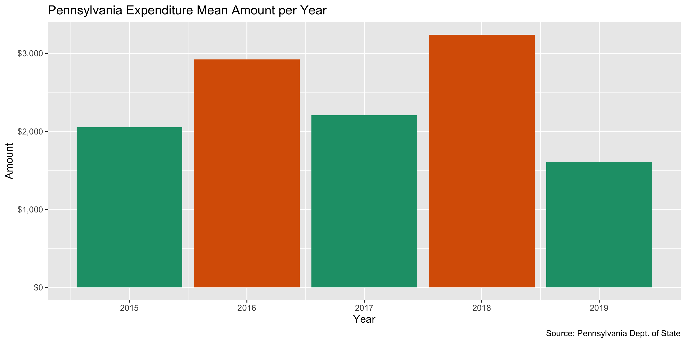
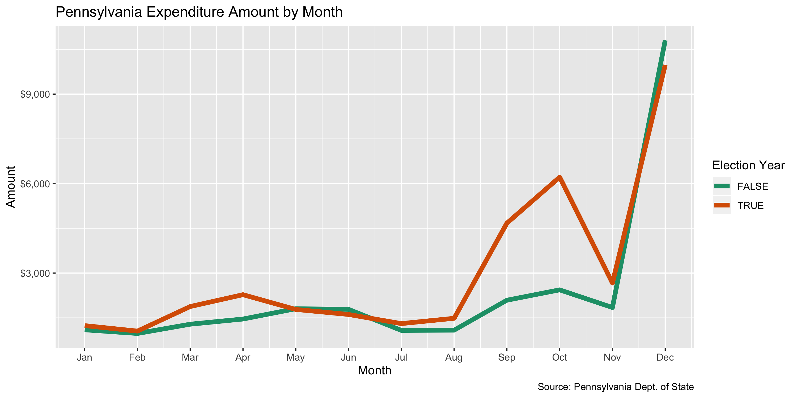

Pennsylvania Campaign Expenditures Data Diary
================
Yanqi Xu
2023-04-30 16:01:09

- <a href="#project" id="toc-project">Project</a>
- <a href="#objectives" id="toc-objectives">Objectives</a>
- <a href="#packages" id="toc-packages">Packages</a>
- <a href="#data" id="toc-data">Data</a>
- <a href="#import" id="toc-import">Import</a>
- <a href="#fix" id="toc-fix">Fix</a>
- <a href="#explore" id="toc-explore">Explore</a>
- <a href="#wrangle" id="toc-wrangle">Wrangle</a>
- <a href="#conclude" id="toc-conclude">Conclude</a>
- <a href="#export" id="toc-export">Export</a>

## Project

The Accountability Project is an effort to cut across data silos and
give journalists, policy professionals, activists, and the public at
large a simple way to search across huge volumes of public data about
people and organizations.

Our goal is to standardizing public data on a few key fields by thinking
of each dataset row as a transaction. For each transaction there should
be (at least) 3 variables:

1.  All **parties** to a transaction
2.  The **date** of the transaction
3.  The **amount** of money involved

## Objectives

This document describes the process used to complete the following
objectives:

1.  How many records are in the database?
2.  Check for duplicates
3.  Check ranges
4.  Is there anything blank or missing?
5.  Check for consistency issues
6.  Create a five-digit ZIP Code called `ZIP5`
7.  Create a `YEAR` field from the transaction date
8.  Make sure there is data on both parties to a transaction

## Packages

The following packages are needed to collect, manipulate, visualize,
analyze, and communicate these results. The `pacman` package will
facilitate their installation and attachment.

``` r
if (!require("pacman")) install.packages("pacman")
pacman::p_load_gh("irworkshop/campfin")
pacman::p_load(
  stringdist, # levenshtein value
  tidyverse, # data manipulation
  readxl, # read excel files
  lubridate, # datetime strings
  tidytext, # string analysis
  magrittr, # pipe opperators
  janitor, # dataframe clean
  refinr, # cluster and merge
  knitr, # knit documents
  glue, # combine strings
  scales, #format strings
  here, # relative storage
  fs, # search storage 
  vroom #read deliminated files
)
```

This document should be run as part of the `R_campfin` project, which
lives as a sub-directory of the more general, language-agnostic
[`irworkshop/accountability_datacleaning`](https://github.com/irworkshop/accountability_datacleaning "TAP repo")
GitHub repository.

The `R_campfin` project uses the [RStudio
projects](https://support.rstudio.com/hc/en-us/articles/200526207-Using-Projects "Rproj")
feature and should be run as such. The project also uses the dynamic
`here::here()` tool for file paths relative to *your* machine.

``` r
# where dfs this document knit?
here::here()
#> [1] "/Users/yanqixu/code/accountability_datacleaning"
```

## Data

Data is from the [Pennsylvania Election and Campaign Finance System
(ECF)](https://www.dos.pa.gov/VotingElections/CandidatesCommittees/CampaignFinance/Pages/default.aspx).

The ECF provides a [Full Campaign Finance
Export](https://www.dos.pa.gov/VotingElections/CandidatesCommittees/CampaignFinance/Resources/Pages/FullCampaignFinanceExport.aspx).
From this page, files are organized as annual directories containing
files for contributions, debt, expenditures, filer information, and
receipts.

The ECF also provides a `readme.txt` file, which we can read to better
understand the data we will be downloading.

In this update, we include all years up to 2022. The next update should
start with 2023.

``` r
pa_host <- "https://www.dos.pa.gov/VotingElections"
pa_dir <- "CandidatesCommittees/CampaignFinance/Resources/Documents"
readme_file <- "readmepriorto2022.txt"
readme_url <- paste(pa_host, pa_dir, readme_file, sep = "/")
```

This text file provides the column names and types for the each of the
data files included in the raw download.

### About

Data layout for 2022 is different from previous years and the record
layout can be found
[here](https://www.dos.pa.gov/VotingElections/CandidatesCommittees/CampaignFinance/Resources/Documents/readme2022.txt).

For data prior to 2022, see
<https://www.dos.pa.gov/VotingElections/CandidatesCommittees/CampaignFinance/Resources/Documents/readmepriorto2022.txt>

## Import

### Download

Download raw, **immutable** data file. Go to
<https://www.dos.pa.gov/VotingElections/CandidatesCommittees/CampaignFinance/Resources/Pages/FullCampaignFinanceExport.aspx>.
We’ll download the files from 2015 to 2019 (file format: zip file) with
the script.

``` r
# create a directory for the raw data
raw_dir <- here("state","pa", "expends", "data", "raw")
dir_create(raw_dir)
```

Download all the file packages containing all campaign-finance-related
files.

``` r
#download the files into the directory
pa_exp_urls <- glue("https://www.dos.pa.gov//VotingElections/CandidatesCommittees/CampaignFinance/Resources/Documents/{2015:2022}.zip")

if (!all_files_new(raw_dir)) {
  for (url in pa_exp_urls) {
    download.file(
      url = url,
      destfile = glue("{raw_dir}/{basename(url)}")
    )
  }
}
```

### Read

Read individual csv files from the downloaded zip files

``` r
zip_files <- dir_ls(raw_dir, glob = "*.zip")

if (all_files_new(path = raw_dir, glob = "*.txt")) {
  for (i in seq_along(zip_files)) {
    unzip(
      zipfile = zip_files[i],
      #Matches the csv files that starts with expense, and trim the "./ " from directory names
      files = grep("expense.+", unzip(zip_files[i]), value = TRUE) %>% substring(3,),
      exdir = raw_dir
    )
  }
}
```

## Fix

To properly read the file into R, we first have to do some simple string
processing to the text file.

``` r
fix_dir <- dir_create(path(dirname(raw_dir), "fix"))
pa_expends_paths <- dir_ls(raw_dir, regexp = "expense.+", recurse = FALSE)

raw_dir %>% dir_info() %>% filter(path %in% pa_expends_paths)
```

    #> # A tibble: 8 × 18
    #>   path         type   size permiss…¹ modification_time   user  group devic…² hard_…³ speci…⁴  inode
    #>   <fs::path>   <fct> <fs:> <fs::per> <dttm>              <chr> <chr>   <dbl>   <dbl>   <dbl>  <dbl>
    #> 1 …expense.txt file    13M rw-r--r-- 2023-04-17 22:38:42 yanq… staff  1.68e7       1       0 1.04e8
    #> 2 …se_2015.txt file  13.3M rw-r--r-- 2023-04-17 22:35:07 yanq… staff  1.68e7       1       0 1.04e8
    #> 3 …se_2016.txt file  13.6M rw-r--r-- 2023-04-17 22:37:16 yanq… staff  1.68e7       1       0 1.04e8
    #> 4 …se_2017.txt file  12.1M rw-r--r-- 2023-04-17 22:37:57 yanq… staff  1.68e7       1       0 1.04e8
    #> 5 …3042019.txt file  16.4M rw-r--r-- 2023-04-17 22:38:02 yanq… staff  1.68e7       1       0 1.04e8
    #> 6 …se_2020.txt file  13.3M rw-r--r-- 2023-04-17 22:38:47 yanq… staff  1.68e7       1       0 1.04e8
    #> 7 …se_2021.txt file  11.7M rw-r--r-- 2023-04-17 22:38:51 yanq… staff  1.68e7       1       0 1.04e8
    #> 8 …se_2022.txt file  18.1M rw-r--r-- 2023-04-17 22:40:30 yanq… staff  1.68e7       1       0 1.04e8
    #> # … with 7 more variables: block_size <dbl>, blocks <dbl>, flags <int>, generation <dbl>,
    #> #   access_time <dttm>, change_time <dttm>, birth_time <dttm>, and abbreviated variable names
    #> #   ¹​permissions, ²​device_id, ³​hard_links, ⁴​special_device_id

``` r
#fix_eval <- length(dir_ls(fix_dir)) != length(expense_files)
```

``` r
# for old format files
for (f in pa_expends_paths) {
  n <- path(fix_dir, str_c("FIX", basename(f), sep = "_"))
  x <- read_lines(f, skip = 1)
  for (i in rev(seq_along(x))) {
    y <- i - 1
    if (y == 0) {
      next() # skip first
    } else if (str_starts(x[i], "\"\\d+\",") | str_ends(x[y], "\"(Y|N)\"")) {
      next() # skip if good
    } else { # merge if bad
      x[y] <- str_c(x[y], x[i])
      x <- x[-i] # remove bad
    }
  }
  x <- str_remove(x, '(?<=")"(?!,)')
  write_lines(x, n)
  message(basename(n))
}
```

``` r
# new format files
for (f in pa_expends_paths) {
  n <- path(fix_dir, str_c("FIX", basename(f), sep = "_"))
  x <- read_lines(f, skip = 1)
  for (i in rev(seq_along(x))) {
    if (str_starts(x[i], "\\d+,\\d+,")) {
      next() # skip if good
    } else { # merge if bad
      x[i - 1] <- str_c(x[i - 1], x[i])
      x <- x[-i] # remove bad
    }
  }
  write_lines(x, n)
  message(basename(n))
}
```

``` r
fix_info <- as_tibble(dir_info(fix_dir))
sum(fix_info$size)
fix_info %>% 
  select(path, size, modification_time) %>% 
  mutate(across(path, basename))
```

Read multiple csvs into R

``` r
exp_22 <- glue(raw_dir, "/expense_2022.txt")
#pa_lines <- list.files(raw_dir, pattern = ".txt", recursive = TRUE) %>% map(read_lines) %>% unlist()

pa_expends_paths <- setdiff(pa_expends_paths, exp_22)
col_names_2022 <- c("FILERID", 
"REPORTID", 
"EYEAR",
"TIMESTAMP", 
"CYCLE", 
"EXPNAME", 
"ADDRESS1", 
"ADDRESS2", 
"CITY", 
"STATE", 
"ZIPCODE", 
"EXPDATE", 
"EXPAMT", 
"EXPDESC")

col_names_earlier <- readme$expense$col
```

There are some double quotes in the files that cause errors when reading
in. So we will manually change the double quotes into single quotes. The
regex used to process files up to 2022 and since 2022 are very similar,
just a little different.

``` r
y <- read_lines(exp_22)
#find quotes not at the end that don't contain commas
y <- y %>% str_replace_all('(?<!,)\\"(?!$|,)',"'")

read_pa <- function(file){
  x <- read_lines(file)
  #find quotes not at the beginning and not at the end that don't contain commas
  x <- x %>% str_replace_all('(?<!^|,)\\"(?!$|,)',"'") %>% 
    str_replace_all("&amp;", "&")
  df <- read_delim(I(x),
          delim = ",", escape_double = FALSE,
      escape_backslash = FALSE, col_names = col_names_earlier, 
      col_types = cols(.default = col_character()))
  return(df)
}


pa <- pa_expends_paths %>% 
  map_dfr(read_pa)

pa22 <- I(y) %>% read_delim(",", escape_double = FALSE,
      escape_backslash = FALSE, col_names = col_names_2022,
      name_repair = make_clean_names,
      col_types = cols(.default = col_character()))
```

We can see that the two files’ record layouts are similar, with the 2022
file having two more columns `reportid` and `timestamp`. We can just
combine them into one.

``` r
pae <- pa %>% bind_rows(pa22)
```

We also need to pull up the processed filer table to join back to the
`filerid`, and `eyear` fields.

Then we can read the fixed filer files to describe the recipients.

``` r
fil_paths <- dir_ls(
  path = raw_dir, 
  recurse = TRUE, 
  regexp = "(F|f)iler[\\.|_]"
)

fix_check <- here("state","pa", "expends", "data", "fixed.txt")
```

``` r
# do not repeat if done
#if (!file_exists(fix_check)) {
  # for all filer files
  for (f in c(fil_paths)) {
    # read raw file
    read_file(f) %>% 
      # force conversion to simple
      iconv(to = "ASCII", sub = "") %>% 
      # replace non-carriage newline
      str_replace_all("(?<!\r)\n", " ") %>%
      # replace not-field double quotes
      str_replace_all("(?<!^|,|\r\n)\"(?!,|\r\n|$)", "\'") %>% 
      # replace non-delim commas
      str_remove_all(",(?!\"|\\d|\\.\\d+|-(\\d|\\.))") %>% 
      # overwrite raw file
      write_file(f)
    # check progress
    message(paste(basename(f), "done"))
    # clean garbage memory
    flush_memory()
  }
  # note this has done
  file_create(fix_check)
#}
```

``` r
fil_path_2022 <- glue(raw_dir, "/filer_2022.txt")
#pa_lines <- list.files(raw_dir, pattern = ".txt", recursive = TRUE) %>% map(read_lines) %>% unlist()
fil_cols_2022 <- c("filerid", "reportid", "eyear", "timestamp", "cycle", "ammend", "terminate", "filertype","filername",
 "office", "district", "party", "address1", "address2", "city", "state",    
 "zipcode", "county", "phone", "beginning","monetary", "inkind")
fil_paths <- setdiff(fil_paths, fil_path_2022)

filers2022 <- read_delim(fil_path_2022,
                          delim = ",",
  escape_backslash = FALSE, 
  escape_double = FALSE,
  col_names = fil_cols_2022,
  col_types = cols(
    .default = col_character()
  ))

filers <- map_df(
  .x = fil_paths,
  .f = read_delim,
  delim = ",",
  escape_backslash = FALSE, 
  escape_double = FALSE,
  col_names = readme$filer$col,
  col_types = cols(
    .default = col_character()
  )
)

filers <- filers2022 %>% bind_rows(filers)
```

We only want to join a single filer to each contribution listed in the
data. We can group by the unique filer ID and a filing year and select
only one copy of the data.

``` r
nrow(filers)
```

    #> [1] 69375

``` r
filers <- filers %>% 
  group_by(filerid, eyear) %>% 
  slice(1) %>% 
  ungroup()
nrow(filers)
```

    #> [1] 30182

``` r
filers %>% write_csv(glue("{raw_dir}/join_filers_2022.csv"))
```

Now the filer information can be added to the contribution data with a
`dplyr::left_join()` along the unique filer ID and election year.

``` r
# 18,386,163
pae <- left_join(
  x = pae,
  y = filers,
  by = c("filerid", "eyear"),
  suffix = c("_exp", "_fil")
)
rm(filers)

pae <- rename_prefix(
  df = pae,
  suffix = c("_exp", "_fil"),
  punct = TRUE
)
```

``` r
pae <- pae %>% 
  rename_with(~str_replace(., "address", "addr")) %>% 
  rename(
    exp_zip = exp_zipcode,
    fil_type = filertype,
    filer = filername,
    fil_zip = fil_zipcode,
    fil_phone = phone
  )
```

The text fields contain both lower-case and upper-case letters. The for
loop converts them to all upper-case letters unifies the encoding to
“UTF-8”, replaces the “&”, the HTML expression of “An ampersand”. These
strings are invalid and cannot be converted Converting the encoding may
result in some NA values. But there’re not too many of them based on
counts of NAs before and after the encoding conversion.

``` r
col_stats(pae, count_na)
```

    #> # A tibble: 34 × 4
    #>    col           class      n        p
    #>    <chr>         <chr>  <int>    <dbl>
    #>  1 filerid       <chr>      0 0       
    #>  2 eyear         <chr>      0 0       
    #>  3 exp_cycle     <chr>      0 0       
    #>  4 expname       <chr>    135 0.000151
    #>  5 exp_addr1     <chr>  22303 0.0250  
    #>  6 exp_addr2     <chr> 819926 0.918   
    #>  7 exp_city      <chr>  18882 0.0211  
    #>  8 exp_state     <chr>  18523 0.0207  
    #>  9 exp_zip       <chr>  24201 0.0271  
    #> 10 expdate       <chr>   2717 0.00304 
    #> 11 expamt        <chr>      0 0       
    #> 12 expdesc       <chr>  15888 0.0178  
    #> 13 exp_reportid  <chr> 763645 0.855   
    #> 14 exp_timestamp <chr> 763660 0.855   
    #> 15 fil_reportid  <chr> 763645 0.855   
    #> 16 fil_timestamp <chr> 763660 0.855   
    #> 17 fil_cycle     <chr>      0 0       
    #> 18 ammend        <chr>      0 0       
    #> 19 terminate     <chr>      0 0       
    #> 20 fil_type      <chr>   2331 0.00261 
    #> 21 filer         <chr>      0 0       
    #> 22 office        <chr> 700974 0.785   
    #> 23 district      <chr> 700430 0.784   
    #> 24 party         <chr> 469686 0.526   
    #> 25 fil_addr1     <chr>    900 0.00101 
    #> 26 fil_addr2     <chr> 777738 0.871   
    #> 27 fil_city      <chr>    643 0.000720
    #> 28 fil_state     <chr>    980 0.00110 
    #> 29 fil_zip       <chr>    806 0.000902
    #> 30 county        <chr> 541583 0.606   
    #> 31 fil_phone     <chr> 383562 0.429   
    #> 32 beginning     <chr>      0 0       
    #> 33 monetary      <chr>      0 0       
    #> 34 inkind        <chr>      0 0

``` r
pae <- pae %>% mutate_all(.funs = iconv, to = "UTF-8") 
# After the encoding, we'll see how many entries have NA fields for each column.
col_stats(pae, count_na)
```

    #> # A tibble: 34 × 4
    #>    col           class      n        p
    #>    <chr>         <chr>  <int>    <dbl>
    #>  1 filerid       <chr>      0 0       
    #>  2 eyear         <chr>      0 0       
    #>  3 exp_cycle     <chr>      0 0       
    #>  4 expname       <chr>    135 0.000151
    #>  5 exp_addr1     <chr>  22303 0.0250  
    #>  6 exp_addr2     <chr> 819926 0.918   
    #>  7 exp_city      <chr>  18882 0.0211  
    #>  8 exp_state     <chr>  18523 0.0207  
    #>  9 exp_zip       <chr>  24201 0.0271  
    #> 10 expdate       <chr>   2717 0.00304 
    #> 11 expamt        <chr>      0 0       
    #> 12 expdesc       <chr>  15888 0.0178  
    #> 13 exp_reportid  <chr> 763645 0.855   
    #> 14 exp_timestamp <chr> 763660 0.855   
    #> 15 fil_reportid  <chr> 763645 0.855   
    #> 16 fil_timestamp <chr> 763660 0.855   
    #> 17 fil_cycle     <chr>      0 0       
    #> 18 ammend        <chr>      0 0       
    #> 19 terminate     <chr>      0 0       
    #> 20 fil_type      <chr>   2331 0.00261 
    #> 21 filer         <chr>      0 0       
    #> 22 office        <chr> 700974 0.785   
    #> 23 district      <chr> 700430 0.784   
    #> 24 party         <chr> 469686 0.526   
    #> 25 fil_addr1     <chr>    900 0.00101 
    #> 26 fil_addr2     <chr> 777738 0.871   
    #> 27 fil_city      <chr>    643 0.000720
    #> 28 fil_state     <chr>    980 0.00110 
    #> 29 fil_zip       <chr>    806 0.000902
    #> 30 county        <chr> 541583 0.606   
    #> 31 fil_phone     <chr> 383562 0.429   
    #> 32 beginning     <chr>      0 0       
    #> 33 monetary      <chr>      0 0       
    #> 34 inkind        <chr>      0 0

``` r
#All the fields are converted to strings. Convert to date and double.
pae$expdate <- as.Date(pae$expdate, "%Y%m%d")
pae$expamt <- as.double(pae$expamt)
```

## Explore

There are `nrow(pae)` records of `length(pae)` variables in the full
database.

``` r
head(pae)
```

    #> # A tibble: 6 × 34
    #>   filerid eyear exp_cycle expname exp_a…¹ exp_a…² exp_c…³ exp_s…⁴ exp_zip expdate    expamt expdesc
    #>   <chr>   <chr> <chr>     <chr>   <chr>   <chr>   <chr>   <chr>   <chr>   <date>      <dbl> <chr>  
    #> 1 9600029 2019  8         15th W… c/o Bi… 635 Mo… Pittsb… PA      15217   2019-02-28   150  Contri…
    #> 2 9600029 2019  8         Wilkin… 900 Wo… 2nd Fl… Pittsb… PA      15221   2019-02-22   120  Ticket…
    #> 3 9600029 2019  8         AT&T M… PO Box… <NA>    Carol … IL      601976… 2019-01-03   162. Cellul…
    #> 4 9600029 2019  8         AT&T M… PO Box… <NA>    Carol … IL      601976… 2019-02-13   143. Cellul…
    #> 5 9600029 2019  8         AOH Di… c/o Ja… 5 Peri… Pittsb… PA      15220   2019-02-21   170  3/10 B…
    #> 6 9600029 2019  8         Allegh… 22 Wab… Ste 205 Pittsb… PA      152205… 2019-03-05   500  Sponso…
    #> # … with 22 more variables: exp_reportid <chr>, exp_timestamp <chr>, fil_reportid <chr>,
    #> #   fil_timestamp <chr>, fil_cycle <chr>, ammend <chr>, terminate <chr>, fil_type <chr>,
    #> #   filer <chr>, office <chr>, district <chr>, party <chr>, fil_addr1 <chr>, fil_addr2 <chr>,
    #> #   fil_city <chr>, fil_state <chr>, fil_zip <chr>, county <chr>, fil_phone <chr>,
    #> #   beginning <chr>, monetary <chr>, inkind <chr>, and abbreviated variable names ¹​exp_addr1,
    #> #   ²​exp_addr2, ³​exp_city, ⁴​exp_state

``` r
tail(pae)
```

    #> # A tibble: 6 × 34
    #>   filerid eyear exp_cycle expname exp_a…¹ exp_a…² exp_c…³ exp_s…⁴ exp_zip expdate    expamt expdesc
    #>   <chr>   <chr> <chr>     <chr>   <chr>   <chr>   <chr>   <chr>   <chr>   <date>      <dbl> <chr>  
    #> 1 372408  2022  2         FXG SI… 145 SA… <NA>    MECHAN… PA      17050   2022-04-15   2226 SIGNS  
    #> 2 372408  2022  2         RGB PO… 3031 L… <NA>    CAMP H… PA      17011   2022-03-31   6000 CONSUL…
    #> 3 372408  2022  2         RGB PO… 3031 L… <NA>    CAMP H… PA      17011   2022-04-18  13000 CONSUL…
    #> 4 372408  2022  2         RGB PO… 3031 L… <NA>    CAMP H… PA      17011   2022-04-21  10000 CONSUL…
    #> 5 372408  2022  2         RGB PO… 3031 L… <NA>    CAMP H… PA      17011   2022-05-01  12630 CONSUL…
    #> 6 372408  2022  2         Cumber… 302 Li… <NA>    Mechan… PA      17050   2022-05-01   1000 CONTRI…
    #> # … with 22 more variables: exp_reportid <chr>, exp_timestamp <chr>, fil_reportid <chr>,
    #> #   fil_timestamp <chr>, fil_cycle <chr>, ammend <chr>, terminate <chr>, fil_type <chr>,
    #> #   filer <chr>, office <chr>, district <chr>, party <chr>, fil_addr1 <chr>, fil_addr2 <chr>,
    #> #   fil_city <chr>, fil_state <chr>, fil_zip <chr>, county <chr>, fil_phone <chr>,
    #> #   beginning <chr>, monetary <chr>, inkind <chr>, and abbreviated variable names ¹​exp_addr1,
    #> #   ²​exp_addr2, ³​exp_city, ⁴​exp_state

``` r
glimpse(pae)
```

    #> Rows: 893,339
    #> Columns: 34
    #> $ filerid       <chr> "9600029", "9600029", "9600029", "9600029", "9600029", "9600029", "9600029"…
    #> $ eyear         <chr> "2019", "2019", "2019", "2019", "2019", "2019", "2019", "2019", "2019", "20…
    #> $ exp_cycle     <chr> "8", "8", "8", "8", "8", "8", "8", "8", "8", "8", "8", "8", "8", "8", "8", …
    #> $ expname       <chr> "15th Ward Democratic Committee", "Wilkinsburg Chamber of Commerce", "AT&T …
    #> $ exp_addr1     <chr> "c/o Bill Tenney", "900 Wood Street", "PO Box 6416", "PO Box 6416", "c/o Ja…
    #> $ exp_addr2     <chr> "635 Montclair Street", "2nd Floor", NA, NA, "5 Perity Lane", "Ste 205", "2…
    #> $ exp_city      <chr> "Pittsburgh", "Pittsburgh", "Carol Stream", "Carol Stream", "Pittsburgh", "…
    #> $ exp_state     <chr> "PA", "PA", "IL", "IL", "PA", "PA", "PA", "PA", "PA", "PA", "PA", "IL", "PA…
    #> $ exp_zip       <chr> "15217", "15221", "601976416", "601976416", "15220", "152205445", "15216", …
    #> $ expdate       <date> 2019-02-28, 2019-02-22, 2019-01-03, 2019-02-13, 2019-02-21, 2019-03-05, 20…
    #> $ expamt        <dbl> 150.00, 120.00, 161.76, 143.02, 170.00, 500.00, 100.00, 150.00, 100.00, 150…
    #> $ expdesc       <chr> "Contribution-Event of 3/2", "Tickets to 2/28 Event", "Cellular Phone Servi…
    #> $ exp_reportid  <chr> NA, NA, NA, NA, NA, NA, NA, NA, NA, NA, NA, NA, NA, NA, NA, NA, NA, NA, NA,…
    #> $ exp_timestamp <chr> NA, NA, NA, NA, NA, NA, NA, NA, NA, NA, NA, NA, NA, NA, NA, NA, NA, NA, NA,…
    #> $ fil_reportid  <chr> NA, NA, NA, NA, NA, NA, NA, NA, NA, NA, NA, NA, NA, NA, NA, NA, NA, NA, NA,…
    #> $ fil_timestamp <chr> NA, NA, NA, NA, NA, NA, NA, NA, NA, NA, NA, NA, NA, NA, NA, NA, NA, NA, NA,…
    #> $ fil_cycle     <chr> "5", "5", "5", "5", "5", "5", "5", "5", "5", "5", "5", "5", "5", "5", "5", …
    #> $ ammend        <chr> "Y", "Y", "Y", "Y", "Y", "Y", "Y", "Y", "Y", "Y", "Y", "Y", "Y", "Y", "Y", …
    #> $ terminate     <chr> "N", "N", "N", "N", "N", "N", "N", "N", "N", "N", "N", "N", "N", "N", "N", …
    #> $ fil_type      <chr> "2", "2", "2", "2", "2", "2", "2", "2", "2", "2", "2", "2", "2", "2", "2", …
    #> $ filer         <chr> "Jay Costa Jr for State Senate", "Jay Costa Jr for State Senate", "Jay Cost…
    #> $ office        <chr> NA, NA, NA, NA, NA, NA, NA, NA, NA, NA, NA, NA, NA, NA, NA, NA, NA, NA, NA,…
    #> $ district      <chr> NA, NA, NA, NA, NA, NA, NA, NA, NA, NA, NA, NA, NA, NA, NA, NA, NA, NA, NA,…
    #> $ party         <chr> NA, NA, NA, NA, NA, NA, NA, NA, NA, NA, NA, NA, NA, NA, NA, NA, NA, NA, NA,…
    #> $ fil_addr1     <chr> "314 Newport Road", "314 Newport Road", "314 Newport Road", "314 Newport Ro…
    #> $ fil_addr2     <chr> NA, NA, NA, NA, NA, NA, NA, NA, NA, NA, NA, NA, NA, NA, NA, NA, NA, NA, NA,…
    #> $ fil_city      <chr> "Pittsburgh", "Pittsburgh", "Pittsburgh", "Pittsburgh", "Pittsburgh", "Pitt…
    #> $ fil_state     <chr> "PA", "PA", "PA", "PA", "PA", "PA", "PA", "PA", "PA", "PA", "PA", "PA", "PA…
    #> $ fil_zip       <chr> "15221", "15221", "15221", "15221", "15221", "15221", "15221", "15221", "15…
    #> $ county        <chr> NA, NA, NA, NA, NA, NA, NA, NA, NA, NA, NA, NA, NA, NA, NA, NA, NA, NA, NA,…
    #> $ fil_phone     <chr> "4128713924", "4128713924", "4128713924", "4128713924", "4128713924", "4128…
    #> $ beginning     <chr> "468319.2800", "468319.2800", "468319.2800", "468319.2800", "468319.2800", …
    #> $ monetary      <chr> ".0000", ".0000", ".0000", ".0000", ".0000", ".0000", ".0000", ".0000", ".0…
    #> $ inkind        <chr> ".0000", ".0000", ".0000", ".0000", ".0000", ".0000", ".0000", ".0000", ".0…

### Distinct

The variables range in their degree of distinctness. Checking the number
of distinct values of a discrete variable is another good way to ensure
the file was read properly.

``` r
pae %>% col_stats(n_distinct)
```

    #> # A tibble: 34 × 4
    #>    col           class       n          p
    #>    <chr>         <chr>   <int>      <dbl>
    #>  1 filerid       <chr>   14230 0.0159    
    #>  2 eyear         <chr>      11 0.0000123 
    #>  3 exp_cycle     <chr>       9 0.0000101 
    #>  4 expname       <chr>  178666 0.200     
    #>  5 exp_addr1     <chr>  186730 0.209     
    #>  6 exp_addr2     <chr>    7997 0.00895   
    #>  7 exp_city      <chr>   12746 0.0143    
    #>  8 exp_state     <chr>      56 0.0000627 
    #>  9 exp_zip       <chr>   34625 0.0388    
    #> 10 expdate       <date>   3195 0.00358   
    #> 11 expamt        <dbl>  101829 0.114     
    #> 12 expdesc       <chr>  147548 0.165     
    #> 13 exp_reportid  <chr>    2581 0.00289   
    #> 14 exp_timestamp <chr>     306 0.000343  
    #> 15 fil_reportid  <chr>    2581 0.00289   
    #> 16 fil_timestamp <chr>     306 0.000343  
    #> 17 fil_cycle     <chr>       9 0.0000101 
    #> 18 ammend        <chr>       2 0.00000224
    #> 19 terminate     <chr>       2 0.00000224
    #> 20 fil_type      <chr>       4 0.00000448
    #> 21 filer         <chr>    8094 0.00906   
    #> 22 office        <chr>      21 0.0000235 
    #> 23 district      <chr>     207 0.000232  
    #> 24 party         <chr>      22 0.0000246 
    #> 25 fil_addr1     <chr>    7746 0.00867   
    #> 26 fil_addr2     <chr>     908 0.00102   
    #> 27 fil_city      <chr>    1526 0.00171   
    #> 28 fil_state     <chr>      37 0.0000414 
    #> 29 fil_zip       <chr>    3024 0.00339   
    #> 30 county        <chr>      67 0.0000750 
    #> 31 fil_phone     <chr>    4551 0.00509   
    #> 32 beginning     <chr>   20106 0.0225    
    #> 33 monetary      <chr>    5971 0.00668   
    #> 34 inkind        <chr>     473 0.000529

### Missing

The variables also vary in their degree of values that are `NA`
(missing).

``` r
pae %>% col_stats(count_na)
```

    #> # A tibble: 34 × 4
    #>    col           class       n        p
    #>    <chr>         <chr>   <int>    <dbl>
    #>  1 filerid       <chr>       0 0       
    #>  2 eyear         <chr>       0 0       
    #>  3 exp_cycle     <chr>       0 0       
    #>  4 expname       <chr>     135 0.000151
    #>  5 exp_addr1     <chr>   22303 0.0250  
    #>  6 exp_addr2     <chr>  819926 0.918   
    #>  7 exp_city      <chr>   18882 0.0211  
    #>  8 exp_state     <chr>   18523 0.0207  
    #>  9 exp_zip       <chr>   24201 0.0271  
    #> 10 expdate       <date>   2717 0.00304 
    #> 11 expamt        <dbl>       0 0       
    #> 12 expdesc       <chr>   15888 0.0178  
    #> 13 exp_reportid  <chr>  763645 0.855   
    #> 14 exp_timestamp <chr>  763660 0.855   
    #> 15 fil_reportid  <chr>  763645 0.855   
    #> 16 fil_timestamp <chr>  763660 0.855   
    #> 17 fil_cycle     <chr>       0 0       
    #> 18 ammend        <chr>       0 0       
    #> 19 terminate     <chr>       0 0       
    #> 20 fil_type      <chr>    2331 0.00261 
    #> 21 filer         <chr>       0 0       
    #> 22 office        <chr>  700974 0.785   
    #> 23 district      <chr>  700430 0.784   
    #> 24 party         <chr>  469686 0.526   
    #> 25 fil_addr1     <chr>     900 0.00101 
    #> 26 fil_addr2     <chr>  777738 0.871   
    #> 27 fil_city      <chr>     643 0.000720
    #> 28 fil_state     <chr>     980 0.00110 
    #> 29 fil_zip       <chr>     806 0.000902
    #> 30 county        <chr>  541583 0.606   
    #> 31 fil_phone     <chr>  383562 0.429   
    #> 32 beginning     <chr>       0 0       
    #> 33 monetary      <chr>       0 0       
    #> 34 inkind        <chr>       0 0

We will flag any records with missing values in the key variables used
to identify an expenditure. There are 0 elements that are flagged as
missing at least one value.

``` r
pae <- pae %>% flag_na(expname, expdate, expdesc, expamt, exp_city,filer)

percent(mean(pae$na_flag), 0.01)
```

    #> [1] "3.66%"

### Duplicates

We can see there’re not complete duplicates.

``` r
pa <- flag_dupes(pa, dplyr::everything())
sum(pae$dupe_flag)
#> [1] 0
```

### Ranges

#### Amounts

``` r
summary(pae$expamt)
#>      Min.   1st Qu.    Median      Mean   3rd Qu.      Max. 
#>   -300000        55       250      4839       971 517202055
sum(pae$expamt < 0 , na.rm = TRUE)
#> [1] 1000
```

See how the campaign expenditures were distributed

``` r
pae %>% 
  ggplot(aes(x = expamt)) + 
  geom_histogram() +
  scale_x_continuous(
    trans = "log10", labels = dollar)
```

<!-- -->

Expenditures out of state

``` r
sum(pae$state != "PA", na.rm = TRUE)
```

    #> [1] 0

Top spending purposes <!-- -->

### Dates

Some of the dates are too far back and some are past the current dates.

``` r
summary(pae$expdate)
```

    #>         Min.      1st Qu.       Median         Mean      3rd Qu.         Max.         NA's 
    #> "1825-04-20" "2017-01-20" "2018-11-26" "2019-01-20" "2021-01-11" "5018-09-15"       "2717"

### Year

Add a `year` variable from `date` after `col_date()` using
`lubridate::year()`.

``` r
pae <- pae %>% mutate(year = year(expdate), on_year = is_even(year))
```

<!-- -->

<!-- -->

<!-- -->

``` r
pae %>% group_by(expdesc) %>% summarize(total = sum(expamt)) %>% arrange(desc(total))
```

    #> # A tibble: 147,548 × 2
    #>    expdesc                                                                           total
    #>    <chr>                                                                             <dbl>
    #>  1 <NA>                                                                         885585008.
    #>  2 POSTAGE                                                                      525768975.
    #>  3 Contribution                                                                 248892109.
    #>  4 Unitemized Expenditures                                                      210584211.
    #>  5 CONTRIBUTION                                                                 207431001.
    #>  6 Non PA Disbursements                                                         163777826.
    #>  7 DONATION                                                                     130424591.
    #>  8 See FEC report at https://www.fec.gov/data/committee/C00042366/? tab=filings 114236099.
    #>  9 NON-PENNSYLVANIA EXPENDITURES                                                109614808.
    #> 10 See FEC report at https://www.fec.gov/data/committee/C00042366/?tab=filings   57998962.
    #> # … with 147,538 more rows

## Wrangle

To improve the searchability of the database, we will perform some
consistent, confident string normalization. For geographic variables
like city names and ZIP codes, the corresponding `campfin::normal_*()`
functions are tailor made to facilitate this process.

### Address

For the street `*_addresss` variables, the `campfin::normal_address()`
function will force consistence case, remove punctuation, and abbreviate
official USPS suffixes.

``` r
norm_addr <- pae %>%
  count(exp_addr1, exp_addr2, sort = TRUE) %>% 
  select(-n) %>% 
  unite(
    col = exp_addr_full,
    starts_with("exp_addr"),
    sep = " ",
    remove = FALSE,
    na.rm = TRUE
  ) %>% 
  mutate(
    exp_addr_norm = normal_address(
      address = exp_addr_full,
      abbs = usps_street,
      na_rep = TRUE
    )
  ) %>% 
  select(-exp_addr_full)
```

``` r
norm_addr
```

    #> # A tibble: 193,306 × 3
    #>    exp_addr1     exp_addr2 exp_addr_norm
    #>    <chr>         <chr>     <chr>        
    #>  1 <NA>          <NA>      <NA>         
    #>  2 PO Box 412    <NA>      PO BOX 412   
    #>  3 PO Box 441146 <NA>      PO BOX 441146
    #>  4 366 Summer St <NA>      366 SUMMER ST
    #>  5 PO Box 792    <NA>      PO BOX 792   
    #>  6 1 Hacker Way  <NA>      1 HACKER WAY 
    #>  7 1 HACKER WAY  <NA>      1 HACKER WAY 
    #>  8 PO Box 624    <NA>      PO BOX 624   
    #>  9 P.O. Box 412  <NA>      PO BOX 412   
    #> 10 PO BOX 441146 <NA>      PO BOX 441146
    #> # … with 193,296 more rows

``` r
pae <- left_join(pae, norm_addr)
rm(norm_addr); flush_memory(1)
```

We will repeat the process for filer addresses.

``` r
norm_addr <- pae %>% 
  count(fil_addr1, fil_addr2, sort = TRUE) %>% 
  select(-n) %>% 
  unite(
    col = fil_addr_full,
    starts_with("fil_addr"),
    sep = " ",
    remove = FALSE,
    na.rm = TRUE
  ) %>% 
  mutate(
    fil_addr_norm = normal_address(
      address = fil_addr_full,
      abbs = usps_street,
      na_rep = TRUE
    )
  ) %>% 
  select(-fil_addr_full)
```

``` r
norm_addr
```

    #> # A tibble: 8,020 × 3
    #>    fil_addr1                        fil_addr2             fil_addr_norm                            
    #>    <chr>                            <chr>                 <chr>                                    
    #>  1 "PO Box 22635"                   <NA>                  PO BOX 22635                             
    #>  2 "112 STATE STREET"               <NA>                  112 STATE ST                             
    #>  3 "815 16th St. NW"                <NA>                  815 16TH ST NW                           
    #>  4 "146 DYERS STONE DRIVE"          <NA>                  146 DYERS STONE DR                       
    #>  5 "2791 SOUTHAMPTON ROAD         " <NA>                  2791 SOUTHAMPTON RD                      
    #>  6 "PO Box 476"                     <NA>                  PO BOX 476                               
    #>  7 "1719 Spring Garden Street"      <NA>                  1719 SPRING GARDEN ST                    
    #>  8 "229 State St"                   <NA>                  229 STATE ST                             
    #>  9 "500 N. THIRD STREET 4TH FLOOR"  P.O. BOX 11787        500 N THIRD STREET 4TH FLOOR PO BOX 11787
    #> 10 "C/O TREAS: Joseph Ashdale"      2980 SOUTHAMPTON ROAD C/O TREAS JOSEPH ASHDALE 2980 SOUTHAMPTO…
    #> # … with 8,010 more rows

``` r
pae <- left_join(pae, norm_addr)
rm(norm_addr); flush_memory(1)
```

### ZIP

``` r
table(nchar(pae$fil_zip))
#> 
#>      4      5      6      8      9     10 
#>     75 545285 130184    729  74928 141332
table(nchar(pae$exp_zip))
#> 
#>      1      2      3      4      5      6      7      8      9     10     13 
#>     13     38    260    561 683960   1291    132    162 178309   4408      4
```

For ZIP codes, the `campfin::normal_zip()` function will attempt to
create valid *five* digit codes by removing the ZIP+4 suffix and
returning leading zeroes dropped by other programs like Microsoft Excel.

``` r
pae <- mutate_at(
  .tbl = pae,
  .vars = vars(ends_with("zip")),
  .funs = list(norm = normal_zip),
  na_rep = TRUE
)
```

``` r
progress_table(
  pae$exp_zip,
  pae$exp_zip_norm,
  pae$fil_zip,
  pae$fil_zip_norm,
  compare = valid_zip
)
```

    #> # A tibble: 4 × 6
    #>   stage            prop_in n_distinct  prop_na  n_out n_diff
    #>   <chr>              <dbl>      <dbl>    <dbl>  <dbl>  <dbl>
    #> 1 pae$exp_zip        0.781      34625 0.0271   189997  27581
    #> 2 pae$exp_zip_norm   0.995       9799 0.0295     3954   1278
    #> 3 pae$fil_zip        0.610       3024 0.000902 347821   1988
    #> 4 pae$fil_zip_norm   0.998       1243 0.000919   1385     39

### State

There is no need to clean the two state variables.

``` r
prop_in(pae$exp_state, valid_state)
```

    #> [1] 0.9999943

``` r
prop_in(pae$fil_state, valid_state)
```

    #> [1] 1

### City

Cleaning city values is the most complicated. This process involves four
steps:

1.  Prepare raw city values by removing invalid data and reducing
    inconsistencies
2.  Match prepared city values with the *actual* city name of that
    record’s ZIP code
3.  swap prepared city values with the ZIP code match *if* only 1 edit
    is needed
4.  Refine swapped city values with key collision and n-gram
    fingerprints

#### Normal

0 distinct cities were in the original dataset in column

``` r
exp_norm_city <- pae %>% 
  count(exp_city, exp_state, exp_zip_norm, sort = TRUE) %>% 
  select(-n) %>% 
  mutate(
    across(
      .cols = exp_city, 
      .fns = list(norm = normal_city), 
      abbs = usps_city,
      states = c("PA", "DC", "PENNSYLVANIA"),
      na = invalid_city,
      na_rep = TRUE
    )
  )
```

``` r
fil_norm_city <- pae %>% 
  count(fil_city, fil_state, fil_zip_norm, sort = TRUE) %>% 
  select(-n) %>% 
  mutate(
    across(
      .cols = fil_city, 
      .fns = list(norm = normal_city), 
      abbs = usps_city,
      states = c("PA", "DC", "PENNSYLVANIA"),
      na = invalid_city,
      na_rep = TRUE
    )
  )
```

#### Swap

We can further improve normalization by comparing our normalized value
against the *expected* value for that record’s state abbreviation and
ZIP code. If the normalized value is either an abbreviation for or very
similar to the expected value, we can confidently swap those two.

``` r
exp_norm_city <- exp_norm_city %>% 
  left_join(
    y = zipcodes,
    by = c(
      "exp_state" = "state",
      "exp_zip_norm" = "zip"
    )
  ) %>% 
  rename(city_match = city) %>% 
  mutate(
    match_abb = is_abbrev(exp_city_norm, city_match),
    match_dist = str_dist(exp_city_norm, city_match),
    exp_city_swap = if_else(
      condition = !is.na(match_dist) & (match_abb | match_dist == 1),
      true = city_match,
      false = exp_city_norm
    )
  ) %>% 
  select(
    -city_match,
    -match_dist,
    -match_abb
  )
```

``` r
fil_norm_city <- fil_norm_city %>% 
  left_join(
    y = zipcodes,
    by = c(
      "fil_state" = "state",
      "fil_zip_norm" = "zip"
    )
  ) %>% 
  rename(city_match = city) %>% 
  mutate(
    match_abb = is_abbrev(fil_city_norm, city_match),
    match_dist = str_dist(fil_city_norm, city_match),
    fil_city_swap = if_else(
      condition = !is.na(match_dist) & (match_abb | match_dist == 1),
      true = city_match,
      false = fil_city_norm
    )
  ) %>% 
  select(
    -city_match,
    -match_dist,
    -match_abb
  )
```

#### Refine

The [OpenRefine](https://openrefine.org/) algorithms can be used to
group similar strings and replace the less common versions with their
most common counterpart. This can greatly reduce inconsistency, but with
low confidence; we will only keep any refined strings that have a valid
city/state/zip combination.

``` r
good_refine <- exp_norm_city %>% 
  mutate(
    exp_city_refine = exp_city_swap %>% 
      key_collision_merge() %>% 
      n_gram_merge(numgram = 1)
  ) %>% 
  filter(exp_city_refine != exp_city_swap) %>% 
  inner_join(
    y = zipcodes,
    by = c(
      "exp_city_refine" = "city",
      "exp_state" = "state",
      "exp_zip_norm" = "zip"
    )
  )
```

    #> # A tibble: 142 × 5
    #>    exp_state exp_zip_norm exp_city_swap exp_city_refine     n
    #>    <chr>     <chr>        <chr>         <chr>           <int>
    #>  1 CA        94103        SAN FRANSICO  SAN FRANCISCO       2
    #>  2 CA        94110        SAN FRANSICO  SAN FRANCISCO       2
    #>  3 DE        19886        WILLIMINGTON  WILMINGTON          2
    #>  4 OH        45249        CINCINATTI    CINCINNATI          2
    #>  5 OH        45274        CINCINATTI    CINCINNATI          2
    #>  6 PA        15136        MC KEES ROCK  MCKEES ROCKS        2
    #>  7 PA        17110        HARRISBURGURG HARRISBURG          2
    #>  8 PA        19444        LAYFETTE HILL LAFAYETTE HILL      2
    #>  9 CA        94025        MELENO PARK   MENLO PARK          1
    #> 10 CA        94043        MOUTAINVEIW   MOUNTAIN VIEW       1
    #> # … with 132 more rows

Then we can join the refined values back to the database.

``` r
exp_norm_city <- exp_norm_city %>% 
  left_join(good_refine, by = names(.)) %>% 
  mutate(exp_city_refine = coalesce(exp_city_refine, exp_city_swap))
```

Manually change the city_refine fields due to overcorrection.

``` r
exp_norm_city <- exp_norm_city %>% 
  mutate(
    exp_city_refine = exp_city_refine %>% 
  na_if("ILLEGIBLE") %>% 
  str_replace("^PHILA$", "PHILADELPHIA") %>% 
  str_replace("^PGH$", "PITTSBURGH") %>% 
  str_replace("^NEW YORK CITY$", "NEW YORK") %>% 
  str_replace("^H\\sBURG$", "HARRISBURG") %>% 
  str_replace("^HBG$", "HARRISBURG") %>% 
  str_replace("^NYC$", "NEW YORK") %>% 
  str_replace("^DU BOIS$", "DUBOIS") %>% 
  str_replace("^PIT$", "PITTSBURGH") %>% 
  str_replace("^MCCBG$", "MCCONNELLSBURG") %>% 
  str_replace("^PLUM BORO$", "PLUM") %>% 
  str_replace("^GREENVILLE$", "EAST GREENVILLE") %>% 
  str_replace("^NON$", "ONO") %>% 
  str_replace("^FORD CLIFF$", "CLIFFORD") %>% 
  str_replace("^W\\sB$", "WILKES BARRE")) 
```

#### Check

We can use the `campfin::check_city()` function to pass the remaining
unknown `city_refine` values (and their `state_norm`) to the Google
Geocode API. The function returns the name of the city or locality which
most associated with those values.

This is an easy way to both check for typos and check whether an unknown
`city_refine` value is actually a completely acceptable neighborhood,
census designated place, or some other locality not found in our
`valid_city` vector from our `zipcodes` database.

First, we’ll filter out any known valid city and aggregate the remaining
records by their city and state. Then, we will only query those unknown
cities which appear at least ten times.

``` r
pae_out <- exp_norm_city %>% 
  filter(exp_city_refine %out% c(valid_city, extra_city)) %>% 
  count(exp_city_refine, exp_state, sort = TRUE) %>% 
  drop_na() %>% 
  head(1000)
```

Passing these values to `campfin::check_city()` with `purrr::pmap_dfr()`
will return a single tibble of the rows returned by each city/state
combination.

First, we’ll check to see if the API query has already been done and a
file exist on disk. If such a file exists, we can read it using
`readr::read_csv()`. If not, the query will be sent and the file will be
written using `readr::write_csv()`.

``` r
check_file <- here("state","pa", "expends", "data", "api_check.csv")
if (file_exists(check_file)) {
  check <- read_csv(
    file = check_file,
    col_types = cols(
      .default = col_character(),
      check_city_flag = col_logical()
    )
  )
} else {
  check <- pmap_dfr(
    .l = list(
      pae_out$exp_city_refine, 
      pae_out$exp_state
    ), 
    .f = check_city, 
    key = Sys.getenv("GEOCODE_KEY"), 
    guess = TRUE
  ) %>% 
    mutate(guess = coalesce(guess_city, guess_place)) %>% 
    select(-guess_city, -guess_place)
  write_csv(
    x = check,
    path = check_file
  )
}
```

Any city/state combination with a `check_city_flag` equal to `TRUE`
returned a matching city string from the API, indicating this
combination is valid enough to be ignored.

``` r
valid_locality <- check$guess[check$check_city_flag]
```

Then we can perform some simple comparisons between the queried city and
the returned city. If they are extremely similar, we can accept those
returned locality strings and add them to our list of accepted
additional localities.

``` r
valid_locality <- check %>% 
  filter(!check_city_flag) %>% 
  mutate(
    abb = is_abbrev(original_city, guess),
    dist = str_dist(original_city, guess)
  ) %>%
  filter(abb | dist <= 3) %>% 
  pull(guess) %>% 
  c(valid_locality)
```

``` r
valid_locality <- c(valid_locality, "ABBOTT PARK", "RESEARCH TRIANGLE PARK")
```

``` r
# Manually change overcorrected city names to original 
exp_norm_city$exp_city_refine <- exp_norm_city$exp_city_refine %>% 
  str_replace("^FEASTERVILLE\\sTREVOSE", "FEASTERVILLE") %>% 
  str_replace("LEES SUMMIT", "LAKE LOTAWANA") %>% 
  str_replace("HAZLETON", "HAZLE TOWNSHIP") %>% 
  str_replace("DANIA", "DANIA BEACH") %>% 
  str_replace("CRANBERRY TWP", "CRANBERRY TOWNSHIP")

exp_norm_city[which(exp_norm_city$exp_city == "HOLLIDASBURG"), "exp_city_refine"] <- "HOLLIDAYSBURG"
exp_norm_city[which(exp_norm_city$exp_city == "PENN HELLE"), "exp_city_refine"] <- "PENN HILLS"
exp_norm_city[which(exp_norm_city$exp_city == "PHUM"), "exp_city_refine"] <- "PLUM"
exp_norm_city[which(exp_norm_city$exp_city == "CLARKSGREEN"), "exp_city_refine"] <- "CLARKS GREEN"
exp_norm_city[which(exp_norm_city$exp_city == "SANFRANCISCO"), "exp_city_refine"] <- "SAN FRANCISCO"
exp_norm_city[which(exp_norm_city$exp_city == "RIEFFTON"), "exp_city_refine"] <- "REIFFTON"
exp_norm_city[which(exp_norm_city$exp_city == "SHOREVILLE"), "exp_city_refine"] <- "SHOREVIEW"
exp_norm_city[which(exp_norm_city$exp_city == "PITTSBURGH PLUM"), "exp_city_refine"] <- "PLUM"
exp_norm_city[which(exp_norm_city$exp_city == "MOUNTVIEW"), "exp_city_refine"] <- "MOUNT VIEW"
exp_norm_city[which(exp_norm_city$exp_city == "PLUM BORO"), "exp_city_refine"] <- "PLUM"
exp_norm_city[which(exp_norm_city$exp_city == "HAZELTON CITY"), "exp_city_refine"] <- "HAZLE TOWNSHIP"
exp_norm_city[which(exp_norm_city$exp_city == "BARNSVILLE"), "exp_city_refine"] <- "BARNESVILLE"
```

``` r
pae <- left_join(pae, exp_norm_city)
pae <- left_join(pae, fil_norm_city)
```

``` r
many_city <- c(valid_city, extra_city, valid_locality)

pae_out <- exp_norm_city %>% 
  filter(exp_city_refine %out% many_city) %>% 
  count(exp_city,exp_city_refine, exp_state, sort = TRUE) %>% 
  drop_na()

pa_city_lookup <- read_csv(file = here("state","pa", "expends", "data", "raw", "pa_city_lookup.csv"), col_names = c("city", "city_lookup", "changed", "count"), skip = 1)

pae_out <- pae_out %>% left_join(pa_city_lookup, by = c("exp_city_refine" = "city")) %>% filter(exp_city_refine != city_lookup | is.na(city_lookup)) %>% drop_na(exp_city_refine) %>% select(-c(n,changed, count))

pae <- pae %>% left_join(pae_out, by = c("exp_city", "exp_state","exp_city_refine")) %>% mutate(exp_city_clean = ifelse(
  is.na(city_lookup) & exp_city_refine %out% valid_city,
  NA,
  coalesce(city_lookup, exp_city_refine)))
```

| stage                                                                            | prop_in | n_distinct | prop_na | n_out | n_diff |
|:---------------------------------------------------------------------------------|--------:|-----------:|--------:|------:|-------:|
| str_to_upper(pae$exp_city) | 0.953| 9078| 0.021| 41356| 4501| |pae$exp_city_norm |   0.965 |       8410 |   0.024 | 30704 |   3789 |
| pae$exp_city_swap | 0.993| 6173| 0.024| 6197| 1577| |pae$exp_city_refine         |   0.995 |       6047 |   0.024 |  4604 |   1460 |
| pae\$exp_city_clean                                                              |   1.000 |       4176 |   0.055 |    34 |     11 |

<!-- -->

More importantly, the number of distinct values decreased each stage. We
were able to confidently change many distinct invalid values to their
valid equivalent.

<!-- -->

## Conclude

1.  There are 893339 records in the database
2.  There are 0 records with suspected duplicate filerID, recipient,
    date, *and* amount (flagged with `dupe_flag`)
3.  The ranges for dates and amounts are reasonable
4.  Consistency has been improved with `stringr` package and custom
    `normal_*()` functions.
5.  The five-digit `zip_clean` variable has been created with
    `zipcode::clean.zipcode()`
6.  The `year` variable has been created with `lubridate::year()`
7.  There are 0 records with missing `city` values and 0 records with
    missing `payee` values (both flagged with the `na_flag`).

## Export

``` r
clean_dir <- here("state","pa", "expends", "data", "processed")
dir_create(clean_dir)
pae %>% 
  select(
    -exp_city_norm,
    -on_year,
    -exp_city_swap,
    -exp_city_refine,
    -city_lookup,
    -fil_city_norm
  ) %>% 
    rename (exp_zip_clean = exp_zip_norm,
          fil_zip_clean = fil_zip_norm,
          fil_city_clean =fil_city_swap) %>% 
  write_csv(
    path = glue("{clean_dir}/pa_expends_clean.csv"),
    na = ""
  )
```
