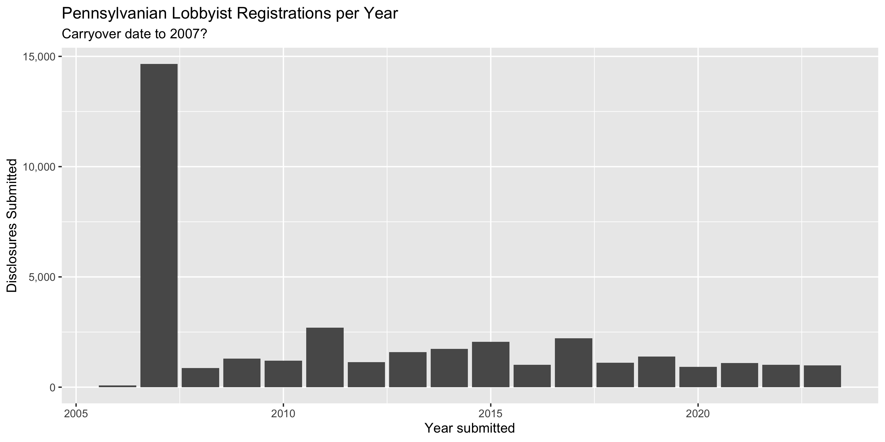
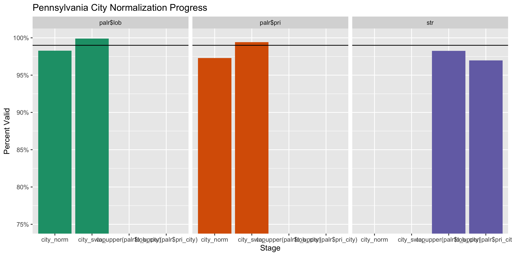
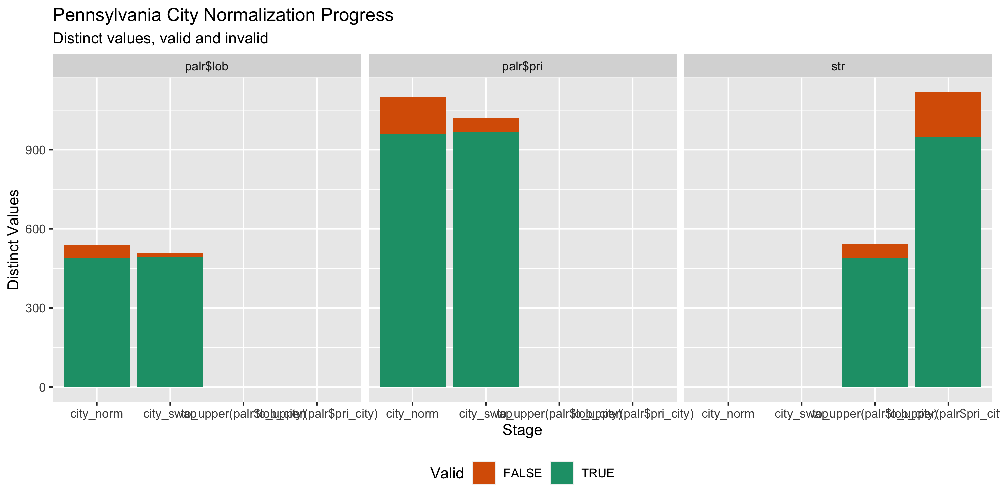

Pennsylvania Lobbyists
================
Kiernan Nicholls & Yanqi Xu
2023-07-08 21:34:05

- [Project](#project)
- [Objectives](#objectives)
- [Packages](#packages)
- [Data](#data)
- [Import](#import)
- [Explore](#explore)
- [Wrangle](#wrangle)
- [Export](#export)

<!-- Place comments regarding knitting here -->

## Project

The Accountability Project is an effort to cut across data silos and
give journalists, policy professionals, activists, and the public at
large a simple way to search across huge volumes of public data about
people and organizations.

Our goal is to standardizing public data on a few key fields by thinking
of each dataset row as a transaction. For each transaction there should
be (at least) 3 variables:

1.  All **parties** to a transaction
2.  The **date** of the transaction
3.  The **amount** of money involved

## Objectives

This document describes the process used to complete the following
objectives:

1.  How many records are in the database?
2.  Check for duplicates
3.  Check ranges
4.  Is there anything blank or missing?
5.  Check for consistency issues
6.  Create a five-digit ZIP Code called `ZIP5`
7.  Create a `YEAR` field from the transaction date
8.  Make sure there is data on both parties to a transaction

## Packages

The following packages are needed to collect, manipulate, visualize,
analyze, and communicate these results. The `pacman` package will
facilitate their installation and attachment.

The IRW’s `campfin` package will also have to be installed from GitHub.
This package contains functions custom made to help facilitate the
processing of campaign finance data.

``` r
if (!require("pacman")) install.packages("pacman")
pacman::p_load_gh("irworkshop/campfin")
pacman::p_load(
  tidyverse, # data manipulation
  lubridate, # datetime strings
  magrittr, # pipe opperators
  janitor, # dataframe clean
  refinr, # cluster and merge
  scales, # format strings
  knitr, # knit documents
  vroom, # read files fast
  glue, # combine strings
  here, # relative storage
  fs # search storage 
)
```

This document should be run as part of the `R_campfin` project, which
lives as a sub-directory of the more general, language-agnostic
[`irworkshop/accountability_datacleaning`](https://github.com/irworkshop/accountability_datacleaning "TAP repo")
GitHub repository.

The `R_campfin` project uses the [RStudio
projects](https://support.rstudio.com/hc/en-us/articles/200526207-Using-Projects "Rproj")
feature and should be run as such. The project also uses the dynamic
`here::here()` tool for file paths relative to *your* machine.

``` r
# where does this document knit?
here::here()
#> [1] "/Users/yanqixu/code/accountability_datacleaning"
```

## Data

Data is obtained from the [Pennsylvania Department of
State](https://www.dos.pa.gov). From their [search
page](https://www.palobbyingservices.pa.gov/Public/wfSearch.aspx), we
can “Export All” from the advance search.

This provides an `Export.zip` archive file. The data was downloaded on
July 8, 2023 and contains records from `2007-2008` to `21023-2024`.

``` r
raw_dir <- here("state","pa", "lobby", "reg", "data", "raw")
dir_create(raw_dir)
raw_zip <- dir_ls(raw_dir, glob = "*.zip")
```

This file contains a single CSV.

``` r
unzip(raw_zip, list = TRUE)
#> # A tibble: 1 × 3
#>   Name                                                                Length Date               
#>   <chr>                                                                <dbl> <dttm>             
#> 1 RegistrationExportPublic_8614B347-845E-43BF-B335-FBD8FC1DB214.csv 43052548 2023-07-08 22:03:00
```

## Import

We can directly pass this ZIP file to `readr::read_csv()`.

``` r
export <- raw_zip %>% 
  read_lines() %>% 
  str_replace("\"I\"", "'I'") %>% 
  I() %>% 
  read_delim(
    delim = ",",
    escape_backslash = FALSE,
    escape_double = FALSE,
    col_types = cols(
      .default = col_character(),
      IsRelatedToPrincipal = col_logical(),
      IsRelatedToFirm = col_logical(),
      IsRelatedToLobbyist = col_logical(),
      IsRelatedToPAC = col_logical(),
      IsOfficerCandidatePAC = col_logical(),
      IsLicensedAttorney = col_logical(),
      IsLicensedInPA = col_logical(),
      DuePayingMembers = col_integer(),
      CalendarYear = col_integer(),
      IsLobbyingFirm = col_logical(),
      IsLawFirm = col_logical(),
      IsOtherFirm = col_logical(),
      LastUpdatedDate = col_date_mdy(),
      SubmittedDate = col_date_mdy(),
      RenewalDate = col_date_mdy(),
      LobbyingCommencedDate = col_date_mdy(),
      ExpirationDate = col_date_mdy(),
      TerminatedDate = col_date_mdy(),
      AffiliatedStartDate = col_date_mdy(),
      AffiliatedEndDate = col_date_mdy(),
      IsNeverAffiliated = col_logical(),
      IsRepresentThirdParty = col_logical(),
      AffirmedDate = col_date_mdy()
    )
  )
```

This data frame contains 83,511 rows, with a separate record for each
relationship between a lobbyist, lobbying firm, or principal client.
That means a single relationship between a lobbyist and a principal is
listed twice, once with the lobbyist as the registrant and again with
the principal. We will restructure and filter this data frame so that
only lobbyists are listed as registrants, with a separate record for
each of their principals.

``` r
palr <- filter(export, RegistrationType == "Lobbyist") %>% clean_names("snake")
```

We can also remove all the columns associated with the affirmation of
the registration. As per the \[disclosure instructions\]\[05\]:

> **Affirmations and Acknowledgments:** The registration must include a
> typed or printed name of an individual, which, subject to 18 Pa.C.S. §
> 4904 (unsworn falsifications to authorities), states that the
> information provided is true and correct to the best of the filer’s
> knowledge, information and belief. The registration statement also
> contains an acknowledgment that the registrant or their designee has
> received, read and understands the Act.

``` r
palr <- select(palr, -starts_with("affirm"), -is_represent_third_party)
```

To make this data set a little easier to understand, we will prefix each
registrant column, now filtered to include only lobbyists, with `lob_`.

``` r
names(palr)[1:15] <- names(palr)[1:15] %>% 
  str_remove("^registration_") %>% 
  str_c("lob", ., sep = "_")
```

Then, we can abbreviate the other columns… This just makes things easier
to type.

``` r
names(palr) <- names(palr) %>% 
  str_replace("(?<=(_|^))affili.*?(?=($|_))", "pri") %>% 
  str_replace("(?<=(_|^))lobby.*?(?=($|_))", "lob") %>% 
  str_replace("(?<=(_|^))num.*?(?=($|_))", "id") %>% 
  str_replace("(?<=(_|^))regist.*?(?=($|_))", "reg") %>% 
  str_replace("business", "biz") %>% 
  str_replace("candidate", "cand") %>% 
  str_replace("calendar", "cal") %>% 
  str_replace("description", "desc") %>% 
  str_replace("expiration", "expire") %>% 
  str_replace("principal", "pri") %>% 
  str_replace("terminated", "term") %>% 
  str_replace("related", "rel") %>% 
  str_replace("submitted", "sub") %>% 
  str_replace("postal_code", "zip") %>% 
  str_remove("_name$")
```

## Explore

``` r
head(palr)
#> # A tibble: 6 × 51
#>   lob_id lob        lob_t…¹ lob_s…² lob_p…³ lob_a…⁴ lob_p…⁵ lob_p…⁶ lob_fax lob_e…⁷ lob_l…⁸ lob_l…⁹
#>   <chr>  <chr>      <chr>   <chr>   <chr>   <chr>   <chr>   <chr>   <chr>   <chr>   <chr>   <chr>  
#> 1 L43311 A, Pamela… Lobbyi… Expired 2019-2… <NA>    610-37… <NA>    <NA>    pwitme… one me… 2C01   
#> 2 L43311 A, Pamela… Lobbyi… Expired 2019-2… <NA>    610-37… <NA>    <NA>    pwitme… one me… 2C01   
#> 3 L43311 A, Pamela… Lobbyi… Expired 2019-2… <NA>    610-37… <NA>    <NA>    pwitme… one me… 2C01   
#> 4 L43311 A, Pamela… Lobbyi… Expired 2019-2… <NA>    610-37… <NA>    <NA>    pwitme… one me… 2C01   
#> 5 L10698 Aaron Ste… Lobbyi… Termin… 2013-2… <NA>    717-23… <NA>    <NA>    saaron… 614 N.… <NA>   
#> 6 L10698 Aaron Ste… Lobbyi… Termin… 2013-2… <NA>    717-23… <NA>    <NA>    saaron… 614 N.… <NA>   
#> # … with 39 more variables: lob_city <chr>, lob_state <chr>, lob_zip <chr>, is_rel_to_pri <lgl>,
#> #   is_rel_to_firm <lgl>, is_rel_to_lob <lgl>, is_rel_to_pac <lgl>, is_officer_cand_pac <lgl>,
#> #   biz_type <chr>, biz_desc <chr>, is_licensed_attorney <lgl>, is_licensed_in_pa <lgl>,
#> #   is_association <chr>, due_paying_members <int>, cal_year <int>, is_lob_firm <lgl>,
#> #   is_law_firm <lgl>, is_other_firm <lgl>, last_updated_date <date>, sub_date <date>,
#> #   renewal_date <date>, lob_commenced_date <date>, expire_date <date>, term_date <date>,
#> #   pri_reg_type <chr>, pri_reg_id <chr>, pri_reg <chr>, pri_acronym <chr>, pri_phone <chr>, …
tail(palr)
#> # A tibble: 6 × 51
#>   lob_id lob        lob_t…¹ lob_s…² lob_p…³ lob_a…⁴ lob_p…⁵ lob_p…⁶ lob_fax lob_e…⁷ lob_l…⁸ lob_l…⁹
#>   <chr>  <chr>      <chr>   <chr>   <chr>   <chr>   <chr>   <chr>   <chr>   <chr>   <chr>   <chr>  
#> 1 L43593 Zwally, A… Lobbyi… Comple… 2023-2… <NA>    717-23… <NA>    <NA>    andrew… 100 Pi… <NA>   
#> 2 L43593 Zwally, A… Lobbyi… Comple… 2023-2… <NA>    717-23… <NA>    <NA>    andrew… 100 Pi… <NA>   
#> 3 L43593 Zwally, A… Lobbyi… Comple… 2023-2… <NA>    717-23… <NA>    <NA>    andrew… 100 Pi… <NA>   
#> 4 L43593 Zwally, A… Lobbyi… Comple… 2023-2… <NA>    717-23… <NA>    <NA>    andrew… 100 Pi… <NA>   
#> 5 L00943 ZYLSTRA S… Lobbyi… Expired 2007-2… <NA>    412-91… <NA>    412-68… SZYLST… 2000 T… <NA>   
#> 6 L00943 ZYLSTRA S… Lobbyi… Expired 2007-2… <NA>    412-91… <NA>    412-68… SZYLST… 2000 T… <NA>   
#> # … with 39 more variables: lob_city <chr>, lob_state <chr>, lob_zip <chr>, is_rel_to_pri <lgl>,
#> #   is_rel_to_firm <lgl>, is_rel_to_lob <lgl>, is_rel_to_pac <lgl>, is_officer_cand_pac <lgl>,
#> #   biz_type <chr>, biz_desc <chr>, is_licensed_attorney <lgl>, is_licensed_in_pa <lgl>,
#> #   is_association <chr>, due_paying_members <int>, cal_year <int>, is_lob_firm <lgl>,
#> #   is_law_firm <lgl>, is_other_firm <lgl>, last_updated_date <date>, sub_date <date>,
#> #   renewal_date <date>, lob_commenced_date <date>, expire_date <date>, term_date <date>,
#> #   pri_reg_type <chr>, pri_reg_id <chr>, pri_reg <chr>, pri_acronym <chr>, pri_phone <chr>, …
glimpse(sample_frac(palr))
#> Rows: 37,111
#> Columns: 51
#> $ lob_id               <chr> "L00469", "L27179", "L01390", "L40328", "L01861", "L67959", "L01405"…
#> $ lob                  <chr> "Kury, Franklin", "Crawford, Steven", "STECK, MATTHEW", "Yarnick, To…
#> $ lob_type             <chr> "Lobbyist", "Lobbyist", "Lobbyist", "Lobbyist", "Lobbyist", "Lobbyis…
#> $ lob_status           <chr> "Terminated", "Completed", "Completed", "Terminated", "Completed", "…
#> $ lob_period           <chr> "2015-2016", "2023-2024", "2023-2024", "2017-2018", "2023-2024", "20…
#> $ lob_acronym          <chr> NA, NA, NA, NA, NA, NA, NA, NA, NA, NA, NA, NA, NA, NA, NA, NA, NA, …
#> $ lob_phone            <chr> "717-236-9600", "717-233-1111", "717-236-0443", "415-389-6800", "717…
#> $ lob_phone_ext        <chr> NA, NA, NA, NA, NA, NA, NA, NA, NA, NA, NA, NA, NA, NA, NA, NA, NA, …
#> $ lob_fax              <chr> "717-236-9696", NA, "717-236-8383", "415-388-6874", "717-232-1544", …
#> $ lob_email            <chr> "fkury@malady-wooten.com", "scrawford@wojdak.com", "MATT@GREENLEEPAR…
#> $ lob_line1            <chr> "604 North Third Street", "30 North Third Street, Suite 950", "230 S…
#> $ lob_line2            <chr> NA, NA, NA, "2350 Kerner Blvd., Ste. 250", "SUITE 1500", NA, NA, NA,…
#> $ lob_city             <chr> "Harrisburg", "Harrisburg", "HARRISBURG", "San Rafael", "HARRISBURG"…
#> $ lob_state            <chr> "PA", "PA", "PA", "CA", "PA", "PA", "PA", "PA", "NJ", "PA", "PA", "P…
#> $ lob_zip              <chr> "17101", "17101", "17101", "94901", "17101", "17050", "17102", "1710…
#> $ is_rel_to_pri        <lgl> TRUE, TRUE, TRUE, TRUE, TRUE, TRUE, TRUE, TRUE, TRUE, TRUE, TRUE, TR…
#> $ is_rel_to_firm       <lgl> TRUE, TRUE, TRUE, FALSE, TRUE, TRUE, TRUE, TRUE, TRUE, TRUE, TRUE, T…
#> $ is_rel_to_lob        <lgl> FALSE, FALSE, FALSE, FALSE, FALSE, FALSE, FALSE, FALSE, FALSE, FALSE…
#> $ is_rel_to_pac        <lgl> FALSE, TRUE, TRUE, FALSE, TRUE, FALSE, FALSE, TRUE, TRUE, FALSE, TRU…
#> $ is_officer_cand_pac  <lgl> FALSE, FALSE, FALSE, FALSE, FALSE, FALSE, FALSE, FALSE, FALSE, FALSE…
#> $ biz_type             <chr> NA, NA, NA, NA, NA, NA, NA, NA, NA, NA, NA, NA, NA, NA, NA, NA, NA, …
#> $ biz_desc             <chr> NA, NA, NA, NA, NA, NA, NA, NA, NA, NA, NA, NA, NA, NA, NA, NA, NA, …
#> $ is_licensed_attorney <lgl> TRUE, FALSE, FALSE, FALSE, FALSE, FALSE, FALSE, FALSE, FALSE, FALSE,…
#> $ is_licensed_in_pa    <lgl> TRUE, FALSE, FALSE, FALSE, FALSE, FALSE, FALSE, TRUE, FALSE, FALSE, …
#> $ is_association       <chr> "No", "No", "No", "No", "No", "No", "No", "No", "No", "No", "No", "N…
#> $ due_paying_members   <int> 0, 0, 0, 0, 0, 0, 0, NA, 0, 0, 0, 0, NA, NA, 0, 0, 0, 0, 0, 0, 0, 0,…
#> $ cal_year             <int> NA, NA, NA, NA, NA, NA, NA, NA, NA, NA, NA, NA, NA, NA, NA, NA, NA, …
#> $ is_lob_firm          <lgl> FALSE, FALSE, FALSE, FALSE, FALSE, FALSE, FALSE, FALSE, FALSE, FALSE…
#> $ is_law_firm          <lgl> FALSE, FALSE, FALSE, FALSE, FALSE, FALSE, FALSE, FALSE, FALSE, FALSE…
#> $ is_other_firm        <lgl> FALSE, FALSE, FALSE, FALSE, FALSE, FALSE, FALSE, FALSE, FALSE, FALSE…
#> $ last_updated_date    <date> 2015-10-21, 2023-06-07, 2023-07-06, 2016-12-29, 2023-06-30, 2023-01…
#> $ sub_date             <date> 2007-01-17, 2011-02-22, 2007-01-12, 2013-02-11, 2007-01-09, 2021-10…
#> $ renewal_date         <date> 2015-01-07, 2022-12-16, 2022-12-21, 2016-12-22, 2023-01-03, 2022-12…
#> $ lob_commenced_date   <date> 2007-01-10, 2011-03-01, 2007-01-02, 2013-02-01, 2007-01-01, 2021-08…
#> $ expire_date          <date> 2016-12-31, 2024-12-31, 2024-12-31, 2018-12-31, 2024-12-31, 2024-12…
#> $ term_date            <date> 2016-03-15, NA, NA, 2017-05-01, NA, NA, NA, NA, NA, 2020-02-10, 202…
#> $ pri_reg_type         <chr> "Principal", "Principal", "Principal", "Principal", "Principal", "Pr…
#> $ pri_reg_id           <chr> "P42857", "P69319", "P25110", "P03595", "P02335", "P50070", "P02284"…
#> $ pri_reg              <chr> "Aria Health", "RIVER POINTE LOGISTICS, LLC", "Assured Guaranty Corp…
#> $ pri_acronym          <chr> NA, NA, NA, NA, NA, NA, NA, NA, NA, NA, NA, NA, "NISOURCE INC.PAC", …
#> $ pri_phone            <chr> "215-612-4795", "610-332-3300", "212-339-3497", "415-389-6800", "724…
#> $ pri_phone_extn       <chr> NA, NA, NA, NA, NA, "1120", NA, NA, NA, NA, NA, NA, NA, NA, NA, NA, …
#> $ pri_fax              <chr> "215-612-4839", NA, NA, "415-388-6874", "717-772-1180", NA, "717-852…
#> $ is_never_pri         <lgl> FALSE, FALSE, FALSE, FALSE, FALSE, FALSE, FALSE, FALSE, FALSE, FALSE…
#> $ pri_start_date       <date> 2015-05-12, 2022-07-05, 2010-12-01, 2013-01-28, 2023-02-01, 2022-11…
#> $ pri_end_date         <date> NA, NA, 2016-12-31, NA, NA, NA, 2018-12-31, NA, 2015-01-30, 2020-01…
#> $ pri_line1            <chr> "10800 Knights Rd", "559 MAIN ST", "31 West 52nd Street", "c/o Niels…
#> $ pri_line2            <chr> NA, "SUITE 300", NA, "2350 Kerner Blvd., Ste. 250", "Suite E", "Suit…
#> $ pri_city             <chr> "Philadelphia", "BETHLEHEM", "New York", "San Rafael", "Cranberry To…
#> $ pri_state            <chr> "PA", "PA", "NY", "CA", "PA", "PA", "PA", "PA", "PA", "NY", "PA", "P…
#> $ pri_zip              <chr> "19146", "18018", "10019", "94901", "16066", "15203-3205", "17405", …
```

Having filtered 56% of the rows in the database, we can now remove some
of the columns which now contain no information.

``` r
col_stats(palr, count_na)
#> # A tibble: 51 × 4
#>    col                  class      n       p
#>    <chr>                <chr>  <int>   <dbl>
#>  1 lob_id               <chr>      0 0      
#>  2 lob                  <chr>      0 0      
#>  3 lob_type             <chr>      0 0      
#>  4 lob_status           <chr>      0 0      
#>  5 lob_period           <chr>      0 0      
#>  6 lob_acronym          <chr>  37111 1      
#>  7 lob_phone            <chr>    835 0.0225 
#>  8 lob_phone_ext        <chr>  36412 0.981  
#>  9 lob_fax              <chr>  18371 0.495  
#> 10 lob_email            <chr>   1166 0.0314 
#> 11 lob_line1            <chr>      0 0      
#> 12 lob_line2            <chr>  20284 0.547  
#> 13 lob_city             <chr>      0 0      
#> 14 lob_state            <chr>      0 0      
#> 15 lob_zip              <chr>      0 0      
#> 16 is_rel_to_pri        <lgl>      0 0      
#> 17 is_rel_to_firm       <lgl>      0 0      
#> 18 is_rel_to_lob        <lgl>      0 0      
#> 19 is_rel_to_pac        <lgl>      0 0      
#> 20 is_officer_cand_pac  <lgl>      0 0      
#> 21 biz_type             <chr>  37111 1      
#> 22 biz_desc             <chr>  37111 1      
#> 23 is_licensed_attorney <lgl>      0 0      
#> 24 is_licensed_in_pa    <lgl>      0 0      
#> 25 is_association       <chr>      0 0      
#> 26 due_paying_members   <int>   4554 0.123  
#> 27 cal_year             <int>  37111 1      
#> 28 is_lob_firm          <lgl>      0 0      
#> 29 is_law_firm          <lgl>      0 0      
#> 30 is_other_firm        <lgl>      0 0      
#> 31 last_updated_date    <date>   365 0.00984
#> 32 sub_date             <date>    53 0.00143
#> 33 renewal_date         <date>  8795 0.237  
#> 34 lob_commenced_date   <date>     0 0      
#> 35 expire_date          <date>     0 0      
#> 36 term_date            <date> 26225 0.707  
#> 37 pri_reg_type         <chr>    468 0.0126 
#> 38 pri_reg_id           <chr>   2749 0.0741 
#> 39 pri_reg              <chr>    524 0.0141 
#> 40 pri_acronym          <chr>  36792 0.991  
#> 41 pri_phone            <chr>   4062 0.109  
#> 42 pri_phone_extn       <chr>  34781 0.937  
#> 43 pri_fax              <chr>  20974 0.565  
#> 44 is_never_pri         <lgl>    470 0.0127 
#> 45 pri_start_date       <date>   470 0.0127 
#> 46 pri_end_date         <date> 20045 0.540  
#> 47 pri_line1            <chr>   1933 0.0521 
#> 48 pri_line2            <chr>  22705 0.612  
#> 49 pri_city             <chr>   1933 0.0521 
#> 50 pri_state            <chr>   1934 0.0521 
#> 51 pri_zip              <chr>   1933 0.0521
```

``` r
palr <- remove_empty(palr, which = "cols")
```

We can also check how many distinct values are present in each column.

``` r
col_stats(palr, n_distinct)
#> # A tibble: 47 × 4
#>    col                  class      n         p
#>    <chr>                <chr>  <int>     <dbl>
#>  1 lob_id               <chr>   4404 0.119    
#>  2 lob                  <chr>   4262 0.115    
#>  3 lob_type             <chr>      1 0.0000269
#>  4 lob_status           <chr>      3 0.0000808
#>  5 lob_period           <chr>      9 0.000243 
#>  6 lob_phone            <chr>   2785 0.0750   
#>  7 lob_phone_ext        <chr>    183 0.00493  
#>  8 lob_fax              <chr>   1070 0.0288   
#>  9 lob_email            <chr>   3819 0.103    
#> 10 lob_line1            <chr>   2758 0.0743   
#> 11 lob_line2            <chr>    885 0.0238   
#> 12 lob_city             <chr>    624 0.0168   
#> 13 lob_state            <chr>     40 0.00108  
#> 14 lob_zip              <chr>    955 0.0257   
#> 15 is_rel_to_pri        <lgl>      2 0.0000539
#> 16 is_rel_to_firm       <lgl>      2 0.0000539
#> 17 is_rel_to_lob        <lgl>      2 0.0000539
#> 18 is_rel_to_pac        <lgl>      2 0.0000539
#> 19 is_officer_cand_pac  <lgl>      2 0.0000539
#> 20 is_licensed_attorney <lgl>      2 0.0000539
#> 21 is_licensed_in_pa    <lgl>      2 0.0000539
#> 22 is_association       <chr>      1 0.0000269
#> 23 due_paying_members   <int>      2 0.0000539
#> 24 is_lob_firm          <lgl>      1 0.0000269
#> 25 is_law_firm          <lgl>      1 0.0000269
#> 26 is_other_firm        <lgl>      1 0.0000269
#> 27 last_updated_date    <date>  1891 0.0510   
#> 28 sub_date             <date>  2121 0.0572   
#> 29 renewal_date         <date>   375 0.0101   
#> 30 lob_commenced_date   <date>  1887 0.0508   
#> 31 expire_date          <date>    11 0.000296 
#> 32 term_date            <date>  1006 0.0271   
#> 33 pri_reg_type         <chr>      6 0.000162 
#> 34 pri_reg_id           <chr>   4957 0.134    
#> 35 pri_reg              <chr>   6166 0.166    
#> 36 pri_acronym          <chr>    184 0.00496  
#> 37 pri_phone            <chr>   4395 0.118    
#> 38 pri_phone_extn       <chr>    245 0.00660  
#> 39 pri_fax              <chr>   2009 0.0541   
#> 40 is_never_pri         <lgl>      3 0.0000808
#> 41 pri_start_date       <date>  3084 0.0831   
#> 42 pri_end_date         <date>  1051 0.0283   
#> 43 pri_line1            <chr>   6345 0.171    
#> 44 pri_line2            <chr>   1551 0.0418   
#> 45 pri_city             <chr>   1373 0.0370   
#> 46 pri_state            <chr>     51 0.00137  
#> 47 pri_zip              <chr>   2114 0.0570
```

To better understand the type of records in the database, we can create
a new variable indicating the year of the relationship registration.

``` r
select(palr, ends_with("date"))
#> # A tibble: 37,111 × 8
#>    last_updated_date sub_date   renewal_date lob_comm…¹ expire_d…² term_date  pri_star…³ pri_end_…⁴
#>    <date>            <date>     <date>       <date>     <date>     <date>     <date>     <date>    
#>  1 2016-05-22        2016-05-12 2018-12-20   2016-05-09 2020-12-31 NA         2016-05-22 NA        
#>  2 2016-05-22        2016-05-12 2018-12-20   2016-05-09 2020-12-31 NA         2016-05-12 NA        
#>  3 2016-05-22        2016-05-12 2018-12-20   2016-05-09 2020-12-31 NA         2016-05-12 NA        
#>  4 2016-05-22        2016-05-12 2018-12-20   2016-05-09 2020-12-31 NA         2016-05-22 NA        
#>  5 2013-01-03        2008-07-16 NA           2008-06-01 2014-12-31 2014-03-04 2008-06-01 NA        
#>  6 2013-01-03        2008-07-16 NA           2008-06-01 2014-12-31 2014-03-04 2009-07-01 NA        
#>  7 2014-12-30        2011-06-16 2016-12-21   2011-06-16 2018-12-31 2017-05-05 2011-06-16 NA        
#>  8 2021-04-14        2021-04-14 NA           2021-04-14 2022-12-31 NA         2021-04-14 NA        
#>  9 2019-05-31        2007-01-31 2019-01-02   2007-01-29 2020-12-31 2019-05-31 2007-01-01 2019-05-31
#> 10 2019-05-31        2007-01-31 2019-01-02   2007-01-29 2020-12-31 2019-05-31 2007-01-31 2019-05-31
#> # … with 37,101 more rows, and abbreviated variable names ¹​lob_commenced_date, ²​expire_date,
#> #   ³​pri_start_date, ⁴​pri_end_date
```

``` r
palr <- mutate(palr, sub_year = year(sub_date))
```

``` r
palr %>% 
  count(sub_year) %>% 
  ggplot(aes(x = sub_year, y = n)) +
  geom_col() +
  scale_y_continuous(labels = comma) +
  labs(
    title = "Pennsylvanian Lobbyist Registrations per Year",
    subtitle = "Carryover date to 2007?",
    x = "Year submitted",
    y = "Disclosures Submitted"
  )
```

<!-- -->

## Wrangle

To improve the uniformity and searchability of our database, we will
perform some very consistant and confident text normalization.

### Phone

First, will create a single new telephone number variable for each
lobbyist and principal by using `tidyr::unite()` to combine the number
and extension and then pass that variable to `campfin::normal_phone()`
to convert to a new format.

``` r
palr <- palr %>% 
  unite(
    starts_with("lob_phone"),
    col = lob_phone_full,
    sep = "x",
    remove = FALSE,
    na.rm = TRUE
  ) %>% 
  unite(
    starts_with("pri_phone"),
    col = pri_phone_full,
    sep = "x",
    remove = FALSE,
    na.rm = TRUE
  ) %>% 
  mutate(
    lob_phone_norm = normal_phone(lob_phone_full),
    pri_phone_norm = normal_phone(pri_phone_full)
  ) %>% 
  select(-ends_with("phone_full")) %>% 
  mutate_at(
    .vars = vars(ends_with("fax")),
    .funs = list(norm = normal_phone)
  )
```

    #> # A tibble: 17,341 × 6
    #>    lob_phone    lob_phone_ext pri_phone    pri_phone_extn lob_phone_norm pri_phone_norm        
    #>    <chr>        <chr>         <chr>        <chr>          <chr>          <chr>                 
    #>  1 412-497-1060 <NA>          412-259-8696 <NA>           (412) 497-1060 "(412) 259-8696"      
    #>  2 717-238-6715 <NA>          <NA>         <NA>           (717) 238-6715 ""                    
    #>  3 717-703-5900 <NA>          312-279-1032 <NA>           (717) 703-5900 "(312) 279-1032"      
    #>  4 717-234-2376 <NA>          610-357-8963 <NA>           (717) 234-2376 "(610) 357-8963"      
    #>  5 215-625-3874 <NA>          215-625-3874 106            (215) 625-3874 "(215) 625-3874 x106" 
    #>  6 215-735-6660 <NA>          330-493-4443 1476           (215) 735-6660 "(330) 493-4443 x1476"
    #>  7 717-214-2200 <NA>          904-490-5857 <NA>           (717) 214-2200 "(904) 490-5857"      
    #>  8 717-238-9078 <NA>          717-761-7210 <NA>           (717) 238-9078 "(717) 761-7210"      
    #>  9 215-735-6660 <NA>          608-381-7237 <NA>           (215) 735-6660 "(608) 381-7237"      
    #> 10 412-765-1180 <NA>          412-471-9500 <NA>           (412) 765-1180 "(412) 471-9500"      
    #> # … with 17,331 more rows

### Address

We will perform a similar change to the street address,
`tidyr:unite()`ing the two line variables and passing them to
`campfin:normal_address()` to expand abbreviations and improve
consistency.

``` r
palr <- palr %>% 
  unite(
    starts_with("lob_line"),
    col = lob_addr,
    sep = " ",
    remove = FALSE,
    na.rm = TRUE
  ) %>% 
  unite(
    starts_with("pri_line"),
    col = pri_addr,
    sep = " ",
    remove = FALSE,
    na.rm = TRUE
  ) %>% 
  mutate_at(
    .vars = vars(ends_with("addr")),
    .funs = list(norm = ~ normal_address(.,abbs = usps_street,
                                         na_rep = TRUE))
  )
```

    #> # A tibble: 3,070 × 3
    #>    lob_line1                     lob_line2        lob_addr_norm                            
    #>    <chr>                         <chr>            <chr>                                    
    #>  1 2579 INTERSTATE DRIVE         <NA>             2579 INTERSTATE DR                       
    #>  2 614 N. FRONT ST               STE G            614 N FRONT ST STE G                     
    #>  3 6155 Mulberry Court           <NA>             6155 MULBERRY CT                         
    #>  4 30 North Third Street         Suite 600        30 NORTH THIRD STREET SUITE 600          
    #>  5 121 N. Sugan  Road            <NA>             121 N SUGAN RD                           
    #>  6 PA Manufacturers' Association 225 State Street PA MANUFACTURERS ASSOCIATION 225 STATE ST
    #>  7 635 W. 42nd Street            #32J             635 W 42ND STREET #32J                   
    #>  8 24 Elan Lane                  <NA>             24 ELAN LN                               
    #>  9 319 North Front St            <NA>             319 NORTH FRONT ST                       
    #> 10 22 S. 22nd ST.                <NA>             22 S 22ND ST                             
    #> # … with 3,060 more rows

### ZIP

We will use `campfin:normal_zip()` to coerce 5-digit ZIP codes.

``` r
palr <- mutate_at(
  .tbl = palr,
  .vars = vars(ends_with("zip")),
  .funs = list(norm = normal_zip),
  na_rep = TRUE
)
```

This improves the proportion of ZIP codes that are valid.

    #> # A tibble: 4 × 6
    #>   stage             prop_in n_distinct prop_na n_out n_diff
    #>   <chr>               <dbl>      <dbl>   <dbl> <dbl>  <dbl>
    #> 1 palr$lob_zip        0.976        955  0        903    191
    #> 2 palr$lob_zip_norm   1.00         794  0         10      6
    #> 3 palr$pri_zip        0.888       2114  0.0521  3955    583
    #> 4 palr$pri_zip_norm   0.998       1620  0.0527    55     23

### State

The 2-character state codes for both lobbyist and principal need no
further cleaning.

``` r
prop_in(palr$lob_state, valid_state)
#> [1] 1
prop_in(palr$pri_state, valid_state)
#> [1] 0.9996304
```

### City

The city strings are the most difficult to clean, given the variety in
city names and the wide range of quasi-valid formats in which they might
be writte. We can use `campfin::normal_city()` to normalize the strings.

Then, we compare these normalized strings to the expected city name for
that record’s state and ZIP code. If the normalized string is extremelly
similar to the expected string, we can safely replace what is written
with what we would expect.

``` r
palr <- palr %>% 
  left_join(
    y = zipcodes,
    by = c(
      "lob_state" = "state",
      "lob_zip_norm" = "zip"
    )
  ) %>% 
  rename(lob_city_match = city) %>% 
  mutate(
    lob_match_abb = is_abbrev(lob_city_norm, lob_city_match),
    lob_match_dist = str_dist(lob_city_norm, lob_city_match),
    lob_city_swap = if_else(
      condition = !is.na(lob_city_match) & (lob_match_abb | lob_match_dist == 1),
      true = lob_city_match,
      false = lob_city_norm
    )
  ) %>% 
  select(
    -lob_city_match,
    -lob_match_abb,
    -lob_match_dist
  ) %>% 
  left_join(
    y = zipcodes,
    by = c(
      "pri_state" = "state",
      "pri_zip_norm" = "zip"
    )
  ) %>% 
  rename(pri_city_match = city) %>% 
  mutate(
    pri_match_abb = is_abbrev(pri_city_norm, pri_city_match),
    pri_match_dist = str_dist(pri_city_norm, pri_city_match),
    pri_city_swap = if_else(
      condition = !is.na(pri_city_match) & (pri_match_abb | pri_match_dist == 1),
      true = pri_city_match,
      false = pri_city_norm
    )
  ) %>% 
  select(
    -pri_city_match,
    -pri_match_abb,
    -pri_match_dist
  )
```

These two steps *drastically* improve the consistency in city names.

<!-- -->

<!-- -->

## Export

``` r
proc_dir <- here("state","pa", "lobby", "reg", "data", "processed")
dir_create(proc_dir)
write_csv(
  x = palr %>% 
    select(-c(pri_city_norm, lob_city_norm)) %>%
    rename_all(~str_replace(., "_swap", "_clean")) %>%
    rename_all(~str_replace(., "_norm", "_clean")),
  path = glue("{proc_dir}/pa_lobby_reg.csv"),
  na = ""
)
```
