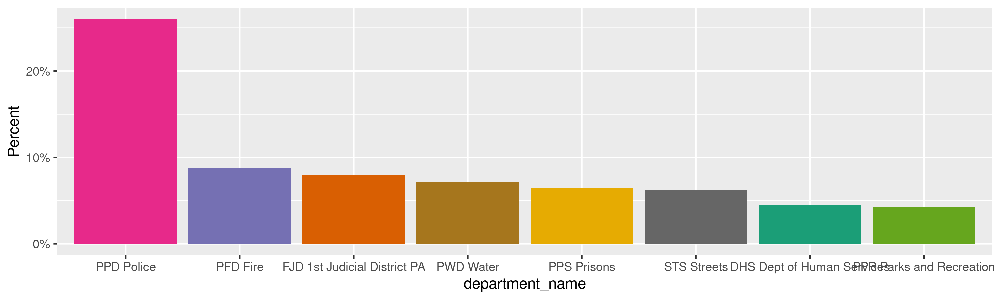
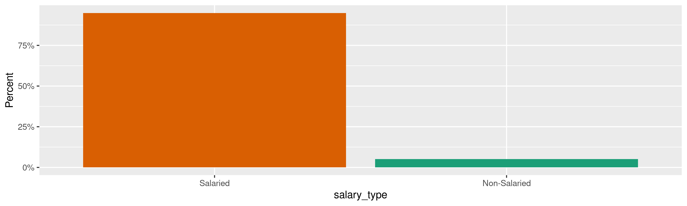
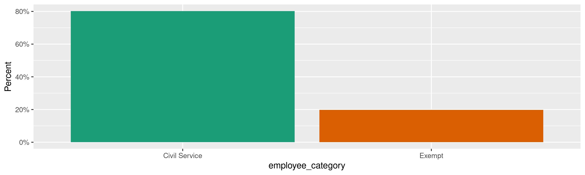
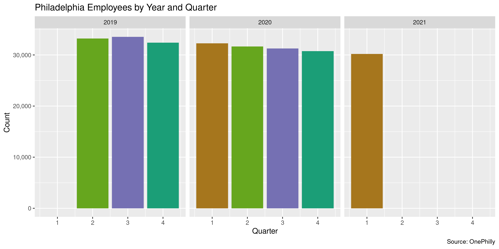

Philadelphia City Employee Earnings
================
Kiernan Nicholls
Wed Jun 9 11:46:39 2021

-   [Project](#project)
-   [Objectives](#objectives)
-   [Packages](#packages)
-   [Data](#data)
    -   [Notes](#notes)
    -   [Fields](#fields)
-   [Download](#download)
-   [Read](#read)
-   [Explore](#explore)
    -   [Amounts](#amounts)
    -   [Missing](#missing)
    -   [Duplicates](#duplicates)
    -   [Categorical](#categorical)
    -   [Dates](#dates)
-   [State](#state)
-   [Conclude](#conclude)
-   [Export](#export)
-   [Upload](#upload)

<!-- Place comments regarding knitting here -->

## Project

The Accountability Project is an effort to cut across data silos and
give journalists, policy professionals, activists, and the public at
large a simple way to search across huge volumes of public data about
people and organizations.

Our goal is to standardize public data on a few key fields by thinking
of each dataset row as a transaction. For each transaction there should
be (at least) 3 variables:

1.  All **parties** to a transaction.
2.  The **date** of the transaction.
3.  The **amount** of money involved.

## Objectives

This document describes the process used to complete the following
objectives:

1.  How many records are in the database?
2.  Check for entirely duplicated records.
3.  Check ranges of continuous variables.
4.  Is there anything blank or missing?
5.  Check for consistency issues.
6.  Create a five-digit ZIP Code called `zip`.
7.  Create a `year` field from the transaction date.
8.  Make sure there is data on both parties to a transaction.

## Packages

The following packages are needed to collect, manipulate, visualize,
analyze, and communicate these results. The `pacman` package will
facilitate their installation and attachment.

``` r
if (!require("pacman")) {
  install.packages("pacman")
}
pacman::p_load(
  tidyverse, # data manipulation
  lubridate, # datetime strings
  gluedown, # printing markdown
  janitor, # clean data frames
  campfin, # custom irw tools
  aws.s3, # aws cloud storage
  refinr, # cluster & merge
  scales, # format strings
  knitr, # knit documents
  vroom, # fast reading
  rvest, # scrape html
  glue, # code strings
  here, # project paths
  httr, # http requests
  fs # local storage 
)
```

This document should be run as part of the `R_campfin` project, which
lives as a sub-directory of the more general, language-agnostic
[`irworkshop/accountability_datacleaning`](https://github.com/irworkshop/accountability_datacleaning)
GitHub repository.

The `R_campfin` project uses the [RStudio
projects](https://support.rstudio.com/hc/en-us/articles/200526207-Using-Projects)
feature and should be run as such. The project also uses the dynamic
`here::here()` tool for file paths relative to *your* machine.

``` r
# where does this document knit?
here::i_am("pa/philadelphia/salary/docs/philadelphia_earnings.Rmd")
```

## Data

[Employee
earnings](https://www.opendataphilly.org/showcase/city-employee-earnings)
for the city of Philadelphia, PA are found on the city’s [open data
portal](https://www.opendataphilly.org/showcase/city-employee-earnings).
The data comes from the Office of Human Resources and Office of the
Director of Finance. Data is pushed from the OnePhilly payroll system to
a SQL database, extracted via a python script and loaded to DataBridge.
The data starts Q2 of 2019 through the most recent fiscal quarter.

### Notes

> Data from Calendar Year (CY) 2019 Q2 onwards is extracted from the
> newer OnePhilly payroll system and has a different data schema than
> the legacy payroll system. Therefore, one cannot and should not
> compare the previous earnings data (from 2016 to 2019 Q1) with the new
> data.

> Major changes in the data from 2019 Q2 onwards include various new
> earnings-related fields, a more detailed look at gross pay, and
> quarter-to-date gross pay totals instead of year-to-date totals. In
> the old earnings data (i.e. prior to CY 2019 Q2), some of the gross
> pay fields were lumped into the `ANNUAL_SALARY` field, without the
> ability to separate them out. With the new OnePhilly system, we are
> now able to show these as their own fields. For this reason, it may
> look like people make less than they used to but that’s not the case -
> it’s just that we’ve separated out the fields for greater clarity and
> transparency. Now, under the `BASE_SALARY` field, you can see
> someone’s salary (if salaried) separate from any other additional
> compensation they might receive. Given the increased scope of this
> data afforded through the new compensation fields, we have also
> renamed the dataset from ‘Employee Salaries’ to ‘Employee Earnings.’

> Gross pay fields: Added all together, the following 5 fields equal an
> employee’s gross pay. Please note these are quarter-to-date totals. To
> get yearly amounts, add up the amounts from each quarter.
>
> 1.  `base_gross_pay_QTD`
> 2.  `overtime_gross_pay_QTD`
> 3.  `longevity_gross_pay_QTD`
> 4.  `post_separation_payments_QTD`
> 5.  `miscellaneous_gross_pay_QTD`

> With the exception of the `BASE_GROSS_PAY_QTD` field, the remaining
> four fields above are earnings in addition to an employee’s
> `BASE_SALARY.`
>
> A small number of records related to individuals under the age of 18
> were removed from this dataset to ensure privacy.

### Fields

| Field Name                      | Alias                                          | Type    | Description                                                                                                                                                                                                                                                                                                                                                                                                                                                                                                                                                                                                                                                                                                                                                                                                                                                                                                                                                                                                                                                                                                                                                                                                                                                                                                                                                                                                                                                                                                                                                                                                                                                                                                                                                                                                                                                                                                                                                                                                                                                                                                                                                                                           |
|:--------------------------------|:-----------------------------------------------|:--------|:------------------------------------------------------------------------------------------------------------------------------------------------------------------------------------------------------------------------------------------------------------------------------------------------------------------------------------------------------------------------------------------------------------------------------------------------------------------------------------------------------------------------------------------------------------------------------------------------------------------------------------------------------------------------------------------------------------------------------------------------------------------------------------------------------------------------------------------------------------------------------------------------------------------------------------------------------------------------------------------------------------------------------------------------------------------------------------------------------------------------------------------------------------------------------------------------------------------------------------------------------------------------------------------------------------------------------------------------------------------------------------------------------------------------------------------------------------------------------------------------------------------------------------------------------------------------------------------------------------------------------------------------------------------------------------------------------------------------------------------------------------------------------------------------------------------------------------------------------------------------------------------------------------------------------------------------------------------------------------------------------------------------------------------------------------------------------------------------------------------------------------------------------------------------------------------------------|
| `BASE_GROSS_PAY_QTD`            | base gross pay quarter-to-date                 | Numeric | Quarter-to-date gross base pay for the employee. This is an employee’s base pay (regular pay + paid leave) without any type of bonuses. <br /><br />There are times where this field will not equal the BASE\_SALARY field. For example, if someone took unpaid leave during the year, their BASE\_GROSS\_PAY\_QTD would be less than what’s listed in the BASE\_SALARY field. If they received a raise during the year, this field would show more than what is in the BASE\_SALARY field. Also, an employee may make more in the BASE\_GROSS\_PAY\_QTD field than what’s listed in the BASE\_SALARY column if they work out of class/rank. This means that they fill the role of a vacant position that’s above their current pay grade and are therefore eligible for increased earnings.<br /><br />Negative numbers may appear in this field as well. These often relate to overpayment recoveries. Temporary overpayment can result from updating timesheets (i.e. to account for unexpected sick leave) that are later corrected or OnePhilly technical errors that are identified through payroll review processes.                                                                                                                                                                                                                                                                                                                                                                                                                                                                                                                                                                                                                                                                                                                                                                                                                                                                                                                                                                                                                                                                           |
| `BASE_SALARY`                   | base salary                                    | Numeric | The total base salary for the employee. When this field is left blank, the record is for a non-salaried employee. In the previous dataset, this field was called ANNUAL\_SALARY, but has been renamed for clarity.<br /><br />Please note that base salary is not the same as gross pay. The data in the BASE\_SALARY field is not how much someone has taken home in their paycheck. It is the amount that the City has agreed to pay them under all normal conditions. For this and other reasons, one should not compare the sum of all employees’ BASE\_SALARY to the total budgeted amount in other budget data. <br /><br />An employee’s BASE\_GROSS\_PAY\_QTD field may be more than what’s listed in the BASE\_SALARY column if they work out of class/rank. This means that they fill the role of a vacant position that’s above their current pay grade and are therefore eligible for increased earnings.<br /><br />There might be people who are still employees of the City but who are inactive for various reasons, such as for a leave of absence, sometimes for long periods of time, and therefore won’t actually receive their salary even though their BASE\_SALARY might still appear in the data. These employees will, most likely, not have any gross pay earnings during the quarters in which they are not active. If, however, an employee was present for part of the quarter, they will have partial earnings included under the relevant gross\_pay fields.<br /><br />Employees who have separated from the City (i.e. they are no longer employed with the City) will show up in the data during the quarter in which they left the City. They may also appear after their separation date if they received any post-separation payments. If they received a post-separation payment, the dataset will show their last BASE\_SALARY even if they are not actually still receiving that salary. Some employees may receive post separation payments after their separation date but during a quarter in which they were still employed with the City. For more information on post-separation payments, see the POST\_SEPARATION\_GROSS\_PAY\_QTD field description. |
| `CALENDAR_YEAR`                 | Calendar Year                                  | Integer | The calendar year that the data represents.                                                                                                                                                                                                                                                                                                                                                                                                                                                                                                                                                                                                                                                                                                                                                                                                                                                                                                                                                                                                                                                                                                                                                                                                                                                                                                                                                                                                                                                                                                                                                                                                                                                                                                                                                                                                                                                                                                                                                                                                                                                                                                                                                           |
| `COMPULSORY_UNION_CODE`         | compulsory union code                          | Text    | This code Indicates an employee’s union affiliation. See OHR’s union/FLSA code information site for more information about the various unions: <https://www.phila.gov/personnel/Codes.html>                                                                                                                                                                                                                                                                                                                                                                                                                                                                                                                                                                                                                                                                                                                                                                                                                                                                                                                                                                                                                                                                                                                                                                                                                                                                                                                                                                                                                                                                                                                                                                                                                                                                                                                                                                                                                                                                                                                                                                                                           |
| `DEPARTMENT_NAME`               | department name                                | Text    | The City department for which the employee works. Department names won’t match the previous data; department names change over time and between datasets. Department number is the best way to compare departments across time and datasets.<br /><br />The Division of Aviation within Commerce makes up a significant portion of compensation and so has been identified as ‘Commerce - Division of Aviation’ under this field. To see the total for Commerce, including the Division of Aviation, use the Department Code (42). <br /><br />Some employees might sit in one department and be paid by and work for another. For example, certain attorneys within the Law Department’s organizational structure may be both paid for and hired by discrete operating departments other than the Law Department. In the data, these employees show as being in the Law department, despite working in and being paid for by other departments.                                                                                                                                                                                                                                                                                                                                                                                                                                                                                                                                                                                                                                                                                                                                                                                                                                                                                                                                                                                                                                                                                                                                                                                                                                                      |
| `DEPARTMENT_NUMBER`             | department\_number                             | Integer | The unique ID associated with the City department for which the employee works. Department number is the best way to compare departments across time and datasets since department names can change over time and between datasets.                                                                                                                                                                                                                                                                                                                                                                                                                                                                                                                                                                                                                                                                                                                                                                                                                                                                                                                                                                                                                                                                                                                                                                                                                                                                                                                                                                                                                                                                                                                                                                                                                                                                                                                                                                                                                                                                                                                                                                   |
| `EMPLOYEE_CATEGORY`             | Employee category                              | Text    | This field indicates whether an employee is part of the civil service or is exempt, i.e. not a part of the civil service. <br /><br />For internal data management, City staff should know that this field is derived from the job code field and is not the same as the EMPLOYEE\_CATEGORY field in the OnePhilly system.                                                                                                                                                                                                                                                                                                                                                                                                                                                                                                                                                                                                                                                                                                                                                                                                                                                                                                                                                                                                                                                                                                                                                                                                                                                                                                                                                                                                                                                                                                                                                                                                                                                                                                                                                                                                                                                                            |
| `FIRST_NAME`                    | First Name                                     | Text    | The first name of the employee.                                                                                                                                                                                                                                                                                                                                                                                                                                                                                                                                                                                                                                                                                                                                                                                                                                                                                                                                                                                                                                                                                                                                                                                                                                                                                                                                                                                                                                                                                                                                                                                                                                                                                                                                                                                                                                                                                                                                                                                                                                                                                                                                                                       |
| `JOB_CODE`                      | Job code                                       | Text    | The unique ID associated with the job title, known as ‘job code.<br /><br />Note that employees with the same job code across different departments may receive different compensation due to differences in workload and other influencing factors.                                                                                                                                                                                                                                                                                                                                                                                                                                                                                                                                                                                                                                                                                                                                                                                                                                                                                                                                                                                                                                                                                                                                                                                                                                                                                                                                                                                                                                                                                                                                                                                                                                                                                                                                                                                                                                                                                                                                                  |
| `LAST_NAME`                     | Last Name                                      | Text    | The last name of the employee.                                                                                                                                                                                                                                                                                                                                                                                                                                                                                                                                                                                                                                                                                                                                                                                                                                                                                                                                                                                                                                                                                                                                                                                                                                                                                                                                                                                                                                                                                                                                                                                                                                                                                                                                                                                                                                                                                                                                                                                                                                                                                                                                                                        |
| `LONGEVITY_GROSS_PAY_QTD`       | longevity gross pay quarter-to-date            | Numeric | Quarter-to-date gross longevity pay for an employee. This is additional compensation associated with an employee’s length of service. The unions and the mayoral administration negotiate the longevity payments.<br /><br />Negative numbers may appear in this field. These often relate to overpayment recoveries. Temporary overpayment can result from updating timesheets (i.e. to account for unexpected sick leave) that are later corrected or OnePhilly technical errors that are identified through payroll review processes.                                                                                                                                                                                                                                                                                                                                                                                                                                                                                                                                                                                                                                                                                                                                                                                                                                                                                                                                                                                                                                                                                                                                                                                                                                                                                                                                                                                                                                                                                                                                                                                                                                                              |
| `MISCELLANEOUS_GROSS_PAY_QTD`   | miscellaneous gross pay quarter-to-date        | Numeric | Quarter-to-date gross miscellaneous pay for an employee. This category includes all other compensation categories such as stress pay, premium pay, and bonuses.<br /><br />Negative numbers may appear in this field. These often relate to overpayment recoveries. Temporary overpayment can result from updating timesheets (i.e. to account for unexpected sick leave) that are later corrected or OnePhilly technical errors that are identified through payroll review processes. <br /><br />For internal data management, City staff should know that this field is the sum of the following OnePhilly fields: <br /><br />Premium\_pay\_QTD<br />Additional\_pay\_QTD<br />Shift\_differential\_QTD<br />Specialpay\_bonuspay\_QTD                                                                                                                                                                                                                                                                                                                                                                                                                                                                                                                                                                                                                                                                                                                                                                                                                                                                                                                                                                                                                                                                                                                                                                                                                                                                                                                                                                                                                                                            |
| `OVERTIME_GROSS_PAY_QTD`        | overtime gross pay quarter-to-date             | Numeric | Quarter-to-date gross overtime pay for an employee. Not all employees are eligible for overtime. <br /><br />Please note that some overtime is not paid for with City funds. There is not yet a way in the OnePhilly system to separate out non-City funded overtime from the overtime the City does pay for. Therefore, if you add up overtime from the salaries dataset, it will be more than the overtime in the City budget figures. For example, privately funded overtime for police is included in the overtime gross pay category. Private funding might, for example, pay overtime for police during the Super Bowl.<br /><br />Negative numbers may appear in this field. These often relate to overpayment recoveries. Temporary overpayment can result from updating timesheets (i.e. to account for unexpected sick leave) that are later corrected or OnePhilly technical errors that are identified through payroll review processes.                                                                                                                                                                                                                                                                                                                                                                                                                                                                                                                                                                                                                                                                                                                                                                                                                                                                                                                                                                                                                                                                                                                                                                                                                                                  |
| `POST_SEPARATION_GROSS_PAY_QTD` | Gross post separation payments quarter-to-date | Numeric | Quarter-to-date gross separation payments for an employee. This includes various payments that employees might receive after they have left City employment such as vacation payout or any other payments that the City owes the employee but didn’t pay while the employee was still working for the City. This isn’t pension information.<br /><br />Negative numbers may appear in this field. These often relate to overpayment recoveries. Temporary overpayment can result from updating timesheets (i.e. to account for unexpected sick leave) that are later corrected or OnePhilly technical errors that are identified through payroll review processes.                                                                                                                                                                                                                                                                                                                                                                                                                                                                                                                                                                                                                                                                                                                                                                                                                                                                                                                                                                                                                                                                                                                                                                                                                                                                                                                                                                                                                                                                                                                                    |
| `QUARTER`                       | Calendar Year Quarter                          | Integer | Indicates which quarter of the calendar year the data represents.<br /><br />Q1 = January, February, March<br />Q2 = April, May, June<br />Q3 = July, August, September <br />Q4 = October, November, December                                                                                                                                                                                                                                                                                                                                                                                                                                                                                                                                                                                                                                                                                                                                                                                                                                                                                                                                                                                                                                                                                                                                                                                                                                                                                                                                                                                                                                                                                                                                                                                                                                                                                                                                                                                                                                                                                                                                                                                        |
| `SALARY_TYPE`                   | salary type                                    | Text    | This field denotes whether an employee is salaried or non-salaried. <br />Non-salaried employees include, for example, people who work on boards and commissions, temporary workers, and some emergency workers, or seasonal employees who might be paid by the hour. Non-salaried employees will have no numeric value listed as their BASE\_SALARY because they do not receive a salary. They will however have gross pay and may have other compensation, which is included in other relevant fields.                                                                                                                                                                                                                                                                                                                                                                                                                                                                                                                                                                                                                                                                                                                                                                                                                                                                                                                                                                                                                                                                                                                                                                                                                                                                                                                                                                                                                                                                                                                                                                                                                                                                                              |
| `TERMINATION_MONTH`             | Separation month                               | Integer | <br />The calendar month in which an employee separated from the City. <br /><br />Employees who have separated from the City (i.e. they are no longer employed with the City) will show up in the data during the quarter in which they left the City. They may also appear after their separation date if they received any post-separation payments. If they received a post-separation payment, the dataset will show their last BASE\_SALARY even if they are not actually still receiving that salary. Some employees may receive post separation payments after their separation date but during a quarter in which they were still employed with the City. For more information on post separation payments, see the POST\_SEPARATION\_GROSS\_PAY\_QTD field description.                                                                                                                                                                                                                                                                                                                                                                                                                                                                                                                                                                                                                                                                                                                                                                                                                                                                                                                                                                                                                                                                                                                                                                                                                                                                                                                                                                                                                     |
| `TERMINATION_YEAR`              | Separation year                                | Integer | The calendar year in which an employee separated from the City.                                                                                                                                                                                                                                                                                                                                                                                                                                                                                                                                                                                                                                                                                                                                                                                                                                                                                                                                                                                                                                                                                                                                                                                                                                                                                                                                                                                                                                                                                                                                                                                                                                                                                                                                                                                                                                                                                                                                                                                                                                                                                                                                       |
| `TITLE`                         | job title                                      | Text    | The job title of the employee.                                                                                                                                                                                                                                                                                                                                                                                                                                                                                                                                                                                                                                                                                                                                                                                                                                                                                                                                                                                                                                                                                                                                                                                                                                                                                                                                                                                                                                                                                                                                                                                                                                                                                                                                                                                                                                                                                                                                                                                                                                                                                                                                                                        |

## Download

We can make a `GET` request to query the SQL database and return a CSV
file that can be read into R and uploaded to TAP.

Making note of the changes described in Q2 and 2019, we can also get the
*archived* salary data. The data scheme will differ slightly, so these
two files will have to be read separately and somehow combined.

``` r
raw_dir <- dir_create(here("pa", "philadelphia", "salary", "data", "raw"))
raw_csv <- path(raw_dir, "employee_earnings.csv")
```

``` r
if (!file_exists(raw_csv)) {
  get_2019 <- GET(
    url = "https://phl.carto.com/api/v2/sql",
    write_disk(raw_csv),
    progress("down"),
    query = list(
      filename = "employee_earnings",
      format = "csv",
      q = "SELECT * FROM employee_earnings",
      skipfields = "cartodb_id,the_geom,the_geom_webmercator"
    )
  )
}
```

## Read

The CSV files can be read as a data frames and combined together. There
are fewer columns in the older data, so any record from that source will
be missing data for the newer columns.

``` r
phl <- read_delim(
  file = raw_csv,
  delim = ",",
  escape_backslash = FALSE,
  escape_double = FALSE,
  col_types = cols(
    .default = col_character(),
    calendar_year = col_integer(),
    quarter = col_integer(),
    base_salary = col_double(),
    overtime_gross_pay_qtd = col_double(),
    base_gross_pay_qtd = col_double(),
    longevity_gross_pay_qtd = col_double(),
    post_separation_gross_pay_qtd = col_double(),
    miscellaneous_gross_pay_qtd = col_double(),
    termination_year = col_integer()
  )
)
```

## Explore

There are 255,338 rows of 20 columns. Each record represents a single
employee earning in the city of Philadelphia.

``` r
glimpse(phl)
#> Rows: 255,338
#> Columns: 20
#> $ calendar_year                 <int> 2019, 2019, 2019, 2019, 2019, 2019, 2019, 2019, 2019, 2019, 2019, 2019, 2019, 20…
#> $ quarter                       <int> 2, 2, 2, 2, 2, 2, 2, 2, 2, 2, 2, 2, 2, 2, 2, 2, 2, 2, 2, 2, 2, 2, 2, 2, 2, 2, 2,…
#> $ last_name                     <chr> "Quintana", "Ipe", "Logan", "Vance", "Harvey Jr", "Evans Jr", "Wright", "Kieffer…
#> $ first_name                    <chr> "Jose", "Abraham", "Alan", "Joseph", "Stephen", "John", "Vanessa", "Mary", "Beat…
#> $ title                         <chr> "Airport Public Info Program Supervisor", "Correctional Officer", "Custodial Wor…
#> $ job_code                      <chr> "2P24", "5H04", "7D11", "6A12", "C572", "5H25", "P588", "6D44", "1A37", "6B01", …
#> $ department_name               <chr> "COM Commerce - Division of Aviation", "PPS Prisons", "DPH Health", "PPD Police"…
#> $ department_number             <chr> "42", "23", "14", "11", "84", "23", "4", "11", "26", "13", "13", "84", "11", "14…
#> $ base_salary                   <dbl> 64111, 48494, 32954, 77419, 49286, 56613, 85000, 12336, 38348, 73433, 83714, 407…
#> $ salary_type                   <chr> "Salaried", "Salaried", "Salaried", "Salaried", "Salaried", "Salaried", "Salarie…
#> $ overtime_gross_pay_qtd        <dbl> 182.62, 3237.19, 1133.46, 1228.30, NA, 1399.13, NA, NA, NA, 1270.96, 15213.45, N…
#> $ base_gross_pay_qtd            <dbl> 15630.06, 11191.49, 7968.59, 17866.20, 11447.73, 11416.75, 19920.88, 2652.24, 88…
#> $ longevity_gross_pay_qtd       <dbl> 351.49, 606.94, NA, 910.83, NA, 272.20, NA, 56.85, NA, 756.66, 1640.88, NA, 1220…
#> $ post_separation_gross_pay_qtd <dbl> NA, NA, NA, NA, NA, NA, NA, NA, NA, NA, NA, NA, NA, NA, NA, NA, NA, NA, NA, NA, …
#> $ miscellaneous_gross_pay_qtd   <dbl> 0.00, 148.35, 0.00, 1145.72, 0.00, 0.00, 0.00, 0.00, 0.00, 1694.58, 2688.93, 0.0…
#> $ employee_category             <chr> "Civil Service", "Civil Service", "Civil Service", "Civil Service", "Exempt", "C…
#> $ compulsory_union_code         <chr> "H", "I", "M", "P", "C", "J", "E", "G", "M", "F", "F", "C", "P", "J", "M", "E", …
#> $ termination_month             <chr> NA, "1", NA, NA, NA, "10", NA, NA, NA, NA, NA, NA, NA, "6", NA, NA, NA, "5", "1"…
#> $ termination_year              <int> NA, 2021, NA, NA, NA, 2020, NA, NA, NA, NA, NA, NA, NA, 2019, NA, NA, NA, 2019, …
#> $ public_id                     <chr> "17322", "9176", "3413", "25568", "9178", "7992", "6847", "30079", "9181", "7994…
tail(phl)
#> # A tibble: 6 x 20
#>   calendar_year quarter last_name first_name title    job_code department_name  department_numb… base_salary salary_type
#>           <int>   <int> <chr>     <chr>      <chr>    <chr>    <chr>            <chr>                  <dbl> <chr>      
#> 1          2020       2 Thomas    Vernetta   Correct… 5H04     PPS Prisons      23                     51197 Salaried   
#> 2          2020       2 Gibbs     Barbara    Correct… 5H04     PPD Police       11                     51197 Salaried   
#> 3          2020       2 Johnson   Tracy      Electio… 1B54     CMS City Commis… 73                     37130 Salaried   
#> 4          2020       2 Sanchez   Justin     IT Tech… I659     OIT Ofc of Inno… 4                      50000 Salaried   
#> 5          2020       2 Ruparelia Dilip      Automot… 7F02     OFM Fleet Manag… 25                     53303 Salaried   
#> 6          2020       2 Kim       Jong       Local A… 1E07     DPH Health       14                     81322 Salaried   
#> # … with 10 more variables: overtime_gross_pay_qtd <dbl>, base_gross_pay_qtd <dbl>, longevity_gross_pay_qtd <dbl>,
#> #   post_separation_gross_pay_qtd <dbl>, miscellaneous_gross_pay_qtd <dbl>, employee_category <chr>,
#> #   compulsory_union_code <chr>, termination_month <chr>, termination_year <int>, public_id <chr>
```

### Amounts

We can create a new column containing the total pay received across the
five earning categories described in the notes above.

> With the exception of the `BASE_GROSS_PAY_QTD` field, the remaining
> four fields above are earnings in addition to an employee’s
> `BASE_SALARY.`

``` r
phl <- phl %>% 
  rowwise() %>% 
  mutate(
    total_gross_pay = sum(
      base_salary,
      overtime_gross_pay_qtd,
      longevity_gross_pay_qtd,
      post_separation_gross_pay_qtd,
      miscellaneous_gross_pay_qtd,
      na.rm = TRUE
    )
  ) %>% 
  ungroup()
```

``` r
phl$total_gross_pay[phl$base_salary != 0 & phl$total_gross_pay == 0] <- NA
```

``` r
summary(phl$total_gross_pay)
#>    Min. 1st Qu.  Median    Mean 3rd Qu.    Max. 
#>   -4299   44097   60990   62671   82513  551534
mean(phl$total_gross_pay <= 0)
#> [1] 0.04161151
```

These are the records with the minimum and maximum amounts.

``` r
glimpse(phl[c(which.max(phl$base_salary), which.min(phl$base_salary)), ])
#> Rows: 2
#> Columns: 21
#> $ calendar_year                 <int> 2020, 2019
#> $ quarter                       <int> 4, 2
#> $ last_name                     <chr> "Gulino", "Harris-Lucas"
#> $ first_name                    <chr> "Sam", "Tangeka"
#> $ title                         <chr> "Medical Examiner", "Pool Maintenance Attendant"
#> $ job_code                      <chr> "4D49", "9C05"
#> $ department_name               <chr> "DPH Health", "PPR Parks and Recreation"
#> $ department_number             <chr> "14", "16"
#> $ base_salary                   <dbl> 297156, 9920
#> $ salary_type                   <chr> "Salaried", "Salaried"
#> $ overtime_gross_pay_qtd        <dbl> NA, NA
#> $ base_gross_pay_qtd            <dbl> 79849.6, 3700.8
#> $ longevity_gross_pay_qtd       <dbl> 221.69, 93.42
#> $ post_separation_gross_pay_qtd <dbl> NA, NA
#> $ miscellaneous_gross_pay_qtd   <dbl> 0, 0
#> $ employee_category             <chr> "Civil Service", "Civil Service"
#> $ compulsory_union_code         <chr> "N", "S"
#> $ termination_month             <chr> NA, "1"
#> $ termination_year              <int> NA, 2020
#> $ public_id                     <chr> "3027", "25791"
#> $ total_gross_pay               <dbl> 297377.69, 10013.42
```

<!-- -->

### Missing

Columns vary in their degree of missing values.

``` r
col_stats(phl, count_na)
#> # A tibble: 21 x 4
#>    col                           class      n          p
#>    <chr>                         <chr>  <int>      <dbl>
#>  1 calendar_year                 <int>      0 0         
#>  2 quarter                       <int>      0 0         
#>  3 last_name                     <chr>      0 0         
#>  4 first_name                    <chr>      0 0         
#>  5 title                         <chr>      0 0         
#>  6 job_code                      <chr>      0 0         
#>  7 department_name               <chr>      0 0         
#>  8 department_number             <chr>      0 0         
#>  9 base_salary                   <dbl>  12960 0.0508    
#> 10 salary_type                   <chr>      0 0         
#> 11 overtime_gross_pay_qtd        <dbl> 120976 0.474     
#> 12 base_gross_pay_qtd            <dbl>      0 0         
#> 13 longevity_gross_pay_qtd       <dbl>  86940 0.340     
#> 14 post_separation_gross_pay_qtd <dbl> 252216 0.988     
#> 15 miscellaneous_gross_pay_qtd   <dbl>      0 0         
#> 16 employee_category             <chr>      0 0         
#> 17 compulsory_union_code         <chr>      1 0.00000392
#> 18 termination_month             <chr> 224388 0.879     
#> 19 termination_year              <int> 224388 0.879     
#> 20 public_id                     <chr>      0 0         
#> 21 total_gross_pay               <dbl>      0 0
```

We can flag any record missing a key variable needed to identify a
transaction.

``` r
key_vars <- c("last_name", "title", "total_gross_pay")
phl <- flag_na(phl, all_of(key_vars))
sum(phl$na_flag)
#> [1] 0
```

``` r
phl %>% 
  filter(na_flag) %>% 
  select(all_of(key_vars), salary_type)
#> # A tibble: 0 x 4
#> # … with 4 variables: last_name <chr>, title <chr>, total_gross_pay <dbl>, salary_type <chr>
```

### Duplicates

We can also flag any record completely duplicated across every column.

``` r
phl <- flag_dupes(phl, everything())
sum(phl$dupe_flag)
#> [1] 0
```

There are no duplicates in the newer version of the data.

### Categorical

``` r
col_stats(phl, n_distinct)
#> # A tibble: 22 x 4
#>    col                           class      n          p
#>    <chr>                         <chr>  <int>      <dbl>
#>  1 calendar_year                 <int>      3 0.0000117 
#>  2 quarter                       <int>      4 0.0000157 
#>  3 last_name                     <chr>  15075 0.0590    
#>  4 first_name                    <chr>   8095 0.0317    
#>  5 title                         <chr>   1799 0.00705   
#>  6 job_code                      <chr>   1788 0.00700   
#>  7 department_name               <chr>     52 0.000204  
#>  8 department_number             <chr>     51 0.000200  
#>  9 base_salary                   <dbl>   3736 0.0146    
#> 10 salary_type                   <chr>      2 0.00000783
#> 11 overtime_gross_pay_qtd        <dbl>  95056 0.372     
#> 12 base_gross_pay_qtd            <dbl> 125024 0.490     
#> 13 longevity_gross_pay_qtd       <dbl>  78610 0.308     
#> 14 post_separation_gross_pay_qtd <dbl>   3065 0.0120    
#> 15 miscellaneous_gross_pay_qtd   <dbl>  70391 0.276     
#> 16 employee_category             <chr>      2 0.00000783
#> 17 compulsory_union_code         <chr>     17 0.0000666 
#> 18 termination_month             <chr>     13 0.0000509 
#> 19 termination_year              <int>      8 0.0000313 
#> 20 public_id                     <chr>  37060 0.145     
#> 21 total_gross_pay               <dbl> 173614 0.680     
#> 22 na_flag                       <lgl>      1 0.00000392
```

<!-- --><!-- --><!-- --><!-- -->

### Dates

``` r
min(phl$calendar_year)
#> [1] 2019
max(phl$calendar_year)
#> [1] 2021
```

<!-- -->

## State

We will manually add some geographic variables needed to filter records.

``` r
phl <- mutate(phl, state = "PA", city = "Philadelphia")
```

## Conclude

``` r
glimpse(sample_n(phl, 50))
#> Rows: 50
#> Columns: 24
#> $ calendar_year                 <int> 2019, 2019, 2020, 2019, 2019, 2020, 2020, 2019, 2020, 2019, 2020, 2021, 2020, 20…
#> $ quarter                       <int> 4, 4, 4, 2, 4, 1, 1, 3, 3, 3, 2, 1, 2, 1, 2, 2, 3, 2, 2, 2, 1, 3, 4, 2, 2, 1, 1,…
#> $ last_name                     <chr> "Bennett", "Hess", "Walsh", "Blakey", "Ramos", "Ditro", "Thomas", "Bunch", "Bahl…
#> $ first_name                    <chr> "Antonio", "Jean", "Martin", "Dorene", "Daniel", "Thomas", "William", "Edward", …
#> $ title                         <chr> "Police Officer 1", "Forensic Scientist 3", "Deputy Sheriff Officer Recruit", "C…
#> $ job_code                      <chr> "6A02", "3H72", "5H40", "1A04", "A398", "6A02", "T069", "7B13", "7H28", "5H04", …
#> $ department_name               <chr> "PPD Police", "PPD Police", "SHF Sheriff", "REV Revenue", "MDO Managing Director…
#> $ department_number             <chr> "11", "11", "70", "36", "10", "11", "4", "28", "16", "23", "84", "84", "69", "84…
#> $ base_salary                   <dbl> 76187.00, 74924.00, 47109.00, 38634.00, 54715.66, 73140.00, 43260.00, 43421.00, …
#> $ salary_type                   <chr> "Salaried", "Salaried", "Salaried", "Salaried", "Salaried", "Salaried", "Salarie…
#> $ overtime_gross_pay_qtd        <dbl> 163.58, 1658.67, 198.55, 431.92, NA, 2591.00, NA, 3709.57, 152.42, 5453.88, NA, …
#> $ base_gross_pay_qtd            <dbl> 17448.00, 17158.35, 13236.51, 8916.12, 12530.94, 19489.52, 8256.34, 10444.27, 13…
#> $ longevity_gross_pay_qtd       <dbl> 709.43, 157.01, NA, 296.42, NA, 774.23, NA, 334.66, 147.94, 652.56, NA, 327.60, …
#> $ post_separation_gross_pay_qtd <dbl> NA, NA, NA, NA, NA, NA, NA, NA, NA, NA, NA, NA, NA, NA, NA, NA, NA, NA, NA, NA, …
#> $ miscellaneous_gross_pay_qtd   <dbl> 1056.71, 0.40, 3.20, 7.32, 0.00, 1324.87, 0.00, 145.80, 23.18, 227.30, 0.00, -36…
#> $ employee_category             <chr> "Civil Service", "Civil Service", "Civil Service", "Civil Service", "Exempt", "C…
#> $ compulsory_union_code         <chr> "P", "J", "B", "M", "E", "P", "E", "M", "M", "I", "C", "C", "E", "R", "J", "H", …
#> $ termination_month             <chr> NA, NA, NA, NA, NA, NA, "2", NA, NA, NA, NA, NA, NA, NA, NA, NA, "3", NA, "3", N…
#> $ termination_year              <int> NA, NA, NA, NA, NA, NA, 2020, NA, NA, NA, NA, NA, NA, NA, NA, NA, 2020, NA, 2020…
#> $ public_id                     <chr> "25241", "503", "27011", "13582", "32056", "14551", "13357", "3754", "24576", "2…
#> $ total_gross_pay               <dbl> 78116.72, 76740.08, 47310.75, 39369.66, 54715.66, 77830.10, 43260.00, 47611.03, …
#> $ na_flag                       <lgl> FALSE, FALSE, FALSE, FALSE, FALSE, FALSE, FALSE, FALSE, FALSE, FALSE, FALSE, FAL…
#> $ state                         <chr> "PA", "PA", "PA", "PA", "PA", "PA", "PA", "PA", "PA", "PA", "PA", "PA", "PA", "P…
#> $ city                          <chr> "Philadelphia", "Philadelphia", "Philadelphia", "Philadelphia", "Philadelphia", …
```

1.  There are 255,338 records in the database.
2.  There are 0 duplicate records in the database.
3.  The range and distribution of `amount` and `date` seem reasonable.
4.  There are 0 records missing key variables.
5.  Consistency in geographic data has been improved with
    `campfin::normal_*()`.
6.  The 4-digit `year` variable has been created with
    `lubridate::year()`.

## Export

Now the file can be saved on disk for upload to the Accountability
server.

``` r
clean_dir <- dir_create(here("pa", "philadelphia", "salary", "data", "clean"))
clean_path <- path(clean_dir, "philadelphia_salary_2019-2021.csv")
write_csv(phl, clean_path, na = "")
(clean_size <- file_size(clean_path))
#> 39.5M
```

``` r
non_ascii(clean_path)
#> [1] FALSE
```

## Upload

We can use the `aws.s3::put_object()` to upload the text file to the IRW
server.

``` r
aws_path <- path("csv", basename(clean_path))
if (!object_exists(aws_path, "publicaccountability")) {
  put_object(
    file = clean_path,
    object = aws_path, 
    bucket = "publicaccountability",
    acl = "public-read",
    show_progress = TRUE,
    multipart = TRUE
  )
}
aws_head <- head_object(aws_path, "publicaccountability")
(aws_size <- as_fs_bytes(attr(aws_head, "content-length")))
unname(aws_size == clean_size)
```
