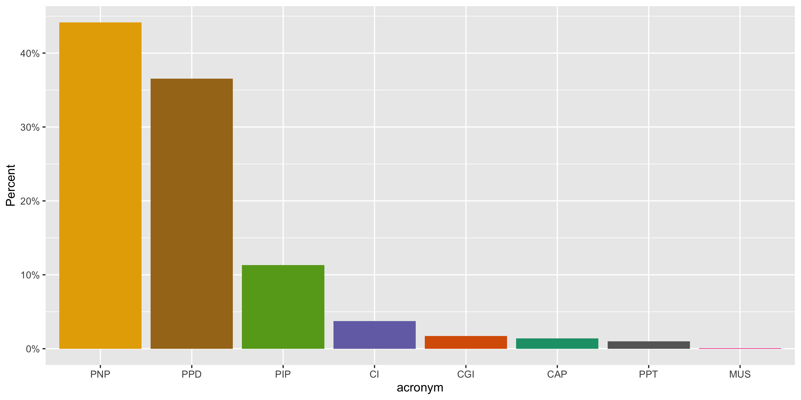
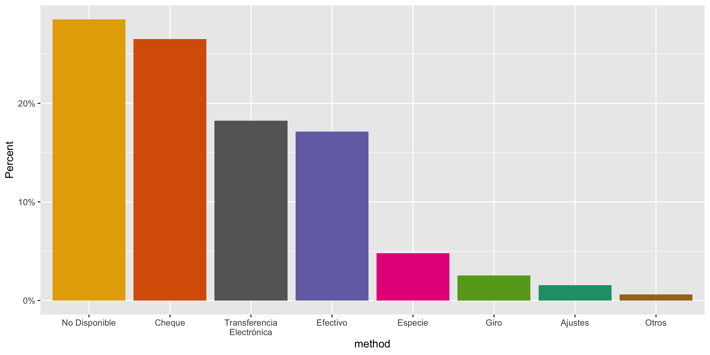
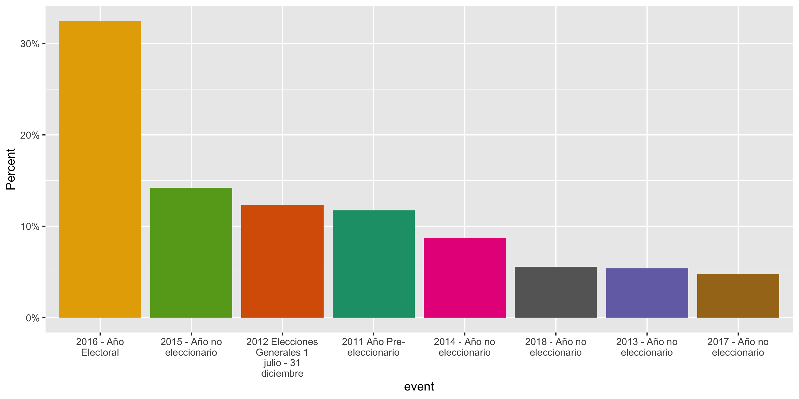
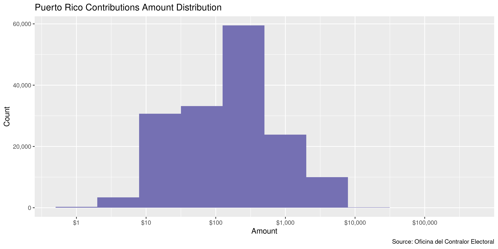
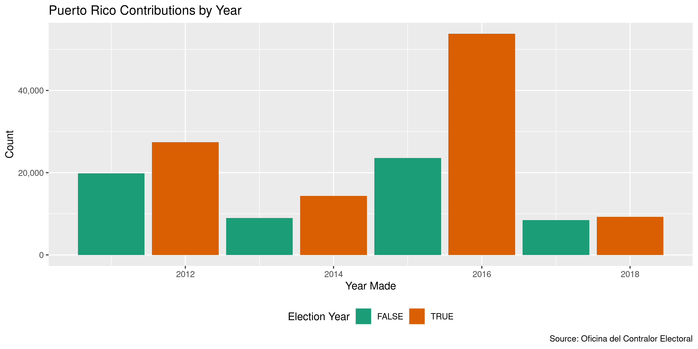
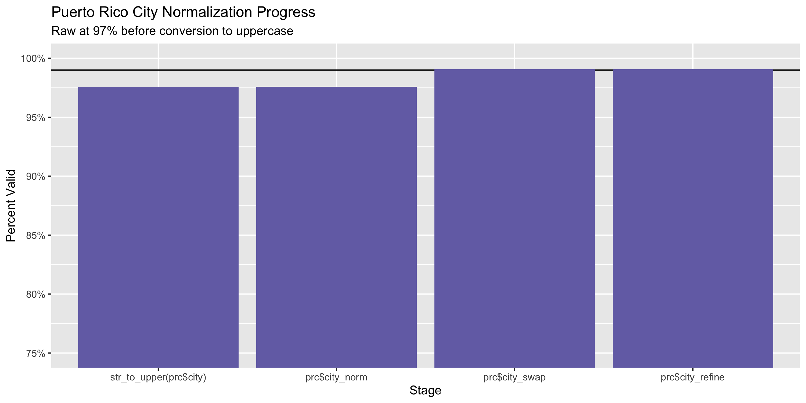
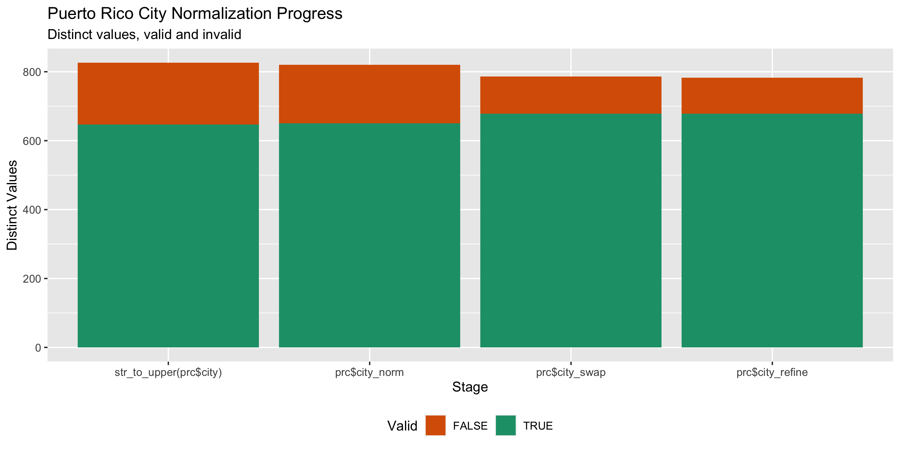

Puerto Rico Contributions
================
Kiernan Nicholls
Fri Sep 17 15:54:17 2021

-   [Project](#project)
-   [Objectives](#objectives)
-   [Packages](#packages)
-   [Data](#data)
-   [Download](#download)
-   [Read](#read)
-   [Explore](#explore)
    -   [Missing](#missing)
    -   [Duplicates](#duplicates)
    -   [Categorical](#categorical)
    -   [Amounts](#amounts)
    -   [Dates](#dates)
-   [Wrangle](#wrangle)
    -   [ZIP](#zip)
    -   [State](#state)
    -   [City](#city)
-   [Conclude](#conclude)
-   [Export](#export)
-   [Upload](#upload)

<!-- Place comments regarding knitting here -->

## Project

The Accountability Project is an effort to cut across data silos and
give journalists, policy professionals, activists, and the public at
large a simple way to search across huge volumes of public data about
people and organizations.

Our goal is to standardize public data on a few key fields by thinking
of each dataset row as a transaction. For each transaction there should
be (at least) 3 variables:

1.  All **parties** to a transaction.
2.  The **date** of the transaction.
3.  The **amount** of money involved.

## Objectives

This document describes the process used to complete the following
objectives:

1.  How many records are in the database?
2.  Check for entirely duplicated records.
3.  Check ranges of continuous variables.
4.  Is there anything blank or missing?
5.  Check for consistency issues.
6.  Create a five-digit ZIP Code called `zip`.
7.  Create a `year` field from the transaction date.
8.  Make sure there is data on both parties to a transaction.

## Packages

The following packages are needed to collect, manipulate, visualize,
analyze, and communicate these results. The `pacman` package will
facilitate their installation and attachment.

``` r
if (!require("pacman")) {
  install.packages("pacman")
}
pacman::p_load(
  tidyverse, # data manipulation
  lubridate, # datetime strings
  gluedown, # printing markdown
  janitor, # clean data frames
  campfin, # custom irw tools
  aws.s3, # aws cloud storage
  refinr, # cluster & merge
  scales, # format strings
  knitr, # knit documents
  vroom, # fast reading
  rvest, # scrape html
  glue, # code strings
  here, # project paths
  httr, # http requests
  fs # local storage 
)
```

This document should be run as part of the `R_campfin` project, which
lives as a sub-directory of the more general, language-agnostic
[`irworkshop/accountability_datacleaning`](https://github.com/irworkshop/accountability_datacleaning)
GitHub repository.

The `R_campfin` project uses the [RStudio
projects](https://support.rstudio.com/hc/en-us/articles/200526207-Using-Projects)
feature and should be run as such. The project also uses the dynamic
`here::here()` tool for file paths relative to *your* machine.

``` r
# where does this document knit?
here::i_am("pr/contribs/docs/pr_contribs_diary.Rmd")
```

## Data

Data is obtained from the Puerto Rico [Oficina del Contralor
Electoral](http://oce.pr.gov/), the Comptroller’s Office (OCE).

> Descripción: La Ley Núm. 222 de 18 de noviembre de 2011, según
> enmendada, mejor conocida como “Ley para la Fiscalización del
> Financiamiento de Campañas Políticas en Puerto Rico”, crea la Oficina
> del Contralor Electoral, a fin de establecer el marco legal y
> administrativo que regirá la legalidad, examen y evaluación de
> donativos y gastos para fines electorales.

Translation via Google Translate:

> *Description: Act No. 222 of November 18, 2011, as amended, better
> known as the “Law for the Control of Political Campaign Financing in
> Puerto Rico,” creates the Office of the Electoral Comptroller, in
> order to establish the legal framework and administrative that will
> govern the legality, examination and evaluation of donations and
> expenses for electoral purposes.*

The data is accessed through the [Puerto Rico OpenData
portal](https://data.oce.pr.gov). The data was first uploaded on
September 28, 2016 and last updated February 14, 2019.

There are 166,000 rows and 11 columns (translated):

-   `Candidate`: Name of the candidate, party or campaign committee.
-   `Candidature`: Description of the candidate, party or campaign
    committee.
-   `Acronym`: Acronym of the political party or type of committee:
    -   “CI” = Independent Candidate
    -   “CGI” = Independent Expenditure Committee
-   `Amount`: Amount of money contributed.
-   `Method`: Donation form.
-   `Donor`: Full name of the donor.
-   `City`: City where the donor resides.
-   `Date`: Date the donation was generated (day / month / year).
-   `Event`: Description of the election year or event.
-   `Zip Code`: Donor zip code.
-   `Location 1`: Donation coordinates based on the donor’s zip code.

## Download

``` r
raw_dir <- dir_create(here("pr", "contribs", "data", "raw"))
raw_csv <- path(raw_dir, "Donaciones.csv")
```

``` r
if (!file_exists(raw_csv)) {
  GET(
    url = "https://data.oce.pr.gov/api/views/kdwd-nb6g/rows.csv",
    query = list(accessType = "DOWNLOAD"),
    write_disk(path = tmp <- file_temp(ext = "csv")),
    progress(type = "down")
  )
}
```

## Read

``` r
prc <- read_delim(
  file = raw_csv,
  delim = ",",
  escape_backslash = FALSE,
  escape_double = FALSE,
  col_types = cols(
    .default = col_character(),
    Cantidad = col_double(),
    Fecha = col_date("%d/%m/%Y")
  )
)
```

``` r
prc <- clean_names(prc, case = "snake")
```

We can also rename the columns to their English translation.

``` r
# per Google Translate
names(prc)[1:9] <- c(
  "candidate", # candidato
  "candidacy", # candidatura
  "acronym",   # siglas
  "amount",    # cantidad
  "method",    # metodo
  "donor",     # donante
  "city",      # ciudad
  "date",      # fecha
  "event"      # evento
)
```

## Explore

There are 165,617 rows of 11 columns. Each record represents a single
contribution from an individual to a political candidate.

``` r
glimpse(prc)
#> Rows: 165,617
#> Columns: 11
#> $ candidate  <chr> "PARTIDO INDEPENDENTISTA PUERTORRIQUEÑO", "PARTIDO INDEPENDENTISTA PUERTORRIQUEÑO", "PARTIDO INDEPE…
#> $ candidacy  <chr> "Partido", "Partido", "Partido", "Partido", "Partido", "Partido", "Partido", "Partido", "Partido", …
#> $ acronym    <chr> "PIP", "PIP", "PIP", "PIP", "PIP", "PIP", "PIP", "PIP", "PIP", "PIP", "PIP", "PIP", "PPD", "PPD", "…
#> $ amount     <dbl> 200.00, 200.00, 200.00, 200.00, 400.00, 200.00, 200.00, 200.00, 200.00, 200.00, 200.00, 200.00, 20.…
#> $ method     <chr> "Cheque", "Transferencia Electrónica", "Transferencia Electrónica", "Transferencia Electrónica", "T…
#> $ donor      <chr> "DAMARIS MANGUAL VELEZ", "ADRIAN GONZALEZ COSTA", "CARLOS AVILES VAZQUEZ", "CARLOS GORRIN PERALTA",…
#> $ city       <chr> "ARECIBO", "CAGUAS", "SAN JUAN", "SAN JUAN", "SAN JUAN", "SAN SEBASTIAN", "SAN JUAN", "TRUJILLO ALT…
#> $ date       <date> 2018-03-31, 2018-03-31, 2018-03-31, 2018-03-31, 2018-03-31, 2018-03-31, 2018-03-31, 2018-03-31, 20…
#> $ event      <chr> "2018 - Año no eleccionario", "2018 - Año no eleccionario", "2018 - Año no eleccionario", "2018 - A…
#> $ zip_code   <chr> "00612", "00726", "00919", "00907", "00975", "00685", "00926", "00976", "00907", "00783", "00725", …
#> $ location_1 <chr> "(18.449732, -66.69879)", "(18.212965, -66.058033)", "(18.410462, -66.060533)", "(18.451131, -66.07…
tail(prc)
#> # A tibble: 6 × 11
#>   candidate                              candidacy acronym amount method donor city  date       event zip_code location_1
#>   <chr>                                  <chr>     <chr>    <dbl> <chr>  <chr> <chr> <date>     <chr> <chr>    <chr>     
#> 1 JOSE APONTE DALMAU                     Alcalde … PPD        200 Cheque BARU… CARO… 2018-12-20 2018… 00958    (18.34487…
#> 2 RICARDO ROSSELLO NEVARES               Gobernad… PNP       2700 Efect… EFRA… YABU… 2018-09-18 2018… 00767    (18.07275…
#> 3 VICTOR EMERIC CATARINEAU               Alcalde … PPD         20 Efect… HECT… VIEQ… 2018-11-30 2018… 00765    (18.12566…
#> 4 PARTIDO INDEPENDENTISTA PUERTORRIQUEÑO Partido   PIP        100 Trans… EDWI… MAYA… 2018-11-30 2018… 00680    (18.20523…
#> 5 RICARDO ROSSELLO NEVARES               Gobernad… PNP       1100 Cheque PEDR… TOA … 2018-09-10 2018… 00952    (18.42921…
#> 6 YASHIRA LEBRON RODRIGUEZ               Represen… PNP        300 Cheque ANGE… BAYA… 2018-12-11 2018… 00959    (18.38706…
```

### Missing

Columns vary in their degree of missing values.

``` r
col_stats(prc, count_na)
#> # A tibble: 11 × 4
#>    col        class      n       p
#>    <chr>      <chr>  <int>   <dbl>
#>  1 candidate  <chr>      0 0      
#>  2 candidacy  <chr>      0 0      
#>  3 acronym    <chr>      0 0      
#>  4 amount     <dbl>      0 0      
#>  5 method     <chr>      0 0      
#>  6 donor      <chr>   1244 0.00751
#>  7 city       <chr>   1606 0.00970
#>  8 date       <date>     0 0      
#>  9 event      <chr>      0 0      
#> 10 zip_code   <chr>   2094 0.0126 
#> 11 location_1 <chr>   9047 0.0546
```

We can flag any record missing a key variable needed to identify a
transaction.

``` r
key_vars <- c("date", "donor", "amount", "candidate")
prc <- flag_na(prc, all_of(key_vars))
mean(prc$na_flag)
#> [1] 0.007511306
```

``` r
prc %>% 
  filter(na_flag) %>% 
  select(all_of(key_vars))
#> # A tibble: 1,244 × 4
#>    date       donor amount candidate                    
#>    <date>     <chr>  <dbl> <chr>                        
#>  1 2014-03-29 <NA>  1540   ALEJANDRO GARCIA PADILLA     
#>  2 2015-03-15 <NA>    40   JAIME IRIZARRY DELGADO       
#>  3 2015-03-15 <NA>    40   JAIME IRIZARRY DELGADO       
#>  4 2014-11-28 <NA>  4200   CARLOS RODRIGUEZ RIVERA      
#>  5 2015-04-11 <NA>    30.2 MARTIN VARGAS MORALES        
#>  6 2015-03-01 <NA>   301.  ROLANDO CRESPO ARROYO        
#>  7 2015-05-02 <NA>    17   COMITE MUNICIPAL VILLALBA PNP
#>  8 2014-03-29 <NA>  4020   NORMAN RAMIREZ RIVERA        
#>  9 2015-03-14 <NA>   170   ROBERTO FELICIANO ROSADO     
#> 10 2015-04-14 <NA>    30   LUIS SOTO MORALES            
#> # … with 1,234 more rows
```

### Duplicates

We can also flag any record completely duplicated across every column.

``` r
prc <- flag_dupes(prc, everything())
mean(prc$dupe_flag)
#> [1] 0.08786538
```

``` r
prc %>% 
  filter(dupe_flag) %>% 
  select(all_of(key_vars)) %>% 
  arrange(date)
#> # A tibble: 14,552 × 4
#>    date       donor                     amount candidate           
#>    <date>     <chr>                      <dbl> <chr>               
#>  1 2011-01-01 MARIO CORSINO CRUZ        1000   THOMAS RIVERA SCHATZ
#>  2 2011-01-01 MARIO CORSINO CRUZ        1000   THOMAS RIVERA SCHATZ
#>  3 2011-01-05 MAX PEREZ PRESTON          200   JORGE NAVARRO SUAREZ
#>  4 2011-01-05 MAX PEREZ PRESTON          200   JORGE NAVARRO SUAREZ
#>  5 2011-01-06 JORGE SUAREZ PEREZ-GUERRA   83.3 RAMON TORRES MORALES
#>  6 2011-01-06 JORGE SUAREZ PEREZ-GUERRA   83.3 RAMON TORRES MORALES
#>  7 2011-01-06 WALDEMAR VELEZ SILVAGNOLI   80   RAMON TORRES MORALES
#>  8 2011-01-06 WALDEMAR VELEZ SILVAGNOLI   80   RAMON TORRES MORALES
#>  9 2011-01-13 JULIO BRAVO SOLER         1000   JOSE CHICO VEGA     
#> 10 2011-01-13 JULIO BRAVO SOLER         1000   JOSE CHICO VEGA     
#> # … with 14,542 more rows
```

### Categorical

``` r
col_stats(prc, n_distinct)
#> # A tibble: 13 × 4
#>    col        class      n         p
#>    <chr>      <chr>  <int>     <dbl>
#>  1 candidate  <chr>    869 0.00525  
#>  2 candidacy  <chr>    138 0.000833 
#>  3 acronym    <chr>     11 0.0000664
#>  4 amount     <dbl>   3843 0.0232   
#>  5 method     <chr>     11 0.0000664
#>  6 donor      <chr>  49858 0.301    
#>  7 city       <chr>    988 0.00597  
#>  8 date       <date>  2757 0.0166   
#>  9 event      <chr>     19 0.000115 
#> 10 zip_code   <chr>   1616 0.00976  
#> 11 location_1 <chr>    151 0.000912 
#> 12 na_flag    <lgl>      2 0.0000121
#> 13 dupe_flag  <lgl>      2 0.0000121
```

<!-- --><!-- --><!-- -->

### Amounts

``` r
summary(prc$amount)
#>     Min.  1st Qu.   Median     Mean  3rd Qu.     Max. 
#> -35300.0     40.0    200.0    437.2    500.0 250000.0
mean(prc$amount <= 0)
#> [1] 0.02772058
```

These are the records with the minimum and maximum amounts.

``` r
glimpse(prc[c(which.max(prc$amount), which.min(prc$amount)), ])
#> Rows: 2
#> Columns: 13
#> $ candidate  <chr> "DEMOCRATAS APOYANDO A ALEJANDRO Y OBAMA", "COMITE MUNICIPAL GUANICA PIP"
#> $ candidacy  <chr> "Comité de Gastos Independientes", "Comité Municipal"
#> $ acronym    <chr> "PPD", "PIP"
#> $ amount     <dbl> 250000, -35300
#> $ method     <chr> "No Disponible", "Especie"
#> $ donor      <chr> ". DEMOCRATIC GOVERNORS ASSOCIATION", "ENI LOPEZ BARRIOS"
#> $ city       <chr> "WASHINGTON", "GUANICA"
#> $ date       <date> 2012-10-05, 2016-02-02
#> $ event      <chr> "2012 Elecciones Generales 1 julio - 31 diciembre", "2016 - Año Electoral"
#> $ zip_code   <chr> "20005", "00653"
#> $ location_1 <chr> NA, "(17.992112, -66.90097)"
#> $ na_flag    <lgl> FALSE, FALSE
#> $ dupe_flag  <lgl> FALSE, FALSE
```

<!-- -->

### Dates

We can add the calendar year from `date` with `lubridate::year()`

``` r
prc <- mutate(prc, year = year(date))
```

``` r
min(prc$date)
#> [1] "2011-01-01"
sum(prc$year < 2000)
#> [1] 0
max(prc$date)
#> [1] "2018-12-31"
sum(prc$date > today())
#> [1] 0
```

<!-- -->

## Wrangle

To improve the searchability of the database, we will perform some
consistent, confident string normalization. For geographic variables
like city names and ZIP codes, the corresponding `campfin::normal_*()`
functions are tailor made to facilitate this process.

### ZIP

For ZIP codes, the `campfin::normal_zip()` function will attempt to
create valid *five* digit codes by removing the ZIP+4 suffix and
returning leading zeroes dropped by other programs like Microsoft Excel.

``` r
prc <- prc %>% 
  mutate(
    zip_norm = normal_zip(
      zip = zip_code,
      na_rep = TRUE
    )
  )
```

``` r
progress_table(
  prc$zip_code,
  prc$zip_norm,
  compare = valid_zip
)
#> # A tibble: 2 × 6
#>   stage        prop_in n_distinct prop_na n_out n_diff
#>   <chr>          <dbl>      <dbl>   <dbl> <dbl>  <dbl>
#> 1 prc$zip_code   0.991       1616  0.0126  1450    249
#> 2 prc$zip_norm   0.993       1563  0.0139  1123    184
```

### State

There is no state information but we can add the state associated with
each normalized `zip_code` value.

``` r
prc <- left_join(
  x = prc,
  y = zipcodes[, 2:3],
  by = c("zip_norm" = "zip")
)
```

``` r
prc <- rename(prc, state_match = state)
count(prc, state_match, sort = TRUE)
#> # A tibble: 53 × 2
#>    state_match      n
#>    <chr>        <int>
#>  1 PR          159302
#>  2 <NA>          3421
#>  3 FL             700
#>  4 NY             463
#>  5 TX             193
#>  6 DC             178
#>  7 NJ             166
#>  8 VA             157
#>  9 MD             117
#> 10 PA              95
#> # … with 43 more rows
```

### City

Cities are the most difficult geographic variable to normalize, simply
due to the wide variety of valid cities and formats.

#### Normal

The `campfin::normal_city()` function is a good start, again converting
case, removing punctuation, but *expanding* USPS abbreviations. We can
also remove `invalid_city` values.

``` r
norm_city <- prc %>% 
  distinct(city, state_match, zip_norm) %>% 
  mutate(
    city_norm = normal_city(
      city = city, 
      abbs = usps_city,
      states = c("PR", "DC", "PUERTO RICO"),
      na = invalid_city,
      na_rep = TRUE
    )
  )
```

#### Swap

We can further improve normalization by comparing our normalized value
against the *expected* value for that record’s state abbreviation and
ZIP code. If the normalized value is either an abbreviation for or very
similar to the expected value, we can confidently swap those two.

``` r
norm_city <- norm_city %>% 
  rename(city_raw = city) %>% 
  left_join(
    y = zipcodes,
    by = c(
      "state_match" = "state",
      "zip_norm" = "zip"
    )
  ) %>% 
  rename(city_match = city) %>% 
  mutate(
    match_abb = is_abbrev(city_norm, city_match),
    match_dist = str_dist(city_norm, city_match),
    city_swap = if_else(
      condition = !is.na(match_dist) & (match_abb | match_dist == 1),
      true = city_match,
      false = city_norm
    )
  ) %>% 
  select(
    -city_match,
    -match_dist,
    -match_abb
  )
```

``` r
prc <- left_join(
  x = prc,
  y = norm_city,
  by = c(
    "city" = "city_raw", 
    "state_match", 
    "zip_norm"
  )
)
```

#### Refine

The [OpenRefine](https://openrefine.org/) algorithms can be used to
group similar strings and replace the less common versions with their
most common counterpart. This can greatly reduce inconsistency, but with
low confidence; we will only keep any refined strings that have a valid
city/state/zip combination.

``` r
good_refine <- prc %>% 
  mutate(
    city_refine = city_swap %>% 
      key_collision_merge() %>% 
      n_gram_merge(numgram = 1)
  ) %>% 
  filter(city_refine != city_swap) %>% 
  inner_join(
    y = zipcodes,
    by = c(
      "city_refine" = "city",
      "state_match" = "state",
      "zip_norm" = "zip"
    )
  )
```

    #> # A tibble: 3 × 5
    #>   state_match zip_norm city_swap     city_refine     n
    #>   <chr>       <chr>    <chr>         <chr>       <int>
    #> 1 NC          27522    CREEDMORE     CREEDMOOR       1
    #> 2 OH          45245    CINCINATTI    CINCINNATI      1
    #> 3 TN          38281    UNION CITY TN UNION CITY      1

Then we can join the refined values back to the database.

``` r
prc <- prc %>% 
  left_join(good_refine, by = names(.)) %>% 
  mutate(city_refine = coalesce(city_refine, city_swap))
```

#### Progress

Our goal for normalization was to increase the proportion of city values
known to be valid and reduce the total distinct values by correcting
misspellings.

| stage                    | prop\_in | n\_distinct | prop\_na | n\_out | n\_diff |
|:-------------------------|---------:|------------:|---------:|-------:|--------:|
| `str_to_upper(prc$city)` |    0.975 |         826 |     0.01 |   4021 |     179 |
| `prc$city_norm`          |    0.976 |         819 |     0.01 |   3978 |     169 |
| `prc$city_swap`          |    0.991 |         785 |     0.01 |   1522 |     107 |
| `prc$city_refine`        |    0.991 |         782 |     0.01 |   1519 |     104 |

You can see how the percentage of valid values increased with each
stage.

<!-- -->

More importantly, the number of distinct values decreased each stage. We
were able to confidently change many distinct invalid values to their
valid equivalent.

<!-- -->

## Conclude

Before exporting, we can remove the intermediary normalization columns
and rename all added variables with the `_clean` suffix.

``` r
prc <- prc %>% 
  select(
    -city_norm,
    -city_swap,
    city_clean = city_refine
  ) %>% 
  rename_all(~str_replace(., "_norm", "_clean")) %>% 
  rename_all(~str_remove(., "_raw")) %>% 
  relocate(city_clean, state_match, zip_clean, .before = last_col())
```

``` r
glimpse(sample_n(prc, 50))
#> Rows: 50
#> Columns: 17
#> $ candidate   <chr> "WILLIAM MIRANDA TORRES", "PARTIDO POPULAR DEMOCRATICO", "PARTIDO INDEPENDENTISTA PUERTORRIQUEÑO",…
#> $ candidacy   <chr> "Alcalde", "Partido", "Partido", "Representante Distrito 40", "Representante Distrito 04", "Comité…
#> $ acronym     <chr> "PPD", "PPD", "PIP", "PNP", "PNP", "CAP", "PNP", "PNP", "CI", "PNP", "PNP", "PIP", "PNP", "PPD", "…
#> $ amount      <dbl> 500, 2000, 5, -10, 20, 100, 50, 125, 5, 1000, 10, -100, 500, 2500, 500, 100, 500, 100, 500, 500, 1…
#> $ method      <chr> "No Disponible", "Cheque", "Transferencia Electrónica", "Ajustes", "Efectivo", "Cheque", "Transfer…
#> $ donor       <chr> "JORGE SANCHEZ SANTIAGO", "PEDRO ORTIZ ALVAREZ", "GILBERTO TORRUELLAS IGLESIAS", "LUIS DELGADO DEL…
#> $ city        <chr> "CAGUAS", "PONCE", "SAN LORENZO", "CAROLINA", "HUMACAO", "SAN JUAN", "TRUJILLO ALTO", "BAYAMON", "…
#> $ date        <date> 2012-06-03, 2016-10-04, 2015-12-31, 2015-01-13, 2018-11-11, 2014-08-15, 2015-11-03, 2016-03-09, 2…
#> $ event       <chr> "2012 Elecciones Generales 1 enero - 30 junio", "2016 - Año Electoral", "2015 - Año no eleccionari…
#> $ zip_code    <chr> "00726", "00732", "00754", "00987", "00791", "00901", "00976", "00956", "00719", "00917", "00983",…
#> $ location_1  <chr> "(18.212965, -66.058033)", "(18.021781, -66.613742)", "(18.15633, -65.96831)", "(18.372228, -65.96…
#> $ na_flag     <lgl> FALSE, FALSE, FALSE, FALSE, FALSE, FALSE, FALSE, FALSE, FALSE, FALSE, FALSE, FALSE, FALSE, FALSE, …
#> $ dupe_flag   <lgl> FALSE, FALSE, TRUE, FALSE, FALSE, TRUE, FALSE, FALSE, FALSE, FALSE, FALSE, FALSE, TRUE, FALSE, TRU…
#> $ year        <dbl> 2012, 2016, 2015, 2015, 2018, 2014, 2015, 2016, 2016, 2012, 2015, 2015, 2017, 2012, 2016, 2011, 20…
#> $ city_clean  <chr> "CAGUAS", "PONCE", "SAN LORENZO", "CAROLINA", "HUMACAO", "SAN JUAN", "TRUJILLO ALTO", "BAYAMON", "…
#> $ state_match <chr> "PR", "PR", "PR", "PR", "PR", "PR", "PR", "PR", "PR", "PR", "PR", "PR", "PR", "PR", "PR", "PR", "P…
#> $ zip_clean   <chr> "00726", "00732", "00754", "00987", "00791", "00901", "00976", "00956", "00719", "00917", "00983",…
```

1.  There are 165,617 records in the database.
2.  There are 14,552 duplicate records in the database.
3.  The range and distribution of `amount` and `date` seem reasonable.
4.  There are 1,244 records missing key variables.
5.  Consistency in geographic data has been improved with
    `campfin::normal_*()`.
6.  The 4-digit `year` variable has been created with
    `lubridate::year()`.

## Export

Now the file can be saved on disk for upload to the Accountability
server.

``` r
clean_dir <- dir_create(here("pr", "contribs", "data", "clean"))
clean_path <- path(clean_dir, "pr_contribs_20110101-20181231.csv")
write_csv(prc, clean_path, na = "")
(clean_size <- file_size(clean_path))
#> 31.2M
```

## Upload

We can use the `aws.s3::put_object()` to upload the text file to the IRW
server.

``` r
aws_path <- path("csv", basename(clean_path))
if (!object_exists(aws_path, "publicaccountability")) {
  put_object(
    file = clean_path,
    object = aws_path, 
    bucket = "publicaccountability",
    acl = "public-read",
    show_progress = TRUE,
    multipart = TRUE
  )
}
aws_head <- head_object(aws_path, "publicaccountability")
(aws_size <- as_fs_bytes(attr(aws_head, "content-length")))
unname(aws_size == clean_size)
```
