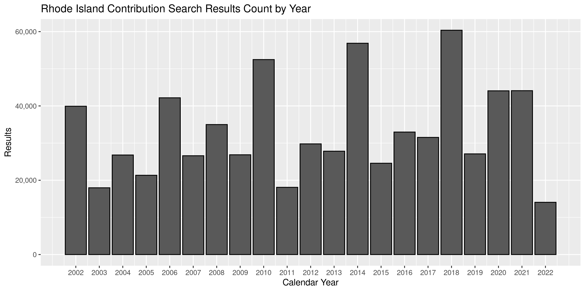
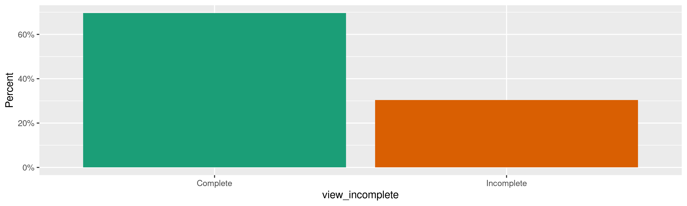
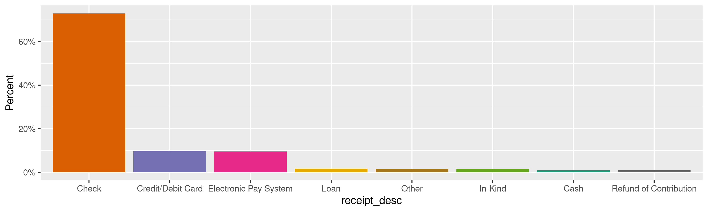
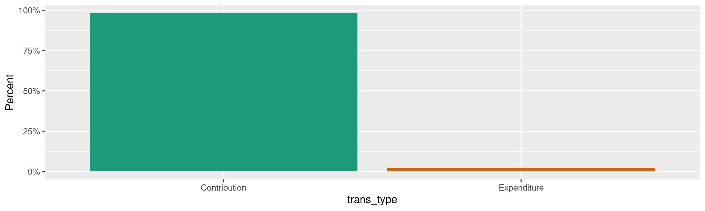
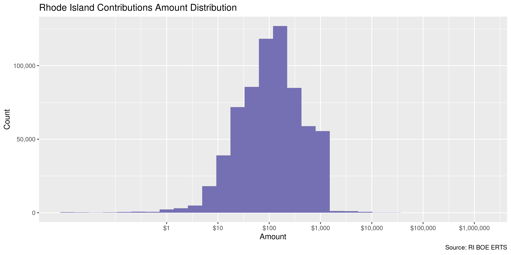
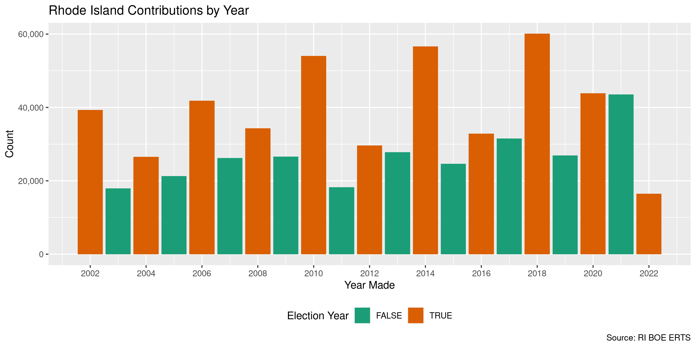
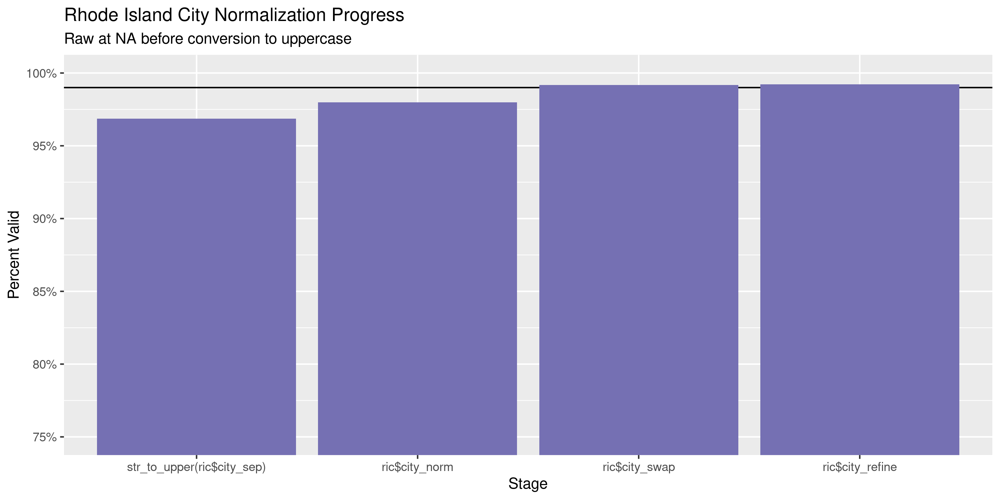
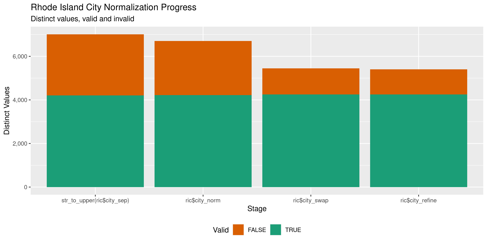

Rhode Island Contributions
================
Kiernan Nicholls
Mon Jun 13 13:31:33 2022

-   <a href="#project" id="toc-project">Project</a>
-   <a href="#objectives" id="toc-objectives">Objectives</a>
-   <a href="#packages" id="toc-packages">Packages</a>
-   <a href="#source" id="toc-source">Source</a>
-   <a href="#download" id="toc-download">Download</a>
-   <a href="#fix" id="toc-fix">Fix</a>
-   <a href="#read" id="toc-read">Read</a>
-   <a href="#explore" id="toc-explore">Explore</a>
    -   <a href="#missing" id="toc-missing">Missing</a>
    -   <a href="#duplicates" id="toc-duplicates">Duplicates</a>
    -   <a href="#categorical" id="toc-categorical">Categorical</a>
    -   <a href="#amounts" id="toc-amounts">Amounts</a>
    -   <a href="#dates" id="toc-dates">Dates</a>
-   <a href="#wrangle" id="toc-wrangle">Wrangle</a>
    -   <a href="#address" id="toc-address">Address</a>
    -   <a href="#zip" id="toc-zip">ZIP</a>
    -   <a href="#state" id="toc-state">State</a>
    -   <a href="#city" id="toc-city">City</a>
-   <a href="#conclude" id="toc-conclude">Conclude</a>
-   <a href="#export" id="toc-export">Export</a>
-   <a href="#upload" id="toc-upload">Upload</a>

<!-- Place comments regarding knitting here -->

## Project

The Accountability Project is an effort to cut across data silos and
give journalists, policy professionals, activists, and the public at
large a simple way to search across huge volumes of public data about
people and organizations.

Our goal is to standardize public data on a few key fields by thinking
of each dataset row as a transaction. For each transaction there should
be (at least) 3 variables:

1.  All **parties** to a transaction.
2.  The **date** of the transaction.
3.  The **amount** of money involved.

## Objectives

This document describes the process used to complete the following
objectives:

1.  How many records are in the database?
2.  Check for entirely duplicated records.
3.  Check ranges of continuous variables.
4.  Is there anything blank or missing?
5.  Check for consistency issues.
6.  Create a five-digit ZIP Code called `zip`.
7.  Create a `year` field from the transaction date.
8.  Make sure there is data on both parties to a transaction.

## Packages

The following packages are needed to collect, manipulate, visualize,
analyze, and communicate these results. The `pacman` package will
facilitate their installation and attachment.

``` r
if (!require("pacman")) {
  install.packages("pacman")
}
pacman::p_load(
  tidyverse, # data manipulation
  lubridate, # datetime strings
  gluedown, # printing markdown
  janitor, # clean data frames
  campfin, # custom irw tools
  aws.s3, # aws cloud storage
  refinr, # cluster & merge
  scales, # format strings
  knitr, # knit documents
  rvest, # scrape html
  glue, # code strings
  here, # project paths
  httr, # http requests
  fs # local storage 
)
```

This diary was run using `campfin` version 1.0.8.9300.

``` r
packageVersion("campfin")
#> [1] '1.0.8.9300'
```

This document should be run as part of the `R_tap` project, which lives
as a sub-directory of the more general, language-agnostic
[`irworkshop/accountability_datacleaning`](https://github.com/irworkshop/accountability_datacleaning)
GitHub repository.

The `R_tap` project uses the [RStudio
projects](https://support.rstudio.com/hc/en-us/articles/200526207-Using-Projects)
feature and should be run as such. The project also uses the dynamic
`here::here()` tool for file paths relative to *your* machine.

``` r
# where does this document knit?
here::i_am("state/ri/contribs/docs/ri_contribs_diary.Rmd")
```

## Source

Rhode Island contributions are obtained from the state [Board of
Elections](www.elections.ri.gov), which operates the Campaign Finance
Electronic Reporting & Tracking System (ERTS) [search
portal](https://ricampaignfinance.com/RIPublic/Contributions.aspx).

> #### Contribution Reporting
>
> You can access the Contribution tab to generate reports of
> contributions submitted to the BOE by organizations (e.g., Candidate,
> PAC, Party, or Corporation). The reports can be filtered in many ways
> and the results of the report can be exported in a variety of formats.
>
> The purpose of this page is to locate a contribution source. This
> source may be an Organization or an individual. You must specify at
> least an Organization, Donor Name or Employer Name as a Search
> criteria. You can refine the criteria by selecting additional items.
> Most search criteria are located based on the first characters that
> are set in your request.
>
> **Search Button**: Click to initiate your search and return the
> contributors that match your selections. **Return Button**: Click to
> return to the previous page.

The search portal *requires* that one search the name of a contributing
individual or organization. However, the BOE informed IRW that a `%`
wildcard can be used to obtain results from *all* contributors.

They further informed us that results are only available in their system
from January 2002 through March 2022.

## Download

Per the suggestion of the BOE, we searched for all contributions between
January 1 and December 31 for each calendar year since 2002. The search
result totals were noted and the results were saved to a comma-delimited
file for each year.

``` r
raw_dir <- dir_create(here("state", "ri", "contribs", "data", "raw"))
raw_csv <- dir_ls(raw_dir, glob = "*.csv")
```

There are 700,456 results since January 1, 2002.

| Year | Results | Filename                                   |
|-----:|:--------|:-------------------------------------------|
| 2002 | 39,921  | `9410c5b1-0086-44ab-92c5-eeb06ac377f0.csv` |
| 2003 | 17,968  | `a8031b68-c670-45a9-b684-b21728cbb522.csv` |
| 2004 | 26,792  | `a5042ab2-2af5-41bf-90fe-94fa4aa7c14b.csv` |
| 2005 | 21,335  | `6d73ab0b-9158-4c81-a156-96dd4fec6e5b.csv` |
| 2006 | 42,188  | `aa293943-9a57-4d7d-896d-e49e13f9c91b.csv` |
| 2007 | 26,593  | `92cf8daa-c054-49a5-b335-1b5042f3c711.csv` |
| 2008 | 34,987  | `78b27fc9-6d69-4c98-907a-1f17ade2ff96.csv` |
| 2009 | 26,851  | `bfed19d8-8b5b-4b37-9874-fc1d0c9eda41.csv` |
| 2010 | 52,479  | `5ddad5a9-5ce0-4287-8852-06dacee8cdc6.csv` |
| 2011 | 18,091  | `7dbd01e0-6fcb-49f2-a705-841fdf6eb193.csv` |
| 2012 | 29,788  | `66142c03-079a-448f-923a-9b146438f670.csv` |
| 2013 | 27,817  | `398e44bb-6b1a-4bec-9d2b-79c08828a5d9.csv` |
| 2014 | 56,872  | `8d561a17-aa0e-4893-ac3a-1ce5e8e8c0fc.csv` |
| 2015 | 24,574  | `582c0490-05f5-4954-8b87-318d5ffc4592.csv` |
| 2016 | 32,969  | `6a93cb25-39e5-4966-8e6a-300e67e112ba.csv` |
| 2017 | 31,528  | `8b6310ef-c798-4c94-8b2c-dc9f5a9f8043.csv` |
| 2018 | 60,377  | `d2a9d2ee-e33b-4d71-9498-c7794ea02616.csv` |
| 2019 | 27,094  | `0bc173d6-0abd-4ee4-b37f-5e7e487e635d.csv` |
| 2020 | 44,067  | `a39cbc65-ca74-433e-a33c-a1053c69b431.csv` |
| 2021 | 44,105  | `66e9b1e8-5cc7-4fda-acdc-79d474355040.csv` |
| 2022 | 14,060  | `b8508762-0d39-404b-b342-0b126e3470da.csv` |

<!-- -->

## Fix

EXTREME MANUAL MEASURES WERE TAKEN TO REPAIR ERRORS IN THE RAW TEXT
FILES. THE SOURCE DATA CONTAINS MANY ERRONEOUS NEWLINE BREAKS AND DOUBLE
QUOTATION MARKS.

SO VARRIED WERE THE ERRORS THAT THEY COULD NOT BE FIXED PROGRAMATICALLY.

## Read

``` r
ric <- read_delim(
  file = raw_csv,
  delim = ",",
  escape_backslash = FALSE,
  escape_double = FALSE,
  id = "source_file",
  locale = locale(date_format = "%m/%d/%Y"),
  col_types = cols(
    .default = col_character(),
    ContributionID = col_integer(),
    ReceiptDate = col_date(),
    DepositDate = col_date(),
    Amount = col_double(),
    MPFMatchAmount = col_double(),
    BeginDate = col_date(),
    EndDate = col_date()
  )
)
```

``` r
problems(ric)
#> # A tibble: 0 × 5
#> # … with 5 variables: row <int>, col <int>, expected <chr>, actual <chr>, file <chr>
```

``` r
nrow(ric) == sum(yr_count$n)
#> [1] TRUE
```

``` r
ric <- ric %>% 
  clean_names(case = "snake") %>% 
  relocate(source_file, .after = last_col()) %>% 
  mutate(across(source_file, basename))
```

## Explore

There are 700,456 rows of 23 columns. Each record represents a single
campaign contribution made to a committee.

``` r
glimpse(ric)
#> Rows: 700,456
#> Columns: 23
#> $ contribution_id     <int> 45328, 18647, 18650, 18651, 18652, 18653, 18654, 18656, 18657, 18661, 18662, 18663, 18664,…
#> $ cont_desc           <chr> "Contribution from Individuals", "Contribution from Individuals", "Contribution from Indiv…
#> $ incomplete_desc     <chr> NA, NA, NA, NA, NA, NA, NA, NA, NA, NA, NA, NA, NA, NA, "Zip<BR>Employer Address1<BR>Emplo…
#> $ organization_name   <chr> "JONATHAN F  OSTER", "NORTH KINGSTOWN DEM COMM", "NORTH KINGSTOWN DEM COMM", "NORTH KINGST…
#> $ view_incomplete     <chr> "Complete", "Complete", "Complete", "Complete", "Complete", "Complete", "Complete", "Compl…
#> $ receipt_date        <date> 2002-01-04, 2002-01-07, 2002-01-07, 2002-01-07, 2002-01-07, 2002-01-07, 2002-01-07, 2002-…
#> $ deposit_date        <date> 2002-01-04, 2002-01-07, 2002-01-07, 2002-01-07, 2002-01-07, 2002-01-07, 2002-01-07, 2002-…
#> $ amount              <dbl> 500, 100, 100, 100, 100, 100, 100, 100, 100, 100, 50, 100, 200, 100, 100, 1000, 1000, 1000…
#> $ contrib_explanation <chr> NA, NA, NA, NA, NA, NA, NA, NA, NA, NA, NA, NA, NA, NA, NA, NA, NA, NA, NA, NA, NA, NA, NA…
#> $ mpf_match_amount    <dbl> 0, 0, 0, 0, 0, 0, 0, 0, 0, 0, 0, 0, 0, 0, 0, 0, 0, 0, 0, 0, 0, 0, 0, 0, 0, 0, 0, 0, 0, 0, …
#> $ first_name          <chr> "ERIC", "DENNIS", "GUY", "THOMAS", "JOHN", "GERARD", "SUE", "RUSSELL", "JONATHAN", "ROBERT…
#> $ last_name           <chr> "YEGHIAN", "ROBERTS", "DUFAULT", "HANLEY", "HARWOOD", "MARTINEAU", "HENSLER", "WALLACE", "…
#> $ full_name           <chr> "YEGHIAN, ERIC", "ROBERTS II, DENNIS J", "DUFAULT, GUY A", "HANLEY, THOMAS A", "HARWOOD, J…
#> $ address             <chr> "3550 BISCAYE BOULEVARD", "132 EVERETT AVENUE", "61 YALE AVENUE", "32 THOMAS LEIGHTON BLVD…
#> $ city_st_zip         <chr> "MIAMI, FL", "PROVIDENCE, RI", "WARWICK, RI", "CUMBERLAND, RI", "PAWTUCKET, RI", "WOONSOCK…
#> $ employer_name       <chr> "SELF EMPLOYED", "DENNIS J ROBERTS ESQ", "CORNERSTONE COMMUNICATION", "RAHILL RAHILL & HAN…
#> $ emp_address         <chr> "3550 BISCAYE BOULEVARD", "1500 TURKS HEAD PLAZA", "ONE BEACON CENTRE", "349 JEFFERSON BLV…
#> $ emp_city_st_zip     <chr> "MIAMI, FL", "PROVIDENCE, RI", "WARWICK, RI", "WARWICK,", "PAWTUCKET, RI", NA, "JOHNSTON, …
#> $ receipt_desc        <chr> "Check", "Check", "Check", "Check", "Check", "Check", "Check", "Check", "Check", "Check", …
#> $ begin_date          <date> 2002-01-01, 2002-01-01, 2002-01-01, 2002-01-01, 2002-01-01, 2002-01-01, 2002-01-01, 2002-…
#> $ end_date            <date> 2002-12-31, 2002-12-31, 2002-12-31, 2002-12-31, 2002-12-31, 2002-12-31, 2002-12-31, 2002-…
#> $ trans_type          <chr> "Contribution", "Contribution", "Contribution", "Contribution", "Contribution", "Contribut…
#> $ source_file         <chr> "2002_9410c5b1-0086-44ab-92c5-eeb06ac377f0.csv", "2002_9410c5b1-0086-44ab-92c5-eeb06ac377f…
tail(ric)
#> # A tibble: 6 × 23
#>   contribution_id cont_desc            incomplete_desc organization_na… view_incomplete receipt_date deposit_date amount
#>             <int> <chr>                <chr>           <chr>            <chr>           <date>       <date>        <dbl>
#> 1          849014 In-Kind - Individual <NA>            RHODE ISLAND RE… Complete        2022-03-05   1900-01-01     21  
#> 2          853797 In-Kind - Individual <NA>            NIRVA REBECCA L… Complete        2022-03-21   1900-01-01    250  
#> 3          841293 In-Kind - Individual <NA>            RHODE ISLAND QU… Complete        2022-03-31   1900-01-01     32.1
#> 4          849128 In-Kind - Individual <NA>            DANIEL J MCKEE   Complete        2022-03-15   1900-01-01    600  
#> 5          847735 In-Kind - Individual <NA>            RHODE ISLAND GO… Complete        2022-03-28   1900-01-01    611. 
#> 6          840390 Aggregate - Individ… <NA>            JEREMY MICHAEL … Complete        2022-01-02   1900-01-01    -25  
#> # … with 15 more variables: contrib_explanation <chr>, mpf_match_amount <dbl>, first_name <chr>, last_name <chr>,
#> #   full_name <chr>, address <chr>, city_st_zip <chr>, employer_name <chr>, emp_address <chr>, emp_city_st_zip <chr>,
#> #   receipt_desc <chr>, begin_date <date>, end_date <date>, trans_type <chr>, source_file <chr>
```

### Missing

Columns vary in their degree of missing values.

``` r
col_stats(ric, count_na)
#> # A tibble: 23 × 4
#>    col                 class       n          p
#>    <chr>               <chr>   <int>      <dbl>
#>  1 contribution_id     <int>       0 0         
#>  2 cont_desc           <chr>       0 0         
#>  3 incomplete_desc     <chr>  487925 0.697     
#>  4 organization_name   <chr>       0 0         
#>  5 view_incomplete     <chr>       0 0         
#>  6 receipt_date        <date>      3 0.00000428
#>  7 deposit_date        <date>  11377 0.0162    
#>  8 amount              <dbl>       0 0         
#>  9 contrib_explanation <chr>  600155 0.857     
#> 10 mpf_match_amount    <dbl>       0 0         
#> 11 first_name          <chr>   87428 0.125     
#> 12 last_name           <chr>   13095 0.0187    
#> 13 full_name           <chr>      20 0.0000286 
#> 14 address             <chr>    8654 0.0124    
#> 15 city_st_zip         <chr>    7898 0.0113    
#> 16 employer_name       <chr>  140759 0.201     
#> 17 emp_address         <chr>  282137 0.403     
#> 18 emp_city_st_zip     <chr>  271021 0.387     
#> 19 receipt_desc        <chr>       0 0         
#> 20 begin_date          <date>      0 0         
#> 21 end_date            <date>      0 0         
#> 22 trans_type          <chr>       0 0         
#> 23 source_file         <chr>       0 0
```

We can flag any record missing a key variable needed to identify a
transaction.

``` r
key_vars <- c("receipt_date", "full_name", "amount", "organization_name")
ric <- flag_na(ric, all_of(key_vars))
sum(ric$na_flag)
#> [1] 23
```

While some rows are missing a `last_name`, very few are missing
`full_name`.

``` r
ric %>% 
  filter(na_flag) %>% 
  select(all_of(key_vars))
#> # A tibble: 23 × 4
#>    receipt_date full_name  amount organization_name
#>    <date>       <chr>       <dbl> <chr>            
#>  1 2003-02-06   <NA>      -64000  DONALD L CARCIERI
#>  2 2002-07-01   <NA>        -306. LEO T FONTAINE   
#>  3 2003-09-08   <NA>       -4890  DAVID N CICILLINE
#>  4 2002-11-21   <NA>         -60  ANDREW M LYON III
#>  5 2004-12-01   <NA>      -20000  CHARLENE LIMA    
#>  6 2004-12-01   <NA>       -2260. DAVID J SANTILLI 
#>  7 2005-01-13   <NA>       -2327. JOSEPH A WELLS   
#>  8 2004-12-04   <NA>      -20611. JOHN O MANCINI   
#>  9 2004-11-12   <NA>       -1025  ERNEST J CABRAL  
#> 10 2004-11-29   <NA>        -500  CASWELL COOKE JR.
#> # … with 13 more rows
```

### Duplicates

We can also flag any record completely duplicated across every column.

``` r
ric <- flag_dupes(ric, -contribution_id)
mean(ric$dupe_flag)
#> [1] 0.01108992
sum(ric$dupe_flag)
#> [1] 7768
```

``` r
ric %>% 
  filter(dupe_flag) %>% 
  select(contribution_id, all_of(key_vars)) %>% 
  arrange(receipt_date)
#> # A tibble: 7,768 × 5
#>    contribution_id receipt_date full_name                     amount organization_name            
#>              <int> <date>       <chr>                          <dbl> <chr>                        
#>  1           32690 2002-01-04   RI LABORERS' STATE  EMPLOYEES    500 JOHN A  CELONA               
#>  2           32691 2002-01-04   RI LABORERS' STATE  EMPLOYEES    500 JOHN A  CELONA               
#>  3           14490 2002-01-08   TARRO, STEPHEN A                 500 Honorable EDWARD S  INMAN III
#>  4           14491 2002-01-08   TARRO, STEPHEN A                 500 Honorable EDWARD S  INMAN III
#>  5           32912 2002-02-12   GASBARRO, CHRISTOPHER            125 JOHN A  CELONA               
#>  6           32913 2002-02-12   GASBARRO, CHRISTOPHER            125 JOHN A  CELONA               
#>  7           53215 2002-02-27   HOLDEN, LORING S                 100 MATTHEW A  BROWN             
#>  8           53216 2002-02-27   HOLDEN, LORING S                 100 MATTHEW A  BROWN             
#>  9           70411 2002-03-01   W WARWICK TEACH ALLIANCE COPE     50 JOHN J  TASSONI JR           
#> 10           70412 2002-03-01   W WARWICK TEACH ALLIANCE COPE     50 JOHN J  TASSONI JR           
#> # … with 7,758 more rows
```

### Categorical

``` r
col_stats(ric, n_distinct)
#> # A tibble: 25 × 4
#>    col                 class       n          p
#>    <chr>               <chr>   <int>      <dbl>
#>  1 contribution_id     <int>  690705 0.986     
#>  2 cont_desc           <chr>      22 0.0000314 
#>  3 incomplete_desc     <chr>     156 0.000223  
#>  4 organization_name   <chr>    5240 0.00748   
#>  5 view_incomplete     <chr>       2 0.00000286
#>  6 receipt_date        <date>   7371 0.0105    
#>  7 deposit_date        <date>   7249 0.0103    
#>  8 amount              <dbl>   14184 0.0202    
#>  9 contrib_explanation <chr>   18015 0.0257    
#> 10 mpf_match_amount    <dbl>     184 0.000263  
#> 11 first_name          <chr>   17714 0.0253    
#> 12 last_name           <chr>   59631 0.0851    
#> 13 full_name           <chr>  187823 0.268     
#> 14 address             <chr>  177520 0.253     
#> 15 city_st_zip         <chr>   29367 0.0419    
#> 16 employer_name       <chr>   92185 0.132     
#> 17 emp_address         <chr>   89253 0.127     
#> 18 emp_city_st_zip     <chr>   18779 0.0268    
#> 19 receipt_desc        <chr>      11 0.0000157 
#> 20 begin_date          <date>     21 0.0000300 
#> 21 end_date            <date>     21 0.0000300 
#> 22 trans_type          <chr>       2 0.00000286
#> 23 source_file         <chr>      21 0.0000300 
#> 24 na_flag             <lgl>       2 0.00000286
#> 25 dupe_flag           <lgl>       2 0.00000286
```

<!-- --><!-- --><!-- -->

### Amounts

``` r
# fix floating point precision
ric$amount <- round(ric$amount, digits = 2)
```

``` r
summary(ric$amount)
#>      Min.   1st Qu.    Median      Mean   3rd Qu.      Max. 
#> -500000.0      37.5     100.0     251.2     250.0 1050000.0
mean(ric$amount <= 0)
#> [1] 0.03529558
```

These are the records with the minimum and maximum amounts.

``` r
glimpse(ric[c(which.max(ric$amount), which.min(ric$amount)), ])
#> Rows: 2
#> Columns: 25
#> $ contribution_id     <int> 483824, 850559
#> $ cont_desc           <chr> "Loan Proceeds", "Loan Proceeds"
#> $ incomplete_desc     <chr> NA, NA
#> $ organization_name   <chr> "CLAY  PELL", "ASHLEY  KALUS"
#> $ view_incomplete     <chr> "Complete", "Complete"
#> $ receipt_date        <date> 2014-03-31, 2022-02-11
#> $ deposit_date        <date> 1900-01-01, 2022-02-11
#> $ amount              <dbl> 1050000, -500000
#> $ contrib_explanation <chr> NA, NA
#> $ mpf_match_amount    <dbl> 0, 0
#> $ first_name          <chr> "Herbert", "Jeffrey"
#> $ last_name           <chr> "Pell", "Weinzweig"
#> $ full_name           <chr> "Pell IV, Herbert Claiborne", "Weinzweig, Jeffrey"
#> $ address             <chr> "52 Barnes Street", "1 Narragansett Avenue"
#> $ city_st_zip         <chr> "Providence, RI 02906", "Newport, Ri 02840"
#> $ employer_name       <chr> "U.S. Coast Guard Reserve", "NovaPlast"
#> $ emp_address         <chr> "20 Risho Ave", "2 Dudley Street"
#> $ emp_city_st_zip     <chr> "East Providence, RI 02914", "Providence, RI 02905"
#> $ receipt_desc        <chr> "Loan", "Loan"
#> $ begin_date          <date> 2014-01-01, 2022-01-01
#> $ end_date            <date> 2014-12-31, 2022-12-31
#> $ trans_type          <chr> "Contribution", "Contribution"
#> $ source_file         <chr> "2014_8d561a17-aa0e-4893-ac3a-1ce5e8e8c0fc.csv", "2022_b8508762-0d39-404b-b342-0b126e3470d…
#> $ na_flag             <lgl> FALSE, FALSE
#> $ dupe_flag           <lgl> FALSE, FALSE
```

The distribution of amount values are typically log-normal.

<!-- -->

### Dates

We can add the calendar year from `date` with `lubridate::year()`

``` r
ric <- mutate(ric, receipt_year = year(receipt_date))
```

Because we downloaded the original source files *using* date ranges, we
shouldn’t expect to find any contributions with errant dates. We do see
a few contributions that are missing dates, but we have confirmed those
dates are also missing in the raw exported source files.

``` r
count_na(ric$receipt_date)
#> [1] 3
min(ric$receipt_date, na.rm = TRUE)
#> [1] "2002-01-01"
sum(ric$receipt_year < 2002, na.rm = TRUE)
#> [1] 0
max(ric$receipt_date, na.rm = TRUE)
#> [1] "2022-06-03"
sum(ric$receipt_date > today(), na.rm = TRUE)
#> [1] 0
```

It’s normal for there to be an increase in the number of contributions
in elections years.

<!-- -->

## Wrangle

To improve the searchability of the database, we will perform some
consistent, confident string normalization. For geographic variables
like city names and ZIP codes, the corresponding `campfin::normal_*()`
functions are tailor made to facilitate this process.

The data contains a single `city_st_zip` appropriately containing the
individual city, state, and ZIP code values for each address. We are
going to separate that column into it’s component parts in new columns.

``` r
ri_csz <- ric %>% 
  distinct(city_st_zip) %>% 
  separate(
    col = city_st_zip,
    into = c("city_sep", "st_zip"),
    sep = ",+\\s?",
    fill = "left",
    extra = "merge",
    remove = FALSE
  ) %>% 
  separate(
    col = st_zip,
    into = c("state_sep", "zip_sep"),
    sep = "\\s+",
    remove = TRUE,
    fill = "right",
    extra = "merge"
  )
```

``` r
ric <- left_join(ric, ri_csz, by = "city_st_zip")
```

### Address

For the street `addresss` variable, the `campfin::normal_address()`
function will force consistence case, remove punctuation, and abbreviate
official USPS suffixes.

``` r
addr_norm <- ric %>% 
  distinct(address) %>% 
  mutate(
    address_norm = normal_address(
      address = address,
      abbs = usps_street,
      na_rep = TRUE
    )
  )
```

``` r
addr_norm
#> # A tibble: 177,520 × 2
#>    address                 address_norm           
#>    <chr>                   <chr>                  
#>  1 3550 BISCAYE BOULEVARD  3550 BISCAYE BLVD      
#>  2 132 EVERETT AVENUE      132 EVERETT AVE        
#>  3 61 YALE AVENUE          61 YALE AVE            
#>  4 32 THOMAS LEIGHTON BLVD 32 THOMAS LEIGHTON BLVD
#>  5 200 GLENWOOD AVENUE     200 GLENWOOD AVE       
#>  6 72 UPLAND ROAD          72 UPLAND RD           
#>  7 210 EDMOND DRIVE        210 EDMOND DR          
#>  8 10 HOWARD STREET        10 HOWARD ST           
#>  9 29 LAFAYETTE DRIVE      29 LAFAYETTE DR        
#> 10 81 S BAY DRIVE          81 S BAY DR            
#> # … with 177,510 more rows
```

``` r
ric <- left_join(ric, addr_norm, by = c("address"))
```

### ZIP

For ZIP codes, the `campfin::normal_zip()` function will attempt to
create valid *five* digit codes by removing the ZIP+4 suffix and
returning leading zeroes dropped by other programs like Microsoft Excel.

``` r
ric <- ric %>% 
  mutate(
    zip_norm = normal_zip(
      zip = zip_sep,
      na_rep = TRUE
    )
  )
```

``` r
progress_table(
  ric$zip_sep,
  ric$zip_norm,
  compare = valid_zip
)
#> # A tibble: 2 × 6
#>   stage        prop_in n_distinct prop_na n_out n_diff
#>   <chr>          <dbl>      <dbl>   <dbl> <dbl>  <dbl>
#> 1 ric$zip_sep    0.947      16121   0.138 32281   8506
#> 2 ric$zip_norm   0.997       8162   0.138  1541    398
```

``` r
ric <- select(ric, -zip_sep)
```

### State

Valid two digit state abbreviations can be made using the
`campfin::normal_state()` function.

``` r
ric <- ric %>% 
  mutate(
    state_norm = normal_state(
      state = state_sep,
      abbreviate = TRUE,
      na_rep = TRUE,
      valid = valid_state
    )
  )
```

``` r
ric %>% 
  filter(state_sep != state_norm) %>% 
  count(state_sep, state_norm, sort = TRUE)
#> # A tibble: 74 × 3
#>    state_sep state_norm     n
#>    <chr>     <chr>      <int>
#>  1 ri        RI          5511
#>  2 Ri        RI          2534
#>  3 Ma        MA           378
#>  4 ct        CT           259
#>  5 ma        MA            97
#>  6 Fl        FL            76
#>  7 ny        NY            49
#>  8 Ct        CT            46
#>  9 ca        CA            36
#> 10 fl        FL            35
#> # … with 64 more rows
```

``` r
progress_table(
  ric$state_sep,
  ric$state_norm,
  compare = valid_state
)
#> # A tibble: 2 × 6
#>   stage          prop_in n_distinct prop_na n_out n_diff
#>   <chr>            <dbl>      <dbl>   <dbl> <dbl>  <dbl>
#> 1 ric$state_sep    0.986        217  0.0113  9918    159
#> 2 ric$state_norm   1             59  0.0121     0      1
```

``` r
ric <- select(ric, -state_sep)
```

### City

Cities are the most difficult geographic variable to normalize, simply
due to the wide variety of valid cities and formats.

#### Normal

The `campfin::normal_city()` function is a good start, again converting
case, removing punctuation, but *expanding* USPS abbreviations. We can
also remove `invalid_city` values.

``` r
norm_city <- ric %>% 
  distinct(city_sep, state_norm, zip_norm) %>% 
  mutate(
    city_norm = normal_city(
      city = city_sep, 
      abbs = usps_city,
      states = c("RI", "DC", "RHODE ISLAND"),
      na = invalid_city,
      na_rep = TRUE
    )
  )
```

#### Swap

We can further improve normalization by comparing our normalized value
against the *expected* value for that record’s state abbreviation and
ZIP code. If the normalized value is either an abbreviation for or very
similar to the expected value, we can confidently swap those two.

``` r
norm_city <- norm_city %>% 
  rename(city_raw = city_sep) %>% 
  left_join(
    y = zipcodes,
    by = c(
      "state_norm" = "state",
      "zip_norm" = "zip"
    )
  ) %>% 
  rename(city_match = city) %>% 
  mutate(
    match_abb = is_abbrev(city_norm, city_match),
    match_dist = str_dist(city_norm, city_match),
    city_swap = if_else(
      condition = !is.na(match_dist) & (match_abb | match_dist == 1),
      true = city_match,
      false = city_norm
    )
  ) %>% 
  select(
    -city_match,
    -match_dist,
    -match_abb
  )
```

``` r
ric <- left_join(
  x = ric,
  y = norm_city,
  by = c(
    "city_sep" = "city_raw", 
    "state_norm", 
    "zip_norm"
  )
)
```

#### Refine

The [OpenRefine](https://openrefine.org/) algorithms can be used to
group similar strings and replace the less common versions with their
most common counterpart. This can greatly reduce inconsistency, but with
low confidence; we will only keep any refined strings that have a valid
city/state/zip combination.

``` r
good_refine <- ric %>% 
  mutate(
    city_refine = city_swap %>% 
      key_collision_merge() %>% 
      n_gram_merge(numgram = 1)
  ) %>% 
  filter(city_refine != city_swap) %>% 
  inner_join(
    y = zipcodes,
    by = c(
      "city_refine" = "city",
      "state_norm" = "state",
      "zip_norm" = "zip"
    )
  )
```

    #> # A tibble: 59 × 5
    #>    state_norm zip_norm city_swap     city_refine       n
    #>    <chr>      <chr>    <chr>         <chr>         <int>
    #>  1 RI         02904    NO PROVIDENCE PROVIDENCE      258
    #>  2 RI         02908    PROVIDENCECE  PROVIDENCE        8
    #>  3 RI         02904    NOPROVIDENCE  PROVIDENCE        7
    #>  4 CA         94116    SAN FRANSICO  SAN FRANCISCO     6
    #>  5 OH         45211    CINNCINATI    CINCINNATI        6
    #>  6 CT         06052    NEW BRITTAN   NEW BRITAIN       4
    #>  7 GA         30125    CEADERTOWN    CEDARTOWN         4
    #>  8 RI         02886    WARIWKC       WARWICK           4
    #>  9 MA         01060    NORTH HAMPTON NORTHAMPTON       3
    #> 10 OH         45208    CINCINATTI    CINCINNATI        3
    #> # … with 49 more rows

Then we can join the refined values back to the database.

``` r
ric <- ric %>% 
  left_join(good_refine, by = names(.)) %>% 
  mutate(city_refine = coalesce(city_refine, city_swap))
```

#### Progress

Our goal for normalization was to increase the proportion of city values
known to be valid and reduce the total distinct values by correcting
misspellings.

| stage                        | prop_in | n_distinct | prop_na | n_out | n_diff |
|:-----------------------------|--------:|-----------:|--------:|------:|-------:|
| `str_to_upper(ric$city_sep)` |   0.969 |       7012 |   0.011 | 21675 |   2806 |
| `ric$city_norm`              |   0.980 |       6702 |   0.012 | 13995 |   2478 |
| `ric$city_swap`              |   0.992 |       5449 |   0.012 |  5769 |   1195 |
| `ric$city_refine`            |   0.992 |       5402 |   0.012 |  5402 |   1148 |

You can see how the percentage of valid values increased with each
stage.

<!-- -->

More importantly, the number of distinct values decreased each stage. We
were able to confidently change many distinct invalid values to their
valid equivalent.

<!-- -->

Before exporting, we can remove the intermediary normalization columns
and rename all added variables with the `_clean` suffix.

``` r
ric <- ric %>% 
  select(
    -city_sep,
    -city_norm,
    -city_swap,
    city_clean = city_refine
  ) %>% 
  rename_all(~str_replace(., "_norm", "_clean")) %>% 
  rename_all(~str_remove(., "_raw")) %>% 
  relocate(address_clean, city_clean, state_clean, .before = zip_clean)
```

## Conclude

``` r
glimpse(sample_n(ric, 1000))
#> Rows: 1,000
#> Columns: 30
#> $ contribution_id     <int> 187328, 691142, 710103, 551773, 253360, 751611, 482925, 436632, 831825, 448915, 436465, 72…
#> $ cont_desc           <chr> "PAC", "Individual", "Individual", "Individual", "Individual", "Interest Received", "Indiv…
#> $ incomplete_desc     <chr> NA, "Employer Name<BR>Employer Address1<BR>Employer City<BR>Employer State<BR>", NA, NA, N…
#> $ organization_name   <chr> "JOSEPH L FARIA", "LIBERTARIAN PARTY OF RHODE ISLAND (PAC)", "K Joseph Shekarchi", "Stephe…
#> $ view_incomplete     <chr> "Complete", "Incomplete", "Complete", "Complete", "Complete", "Complete", "Complete", "Com…
#> $ receipt_date        <date> 2006-03-06, 2018-09-22, 2019-02-07, 2015-05-18, 2007-08-24, 2020-06-30, 2012-10-15, 2012-…
#> $ deposit_date        <date> 2006-03-07, 1900-01-01, 1900-01-01, 2015-05-18, 2007-08-24, 2020-06-30, 2012-10-18, 2012-…
#> $ amount              <dbl> 100.00, 500.00, 100.00, 100.00, 38.46, 2.70, 50.00, 250.00, 50.00, 100.00, 50.00, 20.00, 1…
#> $ contrib_explanation <chr> NA, NA, NA, NA, NA, "Bank interest for June 2020", NA, NA, NA, NA, "Contribution", NA, NA,…
#> $ mpf_match_amount    <dbl> 0, 0, 0, 0, 0, 0, 0, 0, 0, 0, 0, 0, 0, 200, 0, 0, 0, 0, 0, 0, 1500, 0, 0, 0, 0, 0, 0, 0, 0…
#> $ first_name          <chr> NA, "Robert", "Donna", "Gayle", "STEPHEN", NA, "RICHARD", NA, "Ross", "Bolivia", "ANNE", "…
#> $ last_name           <chr> "ASSOCIATED BUILDERS & CONTRACTORS RI CHAPTER (ABC)", "Lancia", "Travis", "Wolf", "FARRELL…
#> $ full_name           <chr> "ASSOCIATED BUILDERS & CONTRACTORS RI CHAPTER (ABC)", "Lancia, Robert", "Travis, Donna", "…
#> $ address             <chr> "249 ROOSEVELT AVENUE BOX 4", "25 Church Hill Dr.", "106 Wilson Ave", "14 King Philip Road…
#> $ city_st_zip         <chr> "PAWTUCKET, RI 02860", "Cranston, RI 02920", "Warwick, RI 02889", "Narraganset, RI 02882",…
#> $ employer_name       <chr> NA, "Retired/disabled", "City of Warwick", "Government Strategies", "UNITED HEALTH CARE OF…
#> $ emp_address         <chr> NA, NA, "3275 Post Rd", "335 Centerville Road", "475 KILVERT STREET", NA, "1525 WAMPANOAG …
#> $ emp_city_st_zip     <chr> NA, NA, "Warwick, RI 02886", "Warwick, RI", "WARWICK, RI 02886", NA, "EP, RI 02915", NA, N…
#> $ receipt_desc        <chr> "Check", "Electronic Pay System", "Check", "Check", "Check", "Other", "Check", "Check", "C…
#> $ begin_date          <date> 2006-01-01, 2018-01-01, 2019-01-01, 2015-01-01, 2007-01-01, 2020-01-01, 2012-01-01, 2012-…
#> $ end_date            <date> 2006-12-31, 2018-12-31, 2019-12-31, 2015-12-31, 2007-12-31, 2020-12-31, 2012-12-31, 2012-…
#> $ trans_type          <chr> "Contribution", "Contribution", "Contribution", "Contribution", "Contribution", "Contribut…
#> $ source_file         <chr> "2006_aa293943-9a57-4d7d-896d-e49e13f9c91b.csv", "2018_d2a9d2ee-e33b-4d71-9498-c7794ea0261…
#> $ na_flag             <lgl> FALSE, FALSE, FALSE, FALSE, FALSE, FALSE, FALSE, FALSE, FALSE, FALSE, FALSE, FALSE, FALSE,…
#> $ dupe_flag           <lgl> FALSE, FALSE, FALSE, FALSE, FALSE, FALSE, FALSE, FALSE, FALSE, FALSE, FALSE, FALSE, FALSE,…
#> $ receipt_year        <dbl> 2006, 2018, 2019, 2015, 2007, 2020, 2012, 2012, 2021, 2013, 2012, 2019, 2002, 2013, 2021, …
#> $ address_clean       <chr> "249 ROOSEVELT AVENUE BOX 4", "25 CHURCH HILL DR", "106 WILSON AVE", "14 KING PHILIP RD", …
#> $ city_clean          <chr> "PAWTUCKET", "CRANSTON", "WARWICK", "NARRAGANSETT", "WELLFLEET", NA, "BARRINGTON", "WARWIC…
#> $ state_clean         <chr> "RI", "RI", "RI", "RI", "MA", NA, "RI", "RI", "RI", "RI", "MA", "RI", "NY", "RI", "RI", "C…
#> $ zip_clean           <chr> "02860", "02920", "02889", "02882", "02667", NA, "02806", "02888", "02835", "02888", "0204…
```

1.  There are 700,456 records in the database.
2.  There are 7,768 duplicate records in the database.
3.  The range and distribution of `amount` and `date` seem reasonable.
4.  There are 23 records missing key variables.
5.  Consistency in geographic data has been improved with
    `campfin::normal_*()`.
6.  The 4-digit `year` variable has been created with
    `lubridate::year()`.

## Export

Now the file can be saved on disk for upload to the Accountability
server. We will name the object using a date range of the records
included.

``` r
min_dt <- str_remove_all(min(ric$receipt_date, na.rm = TRUE), "-")
max_dt <- str_remove_all(max(ric$receipt_date, na.rm = TRUE), "-")
csv_ts <- paste(min_dt, max_dt, sep = "-")
```

``` r
clean_dir <- dir_create(here("state", "ri", "contribs", "data", "clean"))
clean_csv <- path(clean_dir, glue("ri_contribs_{csv_ts}.csv"))
clean_rds <- path_ext_set(clean_csv, "rds")
basename(clean_csv)
#> [1] "ri_contribs_20020101-20220603.csv"
```

``` r
write_csv(ric, clean_csv, na = "")
write_rds(ric, clean_rds, compress = "xz")
(clean_size <- file_size(clean_csv))
#> 241M
```

## Upload

We can use the `aws.s3::put_object()` to upload the text file to the IRW
server.

``` r
aws_key <- path("csv", basename(clean_csv))
if (!object_exists(aws_key, "publicaccountability")) {
  put_object(
    file = clean_csv,
    object = aws_key, 
    bucket = "publicaccountability",
    acl = "public-read",
    show_progress = TRUE,
    multipart = TRUE
  )
}
aws_head <- head_object(aws_key, "publicaccountability")
(aws_size <- as_fs_bytes(attr(aws_head, "content-length")))
unname(aws_size == clean_size)
```
