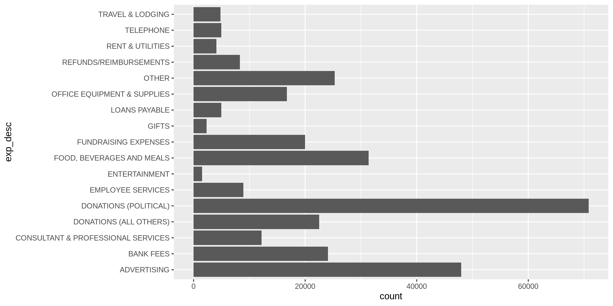
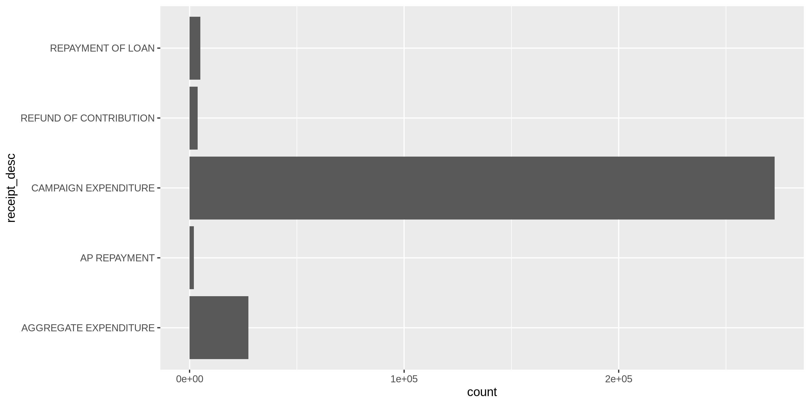
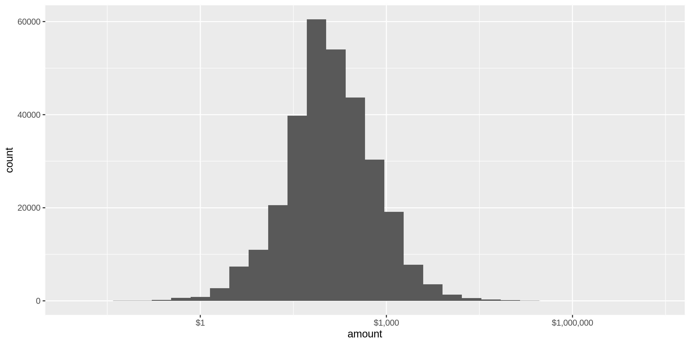
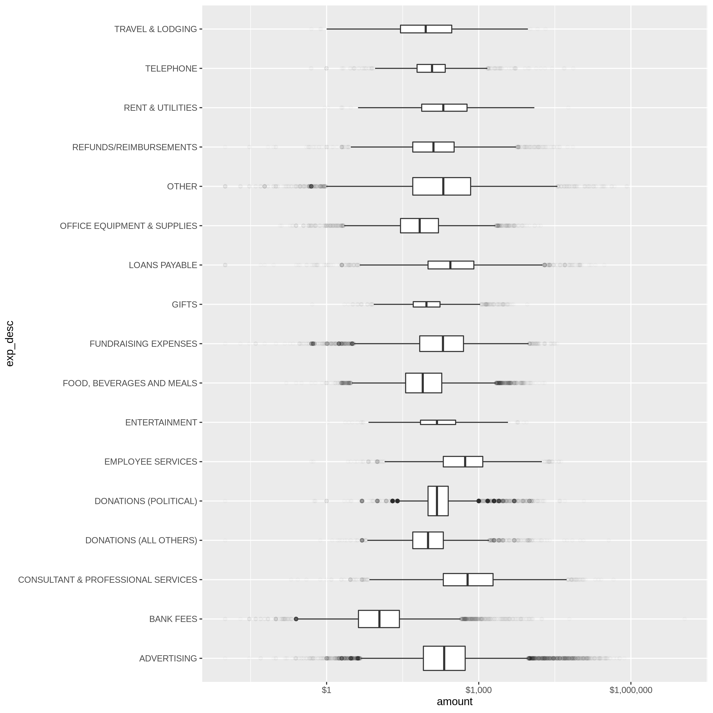
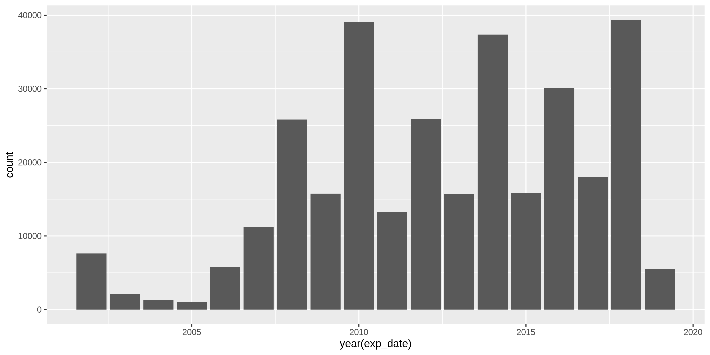
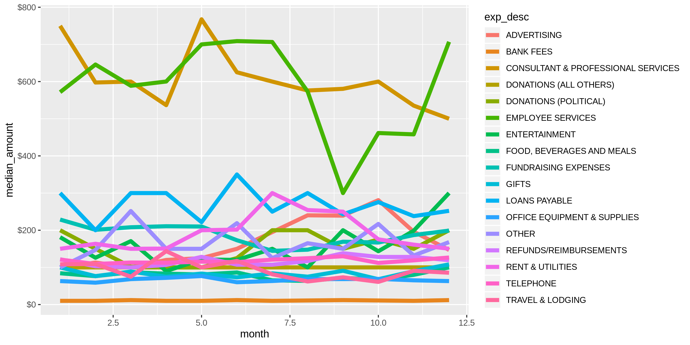

Rhode Island Expenditures
================
Kiernan Nicholls
2022-11-06 10:34:59

-   <a href="#project" id="toc-project">Project</a>
-   <a href="#objectives" id="toc-objectives">Objectives</a>
-   <a href="#packages" id="toc-packages">Packages</a>
-   <a href="#data" id="toc-data">Data</a>
-   <a href="#import" id="toc-import">Import</a>
-   <a href="#explore" id="toc-explore">Explore</a>
-   <a href="#wrangle" id="toc-wrangle">Wrangle</a>
-   <a href="#conclude" id="toc-conclude">Conclude</a>
-   <a href="#export" id="toc-export">Export</a>

## Project

The Accountability Project is an effort to cut across data silos and
give journalists, policy professionals, activists, and the public at
large a simple way to search across huge volumes of public data about
people and organizations.

Our goal is to standardizing public data on a few key fields by thinking
of each dataset row as a transaction. For each transaction there should
be (at least) 3 variables:

1.  All **parties** to a transaction
2.  The **date** of the transaction
3.  The **amount** of money involved

## Objectives

This document describes the process used to complete the following
objectives:

1.  How many records are in the database?
2.  Check for duplicates
3.  Check ranges
4.  Is there anything blank or missing?
5.  Check for consistency issues
6.  Create a five-digit ZIP Code called `ZIP5`
7.  Create a `YEAR` field from the transaction date
8.  Make sure there is data on both parties to a transaction

## Packages

The following packages are needed to collect, manipulate, visualize,
analyze, and communicate these results. The `pacman` package will
facilitate their installation and attachment.

``` r
if (!require("pacman")) install.packages("pacman")
pacman::p_load_current_gh("irworkshop/campfin")
pacman::p_load(
  stringdist, # levenshtein value
  tidyverse, # data manipulation
  RSelenium, # remote browsing
  lubridate, # datetime strings
  magrittr, # pipe opperators
  janitor, # dataframe clean
  zipcode, # clean & database
  refinr, # cluster and merge
  scales, # number formatting
  knitr, # knit documents
  here, # relative storage
  glue, # combine strings
  fs # search storage 
)

# fix conflict
here <- here::here
```

The IRW’s `campfin` package will also have to be installed from GitHub.
This package contains functions custom made to help facilitate the
processing of campaign finance data.

This document should be run as part of the `R_campfin` project, which
lives as a sub-directory of the more general, language-agnostic
[`irworkshop/accountability_datacleaning`](https://github.com/irworkshop/accountability_datacleaning "TAP repo")
GitHub repository.

The `R_campfin` project uses the [RStudio
projects](https://support.rstudio.com/hc/en-us/articles/200526207-Using-Projects "Rproj")
feature and should be run as such. The project also uses the dynamic
`here::here()` tool for file paths relative to *your* machine.

``` r
# where dfs this document knit?
here::here()
#> [1] "/Users/yanqixu/code/accountability_datacleaning"
```

## Data

Data comes from the [Rhode Island Board of
Elections](http://www.elections.ri.gov/finance/publicinfo/ "ri_boe").
Each records tracks a single expenditure as reported by the campaign.

### About

> The Expenditures tab allows you to run ad-hoc reports on expenditures
> filed on Summary of Campaign Activity (CF-2) reports. The reports
> allow a certain degree of customization in that you are able to
> specify certain filters to limit what appears on the reports.

## Import

### Download

``` r
# create a directory for the raw data
raw_dir <- here("state","ri", "expends", "data", "raw")
dir_create(raw_dir)
```

To download the file, we can create our own URL and navigate to the page
using the `RSelenium` package.The last update was `2019-07-30`, and this
round of update covers the period from `2019-07-31` to `2022-11-04`. The
next update should start from `2022-11-05`.

``` r
url <- str_c(
  "http://ricampaignfinance.com/RIPublic/Reporting/ExpenditureReport.aspx?OrgID=0",
  "BeginDate=07/31/2019",
  "EndDate=11/04/2022",
  "LastName=",
  "FirstName=",
  "ContType=0",
  "State=",
  "City=",
  "ZIPCode=",
  "Amount=0",
  "ReportType=Expend",
  "CFStatus=F",
  "MPFStatus=F",
  "Level=S",
  "SumBy=Type",
  "Sort1=None",
  "Direct1=asc",
  "Sort2=None",
  "Direct2=asc",
  "Sort3=None",
  "Direct3=asc",
  "Site=Public",
  "Incomplete=A",
  "ContSource=CF",
  sep = "&"
)

# open the driver with auto download options
remote_driver <- rsDriver(
  port = 4440L,
  browser = "firefox",
  extraCapabilities = makeFirefoxProfile(
    list(
      browser.download.dir = raw_dir,
      browser.download.folderList = 2L,
      browser.helperApps.neverAsk.saveToDisk = "text/csv"
    )
  )
)

# navigate to the APOC download site
remote_browser <- remote_driver$client
remote_browser$navigate(url)

# click the export button
remote_browser$findElement("css", "#lnkExport")$clickElement()

# switch to pop up window
pop_up <- remote_driver$client$getWindowHandles()[[2]]
remote_driver$client$switchToWindow(windowId = pop_up)

# click the download option button
csv_button <- remote_browser$findElement("css", "#hypFileDownload")$clickElement()

# close the browser and driver
remote_browser$close()
remote_driver$server$stop()
```

### Read

``` r
ri <- read_csv(
  file = dir_ls(raw_dir),
  col_types = cols(
    .default = col_character(),
    ExpDate = col_date("%m/%d/%Y"),
    Amount = col_double(),
    OSAP =  col_double(),
    ZeroedByCF7 = col_logical()
  )
)

ri <- ri %>% 
  clean_names() %>% 
  mutate_if(is_character, str_to_upper) %>% 
  mutate_if(is_character, str_squish)
```

## Explore

There are 90,278 records of 21 variables in the full database.

``` r
glimpse(sample_frac(ri))
```

    #> Rows: 90,278
    #> Columns: 21
    #> $ organization_name   <chr> "CHRISTOPHER T MILLEA", "CASWELL COOKE JR.", "SETH MAGAZINER", "RI AL…
    #> $ expenditure_id      <chr> "373541", "436971", "382947", "418823", "417953", "442148", "357770",…
    #> $ disb_desc           <chr> "CAMPAIGN EXPENDITURE", "CAMPAIGN EXPENDITURE", "CAMPAIGN EXPENDITURE…
    #> $ exp_desc            <chr> "FOOD, BEVERAGES AND MEALS", "ADVERTISING", "RENT & UTILITIES", "OTHE…
    #> $ exp_pmt_desc        <chr> "CHECK", "CHECK", "CHECK", "CHECK", "CHECK", "CHECK", "CHECK", "CHECK…
    #> $ incomplete_desc     <chr> NA, NA, NA, NA, NA, NA, NA, NA, NA, NA, NA, NA, NA, NA, NA, NA, NA, N…
    #> $ view_incomplete     <chr> "INCOMPLETE", "INCOMPLETE", "INCOMPLETE", "INCOMPLETE", "INCOMPLETE",…
    #> $ exp_date            <date> 2020-09-11, 2022-10-01, 2020-12-22, 2022-06-15, 2022-06-22, 2022-10-…
    #> $ pmt_date            <chr> NA, NA, NA, NA, NA, NA, NA, NA, NA, NA, NA, NA, NA, NA, NA, NA, NA, N…
    #> $ amount              <dbl> 552.04, 517.49, 118.00, 399.90, 179.63, 26.61, 27.92, 3.00, 250.00, 2…
    #> $ full_name           <chr> "PJ'S PUB", "COASTAL GRAPHICS", "USPS", "SEIU COPE", "ALAMO", "VANTIV…
    #> $ address             <chr> "1139 PONTIAC AVE", "83 TOM HARVEY ROAD UNIT 5 BLDG C", "2 EXCHANGE T…
    #> $ city_st_zip         <chr> "CRANSTON, RI 02920", "WESTERLY, RI 02891", "PROVIDENCE, RI 02903", "…
    #> $ receipt_desc        <chr> "CAMPAIGN EXPENDITURE", "CAMPAIGN EXPENDITURE", "CAMPAIGN EXPENDITURE…
    #> $ expenditure_code_id <chr> "10", "2", "31", "28", "27", "12", "10", "4", "7", "28", "2", "32", "…
    #> $ begin_date          <chr> "07/31/2019", "07/31/2019", "07/31/2019", "07/31/2019", "07/31/2019",…
    #> $ end_date            <chr> "11/04/2022", "11/04/2022", "11/04/2022", "11/04/2022", "11/04/2022",…
    #> $ mpf_used            <chr> "-1", "-1", "-1", "-1", "-1", "-1", "-1", "-1", "-1", "-1", "-1", "-1…
    #> $ osap                <dbl> 552.04, 517.49, 118.00, 399.90, 179.63, 26.61, 27.92, 3.00, 250.00, 2…
    #> $ zeroed_by_cf7       <lgl> FALSE, FALSE, FALSE, FALSE, FALSE, FALSE, FALSE, FALSE, FALSE, FALSE,…
    #> $ ricf7filing_id      <chr> "0", "0", "0", "0", "0", "0", "0", "0", "0", "0", "0", "0", "0", "0",…

### Distinct

The variables range in their degree of distinctness.

``` r
col_stats(ri,n_distinct)
```

    #> # A tibble: 21 × 4
    #>    col                 class      n         p
    #>    <chr>               <chr>  <int>     <dbl>
    #>  1 organization_name   <chr>   1489 0.0165   
    #>  2 expenditure_id      <chr>  90278 1        
    #>  3 disb_desc           <chr>      5 0.0000554
    #>  4 exp_desc            <chr>     17 0.000188 
    #>  5 exp_pmt_desc        <chr>      1 0.0000111
    #>  6 incomplete_desc     <chr>      1 0.0000111
    #>  7 view_incomplete     <chr>      1 0.0000111
    #>  8 exp_date            <date>  1190 0.0132   
    #>  9 pmt_date            <chr>    228 0.00253  
    #> 10 amount              <dbl>  20043 0.222    
    #> 11 full_name           <chr>  15431 0.171    
    #> 12 address             <chr>  15348 0.170    
    #> 13 city_st_zip         <chr>   2914 0.0323   
    #> 14 receipt_desc        <chr>      5 0.0000554
    #> 15 expenditure_code_id <chr>     17 0.000188 
    #> 16 begin_date          <chr>      1 0.0000111
    #> 17 end_date            <chr>      1 0.0000111
    #> 18 mpf_used            <chr>      1 0.0000111
    #> 19 osap                <dbl>  19967 0.221    
    #> 20 zeroed_by_cf7       <lgl>      2 0.0000222
    #> 21 ricf7filing_id      <chr>    154 0.00171

<!-- -->

<!-- -->

### Missing

The variables also vary in their degree of values that are `NA`
(missing).

``` r
ri %>% glimpse_fun(count_na)
```

    #> # A tibble: 21 × 4
    #>    col                 type       n      p
    #>    <chr>               <chr>  <dbl>  <dbl>
    #>  1 organization_name   <chr>      0 0     
    #>  2 expenditure_id      <chr>      0 0     
    #>  3 disb_desc           <chr>      0 0     
    #>  4 exp_desc            <chr>      0 0     
    #>  5 exp_pmt_desc        <chr>      0 0     
    #>  6 incomplete_desc     <chr>  90278 1     
    #>  7 view_incomplete     <chr>      0 0     
    #>  8 exp_date            <date>     0 0     
    #>  9 pmt_date            <chr>  89639 0.993 
    #> 10 amount              <dbl>      0 0     
    #> 11 full_name           <chr>   3658 0.0405
    #> 12 address             <chr>  12856 0.142 
    #> 13 city_st_zip         <chr>  11230 0.124 
    #> 14 receipt_desc        <chr>      0 0     
    #> 15 expenditure_code_id <chr>      0 0     
    #> 16 begin_date          <chr>      0 0     
    #> 17 end_date            <chr>      0 0     
    #> 18 mpf_used            <chr>      0 0     
    #> 19 osap                <dbl>      0 0     
    #> 20 zeroed_by_cf7       <lgl>      0 0     
    #> 21 ricf7filing_id      <chr>      0 0

We will flag any record missing a `full_name` or `address`.

``` r
ri <- ri %>% mutate(na_flag = is.na(full_name) | is.na(address) | is.na(city_st_zip))
```

### Duplicates

We can use `janitor::get_dupes()` to create a table of records
duplicated more than once.

``` r
ri_dupes <- distinct(get_dupes(ri))
nrow(ri_dupes)
#> [1] 0
sum(ri_dupes$dupe_count)
#> [1] 0
```

We can then join this table back with the full dataset, flagging any
duplicated rows with `dupe_flag()`.

``` r
ri <- ri %>%
  left_join(ri_dupes) %>% 
  mutate(dupe_flag = !is.na(dupe_count))

rm(ri_dupes)
```

### Ranges

#### amounts

There are 2144 records with `amount` values less than zero.

``` r
summary(ri$amount)
#>      Min.   1st Qu.    Median      Mean   3rd Qu.      Max. 
#> -125000.0      23.7     100.0     538.4     300.0  410675.0
sum(ri$amount < 0)
#> [1] 2144
```

``` r
ri %>% 
  ggplot(aes(amount)) +
  geom_histogram() +
  scale_x_continuous(trans = "log10", labels = dollar)
```

<!-- -->

``` r
ri %>% 
  ggplot(aes(exp_desc, amount)) +
  geom_boxplot(varwidth = TRUE, outlier.alpha = 0.01) +
  scale_y_continuous(trans = "log10", labels = dollar) +
  coord_flip()
```

<!-- -->

### Dates

There are 0 records with an `exp_date` past 2022-11-06.

``` r
summary(ri$exp_date)
#>         Min.      1st Qu.       Median         Mean      3rd Qu.         Max. 
#> "2019-07-31" "2020-09-01" "2021-08-02" "2021-06-27" "2022-06-03" "2022-11-01"
sum(ri$exp_date > today())
#> [1] 0
```

<!-- -->

<!-- -->

## Wrangle

Before wrangling the data, we need to separate the `city_st_zip`
variable into it’s respective parts.

``` r
ri <- ri %>% 
  separate(
    col = city_st_zip,
    into = c("city_sep", "state_zip"),
    sep = ",\\s",
    remove = FALSE
  ) %>% 
  separate(
    col = state_zip,
    into = c("state_sep", "zip_sep"),
    sep = "\\s",
    remove = TRUE
  )
```

### Year

We can create an `exp_year` variable from the `exp_date` using
`lubridate::year()` (after parsing the string with `readr::col_date()`).

``` r
ri <- mutate(ri, exp_year = year(exp_date))
```

### Address

The `address` variable should be minimally cleaned using the
`campfin::normal_address()` to simplify text and expand abbreviations.

``` r
ri <- ri %>% 
  mutate(
    address_clean = normal_address(
      address = address,
      abbs = usps_street,
      na_rep = TRUE
    )
  )

ri %>% 
  filter(address_clean != address) %>% 
  select(address, address_clean) %>% 
  sample_n(10)
```

    #> # A tibble: 10 × 2
    #>    address                     address_clean             
    #>    <chr>                       <chr>                     
    #>  1 ATWOOD AVENUE               ATWOOD AVE                
    #>  2 22 AMFLEX DRIVE             22 AMFLEX DR              
    #>  3 957 MAIN STREET             957 MAIN ST               
    #>  4 165 DYERVILLE AVENUE        165 DYERVILLE AVE         
    #>  5 P.O. BOX 182051             PO BOX 182051             
    #>  6 119 KENYON AVENUE           119 KENYON AVE            
    #>  7 450 VETERANS MEMORIAL PKY   450 VETERANS MEMORIAL PKWY
    #>  8 275 SACRAMENTO ST 4TH FLOOR 275 SACRAMENTO ST 4TH FL  
    #>  9 984 YORK AVENUE             984 YORK AVE              
    #> 10 7 FORSYTH ST.               7 FORSYTH ST

### ZIP

We can do the same to ZIP codes using `campfin::normal_zip()`.

``` r
n_distinct(ri$zip_sep)
#> [1] 1618
mean(na.omit(ri$zip_sep) %in% valid_zip)
#> [1] 0.967351

ri <- ri %>% 
  mutate(
    zip_clean = normal_zip(
      zip = zip_sep, 
      na_rep = TRUE
    )
  )

mean(is.na(ri$zip_clean))
#> [1] 0.2705975
n_distinct(ri$zip_clean)
#> [1] 1355
mean(na.omit(ri$zip_clean) %in% valid_zip)
#> [1] 0.9977069
n_distinct(ri$zip_clean[which(ri$zip_clean %out% valid_zip)])
#> [1] 66
```

### State

``` r
n_distinct(ri$state_sep)
#> [1] 89
mean(na.omit(ri$state_sep) %in% valid_state)
#> [1] 0.9984255
setdiff(ri$state_sep, valid_state)
#>  [1] "PAUL"         NA             "ITALY,"       "02806"        "02919"        "ISRAEL,"     
#>  [7] "GREENWICH"    "ON"           "02888"        "ITALY"        "IRELAND"      "02451"       
#> [13] "CHINA,"       "20005"        "02917"        "02920"        "AUSTRALIA,"   "JAMAICA"     
#> [19] "MALTA,"       "BKR4013,"     "02906"        "AB"           "02909"        "AUSTRAILIA"  
#> [25] "NB"           "D.C."         "SWITZERLAND"  "N/"           "DC,"          "RI?"         
#> [31] "ISREAL,"      "NETHERLANDS," "20001"        "ISRAEL"       "NS"           "QC"

ri <- ri %>% 
  mutate(
    state_clean = normal_state(
      state = state_sep,
      abbreviate = TRUE,
      na_rep = TRUE,
      valid = valid_state
    )
  )

n_distinct(ri$state_clean)
#> [1] 54
mean(na.omit(ri$state_clean) %in% valid_state)
#> [1] 1
setdiff(ri$state_clean, valid_state)
#> [1] NA
```

### City

Cleaning city values is the most complicated. This process involves four
steps:

1.  Prepare raw city values by removing invalid data and reducing
    inconsistencies
2.  Match prepared city values with the *actual* city name of that
    record’s ZIP code
3.  swap prepared city values with the ZIP code match *if* only 1 edit
    is needed
4.  Refine swapped city values with key collision and n-gram
    fingerprints

#### Normalize

``` r
n_distinct(ri$city_sep)
#> [1] 1354
mean(ri$city_sep %in% valid_city)
#> [1] 0.8353198
sum(unique(ri$city_sep) %out% valid_city)
#> [1] 571
```

``` r
norm_city <- ri %>% 
  distinct(city_sep, state_clean, zip_clean) %>% 
  mutate(
    city_norm = normal_city(
      city = city_sep %>% str_replace("\\bPROV\\b", "PROVIDENCE"), 
      abbs = usps_city,
      states = c("RI", "DC", "RHODE ISLAND"),
      na = invalid_city,
      na_rep = TRUE
    )
  )
n_distinct(ri$city_norm)
#> [1] 0
mean(ri$city_norm %in% valid_city)
#> [1] NaN
sum(unique(ri$city_norm) %out% valid_city)
#> [1] 0
```

#### Swap

We can further improve normalization by comparing our normalized value
against the expected value for that record’s state abbreviation and ZIP
code. If the normalized value is either an abbreviation for or very
similar to the expected value, we can confidently swap those two.

``` r
norm_city <- norm_city %>% 
  rename(city_raw = city_sep) %>% 
  left_join(
    y = zipcodes,
    by = c(
      "state_clean" = "state",
      "zip_clean" = "zip"
    )
  ) %>% 
  rename(city_match = city) %>% 
  mutate(
    match_abb = is_abbrev(city_norm, city_match),
    match_dist = str_dist(city_norm, city_match),
    city_swap = if_else(
      condition = !is.na(match_dist) & (match_abb | match_dist == 1),
      true = city_match,
      false = city_norm
    )
  ) %>% 
  select(
    -city_match,
    -match_dist,
    -match_abb
  )

ri <- left_join(
  x = ri,
  y = norm_city,
  by = c(
    "city_sep" = "city_raw",
    "state_clean", 
    "zip_clean"
  )
)
```

``` r
ri %>% 
  filter(city_swap != city_norm) %>% 
  count(state_clean, city_sep, city_norm, city_swap) %>% 
  arrange(desc(n))
```

    #> # A tibble: 259 × 5
    #>    state_clean city_sep       city_norm      city_swap           n
    #>    <chr>       <chr>          <chr>          <chr>           <int>
    #>  1 MA          SOMMERVILLE    SOMMERVILLE    SOMERVILLE         91
    #>  2 CA          SAN FRANSISCO  SAN FRANSISCO  SAN FRANCISCO      52
    #>  3 CA          SF             SF             SAN FRANCISCO      37
    #>  4 MN          ST. PAUL PARK  ST PAUL PARK   SAINT PAUL PARK    32
    #>  5 MO          ST LOUIS       ST LOUIS       SAINT LOUIS        32
    #>  6 RI          NORTH KINGSTON NORTH KINGSTON NORTH KINGSTOWN    30
    #>  7 MN          ST PAUL PARK   ST PAUL PARK   SAINT PAUL PARK    29
    #>  8 VA          ALEXNDRIA      ALEXNDRIA      ALEXANDRIA         29
    #>  9 CA          SAN FRISCO     SAN FRISCO     SAN FRANCISCO      28
    #> 10 OH          CINCINNATTI    CINCINNATTI    CINCINNATI         23
    #> # … with 249 more rows

#### Refine

``` r
good_refine <- ri %>% 
  filter(state_clean == "RI") %>% 
  mutate(
    city_refine = city_swap %>% 
      key_collision_merge() %>% 
      n_gram_merge(numgram = 1)
  ) %>% 
  filter(city_refine != city_swap) %>% 
  inner_join(
    y = zipcodes,
    by = c(
      "city_refine" = "city",
      "state_clean" = "state",
      "zip_clean" = "zip"
    )
  )

ri <- ri %>% 
  left_join(good_refine, by = names(.)) %>% 
  mutate(city_refine = coalesce(city_refine, city_swap)) %>% 
  rename(city_clean =city_refine)
```

Each step of the cleaning process reduces the number of distinct city
values.

#### Progress

Our goal for normalization was to increase the proportion of city molues
known to be valid and reduce the total distinct molues by correcting
misspellings.

| stage                                                               | prop_in | n_distinct | prop_na | n_out | n_diff |
|:--------------------------------------------------------------------|--------:|-----------:|--------:|------:|-------:|
| toupper(ri$city_sep) | 0.966| 1354| 0.124| 2723| 552| |ri$city_norm |   0.975 |       1224 |   0.128 |  1938 |    419 |
| ri$city_swap | 0.987| 1048| 0.128| 1003| 238| |ri$city_clean        |   0.988 |       1044 |   0.128 |   967 |    234 |

You can see how the percentage of molid values increased with each
stage.

<!-- -->

More importantly, the number of distinct values decreased each stage. We
were able to confidently change many distinct invalid values to their
valid equivalent.

<!-- -->

Before exporting, we can remove the intermediary normalization columns
and rename all added variables with the \_clean suffix.

``` r
ri <- ri %>% 
  select(
    -city_sep,
    -city_norm,
    -city_swap,
  ) %>% 
  rename_all(~str_remove(., "_raw")) %>% 
  relocate(address_clean, city_clean, state_clean, .before = zip_clean)
```

## Conclude

1.  There are 90278 records in the database
2.  There are 0 records with duplicate values (flagged with `dupe_flag`)
3.  The ranges for dates and amounts are reasonable
4.  Consistency has been improved with `stringr` package and custom
    `campfin::normal_*()` functions
5.  The five-digit `zip_clean` variable has been created with
    `campfin::normal_zip()`
6.  The `year` variable has been created with `lubridate::year()`
7.  There are 13113 records with some missing key value, 15% of the
    total records.

## Export

``` r
proc_dir <- here("state","ri", "expends", "data", "processed")
dir_create(proc_dir)

ri %>% 
  write_csv(
    na = "",
    path = glue("{proc_dir}/ri_expends_clean.csv")
  )
```
