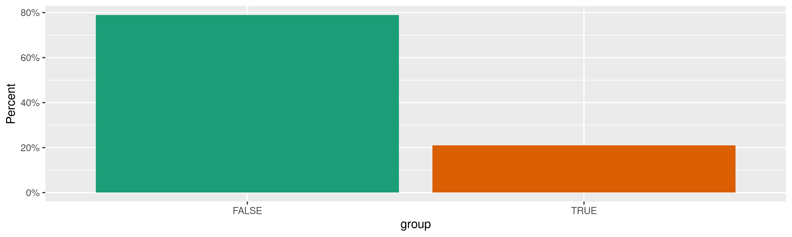
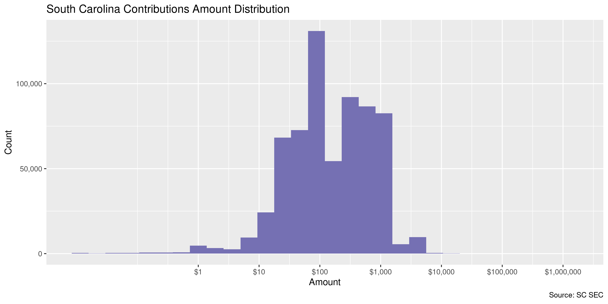
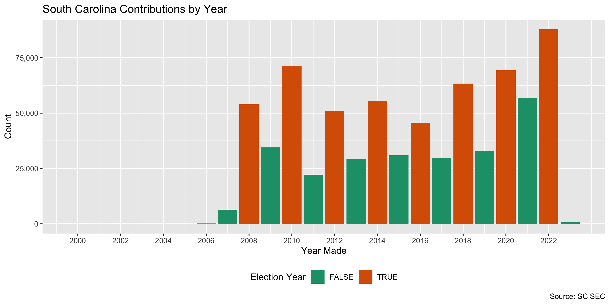
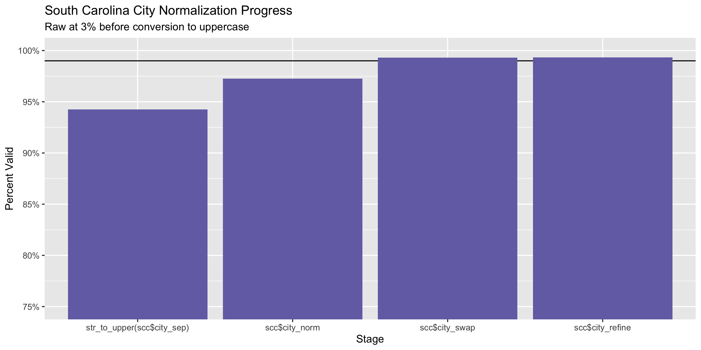
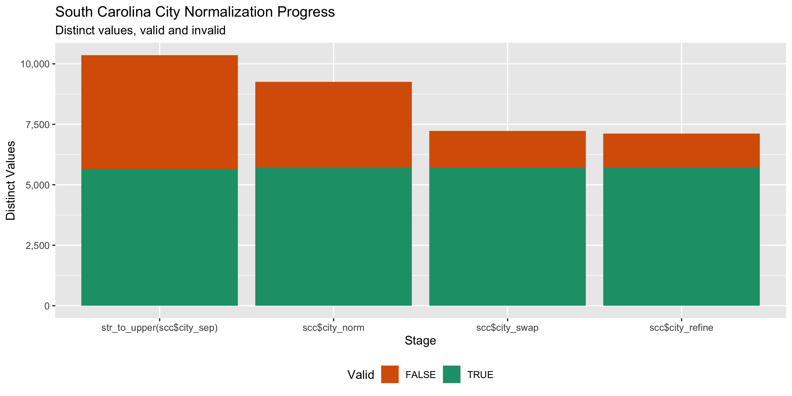

South Carolina Contributions
================
Kiernan Nicholls & Aarushi Sahejpal
Fri Mar 24 20:55:01 2023

- <a href="#project" id="toc-project">Project</a>
- <a href="#objectives" id="toc-objectives">Objectives</a>
- <a href="#packages" id="toc-packages">Packages</a>
- <a href="#source" id="toc-source">Source</a>
- <a href="#download" id="toc-download">Download</a>
- <a href="#read" id="toc-read">Read</a>
- <a href="#explore" id="toc-explore">Explore</a>
  - <a href="#missing" id="toc-missing">Missing</a>
  - <a href="#duplicates" id="toc-duplicates">Duplicates</a>
  - <a href="#categorical" id="toc-categorical">Categorical</a>
  - <a href="#amounts" id="toc-amounts">Amounts</a>
  - <a href="#dates" id="toc-dates">Dates</a>
- <a href="#wrangle" id="toc-wrangle">Wrangle</a>
  - <a href="#address" id="toc-address">Address</a>
  - <a href="#zip" id="toc-zip">ZIP</a>
  - <a href="#state" id="toc-state">State</a>
  - <a href="#city" id="toc-city">City</a>
- <a href="#conclude" id="toc-conclude">Conclude</a>
- <a href="#export" id="toc-export">Export</a>
- <a href="#upload" id="toc-upload">Upload</a>

<!-- Place comments regarding knitting here -->

## Project

The Accountability Project is an effort to cut across data silos and
give journalists, policy professionals, activists, and the public at
large a simple way to search across huge volumes of public data about
people and organizations.

Our goal is to standardize public data on a few key fields by thinking
of each dataset row as a transaction. For each transaction there should
be (at least) 3 variables:

1.  All **parties** to a transaction.
2.  The **date** of the transaction.
3.  The **amount** of money involved.

## Objectives

This document describes the process used to complete the following
objectives:

1.  How many records are in the database?
2.  Check for entirely duplicated records.
3.  Check ranges of continuous variables.
4.  Is there anything blank or missing?
5.  Check for consistency issues.
6.  Create a five-digit ZIP Code called `zip`.
7.  Create a `year` field from the transaction date.
8.  Make sure there is data on both parties to a transaction.

## Packages

The following packages are needed to collect, manipulate, visualize,
analyze, and communicate these results. The `pacman` package will
facilitate their installation and attachment.

``` r
if (!require("pacman")) {
  install.packages("pacman")
}
pacman::p_load(
  tidyverse, # data manipulation
  lubridate, # datetime strings
  jsonlite, # read json data
  gluedown, # printing markdown
  janitor, # clean data frames
  campfin, # custom irw tools
  aws.s3, # aws cloud storage
  refinr, # cluster & merge
  scales, # format strings
  knitr, # knit documents
  vroom, # fast reading
  rvest, # scrape html
  glue, # code strings
  here, # project paths
  httr, # http requests
  fs # local storage 
)
```

This diary was run using `campfin` version 1.0.8.

``` r
packageVersion("campfin")
#> [1] '1.0.8'
```

This document should be run as part of the `R_tap` project, which lives
as a sub-directory of the more general, language-agnostic
[`irworkshop/accountability_datacleaning`](https://github.com/irworkshop/accountability_datacleaning)
GitHub repository.

The `R_tap` project uses the [RStudio
projects](https://support.rstudio.com/hc/en-us/articles/200526207-Using-Projects)
feature and should be run as such. The project also uses the dynamic
`here::here()` tool for file paths relative to *your* machine.

``` r
# where does this document knit?
here::i_am("sc/contribs/docs/sc_contribs_diary.Rmd")
```

## Source

South Carolina contribution data can be obtained from the [State Ethics
Commission](https://ethics.sc.gov/), which operates a [search
portal](https://ethicsfiling.sc.gov/public/campaign-reports/contributions).

## Download

We can use the **Advance Search** functions of the portal to request all
contributions made between two dates. We will request all contributions
since the year 2000 and save the results to a local JSON file.

``` r
raw_dir <- dir_create(here("sc", "contribs", "data", "raw"))
raw_json <- path(raw_dir, "Contribution-Search-Results.xlsx")
```

``` r
if (!file_exists(raw_json)) {
  a <- POST(
    url = "https://ethicsfiling.sc.gov/api/Candidate/Contribution/Search/",
    encode = "json",
    write_disk(path = raw_json),
    progress(type = "down"),
    body = list(
      amountMax = 0,
      amountMin = 0,
      candidate = "",
      contributionDateMax = Sys.Date(), # thru today
      contributionDateMin = "2000-01-01T05:00:00.000Z",
      contributionDescription = "",
      contributorCity = "",
      contributorName = "",
      contributorOccupation = "",
      contributorZip = NULL,
      officeRun = ""
    )
  )
}
```

## Read

The JSON file can be read as a flat table with the `fromJSON()`
function.

``` r
scc <- as_tibble(fromJSON(raw_json))
scc <- clean_names(scc, case = "snake")
```

The columns must be parsed after the fact.

``` r
scc <- scc %>% 
  mutate(
    across(ends_with("date"), as_date),
    across(group, function(x) x == "Yes"),
    across(where(is_character), str_trim),
    across(where(is_character), na_if, "")
  )
```

## Explore

There are 741,401 rows of 13 columns. Each record represents a single
contribution made from an individual to a campaign.

``` r
glimpse(scc)
#> Rows: 741,401
#> Columns: 13
#> $ contribution_id        <int> 509104, 4609, 440609, 1239354, 1239370, 1159100, 1118020, 1159103, 1153698, 1158996, 11…
#> $ office_run_id          <int> 13591, 1235, 13591, 47098, 47098, 47098, 47098, 47098, 47098, 47098, 47098, 47098, 4709…
#> $ candidate_id           <int> 1792, 1208, 1792, 31409, 31409, 31409, 31409, 31409, 31409, 31409, 31409, 31409, 31409,…
#> $ date                   <date> 2014-01-10, 2008-02-29, 2013-01-03, 2020-10-15, 2020-10-24, 2020-05-05, 2020-03-20, 20…
#> $ amount                 <dbl> 300.00, 1000.00, 300.00, 50.00, 100.00, 500.00, 1000.00, 500.00, 20.00, 20.00, 50.00, 7…
#> $ candidate_name         <chr> "Phillip Owens", "Phillip Shoopman", "Phillip Owens", "ernest mccord Jr.", "ernest mcco…
#> $ office_name            <chr> "SC House of Representatives District 5", "SC Senate District 5", "SC House of Represen…
#> $ election_date          <date> 2014-11-04, 2008-06-10, 2014-11-04, 2020-11-03, 2020-11-03, 2020-11-03, 2020-11-03, 20…
#> $ contributor_name       <chr> "Joel Ledbetter", "John Mulvaney", "Joel Ledbetter", "Terese Parker", "Derrick Gunter",…
#> $ contributor_occupation <chr> "Manager", "Real Estate Developer", "Manager", "Not Employed", "Electronic Technician",…
#> $ group                  <lgl> FALSE, FALSE, FALSE, FALSE, FALSE, FALSE, FALSE, FALSE, FALSE, FALSE, FALSE, FALSE, FAL…
#> $ contributor_address    <chr> "PO Box 619  Easley, SC 29641", "518 Ralph Hood Road  Indian Land, SC 29707", "PO Box 6…
#> $ description            <chr> NA, NA, NA, NA, NA, NA, NA, NA, NA, NA, NA, NA, NA, NA, NA, NA, NA, NA, NA, NA, "Act Bl…
tail(scc)
#> # A tibble: 6 × 13
#>   contribution_id office_ru…¹ candi…² date       amount candi…³ offic…⁴ election…⁵ contr…⁶ contr…⁷ group contr…⁸ descr…⁹
#>             <int>       <int>   <int> <date>      <dbl> <chr>   <chr>   <date>     <chr>   <chr>   <lgl> <chr>   <chr>  
#> 1           38210        1491    1464 2008-06-11  500   Rubin … SC Hou… 2008-06-10 THE ST… <NA>    TRUE  61 BRO… <NA>   
#> 2           38207        1491    1464 2008-06-11  100   Rubin … SC Hou… 2008-06-10 R. HUN… ATTORN… FALSE P.O.BO… <NA>   
#> 3          293936        6037    1464 2011-07-14   67.5 Rubin … SC Hou… 2010-11-02 Region… <NA>    TRUE  11004 … <NA>   
#> 4          429367       11870    1700 2012-06-08  500   Curtis… SC Hou… 2012-05-29 ECHO    <NA>    TRUE  808 Kn… <NA>   
#> 5          429364       11870    1700 2012-06-08   25   Curtis… SC Hou… 2012-05-29 Elizab… Secret… FALSE P.O. B… <NA>   
#> 6          429368       11870    1700 2012-06-11 1000   Curtis… SC Hou… 2012-05-29 SC Soc… <NA>    TRUE  P.O. B… <NA>   
#> # … with abbreviated variable names ¹​office_run_id, ²​candidate_id, ³​candidate_name, ⁴​office_name, ⁵​election_date,
#> #   ⁶​contributor_name, ⁷​contributor_occupation, ⁸​contributor_address, ⁹​description
```

### Missing

Columns vary in their degree of missing values.

``` r
col_stats(scc, count_na)
#> # A tibble: 13 × 4
#>    col                    class       n         p
#>    <chr>                  <chr>   <int>     <dbl>
#>  1 contribution_id        <int>       0 0        
#>  2 office_run_id          <int>       0 0        
#>  3 candidate_id           <int>       0 0        
#>  4 date                   <date>      0 0        
#>  5 amount                 <dbl>       0 0        
#>  6 candidate_name         <chr>       0 0        
#>  7 office_name            <chr>       0 0        
#>  8 election_date          <date>      0 0        
#>  9 contributor_name       <chr>       9 0.0000121
#> 10 contributor_occupation <chr>  147250 0.199    
#> 11 group                  <lgl>       0 0        
#> 12 contributor_address    <chr>       0 0        
#> 13 description            <chr>  728765 0.983
```

We can flag any record missing a key variable needed to identify a
transaction.

``` r
key_vars <- c("date", "contributor_name", "amount", "candidate_name")
```

Only the `contributor_occupation` and `description` columns are missing
data.

### Duplicates

We can also flag any record completely duplicated across every column.

``` r
scc <- flag_dupes(scc, -contribution_id)
sum(scc$dupe_flag)
#> [1] 7431
mean(scc$dupe_flag)
#> [1] 0.01002292
```

``` r
scc %>% 
  filter(dupe_flag) %>% 
  select(all_of(key_vars)) %>% 
  arrange(date)
#> # A tibble: 7,431 × 4
#>    date       contributor_name       amount candidate_name 
#>    <date>     <chr>                   <dbl> <chr>          
#>  1 2002-02-28 William McCauley        1000  Joshua Kimbrell
#>  2 2002-02-28 William McCauley        1000  Joshua Kimbrell
#>  3 2007-08-30 unitemized 100 or less   568. Mark Richardson
#>  4 2007-08-30 unitemized 100 or less   568. Mark Richardson
#>  5 2007-09-26 Grover Seaton           1000  Blair Jennings 
#>  6 2007-09-26 Grover Seaton           1000  Blair Jennings 
#>  7 2007-09-29 Doris Brockington        100  Frank Wideman  
#>  8 2007-09-29 Doris Brockington        100  Frank Wideman  
#>  9 2007-10-17 Archie Patterson          25  E Cromartie II 
#> 10 2007-10-17 Archie Patterson          25  E Cromartie II 
#> # … with 7,421 more rows
```

### Categorical

``` r
col_stats(scc, n_distinct)
#> # A tibble: 14 × 4
#>    col                    class       n          p
#>    <chr>                  <chr>   <int>      <dbl>
#>  1 contribution_id        <int>  741401 1         
#>  2 office_run_id          <int>   14747 0.0199    
#>  3 candidate_id           <int>   11491 0.0155    
#>  4 date                   <date>   5879 0.00793   
#>  5 amount                 <dbl>   15531 0.0209    
#>  6 candidate_name         <chr>    8576 0.0116    
#>  7 office_name            <chr>    1337 0.00180   
#>  8 election_date          <date>    550 0.000742  
#>  9 contributor_name       <chr>  297437 0.401     
#> 10 contributor_occupation <chr>   40854 0.0551    
#> 11 group                  <lgl>       2 0.00000270
#> 12 contributor_address    <chr>  368583 0.497     
#> 13 description            <chr>    2309 0.00311   
#> 14 dupe_flag              <lgl>       2 0.00000270
```

<!-- -->

### Amounts

``` r
# fix floating point precision
scc$amount <- round(scc$amount, digits = 2)
```

``` r
summary(scc$amount)
#>      Min.   1st Qu.    Median      Mean   3rd Qu.      Max. 
#>    -250.0      50.0     100.0     374.7     500.0 1127418.1
mean(scc$amount <= 0)
#> [1] 0.000627191
```

These are the records with the minimum and maximum amounts.

``` r
glimpse(scc[c(which.max(scc$amount), which.min(scc$amount)), ])
#> Rows: 2
#> Columns: 14
#> $ contribution_id        <int> 1011202, 1495931
#> $ office_run_id          <int> 295, 20254
#> $ candidate_id           <int> 273, 14040
#> $ date                   <date> 2007-07-07, 2018-04-05
#> $ amount                 <dbl> 1127418, -250
#> $ candidate_name         <chr> "Frank Willis", "Jason Elliott"
#> $ office_name            <chr> "Governor", "SC House of Representatives District 22"
#> $ election_date          <date> 2006-06-13, 2018-06-12
#> $ contributor_name       <chr> "Frank Willis", "Matthew Cotner"
#> $ contributor_occupation <chr> "Contractor", "banker"
#> $ group                  <lgl> FALSE, FALSE
#> $ contributor_address    <chr> "1616 Hillside Ave  Florence, SC 29501", "7 Frontus Street  Greenville, SC 29605"
#> $ description            <chr> NA, NA
#> $ dupe_flag              <lgl> FALSE, FALSE
```

The distribution of amount values are typically log-normal.

<!-- -->

### Dates

We can add the calendar year from `date` with `lubridate::year()`

``` r
scc <- mutate(scc, year = year(date))
```

``` r
min(scc$date)
#> [1] "2000-01-03"
sum(scc$year < 2000)
#> [1] 0
max(scc$date)
#> [1] "2023-03-15"
sum(scc$date > today())
#> [1] 0
```

It’s common to see an increase in the number of contributions in
elections years.

<!-- -->

## Wrangle

To improve the searchability of the database, we will perform some
consistent, confident string normalization. For geographic variables
like city names and ZIP codes, the corresponding `campfin::normal_*()`
functions are tailor made to facilitate this process.

``` r
scc <- extract(
  data = scc,
  col = contributor_address,
  into = c("address_sep", "city_sep", "state_sep", "zip_sep"),
  regex = "^(.*)  (.*), (\\w{2}) (\\d+)$",
  remove = FALSE
)
```

### Address

For the street `addresss` variable, the `campfin::normal_address()`
function will force consistence case, remove punctuation, and abbreviate
official USPS suffixes.

``` r
addr_norm <- scc %>% 
  distinct(address_sep) %>% 
  mutate(
    address_norm = normal_address(
      address = address_sep,
      abbs = usps_street,
      na_rep = TRUE
    )
  )
```

``` r
addr_norm
#> # A tibble: 325,723 × 2
#>    address_sep               address_norm             
#>    <chr>                     <chr>                    
#>  1 PO Box 619                PO BOX 619               
#>  2 518 Ralph Hood Road       518 RALPH HOOD RD        
#>  3 141 Clearview Circle      141 CLEARVIEW CIR        
#>  4 112 Chestnut Street       112 CHESTNUT ST          
#>  5 41 Lameau Dr              41 LAMEAU DR             
#>  6 5148 Maplewood dr         5148 MAPLEWOOD DR        
#>  7 925 Cleveland St Unit 277 925 CLEVELAND ST UNIT 277
#>  8 312 Picadilly Street      312 PICADILLY ST         
#>  9 45 Sacha Lane             45 SACHA LN              
#> 10 615 Morgan St             615 MORGAN ST            
#> # … with 325,713 more rows
```

``` r
scc <- scc %>% 
  left_join(addr_norm, by = "address_sep") %>% 
  select(-address_sep)
```

### ZIP

For ZIP codes, the `campfin::normal_zip()` function will attempt to
create valid *five* digit codes by removing the ZIP+4 suffix and
returning leading zeroes dropped by other programs like Microsoft Excel.

``` r
scc <- scc %>% 
  mutate(
    zip_norm = normal_zip(
      zip = zip_sep,
      na_rep = TRUE
    )
  )
```

``` r
progress_table(
  scc$zip_sep,
  scc$zip_norm,
  compare = valid_zip
)
#> # A tibble: 2 × 6
#>   stage        prop_in n_distinct prop_na n_out n_diff
#>   <chr>          <dbl>      <dbl>   <dbl> <dbl>  <dbl>
#> 1 scc$zip_sep    0.994      12942  0.0263  4289   1162
#> 2 scc$zip_norm   0.995      12896  0.0272  3539   1115
```

``` r
scc %>% 
  filter(zip_sep != zip_norm | !is.na(zip_sep) & is.na(zip_norm)) %>% 
  count(zip_sep, zip_norm, sort = TRUE)
#> # A tibble: 49 × 3
#>    zip_sep   zip_norm     n
#>    <chr>     <chr>    <int>
#>  1 00000     <NA>       633
#>  2 11111     <NA>        35
#>  3 99999     <NA>        22
#>  4 294076256 29407        3
#>  5 294646302 29464        3
#>  6 295788082 29578        3
#>  7 296271502 29627        3
#>  8 296428235 29642        3
#>  9 299125    29912        3
#> 10 334376604 33437        3
#> # … with 39 more rows
```

``` r
scc <- select(scc, -zip_sep)
```

### State

Valid two digit state abbreviations can be made using the
`campfin::normal_state()` function.

``` r
scc <- scc %>% 
  mutate(
    state_norm = normal_state(
      state = state_sep,
      abbreviate = TRUE,
      na_rep = TRUE,
      valid = valid_state
    )
  )
```

``` r
scc %>% 
  filter(state_sep != state_norm | !is.na(state_sep) & is.na(state_norm)) %>% 
  count(state_sep, state_norm, sort = TRUE)
#> # A tibble: 47 × 3
#>    state_sep state_norm     n
#>    <chr>     <chr>      <int>
#>  1 sc        SC           353
#>  2 Sc        SC            41
#>  3 Ga        GA            21
#>  4 So        <NA>          15
#>  5 sC        SC             9
#>  6 Fl        FL             6
#>  7 nc        NC             6
#>  8 ga        GA             5
#>  9 NA        <NA>           5
#> 10 Co        CO             4
#> # … with 37 more rows
```

``` r
progress_table(
  scc$state_sep,
  scc$state_norm,
  compare = valid_state
)
#> # A tibble: 2 × 6
#>   stage          prop_in n_distinct prop_na n_out n_diff
#>   <chr>            <dbl>      <dbl>   <dbl> <dbl>  <dbl>
#> 1 scc$state_sep    0.999        106  0.0263   518     47
#> 2 scc$state_norm   1             59  0.0263     0      1
```

``` r
scc <- select(scc, -state_sep)
```

### City

Cities are the most difficult geographic variable to normalize, simply
due to the wide variety of valid cities and formats.

#### Normal

The `campfin::normal_city()` function is a good start, again converting
case, removing punctuation, but *expanding* USPS abbreviations. We can
also remove `invalid_city` values.

``` r
norm_city <- scc %>% 
  distinct(city_sep, state_norm, zip_norm) %>% 
  mutate(
    city_norm = normal_city(
      city = city_sep, 
      abbs = usps_city,
      states = c("SC", "DC", "SOUTH CAROLINA"),
      na = invalid_city,
      na_rep = TRUE
    )
  )
```

#### Swap

We can further improve normalization by comparing our normalized value
against the *expected* value for that record’s state abbreviation and
ZIP code. If the normalized value is either an abbreviation for or very
similar to the expected value, we can confidently swap those two.

``` r
norm_city <- norm_city %>% 
  rename(city_raw = city_sep) %>% 
  left_join(
    y = zipcodes,
    by = c(
      "state_norm" = "state",
      "zip_norm" = "zip"
    )
  ) %>% 
  rename(city_match = city) %>% 
  mutate(
    match_abb = is_abbrev(city_norm, city_match),
    match_dist = str_dist(city_norm, city_match),
    city_swap = if_else(
      condition = !is.na(match_dist) & (match_abb | match_dist == 1),
      true = city_match,
      false = city_norm
    )
  ) %>% 
  select(
    -city_match,
    -match_dist,
    -match_abb
  )
```

``` r
scc <- left_join(
  x = scc,
  y = norm_city,
  by = c(
    "city_sep" = "city_raw", 
    "state_norm", 
    "zip_norm"
  )
)
```

#### Refine

The [OpenRefine](https://openrefine.org/) algorithms can be used to
group similar strings and replace the less common versions with their
most common counterpart. This can greatly reduce inconsistency, but with
low confidence; we will only keep any refined strings that have a valid
city/state/zip combination.

``` r
good_refine <- scc %>% 
  mutate(
    city_refine = city_swap %>% 
      key_collision_merge() %>% 
      n_gram_merge(numgram = 1)
  ) %>% 
  filter(city_refine != city_swap) %>% 
  inner_join(
    y = zipcodes,
    by = c(
      "city_refine" = "city",
      "state_norm" = "state",
      "zip_norm" = "zip"
    )
  )
```

``` r
good_refine <- good_refine %>% 
  filter(str_detect(city_swap, "^(NORTH|SOUTH|EAST|WEST)", negate = TRUE))
```

    #> # A tibble: 115 × 5
    #>    state_norm zip_norm city_swap         city_refine           n
    #>    <chr>      <chr>    <chr>             <chr>             <int>
    #>  1 SC         29406    NO CHARLESTON     CHARLESTON            6
    #>  2 MD         20878    GAITEHURSBURG     GAITHERSBURG          4
    #>  3 SC         29205    COLUMBIACOLUMBIA  COLUMBIA              4
    #>  4 SC         29585    PAWSLEY ISLAND    PAWLEYS ISLAND        4
    #>  5 CA         92698    ALISA VIE JO      ALISO VIEJO           3
    #>  6 FL         32082    PONTE VERDE BEACH PONTE VEDRA BEACH     3
    #>  7 SC         29365    LYNAM             LYMAN                 3
    #>  8 SC         29512    BENNESTVILLE      BENNETTSVILLE         3
    #>  9 SC         29681    SIMPONSVILLE      SIMPSONVILLE          3
    #> 10 CA         94107    SAN FRANSICO      SAN FRANCISCO         2
    #> # … with 105 more rows

Then we can join the refined values back to the database.

``` r
scc <- scc %>% 
  left_join(good_refine, by = names(.)) %>% 
  mutate(city_refine = coalesce(city_refine, city_swap))
```

#### Progress

Our goal for normalization was to increase the proportion of city values
known to be valid and reduce the total distinct values by correcting
misspellings.

| stage                        | prop_in | n_distinct | prop_na | n_out | n_diff |
|:-----------------------------|--------:|-----------:|--------:|------:|-------:|
| `str_to_upper(scc$city_sep)` |   0.942 |      10355 |   0.026 | 41516 |   4699 |
| `scc$city_norm`              |   0.973 |       9252 |   0.028 | 19701 |   3557 |
| `scc$city_swap`              |   0.993 |       7222 |   0.028 |  4983 |   1505 |
| `scc$city_refine`            |   0.993 |       7119 |   0.028 |  4836 |   1405 |

You can see how the percentage of valid values increased with each
stage.

<!-- -->

More importantly, the number of distinct values decreased each stage. We
were able to confidently change many distinct invalid values to their
valid equivalent.

<!-- -->

Before exporting, we can remove the intermediary normalization columns
and rename all added variables with the `_clean` suffix.

``` r
scc <- scc %>% 
  select(
    -city_norm,
    -city_swap,
    city_clean = city_refine
  ) %>% 
  rename_all(~str_replace(., "_norm", "_clean")) %>% 
  rename_all(~str_remove(., "_raw")) %>% 
  relocate(address_clean, city_clean, state_clean, .before = zip_clean)
```

## Conclude

``` r
glimpse(sample_n(scc, 1000))
#> Rows: 1,000
#> Columns: 20
#> $ contribution_id        <int> 1374319, 579283, 646816, 78667, 1198104, 1334508, 277358, 951844, 494518, 632050, 16719…
#> $ office_run_id          <int> 10902, 15167, 16197, 338, 46597, 45036, 8873, 32756, 9247, 16856, 72261, 71702, 14093, …
#> $ candidate_id           <int> 9215, 11712, 12431, 316, 31051, 27720, 7792, 16351, 5890, 12760, 27353, 45726, 11060, 6…
#> $ date                   <date> 2012-02-29, 2014-06-19, 2014-05-17, 2008-12-08, 2020-06-08, 2020-10-26, 2010-12-02, 20…
#> $ amount                 <dbl> 100.00, 25.00, 100.00, 1500.00, 500.00, 35.00, 30.00, 25.00, 3500.00, 100.00, 100.00, 1…
#> $ candidate_name         <chr> "Joseph McElveen III", "Krystal Dotson", "Thomas Smalls", "Andre Bauer", "Stacey Owens"…
#> $ office_name            <chr> "SC Senate District 35", "Horry County Council", "Hampton Sheriff", "Lieutenant Governo…
#> $ election_date          <date> 2012-11-06, 2014-11-04, 2014-11-04, 2010-06-02, 2020-06-09, 2020-11-03, 2010-12-07, 20…
#> $ contributor_name       <chr> "Emily Bahnmuller", "Cheryl Bell", "Lucinda Bennett", "R. Scott Townes", "Jeff Walker",…
#> $ contributor_occupation <chr> "Teacher", "self-employed", "Self employed", "Carlson Wagonlit Travel", "Accountant/Fin…
#> $ group                  <lgl> FALSE, FALSE, FALSE, FALSE, FALSE, FALSE, FALSE, FALSE, TRUE, FALSE, FALSE, FALSE, FALS…
#> $ contributor_address    <chr> "940 Oak Brook Blvd  Sumter, SC 29150", "PO Box 14108  Surfside Beach, SC 29587", "289 …
#> $ city_sep               <chr> "Sumter", "Surfside Beach", "Estill", "Greenville", "Greer", "Charleston", "ORANGEBURG"…
#> $ description            <chr> NA, NA, NA, NA, NA, NA, NA, NA, NA, NA, NA, NA, NA, NA, NA, NA, NA, NA, NA, NA, NA, NA,…
#> $ dupe_flag              <lgl> FALSE, FALSE, FALSE, FALSE, FALSE, FALSE, FALSE, FALSE, FALSE, FALSE, FALSE, FALSE, FAL…
#> $ year                   <dbl> 2012, 2014, 2014, 2008, 2020, 2020, 2010, 2018, 2013, 2015, 2022, 2022, 2014, 2009, 201…
#> $ address_clean          <chr> "940 OAK BROOK BLVD", "PO BOX 14108", "289 GRAYSON ST", "135 ENDINBURGH CT", "10 CLAYMO…
#> $ city_clean             <chr> "SUMTER", "SURFSIDE BEACH", "ESTILL", "GREENVILLE", "GREER", "CHARLESTON", "ORANGEBURG"…
#> $ state_clean            <chr> "SC", "SC", "SC", "SC", "SC", "SC", "SC", "SC", "GA", "SC", "SC", "SC", "SC", "SC", "GA…
#> $ zip_clean              <chr> "29150", "29587", "29918", "29607", "29650", "29407", "29115", "29730", "31139", "29461…
```

1.  There are 741,401 records in the database.
2.  There are 7,431 duplicate records in the database.
3.  The range and distribution of `amount` and `date` seem reasonable.
4.  There are 0 records missing key variables.
5.  Consistency in geographic data has been improved with
    `campfin::normal_*()`.
6.  The 4-digit `year` variable has been created with
    `lubridate::year()`.

## Export

Now the file can be saved on disk for upload to the Accountability
server. We will name the object using a date range of the records
included.

``` r
min_dt <- str_remove_all(min(scc$date), "-")
max_dt <- str_remove_all(max(scc$date), "-")
csv_ts <- paste(min_dt, max_dt, sep = "-")
```

``` r
clean_dir <- dir_create(here("sc", "contribs", "data", "clean"))
clean_csv <- path(clean_dir, glue("sc_contribs_{csv_ts}.csv"))
clean_rds <- path_ext_set(clean_csv, "rds")
basename(clean_csv)
#> [1] "sc_contribs_20000103-20230315.csv"
```

``` r
write_csv(scc, clean_csv, na = "")
write_rds(scc, clean_rds, compress = "xz")
(clean_size <- file_size(clean_csv))
#> 152M
```

## Upload

We can use the `aws.s3::put_object()` to upload the text file to the IRW
server.

``` r
aws_key <- path("csv", basename(clean_csv))
if (!object_exists(aws_key, "publicaccountability")) {
  put_object(
    file = clean_csv,
    object = aws_key, 
    bucket = "publicaccountability",
    acl = "public-read",
    show_progress = TRUE,
    multipart = TRUE
  )
}
aws_head <- head_object(aws_key, "publicaccountability")
(aws_size <- as_fs_bytes(attr(aws_head, "content-length")))
unname(aws_size == clean_size)
```
