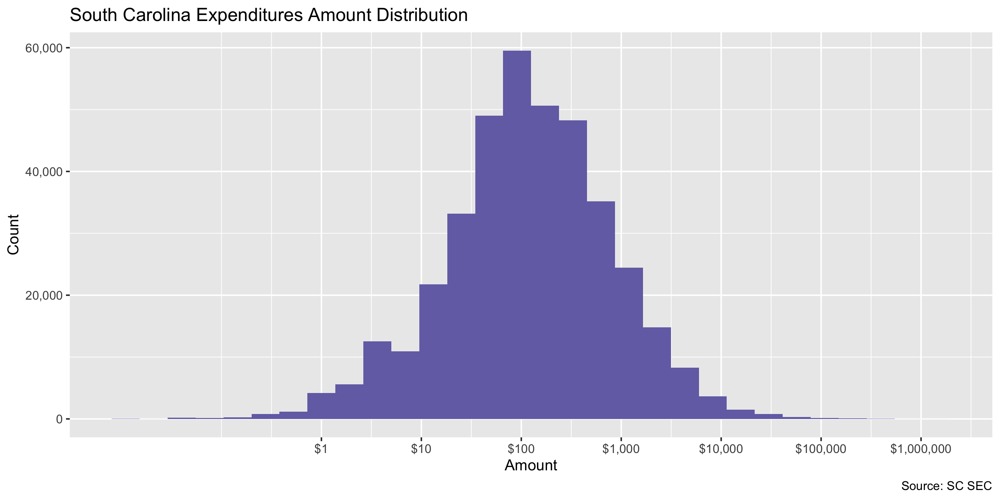
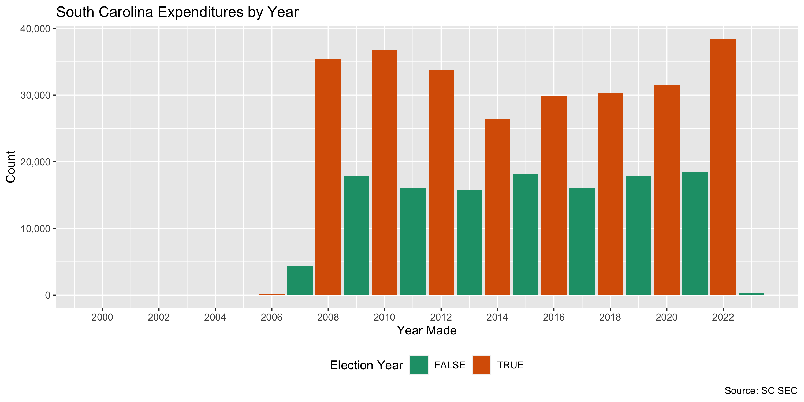

South Carolina Expenditures
================
Kiernan Nicholls & Aarushi Sahejpal
Fri Mar 24 21:21:19 2023

- <a href="#project" id="toc-project">Project</a>
- <a href="#objectives" id="toc-objectives">Objectives</a>
- <a href="#packages" id="toc-packages">Packages</a>
- <a href="#source" id="toc-source">Source</a>
- <a href="#download" id="toc-download">Download</a>
- <a href="#read" id="toc-read">Read</a>
- <a href="#explore" id="toc-explore">Explore</a>
  - <a href="#missing" id="toc-missing">Missing</a>
  - <a href="#duplicates" id="toc-duplicates">Duplicates</a>
  - <a href="#categorical" id="toc-categorical">Categorical</a>
  - <a href="#amounts" id="toc-amounts">Amounts</a>
  - <a href="#dates" id="toc-dates">Dates</a>
- <a href="#wrangle" id="toc-wrangle">Wrangle</a>
  - <a href="#separate" id="toc-separate">Separate</a>
  - <a href="#address" id="toc-address">Address</a>
  - <a href="#zip" id="toc-zip">ZIP</a>
  - <a href="#state" id="toc-state">State</a>
  - <a href="#city" id="toc-city">City</a>
- <a href="#conclude" id="toc-conclude">Conclude</a>
- <a href="#export" id="toc-export">Export</a>
- <a href="#upload" id="toc-upload">Upload</a>

<!-- Place comments regarding knitting here -->

## Project

The Accountability Project is an effort to cut across data silos and
give journalists, policy professionals, activists, and the public at
large a simple way to search across huge volumes of public data about
people and organizations.

Our goal is to standardize public data on a few key fields by thinking
of each dataset row as a transaction. For each transaction there should
be (at least) 3 variables:

1.  All **parties** to a transaction.
2.  The **date** of the transaction.
3.  The **amount** of money involved.

## Objectives

This document describes the process used to complete the following
objectives:

1.  How many records are in the database?
2.  Check for entirely duplicated records.
3.  Check ranges of continuous variables.
4.  Is there anything blank or missing?
5.  Check for consistency issues.
6.  Create a five-digit ZIP Code called `zip`.
7.  Create a `year` field from the transaction date.
8.  Make sure there is data on both parties to a transaction.

## Packages

The following packages are needed to collect, manipulate, visualize,
analyze, and communicate these results. The `pacman` package will
facilitate their installation and attachment.

``` r
if (!require("pacman")) {
  install.packages("pacman")
}
pacman::p_load(
  tidyverse, # data manipulation
  lubridate, # datetime strings
  jsonlite, # read json data
  gluedown, # printing markdown
  janitor, # clean data frames
  campfin, # custom irw tools
  aws.s3, # aws cloud storage
  refinr, # cluster & merge
  scales, # format strings
  knitr, # knit documents
  vroom, # fast reading
  rvest, # scrape html
  glue, # code strings
  here, # project paths
  httr, # http requests
  fs # local storage
)
```

This diary was run using `campfin` version 1.0.8.

``` r
packageVersion("campfin")
#> [1] '1.0.8'
```

This document should be run as part of the `R_tap` project, which lives
as a sub-directory of the more general, language-agnostic
[`irworkshop/accountability_datacleaning`](https://github.com/irworkshop/accountability_datacleaning)
GitHub repository.

The `R_tap` project uses the [RStudio
projects](https://support.rstudio.com/hc/en-us/articles/200526207-Using-Projects)
feature and should be run as such. The project also uses the dynamic
`here::here()` tool for file paths relative to *your* machine.

``` r
# where does this document knit?
here::i_am("sc/expends/docs/sc_expends_diary.Rmd")
```

## Source

South Carolina expenditure data can be obtained from the [State Ethics
Commission](https://ethics.sc.gov/), which operates a [search
portal](https://ethicsfiling.sc.gov/public/campaign-reports/Expenditures).

## Download

We can use the **Advance Search** functions of the portal to request all
Expenditures made between two dates. We will request all Expenditures
since the year 2000 and save the results to a local JSON file.

``` r
raw_dir <- dir_create(here("sc", "expends", "data", "raw"))
raw_json <- path(raw_dir, "Expenditure-Search-Results.xlsx")
```

``` r
if (!file_exists(raw_json)) {
  a <- POST(
    url = "https://ethicsfiling.sc.gov/api/Candidate/Expenditure/Public/Get/All/Advanced/Campaign/Expenditures",
    encode = "json",
    write_disk(path = raw_json),
    progress(type = "down"),
    body = list(
      candidate = "",
      expDesc = "",
      fromamount = 0,
      fromDate = "2000-01-01T05:00:00.000Z",
      toDate = Sys.Date(), # thru today
      office = "",
      toamount = 0,
      vendorCity = "",
      vendorName = "",
      vendorState = "",
      vendorZip = ""
    )
  )
}
```

## Read

The JSON file can be read as a flat table with the `fromJSON()`
function.

``` r
sce <- as_tibble(fromJSON(raw_json))
sce <- clean_names(sce, case = "snake")
```

The columns must be parsed after the fact.

``` r
sce <- sce %>%
  mutate(
    across(ends_with("date"), as_date),
    across(where(is_character), str_trim),
    across(where(is_character), na_if, "")
  )
```

## Explore

There are 387,641 rows of 11 columns. Each record represents a single
contribution made from an individual to a campaign.

``` r
glimpse(sce)
#> Rows: 387,641
#> Columns: 11
#> $ candidate_filer_id <int> 46018, 27486, 27486, 47606, 27462, 46543, 47844, 47618, 47618, 47618, 47618, 47815, 47815, …
#> $ credential_id      <int> 90005, 70863, 70863, 91600, 70820, 90532, 91839, 91612, 91612, 91612, 91612, 91809, 91809, …
#> $ campaign_id        <int> 71928, 44722, 44722, 73061, 44691, 72232, 73161, 73063, 73063, 73063, 73063, 73141, 73141, …
#> $ office             <chr> "School Board Trustee District YORK #4", "SC House of Representatives District 115", "SC Ho…
#> $ candidate_name     <chr> "Bouldin, Elmer \"Wayne\" W Jr", "Dougherty, Eileen W", "Dougherty, Eileen W", "Walsh, Mega…
#> $ exp_date           <date> 2023-03-20, 2023-03-20, 2023-03-20, 2023-03-17, 2023-03-16, 2023-03-14, 2023-03-09, 2023-0…
#> $ exp_id             <int> 889117, 888707, 888710, 889223, 887863, 889043, 888387, 887080, 887082, 887771, 887079, 887…
#> $ vendor_name        <chr> "Foundation For Fort Mill Schools", "Women's Rights Empowerment Network", "USPS", "Susan Ta…
#> $ amount             <dbl> 298.94, 342.78, 4.78, 261.34, 344.60, 285.45, 600.00, 502.01, 26.43, 26.43, 584.71, 14.94, …
#> $ address            <chr> "2233 Deerfield Drive Fort Mill,SC 29715", "1201 Main Street Columbia,SC 29201", "579 Folly…
#> $ exp_desc           <chr> "Donation to 501c3 in order to close out bank account.", "Contribution to 501c3 via cashier…
tail(sce)
#> # A tibble: 6 × 11
#>   candidate_filer_id credential_id campaign_id office           candi…¹ exp_date   exp_id vendo…² amount address exp_d…³
#>                <int>         <int>       <int> <chr>            <chr>   <date>      <int> <chr>    <dbl> <chr>   <chr>  
#> 1              44741         88713       71106 SC House of Rep… Minor,… 2000-01-15 835768 Signs … 2.70e3 11525A… Yard S…
#> 2              44741         88713       71106 SC House of Rep… Minor,… 2000-01-13 835773 Paypal  5.06e0 2211 N… <NA>   
#> 3              44741         88713       71106 SC House of Rep… Minor,… 2000-01-13 835772 Paypal  2.69e0 2211 N… <NA>   
#> 4              44741         88713       71106 SC House of Rep… Minor,… 2000-01-10 835769 Paypal  5.06e0 2211 N… <NA>   
#> 5              44741         88713       71106 SC House of Rep… Minor,… 2000-01-10 835770 Paypal  2.78e0 2211 N… <NA>   
#> 6              44741         88713       71106 SC House of Rep… Minor,… 2000-01-03 835778 Paypal  2.78e0 2211 N… <NA>   
#> # … with abbreviated variable names ¹​candidate_name, ²​vendor_name, ³​exp_desc
```

### Missing

Columns vary in their degree of missing values.

``` r
col_stats(sce, count_na)
#> # A tibble: 11 × 4
#>    col                class      n      p
#>    <chr>              <chr>  <int>  <dbl>
#>  1 candidate_filer_id <int>      0 0     
#>  2 credential_id      <int>      0 0     
#>  3 campaign_id        <int>      0 0     
#>  4 office             <chr>      0 0     
#>  5 candidate_name     <chr>      0 0     
#>  6 exp_date           <date>     0 0     
#>  7 exp_id             <int>      0 0     
#>  8 vendor_name        <chr>      0 0     
#>  9 amount             <dbl>      0 0     
#> 10 address            <chr>      0 0     
#> 11 exp_desc           <chr>   9370 0.0242
```

We can flag any record missing a key variable needed to identify a
transaction.

``` r
key_vars <- c("exp_date", "vendor_name", "amount", "candidate_name")
```

Only the `exp_desc` column is missing data.

### Duplicates

We can also flag any record completely duplicated across every column.

``` r
sce <- flag_dupes(sce, -exp_id)
sum(sce$dupe_flag)
#> [1] 8806
mean(sce$dupe_flag)
#> [1] 0.0227169
```

``` r
sce %>% 
  filter(dupe_flag) %>% 
  select(all_of(key_vars)) %>% 
  arrange(exp_date)
#> # A tibble: 8,806 × 4
#>    exp_date   vendor_name          amount candidate_name       
#>    <date>     <chr>                 <dbl> <chr>                
#>  1 2007-07-12 Liollio & Associates  50    Alexander, Aubry G II
#>  2 2007-07-12 Liollio & Associates  50    Alexander, Aubry G II
#>  3 2007-07-19 Eckerd Drugs           3.61 Long, Ernest B       
#>  4 2007-07-19 Eckerd Drugs           3.61 Long, Ernest B       
#>  5 2007-08-09 Wal-Mart               0.96 Portee, Alvin   Jr.  
#>  6 2007-08-09 Wal-Mart               0.96 Portee, Alvin   Jr.  
#>  7 2007-08-17 Alltel                60.7  Allison, Merita A    
#>  8 2007-08-17 Alltel                60.7  Allison, Merita A    
#>  9 2007-09-03 Wal-Mart               3.48 Portee, Alvin   Jr.  
#> 10 2007-09-03 Wal-Mart               3.48 Portee, Alvin   Jr.  
#> # … with 8,796 more rows
```

### Categorical

``` r
col_stats(sce, n_distinct)
#> # A tibble: 12 × 4
#>    col                class       n          p
#>    <chr>              <chr>   <int>      <dbl>
#>  1 candidate_filer_id <int>   11672 0.0301    
#>  2 credential_id      <int>   11672 0.0301    
#>  3 campaign_id        <int>   15378 0.0397    
#>  4 office             <chr>    1352 0.00349   
#>  5 candidate_name     <chr>    8904 0.0230    
#>  6 exp_date           <date>   5920 0.0153    
#>  7 exp_id             <int>  387641 1         
#>  8 vendor_name        <chr>   87891 0.227     
#>  9 amount             <dbl>   64196 0.166     
#> 10 address            <chr>  118762 0.306     
#> 11 exp_desc           <chr>  105744 0.273     
#> 12 dupe_flag          <lgl>       2 0.00000516
```

### Amounts

``` r
# fix floating point precision
sce$amount <- round(sce$amount, digits = 2)
```

``` r
summary(sce$amount)
#>      Min.   1st Qu.    Median      Mean   3rd Qu.      Max. 
#>   -1480.0      38.2     119.9     780.6     400.0 1296046.7
mean(sce$amount <= 0)
#> [1] 0.0004824051
```

These are the records with the minimum and maximum amounts.

``` r
glimpse(sce[c(which.max(sce$amount), which.min(sce$amount)), ])
#> Rows: 2
#> Columns: 12
#> $ candidate_filer_id <int> 27353, 31623
#> $ credential_id      <int> 70592, 74122
#> $ campaign_id        <int> 72261, 47705
#> $ office             <chr> "Governor", "York County Council"
#> $ candidate_name     <chr> "McMaster, Henry", "Thomas, Kristin C"
#> $ exp_date           <date> 2022-10-24, 2020-10-13
#> $ exp_id             <int> 879539, 664411
#> $ vendor_name        <chr> "National Media Research Planning/Placement", "Super Cheap Signs"
#> $ amount             <dbl> 1296047, -1480
#> $ address            <chr> "815 Slaters Lane Alexandria,VA 22314", "9200 Waterford Centre Blvd, suite 100 Austin,TX 78…
#> $ exp_desc           <chr> "broadcast TV advertising", "refund for undelivered yard signs"
#> $ dupe_flag          <lgl> FALSE, FALSE
```

The distribution of amount values are typically log-normal.

<!-- -->

### Dates

We can add the calendar year from `date` with `lubridate::year()`

``` r
sce <- mutate(sce, exp_year = year(exp_date))
```

``` r
min(sce$exp_date)
#> [1] "2000-01-03"
sum(sce$exp_year < 2000)
#> [1] 0
max(sce$exp_date)
#> [1] "2023-03-20"
sum(sce$exp_date > today())
#> [1] 0
```

It’s common to see an increase in the number of expenditures in
elections years.

<!-- -->

## Wrangle

To improve the searchability of the database, we will perform some
consistent, confident string normalization. For geographic variables
like city names and ZIP codes, the corresponding `campfin::normal_*()`
functions are tailor made to facilitate this process.

### Separate

The addresses in this data are contained in a single string with a comma
separating the city name from the state abbreviation and then a space
before the ZIP code. However, there is no way to easily distinguish the
street address from the city name (given the variety in city name
length, etc).

This issue does not matter too much given the way the Accountability
Project combined street addresses and city names in our variable
mapping. However, we can try and go row by row and check in fact try to
match *every* known city in each state to the address and see if they
match. If we find a match, we will remove the city name from the street
address and place it in its own column.

``` r
sce$address <- str_replace_all(sce$address, "\n", " ")
sce <- extract(
  data = sce,
  col = address,
  into = c("address_sep", "state_sep", "zip_sep"),
  regex = "^(.*),(.*) (.*)$",
  remove = FALSE
)
```

``` r
addr_csv <- here("sc", "expends", "data", "addr.csv")
```

``` r
if (!file_exists(addr_csv)) {
  x <- sce %>% 
    distinct(address, address_sep, state_sep) %>% 
    mutate(
      address_sep = address_sep %>% 
        str_remove_all("[:punct:]") %>% 
        str_to_upper() %>% 
        str_squish(),
      state_sep = normal_state(state_sep, na_rep = TRUE),
      city_sep = NA_character_
    )
  try_city <- rep(list(NA), length(valid_abb))
  names(try_city) <- valid_abb
  for (st in valid_abb) {
    message("\n", st)
    st_city <- zipcodes$city[zipcodes$state == st]
    y <- filter(x, state_sep == st)
    if (nrow(y) > 0) {
      pb <- txtProgressBar(max = nrow(y), style = 3)
      for (i in seq(nrow(y))) {
        find <- NA
        j <- 1
        while(is.na(find) & j < length(st_city)) {
          find <- str_extract(y$address_sep[i], paste0(st_city[j], "$"))
          j <- j + 1
        }
        if (!is.na(find)) {
          y$city_sep[i] <- find
          y$address_sep[i] <- str_squish(str_remove(y$address_sep[i], find))
        }
        setTxtProgressBar(pb, i)
      }
    }
    try_city[[which(st == valid_abb)]] <- y
  }
  try_city <- bind_rows(try_city)
  write_csv(try_city, addr_csv)
} else {
  try_city <- read_csv(addr_csv)
}
#>   |                                                                                                                      |                                                                                                              |   0%  |                                                                                                                      |=                                                                                                             |   1%  |                                                                                                                      |==                                                                                                            |   2%  |                                                                                                                      |===                                                                                                           |   2%  |                                                                                                                      |===                                                                                                           |   3%  |                                                                                                                      |====                                                                                                          |   4%  |                                                                                                                      |=====                                                                                                         |   4%  |                                                                                                                      |=====                                                                                                         |   5%  |                                                                                                                      |======                                                                                                        |   5%  |                                                                                                                      |=======                                                                                                       |   6%  |                                                                                                                      |=======                                                                                                       |   7%  |                                                                                                                      |========                                                                                                      |   7%  |                                                                                                                      |=========                                                                                                     |   8%  |                                                                                                                      |==========                                                                                                    |   9%  |                                                                                                                      |===========                                                                                                   |  10%  |                                                                                                                      |============                                                                                                  |  11%  |                                                                                                                      |=============                                                                                                 |  12%  |                                                                                                                      |==============                                                                                                |  13%  |                                                                                                                      |===============                                                                                               |  13%  |                                                                                                                      |===============                                                                                               |  14%  |                                                                                                                      |================                                                                                              |  15%  |                                                                                                                      |=================                                                                                             |  15%  |                                                                                                                      |=================                                                                                             |  16%  |                                                                                                                      |==================                                                                                            |  16%  |                                                                                                                      |===================                                                                                           |  17%  |                                                                                                                      |===================                                                                                           |  18%  |                                                                                                                      |====================                                                                                          |  18%  |                                                                                                                      |=====================                                                                                         |  19%  |                                                                                                                      |======================                                                                                        |  20%  |                                                                                                                      |=======================                                                                                       |  21%  |                                                                                                                      |========================                                                                                      |  22%  |                                                                                                                      |=========================                                                                                     |  22%  |                                                                                                                      |=========================                                                                                     |  23%  |                                                                                                                      |==========================                                                                                    |  24%  |                                                                                                                      |===========================                                                                                   |  24%  |                                                                                                                      |===========================                                                                                   |  25%  |                                                                                                                      |============================                                                                                  |  25%  |                                                                                                                      |=============================                                                                                 |  26%  |                                                                                                                      |=============================                                                                                 |  27%  |                                                                                                                      |==============================                                                                                |  27%  |                                                                                                                      |===============================                                                                               |  28%  |                                                                                                                      |================================                                                                              |  29%  |                                                                                                                      |=================================                                                                             |  30%  |                                                                                                                      |==================================                                                                            |  31%  |                                                                                                                      |===================================                                                                           |  32%  |                                                                                                                      |====================================                                                                          |  33%  |                                                                                                                      |=====================================                                                                         |  33%  |                                                                                                                      |=====================================                                                                         |  34%  |                                                                                                                      |======================================                                                                        |  35%  |                                                                                                                      |=======================================                                                                       |  35%  |                                                                                                                      |=======================================                                                                       |  36%  |                                                                                                                      |========================================                                                                      |  36%  |                                                                                                                      |=========================================                                                                     |  37%  |                                                                                                                      |=========================================                                                                     |  38%  |                                                                                                                      |==========================================                                                                    |  38%  |                                                                                                                      |===========================================                                                                   |  39%  |                                                                                                                      |============================================                                                                  |  40%  |                                                                                                                      |=============================================                                                                 |  41%  |                                                                                                                      |==============================================                                                                |  42%  |                                                                                                                      |===============================================                                                               |  42%  |                                                                                                                      |===============================================                                                               |  43%  |                                                                                                                      |================================================                                                              |  44%  |                                                                                                                      |=================================================                                                             |  44%  |                                                                                                                      |=================================================                                                             |  45%  |                                                                                                                      |==================================================                                                            |  45%  |                                                                                                                      |===================================================                                                           |  46%  |                                                                                                                      |===================================================                                                           |  47%  |                                                                                                                      |====================================================                                                          |  47%  |                                                                                                                      |=====================================================                                                         |  48%  |                                                                                                                      |======================================================                                                        |  49%  |                                                                                                                      |=======================================================                                                       |  50%  |                                                                                                                      |========================================================                                                      |  51%  |                                                                                                                      |=========================================================                                                     |  52%  |                                                                                                                      |==========================================================                                                    |  53%  |                                                                                                                      |===========================================================                                                   |  53%  |                                                                                                                      |===========================================================                                                   |  54%  |                                                                                                                      |============================================================                                                  |  55%  |                                                                                                                      |=============================================================                                                 |  55%  |                                                                                                                      |=============================================================                                                 |  56%  |                                                                                                                      |==============================================================                                                |  56%  |                                                                                                                      |===============================================================                                               |  57%  |                                                                                                                      |===============================================================                                               |  58%  |                                                                                                                      |================================================================                                              |  58%  |                                                                                                                      |=================================================================                                             |  59%  |                                                                                                                      |==================================================================                                            |  60%  |                                                                                                                      |===================================================================                                           |  61%  |                                                                                                                      |====================================================================                                          |  62%  |                                                                                                                      |=====================================================================                                         |  62%  |                                                                                                                      |=====================================================================                                         |  63%  |                                                                                                                      |======================================================================                                        |  64%  |                                                                                                                      |=======================================================================                                       |  64%  |                                                                                                                      |=======================================================================                                       |  65%  |                                                                                                                      |========================================================================                                      |  65%  |                                                                                                                      |=========================================================================                                     |  66%  |                                                                                                                      |=========================================================================                                     |  67%  |                                                                                                                      |==========================================================================                                    |  67%  |                                                                                                                      |===========================================================================                                   |  68%  |                                                                                                                      |============================================================================                                  |  69%  |                                                                                                                      |=============================================================================                                 |  70%  |                                                                                                                      |==============================================================================                                |  71%  |                                                                                                                      |===============================================================================                               |  72%  |                                                                                                                      |================================================================================                              |  73%  |                                                                                                                      |=================================================================================                             |  73%  |                                                                                                                      |=================================================================================                             |  74%  |                                                                                                                      |==================================================================================                            |  75%  |                                                                                                                      |===================================================================================                           |  75%  |                                                                                                                      |===================================================================================                           |  76%  |                                                                                                                      |====================================================================================                          |  76%  |                                                                                                                      |=====================================================================================                         |  77%  |                                                                                                                      |=====================================================================================                         |  78%  |                                                                                                                      |======================================================================================                        |  78%  |                                                                                                                      |=======================================================================================                       |  79%  |                                                                                                                      |========================================================================================                      |  80%  |                                                                                                                      |=========================================================================================                     |  81%  |                                                                                                                      |==========================================================================================                    |  82%  |                                                                                                                      |===========================================================================================                   |  82%  |                                                                                                                      |===========================================================================================                   |  83%  |                                                                                                                      |============================================================================================                  |  84%  |                                                                                                                      |=============================================================================================                 |  84%  |                                                                                                                      |=============================================================================================                 |  85%  |                                                                                                                      |==============================================================================================                |  85%  |                                                                                                                      |===============================================================================================               |  86%  |                                                                                                                      |===============================================================================================               |  87%  |                                                                                                                      |================================================================================================              |  87%  |                                                                                                                      |=================================================================================================             |  88%  |                                                                                                                      |==================================================================================================            |  89%  |                                                                                                                      |===================================================================================================           |  90%  |                                                                                                                      |====================================================================================================          |  91%  |                                                                                                                      |=====================================================================================================         |  92%  |                                                                                                                      |======================================================================================================        |  93%  |                                                                                                                      |=======================================================================================================       |  93%  |                                                                                                                      |=======================================================================================================       |  94%  |                                                                                                                      |========================================================================================================      |  95%  |                                                                                                                      |=========================================================================================================     |  95%  |                                                                                                                      |=========================================================================================================     |  96%  |                                                                                                                      |==========================================================================================================    |  96%  |                                                                                                                      |===========================================================================================================   |  97%  |                                                                                                                      |===========================================================================================================   |  98%  |                                                                                                                      |============================================================================================================  |  98%  |                                                                                                                      |============================================================================================================= |  99%  |                                                                                                                      |==============================================================================================================| 100%  |                                                                                                                      |                                                                                                              |   0%  |                                                                                                                      |===                                                                                                           |   2%  |                                                                                                                      |=====                                                                                                         |   5%  |                                                                                                                      |========                                                                                                      |   7%  |                                                                                                                      |==========                                                                                                    |   9%  |                                                                                                                      |=============                                                                                                 |  12%  |                                                                                                                      |===============                                                                                               |  14%  |                                                                                                                      |==================                                                                                            |  16%  |                                                                                                                      |====================                                                                                          |  19%  |                                                                                                                      |=======================                                                                                       |  21%  |                                                                                                                      |==========================                                                                                    |  23%  |                                                                                                                      |============================                                                                                  |  26%  |                                                                                                                      |===============================                                                                               |  28%  |                                                                                                                      |=================================                                                                             |  30%  |                                                                                                                      |====================================                                                                          |  33%  |                                                                                                                      |======================================                                                                        |  35%  |                                                                                                                      |=========================================                                                                     |  37%  |                                                                                                                      |===========================================                                                                   |  40%  |                                                                                                                      |==============================================                                                                |  42%  |                                                                                                                      |=================================================                                                             |  44%  |                                                                                                                      |===================================================                                                           |  47%  |                                                                                                                      |======================================================                                                        |  49%  |                                                                                                                      |========================================================                                                      |  51%  |                                                                                                                      |===========================================================                                                   |  53%  |                                                                                                                      |=============================================================                                                 |  56%  |                                                                                                                      |================================================================                                              |  58%  |                                                                                                                      |===================================================================                                           |  60%  |                                                                                                                      |=====================================================================                                         |  63%  |                                                                                                                      |========================================================================                                      |  65%  |                                                                                                                      |==========================================================================                                    |  67%  |                                                                                                                      |=============================================================================                                 |  70%  |                                                                                                                      |===============================================================================                               |  72%  |                                                                                                                      |==================================================================================                            |  74%  |                                                                                                                      |====================================================================================                          |  77%  |                                                                                                                      |=======================================================================================                       |  79%  |                                                                                                                      |==========================================================================================                    |  81%  |                                                                                                                      |============================================================================================                  |  84%  |                                                                                                                      |===============================================================================================               |  86%  |                                                                                                                      |=================================================================================================             |  88%  |                                                                                                                      |====================================================================================================          |  91%  |                                                                                                                      |======================================================================================================        |  93%  |                                                                                                                      |=========================================================================================================     |  95%  |                                                                                                                      |===========================================================================================================   |  98%  |                                                                                                                      |==============================================================================================================| 100%  |                                                                                                                      |                                                                                                              |   0%  |                                                                                                                      |=======================================================                                                       |  50%  |                                                                                                                      |==============================================================================================================| 100%  |                                                                                                                      |                                                                                                              |   0%  |                                                                                                                      |=                                                                                                             |   1%  |                                                                                                                      |==                                                                                                            |   2%  |                                                                                                                      |===                                                                                                           |   2%  |                                                                                                                      |===                                                                                                           |   3%  |                                                                                                                      |====                                                                                                          |   3%  |                                                                                                                      |====                                                                                                          |   4%  |                                                                                                                      |=====                                                                                                         |   4%  |                                                                                                                      |=====                                                                                                         |   5%  |                                                                                                                      |======                                                                                                        |   5%  |                                                                                                                      |======                                                                                                        |   6%  |                                                                                                                      |=======                                                                                                       |   6%  |                                                                                                                      |=======                                                                                                       |   7%  |                                                                                                                      |========                                                                                                      |   7%  |                                                                                                                      |=========                                                                                                     |   8%  |                                                                                                                      |=========                                                                                                     |   9%  |                                                                                                                      |==========                                                                                                    |   9%  |                                                                                                                      |===========                                                                                                   |  10%  |                                                                                                                      |============                                                                                                  |  11%  |                                                                                                                      |=============                                                                                                 |  11%  |                                                                                                                      |=============                                                                                                 |  12%  |                                                                                                                      |==============                                                                                                |  13%  |                                                                                                                      |===============                                                                                               |  13%  |                                                                                                                      |===============                                                                                               |  14%  |                                                                                                                      |================                                                                                              |  14%  |                                                                                                                      |================                                                                                              |  15%  |                                                                                                                      |=================                                                                                             |  15%  |                                                                                                                      |=================                                                                                             |  16%  |                                                                                                                      |==================                                                                                            |  16%  |                                                                                                                      |==================                                                                                            |  17%  |                                                                                                                      |===================                                                                                           |  17%  |                                                                                                                      |===================                                                                                           |  18%  |                                                                                                                      |====================                                                                                          |  18%  |                                                                                                                      |=====================                                                                                         |  19%  |                                                                                                                      |======================                                                                                        |  20%  |                                                                                                                      |=======================                                                                                       |  21%  |                                                                                                                      |========================                                                                                      |  22%  |                                                                                                                      |=========================                                                                                     |  22%  |                                                                                                                      |=========================                                                                                     |  23%  |                                                                                                                      |==========================                                                                                    |  23%  |                                                                                                                      |==========================                                                                                    |  24%  |                                                                                                                      |===========================                                                                                   |  24%  |                                                                                                                      |===========================                                                                                   |  25%  |                                                                                                                      |============================                                                                                  |  25%  |                                                                                                                      |============================                                                                                  |  26%  |                                                                                                                      |=============================                                                                                 |  26%  |                                                                                                                      |=============================                                                                                 |  27%  |                                                                                                                      |==============================                                                                                |  27%  |                                                                                                                      |===============================                                                                               |  28%  |                                                                                                                      |===============================                                                                               |  29%  |                                                                                                                      |================================                                                                              |  29%  |                                                                                                                      |=================================                                                                             |  30%  |                                                                                                                      |==================================                                                                            |  31%  |                                                                                                                      |===================================                                                                           |  31%  |                                                                                                                      |===================================                                                                           |  32%  |                                                                                                                      |====================================                                                                          |  33%  |                                                                                                                      |=====================================                                                                         |  33%  |                                                                                                                      |=====================================                                                                         |  34%  |                                                                                                                      |======================================                                                                        |  34%  |                                                                                                                      |======================================                                                                        |  35%  |                                                                                                                      |=======================================                                                                       |  35%  |                                                                                                                      |=======================================                                                                       |  36%  |                                                                                                                      |========================================                                                                      |  36%  |                                                                                                                      |========================================                                                                      |  37%  |                                                                                                                      |=========================================                                                                     |  37%  |                                                                                                                      |=========================================                                                                     |  38%  |                                                                                                                      |==========================================                                                                    |  38%  |                                                                                                                      |===========================================                                                                   |  39%  |                                                                                                                      |============================================                                                                  |  40%  |                                                                                                                      |=============================================                                                                 |  41%  |                                                                                                                      |==============================================                                                                |  42%  |                                                                                                                      |===============================================                                                               |  42%  |                                                                                                                      |===============================================                                                               |  43%  |                                                                                                                      |================================================                                                              |  43%  |                                                                                                                      |================================================                                                              |  44%  |                                                                                                                      |=================================================                                                             |  44%  |                                                                                                                      |=================================================                                                             |  45%  |                                                                                                                      |==================================================                                                            |  45%  |                                                                                                                      |==================================================                                                            |  46%  |                                                                                                                      |===================================================                                                           |  46%  |                                                                                                                      |===================================================                                                           |  47%  |                                                                                                                      |====================================================                                                          |  47%  |                                                                                                                      |=====================================================                                                         |  48%  |                                                                                                                      |=====================================================                                                         |  49%  |                                                                                                                      |======================================================                                                        |  49%  |                                                                                                                      |=======================================================                                                       |  50%  |                                                                                                                      |========================================================                                                      |  51%  |                                                                                                                      |=========================================================                                                     |  51%  |                                                                                                                      |=========================================================                                                     |  52%  |                                                                                                                      |==========================================================                                                    |  53%  |                                                                                                                      |===========================================================                                                   |  53%  |                                                                                                                      |===========================================================                                                   |  54%  |                                                                                                                      |============================================================                                                  |  54%  |                                                                                                                      |============================================================                                                  |  55%  |                                                                                                                      |=============================================================                                                 |  55%  |                                                                                                                      |=============================================================                                                 |  56%  |                                                                                                                      |==============================================================                                                |  56%  |                                                                                                                      |==============================================================                                                |  57%  |                                                                                                                      |===============================================================                                               |  57%  |                                                                                                                      |===============================================================                                               |  58%  |                                                                                                                      |================================================================                                              |  58%  |                                                                                                                      |=================================================================                                             |  59%  |                                                                                                                      |==================================================================                                            |  60%  |                                                                                                                      |===================================================================                                           |  61%  |                                                                                                                      |====================================================================                                          |  62%  |                                                                                                                      |=====================================================================                                         |  62%  |                                                                                                                      |=====================================================================                                         |  63%  |                                                                                                                      |======================================================================                                        |  63%  |                                                                                                                      |======================================================================                                        |  64%  |                                                                                                                      |=======================================================================                                       |  64%  |                                                                                                                      |=======================================================================                                       |  65%  |                                                                                                                      |========================================================================                                      |  65%  |                                                                                                                      |========================================================================                                      |  66%  |                                                                                                                      |=========================================================================                                     |  66%  |                                                                                                                      |=========================================================================                                     |  67%  |                                                                                                                      |==========================================================================                                    |  67%  |                                                                                                                      |===========================================================================                                   |  68%  |                                                                                                                      |===========================================================================                                   |  69%  |                                                                                                                      |============================================================================                                  |  69%  |                                                                                                                      |=============================================================================                                 |  70%  |                                                                                                                      |==============================================================================                                |  71%  |                                                                                                                      |===============================================================================                               |  71%  |                                                                                                                      |===============================================================================                               |  72%  |                                                                                                                      |================================================================================                              |  73%  |                                                                                                                      |=================================================================================                             |  73%  |                                                                                                                      |=================================================================================                             |  74%  |                                                                                                                      |==================================================================================                            |  74%  |                                                                                                                      |==================================================================================                            |  75%  |                                                                                                                      |===================================================================================                           |  75%  |                                                                                                                      |===================================================================================                           |  76%  |                                                                                                                      |====================================================================================                          |  76%  |                                                                                                                      |====================================================================================                          |  77%  |                                                                                                                      |=====================================================================================                         |  77%  |                                                                                                                      |=====================================================================================                         |  78%  |                                                                                                                      |======================================================================================                        |  78%  |                                                                                                                      |=======================================================================================                       |  79%  |                                                                                                                      |========================================================================================                      |  80%  |                                                                                                                      |=========================================================================================                     |  81%  |                                                                                                                      |==========================================================================================                    |  82%  |                                                                                                                      |===========================================================================================                   |  82%  |                                                                                                                      |===========================================================================================                   |  83%  |                                                                                                                      |============================================================================================                  |  83%  |                                                                                                                      |============================================================================================                  |  84%  |                                                                                                                      |=============================================================================================                 |  84%  |                                                                                                                      |=============================================================================================                 |  85%  |                                                                                                                      |==============================================================================================                |  85%  |                                                                                                                      |==============================================================================================                |  86%  |                                                                                                                      |===============================================================================================               |  86%  |                                                                                                                      |===============================================================================================               |  87%  |                                                                                                                      |================================================================================================              |  87%  |                                                                                                                      |=================================================================================================             |  88%  |                                                                                                                      |=================================================================================================             |  89%  |                                                                                                                      |==================================================================================================            |  89%  |                                                                                                                      |===================================================================================================           |  90%  |                                                                                                                      |====================================================================================================          |  91%  |                                                                                                                      |=====================================================================================================         |  91%  |                                                                                                                      |=====================================================================================================         |  92%  |                                                                                                                      |======================================================================================================        |  93%  |                                                                                                                      |=======================================================================================================       |  93%  |                                                                                                                      |=======================================================================================================       |  94%  |                                                                                                                      |========================================================================================================      |  94%  |                                                                                                                      |========================================================================================================      |  95%  |                                                                                                                      |=========================================================================================================     |  95%  |                                                                                                                      |=========================================================================================================     |  96%  |                                                                                                                      |==========================================================================================================    |  96%  |                                                                                                                      |==========================================================================================================    |  97%  |                                                                                                                      |===========================================================================================================   |  97%  |                                                                                                                      |===========================================================================================================   |  98%  |                                                                                                                      |============================================================================================================  |  98%  |                                                                                                                      |============================================================================================================= |  99%  |                                                                                                                      |==============================================================================================================| 100%  |                                                                                                                      |                                                                                                              |   0%  |                                                                                                                      |=                                                                                                             |   1%  |                                                                                                                      |===                                                                                                           |   2%  |                                                                                                                      |====                                                                                                          |   3%  |                                                                                                                      |=====                                                                                                         |   5%  |                                                                                                                      |======                                                                                                        |   6%  |                                                                                                                      |========                                                                                                      |   7%  |                                                                                                                      |=========                                                                                                     |   8%  |                                                                                                                      |==========                                                                                                    |   9%  |                                                                                                                      |===========                                                                                                   |  10%  |                                                                                                                      |=============                                                                                                 |  11%  |                                                                                                                      |==============                                                                                                |  13%  |                                                                                                                      |===============                                                                                               |  14%  |                                                                                                                      |================                                                                                              |  15%  |                                                                                                                      |==================                                                                                            |  16%  |                                                                                                                      |===================                                                                                           |  17%  |                                                                                                                      |====================                                                                                          |  18%  |                                                                                                                      |=====================                                                                                         |  20%  |                                                                                                                      |=======================                                                                                       |  21%  |                                                                                                                      |========================                                                                                      |  22%  |                                                                                                                      |=========================                                                                                     |  23%  |                                                                                                                      |===========================                                                                                   |  24%  |                                                                                                                      |============================                                                                                  |  25%  |                                                                                                                      |=============================                                                                                 |  26%  |                                                                                                                      |==============================                                                                                |  28%  |                                                                                                                      |================================                                                                              |  29%  |                                                                                                                      |=================================                                                                             |  30%  |                                                                                                                      |==================================                                                                            |  31%  |                                                                                                                      |===================================                                                                           |  32%  |                                                                                                                      |=====================================                                                                         |  33%  |                                                                                                                      |======================================                                                                        |  34%  |                                                                                                                      |=======================================                                                                       |  36%  |                                                                                                                      |========================================                                                                      |  37%  |                                                                                                                      |==========================================                                                                    |  38%  |                                                                                                                      |===========================================                                                                   |  39%  |                                                                                                                      |============================================                                                                  |  40%  |                                                                                                                      |==============================================                                                                |  41%  |                                                                                                                      |===============================================                                                               |  43%  |                                                                                                                      |================================================                                                              |  44%  |                                                                                                                      |=================================================                                                             |  45%  |                                                                                                                      |===================================================                                                           |  46%  |                                                                                                                      |====================================================                                                          |  47%  |                                                                                                                      |=====================================================                                                         |  48%  |                                                                                                                      |======================================================                                                        |  49%  |                                                                                                                      |========================================================                                                      |  51%  |                                                                                                                      |=========================================================                                                     |  52%  |                                                                                                                      |==========================================================                                                    |  53%  |                                                                                                                      |===========================================================                                                   |  54%  |                                                                                                                      |=============================================================                                                 |  55%  |                                                                                                                      |==============================================================                                                |  56%  |                                                                                                                      |===============================================================                                               |  57%  |                                                                                                                      |================================================================                                              |  59%  |                                                                                                                      |==================================================================                                            |  60%  |                                                                                                                      |===================================================================                                           |  61%  |                                                                                                                      |====================================================================                                          |  62%  |                                                                                                                      |======================================================================                                        |  63%  |                                                                                                                      |=======================================================================                                       |  64%  |                                                                                                                      |========================================================================                                      |  66%  |                                                                                                                      |=========================================================================                                     |  67%  |                                                                                                                      |===========================================================================                                   |  68%  |                                                                                                                      |============================================================================                                  |  69%  |                                                                                                                      |=============================================================================                                 |  70%  |                                                                                                                      |==============================================================================                                |  71%  |                                                                                                                      |================================================================================                              |  72%  |                                                                                                                      |=================================================================================                             |  74%  |                                                                                                                      |==================================================================================                            |  75%  |                                                                                                                      |===================================================================================                           |  76%  |                                                                                                                      |=====================================================================================                         |  77%  |                                                                                                                      |======================================================================================                        |  78%  |                                                                                                                      |=======================================================================================                       |  79%  |                                                                                                                      |=========================================================================================                     |  80%  |                                                                                                                      |==========================================================================================                    |  82%  |                                                                                                                      |===========================================================================================                   |  83%  |                                                                                                                      |============================================================================================                  |  84%  |                                                                                                                      |==============================================================================================                |  85%  |                                                                                                                      |===============================================================================================               |  86%  |                                                                                                                      |================================================================================================              |  87%  |                                                                                                                      |=================================================================================================             |  89%  |                                                                                                                      |===================================================================================================           |  90%  |                                                                                                                      |====================================================================================================          |  91%  |                                                                                                                      |=====================================================================================================         |  92%  |                                                                                                                      |======================================================================================================        |  93%  |                                                                                                                      |========================================================================================================      |  94%  |                                                                                                                      |=========================================================================================================     |  95%  |                                                                                                                      |==========================================================================================================    |  97%  |                                                                                                                      |===========================================================================================================   |  98%  |                                                                                                                      |============================================================================================================= |  99%  |                                                                                                                      |==============================================================================================================| 100%  |                                                                                                                      |                                                                                                              |   0%  |                                                                                                                      |=                                                                                                             |   0%  |                                                                                                                      |=                                                                                                             |   1%  |                                                                                                                      |==                                                                                                            |   1%  |                                                                                                                      |==                                                                                                            |   2%  |                                                                                                                      |===                                                                                                           |   2%  |                                                                                                                      |===                                                                                                           |   3%  |                                                                                                                      |====                                                                                                          |   3%  |                                                                                                                      |====                                                                                                          |   4%  |                                                                                                                      |=====                                                                                                         |   4%  |                                                                                                                      |=====                                                                                                         |   5%  |                                                                                                                      |======                                                                                                        |   5%  |                                                                                                                      |======                                                                                                        |   6%  |                                                                                                                      |=======                                                                                                       |   6%  |                                                                                                                      |=======                                                                                                       |   7%  |                                                                                                                      |========                                                                                                      |   7%  |                                                                                                                      |========                                                                                                      |   8%  |                                                                                                                      |=========                                                                                                     |   8%  |                                                                                                                      |=========                                                                                                     |   9%  |                                                                                                                      |==========                                                                                                    |   9%  |                                                                                                                      |==========                                                                                                    |  10%  |                                                                                                                      |===========                                                                                                   |  10%  |                                                                                                                      |============                                                                                                  |  10%  |                                                                                                                      |============                                                                                                  |  11%  |                                                                                                                      |=============                                                                                                 |  11%  |                                                                                                                      |=============                                                                                                 |  12%  |                                                                                                                      |==============                                                                                                |  12%  |                                                                                                                      |==============                                                                                                |  13%  |                                                                                                                      |===============                                                                                               |  13%  |                                                                                                                      |===============                                                                                               |  14%  |                                                                                                                      |================                                                                                              |  14%  |                                                                                                                      |================                                                                                              |  15%  |                                                                                                                      |=================                                                                                             |  15%  |                                                                                                                      |=================                                                                                             |  16%  |                                                                                                                      |==================                                                                                            |  16%  |                                                                                                                      |==================                                                                                            |  17%  |                                                                                                                      |===================                                                                                           |  17%  |                                                                                                                      |===================                                                                                           |  18%  |                                                                                                                      |====================                                                                                          |  18%  |                                                                                                                      |====================                                                                                          |  19%  |                                                                                                                      |=====================                                                                                         |  19%  |                                                                                                                      |=====================                                                                                         |  20%  |                                                                                                                      |======================                                                                                        |  20%  |                                                                                                                      |=======================                                                                                       |  20%  |                                                                                                                      |=======================                                                                                       |  21%  |                                                                                                                      |========================                                                                                      |  21%  |                                                                                                                      |========================                                                                                      |  22%  |                                                                                                                      |=========================                                                                                     |  22%  |                                                                                                                      |=========================                                                                                     |  23%  |                                                                                                                      |==========================                                                                                    |  23%  |                                                                                                                      |==========================                                                                                    |  24%  |                                                                                                                      |===========================                                                                                   |  24%  |                                                                                                                      |===========================                                                                                   |  25%  |                                                                                                                      |============================                                                                                  |  25%  |                                                                                                                      |============================                                                                                  |  26%  |                                                                                                                      |=============================                                                                                 |  26%  |                                                                                                                      |=============================                                                                                 |  27%  |                                                                                                                      |==============================                                                                                |  27%  |                                                                                                                      |==============================                                                                                |  28%  |                                                                                                                      |===============================                                                                               |  28%  |                                                                                                                      |===============================                                                                               |  29%  |                                                                                                                      |================================                                                                              |  29%  |                                                                                                                      |================================                                                                              |  30%  |                                                                                                                      |=================================                                                                             |  30%  |                                                                                                                      |==================================                                                                            |  30%  |                                                                                                                      |==================================                                                                            |  31%  |                                                                                                                      |===================================                                                                           |  31%  |                                                                                                                      |===================================                                                                           |  32%  |                                                                                                                      |====================================                                                                          |  32%  |                                                                                                                      |====================================                                                                          |  33%  |                                                                                                                      |=====================================                                                                         |  33%  |                                                                                                                      |=====================================                                                                         |  34%  |                                                                                                                      |======================================                                                                        |  34%  |                                                                                                                      |======================================                                                                        |  35%  |                                                                                                                      |=======================================                                                                       |  35%  |                                                                                                                      |=======================================                                                                       |  36%  |                                                                                                                      |========================================                                                                      |  36%  |                                                                                                                      |========================================                                                                      |  37%  |                                                                                                                      |=========================================                                                                     |  37%  |                                                                                                                      |=========================================                                                                     |  38%  |                                                                                                                      |==========================================                                                                    |  38%  |                                                                                                                      |==========================================                                                                    |  39%  |                                                                                                                      |===========================================                                                                   |  39%  |                                                                                                                      |===========================================                                                                   |  40%  |                                                                                                                      |============================================                                                                  |  40%  |                                                                                                                      |=============================================                                                                 |  40%  |                                                                                                                      |=============================================                                                                 |  41%  |                                                                                                                      |==============================================                                                                |  41%  |                                                                                                                      |==============================================                                                                |  42%  |                                                                                                                      |===============================================                                                               |  42%  |                                                                                                                      |===============================================                                                               |  43%  |                                                                                                                      |================================================                                                              |  43%  |                                                                                                                      |================================================                                                              |  44%  |                                                                                                                      |=================================================                                                             |  44%  |                                                                                                                      |=================================================                                                             |  45%  |                                                                                                                      |==================================================                                                            |  45%  |                                                                                                                      |==================================================                                                            |  46%  |                                                                                                                      |===================================================                                                           |  46%  |                                                                                                                      |===================================================                                                           |  47%  |                                                                                                                      |====================================================                                                          |  47%  |                                                                                                                      |====================================================                                                          |  48%  |                                                                                                                      |=====================================================                                                         |  48%  |                                                                                                                      |=====================================================                                                         |  49%  |                                                                                                                      |======================================================                                                        |  49%  |                                                                                                                      |======================================================                                                        |  50%  |                                                                                                                      |=======================================================                                                       |  50%  |                                                                                                                      |========================================================                                                      |  50%  |                                                                                                                      |========================================================                                                      |  51%  |                                                                                                                      |=========================================================                                                     |  51%  |                                                                                                                      |=========================================================                                                     |  52%  |                                                                                                                      |==========================================================                                                    |  52%  |                                                                                                                      |==========================================================                                                    |  53%  |                                                                                                                      |===========================================================                                                   |  53%  |                                                                                                                      |===========================================================                                                   |  54%  |                                                                                                                      |============================================================                                                  |  54%  |                                                                                                                      |============================================================                                                  |  55%  |                                                                                                                      |=============================================================                                                 |  55%  |                                                                                                                      |=============================================================                                                 |  56%  |                                                                                                                      |==============================================================                                                |  56%  |                                                                                                                      |==============================================================                                                |  57%  |                                                                                                                      |===============================================================                                               |  57%  |                                                                                                                      |===============================================================                                               |  58%  |                                                                                                                      |================================================================                                              |  58%  |                                                                                                                      |================================================================                                              |  59%  |                                                                                                                      |=================================================================                                             |  59%  |                                                                                                                      |=================================================================                                             |  60%  |                                                                                                                      |==================================================================                                            |  60%  |                                                                                                                      |===================================================================                                           |  60%  |                                                                                                                      |===================================================================                                           |  61%  |                                                                                                                      |====================================================================                                          |  61%  |                                                                                                                      |====================================================================                                          |  62%  |                                                                                                                      |=====================================================================                                         |  62%  |                                                                                                                      |=====================================================================                                         |  63%  |                                                                                                                      |======================================================================                                        |  63%  |                                                                                                                      |======================================================================                                        |  64%  |                                                                                                                      |=======================================================================                                       |  64%  |                                                                                                                      |=======================================================================                                       |  65%  |                                                                                                                      |========================================================================                                      |  65%  |                                                                                                                      |========================================================================                                      |  66%  |                                                                                                                      |=========================================================================                                     |  66%  |                                                                                                                      |=========================================================================                                     |  67%  |                                                                                                                      |==========================================================================                                    |  67%  |                                                                                                                      |==========================================================================                                    |  68%  |                                                                                                                      |===========================================================================                                   |  68%  |                                                                                                                      |===========================================================================                                   |  69%  |                                                                                                                      |============================================================================                                  |  69%  |                                                                                                                      |============================================================================                                  |  70%  |                                                                                                                      |=============================================================================                                 |  70%  |                                                                                                                      |==============================================================================                                |  70%  |                                                                                                                      |==============================================================================                                |  71%  |                                                                                                                      |===============================================================================                               |  71%  |                                                                                                                      |===============================================================================                               |  72%  |                                                                                                                      |================================================================================                              |  72%  |                                                                                                                      |================================================================================                              |  73%  |                                                                                                                      |=================================================================================                             |  73%  |                                                                                                                      |=================================================================================                             |  74%  |                                                                                                                      |==================================================================================                            |  74%  |                                                                                                                      |==================================================================================                            |  75%  |                                                                                                                      |===================================================================================                           |  75%  |                                                                                                                      |===================================================================================                           |  76%  |                                                                                                                      |====================================================================================                          |  76%  |                                                                                                                      |====================================================================================                          |  77%  |                                                                                                                      |=====================================================================================                         |  77%  |                                                                                                                      |=====================================================================================                         |  78%  |                                                                                                                      |======================================================================================                        |  78%  |                                                                                                                      |======================================================================================                        |  79%  |                                                                                                                      |=======================================================================================                       |  79%  |                                                                                                                      |=======================================================================================                       |  80%  |                                                                                                                      |========================================================================================                      |  80%  |                                                                                                                      |=========================================================================================                     |  80%  |                                                                                                                      |=========================================================================================                     |  81%  |                                                                                                                      |==========================================================================================                    |  81%  |                                                                                                                      |==========================================================================================                    |  82%  |                                                                                                                      |===========================================================================================                   |  82%  |                                                                                                                      |===========================================================================================                   |  83%  |                                                                                                                      |============================================================================================                  |  83%  |                                                                                                                      |============================================================================================                  |  84%  |                                                                                                                      |=============================================================================================                 |  84%  |                                                                                                                      |=============================================================================================                 |  85%  |                                                                                                                      |==============================================================================================                |  85%  |                                                                                                                      |==============================================================================================                |  86%  |                                                                                                                      |===============================================================================================               |  86%  |                                                                                                                      |===============================================================================================               |  87%  |                                                                                                                      |================================================================================================              |  87%  |                                                                                                                      |================================================================================================              |  88%  |                                                                                                                      |=================================================================================================             |  88%  |                                                                                                                      |=================================================================================================             |  89%  |                                                                                                                      |==================================================================================================            |  89%  |                                                                                                                      |==================================================================================================            |  90%  |                                                                                                                      |===================================================================================================           |  90%  |                                                                                                                      |====================================================================================================          |  90%  |                                                                                                                      |====================================================================================================          |  91%  |                                                                                                                      |=====================================================================================================         |  91%  |                                                                                                                      |=====================================================================================================         |  92%  |                                                                                                                      |======================================================================================================        |  92%  |                                                                                                                      |======================================================================================================        |  93%  |                                                                                                                      |=======================================================================================================       |  93%  |                                                                                                                      |=======================================================================================================       |  94%  |                                                                                                                      |========================================================================================================      |  94%  |                                                                                                                      |========================================================================================================      |  95%  |                                                                                                                      |=========================================================================================================     |  95%  |                                                                                                                      |=========================================================================================================     |  96%  |                                                                                                                      |==========================================================================================================    |  96%  |                                                                                                                      |==========================================================================================================    |  97%  |                                                                                                                      |===========================================================================================================   |  97%  |                                                                                                                      |===========================================================================================================   |  98%  |                                                                                                                      |============================================================================================================  |  98%  |                                                                                                                      |============================================================================================================  |  99%  |                                                                                                                      |============================================================================================================= |  99%  |                                                                                                                      |============================================================================================================= | 100%  |                                                                                                                      |==============================================================================================================| 100%  |                                                                                                                      |                                                                                                              |   0%  |                                                                                                                      |=                                                                                                             |   1%  |                                                                                                                      |==                                                                                                            |   2%  |                                                                                                                      |===                                                                                                           |   3%  |                                                                                                                      |====                                                                                                          |   3%  |                                                                                                                      |====                                                                                                          |   4%  |                                                                                                                      |=====                                                                                                         |   5%  |                                                                                                                      |======                                                                                                        |   5%  |                                                                                                                      |=======                                                                                                       |   6%  |                                                                                                                      |=======                                                                                                       |   7%  |                                                                                                                      |========                                                                                                      |   7%  |                                                                                                                      |=========                                                                                                     |   8%  |                                                                                                                      |==========                                                                                                    |   9%  |                                                                                                                      |==========                                                                                                    |  10%  |                                                                                                                      |===========                                                                                                   |  10%  |                                                                                                                      |============                                                                                                  |  11%  |                                                                                                                      |=============                                                                                                 |  12%  |                                                                                                                      |==============                                                                                                |  13%  |                                                                                                                      |===============                                                                                               |  14%  |                                                                                                                      |================                                                                                              |  14%  |                                                                                                                      |================                                                                                              |  15%  |                                                                                                                      |=================                                                                                             |  16%  |                                                                                                                      |==================                                                                                            |  16%  |                                                                                                                      |===================                                                                                           |  17%  |                                                                                                                      |===================                                                                                           |  18%  |                                                                                                                      |====================                                                                                          |  18%  |                                                                                                                      |=====================                                                                                         |  19%  |                                                                                                                      |======================                                                                                        |  20%  |                                                                                                                      |=======================                                                                                       |  21%  |                                                                                                                      |========================                                                                                      |  22%  |                                                                                                                      |=========================                                                                                     |  22%  |                                                                                                                      |=========================                                                                                     |  23%  |                                                                                                                      |==========================                                                                                    |  24%  |                                                                                                                      |===========================                                                                                   |  24%  |                                                                                                                      |============================                                                                                  |  25%  |                                                                                                                      |============================                                                                                  |  26%  |                                                                                                                      |=============================                                                                                 |  27%  |                                                                                                                      |==============================                                                                                |  27%  |                                                                                                                      |===============================                                                                               |  28%  |                                                                                                                      |===============================                                                                               |  29%  |                                                                                                                      |================================                                                                              |  29%  |                                                                                                                      |=================================                                                                             |  30%  |                                                                                                                      |==================================                                                                            |  31%  |                                                                                                                      |===================================                                                                           |  32%  |                                                                                                                      |====================================                                                                          |  33%  |                                                                                                                      |=====================================                                                                         |  33%  |                                                                                                                      |=====================================                                                                         |  34%  |                                                                                                                      |======================================                                                                        |  35%  |                                                                                                                      |=======================================                                                                       |  35%  |                                                                                                                      |========================================                                                                      |  36%  |                                                                                                                      |========================================                                                                      |  37%  |                                                                                                                      |=========================================                                                                     |  37%  |                                                                                                                      |==========================================                                                                    |  38%  |                                                                                                                      |===========================================                                                                   |  39%  |                                                                                                                      |============================================                                                                  |  40%  |                                                                                                                      |=============================================                                                                 |  41%  |                                                                                                                      |==============================================                                                                |  41%  |                                                                                                                      |==============================================                                                                |  42%  |                                                                                                                      |===============================================                                                               |  43%  |                                                                                                                      |================================================                                                              |  44%  |                                                                                                                      |=================================================                                                             |  44%  |                                                                                                                      |=================================================                                                             |  45%  |                                                                                                                      |==================================================                                                            |  46%  |                                                                                                                      |===================================================                                                           |  46%  |                                                                                                                      |====================================================                                                          |  47%  |                                                                                                                      |====================================================                                                          |  48%  |                                                                                                                      |=====================================================                                                         |  48%  |                                                                                                                      |======================================================                                                        |  49%  |                                                                                                                      |=======================================================                                                       |  50%  |                                                                                                                      |========================================================                                                      |  51%  |                                                                                                                      |=========================================================                                                     |  52%  |                                                                                                                      |==========================================================                                                    |  52%  |                                                                                                                      |==========================================================                                                    |  53%  |                                                                                                                      |===========================================================                                                   |  54%  |                                                                                                                      |============================================================                                                  |  54%  |                                                                                                                      |=============================================================                                                 |  55%  |                                                                                                                      |=============================================================                                                 |  56%  |                                                                                                                      |==============================================================                                                |  56%  |                                                                                                                      |===============================================================                                               |  57%  |                                                                                                                      |================================================================                                              |  58%  |                                                                                                                      |================================================================                                              |  59%  |                                                                                                                      |=================================================================                                             |  59%  |                                                                                                                      |==================================================================                                            |  60%  |                                                                                                                      |===================================================================                                           |  61%  |                                                                                                                      |====================================================================                                          |  62%  |                                                                                                                      |=====================================================================                                         |  63%  |                                                                                                                      |======================================================================                                        |  63%  |                                                                                                                      |======================================================================                                        |  64%  |                                                                                                                      |=======================================================================                                       |  65%  |                                                                                                                      |========================================================================                                      |  65%  |                                                                                                                      |=========================================================================                                     |  66%  |                                                                                                                      |=========================================================================                                     |  67%  |                                                                                                                      |==========================================================================                                    |  67%  |                                                                                                                      |===========================================================================                                   |  68%  |                                                                                                                      |============================================================================                                  |  69%  |                                                                                                                      |=============================================================================                                 |  70%  |                                                                                                                      |==============================================================================                                |  71%  |                                                                                                                      |===============================================================================                               |  71%  |                                                                                                                      |===============================================================================                               |  72%  |                                                                                                                      |================================================================================                              |  73%  |                                                                                                                      |=================================================================================                             |  73%  |                                                                                                                      |==================================================================================                            |  74%  |                                                                                                                      |==================================================================================                            |  75%  |                                                                                                                      |===================================================================================                           |  76%  |                                                                                                                      |====================================================================================                          |  76%  |                                                                                                                      |=====================================================================================                         |  77%  |                                                                                                                      |=====================================================================================                         |  78%  |                                                                                                                      |======================================================================================                        |  78%  |                                                                                                                      |=======================================================================================                       |  79%  |                                                                                                                      |========================================================================================                      |  80%  |                                                                                                                      |=========================================================================================                     |  81%  |                                                                                                                      |==========================================================================================                    |  82%  |                                                                                                                      |===========================================================================================                   |  82%  |                                                                                                                      |===========================================================================================                   |  83%  |                                                                                                                      |============================================================================================                  |  84%  |                                                                                                                      |=============================================================================================                 |  84%  |                                                                                                                      |==============================================================================================                |  85%  |                                                                                                                      |==============================================================================================                |  86%  |                                                                                                                      |===============================================================================================               |  86%  |                                                                                                                      |================================================================================================              |  87%  |                                                                                                                      |=================================================================================================             |  88%  |                                                                                                                      |==================================================================================================            |  89%  |                                                                                                                      |===================================================================================================           |  90%  |                                                                                                                      |====================================================================================================          |  90%  |                                                                                                                      |====================================================================================================          |  91%  |                                                                                                                      |=====================================================================================================         |  92%  |                                                                                                                      |======================================================================================================        |  93%  |                                                                                                                      |=======================================================================================================       |  93%  |                                                                                                                      |=======================================================================================================       |  94%  |                                                                                                                      |========================================================================================================      |  95%  |                                                                                                                      |=========================================================================================================     |  95%  |                                                                                                                      |==========================================================================================================    |  96%  |                                                                                                                      |==========================================================================================================    |  97%  |                                                                                                                      |===========================================================================================================   |  97%  |                                                                                                                      |============================================================================================================  |  98%  |                                                                                                                      |============================================================================================================= |  99%  |                                                                                                                      |==============================================================================================================| 100%  |                                                                                                                      |                                                                                                              |   0%  |                                                                                                                      |=                                                                                                             |   1%  |                                                                                                                      |===                                                                                                           |   3%  |                                                                                                                      |====                                                                                                          |   4%  |                                                                                                                      |======                                                                                                        |   5%  |                                                                                                                      |=======                                                                                                       |   6%  |                                                                                                                      |========                                                                                                      |   8%  |                                                                                                                      |==========                                                                                                    |   9%  |                                                                                                                      |===========                                                                                                   |  10%  |                                                                                                                      |=============                                                                                                 |  12%  |                                                                                                                      |==============                                                                                                |  13%  |                                                                                                                      |================                                                                                              |  14%  |                                                                                                                      |=================                                                                                             |  15%  |                                                                                                                      |==================                                                                                            |  17%  |                                                                                                                      |====================                                                                                          |  18%  |                                                                                                                      |=====================                                                                                         |  19%  |                                                                                                                      |=======================                                                                                       |  21%  |                                                                                                                      |========================                                                                                      |  22%  |                                                                                                                      |=========================                                                                                     |  23%  |                                                                                                                      |===========================                                                                                   |  24%  |                                                                                                                      |============================                                                                                  |  26%  |                                                                                                                      |==============================                                                                                |  27%  |                                                                                                                      |===============================                                                                               |  28%  |                                                                                                                      |================================                                                                              |  29%  |                                                                                                                      |==================================                                                                            |  31%  |                                                                                                                      |===================================                                                                           |  32%  |                                                                                                                      |=====================================                                                                         |  33%  |                                                                                                                      |======================================                                                                        |  35%  |                                                                                                                      |=======================================                                                                       |  36%  |                                                                                                                      |=========================================                                                                     |  37%  |                                                                                                                      |==========================================                                                                    |  38%  |                                                                                                                      |============================================                                                                  |  40%  |                                                                                                                      |=============================================                                                                 |  41%  |                                                                                                                      |===============================================                                                               |  42%  |                                                                                                                      |================================================                                                              |  44%  |                                                                                                                      |=================================================                                                             |  45%  |                                                                                                                      |===================================================                                                           |  46%  |                                                                                                                      |====================================================                                                          |  47%  |                                                                                                                      |======================================================                                                        |  49%  |                                                                                                                      |=======================================================                                                       |  50%  |                                                                                                                      |========================================================                                                      |  51%  |                                                                                                                      |==========================================================                                                    |  53%  |                                                                                                                      |===========================================================                                                   |  54%  |                                                                                                                      |=============================================================                                                 |  55%  |                                                                                                                      |==============================================================                                                |  56%  |                                                                                                                      |===============================================================                                               |  58%  |                                                                                                                      |=================================================================                                             |  59%  |                                                                                                                      |==================================================================                                            |  60%  |                                                                                                                      |====================================================================                                          |  62%  |                                                                                                                      |=====================================================================                                         |  63%  |                                                                                                                      |=======================================================================                                       |  64%  |                                                                                                                      |========================================================================                                      |  65%  |                                                                                                                      |=========================================================================                                     |  67%  |                                                                                                                      |===========================================================================                                   |  68%  |                                                                                                                      |============================================================================                                  |  69%  |                                                                                                                      |==============================================================================                                |  71%  |                                                                                                                      |===============================================================================                               |  72%  |                                                                                                                      |================================================================================                              |  73%  |                                                                                                                      |==================================================================================                            |  74%  |                                                                                                                      |===================================================================================                           |  76%  |                                                                                                                      |=====================================================================================                         |  77%  |                                                                                                                      |======================================================================================                        |  78%  |                                                                                                                      |=======================================================================================                       |  79%  |                                                                                                                      |=========================================================================================                     |  81%  |                                                                                                                      |==========================================================================================                    |  82%  |                                                                                                                      |============================================================================================                  |  83%  |                                                                                                                      |=============================================================================================                 |  85%  |                                                                                                                      |==============================================================================================                |  86%  |                                                                                                                      |================================================================================================              |  87%  |                                                                                                                      |=================================================================================================             |  88%  |                                                                                                                      |===================================================================================================           |  90%  |                                                                                                                      |====================================================================================================          |  91%  |                                                                                                                      |======================================================================================================        |  92%  |                                                                                                                      |=======================================================================================================       |  94%  |                                                                                                                      |========================================================================================================      |  95%  |                                                                                                                      |==========================================================================================================    |  96%  |                                                                                                                      |===========================================================================================================   |  97%  |                                                                                                                      |============================================================================================================= |  99%  |                                                                                                                      |==============================================================================================================| 100%  |                                                                                                                      |                                                                                                              |   0%  |                                                                                                                      |=                                                                                                             |   1%  |                                                                                                                      |==                                                                                                            |   2%  |                                                                                                                      |===                                                                                                           |   3%  |                                                                                                                      |====                                                                                                          |   4%  |                                                                                                                      |=====                                                                                                         |   5%  |                                                                                                                      |======                                                                                                        |   6%  |                                                                                                                      |=======                                                                                                       |   6%  |                                                                                                                      |========                                                                                                      |   7%  |                                                                                                                      |=========                                                                                                     |   8%  |                                                                                                                      |==========                                                                                                    |   9%  |                                                                                                                      |===========                                                                                                   |  10%  |                                                                                                                      |============                                                                                                  |  11%  |                                                                                                                      |=============                                                                                                 |  12%  |                                                                                                                      |==============                                                                                                |  13%  |                                                                                                                      |===============                                                                                               |  14%  |                                                                                                                      |================                                                                                              |  15%  |                                                                                                                      |=================                                                                                             |  16%  |                                                                                                                      |==================                                                                                            |  17%  |                                                                                                                      |===================                                                                                           |  18%  |                                                                                                                      |====================                                                                                          |  19%  |                                                                                                                      |=====================                                                                                         |  19%  |                                                                                                                      |======================                                                                                        |  20%  |                                                                                                                      |=======================                                                                                       |  21%  |                                                                                                                      |========================                                                                                      |  22%  |                                                                                                                      |=========================                                                                                     |  23%  |                                                                                                                      |==========================                                                                                    |  24%  |                                                                                                                      |============================                                                                                  |  25%  |                                                                                                                      |=============================                                                                                 |  26%  |                                                                                                                      |==============================                                                                                |  27%  |                                                                                                                      |===============================                                                                               |  28%  |                                                                                                                      |================================                                                                              |  29%  |                                                                                                                      |=================================                                                                             |  30%  |                                                                                                                      |==================================                                                                            |  31%  |                                                                                                                      |===================================                                                                           |  31%  |                                                                                                                      |====================================                                                                          |  32%  |                                                                                                                      |=====================================                                                                         |  33%  |                                                                                                                      |======================================                                                                        |  34%  |                                                                                                                      |=======================================                                                                       |  35%  |                                                                                                                      |========================================                                                                      |  36%  |                                                                                                                      |=========================================                                                                     |  37%  |                                                                                                                      |==========================================                                                                    |  38%  |                                                                                                                      |===========================================                                                                   |  39%  |                                                                                                                      |============================================                                                                  |  40%  |                                                                                                                      |=============================================                                                                 |  41%  |                                                                                                                      |==============================================                                                                |  42%  |                                                                                                                      |===============================================                                                               |  43%  |                                                                                                                      |================================================                                                              |  44%  |                                                                                                                      |=================================================                                                             |  44%  |                                                                                                                      |==================================================                                                            |  45%  |                                                                                                                      |===================================================                                                           |  46%  |                                                                                                                      |====================================================                                                          |  47%  |                                                                                                                      |=====================================================                                                         |  48%  |                                                                                                                      |======================================================                                                        |  49%  |                                                                                                                      |=======================================================                                                       |  50%  |                                                                                                                      |========================================================                                                      |  51%  |                                                                                                                      |=========================================================                                                     |  52%  |                                                                                                                      |==========================================================                                                    |  53%  |                                                                                                                      |===========================================================                                                   |  54%  |                                                                                                                      |============================================================                                                  |  55%  |                                                                                                                      |=============================================================                                                 |  56%  |                                                                                                                      |==============================================================                                                |  56%  |                                                                                                                      |===============================================================                                               |  57%  |                                                                                                                      |================================================================                                              |  58%  |                                                                                                                      |=================================================================                                             |  59%  |                                                                                                                      |==================================================================                                            |  60%  |                                                                                                                      |===================================================================                                           |  61%  |                                                                                                                      |====================================================================                                          |  62%  |                                                                                                                      |=====================================================================                                         |  63%  |                                                                                                                      |======================================================================                                        |  64%  |                                                                                                                      |=======================================================================                                       |  65%  |                                                                                                                      |========================================================================                                      |  66%  |                                                                                                                      |=========================================================================                                     |  67%  |                                                                                                                      |==========================================================================                                    |  68%  |                                                                                                                      |===========================================================================                                   |  69%  |                                                                                                                      |============================================================================                                  |  69%  |                                                                                                                      |=============================================================================                                 |  70%  |                                                                                                                      |==============================================================================                                |  71%  |                                                                                                                      |===============================================================================                               |  72%  |                                                                                                                      |================================================================================                              |  73%  |                                                                                                                      |=================================================================================                             |  74%  |                                                                                                                      |==================================================================================                            |  75%  |                                                                                                                      |====================================================================================                          |  76%  |                                                                                                                      |=====================================================================================                         |  77%  |                                                                                                                      |======================================================================================                        |  78%  |                                                                                                                      |=======================================================================================                       |  79%  |                                                                                                                      |========================================================================================                      |  80%  |                                                                                                                      |=========================================================================================                     |  81%  |                                                                                                                      |==========================================================================================                    |  81%  |                                                                                                                      |===========================================================================================                   |  82%  |                                                                                                                      |============================================================================================                  |  83%  |                                                                                                                      |=============================================================================================                 |  84%  |                                                                                                                      |==============================================================================================                |  85%  |                                                                                                                      |===============================================================================================               |  86%  |                                                                                                                      |================================================================================================              |  87%  |                                                                                                                      |=================================================================================================             |  88%  |                                                                                                                      |==================================================================================================            |  89%  |                                                                                                                      |===================================================================================================           |  90%  |                                                                                                                      |====================================================================================================          |  91%  |                                                                                                                      |=====================================================================================================         |  92%  |                                                                                                                      |======================================================================================================        |  93%  |                                                                                                                      |=======================================================================================================       |  94%  |                                                                                                                      |========================================================================================================      |  94%  |                                                                                                                      |=========================================================================================================     |  95%  |                                                                                                                      |==========================================================================================================    |  96%  |                                                                                                                      |===========================================================================================================   |  97%  |                                                                                                                      |============================================================================================================  |  98%  |                                                                                                                      |============================================================================================================= |  99%  |                                                                                                                      |==============================================================================================================| 100%  |                                                                                                                      |                                                                                                              |   0%  |                                                                                                                      |=                                                                                                             |   0%  |                                                                                                                      |=                                                                                                             |   1%  |                                                                                                                      |==                                                                                                            |   1%  |                                                                                                                      |==                                                                                                            |   2%  |                                                                                                                      |===                                                                                                           |   2%  |                                                                                                                      |===                                                                                                           |   3%  |                                                                                                                      |====                                                                                                          |   3%  |                                                                                                                      |====                                                                                                          |   4%  |                                                                                                                      |=====                                                                                                         |   4%  |                                                                                                                      |=====                                                                                                         |   5%  |                                                                                                                      |======                                                                                                        |   5%  |                                                                                                                      |======                                                                                                        |   6%  |                                                                                                                      |=======                                                                                                       |   6%  |                                                                                                                      |=======                                                                                                       |   7%  |                                                                                                                      |========                                                                                                      |   7%  |                                                                                                                      |========                                                                                                      |   8%  |                                                                                                                      |=========                                                                                                     |   8%  |                                                                                                                      |=========                                                                                                     |   9%  |                                                                                                                      |==========                                                                                                    |   9%  |                                                                                                                      |===========                                                                                                   |  10%  |                                                                                                                      |============                                                                                                  |  10%  |                                                                                                                      |============                                                                                                  |  11%  |                                                                                                                      |=============                                                                                                 |  11%  |                                                                                                                      |=============                                                                                                 |  12%  |                                                                                                                      |==============                                                                                                |  12%  |                                                                                                                      |==============                                                                                                |  13%  |                                                                                                                      |===============                                                                                               |  13%  |                                                                                                                      |===============                                                                                               |  14%  |                                                                                                                      |================                                                                                              |  14%  |                                                                                                                      |================                                                                                              |  15%  |                                                                                                                      |=================                                                                                             |  15%  |                                                                                                                      |=================                                                                                             |  16%  |                                                                                                                      |==================                                                                                            |  16%  |                                                                                                                      |==================                                                                                            |  17%  |                                                                                                                      |===================                                                                                           |  17%  |                                                                                                                      |===================                                                                                           |  18%  |                                                                                                                      |====================                                                                                          |  18%  |                                                                                                                      |====================                                                                                          |  19%  |                                                                                                                      |=====================                                                                                         |  19%  |                                                                                                                      |======================                                                                                        |  20%  |                                                                                                                      |=======================                                                                                       |  20%  |                                                                                                                      |=======================                                                                                       |  21%  |                                                                                                                      |========================                                                                                      |  21%  |                                                                                                                      |========================                                                                                      |  22%  |                                                                                                                      |=========================                                                                                     |  22%  |                                                                                                                      |=========================                                                                                     |  23%  |                                                                                                                      |==========================                                                                                    |  23%  |                                                                                                                      |==========================                                                                                    |  24%  |                                                                                                                      |===========================                                                                                   |  24%  |                                                                                                                      |===========================                                                                                   |  25%  |                                                                                                                      |============================                                                                                  |  25%  |                                                                                                                      |============================                                                                                  |  26%  |                                                                                                                      |=============================                                                                                 |  26%  |                                                                                                                      |=============================                                                                                 |  27%  |                                                                                                                      |==============================                                                                                |  27%  |                                                                                                                      |==============================                                                                                |  28%  |                                                                                                                      |===============================                                                                               |  28%  |                                                                                                                      |===============================                                                                               |  29%  |                                                                                                                      |================================                                                                              |  29%  |                                                                                                                      |=================================                                                                             |  30%  |                                                                                                                      |==================================                                                                            |  30%  |                                                                                                                      |==================================                                                                            |  31%  |                                                                                                                      |===================================                                                                           |  31%  |                                                                                                                      |===================================                                                                           |  32%  |                                                                                                                      |====================================                                                                          |  32%  |                                                                                                                      |====================================                                                                          |  33%  |                                                                                                                      |=====================================                                                                         |  33%  |                                                                                                                      |=====================================                                                                         |  34%  |                                                                                                                      |======================================                                                                        |  34%  |                                                                                                                      |======================================                                                                        |  35%  |                                                                                                                      |=======================================                                                                       |  35%  |                                                                                                                      |=======================================                                                                       |  36%  |                                                                                                                      |========================================                                                                      |  36%  |                                                                                                                      |========================================                                                                      |  37%  |                                                                                                                      |=========================================                                                                     |  37%  |                                                                                                                      |=========================================                                                                     |  38%  |                                                                                                                      |==========================================                                                                    |  38%  |                                                                                                                      |==========================================                                                                    |  39%  |                                                                                                                      |===========================================                                                                   |  39%  |                                                                                                                      |============================================                                                                  |  40%  |                                                                                                                      |=============================================                                                                 |  40%  |                                                                                                                      |=============================================                                                                 |  41%  |                                                                                                                      |==============================================                                                                |  41%  |                                                                                                                      |==============================================                                                                |  42%  |                                                                                                                      |===============================================                                                               |  42%  |                                                                                                                      |===============================================                                                               |  43%  |                                                                                                                      |================================================                                                              |  43%  |                                                                                                                      |================================================                                                              |  44%  |                                                                                                                      |=================================================                                                             |  44%  |                                                                                                                      |=================================================                                                             |  45%  |                                                                                                                      |==================================================                                                            |  45%  |                                                                                                                      |==================================================                                                            |  46%  |                                                                                                                      |===================================================                                                           |  46%  |                                                                                                                      |===================================================                                                           |  47%  |                                                                                                                      |====================================================                                                          |  47%  |                                                                                                                      |====================================================                                                          |  48%  |                                                                                                                      |=====================================================                                                         |  48%  |                                                                                                                      |=====================================================                                                         |  49%  |                                                                                                                      |======================================================                                                        |  49%  |                                                                                                                      |=======================================================                                                       |  50%  |                                                                                                                      |========================================================                                                      |  51%  |                                                                                                                      |=========================================================                                                     |  51%  |                                                                                                                      |=========================================================                                                     |  52%  |                                                                                                                      |==========================================================                                                    |  52%  |                                                                                                                      |==========================================================                                                    |  53%  |                                                                                                                      |===========================================================                                                   |  53%  |                                                                                                                      |===========================================================                                                   |  54%  |                                                                                                                      |============================================================                                                  |  54%  |                                                                                                                      |============================================================                                                  |  55%  |                                                                                                                      |=============================================================                                                 |  55%  |                                                                                                                      |=============================================================                                                 |  56%  |                                                                                                                      |==============================================================                                                |  56%  |                                                                                                                      |==============================================================                                                |  57%  |                                                                                                                      |===============================================================                                               |  57%  |                                                                                                                      |===============================================================                                               |  58%  |                                                                                                                      |================================================================                                              |  58%  |                                                                                                                      |================================================================                                              |  59%  |                                                                                                                      |=================================================================                                             |  59%  |                                                                                                                      |=================================================================                                             |  60%  |                                                                                                                      |==================================================================                                            |  60%  |                                                                                                                      |===================================================================                                           |  61%  |                                                                                                                      |====================================================================                                          |  61%  |                                                                                                                      |====================================================================                                          |  62%  |                                                                                                                      |=====================================================================                                         |  62%  |                                                                                                                      |=====================================================================                                         |  63%  |                                                                                                                      |======================================================================                                        |  63%  |                                                                                                                      |======================================================================                                        |  64%  |                                                                                                                      |=======================================================================                                       |  64%  |                                                                                                                      |=======================================================================                                       |  65%  |                                                                                                                      |========================================================================                                      |  65%  |                                                                                                                      |========================================================================                                      |  66%  |                                                                                                                      |=========================================================================                                     |  66%  |                                                                                                                      |=========================================================================                                     |  67%  |                                                                                                                      |==========================================================================                                    |  67%  |                                                                                                                      |==========================================================================                                    |  68%  |                                                                                                                      |===========================================================================                                   |  68%  |                                                                                                                      |===========================================================================                                   |  69%  |                                                                                                                      |============================================================================                                  |  69%  |                                                                                                                      |============================================================================                                  |  70%  |                                                                                                                      |=============================================================================                                 |  70%  |                                                                                                                      |==============================================================================                                |  71%  |                                                                                                                      |===============================================================================                               |  71%  |                                                                                                                      |===============================================================================                               |  72%  |                                                                                                                      |================================================================================                              |  72%  |                                                                                                                      |================================================================================                              |  73%  |                                                                                                                      |=================================================================================                             |  73%  |                                                                                                                      |=================================================================================                             |  74%  |                                                                                                                      |==================================================================================                            |  74%  |                                                                                                                      |==================================================================================                            |  75%  |                                                                                                                      |===================================================================================                           |  75%  |                                                                                                                      |===================================================================================                           |  76%  |                                                                                                                      |====================================================================================                          |  76%  |                                                                                                                      |====================================================================================                          |  77%  |                                                                                                                      |=====================================================================================                         |  77%  |                                                                                                                      |=====================================================================================                         |  78%  |                                                                                                                      |======================================================================================                        |  78%  |                                                                                                                      |======================================================================================                        |  79%  |                                                                                                                      |=======================================================================================                       |  79%  |                                                                                                                      |=======================================================================================                       |  80%  |                                                                                                                      |========================================================================================                      |  80%  |                                                                                                                      |=========================================================================================                     |  81%  |                                                                                                                      |==========================================================================================                    |  81%  |                                                                                                                      |==========================================================================================                    |  82%  |                                                                                                                      |===========================================================================================                   |  82%  |                                                                                                                      |===========================================================================================                   |  83%  |                                                                                                                      |============================================================================================                  |  83%  |                                                                                                                      |============================================================================================                  |  84%  |                                                                                                                      |=============================================================================================                 |  84%  |                                                                                                                      |=============================================================================================                 |  85%  |                                                                                                                      |==============================================================================================                |  85%  |                                                                                                                      |==============================================================================================                |  86%  |                                                                                                                      |===============================================================================================               |  86%  |                                                                                                                      |===============================================================================================               |  87%  |                                                                                                                      |================================================================================================              |  87%  |                                                                                                                      |================================================================================================              |  88%  |                                                                                                                      |=================================================================================================             |  88%  |                                                                                                                      |=================================================================================================             |  89%  |                                                                                                                      |==================================================================================================            |  89%  |                                                                                                                      |==================================================================================================            |  90%  |                                                                                                                      |===================================================================================================           |  90%  |                                                                                                                      |====================================================================================================          |  91%  |                                                                                                                      |=====================================================================================================         |  91%  |                                                                                                                      |=====================================================================================================         |  92%  |                                                                                                                      |======================================================================================================        |  92%  |                                                                                                                      |======================================================================================================        |  93%  |                                                                                                                      |=======================================================================================================       |  93%  |                                                                                                                      |=======================================================================================================       |  94%  |                                                                                                                      |========================================================================================================      |  94%  |                                                                                                                      |========================================================================================================      |  95%  |                                                                                                                      |=========================================================================================================     |  95%  |                                                                                                                      |=========================================================================================================     |  96%  |                                                                                                                      |==========================================================================================================    |  96%  |                                                                                                                      |==========================================================================================================    |  97%  |                                                                                                                      |===========================================================================================================   |  97%  |                                                                                                                      |===========================================================================================================   |  98%  |                                                                                                                      |============================================================================================================  |  98%  |                                                                                                                      |============================================================================================================  |  99%  |                                                                                                                      |============================================================================================================= |  99%  |                                                                                                                      |============================================================================================================= | 100%  |                                                                                                                      |==============================================================================================================| 100%  |                                                                                                                      |                                                                                                              |   0%  |                                                                                                                      |================                                                                                              |  14%  |                                                                                                                      |===============================                                                                               |  29%  |                                                                                                                      |===============================================                                                               |  43%  |                                                                                                                      |===============================================================                                               |  57%  |                                                                                                                      |===============================================================================                               |  71%  |                                                                                                                      |==============================================================================================                |  86%  |                                                                                                                      |==============================================================================================================| 100%  |                                                                                                                      |                                                                                                              |   0%  |                                                                                                                      |=                                                                                                             |   0%  |                                                                                                                      |=                                                                                                             |   1%  |                                                                                                                      |==                                                                                                            |   1%  |                                                                                                                      |==                                                                                                            |   2%  |                                                                                                                      |===                                                                                                           |   2%  |                                                                                                                      |===                                                                                                           |   3%  |                                                                                                                      |====                                                                                                          |   3%  |                                                                                                                      |====                                                                                                          |   4%  |                                                                                                                      |=====                                                                                                         |   4%  |                                                                                                                      |=====                                                                                                         |   5%  |                                                                                                                      |======                                                                                                        |   5%  |                                                                                                                      |======                                                                                                        |   6%  |                                                                                                                      |=======                                                                                                       |   6%  |                                                                                                                      |=======                                                                                                       |   7%  |                                                                                                                      |========                                                                                                      |   7%  |                                                                                                                      |========                                                                                                      |   8%  |                                                                                                                      |=========                                                                                                     |   8%  |                                                                                                                      |=========                                                                                                     |   9%  |                                                                                                                      |==========                                                                                                    |   9%  |                                                                                                                      |==========                                                                                                    |  10%  |                                                                                                                      |===========                                                                                                   |  10%  |                                                                                                                      |============                                                                                                  |  11%  |                                                                                                                      |=============                                                                                                 |  11%  |                                                                                                                      |=============                                                                                                 |  12%  |                                                                                                                      |==============                                                                                                |  12%  |                                                                                                                      |==============                                                                                                |  13%  |                                                                                                                      |===============                                                                                               |  13%  |                                                                                                                      |===============                                                                                               |  14%  |                                                                                                                      |================                                                                                              |  14%  |                                                                                                                      |================                                                                                              |  15%  |                                                                                                                      |=================                                                                                             |  15%  |                                                                                                                      |=================                                                                                             |  16%  |                                                                                                                      |==================                                                                                            |  16%  |                                                                                                                      |==================                                                                                            |  17%  |                                                                                                                      |===================                                                                                           |  17%  |                                                                                                                      |===================                                                                                           |  18%  |                                                                                                                      |====================                                                                                          |  18%  |                                                                                                                      |====================                                                                                          |  19%  |                                                                                                                      |=====================                                                                                         |  19%  |                                                                                                                      |=====================                                                                                         |  20%  |                                                                                                                      |======================                                                                                        |  20%  |                                                                                                                      |=======================                                                                                       |  21%  |                                                                                                                      |========================                                                                                      |  21%  |                                                                                                                      |========================                                                                                      |  22%  |                                                                                                                      |=========================                                                                                     |  22%  |                                                                                                                      |=========================                                                                                     |  23%  |                                                                                                                      |==========================                                                                                    |  23%  |                                                                                                                      |==========================                                                                                    |  24%  |                                                                                                                      |===========================                                                                                   |  24%  |                                                                                                                      |===========================                                                                                   |  25%  |                                                                                                                      |============================                                                                                  |  25%  |                                                                                                                      |============================                                                                                  |  26%  |                                                                                                                      |=============================                                                                                 |  26%  |                                                                                                                      |=============================                                                                                 |  27%  |                                                                                                                      |==============================                                                                                |  27%  |                                                                                                                      |==============================                                                                                |  28%  |                                                                                                                      |===============================                                                                               |  28%  |                                                                                                                      |===============================                                                                               |  29%  |                                                                                                                      |================================                                                                              |  29%  |                                                                                                                      |=================================                                                                             |  30%  |                                                                                                                      |==================================                                                                            |  30%  |                                                                                                                      |==================================                                                                            |  31%  |                                                                                                                      |===================================                                                                           |  31%  |                                                                                                                      |===================================                                                                           |  32%  |                                                                                                                      |====================================                                                                          |  32%  |                                                                                                                      |====================================                                                                          |  33%  |                                                                                                                      |=====================================                                                                         |  33%  |                                                                                                                      |=====================================                                                                         |  34%  |                                                                                                                      |======================================                                                                        |  34%  |                                                                                                                      |======================================                                                                        |  35%  |                                                                                                                      |=======================================                                                                       |  35%  |                                                                                                                      |=======================================                                                                       |  36%  |                                                                                                                      |========================================                                                                      |  36%  |                                                                                                                      |========================================                                                                      |  37%  |                                                                                                                      |=========================================                                                                     |  37%  |                                                                                                                      |=========================================                                                                     |  38%  |                                                                                                                      |==========================================                                                                    |  38%  |                                                                                                                      |==========================================                                                                    |  39%  |                                                                                                                      |===========================================                                                                   |  39%  |                                                                                                                      |============================================                                                                  |  40%  |                                                                                                                      |=============================================                                                                 |  40%  |                                                                                                                      |=============================================                                                                 |  41%  |                                                                                                                      |==============================================                                                                |  41%  |                                                                                                                      |==============================================                                                                |  42%  |                                                                                                                      |===============================================                                                               |  42%  |                                                                                                                      |===============================================                                                               |  43%  |                                                                                                                      |================================================                                                              |  43%  |                                                                                                                      |================================================                                                              |  44%  |                                                                                                                      |=================================================                                                             |  44%  |                                                                                                                      |=================================================                                                             |  45%  |                                                                                                                      |==================================================                                                            |  45%  |                                                                                                                      |==================================================                                                            |  46%  |                                                                                                                      |===================================================                                                           |  46%  |                                                                                                                      |===================================================                                                           |  47%  |                                                                                                                      |====================================================                                                          |  47%  |                                                                                                                      |====================================================                                                          |  48%  |                                                                                                                      |=====================================================                                                         |  48%  |                                                                                                                      |=====================================================                                                         |  49%  |                                                                                                                      |======================================================                                                        |  49%  |                                                                                                                      |======================================================                                                        |  50%  |                                                                                                                      |=======================================================                                                       |  50%  |                                                                                                                      |========================================================                                                      |  50%  |                                                                                                                      |========================================================                                                      |  51%  |                                                                                                                      |=========================================================                                                     |  51%  |                                                                                                                      |=========================================================                                                     |  52%  |                                                                                                                      |==========================================================                                                    |  52%  |                                                                                                                      |==========================================================                                                    |  53%  |                                                                                                                      |===========================================================                                                   |  53%  |                                                                                                                      |===========================================================                                                   |  54%  |                                                                                                                      |============================================================                                                  |  54%  |                                                                                                                      |============================================================                                                  |  55%  |                                                                                                                      |=============================================================                                                 |  55%  |                                                                                                                      |=============================================================                                                 |  56%  |                                                                                                                      |==============================================================                                                |  56%  |                                                                                                                      |==============================================================                                                |  57%  |                                                                                                                      |===============================================================                                               |  57%  |                                                                                                                      |===============================================================                                               |  58%  |                                                                                                                      |================================================================                                              |  58%  |                                                                                                                      |================================================================                                              |  59%  |                                                                                                                      |=================================================================                                             |  59%  |                                                                                                                      |=================================================================                                             |  60%  |                                                                                                                      |==================================================================                                            |  60%  |                                                                                                                      |===================================================================                                           |  61%  |                                                                                                                      |====================================================================                                          |  61%  |                                                                                                                      |====================================================================                                          |  62%  |                                                                                                                      |=====================================================================                                         |  62%  |                                                                                                                      |=====================================================================                                         |  63%  |                                                                                                                      |======================================================================                                        |  63%  |                                                                                                                      |======================================================================                                        |  64%  |                                                                                                                      |=======================================================================                                       |  64%  |                                                                                                                      |=======================================================================                                       |  65%  |                                                                                                                      |========================================================================                                      |  65%  |                                                                                                                      |========================================================================                                      |  66%  |                                                                                                                      |=========================================================================                                     |  66%  |                                                                                                                      |=========================================================================                                     |  67%  |                                                                                                                      |==========================================================================                                    |  67%  |                                                                                                                      |==========================================================================                                    |  68%  |                                                                                                                      |===========================================================================                                   |  68%  |                                                                                                                      |===========================================================================                                   |  69%  |                                                                                                                      |============================================================================                                  |  69%  |                                                                                                                      |============================================================================                                  |  70%  |                                                                                                                      |=============================================================================                                 |  70%  |                                                                                                                      |==============================================================================                                |  71%  |                                                                                                                      |===============================================================================                               |  71%  |                                                                                                                      |===============================================================================                               |  72%  |                                                                                                                      |================================================================================                              |  72%  |                                                                                                                      |================================================================================                              |  73%  |                                                                                                                      |=================================================================================                             |  73%  |                                                                                                                      |=================================================================================                             |  74%  |                                                                                                                      |==================================================================================                            |  74%  |                                                                                                                      |==================================================================================                            |  75%  |                                                                                                                      |===================================================================================                           |  75%  |                                                                                                                      |===================================================================================                           |  76%  |                                                                                                                      |====================================================================================                          |  76%  |                                                                                                                      |====================================================================================                          |  77%  |                                                                                                                      |=====================================================================================                         |  77%  |                                                                                                                      |=====================================================================================                         |  78%  |                                                                                                                      |======================================================================================                        |  78%  |                                                                                                                      |======================================================================================                        |  79%  |                                                                                                                      |=======================================================================================                       |  79%  |                                                                                                                      |========================================================================================                      |  80%  |                                                                                                                      |=========================================================================================                     |  80%  |                                                                                                                      |=========================================================================================                     |  81%  |                                                                                                                      |==========================================================================================                    |  81%  |                                                                                                                      |==========================================================================================                    |  82%  |                                                                                                                      |===========================================================================================                   |  82%  |                                                                                                                      |===========================================================================================                   |  83%  |                                                                                                                      |============================================================================================                  |  83%  |                                                                                                                      |============================================================================================                  |  84%  |                                                                                                                      |=============================================================================================                 |  84%  |                                                                                                                      |=============================================================================================                 |  85%  |                                                                                                                      |==============================================================================================                |  85%  |                                                                                                                      |==============================================================================================                |  86%  |                                                                                                                      |===============================================================================================               |  86%  |                                                                                                                      |===============================================================================================               |  87%  |                                                                                                                      |================================================================================================              |  87%  |                                                                                                                      |================================================================================================              |  88%  |                                                                                                                      |=================================================================================================             |  88%  |                                                                                                                      |=================================================================================================             |  89%  |                                                                                                                      |==================================================================================================            |  89%  |                                                                                                                      |===================================================================================================           |  90%  |                                                                                                                      |====================================================================================================          |  90%  |                                                                                                                      |====================================================================================================          |  91%  |                                                                                                                      |=====================================================================================================         |  91%  |                                                                                                                      |=====================================================================================================         |  92%  |                                                                                                                      |======================================================================================================        |  92%  |                                                                                                                      |======================================================================================================        |  93%  |                                                                                                                      |=======================================================================================================       |  93%  |                                                                                                                      |=======================================================================================================       |  94%  |                                                                                                                      |========================================================================================================      |  94%  |                                                                                                                      |========================================================================================================      |  95%  |                                                                                                                      |=========================================================================================================     |  95%  |                                                                                                                      |=========================================================================================================     |  96%  |                                                                                                                      |==========================================================================================================    |  96%  |                                                                                                                      |==========================================================================================================    |  97%  |                                                                                                                      |===========================================================================================================   |  97%  |                                                                                                                      |===========================================================================================================   |  98%  |                                                                                                                      |============================================================================================================  |  98%  |                                                                                                                      |============================================================================================================  |  99%  |                                                                                                                      |============================================================================================================= |  99%  |                                                                                                                      |============================================================================================================= | 100%  |                                                                                                                      |==============================================================================================================| 100%  |                                                                                                                      |                                                                                                              |   0%  |                                                                                                                      |=                                                                                                             |   0%  |                                                                                                                      |=                                                                                                             |   1%  |                                                                                                                      |==                                                                                                            |   1%  |                                                                                                                      |==                                                                                                            |   2%  |                                                                                                                      |===                                                                                                           |   2%  |                                                                                                                      |===                                                                                                           |   3%  |                                                                                                                      |====                                                                                                          |   3%  |                                                                                                                      |====                                                                                                          |   4%  |                                                                                                                      |=====                                                                                                         |   4%  |                                                                                                                      |=====                                                                                                         |   5%  |                                                                                                                      |======                                                                                                        |   5%  |                                                                                                                      |======                                                                                                        |   6%  |                                                                                                                      |=======                                                                                                       |   6%  |                                                                                                                      |=======                                                                                                       |   7%  |                                                                                                                      |========                                                                                                      |   7%  |                                                                                                                      |========                                                                                                      |   8%  |                                                                                                                      |=========                                                                                                     |   8%  |                                                                                                                      |=========                                                                                                     |   9%  |                                                                                                                      |==========                                                                                                    |   9%  |                                                                                                                      |==========                                                                                                    |  10%  |                                                                                                                      |===========                                                                                                   |  10%  |                                                                                                                      |============                                                                                                  |  11%  |                                                                                                                      |=============                                                                                                 |  11%  |                                                                                                                      |=============                                                                                                 |  12%  |                                                                                                                      |==============                                                                                                |  12%  |                                                                                                                      |==============                                                                                                |  13%  |                                                                                                                      |===============                                                                                               |  13%  |                                                                                                                      |===============                                                                                               |  14%  |                                                                                                                      |================                                                                                              |  14%  |                                                                                                                      |================                                                                                              |  15%  |                                                                                                                      |=================                                                                                             |  15%  |                                                                                                                      |=================                                                                                             |  16%  |                                                                                                                      |==================                                                                                            |  16%  |                                                                                                                      |==================                                                                                            |  17%  |                                                                                                                      |===================                                                                                           |  17%  |                                                                                                                      |===================                                                                                           |  18%  |                                                                                                                      |====================                                                                                          |  18%  |                                                                                                                      |====================                                                                                          |  19%  |                                                                                                                      |=====================                                                                                         |  19%  |                                                                                                                      |=====================                                                                                         |  20%  |                                                                                                                      |======================                                                                                        |  20%  |                                                                                                                      |=======================                                                                                       |  20%  |                                                                                                                      |=======================                                                                                       |  21%  |                                                                                                                      |========================                                                                                      |  21%  |                                                                                                                      |========================                                                                                      |  22%  |                                                                                                                      |=========================                                                                                     |  22%  |                                                                                                                      |=========================                                                                                     |  23%  |                                                                                                                      |==========================                                                                                    |  23%  |                                                                                                                      |==========================                                                                                    |  24%  |                                                                                                                      |===========================                                                                                   |  24%  |                                                                                                                      |===========================                                                                                   |  25%  |                                                                                                                      |============================                                                                                  |  25%  |                                                                                                                      |============================                                                                                  |  26%  |                                                                                                                      |=============================                                                                                 |  26%  |                                                                                                                      |=============================                                                                                 |  27%  |                                                                                                                      |==============================                                                                                |  27%  |                                                                                                                      |==============================                                                                                |  28%  |                                                                                                                      |===============================                                                                               |  28%  |                                                                                                                      |===============================                                                                               |  29%  |                                                                                                                      |================================                                                                              |  29%  |                                                                                                                      |=================================                                                                             |  30%  |                                                                                                                      |==================================                                                                            |  30%  |                                                                                                                      |==================================                                                                            |  31%  |                                                                                                                      |===================================                                                                           |  31%  |                                                                                                                      |===================================                                                                           |  32%  |                                                                                                                      |====================================                                                                          |  32%  |                                                                                                                      |====================================                                                                          |  33%  |                                                                                                                      |=====================================                                                                         |  33%  |                                                                                                                      |=====================================                                                                         |  34%  |                                                                                                                      |======================================                                                                        |  34%  |                                                                                                                      |======================================                                                                        |  35%  |                                                                                                                      |=======================================                                                                       |  35%  |                                                                                                                      |=======================================                                                                       |  36%  |                                                                                                                      |========================================                                                                      |  36%  |                                                                                                                      |========================================                                                                      |  37%  |                                                                                                                      |=========================================                                                                     |  37%  |                                                                                                                      |=========================================                                                                     |  38%  |                                                                                                                      |==========================================                                                                    |  38%  |                                                                                                                      |==========================================                                                                    |  39%  |                                                                                                                      |===========================================                                                                   |  39%  |                                                                                                                      |===========================================                                                                   |  40%  |                                                                                                                      |============================================                                                                  |  40%  |                                                                                                                      |=============================================                                                                 |  41%  |                                                                                                                      |==============================================                                                                |  41%  |                                                                                                                      |==============================================                                                                |  42%  |                                                                                                                      |===============================================                                                               |  42%  |                                                                                                                      |===============================================                                                               |  43%  |                                                                                                                      |================================================                                                              |  43%  |                                                                                                                      |================================================                                                              |  44%  |                                                                                                                      |=================================================                                                             |  44%  |                                                                                                                      |=================================================                                                             |  45%  |                                                                                                                      |==================================================                                                            |  45%  |                                                                                                                      |==================================================                                                            |  46%  |                                                                                                                      |===================================================                                                           |  46%  |                                                                                                                      |===================================================                                                           |  47%  |                                                                                                                      |====================================================                                                          |  47%  |                                                                                                                      |====================================================                                                          |  48%  |                                                                                                                      |=====================================================                                                         |  48%  |                                                                                                                      |=====================================================                                                         |  49%  |                                                                                                                      |======================================================                                                        |  49%  |                                                                                                                      |======================================================                                                        |  50%  |                                                                                                                      |=======================================================                                                       |  50%  |                                                                                                                      |========================================================                                                      |  50%  |                                                                                                                      |========================================================                                                      |  51%  |                                                                                                                      |=========================================================                                                     |  51%  |                                                                                                                      |=========================================================                                                     |  52%  |                                                                                                                      |==========================================================                                                    |  52%  |                                                                                                                      |==========================================================                                                    |  53%  |                                                                                                                      |===========================================================                                                   |  53%  |                                                                                                                      |===========================================================                                                   |  54%  |                                                                                                                      |============================================================                                                  |  54%  |                                                                                                                      |============================================================                                                  |  55%  |                                                                                                                      |=============================================================                                                 |  55%  |                                                                                                                      |=============================================================                                                 |  56%  |                                                                                                                      |==============================================================                                                |  56%  |                                                                                                                      |==============================================================                                                |  57%  |                                                                                                                      |===============================================================                                               |  57%  |                                                                                                                      |===============================================================                                               |  58%  |                                                                                                                      |================================================================                                              |  58%  |                                                                                                                      |================================================================                                              |  59%  |                                                                                                                      |=================================================================                                             |  59%  |                                                                                                                      |==================================================================                                            |  60%  |                                                                                                                      |===================================================================                                           |  60%  |                                                                                                                      |===================================================================                                           |  61%  |                                                                                                                      |====================================================================                                          |  61%  |                                                                                                                      |====================================================================                                          |  62%  |                                                                                                                      |=====================================================================                                         |  62%  |                                                                                                                      |=====================================================================                                         |  63%  |                                                                                                                      |======================================================================                                        |  63%  |                                                                                                                      |======================================================================                                        |  64%  |                                                                                                                      |=======================================================================                                       |  64%  |                                                                                                                      |=======================================================================                                       |  65%  |                                                                                                                      |========================================================================                                      |  65%  |                                                                                                                      |========================================================================                                      |  66%  |                                                                                                                      |=========================================================================                                     |  66%  |                                                                                                                      |=========================================================================                                     |  67%  |                                                                                                                      |==========================================================================                                    |  67%  |                                                                                                                      |==========================================================================                                    |  68%  |                                                                                                                      |===========================================================================                                   |  68%  |                                                                                                                      |===========================================================================                                   |  69%  |                                                                                                                      |============================================================================                                  |  69%  |                                                                                                                      |============================================================================                                  |  70%  |                                                                                                                      |=============================================================================                                 |  70%  |                                                                                                                      |==============================================================================                                |  71%  |                                                                                                                      |===============================================================================                               |  71%  |                                                                                                                      |===============================================================================                               |  72%  |                                                                                                                      |================================================================================                              |  72%  |                                                                                                                      |================================================================================                              |  73%  |                                                                                                                      |=================================================================================                             |  73%  |                                                                                                                      |=================================================================================                             |  74%  |                                                                                                                      |==================================================================================                            |  74%  |                                                                                                                      |==================================================================================                            |  75%  |                                                                                                                      |===================================================================================                           |  75%  |                                                                                                                      |===================================================================================                           |  76%  |                                                                                                                      |====================================================================================                          |  76%  |                                                                                                                      |====================================================================================                          |  77%  |                                                                                                                      |=====================================================================================                         |  77%  |                                                                                                                      |=====================================================================================                         |  78%  |                                                                                                                      |======================================================================================                        |  78%  |                                                                                                                      |======================================================================================                        |  79%  |                                                                                                                      |=======================================================================================                       |  79%  |                                                                                                                      |=======================================================================================                       |  80%  |                                                                                                                      |========================================================================================                      |  80%  |                                                                                                                      |=========================================================================================                     |  80%  |                                                                                                                      |=========================================================================================                     |  81%  |                                                                                                                      |==========================================================================================                    |  81%  |                                                                                                                      |==========================================================================================                    |  82%  |                                                                                                                      |===========================================================================================                   |  82%  |                                                                                                                      |===========================================================================================                   |  83%  |                                                                                                                      |============================================================================================                  |  83%  |                                                                                                                      |============================================================================================                  |  84%  |                                                                                                                      |=============================================================================================                 |  84%  |                                                                                                                      |=============================================================================================                 |  85%  |                                                                                                                      |==============================================================================================                |  85%  |                                                                                                                      |==============================================================================================                |  86%  |                                                                                                                      |===============================================================================================               |  86%  |                                                                                                                      |===============================================================================================               |  87%  |                                                                                                                      |================================================================================================              |  87%  |                                                                                                                      |================================================================================================              |  88%  |                                                                                                                      |=================================================================================================             |  88%  |                                                                                                                      |=================================================================================================             |  89%  |                                                                                                                      |==================================================================================================            |  89%  |                                                                                                                      |===================================================================================================           |  90%  |                                                                                                                      |====================================================================================================          |  90%  |                                                                                                                      |====================================================================================================          |  91%  |                                                                                                                      |=====================================================================================================         |  91%  |                                                                                                                      |=====================================================================================================         |  92%  |                                                                                                                      |======================================================================================================        |  92%  |                                                                                                                      |======================================================================================================        |  93%  |                                                                                                                      |=======================================================================================================       |  93%  |                                                                                                                      |=======================================================================================================       |  94%  |                                                                                                                      |========================================================================================================      |  94%  |                                                                                                                      |========================================================================================================      |  95%  |                                                                                                                      |=========================================================================================================     |  95%  |                                                                                                                      |=========================================================================================================     |  96%  |                                                                                                                      |==========================================================================================================    |  96%  |                                                                                                                      |==========================================================================================================    |  97%  |                                                                                                                      |===========================================================================================================   |  97%  |                                                                                                                      |===========================================================================================================   |  98%  |                                                                                                                      |============================================================================================================  |  98%  |                                                                                                                      |============================================================================================================  |  99%  |                                                                                                                      |============================================================================================================= |  99%  |                                                                                                                      |============================================================================================================= | 100%  |                                                                                                                      |==============================================================================================================| 100%  |                                                                                                                      |                                                                                                              |   0%  |                                                                                                                      |==============================================================================================================| 100%  |                                                                                                                      |                                                                                                              |   0%  |                                                                                                                      |==================                                                                                            |  17%  |                                                                                                                      |=====================================                                                                         |  33%  |                                                                                                                      |=======================================================                                                       |  50%  |                                                                                                                      |=========================================================================                                     |  67%  |                                                                                                                      |============================================================================================                  |  83%  |                                                                                                                      |==============================================================================================================| 100%  |                                                                                                                      |                                                                                                              |   0%  |                                                                                                                      |======                                                                                                        |   5%  |                                                                                                                      |============                                                                                                  |  11%  |                                                                                                                      |=================                                                                                             |  16%  |                                                                                                                      |=======================                                                                                       |  21%  |                                                                                                                      |=============================                                                                                 |  26%  |                                                                                                                      |===================================                                                                           |  32%  |                                                                                                                      |=========================================                                                                     |  37%  |                                                                                                                      |==============================================                                                                |  42%  |                                                                                                                      |====================================================                                                          |  47%  |                                                                                                                      |==========================================================                                                    |  53%  |                                                                                                                      |================================================================                                              |  58%  |                                                                                                                      |=====================================================================                                         |  63%  |                                                                                                                      |===========================================================================                                   |  68%  |                                                                                                                      |=================================================================================                             |  74%  |                                                                                                                      |=======================================================================================                       |  79%  |                                                                                                                      |=============================================================================================                 |  84%  |                                                                                                                      |==================================================================================================            |  89%  |                                                                                                                      |========================================================================================================      |  95%  |                                                                                                                      |==============================================================================================================| 100%  |                                                                                                                      |                                                                                                              |   0%  |                                                                                                                      |=                                                                                                             |   1%  |                                                                                                                      |==                                                                                                            |   1%  |                                                                                                                      |==                                                                                                            |   2%  |                                                                                                                      |===                                                                                                           |   2%  |                                                                                                                      |===                                                                                                           |   3%  |                                                                                                                      |====                                                                                                          |   3%  |                                                                                                                      |====                                                                                                          |   4%  |                                                                                                                      |=====                                                                                                         |   4%  |                                                                                                                      |=====                                                                                                         |   5%  |                                                                                                                      |======                                                                                                        |   5%  |                                                                                                                      |======                                                                                                        |   6%  |                                                                                                                      |=======                                                                                                       |   6%  |                                                                                                                      |=======                                                                                                       |   7%  |                                                                                                                      |========                                                                                                      |   7%  |                                                                                                                      |========                                                                                                      |   8%  |                                                                                                                      |=========                                                                                                     |   8%  |                                                                                                                      |=========                                                                                                     |   9%  |                                                                                                                      |==========                                                                                                    |   9%  |                                                                                                                      |===========                                                                                                   |  10%  |                                                                                                                      |============                                                                                                  |  10%  |                                                                                                                      |============                                                                                                  |  11%  |                                                                                                                      |=============                                                                                                 |  12%  |                                                                                                                      |==============                                                                                                |  12%  |                                                                                                                      |==============                                                                                                |  13%  |                                                                                                                      |===============                                                                                               |  13%  |                                                                                                                      |===============                                                                                               |  14%  |                                                                                                                      |================                                                                                              |  14%  |                                                                                                                      |================                                                                                              |  15%  |                                                                                                                      |=================                                                                                             |  15%  |                                                                                                                      |=================                                                                                             |  16%  |                                                                                                                      |==================                                                                                            |  16%  |                                                                                                                      |==================                                                                                            |  17%  |                                                                                                                      |===================                                                                                           |  17%  |                                                                                                                      |===================                                                                                           |  18%  |                                                                                                                      |====================                                                                                          |  18%  |                                                                                                                      |=====================                                                                                         |  19%  |                                                                                                                      |======================                                                                                        |  20%  |                                                                                                                      |=======================                                                                                       |  21%  |                                                                                                                      |========================                                                                                      |  21%  |                                                                                                                      |========================                                                                                      |  22%  |                                                                                                                      |=========================                                                                                     |  22%  |                                                                                                                      |=========================                                                                                     |  23%  |                                                                                                                      |==========================                                                                                    |  23%  |                                                                                                                      |==========================                                                                                    |  24%  |                                                                                                                      |===========================                                                                                   |  24%  |                                                                                                                      |===========================                                                                                   |  25%  |                                                                                                                      |============================                                                                                  |  25%  |                                                                                                                      |============================                                                                                  |  26%  |                                                                                                                      |=============================                                                                                 |  26%  |                                                                                                                      |=============================                                                                                 |  27%  |                                                                                                                      |==============================                                                                                |  27%  |                                                                                                                      |==============================                                                                                |  28%  |                                                                                                                      |===============================                                                                               |  28%  |                                                                                                                      |================================                                                                              |  29%  |                                                                                                                      |=================================                                                                             |  30%  |                                                                                                                      |==================================                                                                            |  31%  |                                                                                                                      |===================================                                                                           |  31%  |                                                                                                                      |===================================                                                                           |  32%  |                                                                                                                      |====================================                                                                          |  33%  |                                                                                                                      |=====================================                                                                         |  33%  |                                                                                                                      |=====================================                                                                         |  34%  |                                                                                                                      |======================================                                                                        |  34%  |                                                                                                                      |======================================                                                                        |  35%  |                                                                                                                      |=======================================                                                                       |  35%  |                                                                                                                      |=======================================                                                                       |  36%  |                                                                                                                      |========================================                                                                      |  36%  |                                                                                                                      |========================================                                                                      |  37%  |                                                                                                                      |=========================================                                                                     |  37%  |                                                                                                                      |==========================================                                                                    |  38%  |                                                                                                                      |==========================================                                                                    |  39%  |                                                                                                                      |===========================================                                                                   |  39%  |                                                                                                                      |============================================                                                                  |  40%  |                                                                                                                      |=============================================                                                                 |  40%  |                                                                                                                      |=============================================                                                                 |  41%  |                                                                                                                      |==============================================                                                                |  42%  |                                                                                                                      |===============================================                                                               |  42%  |                                                                                                                      |===============================================                                                               |  43%  |                                                                                                                      |================================================                                                              |  43%  |                                                                                                                      |================================================                                                              |  44%  |                                                                                                                      |=================================================                                                             |  44%  |                                                                                                                      |=================================================                                                             |  45%  |                                                                                                                      |==================================================                                                            |  45%  |                                                                                                                      |==================================================                                                            |  46%  |                                                                                                                      |===================================================                                                           |  46%  |                                                                                                                      |===================================================                                                           |  47%  |                                                                                                                      |====================================================                                                          |  47%  |                                                                                                                      |====================================================                                                          |  48%  |                                                                                                                      |=====================================================                                                         |  48%  |                                                                                                                      |======================================================                                                        |  49%  |                                                                                                                      |=======================================================                                                       |  50%  |                                                                                                                      |========================================================                                                      |  51%  |                                                                                                                      |=========================================================                                                     |  52%  |                                                                                                                      |==========================================================                                                    |  52%  |                                                                                                                      |==========================================================                                                    |  53%  |                                                                                                                      |===========================================================                                                   |  53%  |                                                                                                                      |===========================================================                                                   |  54%  |                                                                                                                      |============================================================                                                  |  54%  |                                                                                                                      |============================================================                                                  |  55%  |                                                                                                                      |=============================================================                                                 |  55%  |                                                                                                                      |=============================================================                                                 |  56%  |                                                                                                                      |==============================================================                                                |  56%  |                                                                                                                      |==============================================================                                                |  57%  |                                                                                                                      |===============================================================                                               |  57%  |                                                                                                                      |===============================================================                                               |  58%  |                                                                                                                      |================================================================                                              |  58%  |                                                                                                                      |=================================================================                                             |  59%  |                                                                                                                      |=================================================================                                             |  60%  |                                                                                                                      |==================================================================                                            |  60%  |                                                                                                                      |===================================================================                                           |  61%  |                                                                                                                      |====================================================================                                          |  61%  |                                                                                                                      |====================================================================                                          |  62%  |                                                                                                                      |=====================================================================                                         |  63%  |                                                                                                                      |======================================================================                                        |  63%  |                                                                                                                      |======================================================================                                        |  64%  |                                                                                                                      |=======================================================================                                       |  64%  |                                                                                                                      |=======================================================================                                       |  65%  |                                                                                                                      |========================================================================                                      |  65%  |                                                                                                                      |========================================================================                                      |  66%  |                                                                                                                      |=========================================================================                                     |  66%  |                                                                                                                      |=========================================================================                                     |  67%  |                                                                                                                      |==========================================================================                                    |  67%  |                                                                                                                      |===========================================================================                                   |  68%  |                                                                                                                      |===========================================================================                                   |  69%  |                                                                                                                      |============================================================================                                  |  69%  |                                                                                                                      |=============================================================================                                 |  70%  |                                                                                                                      |==============================================================================                                |  71%  |                                                                                                                      |===============================================================================                               |  72%  |                                                                                                                      |================================================================================                              |  72%  |                                                                                                                      |================================================================================                              |  73%  |                                                                                                                      |=================================================================================                             |  73%  |                                                                                                                      |=================================================================================                             |  74%  |                                                                                                                      |==================================================================================                            |  74%  |                                                                                                                      |==================================================================================                            |  75%  |                                                                                                                      |===================================================================================                           |  75%  |                                                                                                                      |===================================================================================                           |  76%  |                                                                                                                      |====================================================================================                          |  76%  |                                                                                                                      |====================================================================================                          |  77%  |                                                                                                                      |=====================================================================================                         |  77%  |                                                                                                                      |=====================================================================================                         |  78%  |                                                                                                                      |======================================================================================                        |  78%  |                                                                                                                      |======================================================================================                        |  79%  |                                                                                                                      |=======================================================================================                       |  79%  |                                                                                                                      |========================================================================================                      |  80%  |                                                                                                                      |=========================================================================================                     |  81%  |                                                                                                                      |==========================================================================================                    |  82%  |                                                                                                                      |===========================================================================================                   |  82%  |                                                                                                                      |===========================================================================================                   |  83%  |                                                                                                                      |============================================================================================                  |  83%  |                                                                                                                      |============================================================================================                  |  84%  |                                                                                                                      |=============================================================================================                 |  84%  |                                                                                                                      |=============================================================================================                 |  85%  |                                                                                                                      |==============================================================================================                |  85%  |                                                                                                                      |==============================================================================================                |  86%  |                                                                                                                      |===============================================================================================               |  86%  |                                                                                                                      |===============================================================================================               |  87%  |                                                                                                                      |================================================================================================              |  87%  |                                                                                                                      |================================================================================================              |  88%  |                                                                                                                      |=================================================================================================             |  88%  |                                                                                                                      |==================================================================================================            |  89%  |                                                                                                                      |==================================================================================================            |  90%  |                                                                                                                      |===================================================================================================           |  90%  |                                                                                                                      |====================================================================================================          |  91%  |                                                                                                                      |=====================================================================================================         |  91%  |                                                                                                                      |=====================================================================================================         |  92%  |                                                                                                                      |======================================================================================================        |  92%  |                                                                                                                      |======================================================================================================        |  93%  |                                                                                                                      |=======================================================================================================       |  93%  |                                                                                                                      |=======================================================================================================       |  94%  |                                                                                                                      |========================================================================================================      |  94%  |                                                                                                                      |========================================================================================================      |  95%  |                                                                                                                      |=========================================================================================================     |  95%  |                                                                                                                      |=========================================================================================================     |  96%  |                                                                                                                      |==========================================================================================================    |  96%  |                                                                                                                      |==========================================================================================================    |  97%  |                                                                                                                      |===========================================================================================================   |  97%  |                                                                                                                      |===========================================================================================================   |  98%  |                                                                                                                      |============================================================================================================  |  98%  |                                                                                                                      |============================================================================================================  |  99%  |                                                                                                                      |============================================================================================================= |  99%  |                                                                                                                      |==============================================================================================================| 100%  |                                                                                                                      |                                                                                                              |   0%  |                                                                                                                      |=                                                                                                             |   1%  |                                                                                                                      |===                                                                                                           |   3%  |                                                                                                                      |====                                                                                                          |   4%  |                                                                                                                      |======                                                                                                        |   5%  |                                                                                                                      |=======                                                                                                       |   7%  |                                                                                                                      |=========                                                                                                     |   8%  |                                                                                                                      |==========                                                                                                    |   9%  |                                                                                                                      |============                                                                                                  |  11%  |                                                                                                                      |=============                                                                                                 |  12%  |                                                                                                                      |==============                                                                                                |  13%  |                                                                                                                      |================                                                                                              |  14%  |                                                                                                                      |=================                                                                                             |  16%  |                                                                                                                      |===================                                                                                           |  17%  |                                                                                                                      |====================                                                                                          |  18%  |                                                                                                                      |======================                                                                                        |  20%  |                                                                                                                      |=======================                                                                                       |  21%  |                                                                                                                      |=========================                                                                                     |  22%  |                                                                                                                      |==========================                                                                                    |  24%  |                                                                                                                      |============================                                                                                  |  25%  |                                                                                                                      |=============================                                                                                 |  26%  |                                                                                                                      |==============================                                                                                |  28%  |                                                                                                                      |================================                                                                              |  29%  |                                                                                                                      |=================================                                                                             |  30%  |                                                                                                                      |===================================                                                                           |  32%  |                                                                                                                      |====================================                                                                          |  33%  |                                                                                                                      |======================================                                                                        |  34%  |                                                                                                                      |=======================================                                                                       |  36%  |                                                                                                                      |=========================================                                                                     |  37%  |                                                                                                                      |==========================================                                                                    |  38%  |                                                                                                                      |===========================================                                                                   |  39%  |                                                                                                                      |=============================================                                                                 |  41%  |                                                                                                                      |==============================================                                                                |  42%  |                                                                                                                      |================================================                                                              |  43%  |                                                                                                                      |=================================================                                                             |  45%  |                                                                                                                      |===================================================                                                           |  46%  |                                                                                                                      |====================================================                                                          |  47%  |                                                                                                                      |======================================================                                                        |  49%  |                                                                                                                      |=======================================================                                                       |  50%  |                                                                                                                      |========================================================                                                      |  51%  |                                                                                                                      |==========================================================                                                    |  53%  |                                                                                                                      |===========================================================                                                   |  54%  |                                                                                                                      |=============================================================                                                 |  55%  |                                                                                                                      |==============================================================                                                |  57%  |                                                                                                                      |================================================================                                              |  58%  |                                                                                                                      |=================================================================                                             |  59%  |                                                                                                                      |===================================================================                                           |  61%  |                                                                                                                      |====================================================================                                          |  62%  |                                                                                                                      |=====================================================================                                         |  63%  |                                                                                                                      |=======================================================================                                       |  64%  |                                                                                                                      |========================================================================                                      |  66%  |                                                                                                                      |==========================================================================                                    |  67%  |                                                                                                                      |===========================================================================                                   |  68%  |                                                                                                                      |=============================================================================                                 |  70%  |                                                                                                                      |==============================================================================                                |  71%  |                                                                                                                      |================================================================================                              |  72%  |                                                                                                                      |=================================================================================                             |  74%  |                                                                                                                      |==================================================================================                            |  75%  |                                                                                                                      |====================================================================================                          |  76%  |                                                                                                                      |=====================================================================================                         |  78%  |                                                                                                                      |=======================================================================================                       |  79%  |                                                                                                                      |========================================================================================                      |  80%  |                                                                                                                      |==========================================================================================                    |  82%  |                                                                                                                      |===========================================================================================                   |  83%  |                                                                                                                      |=============================================================================================                 |  84%  |                                                                                                                      |==============================================================================================                |  86%  |                                                                                                                      |================================================================================================              |  87%  |                                                                                                                      |=================================================================================================             |  88%  |                                                                                                                      |==================================================================================================            |  89%  |                                                                                                                      |====================================================================================================          |  91%  |                                                                                                                      |=====================================================================================================         |  92%  |                                                                                                                      |=======================================================================================================       |  93%  |                                                                                                                      |========================================================================================================      |  95%  |                                                                                                                      |==========================================================================================================    |  96%  |                                                                                                                      |===========================================================================================================   |  97%  |                                                                                                                      |============================================================================================================= |  99%  |                                                                                                                      |==============================================================================================================| 100%  |                                                                                                                      |                                                                                                              |   0%  |                                                                                                                      |=                                                                                                             |   1%  |                                                                                                                      |==                                                                                                            |   2%  |                                                                                                                      |===                                                                                                           |   3%  |                                                                                                                      |====                                                                                                          |   3%  |                                                                                                                      |====                                                                                                          |   4%  |                                                                                                                      |=====                                                                                                         |   5%  |                                                                                                                      |======                                                                                                        |   5%  |                                                                                                                      |=======                                                                                                       |   6%  |                                                                                                                      |=======                                                                                                       |   7%  |                                                                                                                      |========                                                                                                      |   7%  |                                                                                                                      |=========                                                                                                     |   8%  |                                                                                                                      |==========                                                                                                    |   9%  |                                                                                                                      |===========                                                                                                   |  10%  |                                                                                                                      |============                                                                                                  |  11%  |                                                                                                                      |=============                                                                                                 |  11%  |                                                                                                                      |=============                                                                                                 |  12%  |                                                                                                                      |==============                                                                                                |  13%  |                                                                                                                      |===============                                                                                               |  14%  |                                                                                                                      |================                                                                                              |  14%  |                                                                                                                      |================                                                                                              |  15%  |                                                                                                                      |=================                                                                                             |  16%  |                                                                                                                      |==================                                                                                            |  16%  |                                                                                                                      |===================                                                                                           |  17%  |                                                                                                                      |===================                                                                                           |  18%  |                                                                                                                      |====================                                                                                          |  18%  |                                                                                                                      |=====================                                                                                         |  19%  |                                                                                                                      |======================                                                                                        |  20%  |                                                                                                                      |=======================                                                                                       |  21%  |                                                                                                                      |========================                                                                                      |  22%  |                                                                                                                      |=========================                                                                                     |  22%  |                                                                                                                      |=========================                                                                                     |  23%  |                                                                                                                      |==========================                                                                                    |  24%  |                                                                                                                      |===========================                                                                                   |  24%  |                                                                                                                      |============================                                                                                  |  25%  |                                                                                                                      |============================                                                                                  |  26%  |                                                                                                                      |=============================                                                                                 |  26%  |                                                                                                                      |==============================                                                                                |  27%  |                                                                                                                      |==============================                                                                                |  28%  |                                                                                                                      |===============================                                                                               |  28%  |                                                                                                                      |================================                                                                              |  29%  |                                                                                                                      |=================================                                                                             |  30%  |                                                                                                                      |==================================                                                                            |  31%  |                                                                                                                      |===================================                                                                           |  32%  |                                                                                                                      |====================================                                                                          |  32%  |                                                                                                                      |====================================                                                                          |  33%  |                                                                                                                      |=====================================                                                                         |  34%  |                                                                                                                      |======================================                                                                        |  34%  |                                                                                                                      |=======================================                                                                       |  35%  |                                                                                                                      |=======================================                                                                       |  36%  |                                                                                                                      |========================================                                                                      |  36%  |                                                                                                                      |=========================================                                                                     |  37%  |                                                                                                                      |==========================================                                                                    |  38%  |                                                                                                                      |==========================================                                                                    |  39%  |                                                                                                                      |===========================================                                                                   |  39%  |                                                                                                                      |============================================                                                                  |  40%  |                                                                                                                      |=============================================                                                                 |  41%  |                                                                                                                      |==============================================                                                                |  42%  |                                                                                                                      |===============================================                                                               |  43%  |                                                                                                                      |================================================                                                              |  43%  |                                                                                                                      |================================================                                                              |  44%  |                                                                                                                      |=================================================                                                             |  45%  |                                                                                                                      |==================================================                                                            |  45%  |                                                                                                                      |===================================================                                                           |  46%  |                                                                                                                      |===================================================                                                           |  47%  |                                                                                                                      |====================================================                                                          |  47%  |                                                                                                                      |=====================================================                                                         |  48%  |                                                                                                                      |======================================================                                                        |  49%  |                                                                                                                      |=======================================================                                                       |  50%  |                                                                                                                      |========================================================                                                      |  51%  |                                                                                                                      |=========================================================                                                     |  52%  |                                                                                                                      |==========================================================                                                    |  53%  |                                                                                                                      |===========================================================                                                   |  53%  |                                                                                                                      |===========================================================                                                   |  54%  |                                                                                                                      |============================================================                                                  |  55%  |                                                                                                                      |=============================================================                                                 |  55%  |                                                                                                                      |==============================================================                                                |  56%  |                                                                                                                      |==============================================================                                                |  57%  |                                                                                                                      |===============================================================                                               |  57%  |                                                                                                                      |================================================================                                              |  58%  |                                                                                                                      |=================================================================                                             |  59%  |                                                                                                                      |==================================================================                                            |  60%  |                                                                                                                      |===================================================================                                           |  61%  |                                                                                                                      |====================================================================                                          |  61%  |                                                                                                                      |====================================================================                                          |  62%  |                                                                                                                      |=====================================================================                                         |  63%  |                                                                                                                      |======================================================================                                        |  64%  |                                                                                                                      |=======================================================================                                       |  64%  |                                                                                                                      |=======================================================================                                       |  65%  |                                                                                                                      |========================================================================                                      |  66%  |                                                                                                                      |=========================================================================                                     |  66%  |                                                                                                                      |==========================================================================                                    |  67%  |                                                                                                                      |==========================================================================                                    |  68%  |                                                                                                                      |===========================================================================                                   |  68%  |                                                                                                                      |============================================================================                                  |  69%  |                                                                                                                      |=============================================================================                                 |  70%  |                                                                                                                      |==============================================================================                                |  71%  |                                                                                                                      |===============================================================================                               |  72%  |                                                                                                                      |================================================================================                              |  72%  |                                                                                                                      |================================================================================                              |  73%  |                                                                                                                      |=================================================================================                             |  74%  |                                                                                                                      |==================================================================================                            |  74%  |                                                                                                                      |==================================================================================                            |  75%  |                                                                                                                      |===================================================================================                           |  76%  |                                                                                                                      |====================================================================================                          |  76%  |                                                                                                                      |=====================================================================================                         |  77%  |                                                                                                                      |=====================================================================================                         |  78%  |                                                                                                                      |======================================================================================                        |  78%  |                                                                                                                      |=======================================================================================                       |  79%  |                                                                                                                      |========================================================================================                      |  80%  |                                                                                                                      |=========================================================================================                     |  81%  |                                                                                                                      |==========================================================================================                    |  82%  |                                                                                                                      |===========================================================================================                   |  82%  |                                                                                                                      |===========================================================================================                   |  83%  |                                                                                                                      |============================================================================================                  |  84%  |                                                                                                                      |=============================================================================================                 |  84%  |                                                                                                                      |==============================================================================================                |  85%  |                                                                                                                      |==============================================================================================                |  86%  |                                                                                                                      |===============================================================================================               |  86%  |                                                                                                                      |================================================================================================              |  87%  |                                                                                                                      |=================================================================================================             |  88%  |                                                                                                                      |=================================================================================================             |  89%  |                                                                                                                      |==================================================================================================            |  89%  |                                                                                                                      |===================================================================================================           |  90%  |                                                                                                                      |====================================================================================================          |  91%  |                                                                                                                      |=====================================================================================================         |  92%  |                                                                                                                      |======================================================================================================        |  93%  |                                                                                                                      |=======================================================================================================       |  93%  |                                                                                                                      |=======================================================================================================       |  94%  |                                                                                                                      |========================================================================================================      |  95%  |                                                                                                                      |=========================================================================================================     |  95%  |                                                                                                                      |==========================================================================================================    |  96%  |                                                                                                                      |==========================================================================================================    |  97%  |                                                                                                                      |===========================================================================================================   |  97%  |                                                                                                                      |============================================================================================================  |  98%  |                                                                                                                      |============================================================================================================= |  99%  |                                                                                                                      |==============================================================================================================| 100%  |                                                                                                                      |                                                                                                              |   0%  |                                                                                                                      |==                                                                                                            |   2%  |                                                                                                                      |=====                                                                                                         |   4%  |                                                                                                                      |=======                                                                                                       |   6%  |                                                                                                                      |=========                                                                                                     |   9%  |                                                                                                                      |============                                                                                                  |  11%  |                                                                                                                      |==============                                                                                                |  13%  |                                                                                                                      |================                                                                                              |  15%  |                                                                                                                      |===================                                                                                           |  17%  |                                                                                                                      |=====================                                                                                         |  19%  |                                                                                                                      |=======================                                                                                       |  21%  |                                                                                                                      |==========================                                                                                    |  23%  |                                                                                                                      |============================                                                                                  |  26%  |                                                                                                                      |==============================                                                                                |  28%  |                                                                                                                      |=================================                                                                             |  30%  |                                                                                                                      |===================================                                                                           |  32%  |                                                                                                                      |=====================================                                                                         |  34%  |                                                                                                                      |========================================                                                                      |  36%  |                                                                                                                      |==========================================                                                                    |  38%  |                                                                                                                      |============================================                                                                  |  40%  |                                                                                                                      |===============================================                                                               |  43%  |                                                                                                                      |=================================================                                                             |  45%  |                                                                                                                      |===================================================                                                           |  47%  |                                                                                                                      |======================================================                                                        |  49%  |                                                                                                                      |========================================================                                                      |  51%  |                                                                                                                      |===========================================================                                                   |  53%  |                                                                                                                      |=============================================================                                                 |  55%  |                                                                                                                      |===============================================================                                               |  57%  |                                                                                                                      |==================================================================                                            |  60%  |                                                                                                                      |====================================================================                                          |  62%  |                                                                                                                      |======================================================================                                        |  64%  |                                                                                                                      |=========================================================================                                     |  66%  |                                                                                                                      |===========================================================================                                   |  68%  |                                                                                                                      |=============================================================================                                 |  70%  |                                                                                                                      |================================================================================                              |  72%  |                                                                                                                      |==================================================================================                            |  74%  |                                                                                                                      |====================================================================================                          |  77%  |                                                                                                                      |=======================================================================================                       |  79%  |                                                                                                                      |=========================================================================================                     |  81%  |                                                                                                                      |===========================================================================================                   |  83%  |                                                                                                                      |==============================================================================================                |  85%  |                                                                                                                      |================================================================================================              |  87%  |                                                                                                                      |==================================================================================================            |  89%  |                                                                                                                      |=====================================================================================================         |  91%  |                                                                                                                      |=======================================================================================================       |  94%  |                                                                                                                      |=========================================================================================================     |  96%  |                                                                                                                      |============================================================================================================  |  98%  |                                                                                                                      |==============================================================================================================| 100%  |                                                                                                                      |                                                                                                              |   0%  |                                                                                                                      |=                                                                                                             |   1%  |                                                                                                                      |==                                                                                                            |   2%  |                                                                                                                      |===                                                                                                           |   3%  |                                                                                                                      |====                                                                                                          |   4%  |                                                                                                                      |=====                                                                                                         |   5%  |                                                                                                                      |======                                                                                                        |   5%  |                                                                                                                      |=======                                                                                                       |   6%  |                                                                                                                      |========                                                                                                      |   7%  |                                                                                                                      |=========                                                                                                     |   8%  |                                                                                                                      |==========                                                                                                    |   9%  |                                                                                                                      |===========                                                                                                   |  10%  |                                                                                                                      |============                                                                                                  |  11%  |                                                                                                                      |=============                                                                                                 |  12%  |                                                                                                                      |==============                                                                                                |  13%  |                                                                                                                      |===============                                                                                               |  14%  |                                                                                                                      |================                                                                                              |  15%  |                                                                                                                      |=================                                                                                             |  15%  |                                                                                                                      |==================                                                                                            |  16%  |                                                                                                                      |===================                                                                                           |  17%  |                                                                                                                      |====================                                                                                          |  18%  |                                                                                                                      |=====================                                                                                         |  19%  |                                                                                                                      |======================                                                                                        |  20%  |                                                                                                                      |=======================                                                                                       |  21%  |                                                                                                                      |========================                                                                                      |  22%  |                                                                                                                      |=========================                                                                                     |  23%  |                                                                                                                      |==========================                                                                                    |  24%  |                                                                                                                      |===========================                                                                                   |  25%  |                                                                                                                      |============================                                                                                  |  25%  |                                                                                                                      |=============================                                                                                 |  26%  |                                                                                                                      |==============================                                                                                |  27%  |                                                                                                                      |===============================                                                                               |  28%  |                                                                                                                      |================================                                                                              |  29%  |                                                                                                                      |=================================                                                                             |  30%  |                                                                                                                      |==================================                                                                            |  31%  |                                                                                                                      |===================================                                                                           |  32%  |                                                                                                                      |====================================                                                                          |  33%  |                                                                                                                      |=====================================                                                                         |  34%  |                                                                                                                      |======================================                                                                        |  35%  |                                                                                                                      |=======================================                                                                       |  35%  |                                                                                                                      |========================================                                                                      |  36%  |                                                                                                                      |=========================================                                                                     |  37%  |                                                                                                                      |==========================================                                                                    |  38%  |                                                                                                                      |===========================================                                                                   |  39%  |                                                                                                                      |============================================                                                                  |  40%  |                                                                                                                      |=============================================                                                                 |  41%  |                                                                                                                      |==============================================                                                                |  42%  |                                                                                                                      |===============================================                                                               |  43%  |                                                                                                                      |================================================                                                              |  44%  |                                                                                                                      |=================================================                                                             |  45%  |                                                                                                                      |==================================================                                                            |  45%  |                                                                                                                      |===================================================                                                           |  46%  |                                                                                                                      |====================================================                                                          |  47%  |                                                                                                                      |=====================================================                                                         |  48%  |                                                                                                                      |======================================================                                                        |  49%  |                                                                                                                      |=======================================================                                                       |  50%  |                                                                                                                      |========================================================                                                      |  51%  |                                                                                                                      |=========================================================                                                     |  52%  |                                                                                                                      |==========================================================                                                    |  53%  |                                                                                                                      |===========================================================                                                   |  54%  |                                                                                                                      |============================================================                                                  |  55%  |                                                                                                                      |=============================================================                                                 |  55%  |                                                                                                                      |==============================================================                                                |  56%  |                                                                                                                      |===============================================================                                               |  57%  |                                                                                                                      |================================================================                                              |  58%  |                                                                                                                      |=================================================================                                             |  59%  |                                                                                                                      |==================================================================                                            |  60%  |                                                                                                                      |===================================================================                                           |  61%  |                                                                                                                      |====================================================================                                          |  62%  |                                                                                                                      |=====================================================================                                         |  63%  |                                                                                                                      |======================================================================                                        |  64%  |                                                                                                                      |=======================================================================                                       |  65%  |                                                                                                                      |========================================================================                                      |  65%  |                                                                                                                      |=========================================================================                                     |  66%  |                                                                                                                      |==========================================================================                                    |  67%  |                                                                                                                      |===========================================================================                                   |  68%  |                                                                                                                      |============================================================================                                  |  69%  |                                                                                                                      |=============================================================================                                 |  70%  |                                                                                                                      |==============================================================================                                |  71%  |                                                                                                                      |===============================================================================                               |  72%  |                                                                                                                      |================================================================================                              |  73%  |                                                                                                                      |=================================================================================                             |  74%  |                                                                                                                      |==================================================================================                            |  75%  |                                                                                                                      |===================================================================================                           |  75%  |                                                                                                                      |====================================================================================                          |  76%  |                                                                                                                      |=====================================================================================                         |  77%  |                                                                                                                      |======================================================================================                        |  78%  |                                                                                                                      |=======================================================================================                       |  79%  |                                                                                                                      |========================================================================================                      |  80%  |                                                                                                                      |=========================================================================================                     |  81%  |                                                                                                                      |==========================================================================================                    |  82%  |                                                                                                                      |===========================================================================================                   |  83%  |                                                                                                                      |============================================================================================                  |  84%  |                                                                                                                      |=============================================================================================                 |  85%  |                                                                                                                      |==============================================================================================                |  85%  |                                                                                                                      |===============================================================================================               |  86%  |                                                                                                                      |================================================================================================              |  87%  |                                                                                                                      |=================================================================================================             |  88%  |                                                                                                                      |==================================================================================================            |  89%  |                                                                                                                      |===================================================================================================           |  90%  |                                                                                                                      |====================================================================================================          |  91%  |                                                                                                                      |=====================================================================================================         |  92%  |                                                                                                                      |======================================================================================================        |  93%  |                                                                                                                      |=======================================================================================================       |  94%  |                                                                                                                      |========================================================================================================      |  95%  |                                                                                                                      |=========================================================================================================     |  95%  |                                                                                                                      |==========================================================================================================    |  96%  |                                                                                                                      |===========================================================================================================   |  97%  |                                                                                                                      |============================================================================================================  |  98%  |                                                                                                                      |============================================================================================================= |  99%  |                                                                                                                      |==============================================================================================================| 100%  |                                                                                                                      |                                                                                                              |   0%  |                                                                                                                      |=                                                                                                             |   1%  |                                                                                                                      |==                                                                                                            |   2%  |                                                                                                                      |===                                                                                                           |   3%  |                                                                                                                      |====                                                                                                          |   3%  |                                                                                                                      |====                                                                                                          |   4%  |                                                                                                                      |=====                                                                                                         |   4%  |                                                                                                                      |=====                                                                                                         |   5%  |                                                                                                                      |======                                                                                                        |   5%  |                                                                                                                      |======                                                                                                        |   6%  |                                                                                                                      |=======                                                                                                       |   6%  |                                                                                                                      |=======                                                                                                       |   7%  |                                                                                                                      |========                                                                                                      |   7%  |                                                                                                                      |========                                                                                                      |   8%  |                                                                                                                      |=========                                                                                                     |   8%  |                                                                                                                      |=========                                                                                                     |   9%  |                                                                                                                      |==========                                                                                                    |   9%  |                                                                                                                      |===========                                                                                                   |  10%  |                                                                                                                      |============                                                                                                  |  11%  |                                                                                                                      |=============                                                                                                 |  11%  |                                                                                                                      |=============                                                                                                 |  12%  |                                                                                                                      |==============                                                                                                |  12%  |                                                                                                                      |==============                                                                                                |  13%  |                                                                                                                      |===============                                                                                               |  13%  |                                                                                                                      |===============                                                                                               |  14%  |                                                                                                                      |================                                                                                              |  14%  |                                                                                                                      |================                                                                                              |  15%  |                                                                                                                      |=================                                                                                             |  15%  |                                                                                                                      |=================                                                                                             |  16%  |                                                                                                                      |==================                                                                                            |  16%  |                                                                                                                      |==================                                                                                            |  17%  |                                                                                                                      |===================                                                                                           |  17%  |                                                                                                                      |===================                                                                                           |  18%  |                                                                                                                      |====================                                                                                          |  18%  |                                                                                                                      |=====================                                                                                         |  19%  |                                                                                                                      |======================                                                                                        |  20%  |                                                                                                                      |=======================                                                                                       |  21%  |                                                                                                                      |========================                                                                                      |  22%  |                                                                                                                      |=========================                                                                                     |  22%  |                                                                                                                      |=========================                                                                                     |  23%  |                                                                                                                      |==========================                                                                                    |  23%  |                                                                                                                      |==========================                                                                                    |  24%  |                                                                                                                      |===========================                                                                                   |  24%  |                                                                                                                      |===========================                                                                                   |  25%  |                                                                                                                      |============================                                                                                  |  25%  |                                                                                                                      |============================                                                                                  |  26%  |                                                                                                                      |=============================                                                                                 |  26%  |                                                                                                                      |=============================                                                                                 |  27%  |                                                                                                                      |==============================                                                                                |  27%  |                                                                                                                      |==============================                                                                                |  28%  |                                                                                                                      |===============================                                                                               |  28%  |                                                                                                                      |================================                                                                              |  29%  |                                                                                                                      |=================================                                                                             |  30%  |                                                                                                                      |==================================                                                                            |  31%  |                                                                                                                      |===================================                                                                           |  32%  |                                                                                                                      |====================================                                                                          |  32%  |                                                                                                                      |====================================                                                                          |  33%  |                                                                                                                      |=====================================                                                                         |  33%  |                                                                                                                      |=====================================                                                                         |  34%  |                                                                                                                      |======================================                                                                        |  34%  |                                                                                                                      |======================================                                                                        |  35%  |                                                                                                                      |=======================================                                                                       |  35%  |                                                                                                                      |=======================================                                                                       |  36%  |                                                                                                                      |========================================                                                                      |  36%  |                                                                                                                      |========================================                                                                      |  37%  |                                                                                                                      |=========================================                                                                     |  37%  |                                                                                                                      |=========================================                                                                     |  38%  |                                                                                                                      |==========================================                                                                    |  38%  |                                                                                                                      |==========================================                                                                    |  39%  |                                                                                                                      |===========================================                                                                   |  39%  |                                                                                                                      |============================================                                                                  |  40%  |                                                                                                                      |=============================================                                                                 |  41%  |                                                                                                                      |==============================================                                                                |  41%  |                                                                                                                      |==============================================                                                                |  42%  |                                                                                                                      |===============================================                                                               |  42%  |                                                                                                                      |===============================================                                                               |  43%  |                                                                                                                      |================================================                                                              |  43%  |                                                                                                                      |================================================                                                              |  44%  |                                                                                                                      |=================================================                                                             |  44%  |                                                                                                                      |=================================================                                                             |  45%  |                                                                                                                      |==================================================                                                            |  45%  |                                                                                                                      |==================================================                                                            |  46%  |                                                                                                                      |===================================================                                                           |  46%  |                                                                                                                      |===================================================                                                           |  47%  |                                                                                                                      |====================================================                                                          |  47%  |                                                                                                                      |=====================================================                                                         |  48%  |                                                                                                                      |======================================================                                                        |  49%  |                                                                                                                      |=======================================================                                                       |  50%  |                                                                                                                      |========================================================                                                      |  51%  |                                                                                                                      |=========================================================                                                     |  52%  |                                                                                                                      |==========================================================                                                    |  53%  |                                                                                                                      |===========================================================                                                   |  53%  |                                                                                                                      |===========================================================                                                   |  54%  |                                                                                                                      |============================================================                                                  |  54%  |                                                                                                                      |============================================================                                                  |  55%  |                                                                                                                      |=============================================================                                                 |  55%  |                                                                                                                      |=============================================================                                                 |  56%  |                                                                                                                      |==============================================================                                                |  56%  |                                                                                                                      |==============================================================                                                |  57%  |                                                                                                                      |===============================================================                                               |  57%  |                                                                                                                      |===============================================================                                               |  58%  |                                                                                                                      |================================================================                                              |  58%  |                                                                                                                      |================================================================                                              |  59%  |                                                                                                                      |=================================================================                                             |  59%  |                                                                                                                      |==================================================================                                            |  60%  |                                                                                                                      |===================================================================                                           |  61%  |                                                                                                                      |====================================================================                                          |  61%  |                                                                                                                      |====================================================================                                          |  62%  |                                                                                                                      |=====================================================================                                         |  62%  |                                                                                                                      |=====================================================================                                         |  63%  |                                                                                                                      |======================================================================                                        |  63%  |                                                                                                                      |======================================================================                                        |  64%  |                                                                                                                      |=======================================================================                                       |  64%  |                                                                                                                      |=======================================================================                                       |  65%  |                                                                                                                      |========================================================================                                      |  65%  |                                                                                                                      |========================================================================                                      |  66%  |                                                                                                                      |=========================================================================                                     |  66%  |                                                                                                                      |=========================================================================                                     |  67%  |                                                                                                                      |==========================================================================                                    |  67%  |                                                                                                                      |==========================================================================                                    |  68%  |                                                                                                                      |===========================================================================                                   |  68%  |                                                                                                                      |============================================================================                                  |  69%  |                                                                                                                      |=============================================================================                                 |  70%  |                                                                                                                      |==============================================================================                                |  71%  |                                                                                                                      |===============================================================================                               |  72%  |                                                                                                                      |================================================================================                              |  72%  |                                                                                                                      |================================================================================                              |  73%  |                                                                                                                      |=================================================================================                             |  73%  |                                                                                                                      |=================================================================================                             |  74%  |                                                                                                                      |==================================================================================                            |  74%  |                                                                                                                      |==================================================================================                            |  75%  |                                                                                                                      |===================================================================================                           |  75%  |                                                                                                                      |===================================================================================                           |  76%  |                                                                                                                      |====================================================================================                          |  76%  |                                                                                                                      |====================================================================================                          |  77%  |                                                                                                                      |=====================================================================================                         |  77%  |                                                                                                                      |=====================================================================================                         |  78%  |                                                                                                                      |======================================================================================                        |  78%  |                                                                                                                      |=======================================================================================                       |  79%  |                                                                                                                      |========================================================================================                      |  80%  |                                                                                                                      |=========================================================================================                     |  81%  |                                                                                                                      |==========================================================================================                    |  82%  |                                                                                                                      |===========================================================================================                   |  82%  |                                                                                                                      |===========================================================================================                   |  83%  |                                                                                                                      |============================================================================================                  |  83%  |                                                                                                                      |============================================================================================                  |  84%  |                                                                                                                      |=============================================================================================                 |  84%  |                                                                                                                      |=============================================================================================                 |  85%  |                                                                                                                      |==============================================================================================                |  85%  |                                                                                                                      |==============================================================================================                |  86%  |                                                                                                                      |===============================================================================================               |  86%  |                                                                                                                      |===============================================================================================               |  87%  |                                                                                                                      |================================================================================================              |  87%  |                                                                                                                      |================================================================================================              |  88%  |                                                                                                                      |=================================================================================================             |  88%  |                                                                                                                      |=================================================================================================             |  89%  |                                                                                                                      |==================================================================================================            |  89%  |                                                                                                                      |===================================================================================================           |  90%  |                                                                                                                      |====================================================================================================          |  91%  |                                                                                                                      |=====================================================================================================         |  91%  |                                                                                                                      |=====================================================================================================         |  92%  |                                                                                                                      |======================================================================================================        |  92%  |                                                                                                                      |======================================================================================================        |  93%  |                                                                                                                      |=======================================================================================================       |  93%  |                                                                                                                      |=======================================================================================================       |  94%  |                                                                                                                      |========================================================================================================      |  94%  |                                                                                                                      |========================================================================================================      |  95%  |                                                                                                                      |=========================================================================================================     |  95%  |                                                                                                                      |=========================================================================================================     |  96%  |                                                                                                                      |==========================================================================================================    |  96%  |                                                                                                                      |==========================================================================================================    |  97%  |                                                                                                                      |===========================================================================================================   |  97%  |                                                                                                                      |============================================================================================================  |  98%  |                                                                                                                      |============================================================================================================= |  99%  |                                                                                                                      |==============================================================================================================| 100%  |                                                                                                                      |                                                                                                              |   0%  |                                                                                                                      |====                                                                                                          |   4%  |                                                                                                                      |========                                                                                                      |   7%  |                                                                                                                      |============                                                                                                  |  11%  |                                                                                                                      |================                                                                                              |  14%  |                                                                                                                      |====================                                                                                          |  18%  |                                                                                                                      |========================                                                                                      |  21%  |                                                                                                                      |============================                                                                                  |  25%  |                                                                                                                      |===============================                                                                               |  29%  |                                                                                                                      |===================================                                                                           |  32%  |                                                                                                                      |=======================================                                                                       |  36%  |                                                                                                                      |===========================================                                                                   |  39%  |                                                                                                                      |===============================================                                                               |  43%  |                                                                                                                      |===================================================                                                           |  46%  |                                                                                                                      |=======================================================                                                       |  50%  |                                                                                                                      |===========================================================                                                   |  54%  |                                                                                                                      |===============================================================                                               |  57%  |                                                                                                                      |===================================================================                                           |  61%  |                                                                                                                      |=======================================================================                                       |  64%  |                                                                                                                      |===========================================================================                                   |  68%  |                                                                                                                      |===============================================================================                               |  71%  |                                                                                                                      |==================================================================================                            |  75%  |                                                                                                                      |======================================================================================                        |  79%  |                                                                                                                      |==========================================================================================                    |  82%  |                                                                                                                      |==============================================================================================                |  86%  |                                                                                                                      |==================================================================================================            |  89%  |                                                                                                                      |======================================================================================================        |  93%  |                                                                                                                      |==========================================================================================================    |  96%  |                                                                                                                      |==============================================================================================================| 100%  |                                                                                                                      |                                                                                                              |   0%  |                                                                                                                      |=                                                                                                             |   1%  |                                                                                                                      |==                                                                                                            |   2%  |                                                                                                                      |===                                                                                                           |   2%  |                                                                                                                      |===                                                                                                           |   3%  |                                                                                                                      |====                                                                                                          |   3%  |                                                                                                                      |====                                                                                                          |   4%  |                                                                                                                      |=====                                                                                                         |   4%  |                                                                                                                      |=====                                                                                                         |   5%  |                                                                                                                      |======                                                                                                        |   5%  |                                                                                                                      |======                                                                                                        |   6%  |                                                                                                                      |=======                                                                                                       |   6%  |                                                                                                                      |=======                                                                                                       |   7%  |                                                                                                                      |========                                                                                                      |   7%  |                                                                                                                      |=========                                                                                                     |   8%  |                                                                                                                      |=========                                                                                                     |   9%  |                                                                                                                      |==========                                                                                                    |   9%  |                                                                                                                      |===========                                                                                                   |  10%  |                                                                                                                      |============                                                                                                  |  11%  |                                                                                                                      |=============                                                                                                 |  11%  |                                                                                                                      |=============                                                                                                 |  12%  |                                                                                                                      |==============                                                                                                |  12%  |                                                                                                                      |==============                                                                                                |  13%  |                                                                                                                      |===============                                                                                               |  14%  |                                                                                                                      |================                                                                                              |  14%  |                                                                                                                      |================                                                                                              |  15%  |                                                                                                                      |=================                                                                                             |  15%  |                                                                                                                      |=================                                                                                             |  16%  |                                                                                                                      |==================                                                                                            |  16%  |                                                                                                                      |==================                                                                                            |  17%  |                                                                                                                      |===================                                                                                           |  17%  |                                                                                                                      |===================                                                                                           |  18%  |                                                                                                                      |====================                                                                                          |  18%  |                                                                                                                      |=====================                                                                                         |  19%  |                                                                                                                      |======================                                                                                        |  20%  |                                                                                                                      |=======================                                                                                       |  20%  |                                                                                                                      |=======================                                                                                       |  21%  |                                                                                                                      |========================                                                                                      |  22%  |                                                                                                                      |=========================                                                                                     |  23%  |                                                                                                                      |==========================                                                                                    |  23%  |                                                                                                                      |==========================                                                                                    |  24%  |                                                                                                                      |===========================                                                                                   |  24%  |                                                                                                                      |===========================                                                                                   |  25%  |                                                                                                                      |============================                                                                                  |  25%  |                                                                                                                      |============================                                                                                  |  26%  |                                                                                                                      |=============================                                                                                 |  26%  |                                                                                                                      |=============================                                                                                 |  27%  |                                                                                                                      |==============================                                                                                |  27%  |                                                                                                                      |===============================                                                                               |  28%  |                                                                                                                      |================================                                                                              |  29%  |                                                                                                                      |================================                                                                              |  30%  |                                                                                                                      |=================================                                                                             |  30%  |                                                                                                                      |==================================                                                                            |  31%  |                                                                                                                      |===================================                                                                           |  32%  |                                                                                                                      |====================================                                                                          |  32%  |                                                                                                                      |====================================                                                                          |  33%  |                                                                                                                      |=====================================                                                                         |  33%  |                                                                                                                      |=====================================                                                                         |  34%  |                                                                                                                      |======================================                                                                        |  34%  |                                                                                                                      |======================================                                                                        |  35%  |                                                                                                                      |=======================================                                                                       |  35%  |                                                                                                                      |=======================================                                                                       |  36%  |                                                                                                                      |========================================                                                                      |  36%  |                                                                                                                      |=========================================                                                                     |  37%  |                                                                                                                      |=========================================                                                                     |  38%  |                                                                                                                      |==========================================                                                                    |  38%  |                                                                                                                      |==========================================                                                                    |  39%  |                                                                                                                      |===========================================                                                                   |  39%  |                                                                                                                      |============================================                                                                  |  40%  |                                                                                                                      |=============================================                                                                 |  41%  |                                                                                                                      |==============================================                                                                |  41%  |                                                                                                                      |==============================================                                                                |  42%  |                                                                                                                      |===============================================                                                               |  43%  |                                                                                                                      |================================================                                                              |  43%  |                                                                                                                      |================================================                                                              |  44%  |                                                                                                                      |=================================================                                                             |  44%  |                                                                                                                      |=================================================                                                             |  45%  |                                                                                                                      |==================================================                                                            |  45%  |                                                                                                                      |==================================================                                                            |  46%  |                                                                                                                      |===================================================                                                           |  46%  |                                                                                                                      |===================================================                                                           |  47%  |                                                                                                                      |====================================================                                                          |  47%  |                                                                                                                      |====================================================                                                          |  48%  |                                                                                                                      |=====================================================                                                         |  48%  |                                                                                                                      |======================================================                                                        |  49%  |                                                                                                                      |=======================================================                                                       |  50%  |                                                                                                                      |========================================================                                                      |  51%  |                                                                                                                      |=========================================================                                                     |  52%  |                                                                                                                      |==========================================================                                                    |  52%  |                                                                                                                      |==========================================================                                                    |  53%  |                                                                                                                      |===========================================================                                                   |  53%  |                                                                                                                      |===========================================================                                                   |  54%  |                                                                                                                      |============================================================                                                  |  54%  |                                                                                                                      |============================================================                                                  |  55%  |                                                                                                                      |=============================================================                                                 |  55%  |                                                                                                                      |=============================================================                                                 |  56%  |                                                                                                                      |==============================================================                                                |  56%  |                                                                                                                      |==============================================================                                                |  57%  |                                                                                                                      |===============================================================                                               |  57%  |                                                                                                                      |================================================================                                              |  58%  |                                                                                                                      |================================================================                                              |  59%  |                                                                                                                      |=================================================================                                             |  59%  |                                                                                                                      |==================================================================                                            |  60%  |                                                                                                                      |===================================================================                                           |  61%  |                                                                                                                      |====================================================================                                          |  61%  |                                                                                                                      |====================================================================                                          |  62%  |                                                                                                                      |=====================================================================                                         |  62%  |                                                                                                                      |=====================================================================                                         |  63%  |                                                                                                                      |======================================================================                                        |  64%  |                                                                                                                      |=======================================================================                                       |  64%  |                                                                                                                      |=======================================================================                                       |  65%  |                                                                                                                      |========================================================================                                      |  65%  |                                                                                                                      |========================================================================                                      |  66%  |                                                                                                                      |=========================================================================                                     |  66%  |                                                                                                                      |=========================================================================                                     |  67%  |                                                                                                                      |==========================================================================                                    |  67%  |                                                                                                                      |==========================================================================                                    |  68%  |                                                                                                                      |===========================================================================                                   |  68%  |                                                                                                                      |============================================================================                                  |  69%  |                                                                                                                      |=============================================================================                                 |  70%  |                                                                                                                      |==============================================================================                                |  70%  |                                                                                                                      |==============================================================================                                |  71%  |                                                                                                                      |===============================================================================                               |  72%  |                                                                                                                      |================================================================================                              |  73%  |                                                                                                                      |=================================================================================                             |  73%  |                                                                                                                      |=================================================================================                             |  74%  |                                                                                                                      |==================================================================================                            |  74%  |                                                                                                                      |==================================================================================                            |  75%  |                                                                                                                      |===================================================================================                           |  75%  |                                                                                                                      |===================================================================================                           |  76%  |                                                                                                                      |====================================================================================                          |  76%  |                                                                                                                      |====================================================================================                          |  77%  |                                                                                                                      |=====================================================================================                         |  77%  |                                                                                                                      |======================================================================================                        |  78%  |                                                                                                                      |=======================================================================================                       |  79%  |                                                                                                                      |=======================================================================================                       |  80%  |                                                                                                                      |========================================================================================                      |  80%  |                                                                                                                      |=========================================================================================                     |  81%  |                                                                                                                      |==========================================================================================                    |  82%  |                                                                                                                      |===========================================================================================                   |  82%  |                                                                                                                      |===========================================================================================                   |  83%  |                                                                                                                      |============================================================================================                  |  83%  |                                                                                                                      |============================================================================================                  |  84%  |                                                                                                                      |=============================================================================================                 |  84%  |                                                                                                                      |=============================================================================================                 |  85%  |                                                                                                                      |==============================================================================================                |  85%  |                                                                                                                      |==============================================================================================                |  86%  |                                                                                                                      |===============================================================================================               |  86%  |                                                                                                                      |================================================================================================              |  87%  |                                                                                                                      |================================================================================================              |  88%  |                                                                                                                      |=================================================================================================             |  88%  |                                                                                                                      |=================================================================================================             |  89%  |                                                                                                                      |==================================================================================================            |  89%  |                                                                                                                      |===================================================================================================           |  90%  |                                                                                                                      |====================================================================================================          |  91%  |                                                                                                                      |=====================================================================================================         |  91%  |                                                                                                                      |=====================================================================================================         |  92%  |                                                                                                                      |======================================================================================================        |  93%  |                                                                                                                      |=======================================================================================================       |  93%  |                                                                                                                      |=======================================================================================================       |  94%  |                                                                                                                      |========================================================================================================      |  94%  |                                                                                                                      |========================================================================================================      |  95%  |                                                                                                                      |=========================================================================================================     |  95%  |                                                                                                                      |=========================================================================================================     |  96%  |                                                                                                                      |==========================================================================================================    |  96%  |                                                                                                                      |==========================================================================================================    |  97%  |                                                                                                                      |===========================================================================================================   |  97%  |                                                                                                                      |===========================================================================================================   |  98%  |                                                                                                                      |============================================================================================================  |  98%  |                                                                                                                      |============================================================================================================= |  99%  |                                                                                                                      |==============================================================================================================| 100%  |                                                                                                                      |                                                                                                              |   0%  |                                                                                                                      |=                                                                                                             |   0%  |                                                                                                                      |=                                                                                                             |   1%  |                                                                                                                      |==                                                                                                            |   1%  |                                                                                                                      |==                                                                                                            |   2%  |                                                                                                                      |===                                                                                                           |   2%  |                                                                                                                      |===                                                                                                           |   3%  |                                                                                                                      |====                                                                                                          |   3%  |                                                                                                                      |====                                                                                                          |   4%  |                                                                                                                      |=====                                                                                                         |   4%  |                                                                                                                      |=====                                                                                                         |   5%  |                                                                                                                      |======                                                                                                        |   5%  |                                                                                                                      |======                                                                                                        |   6%  |                                                                                                                      |=======                                                                                                       |   6%  |                                                                                                                      |=======                                                                                                       |   7%  |                                                                                                                      |========                                                                                                      |   7%  |                                                                                                                      |========                                                                                                      |   8%  |                                                                                                                      |=========                                                                                                     |   8%  |                                                                                                                      |=========                                                                                                     |   9%  |                                                                                                                      |==========                                                                                                    |   9%  |                                                                                                                      |===========                                                                                                   |  10%  |                                                                                                                      |============                                                                                                  |  11%  |                                                                                                                      |=============                                                                                                 |  11%  |                                                                                                                      |=============                                                                                                 |  12%  |                                                                                                                      |==============                                                                                                |  12%  |                                                                                                                      |==============                                                                                                |  13%  |                                                                                                                      |===============                                                                                               |  13%  |                                                                                                                      |===============                                                                                               |  14%  |                                                                                                                      |================                                                                                              |  14%  |                                                                                                                      |================                                                                                              |  15%  |                                                                                                                      |=================                                                                                             |  15%  |                                                                                                                      |=================                                                                                             |  16%  |                                                                                                                      |==================                                                                                            |  16%  |                                                                                                                      |==================                                                                                            |  17%  |                                                                                                                      |===================                                                                                           |  17%  |                                                                                                                      |===================                                                                                           |  18%  |                                                                                                                      |====================                                                                                          |  18%  |                                                                                                                      |====================                                                                                          |  19%  |                                                                                                                      |=====================                                                                                         |  19%  |                                                                                                                      |======================                                                                                        |  20%  |                                                                                                                      |=======================                                                                                       |  21%  |                                                                                                                      |========================                                                                                      |  21%  |                                                                                                                      |========================                                                                                      |  22%  |                                                                                                                      |=========================                                                                                     |  22%  |                                                                                                                      |=========================                                                                                     |  23%  |                                                                                                                      |==========================                                                                                    |  23%  |                                                                                                                      |==========================                                                                                    |  24%  |                                                                                                                      |===========================                                                                                   |  24%  |                                                                                                                      |===========================                                                                                   |  25%  |                                                                                                                      |============================                                                                                  |  25%  |                                                                                                                      |============================                                                                                  |  26%  |                                                                                                                      |=============================                                                                                 |  26%  |                                                                                                                      |=============================                                                                                 |  27%  |                                                                                                                      |==============================                                                                                |  27%  |                                                                                                                      |==============================                                                                                |  28%  |                                                                                                                      |===============================                                                                               |  28%  |                                                                                                                      |================================                                                                              |  29%  |                                                                                                                      |=================================                                                                             |  30%  |                                                                                                                      |==================================                                                                            |  30%  |                                                                                                                      |==================================                                                                            |  31%  |                                                                                                                      |===================================                                                                           |  31%  |                                                                                                                      |===================================                                                                           |  32%  |                                                                                                                      |====================================                                                                          |  32%  |                                                                                                                      |====================================                                                                          |  33%  |                                                                                                                      |=====================================                                                                         |  33%  |                                                                                                                      |=====================================                                                                         |  34%  |                                                                                                                      |======================================                                                                        |  34%  |                                                                                                                      |======================================                                                                        |  35%  |                                                                                                                      |=======================================                                                                       |  35%  |                                                                                                                      |=======================================                                                                       |  36%  |                                                                                                                      |========================================                                                                      |  36%  |                                                                                                                      |========================================                                                                      |  37%  |                                                                                                                      |=========================================                                                                     |  37%  |                                                                                                                      |=========================================                                                                     |  38%  |                                                                                                                      |==========================================                                                                    |  38%  |                                                                                                                      |==========================================                                                                    |  39%  |                                                                                                                      |===========================================                                                                   |  39%  |                                                                                                                      |===========================================                                                                   |  40%  |                                                                                                                      |============================================                                                                  |  40%  |                                                                                                                      |=============================================                                                                 |  41%  |                                                                                                                      |==============================================                                                                |  42%  |                                                                                                                      |===============================================                                                               |  42%  |                                                                                                                      |===============================================                                                               |  43%  |                                                                                                                      |================================================                                                              |  43%  |                                                                                                                      |================================================                                                              |  44%  |                                                                                                                      |=================================================                                                             |  44%  |                                                                                                                      |=================================================                                                             |  45%  |                                                                                                                      |==================================================                                                            |  45%  |                                                                                                                      |==================================================                                                            |  46%  |                                                                                                                      |===================================================                                                           |  46%  |                                                                                                                      |===================================================                                                           |  47%  |                                                                                                                      |====================================================                                                          |  47%  |                                                                                                                      |====================================================                                                          |  48%  |                                                                                                                      |=====================================================                                                         |  48%  |                                                                                                                      |=====================================================                                                         |  49%  |                                                                                                                      |======================================================                                                        |  49%  |                                                                                                                      |=======================================================                                                       |  50%  |                                                                                                                      |========================================================                                                      |  51%  |                                                                                                                      |=========================================================                                                     |  51%  |                                                                                                                      |=========================================================                                                     |  52%  |                                                                                                                      |==========================================================                                                    |  52%  |                                                                                                                      |==========================================================                                                    |  53%  |                                                                                                                      |===========================================================                                                   |  53%  |                                                                                                                      |===========================================================                                                   |  54%  |                                                                                                                      |============================================================                                                  |  54%  |                                                                                                                      |============================================================                                                  |  55%  |                                                                                                                      |=============================================================                                                 |  55%  |                                                                                                                      |=============================================================                                                 |  56%  |                                                                                                                      |==============================================================                                                |  56%  |                                                                                                                      |==============================================================                                                |  57%  |                                                                                                                      |===============================================================                                               |  57%  |                                                                                                                      |===============================================================                                               |  58%  |                                                                                                                      |================================================================                                              |  58%  |                                                                                                                      |=================================================================                                             |  59%  |                                                                                                                      |==================================================================                                            |  60%  |                                                                                                                      |===================================================================                                           |  60%  |                                                                                                                      |===================================================================                                           |  61%  |                                                                                                                      |====================================================================                                          |  61%  |                                                                                                                      |====================================================================                                          |  62%  |                                                                                                                      |=====================================================================                                         |  62%  |                                                                                                                      |=====================================================================                                         |  63%  |                                                                                                                      |======================================================================                                        |  63%  |                                                                                                                      |======================================================================                                        |  64%  |                                                                                                                      |=======================================================================                                       |  64%  |                                                                                                                      |=======================================================================                                       |  65%  |                                                                                                                      |========================================================================                                      |  65%  |                                                                                                                      |========================================================================                                      |  66%  |                                                                                                                      |=========================================================================                                     |  66%  |                                                                                                                      |=========================================================================                                     |  67%  |                                                                                                                      |==========================================================================                                    |  67%  |                                                                                                                      |==========================================================================                                    |  68%  |                                                                                                                      |===========================================================================                                   |  68%  |                                                                                                                      |===========================================================================                                   |  69%  |                                                                                                                      |============================================================================                                  |  69%  |                                                                                                                      |============================================================================                                  |  70%  |                                                                                                                      |=============================================================================                                 |  70%  |                                                                                                                      |==============================================================================                                |  71%  |                                                                                                                      |===============================================================================                               |  72%  |                                                                                                                      |================================================================================                              |  72%  |                                                                                                                      |================================================================================                              |  73%  |                                                                                                                      |=================================================================================                             |  73%  |                                                                                                                      |=================================================================================                             |  74%  |                                                                                                                      |==================================================================================                            |  74%  |                                                                                                                      |==================================================================================                            |  75%  |                                                                                                                      |===================================================================================                           |  75%  |                                                                                                                      |===================================================================================                           |  76%  |                                                                                                                      |====================================================================================                          |  76%  |                                                                                                                      |====================================================================================                          |  77%  |                                                                                                                      |=====================================================================================                         |  77%  |                                                                                                                      |=====================================================================================                         |  78%  |                                                                                                                      |======================================================================================                        |  78%  |                                                                                                                      |======================================================================================                        |  79%  |                                                                                                                      |=======================================================================================                       |  79%  |                                                                                                                      |========================================================================================                      |  80%  |                                                                                                                      |=========================================================================================                     |  81%  |                                                                                                                      |==========================================================================================                    |  81%  |                                                                                                                      |==========================================================================================                    |  82%  |                                                                                                                      |===========================================================================================                   |  82%  |                                                                                                                      |===========================================================================================                   |  83%  |                                                                                                                      |============================================================================================                  |  83%  |                                                                                                                      |============================================================================================                  |  84%  |                                                                                                                      |=============================================================================================                 |  84%  |                                                                                                                      |=============================================================================================                 |  85%  |                                                                                                                      |==============================================================================================                |  85%  |                                                                                                                      |==============================================================================================                |  86%  |                                                                                                                      |===============================================================================================               |  86%  |                                                                                                                      |===============================================================================================               |  87%  |                                                                                                                      |================================================================================================              |  87%  |                                                                                                                      |================================================================================================              |  88%  |                                                                                                                      |=================================================================================================             |  88%  |                                                                                                                      |=================================================================================================             |  89%  |                                                                                                                      |==================================================================================================            |  89%  |                                                                                                                      |===================================================================================================           |  90%  |                                                                                                                      |====================================================================================================          |  91%  |                                                                                                                      |=====================================================================================================         |  91%  |                                                                                                                      |=====================================================================================================         |  92%  |                                                                                                                      |======================================================================================================        |  92%  |                                                                                                                      |======================================================================================================        |  93%  |                                                                                                                      |=======================================================================================================       |  93%  |                                                                                                                      |=======================================================================================================       |  94%  |                                                                                                                      |========================================================================================================      |  94%  |                                                                                                                      |========================================================================================================      |  95%  |                                                                                                                      |=========================================================================================================     |  95%  |                                                                                                                      |=========================================================================================================     |  96%  |                                                                                                                      |==========================================================================================================    |  96%  |                                                                                                                      |==========================================================================================================    |  97%  |                                                                                                                      |===========================================================================================================   |  97%  |                                                                                                                      |===========================================================================================================   |  98%  |                                                                                                                      |============================================================================================================  |  98%  |                                                                                                                      |============================================================================================================  |  99%  |                                                                                                                      |============================================================================================================= |  99%  |                                                                                                                      |============================================================================================================= | 100%  |                                                                                                                      |==============================================================================================================| 100%  |                                                                                                                      |                                                                                                              |   0%  |                                                                                                                      |=                                                                                                             |   1%  |                                                                                                                      |==                                                                                                            |   2%  |                                                                                                                      |===                                                                                                           |   2%  |                                                                                                                      |===                                                                                                           |   3%  |                                                                                                                      |====                                                                                                          |   4%  |                                                                                                                      |=====                                                                                                         |   4%  |                                                                                                                      |=====                                                                                                         |   5%  |                                                                                                                      |======                                                                                                        |   5%  |                                                                                                                      |=======                                                                                                       |   6%  |                                                                                                                      |=======                                                                                                       |   7%  |                                                                                                                      |========                                                                                                      |   7%  |                                                                                                                      |========                                                                                                      |   8%  |                                                                                                                      |=========                                                                                                     |   8%  |                                                                                                                      |==========                                                                                                    |   9%  |                                                                                                                      |===========                                                                                                   |  10%  |                                                                                                                      |============                                                                                                  |  11%  |                                                                                                                      |=============                                                                                                 |  12%  |                                                                                                                      |==============                                                                                                |  12%  |                                                                                                                      |==============                                                                                                |  13%  |                                                                                                                      |===============                                                                                               |  14%  |                                                                                                                      |================                                                                                              |  14%  |                                                                                                                      |================                                                                                              |  15%  |                                                                                                                      |=================                                                                                             |  15%  |                                                                                                                      |==================                                                                                            |  16%  |                                                                                                                      |==================                                                                                            |  17%  |                                                                                                                      |===================                                                                                           |  17%  |                                                                                                                      |====================                                                                                          |  18%  |                                                                                                                      |=====================                                                                                         |  19%  |                                                                                                                      |=====================                                                                                         |  20%  |                                                                                                                      |======================                                                                                        |  20%  |                                                                                                                      |=======================                                                                                       |  21%  |                                                                                                                      |========================                                                                                      |  22%  |                                                                                                                      |=========================                                                                                     |  22%  |                                                                                                                      |=========================                                                                                     |  23%  |                                                                                                                      |==========================                                                                                    |  24%  |                                                                                                                      |===========================                                                                                   |  24%  |                                                                                                                      |===========================                                                                                   |  25%  |                                                                                                                      |============================                                                                                  |  25%  |                                                                                                                      |=============================                                                                                 |  26%  |                                                                                                                      |=============================                                                                                 |  27%  |                                                                                                                      |==============================                                                                                |  27%  |                                                                                                                      |===============================                                                                               |  28%  |                                                                                                                      |================================                                                                              |  29%  |                                                                                                                      |=================================                                                                             |  30%  |                                                                                                                      |==================================                                                                            |  31%  |                                                                                                                      |===================================                                                                           |  32%  |                                                                                                                      |====================================                                                                          |  33%  |                                                                                                                      |=====================================                                                                         |  34%  |                                                                                                                      |======================================                                                                        |  34%  |                                                                                                                      |======================================                                                                        |  35%  |                                                                                                                      |=======================================                                                                       |  36%  |                                                                                                                      |========================================                                                                      |  36%  |                                                                                                                      |========================================                                                                      |  37%  |                                                                                                                      |=========================================                                                                     |  37%  |                                                                                                                      |==========================================                                                                    |  38%  |                                                                                                                      |===========================================                                                                   |  39%  |                                                                                                                      |============================================                                                                  |  40%  |                                                                                                                      |=============================================                                                                 |  41%  |                                                                                                                      |==============================================                                                                |  41%  |                                                                                                                      |==============================================                                                                |  42%  |                                                                                                                      |===============================================                                                               |  43%  |                                                                                                                      |================================================                                                              |  43%  |                                                                                                                      |================================================                                                              |  44%  |                                                                                                                      |=================================================                                                             |  44%  |                                                                                                                      |=================================================                                                             |  45%  |                                                                                                                      |==================================================                                                            |  46%  |                                                                                                                      |===================================================                                                           |  46%  |                                                                                                                      |===================================================                                                           |  47%  |                                                                                                                      |====================================================                                                          |  47%  |                                                                                                                      |=====================================================                                                         |  48%  |                                                                                                                      |=====================================================                                                         |  49%  |                                                                                                                      |======================================================                                                        |  49%  |                                                                                                                      |=======================================================                                                       |  50%  |                                                                                                                      |========================================================                                                      |  51%  |                                                                                                                      |=========================================================                                                     |  51%  |                                                                                                                      |=========================================================                                                     |  52%  |                                                                                                                      |==========================================================                                                    |  53%  |                                                                                                                      |===========================================================                                                   |  53%  |                                                                                                                      |===========================================================                                                   |  54%  |                                                                                                                      |============================================================                                                  |  54%  |                                                                                                                      |=============================================================                                                 |  55%  |                                                                                                                      |=============================================================                                                 |  56%  |                                                                                                                      |==============================================================                                                |  56%  |                                                                                                                      |==============================================================                                                |  57%  |                                                                                                                      |===============================================================                                               |  57%  |                                                                                                                      |================================================================                                              |  58%  |                                                                                                                      |================================================================                                              |  59%  |                                                                                                                      |=================================================================                                             |  59%  |                                                                                                                      |==================================================================                                            |  60%  |                                                                                                                      |===================================================================                                           |  61%  |                                                                                                                      |====================================================================                                          |  62%  |                                                                                                                      |=====================================================================                                         |  63%  |                                                                                                                      |======================================================================                                        |  63%  |                                                                                                                      |======================================================================                                        |  64%  |                                                                                                                      |=======================================================================                                       |  64%  |                                                                                                                      |========================================================================                                      |  65%  |                                                                                                                      |========================================================================                                      |  66%  |                                                                                                                      |=========================================================================                                     |  66%  |                                                                                                                      |==========================================================================                                    |  67%  |                                                                                                                      |===========================================================================                                   |  68%  |                                                                                                                      |============================================================================                                  |  69%  |                                                                                                                      |=============================================================================                                 |  70%  |                                                                                                                      |==============================================================================                                |  71%  |                                                                                                                      |===============================================================================                               |  72%  |                                                                                                                      |================================================================================                              |  73%  |                                                                                                                      |=================================================================================                             |  73%  |                                                                                                                      |=================================================================================                             |  74%  |                                                                                                                      |==================================================================================                            |  75%  |                                                                                                                      |===================================================================================                           |  75%  |                                                                                                                      |===================================================================================                           |  76%  |                                                                                                                      |====================================================================================                          |  76%  |                                                                                                                      |=====================================================================================                         |  77%  |                                                                                                                      |=====================================================================================                         |  78%  |                                                                                                                      |======================================================================================                        |  78%  |                                                                                                                      |=======================================================================================                       |  79%  |                                                                                                                      |========================================================================================                      |  80%  |                                                                                                                      |=========================================================================================                     |  80%  |                                                                                                                      |=========================================================================================                     |  81%  |                                                                                                                      |==========================================================================================                    |  82%  |                                                                                                                      |===========================================================================================                   |  83%  |                                                                                                                      |============================================================================================                  |  83%  |                                                                                                                      |============================================================================================                  |  84%  |                                                                                                                      |=============================================================================================                 |  85%  |                                                                                                                      |==============================================================================================                |  85%  |                                                                                                                      |==============================================================================================                |  86%  |                                                                                                                      |===============================================================================================               |  86%  |                                                                                                                      |================================================================================================              |  87%  |                                                                                                                      |================================================================================================              |  88%  |                                                                                                                      |=================================================================================================             |  88%  |                                                                                                                      |==================================================================================================            |  89%  |                                                                                                                      |===================================================================================================           |  90%  |                                                                                                                      |====================================================================================================          |  91%  |                                                                                                                      |=====================================================================================================         |  92%  |                                                                                                                      |======================================================================================================        |  92%  |                                                                                                                      |======================================================================================================        |  93%  |                                                                                                                      |=======================================================================================================       |  93%  |                                                                                                                      |=======================================================================================================       |  94%  |                                                                                                                      |========================================================================================================      |  95%  |                                                                                                                      |=========================================================================================================     |  95%  |                                                                                                                      |=========================================================================================================     |  96%  |                                                                                                                      |==========================================================================================================    |  96%  |                                                                                                                      |===========================================================================================================   |  97%  |                                                                                                                      |===========================================================================================================   |  98%  |                                                                                                                      |============================================================================================================  |  98%  |                                                                                                                      |============================================================================================================= |  99%  |                                                                                                                      |==============================================================================================================| 100%  |                                                                                                                      |                                                                                                              |   0%  |                                                                                                                      |=                                                                                                             |   1%  |                                                                                                                      |==                                                                                                            |   1%  |                                                                                                                      |==                                                                                                            |   2%  |                                                                                                                      |===                                                                                                           |   3%  |                                                                                                                      |====                                                                                                          |   3%  |                                                                                                                      |=====                                                                                                         |   4%  |                                                                                                                      |=====                                                                                                         |   5%  |                                                                                                                      |======                                                                                                        |   6%  |                                                                                                                      |=======                                                                                                       |   6%  |                                                                                                                      |========                                                                                                      |   7%  |                                                                                                                      |========                                                                                                      |   8%  |                                                                                                                      |=========                                                                                                     |   8%  |                                                                                                                      |==========                                                                                                    |   9%  |                                                                                                                      |===========                                                                                                   |  10%  |                                                                                                                      |============                                                                                                  |  11%  |                                                                                                                      |=============                                                                                                 |  12%  |                                                                                                                      |==============                                                                                                |  12%  |                                                                                                                      |===============                                                                                               |  13%  |                                                                                                                      |===============                                                                                               |  14%  |                                                                                                                      |================                                                                                              |  15%  |                                                                                                                      |=================                                                                                             |  15%  |                                                                                                                      |==================                                                                                            |  16%  |                                                                                                                      |==================                                                                                            |  17%  |                                                                                                                      |===================                                                                                           |  17%  |                                                                                                                      |====================                                                                                          |  18%  |                                                                                                                      |=====================                                                                                         |  19%  |                                                                                                                      |======================                                                                                        |  20%  |                                                                                                                      |=======================                                                                                       |  21%  |                                                                                                                      |========================                                                                                      |  22%  |                                                                                                                      |=========================                                                                                     |  23%  |                                                                                                                      |==========================                                                                                    |  24%  |                                                                                                                      |===========================                                                                                   |  24%  |                                                                                                                      |============================                                                                                  |  25%  |                                                                                                                      |============================                                                                                  |  26%  |                                                                                                                      |=============================                                                                                 |  26%  |                                                                                                                      |==============================                                                                                |  27%  |                                                                                                                      |===============================                                                                               |  28%  |                                                                                                                      |================================                                                                              |  29%  |                                                                                                                      |=================================                                                                             |  30%  |                                                                                                                      |==================================                                                                            |  31%  |                                                                                                                      |===================================                                                                           |  32%  |                                                                                                                      |====================================                                                                          |  33%  |                                                                                                                      |=====================================                                                                         |  33%  |                                                                                                                      |=====================================                                                                         |  34%  |                                                                                                                      |======================================                                                                        |  35%  |                                                                                                                      |=======================================                                                                       |  35%  |                                                                                                                      |========================================                                                                      |  36%  |                                                                                                                      |========================================                                                                      |  37%  |                                                                                                                      |=========================================                                                                     |  38%  |                                                                                                                      |==========================================                                                                    |  38%  |                                                                                                                      |===========================================                                                                   |  39%  |                                                                                                                      |============================================                                                                  |  40%  |                                                                                                                      |=============================================                                                                 |  41%  |                                                                                                                      |==============================================                                                                |  42%  |                                                                                                                      |===============================================                                                               |  42%  |                                                                                                                      |===============================================                                                               |  43%  |                                                                                                                      |================================================                                                              |  44%  |                                                                                                                      |=================================================                                                             |  44%  |                                                                                                                      |==================================================                                                            |  45%  |                                                                                                                      |==================================================                                                            |  46%  |                                                                                                                      |===================================================                                                           |  47%  |                                                                                                                      |====================================================                                                          |  47%  |                                                                                                                      |=====================================================                                                         |  48%  |                                                                                                                      |=====================================================                                                         |  49%  |                                                                                                                      |======================================================                                                        |  49%  |                                                                                                                      |=======================================================                                                       |  50%  |                                                                                                                      |========================================================                                                      |  51%  |                                                                                                                      |=========================================================                                                     |  51%  |                                                                                                                      |=========================================================                                                     |  52%  |                                                                                                                      |==========================================================                                                    |  53%  |                                                                                                                      |===========================================================                                                   |  53%  |                                                                                                                      |============================================================                                                  |  54%  |                                                                                                                      |============================================================                                                  |  55%  |                                                                                                                      |=============================================================                                                 |  56%  |                                                                                                                      |==============================================================                                                |  56%  |                                                                                                                      |===============================================================                                               |  57%  |                                                                                                                      |===============================================================                                               |  58%  |                                                                                                                      |================================================================                                              |  58%  |                                                                                                                      |=================================================================                                             |  59%  |                                                                                                                      |==================================================================                                            |  60%  |                                                                                                                      |===================================================================                                           |  61%  |                                                                                                                      |====================================================================                                          |  62%  |                                                                                                                      |=====================================================================                                         |  62%  |                                                                                                                      |======================================================================                                        |  63%  |                                                                                                                      |======================================================================                                        |  64%  |                                                                                                                      |=======================================================================                                       |  65%  |                                                                                                                      |========================================================================                                      |  65%  |                                                                                                                      |=========================================================================                                     |  66%  |                                                                                                                      |=========================================================================                                     |  67%  |                                                                                                                      |==========================================================================                                    |  67%  |                                                                                                                      |===========================================================================                                   |  68%  |                                                                                                                      |============================================================================                                  |  69%  |                                                                                                                      |=============================================================================                                 |  70%  |                                                                                                                      |==============================================================================                                |  71%  |                                                                                                                      |===============================================================================                               |  72%  |                                                                                                                      |================================================================================                              |  73%  |                                                                                                                      |=================================================================================                             |  74%  |                                                                                                                      |==================================================================================                            |  74%  |                                                                                                                      |==================================================================================                            |  75%  |                                                                                                                      |===================================================================================                           |  76%  |                                                                                                                      |====================================================================================                          |  76%  |                                                                                                                      |=====================================================================================                         |  77%  |                                                                                                                      |======================================================================================                        |  78%  |                                                                                                                      |=======================================================================================                       |  79%  |                                                                                                                      |========================================================================================                      |  80%  |                                                                                                                      |=========================================================================================                     |  81%  |                                                                                                                      |==========================================================================================                    |  82%  |                                                                                                                      |===========================================================================================                   |  83%  |                                                                                                                      |============================================================================================                  |  83%  |                                                                                                                      |============================================================================================                  |  84%  |                                                                                                                      |=============================================================================================                 |  85%  |                                                                                                                      |==============================================================================================                |  85%  |                                                                                                                      |===============================================================================================               |  86%  |                                                                                                                      |===============================================================================================               |  87%  |                                                                                                                      |================================================================================================              |  88%  |                                                                                                                      |=================================================================================================             |  88%  |                                                                                                                      |==================================================================================================            |  89%  |                                                                                                                      |===================================================================================================           |  90%  |                                                                                                                      |====================================================================================================          |  91%  |                                                                                                                      |=====================================================================================================         |  92%  |                                                                                                                      |======================================================================================================        |  92%  |                                                                                                                      |======================================================================================================        |  93%  |                                                                                                                      |=======================================================================================================       |  94%  |                                                                                                                      |========================================================================================================      |  94%  |                                                                                                                      |=========================================================================================================     |  95%  |                                                                                                                      |=========================================================================================================     |  96%  |                                                                                                                      |==========================================================================================================    |  97%  |                                                                                                                      |===========================================================================================================   |  97%  |                                                                                                                      |============================================================================================================  |  98%  |                                                                                                                      |============================================================================================================  |  99%  |                                                                                                                      |============================================================================================================= |  99%  |                                                                                                                      |==============================================================================================================| 100%  |                                                                                                                      |                                                                                                              |   0%  |                                                                                                                      |===                                                                                                           |   2%  |                                                                                                                      |=====                                                                                                         |   5%  |                                                                                                                      |========                                                                                                      |   7%  |                                                                                                                      |===========                                                                                                   |  10%  |                                                                                                                      |=============                                                                                                 |  12%  |                                                                                                                      |================                                                                                              |  15%  |                                                                                                                      |===================                                                                                           |  17%  |                                                                                                                      |=====================                                                                                         |  20%  |                                                                                                                      |========================                                                                                      |  22%  |                                                                                                                      |===========================                                                                                   |  24%  |                                                                                                                      |==============================                                                                                |  27%  |                                                                                                                      |================================                                                                              |  29%  |                                                                                                                      |===================================                                                                           |  32%  |                                                                                                                      |======================================                                                                        |  34%  |                                                                                                                      |========================================                                                                      |  37%  |                                                                                                                      |===========================================                                                                   |  39%  |                                                                                                                      |==============================================                                                                |  41%  |                                                                                                                      |================================================                                                              |  44%  |                                                                                                                      |===================================================                                                           |  46%  |                                                                                                                      |======================================================                                                        |  49%  |                                                                                                                      |========================================================                                                      |  51%  |                                                                                                                      |===========================================================                                                   |  54%  |                                                                                                                      |==============================================================                                                |  56%  |                                                                                                                      |================================================================                                              |  59%  |                                                                                                                      |===================================================================                                           |  61%  |                                                                                                                      |======================================================================                                        |  63%  |                                                                                                                      |========================================================================                                      |  66%  |                                                                                                                      |===========================================================================                                   |  68%  |                                                                                                                      |==============================================================================                                |  71%  |                                                                                                                      |================================================================================                              |  73%  |                                                                                                                      |===================================================================================                           |  76%  |                                                                                                                      |======================================================================================                        |  78%  |                                                                                                                      |=========================================================================================                     |  80%  |                                                                                                                      |===========================================================================================                   |  83%  |                                                                                                                      |==============================================================================================                |  85%  |                                                                                                                      |=================================================================================================             |  88%  |                                                                                                                      |===================================================================================================           |  90%  |                                                                                                                      |======================================================================================================        |  93%  |                                                                                                                      |=========================================================================================================     |  95%  |                                                                                                                      |===========================================================================================================   |  98%  |                                                                                                                      |==============================================================================================================| 100%  |                                                                                                                      |                                                                                                              |   0%  |                                                                                                                      |=                                                                                                             |   1%  |                                                                                                                      |==                                                                                                            |   2%  |                                                                                                                      |===                                                                                                           |   3%  |                                                                                                                      |====                                                                                                          |   4%  |                                                                                                                      |=====                                                                                                         |   5%  |                                                                                                                      |======                                                                                                        |   6%  |                                                                                                                      |=======                                                                                                       |   7%  |                                                                                                                      |========                                                                                                      |   8%  |                                                                                                                      |=========                                                                                                     |   8%  |                                                                                                                      |==========                                                                                                    |   9%  |                                                                                                                      |===========                                                                                                   |  10%  |                                                                                                                      |============                                                                                                  |  11%  |                                                                                                                      |=============                                                                                                 |  12%  |                                                                                                                      |===============                                                                                               |  13%  |                                                                                                                      |================                                                                                              |  14%  |                                                                                                                      |=================                                                                                             |  15%  |                                                                                                                      |==================                                                                                            |  16%  |                                                                                                                      |===================                                                                                           |  17%  |                                                                                                                      |====================                                                                                          |  18%  |                                                                                                                      |=====================                                                                                         |  19%  |                                                                                                                      |======================                                                                                        |  20%  |                                                                                                                      |=======================                                                                                       |  21%  |                                                                                                                      |========================                                                                                      |  22%  |                                                                                                                      |=========================                                                                                     |  23%  |                                                                                                                      |==========================                                                                                    |  24%  |                                                                                                                      |===========================                                                                                   |  25%  |                                                                                                                      |============================                                                                                  |  25%  |                                                                                                                      |=============================                                                                                 |  26%  |                                                                                                                      |==============================                                                                                |  27%  |                                                                                                                      |===============================                                                                               |  28%  |                                                                                                                      |================================                                                                              |  29%  |                                                                                                                      |=================================                                                                             |  30%  |                                                                                                                      |==================================                                                                            |  31%  |                                                                                                                      |===================================                                                                           |  32%  |                                                                                                                      |====================================                                                                          |  33%  |                                                                                                                      |=====================================                                                                         |  34%  |                                                                                                                      |======================================                                                                        |  35%  |                                                                                                                      |=======================================                                                                       |  36%  |                                                                                                                      |========================================                                                                      |  37%  |                                                                                                                      |==========================================                                                                    |  38%  |                                                                                                                      |===========================================                                                                   |  39%  |                                                                                                                      |============================================                                                                  |  40%  |                                                                                                                      |=============================================                                                                 |  41%  |                                                                                                                      |==============================================                                                                |  42%  |                                                                                                                      |===============================================                                                               |  42%  |                                                                                                                      |================================================                                                              |  43%  |                                                                                                                      |=================================================                                                             |  44%  |                                                                                                                      |==================================================                                                            |  45%  |                                                                                                                      |===================================================                                                           |  46%  |                                                                                                                      |====================================================                                                          |  47%  |                                                                                                                      |=====================================================                                                         |  48%  |                                                                                                                      |======================================================                                                        |  49%  |                                                                                                                      |=======================================================                                                       |  50%  |                                                                                                                      |========================================================                                                      |  51%  |                                                                                                                      |=========================================================                                                     |  52%  |                                                                                                                      |==========================================================                                                    |  53%  |                                                                                                                      |===========================================================                                                   |  54%  |                                                                                                                      |============================================================                                                  |  55%  |                                                                                                                      |=============================================================                                                 |  56%  |                                                                                                                      |==============================================================                                                |  57%  |                                                                                                                      |===============================================================                                               |  58%  |                                                                                                                      |================================================================                                              |  58%  |                                                                                                                      |=================================================================                                             |  59%  |                                                                                                                      |==================================================================                                            |  60%  |                                                                                                                      |===================================================================                                           |  61%  |                                                                                                                      |====================================================================                                          |  62%  |                                                                                                                      |======================================================================                                        |  63%  |                                                                                                                      |=======================================================================                                       |  64%  |                                                                                                                      |========================================================================                                      |  65%  |                                                                                                                      |=========================================================================                                     |  66%  |                                                                                                                      |==========================================================================                                    |  67%  |                                                                                                                      |===========================================================================                                   |  68%  |                                                                                                                      |============================================================================                                  |  69%  |                                                                                                                      |=============================================================================                                 |  70%  |                                                                                                                      |==============================================================================                                |  71%  |                                                                                                                      |===============================================================================                               |  72%  |                                                                                                                      |================================================================================                              |  73%  |                                                                                                                      |=================================================================================                             |  74%  |                                                                                                                      |==================================================================================                            |  75%  |                                                                                                                      |===================================================================================                           |  75%  |                                                                                                                      |====================================================================================                          |  76%  |                                                                                                                      |=====================================================================================                         |  77%  |                                                                                                                      |======================================================================================                        |  78%  |                                                                                                                      |=======================================================================================                       |  79%  |                                                                                                                      |========================================================================================                      |  80%  |                                                                                                                      |=========================================================================================                     |  81%  |                                                                                                                      |==========================================================================================                    |  82%  |                                                                                                                      |===========================================================================================                   |  83%  |                                                                                                                      |============================================================================================                  |  84%  |                                                                                                                      |=============================================================================================                 |  85%  |                                                                                                                      |==============================================================================================                |  86%  |                                                                                                                      |===============================================================================================               |  87%  |                                                                                                                      |=================================================================================================             |  88%  |                                                                                                                      |==================================================================================================            |  89%  |                                                                                                                      |===================================================================================================           |  90%  |                                                                                                                      |====================================================================================================          |  91%  |                                                                                                                      |=====================================================================================================         |  92%  |                                                                                                                      |======================================================================================================        |  92%  |                                                                                                                      |=======================================================================================================       |  93%  |                                                                                                                      |========================================================================================================      |  94%  |                                                                                                                      |=========================================================================================================     |  95%  |                                                                                                                      |==========================================================================================================    |  96%  |                                                                                                                      |===========================================================================================================   |  97%  |                                                                                                                      |============================================================================================================  |  98%  |                                                                                                                      |============================================================================================================= |  99%  |                                                                                                                      |==============================================================================================================| 100%  |                                                                                                                      |                                                                                                              |   0%  |                                                                                                                      |==========                                                                                                    |   9%  |                                                                                                                      |====================                                                                                          |  18%  |                                                                                                                      |==============================                                                                                |  27%  |                                                                                                                      |========================================                                                                      |  36%  |                                                                                                                      |==================================================                                                            |  45%  |                                                                                                                      |============================================================                                                  |  55%  |                                                                                                                      |======================================================================                                        |  64%  |                                                                                                                      |================================================================================                              |  73%  |                                                                                                                      |==========================================================================================                    |  82%  |                                                                                                                      |====================================================================================================          |  91%  |                                                                                                                      |==============================================================================================================| 100%  |                                                                                                                      |                                                                                                              |   0%  |                                                                                                                      |=                                                                                                             |   1%  |                                                                                                                      |==                                                                                                            |   2%  |                                                                                                                      |====                                                                                                          |   3%  |                                                                                                                      |=====                                                                                                         |   4%  |                                                                                                                      |======                                                                                                        |   5%  |                                                                                                                      |=======                                                                                                       |   7%  |                                                                                                                      |========                                                                                                      |   8%  |                                                                                                                      |==========                                                                                                    |   9%  |                                                                                                                      |===========                                                                                                   |  10%  |                                                                                                                      |============                                                                                                  |  11%  |                                                                                                                      |=============                                                                                                 |  12%  |                                                                                                                      |===============                                                                                               |  13%  |                                                                                                                      |================                                                                                              |  14%  |                                                                                                                      |=================                                                                                             |  15%  |                                                                                                                      |==================                                                                                            |  16%  |                                                                                                                      |===================                                                                                           |  18%  |                                                                                                                      |=====================                                                                                         |  19%  |                                                                                                                      |======================                                                                                        |  20%  |                                                                                                                      |=======================                                                                                       |  21%  |                                                                                                                      |========================                                                                                      |  22%  |                                                                                                                      |=========================                                                                                     |  23%  |                                                                                                                      |===========================                                                                                   |  24%  |                                                                                                                      |============================                                                                                  |  25%  |                                                                                                                      |=============================                                                                                 |  26%  |                                                                                                                      |==============================                                                                                |  27%  |                                                                                                                      |===============================                                                                               |  29%  |                                                                                                                      |=================================                                                                             |  30%  |                                                                                                                      |==================================                                                                            |  31%  |                                                                                                                      |===================================                                                                           |  32%  |                                                                                                                      |====================================                                                                          |  33%  |                                                                                                                      |=====================================                                                                         |  34%  |                                                                                                                      |=======================================                                                                       |  35%  |                                                                                                                      |========================================                                                                      |  36%  |                                                                                                                      |=========================================                                                                     |  37%  |                                                                                                                      |==========================================                                                                    |  38%  |                                                                                                                      |============================================                                                                  |  40%  |                                                                                                                      |=============================================                                                                 |  41%  |                                                                                                                      |==============================================                                                                |  42%  |                                                                                                                      |===============================================                                                               |  43%  |                                                                                                                      |================================================                                                              |  44%  |                                                                                                                      |==================================================                                                            |  45%  |                                                                                                                      |===================================================                                                           |  46%  |                                                                                                                      |====================================================                                                          |  47%  |                                                                                                                      |=====================================================                                                         |  48%  |                                                                                                                      |======================================================                                                        |  49%  |                                                                                                                      |========================================================                                                      |  51%  |                                                                                                                      |=========================================================                                                     |  52%  |                                                                                                                      |==========================================================                                                    |  53%  |                                                                                                                      |===========================================================                                                   |  54%  |                                                                                                                      |============================================================                                                  |  55%  |                                                                                                                      |==============================================================                                                |  56%  |                                                                                                                      |===============================================================                                               |  57%  |                                                                                                                      |================================================================                                              |  58%  |                                                                                                                      |=================================================================                                             |  59%  |                                                                                                                      |==================================================================                                            |  60%  |                                                                                                                      |====================================================================                                          |  62%  |                                                                                                                      |=====================================================================                                         |  63%  |                                                                                                                      |======================================================================                                        |  64%  |                                                                                                                      |=======================================================================                                       |  65%  |                                                                                                                      |=========================================================================                                     |  66%  |                                                                                                                      |==========================================================================                                    |  67%  |                                                                                                                      |===========================================================================                                   |  68%  |                                                                                                                      |============================================================================                                  |  69%  |                                                                                                                      |=============================================================================                                 |  70%  |                                                                                                                      |===============================================================================                               |  71%  |                                                                                                                      |================================================================================                              |  73%  |                                                                                                                      |=================================================================================                             |  74%  |                                                                                                                      |==================================================================================                            |  75%  |                                                                                                                      |===================================================================================                           |  76%  |                                                                                                                      |=====================================================================================                         |  77%  |                                                                                                                      |======================================================================================                        |  78%  |                                                                                                                      |=======================================================================================                       |  79%  |                                                                                                                      |========================================================================================                      |  80%  |                                                                                                                      |=========================================================================================                     |  81%  |                                                                                                                      |===========================================================================================                   |  82%  |                                                                                                                      |============================================================================================                  |  84%  |                                                                                                                      |=============================================================================================                 |  85%  |                                                                                                                      |==============================================================================================                |  86%  |                                                                                                                      |===============================================================================================               |  87%  |                                                                                                                      |=================================================================================================             |  88%  |                                                                                                                      |==================================================================================================            |  89%  |                                                                                                                      |===================================================================================================           |  90%  |                                                                                                                      |====================================================================================================          |  91%  |                                                                                                                      |======================================================================================================        |  92%  |                                                                                                                      |=======================================================================================================       |  93%  |                                                                                                                      |========================================================================================================      |  95%  |                                                                                                                      |=========================================================================================================     |  96%  |                                                                                                                      |==========================================================================================================    |  97%  |                                                                                                                      |============================================================================================================  |  98%  |                                                                                                                      |============================================================================================================= |  99%  |                                                                                                                      |==============================================================================================================| 100%  |                                                                                                                      |                                                                                                              |   0%  |                                                                                                                      |=                                                                                                             |   1%  |                                                                                                                      |==                                                                                                            |   2%  |                                                                                                                      |===                                                                                                           |   3%  |                                                                                                                      |====                                                                                                          |   4%  |                                                                                                                      |=====                                                                                                         |   5%  |                                                                                                                      |======                                                                                                        |   6%  |                                                                                                                      |=======                                                                                                       |   7%  |                                                                                                                      |=========                                                                                                     |   8%  |                                                                                                                      |==========                                                                                                    |   9%  |                                                                                                                      |===========                                                                                                   |  10%  |                                                                                                                      |============                                                                                                  |  11%  |                                                                                                                      |=============                                                                                                 |  12%  |                                                                                                                      |==============                                                                                                |  13%  |                                                                                                                      |===============                                                                                               |  14%  |                                                                                                                      |================                                                                                              |  15%  |                                                                                                                      |=================                                                                                             |  16%  |                                                                                                                      |==================                                                                                            |  17%  |                                                                                                                      |===================                                                                                           |  17%  |                                                                                                                      |====================                                                                                          |  18%  |                                                                                                                      |=====================                                                                                         |  19%  |                                                                                                                      |======================                                                                                        |  20%  |                                                                                                                      |=======================                                                                                       |  21%  |                                                                                                                      |=========================                                                                                     |  22%  |                                                                                                                      |==========================                                                                                    |  23%  |                                                                                                                      |===========================                                                                                   |  24%  |                                                                                                                      |============================                                                                                  |  25%  |                                                                                                                      |=============================                                                                                 |  26%  |                                                                                                                      |==============================                                                                                |  27%  |                                                                                                                      |===============================                                                                               |  28%  |                                                                                                                      |================================                                                                              |  29%  |                                                                                                                      |=================================                                                                             |  30%  |                                                                                                                      |==================================                                                                            |  31%  |                                                                                                                      |===================================                                                                           |  32%  |                                                                                                                      |====================================                                                                          |  33%  |                                                                                                                      |=====================================                                                                         |  34%  |                                                                                                                      |======================================                                                                        |  35%  |                                                                                                                      |========================================                                                                      |  36%  |                                                                                                                      |=========================================                                                                     |  37%  |                                                                                                                      |==========================================                                                                    |  38%  |                                                                                                                      |===========================================                                                                   |  39%  |                                                                                                                      |============================================                                                                  |  40%  |                                                                                                                      |=============================================                                                                 |  41%  |                                                                                                                      |==============================================                                                                |  42%  |                                                                                                                      |===============================================                                                               |  43%  |                                                                                                                      |================================================                                                              |  44%  |                                                                                                                      |=================================================                                                             |  45%  |                                                                                                                      |==================================================                                                            |  46%  |                                                                                                                      |===================================================                                                           |  47%  |                                                                                                                      |====================================================                                                          |  48%  |                                                                                                                      |=====================================================                                                         |  49%  |                                                                                                                      |======================================================                                                        |  50%  |                                                                                                                      |========================================================                                                      |  50%  |                                                                                                                      |=========================================================                                                     |  51%  |                                                                                                                      |==========================================================                                                    |  52%  |                                                                                                                      |===========================================================                                                   |  53%  |                                                                                                                      |============================================================                                                  |  54%  |                                                                                                                      |=============================================================                                                 |  55%  |                                                                                                                      |==============================================================                                                |  56%  |                                                                                                                      |===============================================================                                               |  57%  |                                                                                                                      |================================================================                                              |  58%  |                                                                                                                      |=================================================================                                             |  59%  |                                                                                                                      |==================================================================                                            |  60%  |                                                                                                                      |===================================================================                                           |  61%  |                                                                                                                      |====================================================================                                          |  62%  |                                                                                                                      |=====================================================================                                         |  63%  |                                                                                                                      |======================================================================                                        |  64%  |                                                                                                                      |========================================================================                                      |  65%  |                                                                                                                      |=========================================================================                                     |  66%  |                                                                                                                      |==========================================================================                                    |  67%  |                                                                                                                      |===========================================================================                                   |  68%  |                                                                                                                      |============================================================================                                  |  69%  |                                                                                                                      |=============================================================================                                 |  70%  |                                                                                                                      |==============================================================================                                |  71%  |                                                                                                                      |===============================================================================                               |  72%  |                                                                                                                      |================================================================================                              |  73%  |                                                                                                                      |=================================================================================                             |  74%  |                                                                                                                      |==================================================================================                            |  75%  |                                                                                                                      |===================================================================================                           |  76%  |                                                                                                                      |====================================================================================                          |  77%  |                                                                                                                      |=====================================================================================                         |  78%  |                                                                                                                      |=======================================================================================                       |  79%  |                                                                                                                      |========================================================================================                      |  80%  |                                                                                                                      |=========================================================================================                     |  81%  |                                                                                                                      |==========================================================================================                    |  82%  |                                                                                                                      |===========================================================================================                   |  83%  |                                                                                                                      |============================================================================================                  |  83%  |                                                                                                                      |=============================================================================================                 |  84%  |                                                                                                                      |==============================================================================================                |  85%  |                                                                                                                      |===============================================================================================               |  86%  |                                                                                                                      |================================================================================================              |  87%  |                                                                                                                      |=================================================================================================             |  88%  |                                                                                                                      |==================================================================================================            |  89%  |                                                                                                                      |===================================================================================================           |  90%  |                                                                                                                      |====================================================================================================          |  91%  |                                                                                                                      |=====================================================================================================         |  92%  |                                                                                                                      |=======================================================================================================       |  93%  |                                                                                                                      |========================================================================================================      |  94%  |                                                                                                                      |=========================================================================================================     |  95%  |                                                                                                                      |==========================================================================================================    |  96%  |                                                                                                                      |===========================================================================================================   |  97%  |                                                                                                                      |============================================================================================================  |  98%  |                                                                                                                      |============================================================================================================= |  99%  |                                                                                                                      |==============================================================================================================| 100%  |                                                                                                                      |                                                                                                              |   0%  |                                                                                                                      |===                                                                                                           |   3%  |                                                                                                                      |======                                                                                                        |   5%  |                                                                                                                      |=========                                                                                                     |   8%  |                                                                                                                      |============                                                                                                  |  11%  |                                                                                                                      |===============                                                                                               |  14%  |                                                                                                                      |==================                                                                                            |  16%  |                                                                                                                      |=====================                                                                                         |  19%  |                                                                                                                      |========================                                                                                      |  22%  |                                                                                                                      |===========================                                                                                   |  24%  |                                                                                                                      |==============================                                                                                |  27%  |                                                                                                                      |=================================                                                                             |  30%  |                                                                                                                      |====================================                                                                          |  32%  |                                                                                                                      |=======================================                                                                       |  35%  |                                                                                                                      |==========================================                                                                    |  38%  |                                                                                                                      |=============================================                                                                 |  41%  |                                                                                                                      |================================================                                                              |  43%  |                                                                                                                      |===================================================                                                           |  46%  |                                                                                                                      |======================================================                                                        |  49%  |                                                                                                                      |========================================================                                                      |  51%  |                                                                                                                      |===========================================================                                                   |  54%  |                                                                                                                      |==============================================================                                                |  57%  |                                                                                                                      |=================================================================                                             |  59%  |                                                                                                                      |====================================================================                                          |  62%  |                                                                                                                      |=======================================================================                                       |  65%  |                                                                                                                      |==========================================================================                                    |  68%  |                                                                                                                      |=============================================================================                                 |  70%  |                                                                                                                      |================================================================================                              |  73%  |                                                                                                                      |===================================================================================                           |  76%  |                                                                                                                      |======================================================================================                        |  78%  |                                                                                                                      |=========================================================================================                     |  81%  |                                                                                                                      |============================================================================================                  |  84%  |                                                                                                                      |===============================================================================================               |  86%  |                                                                                                                      |==================================================================================================            |  89%  |                                                                                                                      |=====================================================================================================         |  92%  |                                                                                                                      |========================================================================================================      |  95%  |                                                                                                                      |===========================================================================================================   |  97%  |                                                                                                                      |==============================================================================================================| 100%  |                                                                                                                      |                                                                                                              |   0%  |                                                                                                                      |=                                                                                                             |   1%  |                                                                                                                      |==                                                                                                            |   2%  |                                                                                                                      |===                                                                                                           |   2%  |                                                                                                                      |===                                                                                                           |   3%  |                                                                                                                      |====                                                                                                          |   4%  |                                                                                                                      |=====                                                                                                         |   4%  |                                                                                                                      |=====                                                                                                         |   5%  |                                                                                                                      |======                                                                                                        |   5%  |                                                                                                                      |=======                                                                                                       |   6%  |                                                                                                                      |=======                                                                                                       |   7%  |                                                                                                                      |========                                                                                                      |   7%  |                                                                                                                      |========                                                                                                      |   8%  |                                                                                                                      |=========                                                                                                     |   8%  |                                                                                                                      |==========                                                                                                    |   9%  |                                                                                                                      |===========                                                                                                   |  10%  |                                                                                                                      |============                                                                                                  |  11%  |                                                                                                                      |=============                                                                                                 |  12%  |                                                                                                                      |==============                                                                                                |  12%  |                                                                                                                      |==============                                                                                                |  13%  |                                                                                                                      |===============                                                                                               |  14%  |                                                                                                                      |================                                                                                              |  14%  |                                                                                                                      |================                                                                                              |  15%  |                                                                                                                      |=================                                                                                             |  15%  |                                                                                                                      |==================                                                                                            |  16%  |                                                                                                                      |==================                                                                                            |  17%  |                                                                                                                      |===================                                                                                           |  17%  |                                                                                                                      |====================                                                                                          |  18%  |                                                                                                                      |=====================                                                                                         |  19%  |                                                                                                                      |=====================                                                                                         |  20%  |                                                                                                                      |======================                                                                                        |  20%  |                                                                                                                      |=======================                                                                                       |  21%  |                                                                                                                      |========================                                                                                      |  22%  |                                                                                                                      |=========================                                                                                     |  22%  |                                                                                                                      |=========================                                                                                     |  23%  |                                                                                                                      |==========================                                                                                    |  24%  |                                                                                                                      |===========================                                                                                   |  24%  |                                                                                                                      |===========================                                                                                   |  25%  |                                                                                                                      |============================                                                                                  |  25%  |                                                                                                                      |=============================                                                                                 |  26%  |                                                                                                                      |=============================                                                                                 |  27%  |                                                                                                                      |==============================                                                                                |  27%  |                                                                                                                      |===============================                                                                               |  28%  |                                                                                                                      |================================                                                                              |  29%  |                                                                                                                      |=================================                                                                             |  30%  |                                                                                                                      |==================================                                                                            |  31%  |                                                                                                                      |===================================                                                                           |  32%  |                                                                                                                      |====================================                                                                          |  33%  |                                                                                                                      |=====================================                                                                         |  34%  |                                                                                                                      |======================================                                                                        |  34%  |                                                                                                                      |======================================                                                                        |  35%  |                                                                                                                      |=======================================                                                                       |  36%  |                                                                                                                      |========================================                                                                      |  36%  |                                                                                                                      |========================================                                                                      |  37%  |                                                                                                                      |=========================================                                                                     |  37%  |                                                                                                                      |==========================================                                                                    |  38%  |                                                                                                                      |===========================================                                                                   |  39%  |                                                                                                                      |============================================                                                                  |  40%  |                                                                                                                      |=============================================                                                                 |  41%  |                                                                                                                      |==============================================                                                                |  41%  |                                                                                                                      |==============================================                                                                |  42%  |                                                                                                                      |===============================================                                                               |  43%  |                                                                                                                      |================================================                                                              |  43%  |                                                                                                                      |================================================                                                              |  44%  |                                                                                                                      |=================================================                                                             |  44%  |                                                                                                                      |=================================================                                                             |  45%  |                                                                                                                      |==================================================                                                            |  46%  |                                                                                                                      |===================================================                                                           |  46%  |                                                                                                                      |===================================================                                                           |  47%  |                                                                                                                      |====================================================                                                          |  47%  |                                                                                                                      |=====================================================                                                         |  48%  |                                                                                                                      |=====================================================                                                         |  49%  |                                                                                                                      |======================================================                                                        |  49%  |                                                                                                                      |=======================================================                                                       |  50%  |                                                                                                                      |========================================================                                                      |  51%  |                                                                                                                      |=========================================================                                                     |  51%  |                                                                                                                      |=========================================================                                                     |  52%  |                                                                                                                      |==========================================================                                                    |  53%  |                                                                                                                      |===========================================================                                                   |  53%  |                                                                                                                      |===========================================================                                                   |  54%  |                                                                                                                      |============================================================                                                  |  54%  |                                                                                                                      |=============================================================                                                 |  55%  |                                                                                                                      |=============================================================                                                 |  56%  |                                                                                                                      |==============================================================                                                |  56%  |                                                                                                                      |==============================================================                                                |  57%  |                                                                                                                      |===============================================================                                               |  57%  |                                                                                                                      |================================================================                                              |  58%  |                                                                                                                      |================================================================                                              |  59%  |                                                                                                                      |=================================================================                                             |  59%  |                                                                                                                      |==================================================================                                            |  60%  |                                                                                                                      |===================================================================                                           |  61%  |                                                                                                                      |====================================================================                                          |  62%  |                                                                                                                      |=====================================================================                                         |  63%  |                                                                                                                      |======================================================================                                        |  63%  |                                                                                                                      |======================================================================                                        |  64%  |                                                                                                                      |=======================================================================                                       |  64%  |                                                                                                                      |========================================================================                                      |  65%  |                                                                                                                      |========================================================================                                      |  66%  |                                                                                                                      |=========================================================================                                     |  66%  |                                                                                                                      |==========================================================================                                    |  67%  |                                                                                                                      |===========================================================================                                   |  68%  |                                                                                                                      |============================================================================                                  |  69%  |                                                                                                                      |=============================================================================                                 |  70%  |                                                                                                                      |==============================================================================                                |  71%  |                                                                                                                      |===============================================================================                               |  72%  |                                                                                                                      |================================================================================                              |  73%  |                                                                                                                      |=================================================================================                             |  73%  |                                                                                                                      |=================================================================================                             |  74%  |                                                                                                                      |==================================================================================                            |  75%  |                                                                                                                      |===================================================================================                           |  75%  |                                                                                                                      |===================================================================================                           |  76%  |                                                                                                                      |====================================================================================                          |  76%  |                                                                                                                      |=====================================================================================                         |  77%  |                                                                                                                      |=====================================================================================                         |  78%  |                                                                                                                      |======================================================================================                        |  78%  |                                                                                                                      |=======================================================================================                       |  79%  |                                                                                                                      |========================================================================================                      |  80%  |                                                                                                                      |=========================================================================================                     |  80%  |                                                                                                                      |=========================================================================================                     |  81%  |                                                                                                                      |==========================================================================================                    |  82%  |                                                                                                                      |===========================================================================================                   |  83%  |                                                                                                                      |============================================================================================                  |  83%  |                                                                                                                      |============================================================================================                  |  84%  |                                                                                                                      |=============================================================================================                 |  85%  |                                                                                                                      |==============================================================================================                |  85%  |                                                                                                                      |==============================================================================================                |  86%  |                                                                                                                      |===============================================================================================               |  86%  |                                                                                                                      |================================================================================================              |  87%  |                                                                                                                      |================================================================================================              |  88%  |                                                                                                                      |=================================================================================================             |  88%  |                                                                                                                      |==================================================================================================            |  89%  |                                                                                                                      |===================================================================================================           |  90%  |                                                                                                                      |====================================================================================================          |  91%  |                                                                                                                      |=====================================================================================================         |  92%  |                                                                                                                      |======================================================================================================        |  92%  |                                                                                                                      |======================================================================================================        |  93%  |                                                                                                                      |=======================================================================================================       |  93%  |                                                                                                                      |=======================================================================================================       |  94%  |                                                                                                                      |========================================================================================================      |  95%  |                                                                                                                      |=========================================================================================================     |  95%  |                                                                                                                      |=========================================================================================================     |  96%  |                                                                                                                      |==========================================================================================================    |  96%  |                                                                                                                      |===========================================================================================================   |  97%  |                                                                                                                      |===========================================================================================================   |  98%  |                                                                                                                      |============================================================================================================  |  98%  |                                                                                                                      |============================================================================================================= |  99%  |                                                                                                                      |==============================================================================================================| 100%  |                                                                                                                      |                                                                                                              |   0%  |                                                                                                                      |===                                                                                                           |   3%  |                                                                                                                      |======                                                                                                        |   5%  |                                                                                                                      |=========                                                                                                     |   8%  |                                                                                                                      |============                                                                                                  |  11%  |                                                                                                                      |==============                                                                                                |  13%  |                                                                                                                      |=================                                                                                             |  16%  |                                                                                                                      |====================                                                                                          |  18%  |                                                                                                                      |=======================                                                                                       |  21%  |                                                                                                                      |==========================                                                                                    |  24%  |                                                                                                                      |=============================                                                                                 |  26%  |                                                                                                                      |================================                                                                              |  29%  |                                                                                                                      |===================================                                                                           |  32%  |                                                                                                                      |======================================                                                                        |  34%  |                                                                                                                      |=========================================                                                                     |  37%  |                                                                                                                      |===========================================                                                                   |  39%  |                                                                                                                      |==============================================                                                                |  42%  |                                                                                                                      |=================================================                                                             |  45%  |                                                                                                                      |====================================================                                                          |  47%  |                                                                                                                      |=======================================================                                                       |  50%  |                                                                                                                      |==========================================================                                                    |  53%  |                                                                                                                      |=============================================================                                                 |  55%  |                                                                                                                      |================================================================                                              |  58%  |                                                                                                                      |===================================================================                                           |  61%  |                                                                                                                      |=====================================================================                                         |  63%  |                                                                                                                      |========================================================================                                      |  66%  |                                                                                                                      |===========================================================================                                   |  68%  |                                                                                                                      |==============================================================================                                |  71%  |                                                                                                                      |=================================================================================                             |  74%  |                                                                                                                      |====================================================================================                          |  76%  |                                                                                                                      |=======================================================================================                       |  79%  |                                                                                                                      |==========================================================================================                    |  82%  |                                                                                                                      |=============================================================================================                 |  84%  |                                                                                                                      |================================================================================================              |  87%  |                                                                                                                      |==================================================================================================            |  89%  |                                                                                                                      |=====================================================================================================         |  92%  |                                                                                                                      |========================================================================================================      |  95%  |                                                                                                                      |===========================================================================================================   |  97%  |                                                                                                                      |==============================================================================================================| 100%  |                                                                                                                      |                                                                                                              |   0%  |                                                                                                                      |=                                                                                                             |   1%  |                                                                                                                      |==                                                                                                            |   2%  |                                                                                                                      |===                                                                                                           |   2%  |                                                                                                                      |===                                                                                                           |   3%  |                                                                                                                      |====                                                                                                          |   3%  |                                                                                                                      |====                                                                                                          |   4%  |                                                                                                                      |=====                                                                                                         |   4%  |                                                                                                                      |=====                                                                                                         |   5%  |                                                                                                                      |======                                                                                                        |   5%  |                                                                                                                      |======                                                                                                        |   6%  |                                                                                                                      |=======                                                                                                       |   6%  |                                                                                                                      |=======                                                                                                       |   7%  |                                                                                                                      |========                                                                                                      |   7%  |                                                                                                                      |========                                                                                                      |   8%  |                                                                                                                      |=========                                                                                                     |   8%  |                                                                                                                      |=========                                                                                                     |   9%  |                                                                                                                      |==========                                                                                                    |   9%  |                                                                                                                      |===========                                                                                                   |  10%  |                                                                                                                      |============                                                                                                  |  10%  |                                                                                                                      |============                                                                                                  |  11%  |                                                                                                                      |=============                                                                                                 |  12%  |                                                                                                                      |==============                                                                                                |  12%  |                                                                                                                      |==============                                                                                                |  13%  |                                                                                                                      |===============                                                                                               |  13%  |                                                                                                                      |===============                                                                                               |  14%  |                                                                                                                      |================                                                                                              |  14%  |                                                                                                                      |================                                                                                              |  15%  |                                                                                                                      |=================                                                                                             |  15%  |                                                                                                                      |=================                                                                                             |  16%  |                                                                                                                      |==================                                                                                            |  16%  |                                                                                                                      |==================                                                                                            |  17%  |                                                                                                                      |===================                                                                                           |  17%  |                                                                                                                      |===================                                                                                           |  18%  |                                                                                                                      |====================                                                                                          |  18%  |                                                                                                                      |====================                                                                                          |  19%  |                                                                                                                      |=====================                                                                                         |  19%  |                                                                                                                      |======================                                                                                        |  20%  |                                                                                                                      |=======================                                                                                       |  20%  |                                                                                                                      |=======================                                                                                       |  21%  |                                                                                                                      |========================                                                                                      |  21%  |                                                                                                                      |========================                                                                                      |  22%  |                                                                                                                      |=========================                                                                                     |  22%  |                                                                                                                      |=========================                                                                                     |  23%  |                                                                                                                      |==========================                                                                                    |  23%  |                                                                                                                      |==========================                                                                                    |  24%  |                                                                                                                      |===========================                                                                                   |  24%  |                                                                                                                      |===========================                                                                                   |  25%  |                                                                                                                      |============================                                                                                  |  25%  |                                                                                                                      |============================                                                                                  |  26%  |                                                                                                                      |=============================                                                                                 |  26%  |                                                                                                                      |=============================                                                                                 |  27%  |                                                                                                                      |==============================                                                                                |  27%  |                                                                                                                      |==============================                                                                                |  28%  |                                                                                                                      |===============================                                                                               |  28%  |                                                                                                                      |===============================                                                                               |  29%  |                                                                                                                      |================================                                                                              |  29%  |                                                                                                                      |=================================                                                                             |  30%  |                                                                                                                      |==================================                                                                            |  30%  |                                                                                                                      |==================================                                                                            |  31%  |                                                                                                                      |===================================                                                                           |  31%  |                                                                                                                      |===================================                                                                           |  32%  |                                                                                                                      |====================================                                                                          |  32%  |                                                                                                                      |====================================                                                                          |  33%  |                                                                                                                      |=====================================                                                                         |  33%  |                                                                                                                      |=====================================                                                                         |  34%  |                                                                                                                      |======================================                                                                        |  34%  |                                                                                                                      |======================================                                                                        |  35%  |                                                                                                                      |=======================================                                                                       |  35%  |                                                                                                                      |=======================================                                                                       |  36%  |                                                                                                                      |========================================                                                                      |  36%  |                                                                                                                      |========================================                                                                      |  37%  |                                                                                                                      |=========================================                                                                     |  37%  |                                                                                                                      |=========================================                                                                     |  38%  |                                                                                                                      |==========================================                                                                    |  38%  |                                                                                                                      |==========================================                                                                    |  39%  |                                                                                                                      |===========================================                                                                   |  39%  |                                                                                                                      |============================================                                                                  |  40%  |                                                                                                                      |=============================================                                                                 |  41%  |                                                                                                                      |==============================================                                                                |  41%  |                                                                                                                      |==============================================                                                                |  42%  |                                                                                                                      |===============================================                                                               |  42%  |                                                                                                                      |===============================================                                                               |  43%  |                                                                                                                      |================================================                                                              |  43%  |                                                                                                                      |================================================                                                              |  44%  |                                                                                                                      |=================================================                                                             |  44%  |                                                                                                                      |=================================================                                                             |  45%  |                                                                                                                      |==================================================                                                            |  45%  |                                                                                                                      |==================================================                                                            |  46%  |                                                                                                                      |===================================================                                                           |  46%  |                                                                                                                      |===================================================                                                           |  47%  |                                                                                                                      |====================================================                                                          |  47%  |                                                                                                                      |====================================================                                                          |  48%  |                                                                                                                      |=====================================================                                                         |  48%  |                                                                                                                      |=====================================================                                                         |  49%  |                                                                                                                      |======================================================                                                        |  49%  |                                                                                                                      |=======================================================                                                       |  50%  |                                                                                                                      |========================================================                                                      |  51%  |                                                                                                                      |=========================================================                                                     |  51%  |                                                                                                                      |=========================================================                                                     |  52%  |                                                                                                                      |==========================================================                                                    |  52%  |                                                                                                                      |==========================================================                                                    |  53%  |                                                                                                                      |===========================================================                                                   |  53%  |                                                                                                                      |===========================================================                                                   |  54%  |                                                                                                                      |============================================================                                                  |  54%  |                                                                                                                      |============================================================                                                  |  55%  |                                                                                                                      |=============================================================                                                 |  55%  |                                                                                                                      |=============================================================                                                 |  56%  |                                                                                                                      |==============================================================                                                |  56%  |                                                                                                                      |==============================================================                                                |  57%  |                                                                                                                      |===============================================================                                               |  57%  |                                                                                                                      |===============================================================                                               |  58%  |                                                                                                                      |================================================================                                              |  58%  |                                                                                                                      |================================================================                                              |  59%  |                                                                                                                      |=================================================================                                             |  59%  |                                                                                                                      |==================================================================                                            |  60%  |                                                                                                                      |===================================================================                                           |  61%  |                                                                                                                      |====================================================================                                          |  61%  |                                                                                                                      |====================================================================                                          |  62%  |                                                                                                                      |=====================================================================                                         |  62%  |                                                                                                                      |=====================================================================                                         |  63%  |                                                                                                                      |======================================================================                                        |  63%  |                                                                                                                      |======================================================================                                        |  64%  |                                                                                                                      |=======================================================================                                       |  64%  |                                                                                                                      |=======================================================================                                       |  65%  |                                                                                                                      |========================================================================                                      |  65%  |                                                                                                                      |========================================================================                                      |  66%  |                                                                                                                      |=========================================================================                                     |  66%  |                                                                                                                      |=========================================================================                                     |  67%  |                                                                                                                      |==========================================================================                                    |  67%  |                                                                                                                      |==========================================================================                                    |  68%  |                                                                                                                      |===========================================================================                                   |  68%  |                                                                                                                      |===========================================================================                                   |  69%  |                                                                                                                      |============================================================================                                  |  69%  |                                                                                                                      |============================================================================                                  |  70%  |                                                                                                                      |=============================================================================                                 |  70%  |                                                                                                                      |==============================================================================                                |  71%  |                                                                                                                      |===============================================================================                               |  71%  |                                                                                                                      |===============================================================================                               |  72%  |                                                                                                                      |================================================================================                              |  72%  |                                                                                                                      |================================================================================                              |  73%  |                                                                                                                      |=================================================================================                             |  73%  |                                                                                                                      |=================================================================================                             |  74%  |                                                                                                                      |==================================================================================                            |  74%  |                                                                                                                      |==================================================================================                            |  75%  |                                                                                                                      |===================================================================================                           |  75%  |                                                                                                                      |===================================================================================                           |  76%  |                                                                                                                      |====================================================================================                          |  76%  |                                                                                                                      |====================================================================================                          |  77%  |                                                                                                                      |=====================================================================================                         |  77%  |                                                                                                                      |=====================================================================================                         |  78%  |                                                                                                                      |======================================================================================                        |  78%  |                                                                                                                      |======================================================================================                        |  79%  |                                                                                                                      |=======================================================================================                       |  79%  |                                                                                                                      |=======================================================================================                       |  80%  |                                                                                                                      |========================================================================================                      |  80%  |                                                                                                                      |=========================================================================================                     |  81%  |                                                                                                                      |==========================================================================================                    |  81%  |                                                                                                                      |==========================================================================================                    |  82%  |                                                                                                                      |===========================================================================================                   |  82%  |                                                                                                                      |===========================================================================================                   |  83%  |                                                                                                                      |============================================================================================                  |  83%  |                                                                                                                      |============================================================================================                  |  84%  |                                                                                                                      |=============================================================================================                 |  84%  |                                                                                                                      |=============================================================================================                 |  85%  |                                                                                                                      |==============================================================================================                |  85%  |                                                                                                                      |==============================================================================================                |  86%  |                                                                                                                      |===============================================================================================               |  86%  |                                                                                                                      |===============================================================================================               |  87%  |                                                                                                                      |================================================================================================              |  87%  |                                                                                                                      |================================================================================================              |  88%  |                                                                                                                      |=================================================================================================             |  88%  |                                                                                                                      |==================================================================================================            |  89%  |                                                                                                                      |==================================================================================================            |  90%  |                                                                                                                      |===================================================================================================           |  90%  |                                                                                                                      |====================================================================================================          |  91%  |                                                                                                                      |=====================================================================================================         |  91%  |                                                                                                                      |=====================================================================================================         |  92%  |                                                                                                                      |======================================================================================================        |  92%  |                                                                                                                      |======================================================================================================        |  93%  |                                                                                                                      |=======================================================================================================       |  93%  |                                                                                                                      |=======================================================================================================       |  94%  |                                                                                                                      |========================================================================================================      |  94%  |                                                                                                                      |========================================================================================================      |  95%  |                                                                                                                      |=========================================================================================================     |  95%  |                                                                                                                      |=========================================================================================================     |  96%  |                                                                                                                      |==========================================================================================================    |  96%  |                                                                                                                      |==========================================================================================================    |  97%  |                                                                                                                      |===========================================================================================================   |  97%  |                                                                                                                      |===========================================================================================================   |  98%  |                                                                                                                      |============================================================================================================  |  98%  |                                                                                                                      |============================================================================================================= |  99%  |                                                                                                                      |==============================================================================================================| 100%  |                                                                                                                      |                                                                                                              |   0%  |                                                                                                                      |=                                                                                                             |   0%  |                                                                                                                      |=                                                                                                             |   1%  |                                                                                                                      |==                                                                                                            |   1%  |                                                                                                                      |==                                                                                                            |   2%  |                                                                                                                      |===                                                                                                           |   2%  |                                                                                                                      |===                                                                                                           |   3%  |                                                                                                                      |====                                                                                                          |   3%  |                                                                                                                      |====                                                                                                          |   4%  |                                                                                                                      |=====                                                                                                         |   4%  |                                                                                                                      |=====                                                                                                         |   5%  |                                                                                                                      |======                                                                                                        |   5%  |                                                                                                                      |======                                                                                                        |   6%  |                                                                                                                      |=======                                                                                                       |   6%  |                                                                                                                      |=======                                                                                                       |   7%  |                                                                                                                      |========                                                                                                      |   7%  |                                                                                                                      |========                                                                                                      |   8%  |                                                                                                                      |=========                                                                                                     |   8%  |                                                                                                                      |=========                                                                                                     |   9%  |                                                                                                                      |==========                                                                                                    |   9%  |                                                                                                                      |===========                                                                                                   |  10%  |                                                                                                                      |============                                                                                                  |  10%  |                                                                                                                      |============                                                                                                  |  11%  |                                                                                                                      |=============                                                                                                 |  11%  |                                                                                                                      |=============                                                                                                 |  12%  |                                                                                                                      |==============                                                                                                |  12%  |                                                                                                                      |==============                                                                                                |  13%  |                                                                                                                      |===============                                                                                               |  13%  |                                                                                                                      |===============                                                                                               |  14%  |                                                                                                                      |================                                                                                              |  14%  |                                                                                                                      |================                                                                                              |  15%  |                                                                                                                      |=================                                                                                             |  15%  |                                                                                                                      |=================                                                                                             |  16%  |                                                                                                                      |==================                                                                                            |  16%  |                                                                                                                      |==================                                                                                            |  17%  |                                                                                                                      |===================                                                                                           |  17%  |                                                                                                                      |===================                                                                                           |  18%  |                                                                                                                      |====================                                                                                          |  18%  |                                                                                                                      |====================                                                                                          |  19%  |                                                                                                                      |=====================                                                                                         |  19%  |                                                                                                                      |=====================                                                                                         |  20%  |                                                                                                                      |======================                                                                                        |  20%  |                                                                                                                      |=======================                                                                                       |  21%  |                                                                                                                      |========================                                                                                      |  21%  |                                                                                                                      |========================                                                                                      |  22%  |                                                                                                                      |=========================                                                                                     |  22%  |                                                                                                                      |=========================                                                                                     |  23%  |                                                                                                                      |==========================                                                                                    |  23%  |                                                                                                                      |==========================                                                                                    |  24%  |                                                                                                                      |===========================                                                                                   |  24%  |                                                                                                                      |===========================                                                                                   |  25%  |                                                                                                                      |============================                                                                                  |  25%  |                                                                                                                      |============================                                                                                  |  26%  |                                                                                                                      |=============================                                                                                 |  26%  |                                                                                                                      |=============================                                                                                 |  27%  |                                                                                                                      |==============================                                                                                |  27%  |                                                                                                                      |==============================                                                                                |  28%  |                                                                                                                      |===============================                                                                               |  28%  |                                                                                                                      |===============================                                                                               |  29%  |                                                                                                                      |================================                                                                              |  29%  |                                                                                                                      |================================                                                                              |  30%  |                                                                                                                      |=================================                                                                             |  30%  |                                                                                                                      |==================================                                                                            |  30%  |                                                                                                                      |==================================                                                                            |  31%  |                                                                                                                      |===================================                                                                           |  31%  |                                                                                                                      |===================================                                                                           |  32%  |                                                                                                                      |====================================                                                                          |  32%  |                                                                                                                      |====================================                                                                          |  33%  |                                                                                                                      |=====================================                                                                         |  33%  |                                                                                                                      |=====================================                                                                         |  34%  |                                                                                                                      |======================================                                                                        |  34%  |                                                                                                                      |======================================                                                                        |  35%  |                                                                                                                      |=======================================                                                                       |  35%  |                                                                                                                      |=======================================                                                                       |  36%  |                                                                                                                      |========================================                                                                      |  36%  |                                                                                                                      |========================================                                                                      |  37%  |                                                                                                                      |=========================================                                                                     |  37%  |                                                                                                                      |=========================================                                                                     |  38%  |                                                                                                                      |==========================================                                                                    |  38%  |                                                                                                                      |==========================================                                                                    |  39%  |                                                                                                                      |===========================================                                                                   |  39%  |                                                                                                                      |===========================================                                                                   |  40%  |                                                                                                                      |============================================                                                                  |  40%  |                                                                                                                      |=============================================                                                                 |  40%  |                                                                                                                      |=============================================                                                                 |  41%  |                                                                                                                      |==============================================                                                                |  41%  |                                                                                                                      |==============================================                                                                |  42%  |                                                                                                                      |===============================================                                                               |  42%  |                                                                                                                      |===============================================                                                               |  43%  |                                                                                                                      |================================================                                                              |  43%  |                                                                                                                      |================================================                                                              |  44%  |                                                                                                                      |=================================================                                                             |  44%  |                                                                                                                      |=================================================                                                             |  45%  |                                                                                                                      |==================================================                                                            |  45%  |                                                                                                                      |==================================================                                                            |  46%  |                                                                                                                      |===================================================                                                           |  46%  |                                                                                                                      |===================================================                                                           |  47%  |                                                                                                                      |====================================================                                                          |  47%  |                                                                                                                      |====================================================                                                          |  48%  |                                                                                                                      |=====================================================                                                         |  48%  |                                                                                                                      |=====================================================                                                         |  49%  |                                                                                                                      |======================================================                                                        |  49%  |                                                                                                                      |=======================================================                                                       |  50%  |                                                                                                                      |========================================================                                                      |  51%  |                                                                                                                      |=========================================================                                                     |  51%  |                                                                                                                      |=========================================================                                                     |  52%  |                                                                                                                      |==========================================================                                                    |  52%  |                                                                                                                      |==========================================================                                                    |  53%  |                                                                                                                      |===========================================================                                                   |  53%  |                                                                                                                      |===========================================================                                                   |  54%  |                                                                                                                      |============================================================                                                  |  54%  |                                                                                                                      |============================================================                                                  |  55%  |                                                                                                                      |=============================================================                                                 |  55%  |                                                                                                                      |=============================================================                                                 |  56%  |                                                                                                                      |==============================================================                                                |  56%  |                                                                                                                      |==============================================================                                                |  57%  |                                                                                                                      |===============================================================                                               |  57%  |                                                                                                                      |===============================================================                                               |  58%  |                                                                                                                      |================================================================                                              |  58%  |                                                                                                                      |================================================================                                              |  59%  |                                                                                                                      |=================================================================                                             |  59%  |                                                                                                                      |=================================================================                                             |  60%  |                                                                                                                      |==================================================================                                            |  60%  |                                                                                                                      |===================================================================                                           |  60%  |                                                                                                                      |===================================================================                                           |  61%  |                                                                                                                      |====================================================================                                          |  61%  |                                                                                                                      |====================================================================                                          |  62%  |                                                                                                                      |=====================================================================                                         |  62%  |                                                                                                                      |=====================================================================                                         |  63%  |                                                                                                                      |======================================================================                                        |  63%  |                                                                                                                      |======================================================================                                        |  64%  |                                                                                                                      |=======================================================================                                       |  64%  |                                                                                                                      |=======================================================================                                       |  65%  |                                                                                                                      |========================================================================                                      |  65%  |                                                                                                                      |========================================================================                                      |  66%  |                                                                                                                      |=========================================================================                                     |  66%  |                                                                                                                      |=========================================================================                                     |  67%  |                                                                                                                      |==========================================================================                                    |  67%  |                                                                                                                      |==========================================================================                                    |  68%  |                                                                                                                      |===========================================================================                                   |  68%  |                                                                                                                      |===========================================================================                                   |  69%  |                                                                                                                      |============================================================================                                  |  69%  |                                                                                                                      |============================================================================                                  |  70%  |                                                                                                                      |=============================================================================                                 |  70%  |                                                                                                                      |==============================================================================                                |  70%  |                                                                                                                      |==============================================================================                                |  71%  |                                                                                                                      |===============================================================================                               |  71%  |                                                                                                                      |===============================================================================                               |  72%  |                                                                                                                      |================================================================================                              |  72%  |                                                                                                                      |================================================================================                              |  73%  |                                                                                                                      |=================================================================================                             |  73%  |                                                                                                                      |=================================================================================                             |  74%  |                                                                                                                      |==================================================================================                            |  74%  |                                                                                                                      |==================================================================================                            |  75%  |                                                                                                                      |===================================================================================                           |  75%  |                                                                                                                      |===================================================================================                           |  76%  |                                                                                                                      |====================================================================================                          |  76%  |                                                                                                                      |====================================================================================                          |  77%  |                                                                                                                      |=====================================================================================                         |  77%  |                                                                                                                      |=====================================================================================                         |  78%  |                                                                                                                      |======================================================================================                        |  78%  |                                                                                                                      |======================================================================================                        |  79%  |                                                                                                                      |=======================================================================================                       |  79%  |                                                                                                                      |========================================================================================                      |  80%  |                                                                                                                      |=========================================================================================                     |  80%  |                                                                                                                      |=========================================================================================                     |  81%  |                                                                                                                      |==========================================================================================                    |  81%  |                                                                                                                      |==========================================================================================                    |  82%  |                                                                                                                      |===========================================================================================                   |  82%  |                                                                                                                      |===========================================================================================                   |  83%  |                                                                                                                      |============================================================================================                  |  83%  |                                                                                                                      |============================================================================================                  |  84%  |                                                                                                                      |=============================================================================================                 |  84%  |                                                                                                                      |=============================================================================================                 |  85%  |                                                                                                                      |==============================================================================================                |  85%  |                                                                                                                      |==============================================================================================                |  86%  |                                                                                                                      |===============================================================================================               |  86%  |                                                                                                                      |===============================================================================================               |  87%  |                                                                                                                      |================================================================================================              |  87%  |                                                                                                                      |================================================================================================              |  88%  |                                                                                                                      |=================================================================================================             |  88%  |                                                                                                                      |=================================================================================================             |  89%  |                                                                                                                      |==================================================================================================            |  89%  |                                                                                                                      |==================================================================================================            |  90%  |                                                                                                                      |===================================================================================================           |  90%  |                                                                                                                      |====================================================================================================          |  91%  |                                                                                                                      |=====================================================================================================         |  91%  |                                                                                                                      |=====================================================================================================         |  92%  |                                                                                                                      |======================================================================================================        |  92%  |                                                                                                                      |======================================================================================================        |  93%  |                                                                                                                      |=======================================================================================================       |  93%  |                                                                                                                      |=======================================================================================================       |  94%  |                                                                                                                      |========================================================================================================      |  94%  |                                                                                                                      |========================================================================================================      |  95%  |                                                                                                                      |=========================================================================================================     |  95%  |                                                                                                                      |=========================================================================================================     |  96%  |                                                                                                                      |==========================================================================================================    |  96%  |                                                                                                                      |==========================================================================================================    |  97%  |                                                                                                                      |===========================================================================================================   |  97%  |                                                                                                                      |===========================================================================================================   |  98%  |                                                                                                                      |============================================================================================================  |  98%  |                                                                                                                      |============================================================================================================  |  99%  |                                                                                                                      |============================================================================================================= |  99%  |                                                                                                                      |============================================================================================================= | 100%  |                                                                                                                      |==============================================================================================================| 100%  |                                                                                                                      |                                                                                                              |   0%  |                                                                                                                      |=====================================                                                                         |  33%  |                                                                                                                      |=========================================================================                                     |  67%  |                                                                                                                      |==============================================================================================================| 100%  |                                                                                                                      |                                                                                                              |   0%  |                                                                                                                      |==============================================================================================================| 100%  |                                                                                                                      |                                                                                                              |   0%  |                                                                                                                      |=                                                                                                             |   1%  |                                                                                                                      |==                                                                                                            |   2%  |                                                                                                                      |===                                                                                                           |   2%  |                                                                                                                      |===                                                                                                           |   3%  |                                                                                                                      |====                                                                                                          |   3%  |                                                                                                                      |====                                                                                                          |   4%  |                                                                                                                      |=====                                                                                                         |   4%  |                                                                                                                      |=====                                                                                                         |   5%  |                                                                                                                      |======                                                                                                        |   5%  |                                                                                                                      |======                                                                                                        |   6%  |                                                                                                                      |=======                                                                                                       |   6%  |                                                                                                                      |=======                                                                                                       |   7%  |                                                                                                                      |========                                                                                                      |   7%  |                                                                                                                      |========                                                                                                      |   8%  |                                                                                                                      |=========                                                                                                     |   8%  |                                                                                                                      |==========                                                                                                    |   9%  |                                                                                                                      |===========                                                                                                   |  10%  |                                                                                                                      |============                                                                                                  |  10%  |                                                                                                                      |============                                                                                                  |  11%  |                                                                                                                      |=============                                                                                                 |  12%  |                                                                                                                      |==============                                                                                                |  12%  |                                                                                                                      |==============                                                                                                |  13%  |                                                                                                                      |===============                                                                                               |  13%  |                                                                                                                      |===============                                                                                               |  14%  |                                                                                                                      |================                                                                                              |  14%  |                                                                                                                      |================                                                                                              |  15%  |                                                                                                                      |=================                                                                                             |  15%  |                                                                                                                      |=================                                                                                             |  16%  |                                                                                                                      |==================                                                                                            |  16%  |                                                                                                                      |==================                                                                                            |  17%  |                                                                                                                      |===================                                                                                           |  17%  |                                                                                                                      |===================                                                                                           |  18%  |                                                                                                                      |====================                                                                                          |  18%  |                                                                                                                      |====================                                                                                          |  19%  |                                                                                                                      |=====================                                                                                         |  19%  |                                                                                                                      |======================                                                                                        |  20%  |                                                                                                                      |=======================                                                                                       |  20%  |                                                                                                                      |=======================                                                                                       |  21%  |                                                                                                                      |========================                                                                                      |  22%  |                                                                                                                      |=========================                                                                                     |  22%  |                                                                                                                      |=========================                                                                                     |  23%  |                                                                                                                      |==========================                                                                                    |  23%  |                                                                                                                      |==========================                                                                                    |  24%  |                                                                                                                      |===========================                                                                                   |  24%  |                                                                                                                      |===========================                                                                                   |  25%  |                                                                                                                      |============================                                                                                  |  25%  |                                                                                                                      |============================                                                                                  |  26%  |                                                                                                                      |=============================                                                                                 |  26%  |                                                                                                                      |=============================                                                                                 |  27%  |                                                                                                                      |==============================                                                                                |  27%  |                                                                                                                      |==============================                                                                                |  28%  |                                                                                                                      |===============================                                                                               |  28%  |                                                                                                                      |===============================                                                                               |  29%  |                                                                                                                      |================================                                                                              |  29%  |                                                                                                                      |=================================                                                                             |  30%  |                                                                                                                      |==================================                                                                            |  31%  |                                                                                                                      |===================================                                                                           |  31%  |                                                                                                                      |===================================                                                                           |  32%  |                                                                                                                      |====================================                                                                          |  32%  |                                                                                                                      |====================================                                                                          |  33%  |                                                                                                                      |=====================================                                                                         |  33%  |                                                                                                                      |=====================================                                                                         |  34%  |                                                                                                                      |======================================                                                                        |  34%  |                                                                                                                      |======================================                                                                        |  35%  |                                                                                                                      |=======================================                                                                       |  35%  |                                                                                                                      |=======================================                                                                       |  36%  |                                                                                                                      |========================================                                                                      |  36%  |                                                                                                                      |========================================                                                                      |  37%  |                                                                                                                      |=========================================                                                                     |  37%  |                                                                                                                      |=========================================                                                                     |  38%  |                                                                                                                      |==========================================                                                                    |  38%  |                                                                                                                      |==========================================                                                                    |  39%  |                                                                                                                      |===========================================                                                                   |  39%  |                                                                                                                      |============================================                                                                  |  40%  |                                                                                                                      |=============================================                                                                 |  41%  |                                                                                                                      |==============================================                                                                |  41%  |                                                                                                                      |==============================================                                                                |  42%  |                                                                                                                      |===============================================                                                               |  43%  |                                                                                                                      |================================================                                                              |  43%  |                                                                                                                      |================================================                                                              |  44%  |                                                                                                                      |=================================================                                                             |  44%  |                                                                                                                      |=================================================                                                             |  45%  |                                                                                                                      |==================================================                                                            |  45%  |                                                                                                                      |==================================================                                                            |  46%  |                                                                                                                      |===================================================                                                           |  46%  |                                                                                                                      |===================================================                                                           |  47%  |                                                                                                                      |====================================================                                                          |  47%  |                                                                                                                      |====================================================                                                          |  48%  |                                                                                                                      |=====================================================                                                         |  48%  |                                                                                                                      |=====================================================                                                         |  49%  |                                                                                                                      |======================================================                                                        |  49%  |                                                                                                                      |=======================================================                                                       |  50%  |                                                                                                                      |========================================================                                                      |  51%  |                                                                                                                      |=========================================================                                                     |  51%  |                                                                                                                      |=========================================================                                                     |  52%  |                                                                                                                      |==========================================================                                                    |  52%  |                                                                                                                      |==========================================================                                                    |  53%  |                                                                                                                      |===========================================================                                                   |  53%  |                                                                                                                      |===========================================================                                                   |  54%  |                                                                                                                      |============================================================                                                  |  54%  |                                                                                                                      |============================================================                                                  |  55%  |                                                                                                                      |=============================================================                                                 |  55%  |                                                                                                                      |=============================================================                                                 |  56%  |                                                                                                                      |==============================================================                                                |  56%  |                                                                                                                      |==============================================================                                                |  57%  |                                                                                                                      |===============================================================                                               |  57%  |                                                                                                                      |================================================================                                              |  58%  |                                                                                                                      |================================================================                                              |  59%  |                                                                                                                      |=================================================================                                             |  59%  |                                                                                                                      |==================================================================                                            |  60%  |                                                                                                                      |===================================================================                                           |  61%  |                                                                                                                      |====================================================================                                          |  61%  |                                                                                                                      |====================================================================                                          |  62%  |                                                                                                                      |=====================================================================                                         |  62%  |                                                                                                                      |=====================================================================                                         |  63%  |                                                                                                                      |======================================================================                                        |  63%  |                                                                                                                      |======================================================================                                        |  64%  |                                                                                                                      |=======================================================================                                       |  64%  |                                                                                                                      |=======================================================================                                       |  65%  |                                                                                                                      |========================================================================                                      |  65%  |                                                                                                                      |========================================================================                                      |  66%  |                                                                                                                      |=========================================================================                                     |  66%  |                                                                                                                      |=========================================================================                                     |  67%  |                                                                                                                      |==========================================================================                                    |  67%  |                                                                                                                      |==========================================================================                                    |  68%  |                                                                                                                      |===========================================================================                                   |  68%  |                                                                                                                      |===========================================================================                                   |  69%  |                                                                                                                      |============================================================================                                  |  69%  |                                                                                                                      |=============================================================================                                 |  70%  |                                                                                                                      |==============================================================================                                |  71%  |                                                                                                                      |===============================================================================                               |  71%  |                                                                                                                      |===============================================================================                               |  72%  |                                                                                                                      |================================================================================                              |  72%  |                                                                                                                      |================================================================================                              |  73%  |                                                                                                                      |=================================================================================                             |  73%  |                                                                                                                      |=================================================================================                             |  74%  |                                                                                                                      |==================================================================================                            |  74%  |                                                                                                                      |==================================================================================                            |  75%  |                                                                                                                      |===================================================================================                           |  75%  |                                                                                                                      |===================================================================================                           |  76%  |                                                                                                                      |====================================================================================                          |  76%  |                                                                                                                      |====================================================================================                          |  77%  |                                                                                                                      |=====================================================================================                         |  77%  |                                                                                                                      |=====================================================================================                         |  78%  |                                                                                                                      |======================================================================================                        |  78%  |                                                                                                                      |=======================================================================================                       |  79%  |                                                                                                                      |=======================================================================================                       |  80%  |                                                                                                                      |========================================================================================                      |  80%  |                                                                                                                      |=========================================================================================                     |  81%  |                                                                                                                      |==========================================================================================                    |  81%  |                                                                                                                      |==========================================================================================                    |  82%  |                                                                                                                      |===========================================================================================                   |  82%  |                                                                                                                      |===========================================================================================                   |  83%  |                                                                                                                      |============================================================================================                  |  83%  |                                                                                                                      |============================================================================================                  |  84%  |                                                                                                                      |=============================================================================================                 |  84%  |                                                                                                                      |=============================================================================================                 |  85%  |                                                                                                                      |==============================================================================================                |  85%  |                                                                                                                      |==============================================================================================                |  86%  |                                                                                                                      |===============================================================================================               |  86%  |                                                                                                                      |===============================================================================================               |  87%  |                                                                                                                      |================================================================================================              |  87%  |                                                                                                                      |================================================================================================              |  88%  |                                                                                                                      |=================================================================================================             |  88%  |                                                                                                                      |==================================================================================================            |  89%  |                                                                                                                      |==================================================================================================            |  90%  |                                                                                                                      |===================================================================================================           |  90%  |                                                                                                                      |====================================================================================================          |  91%  |                                                                                                                      |=====================================================================================================         |  92%  |                                                                                                                      |======================================================================================================        |  92%  |                                                                                                                      |======================================================================================================        |  93%  |                                                                                                                      |=======================================================================================================       |  93%  |                                                                                                                      |=======================================================================================================       |  94%  |                                                                                                                      |========================================================================================================      |  94%  |                                                                                                                      |========================================================================================================      |  95%  |                                                                                                                      |=========================================================================================================     |  95%  |                                                                                                                      |=========================================================================================================     |  96%  |                                                                                                                      |==========================================================================================================    |  96%  |                                                                                                                      |==========================================================================================================    |  97%  |                                                                                                                      |===========================================================================================================   |  97%  |                                                                                                                      |===========================================================================================================   |  98%  |                                                                                                                      |============================================================================================================  |  98%  |                                                                                                                      |============================================================================================================= |  99%  |                                                                                                                      |==============================================================================================================| 100%  |                                                                                                                      |                                                                                                              |   0%  |                                                                                                                      |===                                                                                                           |   3%  |                                                                                                                      |======                                                                                                        |   6%  |                                                                                                                      |==========                                                                                                    |   9%  |                                                                                                                      |=============                                                                                                 |  12%  |                                                                                                                      |================                                                                                              |  15%  |                                                                                                                      |===================                                                                                           |  18%  |                                                                                                                      |=======================                                                                                       |  21%  |                                                                                                                      |==========================                                                                                    |  24%  |                                                                                                                      |=============================                                                                                 |  26%  |                                                                                                                      |================================                                                                              |  29%  |                                                                                                                      |====================================                                                                          |  32%  |                                                                                                                      |=======================================                                                                       |  35%  |                                                                                                                      |==========================================                                                                    |  38%  |                                                                                                                      |=============================================                                                                 |  41%  |                                                                                                                      |=================================================                                                             |  44%  |                                                                                                                      |====================================================                                                          |  47%  |                                                                                                                      |=======================================================                                                       |  50%  |                                                                                                                      |==========================================================                                                    |  53%  |                                                                                                                      |=============================================================                                                 |  56%  |                                                                                                                      |=================================================================                                             |  59%  |                                                                                                                      |====================================================================                                          |  62%  |                                                                                                                      |=======================================================================                                       |  65%  |                                                                                                                      |==========================================================================                                    |  68%  |                                                                                                                      |==============================================================================                                |  71%  |                                                                                                                      |=================================================================================                             |  74%  |                                                                                                                      |====================================================================================                          |  76%  |                                                                                                                      |=======================================================================================                       |  79%  |                                                                                                                      |===========================================================================================                   |  82%  |                                                                                                                      |==============================================================================================                |  85%  |                                                                                                                      |=================================================================================================             |  88%  |                                                                                                                      |====================================================================================================          |  91%  |                                                                                                                      |========================================================================================================      |  94%  |                                                                                                                      |===========================================================================================================   |  97%  |                                                                                                                      |==============================================================================================================| 100%  |                                                                                                                      |                                                                                                              |   0%  |                                                                                                                      |==                                                                                                            |   2%  |                                                                                                                      |====                                                                                                          |   4%  |                                                                                                                      |======                                                                                                        |   6%  |                                                                                                                      |========                                                                                                      |   7%  |                                                                                                                      |==========                                                                                                    |   9%  |                                                                                                                      |============                                                                                                  |  11%  |                                                                                                                      |==============                                                                                                |  13%  |                                                                                                                      |================                                                                                              |  15%  |                                                                                                                      |==================                                                                                            |  17%  |                                                                                                                      |====================                                                                                          |  19%  |                                                                                                                      |======================                                                                                        |  20%  |                                                                                                                      |========================                                                                                      |  22%  |                                                                                                                      |==========================                                                                                    |  24%  |                                                                                                                      |=============================                                                                                 |  26%  |                                                                                                                      |===============================                                                                               |  28%  |                                                                                                                      |=================================                                                                             |  30%  |                                                                                                                      |===================================                                                                           |  31%  |                                                                                                                      |=====================================                                                                         |  33%  |                                                                                                                      |=======================================                                                                       |  35%  |                                                                                                                      |=========================================                                                                     |  37%  |                                                                                                                      |===========================================                                                                   |  39%  |                                                                                                                      |=============================================                                                                 |  41%  |                                                                                                                      |===============================================                                                               |  43%  |                                                                                                                      |=================================================                                                             |  44%  |                                                                                                                      |===================================================                                                           |  46%  |                                                                                                                      |=====================================================                                                         |  48%  |                                                                                                                      |=======================================================                                                       |  50%  |                                                                                                                      |=========================================================                                                     |  52%  |                                                                                                                      |===========================================================                                                   |  54%  |                                                                                                                      |=============================================================                                                 |  56%  |                                                                                                                      |===============================================================                                               |  57%  |                                                                                                                      |=================================================================                                             |  59%  |                                                                                                                      |===================================================================                                           |  61%  |                                                                                                                      |=====================================================================                                         |  63%  |                                                                                                                      |=======================================================================                                       |  65%  |                                                                                                                      |=========================================================================                                     |  67%  |                                                                                                                      |===========================================================================                                   |  69%  |                                                                                                                      |=============================================================================                                 |  70%  |                                                                                                                      |===============================================================================                               |  72%  |                                                                                                                      |=================================================================================                             |  74%  |                                                                                                                      |====================================================================================                          |  76%  |                                                                                                                      |======================================================================================                        |  78%  |                                                                                                                      |========================================================================================                      |  80%  |                                                                                                                      |==========================================================================================                    |  81%  |                                                                                                                      |============================================================================================                  |  83%  |                                                                                                                      |==============================================================================================                |  85%  |                                                                                                                      |================================================================================================              |  87%  |                                                                                                                      |==================================================================================================            |  89%  |                                                                                                                      |====================================================================================================          |  91%  |                                                                                                                      |======================================================================================================        |  93%  |                                                                                                                      |========================================================================================================      |  94%  |                                                                                                                      |==========================================================================================================    |  96%  |                                                                                                                      |============================================================================================================  |  98%  |                                                                                                                      |==============================================================================================================| 100%  |                                                                                                                      |                                                                                                              |   0%  |                                                                                                                      |=                                                                                                             |   1%  |                                                                                                                      |==                                                                                                            |   2%  |                                                                                                                      |===                                                                                                           |   3%  |                                                                                                                      |====                                                                                                          |   4%  |                                                                                                                      |=====                                                                                                         |   4%  |                                                                                                                      |=====                                                                                                         |   5%  |                                                                                                                      |======                                                                                                        |   5%  |                                                                                                                      |======                                                                                                        |   6%  |                                                                                                                      |=======                                                                                                       |   6%  |                                                                                                                      |=======                                                                                                       |   7%  |                                                                                                                      |========                                                                                                      |   7%  |                                                                                                                      |=========                                                                                                     |   8%  |                                                                                                                      |==========                                                                                                    |   9%  |                                                                                                                      |===========                                                                                                   |  10%  |                                                                                                                      |============                                                                                                  |  11%  |                                                                                                                      |=============                                                                                                 |  11%  |                                                                                                                      |=============                                                                                                 |  12%  |                                                                                                                      |==============                                                                                                |  12%  |                                                                                                                      |==============                                                                                                |  13%  |                                                                                                                      |===============                                                                                               |  14%  |                                                                                                                      |================                                                                                              |  15%  |                                                                                                                      |=================                                                                                             |  15%  |                                                                                                                      |=================                                                                                             |  16%  |                                                                                                                      |==================                                                                                            |  16%  |                                                                                                                      |==================                                                                                            |  17%  |                                                                                                                      |===================                                                                                           |  17%  |                                                                                                                      |===================                                                                                           |  18%  |                                                                                                                      |====================                                                                                          |  18%  |                                                                                                                      |=====================                                                                                         |  19%  |                                                                                                                      |======================                                                                                        |  20%  |                                                                                                                      |=======================                                                                                       |  21%  |                                                                                                                      |========================                                                                                      |  22%  |                                                                                                                      |=========================                                                                                     |  22%  |                                                                                                                      |=========================                                                                                     |  23%  |                                                                                                                      |==========================                                                                                    |  23%  |                                                                                                                      |==========================                                                                                    |  24%  |                                                                                                                      |===========================                                                                                   |  24%  |                                                                                                                      |============================                                                                                  |  25%  |                                                                                                                      |============================                                                                                  |  26%  |                                                                                                                      |=============================                                                                                 |  26%  |                                                                                                                      |=============================                                                                                 |  27%  |                                                                                                                      |==============================                                                                                |  27%  |                                                                                                                      |==============================                                                                                |  28%  |                                                                                                                      |===============================                                                                               |  28%  |                                                                                                                      |================================                                                                              |  29%  |                                                                                                                      |=================================                                                                             |  30%  |                                                                                                                      |==================================                                                                            |  31%  |                                                                                                                      |===================================                                                                           |  32%  |                                                                                                                      |====================================                                                                          |  32%  |                                                                                                                      |====================================                                                                          |  33%  |                                                                                                                      |=====================================                                                                         |  33%  |                                                                                                                      |=====================================                                                                         |  34%  |                                                                                                                      |======================================                                                                        |  34%  |                                                                                                                      |======================================                                                                        |  35%  |                                                                                                                      |=======================================                                                                       |  35%  |                                                                                                                      |========================================                                                                      |  36%  |                                                                                                                      |=========================================                                                                     |  37%  |                                                                                                                      |=========================================                                                                     |  38%  |                                                                                                                      |==========================================                                                                    |  38%  |                                                                                                                      |==========================================                                                                    |  39%  |                                                                                                                      |===========================================                                                                   |  39%  |                                                                                                                      |============================================                                                                  |  40%  |                                                                                                                      |=============================================                                                                 |  41%  |                                                                                                                      |==============================================                                                                |  42%  |                                                                                                                      |===============================================                                                               |  43%  |                                                                                                                      |================================================                                                              |  43%  |                                                                                                                      |================================================                                                              |  44%  |                                                                                                                      |=================================================                                                             |  44%  |                                                                                                                      |=================================================                                                             |  45%  |                                                                                                                      |==================================================                                                            |  45%  |                                                                                                                      |==================================================                                                            |  46%  |                                                                                                                      |===================================================                                                           |  46%  |                                                                                                                      |====================================================                                                          |  47%  |                                                                                                                      |=====================================================                                                         |  48%  |                                                                                                                      |======================================================                                                        |  49%  |                                                                                                                      |=======================================================                                                       |  50%  |                                                                                                                      |========================================================                                                      |  51%  |                                                                                                                      |=========================================================                                                     |  52%  |                                                                                                                      |==========================================================                                                    |  53%  |                                                                                                                      |===========================================================                                                   |  54%  |                                                                                                                      |============================================================                                                  |  54%  |                                                                                                                      |============================================================                                                  |  55%  |                                                                                                                      |=============================================================                                                 |  55%  |                                                                                                                      |=============================================================                                                 |  56%  |                                                                                                                      |==============================================================                                                |  56%  |                                                                                                                      |==============================================================                                                |  57%  |                                                                                                                      |===============================================================                                               |  57%  |                                                                                                                      |================================================================                                              |  58%  |                                                                                                                      |=================================================================                                             |  59%  |                                                                                                                      |==================================================================                                            |  60%  |                                                                                                                      |===================================================================                                           |  61%  |                                                                                                                      |====================================================================                                          |  61%  |                                                                                                                      |====================================================================                                          |  62%  |                                                                                                                      |=====================================================================                                         |  62%  |                                                                                                                      |=====================================================================                                         |  63%  |                                                                                                                      |======================================================================                                        |  64%  |                                                                                                                      |=======================================================================                                       |  65%  |                                                                                                                      |========================================================================                                      |  65%  |                                                                                                                      |========================================================================                                      |  66%  |                                                                                                                      |=========================================================================                                     |  66%  |                                                                                                                      |=========================================================================                                     |  67%  |                                                                                                                      |==========================================================================                                    |  67%  |                                                                                                                      |==========================================================================                                    |  68%  |                                                                                                                      |===========================================================================                                   |  68%  |                                                                                                                      |============================================================================                                  |  69%  |                                                                                                                      |=============================================================================                                 |  70%  |                                                                                                                      |==============================================================================                                |  71%  |                                                                                                                      |===============================================================================                               |  72%  |                                                                                                                      |================================================================================                              |  72%  |                                                                                                                      |================================================================================                              |  73%  |                                                                                                                      |=================================================================================                             |  73%  |                                                                                                                      |=================================================================================                             |  74%  |                                                                                                                      |==================================================================================                            |  74%  |                                                                                                                      |==================================================================================                            |  75%  |                                                                                                                      |===================================================================================                           |  76%  |                                                                                                                      |====================================================================================                          |  76%  |                                                                                                                      |====================================================================================                          |  77%  |                                                                                                                      |=====================================================================================                         |  77%  |                                                                                                                      |=====================================================================================                         |  78%  |                                                                                                                      |======================================================================================                        |  78%  |                                                                                                                      |=======================================================================================                       |  79%  |                                                                                                                      |========================================================================================                      |  80%  |                                                                                                                      |=========================================================================================                     |  81%  |                                                                                                                      |==========================================================================================                    |  82%  |                                                                                                                      |===========================================================================================                   |  82%  |                                                                                                                      |===========================================================================================                   |  83%  |                                                                                                                      |============================================================================================                  |  83%  |                                                                                                                      |============================================================================================                  |  84%  |                                                                                                                      |=============================================================================================                 |  84%  |                                                                                                                      |=============================================================================================                 |  85%  |                                                                                                                      |==============================================================================================                |  85%  |                                                                                                                      |===============================================================================================               |  86%  |                                                                                                                      |================================================================================================              |  87%  |                                                                                                                      |================================================================================================              |  88%  |                                                                                                                      |=================================================================================================             |  88%  |                                                                                                                      |=================================================================================================             |  89%  |                                                                                                                      |==================================================================================================            |  89%  |                                                                                                                      |===================================================================================================           |  90%  |                                                                                                                      |====================================================================================================          |  91%  |                                                                                                                      |=====================================================================================================         |  92%  |                                                                                                                      |======================================================================================================        |  93%  |                                                                                                                      |=======================================================================================================       |  93%  |                                                                                                                      |=======================================================================================================       |  94%  |                                                                                                                      |========================================================================================================      |  94%  |                                                                                                                      |========================================================================================================      |  95%  |                                                                                                                      |=========================================================================================================     |  95%  |                                                                                                                      |=========================================================================================================     |  96%  |                                                                                                                      |==========================================================================================================    |  96%  |                                                                                                                      |===========================================================================================================   |  97%  |                                                                                                                      |============================================================================================================  |  98%  |                                                                                                                      |============================================================================================================= |  99%  |                                                                                                                      |==============================================================================================================| 100%  |                                                                                                                      |                                                                                                              |   0%  |                                                                                                                      |=======================================================                                                       |  50%  |                                                                                                                      |==============================================================================================================| 100%  |                                                                                                                      |                                                                                                              |   0%  |                                                                                                                      |==                                                                                                            |   2%  |                                                                                                                      |====                                                                                                          |   4%  |                                                                                                                      |=======                                                                                                       |   6%  |                                                                                                                      |=========                                                                                                     |   8%  |                                                                                                                      |===========                                                                                                   |  10%  |                                                                                                                      |=============                                                                                                 |  12%  |                                                                                                                      |================                                                                                              |  14%  |                                                                                                                      |==================                                                                                            |  16%  |                                                                                                                      |====================                                                                                          |  18%  |                                                                                                                      |======================                                                                                        |  20%  |                                                                                                                      |=========================                                                                                     |  22%  |                                                                                                                      |===========================                                                                                   |  24%  |                                                                                                                      |=============================                                                                                 |  27%  |                                                                                                                      |===============================                                                                               |  29%  |                                                                                                                      |==================================                                                                            |  31%  |                                                                                                                      |====================================                                                                          |  33%  |                                                                                                                      |======================================                                                                        |  35%  |                                                                                                                      |========================================                                                                      |  37%  |                                                                                                                      |===========================================                                                                   |  39%  |                                                                                                                      |=============================================                                                                 |  41%  |                                                                                                                      |===============================================                                                               |  43%  |                                                                                                                      |=================================================                                                             |  45%  |                                                                                                                      |====================================================                                                          |  47%  |                                                                                                                      |======================================================                                                        |  49%  |                                                                                                                      |========================================================                                                      |  51%  |                                                                                                                      |==========================================================                                                    |  53%  |                                                                                                                      |=============================================================                                                 |  55%  |                                                                                                                      |===============================================================                                               |  57%  |                                                                                                                      |=================================================================                                             |  59%  |                                                                                                                      |===================================================================                                           |  61%  |                                                                                                                      |======================================================================                                        |  63%  |                                                                                                                      |========================================================================                                      |  65%  |                                                                                                                      |==========================================================================                                    |  67%  |                                                                                                                      |============================================================================                                  |  69%  |                                                                                                                      |===============================================================================                               |  71%  |                                                                                                                      |=================================================================================                             |  73%  |                                                                                                                      |===================================================================================                           |  76%  |                                                                                                                      |=====================================================================================                         |  78%  |                                                                                                                      |========================================================================================                      |  80%  |                                                                                                                      |==========================================================================================                    |  82%  |                                                                                                                      |============================================================================================                  |  84%  |                                                                                                                      |==============================================================================================                |  86%  |                                                                                                                      |=================================================================================================             |  88%  |                                                                                                                      |===================================================================================================           |  90%  |                                                                                                                      |=====================================================================================================         |  92%  |                                                                                                                      |=======================================================================================================       |  94%  |                                                                                                                      |==========================================================================================================    |  96%  |                                                                                                                      |============================================================================================================  |  98%  |                                                                                                                      |==============================================================================================================| 100%  |                                                                                                                      |                                                                                                              |   0%  |                                                                                                                      |=                                                                                                             |   0%  |                                                                                                                      |=                                                                                                             |   1%  |                                                                                                                      |==                                                                                                            |   1%  |                                                                                                                      |==                                                                                                            |   2%  |                                                                                                                      |===                                                                                                           |   2%  |                                                                                                                      |===                                                                                                           |   3%  |                                                                                                                      |====                                                                                                          |   3%  |                                                                                                                      |====                                                                                                          |   4%  |                                                                                                                      |=====                                                                                                         |   4%  |                                                                                                                      |=====                                                                                                         |   5%  |                                                                                                                      |======                                                                                                        |   5%  |                                                                                                                      |======                                                                                                        |   6%  |                                                                                                                      |=======                                                                                                       |   6%  |                                                                                                                      |=======                                                                                                       |   7%  |                                                                                                                      |========                                                                                                      |   7%  |                                                                                                                      |========                                                                                                      |   8%  |                                                                                                                      |=========                                                                                                     |   8%  |                                                                                                                      |=========                                                                                                     |   9%  |                                                                                                                      |==========                                                                                                    |   9%  |                                                                                                                      |==========                                                                                                    |  10%  |                                                                                                                      |===========                                                                                                   |  10%  |                                                                                                                      |============                                                                                                  |  10%  |                                                                                                                      |============                                                                                                  |  11%  |                                                                                                                      |=============                                                                                                 |  11%  |                                                                                                                      |=============                                                                                                 |  12%  |                                                                                                                      |==============                                                                                                |  12%  |                                                                                                                      |==============                                                                                                |  13%  |                                                                                                                      |===============                                                                                               |  13%  |                                                                                                                      |===============                                                                                               |  14%  |                                                                                                                      |================                                                                                              |  14%  |                                                                                                                      |================                                                                                              |  15%  |                                                                                                                      |=================                                                                                             |  15%  |                                                                                                                      |=================                                                                                             |  16%  |                                                                                                                      |==================                                                                                            |  16%  |                                                                                                                      |==================                                                                                            |  17%  |                                                                                                                      |===================                                                                                           |  17%  |                                                                                                                      |===================                                                                                           |  18%  |                                                                                                                      |====================                                                                                          |  18%  |                                                                                                                      |====================                                                                                          |  19%  |                                                                                                                      |=====================                                                                                         |  19%  |                                                                                                                      |=====================                                                                                         |  20%  |                                                                                                                      |======================                                                                                        |  20%  |                                                                                                                      |=======================                                                                                       |  20%  |                                                                                                                      |=======================                                                                                       |  21%  |                                                                                                                      |========================                                                                                      |  21%  |                                                                                                                      |========================                                                                                      |  22%  |                                                                                                                      |=========================                                                                                     |  22%  |                                                                                                                      |=========================                                                                                     |  23%  |                                                                                                                      |==========================                                                                                    |  23%  |                                                                                                                      |==========================                                                                                    |  24%  |                                                                                                                      |===========================                                                                                   |  24%  |                                                                                                                      |===========================                                                                                   |  25%  |                                                                                                                      |============================                                                                                  |  25%  |                                                                                                                      |============================                                                                                  |  26%  |                                                                                                                      |=============================                                                                                 |  26%  |                                                                                                                      |=============================                                                                                 |  27%  |                                                                                                                      |==============================                                                                                |  27%  |                                                                                                                      |==============================                                                                                |  28%  |                                                                                                                      |===============================                                                                               |  28%  |                                                                                                                      |===============================                                                                               |  29%  |                                                                                                                      |================================                                                                              |  29%  |                                                                                                                      |================================                                                                              |  30%  |                                                                                                                      |=================================                                                                             |  30%  |                                                                                                                      |==================================                                                                            |  30%  |                                                                                                                      |==================================                                                                            |  31%  |                                                                                                                      |===================================                                                                           |  31%  |                                                                                                                      |===================================                                                                           |  32%  |                                                                                                                      |====================================                                                                          |  32%  |                                                                                                                      |====================================                                                                          |  33%  |                                                                                                                      |=====================================                                                                         |  33%  |                                                                                                                      |=====================================                                                                         |  34%  |                                                                                                                      |======================================                                                                        |  34%  |                                                                                                                      |======================================                                                                        |  35%  |                                                                                                                      |=======================================                                                                       |  35%  |                                                                                                                      |=======================================                                                                       |  36%  |                                                                                                                      |========================================                                                                      |  36%  |                                                                                                                      |========================================                                                                      |  37%  |                                                                                                                      |=========================================                                                                     |  37%  |                                                                                                                      |=========================================                                                                     |  38%  |                                                                                                                      |==========================================                                                                    |  38%  |                                                                                                                      |==========================================                                                                    |  39%  |                                                                                                                      |===========================================                                                                   |  39%  |                                                                                                                      |===========================================                                                                   |  40%  |                                                                                                                      |============================================                                                                  |  40%  |                                                                                                                      |=============================================                                                                 |  40%  |                                                                                                                      |=============================================                                                                 |  41%  |                                                                                                                      |==============================================                                                                |  41%  |                                                                                                                      |==============================================                                                                |  42%  |                                                                                                                      |===============================================                                                               |  42%  |                                                                                                                      |===============================================                                                               |  43%  |                                                                                                                      |================================================                                                              |  43%  |                                                                                                                      |================================================                                                              |  44%  |                                                                                                                      |=================================================                                                             |  44%  |                                                                                                                      |=================================================                                                             |  45%  |                                                                                                                      |==================================================                                                            |  45%  |                                                                                                                      |==================================================                                                            |  46%  |                                                                                                                      |===================================================                                                           |  46%  |                                                                                                                      |===================================================                                                           |  47%  |                                                                                                                      |====================================================                                                          |  47%  |                                                                                                                      |====================================================                                                          |  48%  |                                                                                                                      |=====================================================                                                         |  48%  |                                                                                                                      |=====================================================                                                         |  49%  |                                                                                                                      |======================================================                                                        |  49%  |                                                                                                                      |======================================================                                                        |  50%  |                                                                                                                      |=======================================================                                                       |  50%  |                                                                                                                      |========================================================                                                      |  50%  |                                                                                                                      |========================================================                                                      |  51%  |                                                                                                                      |=========================================================                                                     |  51%  |                                                                                                                      |=========================================================                                                     |  52%  |                                                                                                                      |==========================================================                                                    |  52%  |                                                                                                                      |==========================================================                                                    |  53%  |                                                                                                                      |===========================================================                                                   |  53%  |                                                                                                                      |===========================================================                                                   |  54%  |                                                                                                                      |============================================================                                                  |  54%  |                                                                                                                      |============================================================                                                  |  55%  |                                                                                                                      |=============================================================                                                 |  55%  |                                                                                                                      |=============================================================                                                 |  56%  |                                                                                                                      |==============================================================                                                |  56%  |                                                                                                                      |==============================================================                                                |  57%  |                                                                                                                      |===============================================================                                               |  57%  |                                                                                                                      |===============================================================                                               |  58%  |                                                                                                                      |================================================================                                              |  58%  |                                                                                                                      |================================================================                                              |  59%  |                                                                                                                      |=================================================================                                             |  59%  |                                                                                                                      |=================================================================                                             |  60%  |                                                                                                                      |==================================================================                                            |  60%  |                                                                                                                      |===================================================================                                           |  60%  |                                                                                                                      |===================================================================                                           |  61%  |                                                                                                                      |====================================================================                                          |  61%  |                                                                                                                      |====================================================================                                          |  62%  |                                                                                                                      |=====================================================================                                         |  62%  |                                                                                                                      |=====================================================================                                         |  63%  |                                                                                                                      |======================================================================                                        |  63%  |                                                                                                                      |======================================================================                                        |  64%  |                                                                                                                      |=======================================================================                                       |  64%  |                                                                                                                      |=======================================================================                                       |  65%  |                                                                                                                      |========================================================================                                      |  65%  |                                                                                                                      |========================================================================                                      |  66%  |                                                                                                                      |=========================================================================                                     |  66%  |                                                                                                                      |=========================================================================                                     |  67%  |                                                                                                                      |==========================================================================                                    |  67%  |                                                                                                                      |==========================================================================                                    |  68%  |                                                                                                                      |===========================================================================                                   |  68%  |                                                                                                                      |===========================================================================                                   |  69%  |                                                                                                                      |============================================================================                                  |  69%  |                                                                                                                      |============================================================================                                  |  70%  |                                                                                                                      |=============================================================================                                 |  70%  |                                                                                                                      |==============================================================================                                |  70%  |                                                                                                                      |==============================================================================                                |  71%  |                                                                                                                      |===============================================================================                               |  71%  |                                                                                                                      |===============================================================================                               |  72%  |                                                                                                                      |================================================================================                              |  72%  |                                                                                                                      |================================================================================                              |  73%  |                                                                                                                      |=================================================================================                             |  73%  |                                                                                                                      |=================================================================================                             |  74%  |                                                                                                                      |==================================================================================                            |  74%  |                                                                                                                      |==================================================================================                            |  75%  |                                                                                                                      |===================================================================================                           |  75%  |                                                                                                                      |===================================================================================                           |  76%  |                                                                                                                      |====================================================================================                          |  76%  |                                                                                                                      |====================================================================================                          |  77%  |                                                                                                                      |=====================================================================================                         |  77%  |                                                                                                                      |=====================================================================================                         |  78%  |                                                                                                                      |======================================================================================                        |  78%  |                                                                                                                      |======================================================================================                        |  79%  |                                                                                                                      |=======================================================================================                       |  79%  |                                                                                                                      |=======================================================================================                       |  80%  |                                                                                                                      |========================================================================================                      |  80%  |                                                                                                                      |=========================================================================================                     |  80%  |                                                                                                                      |=========================================================================================                     |  81%  |                                                                                                                      |==========================================================================================                    |  81%  |                                                                                                                      |==========================================================================================                    |  82%  |                                                                                                                      |===========================================================================================                   |  82%  |                                                                                                                      |===========================================================================================                   |  83%  |                                                                                                                      |============================================================================================                  |  83%  |                                                                                                                      |============================================================================================                  |  84%  |                                                                                                                      |=============================================================================================                 |  84%  |                                                                                                                      |=============================================================================================                 |  85%  |                                                                                                                      |==============================================================================================                |  85%  |                                                                                                                      |==============================================================================================                |  86%  |                                                                                                                      |===============================================================================================               |  86%  |                                                                                                                      |===============================================================================================               |  87%  |                                                                                                                      |================================================================================================              |  87%  |                                                                                                                      |================================================================================================              |  88%  |                                                                                                                      |=================================================================================================             |  88%  |                                                                                                                      |=================================================================================================             |  89%  |                                                                                                                      |==================================================================================================            |  89%  |                                                                                                                      |==================================================================================================            |  90%  |                                                                                                                      |===================================================================================================           |  90%  |                                                                                                                      |====================================================================================================          |  90%  |                                                                                                                      |====================================================================================================          |  91%  |                                                                                                                      |=====================================================================================================         |  91%  |                                                                                                                      |=====================================================================================================         |  92%  |                                                                                                                      |======================================================================================================        |  92%  |                                                                                                                      |======================================================================================================        |  93%  |                                                                                                                      |=======================================================================================================       |  93%  |                                                                                                                      |=======================================================================================================       |  94%  |                                                                                                                      |========================================================================================================      |  94%  |                                                                                                                      |========================================================================================================      |  95%  |                                                                                                                      |=========================================================================================================     |  95%  |                                                                                                                      |=========================================================================================================     |  96%  |                                                                                                                      |==========================================================================================================    |  96%  |                                                                                                                      |==========================================================================================================    |  97%  |                                                                                                                      |===========================================================================================================   |  97%  |                                                                                                                      |===========================================================================================================   |  98%  |                                                                                                                      |============================================================================================================  |  98%  |                                                                                                                      |============================================================================================================  |  99%  |                                                                                                                      |============================================================================================================= |  99%  |                                                                                                                      |============================================================================================================= | 100%  |                                                                                                                      |==============================================================================================================| 100%  |                                                                                                                      |                                                                                                              |   0%  |                                                                                                                      |=                                                                                                             |   1%  |                                                                                                                      |==                                                                                                            |   2%  |                                                                                                                      |===                                                                                                           |   3%  |                                                                                                                      |====                                                                                                          |   4%  |                                                                                                                      |======                                                                                                        |   5%  |                                                                                                                      |=======                                                                                                       |   6%  |                                                                                                                      |========                                                                                                      |   7%  |                                                                                                                      |=========                                                                                                     |   8%  |                                                                                                                      |==========                                                                                                    |   9%  |                                                                                                                      |===========                                                                                                   |  10%  |                                                                                                                      |============                                                                                                  |  11%  |                                                                                                                      |=============                                                                                                 |  12%  |                                                                                                                      |==============                                                                                                |  13%  |                                                                                                                      |===============                                                                                               |  14%  |                                                                                                                      |================                                                                                              |  15%  |                                                                                                                      |==================                                                                                            |  16%  |                                                                                                                      |===================                                                                                           |  17%  |                                                                                                                      |====================                                                                                          |  18%  |                                                                                                                      |=====================                                                                                         |  19%  |                                                                                                                      |======================                                                                                        |  20%  |                                                                                                                      |=======================                                                                                       |  21%  |                                                                                                                      |========================                                                                                      |  22%  |                                                                                                                      |=========================                                                                                     |  23%  |                                                                                                                      |==========================                                                                                    |  24%  |                                                                                                                      |============================                                                                                  |  25%  |                                                                                                                      |=============================                                                                                 |  26%  |                                                                                                                      |==============================                                                                                |  27%  |                                                                                                                      |===============================                                                                               |  28%  |                                                                                                                      |================================                                                                              |  29%  |                                                                                                                      |=================================                                                                             |  30%  |                                                                                                                      |==================================                                                                            |  31%  |                                                                                                                      |===================================                                                                           |  32%  |                                                                                                                      |====================================                                                                          |  33%  |                                                                                                                      |=====================================                                                                         |  34%  |                                                                                                                      |======================================                                                                        |  35%  |                                                                                                                      |========================================                                                                      |  36%  |                                                                                                                      |=========================================                                                                     |  37%  |                                                                                                                      |==========================================                                                                    |  38%  |                                                                                                                      |===========================================                                                                   |  39%  |                                                                                                                      |============================================                                                                  |  40%  |                                                                                                                      |=============================================                                                                 |  41%  |                                                                                                                      |==============================================                                                                |  42%  |                                                                                                                      |===============================================                                                               |  43%  |                                                                                                                      |================================================                                                              |  44%  |                                                                                                                      |==================================================                                                            |  45%  |                                                                                                                      |===================================================                                                           |  46%  |                                                                                                                      |====================================================                                                          |  47%  |                                                                                                                      |=====================================================                                                         |  48%  |                                                                                                                      |======================================================                                                        |  49%  |                                                                                                                      |=======================================================                                                       |  50%  |                                                                                                                      |========================================================                                                      |  51%  |                                                                                                                      |=========================================================                                                     |  52%  |                                                                                                                      |==========================================================                                                    |  53%  |                                                                                                                      |===========================================================                                                   |  54%  |                                                                                                                      |============================================================                                                  |  55%  |                                                                                                                      |==============================================================                                                |  56%  |                                                                                                                      |===============================================================                                               |  57%  |                                                                                                                      |================================================================                                              |  58%  |                                                                                                                      |=================================================================                                             |  59%  |                                                                                                                      |==================================================================                                            |  60%  |                                                                                                                      |===================================================================                                           |  61%  |                                                                                                                      |====================================================================                                          |  62%  |                                                                                                                      |=====================================================================                                         |  63%  |                                                                                                                      |======================================================================                                        |  64%  |                                                                                                                      |========================================================================                                      |  65%  |                                                                                                                      |=========================================================================                                     |  66%  |                                                                                                                      |==========================================================================                                    |  67%  |                                                                                                                      |===========================================================================                                   |  68%  |                                                                                                                      |============================================================================                                  |  69%  |                                                                                                                      |=============================================================================                                 |  70%  |                                                                                                                      |==============================================================================                                |  71%  |                                                                                                                      |===============================================================================                               |  72%  |                                                                                                                      |================================================================================                              |  73%  |                                                                                                                      |=================================================================================                             |  74%  |                                                                                                                      |==================================================================================                            |  75%  |                                                                                                                      |====================================================================================                          |  76%  |                                                                                                                      |=====================================================================================                         |  77%  |                                                                                                                      |======================================================================================                        |  78%  |                                                                                                                      |=======================================================================================                       |  79%  |                                                                                                                      |========================================================================================                      |  80%  |                                                                                                                      |=========================================================================================                     |  81%  |                                                                                                                      |==========================================================================================                    |  82%  |                                                                                                                      |===========================================================================================                   |  83%  |                                                                                                                      |============================================================================================                  |  84%  |                                                                                                                      |==============================================================================================                |  85%  |                                                                                                                      |===============================================================================================               |  86%  |                                                                                                                      |================================================================================================              |  87%  |                                                                                                                      |=================================================================================================             |  88%  |                                                                                                                      |==================================================================================================            |  89%  |                                                                                                                      |===================================================================================================           |  90%  |                                                                                                                      |====================================================================================================          |  91%  |                                                                                                                      |=====================================================================================================         |  92%  |                                                                                                                      |======================================================================================================        |  93%  |                                                                                                                      |=======================================================================================================       |  94%  |                                                                                                                      |========================================================================================================      |  95%  |                                                                                                                      |==========================================================================================================    |  96%  |                                                                                                                      |===========================================================================================================   |  97%  |                                                                                                                      |============================================================================================================  |  98%  |                                                                                                                      |============================================================================================================= |  99%  |                                                                                                                      |==============================================================================================================| 100%  |                                                                                                                      |                                                                                                              |   0%  |                                                                                                                      |=                                                                                                             |   1%  |                                                                                                                      |==                                                                                                            |   2%  |                                                                                                                      |===                                                                                                           |   2%  |                                                                                                                      |===                                                                                                           |   3%  |                                                                                                                      |====                                                                                                          |   3%  |                                                                                                                      |====                                                                                                          |   4%  |                                                                                                                      |=====                                                                                                         |   4%  |                                                                                                                      |=====                                                                                                         |   5%  |                                                                                                                      |======                                                                                                        |   5%  |                                                                                                                      |======                                                                                                        |   6%  |                                                                                                                      |=======                                                                                                       |   6%  |                                                                                                                      |=======                                                                                                       |   7%  |                                                                                                                      |========                                                                                                      |   7%  |                                                                                                                      |=========                                                                                                     |   8%  |                                                                                                                      |=========                                                                                                     |   9%  |                                                                                                                      |==========                                                                                                    |   9%  |                                                                                                                      |==========                                                                                                    |  10%  |                                                                                                                      |===========                                                                                                   |  10%  |                                                                                                                      |============                                                                                                  |  11%  |                                                                                                                      |=============                                                                                                 |  12%  |                                                                                                                      |==============                                                                                                |  13%  |                                                                                                                      |===============                                                                                               |  13%  |                                                                                                                      |===============                                                                                               |  14%  |                                                                                                                      |================                                                                                              |  14%  |                                                                                                                      |================                                                                                              |  15%  |                                                                                                                      |=================                                                                                             |  15%  |                                                                                                                      |=================                                                                                             |  16%  |                                                                                                                      |==================                                                                                            |  16%  |                                                                                                                      |==================                                                                                            |  17%  |                                                                                                                      |===================                                                                                           |  17%  |                                                                                                                      |===================                                                                                           |  18%  |                                                                                                                      |====================                                                                                          |  18%  |                                                                                                                      |=====================                                                                                         |  19%  |                                                                                                                      |======================                                                                                        |  20%  |                                                                                                                      |=======================                                                                                       |  21%  |                                                                                                                      |========================                                                                                      |  21%  |                                                                                                                      |========================                                                                                      |  22%  |                                                                                                                      |=========================                                                                                     |  22%  |                                                                                                                      |=========================                                                                                     |  23%  |                                                                                                                      |==========================                                                                                    |  23%  |                                                                                                                      |==========================                                                                                    |  24%  |                                                                                                                      |===========================                                                                                   |  24%  |                                                                                                                      |===========================                                                                                   |  25%  |                                                                                                                      |============================                                                                                  |  25%  |                                                                                                                      |============================                                                                                  |  26%  |                                                                                                                      |=============================                                                                                 |  26%  |                                                                                                                      |=============================                                                                                 |  27%  |                                                                                                                      |==============================                                                                                |  27%  |                                                                                                                      |==============================                                                                                |  28%  |                                                                                                                      |===============================                                                                               |  28%  |                                                                                                                      |===============================                                                                               |  29%  |                                                                                                                      |================================                                                                              |  29%  |                                                                                                                      |=================================                                                                             |  30%  |                                                                                                                      |==================================                                                                            |  31%  |                                                                                                                      |===================================                                                                           |  32%  |                                                                                                                      |====================================                                                                          |  32%  |                                                                                                                      |====================================                                                                          |  33%  |                                                                                                                      |=====================================                                                                         |  33%  |                                                                                                                      |=====================================                                                                         |  34%  |                                                                                                                      |======================================                                                                        |  34%  |                                                                                                                      |======================================                                                                        |  35%  |                                                                                                                      |=======================================                                                                       |  35%  |                                                                                                                      |=======================================                                                                       |  36%  |                                                                                                                      |========================================                                                                      |  36%  |                                                                                                                      |========================================                                                                      |  37%  |                                                                                                                      |=========================================                                                                     |  37%  |                                                                                                                      |==========================================                                                                    |  38%  |                                                                                                                      |===========================================                                                                   |  39%  |                                                                                                                      |============================================                                                                  |  40%  |                                                                                                                      |=============================================                                                                 |  40%  |                                                                                                                      |=============================================                                                                 |  41%  |                                                                                                                      |==============================================                                                                |  41%  |                                                                                                                      |==============================================                                                                |  42%  |                                                                                                                      |===============================================                                                               |  43%  |                                                                                                                      |================================================                                                              |  43%  |                                                                                                                      |================================================                                                              |  44%  |                                                                                                                      |=================================================                                                             |  44%  |                                                                                                                      |=================================================                                                             |  45%  |                                                                                                                      |==================================================                                                            |  45%  |                                                                                                                      |==================================================                                                            |  46%  |                                                                                                                      |===================================================                                                           |  46%  |                                                                                                                      |===================================================                                                           |  47%  |                                                                                                                      |====================================================                                                          |  47%  |                                                                                                                      |====================================================                                                          |  48%  |                                                                                                                      |=====================================================                                                         |  48%  |                                                                                                                      |======================================================                                                        |  49%  |                                                                                                                      |=======================================================                                                       |  50%  |                                                                                                                      |========================================================                                                      |  51%  |                                                                                                                      |=========================================================                                                     |  52%  |                                                                                                                      |==========================================================                                                    |  52%  |                                                                                                                      |==========================================================                                                    |  53%  |                                                                                                                      |===========================================================                                                   |  53%  |                                                                                                                      |===========================================================                                                   |  54%  |                                                                                                                      |============================================================                                                  |  54%  |                                                                                                                      |============================================================                                                  |  55%  |                                                                                                                      |=============================================================                                                 |  55%  |                                                                                                                      |=============================================================                                                 |  56%  |                                                                                                                      |==============================================================                                                |  56%  |                                                                                                                      |==============================================================                                                |  57%  |                                                                                                                      |===============================================================                                               |  57%  |                                                                                                                      |================================================================                                              |  58%  |                                                                                                                      |================================================================                                              |  59%  |                                                                                                                      |=================================================================                                             |  59%  |                                                                                                                      |=================================================================                                             |  60%  |                                                                                                                      |==================================================================                                            |  60%  |                                                                                                                      |===================================================================                                           |  61%  |                                                                                                                      |====================================================================                                          |  62%  |                                                                                                                      |=====================================================================                                         |  63%  |                                                                                                                      |======================================================================                                        |  63%  |                                                                                                                      |======================================================================                                        |  64%  |                                                                                                                      |=======================================================================                                       |  64%  |                                                                                                                      |=======================================================================                                       |  65%  |                                                                                                                      |========================================================================                                      |  65%  |                                                                                                                      |========================================================================                                      |  66%  |                                                                                                                      |=========================================================================                                     |  66%  |                                                                                                                      |=========================================================================                                     |  67%  |                                                                                                                      |==========================================================================                                    |  67%  |                                                                                                                      |==========================================================================                                    |  68%  |                                                                                                                      |===========================================================================                                   |  68%  |                                                                                                                      |============================================================================                                  |  69%  |                                                                                                                      |=============================================================================                                 |  70%  |                                                                                                                      |==============================================================================                                |  71%  |                                                                                                                      |===============================================================================                               |  71%  |                                                                                                                      |===============================================================================                               |  72%  |                                                                                                                      |================================================================================                              |  72%  |                                                                                                                      |================================================================================                              |  73%  |                                                                                                                      |=================================================================================                             |  73%  |                                                                                                                      |=================================================================================                             |  74%  |                                                                                                                      |==================================================================================                            |  74%  |                                                                                                                      |==================================================================================                            |  75%  |                                                                                                                      |===================================================================================                           |  75%  |                                                                                                                      |===================================================================================                           |  76%  |                                                                                                                      |====================================================================================                          |  76%  |                                                                                                                      |====================================================================================                          |  77%  |                                                                                                                      |=====================================================================================                         |  77%  |                                                                                                                      |=====================================================================================                         |  78%  |                                                                                                                      |======================================================================================                        |  78%  |                                                                                                                      |======================================================================================                        |  79%  |                                                                                                                      |=======================================================================================                       |  79%  |                                                                                                                      |========================================================================================                      |  80%  |                                                                                                                      |=========================================================================================                     |  81%  |                                                                                                                      |==========================================================================================                    |  82%  |                                                                                                                      |===========================================================================================                   |  82%  |                                                                                                                      |===========================================================================================                   |  83%  |                                                                                                                      |============================================================================================                  |  83%  |                                                                                                                      |============================================================================================                  |  84%  |                                                                                                                      |=============================================================================================                 |  84%  |                                                                                                                      |=============================================================================================                 |  85%  |                                                                                                                      |==============================================================================================                |  85%  |                                                                                                                      |==============================================================================================                |  86%  |                                                                                                                      |===============================================================================================               |  86%  |                                                                                                                      |===============================================================================================               |  87%  |                                                                                                                      |================================================================================================              |  87%  |                                                                                                                      |=================================================================================================             |  88%  |                                                                                                                      |==================================================================================================            |  89%  |                                                                                                                      |===================================================================================================           |  90%  |                                                                                                                      |====================================================================================================          |  90%  |                                                                                                                      |====================================================================================================          |  91%  |                                                                                                                      |=====================================================================================================         |  91%  |                                                                                                                      |=====================================================================================================         |  92%  |                                                                                                                      |======================================================================================================        |  93%  |                                                                                                                      |=======================================================================================================       |  93%  |                                                                                                                      |=======================================================================================================       |  94%  |                                                                                                                      |========================================================================================================      |  94%  |                                                                                                                      |========================================================================================================      |  95%  |                                                                                                                      |=========================================================================================================     |  95%  |                                                                                                                      |=========================================================================================================     |  96%  |                                                                                                                      |==========================================================================================================    |  96%  |                                                                                                                      |==========================================================================================================    |  97%  |                                                                                                                      |===========================================================================================================   |  97%  |                                                                                                                      |===========================================================================================================   |  98%  |                                                                                                                      |============================================================================================================  |  98%  |                                                                                                                      |============================================================================================================= |  99%  |                                                                                                                      |==============================================================================================================| 100%  |                                                                                                                      |                                                                                                              |   0%  |                                                                                                                      |=                                                                                                             |   0%  |                                                                                                                      |=                                                                                                             |   1%  |                                                                                                                      |==                                                                                                            |   1%  |                                                                                                                      |==                                                                                                            |   2%  |                                                                                                                      |===                                                                                                           |   2%  |                                                                                                                      |===                                                                                                           |   3%  |                                                                                                                      |====                                                                                                          |   3%  |                                                                                                                      |====                                                                                                          |   4%  |                                                                                                                      |=====                                                                                                         |   4%  |                                                                                                                      |=====                                                                                                         |   5%  |                                                                                                                      |======                                                                                                        |   5%  |                                                                                                                      |======                                                                                                        |   6%  |                                                                                                                      |=======                                                                                                       |   6%  |                                                                                                                      |=======                                                                                                       |   7%  |                                                                                                                      |========                                                                                                      |   7%  |                                                                                                                      |========                                                                                                      |   8%  |                                                                                                                      |=========                                                                                                     |   8%  |                                                                                                                      |=========                                                                                                     |   9%  |                                                                                                                      |==========                                                                                                    |   9%  |                                                                                                                      |==========                                                                                                    |  10%  |                                                                                                                      |===========                                                                                                   |  10%  |                                                                                                                      |============                                                                                                  |  10%  |                                                                                                                      |============                                                                                                  |  11%  |                                                                                                                      |=============                                                                                                 |  11%  |                                                                                                                      |=============                                                                                                 |  12%  |                                                                                                                      |==============                                                                                                |  12%  |                                                                                                                      |==============                                                                                                |  13%  |                                                                                                                      |===============                                                                                               |  13%  |                                                                                                                      |===============                                                                                               |  14%  |                                                                                                                      |================                                                                                              |  14%  |                                                                                                                      |================                                                                                              |  15%  |                                                                                                                      |=================                                                                                             |  15%  |                                                                                                                      |=================                                                                                             |  16%  |                                                                                                                      |==================                                                                                            |  16%  |                                                                                                                      |==================                                                                                            |  17%  |                                                                                                                      |===================                                                                                           |  17%  |                                                                                                                      |===================                                                                                           |  18%  |                                                                                                                      |====================                                                                                          |  18%  |                                                                                                                      |====================                                                                                          |  19%  |                                                                                                                      |=====================                                                                                         |  19%  |                                                                                                                      |=====================                                                                                         |  20%  |                                                                                                                      |======================                                                                                        |  20%  |                                                                                                                      |=======================                                                                                       |  20%  |                                                                                                                      |=======================                                                                                       |  21%  |                                                                                                                      |========================                                                                                      |  21%  |                                                                                                                      |========================                                                                                      |  22%  |                                                                                                                      |=========================                                                                                     |  22%  |                                                                                                                      |=========================                                                                                     |  23%  |                                                                                                                      |==========================                                                                                    |  23%  |                                                                                                                      |==========================                                                                                    |  24%  |                                                                                                                      |===========================                                                                                   |  24%  |                                                                                                                      |===========================                                                                                   |  25%  |                                                                                                                      |============================                                                                                  |  25%  |                                                                                                                      |============================                                                                                  |  26%  |                                                                                                                      |=============================                                                                                 |  26%  |                                                                                                                      |=============================                                                                                 |  27%  |                                                                                                                      |==============================                                                                                |  27%  |                                                                                                                      |==============================                                                                                |  28%  |                                                                                                                      |===============================                                                                               |  28%  |                                                                                                                      |===============================                                                                               |  29%  |                                                                                                                      |================================                                                                              |  29%  |                                                                                                                      |=================================                                                                             |  30%  |                                                                                                                      |==================================                                                                            |  30%  |                                                                                                                      |==================================                                                                            |  31%  |                                                                                                                      |===================================                                                                           |  31%  |                                                                                                                      |===================================                                                                           |  32%  |                                                                                                                      |====================================                                                                          |  32%  |                                                                                                                      |====================================                                                                          |  33%  |                                                                                                                      |=====================================                                                                         |  33%  |                                                                                                                      |=====================================                                                                         |  34%  |                                                                                                                      |======================================                                                                        |  34%  |                                                                                                                      |======================================                                                                        |  35%  |                                                                                                                      |=======================================                                                                       |  35%  |                                                                                                                      |=======================================                                                                       |  36%  |                                                                                                                      |========================================                                                                      |  36%  |                                                                                                                      |========================================                                                                      |  37%  |                                                                                                                      |=========================================                                                                     |  37%  |                                                                                                                      |=========================================                                                                     |  38%  |                                                                                                                      |==========================================                                                                    |  38%  |                                                                                                                      |==========================================                                                                    |  39%  |                                                                                                                      |===========================================                                                                   |  39%  |                                                                                                                      |============================================                                                                  |  40%  |                                                                                                                      |=============================================                                                                 |  41%  |                                                                                                                      |==============================================                                                                |  41%  |                                                                                                                      |==============================================                                                                |  42%  |                                                                                                                      |===============================================                                                               |  42%  |                                                                                                                      |===============================================                                                               |  43%  |                                                                                                                      |================================================                                                              |  43%  |                                                                                                                      |================================================                                                              |  44%  |                                                                                                                      |=================================================                                                             |  44%  |                                                                                                                      |=================================================                                                             |  45%  |                                                                                                                      |==================================================                                                            |  45%  |                                                                                                                      |==================================================                                                            |  46%  |                                                                                                                      |===================================================                                                           |  46%  |                                                                                                                      |===================================================                                                           |  47%  |                                                                                                                      |====================================================                                                          |  47%  |                                                                                                                      |====================================================                                                          |  48%  |                                                                                                                      |=====================================================                                                         |  48%  |                                                                                                                      |=====================================================                                                         |  49%  |                                                                                                                      |======================================================                                                        |  49%  |                                                                                                                      |=======================================================                                                       |  50%  |                                                                                                                      |========================================================                                                      |  51%  |                                                                                                                      |=========================================================                                                     |  51%  |                                                                                                                      |=========================================================                                                     |  52%  |                                                                                                                      |==========================================================                                                    |  52%  |                                                                                                                      |==========================================================                                                    |  53%  |                                                                                                                      |===========================================================                                                   |  53%  |                                                                                                                      |===========================================================                                                   |  54%  |                                                                                                                      |============================================================                                                  |  54%  |                                                                                                                      |============================================================                                                  |  55%  |                                                                                                                      |=============================================================                                                 |  55%  |                                                                                                                      |=============================================================                                                 |  56%  |                                                                                                                      |==============================================================                                                |  56%  |                                                                                                                      |==============================================================                                                |  57%  |                                                                                                                      |===============================================================                                               |  57%  |                                                                                                                      |===============================================================                                               |  58%  |                                                                                                                      |================================================================                                              |  58%  |                                                                                                                      |================================================================                                              |  59%  |                                                                                                                      |=================================================================                                             |  59%  |                                                                                                                      |==================================================================                                            |  60%  |                                                                                                                      |===================================================================                                           |  61%  |                                                                                                                      |====================================================================                                          |  61%  |                                                                                                                      |====================================================================                                          |  62%  |                                                                                                                      |=====================================================================                                         |  62%  |                                                                                                                      |=====================================================================                                         |  63%  |                                                                                                                      |======================================================================                                        |  63%  |                                                                                                                      |======================================================================                                        |  64%  |                                                                                                                      |=======================================================================                                       |  64%  |                                                                                                                      |=======================================================================                                       |  65%  |                                                                                                                      |========================================================================                                      |  65%  |                                                                                                                      |========================================================================                                      |  66%  |                                                                                                                      |=========================================================================                                     |  66%  |                                                                                                                      |=========================================================================                                     |  67%  |                                                                                                                      |==========================================================================                                    |  67%  |                                                                                                                      |==========================================================================                                    |  68%  |                                                                                                                      |===========================================================================                                   |  68%  |                                                                                                                      |===========================================================================                                   |  69%  |                                                                                                                      |============================================================================                                  |  69%  |                                                                                                                      |============================================================================                                  |  70%  |                                                                                                                      |=============================================================================                                 |  70%  |                                                                                                                      |==============================================================================                                |  71%  |                                                                                                                      |===============================================================================                               |  71%  |                                                                                                                      |===============================================================================                               |  72%  |                                                                                                                      |================================================================================                              |  72%  |                                                                                                                      |================================================================================                              |  73%  |                                                                                                                      |=================================================================================                             |  73%  |                                                                                                                      |=================================================================================                             |  74%  |                                                                                                                      |==================================================================================                            |  74%  |                                                                                                                      |==================================================================================                            |  75%  |                                                                                                                      |===================================================================================                           |  75%  |                                                                                                                      |===================================================================================                           |  76%  |                                                                                                                      |====================================================================================                          |  76%  |                                                                                                                      |====================================================================================                          |  77%  |                                                                                                                      |=====================================================================================                         |  77%  |                                                                                                                      |=====================================================================================                         |  78%  |                                                                                                                      |======================================================================================                        |  78%  |                                                                                                                      |======================================================================================                        |  79%  |                                                                                                                      |=======================================================================================                       |  79%  |                                                                                                                      |=======================================================================================                       |  80%  |                                                                                                                      |========================================================================================                      |  80%  |                                                                                                                      |=========================================================================================                     |  80%  |                                                                                                                      |=========================================================================================                     |  81%  |                                                                                                                      |==========================================================================================                    |  81%  |                                                                                                                      |==========================================================================================                    |  82%  |                                                                                                                      |===========================================================================================                   |  82%  |                                                                                                                      |===========================================================================================                   |  83%  |                                                                                                                      |============================================================================================                  |  83%  |                                                                                                                      |============================================================================================                  |  84%  |                                                                                                                      |=============================================================================================                 |  84%  |                                                                                                                      |=============================================================================================                 |  85%  |                                                                                                                      |==============================================================================================                |  85%  |                                                                                                                      |==============================================================================================                |  86%  |                                                                                                                      |===============================================================================================               |  86%  |                                                                                                                      |===============================================================================================               |  87%  |                                                                                                                      |================================================================================================              |  87%  |                                                                                                                      |================================================================================================              |  88%  |                                                                                                                      |=================================================================================================             |  88%  |                                                                                                                      |=================================================================================================             |  89%  |                                                                                                                      |==================================================================================================            |  89%  |                                                                                                                      |==================================================================================================            |  90%  |                                                                                                                      |===================================================================================================           |  90%  |                                                                                                                      |====================================================================================================          |  90%  |                                                                                                                      |====================================================================================================          |  91%  |                                                                                                                      |=====================================================================================================         |  91%  |                                                                                                                      |=====================================================================================================         |  92%  |                                                                                                                      |======================================================================================================        |  92%  |                                                                                                                      |======================================================================================================        |  93%  |                                                                                                                      |=======================================================================================================       |  93%  |                                                                                                                      |=======================================================================================================       |  94%  |                                                                                                                      |========================================================================================================      |  94%  |                                                                                                                      |========================================================================================================      |  95%  |                                                                                                                      |=========================================================================================================     |  95%  |                                                                                                                      |=========================================================================================================     |  96%  |                                                                                                                      |==========================================================================================================    |  96%  |                                                                                                                      |==========================================================================================================    |  97%  |                                                                                                                      |===========================================================================================================   |  97%  |                                                                                                                      |===========================================================================================================   |  98%  |                                                                                                                      |============================================================================================================  |  98%  |                                                                                                                      |============================================================================================================  |  99%  |                                                                                                                      |============================================================================================================= |  99%  |                                                                                                                      |============================================================================================================= | 100%  |                                                                                                                      |==============================================================================================================| 100%  |                                                                                                                      |                                                                                                              |   0%  |                                                                                                                      |=                                                                                                             |   1%  |                                                                                                                      |==                                                                                                            |   2%  |                                                                                                                      |===                                                                                                           |   3%  |                                                                                                                      |====                                                                                                          |   3%  |                                                                                                                      |====                                                                                                          |   4%  |                                                                                                                      |=====                                                                                                         |   5%  |                                                                                                                      |======                                                                                                        |   5%  |                                                                                                                      |=======                                                                                                       |   6%  |                                                                                                                      |=======                                                                                                       |   7%  |                                                                                                                      |========                                                                                                      |   7%  |                                                                                                                      |=========                                                                                                     |   8%  |                                                                                                                      |==========                                                                                                    |   9%  |                                                                                                                      |===========                                                                                                   |  10%  |                                                                                                                      |============                                                                                                  |  11%  |                                                                                                                      |=============                                                                                                 |  12%  |                                                                                                                      |==============                                                                                                |  13%  |                                                                                                                      |===============                                                                                               |  13%  |                                                                                                                      |===============                                                                                               |  14%  |                                                                                                                      |================                                                                                              |  15%  |                                                                                                                      |=================                                                                                             |  15%  |                                                                                                                      |==================                                                                                            |  16%  |                                                                                                                      |==================                                                                                            |  17%  |                                                                                                                      |===================                                                                                           |  17%  |                                                                                                                      |====================                                                                                          |  18%  |                                                                                                                      |=====================                                                                                         |  19%  |                                                                                                                      |======================                                                                                        |  20%  |                                                                                                                      |=======================                                                                                       |  21%  |                                                                                                                      |========================                                                                                      |  22%  |                                                                                                                      |=========================                                                                                     |  23%  |                                                                                                                      |==========================                                                                                    |  23%  |                                                                                                                      |==========================                                                                                    |  24%  |                                                                                                                      |===========================                                                                                   |  25%  |                                                                                                                      |============================                                                                                  |  25%  |                                                                                                                      |=============================                                                                                 |  26%  |                                                                                                                      |=============================                                                                                 |  27%  |                                                                                                                      |==============================                                                                                |  27%  |                                                                                                                      |===============================                                                                               |  28%  |                                                                                                                      |================================                                                                              |  29%  |                                                                                                                      |=================================                                                                             |  30%  |                                                                                                                      |==================================                                                                            |  31%  |                                                                                                                      |===================================                                                                           |  32%  |                                                                                                                      |====================================                                                                          |  33%  |                                                                                                                      |=====================================                                                                         |  33%  |                                                                                                                      |=====================================                                                                         |  34%  |                                                                                                                      |======================================                                                                        |  35%  |                                                                                                                      |=======================================                                                                       |  35%  |                                                                                                                      |========================================                                                                      |  36%  |                                                                                                                      |========================================                                                                      |  37%  |                                                                                                                      |=========================================                                                                     |  37%  |                                                                                                                      |==========================================                                                                    |  38%  |                                                                                                                      |===========================================                                                                   |  39%  |                                                                                                                      |============================================                                                                  |  40%  |                                                                                                                      |=============================================                                                                 |  41%  |                                                                                                                      |==============================================                                                                |  42%  |                                                                                                                      |===============================================                                                               |  43%  |                                                                                                                      |================================================                                                              |  43%  |                                                                                                                      |================================================                                                              |  44%  |                                                                                                                      |=================================================                                                             |  45%  |                                                                                                                      |==================================================                                                            |  45%  |                                                                                                                      |===================================================                                                           |  46%  |                                                                                                                      |===================================================                                                           |  47%  |                                                                                                                      |====================================================                                                          |  47%  |                                                                                                                      |=====================================================                                                         |  48%  |                                                                                                                      |======================================================                                                        |  49%  |                                                                                                                      |=======================================================                                                       |  50%  |                                                                                                                      |========================================================                                                      |  51%  |                                                                                                                      |=========================================================                                                     |  52%  |                                                                                                                      |==========================================================                                                    |  53%  |                                                                                                                      |===========================================================                                                   |  53%  |                                                                                                                      |===========================================================                                                   |  54%  |                                                                                                                      |============================================================                                                  |  55%  |                                                                                                                      |=============================================================                                                 |  55%  |                                                                                                                      |==============================================================                                                |  56%  |                                                                                                                      |==============================================================                                                |  57%  |                                                                                                                      |===============================================================                                               |  57%  |                                                                                                                      |================================================================                                              |  58%  |                                                                                                                      |=================================================================                                             |  59%  |                                                                                                                      |==================================================================                                            |  60%  |                                                                                                                      |===================================================================                                           |  61%  |                                                                                                                      |====================================================================                                          |  62%  |                                                                                                                      |=====================================================================                                         |  63%  |                                                                                                                      |======================================================================                                        |  63%  |                                                                                                                      |======================================================================                                        |  64%  |                                                                                                                      |=======================================================================                                       |  65%  |                                                                                                                      |========================================================================                                      |  65%  |                                                                                                                      |=========================================================================                                     |  66%  |                                                                                                                      |=========================================================================                                     |  67%  |                                                                                                                      |==========================================================================                                    |  67%  |                                                                                                                      |===========================================================================                                   |  68%  |                                                                                                                      |============================================================================                                  |  69%  |                                                                                                                      |=============================================================================                                 |  70%  |                                                                                                                      |==============================================================================                                |  71%  |                                                                                                                      |===============================================================================                               |  72%  |                                                                                                                      |================================================================================                              |  73%  |                                                                                                                      |=================================================================================                             |  73%  |                                                                                                                      |=================================================================================                             |  74%  |                                                                                                                      |==================================================================================                            |  75%  |                                                                                                                      |===================================================================================                           |  75%  |                                                                                                                      |====================================================================================                          |  76%  |                                                                                                                      |====================================================================================                          |  77%  |                                                                                                                      |=====================================================================================                         |  77%  |                                                                                                                      |======================================================================================                        |  78%  |                                                                                                                      |=======================================================================================                       |  79%  |                                                                                                                      |========================================================================================                      |  80%  |                                                                                                                      |=========================================================================================                     |  81%  |                                                                                                                      |==========================================================================================                    |  82%  |                                                                                                                      |===========================================================================================                   |  83%  |                                                                                                                      |============================================================================================                  |  83%  |                                                                                                                      |============================================================================================                  |  84%  |                                                                                                                      |=============================================================================================                 |  85%  |                                                                                                                      |==============================================================================================                |  85%  |                                                                                                                      |===============================================================================================               |  86%  |                                                                                                                      |===============================================================================================               |  87%  |                                                                                                                      |================================================================================================              |  87%  |                                                                                                                      |=================================================================================================             |  88%  |                                                                                                                      |==================================================================================================            |  89%  |                                                                                                                      |===================================================================================================           |  90%  |                                                                                                                      |====================================================================================================          |  91%  |                                                                                                                      |=====================================================================================================         |  92%  |                                                                                                                      |======================================================================================================        |  93%  |                                                                                                                      |=======================================================================================================       |  93%  |                                                                                                                      |=======================================================================================================       |  94%  |                                                                                                                      |========================================================================================================      |  95%  |                                                                                                                      |=========================================================================================================     |  95%  |                                                                                                                      |==========================================================================================================    |  96%  |                                                                                                                      |==========================================================================================================    |  97%  |                                                                                                                      |===========================================================================================================   |  97%  |                                                                                                                      |============================================================================================================  |  98%  |                                                                                                                      |============================================================================================================= |  99%  |                                                                                                                      |==============================================================================================================| 100%  |                                                                                                                      |                                                                                                              |   0%  |                                                                                                                      |========                                                                                                      |   7%  |                                                                                                                      |================                                                                                              |  14%  |                                                                                                                      |========================                                                                                      |  21%  |                                                                                                                      |===============================                                                                               |  29%  |                                                                                                                      |=======================================                                                                       |  36%  |                                                                                                                      |===============================================                                                               |  43%  |                                                                                                                      |=======================================================                                                       |  50%  |                                                                                                                      |===============================================================                                               |  57%  |                                                                                                                      |=======================================================================                                       |  64%  |                                                                                                                      |===============================================================================                               |  71%  |                                                                                                                      |======================================================================================                        |  79%  |                                                                                                                      |==============================================================================================                |  86%  |                                                                                                                      |======================================================================================================        |  93%  |                                                                                                                      |==============================================================================================================| 100%  |                                                                                                                      |                                                                                                              |   0%  |                                                                                                                      |============                                                                                                  |  11%  |                                                                                                                      |========================                                                                                      |  22%  |                                                                                                                      |=====================================                                                                         |  33%  |                                                                                                                      |=================================================                                                             |  44%  |                                                                                                                      |=============================================================                                                 |  56%  |                                                                                                                      |=========================================================================                                     |  67%  |                                                                                                                      |======================================================================================                        |  78%  |                                                                                                                      |==================================================================================================            |  89%  |                                                                                                                      |==============================================================================================================| 100%  |                                                                                                                      |                                                                                                              |   0%  |                                                                                                                      |=                                                                                                             |   1%  |                                                                                                                      |==                                                                                                            |   1%  |                                                                                                                      |==                                                                                                            |   2%  |                                                                                                                      |===                                                                                                           |   2%  |                                                                                                                      |===                                                                                                           |   3%  |                                                                                                                      |====                                                                                                          |   3%  |                                                                                                                      |====                                                                                                          |   4%  |                                                                                                                      |=====                                                                                                         |   4%  |                                                                                                                      |=====                                                                                                         |   5%  |                                                                                                                      |======                                                                                                        |   5%  |                                                                                                                      |======                                                                                                        |   6%  |                                                                                                                      |=======                                                                                                       |   6%  |                                                                                                                      |=======                                                                                                       |   7%  |                                                                                                                      |========                                                                                                      |   7%  |                                                                                                                      |========                                                                                                      |   8%  |                                                                                                                      |=========                                                                                                     |   8%  |                                                                                                                      |=========                                                                                                     |   9%  |                                                                                                                      |==========                                                                                                    |   9%  |                                                                                                                      |===========                                                                                                   |  10%  |                                                                                                                      |============                                                                                                  |  11%  |                                                                                                                      |=============                                                                                                 |  11%  |                                                                                                                      |=============                                                                                                 |  12%  |                                                                                                                      |==============                                                                                                |  12%  |                                                                                                                      |==============                                                                                                |  13%  |                                                                                                                      |===============                                                                                               |  13%  |                                                                                                                      |===============                                                                                               |  14%  |                                                                                                                      |================                                                                                              |  14%  |                                                                                                                      |================                                                                                              |  15%  |                                                                                                                      |=================                                                                                             |  15%  |                                                                                                                      |=================                                                                                             |  16%  |                                                                                                                      |==================                                                                                            |  16%  |                                                                                                                      |==================                                                                                            |  17%  |                                                                                                                      |===================                                                                                           |  17%  |                                                                                                                      |===================                                                                                           |  18%  |                                                                                                                      |====================                                                                                          |  18%  |                                                                                                                      |====================                                                                                          |  19%  |                                                                                                                      |=====================                                                                                         |  19%  |                                                                                                                      |======================                                                                                        |  20%  |                                                                                                                      |=======================                                                                                       |  21%  |                                                                                                                      |========================                                                                                      |  21%  |                                                                                                                      |========================                                                                                      |  22%  |                                                                                                                      |=========================                                                                                     |  22%  |                                                                                                                      |=========================                                                                                     |  23%  |                                                                                                                      |==========================                                                                                    |  23%  |                                                                                                                      |==========================                                                                                    |  24%  |                                                                                                                      |===========================                                                                                   |  24%  |                                                                                                                      |===========================                                                                                   |  25%  |                                                                                                                      |============================                                                                                  |  25%  |                                                                                                                      |============================                                                                                  |  26%  |                                                                                                                      |=============================                                                                                 |  26%  |                                                                                                                      |=============================                                                                                 |  27%  |                                                                                                                      |==============================                                                                                |  27%  |                                                                                                                      |==============================                                                                                |  28%  |                                                                                                                      |===============================                                                                               |  28%  |                                                                                                                      |===============================                                                                               |  29%  |                                                                                                                      |================================                                                                              |  29%  |                                                                                                                      |=================================                                                                             |  30%  |                                                                                                                      |==================================                                                                            |  31%  |                                                                                                                      |===================================                                                                           |  31%  |                                                                                                                      |===================================                                                                           |  32%  |                                                                                                                      |====================================                                                                          |  32%  |                                                                                                                      |====================================                                                                          |  33%  |                                                                                                                      |=====================================                                                                         |  33%  |                                                                                                                      |=====================================                                                                         |  34%  |                                                                                                                      |======================================                                                                        |  34%  |                                                                                                                      |======================================                                                                        |  35%  |                                                                                                                      |=======================================                                                                       |  35%  |                                                                                                                      |=======================================                                                                       |  36%  |                                                                                                                      |========================================                                                                      |  36%  |                                                                                                                      |========================================                                                                      |  37%  |                                                                                                                      |=========================================                                                                     |  37%  |                                                                                                                      |=========================================                                                                     |  38%  |                                                                                                                      |==========================================                                                                    |  38%  |                                                                                                                      |==========================================                                                                    |  39%  |                                                                                                                      |===========================================                                                                   |  39%  |                                                                                                                      |============================================                                                                  |  40%  |                                                                                                                      |=============================================                                                                 |  41%  |                                                                                                                      |==============================================                                                                |  41%  |                                                                                                                      |==============================================                                                                |  42%  |                                                                                                                      |===============================================                                                               |  42%  |                                                                                                                      |===============================================                                                               |  43%  |                                                                                                                      |================================================                                                              |  43%  |                                                                                                                      |================================================                                                              |  44%  |                                                                                                                      |=================================================                                                             |  44%  |                                                                                                                      |=================================================                                                             |  45%  |                                                                                                                      |==================================================                                                            |  45%  |                                                                                                                      |==================================================                                                            |  46%  |                                                                                                                      |===================================================                                                           |  46%  |                                                                                                                      |===================================================                                                           |  47%  |                                                                                                                      |====================================================                                                          |  47%  |                                                                                                                      |====================================================                                                          |  48%  |                                                                                                                      |=====================================================                                                         |  48%  |                                                                                                                      |=====================================================                                                         |  49%  |                                                                                                                      |======================================================                                                        |  49%  |                                                                                                                      |=======================================================                                                       |  50%  |                                                                                                                      |========================================================                                                      |  51%  |                                                                                                                      |=========================================================                                                     |  51%  |                                                                                                                      |=========================================================                                                     |  52%  |                                                                                                                      |==========================================================                                                    |  52%  |                                                                                                                      |==========================================================                                                    |  53%  |                                                                                                                      |===========================================================                                                   |  53%  |                                                                                                                      |===========================================================                                                   |  54%  |                                                                                                                      |============================================================                                                  |  54%  |                                                                                                                      |============================================================                                                  |  55%  |                                                                                                                      |=============================================================                                                 |  55%  |                                                                                                                      |=============================================================                                                 |  56%  |                                                                                                                      |==============================================================                                                |  56%  |                                                                                                                      |==============================================================                                                |  57%  |                                                                                                                      |===============================================================                                               |  57%  |                                                                                                                      |===============================================================                                               |  58%  |                                                                                                                      |================================================================                                              |  58%  |                                                                                                                      |================================================================                                              |  59%  |                                                                                                                      |=================================================================                                             |  59%  |                                                                                                                      |==================================================================                                            |  60%  |                                                                                                                      |===================================================================                                           |  61%  |                                                                                                                      |====================================================================                                          |  61%  |                                                                                                                      |====================================================================                                          |  62%  |                                                                                                                      |=====================================================================                                         |  62%  |                                                                                                                      |=====================================================================                                         |  63%  |                                                                                                                      |======================================================================                                        |  63%  |                                                                                                                      |======================================================================                                        |  64%  |                                                                                                                      |=======================================================================                                       |  64%  |                                                                                                                      |=======================================================================                                       |  65%  |                                                                                                                      |========================================================================                                      |  65%  |                                                                                                                      |========================================================================                                      |  66%  |                                                                                                                      |=========================================================================                                     |  66%  |                                                                                                                      |=========================================================================                                     |  67%  |                                                                                                                      |==========================================================================                                    |  67%  |                                                                                                                      |==========================================================================                                    |  68%  |                                                                                                                      |===========================================================================                                   |  68%  |                                                                                                                      |===========================================================================                                   |  69%  |                                                                                                                      |============================================================================                                  |  69%  |                                                                                                                      |=============================================================================                                 |  70%  |                                                                                                                      |==============================================================================                                |  71%  |                                                                                                                      |===============================================================================                               |  71%  |                                                                                                                      |===============================================================================                               |  72%  |                                                                                                                      |================================================================================                              |  72%  |                                                                                                                      |================================================================================                              |  73%  |                                                                                                                      |=================================================================================                             |  73%  |                                                                                                                      |=================================================================================                             |  74%  |                                                                                                                      |==================================================================================                            |  74%  |                                                                                                                      |==================================================================================                            |  75%  |                                                                                                                      |===================================================================================                           |  75%  |                                                                                                                      |===================================================================================                           |  76%  |                                                                                                                      |====================================================================================                          |  76%  |                                                                                                                      |====================================================================================                          |  77%  |                                                                                                                      |=====================================================================================                         |  77%  |                                                                                                                      |=====================================================================================                         |  78%  |                                                                                                                      |======================================================================================                        |  78%  |                                                                                                                      |======================================================================================                        |  79%  |                                                                                                                      |=======================================================================================                       |  79%  |                                                                                                                      |========================================================================================                      |  80%  |                                                                                                                      |=========================================================================================                     |  81%  |                                                                                                                      |==========================================================================================                    |  81%  |                                                                                                                      |==========================================================================================                    |  82%  |                                                                                                                      |===========================================================================================                   |  82%  |                                                                                                                      |===========================================================================================                   |  83%  |                                                                                                                      |============================================================================================                  |  83%  |                                                                                                                      |============================================================================================                  |  84%  |                                                                                                                      |=============================================================================================                 |  84%  |                                                                                                                      |=============================================================================================                 |  85%  |                                                                                                                      |==============================================================================================                |  85%  |                                                                                                                      |==============================================================================================                |  86%  |                                                                                                                      |===============================================================================================               |  86%  |                                                                                                                      |===============================================================================================               |  87%  |                                                                                                                      |================================================================================================              |  87%  |                                                                                                                      |================================================================================================              |  88%  |                                                                                                                      |=================================================================================================             |  88%  |                                                                                                                      |=================================================================================================             |  89%  |                                                                                                                      |==================================================================================================            |  89%  |                                                                                                                      |===================================================================================================           |  90%  |                                                                                                                      |====================================================================================================          |  91%  |                                                                                                                      |=====================================================================================================         |  91%  |                                                                                                                      |=====================================================================================================         |  92%  |                                                                                                                      |======================================================================================================        |  92%  |                                                                                                                      |======================================================================================================        |  93%  |                                                                                                                      |=======================================================================================================       |  93%  |                                                                                                                      |=======================================================================================================       |  94%  |                                                                                                                      |========================================================================================================      |  94%  |                                                                                                                      |========================================================================================================      |  95%  |                                                                                                                      |=========================================================================================================     |  95%  |                                                                                                                      |=========================================================================================================     |  96%  |                                                                                                                      |==========================================================================================================    |  96%  |                                                                                                                      |==========================================================================================================    |  97%  |                                                                                                                      |===========================================================================================================   |  97%  |                                                                                                                      |===========================================================================================================   |  98%  |                                                                                                                      |============================================================================================================  |  98%  |                                                                                                                      |============================================================================================================  |  99%  |                                                                                                                      |============================================================================================================= |  99%  |                                                                                                                      |==============================================================================================================| 100%  |                                                                                                                      |                                                                                                              |   0%  |                                                                                                                      |=                                                                                                             |   1%  |                                                                                                                      |==                                                                                                            |   2%  |                                                                                                                      |===                                                                                                           |   2%  |                                                                                                                      |===                                                                                                           |   3%  |                                                                                                                      |====                                                                                                          |   4%  |                                                                                                                      |=====                                                                                                         |   4%  |                                                                                                                      |=====                                                                                                         |   5%  |                                                                                                                      |======                                                                                                        |   5%  |                                                                                                                      |======                                                                                                        |   6%  |                                                                                                                      |=======                                                                                                       |   6%  |                                                                                                                      |=======                                                                                                       |   7%  |                                                                                                                      |========                                                                                                      |   7%  |                                                                                                                      |=========                                                                                                     |   8%  |                                                                                                                      |=========                                                                                                     |   9%  |                                                                                                                      |==========                                                                                                    |   9%  |                                                                                                                      |===========                                                                                                   |  10%  |                                                                                                                      |============                                                                                                  |  11%  |                                                                                                                      |=============                                                                                                 |  12%  |                                                                                                                      |==============                                                                                                |  12%  |                                                                                                                      |==============                                                                                                |  13%  |                                                                                                                      |===============                                                                                               |  13%  |                                                                                                                      |===============                                                                                               |  14%  |                                                                                                                      |================                                                                                              |  14%  |                                                                                                                      |================                                                                                              |  15%  |                                                                                                                      |=================                                                                                             |  15%  |                                                                                                                      |=================                                                                                             |  16%  |                                                                                                                      |==================                                                                                            |  16%  |                                                                                                                      |==================                                                                                            |  17%  |                                                                                                                      |===================                                                                                           |  17%  |                                                                                                                      |===================                                                                                           |  18%  |                                                                                                                      |====================                                                                                          |  18%  |                                                                                                                      |=====================                                                                                         |  19%  |                                                                                                                      |======================                                                                                        |  20%  |                                                                                                                      |=======================                                                                                       |  21%  |                                                                                                                      |========================                                                                                      |  21%  |                                                                                                                      |========================                                                                                      |  22%  |                                                                                                                      |=========================                                                                                     |  23%  |                                                                                                                      |==========================                                                                                    |  23%  |                                                                                                                      |==========================                                                                                    |  24%  |                                                                                                                      |===========================                                                                                   |  24%  |                                                                                                                      |===========================                                                                                   |  25%  |                                                                                                                      |============================                                                                                  |  25%  |                                                                                                                      |============================                                                                                  |  26%  |                                                                                                                      |=============================                                                                                 |  26%  |                                                                                                                      |==============================                                                                                |  27%  |                                                                                                                      |==============================                                                                                |  28%  |                                                                                                                      |===============================                                                                               |  28%  |                                                                                                                      |================================                                                                              |  29%  |                                                                                                                      |=================================                                                                             |  30%  |                                                                                                                      |==================================                                                                            |  31%  |                                                                                                                      |===================================                                                                           |  32%  |                                                                                                                      |====================================                                                                          |  32%  |                                                                                                                      |====================================                                                                          |  33%  |                                                                                                                      |=====================================                                                                         |  33%  |                                                                                                                      |=====================================                                                                         |  34%  |                                                                                                                      |======================================                                                                        |  34%  |                                                                                                                      |======================================                                                                        |  35%  |                                                                                                                      |=======================================                                                                       |  35%  |                                                                                                                      |=======================================                                                                       |  36%  |                                                                                                                      |========================================                                                                      |  36%  |                                                                                                                      |========================================                                                                      |  37%  |                                                                                                                      |=========================================                                                                     |  37%  |                                                                                                                      |==========================================                                                                    |  38%  |                                                                                                                      |==========================================                                                                    |  39%  |                                                                                                                      |===========================================                                                                   |  39%  |                                                                                                                      |============================================                                                                  |  40%  |                                                                                                                      |=============================================                                                                 |  40%  |                                                                                                                      |=============================================                                                                 |  41%  |                                                                                                                      |==============================================                                                                |  42%  |                                                                                                                      |===============================================                                                               |  42%  |                                                                                                                      |===============================================                                                               |  43%  |                                                                                                                      |================================================                                                              |  43%  |                                                                                                                      |================================================                                                              |  44%  |                                                                                                                      |=================================================                                                             |  44%  |                                                                                                                      |=================================================                                                             |  45%  |                                                                                                                      |==================================================                                                            |  45%  |                                                                                                                      |==================================================                                                            |  46%  |                                                                                                                      |===================================================                                                           |  46%  |                                                                                                                      |===================================================                                                           |  47%  |                                                                                                                      |====================================================                                                          |  47%  |                                                                                                                      |=====================================================                                                         |  48%  |                                                                                                                      |======================================================                                                        |  49%  |                                                                                                                      |=======================================================                                                       |  50%  |                                                                                                                      |========================================================                                                      |  51%  |                                                                                                                      |=========================================================                                                     |  52%  |                                                                                                                      |==========================================================                                                    |  53%  |                                                                                                                      |===========================================================                                                   |  53%  |                                                                                                                      |===========================================================                                                   |  54%  |                                                                                                                      |============================================================                                                  |  54%  |                                                                                                                      |============================================================                                                  |  55%  |                                                                                                                      |=============================================================                                                 |  55%  |                                                                                                                      |=============================================================                                                 |  56%  |                                                                                                                      |==============================================================                                                |  56%  |                                                                                                                      |==============================================================                                                |  57%  |                                                                                                                      |===============================================================                                               |  57%  |                                                                                                                      |===============================================================                                               |  58%  |                                                                                                                      |================================================================                                              |  58%  |                                                                                                                      |=================================================================                                             |  59%  |                                                                                                                      |=================================================================                                             |  60%  |                                                                                                                      |==================================================================                                            |  60%  |                                                                                                                      |===================================================================                                           |  61%  |                                                                                                                      |====================================================================                                          |  61%  |                                                                                                                      |====================================================================                                          |  62%  |                                                                                                                      |=====================================================================                                         |  63%  |                                                                                                                      |======================================================================                                        |  63%  |                                                                                                                      |======================================================================                                        |  64%  |                                                                                                                      |=======================================================================                                       |  64%  |                                                                                                                      |=======================================================================                                       |  65%  |                                                                                                                      |========================================================================                                      |  65%  |                                                                                                                      |========================================================================                                      |  66%  |                                                                                                                      |=========================================================================                                     |  66%  |                                                                                                                      |=========================================================================                                     |  67%  |                                                                                                                      |==========================================================================                                    |  67%  |                                                                                                                      |==========================================================================                                    |  68%  |                                                                                                                      |===========================================================================                                   |  68%  |                                                                                                                      |============================================================================                                  |  69%  |                                                                                                                      |=============================================================================                                 |  70%  |                                                                                                                      |==============================================================================                                |  71%  |                                                                                                                      |===============================================================================                               |  72%  |                                                                                                                      |================================================================================                              |  72%  |                                                                                                                      |================================================================================                              |  73%  |                                                                                                                      |=================================================================================                             |  74%  |                                                                                                                      |==================================================================================                            |  74%  |                                                                                                                      |==================================================================================                            |  75%  |                                                                                                                      |===================================================================================                           |  75%  |                                                                                                                      |===================================================================================                           |  76%  |                                                                                                                      |====================================================================================                          |  76%  |                                                                                                                      |====================================================================================                          |  77%  |                                                                                                                      |=====================================================================================                         |  77%  |                                                                                                                      |======================================================================================                        |  78%  |                                                                                                                      |======================================================================================                        |  79%  |                                                                                                                      |=======================================================================================                       |  79%  |                                                                                                                      |========================================================================================                      |  80%  |                                                                                                                      |=========================================================================================                     |  81%  |                                                                                                                      |==========================================================================================                    |  82%  |                                                                                                                      |===========================================================================================                   |  82%  |                                                                                                                      |===========================================================================================                   |  83%  |                                                                                                                      |============================================================================================                  |  83%  |                                                                                                                      |============================================================================================                  |  84%  |                                                                                                                      |=============================================================================================                 |  84%  |                                                                                                                      |=============================================================================================                 |  85%  |                                                                                                                      |==============================================================================================                |  85%  |                                                                                                                      |==============================================================================================                |  86%  |                                                                                                                      |===============================================================================================               |  86%  |                                                                                                                      |===============================================================================================               |  87%  |                                                                                                                      |================================================================================================              |  87%  |                                                                                                                      |================================================================================================              |  88%  |                                                                                                                      |=================================================================================================             |  88%  |                                                                                                                      |==================================================================================================            |  89%  |                                                                                                                      |===================================================================================================           |  90%  |                                                                                                                      |====================================================================================================          |  91%  |                                                                                                                      |=====================================================================================================         |  91%  |                                                                                                                      |=====================================================================================================         |  92%  |                                                                                                                      |======================================================================================================        |  93%  |                                                                                                                      |=======================================================================================================       |  93%  |                                                                                                                      |=======================================================================================================       |  94%  |                                                                                                                      |========================================================================================================      |  94%  |                                                                                                                      |========================================================================================================      |  95%  |                                                                                                                      |=========================================================================================================     |  95%  |                                                                                                                      |=========================================================================================================     |  96%  |                                                                                                                      |==========================================================================================================    |  96%  |                                                                                                                      |===========================================================================================================   |  97%  |                                                                                                                      |===========================================================================================================   |  98%  |                                                                                                                      |============================================================================================================  |  98%  |                                                                                                                      |============================================================================================================= |  99%  |                                                                                                                      |==============================================================================================================| 100%  |                                                                                                                      |                                                                                                              |   0%  |                                                                                                                      |==========                                                                                                    |   9%  |                                                                                                                      |====================                                                                                          |  18%  |                                                                                                                      |==============================                                                                                |  27%  |                                                                                                                      |========================================                                                                      |  36%  |                                                                                                                      |==================================================                                                            |  45%  |                                                                                                                      |============================================================                                                  |  55%  |                                                                                                                      |======================================================================                                        |  64%  |                                                                                                                      |================================================================================                              |  73%  |                                                                                                                      |==========================================================================================                    |  82%  |                                                                                                                      |====================================================================================================          |  91%  |                                                                                                                      |==============================================================================================================| 100%  |                                                                                                                      |                                                                                                              |   0%  |                                                                                                                      |=                                                                                                             |   1%  |                                                                                                                      |==                                                                                                            |   2%  |                                                                                                                      |====                                                                                                          |   3%  |                                                                                                                      |=====                                                                                                         |   4%  |                                                                                                                      |======                                                                                                        |   5%  |                                                                                                                      |=======                                                                                                       |   7%  |                                                                                                                      |========                                                                                                      |   8%  |                                                                                                                      |==========                                                                                                    |   9%  |                                                                                                                      |===========                                                                                                   |  10%  |                                                                                                                      |============                                                                                                  |  11%  |                                                                                                                      |=============                                                                                                 |  12%  |                                                                                                                      |===============                                                                                               |  13%  |                                                                                                                      |================                                                                                              |  14%  |                                                                                                                      |=================                                                                                             |  15%  |                                                                                                                      |==================                                                                                            |  16%  |                                                                                                                      |===================                                                                                           |  18%  |                                                                                                                      |=====================                                                                                         |  19%  |                                                                                                                      |======================                                                                                        |  20%  |                                                                                                                      |=======================                                                                                       |  21%  |                                                                                                                      |========================                                                                                      |  22%  |                                                                                                                      |=========================                                                                                     |  23%  |                                                                                                                      |===========================                                                                                   |  24%  |                                                                                                                      |============================                                                                                  |  25%  |                                                                                                                      |=============================                                                                                 |  26%  |                                                                                                                      |==============================                                                                                |  27%  |                                                                                                                      |===============================                                                                               |  29%  |                                                                                                                      |=================================                                                                             |  30%  |                                                                                                                      |==================================                                                                            |  31%  |                                                                                                                      |===================================                                                                           |  32%  |                                                                                                                      |====================================                                                                          |  33%  |                                                                                                                      |=====================================                                                                         |  34%  |                                                                                                                      |=======================================                                                                       |  35%  |                                                                                                                      |========================================                                                                      |  36%  |                                                                                                                      |=========================================                                                                     |  37%  |                                                                                                                      |==========================================                                                                    |  38%  |                                                                                                                      |============================================                                                                  |  40%  |                                                                                                                      |=============================================                                                                 |  41%  |                                                                                                                      |==============================================                                                                |  42%  |                                                                                                                      |===============================================                                                               |  43%  |                                                                                                                      |================================================                                                              |  44%  |                                                                                                                      |==================================================                                                            |  45%  |                                                                                                                      |===================================================                                                           |  46%  |                                                                                                                      |====================================================                                                          |  47%  |                                                                                                                      |=====================================================                                                         |  48%  |                                                                                                                      |======================================================                                                        |  49%  |                                                                                                                      |========================================================                                                      |  51%  |                                                                                                                      |=========================================================                                                     |  52%  |                                                                                                                      |==========================================================                                                    |  53%  |                                                                                                                      |===========================================================                                                   |  54%  |                                                                                                                      |============================================================                                                  |  55%  |                                                                                                                      |==============================================================                                                |  56%  |                                                                                                                      |===============================================================                                               |  57%  |                                                                                                                      |================================================================                                              |  58%  |                                                                                                                      |=================================================================                                             |  59%  |                                                                                                                      |==================================================================                                            |  60%  |                                                                                                                      |====================================================================                                          |  62%  |                                                                                                                      |=====================================================================                                         |  63%  |                                                                                                                      |======================================================================                                        |  64%  |                                                                                                                      |=======================================================================                                       |  65%  |                                                                                                                      |=========================================================================                                     |  66%  |                                                                                                                      |==========================================================================                                    |  67%  |                                                                                                                      |===========================================================================                                   |  68%  |                                                                                                                      |============================================================================                                  |  69%  |                                                                                                                      |=============================================================================                                 |  70%  |                                                                                                                      |===============================================================================                               |  71%  |                                                                                                                      |================================================================================                              |  73%  |                                                                                                                      |=================================================================================                             |  74%  |                                                                                                                      |==================================================================================                            |  75%  |                                                                                                                      |===================================================================================                           |  76%  |                                                                                                                      |=====================================================================================                         |  77%  |                                                                                                                      |======================================================================================                        |  78%  |                                                                                                                      |=======================================================================================                       |  79%  |                                                                                                                      |========================================================================================                      |  80%  |                                                                                                                      |=========================================================================================                     |  81%  |                                                                                                                      |===========================================================================================                   |  82%  |                                                                                                                      |============================================================================================                  |  84%  |                                                                                                                      |=============================================================================================                 |  85%  |                                                                                                                      |==============================================================================================                |  86%  |                                                                                                                      |===============================================================================================               |  87%  |                                                                                                                      |=================================================================================================             |  88%  |                                                                                                                      |==================================================================================================            |  89%  |                                                                                                                      |===================================================================================================           |  90%  |                                                                                                                      |====================================================================================================          |  91%  |                                                                                                                      |======================================================================================================        |  92%  |                                                                                                                      |=======================================================================================================       |  93%  |                                                                                                                      |========================================================================================================      |  95%  |                                                                                                                      |=========================================================================================================     |  96%  |                                                                                                                      |==========================================================================================================    |  97%  |                                                                                                                      |============================================================================================================  |  98%  |                                                                                                                      |============================================================================================================= |  99%  |                                                                                                                      |==============================================================================================================| 100%  |                                                                                                                      |                                                                                                              |   0%  |                                                                                                                      |======================                                                                                        |  20%  |                                                                                                                      |============================================                                                                  |  40%  |                                                                                                                      |==================================================================                                            |  60%  |                                                                                                                      |========================================================================================                      |  80%  |                                                                                                                      |==============================================================================================================| 100%
```

``` r
sce <- sce %>% 
  select(-address_sep, -state_sep) %>% 
  left_join(try_city) %>% 
  relocate(address_sep, city_sep, state_sep, zip_sep, .after = last_col())
```

About 6% of rows contained an address where the city name could not be
matched against a list of cities in the state. This may be due to a
discrepancy in the state part of the address, a simple misspelling, or a
smaller city name not contained in our list.

``` r
prop_na(sce$city_sep)
#> [1] 0.0606489
```

### Address

Since we can’t confidently say all address are void of the city name,
it’s not easy to perform our usual address normalization. We have
already removed all punctuation and forced a consistent case when we
were matching city names.

### ZIP

For ZIP codes, the `campfin::normal_zip()` function will attempt to
create valid *five* digit codes by removing the ZIP+4 suffix and
returning leading zeroes dropped by other programs like Microsoft Excel.

``` r
sce <- sce %>%
  mutate(
    zip_norm = normal_zip(
      zip = zip_sep,
      na_rep = TRUE
    )
  )
```

``` r
progress_table(
  sce$zip_sep,
  sce$zip_norm,
  compare = valid_zip
)
#> # A tibble: 2 × 6
#>   stage        prop_in n_distinct prop_na n_out n_diff
#>   <chr>          <dbl>      <dbl>   <dbl> <dbl>  <dbl>
#> 1 sce$zip_sep    0.977       6064 0        8957   1886
#> 2 sce$zip_norm   0.995       4772 0.00309  2092    540
```

``` r
sce %>%
  filter(zip_sep != zip_norm | !is.na(zip_sep) & is.na(zip_norm)) %>%
  count(zip_sep, zip_norm, sort = TRUE)
#> # A tibble: 1,359 × 3
#>    zip_sep    zip_norm     n
#>    <chr>      <chr>    <int>
#>  1 00000      <NA>       934
#>  2 02144-3132 02144      423
#>  3 27611-7131 27611      225
#>  4 75266-0108 75266      201
#>  5 02144-0031 02144      175
#>  6 30353-8641 30353      166
#>  7 28296-0019 28296      109
#>  8 33340-7066 33340      100
#>  9 29202-0029 29202       94
#> 10 99999      <NA>        93
#> # … with 1,349 more rows
```

``` r
sce <- select(sce, -zip_sep)
```

### State

We have already normalized state values when looking for cities in the
address.

``` r
prop_in(sce$state_sep, valid_state)
#> [1] 1
sce <- rename(sce, state_norm = state_sep)
```

### City

Because we have only extracted city names from addresses that *already*
matched our list, we can’t improve on those city names in any way. Any
unknown or misspelled city named in the address that might have been
fixed has been left as a part of that string.

``` r
sce <- rename(sce, city_norm = city_sep)
```

## Conclude

``` r
glimpse(sample_n(sce, 1000))
#> Rows: 1,000
#> Columns: 17
#> $ candidate_filer_id <int> 15233, 17032, 13959, 393, 5623, 12704, 31579, 5659, 787, 1813, 5678, 12965, 4607, 31124, 47…
#> $ credential_id      <int> 56192, 59617, 43548, 1501, 15073, 30775, 74048, 15472, 2168, 4508, 15654, 31550, 11516, 732…
#> $ campaign_id        <int> 30996, 49370, 18736, 49207, 7107, 16758, 47325, 5890, 6211, 30462, 5934, 17282, 4698, 47899…
#> $ office             <chr> "SC House of Representatives District 112", "SC House of Representatives District 14", "Lex…
#> $ candidate_name     <chr> "Preston, Josef P", "Jones, Stewart O", "Lively, Candice A", "Hatley, Marilyn B", "Barnes, …
#> $ exp_date           <date> 2018-10-29, 2022-06-30, 2016-04-01, 2021-05-05, 2009-10-13, 2016-06-08, 2020-05-13, 2010-0…
#> $ exp_id             <int> 538880, 833246, 752751, 736337, 74981, 381819, 617564, 95616, 787625, 462304, 60386, 728502…
#> $ vendor_name        <chr> "USPS", "The Rocket Science Group, LLC", "CVS", "Unlimited Printing & Signs", "McCullough P…
#> $ amount             <dbl> 175.00, 10.80, 9.80, 497.88, 500.00, 576.00, 32.08, 2000.00, 1970.00, 4.40, 400.00, 286.20,…
#> $ address            <chr> "579 Folly Rd. Isle of Palms,SC 29451", "675 Ponce de Leon Ave NE Suite 5000 Atlanta,GA 303…
#> $ exp_desc           <chr> "Stamps", "Marketing", "stamps", "printing", "building rental", "Radio campaign advertising…
#> $ dupe_flag          <lgl> FALSE, FALSE, FALSE, FALSE, FALSE, FALSE, FALSE, FALSE, FALSE, FALSE, FALSE, FALSE, FALSE, …
#> $ exp_year           <dbl> 2018, 2022, 2016, 2021, 2009, 2016, 2020, 2010, 2010, 2017, 2008, 2015, 2010, 2020, 2022, 2…
#> $ address_sep        <chr> "579 FOLLY RD", "675 PONCE DE LEON AVE NE SUITE 5000", "1330 DUTCH FORK RD", "2408 MADISON …
#> $ city_norm          <chr> "ISLE OF PALMS", "ATLANTA", "BALLENTINE", NA, "GREER", "GREENVILLE", "PICKENS", "LEXINGTON"…
#> $ state_norm         <chr> "SC", "GA", "SC", "SC", "SC", "SC", "SC", "SC", "SC", "SC", "SC", "SC", "SC", "CA", "SC", "…
#> $ zip_norm           <chr> "29451", "30308", "29002", "29582", "29652", "29609", "29671", "29072", "29365", "29678", "…
```

1.  There are 387,641 records in the database.
2.  There are 8,806 duplicate records in the database.
3.  The range and distribution of `amount` and `date` seem reasonable.
4.  There are 0 records missing key variables.
5.  Consistency in geographic data has been improved with
    `campfin::normal_*()`.
6.  The 4-digit `year` variable has been created with
    `lubridate::year()`.

## Export

Now the file can be saved on disk for upload to the Accountability
server. We will name the object using a date range of the records
included.

``` r
min_dt <- str_remove_all(min(sce$exp_date[sce$exp_year > 2000]), "-")
max_dt <- str_remove_all(max(sce$exp_date), "-")
csv_ts <- paste(min_dt, max_dt, sep = "-")
```

``` r
clean_dir <- dir_create(here("sc", "expends", "data", "clean"))
clean_csv <- path(clean_dir, glue("sc_expends_{csv_ts}.csv"))
clean_rds <- path_ext_set(clean_csv, "rds")
basename(clean_csv)
#> [1] "sc_expends_20020330-20230320.csv"
```

``` r
write_csv(sce, clean_csv, na = "")
write_rds(sce, clean_rds, compress = "xz")
(clean_size <- file_size(clean_csv))
#> 76.5M
```

## Upload

We can use the `aws.s3::put_object()` to upload the text file to the IRW
server.

``` r
aws_key <- path("csv", basename(clean_csv))
if (!object_exists(aws_key, "publicaccountability")) {
  put_object(
    file = clean_csv,
    object = aws_key,
    bucket = "publicaccountability",
    acl = "public-read",
    show_progress = TRUE,
    multipart = TRUE
  )
}
aws_head <- head_object(aws_key, "publicaccountability")
(aws_size <- as_fs_bytes(attr(aws_head, "content-length")))
unname(aws_size == clean_size)
```
