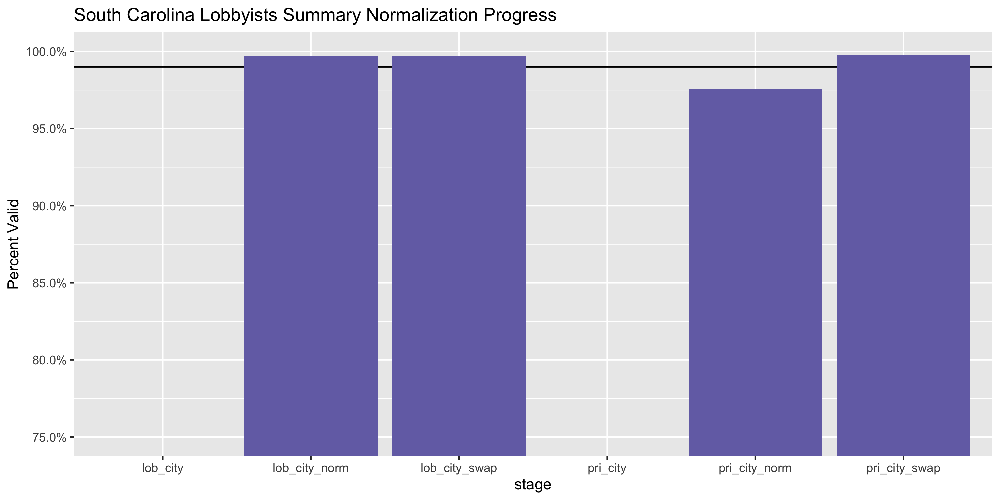

South Carolina Lobbying Registration Data Diary
================
Yanqi Xu
2023-10-08 17:53:35

- [Project](#project)
- [Objectives](#objectives)
- [Packages](#packages)
- [Data](#data)
- [Explore](#explore)
- [Wrangle](#wrangle)
- [Conclude](#conclude)
- [Export](#export)

<!-- Place comments regarding knitting here -->

## Project

The Accountability Project is an effort to cut across data silos and
give journalists, policy professionals, activists, and the public at
large a simple way to search across huge volumes of public data about
people and organizations.

Our goal is to standardizing public data on a few key fields by thinking
of each dataset row as a transaction. For each transaction there should
be (at least) 3 variables:

1.  All **parties** to a transaction
2.  The **date** of the transaction
3.  The **amount** of money involved

## Objectives

This document describes the process used to complete the following
objectives:

1.  How many records are in the database?
2.  Check for duplicates
3.  Check ranges
4.  Is there anything blank or missing?
5.  Check for consistency issues
6.  Create a five-digit ZIP Code called `ZIP5`
7.  Create a `YEAR` field from the transaction date
8.  Make sure there is data on both parties to a transaction

## Packages

The following packages are needed to collect, manipulate, visualize,
analyze, and communicate these results. The `pacman` package will
facilitate their installation and attachment.

The IRW’s `campfin` package will also have to be installed from GitHub.
This package contains functions custom made to help facilitate the
processing of campaign finance data.

``` r
if (!require("pacman")) install.packages("pacman")
pacman::p_load_gh("irworkshop/campfin")
pacman::p_load(
  httr, # interact with http responses
  tidyverse, # data manipulation
  lubridate, # datetime strings
  magrittr, # pipe opperators
  janitor, # dataframe clean
  refinr, # cluster and merge
  scales, # format strings
  knitr, # knit documents
  vroom, # read files fast
  glue, # combine strings
  here, # relative storage
  fs # search storage 
)
```

This document should be run as part of the `R_campfin` project, which
lives as a sub-directory of the more general, language-agnostic
[`irworkshop/accountability_datacleaning`](https://github.com/irworkshop/accountability_datacleaning "TAP repo")
GitHub repository.

The `R_campfin` project uses the [RStudio
projects](https://support.rstudio.com/hc/en-us/articles/200526207-Using-Projects "Rproj")
feature and should be run as such. The project also uses the dynamic
`here::here()` tool for file paths relative to *your* machine.

``` r
# where does this document knit?
here::here()
#> [1] "/Users/yanqixu/code/accountability_datacleaning"
```

## Data

Lobbyist data is obtained from the [South Carolina State Ethics
Commission](https://apps.sc.gov/PublicReporting/Index.aspx).

> #### Welcome
>
> Registrations for both lobbyists and their respective lobbyist’s
> principals are available online for viewing. Disclosure for both
> lobbyists and their respective lobbyist’s principals will also be
> available at the conclusion of the first disclosure period, June 30,
> 2009, for the period, January 1, 2009 through May 31, 2009.

The [lobbying activity
page](https://apps.sc.gov/LobbyingActivity/LAIndex.aspx), we can see the
files that can be retrieved:

> #### Lobbying Activity
>
> Welcome to the State Ethics Commission Online Public Disclosure and
> Accountability Reporting System for Lobbying Activity. Registrations
> for both lobbyists and their respective lobbyist’s principals are
> available online for viewing.
>
> Disclosure for both lobbyists and their respective lobbyist’s
> principals are available for the period June 30, 2009 through the
> present.
>
> These filings can be accessed by searching individual reports by
> lobbyist and lobbyist’s principal names and by complete list of
> current lobbyist and lobbyist’s principal registrations.

> #### List Reports
>
> View a list of lobbyists, lobbyists’ principals or their contact
> information.
>
> - [Lobbyists and Their
>   Principals](https://apps.sc.gov/LobbyingActivity/SelectLobbyistGroup.aspx)
> - [Download Lobbyist Contacts (CSV
>   file)](https://apps.sc.gov/LobbyingActivity/DisplayCsv.aspx)
> - [Individual Lobbyist
>   Lookup](https://apps.sc.gov/LobbyingActivity/SearchLobbyistContact.aspx)
> - [Lobbyists’ Principals and Their
>   Lobbyists](https://apps.sc.gov/LobbyingActivity/SelectLobbyistPrincipalGroup.aspx)
> - [Download Lobbyist’s Principal Contacts (CSV
>   file)](https://apps.sc.gov/LobbyingActivity/DisplayCsv.aspx)
> - [Individual Lobbyist’s Principal
>   Lookup](https://apps.sc.gov/LobbyingActivity/SearchLPContact.aspx)
> - [Year End Compilation
>   Report](https://apps.sc.gov/LobbyingActivity/CompilationReport.aspx)

First, we must download a report linking lobbyists to their principals.
We will download the `Lobbyists and Their Principals` table. Go to
\[Public Disclosure\]\[pd\] \> Lobbying Activity \> List of Lobbyist \>
Type: All Lobbyist, and then hit Continue. A csv file is available for
download. We’ll name it `lob_prin.csv`.

Then we can download the `Lobbyists' Principals and Their Lobbyists` Go
to Public Disclosure \> Lobbying Activity \> List of Lobbyists’
Principals \> Type: All Lobbyists’ Principals, and then hit Continue. A
csv file is available for download. We’ll name it `prin_lob.csv`.

The datasets were downloaded September 9, 2023.
\[pd\]:<https://apps.sc.gov/LobbyingActivity/LAIndex.aspx>

``` r
raw_reg_dir <- dir_create(here("state","sc", "lobby", "data", "raw", "reg"))
raw_exp_dir <- dir_create(here("state","sc", "lobby", "data", "raw", "exp"))
```

### Import

Using these different files, we can create a single data frame listing
lobbyists and those for whom they lobby.

It appears that the address field in the `lob_prin.csv` dataset is for
lobbyists, and the address in the `prin_lob.csv` data is for principles.

``` r
lobs <- 
  # read as string
  read_delim(file = path(raw_reg_dir, "lob_prin.csv"),
    delim = ",",
    escape_backslash = FALSE,
    escape_double = FALSE,
    na = c("", " ")
  ) %>%
  # clean shape
  remove_empty("cols") %>% 
  clean_names("snake")

# clarify col names
names(lobs) <- names(lobs) %>% 
  str_remove("_(.*)") %>% 
  str_remove("code$") %>% 
  str_c("lob", ., sep = "_")
```

``` r
pris <- 
  read_delim(
    file = path(raw_reg_dir, "prin_lob.csv"),
    delim = ",",
    escape_backslash = FALSE,
    escape_double = FALSE,
    na = c("", " ")
  ) %>% 
  remove_empty("cols") %>% 
  clean_names("snake")

names(pris) <- names(pris) %>% 
  str_remove("_(.*)") %>% 
  str_remove("code$") %>%
  str_replace("^lpname$", "name") %>% 
  str_c("pri", ., sep = "_")
```

``` r
sclr <- lobs %>% 
  left_join(pris, by = c("lob_principal" = "pri_principal",
                         "lob_lastname" = "pri_last",
                         "lob_firstname" = "pri_first",
                         "lob_middle" = "pri_middle",
                         "lob_suffix" = "pri_suffix"))
```

By examining the count of `NA` before and after the join, we can see
that all lobbyist records were accounted for from the `pris` dataframe.

``` r
col_stats(lobs, count_na)
#> # A tibble: 10 × 4
#>    col           class     n     p
#>    <chr>         <chr> <int> <dbl>
#>  1 lob_lastname  <chr>     0 0    
#>  2 lob_firstname <chr>     0 0    
#>  3 lob_address   <chr>     0 0    
#>  4 lob_city      <chr>     0 0    
#>  5 lob_state     <chr>     0 0    
#>  6 lob_zip       <chr>     0 0    
#>  7 lob_phone     <dbl>     0 0    
#>  8 lob_principal <chr>     0 0    
#>  9 lob_middle    <chr>   755 0.456
#> 10 lob_suffix    <chr>  1554 0.938
col_stats(sclr, count_na)
#> # A tibble: 15 × 4
#>    col           class     n     p
#>    <chr>         <chr> <int> <dbl>
#>  1 lob_lastname  <chr>     0 0    
#>  2 lob_firstname <chr>     0 0    
#>  3 lob_address   <chr>     0 0    
#>  4 lob_city      <chr>     0 0    
#>  5 lob_state     <chr>     0 0    
#>  6 lob_zip       <chr>     0 0    
#>  7 lob_phone     <dbl>     0 0    
#>  8 lob_principal <chr>     0 0    
#>  9 lob_middle    <chr>   755 0.456
#> 10 lob_suffix    <chr>  1554 0.938
#> 11 pri_address   <chr>     0 0    
#> 12 pri_city      <chr>     0 0    
#> 13 pri_state     <chr>     0 0    
#> 14 pri_zip       <chr>     0 0    
#> 15 pri_phone     <dbl>     0 0

prop_in(
  x = str_normal(paste(lobs$lob_firstname, lobs$lob_lastname)),
  y = str_normal(paste(sclr$lob_firstname, sclr$lob_lastname)),
)
#> [1] 1
```

We will also download the yearly compilation reports, which contain
payments made to lobbyists. Go to Public Disclosure \> Lobbying Activity
\> Year End Compilation Report,\` then select year and “Lobbyist” for
report type.

``` r
scle <- read_csv(glue(raw_exp_dir, "/sc_lob_exp_{2009:2023}.csv"), id = "file") %>% clean_names()

scle <- scle %>% select(-x27)
```

We cann add a year field according to the file name generated when we
downloaded the annual expenditure files.

``` r
scle <- scle %>% 
  mutate(year = str_extract(file, "\\d{4}")) %>% 
  select(-file)
```

We will then get rid of dollar signs and commas in the numeric fields
and turn them into numeric.

``` r
scle <- 
  scle %>% 
  mutate(across(3:27, ~str_replace(.,"\\(\\$","-") %>% str_remove_all(",|\\$|\\)") %>% as.numeric())) %>% 
  mutate(across(1:2, str_squish))
```

``` r
sc_lob <- read_csv(path(raw_reg_dir, "sc_lobbyists.csv")) %>% clean_names()
sc_pri <-  read_csv(path(raw_reg_dir, "sc_principals.csv")) %>% clean_names()
```

``` r
sc_pri <- sc_pri %>% 
  select(-x9)

names(sc_pri)[1:5] <- names(sc_pri)[1:5] %>% 
  str_remove("_(.*)") %>% 
  str_remove("code$") %>%
  str_replace("^lpname$", "name") %>% 
  str_c("pri", ., sep = "_")
```

``` r
sc_lob <- sc_lob %>% 
  select(-x9)
```

We can join the registration and expenditures datasets together so that
the address fields would be reflected in the expenditure dataset. The
fields to be joined by are lobbyist_principals and lobbyist names.

First, we need to create a field in the `sclr` field to concatenate
lobbyist names.

``` r
sclr <- sclr %>% 
  unite(col = "lobbyist", lob_firstname, lob_middle, lob_lastname, lob_suffix, sep = " ", remove = F, na.rm = T ) %>%
  mutate(lobbyist = str_squish(lobbyist))

sc_lob <- sc_lob %>% 
  unite(col = "lobbyist", first_name, middle_init, last_name, title, sep = " ", remove = F, na.rm = T ) %>%
  mutate(lobbyist = str_squish(lobbyist))
```

There are some duplicates or multiple entries in the `sc_lob` and
`sc_pri` datasets, and we will get rid of these duplicates by using the
address with the bigger row number.

``` r
sc_lob <- sc_lob %>% rowid_to_column() %>% 
  group_by(lobbyist) %>% 
  filter(rowid==max(rowid))

sc_lob <- sc_lob %>% select(-rowid)

names(sc_lob) <- c("lobbyist","lob_firstname","lob_middle","lob_lastname","lob_suffix","lob_address","lob_city","lob_state","lob_zip")
```

Now that we’ve made sure there are no duplicates, we can join the
lobbyist address info back to the `scle` data.

``` r

scle <- scle %>% rename(lob_principal = lobbyists_principal)

scle_full <- scle %>% 
  left_join(sclr, by = c("lobbyist", "lob_principal"))

scle_work <- scle_full %>% filter(is.na(lob_address)|is.na(pri_address))

scle_good <- setdiff(scle_full,scle_work)

scle_work <- scle_work[1:27]

scle_work <- scle_work %>% left_join(sc_lob)
```

``` r

sc_pri <- sc_pri %>% rowid_to_column() %>% 
  group_by(pri_name) %>% 
  filter(rowid==max(rowid))

sc_pri <- sc_pri %>% select(-rowid)
```

Now that we’ve made sure there are no duplicates, we can join the
lobbyist address info back to the `scle` data.

``` r

names(sc_pri) <- c("lob_principal","pri_address","pri_city","pri_state","pri_zip","pri_last","pri_first","pri_middle")

sc_pri <-  sc_pri %>%  unite(col = "principal_name", pri_first, pri_middle, pri_last, sep = " ", remove = F, na.rm = T ) %>%
  mutate(principal_name = str_squish(principal_name))

scle_work <- scle_work %>% left_join(sc_pri)

scle <- scle_good %>% bind_rows(scle_work)
```

## Explore

### Duplicaes

We can see that there’s no duplicate rows in this dataset.

``` r
scle <- scle %>% flag_dupes(dplyr::everything())
tabyl(scle$dupe_flag)
#> # A tibble: 2 × 3
#>   `scle$dupe_flag`     n  percent
#>   <lgl>            <int>    <dbl>
#> 1 FALSE            18608 1.00    
#> 2 TRUE                 6 0.000322
```

## Wrangle

To improve the searchability of the database, we will perform some
consistent, confident string normalization. For geographic variables
like city names and ZIP codes, the corresponding `campfin::normal_*()`
functions are taylor made to facilitate this process.

### Address

For the street `addresss` variable, the `campfin::normal_address()`
function will force consistence case, remove punctuation, and
abbreviation official USPS suffixes.

``` r
scle <- scle %>% 
  mutate_at(.vars = vars(ends_with('address')), 
            .funs = list(norm = ~ normal_address(.,
,abbs = usps_street,
      na_rep = TRUE)))
```

``` r
scle %>% 
  select(contains("address")) %>% 
  distinct() %>% 
  sample_n(10) %>% 
  glimpse()
#> Rows: 10
#> Columns: 4
#> $ lob_address      <chr> "1404 Gervais Street", "1482 Lee Avenue", "P. O. Box 11266", "P. O. Box …
#> $ pri_address      <chr> "201 Partridge Ln", "333 Lakeside Drive", "1718 M St, NW 188", "PO Box 1…
#> $ lob_address_norm <chr> "1404 GERVAIS ST", "1482 LEE AVE", "P O BOX 11266", "P O BOX 5653", "230…
#> $ pri_address_norm <chr> "201 PARTRIDGE LN", "333 LAKESIDE DR", "1718 M ST NW 188", "PO BOX 1030"…
```

### ZIP

For ZIP codes, the `campfin::normal_zip()` function will attempt to
create valied *five* digit codes by removing the ZIP+4 suffix and
returning leading zeroes dropped by other programs like Microsoft Excel.

``` r
scle <- scle %>% 
    mutate_at(.vars = vars(ends_with('zip')), .funs = list(norm = ~ normal_zip(.,na_rep = T))) %>% 
    rename(lob_zip5 = lob_zip_norm,
           pri_zip5 = pri_zip_norm)
```

``` r
progress_table(
  scle$lob_zip,
  scle$lob_zip5,
  scle$pri_zip,
  scle$pri_zip5,
  compare = valid_zip
)
#> # A tibble: 4 × 6
#>   stage         prop_in n_distinct prop_na n_out n_diff
#>   <chr>           <dbl>      <dbl>   <dbl> <dbl>  <dbl>
#> 1 scle$lob_zip    0.962        425 0.00177   699     44
#> 2 scle$lob_zip5   0.996        393 0.00177    81      3
#> 3 scle$pri_zip    0.974        769 0.00107   484     52
#> 4 scle$pri_zip5   0.996        744 0.00107    68      7
```

### State

By examining the percentage of lobbyist_state that are considered valid,
we can see that the `state` variable in both datasets doesn’t need to be
normalized.

``` r
prop_in(scle$lob_state, valid_state, na.rm = T)
#> [1] 1
prop_in(scle$pri_state, valid_state, na.rm = T)
#> [1] 1
```

### City

Cities are the most difficult geographic variable to normalize, simply
due to the wide variety of valid cities and formats. \#### Normal

The `campfin::normal_city()` function is a good sclrart, again
converting case, removing punctuation, but *expanding* USPS
abbreviations. We can also remove `invalid_city` values.

``` r
scle <- scle %>% 
  mutate_at(.vars = vars(ends_with('city')), .funs = list(norm = ~ normal_city(.,
      abbs = usps_city,
      states = usps_state,
      na = invalid_city,
      na_rep = TRUE)))

prop_in(scle$lob_city_norm, valid_city, na.rm = T)
#> [1] 0.9894516
prop_in(scle$pri_city_norm, valid_city, na.rm = T)
#> [1] 0.9683769
```

#### Swap

We can further improve normalization by comparing our normalized value
against the *expected* value for that record’s state abbreviation and
ZIP code. If the normalized value is either an abbreviation for or very
similar to the expected value, we can confidently swap those two.

``` r
scle <- scle %>% 
  left_join(
    y = zipcodes,
    by = c(
      "lob_state" = "state",
      "lob_zip5" = "zip"
    )
  ) %>% 
  rename(lob_city_match = city) %>% 
  mutate(
    match_abb = is_abbrev(lob_city_norm, lob_city_match),
    match_dist = str_dist(lob_city_norm, lob_city_match),
    lob_city_swap = if_else(
      condition = !is.na(match_dist) & match_abb | match_dist == 1,
      true = lob_city_match,
      false = lob_city_norm
    )
  ) %>% 
  select(
    -lob_city_match,
    -match_dist,
    -match_abb
  )

scle <- scle %>% 
  left_join(
    y = zipcodes,
    by = c(
      "pri_state" = "state",
      "pri_zip5" = "zip"
    )
  ) %>% 
  rename(pri_city_match = city) %>% 
  mutate(
    match_abb = is_abbrev(pri_city_norm, pri_city_match),
    match_dist = str_dist(pri_city_norm, pri_city_match),
    pri_city_swap = if_else(
      condition = !is.na(match_dist) & match_abb | match_dist == 1,
      true = pri_city_match,
      false = pri_city_norm
    )
  ) %>% 
  select(
    -pri_city_match,
    -match_dist,
    -match_abb
  )
```

### Manual

There are still some remaining `pri_city_swap` fields that don’t match
our list of known cities.

``` r
many_city <- c(valid_city, extra_city)

scle_out <- scle %>% 
  filter(pri_city_swap %out% many_city) %>% 
  count(pri_city_swap, pri_state, sort = TRUE) %>% 
  drop_na()
```

``` r
scle <- scle %>% 
  mutate(pri_city_swap = str_replace(pri_city_swap,"^COLUMBIA SC$", "COLUMBIA"))
```

After the two normalization steps, the percentage of valid cities is
close to 100% for both datasets.

#### Progress

| stage                                                                | prop_in | n_distinct | prop_na | n_out | n_diff |
|:---------------------------------------------------------------------|--------:|-----------:|--------:|------:|-------:|
| scle$lob_city | 0.003| 255| 0.002| 18530| 246| |scle$lob_city_norm   |   0.990 |        237 |   0.002 |   189 |     18 |
| scle$lob_city_swap | 0.995| 231| 0.007| 89| 10| |scle$pri_city       |   0.010 |        484 |   0.001 | 18404 |    467 |
| scle$pri_city_norm | 0.979| 447| 0.001| 399| 39| |scle$pri_city_swap |   0.998 |        429 |   0.013 |    44 |     15 |

SC Lobbyists Registration City Normalization Progress

You can see how the percentage of valid values increased with each
stage.

<!-- -->

More importantly, the number of distinct values decreased each stage. We
were able to confidently change many distinct invalid values to their
valid equivalent.

## Conclude

``` r
glimpse(sample_n(scle, 20))
#> Rows: 20
#> Columns: 54
#> $ lobbyist                                                            <chr> "Graham Tew", "Hobart…
#> $ lob_principal                                                       <chr> "Greenwood Genetic Ce…
#> $ income_received_for_lobbying_period_1                               <dbl> 3000.00, 7500.00, 357…
#> $ income_received_for_lobbying_period_2                               <dbl> 1000.00, 10500.00, 0.…
#> $ income_received_for_lobbying_calendar_year_total                    <dbl> 4000.00, 18000.00, 35…
#> $ supplies_period_1                                                   <dbl> 0.00, 0.00, 0.00, 0.0…
#> $ supplies_period_2                                                   <dbl> 0.00, 0.00, 0.00, 0.0…
#> $ supplies_period_calendar_year_total                                 <dbl> 0.00, 0.00, 0.00, 0.0…
#> $ rent_period_1                                                       <dbl> 0.00, 0.00, 0.00, 0.0…
#> $ rent_period_2                                                       <dbl> 0.00, 0.00, 0.00, 0.0…
#> $ rent_period_calendar_year_total                                     <dbl> 0.00, 0.00, 0.00, 0.0…
#> $ utilities_period_1                                                  <dbl> 0.00, 0.00, 0.00, 0.0…
#> $ utilities_period_2                                                  <dbl> 0.00, 0.00, 0.00, 0.0…
#> $ utilities_period_calendar_year_total                                <dbl> 0.00, 0.00, 0.00, 0.0…
#> $ compensation_period_1                                               <dbl> 0.00, 0.00, 0.00, 0.0…
#> $ compensation_period_2                                               <dbl> 0.00, 0.00, 0.00, 0.0…
#> $ compensation_period_calendar_year_total                             <dbl> 0.00, 0.00, 0.00, 0.0…
#> $ other_expenditures_period_1                                         <dbl> 0.00, 0.00, 0.00, 0.0…
#> $ other_expenditures_period_2                                         <dbl> 0.00, 0.00, 0.00, 0.0…
#> $ other_expenditures_calendar_year_total                              <dbl> 0.00, 0.00, 0.00, 0.0…
#> $ expenditures_made_on_behalf_of_judiciary_period_1                   <dbl> 0, 0, 0, 0, 0, 0, 0, …
#> $ expenditures_made_on_behalf_of_judiciary_period_2                   <dbl> 0, 0, 0, 0, 0, 0, 0, …
#> $ expenditures_made_on_behalf_of_judiciary_period_calendar_year_total <dbl> 0, 0, 0, 0, 0, 0, 0, …
#> $ total_income_and_expenditures_period_1                              <dbl> 3000.00, 7500.00, 357…
#> $ total_income_and_expenditures_period_2                              <dbl> 1000.00, 10500.00, 0.…
#> $ total_income_and_expenditures_calendar_year_total                   <dbl> 4000.00, 18000.00, 35…
#> $ year                                                                <dbl> 2019, 2016, 2015, 201…
#> $ lob_lastname                                                        <chr> "Tew", "Trotter", "Bu…
#> $ lob_firstname                                                       <chr> "Graham", "Hobart", "…
#> $ lob_address                                                         <chr> "1301 Gervais St., Su…
#> $ lob_city                                                            <chr> "Columbia", "Columbia…
#> $ lob_state                                                           <chr> "SC", "SC", "DC", "SC…
#> $ lob_zip                                                             <chr> "29201", "29211", "20…
#> $ lob_phone                                                           <dbl> 8034291711, NA, NA, N…
#> $ lob_middle                                                          <chr> NA, "O", NA, "Z", "D"…
#> $ lob_suffix                                                          <chr> NA, "Jr.", NA, "III",…
#> $ pri_address                                                         <chr> "101 Gregor Mendel Ci…
#> $ pri_city                                                            <chr> "Greenwood", "New Ber…
#> $ pri_state                                                           <chr> "SC", "NC", "DC", "SC…
#> $ pri_zip                                                             <chr> "29646", "28562", "20…
#> $ pri_phone                                                           <dbl> 8649418100, NA, NA, N…
#> $ principal_name                                                      <chr> NA, "Owen Andrews", "…
#> $ pri_last                                                            <chr> NA, "Andrews", "Burts…
#> $ pri_first                                                           <chr> NA, "Owen", "Mark", "…
#> $ pri_middle                                                          <chr> NA, NA, NA, NA, NA, "…
#> $ dupe_flag                                                           <lgl> FALSE, FALSE, FALSE, …
#> $ lob_address_norm                                                    <chr> "1301 GERVAIS ST SUIT…
#> $ pri_address_norm                                                    <chr> "101 GREGOR MENDEL CI…
#> $ lob_zip5                                                            <chr> "29201", "29211", "20…
#> $ pri_zip5                                                            <chr> "29646", "28562", "20…
#> $ lob_city_norm                                                       <chr> "COLUMBIA", "COLUMBIA…
#> $ pri_city_norm                                                       <chr> "GREENWOOD", "NEW BER…
#> $ lob_city_swap                                                       <chr> "COLUMBIA", "COLUMBIA…
#> $ pri_city_swap                                                       <chr> "GREENWOOD", "NEW BER…
```

1.  There are 18614 records in the database.
2.  There’re 6 duplicate records.
3.  The range and distribution of `amount` and `date` seem reasonable.
4.  There are 0 records missing either address or expenditure amount.
5.  Consistency in goegraphic data has been improved with
    `campfin::normal_*()`.
6.  This dataset doesn’t contain `date` columns.

## Export

``` r
clean_dir <- dir_create(here("state","sc", "lobby", "data","clean"))
```

``` r
write_csv(
  x = scle %>% 
    select(-c(lob_city_norm, pri_city_norm)) %>% 
    rename( lob_city_clean = lob_city_swap,
            pri_city_clean = pri_city_swap,
            lob_zip_clean = lob_zip5,
            pri_zip_clean = pri_zip5),
  path = path(clean_dir, "sc_lob_clean_2009-2023.csv"),
  na = ""
)
```
