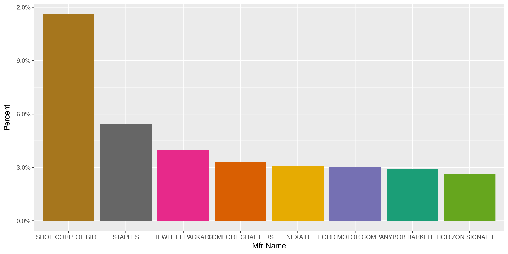
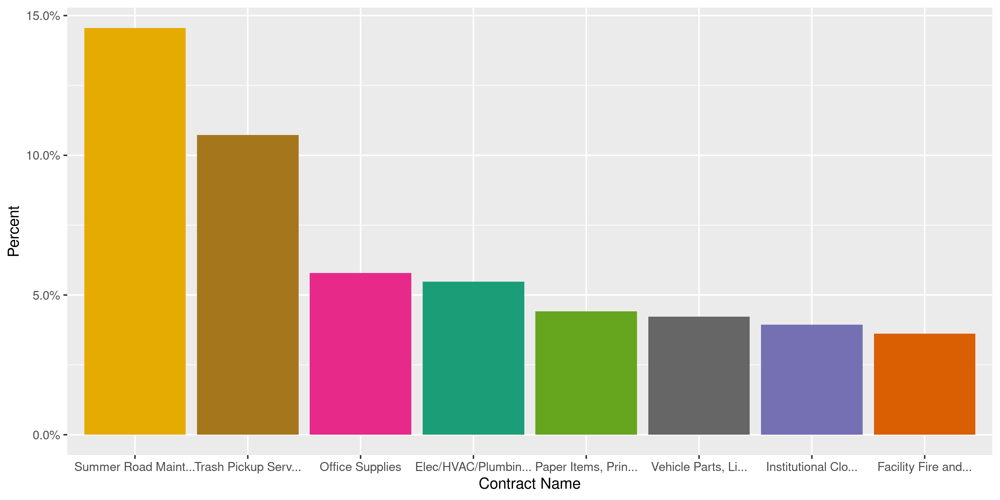
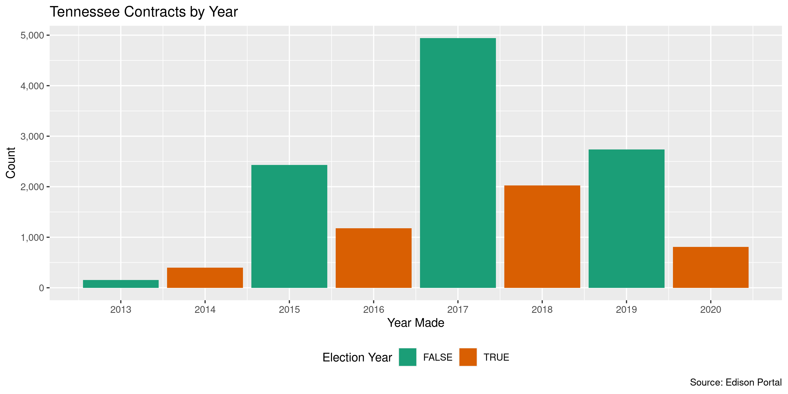

Tennessee Contracts
================
Kiernan Nicholls
2020-05-28 11:11:19

  - [Project](#project)
  - [Objectives](#objectives)
  - [Packages](#packages)
  - [Data](#data)
  - [Download](#download)
  - [Read](#read)
  - [Explore](#explore)
  - [Conclude](#conclude)
  - [Export](#export)
  - [Dictionary](#dictionary)

<!-- Place comments regarding knitting here -->

## Project

The Accountability Project is an effort to cut across data silos and
give journalists, policy professionals, activists, and the public at
large a simple way to search across huge volumes of public data about
people and organizations.

Our goal is to standardizing public data on a few key fields by thinking
of each dataset row as a transaction. For each transaction there should
be (at least) 3 variables:

1.  All **parties** to a transaction.
2.  The **date** of the transaction.
3.  The **amount** of money involved.

## Objectives

This document describes the process used to complete the following
objectives:

1.  How many records are in the database?
2.  Check for entirely duplicated records.
3.  Check ranges of continuous variables.
4.  Is there anything blank or missing?
5.  Check for consistency issues.
6.  Create a five-digit ZIP Code called `zip`.
7.  Create a `year` field from the transaction date.
8.  Make sure there is data on both parties to a transaction.

## Packages

The following packages are needed to collect, manipulate, visualize,
analyze, and communicate these results. The `pacman` package will
facilitate their installation and attachment.

The IRW’s `campfin` package will also have to be installed from GitHub.
This package contains functions custom made to help facilitate the
processing of campaign finance data.

``` r
if (!require("pacman")) install.packages("pacman")
pacman::p_load_gh("irworkshop/campfin")
pacman::p_load(
  tidyverse, # data manipulation
  lubridate, # datetime strings
  gluedown, # printing markdown
  magrittr, # pipe operators
  janitor, # clean data frames
  refinr, # cluster and merge
  readxl, # read excel files
  scales, # format strings
  knitr, # knit documents
  vroom, # read files fast
  rvest, # html scraping
  glue, # combine strings
  here, # relative paths
  httr, # http requests
  fs # local storage 
)
```

This document should be run as part of the `R_campfin` project, which
lives as a sub-directory of the more general, language-agnostic
[`irworkshop/accountability_datacleaning`](https://github.com/irworkshop/accountability_datacleaning)
GitHub repository.

The `R_campfin` project uses the [RStudio
projects](https://support.rstudio.com/hc/en-us/articles/200526207-Using-Projects)
feature and should be run as such. The project also uses the dynamic
`here::here()` tool for file paths relative to *your* machine.

``` r
# where does this document knit?
here::here()
#> [1] "/home/kiernan/Code/accountability_datacleaning/R_campfin"
```

## Data

Contracts data can be obtained from the [Edison Supplier
Portal](https://hub.edison.tn.gov/psp/paprd/SUPPLIER/SUPP/h/?tab=PAPP_GUEST).

> This is the central access point for our suppliers and business
> partners to view valuable information related to conducting business
> with us. In addition, active suppliers and business partners may also
> log in to our secure system from this portal to access current
> transaction information for their accounts.

## Download

The list of active contracts can be downloaded from the Edison Portal as
an excel spreadhseet.

``` r
raw_dir <- dir_create(here("tn", "contracts", "data", "raw"))
raw_url <- "http://upk.edison.tn.gov/TN_PU_SS021C.xlsx"
raw_path <- path(raw_dir, basename(raw_url))
```

``` r
download.file(raw_url, raw_path)
```

## Read

The excel spreadsheet can be read with `readxl::read_excel()`.

``` r
tnc <- read_excel(
  path = raw_path,
  skip = 1,
  .name_repair = make_clean_names
)
```

## Explore

``` r
glimpse(tnc)
#> Rows: 14,666
#> Columns: 19
#> $ swc_nbr            <chr> "102", "102", "102", "102", "102", "102", "102", "102", "102", "102",…
#> $ contract_name      <chr> "Building Materials", "Building Materials", "Building Materials", "Bu…
#> $ contract_id        <chr> "0000000000000000000052037", "0000000000000000000052037", "0000000000…
#> $ begin_date         <date> 2016-10-12, 2016-10-12, 2016-10-12, 2016-10-12, 2016-10-12, 2016-10-…
#> $ expire_date        <date> 2020-10-11, 2020-10-11, 2020-10-11, 2020-10-11, 2020-10-11, 2020-10-…
#> $ line               <dbl> 1, 2, 3, 4, 5, 6, 7, 8, 9, 10, 1, 2, 3, 4, 5, 6, 7, 8, 9, 10, 11, 12,…
#> $ desc               <chr> "Acoustical Ceiling Tile, Type III, Form 2, Pattern C, D, White, 2x2"…
#> $ item               <chr> "1000145570", "1000145552", "1000145553", "1000145556", "1000145557",…
#> $ supplier_name      <chr> "Continental Flooring Comp", "Continental Flooring Comp", "Continenta…
#> $ supplier_id        <chr> "0000070218", "0000070218", "0000070218", "0000070218", "0000070218",…
#> $ part_number        <chr> "ARMSTRONG CIRRUS 584 AND 589", "ARMSTRONG CIRRUS 535 AND 583", "ARMS…
#> $ mfr_name           <chr> "ARMSTRONG FLOORING", "ARMSTRONG FLOORING", "ARMSTRONG FLOORING", "AR…
#> $ mfr_part           <chr> "CIRRUS 584 AND 589", "CIRRUS 535 AND 583", "PRELUDE 7300", "PRELUDE …
#> $ price              <dbl> 105.12, 128.16, 144.00, 120.00, 295.20, 144.00, 74.40, 132.00, 68.40,…
#> $ uom                <chr> "CT", "CT", "CT", "CT", "CT", "CT", "CT", "CT", "CT", "CT", "SF", "SF…
#> $ unspsc_code        <chr> "30161601", "30161601", "30161604", "30161604", "30161604", "30161604…
#> $ unspsc_description <chr> "ACOUSTIC CEILING TILES", "ACOUSTIC CEILING TILES", "SUSPENDED CEILIN…
#> $ admin_name         <chr> "Lanessa Munson", "Lanessa Munson", "Lanessa Munson", "Lanessa Munson…
#> $ admin_email        <chr> "lanessa.m.munson@tn.gov", "lanessa.m.munson@tn.gov", "lanessa.m.muns…
tail(tnc)
#> # A tibble: 6 x 19
#>   swc_nbr contract_name contract_id begin_date expire_date  line desc  item  supplier_name
#>   <chr>   <chr>         <chr>       <date>     <date>      <dbl> <chr> <chr> <chr>        
#> 1 BI50    MattressPads… 0000000000… 2015-12-01 2020-11-30    142 Matt… 1000… Lions Volunt…
#> 2 BI50    MattressPads… 0000000000… 2015-12-01 2020-11-30    143 Matt… 1000… Lions Volunt…
#> 3 BI50    MattressPads… 0000000000… 2015-12-01 2020-11-30    144 Matt… 1000… Lions Volunt…
#> 4 BI50    MattressPads… 0000000000… 2015-12-01 2020-11-30    145 Matt… 1000… Lions Volunt…
#> 5 BI50    MattressPads… 0000000000… 2015-12-01 2020-11-30    146 Bed … 1000… Lions Volunt…
#> 6 BI50    MattressPads… 0000000000… 2015-12-01 2020-11-30    147 Bed … 1000… Lions Volunt…
#> # … with 10 more variables: supplier_id <chr>, part_number <chr>, mfr_name <chr>, mfr_part <chr>,
#> #   price <dbl>, uom <chr>, unspsc_code <chr>, unspsc_description <chr>, admin_name <chr>,
#> #   admin_email <chr>
```

### Missing

There are very few records missing a variable value.

``` r
col_stats(tnc, count_na)
#> # A tibble: 19 x 4
#>    col                class      n      p
#>    <chr>              <chr>  <int>  <dbl>
#>  1 swc_nbr            <chr>      0 0     
#>  2 contract_name      <chr>      0 0     
#>  3 contract_id        <chr>      0 0     
#>  4 begin_date         <date>     0 0     
#>  5 expire_date        <date>     0 0     
#>  6 line               <dbl>      0 0     
#>  7 desc               <chr>      0 0     
#>  8 item               <chr>   1297 0.0884
#>  9 supplier_name      <chr>      0 0     
#> 10 supplier_id        <chr>      0 0     
#> 11 part_number        <chr>   1314 0.0896
#> 12 mfr_name           <chr>  10978 0.749 
#> 13 mfr_part           <chr>  11263 0.768 
#> 14 price              <dbl>      0 0     
#> 15 uom                <chr>      0 0     
#> 16 unspsc_code        <chr>      0 0     
#> 17 unspsc_description <chr>      0 0     
#> 18 admin_name         <chr>      0 0     
#> 19 admin_email        <chr>      0 0
```

There are no records missing key variable that need to be flagged.

### Duplicates

There are no entirely duplicated records.

``` r
tnc <- flag_dupes(tnc, everything())
#> Warning in flag_dupes(tnc, everything()): no duplicate rows, column not created
```

### Categorical

``` r
col_stats(tnc, n_distinct)
#> # A tibble: 19 x 4
#>    col                class      n       p
#>    <chr>              <chr>  <int>   <dbl>
#>  1 swc_nbr            <chr>    129 0.00880
#>  2 contract_name      <chr>    129 0.00880
#>  3 contract_id        <chr>    454 0.0310 
#>  4 begin_date         <date>   138 0.00941
#>  5 expire_date        <date>    83 0.00566
#>  6 line               <dbl>    863 0.0588 
#>  7 desc               <chr>  11059 0.754  
#>  8 item               <chr>  10343 0.705  
#>  9 supplier_name      <chr>    395 0.0269 
#> 10 supplier_id        <chr>    395 0.0269 
#> 11 part_number        <chr>  12899 0.880  
#> 12 mfr_name           <chr>    352 0.0240 
#> 13 mfr_part           <chr>   3211 0.219  
#> 14 price              <dbl>   3309 0.226  
#> 15 uom                <chr>     51 0.00348
#> 16 unspsc_code        <chr>    660 0.0450 
#> 17 unspsc_description <chr>    660 0.0450 
#> 18 admin_name         <chr>     20 0.00136
#> 19 admin_email        <chr>     20 0.00136
```

<!-- --><!-- --><!-- -->

### Amounts

``` r
noquote(map_chr(summary(tnc$price), dollar))
#>       Min.    1st Qu.     Median       Mean    3rd Qu.       Max. 
#>         $0      $3.55     $31.98  $1,497.35    $106.23 $5,000,000
mean(tnc$price <= 0)
#> [1] 0.1457794
```

``` r
glimpse(mutate(tnc[which.max(tnc$price), ], across(price, dollar)))
#> Rows: 1
#> Columns: 19
#> $ swc_nbr            <chr> "3017"
#> $ contract_name      <chr> "Mass Notification Software"
#> $ contract_id        <chr> "0000000000000000000057114"
#> $ begin_date         <date> 2017-12-15
#> $ expire_date        <date> 2020-12-14
#> $ line               <dbl> 1
#> $ desc               <chr> "Catalog"
#> $ item               <chr> NA
#> $ supplier_name      <chr> "Everbridge Inc"
#> $ supplier_id        <chr> "0000105501"
#> $ part_number        <chr> NA
#> $ mfr_name           <chr> NA
#> $ mfr_part           <chr> NA
#> $ price              <chr> "$5,000,000"
#> $ uom                <chr> "P1"
#> $ unspsc_code        <chr> "81111508"
#> $ unspsc_description <chr> "APPLICATION IMPLEMENTATION SERVICES"
#> $ admin_name         <chr> "Simeon Ayton"
#> $ admin_email        <chr> "simeon.ayton@tn.gov"
```

<!-- -->

### Dates

We can add the calendar year from `date` with `lubridate::year()`

``` r
tnc <- mutate(tnc, begin_year = year(begin_date))
```

``` r
min(tnc$begin_date)
#> [1] "2013-01-01"
sum(tnc$begin_year < 2000)
#> [1] 0
max(tnc$begin_date)
#> [1] "2020-06-15"
sum(tnc$begin_date > today())
#> [1] 332
```

There are a number of contracts begining in the near future.

``` r
tnc %>% 
  filter(begin_date > today()) %>% 
  count(begin_date)
#> # A tibble: 2 x 2
#>   begin_date     n
#>   <date>     <int>
#> 1 2020-06-01   326
#> 2 2020-06-15     6
```

<!-- -->

## Conclude

1.  There are 14,666 records in the database.
2.  There are 0 duplicate records in the database.
3.  The range and distribution of `amount` and `date` seem reasonable.
4.  There are 0 records missing key variables.
5.  There are no geographic variables to normalize.
6.  The 4-digit `year` variable has been created with
    `lubridate::year()`.

## Export

Now the file can be saved on disk for upload to the Accountability
server.

``` r
clean_dir <- dir_create(here("tn", "contracts", "data", "clean"))
clean_path <- path(clean_dir, "tn_contracts_clean.csv")
write_csv(tnc, clean_path, na = "")
file_size(clean_path)
#> 4.34M
mutate(file_encoding(clean_path), across(path, path.abbrev))
#> # A tibble: 1 x 3
#>   path                                             mime            charset
#>   <chr>                                            <chr>           <chr>  
#> 1 ~/tn/contracts/data/clean/tn_contracts_clean.csv application/csv utf-8
```

## Dictionary

The following table describes the variables in our final exported file:

| Column               | Type        | Definition |
| :------------------- | :---------- | :--------- |
| `swc_nbr`            | `character` |            |
| `contract_name`      | `character` |            |
| `contract_id`        | `character` |            |
| `begin_date`         | `double`    |            |
| `expire_date`        | `double`    |            |
| `line`               | `double`    |            |
| `desc`               | `character` |            |
| `item`               | `character` |            |
| `supplier_name`      | `character` |            |
| `supplier_id`        | `character` |            |
| `part_number`        | `character` |            |
| `mfr_name`           | `character` |            |
| `mfr_part`           | `character` |            |
| `price`              | `double`    |            |
| `uom`                | `character` |            |
| `unspsc_code`        | `character` |            |
| `unspsc_description` | `character` |            |
| `admin_name`         | `character` |            |
| `admin_email`        | `character` |            |
| `begin_year`         | `double`    |            |

``` r
write_lines(
  x = c("# Tennessee Contracts Data Dictionary\n", dict_md),
  path = here("tn", "contracts", "tn_contracts_dict.md"),
)
```
