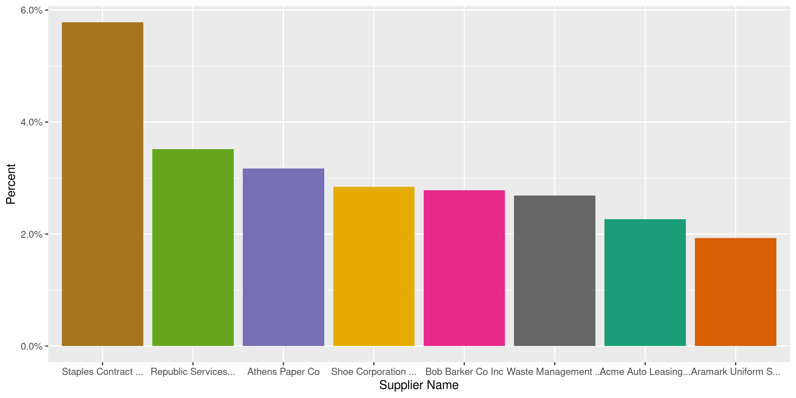
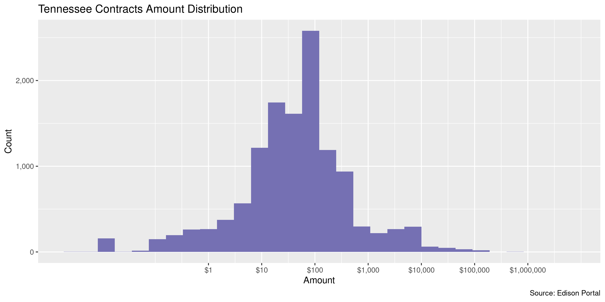

Tennessee Contracts
================
Kiernan Nicholls
2023-01-19 13:15:16

- <a href="#project" id="toc-project">Project</a>
- <a href="#objectives" id="toc-objectives">Objectives</a>
- <a href="#packages" id="toc-packages">Packages</a>
- <a href="#data" id="toc-data">Data</a>
- <a href="#download" id="toc-download">Download</a>
- <a href="#read" id="toc-read">Read</a>
- <a href="#explore" id="toc-explore">Explore</a>
- <a href="#conclude" id="toc-conclude">Conclude</a>
- <a href="#update" id="toc-update">Update</a>
- <a href="#export" id="toc-export">Export</a>
- <a href="#upload" id="toc-upload">Upload</a>

<!-- Place comments regarding knitting here -->

## Project

The Accountability Project is an effort to cut across data silos and
give journalists, policy professionals, activists, and the public at
large a simple way to search across huge volumes of public data about
people and organizations.

Our goal is to standardizing public data on a few key fields by thinking
of each dataset row as a transaction. For each transaction there should
be (at least) 3 variables:

1.  All **parties** to a transaction.
2.  The **date** of the transaction.
3.  The **amount** of money involved.

## Objectives

This document describes the process used to complete the following
objectives:

1.  How many records are in the database?
2.  Check for entirely duplicated records.
3.  Check ranges of continuous variables.
4.  Is there anything blank or missing?
5.  Check for consistency issues.
6.  Create a five-digit ZIP Code called `zip`.
7.  Create a `year` field from the transaction date.
8.  Make sure there is data on both parties to a transaction.

## Packages

The following packages are needed to collect, manipulate, visualize,
analyze, and communicate these results. The `pacman` package will
facilitate their installation and attachment.

The IRW’s `campfin` package will also have to be installed from GitHub.
This package contains functions custom made to help facilitate the
processing of campaign finance data.

``` r
if (!require("pacman")) install.packages("pacman")
pacman::p_load_gh("irworkshop/campfin")
pacman::p_load(
  tidyverse, # data manipulation
  lubridate, # datetime strings
  gluedown, # printing markdown
  magrittr, # pipe operators
  janitor, # clean data frames
  aws.s3, # upload file to aws
  refinr, # cluster and merge
  readxl, # read excel files
  scales, # format strings
  knitr, # knit documents
  vroom, # read files fast
  rvest, # html scraping
  glue, # combine strings
  here, # relative paths
  httr, # http requests
  fs # local storage 
)
```

This document should be run as part of the `R_campfin` project, which
lives as a sub-directory of the more general, language-agnostic
[`irworkshop/accountability_datacleaning`](https://github.com/irworkshop/accountability_datacleaning)
GitHub repository.

The `R_campfin` project uses the [RStudio
projects](https://support.rstudio.com/hc/en-us/articles/200526207-Using-Projects)
feature and should be run as such. The project also uses the dynamic
`here::here()` tool for file paths relative to *your* machine.

``` r
# where does this document knit?
here::here()
#> [1] "/home/kiernan/Documents/accountability_datacleaning"
```

## Data

Contracts data can be obtained from the [Edison Supplier
Portal](https://hub.edison.tn.gov/psp/paprd/SUPPLIER/SUPP/h/?tab=PAPP_GUEST).

> This is the central access point for our suppliers and business
> partners to view valuable information related to conducting business
> with us. In addition, active suppliers and business partners may also
> log in to our secure system from this portal to access current
> transaction information for their accounts.

## Download

The list of active contracts can be downloaded from the Edison Portal as
an excel spreadhseet.

``` r
raw_dir <- dir_create(here("state", "tn", "contracts", "data", "raw"))
raw_url <- "http://upk.edison.tn.gov/TN_PU_SS021C.xlsx"
raw_path <- path(raw_dir, basename(raw_url))
```

``` r
download.file(raw_url, raw_path)
```

## Read

The excel spreadsheet can be read with `readxl::read_excel()`.

``` r
tnc <- read_excel(
  path = raw_path,
  skip = 1,
  .name_repair = make_clean_names
)
```

## Explore

``` r
glimpse(tnc)
#> Rows: 16,273
#> Columns: 19
#> $ swc_nbr            <chr> "102", "102", "102", "102", "102", "102", "102", "102", "102", "102", …
#> $ contract_name      <chr> "Building Materials", "Building Materials", "Building Materials", "Bui…
#> $ contract_id        <chr> "0000000000000000000072745", "0000000000000000000072745", "00000000000…
#> $ begin_date         <date> 2021-11-01, 2021-11-01, 2021-11-01, 2021-11-01, 2021-11-01, 2021-11-0…
#> $ expire_date        <date> 2024-10-31, 2024-10-31, 2024-10-31, 2024-10-31, 2024-10-31, 2024-10-3…
#> $ line               <dbl> 1, 2, 3, 4, 6, 7, 8, 9, 10, 11, 12, 13, 14, 15, 16, 17, 18, 19, 20, 21…
#> $ desc               <chr> "Carpet Installation, Carpet Tile", "Carpet Installation, Carpet Broad…
#> $ item               <chr> "1000197235", "1000197236", "1000197237", "1000197238", "1000197240", …
#> $ supplier_name      <chr> "Shaw Industries Inc", "Shaw Industries Inc", "Shaw Industries Inc", "…
#> $ supplier_id        <chr> "0000021198", "0000021198", "0000021198", "0000021198", "0000021198", …
#> $ part_number        <chr> "SHAW-1", "SHAW-2", "SHAW-3", "SHAW-4", "SHAW-6", "SHAW-7", "SHAW-8", …
#> $ mfr_name           <chr> NA, NA, NA, NA, NA, NA, NA, NA, NA, NA, NA, NA, NA, NA, NA, NA, NA, NA…
#> $ mfr_part           <chr> NA, NA, NA, NA, NA, NA, NA, NA, NA, NA, NA, NA, NA, NA, NA, NA, NA, NA…
#> $ price              <dbl> 8.120, 7.430, 10.080, 10.080, 26.880, 61.600, 0.000, 39.200, 61.600, 6…
#> $ uom                <chr> "SY", "SY", "SY", "SY", "SY", "HR", "SY", "BG", "BG", "HR", "LF", "LF"…
#> $ unspsc_code        <chr> "30161701", "30161701", "30161701", "30161701", "30161701", "30161701"…
#> $ unspsc_description <chr> "CARPETING", "CARPETING", "CARPETING", "CARPETING", "CARPETING", "CARP…
#> $ admin_name         <chr> "Parker Birt", "Parker Birt", "Parker Birt", "Parker Birt", "Parker Bi…
#> $ admin_email        <chr> "parker.birt@tn.gov", "parker.birt@tn.gov", "parker.birt@tn.gov", "par…
tail(tnc)
#> # A tibble: 6 × 19
#>   swc_nbr contrac…¹ contr…² begin_date expire_d…³  line desc  item  suppl…⁴ suppl…⁵ part_…⁶ mfr_n…⁷
#>   <chr>   <chr>     <chr>   <date>     <date>     <dbl> <chr> <chr> <chr>   <chr>   <chr>   <chr>  
#> 1 BI50    Mattress… 000000… 2020-12-01 2025-11-30   108 Matt… 1000… Lions … 000000… 99-30-… <NA>   
#> 2 BI50    Mattress… 000000… 2020-12-01 2025-11-30   109 Matt… 1000… Lions … 000000… 99-30-… <NA>   
#> 3 BI50    Mattress… 000000… 2020-12-01 2025-11-30   110 Matt… 1000… Lions … 000000… 99-30-… <NA>   
#> 4 BI50    Mattress… 000000… 2020-12-01 2025-11-30   111 Matt… 1000… Lions … 000000… 99-30-… <NA>   
#> 5 BI50    Mattress… 000000… 2020-12-01 2025-11-30   112 Bed … 1000… Lions … 000000… 99-33-… <NA>   
#> 6 BI50    Mattress… 000000… 2020-12-01 2025-11-30   113 Bed … 1000… Lions … 000000… 99-35-… <NA>   
#> # … with 7 more variables: mfr_part <chr>, price <dbl>, uom <chr>, unspsc_code <chr>,
#> #   unspsc_description <chr>, admin_name <chr>, admin_email <chr>, and abbreviated variable names
#> #   ¹​contract_name, ²​contract_id, ³​expire_date, ⁴​supplier_name, ⁵​supplier_id, ⁶​part_number,
#> #   ⁷​mfr_name
```

### Missing

There are very few records missing a variable value.

``` r
col_stats(tnc, count_na)
#> # A tibble: 19 × 4
#>    col                class      n      p
#>    <chr>              <chr>  <int>  <dbl>
#>  1 swc_nbr            <chr>      0 0     
#>  2 contract_name      <chr>      0 0     
#>  3 contract_id        <chr>      0 0     
#>  4 begin_date         <date>     0 0     
#>  5 expire_date        <date>     0 0     
#>  6 line               <dbl>      0 0     
#>  7 desc               <chr>      0 0     
#>  8 item               <chr>    899 0.0552
#>  9 supplier_name      <chr>      0 0     
#> 10 supplier_id        <chr>      0 0     
#> 11 part_number        <chr>    970 0.0596
#> 12 mfr_name           <chr>  14309 0.879 
#> 13 mfr_part           <chr>  14524 0.893 
#> 14 price              <dbl>      0 0     
#> 15 uom                <chr>      0 0     
#> 16 unspsc_code        <chr>      0 0     
#> 17 unspsc_description <chr>      0 0     
#> 18 admin_name         <chr>      0 0     
#> 19 admin_email        <chr>      0 0
```

There are no records missing key variable that need to be flagged.

### Duplicates

There are no entirely duplicated records.

``` r
tnc <- flag_dupes(tnc, everything())
#> Warning in flag_dupes(tnc, everything()): no duplicate rows, column not created
```

### Categorical

``` r
col_stats(tnc, n_distinct)
#> # A tibble: 19 × 4
#>    col                class      n       p
#>    <chr>              <chr>  <int>   <dbl>
#>  1 swc_nbr            <chr>    126 0.00774
#>  2 contract_name      <chr>    126 0.00774
#>  3 contract_id        <chr>    443 0.0272 
#>  4 begin_date         <date>   133 0.00817
#>  5 expire_date        <date>    92 0.00565
#>  6 line               <dbl>    706 0.0434 
#>  7 desc               <chr>  10428 0.641  
#>  8 item               <chr>   9865 0.606  
#>  9 supplier_name      <chr>    388 0.0238 
#> 10 supplier_id        <chr>    388 0.0238 
#> 11 part_number        <chr>  14786 0.909  
#> 12 mfr_name           <chr>    207 0.0127 
#> 13 mfr_part           <chr>   1560 0.0959 
#> 14 price              <dbl>   3565 0.219  
#> 15 uom                <chr>     51 0.00313
#> 16 unspsc_code        <chr>    474 0.0291 
#> 17 unspsc_description <chr>    474 0.0291 
#> 18 admin_name         <chr>     24 0.00147
#> 19 admin_email        <chr>     24 0.00147
```

<!-- --><!-- --><!-- -->

### Amounts

``` r
noquote(map_chr(summary(tnc$price), dollar))
#>       Min.    1st Qu.     Median       Mean    3rd Qu.       Max. 
#>         $0     $11.95     $64.16  $1,532.88       $150 $5,000,000
mean(tnc$price <= 0)
#> [1] 0.1042217
```

``` r
glimpse(mutate(tnc[which.max(tnc$price), ], across(price, dollar)))
#> Rows: 1
#> Columns: 19
#> $ swc_nbr            <chr> "3017"
#> $ contract_name      <chr> "Mass Notification Software"
#> $ contract_id        <chr> "0000000000000000000057114"
#> $ begin_date         <date> 2017-12-15
#> $ expire_date        <date> 2022-12-14
#> $ line               <dbl> 1
#> $ desc               <chr> "APCAT - Please refer to the usage instructions for ordering and contr…
#> $ item               <chr> NA
#> $ supplier_name      <chr> "EVERBRIDGE INC"
#> $ supplier_id        <chr> "0000105501"
#> $ part_number        <chr> NA
#> $ mfr_name           <chr> NA
#> $ mfr_part           <chr> NA
#> $ price              <chr> "$5,000,000"
#> $ uom                <chr> "P1"
#> $ unspsc_code        <chr> "81111508"
#> $ unspsc_description <chr> "APPLICATION IMPLEMENTATION SERVICES"
#> $ admin_name         <chr> "Richard Kotler"
#> $ admin_email        <chr> "richard.kotler@tn.gov"
```

<!-- -->

### Dates

We can add the calendar year from `date` with `lubridate::year()`

``` r
tnc <- mutate(tnc, begin_year = year(begin_date))
```

``` r
min(tnc$begin_date)
#> [1] "2013-01-01"
sum(tnc$begin_year < 2000)
#> [1] 0
max(tnc$begin_date)
#> [1] "2022-11-01"
sum(tnc$begin_date > today())
#> [1] 0
```

There are a number of contracts begining in the near future.

``` r
tnc %>% 
  filter(begin_date > today()) %>% 
  count(begin_date)
#> # A tibble: 0 × 2
#> # … with 2 variables: begin_date <date>, n <int>
```

<!-- -->

## Conclude

1.  There are 16,273 records in the database.
2.  There are 0 duplicate records in the database.
3.  The range and distribution of `amount` and `date` seem reasonable.
4.  There are 0 records missing key variables.
5.  There are no geographic variables to normalize.
6.  The 4-digit `year` variable has been created with
    `lubridate::year()`.

## Update

``` r
old_tnc <- s3read_using(
  FUN = read_csv,
  object = "csv/tn_contracts_clean.csv",
  bucket = "publicaccountability",
  col_types = cols(
    .default = col_character(),
    begin_date = col_date()
  )
)

max_old_dt <- max(old_tnc$begin_date)

tnc <- tnc %>% 
  filter(begin_date > max_old_dt)
```

## Export

Now the file can be saved on disk for upload to the Accountability
server.

``` r
clean_dir <- dir_create(here("state", "tn", "contracts", "data", "clean"))
csv_ts <- str_remove_all(Sys.Date(), "-")
clean_csv <- path(clean_dir, sprintf("tn_contracts_clean_%s.csv", csv_ts))
write_csv(tnc, clean_csv, na = "")
file_size(clean_csv)
#> 2.47M
mutate(file_encoding(clean_csv), across(path, path.abbrev))
#> # A tibble: 1 × 3
#>   path                                                                                mime  charset
#>   <fs::path>                                                                          <chr> <chr>  
#> 1 …ability_datacleaning/state/tn/contracts/data/clean/tn_contracts_clean_20230119.csv text… us-asc…
```

## Upload

We can use the `aws.s3::put_object()` to upload the text file to the IRW
server.

``` r
aws_key <- path("csv", basename(clean_csv))
if (!object_exists(aws_key, "publicaccountability")) {
  put_object(
    file = clean_csv,
    object = aws_key, 
    bucket = "publicaccountability",
    acl = "public-read",
    show_progress = TRUE,
    multipart = TRUE
  )
}
aws_head <- head_object(aws_key, "publicaccountability")
(aws_size <- as_fs_bytes(attr(aws_head, "content-length")))
unname(aws_size == clean_size)
```
