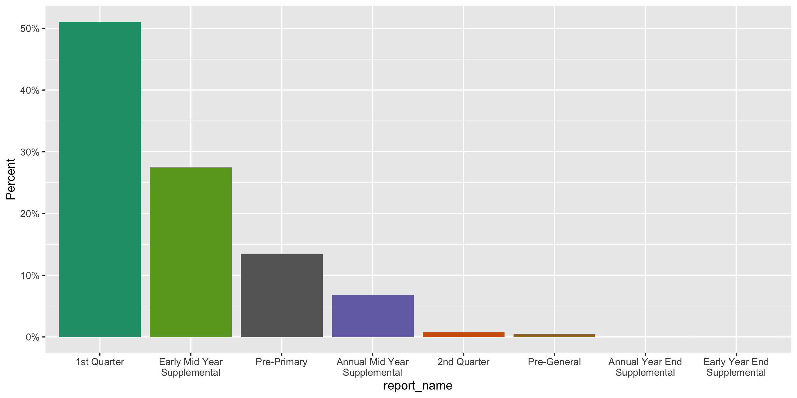
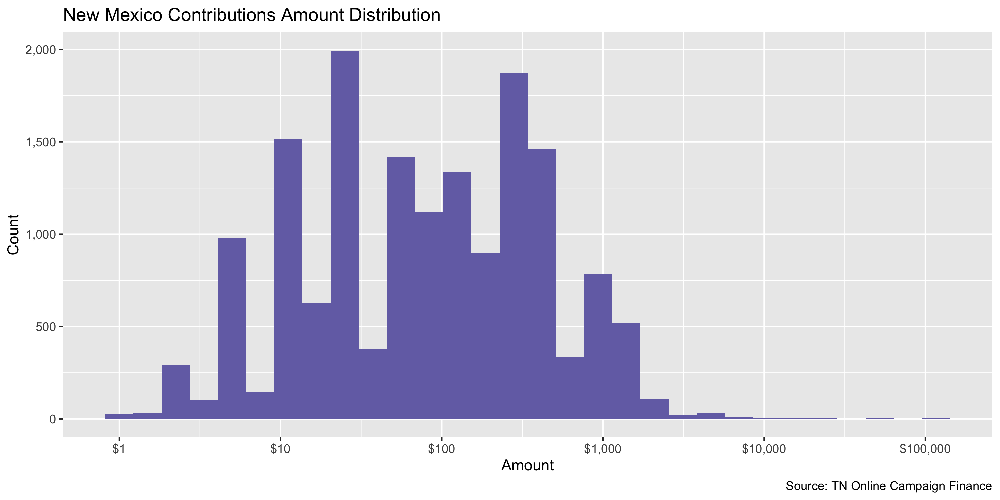
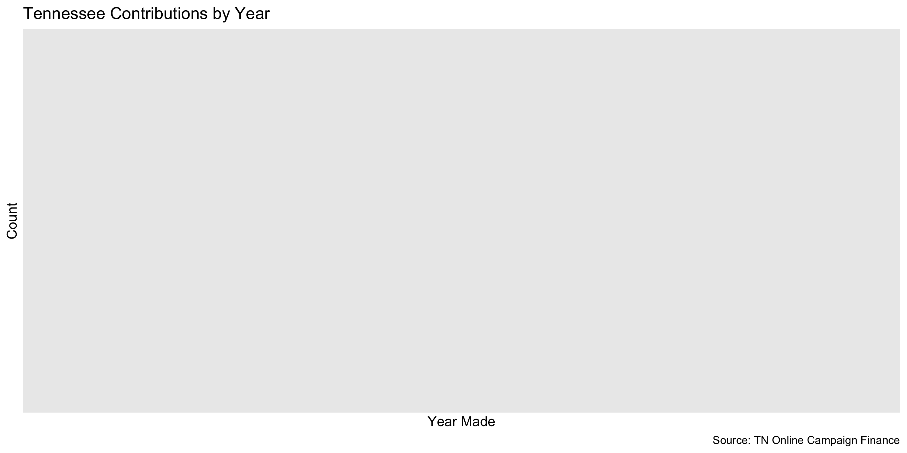

TN Contributions
================
Kiernan Nicholls, Julia Ingram & Yanqi Xu
2023-09-17 16:39:20

- [Objectives](#objectives)
- [Packages](#packages)
- [Export](#export)

<!-- Place comments regarding knitting here -->

## Objectives

This document describes the process used to complete the following
objectives:

1.  How many records are in the database?
2.  Check for duplicates
3.  Check ranges
4.  Is there anything blank or missing?
5.  Check for consistency issues
6.  Create a five-digit ZIP Code called `zip`
7.  Create a `year` field from the transaction date
8.  Make sure there is data on both parties to a transaction

## Packages

The following packages are needed to collect, manipulate, visualize,
analyze, and communicate these results. The `pacman` package will
facilitate their installation and attachment.

The `campfin` package will also have to be installed from GitHub. This
package contains functions custom made to help facilitate the processing
of campaign finance data.

``` r
if (!require("pacman")) {
  install.packages("pacman")
}

pacman::p_load(
  tidyverse,
  lubridate,
  janitor,
  campfin,
  aws.s3,
  refinr,
  scales,
  rvest,
  here,
  httr,
  cli,
  fs
)
```

This document should be run as part of the `R_campfin` project, which
lives as a sub-directory of the more general, language-agnostic
[`irworkshop/accountability_datacleaning`](https://github.com/irworkshop/accountability_datacleaning "TAP repo")
GitHub repository.

The `R_campfin` project uses the [RStudio
projects](https://support.rstudio.com/hc/en-us/articles/200526207-Using-Projects "Rproj")
feature and should be run as such. The project also uses the dynamic
`here::here()` tool for file paths relative to *your* machine.

``` r
# where does this document knit?
here::here()
#> [1] "/Users/yanqixu/code/accountability_datacleaning"
```

``` r
tn_dir <- dir_create(here("state","tn", "contribs", "data", "raw"))
tn_csv <- dir_ls(tn_dir, glob = "*.csv")
tn_yrs <- as.numeric(unique(str_extract(tn_csv, "\\d{4}")))
```

### Import

Data is obtained from the [Tennessee Bureau of Ethics and Campaign
Finance (BECF)](https://www.tn.gov/tref.html).

Data can be searched on the [BECF
portal](https://apps.tn.gov/tncamp-app/public/ceresults.htm) by year and
downloaded locally.

The last update was through Aug. 24, 2021. We will download data from
2021 to Sept. 17 2023, and use an `anti_join` to exclude 2021 data
already in the last update.

``` r
tn_csv <- dir_ls(tn_dir, glob = "*.csv")
```

### Read

We will first use `purrr::map()` to use `readxl::read_excel()` and
create a list of data frames. read together ———————————————————–

``` r
tnc <- map_df(
  .x = tn_csv,
  .f = function(x) {
    with_edition(
      edition = 1,
      code = read_delim(
        file = x,
        delim = ",",
        escape_backslash = FALSE,
        escape_double = FALSE,
        col_types = cols(
          .default = col_character(),
          `Amount` = col_number(),
          # 09/32/2020, 07/24/15, 5/6/14
          # `Date` = col_date("%m/%d/%Y"),
          `Election Year` = col_integer()
        )
      )
    )
  }
)

tnc <- clean_names(tnc, case = "snake")
n_distinct(tnc$type) == 2
#> [1] TRUE
```

fix dates with lubridate invalid dates with be removed

``` r
tnc <- mutate(tnc, across(date, mdy))
```

We’ll then read in the previous processed 2001-2021 contributions data
to eliminate duplicates in the new `tnc` files

``` r
prev_dir <- here("state","tn", "contribs", "data", "previous")
prev_csv <- dir_ls(prev_dir, glob = "*.csv")
tnc_prev <- read_csv(prev_csv)
```

``` r
tnc_prev <- tnc_prev %>% select(-c(13:19))
tnc <- tnc %>% 
  anti_join(tnc_prev)
```

### Date

fix dates with `lubridate`  
invalid dates with be removed

``` r
tnc <- mutate(tnc, across(date, mdy))
```

split address ———————————————————–

``` r
x3 <- tnc %>%
  distinct(contributor_address) %>%
  separate(
    col = contributor_address,
    into = c("addr_city", "state_zip"),
    sep = "\\s,\\s(?=[^,]*,[^,]*$)",
    remove = FALSE,
    extra = "merge",
    fill = "left"
  ) %>%
  separate(
    col = state_zip,
    into = c("state", "zip"),
    sep = ",\\s(?=\\d)",
    extra = "merge",
    fill = "left"
  )

good_split <- filter(x3, state %in% valid_abb)
bad_split <- filter(x3, state %out% valid_abb)
```

fix split ————————————————————— mising something in the middle, move and
re-split

``` r
no_zip <- bad_split %>%
  filter(is.na(state) & is.na(addr_city) & str_detect(zip, "\\s\\w{2}$")) %>%
  select(-addr_city, -state) %>%
  separate(
    col = zip,
    into = c("addr_city", "state"),
    sep = "\\s?,\\s?(?=[^,]*$)",
    extra = "merge",
    fill = "right"
  )
```

remove fixed from bad

``` r
bad_split <- bad_split %>%
  filter(contributor_address %out% no_zip$contributor_address)
```

no zip, city-state moved to end, split-merge city into addr

``` r
no_zip <- bad_split %>%
  filter(!is.na(addr_city) & is.na(state) & str_detect(zip, "\\s\\w{2}$")) %>%
  separate(
    col = zip,
    into = c("city", "state"),
    sep = "\\s+,\\s"
  ) %>%
  unite(
    col = addr_city,
    ends_with("city"),
    sep = ", "
  ) %>%
  bind_rows(no_zip)

bad_split <- bad_split %>%
  filter(contributor_address %out% no_zip$contributor_address)
```

no state, addr moved to state, move to addr and remove state

``` r
no_state <- bad_split %>%
  filter(is.na(addr_city) & !is.na(state) & str_detect(zip, "^\\d{5,}")) %>%
  select(-addr_city) %>%
  rename(addr_city = state)

bad_split <- bad_split %>%
  filter(contributor_address %out% no_state$contributor_address)
```

combine everything and extract states

``` r
full_bad <- bad_split %>%
  filter(is.na(state) | nchar(state) != 2) %>%
  unite(
    -contributor_address,
    col = addr_city,
    sep = ", ",
    na.rm = TRUE
  ) %>%
  mutate(
    state = str_extract(addr_city, "^[A-Z]{2}$"),
    addr_city = na_if(str_remove(addr_city, "^[A-Z]{2}$"), "")
  )

bad_split <- bad_split %>%
  filter(contributor_address %out% full_bad$contributor_address)
```

remaining just have bad states in general

``` r
bad_split %>%
  count(state, sort = TRUE)
#> # A tibble: 0 × 2
#> # … with 2 variables: state <chr>, n <int>
```

recombine fixes and fill with empty cols

``` r
bad_fix <- bind_rows(no_zip, no_state, full_bad, bad_split)
bad_fix <- mutate(bad_fix, across(.fns = str_squish))

sample_n(bad_fix, 5)
#> # A tibble: 5 × 4
#>   contributor_address                               addr_city                           state zip  
#>   <chr>                                             <chr>                               <chr> <chr>
#> 1 MEMPHIS , TN                                      MEMPHIS                             TN    <NA> 
#> 2 P.O. BOX 615, COLDWATER , MS                      P.O. BOX 615, COLDWATER             MS    <NA> 
#> 3 446 JAMES ROBERTSON PKWY STE 200 , NASHVILLE , TN 446 JAMES ROBERTSON PKWY STE 200, … TN    <NA> 
#> 4 6 BATTERY ROAD #26-04, SINGAPORE, 49909           6 BATTERY ROAD #26-04, SINGAPORE    <NA>  49909
#> 5 PO BOX 2092CA, 92038-2902                         PO BOX 2092CA                       <NA>  9203…
```

recombine with good splits

``` r
tn_addr <- bind_rows(good_split, bad_fix)
tn_addr <- mutate(tn_addr, across(everything(), str_squish))
```

wrangle address ——————————————————— trim zip codes

``` r
tn_addr <- tn_addr %>%
  mutate(across(zip, normal_zip)) %>%
  rename(zip_norm = zip)
```

state already very good

``` r
prop_in(tn_addr$state, valid_state)
#> [1] 1
tn_addr <- rename(tn_addr, state_norm = state)
```

split address on last comma

``` r
tn_addr <- separate(
  data = tn_addr,
  col = addr_city,
  into = c("addr_sep", "city_sep"),
  sep = ",\\s?(?=[^,]*$)",
  remove = TRUE,
  extra = "merge",
  fill = "left"
)
```

normalize city

``` r
tn_city <- tn_addr %>%
  distinct(city_sep, state_norm, zip_norm) %>%
  mutate(
    city_norm = normal_city(
      city = city_sep,
      abbs = usps_city,
      states = c("TN", "DC"),
      na = invalid_city,
      na_rep = TRUE
    )
  )

tn_city <- tn_city %>%
  # match city against zip expect
  left_join(
    y = zipcodes,
    by = c(
      "state_norm" = "state",
      "zip_norm" = "zip"
    )
  ) %>%
  rename(city_match = city) %>%
  # swap with expect if similar
  mutate(
    match_abb = is_abbrev(city_norm, city_match),
    match_dist = str_dist(city_norm, city_match),
    city_swap = if_else(
      condition = !is.na(match_dist) & (match_abb | match_dist == 1),
      true = city_match,
      false = city_norm
    )
  ) %>%
  select(
    -city_match,
    -match_dist,
    -match_abb
  )
```

rejoin to address

``` r
tn_addr <- left_join(tn_addr, tn_city)

good_refine <- tn_addr %>%
  mutate(
    city_refine = city_swap %>%
      key_collision_merge() %>%
      n_gram_merge(numgram = 1)
  ) %>%
  filter(city_refine != city_swap) %>%
  inner_join(
    y = zipcodes,
    by = c(
      "city_refine" = "city",
      "state_norm" = "state",
      "zip_norm" = "zip"
    )
  )
```

add refined cities back

``` r
tn_addr <- tn_addr %>%
  left_join(good_refine, by = names(.)) %>%
  mutate(city_refine = coalesce(city_refine, city_swap))
```

normalize address with usps standard

``` r
tn_addr <- tn_addr %>%
  mutate(
    .keep = "unused",
    .before = city_sep,
    addr_norm = normal_address(
      address = addr_sep,
      abbs = usps_street,
      na = invalid_city,
      na_rep = TRUE
    )
  )

tn_addr <- distinct(tn_addr)
```

add back all split and cleaned addresses

``` r
tnc <- left_join(
  x = tnc,
  y = tn_addr,
  by = "contributor_address"
)

many_city <- c(valid_city, extra_city)
many_city <- c(many_city, "RESEARCH TRIANGLE PARK", "FARMINGTON HILLS")

progress_table(
  tnc$city_sep,
  tnc$city_norm,
  tnc$city_swap,
  tnc$city_refine,
  compare = many_city
)
#> # A tibble: 4 × 6
#>   stage           prop_in n_distinct prop_na n_out n_diff
#>   <chr>             <dbl>      <dbl>   <dbl> <dbl>  <dbl>
#> 1 tnc$city_sep      0.989       2419  0.0302   171    105
#> 2 tnc$city_norm     0.991       2406  0.0302   140     90
#> 3 tnc$city_swap     0.998       2356  0.0302    37     28
#> 4 tnc$city_refine   0.998       2355  0.0302    34     27
```

remove intermediary columns

``` r
tnc <- tnc %>%
  select(
    -city_sep,
    -city_norm,
    -city_swap
  ) %>%
  # consistent rename and reorder
  rename(city_norm = city_refine) %>%
  relocate(city_norm, .after = addr_norm) %>%
  rename_with(~str_replace(., "_norm", "_clean"))
```

explore —————————————————————–

``` r
glimpse(tnc)
#> Rows: 16,036
#> Columns: 16
#> $ type                   <chr> "Monetary", "Monetary", "Monetary", "Monetary", "Monetary", "Monet…
#> $ adj                    <chr> "N", "N", "N", "N", "N", "N", "N", "N", "N", "N", "N", "N", "N", "…
#> $ amount                 <dbl> 500.00, 500.00, 500.00, 500.00, 2500.00, 1000.00, 500.00, 2500.00,…
#> $ date                   <date> NA, NA, NA, NA, NA, NA, NA, NA, NA, NA, NA, NA, NA, NA, NA, NA, N…
#> $ election_year          <int> NA, NA, NA, NA, NA, NA, NA, NA, NA, NA, NA, NA, NA, NA, NA, NA, NA…
#> $ report_name            <chr> "Annual Mid Year Supplemental", "Annual Mid Year Supplemental", "A…
#> $ recipient_name         <chr> "TENNESSEE HIGHWAY CONTRACTORS PAC", "TENNESSEE HIGHWAY CONTRACTOR…
#> $ contributor_name       <chr> "MEADE EQUIPMENT LLC", "CLARKE CRANE LLC", "J & D EQUIPMENT HAULIN…
#> $ contributor_address    <chr> "2000 TRI CITIES CROSSING, KINGSPORT , TN, 37663", "215 RIVER HILL…
#> $ contributor_occupation <chr> NA, NA, NA, NA, NA, NA, NA, NA, NA, NA, NA, NA, NA, NA, "MANAGER",…
#> $ contributor_employer   <chr> NA, NA, NA, NA, NA, NA, NA, NA, NA, NA, NA, NA, NA, NA, "CLAYTON H…
#> $ description            <chr> NA, NA, NA, NA, NA, NA, NA, NA, NA, NA, NA, NA, NA, NA, NA, NA, NA…
#> $ addr_clean             <chr> "2000 TRI CITIES XING", "215 RIVER HILLS DR", "3470 WEST RICHMOND …
#> $ city_clean             <chr> "KINGSPORT", "NASHVILLE", "LEBANON", "JACKSON", "JACKSON", "KNOXVI…
#> $ state_clean            <chr> "TN", "TN", "TN", "TN", "TN", "TN", "TN", "TN", "TN", "MS", "TN", …
#> $ zip_clean              <chr> "37663", "37210", "37090", "38302", "38301", "37920", "38344", "37…
```

flag NA values

``` r
col_stats(tnc, count_na)
#> # A tibble: 16 × 4
#>    col                    class      n      p
#>    <chr>                  <chr>  <int>  <dbl>
#>  1 type                   <chr>      0 0     
#>  2 adj                    <chr>      0 0     
#>  3 amount                 <dbl>      0 0     
#>  4 date                   <date> 16036 1     
#>  5 election_year          <int>   6742 0.420 
#>  6 report_name            <chr>      0 0     
#>  7 recipient_name         <chr>      0 0     
#>  8 contributor_name       <chr>      0 0     
#>  9 contributor_address    <chr>      0 0     
#> 10 contributor_occupation <chr>    829 0.0517
#> 11 contributor_employer   <chr>    932 0.0581
#> 12 description            <chr>  15994 0.997 
#> 13 addr_clean             <chr>    486 0.0303
#> 14 city_clean             <chr>    484 0.0302
#> 15 state_clean            <chr>    487 0.0304
#> 16 zip_clean              <chr>    487 0.0304
key_vars <- c("date", "contributor_name", "amount", "recipient_name")
tnc <- flag_na(tnc, all_of(key_vars))
sum(tnc$na_flag)
#> [1] 16036
tnc %>%
  filter(na_flag) %>%
  select(all_of(key_vars)) %>%
  sample_n(10)
#> # A tibble: 10 × 4
#>    date   contributor_name    amount recipient_name                     
#>    <date> <chr>                <dbl> <chr>                              
#>  1 NA     BANNER, PAUL           25  JONES, JUSTIN                      
#>  2 NA     FLOYD, JOHN          1600  FITTERER, MATT                     
#>  3 NA     SURUMA, ASKIA         236. ELI LILLY & CO. PAC                
#>  4 NA     BLOOMFIELD, CYNTHIA    50  JONES, JUSTIN                      
#>  5 NA     KING, MISTY          1000  THOMPSON, JEFFREY NEIL             
#>  6 NA     DAVIS, CLINT         1125  TENNESSEE HEALTH CARE ASSN PAC     
#>  7 NA     FREEDMAN, ELLEN        25  JONES, JUSTIN                      
#>  8 NA     RUTHERFORD, LINDA     100  SOUTHWEST AIRLINES CO. FREEDOM FUND
#>  9 NA     ALEXANDER, KEITH        2  SOUTHWEST AIRLINES CO. FREEDOM FUND
#> 10 NA     MASON, CHARLES        250  DUNN, JAMES
```

count distinct values

``` r
col_stats(tnc, n_distinct)
#> # A tibble: 17 × 4
#>    col                    class      n         p
#>    <chr>                  <chr>  <int>     <dbl>
#>  1 type                   <chr>      2 0.000125 
#>  2 adj                    <chr>      2 0.000125 
#>  3 amount                 <dbl>   1401 0.0874   
#>  4 date                   <date>     1 0.0000624
#>  5 election_year          <int>      6 0.000374 
#>  6 report_name            <chr>      8 0.000499 
#>  7 recipient_name         <chr>    253 0.0158   
#>  8 contributor_name       <chr>  12707 0.792    
#>  9 contributor_address    <chr>  11392 0.710    
#> 10 contributor_occupation <chr>   4058 0.253    
#> 11 contributor_employer   <chr>   4551 0.284    
#> 12 description            <chr>     36 0.00224  
#> 13 addr_clean             <chr>  10667 0.665    
#> 14 city_clean             <chr>   2355 0.147    
#> 15 state_clean            <chr>     56 0.00349  
#> 16 zip_clean              <chr>   4289 0.267    
#> 17 na_flag                <lgl>      1 0.0000624
```

count/plot discrete

``` r
count(tnc, type)
#> # A tibble: 2 × 2
#>   type         n
#>   <chr>    <int>
#> 1 InKind      41
#> 2 Monetary 15995
count(tnc, adj)
#> # A tibble: 2 × 2
#>   adj       n
#>   <chr> <int>
#> 1 N     16020
#> 2 Y        16
explore_plot(tnc, report_name) + scale_x_wrap()
```

<!-- -->

flag duplicate values

``` r
tnc <- flag_dupes(tnc, everything())
mean(tnc$dupe_flag)
#> [1] 0.1756049
tnc %>%
  filter(dupe_flag) %>%
  select(all_of(key_vars)) %>%
  arrange(recipient_name)
#> # A tibble: 2,816 × 4
#>    date   contributor_name   amount recipient_name                                
#>    <date> <chr>               <dbl> <chr>                                         
#>  1 NA     LIVINGSTON, MARSHA    300 ANDERSON COUNTY DEMOCRATIC EXECUTIVE COMMITTEE
#>  2 NA     LIVINGSTON, MARSHA    300 ANDERSON COUNTY DEMOCRATIC EXECUTIVE COMMITTEE
#>  3 NA     ARTERBURY, JAMES       30 ASSOCIATIONS INC. PAC/ASSOCIA PAC             
#>  4 NA     BLACKBURN, MARK        55 ASSOCIATIONS INC. PAC/ASSOCIA PAC             
#>  5 NA     BOREK, SARA            20 ASSOCIATIONS INC. PAC/ASSOCIA PAC             
#>  6 NA     CORCORAN, KIM          33 ASSOCIATIONS INC. PAC/ASSOCIA PAC             
#>  7 NA     DESSAINTS, TIFFANY     20 ASSOCIATIONS INC. PAC/ASSOCIA PAC             
#>  8 NA     DUPREY, RONALD         52 ASSOCIATIONS INC. PAC/ASSOCIA PAC             
#>  9 NA     GREENWOOD, LEE         20 ASSOCIATIONS INC. PAC/ASSOCIA PAC             
#> 10 NA     GUNN, RUTH             20 ASSOCIATIONS INC. PAC/ASSOCIA PAC             
#> # … with 2,806 more rows
```

amounts —————————————————————–

``` r
summary(tnc$amount)
#>      Min.   1st Qu.    Median      Mean   3rd Qu.      Max. 
#>      0.48     25.00    100.00    308.93    250.00 116515.00
sum(tnc$amount <= 0)
#> [1] 0
```

min and max to and from same people?

``` r
glimpse(tnc[c(which.max(tnc$amount), which.min(tnc$amount)), ])
#> Rows: 2
#> Columns: 18
#> $ type                   <chr> "Monetary", "Monetary"
#> $ adj                    <chr> "N", "N"
#> $ amount                 <dbl> 116515.00, 0.48
#> $ date                   <date> NA, NA
#> $ election_year          <int> NA, 2022
#> $ report_name            <chr> "1st Quarter", "1st Quarter"
#> $ recipient_name         <chr> "TENNESSEE LEGISLATIVE CAMPAIGN COMMITTEE", "HEDRICK, ANDRA J."
#> $ contributor_name       <chr> "TENNESSEE REPUBLICAN PARTY STATE", "STEARNS, MICHAEL"
#> $ contributor_address    <chr> "95 WHITE BRIDGE RD STE. 414, NASHVILLE , TN, 37205", "301 N. MAIN…
#> $ contributor_occupation <chr> NA, "IT PROFESSIONAL"
#> $ contributor_employer   <chr> NA, "SUMNER COUNTY"
#> $ description            <chr> NA, NA
#> $ addr_clean             <chr> "95 WHITE BRIDGE RD STE 414", "301 N MAIN ST"
#> $ city_clean             <chr> "NASHVILLE", "SPRINGFIELD"
#> $ state_clean            <chr> "TN", "TN"
#> $ zip_clean              <chr> "37205", "37172"
#> $ na_flag                <lgl> TRUE, TRUE
#> $ dupe_flag              <lgl> FALSE, FALSE

tnc %>%
  filter(amount >= 1) %>%
  ggplot(aes(amount)) +
  geom_histogram(fill = dark2["purple"], bins = 30) +
  scale_y_continuous(labels = scales::comma) +
  scale_x_continuous(
    breaks = c(1 %o% 10^(0:6)),
    labels = scales::dollar,
    trans = "log10"
  ) +
  labs(
    title = "New Mexico Contributions Amount Distribution",
    caption = "Source: TN Online Campaign Finance",
    x = "Amount",
    y = "Count"
  )
```

<!-- -->

dates ——————————————————————-

``` r
tnc <- mutate(tnc, year = year(date))

min(tnc$date, na.rm = TRUE)
#> [1] "Inf"
sum(tnc$year < 2000, na.rm = TRUE)
#> [1] 0
max(tnc$date, na.rm = TRUE)
#> [1] "-Inf"
sum(tnc$date > today(), na.rm = TRUE)
#> [1] 0

tnc %>%
  filter(between(year, 2002, 2021)) %>%
  count(year) %>%
  mutate(even = is_even(year)) %>%
  ggplot(aes(x = year, y = n)) +
  geom_col(aes(fill = even)) +
  scale_fill_brewer(palette = "Dark2") +
  scale_y_continuous(labels = scales::comma) +
  scale_x_continuous(breaks = seq(2000, 2020, by = 2)) +
  theme(legend.position = "bottom") +
  labs(
    title = "Tennessee Contributions by Year",
    caption = "Source: TN Online Campaign Finance",
    fill = "Election Year",
    x = "Year Made",
    y = "Count"
  )
```

<!-- -->

\## Conclude

``` r
glimpse(sample_n(tnc, 1000))
#> Rows: 1,000
#> Columns: 19
#> $ type                   <chr> "Monetary", "Monetary", "Monetary", "Monetary", "Monetary", "Monet…
#> $ adj                    <chr> "N", "N", "N", "N", "N", "N", "N", "N", "N", "N", "N", "N", "N", "…
#> $ amount                 <dbl> 12.50, 250.00, 50.00, 434.84, 100.00, 75.00, 25.00, 25.00, 50.00, …
#> $ date                   <date> NA, NA, NA, NA, NA, NA, NA, NA, NA, NA, NA, NA, NA, NA, NA, NA, N…
#> $ election_year          <int> 2024, 2023, 2023, NA, 2022, NA, 2024, 2024, 2024, NA, 2023, 2023, …
#> $ report_name            <chr> "Early Mid Year Supplemental", "Pre-Primary", "Pre-Primary", "1st …
#> $ recipient_name         <chr> "JONES, JUSTIN", "FROST, DOMINIQUE", "PEARSON, JUSTIN J.", "ELI LI…
#> $ contributor_name       <chr> "BARANCIK, IVONNE", "MILLER, KAMILAH RHASAAN", "SCOTT, KEISHA", "D…
#> $ contributor_address    <chr> "1816 GOLDILOCKS LN, MANCHACA , TX, 78652", "2460 MONARCH BAY DR, …
#> $ contributor_occupation <chr> "REIMBURSEMENT COORDINATOR", "SR. COMPLIANCE MANAGER", "LAW ENFORC…
#> $ contributor_employer   <chr> "BEST EFFORT", "VERANO HOLDINGS CORP.", "SHELBY COUNTY GOVT", "ELI…
#> $ description            <chr> NA, NA, NA, NA, NA, NA, NA, NA, NA, NA, NA, NA, NA, NA, NA, NA, NA…
#> $ addr_clean             <chr> "1816 GOLDILOCKS LN", NA, "6155 CHRISTINA WOOD DR", "810 THORNBERR…
#> $ city_clean             <chr> "MANCHACA", NA, "BARTLETT", "ALPHARETTA", "TULLAHOMA", "MEMPHIS", …
#> $ state_clean            <chr> "TX", NA, "TN", "GA", "TN", "TN", "NC", "NC", "FL", "TN", "TN", "C…
#> $ zip_clean              <chr> "78652", NA, "38135", "30022", "37388", "38137", "27614", "28056",…
#> $ na_flag                <lgl> TRUE, TRUE, TRUE, TRUE, TRUE, TRUE, TRUE, TRUE, TRUE, TRUE, TRUE, …
#> $ dupe_flag              <lgl> FALSE, FALSE, FALSE, FALSE, FALSE, FALSE, FALSE, FALSE, FALSE, FAL…
#> $ year                   <dbl> NA, NA, NA, NA, NA, NA, NA, NA, NA, NA, NA, NA, NA, NA, NA, NA, NA…
```

1.  There are 16,036 records in the database.
2.  There are 2,816 duplicate records in the database.
3.  The range and distribution of `amount` and `date` seem reasonable.
4.  There are 16,036 records missing key variables.
5.  Consistency in geographic data has been improved with
    `campfin::normal_*()`.
6.  The 4-digit `year` variable has been created with
    `lubridate::year()`.

## Export

Now the file can be saved on disk for upload to the Accountability
server. We will name the object using a date range of the records
included.

``` r
clean_dir <- dir_create(here("state", "tn", "contribs", "data", "clean"))
clean_path <- path(clean_dir, "tn_contribs_20210825-20230917.csv")
write_csv(tnc, clean_path, na = "")
(clean_size <- file_size(clean_path))
#> 3.17M
```

### upload

``` r
aws_path <- path("csv", basename(clean_path))
if (!object_exists(aws_path, "publicaccountability")) {
  put_object(
    file = clean_path,
    object = aws_path,
    bucket = "publicaccountability",
    acl = "public-read",
    show_progress = TRUE,
    multipart = TRUE
  )
}
aws_head <- head_object(aws_path, "publicaccountability")
(aws_size <- as_fs_bytes(attr(aws_head, "content-length")))
unname(aws_size == clean_size)
```
