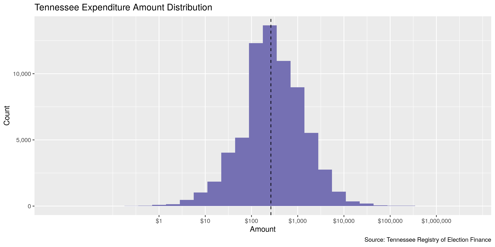
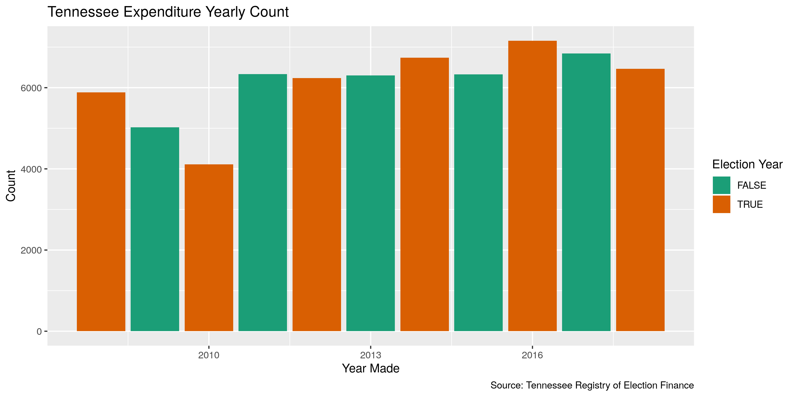

Tennessee Expenditures
================
Kiernan Nicholls
2019-11-11 11:47:10

<!-- Place comments regarding knitting here -->

## Project

The Accountability Project is an effort to cut across data silos and
give journalists, policy professionals, activists, and the public at
large a simple way to search across huge volumes of public data about
people and organizations.

Our goal is to standardizing public data on a few key fields by thinking
of each dataset row as a transaction. For each transaction there should
be (at least) 3 variables:

1.  All **parties** to a transaction
2.  The **date** of the transaction
3.  The **amount** of money involved

## Objectives

This document describes the process used to complete the following
objectives:

1.  How many records are in the database?
2.  Check for duplicates
3.  Check ranges
4.  Is there anything blank or missing?
5.  Check for consistency issues
6.  Create a five-digit ZIP Code called `ZIP5`
7.  Create a `YEAR` field from the transaction date
8.  Make sure there is data on both parties to a transaction

## Packages

The following packages are needed to collect, manipulate, visualize,
analyze, and communicate these results. The `pacman` package will
facilitate their installation and attachment.

The IRW’s `campfin` package will also have to be installed from GitHub.
This package contains functions custom made to help facilitate the
processing of campaign finance data.

``` r
if (!require("pacman")) install.packages("pacman")
pacman::p_load_gh("irworkshop/campfin")
pacman::p_load(
  tidyverse, # data manipulation
  lubridate, # datetime strings
  magrittr, # pipe opperators
  janitor, # dataframe clean
  batman, # convert logical
  refinr, # cluster and merge
  scales, # format strings
  knitr, # knit documents
  vroom, # read files fast
  glue, # combine strings
  here, # relative storage
  fs # search storage 
)
```

This document should be run as part of the `R_campfin` project, which
lives as a sub-directory of the more general, language-agnostic
[`irworkshop/accountability_datacleaning`](https://github.com/irworkshop/accountability_datacleaning "TAP repo")
GitHub repository.

The `R_campfin` project uses the [RStudio
projects](https://support.rstudio.com/hc/en-us/articles/200526207-Using-Projects "Rproj")
feature and should be run as such. The project also uses the dynamic
`here::here()` tool for file paths relative to *your* machine.

``` r
# where does this document knit?
here::here()
#> [1] "/home/kiernan/R/accountability_datacleaning/R_campfin"
```

## Import

Data is obtained from the [Tennessee Bureau of Ethics and Campaign
Finance (BECF)](https://www.tn.gov/tref.html).

Data can be searched on the [BECF
portal](https://apps.tn.gov/tncamp-app/public/ceresults.htm) by year and
downloaded locally.

``` r
raw_dir <- here("tn", "expends", "data", "raw")
dir_create(raw_dir)
```

### Read

``` r
tn <- map_df(
  .x = dir_ls(raw_dir),
  .f = read_delim,
  delim = ",",
  escape_double = FALSE,
  escape_backslash = FALSE,
  col_types = cols(
    .default = col_character(),
    Amount = col_number(),
    # date should be col_date_usa()
    # a couple hundred use two digit year
    Date = col_character(), 
    `Election Year` = col_integer()
  )
)

tn <- clean_names(tn, "snake")
tn <- mutate(tn, adj = to_logical(adj), support_lgl = equals(s_o, "S"))
```

## Explore

``` r
head(tn)
#> # A tibble: 6 x 13
#>   type  adj   amount date  election_year report_name candidate_pac_n… vendor_name vendor_address
#>   <chr> <lgl>  <dbl> <chr>         <int> <chr>       <chr>            <chr>       <chr>         
#> 1 <NA>  FALSE   18.9 01/1…            NA 1st Quarter NATIONAL CONSER… GODADDY.COM 14455 N. HAYD…
#> 2 <NA>  FALSE   43.0 01/1…            NA 1st Quarter NATIONAL CONSER… GODADDY.COM 14455 N. HAYD…
#> 3 <NA>  FALSE  120.  02/1…          2008 1st Quarter SWAFFORD, ERIC   PRINTING P… P.O. BOX 746,…
#> 4 <NA>  FALSE  500   01/1…          2008 1st Quarter MCCORMICK, GERA… AMERICAN H… 519 E. 4TH ST…
#> 5 <NA>  FALSE  750   01/2…          2008 1st Quarter MCCORMICK, GERA… HAMILTON C… N. MARKET STR…
#> 6 <NA>  FALSE  600   02/0…          2008 1st Quarter MCCORMICK, GERA… MEMORIAL F… 2525 DE SALES…
#> # … with 4 more variables: purpose <chr>, candidate_for <chr>, s_o <chr>, support_lgl <lgl>
tail(tn)
#> # A tibble: 6 x 13
#>   type  adj   amount date  election_year report_name candidate_pac_n… vendor_name vendor_address
#>   <chr> <lgl>  <dbl> <chr>         <int> <chr>       <chr>            <chr>       <chr>         
#> 1 Neit… FALSE 48500  05/1…            NA 2nd Quarter PROTECTIVE LIFE… NON TN EXP… P.O. BOX 2606…
#> 2 Neit… FALSE  2500  04/1…            NA 2nd Quarter JOBS PAC         LOWERY, MI… 761 HARBOR IS…
#> 3 Neit… FALSE  2500  04/1…            NA 2nd Quarter JOBS PAC         COMMITTEE … 215 PASADENA …
#> 4 Neit… FALSE  2500  04/1…            NA 2nd Quarter JOBS PAC         BILLINGSLE… 8439 FARRAH L…
#> 5 Neit… FALSE   101. 04/0…            NA 2nd Quarter CONCERNED AUTOM… TSYS MERCH… 1601 DODGE ST…
#> 6 Neit… FALSE   167. 05/0…            NA 2nd Quarter CONCERNED AUTOM… TSYS MERCH… 1601 DODGE ST…
#> # … with 4 more variables: purpose <chr>, candidate_for <chr>, s_o <chr>, support_lgl <lgl>
glimpse(sample_frac(tn))
#> Observations: 68,808
#> Variables: 13
#> $ type               <chr> "Neither", NA, NA, NA, NA, NA, NA, "Neither", NA, NA, "Neither", "Nei…
#> $ adj                <lgl> FALSE, FALSE, FALSE, FALSE, FALSE, FALSE, FALSE, TRUE, FALSE, FALSE, …
#> $ amount             <dbl> 2400.00, 500.00, 150.00, 136.56, 110.00, 195.96, 38.48, 500.00, 27.43…
#> $ date               <chr> "04/21/2011", "04/10/2015", "03/02/2016", "05/14/2013", "02/27/2014",…
#> $ election_year      <int> NA, 2016, 2014, 2014, 2014, 2018, 2016, NA, 2018, 2018, NA, NA, 2010,…
#> $ report_name        <chr> "Annual Mid Year Supplemental", "Early Mid Year Supplemental", "Annua…
#> $ candidate_pac_name <chr> "PLUMBERS LOCAL UNION 17 PAC", "FARMER, ANDREW ELLIS", "HASLAM, BILL"…
#> $ vendor_name        <chr> "TENNESSEE STATE PIPE TRADES ASSOCIATION PAC", "MUSEUM OF APPALACHIA"…
#> $ vendor_address     <chr> "3009 RIVERSIDE DRIVE, CHATTANOOGA , TN, 37406", "PO BOX 1189, NORRIS…
#> $ purpose            <chr> "CONTRIBUTION", "DONATIONS", "PROFESSIONAL SERVICES", "RESOLUTION FRA…
#> $ candidate_for      <chr> NA, NA, NA, NA, NA, NA, NA, NA, NA, NA, NA, NA, NA, NA, NA, NA, NA, N…
#> $ s_o                <chr> NA, NA, NA, NA, NA, NA, NA, NA, NA, NA, NA, NA, NA, NA, NA, NA, NA, N…
#> $ support_lgl        <lgl> NA, NA, NA, NA, NA, NA, NA, NA, NA, NA, NA, NA, NA, NA, NA, NA, NA, N…
```

### Missing

``` r
glimpse_fun(tn, count_na)
#> # A tibble: 13 x 4
#>    col                type      n       p
#>    <chr>              <chr> <dbl>   <dbl>
#>  1 type               chr   42998 0.625  
#>  2 adj                lgl       0 0      
#>  3 amount             dbl       0 0      
#>  4 date               chr    1292 0.0188 
#>  5 election_year      int   28186 0.410  
#>  6 report_name        chr       0 0      
#>  7 candidate_pac_name chr       0 0      
#>  8 vendor_name        chr     229 0.00333
#>  9 vendor_address     chr     282 0.00410
#> 10 purpose            chr       0 0      
#> 11 candidate_for      chr   68699 0.998  
#> 12 s_o                chr   68745 0.999  
#> 13 support_lgl        lgl   68745 0.999
```

``` r
tn <- tn %>% flag_na(amount, date, candidate_pac_name, vendor_name)
sum(tn$na_flag)
#> [1] 1521
mean(tn$na_flag)
#> [1] 0.02210499
```

### Duplicates

``` r
tn <- flag_dupes(tn, everything())
sum(tn$dupe_flag)
#> [1] 1634
mean(tn$dupe_flag)
#> [1] 0.02374724
```

### Categorical

``` r
glimpse_fun(tn, n_distinct)
#> # A tibble: 15 x 4
#>    col                type      n         p
#>    <chr>              <chr> <dbl>     <dbl>
#>  1 type               chr       4 0.0000581
#>  2 adj                lgl       2 0.0000291
#>  3 amount             dbl   19089 0.277    
#>  4 date               chr    4705 0.0684   
#>  5 election_year      int      16 0.000233 
#>  6 report_name        chr      10 0.000145 
#>  7 candidate_pac_name chr    1641 0.0238   
#>  8 vendor_name        chr   19419 0.282    
#>  9 vendor_address     chr   23983 0.349    
#> 10 purpose            chr    5525 0.0803   
#> 11 candidate_for      chr      47 0.000683 
#> 12 s_o                chr       4 0.0000581
#> 13 support_lgl        lgl       3 0.0000436
#> 14 na_flag            lgl       2 0.0000291
#> 15 dupe_flag          lgl       2 0.0000291
```

### Continuous

#### Amounts

``` r
summary(tn$amount)
#>    Min. 1st Qu.  Median    Mean 3rd Qu.    Max. 
#>       0     105     263    1336     900 4823880
```

<!-- -->

#### Dates

``` r
date_split <- str_split(tn$date, "/")
date_join <- rep(NA_character_, length(tn$date))
for (i in seq_along(date_split)) {
  year <- date_split[[i]][3]
  if (nchar(year) == 2 & grepl("^(0|1)\\d", year)) {
    date_split[[i]][3] <- paste0("20", year)
  }
  date_join[i] <- str_c(date_split[[i]][3], date_split[[i]][1], date_split[[i]][2], sep = "-")
}
prop_na(tn$date)
#> [1] 0.01877689
prop_na(date_join)
#> [1] 0.01877689
tn <- mutate(tn, date_fix = as.Date(date_join))
```

``` r
tn <- mutate(tn, year = year(date_fix))
```

``` r
count(tn, year)
#> # A tibble: 39 x 2
#>     year     n
#>    <dbl> <int>
#>  1    20     3
#>  2    69     1
#>  3  1008     1
#>  4  1012     1
#>  5  2000     4
#>  6  2001    11
#>  7  2003     1
#>  8  2004     5
#>  9  2005     3
#> 10  2006     7
#> # … with 29 more rows
```

``` r
min(tn$date_fix, na.rm = TRUE)
#> [1] "20-02-19"
sum(tn$year < 2008, na.rm = TRUE)
#> [1] 46
max(tn$date_fix, na.rm = TRUE)
#> [1] "3015-06-30"
sum(tn$date_fix > today(), na.rm = TRUE)
#> [1] 26
```

``` r
tn <- tn %>% 
  mutate(
    date_flag = year < 2008 | date_fix > today(),
    date_clean = as_date(ifelse(date_flag, NA, date_fix)),
    year_clean = year(date_clean)
  )
```

<!-- -->

## Wrangle

``` r
tn <- tn %>% 
  separate(
    col = vendor_address,
    into = c(glue("addr_split{1:5}"), "city_sep", "state_sep", "zip_sep"),
    sep = ",\\s",
    remove = FALSE,
    fill = "left"
  ) %>%
  unite(
    starts_with("addr_split"),
    col = "address_sep",
    sep = " ",
    na.rm = TRUE
  ) %>% 
  mutate_at(vars(ends_with("sep")), str_trim)
```

    #> # A tibble: 23,983 x 5
    #>    vendor_address                              address_sep            city_sep  state_sep zip_sep  
    #>    <chr>                                       <chr>                  <chr>     <chr>     <chr>    
    #>  1 HQ, MENLO PARK , CA, 94025                  HQ                     MENLO PA… CA        94025    
    #>  2 103 SUBURBAN RD, KNOXVILLE , TN, 37923      103 SUBURBAN RD        KNOXVILLE TN        37923    
    #>  3 109332 MURDOCK ROAD, KNOXVILLE , TN, 37932  109332 MURDOCK ROAD    KNOXVILLE TN        37932    
    #>  4 ONE TERMINAL DRIVE, NASHVILLE , TN, 37214   ONE TERMINAL DRIVE     NASHVILLE TN        37214    
    #>  5 1901 LINDELL AVE, NASHVILLE , TN, 37203-55… 1901 LINDELL AVE       NASHVILLE TN        37203-55…
    #>  6 12103 BUTTERNUT CIRCLE, KNOXVILLE , TN, 37… 12103 BUTTERNUT CIRCLE KNOXVILLE TN        37934    
    #>  7 607 MARLBORO, EAST RIDGE , TN, 37412        607 MARLBORO           EAST RID… TN        37412    
    #>  8 227 W DEPOT AVE, KNOXVILLE , TN, 37917      227 W DEPOT AVE        KNOXVILLE TN        37917    
    #>  9 214 MASSACHUSETTS AVE NE , WASHINGTON , DC… 214 MASSACHUSETTS AVE… WASHINGT… DC        20002    
    #> 10 10 CAMPBELL RD., MADISON , TN, 37115        10 CAMPBELL RD.        MADISON   TN        37115    
    #> # … with 23,973 more rows

### Address

``` r
tn <- tn %>% 
  mutate(
    address_norm = normal_address(
      address = address_sep,
      add_abbs = usps_street,
      na_rep = TRUE
    )
  )
```

``` r
tn %>% 
  select(starts_with("address")) %>%
  distinct() %>% 
  sample_frac()
#> # A tibble: 22,302 x 2
#>    address_sep               address_norm                        
#>    <chr>                     <chr>                               
#>  1 172 HORN SPRINGS ROAD     172 HORN SPRINGS ROAD               
#>  2 156 W MAIN ST             156 WEST MAIN STREET                
#>  3 90 WHITE BRIDGE ROAD      90 WHITE BRIDGE ROAD                
#>  4 6708 AMANDA WAY           6708 AMANDA WAY                     
#>  5 426 C STREET NE REAR BLDG 426 C STREET NORTHEAST REAR BUILDING
#>  6 250 5TH AVE SOUTH         250 5TH AVENUE SOUTH                
#>  7 COUNTRY CLUB RD           COUNTRY CLUB ROAD                   
#>  8 1306 W. G STREET          1306 WEST G STREET                  
#>  9 2263 YOUNG AVE #211       2263 YOUNG AVENUE 211               
#> 10 305 EAST SPRING ST.       305 EAST SPRING STREET              
#> # … with 22,292 more rows
```

### ZIP

``` r
tn <- tn %>% 
  mutate(
    zip_norm = normal_zip(
      zip = zip_sep,
      na_rep = TRUE
    )
  )
```

``` r
tn %>% 
  select(starts_with("zip")) %>% 
  filter(zip_sep != zip_norm) %>% 
  distinct() %>% 
  sample_frac()
#> # A tibble: 538 x 2
#>    zip_sep    zip_norm
#>    <chr>      <chr>   
#>  1 37132-0001 37132   
#>  2 02144-3132 02144   
#>  3 84115-4111 84115   
#>  4 37215-2622 37215   
#>  5 45271-2144 45271   
#>  6 37371-1642 37371   
#>  7 37027-4228 37027   
#>  8 37203-5038 37203   
#>  9 37206-2752 37206   
#> 10 75265-0575 75265   
#> # … with 528 more rows
```

``` r
progress_table(
  tn$zip_sep,
  tn$zip_norm,
  compare = valid_zip
)
#> # A tibble: 2 x 6
#>   stage    prop_in n_distinct prop_na n_out n_diff
#>   <chr>      <dbl>      <dbl>   <dbl> <dbl>  <dbl>
#> 1 zip_sep    0.962       3419 0.00410  2634    667
#> 2 zip_norm   0.995       2955 0.00573   310    115
```

## State

``` r
tn %>% 
  drop_na(state_sep) %>% 
  filter(state_sep %out% valid_state) %>% 
  count(state_sep, sort = TRUE)
#> # A tibble: 52 x 2
#>    state_sep      n
#>    <chr>      <int>
#>  1 NASHVILLE     17
#>  2 IR            13
#>  3 MEMPHIS        6
#>  4 KNOXVILLE      5
#>  5 BC             3
#>  6 CD             3
#>  7 ON             3
#>  8 OP             3
#>  9 SMYRNA         3
#> 10 WASHINGTON     3
#> # … with 42 more rows
```

``` r
# shift these all left 1
city_states <- which(tn$state_sep %in% zipcodes$city[zipcodes$state == "TN"])
tn$address_sep[city_states] <- tn$city_sep[city_states]
tn$city_sep[city_states] <- tn$state_sep[city_states]
tn$state_sep[city_states] <- "TN"
```

``` r
tn <- tn %>% 
  mutate(
    state_norm = normal_state(
      state = state_sep,
      abbreviate = TRUE,
      na_rep = TRUE,
      valid = valid_state
    )
  )
```

``` r
progress_table(
  tn$state_sep,
  tn$state_norm,
  compare = valid_state
)
#> # A tibble: 2 x 6
#>   stage      prop_in n_distinct prop_na n_out n_diff
#>   <chr>        <dbl>      <dbl>   <dbl> <dbl>  <dbl>
#> 1 state_sep    0.999         86 0.00437    55     33
#> 2 state_norm   1             54 0.00513     0      1
```

## City

``` r
tn <- tn %>% 
  mutate(
    city_norm = normal_city(
      city = city_sep,
      geo_abbs = usps_city,
      st_abbs = c("TN", "DC"),
      na = invalid_city,
      na_rep = TRUE
    )
  ) %>% 
  left_join(
    zipcodes, 
    by = c(
      "zip_norm" = "zip",
      "state_norm" = "state"
    )
  ) %>% 
  rename(city_match = city) %>% 
  mutate(
    match_dist = str_dist(city_norm, city_match),
    match_abb = is_abbrev(city_norm, city_match),
    city_swap = if_else(
      condition = match_abb | match_dist == 1,
      true = city_match,
      false = city_norm
    )
  )
```

``` r
progress_table(
  tn$city_sep,
  tn$city_norm,
  tn$city_swap,
  compare = valid_city
)
#> # A tibble: 3 x 6
#>   stage     prop_in n_distinct prop_na n_out n_diff
#>   <chr>       <dbl>      <dbl>   <dbl> <dbl>  <dbl>
#> 1 city_sep    0.975       1853 0.00446  1711    469
#> 2 city_norm   0.982       1815 0.00468  1260    419
#> 3 city_swap   0.993       1519 0.0162    482    130
```

## Conclude

1.  There are 68808 records in the database.
2.  There are 1634 duplicate records in the database (`dupe_flag`).
3.  The range and distribution of `amount` is reasonable.
4.  The range of `date` has been cleaned by removing 72 values in a new
    `date_clean` variable.
5.  There are 1521 records missing either `vendor_name` or `date`
    (`na_flag`).
6.  Consistency in geographic data has been improved with
    `campfin::normal_*()`.
7.  The 5-digit `zip_norm` variable has been created with
    `campfin::normal_zip()`.
8.  The 4-digit `year_clean` variable has been created with
    `lubridate::year()`.

## Export

``` r
proc_dir <- here("tn", "expends", "data", "processed")
dir_create(proc_dir)
```

``` r
tn <- tn %>%
  select(
    -year,
    -date_fix,
    -address_sep,
    -zip_sep,
    -state_sep,
    -city_sep,
    -city_norm,
    -city_match,
    -match_dist,
    -match_abb
  ) %>% 
  rename(
    address_clean = address_norm,
    zip_clean = zip_norm,
    state_clean = state_norm,
    city_clean = city_swap,
  )
```

``` r
tn %>% 
  write_csv(
    path = glue("{proc_dir}/tn_expends_clean.csv"),
    na = ""
  )
```

## Lookup

``` r
lookup_file <- here("tn", "expends", "data", "tn_city_lookup.csv")
if (file_exists(lookup_file)) {
  lookup <- read_csv(lookup_file) %>% select(1:2)
  tn <- left_join(tn, lookup, by = "city_clean")
}
```

``` r
progress_table(
  tn$city_clean,
  tn$city_clean_new,
  compare = valid_city
)
#> # A tibble: 2 x 6
#>   stage          prop_in n_distinct prop_na n_out n_diff
#>   <chr>            <dbl>      <dbl>   <dbl> <dbl>  <dbl>
#> 1 city_clean       0.993       1519  0.0162   482    130
#> 2 city_clean_new   0.994       1475  0.0162   382     89
```

``` r
tn %>% 
  select(-city_clean) %>% 
  rename(city_clean = city_clean_new) %>% 
  write_csv(
    path = glue("{proc_dir}/tn_expends_clean.csv"),
    na = ""
  )
```
